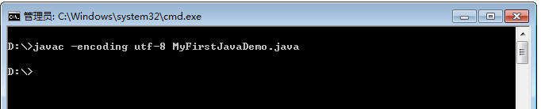
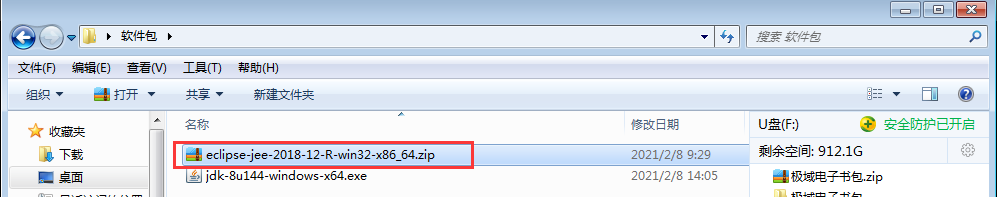
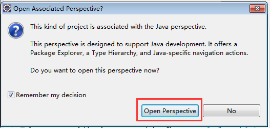

# 快捷键

## IDEA快捷键

fori+ tab 	for循环

sout + tab 	system.out.println()

psvm + tab 	system.out.println()

user.for+tab 	for each

user.getbirthday().var+tab	生成变量

ctrl + /   添加/取消单行注释

ctrl + shift + /   添加/取消多行注释

/** + enter 文档注释

ctrl+alt+l 格式化代码 

ctrl+alt+t 生成try catch

ctrl+alt+i 自动缩进 

alt + insert 新建

ctrl+alt+enter 向上插入空行

shift+enter 向下插入空行

home  移动光标到行首

end 移动光标到行尾

## Eclipse快捷键

| 快捷键            | 描述                                     |
| :---------------- | :--------------------------------------- |
| Ctrl+1            | 快速修复（解决导创，解决异常）、提示帮助 |
| Alt+/             | 自动补全                                 |
| Alt+向上箭头      | 向上移动代码                             |
| Alt+向下箭头向    | 下移动代码                               |
| Ctrl+D            | 删除代码                                 |
| Shift+向左箭头    | 选择鼠标左侧代码                         |
| Shift+向右箭头    | 选择鼠标右侧代码                         |
| f11               | 调试程序                                 |
| ctrl+f11          | 运行程序                                 |
| main + alt+ /     | main方法自动补全                         |
| sout+alt+/        | println方法自动补全                      |
| ctrl+/            | 添加单行注释、取消单行注释               |
| ctrl+shift +/     | 多行注释                                 |
| ctrl+shift+\      | 取消多行注释                             |
| ctrl+shift+f      | 格式化代码                               |
| ctrl+shift+o      | 自动导包                                 |
| alt+shift+s       | getter,setteer,toString;                 |
| alt+shift+l       | 自动生成方法返回值类型变量;              |
| alt+shift+z       | 添加执行条件，如if判断，try-catch;       |
| alt+shift+r       | 批量选择同名变量                         |
| alt+shift+j       | 文档注释、自动生成方法、类注释           |
| ctrl+shift+t      | 查看源码                                 |
| ctrl+alt+向上箭头 | 向上复制                                 |
| ctrl+t            | 查看类型的层次                           |
| ctrl+o            | 查看类的成员                             |

F6：逐行向下执行代码，特点：不进入下一个断点所在的方法内部；

F5：逐行向下执行代码，特点：会进入下一个断点所在方法内部；

F7：退出当前正常查看的方法，进入到上一层方法中；

F8：快速到达下一个断点位置进行调试。

# DOS常用命令

dos命令窗体：Windows系统中提供的一个用于 命令操作的控制台

## DOS命令窗口的打开

1、win+r——>输入cmd——>回车；

2、点击开始——>运行——>输入cmd——>回车；

3、任意目录下，按住shift——>点击右键——>在此处打开powershell窗口；

## 常见DOS命令

1、dir+回车：展示当前文件夹中所有子文件和子文件内容；

2、cd..+回车：回到上层目录；

3、cd/+回车：回到根目录（盘符）；

4、cd+指定目录+回车：进入到指定的目录中去，如果是进入到其他盘符，还需要使用盘符+:+回车的命令；

5、盘符+:+回车：切换盘符；

6、cls:+回车：清屏；

7、exit+回车：退出；

8、ping+ip地址+回车：查看服务器状态。

# Java语言的发展历程

## 一、Java语言的起源

1992年，从sun公司green小组开发的start7项目起源；

1993年，green小组决定方向：互联网；同年注册由c++、lisp、smalltalk等一系列语言开发的新语言，取名oak，由于oak已被注册，改名Java。

java之父：James gosling

1995年5月23日，Java正式公布。

## 二、Java语言的发展

1995年，Java正式诞生，但未发布任何开发相关的内容；

1996.1.23，jdk1.0发布；

1997.2.18，jdk1.1发布，推出just-in-time(即时编译)的编译器；

1998.12.8，jdk1.2发布，确定java未来的方向（对应Java平台开始更名为Java 2）

Java的开发方向：

1、J2SE：标准版，主要开发桌面应用，如eclipse、idea;

2、J2ME：微型版，开发嵌入式应用，如手机小程序、pos机、BB机；

3、J2EE：企业版，开发企业级应用，如各种管理系统、各种互联网项目。

2000.4.10，sun公司发布新的里程碑版本jdk1.5

1、提出了“易用性”的概念，

2、将Java的名字从Java2.0修改为Java，从此比哪有了java5、Java6、Java7......Java16的版版本名称。

2010.4.20，Java被Oracle收购，但sun公司仍然存在。


## 三、Java的技术组成

Java组成：Java编程语言+Java平台

Java编程语言的特点：

1、简单：抛弃c语言复杂的内容，资料广。

2、结构中立：在开发过程中可以和其他语言混合使用。

3、面向对象

4、分布式

5、可移植：可以在不同的操作系统上相互转移。

6、高性能：运行的效率快。

7、多线程

8、健壮性：Java自带异常处理机制，方便快速快速处理代码执行过程中遇到的问题。

9、安全性高：Java抛弃了指针的操作，不需要在回收内存。

10、动态编程语言：

**Java平台**

jdk：Java development kits Java开发工具包，组成：jre+api工具类。

jre：Java runtime environment Java运行环境，主要为Java程序提供运行环境，组成：jvm+核心类库。

jvm：Java virtual machine Java虚拟机，程序运行的平台。

jdk>jre>jvm(不同的操作系统上存在不同的jvm，一次编译，处处运行)


# jdk的环境搭建

## 一、搭建jdk的开发环境

jdk：Java开发工具包，

下载地址：https://www.oracle.com/java/technologies/javase/javase-jdk8-downloads.html

推荐使用jdk1.8，对应Java se8


安装：双击安装，推荐c盘


安装jre


如何校验是否安装成功？

dos命令窗口输入Java -version，弹出版本说明即安装成功


## 二、编写第一个Java程序

在“桌面”上，创建一个文件，取名：MyFirstJavaDemo，后缀名：.java

```java
public class MyFirstJavaDemo{
    public static void main(String[ ] args){
        System.out.println("Hellow World!");
    }
}
```

将MyFirstJavaDemo.java文件，复制到javac、Java所在路径，打开DOS命令窗体，在窗体中，输入javac MyFirstJavaDemo.java 命令，完成程序的编译


在DOS命令窗体中，输入java MyFirstJavaDemo 命令，运行该文件即可


## 三、常见错误：

1、.java后缀名没有使用小写，使用了大写；

2、当输出打印内容中有汉字时，确保汉字和英文符号的编码格式一致，在notepad++中写代码前先设置编码格式为ANSI，再写代码；（dos默认编码格式为GBK，notepad++默认编码为utf-8，可以在cmd中说明文件的编码格式从而保证解码正确）


3、输出内容要求显示换行效果时要用换行符号\r或\n，而不是直接在代码中直接敲换行。

4、类名要和文件名保持一致。

## Java虚拟机与Java解释器

Java是先编译成字节码再执行。Java虚拟机就是字节码运行的环境，通过Java虚拟机可以实现平台无关性，而Java解释器是将字节码解释为操作系统可以理解的原语执行。 Java解释器是虚拟机的实现。

`javac 程序是一个Java编译器。它把文件Welcome.java编译成Welcome.class。java程序启动Java虚拟机。虚拟机执行编译器放在class中的字节码文件。`


## 配置环境变量

目的：在于将Java的命令，上升到系统级别的命令

JAVA_HOME：java软件安装的目录

PATH：Java软件中命令所在的目录

CLASSPATH：编译后的CLass文件所在的目录

1、配置JAVA_HOME

首先，通过“我的电脑”、选择“属性” 、选择“高级系统设置”


2、配置PATH：在系统变量中，找到path选项，然后添加;%JAVA_HOME%\bin;

3、配置CLASSPATH


其中的.;（“.”表示当前路径，即在在dos窗口中打开的当目录下寻找字节码文件）

------

检验一下：



## 补充

环境变量JAVA_HOME 方便版本切换，后面使用Tomcat，必须要有JAVA_HOME，否则无法正常启动。

 PATH 在任何目录下使用java的相关命令，不配置只能在D:\develop\Java\jdk1.8.0_221\bin才能使用

 CLASS_PATH JDK1.6以后不需要配置 .; java HelloWorld jdk1.6之前运行编译后的Java代码，不会自动查找当前目录下的.class文件


环境配置错误重新配置方法：

使用新的工作空间，所有配置都会重置，重新配置。菜单栏中选择 Files->witch workspace->other...,然后选择要切换的工作空间，点击launch即可

# Java快速入门

## 一、Java文件的执行步骤：

1、编写Java源代码文件；

2、使用javac.exe对Java源代码文件编译，形成.class字节码文件；

3、使用java.exe启动jvm，jvm加载class字节码文件并执行文件中的内容。


## 二、Java文件的基本结构

```java
	public class 类名{
    	public static void main(String[ ] args){
            	Syetem.out.println("hello world");
        }
}
```

> 其中的类名，需要：首字母大写，见名知意(A、B、a……)
>
> main() 函数的结构固定，但是{}中的内容是可以修改的

## 课程小结

1. Java程序中，存放源代码的是.java文件，JVM最终的执行的是.class文件
2. .class文件是一个二进制文件，存放的是二进制的字节流，也被称为：字节码文件
3. javac.exe 是编译工具，java.exe 是Java程序的执行工具

# Java跨平台原理

## 一、编译与解释


java源代码从编译到执行需要经历`编译`和`解释`两个步骤。

编译：javac将源文件编译成字节码文件。

解释：jvm将字节码文件中的内容逐行解析成01组成的二进制信息。

所以Java是一门半编译半解释性的语言。

## 二、跨平台


j,字节码文件固定，不同的os对应的jvm虚拟机不固定，Jvm的作用：将一篇class文件解释给不同的操作系统。


jvm启动后由类加载器加载核心类库，再加载字节码文件（源文件编译后的class文件），然后类加载器校验字节码文件，没有问题后由解释器解释成本地代码（二进制），最后将二进制信息交于os.


## 拓展内容

JIT编译器：just-in-time及时编译器，普通解释器逐行逐行进行代码解释，性能较差，JIT解释器以方法为单位，一段一段进行解释，性能有所提高。

HotSpot引擎：热点探索引擎，jvm为了提升解释性能，会自动检索代码中的热点代码（使用频率高的代码），提前解释。

正因为JIT和HotSpot引擎，Java的性能才可以无限逼近纯解释性语言。

> # 解释器（Interpreter）
>
> ​    解释器顾名思义就是解释代码用的，上面提到了前端编译的最终产物是中间代码，这时的中间代码不具有被处理器识别并执行的能力，解释器的职责就是将此时的字节码逐条解释成处理器能够识别的机器码指令。所以从这里也可以解释，为什么高级语言执行效率会这么慢，主要就是多了这个解释的过程，像Java、Python等执行效率都比较慢。所以通俗讲：解释器在Java中的作用充当了Java程序和计算机之间的“翻译官”角色，将计算机“看”不懂的语言翻译成它能够“看”懂并执行的机器语言。
>
> # 及时编译器（JIT）
>
> ​    因为纯粹靠解释器来工作，效率会很慢，JVM引入了及时编译器JIT（Just In Time）的概念，它可以加快Java中部分代码的执行效率。下面简单介绍一下它的工作内容：
>
> ​    在我们日常编码中，经常会遇到有些方法执行频率很高，或者有些代码段执行频率很高（例如循环结构）。JVM会随着程序的不断执行，进行深入分析，将程序中那些执行频率比较高的方法或者代码段编译成机器码，然后将这段机器码缓存起来，这段代码也就是所谓的“热点”代码，HotSpot由此而得名。一旦代码被缓存，后续如果继续执行这段代码的时候，直接从缓存中获取这段机器码，就可以跳过前面的编译阶段，执行效率得到极大提高。请看下面这张图，很好地解释了JIT的工作原理：
>
> https://www.jianshu.com/p/96d65e8f4cbf#comments

# IDE集成开发环境

## 一、IDE工具介绍

常见Java集成开发工具：Eclipse、IDEA（公司使用最多）、NetBeans......

## 二、Eclipse安装

官网下载：https://www.eclipse.org/downloads/packages/


当然，也可以使用绿色免安装版本



## 三、Eclipse的使用

Eclipse是Java开发的，所以必须要安装jdk，才能运行。

1、点击Eclipse图标，启动Eclipse

2、设置源代码存放目录


3、创建Java项目


1）选择Java项目


2）设置项目名称，直接点击“Finish” 完成即可


3）打开“透视图”功能



## 四、认识项目结构


1、选中“src” ，创建包结构


> com.woniuxy.day02
>
> com 商业项目，org 开源组织，edu 教育项目，gov 政府项目
>
> woniuxy 代表公司/团队的名称
>
> day02 项目的名称

2、选中包，创建类


3、编写代码

```java
package com.woniuxy.day02;
public class MyFirstJavaDemo {
    public static void main(String[] args) {
        System.out.println("HelloWorld");
    }
}
```

1. 会自动编译 ，编译的代码在：项目的bin目录下

2. 运行代码的三种方式

   > 1. 在具有main()的类中，右键选中“Run AS ……”
   > 2. 点击启动键
   > 3. 使用快捷键 Ctrl + F11


## 五、Eclipse的常规设置

在Eclipse的Window菜单中，选中Preferences 打开工具的设置界面！

1. 设置项目的字符集（UTF-8）

   

2. 设置字体大小

   General -Apperance- Colors And Fonts - Basic - Text Font，通过Edit ，完成字体大小，字体种类的设置，建议：20大小

# 标识符

## 一、标识符

> 标识符：关键字、自定义的标识符

## 二、关键字

Java语法中，凡是不需要程序员定义，而且会自动变化颜色的符号，都是属于关键字

Java有50个关键字

|   abstract   |  boolean  |   break    |   byte    |    case    |
| :----------: | :-------: | :--------: | :-------: | :--------: |
|    catch     |   char    |   class    |   const   |  continue  |
|   default    |    do     |   double   |   else    |  extends   |
|    assert    |   final   |  finally   |   float   |    for     |
|     goto     |    if     | implements |  import   | instanceof |
|     int      | interface |    long    |  native   |    new     |
|   strictfp   |  package  |  private   | protected |   public   |
|    return    |   short   |   static   |   super   |   switch   |
| synchronized |   this    |   throw    |  throws   | transient  |
|     try      |   void    |  volatile  |   while   |    enum    |

const与goto都是C++遗留下来的关键字，但是Java程序员从不用它。const被final替换了，goto跳转指针用的，所以不用。Java还有3个保留字true false null。

> 面试官：const与goto是不是Java关键字？
> 答：是，但是我们不用

## 三、自定义标识符

自定义标识符：程序员自己定义的符号。

主要有：包名、类名、方法名、方法的参数名等等。

**命名硬性规则：**

1、标识符只能由字母、数字、_、$组成；

2、标识符不能以数字开头，严格区分大小写，长度不受限制；

3、标识符不能是Java的关键字

**命名潜在规则：**

1、类名、方法名、变量名遵循驼峰命名法，类名遵循大驼峰（若类名只有单个单词只需将单词首字母大写），其他的遵循小驼峰；

> 大驼峰：首字母大写，单词之间首字母大写，eg:UserBean、IntroduceSelf
>
> 小驼峰：首字母小写，单词之间首字母大写，eg:userName、studengtAge

2、取名时，必须见名知意；

3、常量的常量名必须全大写，单词之间用"_"分割；

> eg：MAPT_PI。

推荐：《阿里巴巴开发手册》

# 基本数据类型

## 一、数据类型

Java是一种严格的强类型的语言，其定义的任何变量都必须指定对应的数据类型，不能出现模糊的概念。

举例

```java
public static void main(string[]args){
    String name = "老蒲”；
    int age = 35；
}
```

java有2种数据类型，包括`基本数据类型`和`引用数据类型`。

## 二、基本数据类型

分为：整型、浮点型、字符型、布尔型

整型：btye、short、int、long

浮点型：float、double

字符型：char

布尔型：Boolean


取值范围及内存占用

计算机存储的最小单位为字节byte，1byte=8个二进制位。

| 数据类型     | 关键字  | 大小              | 取值范围                                                     |
| :----------- | :------ | :---------------- | :----------------------------------------------------------- |
| 字节型       | byte    | 1个字节（8位）    | -2<sup>7</sup>~2<sup>7</sup>-1(-128~127)                     |
| 短整型       | short   | 2个字节           | -2<sup>15</sup>5~2<sup>15</sup>-1（-32768~32767）            |
| 整型         | int     | 4个字节           | -2<sup>31</sup>5~2<sup>31</sup>-1（21亿）                    |
| 长整型       | long    | 8个字节           | -2<sup>63</sup>~2<sup>63</sup>-1                             |
| 单精度浮点型 | float   | 4个字节           | -3.402823e+38 ~ -1.401298e-45<br/>1.401298e-45 ~3.402823e+38 <br/>`aEb=a×10^b` |
| 双精度浮点型 | double  | 8个字节           | -1.797693e+308~ -4.9000000e-324 <br/> 4.9000000e-324 ~1.797693e+308 |
| 字符型       | char    | 2个字节           | \u0000~\uFFFF                                                |
| 布尔型       | boolean | 不确定，由jvm决定 | true false                                                   |

单精度双精度去别：小数位数不同，因此精度不同。(一般情况下float可以精确到小数点7位，double精确到小数点14位，但也受非小数部分位数的影响，eclipse输出格式(控制输出总位数，小数位数)也会影响显示结果)

**String是引用数据类型**

Java中默认整数为int型，小数默认为double型。

```java
public class TypeConversion {
	public static void main(String[] args) {
		float a = 13.2;
		long b = 22;
		System.out.println(a + b);
	}
}
```


`推荐float变量值后加F/f，long变量值后加l/L(推荐L)`

```java
public static void main(String[] args) {
    int num = 12;
    //如果定义Long类型的数值，尽量使用L | l
    long age = 35L;
    double income = 20.6;
    //如果定义Float类型的数值，尽量使用F | f
    float income02 = 20.6F;
    //字符类型的变量，在赋值时，需要使用''   千万不要使用""
    char a = '老';
    //布尔类型 只有2个值：true |  false
    boolean isMarry = true;
}
```

字符值要用单引号包起来，不能用双引号，双引号是用来包裹字符串的值的。（一个汉字占两个字节）

## 补充

1、浮点数值不适用于无法接受舍入误差的金融计算中。例如，命令System.out.println将打印出0.8999999999999999，而不是0.9。这种舍入误差的主要原因是浮点数值采用二进制系统表示，而在二进制系统中无法精确地表示分数1/10。这就好像十进制无法精确地表示分数1/3一样。如果在数值计算中不允许有任何舍入误差，就应该使用BigDecimal类，本章稍后将介绍这个类。

2、float有效位数为6~7位、double有效位数为15位（float的2倍，故称双精度）

3、转自序列由\和字母或符号组成，其Unicode编码值位\u+4位16进制数，可以出现在' '中（字面量）和" "中（字符串），即使是Unicode编码值，也会在代码解析之前处理。


# 变量

## 一、Java的注释

注释：注明解释的作用，附加作用：废弃代码（不让代码参与到编译）

Java中3种注释：单行注释，多行注释，文档注释

> 单行注释：使用//来完成，注释/说明一行代码（ctrl+/）
>
> 多行注释：使用/*  */来完成，注释/说明某几行代码（ctrl+shift+/，取消注释：ctrl+shift+\）
>
> 文档注释：使用/**  */来完成，注释/说明某一个类的作用，某一个方法的作用（输入/**回车自动补全）

`单行注释或者多行注释，一般用在方法内部；而文档注释，一般用在类、或方法的注释。`

> 要求：
> 1.类、方法上一定要有文档注释；
>
> 2.代码上3-5行，一定要有一个多行注释释；
>
> 3.核心代码上，一定要有单行注释。

```java
package com.woniuxy.day02;

/**
 * 作用：讲解基本数据类型 作者： 蜗牛老蒲* 时间：2021-05-18
 */
public class BaseDataType {
	/**
	 * 主函数(程序的主入口)
	 * 
	 * @param args 系统参数
	 */
	public static void main(String[] args) {
		/* 以下代码，主要给大家演示：基本数据类型的使用 */
		int num = 12;
		// 如果定义Long类型的数值，尽量使用L | l
		long age = 35L;
		double income = 20.6;
		// 如果定义Float类型的数值，尽量使用F | f
		float income02 = 20.6F;
		// 字符类型的变量，在赋值时，需要使用'' 千万不要使用""
		char a = '老';
		// 布尔类型 只有2个值：true | false
		boolean isMarry = true;
	}
}
```

## 二、变量(variable)分类

变量：在一定范围内可以发生变化的量

变量分类：`局部变量（local variable）`和`全局变量（global variable）`

局部变量：仅在定义变量的方法内部有效。

```java
  /**
     * 主函数
     * @param args
     */
    public static void main(String[] args) {
        //局部变量
        int num = 10;
        System.out.println(num);
    }
```

全局变量：定义在类的内部方法外部的变量。

```java
package com.woniuxy.day02;
/**
 * 作用：讲解变量的使用
 * 作者：蜗牛老蒲
 *
 */
public class Variable {
    static double pi = 3.1415;
    /**
     * 主函数
     * @param args
     */
    public static void main(String[] args) {
        int num = 10;
        System.out.println(num);
        System.out.println(pi);
    }
    public static void calc() {
        System.out.println(pi);
    }
}
```

## 三、变量的定义

变量定义有2种格式：
格式1：数据类型 变量名 = 数据；

格式2：数据类型 变量名；

​			 变量名 = 数据；

```Java
int num;	
num = 10;
```

`变量定义后一定要赋值，否则编译会报错，提示变量未初始化。`

程序在定义变量完成之后，具体内存中做了什么呢？

1、在内存开辟一块内存空间；

2、给这片空间定义一个名字num；

3、定义num所对应的数据类型int；

4、将值10存储在num空间中。

**注意事项:**

1、定义Float类型的变量时，数值后请添加F I f；

2、定义Long类型的变量时，数值后请添加L | l；

3、使用变量前，一定先对变量进行赋初值；

4、在给变量赋值时，一定要考虑变量的取值范围；

5、在同一个{}中，不能定义相同名称的变量。

## 四、常量的定义

常量：永恒不变的量就是常量

常量分类：字面量常量、自定义常量

**字面量常量**：在代码中写死的常量即字面量常量。

１、整数常量1、7、10……

２、小数常量：3.14158……

３、字符常量：'A'、'B'……

４、字符串常量：＂abcs＂……

５、布尔型常量：turl false

6、空常量：null

```java
int a = 10; //a为变量，10为字面量（10即是字面量常量）
final int b = 10;  //b为常量，10为字面量（b即是自定义常量）
static str = "Hello World";  //str为变量，Hello World为字面量（Hello World即是字面量常量）
```


**课堂练习**

需求01：定义一个类WoniuIntroduce，在类中定义一个主函数，完成蜗牛的自我介绍

介绍的内容有：

姓名：String 年龄 ：age 地址：String 教师人数：int 平均工资：double

是否开启分校：boolean

```java
package com.woniuxy.day02;
/**
 * 作用：蜗牛完成自我介绍
 * 作者：蜗牛老蒲
 *
 */
public class WoniuIntroduce {
    /**
     * 主函数
     * @param args
     */
    public static void main(String[] args) {
        String name = "蜗牛学院";
        int age = 7;
        String address = "孵化园5号楼3-4楼";
        int teacherNum = 200;
        //平均工资
        double avgSalary = 10000.5;
        //第1种输出方式
        System.out.println("名称：" + name);
        System.out.println("年龄：" + age);
        System.out.println("地址：" + address);
        System.out.println("教师人数：" + teacherNum);
        System.out.println("平均工资：" + avgSalary);
        //第2种输出方式
        System.out.println("名称：" + name + "，年龄：" + age +"，地址：" + address);
    }
}
```

需求02：定义一个类CalcTool，在类中定义一个主函数，定义2个int类型的变量，并赋初值，使用System.out.println()输出2个数的和 ，差

```java
package com.woniuxy.day02;
/**
 * 作用：完成2个数求和，求差 作者：蜗牛老蒲
 *
 */
public class CalcTool {
    public static void main(String[] args) {
        int a = 10;
        int b = 20;
        int sum = a + b;
        System.out.println("a 加 b 的和：" + sum);
    }
}
```

# 隐式转换

概念：基本数据类型在参与运算的过程中，小容量的类型会自动向大容量的类型进行自动转型。（自动向上转型）

```java
/**
     * 主函数
     * @param args
     */
public static void main(String[] args) {
    //        byte a = 1;
    //        int b = 3;
    //        //a 在参与运算时，自动向int类型进行转换（隐式转换）
    //        int c = a + b;
    //        
    byte b = 1;
    short s = 2;
    int i = 3;
    long l = 4;
    float f = 3.14F;
    double d = 3.14;
    //自动向上转型(隐式转型)
    double dd = b + s + i + l + f + d; 
    System.out.println(dd);
}

```


隐式转换的方向：


1、8种基本数据类型种Boolean不能参与运算，其他7种都可以。

2、自动向上转型即隐式转换。

3、char类型的数据，在参与计算时，编译器会自动根据ASCII编码表进行转码，然后计算。

**课堂练习**

需求1：定义double类型的变量a，int类型变量b，请输出a + b 的和

```java
double a = 10.12;
int b = 11;
//double + int 最后的结果，一定是小数
System.out.println(a + b);

```

需求2：定义char类型的变量a，int类型变量b，请输出a + b的和

```java
char a = 'A';
int b = 10;
//结果是75，不是A10 
System.out.println(a + b);

```

**字符编码**

了解：

1、ASCII编码表，查看地址：http://ascii.911cha.com/

2、GB2312编码表 （国标） 在ASCII基础之上，统计了大概6K多个常见的汉字，以及周边国家的常见文字，但是繁体字，以及 镕

3、GBK编码表（国标扩展）在GB2312基础之上，添加繁体字，以及其他的亚洲文字

4、UTF-8编码表 （万国码）统计全世界的所有的文字

通过编码表，统计出来的字符的集合，被称为：字符集。

**课堂总结**

1. 基本数据类型中，boolean是无法参与运算的，其它7种都可以，包括char
2. 所有的byte，short，char 在参与运算时，会自动提升为int类型
3. 如果有一个操作数是long，那么结果将被提升为long
4. 如果有一个操作数是float，那么结果将被提升为float
5. 如果有一个操作数是double，那么结果将被提升为double

**易错的面试题**

场景1:

```java
byte b1 = 1;
byte b2 = 2;
//编译错误(原因是：byte 类型的东西，参与运算自动提升为：int)
byte b3 = b1 + b2;
System.out.println(b3);
short s1 = 1;
short s2 = 2;
//编译错误(原因是：short 类型的东西，参与运算自动提升为：int)
short s3 = s1 + s2;
System.out.println(s3);

```

场景2：

```java
byte b1 = 1;
byte b2 = b1 + 2;
//编译错误
System.out.println(b2);
short s1 = 1;
short s2 = s1 + 2;
//编译错误
System.out.println(s2);

```

场景3：

```java
byte b = 126 + 1;
System.out.println(b);
//编译错误
byte b1 = 127 + 1;
System.out.println(b1);
```


原因是：Eclipse自带的编译器，会自动校验常量的值。对于含有变量的，如byte b1 = 1;byte b2 = 2;byte b3 = b1 + b2;b3会出现编译错误，因为编译时会把byte 自动提升为int，不会考虑其正真的值，int的范围比byte大，有超出byte范围的可能，所以会报错。

---


# 强制转换

强制向下转型格式：小类型 变量 = (小类型)大类型变量名；

```java
double a = 3.14;
int b = (int)a;
System.out.println(b);
```

但是，容易出现问题：

```java
int i = 130    ;
byte j = (byte)i;
System.out.println(j);//结果是-126 丢失了精度

```

-126产生原因：精度丢失，i有4个字节，32位，强制转换为j后，前3个字节丢失，仅剩的最后一个字节的二进制转换为十进制变为-126。

Java默认不支持 自动向下转型，因为存在 丢失精度的风险。当然，如果程序员愿意自己承担风险，也可以使用(小类型)的方式，来完成强制向下转型！

# 进制转换

## 一、计算机底层执行原理


> 计算机中最小的存储单位是byte，最小的的最小的集成单位为bit(位)，8位构成1个字节，左侧是高位，右侧是低位。

## 二、进制

> 二进制：由01构成
>
> 八进制：由01234567构成
>
> 十进制：由0123456789构成
>
> 十六进制：由0123456789ABCDEF构成

## 三、进制转换

十进制负整数转换为二进制，最终的结果为补码，而不是原码或反码。

**正整数的转换规则：**

 不断的除2取余，余数就是我们的2进制数！正数的特点：原码，反码，补码 都是一样

```java
12 由10进制转成2进制        
    12/2 = 6 余0   （低位）        
    6/2  = 3 余0        
    3/2  = 1 余1       
    1/2  = 0 余1   （高位）      
    所以12的原，反，补都是： 0000 1100  （高位不够，就补0）

```

**负整数的转换规则：**

1. 负数的原码，先不考虑数值的符号，按照正常的转就可以，转完之后，将最高位(符号位)设置为1
2. 负数的反码，除了符号位以外的所有数值，0变成1，1变成0
3. 负数的补码，将反码 + 1 ，最后得到的就是补码
4. 最终得到的结果，就是负数的二进制数据

```java
-12 由10进制转成2进制       
    原码：先计算12的二进制，    
    得出0000 1100，将最高位设置为1，     
    得出1000 1100        
    反码：1111 0011        
    补码：将反码 + 1，
    得出补码        1111 0011
    加     0000 0001 
    等     1111 0100           
    最后的补码是：    1111 0100

```

**同理：**10进制转2进制，是除2取余，那么8进制，就是除8取余……

# 算术运算符

> 算数运算符：+  -   *   /   %

Java中的 + 号，除了可以求2个数的和，还可以用来完成字符串的拼接

```java
// 字符串在前，直接完成字符的拼接
System.out.println("2个数的和是：" + i + j);
//如果有()存在，在拼接时，优先执行()中的内容
System.out.println("2个数的和是：" + (i + j));
//字符串在后，先计算再拼接
System.out.println(i + j + "是2个数的和！");

```


# 赋值运算符

> 赋值运算符：=
>
> 复合赋值运算符：+=    -=   *=   /=  <<=   >>=  &=  |=  ^=  

## 一、赋值运算符

赋值运算符：= 将=右边的内容，赋值给=左边的变量

```java
int a = 10;//将10 这个值 通过 = 赋值给 a 这个变量

```

## 二、复合赋值运算符

```java
int i = 5;
i += 10;//i = i + 10; 的简写
System.out.println(i);
int j = 10;
j -= 1;
System.out.println(j);
int k = 12;
k *= 2;
System.out.println(k);
int g = 16;
g /= 4;
System.out.println(g);
int h = 13;
h %= 3;
System.out.println(h);
```

`注意：复合赋值运算符，自带强制类型转换功能`

```java
byte a = 120;
a += 20;//效果等同于： a = (byte)(a + 20);
System.out.println(a);
```

# 关系运算符

## 一、关系运算符

组成： >   <  >=  <=  !=  ==

| 运算符     | 语法       | 有效的数据类型                                             |
| :--------- | :--------- | :--------------------------------------------------------- |
| 小于       | <          | byte short int long float double char                      |
| 小于等于   | <=         | byte short int long float double char                      |
| 大于       | >          | byte short int long float double char                      |
| 大与等于   | >=         | byte short int long float double char                      |
| 等于       | ==         | byte short int long float double char boolean 引用数据类型 |
| 不等于     | !=         | byte short int long float double char boolean 引用数据类型 |
| instanceof | instanceof | 引用数据类型                                               |

关系运算得出的结果位true或false（Boolean型）

## 二、键盘录入

用Scanner类进行录入，但需提前导包。

```java
//格式
Scanner 容器名 = new Scanner(System.in);
int num = 容器名.nextInt();

```

```java
//开启一个键盘录入事件(先按照这些写法来)
Scanner scanner = new Scanner(System.in);
System.out.println("请输入第1个数字：");
//定义变量a ，接收用户输入第1个数字
int a = scanner.nextInt();
System.out.println("请输入第2个数字：");
int b = scanner.nextInt();
System.out.println("两个数的和是：" + (a + b));
System.out.println("请输入结束标记：");//End
//接收一个字符串
String str = scanner.next();//next() 读到 空字符结束     nextLine() 读到 回车就结束
System.out.println("用户输入的结束标记是：" + str);

```


# 自增运算符

## 一、自增运算符

> 自增运算符：++
>
> 作用：给自己+1
>
> ++在变量前：前缀增量运算；
>
> ++在变量后：后缀增量运算；

++不参与运算时，前缀和后缀效果一样。

++参与运算：++在前，先自加再参与运算；

​					  ++在后，先参与运算再自加。

```java
int i = 10;
int x = ++ i;//++ 在前，先自加，然后再参与运算
System.out.println(i);//11
System.out.println(x);//11
int j = 10;
int y = j ++;//++ 在后，先参与运算，然后再自加
System.out.println(j);//11
System.out.println(y);//10
```

**课堂分析**

需求1：

```java
int i = 10;
//10 + 12 + 12 + 10  (j最后的值)
//i = 11  12  11  10(i)
int j = i++ + ++i + i-- + --i;
System.out.println(i);
System.out.println(j);
```

需求2：

```java
int x = 5; int y = 10; int z = 4;
System.out.println(y *= x ++);
System.out.println(x);//6
System.out.println(y);//50
```

需求3:

```java
int x = 2; int y = 3; int z = 4;
//4 + 3 * 2
System.out.println(z + y++ * x);//10
System.out.println(x);//2
System.out.println(y);//4
System.out.println(z);//4

```

需求4：

```java
//int x = 5;
//5 * 6 = 30
//6 
System.out.println(x++ * x);//30
System.out.println(x);//6

```

需求5：

```java
int x = 5;
System.out.println(x * x++);//25
System.out.println(x);//6

```

**课堂练习**

1.定义3个变量a = 3; b = 5; c = 7; 计算：a++ * —b /—c + c++ * b 以及 a b c 最后的值

```java
int a = 3; int b = 5; int c = 7;

//3 4 / 6 + 6 4
//a = 4
//b = 4
//c = 6 7

System.out.println(a++ —b /—c + c++ b);
System.out.println(a);//4
System.out.println(b);//4
System.out.println(c);//7

```

2.如果变更为：a += a++  \*  --b /--c  +  c++ \* b, a、b、c 的值又是多少

```java
int a = 3; int b = 5; int c = 7;
//3 * 4 / 6 + 6 * 4
//a = 4
//b = 4
//c = 6  7
// a += s; 等同于： a = a + a++  *  --b /--c  +  c++ * b;
System.out.println(a += a++  *  --b /--c  +  c++ * b);
System.out.println(a);//29
System.out.println(b);//4
System.out.println(c);//7
```

---

--的运算规则等同于++。

Java运算遵循从左到右的顺序进行计算。比如：

```java
a += a++ * --b / --c + c++ *b;
//等价于
a=a+a++ * --b / --c + c++ *b;
//在=的右边，先依次确定每个变量的参与运算的值，最后计算结果。必须要依次确定每个变量的值，不能先确定乘除运算变量的值，再确定加减运算的值，因为Java的运算的从左到右依次进行。
```

# 位运算符

## 一、位运算符

> 位运算符：&(按位与 and)   |(按位或 or)   ^(异或 xor)   ~（取反 not）
>
> 位运算：是指按照数值的二进制位，一位一位的进行运算

### 1、按位与（和） **&**

```java
System.out.println(3 & 2);
//0000 0011
//0000 0010    &
//0000 0010     -- 2
```

`特点：同为1，才为1`

也可以针对：boolean值

```java
System.out.println(true & false);
System.out.println(true & true);
System.out.println(false & false);
System.out.println(false & true);

```

`特点：同为true才为true，其他为false`

### 2、按位或  **|**

```java
//按位或
System.out.println(3 | 2);
//0000 0011
//0000 0010       |
//0000 0011       3

```

`特点：有1，就是1`

也可以针对：boolean值

```java
//按位或
System.out.println(3 | 2);
System.out.println(true | false);
System.out.println(true | true);
System.out.println(false | false);
System.out.println(false | true | false | true);

```

`特点：有true，就是true`

### 3、按位异或   ^

```java
//按位 异或
System.out.println(3 ^ 2);
//0000 0011
//0000 0010     ^
//0000 0001

```

`特点：01为1，10也为1，11为0，00为0（相异才为1）`

也可以针对：boolean值

```java
//按位 异或
System.out.println(3 ^ 2);
System.out.println(true ^ false);
System.out.println(true ^ true);
System.out.println(false ^ false);
System.out.println(false ^ true ^ false ^ true);

```

`特点：相异为true，相同为false（真假为真、假真为真、真真为假，假假为假）`

### 4、 按位取反  ~

```java
//按位取反
System.out.println(~2);     //-1
//0000 0010
//1111 1101     ~   -3

```

`特点：将每一位0变1、1变0取反 但是不能放置在boolean值的前面`

**课堂练习**

需求1：4&5    3|6   6^7   ~5运算结果

```java
0000 0100
0000 0101      &
0000 0100      = 4

```

```java
3|6              
0000 0011//3                
0000 0110//6    |               
0000 0111//7

```

```java
6^7                
000 0110//6               
0000 0111//7   ^                
0000 0001//1

```

```java
~5                 
0000 0101//5    ~                 
1111 1010//-6

```

## 二、移位运算符

> 面试题：如何快速的将2变成8？
> 答：通过<<2位 (2 <<2) 

Java有3种移位运算符：左移<<、不考虑符号的右移>>、考虑符号的右移>>>

格式：`操作数  移位运算符  移位位数`

### 1、左移 <<

```java
//将1 左移2位
System.out.println(1 << 2);
//0000 0001
//0000 0100        4
//将2 左移2位
System.out.println(2 << 2);
//0000 0010
//0000 1000        8

```

`总结：向左移，移动后的结果为：移动的数乘以2的移位次方`

### 2、右移  >>

```java
//将16 右移2位
System.out.println(16 >> 2);
//0001 0000
//0000 0100      = 4
//将-16 右移2位(不移动符号，是个负数，那么就移位之后，还是个负数)
System.out.println(-16 >> 2);   // -4

```

`总结：移动后的结果为：移动的除以2的移位次方`

### 3、右移  >>>

```java
//将16 右移2位
System.out.println(16 >>> 2);
//将-16 右移2位(将符号位，都参与移位过程中，可能将变成一个正数)
System.out.println(-16 >>> 2);//0011 1111 1111 1111 1111 1111 1111 1100

```

`总结：如果是正数，移位方式等同于>>；但是如果是个负数，移位方式是：将符号位一起参与移位。并且自动提升为int类型。`

\>>：带符号右移。正数右移高位补0，负数右移高位补1

\>>>：无符号右移。无论是正数还是负数，高位通通补0。

**课堂练习**

需求1：

```java
byte b = 10;
练习下：b << 1      b >> 1       b >>> 1byte b = -10;
练习下：b << 1      b >> 1       b >>> 1

```

```java
10<<1	        
0000 1010//   <<1              
0001 0110//  22                  


10 >> 1                
0000 1010//   >>1               
0000 0101// 5                   


10 >>> 1               
0000 1010//   >>>1               
0000 0101// 5                        


-10 << 1        -10(-10win10计算机转换？？？)
```

# 逻辑运算符

## 一、逻辑和  &&

同为true，才为true

```java
/*以下代码，讲解逻辑运算符*/    
int a = 10;
int b = 12;
System.out.println(true && true);
System.out.println(true && false);
System.out.println(false && true);
System.out.println(false && false);
//true && true
System.out.println((a < b) && (a + 1 < b));
//false && true
System.out.println((a ++ > b) && a + 1 < b--);
System.out.println(a);//11
System.out.println(b);//12  说明：a + 1 < b-- 没有被执行
```

`逻辑运算符两侧不能放置数值，只能是Boolean值或Boolean表达式。`

逻辑和，也称为“短路和”，当&&前的Boolean表达式或Boolean值不满足条件时(false)，直接输出结果，&&后的代码不在执行。（保护机器性能）

按位与&前后的代码都会执行。

## 二、逻辑或  **||**

只要有一个为true，结果就为true

```java
int a = 10;
int b = 12;
System.out.println(true || true);
System.out.println(true || false);
System.out.println(false || true);
System.out.println(false || false);
//true || true
System.out.println((a < b) || (a + 1 < b));
//false || false || true
System.out.println((a ++ > b) || a + 1 > b-- || a == b);
System.out.println(a);//11
System.out.println(b);//11
```

逻辑或：又称“短路或”，执行　||　前的式子，只到找到true为止，找到true后，true后的代码不再执行。

## 三、逻辑非 ！

非正即假，非假即真

```java
System.out.println(!true);
System.out.println(!false);

```


**面试题**

> 面试题：& 与 && 的区别？
>
> 答：
>
> 1. & 是按位与， &&是逻辑与
> 2. & 是按照2进制位进行与的，而&& 是进行比较boolean值进行与的
> 3. & 不存在短路效果，而&& 是存在短路效果(只要前面的表达式为false，&& 后的表达式无需执行)

**练习题**

需求1：

```java
(true | false) || (false && true) && (true & false)  //true

```

需求2：

```java
int x = 10;
(x > 0) || (x-- != 10)  //true

```

需求3：

```java
short a = 10; 
short b = 5;
boolean test = !(a > b);//false

```

需求4：

```java
int x = 5,
y = 6,
z = -3;
boolean b = ((x + 3 > y) ^ (z >= y))  &&  !(x == 5 | ++ x == y)//false

```

**课后练习**

需求：有a b c d 参与 社区领导 投票活动，请根据 他们的投票结果，分析出最终结果：

ad 投 赞成票(true) bc 投 反对票(false)，请编写代码实现：

```Java
a && b || c && !d                 
!a || b && !c || d                       
(a | b) || (c & d)                   
(a & c) && (b | d)

```

```java
public class Operator {
	/**
	 * 主函数
	 * 
	 * @param args
	 */
	public static void main(String[] args) {
		// 赞成
		boolean a = true;
		// 反对
		boolean b = false;
		boolean c = false;
		boolean d = true;
		// false || false
		System.out.println(a && b || c && !d);
		System.out.println(!a || b && !c || d);
		System.out.println((a | b) || (c & d));
		System.out.println((a & c) && (b | d));

	}
}
```

## 补充

应用在布尔值上时，&和|运算符也会得到一个布尔值。这些运算符与&&和||运算符很类似，不过&和|运算符不采用“短路”方式来求值，也就是说，得到计算结果之前两个操作数都需要计算。

# 单分支和三元运算符

## 一、Java代码的执行顺序

> 默认情况下：Java代码的执行顺寻：从上到下，从左到右

3种情况下，代码默认执行顺序会发生改变：流程控制、循环控制、方法调用。

## 二、if单分支

单分支语法

```java
if（布尔表达式）{
   //语句块 
}
```

该条件：只能返回true，false。 当条件返回为true时，语句块才可以执行

## 三、if双分支

```java
if(布尔表达式){
    //语句块1
}else{
    //语句块2
}
```

当布尔表达式返回true时候，执行“语句块1”；反之，则执行“语句块2”

当if-else每个{ }中仅有一条语句时，{ }可以省略，不推荐这种写法

```java
if (num > 3)  
    System.out.println("true");
else  
    System.out.println("false");

```

## 四、三元运算符

三元(目)运算符：是if双分支的简化版，在特殊情况下可以替换if-else结果（特殊情况：双分支中只有1行代码，而且可以返回一个结果）

`语法：数据类型 变量 = （布尔表达式）？语句块1：语句块2；`

当布尔表达式位true时，语句块1执行；当布尔表达式为false时，执行语句块2。

```java
/*双分支*/
//键盘录入事件
Scanner scanner = new Scanner(System.in);
System.out.println("请输入1个数：");
//接这个数
int num = scanner.nextInt();
//如果输入的数是个正数，那么就执行 {} 中代码
if(num > 0) {
    System.out.println("今晚约么？");
}else {
    System.out.println("爬");
}
System.out.println("代码继续执行！！！！");
```

常见的3元运算符：

```java
/*三元运算符*/
Scanner scanner = new Scanner(System.in);
System.out.println("请输入1个数：");
int num = scanner.nextInt();
//三元运算符的格式
//        boolean flag = (num > 0) ? true : false;
String str = (num > 0) ? "同意，你安排" : "滚，走开些";
System.out.println(str);
```

> **易错实例：**
>
> ```java
> int i = 3 > 2 ? 1 : -1;
> boolean b = 3 >2 ? true : false;
> double d = 3 > 2 ? 3.14 : 2.14;
> String s = 3 > 2 ? "同意" : "拒绝";
> ```
>
> 此种写法是错误的，完全不符合语法，三元运算符本质仍然为运算符，一定会返回一个结果，所以要定义相应的变量去盛装。

## 五、局部代码块

仅作了解

代码块：由{ }包起来的代码。

局部代码块：写在main函数里面的{ }包裹的代码块。

```java
public static void main(String[] args) {
    /*局部代码块*/
    System.out.println("你好，小蜗牛们");
    //局部代码块
    {
        System.out.println("我是老瓢，现在在跟大家上课！");
    }
}

```

局部代码块中的变量仅在局部代码中起作用，局部代码运行完变量立即回收，而mian函数中的变量要在main执行完才回收。

```java
/*局部代码块*/
System.out.println("你好，小蜗牛们");
int n = 10;
//局部代码块
{
    int m = 10;
    System.out.println("我是老瓢，现在在跟大家上课！");
}

```

**课堂练习**

需求1：使用双分支，请输入一个数，然后判断“ 这个数”是不是个偶数；如果是，就输出是，如果不是，就输出不是

判断偶数的公式：100 % 2 == 0

```java
System.out.println("请输入一个整数：");
//定义键盘录入事件
Scanner scanner = new Scanner(System.in);
int num = scanner.nextInt();
//条件判断
if(num % 2 == 0) {
    System.out.println(num + "是个偶数");
}else {
    System.out.println(num + "是个奇数");
}
```

需求2：请输入一个年份，判断该年是否闰年(使用双分支)

计算公式：int num = 2020

 第一种情况，能够被400整除的一定是个闰年

 第二种情况，能够被4整除，但是不是被100整除

(num % 400 == 0) || (num % 4 == 0 && num %100 != 0)

```java
/*以下代码，判断某一年是否闰年*/
System.out.println("请输入一个年份：");
Scanner scanner = new Scanner(System.in);
int year = scanner.nextInt();
//        ​    第一种情况，能够被400整除的一定是个闰年
//
//        ​    第二种情况，能够被4整除，但是不是被100整除
//
//         (num % 400 == 0) || (num % 4 == 0  && num %100 != 0)
if((year % 400 == 0) || (year % 4 == 0  && year %100 != 0)) {
    System.out.println(year + "就是一个闰年！");
}else {
    System.out.println(year + "不是一个闰年！");
}
```

需求3：请使用三元运算符，改写上述的2题

```java
String str = num % 2 == 0 ? "是个偶数" : "是个奇数";
 System.out.println(str);
```

```java
String str = (year % 400 == 0) || (year % 4 == 0  && year %100 != 0) ? "是一个闰年" : "是一个平年";
 System.out.println(str);
```

## 补充

三元运算符也可以嵌套，解决一些复杂的问题，例如：

```java
int a = 11;
int b = 12;
System.out.println(a > b? "a大于b":(a  <b?"a小于b":"a等于b"));
```

# 多分支以及嵌套判断

## 一、if多分支

```java
if（布尔表达式1）{
    //代码块1
}else if(布尔表达式2){
     //代码块2
}else if(布尔表达式3){
     //代码块3
}else if ……{
     //代码块n
}else{
    //代码块 n + 1
}
```

执行流程

1、先判断 if 条件是否满足，如果满足则执行代码块1（其他的就不判断）；
2、如果不满足，就依次的执行 else if 中的布尔表达式，谁满足，就执行谁对应的代码块；
3.如果所有的 else if 都不满足，最后执行 else 中代码块。

**注意**

else是可以不写的 （推荐写上，它可以帮你兜底）

```java
public static void main(String[] args) {
    //语文得分
    int score = 59;
    if(score >= 80) {
        System.out.println("优秀");
    }else if(score >= 70) {
        System.out.println("良");
    }else if(score >= 60) {
        System.out.println("及格");
    }else {
        System.out.println("加油哦，亲，我等着你的下一次进步！！！");
    }
}

```

## 二、嵌套判断

嵌套判断：就是在if结构中，再次添加if结构

举例：判断3个数的大小关系，说明谁是最大的那个数

```java
public static void main(String[] args) {
    int a = 23;
    int b = 12;
    int c = 24;
    //先比较两个数，取最大数和最后的那个数进行比较
    //先比较a b
    if(a > b) {//a 大
        //嵌套if
        if(a > c) {
            System.out.println("最大值是：" + a);
        }else {
            System.out.println("最大值是：" + c);
        }
    }else {//a < b  b大
        if(b > c) {
            System.out.println("最大值是：" + b);
        }else {
            System.out.println("最大值是：" + c);
        }
    }
}

```

特别说明：尽量不要使用if else多层嵌套，最多不能超过3层

建议使用：**三元运算符** 或者 **&&**

**课堂练习**

需求1：根据年龄和成绩给学生进行评价：如果年龄大于等于20岁，60分以上 评及格，60分以下 评：通知回去补考；

如果年龄小于20岁，成绩大于等于 60分，夸奖他是个天才，成绩小于60分，告诉他 不要气馁，继续加油

**思路：**

age >= 20 && score >= 60 及格

age >= 20 && score < 60 回去补考

age < 20 && score >= 60 你真是个天才

age < 20 && score < 60 不要气馁，继续加油

```Java
public static void main(String[] args) {
    int age = 11;
    int score = 23;
    if(age >= 20 && score >= 60) {
        System.out.println("及格");
    }else if(age >= 20 && score < 60) {
        System.out.println("回去补考");
    }else if(age < 20  && score >= 60) {
        System.out.println("你真是个天才！");
    }else {
        System.out.println("不要气馁，继续加油！");
    }
}

```

# switch

> switch语法
>
> ```java
> switch(变量){
> case 值1：
>     //语句块1
>     break;
> case 值2：     
>     //语句块2 
>     break;
> case 值3：     
>     //语句块3 
>     break;        
> ……      
> default:      
>      //语句块
> }
> 
> ```
>
> **Switch的执行过程：**
> 1.当程序执行到Switch时，将变量的值与case值1进行比对，比对上了，那么就执行“语句块1”；
> 2.如果比对不上，就依次和下面的case其它值进行比对，谁比对上了，就执行谁的“语句块”代码；
> 3.如果1个都没比对上，执行default中的语句块代码；
>
> **举例：**
>
> 键盘上 录入2个值，以及录入一个 数学符号(+ - * /)，要求：根据用户的输入，完成对应的计算，并输出结果
>
> ```java
> public static void main(String[] args) {
>  int c = 0;
>  //定义键盘事件
>  Scanner scanner = new Scanner(System.in);
>  System.out.println("请输入第1个值");
>  //接第一个值
>  int a = scanner.nextInt();
>  //接操作符
>  System.out.println("请输入操作符号");
>  String r = scanner.next();
>  System.out.println("请输入第2个值");
>  //接第二个值
>  int b = scanner.nextInt();
>  //--------------上面是准备工作------------------
>  switch(r) {
>      case "+":
>          c = a + b;
>          break;//退出switch结果
>      case "-":
>          c = a - b;
>          break;//退出switch结果    
>      case "*":
>          c = a * b;
>          break;//退出switch结果
>      default:
>          c = a / b;
>          break;
>  }
>  System.out.println("最终的结果是：" + c);
> }
> ```
>
> 

**总结**：

1、switch中变量的数据类型可以是`byte`、`short`、`int`、`char`、`string`、`枚举`(string、枚举是jdk1.8开始提供的)（switch中的变量只能是32位以下的，所以不能是long型的变量）

2、default可以省略，建议写上（兜底）

3、break可以省略不写，省略会产生穿透现象，从匹配到的第一个case开始，第一个case及其之后的所有代码都执行，因为没有break，无法跳转。

4、switch结束的标志：break、代码执行完毕。

> 穿透实例
>
> ```java
> public static void main(String[] args) {
>  int c = 0;
>  //定义键盘事件
>  Scanner scanner = new Scanner(System.in);
>  System.out.println("请输入第1个值");
>  //接第一个值
>  int a = scanner.nextInt();
>  //接操作符
>  System.out.println("请输入操作符号");
>  String r = scanner.next();
>    System.out.println("请输入第2个值");
>     //接第二个值
>     int b = scanner.nextInt();
>     //--------------上面是准备工作------------------
>     switch(r) {
>     case "+":
>         c = a + b;
>         break;//退出switch结果
>     case "-":
>         c = a - b;
>     case "*":
>         c = a * b;
>     default:
>         c = a / b;
>         break;
>     }
>     System.out.println("最终的结果是：" + c);
> ```

**课堂总结**

什么时候使用if多分支，什么时候使用switch？

1.当判断的是某个区间范围，推荐使用if多分支

2.当判断某几个确定的数，推荐使用switch

**课堂练习**

需求：键盘输入年，月，日 3个值，请根据输入，判断你的输入是这一年的第几天

```java
public static void main(String[] args) {
    int sum = 0;
    /*从键盘上，接收：年月日*/
    Scanner scanner = new Scanner(System.in);
    System.out.println("请输入年：");
    int year = scanner.nextInt();
    System.out.println("请输入月：");
    int month = scanner.nextInt();
    System.out.println("请输入日：");
    int day = scanner.nextInt();
    //根据月份，向前推 前面几个月的天数 
    switch(month) {
        case 12: //2020-12-23
            sum += 30; 
        case 11: 
            sum += 31; 
        case 10: 
            sum += 30; 
        case 9: 
            sum += 31; 
        case 8: 
            sum += 31; 
        case 7: 
            sum += 30;
        case 6: 
            sum += 31;
        case 5: 
            sum += 30;
        case 4: //2020-4-19   31 + 28/29 + 31 + 19
            sum += 31;
        case 3:  //2020-3-19  28/29 + 31 + 19       
            //闰年
            if(year % 400 == 0 || (year % 4 == 0 && year % 100 != 0)) {
                sum += 29;
            }else {
                sum += 28;
            }
        case 2://2020-2-19       31 + 19
            sum += 31;
        case 1: //2020-1-19      19
            sum += day;
    }
    System.out.println(year + "-" + month + "-" + day + "是本年的第" + sum + "天！");
}
```

# for循环

## 一、for循环

语法：

```java
for(初始化条件；判断条件；控制条件){        循环内容；}
```

初始化条件：定义变量，变量一定要赋值

判断条件：条件表达式，循化进行的条件

控制条件：修改变量 i++  i--

循环内容：需要重复执行的语句

**执行顺序：**

1. 初始化条件 —> 判断退出循环的条件 —> 循环的内容 —> 控制条件

2. —> 判断退出循环的条件 —> 循环的内容 —> 控制条件

3. —> 判断退出循环的条件 —> 循环的内容 —> 控制条件

4. …… 退出

   

示例1：输出10次： I Love U

思路：

1. 创建一个类，编写一个main()
2. 在main()方法中，定义一个for循环
3. 初始化条件是i = 1，判断条件：i <= 10 ;控制条件：i++
4. 循环的内容是：System.out.println(“I Love U !”)

```java
for(int i = 1;i <= 10; i ++) {
    System.out.println("I Love U!");
}

```

示例2：在控制台输出1-10以内的数字

思路：

1. 创建一个类，编写一个main()
2. 在main()方法中，定义一个for循环
3. 初始化条件是i = 1，判断条件：i <= 10 ;控制条件：i++
4. 循环的内容是：System.out.println(i)

```java
for(int i = 1;i <= 10; i ++) {
    System.out.println(i);
}

```

示例3：在控制台输出1-10的累加和 1 + 2 + 3 + 4 + …… +10

思路：

1. 创建一个类，编写一个main()
2. 在main()方法中，定义一个for循环
3. 初始化条件是i = 1，判断条件：i <= 10 ;控制条件：i++
4. 在for循环的外部，定义一个变量int sum = 0;
5. 循环的内容是：sum += i;
6. 循环外部，输出System.out.println(sum);

```java
//计算和
int sum = 0;
for(int i = 1;i <= 10; i ++) {
    sum += i;
}
System.out.println(sum);
```

示例4：输出1-100的偶数

思路：

1. 创建一个类，编写一个main()

2. 在main()方法中，定义一个for循环

3. 初始化条件是i = 2，判断条件：i <= 100 ;控制条件：i+=2

4. System.out.println(i);

   ```java
   for(int i = 2; i <= 100; i +=2){
       System.out.println(i);
   }
   ```

思路：

1. 创建一个类，编写一个main()

2. 在main()方法中，定义一个for循环

3. 初始化条件i =1，判断条件：i <= 100; 控制条件: i ++

4. 循环体的内容是

   ```java
   if(i % 2 ==0){
       System.out.println(i);
   }
   ```

```java
for(int i = 1;i <= 100; i ++) {
    if(i % 2 ==0){
        System.out.println(i);
    }
}
```

示例5：统计1-100以内，奇数的个数

思路：

1. 创建一个类，编写一个main()
2. 在main()方法中，定义一个for循环
3. 在for循环的外部，定义一个变量 int count = 0;
4. 初始化条件i =1，判断条件：i <= 100; 控制条件: i +=2
5. 循环体内部：count ++;
6. 在循环体外部输出：count

```java
int count = 0;
for(int i = 1; i <= 100; i +=2){
    count ++;    
}
System.out.println(count);
```

## 二、for变化体

初始化条件，可以放置在for循环的外部

```java
int i = 0;
for(;i <= 100; i ++) {
    System.out.println("I Love U!");
}
```

判断条件，也可以不写

```java
int i = 0;
for(;; i ++) {
    System.out.println("I Love U!");
    if(i > 100) {
        break;
    }
}
```

`break：跳出for循环`

控制条件，也可以不写

```java
int i = 1;
for(;;) {
    System.out.println("I Love U!");
    i ++;
    if(i > 100) {
        break;
    }
}
```

# while循环

**while循环格式：**

```java
初始化条件；
while(判断条件){
    //语句块
    控制条件；
}
```

**执行流程：**

1. 初始化条件 —> 判断条件 —> 循环内容 —> 控制条件

2. —> 判断条件 —> 循环内容 —> 控制条件

3. —> 判断条件 —> 循环内容 —> 控制条件

4. …… 不满足条件为止

   

示例

```Java
//初始化变量
int i = 1;
//判断条件
while(i <= 10) {
    //循环内容
    System.out.println("I Love U!");
    //控制条件
    i ++;
}
```

**课堂练习**

需求1：在控制台输出1-10的内容

思路

1. 定义一个类，类中编写一个main
2. 在main方法中，初始化变量int i = 1;
3. while(i <=10) 循环内容：System.out.println(i);
4. 控制条件是：i++

```Java
int i = 1;
while(i <= 10) {
    System.out.println(i);
    i ++;
}
```

需求2：打印1-10的累加和

思路

1. 定义一个类，类中编写一个main
2. 在main方法中，初始化变量int i = 1;
3. 定义一个变量int sum = 0
4. while(i <= 10) 循环内容：sum += i;
5. 控制条件：i ++;
6. 在while循环外部，输出sum

```Java
//初始化条件
int i = 1;
//存储累加和
int sum = 0;//1 + 2 + 3……
//执行while循环
while(i <= 10) {
    sum += i;
    //控制条件
    i ++;
}
System.out.println(sum);
```

需求3：请输出1-100以内的偶数和，以及统计有多少个偶数

思路：

1. 定义一个类，类中编写一个main

2. 在main方法中，定义3个变量：int i = 1; int sum = 0; int count = 0;

3. while(i <= 100) 循环语句

   ```Java
   if(i % 2 == 0){
       sum += i;
       count ++;
   }
   ```

4. if的外部，控制条件：i ++;

5. while循环的外部，输出：sum 以及 count

```Java
int i = 1;int sum = 0;int count = 0;
while(i <= 100) {
    //判断是否是偶数
    if(i % 2 == 0) {
        //求和
        sum += i;
        //统计
        count ++;
    }
    //控制条件
    i ++;
}
System.out.println(sum);
System.out.println(count);
```

# do while循环

**do while语法：**

```java
初始化条件；
do {
    //语句块
    //控制条件
} while(判断条件);
```

执行流程：

1、初始化条件——>执行do语句——>控制条件——>判断条件

2、件——>执行do语句——>控制条件——>判断条件

3、件——>执行do语句——>控制条件——>判断条件

4、……不满足条件，退出循环


举例说明：

需求：在控制台输出 100次 I Love U!

```Java
//初始化条件
int i = 1;
//定义循环体
do {
    System.out.println("I Love U！");
    //控制条件
    i ++;
} while(i <= 100);
```

**课堂练习**

需求1：在控制台输出1-10的数字

思路：

1. 先定义一个类，类中定义一个main()
2. 在main()中，初始一个变量 int i = 1;
3. 在do 结构中，System.out.println(i);
4. 控制条件： i ++;
5. while(i <= 10)

```Java
int i = 1;
do {
    System.out.println(i);
    i ++;
} while(i <= 10);
```

需求2：求1-100以内的奇数的累加和，以及奇数个数

思路

1. 先定义一个类，类中定义一个main()

2. 在main()中，初始一个变量 int i = 1; int sum = 0; int count = 0;

3. 在do结构中，使用if进行判断

   ```Java
   if(i % 2 != 0){   
       sum += i;
       count ++; 
   }
   ```

4. 在if结构的外面，控制语句：i ++;

5. while(i <= 100);

6. 在while循环的外部，输出：sum count

```Java
//初始条件    和    个数
int i = 1;int sum = 0; int total = 0;
do {
    //判断i是否是一个奇数
    if(i % 2 != 0) {
        //求和
        sum += i;
        //计数
        total ++;
    }
    //控制条件
    i ++;
}while(i <= 100);
System.out.println(sum);
System.out.println(total);
```

**课堂总结**

> while 和do-while的区别在哪里？
>
> 答：while循环一定要先判断条件是否满足，满足条件才执行 循环体的代码
>
> do-while 循环先执行 循环体的代码，然后再进行条件判断
>
> 在有些地方：for while 被称为：先验循环 ； do-while 被称为： 后验循环

------

> for循环和while循环的区别在哪里？
>
> 答：
>
> 1. 都是属于先验循环，它们的循环体 和控制条件 可以一次都不执行
>
> 2. 循环体 和 控制条件 永远要比：判断条件 少执行一次
>
> 3. for循环默认情况下，它定义的初始化变量，循环完毕之后，就不能用了
>
>    ```Java
>    for(int i = 1; i <= 10; i ++){
>        System.out.println("I Love U!");
>    }
>    System.out.println(i);
>    ```

**总结：**当知道具体的循环次数时，就使用for循环；当不知道循环次数，但是知道终止的条件，就使用while循环

**二、死循环**

死循环：就是一直在循环执行 循环代码的 语句

死循环，都是由于我们程序员 编写代码有误，或者是逻辑混乱所导致的

```Java
boolean b = true;
while(b) {
    System.out.println("我喜欢你，出来吃了饭呗！");  
}
System.out.println("来：蜗牛吃蜗牛！");
```

解决方案：

```Java
//定义一个计数器
int count = 0;
boolean b = true;
while(b) {
    System.out.println("我喜欢你，出来吃了饭呗！");
    //变换计数器的值
    count ++;
    //根据计数器制定退出条件
    if(count == 101) {
        break;
    }
}

```

------

```Java
for(;;) {            
    System.out.println("来蜗牛吃蜗牛");                
}
```

解决方案：

```Java
for(int i = 1;;i++) {
    System.out.println("来蜗牛吃蜗牛");
    if(i == 11) {
        break;
    }
}
```

------

最经典的错误：

```Java
for(int i = 1;1 < 100 ;i++) {    
    System.out.println(0);
}
```

# 退出循环

重要程度：高

## 课程目标

1.掌握continue的使用
2.掌握break的使用

Java提供了2种，在循环体去主动退出循环的方式：break、continue

## 一、break 

break可以放置switch中，让它退出switch；还可以放置在循环中，让退出循环；break退出循环后，就不会再次进入到该循环

例子：现在有个渣男 张三 ，原本打算陪伴 老婆 100年，但是他失约了，在第30年，他就飞了

```Java
for(int i = 1; i <= 100; i ++) {
    System.out.println("说好的白头偕老！");
    if(i == 30) {
        System.out.println("第" + i+ "年， 焗油了！");
        break;
    }
}
System.out.println("这是循环的外部！");
```

## 二、continue

continue 继续，作用：`退出当次循环，进入到下一次循环`

例子：还是这个渣男 ，原本打算陪伴 老婆 100年，但是他失约了，变成了：每隔1年回来一次

```java
for(int i = 1; i <= 100; i ++) {
    if(i % 2 == 0) {
        continue;
    }
    //如果是偶数，下面这行代码将不会执行
    System.out.println("第" + i + "年，陪伴老婆！");
}
```

需要注意的是：

```java
for(int i = 1; i <= 100; i ++) {
    if(i % 2 == 0) {
        continue;
        System.out.println("约么？");
    }
    //如果是偶数，下面这行代码将不会执行
    System.out.println("第" + i + "年，陪伴老婆！");
}
```

上面的程序将抛出 编译错误，原因是：

continue 已经退出本次循环了，当然break 同理！

## 三、return

return：遇到return，`结束return所在的方法（return后的所在方法的语句不再执行）`

```java
for(int i = 1; i <= 100; i ++) {
    if(i % 2 == 0) {
        return;
    }
    //如果是偶数，下面这行代码将不会执行
    System.out.println("第" + i + "年，陪伴老婆！");
}
System.out.println("循环外的代码！");
```

上面的程序：使用了return ,导致System.out.println(“循环外的代码！”); 无法执行，原因是：

return 已经代表，main() 执行完毕了！

# 嵌套循环

如果有个需求，需要打印 99乘法表


分析可得：如果要完成上述的需求，我们需要 水平方向循环9次，每一行 垂直方向 也需要循环9次

这就出现了循环中，嵌套其他循环 最后：就得到我们的嵌套循环

> 需要注意的是：外层循环循环一次，内层循环可能执行N次

```java
//外层循环(控制行数)
for(int i = 1;i <= 9; i ++) {
    //内层循环(控制列数)
    for(int j = 1; j <= i; j ++) {
        //输出2个数的乘积
        System.out.print(j + "X" + i + "=" + (j * i) + " ");
    }
    //换行
    System.out.println();
}
```

System.out.print(); 输出完毕之后，不换行

System.out.println(); 输出完毕之后，需要换行

**课堂练习**

需求1：完成99加法表的实现

需求2：按图输出：


```java
public static void main(String[] args) {
		for (int i = 1; i <= 5; i++) {
			for (int j = 1; j <= i; j++) {
				System.out.print("*" + " ");
			}
			System.out.println();
		}
	}
```


需求3：按图输出


```java
public static void main(String[] args) {
		for (int i = 1; i <= 5; i++) {
			// 打印空格
			for (int j = 5; j > i; j--) {
				System.out.print(" " + " ");
			}
			// 打印*
			for (int k = 1; k <= 2 * i - 1; k++) {
				System.out.print("*" + " ");
			}
			// 换行
			System.out.println();
		}
	}
```

# 程序调试

断点设置：双击左侧边栏

## 一、debug调试模式

调试步骤

```java
/**
     * 主函数
     * @param args
     */
public static void main(String[] args) {
    int a = 4;
    int b = 5;
    System.out.println(a + b);
    System.out.println(a - b);
    System.out.println(a * b);
    System.out.println(a / b);
    //调用
    calc();
    System.out.println("大家好");
    System.out.println("大家好");
    System.out.println("大家好");
    System.out.println("大家好");
}
public static void calc() {
    for(int i = 1; i <= 10; i ++) {
        System.out.println(i);
    }
}
```


1、鼠标左键双击左边侧边栏添加“断点”，使用Debug模式进行启动程序，开始调试；

F6：逐行向下执行代码，特点：不进入下一个断点所在的方法内部；


F5：逐行向下执行代码，特点：会进入下一个断点所在方法内部；


F7：退出当前正常查看的方法，进入到上一层方法中；


F8：快速到达下一个断点位置进行调试。


# 数组基础

## 一、数组的概念与特点

数组：是一种存储空间连续、元素类型一致的一个装东西的容器。并且这个容器可以使用下标，或者叫素引，可以去进行检索。

概念补充：数组是一种数据结构，用来存储同一类型值的集合。

> 数组的特点：
>
> ​	1、存储空间是连续的；
>
> ​	2、元素的数据类型是一致的；
>
> ​	3、数组存储空间是有限的。

## 二、数组的声明和赋值

Java中数组声明：

1、声明一个数据类型的变量；

2、使用关键字new，对变量赋值并指定数组的大小。

```java
补充：int[ ] a 或 int a[ ]都可以，推荐int[ ] a
```

```java
String[ ] names;names = new String[100];
```

简化写法

```java
String[ ] name = new String[100];
```

> 语法格式
>
> 元素数据类型[ ] 变量名 = new 元素数据类型[数组大小]
>
> 元素的类型：既可以是`基本数据类型`，也可以是`引用数据类型`


byte / short / int / long 型数组元素默认值为0，float / double型数组元素默认值为0，char型数组元素默认值为空格，boolean型数组元素默认值为false，引用数据类型（eg:String）数组元素默认值为null

## 三、数组的使用

数组是通过下标，索引来进行使用：

```java
 /**
     * 主函数
     * @param args
     */
    public static void main(String[] args) {
        // TODO Auto-generated method stub
        int[] nums = new int[10];
        //给数组中的元素位置进行赋值(通过下标，下标从0开始)
        nums[0] = 12;
        nums[1] = 13;
        nums[2] = 4;
        nums[4] = 24;
        int a = nums[1];
        System.out.println(nums[0]);
        System.out.println(nums[1]);
        System.out.println(nums[2]);
        System.out.println(nums[3]);//3号位置，默认是0
        System.out.println(nums[4]);
        System.out.println(nums);
    }
```

如果元素类型是：引用数据类型，那么默认值是null

```java
//定义一个长度为100的String类型的数组
String[] names = new String[100];
names[0] = "张三";
names[1] = "李四";
names[2] = "王五";
System.out.println(names[0]);
System.out.println(names[1]);
System.out.println(names[2]);
System.out.println(names[3]);
System.out.println(names[4]);
```

# 引用数据类型

常见的应用数据类型：类、接口、数组、枚举……（基本数据类型之外的都属引用数据类型）

举例:

```java
int[] nums = new int[100];nums[0] = 12;
```

栈和堆对应两块存储空间

栈：上开下闭的数据结构

堆：

引用数据类型固定大小为4个字节(存储地址)

> 了解：
>
> 栈中放置正在执行的方法，以及方法中的变量，
>
> 基本数据类型变量有多大就定义多大，其值和变量放置在一起，栈中的引用数据类型变量只有4个字节（用于放置引用对象的地址的值9527），引用对象在堆中，变量在栈中，靠地址的值来发生关系。


总结

1. 基本数据类型都是Java已经提供好了，而引用数据类型可能需要程序员自己定义；
2. 基本数据类型它的值和变量放在同一位置，而引用数据类型变量和值不在同一位置，是需要地址来发生引用；
3. 基本数据类型只能描述简单数据，引用数据类似可以描述复杂数据；
4. 基本数据类型的默认值是0，而引用数据类型的默认值是null。

# 数组的遍历

## 一、数组的补充

对于明确元素值的数组，可以在声明数组的同时进行赋初值，不用说明数组大小。

格式：`数据类型[ ] 变量 = {元素0值,"元素1值","元素2值","元素3值"}`

```java
int[ ] nums = {13,4,15,23,20};//等价于 
int[ ] nums = new int[5];
nums[0] = 13;
nums[1]=4；……
```

## 二、数组的遍历

**方式一：使用for循环遍历**

```java
//遍历数组
int[] nums = {11,23,34,1,2,5,12};
//使用for循环来进行遍历
//获得数组的长度(通过length属性，可以获得数组的长度)
int lenth = nums.length;
for(int i = 0; i < lenth; i ++){
    System.out.println(nums[i]);
}
```

**方式二：使用曾强for循环（for each循环）**

语法结构：

```java
for(数据类型 元素：数组){
    System.out.println(元素);
}
```

```java
String[] names = {"张三","李四","王五","赵六","田七"};
for(String name : names) {
    System.out.println(name);
}
```

总结：当需要下标时使用for循环遍历，不用下标时使用增强for循环遍历。

## 三、数组的最值

1、求数组中的最大值、最小值

**方法一：逐个比较确定最值**

```java
//遍历数组
int[] nums = {11,23,34,1,2,5,12};
//默认第1个值为最大值
int max = nums[0];
int lenth = nums.length;
for(int i = 1; i < lenth; i ++){
    //如果小于 下一个值 (那么下一个值就是 最大值)
    if(max < nums[i]) {
        max = nums[i];
    }
}
System.out.println("最大值是：" + max);
```

**方法二：确定最值下标，求得最值**

```java
//遍历数组
int[] nums = {11,23,34,1,2,5,12};
//默认第1个值的位置(下标)为最大值
int max = 0;
int lenth = nums.length;
for(int i = 1; i < lenth; i ++){
    //如果小于 下一个值 (那么下一个值就是 最大值)
    if(nums[max] < nums[i]) {
        max = i;
    }
}
System.out.println("最大值是：" + nums[max]);
```

## 四、数组中的基本查找

如何从数组中， 查找到一个元素

```java
int[] nums = {11,23,34,1,2,5,12};
//假设用户输入一个值为：5，问5是否在数组中？
int a = 2;
//定义一个变量 ，默认5不存在于数组中
int index = -1;
for(int i = 0; i < nums.length; i ++) {
    if(nums[i] == a){
        index = i;
        break;
    }
}
if(index == -1) {
    System.out.println("没找到");
}else {
    System.out.println("找到了，下标是：" + index);
}
```

## 五、数组的反转

反转前：{3,5,2,4,7}

反转后：{7,4,2,5,3}

```java
int[] nums = {11,23,34,1,2,5,12};
int lenth = nums.length;
//开始反转（lenth/2 代表需要交换的次数）
for(int i = 0; i < lenth/2; i ++) {
    //定义一个中间变量
    int temp = nums[i];
    nums[i] = nums[lenth - 1 -i];
    //实现交换
    nums[lenth - 1 -i] = temp;
}
//输出反转后的内容
for(int num : nums) {
    System.out.println(num);
}
```

## 六、数组的排序

排序前：{3,5,2,4,7}

排序后：{2,3,4,5,7}

**方式一：冒泡排序**：共循环数组长度-1轮，每轮两两交换位置，确定最大值，并将最大值放置在本轮最右边（升序）。


```java
int[] nums = {11,23,34,1,2,5,12};
//确定需要：循环经过lenth -1 轮，确定所有的排序
//每一轮 确定一个本轮 的最大值，并将最大值放置在最右边
int lenth = nums.length;
for(int i = 0; i < lenth -1; i ++) {
    //i 每变化一次，就是新的一轮
    for(int j = 0; j < lenth -1 - i; j ++) {
        //如果前一位 大于了 后一位
        if(nums[j] > nums[j + 1]) {
            /*通过临时变量，交换位置*/
            int temp = nums[j];
            nums[j] = nums[j + 1];
            nums[j + 1] = temp;
        }
    }
}
System.out.println("排序后");
for(int i = 0; i < lenth; i ++) {
    System.out.println(nums[i]);
}
```

**方式二：选择排序**：共循环数组长度-1轮，每轮确定最大元素或最小元素并记住其下标，通过下标将本轮最值元素与本轮第一个元素交换位置，最值元素放置在本轮元素最左边。


```java
int[] nums = {11,23,34,1,2,5,12};
//确定需要：循环经过lenth -1 轮，确定所有的排序
//每一轮 确定一个本轮 的最大值，并将最大值放置在最左边
int lenth = nums.length;
for(int i = 0; i < lenth -1; i ++) {
    //i 每变化一次，就是新的一轮
    //默认每一轮的开始元素，就是最大值
    int max = i;
    //确定本轮的最大下标
    for(int j = i + 1; j < lenth; j ++) {
        if(nums[max] < nums[j]) {
            max = j;
        }
    }
    //将最大值，放置在本轮最左边去
    if(max != i) {
        int temp = nums[i];
        nums[i] = nums[max];
        nums[max] = temp;
    }
}
System.out.println("排序后");
for(int i = 0; i < lenth ; i ++) {
    System.out.println(nums[i]);
}
```

## 补充：

冒泡排序：降序：最小最右；升序：最大最右。循环length-1轮，每轮从a[0]开始，a[length-1-i]结束；

选择排序：降序：最大最左；升序：最小最左。循环length-1轮，每轮从a[i]开始，a[length-1]结束；

# 数组的内存分析

## 一、数组内存图

1、一个数组的内存图

```java
int[] nums = new int[5];
nums[0] = 12;
nums[1] = 10;
```


2、二个数组的内存图：

```java
//第1个数组
int[] nums = new int[5];
nums[0] = 12;
nums[1] = 10;
//第2个数组
int[] nums02 = new int[3];
nums02[0] = 4;
nums02[1] = 6;
```


3、一个变量对应2个数组

相当于重新确定数组大小和内容，原先数组被覆盖。

```java
//第1个数组
int[] nums = new int[5];
nums[0] = 12;
nums[1] = 10;
//第2个数组
nums = new int[3];
nums[0] = 4;
nums[1] = 6;
```


4、两个数组指向同一个数组

`补充：相当于拷贝数组，两个变量引用同一个数组`

```java
//第1个数组
int[] nums = new int[5];
nums[0] = 12;
nums[1] = 10;
//第2个数组
int[] arrs = nums;//将nums变量的值，赋值给arrs这个变量
System.out.println(nums[0]);
System.out.println(nums[1]);
```


## 二、数组使用易犯错误

1、ArrayIndexOutOfBoundsException：数组下标越界异常。

```java
//第1个数组
int[] nums = new int[5];
nums[0] = 12;
nums[1] = 10;
nums[2] = 3;
nums[3] = 5;
nums[4] = 7;
//5 越界了
nums[5] = 9;
```

解决方案：操作下标，先判断一下下标是否<数据的长度。

2、NullPointerException:空指针指向异常。

```java
//第1个数组
int[] nums = new int[5];
nums[0] = 12;
nums[1] = 10;
nums = null;
nums[0] = 3;
System.out.println(nums[0]);
```


**课堂练习**

需求1：int[] nums = {12,34,23,12,45,67,34,27,29,34}; 要求：分别统计 奇数的个数，偶数的个数

思路：

1. 在main() 中，定义2个变量 int count01= 0 偶数; int count02 = 0; 奇数

2. 先获得数组的长度 int lenth = nums.length;

3. 根据长度遍历数组，在循环中使用

   ```java
   if(nums[i] % 2 ==0){
       count01 ++;
   }else{
       count02 ++;
   }
   ```

4. 最后，在循环外部，直接输出奇数的个数，偶数的个数

# 多维数组

## 一、二维数组的语法格式:

```java
数据类型[ ][ ] 变量名 = new数据类型[行数 ][列数 ];
```

二维数组的长度为数组的行数，可用length方法获取，因此遍历二维数组时需要获取每一行一维数组的长度，可通过再定义一个相同一维数组获取长度。

```java
//电影院的位置
int[][] seats = new int[5][5];
//赋值 (x,y)坐标的值
seats[0][0] = 25;
seats[3][3] = 56;
seats[3][4] = 55;
seats[4][4] = 35;
//遍历出来(使用2个for循环搞定)
int lenth = seats.length;//获得的是外层数组的长度
for(int i = 0; i < lenth; i ++) {
    int[] arrs = seats[i];//每一行的一维数组
    int lth = arrs.length;
    for(int j = 0; j < lth; j ++) {
        System.out.println(seats[i][j]);
    }
}
```

## 二、了解多维数组

如果说：1维是线，2维是面，那么3维就是空间，4维在3维的基础上添加了时间程序员，几乎都干不到3维，4维.
三维的定义格式：

`数据类型[ ] [ ] [ ]= new 数据类型[x] [y] [z];`

三维数组的遍历可以使用三个for循环嵌套完成

```java
int[][][] nums = new int[5][5][5];//第1个5是X，第2个5是Y，第3个5是Z
//如果要遍历
for(i){
    for(j){
        for(k){
            System.out.println(nums[i][j][k]);
        }
    }
}
```

# 参数的传递

## 一、定义方法

定义方法的语法格式：

```java
访问修饰符 static 返回值的类型 方法的方法名(数据类型 变量，数据类型 变量，数据类型 变量……){
    执行语句；//用来实现业务逻辑的代码
    return 返回值；
}
```

举例：

```java
    /**
     * 求2个整数的和
     * @param i
     * @param j
     * @return
     */
    public static int add(int i,int j) {//i j 在Java中，被称为 形参
        //求2个数的和
//        int s = i + j;
//        return s;
        return i + j;
    }
```

定义的方法只有被main()调用时才能起作用；

> 形参：形式参数，在定义方法的时候，小括号中的参数就是形参
>
> 实参：实际参数，在调用方法的时候，小括号中的参数就是实参

如何知道某一个方法中，需要什么参数？

比如：定义一个方法，求圆的面积什么作为参数？回答：doubler

比如：定义一个方法，输出某一个数组中的所有元素？回答：int[ ]  arrays

```java
/**
     * 主函数
     * @param args
     */
    public static void main(String[] args) {
        // TODO Auto-generated method stub
        int[] nums = {12,23,11,34,23};
        printArray(nums);
    }
    /**
     * 输出数组的内容
     * @param arrs
     */
    public static void printArray(int[] arrs) {
        //遍历输出
        for(int num : arrs) {
            System.out.println(num);
        }
    }
```

**课堂练习**
需求1：定义一个方法，完成2个字符串的拼接，并在main()输出拼接之后的字符串思路：
1、main()有2个字符串String a=“张三”；String b=“你好”；

2、定义一个方法String append（String i,String j），在方法内部String k=i+j；return k；

3、main()中调用append()方法，将ab传递进去，并输出该方法的返回结果

```java
 public static void main(String[] args) {
        // TODO Auto-generated method stub
        String r = append("张三", "你好");
        System.out.println(r);
    }
    /**
     * 完成2 个字符串的拼接
     * @param a
     * @param b
     * @return
     */
    public static String append(String a,String b) {
        return a + b;
    }
```

## 二、方法的返回值类型

常见的方法值返回类型：

基本数据类型(根据返回结果的类型确定)、void(没有返回结果)

```java
public static byte iii() {
        return 1;
    }
    public static short jjj() {
        return 1;
    }
    public static int kkk() {
        return 1;
    }
    public static float hhh() {
        return 1.1F;
    }
    public static double ggg() {
        return 1.1;
    }
    public static boolean fff() {
        return true;//false
    }
    public static String eee() {
        return "今晚，加班约么？";
    }
    public static int[] ddd() {
        int[] nums = {12,2,1,4,5};
        return nums;
    }
    /**
     * 没有返回，直接使用void
     */
    public static void aaa() {
        System.out.println("大家好， 我是XXX");
    }
```

## 三、Java的值传递

基本数据类型参数传递的方式：

```java
public static void main(String[] args){
    int a = 3;
    int b = 4;
    int r = add(a, b);//将变量a 和变量b 的值，传递到add()方法内部
    System.out.println(r);
}
```


引用数据类型参数传递的方式：传递引用对象的地址

```java
public static void main(String[] args){        
    String a = "张三";
    String b = "你好";
    String r = append(a, b);
    System.out.println(r);
    System.out.println(a);
    System.out.println(b);
}
```


> **面试**
>
> 无论基本数据类型还是引用数据类型参数，在参数传递的过程中都是通过复制变量
>
> 基本数据类型：复制的就是值
>
> 引用数据类型：复制的是地址的值
>
> Java中，将通过复制变量的值进行参数传递的方式，统一的称为：`值传递`,所以Java只有值传递，没有引用传递

# 重载

在Java，有一种情况：可以在一个类中，定义相同名称的方法，但是它的参数的：`顺序`，`个数`，`类型`不一样这种方法，就称为重载方法。

但要注意：方法的返回值的类型，跟重载是无关的。

重载：也可以理解为相同的方法不同的实现（根据参数的顺序，个数，类型去自动区分）这种重载方法，可以通过编译

`补充`：overload可直译为重载，它是指我们可以定义一些名称相同的方法，通过定义不同的输入参数来区分这些方法，然后再调用时，VM就会根据不同的参数样式，来选择合适的方法执行。

举例说明

```java
public class MethodReload {
    public static void main(String[] args) {
        // TODO Auto-generated method stub
        float a = 3.14F;
        int b = 5;
        //根据参数的类型，进行自动适配下面定义的方法
        float r = add(a,b);
        System.out.println(r);
    }
    public static int add() {
        return 10;
    }
    public static int add(int a,int b) {
        return a + b;
    }
    public static int add(byte a,int b) {
        return a + b;
    }
    public static float add(int a,float b) {
        return a + b;
    }
    /**
     * 参数的顺序不一样
     * @param a
     * @param b
     * @return
     */
    public static float add(float a,int b) {
        return a + b;
    }
    public static float add(float a,float b) {
        return a + b;
    }
}
```

**课堂练习**

需要大家定义 + - * /的重载方法：第1组 int int 第2组 float float 第3组 double int，add() red() mul() div()
