# 面向对象

## 一、OOP的概念

OOP（object oreinted proguramming）面向对象编程，这是上个世纪的70年代，发展起来的一种新的编程思维。要理解OOP，我们需要先去了解面向过程。

## 二、面向过程编程

POP（procedure oriented programming）面向过程编程，也成为结构化编程。

人类在面向问题的时候，实际就只有2种解决问题的思路：OOP、POP。

POP的特点：强调的是过程具体的步骤任何的事情都需要自己亲力亲为！C语言，就是典型的这种编程语言。

## 三、面向对象编程

面向对象编程，强调的是对象，以及对象所能干的事。

> 面向对象的优势：
>
> 1.不需要知道具体的实现，只需要知道哪个对象可以做哪件事
>
> 2.程序的耦合度低我不认识厨师、厨师和快递员、中介和老师
>
> 3.程序的复用性很高：我可以找店家，你也可以找店家，他们都可以

## 四、万物皆对象

按照上述的理论来讲，我们遇到的任何问题，都可以通过找对象的方式来解决（只要哪个对象可以帮我们做东西）

比如：
我要找媳妇，可以找中介/红娘；我要学技术，可以找蜗牛；我要开车，可以找驾校；我要学挖掘机，可以找蓝翔。

# 类和对象

## 一、类的概念

注意：Java程序最小的程序单位为类（class），Java程序是由许多的类组成。类是具有相同属性和行为的（一组对象）的集合；它为该类的对象提供统一的抽象描述。

例如：人类、动物类、植物类、狗类、老师类、学生类……

类是Java面向对象编程中的基本元素和核心；类定义了一系列对象的结构和整体的功能；

## 二、类的组成

```java
public class Teacher{
    //每个老师都有名字
    public String name;
   //方法又被称为 行为 
    public void teach(){
        System.out.println("传输知识");
    }
}
```

类的基本组成:`属性`+`行为`

注意：定义在主类之外的自定义类，不能带public修饰符

> 属性：这一类东西可能拥有什么样的数据，这是对类的一种静态描述  have
>
> 行为：这一类的东西可能具备什么样的行为，这是对类的一种动态描述 do

例如：

人类，具备的属性(姓名、性别、年龄、身高、体重、出生日期)

人类、具备的行为(吃饭、睡觉、跑步、阅读、运动……)

## 三、对象的概念

对象(object)是类的具体实例。是真实存在的东西，而非抽象的概念。

例如：老蒲是一个活生生的人，81期教室内的格力空调，楼下的一辆黑色的特斯拉……

---

楼下的一只猫

月饼(类) ；

中秋节，蜗牛学院发给老师的一盒月饼；

摄像头(类)；

81 期教室内的摄像头

# 类和对象的创建

## 一、创建类

类是对一系列对象的抽象

类的结构：

```java
访问修饰符 class 类的类名{
    //属性
    访问修饰符 数据类型 属性名称；
    //行为
    访问修饰符 返回值的类型 方法名称(数据类型 变量名，数据类型 变量名……){
        执行语句;
        return 返回值;        
    }
}
```

`对象方法上的行为都是非静止的，要去掉static，和对象无关联的方法保留static`

**自定义`类`位于主类的`外部`（与主类平行）`不`能有修饰符public，**

**自定义的非类对象的`方法`位于主类的`内部`（与main方法平行），`有`public**

举例：

```java
public class Person{
    //属性
    public int gender;
    public int age;
    public String name;
    public void eat(){
        System.out.println("吃饭");
    }
}
```

## 二、根据类型创建对象

对象是类的具体实例

```java
创建对象的语法：    类的类名  对象的名称 = new 类的类名( );
```

举例

```java
public static void main(String[] args) {
    //创建一个人(新生儿)
    Person p1 = new Person();
    //又创建一个人(新生儿)
    Person p2 = new Person();
}
```

在Java中创建对象的方式，主要有以下4种：

1.通过关键字new来创建

2.反射

3.克隆

4.反序列化

# 属性和行为

## 一、属性和行为

属性：对象Has有什么东西，它是对`对象值`的一种静态描述。

行为：对象Do干什么，它是对`对象`能做什么事情的一种动态描述


例如：

属性：

老蒲有什么属性？姓名，年龄，身高，体重……

格力空调有什么属性？品牌，颜色，功率，重量，价格……

摄像头有什么属性？品牌，颜色，重量，价格.……

行为：

老蒲有什么行为？开车、抽烟、吃饭、说话、码砖.……

格力空调有什么行为？制冷制热，除湿，换气……

摄像头有什么行为？存储视频、语音、摄像、转动……

## 二、属性的创建

`语法：访问修饰符 数据类型 属性名;`

```java
public class Person {
    /**
     * 姓名
     */
    public String name;
    /**
     * 年龄
     */
    public int age;
    /**
     * 性别 0-女   1-男   -1未知
     */
    public int gender;
}
```

## 三、行为的创建

语法：

```java
访问修饰符 返回值类型 方法名(数据类型 变量，数据类型 变量){
    执行代码;
    return 返回值;
}
```

举例

```java
public void eat() {
    System.out.println("吃饭");        
}
public void sing(String song) {
    System.out.println("唱[" + song + "]歌");
}
public void study(String direction) {
    System.out.println("学习[" + direction + "]");
}
```

## 四、属性和行为的调用

**调用对象的属性**

```java
语法：引用.属性名 = 属性值；
```

举例

```java
public static void main(String[] args) {
    //创建 出一个对象
    Person p1 = new Person();
    //给对象的属性赋值
    p1.name = "法外狂魔张三";
    p1.gender = 1;
    p1.age = 18;
    Person p2 = new Person();
    p2.name = "法内狂魔罗翔教授";
    p2.gender = 1;
    p2.age = 46;
    //不加 = 表示我在调用它的内容 
    System.out.println(p1.name);
    System.out.println(p1.gender);
    System.out.println(p1.age);
}
```

**调用对象的行为**

```java
引用.方法();
```

举例

```java
public static void main(String[] args) {
    //创建 出一个对象
    Person p1 = new Person();
    //给对象的属性赋值
    p1.name = "法外狂魔张三";
    p1.gender = 1;
    p1.age = 18;
    //调用对象的行为
    p1.sing("这条街最靓的仔");
    p1.study("犯罪手册");
    Person p2 = new Person();
    p2.name = "法内狂魔罗翔教授";
    p2.gender = 1;
    p2.age = 46;
    p2.sing("大风吹");
    p2.study("中国刑法");
}
```

**课堂练习**

需求1：研究下楼下的一辆车Car，有什么属性？String 型号，String 品牌，String 颜色，double 价格

有什么行为？跑dirve() ，加速speedUp()，减速speedDown()，停止stop()

```java
public class ObjectStudy {
    public static void main(String[] args) {
        // TODO Auto-generated method stub
        // 根据车类型，创建一个车对象
        Car car = new Car();
        car.brand = "BMW";
        car.color = "红色";
        car.price = 500000.0;
        // 调用它的行为
        car.drive();
        car.speedUp(120);
        car.stop();
    }
}
/**
 * 车类
 * 
 * @author 蜗牛老蒲
 *
 */
class Car {
    public String brand;// 品牌
    public String color;// 颜色
    public double price;// 价格
    public void speedUp(int speed) {
        System.out.println("车以[ " + speed + " ] 的速度，在前进！！！");
    }
    public void drive() {
        System.out.println("车开始启动！！！");
    }
    public void stop() {
        System.out.println("车可以停止！！！");
    }
}
```

需求2：

定义一个Bird 类，在类中 定义以下属性：种类、颜色、性别

定义行为：飞fly() ，吃eat()

我已经有了一个main() ，main函数中 String food = “一包大米”; 要求：在eat() 方法中，输出：鸟儿正在吃：一包大米

思路：

1. 定义一个类Bird
2. 在类中分别定义：String type 种类、String color 颜色、int gender 性别
3. 定义第1个方法fly() ，可以输出：鸟儿在飞
4. 定义第2个方法eat(String food)，可以输出System.out.println(“鸟儿正在吃：” + food);
5. 写个main() ，在函数中 创建一个鸟儿的实例出来，给鸟儿的属性赋值，并调用鸟儿的吃的行为

```java
  public static void main(String[] args) {
        // TODO Auto-generated method stub
        String food = "一包大米";
        Bird bird = new Bird();
        bird.type = "麻雀";
        //鸟儿开始吃
        bird.eat(food);
    }
}
class Bird{
    public String type;//种类
    public String color;//颜色
    public int gender;
    public void fly() {
        System.out.println("鸟儿起飞了！！！！");
    }
    public void eat(String food) {
        System.out.println("鸟儿正在吃：" + food);
    }
}
```

需求3：定义一个Boy男生类，定义一个Girl女生类，它们都拥有：String name

要求：给男生类一个行为 ：追求女生的行为：pursue() 在pursue()中，输出女生的姓名

思路：

1. 定义一个Boy男生类，定义一个Girl女生类
2. 在2个类中，都编写属性：String name
3. 在Boy男生类中，添加一个方法pursue(Girl g) ，输出：”女孩子的姓名：” + g.name
4. 在外部的main()中，分别创建男孩和女孩的对象，分别赋值，最后调用男孩的pursue(Girl g)行为

# 对象的内存模型分析

## 一、JVM内存模型

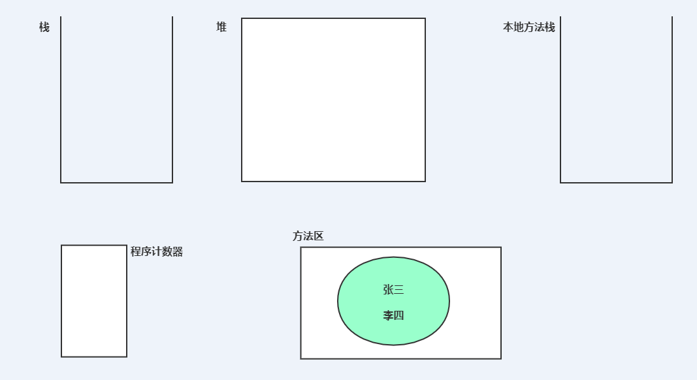

> 栈：线程栈 放置正在执行的方法 和 方法的变量
>
> 堆：new 关键字创建出来的对象
>
> 本地方法栈：放置的是跟OS有关的方法，一般这些方法都是 C++语言编写
>
> 程序计数器：放置代码的执行顺序
>
> 方法区：
>
> ​	常量池存放: 常量数据，
>
> ​	代码

## 二、对象内存模型

```java
Car car = new Car( );

//解析：    
//1、Car car 表示创建一个Car类型的变量car, 为改变量在栈中指定4byte的存储空间；    
//2、new Car( ) 表示在堆中开一块内存；    
 //3、= 表示将堆中分配的内存的地址存入栈中变量car中。
```

举例

```java
public class ObjectStudy {
    public static void main(String[] args) {
        // TODO Auto-generated method stub
        // 根据车类型，创建一个车对象
        Car car = new Car();
        car.brand = "BMW";
        car.color = "红色";
        car.price = 500000.0;
        Teacher t = new Teacher();
        t.name = "蜗牛老蒲";
        t.driveCar(car);
    }
}
/**
 * 老师类
 * @author 蜗牛老蒲
 *
 */
class Teacher{
    public String name;//名字
    public int age;//年龄
    public void driveCar(Car car) {
        car.drive();
    }
}
/**
 * 车类
 * 
 * @author 蜗牛老蒲
 *
 */
class Car {
    public String brand;// 品牌
    public String color;// 颜色
    public double price;// 价格
    public void speedUp(int speed) {
        System.out.println("车以[ " + speed + " ] 的速度，在前进！！！");
    }
    public void drive() {
        System.out.println("车开始启动！！！");
    }
    public void stop() {
        System.out.println("车可以停止！！！");
    }
}
```

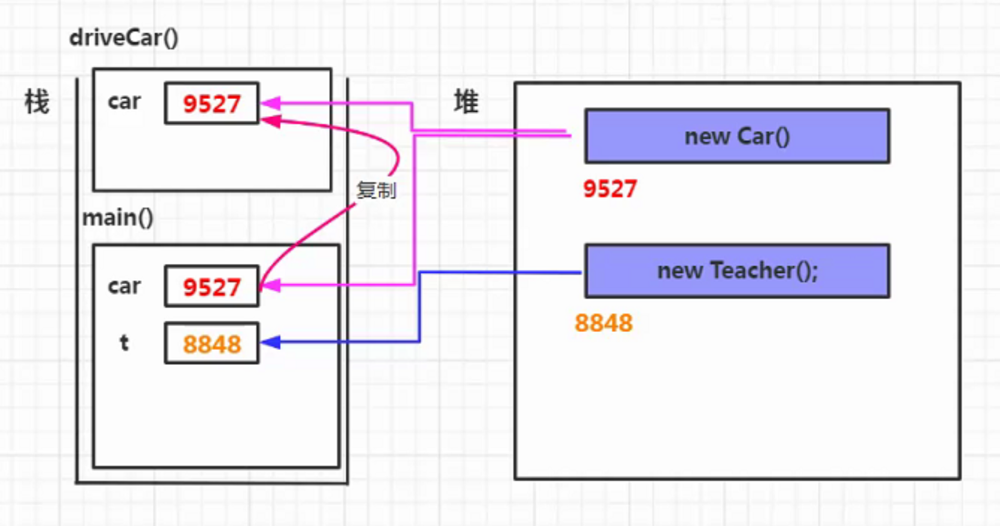

# 修饰符

## 一、访问修饰符

访问修饰符：作用在于描述类，方法，属性谁能够有权利访问。

Java主要有4种访问修饰符，可作用于：`类`、`方法`、`属性`

| 访问修饰符 | 本类（当前类） | 本包(同一个包) | 其它包的子类 | 其他包的其它类 |
| :--------: | :------------: | :------------: | :----------: | :------------: |
|   public   |       √        |       √        |      √       |       √        |
| protected  |       √        |       √        |      √       |                |
|    默认    |       √        |       √        |              |                |
|  private   |       √        |                |              |                |

作用范围：public > protected > 默认 > private

举例

1、同一个类中：4种访问修饰符都可以使用

```java
public class Person {
    public String name;
    protected int age;
    //性别 0-女  1-男 -1未知
    int gender;
    //个人收入
    private double income;
    public static void main(String[] args) {
        //创建一个对象
        Person person = new Person();
        //给属性赋值
        person.name = "法外狂魔张三";
        person.age = 20;
        person.gender = 1;
        person.income = 5000.0;
    }

```

2、同一包的不同类：private修饰的不可使用

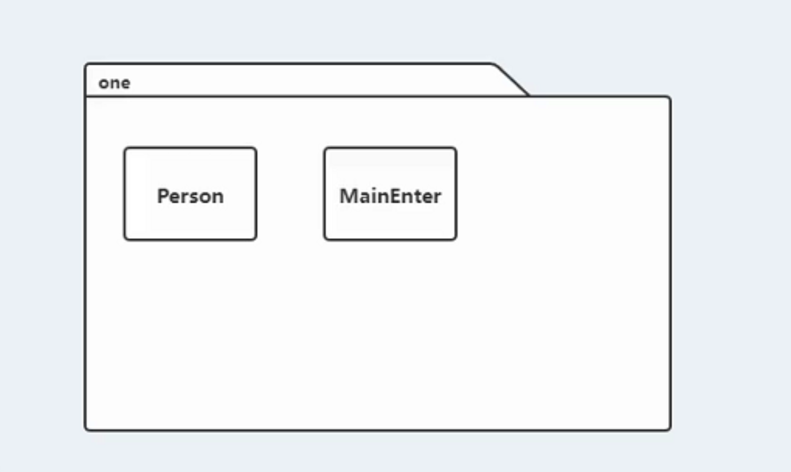

```java
public class Person {    
    public String name;    
    protected int age;    
    int gender;   
    private double income;
}
```

```java
public class MainEnter {
    public static void main(String[] args) {
        // TODO Auto-generated method stub
        //创建一个对象
        Person person = new Person();
        person.name = "法外狂魔张三";
        person.age = 20;
        person.gender = 1;
        person.income = 5000.0;//编译错误 income是私有的
    }
}
```

`属性都用private修饰`

3、其他包子类：包外有继承关系的子类

4、其他包其他类：包外除有继承关系的子类之外的类

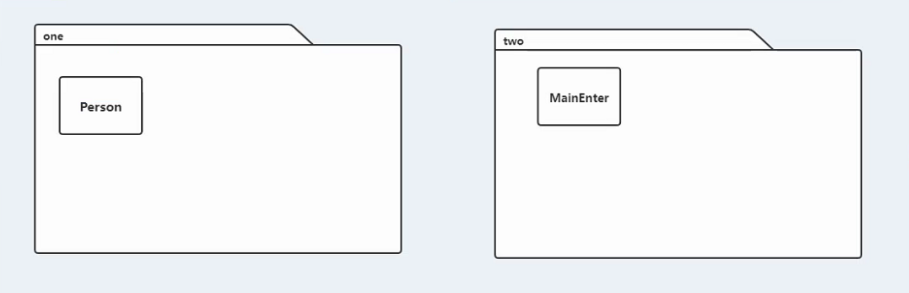

```java
public class Person {
    public String name;
    protected int age;
    int gender;
    private double income;
}
```

```java
public class MainEnter {
    public static void main(String[] args) {
        //创建一个对象
       Person person = new Person();
        person.name = "法外狂魔张三";
        person.age = 20;//编译错误
        person.gender = 1;//编译错误
        person.income = 5000.0;//编译错误
    }
}
```

## 二、封装

面向对象语言特征：`封装`、`继承`、`多态`、`抽象`

封装：是指隐藏对象的属性和方法具体的实现细节，仅提供公共公开的访问接口。

封装构成：包装+隐藏

隐藏：依靠访问修饰符来进行隐藏。

包装：使用方法对属性做进一步的控制。（如给属性赋值、改变属性值等等）

# this

## 一、this的含义

this是Java的一个关键字，代表“我”或对象本身。

this代表对象的引用，哪个对象在调用this所在的方法，this就代表哪个对象

`this关键字总是指向调用该方法的对象`

二义性的案例：（`对象属性名`和`对象方法形参名`相同）

```java
public void setName(String name) {
    name = name;
}
public void setAge(int age) {
    //采用方法，来完成对属性值，范围的控制
    if(age >= 18 && age <= 60) {
        age = age;
    }else {
        System.out.println("年龄超出范围，不允许注册！");
    }
}
```

解决方案：使用this特别标明 具体哪个是对象的属性

```java
public void setName(String name) {
    this.name = name;
}
public void setAge(int age) {
    //采用方法，来完成对属性值，范围的控制
    if(age >= 18 && age <= 60) {
        this.age = age;
    }else {
        System.out.println("年龄超出范围，不允许注册！");
    }
}
public static void main(String[] args) {
    //创建一个对象
    Person person = new Person();
    //调用方法，完成对属性的赋值
    person.setName("张三");
    person.setAge(20);
    System.out.println(person.speakName());
}
```

person在调用this出现的setName() 和 setAge()，那么setName() 和 setAge()中的this 就是 person

`this. 帮我们可以解决，代码中的二义性问题`

## 三、this()的使用

this()：`调用本类其他构造器`

使用场景：当调用任何一个构造器创建的对象都需要有某个特定属性值时，可以在某个构造器中进行赋初值，而其他构造器引用该构造器。

```java
public Student() {
    this.password = "123456";
}

public Student(String stuName) {
    this();
    this.stuName = stuName;
}

public Student(String stuName, int age, String direction) {
    this(stuName);
    this.age = age;
    this.direction = direction;
}
//第2个构造器调用第1个构造器，第3个构造器调用第2个构造器
```

> 面试题： Student student=new Student（“张三”，20；Java'）；创建了几个对象？
>
> 答：创建了1个对象，因为只有1个new
>
> 构造器中的方法，使用this()在相互调用时，就是一种方法的普通调用

# getter()与setter()

## 一、getter()与setter()

getter()方法：获取属性

setter()方法：修改属性

```java
public class Person {
    private String name;
    private int age;
    //性别 0-女  1-男 -1未知
    private int gender;
    //个人收入
    private double income;
    /**
     * 告诉外人，我的名字
     * @return
     */
    public String getName() {
        return name;
    }
    public void setName(String name) {
        this.name = name;
    }
    public void setAge(int age) {
        //采用方法，来完成对属性值，范围的控制
        if(age >= 18 && age <= 60) {
            this.age = age;
        }else {
            System.out.println("年龄超出范围，不允许注册！");
        }
    }
    public int getAge() {
        return age;
    }
}
```

## 二、getter()与setter()快速生成

先编写私有属性！

```java
public class Person {
    private String name;
    private int age;
    private int gender;
    private double income;
}
```

然后，使用快捷键：Alt + Shift +S 或

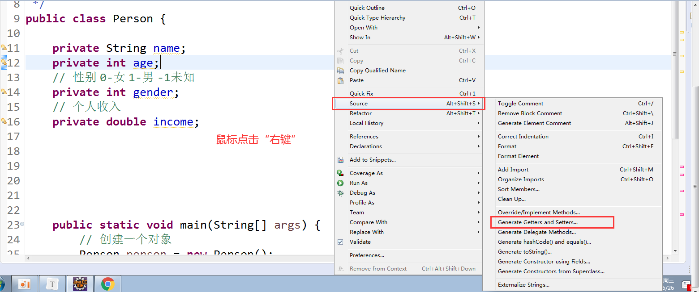

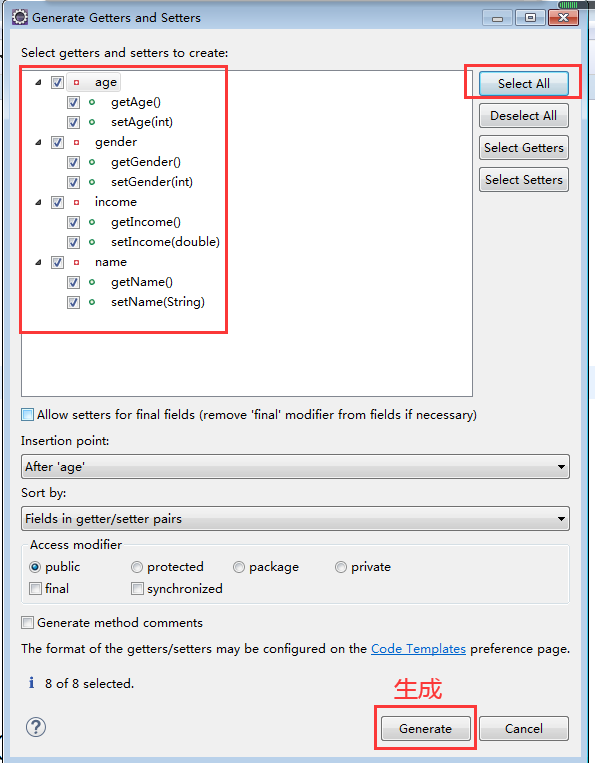

```java
public class Person {
    private String name;
    private int age;
    public String getName() {
        return name;
    }
    public void setName(String name) {
        this.name = name;
    }
    public int getAge() {
        return age;
    }
    public void setAge(int age) {
        this.age = age;
    }
    public int getGender() {
        return gender;
    }
    public void setGender(int gender) {
        this.gender = gender;
    }
    public double getIncome() {
        return income;
    }
    public void setIncome(double income) {
        this.income = income;
    }
    // 性别 0-女 1-男 -1未知
    private int gender;
    // 个人收入
    private double income;
    public static void main(String[] args) {
        // 创建一个对象
        Person person = new Person();
        // 调用方法，完成对属性的赋值
        person.setName("张三");
        person.setAge(20);
        System.out.println(person.getName());
        Person person02 = new Person();
        person02.setName("翔哥");
    }
}
```

特别说明：不是所有的属性，都需要提供getter()和setter()，按照自己的需求来刺

**课堂练习**

定义一个Student 类，编写：String stuName; int age; int gender; String direction;

要求：

1. 所有的属性 都必须使用private 访问修饰符
2. 使用Eclipse的快捷方式：给所有的属性，按照你自己的需求去生成getter() 以及setter()
3. 在其它包中，定义一个类MainEnter 在对应的main()中，创建学生 张三 并设置相关属性

```java
public class Student {
    private String stuName;
    private int age;
    private int gender;
    private String direction;
    public String getStuName() {
        return stuName;
    }
    public void setStuName(String stuName) {
        this.stuName = stuName;
    }
    public int getAge() {
        return age;
    }
    public void setAge(int age) {
        this.age = age;
    }
    public int getGender() {
        return gender;
    }
    public void setGender(int gender) {
        this.gender = gender;
    }
    public String getDirection() {
        return direction;
    }
    public void setDirection(String direction) {
        this.direction = direction;
    }
}
```

```java
public class MainEnter {
    public static void main(String[] args) {
        // TODO Auto-generated method stub
        //创建一个学生
        Student student = new Student();
        student.setStuName("张三");
        student.setAge(20);
        student.setGender(1);
        student.setDirection("Java");
        //输出内容
        System.out.println(student.getStuName());
    }
}
```

# 构造方法

## 一、构造方法的定义

什么是构造方法？又被叫：构造器，方法名和类名相同，没有任何返回值的特殊方法。

```java
/**
     * 无参构造器
     * 如果该方法：由程序员自己定义出来了，编译器将不再自动生成
     */
public Student() {
}
```

一般，上述的这个无参构造器不会`显式`的显示出来，而且由编译器在编译期间，自动生成。

## 二、构造方法的作用

作用：

1、`在堆中创建一个对象`

2、`给对象的属性初始化值`

```Java
public static void main(String[] args) {
    // TODO Auto-generated method stub
    //创建一个学生
    Student student = new Student();
    //输出内容
    System.out.println(student.getStuName());
    System.out.println(student.getAge());
    System.out.println(student.getGender());
    System.out.println(student.getDirection());
}
```

基本数据类型(int)默认值：0；引用数据类型默认值：null

构造器的语法格式：

```java
访问修饰符 类的类名(数据类型 参数，数据类型 参数 ……){
  执行语句;
}
```

## 三、无参构造器

构造器中没定义参数

```java
public Student() {
}
```

## 四、有参构造器

构造器中，定义了参数

```java
public Student(String stuName,int age) {
    this.stuName = stuName;
    this.age = age;
}
```

在调用时：

```java
//创建一个学生
Student student = new Student("张三",20);
```

说明：有参构造器可以在创建对象的同时进行赋值。无参构造器必须先创建对象，再进行赋值。

容易出错的地方：

```java
public class Student {
    private String stuName;
    private int age;
    private int gender;
    private String direction;
    public Student(String stuName,int age) {
        this.stuName = stuName;
        this.age = age;
    }
}
```

调用时：

```java
//创建一个学生
Student student = new Student();//编译错误
```

原因：`程序员只要手动定义了构造器，编译器将不会再帮你自动生成任何的构造器`

## 五、快速生成构造器

eclipse生成构造器快捷键：alt + shi + s——>generate constructor using fields——>选择需要的参数；

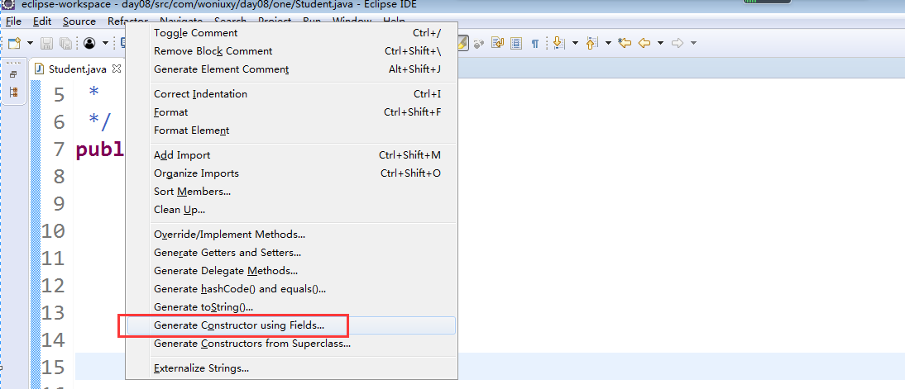

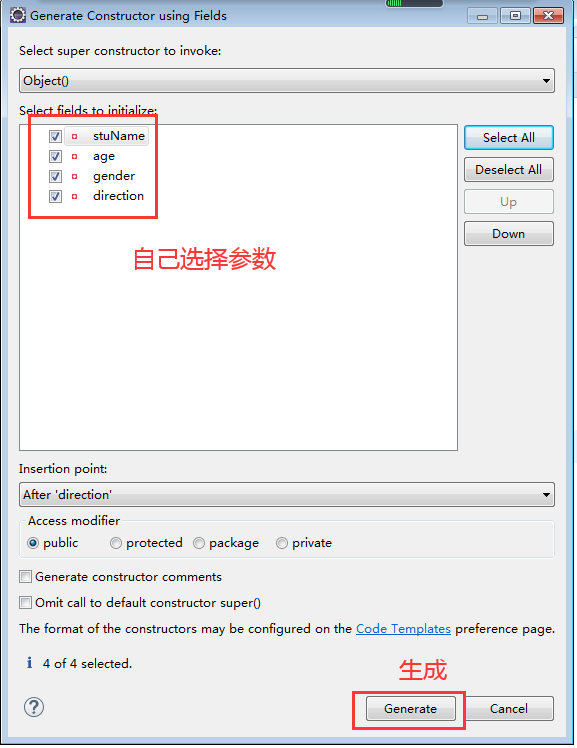

```java
/**
         * 全参构造器
         * @param stuName
         * @param age
         * @param gender
         * @param direction
         */
public Student(String stuName, int age, int gender, String direction) {
    super();
    this.stuName = stuName;
    this.age = age;
    this.gender = gender;
    this.direction = direction;
}
```

当然，你也可以 即提供有参，也提供无参

```java
/**
     * 无参构造器
     */
public Student() {
    super();
}
/**
     * 全参构造器
     * @param stuName
     * @param age
     * @param gender
     * @param direction
     */
public Student(String stuName, int age, int gender, String direction) {
    super();
    this.stuName = stuName;
    this.age = age;
    this.gender = gender;
    this.direction = direction;
}
```

**补充：**

1、有参构造器、无参构造器可以同时存在（重载）。（若只定义有参构造器，而创建对象时未赋初值（无参构造器形式创建对象），会报编译错误，若同时定义无参构造器便不会报错）

2、定义的类中不定义构造器，程序会在编译过程中自动创建无参构造器，而程序员一旦手动定义了构造器，在编译过程中便不会在自动创建。

3、构造器可以根据需求进行定义或不定义，参数的选择可以无参、部分参数、全参。

## 六、构造方法的执行顺序

构造方法创造对象过程：

1、给对象申请存储空间； 

2、给对象的属性分配空间；

3、给对象的属性赋初始值；

4、执行构造器剩余的代码；

5、将对象的地址，赋值给引用变量。

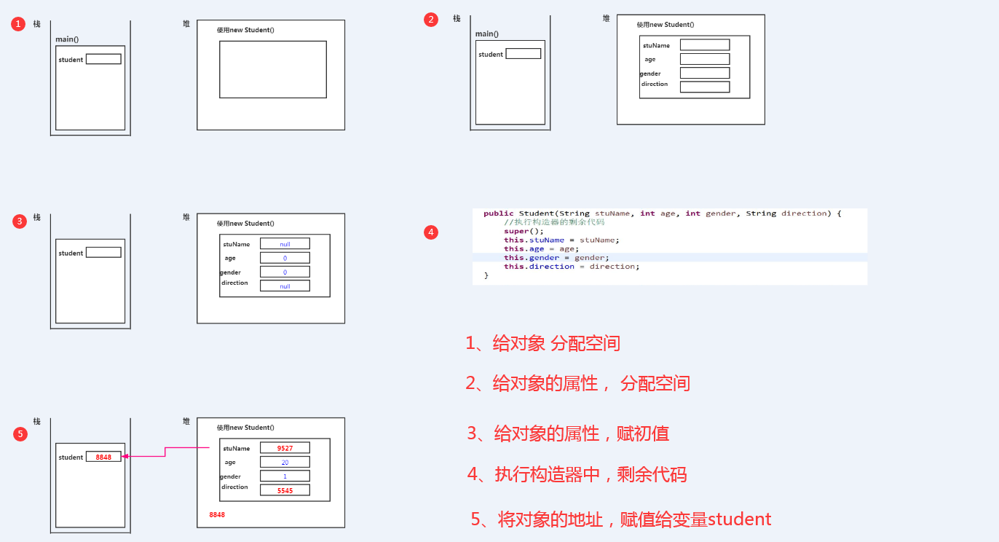

**课堂练习**

需求1：在学生类中，定义无参构造器，定义有参构造器

要求：定义完毕之后，分别使用new 关键字，创建2个对象，并给属性赋值

需求2：按照学生类的写法，编写一个老师Teacher类，完成相同的业务

# JavaBean的规范

## 一、JavaBean的概念

JavaBean：是Java中提供的一种可重用的组件

> JavaBean可以分为2种：
>
> 1、实体对象
>
> ​	作用：专门用来携带数据，而且数据更多是来自于网页传输过来数据。
>
> 2、业务对象
>
> ​	作用：主要用于Java后台处理用户业务逻辑的对象。

## 二、JavaBean规范

规范要求；

1、类必须是public；

2、类中的属性必须是private；

3、针对私有属性，必须按需提供对应的getter()或setter();

4、如果类中存在有参构造器，务必提供无参构造器；

5、类必须实现序列化接口。

```java
public class Person implements Serializable{
    private String name;
    private int age;
    // 性别 0-女 1-男 -1未知
    private int gender;
    // 个人收入
    private double income;
    /**
     * 有参构造器
     * @param name
     * @param age
     * @param gender
     * @param income
     */
    public Person(String name, int age, int gender, double income) {
        super();
        this.name = name;
        this.age = age;
        this.gender = gender;
        this.income = income;
    }
    /**
     * 无参构造器
     */
    public Person() {
        super();
    }
    public String getName() {
        return name;
    }
    public void setName(String name) {
        this.name = name;
    }
    public int getAge() {
        return age;
    }
    public void setAge(int age) {
        this.age = age;
    }
    public int getGender() {
        return gender;
    }
    public void setGender(int gender) {
        this.gender = gender;
    }
    public double getIncome() {
        return income;
    }
    public void setIncome(double income) {
        this.income = income;
    }
}
```

# static

## 一、static

static 静态，作用于：`类的方法`、`类的属性`

## 二、作用在类的方法上

静态方法跟对象无关，因此也成为`类方法`。

```java
public class StaticIntroduce {
    public static void main(String[] args) {
        int a = 3;
        int b = 4;
        //静态方法的调用方式
        StaticIntroduce.add(a,b);
    }
    /**
     * 定义了一个静态方法
     */
    public static int add(int i,int j) {
        return i + j;
    }
}
```

这种类方法的调用方式：`类名.方法名(参数)`(类名.通常省略)

注意：

1、静态方法中，可以直接调用静态方法；

2、静态方法中，不可以直接调用非静态方法，必须通过`对象.方法名(参数)`方式调用。

```java
   public static void main(String[] args) {
        int a = 3;
        int b = 4;
        //静态方法的调用方式
        StaticIntroduce.add(a,b);
        //非静态方法的调用方式
        StaticIntroduce si = new StaticIntroduce();
        si.eat();//对象.方法名()
    }
    /**
     * 非静态方法
     */
    public void eat() {
        System.out.println("我要吃饭");
    }
```

3、非静态方法，可以直接调用静态方法。

```java
/**
 * 非静态方法
 */
public void eat() {
    int a = 2;//2个馒头
    int b = 2;//2个馒头
    int r = StaticIntroduce.add(a, b);
    System.out.println(r);
     System.out.println("我要吃饭");
}
```

​	原因：静态方法，在类加载的时候，就准备好了；而非静态方法，在程序运行过程中，才准备好。

​	非静态方法是跟对象有关的，对象都没准备好，方法肯定就没准备好的！

## 三、static作用于属性

同理，static属性也与对象没有任何关系，比如：Pl=3.14

```java
public class StaticIntroduce {
    public static final double PI = 3.14;
    public static void main(String[] args) {
        int a = 3;
        int b = 4;
        System.out.println(StaticIntroduce.PI);
    }
}
```

static属性的调用：`类名.变量名`(类名.通常省略)

需求1：需要定义一个数学类Math ，定义 + - * / %

思路：

```java
add(int i, int j)  
red(int i, int j)  
mul(int i, int j)   
div(int i, int j)   
rem(int i, int j)     
max(int i,int j)   
min(int i,int j)
```

```java
public class Math {
    /**
     * 大于计算
     * @param i
     * @param j
     * @return
     */
    public static int max(int i,int j) {
        return (i >= j) ? i : j;
    }
    /**
     * 小于计算
     * @param i
     * @param j
     * @return
     */
    public static int min(int i,int j) {
        return (i <= j) ? i : j;
    }
}
```

# 继承

## 一、继承的概念

什么是继承？

`补充：继承是从已有的类中派生出新的类，新的类能吸收已有类的数据属性和行为，并能扩展新的能力`

一个类继承另外一个类后，可以在当前类中，去使用父类的属性或行为的话。那么这个东西就是继承

比如：男人类是人类衍生出来的？女人类是人类衍生出来的？

男人类，女人类都可以使用在人类中定义出来的属性和行为

## 二、继承的语法

继承的语法：使用关键字extends完成继承结构

```java
public class A{
    public String a;
    public void a(){
    }
}
public class B extends A{
}
```

> B类继承至A类
>
> A类：是父类，超类，基类
>
> B类：是子类，派生类

继承的好处：

1、提高了代码的复用性；

2、类和类之间的继承关系，是构成多态的前提条件。

继承的缺陷：

1、提高了代码之间的耦合度；

程序设计原则：高内聚，低耦合

> 高内聚：是指一个类的能力，越强越好
> 低耦合：是类和类的关系，要越少越好

## 三、继承的特点

Java支持单继承，不支持多继承

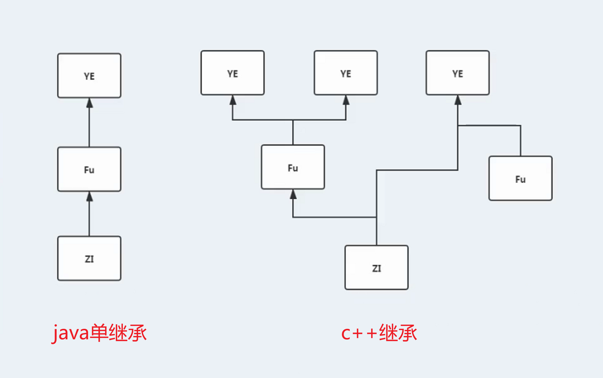

单继承的好处：结构清晰；缺陷：复杂度不高

多继承的好处：复杂度高；缺陷：结构复杂

# 继承方式

## 一、Java的继承模式

Java中只有单继承，但可以多层继承（子继父，父继爷）

`单继承`

```java
public class Fu{
}
public class Zi extends Fu{
}
```

`多层继承`

```java
public class Ye{
}
public class Fu extends Ye{
}
public class Zi extends Fu{
}
```

不允许循环继承

## 二、继承注意事项

1、类若没有明确的父类，其父类为Object；

2、父类中的私有属性、私有方法子类无法继承；

```java
 public class Fu {
       private String name;
       int age;
       public void eat() {
           System.out.println("吃饭");
       }
       private void smoke() {
           System.out.println("抽烟");
       }
   }
   class Zi extends Fu{
   }
   class Test{
       public static void main(String[] args) {
           //创建子类对象
           Zi zi = new Zi();
           zi.name = "";//编译错误(解决方案：提供getter() 或 setter()方法即可)
           zi.age = 12;
           zi.eat();
           zi.smoke();//编译错误
       }
   }
```

3、子类不能继承父类的构造器。

## 三、何时使用继承

当2个类之间满足“is-a”的关系时，此时可以使用继承

案例

```java
public class Person {
    private String name;
    private int age;
    public String getName() {
        return name;
    }
    public void setName(String name) {
        this.name = name;
    }
    public int getAge() {
        return age;
    }
    public void setAge(int age) {
        this.age = age;
    }
}
```

```java
public class Teacher extends Person{
    //教学方向
    private String direction;
    public String getDirection() {
        return direction;
    }
    public void setDirection(String direction) {
        this.direction = direction;
    }
}
```

```java
public class Student extends Person {
    //学号
    private String stuNo;
    public String getStuNo() {
        return stuNo;
    }
    public void setStuNo(String stuNo) {
        this.stuNo = stuNo;
    }
}
```

```java
public class MainEnter {
    public static void main(String[] args) {
        Teacher teacher = new Teacher();
        teacher.setName("陈老师");
        teacher.setAge(45);
        teacher.setDirection("摄影");
        Student student = new Student();
        student.setName("老蒲");
        student.setAge(35);
        student.setStuNo("9527");
    }
}
```

注意：不要为了继承而继承，继承要符合逻辑

## 四、继承的结构图

```java
Teacher teacher = new Teacher();
```

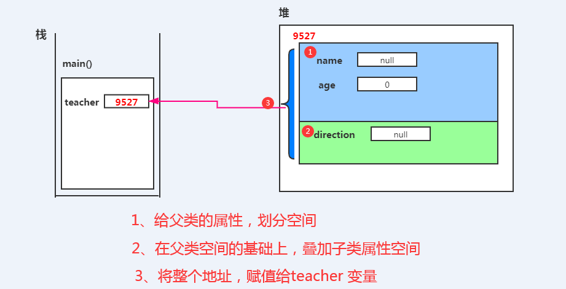

# 重写

## 一、重写的含义

重写：子类重新编写父类中的方法。重写只发生在继承中。

```java
public class Fu{
    public void eat(){
        System.out.println("吃大米")
    }
}
public class Zi extends Fu{
    public void eat(){
        System.out.println("吃馒头");
    }
}
```

> 重写与重载区别：
>
> 1、重载：在同一个类中，方法名相同，参数列表不同
>
> 2、重写：在父子继承之间，子类中拥有和父类相同的方法

如何知道某一个方法是否是重写方法？

看方法上是否存在@Override注解

```java
public class HeNanRen extends Person{
    @Override
    public void eat() {
        System.out.println("吃馒头");
    }
    public static void main(String[] args) {
        //创建一个对象
        HeNanRen ren = new HeNanRen();
        //调用对象吃饭的行为
        ren.eat();
    }
}
/**
 * 人类
 * @author 蜗牛老蒲
 *
 */
class Person {
    public void eat() {
        System.out.println("吃大米");
    }
}
```

## 二、重写的注意事项

1、子类不能重写父类私有的方法；

> 若强制重写父类的私有方法，且不加@Override，不会报编译错误，但会被认为是子类自己创建的方法，
>
> 而非从父类继承得来；强制重写父类私有方法，加@Override会报编译错误。

2、子类方法的访问修饰符，一定>=父类方法的访问修饰符；

```java
public > protected > 默认 > private
class Fu{
    protected void eat(){
    }
}
class Zi extends Fu{
    public/protected void eat(){
    }
}
```

3、子类定义方法的返回值类型可以和父类返回值类型不一样（要求：父类返回值类型是子类返回类型的的父类）；

```java
class Fu{
    public Person eat(){
    }
}
class Zi extends Fu{
    public HeNanRen eat(){
    }
}
```

4、静态方法只能重写静态方法（而且这个静态方法，还和当前对象无关）

## 三、注解

注解：又叫约定

作用：解释代码、与第三方（如JVM等）达成约定

`注解优于配置`

常见的官方注解

```java
@Override 表示 方法是个重写的方法
@SuppressWarnings 表示 忽略代表中的警告
@Deprecated 表示 某一个方法已经被废弃，有其它更好的方法
```

自定义注解：

元注解：@Documented @Target @Retention

@Documented 该注解可以导出成文档

@Target 该注解可以放置什么位置

@Retention 描述该注解，什么时候有效

## 四、最常见的重写案例

toString()方法的重写

Object类为最高类，所有类都继承成Object类的方法，其为所有类提供 toString()方法，提供的toString()默认能返回对象地址值，在`子类中对toString()重写`，可以实现返回对象属性值。

快速生成toString() 的方式： 快捷键 Alt + Shift + S 选择：Generate toString……

```java
public class Teacher {
    private String name;
    private int age;
    private int gender;
    public String getName() {
        return name;
    }
    public void setName(String name) {
        this.name = name;
    }
    public int getAge() {
        return age;
    }
    public void setAge(int age) {
        this.age = age;
    }
    public int getGender() {
        return gender;
    }
    public void setGender(int gender) {
        this.gender = gender;
    }
    @Override
    public String toString() {
        return "Teacher [name=" + name + ", age=" + age + ", gender=" + gender + "]";
    }
    public static void main(String[] args) {
        Teacher teacher = new Teacher();
        teacher.setName("老蒲");
        teacher.setAge(35);
        teacher.setGender(1);
        System.out.println(teacher.toString());
    }
}
```

**补充**：

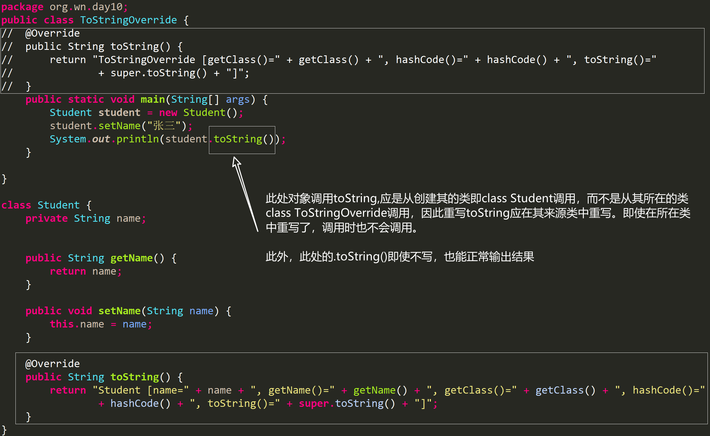

.toString()不写也能正常输出原因：

当程序使用 System.out.println()方法输出一个对象时，或者把某个对象和字符串进行连接运算时，系统会自动调用该对象的toString()方法返回该对象的字符串表示。toString()方法属于Object对象，由于所有的对象都"继承"了Object的对象实例，因此几乎所有的实例对象都可以使用该方法。

# super

## 一、super的含义

​	`this代表本类对象自身，super代表从父类继承过来的东西。`(继承父类的方法等)

```java
class Father{
    public void eat() {
        System.out.println("吃饭");
    }
}
class Zi extends Father{
    public void smoke() {
        System.out.println("抽烟");
    }
    public void drink() {
        super.eat();
//        super.smoke();//编译错误(因为爸爸不会抽烟)
        this.smoke();
        System.out.println("喝酒");
    }
}
```

this的作用范围大于super的作用范围

## 二、super()

`this() 本类的其他构造器，super() 代表的是父类的构造器`

注意：super() 必须放置在代码的第1行，一般用于 父类去帮组子类 定义某些属性时

```java
public class Demo2 {
    public static void main(String[] args) {
        Zi zi = new Zi("007");
        zi.setName("小明");
        System.out.println(zi);
    }
}
/**
 * 父类
 * @author 老蒲
 *
 */
class Father{
    private String name;
    private String password;
    public Father() {
        this.password = "123456";
    }
    public String getName() {
        return name;
    }
    public void setName(String name) {
        this.name = name;
    }
    public String getPassword() {
        return password;
    }
    public void setPassword(String password) {
        this.password = password;
    }
}
class Zi extends Father{
    private String stuNo;
    public Zi() {
        super();
    }
    public Zi(String stuNo) {
        super();
        this.stuNo = stuNo;
    }
    public String getStuNo() {
        return stuNo;
    }
    public void setStuNo(String stuNo) {
        this.stuNo = stuNo;
    }
    @Override
    public String toString() {
        return "Zi [stuNo=" + stuNo + ", getName()=" + getName() + ", getPassword()=" + getPassword() + "]";
    }
}
```

## 三、内存图指向

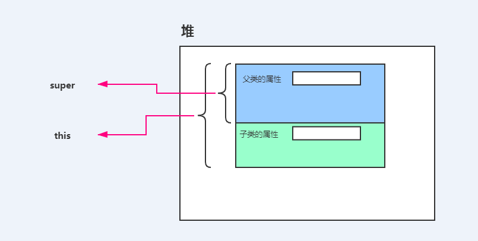

# finanl

## 一、final

final它是一个关键字，同时也是一个修饰符，代表`最终`的意思

## 二、final定义在类上

final定义在类，代表这个类是一个最终类，不能被继承

```java
/**
 * final定义在类上方
 * Fu 是一个最终类
 * @author 蜗牛老蒲
 *
 */
final class Fu{
}
class Zi extends Fu{//编译错误
}
```

## 三、final定义在方法上

final定义在方法上，代表这个方法不能重写！

```java
class Fu{
    /**
     * final 修饰的方法
     */
    public final void eat() {
        System.out.println("吃大米");
    }
}
class Zi extends Fu{
    @Override
    public void eat() {//编译错误
    }
}
```

## 四、final定义在属性上

final定义在属性上，将属性变为不可变更的常量 (自定义常量的手段)

```java
class Math{
    /**
     * 自定义常量
     */
    public static final double PI = 3.14;
    public void meth() {
        PI = 3.15;//编译错误
    }
}
```

**补充**：

final修饰属性，使其成为常量。
在final修饰的属性前加上static，可以实现让定义的常量在其他类中被调用（通过类名.属性名调用），避免重复定义常量。

# 抽象类

## 一、抽象

抽象：属于面向对象语言中的4大特征之一

类是对象的模板，类也是对象的抽象；


有一种情况：类中的某些行为，类本身是无法实现的

比如：

```java
/**
 * 抽象类
 */
abstract class Girl{
    /**
     * 抽象方法
     */
    public abstract void cry();
}
```

但是我的子类，是可以实现的

```java
class GentleGirl extends Girl{
    @Override
    public void cry() {
        // TODO Auto-generated method stub
        System.out.println("优雅的哭！");
    }
}
class ShyGirl extends Girl{
    @Override
    public void cry() {
        // TODO Auto-generated method stub
        System.out.println("嘤嘤嘤的哭！");
    }
}
```

## 二、抽象类

具有抽象方法的类，就是抽象类。

特点：

1、抽象方法和抽象类都使用abstract来进行描述。

```java
abstract class Girl{
    public abstract void cry();
}
```

2、抽象类可以没有抽象方法，但是具有抽象方法的类一定是抽象类。

```java
abstract  class Girl{
    public void eat() {}
    public abstract void sleep();
    public void drink() {}
}
```

3、抽象类是不能被实例化的。

```java
public class Demo3 {
    public static void main(String[] args) {
        Girl girl = new Girl();//编译错误
    }
}
/**
 * 抽象类
 */
abstract class Girl{
    public void eat() {}
    public abstract void sleep();
    public void drink() {}
}
```

4、普通类一旦继承了抽象类就一定要实现所有的方法。

```java
abstract class Girl{
    public abstract void eat();
    public abstract void sleep();
    public void drink() {}
}
class GentleGirl extends Girl{
    @Override
    public void eat() {
        // TODO Auto-generated method stub
        System.out.println("一粒一粒的吃！！！");
    }
    @Override
    public void sleep() {
        // TODO Auto-generated method stub
        System.out.println("很优雅的睡！！！");
    }
}
```

5、子类继承抽象类后若不想实现抽象方法可以将自己变成抽象类。

```java
abstract class Girl{
    public abstract void eat();
    public abstract void sleep();
    public void drink() {}
}
abstract class GentleGirl extends Girl{
}
```

## 三、抽象类可以放置的成员

1、成员变量（属性）

​		静态成员变量（常量）

​		非静态的成员变量（属性）

2、成员方法（行为）

​		抽象方法

​		非抽象方法

3、构造方法

​		放置构造方法的意义，让子类可以通过super()来完成调用

```java
abstract class Person{
    private String name;
    private String password;
    public Person() {
        this.password = "123456";
    }
    //此处省略了大量的getter() 和 setter() 代码
    public abstract void eat();
}
class Chinese extends Person {
    public Chinese() {
        // TODO Auto-generated constructor stub
        super();
    }
    @Override
    public void eat() {
        // TODO Auto-generated method stub
        System.out.println("使用筷子完成吃饭！！！");
    }
}
```

## 四、abstract可能涉及的面试题

**方法修饰**

1、abstract是否可以和private共存？

答案：不能 原因：abstract方法通过子类继承去实现，而private方法是私有的，不能被继承，子类也就无法实现。

2、abstract方法是否可以和static共存？

答案：不能 原因：static的方法必须要有实现，但abstract定义的方法是没有的方法。

```java
abstract class Fu{
    public static abstract void eat();
}
//静态方法的调用方式：
Fu.eat();
```

3、abstract 方法是否可以和final共存?
答案：不能 原因：abstract一定要子类去实现，但是final规定的方法不能被重写

```java
abstract class Fu{
    public abstract final void eat();//编译错误
}
```

**课堂练习**

根据图，定义抽象类Animal ，定义抽象方法shout()

**要求：**定义狗，猫，鸟 继承 Animal ，并实现shout()的方法

在main() 中进行调用

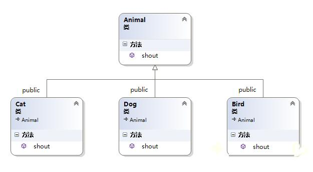

# 接口

## 一、接口的含义

接口：这玩意是一种比抽象类还要抽象的东西，它依旧可以定义抽象方法，但是它的抽象方法更多的是在帮组我们类扩展功能。

`接口的作用：给类扩展新的功能作用，增加类的丰富度。`

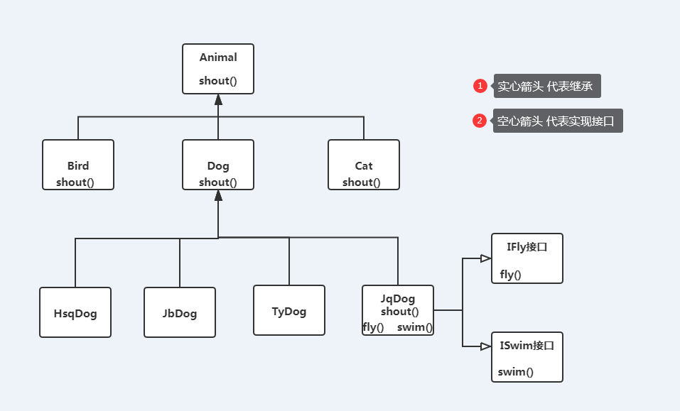

## 二、接口的使用

接口的定义格式：

```java
interface 接口名{
    需要扩展的抽象的行为；
}
```

接口不是类

接口如何使用：需要使用`implements`

```java 
class Human implements IFly{
    @Override
    public void fly() {
        // TODO Auto-generated method stub
        System.out.println("人开始会飞了！！！");
    }
}
interface IFly{
    //接口中的抽象方法，不需要使用abstract
    public void fly();
}
```

接口的特点：

1、接口不能被实例化，因为是抽象的；

```java
  public static void main(String[] args) {
        IFly i = new IFly();//编译错误
    }
```

2、接口中的抽象方法，一定要用类去实现它（如果不想实现可将类定义为抽象类）；

```java
abstract class Human implements IFly{
}
interface IFly{
    //接口中的抽象方法，不需要使用abstract
    public void fly();
}
```

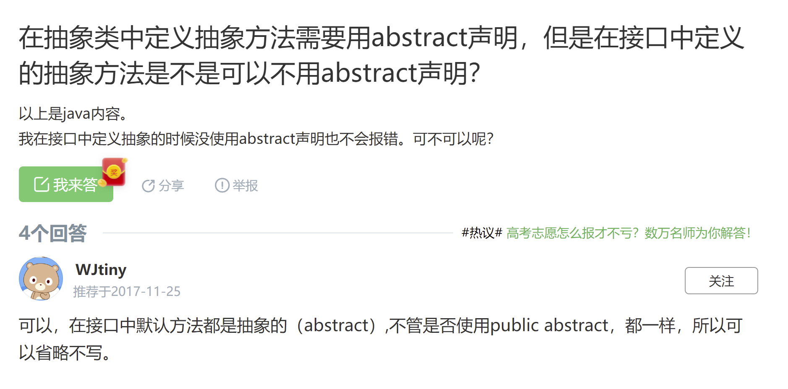

3、类继承只能是单继承，接口的实现可以是`多实现`;

```java
class Human implements IFly,ISwim{
    @Override
    public void swim() {
        // TODO Auto-generated method stub
    }
    @Override
    public void fly() {
        // TODO Auto-generated method stub
    }
}
interface IFly{
    //接口中的抽象方法，不需要使用abstract
    public void fly();
}
interface ISwim{
    public void swim();
}
```

4、类不允许多继承，接口是可以多继承的；

```java
class Human implements IConformity02{
    @Override
    public void fly() {
        // TODO Auto-generated method stub
    }
    @Override
    public void smoke() {
        // TODO Auto-generated method stub
    }
}
/**
 * 整合所有的接口
 */
interface IConformity01 extends ISmoke,IFly,ISwim{
}
interface IConformity02 extends ISmoke,IFly{
}
interface ISmoke{
    public void smoke();
}
interface IFly{
    //接口中的抽象方法，不需要使用abstract
    public void fly();
}
interface ISwim{
    public void swim();
}
```

5、接口中的方法不用写abstract、也不用写public（默认是abstract、public）。

```java
interface ISmoke{
    void smoke();
}
interface IFly{
    //接口中的抽象方法，不需要使用abstract
    void fly();
}
interface ISwim{
    void swim();
}
```

## 三、接口中的成员放置

1、抽象方法（不能放构造方法）；

```java
void swim();
```

2、常量数据；

```java
public static final double PI = 3.14;
```

3、定义default方法（default方法不会要求类去实现）；

```java
default void drink() {
}
```

4、定义static方法

```java
static void aaa() {
}
```

## 四、接口和类、抽象类和类的关系

1、抽象类和类的关系：继承，且只能是单继承；

```java
abstract class Fu{
    abstract void eat();
}
class Zi extends Fu{
    @Override
    void eat() {
        // TODO Auto-generated method stub
    }
}
```

2、类和接口之间的关系：实现，且支持多实现；

```java
class A implements I1,I2,I3{
    //省略 大量的 方法的实现
}
interface I1{
    void smoke();
}
interface I2{
    void drink();
}
interface I3{
    void eat();
}
```

3、接口和接口的关系：继承，且支持多继承

```java
interface I4 extends I1,I2,I3{
}
interface I1{
    void smoke();
}
interface I2{
    void drink();
}
interface I3{
    void eat();
}
```

## 五、怎么选择抽象类，接口来定义抽象方法

判断抽象方法是否是某一种类自身应该具有的方法 。如果是该类具有的方法，定义到抽象类中；若是该类不具有的需要拓展的方法则定义到接口中。

（如狗类都有“吃”的抽象方法，应该定义到抽象类中，而狗天生不具有“飞”的抽象方法，就要定义到接口中）

```java
abstract class Animal{
    public abstract void eat();
    public void drink() {
        System.out.println("喝干净水！！！");
    }
}
abstract class Dog extends Animal{
    @Override
    public void eat() {
        // TODO Auto-generated method stub
        System.out.println("吃狗粮！！！");
    }
    public abstract void swim();
}
class Cat extends Animal implements IFly,ISwim{
    @Override
    public void eat() {
        // TODO Auto-generated method stub
        System.out.println("吃老鼠！！！");
    }
    @Override
    public void fly() {
        // TODO Auto-generated method stub
        System.out.println("倒着飞！！！！");
    }
    @Override
    public void swim() {
        // TODO Auto-generated method stub
        System.out.println("拼命的挣扎！！！");
    }
}
interface IFly{
    void fly();
}
interface ISwim{
    void swim();
}
```

## 六、JDK1.8针对接口的新特性

JDK1.7中，接口中所有的方法都是抽象方法，不能定义任何的非抽象方法。但是在JDK1.8中，已经可以定义非抽象方法，但是它的非抽象方法只能定义2种：default static。

default关键字，什么时候使用：

当一个接口中，定义了很多default方法时，可以按需实现接口中的方法

```Java
class A implements IConformity{
    @Override
    public void eat() {
        // TODO Auto-generated method stub
    }
}
interface IConformity{
    void eat();
    default void drink() {}
    default void smoke() {}
}
```

static关键字，静态方法：

静态方法：表示该方法已经和实现类没有任何关系，变成了`接口的方法`，通过`接口名.方法名()`调用

```java
public class Demo4 {
    public static void main(String[] args) {
        //调用方法 等同于 类的调用方式
        //接口名.方法名()
        IConformity.gun();
    }
}
class A implements IConformity{
    @Override
    public void eat() {
        // TODO Auto-generated method stub
    }
}
interface IConformity{
    void eat();
    default void drink() {}
    default void smoke() {}
    static void gun() {
        System.out.println("转圈圈的滚！");
    }
}
```

# 多态的应用

## 一、多态的含义

从生物学上讲：一种动物，在不同的时期存在多种形态比如：

人在Java中讲：相同的行为，因为绑定了不同的对象，导致拥有不同的实现

> 从这里来看：多态就是 重载与重写
>
> 重载：同一个类中的多态
>
> 重写：父子之间的多态

## 二、多态的案例

**多态的条件：**

1. 必须要有继承关系

2. 一定要有方法的重写

   ```
   因为重写以后，不同的子类才有不同的实现
   ```

3. 一定要有父类的引用 可以指向子类对象

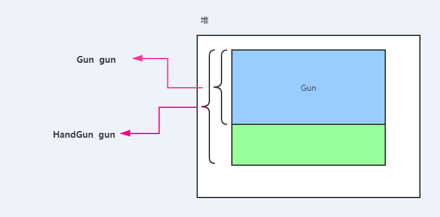

父类可以指向子类的实现(父类的范围比子类的范围大？)

**多态参数**：

```java
public class Demo1 {
    public static void main(String[] args) {
        Soldier soldier = new Soldier();
        // 父类的引用，执行子类的实现(因为子类可以向父类 自动向上转型)
        System.out.println("请用户输入一把枪：1 手枪，2 机枪 ，3 水枪");
        Scanner scanner = new Scanner(System.in);
        int i = scanner.nextInt();
        Gun gun = null;
        switch (i) {
        case 1:
            gun = new HandGun();
            break;
        case 2:
            gun = new MachineGun();
            break;
        case 3:
            gun = new WaterGun();
            break;
        default:
            break;
        }
        soldier.attack(gun);
    }
}
/**
 * 士兵
 */
class Soldier {
    public void attack(Gun gun) {//让父类的变量，兼容所有的子类对象
        gun.fire();
    }
}
abstract class Gun {
    public abstract void fire();
}
class HandGun extends Gun {
    @Override
    public void fire() {
        // TODO Auto-generated method stub
        System.out.println("砰砰砰");
    }
}
class MachineGun extends Gun {
    @Override
    public void fire() {
        // TODO Auto-generated method stub
        System.out.println("哒哒哒");
    }
}
class WaterGun extends Gun {
    @Override
    public void fire() {
        // TODO Auto-generated method stub
        System.out.println("滋滋滋");
    }
}
```

**多态集合：**

```java
String[] names = new String[10];
Object[] objs = new Object[10];//?
```

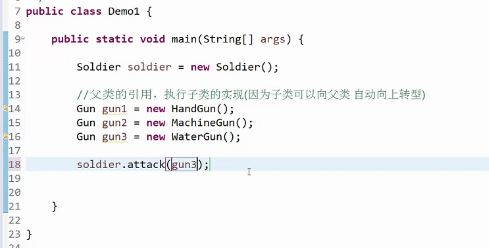

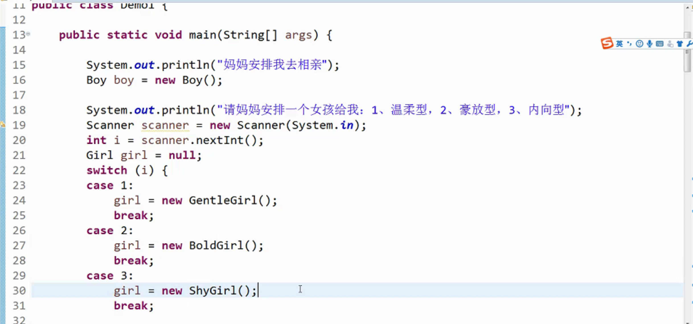


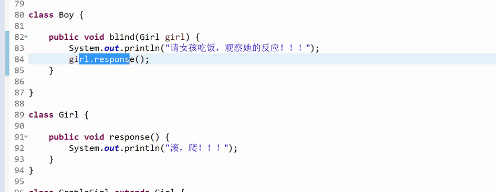

## 三、多态的作用

1. 提升代码的扩展性
2. 父类的引用，可以执行子类的对象

## 四、多态缺陷

父类无法使用子类的特有内容

```java
class WaterGun extends Gun {
    @Override
    public void fire() {
        // TODO Auto-generated method stub
        System.out.println("滋滋滋");
    }
    public void watering() {
        System.out.println("给水枪加水！");
    }
}
```

# 向上转型与向下转型

## 一、向上转型

回顾：基本数据类型有自动向上转型，小容量的数据类型在参与计算时，会自动提升为大容量的类型

同理：引用数据类型也有它的自动向上转型。当父类/接口的引用，指向子类/实现类的对象时，也会自动向上转型

> 请记住：引用数据类型的转型，要么发生在父子之间，要么发送在接口和实现类之间

```java
Person person = new Dog();//X
Person person = new Chinese();//V
IFly fly = new Dog();//V   前提条件是Dog类，实现了IFly接口
```

## 二、向下转型

同理，引用数据类型也有强制向下转型的方案

语法格式：
`子类的数据类型  变量 = (子类的数据类型)父类的引用；`

```java
HandGun handGun = (HandGun) gun;
```

```java
class Soldier {
    /**
     * 传递Gun 的原因：兼容所有的子类
     * @param gun
     */
    public void attack(Gun gun) {
        gun.fire();
        //强制向下转型
        WaterGun wg = (WaterGun) gun;
        wg.watering();
    }
}
```

注意：强制向下转型有风险，如果转的不好的，可能抛`java.1ang.C1asscastException `(类转型异常)异常。

解决方案：instanceof关键字

instanceof关键字：检测一个对象是否是某一个类的对象，返回值是一个布尔值

```java
class Soldier {
    /**
     * 传递Gun 的原因：兼容所有的子类
     * @param gun
     */
    public void attack(Gun gun) {
        gun.fire();
        //判断 gun 是否是 水枪类型
        if(gun instanceof WaterGun) {
            //强制向下转型
            WaterGun wg = (WaterGun) gun;
            wg.watering();
        }
    }
}
```

# 面向对象特征总结

## 一、封装

面向对象有4大特征：

封装：使用访问修饰符隐藏类的属性以及具体的实现，使用方法完成对属性进行包装

封装：隐藏+包装

访问修饰符：public>protected>默认>private  作用：类、方法、属性、构造器。

封装：要求使用private修饰所有的属性，并提供getter()或setter()让其他类去访问

## 二、继承

由子类去继承父类的属性或行为的方式，就是继承

作用：减少重复代码的编写

使用extends实现继承，子类可以继承父类公有的属性、行为，父类私有的行为、构造器不能继承。

重写：在父子之间，由子类去重新编写父类方法

所有的类没有明确的父类，Object是他们的父类。

Java中的继承只能是单继承，子类只能有一个父类，父类可以有多个子类。

父类：超类，基类

子类：派生类

## 三、抽象

抽象：类是对象的抽象，抽象类、接口；

抽象类：具有抽象方法的类就是抽象类，抽象类是无法实例化的

抽象方法：没有方法体，并且使用abstract修饰的方法。

有抽象方法的类一定是抽象类，但抽象类不一定有抽象方法。

抽象类中的抽象方法，必须要由子类去实现！如果子类也无法实现的话，表示子类也是一个抽象类！

接口：一种比抽象类还抽象的东西，它的作用：主要给类的整个体系扩展新的功能

接口使用interface来定义，使用implements来实现！所以：接口不是类

接口也无法实例化，JDK1.7时：接口中只能放置抽象方法！JDK1.8时：接口中除了可以放置抽象方法之外，还可以放置default修饰的方法，以及static 修饰的静态方法。

继承：针对类，Java只能单继承；但是针对接口，Java是可以多实现，以及多继承

目的：增加类结构的复杂度

> 接口和抽象类的区别？
>
> 回答：
>
> 1、语法：
>
> 2、从设计上：抽象类的抽象方法是“与生俱来”的，接口中的抽象方法是“后天”扩展的

## 四、多态

多态：

从生物学上讲：某一种动物，在不同的时期，具有不同的形态

从Java上讲：相同的行为，由于绑定了不同的对象，呈现出不同的实现

多态的先决条件：

> 1、必须要有继承关系；
>
> 2、必须要有方法的重写；
>
> 3、父类的引用可以指向子类的实现

多态主要应用：`多态参数`、`多态集合`()

之所以：父类的引用，可以指向子类的实现就是因为：引用数据类型中，提供了一种自动向上转型的东西

强制向下转型：将父类引用指向的对象，强制转成子类的引用对象。

```Java
WaterGun wg = (WaterGun)gun;
```


# 类的初始化顺序

## 一、实例初始化块与静态初始化块

**静态初始化块**

类加载时开始执行，先加载父类再加载子类

语法格式：

```java
static {
    执行代码;
}
```

实例

```java
public class Demo2 {
    public static void main(String[] args) {
        Girl girl = new Girl();    
        System.out.println("程序开始执行！！！！");        
    }
}
class Girl {
    static {
        System.out.println("我是静态初始化块，我执行在类加载的过程中！！！！");
    }
}
```

面试题：判断以下代码的输出顺序

```java
public class Demo2 {
    public static void main(String[] args) {
        B  b = new B();
        System.out.println("程序开始执行！！！！");
    }
}
class A {
    /**
     * 静态初始化：类加载时就开始执行
     */
    static {
        System.out.println("A");
    }
}
class B extends A{
    /**
     * 先加载父类，然后在加载子类
     */
    static {
        System.out.println("B");
    }
}
```

答案：先A 后 B

**实例初始化块**

在创建对象时开始执行（可以对对象进行初始化赋值，但不建议，初始化赋值可以在构造器中实现）

语法格式：

```java
{
}
```

面试题：判断以下代码的输出顺序

```java
public class Demo2 {
    public static void main(String[] args) {
        B  b = new B();
        System.out.println("程序开始执行！！！！");
    }
}
class A {
    private String password;
    /**
     * 实例初始块
     */
    {
        password = "123456";
        System.out.println("a");
    }
    /**
     * 静态初始化：类加载时就开始执行
     */
    static {
        System.out.println("A");
    }
}
class B extends A{
    /**
     * 实例初始块
     * 先初始化父类，然后再初始化子类
     */
    {
        System.out.println("b");
    }
    /**
     * 先加载父类，然后在加载子类
     */
    static {
        System.out.println("B");
    }
}
```

## 二、类的加载顺序

类在JVM中的运行，需要经过如下步骤

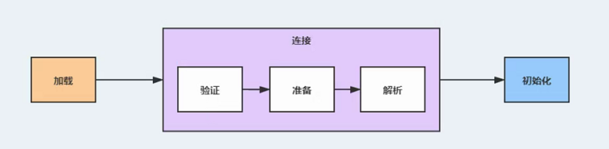

**加载**

加载：又被称为类加载，将.class文件中的内容使用`类加载器`读取到JVM内存中

类加载器组成：引导类加载器、扩展类加载器、应用类加载器

类加载器特点：引导类加载器是扩展类加载器父类；扩展类加载器是应用类加载器父类；

**类加载器的作用：**

引导类加载器：负责加载JDK中核心代码（java.*）
扩展类加载器：负责加载JDK中扩展代码（javax."）
应用类加载器：负责加载我们程序员自己写的代码

应用类加载器在加载时，遵循：`双亲委派机制`

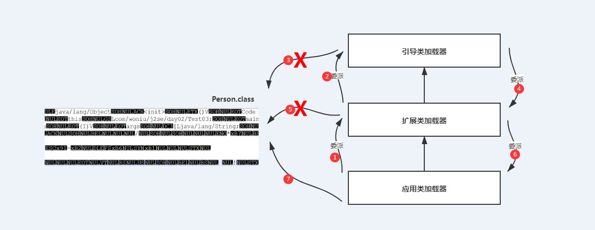

**步骤**：

1. 应用类加载器，委派扩展类加载器进行加载
2. 扩展类加载器，委派引导类加载器进行加载
3. 引导类加载器，发现不该它来加载| 或者是它已经加载过(直接结束)
4. 引导类加载器，委派扩展类加载器进行加载
5. 扩展类加载器，发现不该它来加载| 或者是它已经加载过(直接结束)
6. 扩展类加载器，委派应用类加载器进行加载
7. 应用类加载器，加载该代码

> 双亲委派的作用：防止程序员篡改核心代码和扩展代码
>
> 补充：（程序元写的代码类名、包名等与核心代码、扩展代码相同时，若无“双亲委派”机制验证加载可能导致核心代码、扩展代码被替换）

## 三、类的连接顺序

当类被加载之后，JVM会给这个类创建一个Class对象，如果加载器发现某一个类，已经有Class对象了，那么这个类就不需要再次进行加载。加载完毕后，进入到`连接`阶段。

加载完毕后，进入到连接阶段。

**连接的3个阶段：**

1、`验证`：判断class的内容，是否满足运行条件（七如：1.7的JVM需要判断你的代码是1.8的）

2、`准备`：给类中定义的类属性赋初值，基本数据类型赋值为0，引用数据类型赋值为null；给常量赋值3.14；

3、`解析`：将类中二进制数据中的符号引用，变更为 直接引用 String name = “张三”;

## 四、类的初始化顺序

类初始化就干2件大事：

1.给类中静态常量赋值，例如：PI=3.14；

2.执行类中的静态初始块代码

```java
static{
}
```

**初始化的步骤（面试题）**

1、首先判断该类有无被加载完，若没有加载完，就继续加载。

2、判断父类有没有被初始化，如果父类没有被初始化，那么先初始化它的父类

3、最后，才初始化自己

**在哪些情况下，类会初始化呢？**

1、当创建某一个类的实例的时候

2、调用某一个类的静态方法

3、调用某一个类的静态属性

4、初始化某一个类的子类

5、通过反射调用某一个类的Class对象的时候

6、直接使用java.exe 运行某一个类的时候

# 内部类

## 一、内部类的概念

内部类；一个类写在另外一个类的内部，内部的这个类，就是内部类

> 内部类：成员内部类，静态内部类，局部内部类，匿名内部类(*)

1个lava文件可以存放N多的类，但是1个类必须要有对应的.clas文件！

内部类的特点：

1.内部类可以直接访间外部类的成员，包括私有的

2.外部类不能直接访问内部类的成员，必须要通过间接方式访问、

## 二、成员内部类

类中有什么成员：属性、方法、构造函数、内部类……

```java
class Outer{
    private String a;
    public void eat() {
    }
    public Outer() {}
    /**
     * 成员内部类
     *
     */
    class Inner{
    }
}
```

成员内部类，如何使用？

```java
public class Demo1 {
    public static void main(String[] args) {
        Outer.Inner oi = new Outer().new Inner();
        System.out.println(oi.num);
        oi.print();
    }
}
class Outer{
    private String owner;
    public void eat() {
    }
    public Outer() {}
    /**
     * 成员内部类
     *
     */
    class Inner{
        //内部类的属性
        int num = 1;
        public void print() {
            System.out.println("今晚约不？打麻将");
        }
    }
}
```

*成员内部类的使用案例：电脑(显示器，主机，鼠标，键盘……)*

## 三、静态内部类

一种跟外部类的实例对象，没有任何关系的类！

```Java
public class Demo1 {
    public static void main(String[] args) {
        //静态内部的使用
        Outer.Inner oi = new Outer.Inner();
        System.out.println(oi.num);
        oi.print();
    }
}
class Outer{
    public String a;
    public void eat() {
    }
    public Outer() {}
    /**
     * 静态内部类
     *
     */
    static class Inner{
        //内部类的属性
        int num = 1;
        public void print() {
            System.out.println("今晚约不？打麻将");
        }
    }
}
```

## 四、局部内部类

局部内部类：定义在方法内部的类，该内部类与该方法有关。

局部内部类的调用在产生方法的内部调用，而不是main函数中调用，通过在main方法创建外部类实例，掉要产生方法发生关联。

```java
class Outer{
    public String a;
    public void eat() {
        //局部内部类
        class Inner{
        }
    }
    public Outer() {}
}
```

具体使用：

```java
public class Demo1 {
    public static void main(String[] args) {
        //创建一个外部类的实例
        Outer outer = new Outer();
        outer.eat();
    }
}
class Outer{
    public String a;
    public void eat() {
        //局部内部类
        class Inner{
            int nums = 10;
            public void show() {
                System.out.println("展示自己的才能！！！");
            }
        }
        //产生内部类的实例(并调用属性和行为)
        Inner inner = new Inner();
        System.out.println(inner.nums);
        inner.show();
    }
    public Outer() {}
}
```

## 五、匿名内部类(*)

匿名内部类：一种没有名字的特殊的局部内部类，特殊在：类的定义和类的对象，在同一地方！

匿名内部类的格式

```java
new 抽象类/接口{
    重写的方法
}
```

比如：

```java
new IFly{
    public void fly(){
        System.out.println("我起飞了！！！！");
    }
}
```

什么时候使用匿名内部类？

答案：当某一个类的方法中的形参：是`抽象类`或者是`接口`的话，程序员又不想去写实现类，此时就可以使用匿名内部类

举例说明：

```java
public class Demo1 {
    public static void main(String[] args) {
        Boy boy = new Boy();
        //第1次相亲(匿名内部类：类的定义和对象的产生在同一位置)
        boy.blind(new Girl() {
            @Override
            void response() {
                // TODO Auto-generated method stub
                System.out.println("我养你啊！！！！");
            }
        });
        //第2次相亲
        boy.blind(new Girl() {
            @Override
            void response() {
                // TODO Auto-generated method stub
                System.out.println("哥哥，你要负责养家哦！！！");
            }
        });
    }
}
/**
 * 抽象女孩
 */
abstract class Girl{
    abstract void response();
}
/**
 * 男孩
 */
class Boy{
    /**
     * 抽象类作为形参
     * @param girl
     */
    public void blind(Girl girl) {
        //要求女孩给我们反馈
        girl.response();
    }
}
```

接口也可以作为匿名内部类来使用？

```java
public class Demo1 {
    public static void main(String[] args) {
        Person person = new Person();
        person.studyFly(new IFly() {
            @Override
            public void b() {
                // TODO Auto-generated method stub
                System.out.println("我竖着飞！！！");
            }
            @Override
            public void a() {
                // TODO Auto-generated method stub
                System.out.println("我横着飞！！！");
            }
        });
    }
}
interface IFly{
    //第1种飞
    void a();
    //第2种飞
    void b();
}
class Person{
    public void studyFly(IFly animal) {
        animal.a();
        animal.b();
    }
}
```

## 六、lambda表达式(*)

Lambda表达式：JDK1.8的新特性 作用：解决当接口作为参数时，匿名内部类的编写过于复杂的问题！

> Lambda表达式的使用条件：
>
> 1. 接口作为方法的形参
> 2. 接口中只有1个抽象方法(可以有default，static的方法)

例子1：接口中的方法没有参数

```java
public class Demo1 {
    public static void main(String[] args) {
        // 最原始的写法
//        IFly animal = new FlyImpl();
//        animal.fly();
        // 匿名内部类
//        IFly animal = new IFly() {
//            
//            @Override
//            public void fly() {
//                // TODO Auto-generated method stub
//                System.out.println("我唱着歌飞！！！");
//            }
//        };
//        animal.fly();
        // 箭头函数(前端)，Lambda表达式
        IFly animal = () -> {
            System.out.println("我唱着歌飞！！！");
        };
        animal.fly();
    }
}
interface IFly {
    // 飞
    void fly();
}
class FlyImpl implements IFly {
    @Override
    public void fly() {
        // TODO Auto-generated method stub
        System.out.println("我唱着歌飞！！！");
    }
}
```

例子2：接口的方法有参数(若抽象方法只有一个参数，括号可以省略不写)

```java
public class Demo1 {
    public static void main(String[] args) {
        //给接口产生一个对应的函数实例
        IFly animal = (String a,String b)->{
            System.out.println(a);
            System.out.println(b);
            System.out.println("我正在天空中飞！！！");
        };
        //调用上述的方法
        animal.fly("向左", "向右");
    }
}
interface IFly {
    // 飞
    void fly(String a,String b);
}
```

例子3：有返回值

```java
public class Demo1 {
    public static void main(String[] args) {
        //给接口产生一个对应的函数实例
        IFly animal = (String a,String b)->{
            System.out.println(a);
            System.out.println(b);
            System.out.println("我正在天空中飞！！！");
            return 100;//飞了100米
        };
        //调用上述的方法
        animal.fly("向左", "向右");
    }
}
interface IFly {
    // 飞
    int fly(String a,String b);
}
```

特例：当接口中方法没有返回结果，而且实现也只有1句话的情况下 ，{}可以省略

```java
public class Demo1 {
    public static void main(String[] args) {
        //给接口产生一个对应的函数实例
        IFly animal = (String a,String b)-> System.out.println("我正在天空中飞！！！");
        //调用上述的方法
        animal.fly("向左", "向右");
    }
}
interface IFly {
    // 飞
    void fly(String a,String b);
}
当接口中方法有返回结果，而且实现也只有1句话的情况下 ，{}可以省略，return也可以省略

public class Demo1 {
    public static void main(String[] args) {
        //给接口产生一个对应的函数实例
        IFly animal = (String a,String b)-> 10;
        //调用上述的方法
        System.out.println(animal.fly("向左", "向右"));
    }
}
interface IFly {
    // 飞
    int fly(String a,String b);
}
```

对匿名内部类的替代

```java
public class Demo1 {
    public static void main(String[] args) {
        Person person = new Person();
        //有良心的写法
//        IFly annimal = (String a,String b)->{
//            System.out.println(a);
//            System.out.println(b);
//            System.out.println("我唱着歌飞！！！！");
//        };
        //没有良心的写法
        person.studyFly("向左", "向右", (String a,String b)->{
            System.out.println(a);
            System.out.println(b);
            System.out.println("我唱着歌飞！！！！");
        });
    }
}
interface IFly {
    // 飞
    void fly(String a,String b);
}
class Person{
    public void studyFly(String a,String b,IFly annimal) {
        annimal.fly(a, b);
    }
}
```

## 补充

1、lambda表达式中方法的`修饰符`、`返回值类型`、`方法名`、`方法参数类型`都可以省略；

2、lambda表达式中方法参数只有一个时，参数外的`括号`也可以省略，有多个参数时，括号不能省略；

3、方法体只有一句时，包裹方法体的`大括号`可以省略，对于有返回值的，若是也只有一句return语句，`return也`可以省略