# Object类常用API

## 一、Object 类

Object 类 是所有Java类直接的父类或者间接的父类，所有的Java对象以及数组都实现了该类中的方法！

```java
class A{
}
class B extends A{
}
```

## 二、常见方法

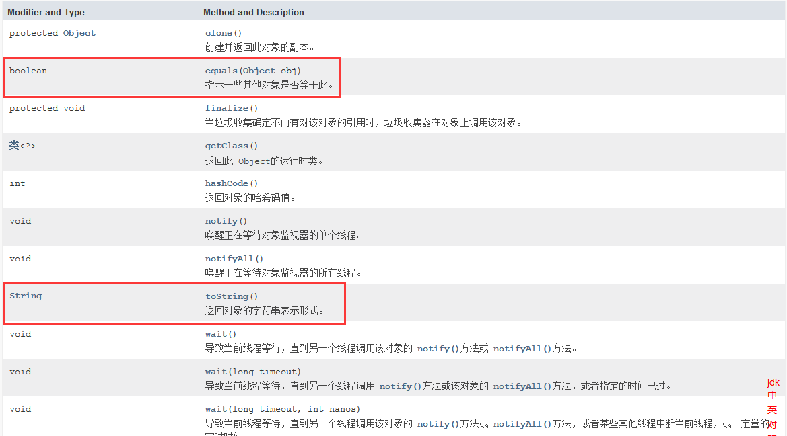

------

toString()

```java
public String toString() {
    return getClass().getName() + "@" + Integer.toHexString(hashCode());
}
```

该方法输出的是：对象的地址的值(Hash算法)

```java
/**
 * 作用：讲解Object的常用方法
 * @author 蜗牛老蒲
 *
 */
public class Demo1 {
    /**
     * 主函数
     * @param args
     */
    public static void main(String[] args) {
        Person person = new Person("张三",20);
        System.out.println(person.toString());
    }
}
/**
 * 人类
 * @author 蜗牛老蒲
 *
 */
class Person{
    /**
     * 姓名
     */
    private String name;
    /**
     * 年龄
     */
    private int age;
    /**
     * 有参构造器
     * @param name 名字
     * @param age 年龄
     */
    public Person(String name, int age) {
        super();
        this.name = name;
        this.age = age;
    }
    /**
     * 无参构造器
     */
    public Person() {
        super();
    }
    public String getName() {
        return name;
    }
    public void setName(String name) {
        this.name = name;
    }
    public int getAge() {
        return age;
    }
    public void setAge(int age) {
        this.age = age;
    }
    @Override
    public String toString() {
        return "Person [name=" + name + ", age=" + age + "]";
    }
}
```

equals()

```java
public boolean equals(Object obj) {
    return (this == obj);
}
```

所以，Object.equals() 默认还比较的地址值！

```java
public class Demo1 {
    /**
     * 主函数
     * @param args
     */
    public static void main(String[] args) {
        Person person01 = new Person("张三" , 20 , "511381");
        Person person02 = new Person("李四" , 22 , "511381");
        //引用数据类型  == 比较对象的地址值
        System.out.println(person01 == person02);
        System.out.println(person01.equals(person02));
    }
}
/**
 * 人类
 * @author 蜗牛老蒲
 *
 */
class Person{
    /**
     * 姓名
     */
    private String name;
    /**
     * 年龄
     */
    private int age;
    /**
     * 身份证
     */
    private String idcard;
    /**
     * 有参构造器
     * @param name 名字
     * @param age 年龄
     * @param idcard 身份证
     */
    public Person(String name, int age, String idcard) {
        super();
        this.name = name;
        this.age = age;
        this.idcard = idcard;
    }
    /**
     * 无参构造器
     */
    public Person() {
        super();
    }
    public String getName() {
        return name;
    }
    public void setName(String name) {
        this.name = name;
    }
    public int getAge() {
        return age;
    }
    public void setAge(int age) {
        this.age = age;
    }
    public String getIdcard() {
        return idcard;
    }
    public void setIdcard(String idcard) {
        this.idcard = idcard;
    }
    @Override
    public boolean equals(Object obj) {
        if(this == obj) {
            return true;
        }
        if(obj instanceof Person) {
            Person p = (Person)obj;
            if(this.idcard.equals(p.getIdcard())) {
                return true;
            }
        }
        return false;
    }
    @Override
    public String toString() {
        return "Person [name=" + name + ", age=" + age + ", idcard=" + idcard + "]";
    }
}
```

`提示`： Alt + Shift + S 选择 Generate Hashcode() And Equals() 可以助你快速重写 equals()方法！

## 三、Eclipse 中查看JDK源码

源码的位置：C:\Program Files\Java\jdk1.8.0_144\src.zip

Eclipse集成JDK源码

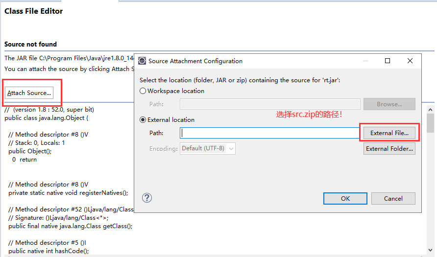

## 四、文档注释的含义

便于某一天，我们也导出自己类的相关的文档介绍！

1. 第一步

   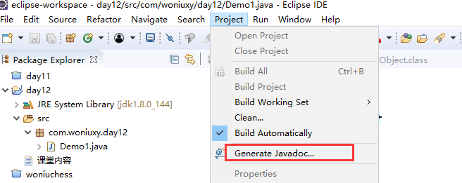

2. 设置项目，文档范围，文档存储路径

   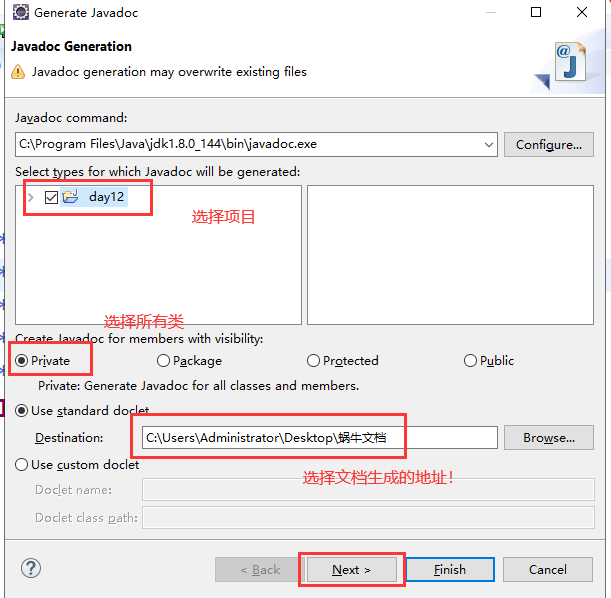

3. 设置导出文档时，中文的编码集

   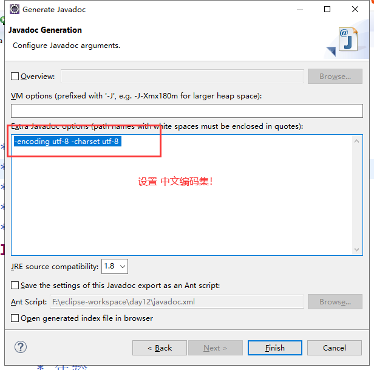

**课堂练习**

需求1：学生类 name idcard telphone 要求：重写toString() 以及equals()

equals() 要求 idcard telphone 只要相同，不管名字相同与否，都返回true

> 1. 定义Student 类，所有属性私有化，并提供getter() 与setter()
> 2. 使用快捷键重写toString()
> 3. 使用快捷键重写equals()，需要选择idcard telphone属性

引用数据类型对象判断是否相等，"=="比较的是地址值（地址值是一个经过哈希算法处理的数）

# 字符串的概念

## 一、字符串

字符串：一组由汉字或者字母构成的 字符的组合

在Java中，字符串是经常在用，Java提供3种字符串处理类：String 、StringBuider、StringBuffer

## 二、String

String 字符串的操作类，它定义的字符串是一个内容不可改变的字符串！它的特点：字符串一旦定义内容，长度均不可变化！

```java
private final char value[];
```

使用字符数组来完成对 字符串的存储， 由于它使用final关键字，导致字符串的内容也不可改变！

使用String创建字符串对象的方式主要有2种：

第一种，使用构造器显示创建

```java
String a = new String("abc");
```

第二种，使用字符串常量隐式创建

```java
String a = "abc";
```

这2种方式，最终的结果都是创建一个“abc”的字符串！但是创建的过程完全不一样！

```java
public class Demo2 {
    public static void main(String[] args) {
        String s1 = "Hello";
        String s2 = "Hello";
        String s3 = "He" + "llo";//Hello
        String s4 = new String("Hello");
        String s5 = new String("Hello");
        System.out.println(s1 == s2);//等于
        System.out.println(s1 == s3);//等于
        System.out.println(s1 == s4);//不等于
        System.out.println(s4 == s5);//不等于
    }
}
```

2种创建方式的内存图：

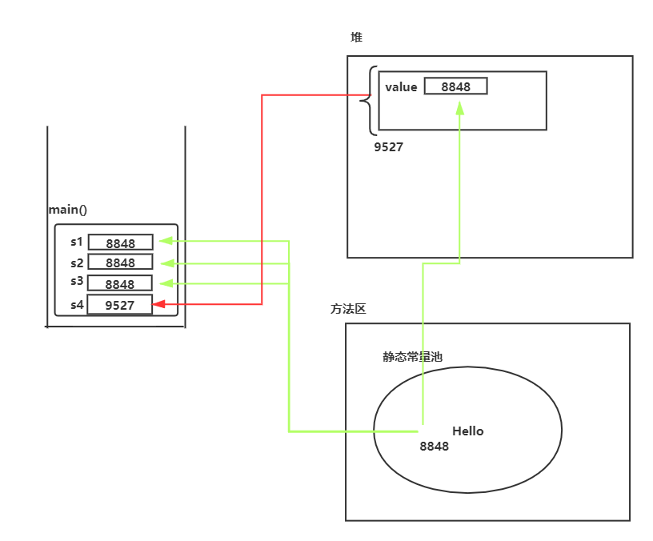

如何查看常量池：

```java
javap -v 某一个类的类名.class
```

String.equals()方法是重写了的！

```java
   public boolean equals(Object anObject) {
        if (this == anObject) {
            return true;
        }
        if (anObject instanceof String) {
            String anotherString = (String)anObject;
            int n = value.length;
            if (n == anotherString.value.length) {
                char v1[] = value;
                char v2[] = anotherString.value;
                int i = 0;
                while (n-- != 0) {
                    if (v1[i] != v2[i])
                        return false;
                    i++;
                }
                return true;
            }
        }
        return false;
    }
```

比较方式：

```java
String a = "abc";//转成char[]
String b = "abc";//转成char[]
a b c……
a b c……
```

> 面试题：引用数据类型中 == 和equals() 的区别
>
> 1. == 比较地址的值
> 2. equals 比较对象的内容是否一致(当然需要你重写)

# String

## 一、String的构造器

```java
new String(); //创建空的字符串引用，但是字符串没有内容
new String(byte[] datas);//将byte 数组对应的Acill 字符，变成字符串
new String(byte[] datas,Charset charset);////将byte 数组对应的Acill 字符，遵循UIF-8的编码集，变成字符串
new String(char[] datas)//将char数组 ，变成字符串
new String(String data);//创建一个String对象，内容是：data的内容
String s = "abc";
```

使用最多的：String s = “abc”;

## 二、常见的API

| 返回值类型     | 方法与描述                                                   |
| :------------- | :----------------------------------------------------------- |
| `char`         | ` charAt(int index)`返回指定索引处的字符                     |
| **`int`**      | **` compareTo(String str)`**按字典顺序比较两个字符串，返回参与比较的两个字符串的ascii码差值 |
| `String`       | ` concat(String str)`将指定字符串连接到此字符串的结尾。      |
| **`boolean`**  | **`contains(CharSequence s)`**判断字符串中是否包含指定字符，当且仅当此字符串包含指定的 char 值序列时，返回 true |
| `String`       | ` toLowerCase()`将字符串转换为小写                           |
| `String`       | ` toUpperCase()`将字符串转换为大写                           |
| `boolean `     | `equalsIgnoreCase(String anotherString)`将一个字符串与另一个字符串进行比较，在比较过程中忽略大小写。参数不为null，且这两个String相等（忽略大小写），则返回true；否则返回false。 |
| `int`          | ` indexOf(String str,int fromIndex)` 返回从 fromIndex 位置开始查找指定字符在字符串中第一次出现处的索引，如果此字符串中没有这样的字符，则返回 -1。 |
| `int `         | `indexOf(String str)`返回指定字符在字符串中第一次出现处的索引，如果此字符串中没有这样的字符，则返回 -1。 |
| **`int`**      | **` length()`**返回字符串的长度。                            |
| **`boolean`**  | **` isEmpty()`**判断字符串的长度是否为空，如果字符串长度为 0，则返回 true，否则返回 false。 |
| `boolean`      | ` startsWith(String prefix)`用于检测字符串是否以指定的前缀开始。如果字符串以指定的前缀开始，则返回 true；否则返回 false。 |
| `boolean `     | `startWith(String prefix,int toffset)`判断字符串从指定索引位置是否以指定的字符串开始。 |
| `boolean `     | `endsWidth(String suffix)`用于检测字符串是否以指定的后缀开始。如果字符串以指定的后缀开始，则返回 true；否则返回 false。 |
| `String`       | `replace(char oldChar,  char newChar)` 返回一个新的字符串，它是经过用 newChar 交换此字符串中呈现的一切 oldChar 而生成的。 |
| `String`       | `replace(CharSequence target, CharSequence replacement)` 返回一个新的字符串，它是经过用 replacement 交换此字符串中呈现的一切 target而生成的。 |
| **`char[] `**  | **`toCharArray()`**将字符串对象中的字符转换为一个字符数组。  |
| `String`       | `trim()`用于删除字符串的头尾空白符。                         |
| `String`       | `substring(int beginIndex )`从指定索引截取字符串到结尾       |
| `String`       | `substring(int beginIndex ,int endIndex)`截取开始索引和结束索引之间的字符串，包含开始索引位置字符串但不包含结束索引之间的字符串 |
| **`String[]`** | **`split(String regex)`**根据传入的正则表达式拆分原字符串为字符串数组。 |

**实例**

获得特定位置的 字符

`char charAt(int index)`

```java
String str = "你好，我是中国人！";//{你 好 ，我 是 中  国 人！}
System.out.println(str.charAt(1));//好
```

比较两个字符串，在字典中出现的先后顺序 负数：前面的字符串先出现；0：表示2个字符串相同; 正数：前面的字符串后出现

`int compareTo(String str)`

```java
String a = "ebc";//{e,b,c}
String b = "abd";//{a,b,d}
//比较两个字符串，在字典中出现的先后顺序   负数：前面的字符串先出现；0：表示2个字符串相同; 正数：前面的字符串后出现
System.out.println(a.compareTo(b));
```

字符串拼接

`String concat(Sstring str)`

```java
String a = "ebc";
String b = "abd";
String c = a.concat(b);//完成字符串的拼接
```

判断某一个字符串中，是否包含子字符串

`boolean contains(CharSequence s)`

```java
String str = "你好，我是中国人！";//{你 好 ，我 是 中  国 人！}
System.out.println(str.contains("中国人"));
```

字符串中，将所有大写转成小写

`String toLowerCase()`

```java
String str = "U67d";
System.out.println(str.toLowerCase());
```

字符串中，将所有小写转成大写

`String toUpperCase()`

```java
String str = "U67d";
System.out.println(str.toUpperCase());
```

判断2个字符串是否相同(String中equals方法是重写过的)

`boolean equals(Object obj)`

```java
String str = "U67d";
String str02 = "U67d";
System.out.println(str.equals(str02));
```

忽略大小写后，再比较2个字符串是否相同

`boolean equalsIgnoreCase(String anotherString)`

```java
String str = "U67d";
String str02 = "u67d";
System.out.println(str.equalsIgnoreCase(str02));
```

从字符串中，找到某一字符的位置

`int indexOf(String str,int fromIndex)`

`int indexOf(String str)`

```java
String str = "U67d";
System.out.println(str.indexOf("6"));
```

获得字符串的长度

`int length()`

```java
String str = "U67d";
System.out.println(str.length());
```

判断字符串是否是个空串

`boolean isEmpty()`

```java
String str = "";
System.out.println(str.isEmpty());
```

判断字符串，是否以某一个 子字符串开头

`boolean startsWith(String prefix)`

`boolean startWith(String prefix,int toffset)`

```java
String str = "我是中国人，我很骄傲！";
System.out.println(str.startsWith("我是"));
```

判断字符串，是否以某一个 子字符串结尾

`boolean endsWidth(String suffix)`

```java
String str = "我是中国人，我很骄傲！";
System.out.println(str.endsWith("骄傲！"));
```

将字符串中某些内容，替换成其他字符串

`String`  `replace(char oldChar,  char newChar)`  返回方法调用字符串中oldChar字符替换为newChar字符后的字符串。 

`String`  `replace(CharSequence target, CharSequence replacement)`  返回方法调用字符串中target字符串替换为replacement字符串后的字符串。 

```java
String str = "我是中国人，我很骄傲！";
str = str.replace("骄傲", "自豪");
System.out.println(str);
```

`char[] ` `toCharArray()`;获取字符串对应的字符数组

```java
String str = "我是中国人，我很骄傲！";
char[] datas = str.toCharArray();
for (char c : datas) {    
    ystem.out.println(c);
}
```

`String` `trim()`;去掉字符串前后的空格

```java
String str = "    我是中国人，我           很骄傲！          ";
System.out.println(str.trim());
```

`String` `substring(int beginIndex )`从字符串中，从某一个位置开始截取剩余的所有内容

```java
String str = "我是中国人，我很骄傲！ ";
System.out.println(str.substring(2));
```

`String` `substring(int beginIndex ,int endIndex)`从字符串中，截取某一部分内容 特点：从2开始，但是不包括5所对应的内容

```java
String str = "我是中国人，我很骄傲！ ";
System.out.println(str.substring(2,5));
```

`String[]` `split(String regex)`按照指定的字符，将某一个字符串进行拆分`字符串数组` (*)

```java
String str = "蒲旭波，佘赛飞，李树成";
String[] strs = str.split(",");//蒲旭波    佘赛飞    李树成
for (String string : strs) {
    System.out.println(string);
}
```

## 三、常见面试题

> 考题1：
>
> ```java
> //        String a = "Hello";//创建1个对象
> //        String b = "He" + "llo";//创建1个对象
> //        String c = new String("Hello");//创建2个对象
>      String a = "He";
>      String b = "llo";
>      String c = "World";
>      String d = a + b + c;
>      System.out.println(d);//创建 He   llo    World     HelloWorld
> ```
>
> 考题2：
>
> ```java
> String s1 = "Hello";
> String s2 = "Hello";
> String s3 = new String("Hello");
> System.out.println(s1 == s2);//true
> System.out.println(s1 == s3);//false
> ```
>
> 考题3：
>
> ```java
> String s1 = "Hello";
> String s2 = "He";
> String s3 = s2 + "llo";
> System.out.println(s1 == s3);//false   s1 在常量池中， s3的数据在堆中 new StringBuilde
> ```
>
> 考试4：
>
> ```java
> String s1 = "Hello";
> String s2 = "He" + "llo";//编译器在编译期间  会自动的拼接  “Hello”
> System.out.println(s1 == s2);//true
> ```

String的equals是重写过的，所以String对象调用equals比较的是值，而非地址。

对象：是存储在堆和常量池中的，

c=a+b,在编译过程中由于ab是变量无法识别，而在运行期间将a和b拼接，动态创建一个对象。

c="gs"+"sd",由于"gs","sd"为常量，在编译过程中直接拼接。

程序只有在运行的时候才能知道变量中的内容，而常量在编译的过程中便被获得。（内存的分配在编译过程？）


**字符串引用为空，字符串为空**

```java
String str;
str==null || "".eauals(str)
```

# StringBuilder和StringBuffer

## 一、StringBuilder

记住：String定义的字符串内容，长度均不可改变。但是StringBuilder内容，长度均可以改变！

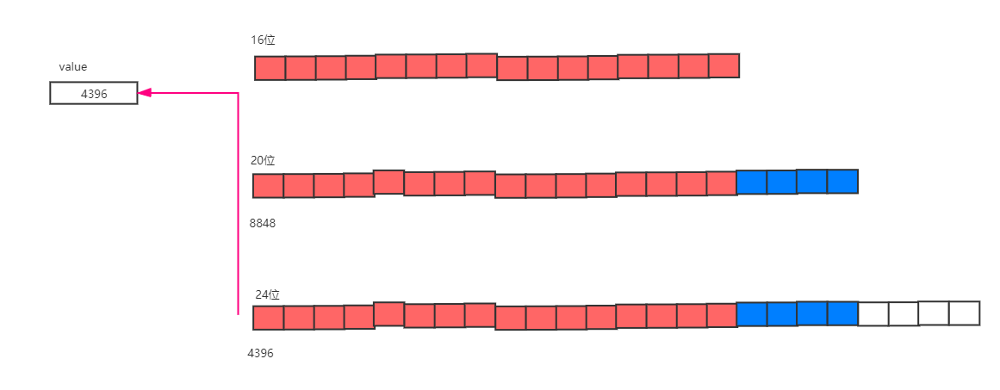

## 二、构造器

```java
StringBuilder();//构造一个没有字符的字符串缓冲区，初始容量为16个字符。 
StringBuilder(String str); //构造一个初始化为指定字符串内容的字符串缓冲区。 容量为参数的长度+ 16。
StringBuilder(int capacity);//构造一个没有字符的字符串缓冲区和指定的初始容量。 
```

```java
StringBuilder(int capacity)的扩容：
    
StringBuffer sb=new StringBuffer(5);
sb.append("1");
sb.append("1");
sb.append("1");
sb.append("1");
sb.append("1");
sb.append("1");
System.out.println("字符串长度"+sb.length());
System.out.println("字符串容量"+sb.capacity());//5*2+2
sb.append("1");
sb.append("1");
sb.append("1");
sb.append("1");
sb.append("1");
sb.append("1");
sb.append("1");
sb.append("1");
System.out.println("字符串长度"+sb.length());
System.out.println("字符串容量"+sb.capacity());//12*2+2
```


## 三、常用API

| 返回值类型         | 方法与描述                                                   |
| :----------------- | :----------------------------------------------------------- |
| **`StringBuffer`** | **`append(String s)`**将指定的字符串追加到此字符序列。       |
| **`StringBuffer`** | **`reverse() `**将此字符序列用其反转形式取代。               |
| **`StringBuffer`** | **`delete(int start, int end)`**删除此序列索引start和end之间`[start，end)`字符串（直接修改的调用该方法的StringBuffer对象） |
| **`StringBuffer`** | **`insert(int offset, int i) `**将第二个 int参数的字符串表示插入到此序列offset位置。 |
| **`StringBuffer`** | **`insert(int offset, String str)`**将 str参数的字符串插入此序列中，从offset位置开始插入。 |
| **`int`**          | **`capacity()`** 返回当前容量。                              |
| **`StringBuffer`** | **`replace(int start, int end, String str) `**使用给定 String中的字符替换此序列的子字符串中的字符`[start，end)`。 |
| `String`           | `toString() `返回此序列中数据的字符串表示形式。              |
| `String`           | `substring(int start)` 返回一个新的 String，它包含此字符序列当前所包含的字符子序列。 |
| `String`           | `substring(int start, int end) `返回一个新的 String，它包含此序列当前所包含的字符子序列。 |
|                    |                                                              |
| `char`             | `charAt(int index) 返回此序列中指定索引处的 `char` 值。      |
| `void`             | `ensureCapacity(int minimumCapacity) `确保容量至少等于指定的最小值。 |
| `void`             | `getChars(int srcBegin, int srcEnd, char[] dst, int dstBegin) `将字符从此序列复制到目标字符数组 dst。 |
| `int`              | `indexOf(String str) `返回第一次出现的指定子字符串在该字符串中的索引。 |
| `int`              | `indexOf(String str, int fromIndex)` 从指定的索引处开始，返回第一次出现的指定子字符串在该字符串中的索引。 |
| `int`              | `lastIndexOf(String str) `返回最右边出现的指定子字符串在此字符串中的索引。 |
| `int`              | `lastIndexOf(String str, int fromIndex) `返回 String 对象中子字符串最后出现的位置。 |
| `void`             | `setCharAt(int index, char ch) `将给定索引处的字符设置为 ch。 |
| `void`             | `setLength(int newLength)` 设置字符序列的长度。              |
| `CharSequence`     | `subSequence(int start, int end) `返回一个新的字符序列，该字符序列是此序列的子序列。 |

**举例**

`StringBuffer`  `append(String s)`追加字符串内容

```java
public static void main(String[] args) {
    StringBuilder sb = new StringBuilder("Hello");
    //字符串的拼接
    sb.append("小蜗牛！");
    //将，插入到下标为5的位置
    sb.insert(5, ",");
    System.out.println(sb.toString());
}
```

 `int`   `capacity()`查看StringBuilder的容量

```java
StringBuilder sb = new StringBuilder("Hello");
//字符串的拼接
sb.append("小蜗牛！");
//将，插入到下标为5的位置
sb.insert(5, ",");
System.out.println(sb.capacity());// 5 + 16
```

`int` `length()`查看StringBuilder的内容长度

```java
StringBuilder sb = new StringBuilder("Hello");
//字符串的拼接
sb.append("小蜗牛！");
//将，插入到下标为5的位置
sb.insert(5, ",");
System.out.println(sb.length());//10    Hello,小蜗牛！
```

`StringBuffer`  `reverse() `将字符串反转

```java
StringBuilder sb = new StringBuilder("Hello");
//字符串的拼接
sb.append("小蜗牛！");
//将，插入到下标为5的位置
sb.insert(5, ",");
System.out.println(sb.reverse());
```

> 思考题：
>
> String str = “abcdef”; 如何实现反转？
>
> ```java
> public static void main(String[] args) {
>     String str = "abcdef";
>     StringBuilder sb = new StringBuilder(str);
>     sb = sb.reverse();//反转
>     System.out.println(sb.toString());
> }
> ```

`String`  `toString() `将StringBuilder 对象转换为String对象

```java
public static void main(String[] args) {
    String str = "abcdef";
    StringBuilder sb = new StringBuilder(str);
    sb = sb.reverse();//反转
    //将StringBuider对象转换为String对象
    String newStr = sb.toString();
    System.out.println(newStr);
}
```

`StringBuffer`  `replace(int start, int end, String str) `替换某些位置的字符内容

```java
public static void main(String[] args) {
    String str = "abcdef";
    StringBuilder sb = new StringBuilder(str);
    //将 下标为：0 - 2 的内容，替换为：拼搏，你不努力
    sb = sb.replace(0, 2, "拼搏，你不努力");
    System.out.println(sb.toString());
}
```

## 四、StringBuffer

StringBuffer 和StringBuilder 提供的API一样!

```java
    public static void main(String[] args) {
        String str = "abcdef";
        StringBuffer sb = new StringBuffer(str);
        //将 下标为：0 - 2 的内容，替换为：拼搏，你不努力
        sb = sb.reverse();
        System.out.println(sb.toString());
    }
```

**唯一的区别就在：**StringBuffer中所有方法都添加了synchronized

StringBuilder

```java
@Override
public StringBuilder replace(int start, int end, String str) {
    super.replace(start, end, str);
    return this;
}
```

StringBuffer

```java
@Override
public synchronized StringBuffer replace(int start, int end, String str) {
    toStringCache = null;
    super.replace(start, end, str);
    return this;
}
```

> synchronized 是个啥？请听后面的分解！

# System

## 一、System

System 是系统类，代表咱的OS系统

常见属性：`in` `out ` `err`

```java
public class Demo1 {
    public static void main(String[] args) {
        String str = "我错了，请原谅我！";
        System.out.println(str);//黑色(正常输出)
        System.err.println(str);//红色(错误信息)
        Person[] persons = new Person[5];
        persons[0].eat();
    }
}
class Person{
    public void eat() {
    }
}
```

## 二、常见API

| 返回值类型       | 方法和描述                                                   |
| :--------------- | :----------------------------------------------------------- |
| `static   void`  | `exit(int status)`终止当前正在运行的 Java 虚拟机。参数用作状态码；非 0 的状态码表示异常终止。 |
| `static   long ` | `currentTimeMillis()`返回系统当前的时间毫秒值。              |
| `static  void`   | `arraycopy(Object src, int srcPos, Object dest, int destPos, int length) `从指定源数组中复制一个数组。数组的复制 (源数组，源数组中需要复制数据的起始位置，目标数组，目标数组需要粘贴的起始位置，源数组中需要复制的元素的个数) |

**举例**

`static  void  ` `exit(int status)`退出虚拟机

```java
public static void main(String[] args) {
    String str = "我错了，请原谅我！";
    System.out.println(str);//黑色(正常输出)
    System.exit(0);//终止了JVM
    System.err.println(str);//红色(错误信息)
}
```

`static  long `  `currentTimeMillis()`获得当前系统的时间(毫秒值)

```java
public static void main(String[] args) {
    String str = "我错了，请原谅我！";
    System.out.println(str);//黑色(正常输出)
    System.out.println("当前系统时间：" + System.currentTimeMillis());
    System.err.println(str);//红色(错误信息)
}
```

`static void`  `arraycopy(Object src, int srcPos, Object dest, int destPos, int length) `数组之间进行复制

```java
public static void main(String[] args) {
    //源数组
    int[] nums = {2,4,6,7,9};
    //目标数组
    int[] dest = new int[10];
    //数组的复制 (源数组，源数组中需要复制数据的起始位置，目标数组，目标数组需要粘贴的起始位置，源数组中需要复制的元素的个数)
    System.arraycopy(nums, 0, dest, 0, nums.length);
}
```

System不能被实例化，system方法都是static的。

length方法用于获取数组的长度。

```java
int[] arr = new int[10];
System.out.println(arr.length);
```

length()用于获取String字符串中字符的个数。

```java
String str = "HelloJava";
System.out.println(str.length());
```

# Arrays

## 一、Arrays

Array 是数组，Arrays 是数组的工具类！

> 特点：
>
> 1. `所有方法都是static的`
> 2. `同样不能被实例化`

## 二、常用API

| 返回值类型             | 方法和描述                                                   |
| ---------------------- | :----------------------------------------------------------- |
| `static    String`     | `toString(Object[] obj)`返回指定数组的内容的字符串表示形式   |
| `static    void`       | `sort(Object[] a)`对指定对象数组根据其元素的自然顺序进行升序排列。同样的方法适用于所有的其他基本数据类型（Byte，short，Int等）。 |
| `static         int[]` | `copyOf(int[] original, int newLength) `数组复制。Arrays.copyOf(需复制的数组, 新数组长度 )。同样适用于char、byte、long等数据类型。（Arrays.copyOf()的底层是：System.arraycopy()） |
| `static   boolean`     | `equals(long[] a, long[] a2)`两个数组以相同顺序包含相同的元素，则两个数组是相等的，返回true。同样的方法适用于所有的其他基本数据类型（Byte，short，Int等）。 |
| `static   int`         | `binarySearch(Object[] a, Object key)`查找某个元素的位置，如果查找值包含在数组中，则返回搜索键的索引；否则返回-1。 |

**举例**

将数组转换为一个 格式非常漂亮的字符串`Arrays.toString(数组)`

```java
public static void main(String[] args) {
    //数组
    int[] nums = {2,4,6,7,9};
    System.out.println(Arrays.toString(nums));
}
```

让数组完成排序(默认升序)`Arrays.sort(数组)`

```java
    public static void main(String[] args) {
        //数组
        int[] nums = {6,4,2,7,9};
        Arrays.sort(nums);//默认升序
        System.out.println(Arrays.toString(nums));
    }
```

数组要完成复制`Arrays.copyOf(需复制的数组, 新数组长度 )`

```java
public static void main(String[] args) {
    //数组
    int[] nums = {6,4,2,1,9};
    //数组的复制
    nums = Arrays.copyOf(nums, 20);
    System.out.println(Arrays.toString(nums));
}
```

> Arrays.copyOf()的底层是：System.arraycopy()
>
> ```java
> public static int[] copyOf(int[] original, int newLength) {
>  int[] copy = new int[newLength];
>  System.arraycopy(original, 0, copy, 0,
>                   Math.min(original.length, newLength));
>  return copy;
> }
> ```

比较2个数组是否相同`Arrays.equals(数组1, 数组2)`;

```java
public static void main(String[] args) {
    //数组
    int[] nums01 = {6,4,2,1,9};
    int[] nums02 = {6,4,2,1,9};
    boolean flag = Arrays.equals(nums01, nums02);
    System.out.println(flag);
}
```

查找某个元素的位置`Arrays.binarySearch(数组, 待查元素)`;

```java
public static void main(String[] args) {
        //数组
        int[] nums01 = {6,4,2,1,9};
        //从数组中查找某个元素的下标
        int index = Arrays.binarySearch(nums01, 2);
        System.out.println(index);
    }
```

Arrays类不能被实例化，arrays方法都是static的。

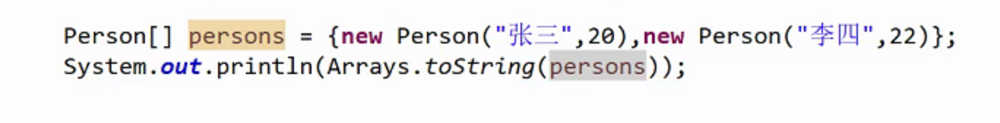

# Math

Math 类是Java中的数学类，该类提供了很多跟数学有关的方法，比如：求绝对值，求平方根，求指数，求对数，求三角函数

> Math类的特点：
>
> 1. `所有的方法都是使用static修饰的方法`
> 2. `不能被实例化(构造器是私有的)`

求某一个数的绝对值(了解)

```java
int i = -3;
System.out.println(Math.abs(i));
```

求2个数中，求最大数

```java
int i = 4;
int j = 5;
System.out.println(Math.max(i,j));
```

求2个数中，求最小数

```java
int i = 4;
int j = 5;
System.out.println(Math.min(i,j));
```

针对浮点数，向上取整

```java
double i = 4.56;System.out.println(Math.ceil(i));//5.0
```

针对浮点数，向下取整

```java
double i = 4.56;System.out.println(Math.floor(i));
```

求某个数的N次方

```java
int i = 3;//求3的10次方System.out.println(Math.pow(i, 10));
```

求某一个浮点数的四舍五入

```java
double i = 3.56;System.out.println(Math.round(i));
```

求范围是0-1的随机数 [0.0 —— 1.0)

```java
System.out.println(Math.random());
```

> 需求：随机生成1个1-10的正整数！
>
> ```java
> int e = (int)Math.floor(Math.random() * 10) + 1;System.out.println(e);
> ```
>
> 需求：随机生成1个0-9的正整数！
>
> ```java
> int e = (int)Math.floor(Math.random() * 10);System.out.println(e);
> ```

**课堂练习**

需求1：生成4位数的随机码(字符串)，每一位的取值范围都是0-9

思路：

1. 循环4次，每次产生一个0-9的随机数，使用字符串将这4次的结果，拼接起来

```java
public static void main(String[] args) {
    String str = "";
    for(int i = 0; i < 4; i ++) {
        int a = (int)Math.floor(Math.random() * 10);
        str += a;
    }
    System.out.println(str);
}
```

# Radom

## 一、Random

Math.random() 确实可以帮助我们产生随机数，但是那个随机数的范围是[0.0 - 1.0)，这时，如果需要转0 - 98以内的随机数，就很麻烦！

解决方案：Random

## 二、常见API

构造器：

```java
Random();Random(long seed)；//种子
```

无参构造器：无法追溯随机值

```java
Random random = new Random();//随机纳秒值进行计算
int a = random.nextInt(10);// 随机获得[0-10)的随机数，不包含10
int c = random.nextInt(10);
System.out.println(a);
System.out.println(c);
Random random02 = new Random();//随机纳秒值进行计算
int b = random02.nextInt(10);// 随机获得[0-10)的随机数，不包含10
int d = random02.nextInt(10);
System.out.println(b);
System.out.println(d);
```

有参构造器：可以追溯随机数

```java
Random random = new Random(10);//将10加入随机计算
int a = random.nextInt(10);// 随机获得[0-10)的随机数，不包含10
int c = random.nextInt(10);
System.out.println(a);
System.out.println(c);
Random random02 = new Random(10);//将10加入随机计算
int b = random02.nextInt(10);// 随机获得[0-10)的随机数，不包含10
int d = random02.nextInt(10);
System.out.println(b);
System.out.println(d);
```

## 三、常见API

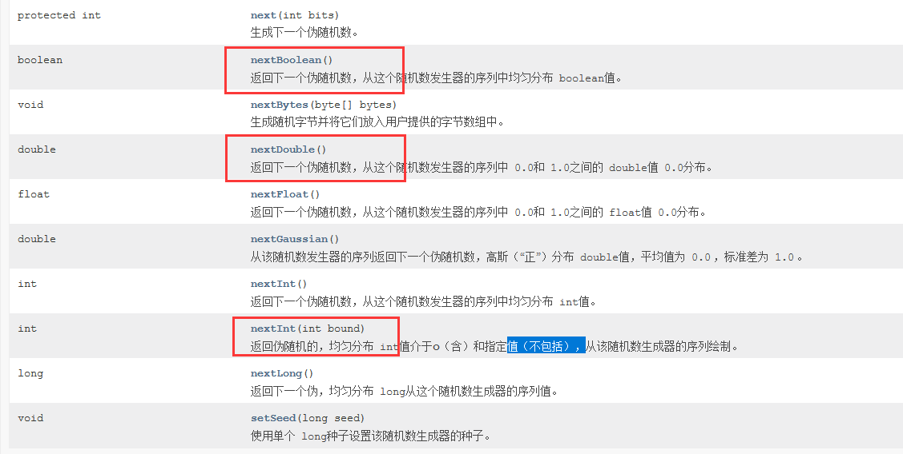

# UUID

## 一、UUID

UUID：Universally Unique Identifier (通用唯一标识) 表示通用唯一标识符的一个类，该类的作用：生成一个36位的由16进制组成的全局唯一的字符串。

该字符串可以表示一个128位的值！目的：让我们系统(单体系统/分布式系统)可以使用它产生一个唯一标识信息！

UUID：基于当前的时间，计数器，和硬件标识(网卡的MAC地址) 数据进行计算的！

基本用法：

```java
String id = UUID.randomUUID().toString();
System.out.println(id);//36位  的16进制的字符构成
```

## 二、递归（扩展）

```java
public static void main(String[] args) {
    int i = 0;
    System.out.println("递归开始！");
    print(i);
    System.out.println("递归结束！");
}
public static void print(int i) {
    if(i >= 100) {
        return;
    }
    System.out.println("我爱你！！！");
    i ++;
    //自己调自己，就是Java中的方法递归
    print(i);
}
```

**课堂练习**

> 案例1：输出aeasdaeaaesdaeasae 包含多少个 ae 要求是：使用递归
>
> ```java
> public class Demo2 {
>  static int count = 0;
>  public static void main(String[] args) {
>      String str = "aeasdaeaaesdaeasae";
>      print(str);
>      System.out.println(count);
>  }
>  private static void print(String str) {
>      int index = str.indexOf("ae");
>      if(index != -1) {
>          count ++;
>          str = str.substring(2 + index);
>          print(str);
>      }
>      return;
>  }
> ```

# BigDecimal

## 一、BigDecimal

BigDecimal：大小数

目的：为了提升小数在参与运算的过程中的精度

举个例子

```java
    public static void main(String[] args) {
        System.out.println(10 / 3);//3
        System.out.println(10.0 / 3);//3.3333333333333335
        System.out.println(0.1 + 0.2);//0.30000000000000004
    }
```

> double 和 float 在参与计算的过程中，可能存在精度损失的问题，导致我们计算结果不精确
>
> 解决方案：使用BigDecimal

## 二、BigDecimal的常见API

常见的构造器

```java
BigDecimal(String val);
BigDecimal(double val);
```

推荐使用String作为参数：

```java
BigDecimal(double val)  无法做到精准
BigDecimal bd1 = new BigDecimal(0.1);
BigDecimal bd2 = new BigDecimal(0.2);
System.out.println(bd1);
System.out.println(bd2);

BigDecimal(String val)  可以做到精准
BigDecimal bd1 = new BigDecimal("0.1");
BigDecimal bd2 = new BigDecimal("0.2");
System.out.println(bd1);
System.out.println(bd2);
```

常用API：小数加减乘除

求和：`bd1.add(bd2)`返回`bd1+bd2`

```java
BigDecimal bd1 = new BigDecimal("0.1");
BigDecimal bd2 = new BigDecimal("0.2");
BigDecimal bd3 = bd1.add(bd2);
System.out.println(bd3);
```

求差：`bd1.subtract(bd2)`返回`bd1-bd2`

```java
BigDecimal bd1 = new BigDecimal("0.1");
BigDecimal bd2 = new BigDecimal("0.2");
BigDecimal bd3 = bd1.subtract(bd2);
System.out.println(bd3);
```

求积：`bd1.multiply(bd2)`返回`bd1*bd2`

```java
BigDecimal bd1 = new BigDecimal("0.1");
BigDecimal bd2 = new BigDecimal("0.2");
BigDecimal bd3 = bd1.multiply(bd2);
System.out.println(bd3);
```

求商：`bd1.divide(bd2)`返回`bd1/bd2`

```java
BigDecimal bd1 = new BigDecimal("0.1");
BigDecimal bd2 = new BigDecimal("0.2");
BigDecimal bd3 = bd1.divide(bd2);
System.out.println(bd3);
```

> 注意：当如果除法计算时，除不尽，需要设定小数点的位数，以及舍去模式
>
> ROUND_DOWN 去尾模式（直接去掉后面的数据）
>
> ROUND_UP 丢失后面的数据时，如果下一位不是0，就向前进1
>
> ROUND_HALF_UP 四舍五入

`bd1.divide(bd2，小数位数，保留小数形式)`

`BigDecimal.ROUND_DOWN`；去尾模式

` BigDecimal.ROUND_UP`；丢失后面小数，若下一位非零则进1位，若为0则不进；

`BigDecimal.ROUND_UP`；四舍五入

```java
BigDecimal bd1 = new BigDecimal("10.7");
BigDecimal bd2 = new BigDecimal("3");//3.333 
BigDecimal bd3 = bd1.divide(bd2,5,BigDecimal.ROUND_DOWN);//去尾模式
 BigDecimal bd3 = bd1.divide(bd2,3,BigDecimal.ROUND_UP);//丢失后面的数据时，向前进1
BigDecimal bd4 = bd1.divide(bd2,3,BigDecimal.ROUND_HALF_UP);//四舍五入
System.out.println(bd3);
System.out.println(bd4);	 		
```

设置小数位数：`db.setSale(小数位数，保留小数形式)`

```java
BigDecimal bd1 = new BigDecimal("0.00232");
BigDecimal bd2 = new BigDecimal("0.022");
BigDecimal bd3 = bd1.multiply(bd2);
System.out.println(bd3);
//setScale 设定小数点的位数
BigDecimal bd4 =  bd3.setScale(5, BigDecimal.ROUND_HALF_UP);
System.out.println(bd4);
```

# 包装类

## 一、包装类

Java是一种面向对象的语言，它提倡的是：一切都是对象。但是，我们基本数据类型不是对象，基本数据类型在一定程度上已经满足绝大部分要求， 但是某些特殊场合下，它不行

```java
public class Demo2 {
    public static void main(String[] args) {
        Student stu1 = new Student("张三");
        Student stu2 = new Student("林志玲");
        System.out.println(stu1);
        System.out.println(stu2);
    }
}
class Student{
    private String name;
    private int age;
    /**
     * 0 女 1-男   -1 未知
     */
    private int gender;
    public Student(String name) {
        super();
        this.name = name;
    }
    public String getName() {
        return name;
    }
    public void setName(String name) {
        this.name = name;
    }
    public int getAge() {
        return age;
    }
    public void setAge(int age) {
        this.age = age;
    }
    public int getGender() {
        return gender;
    }
    public void setGender(int gender) {
        this.gender = gender;
    }
    @Override
    public String toString() {
        return "Student [name=" + name + ", age=" + age + ", gender=" + gender + "]";
    }
}
```

> 解决方案：使用包装类

## 二、Java的包装类

包装类：将基本数据类型的数据，使用一个类将它包装起来

8种基本数据类型，Java都提供了对应的包装类

| 基本数据类型 | 包装类    |
| :----------- | :-------- |
| byte         | Byte      |
| short        | Short     |
| int          | Integer   |
| long         | Long      |
| float        | Float     |
| double       | Double    |
| char         | Character |
| boolean      | Boolean   |

修改后的代码：

```java
public class Demo2 {
    public static void main(String[] args) {
        Student stu1 = new Student("张三");
        Student stu2 = new Student("林志玲");
        System.out.println(stu1);
        System.out.println(stu2);
    }
}
class Student{
    private String name;
    private Integer age;
    /**
     * 0 女 1-男   -1 未知
     */
    private Integer gender;
    public Student(String name) {
        super();
        this.name = name;
    }
    public String getName() {
        return name;
    }
    public void setName(String name) {
        this.name = name;
    }
    public Integer getAge() {
        return age;
    }
    public void setAge(Integer age) {
        this.age = age;
    }
    public Integer getGender() {
        return gender;
    }
    public void setGender(Integer gender) {
        this.gender = gender;
    }
    @Override
    public String toString() {
        return "Student [name=" + name + ", age=" + age + ", gender=" + gender + "]";
    }
}
```

# 包装类的常用方法

## 一、包装类的继承结构

包装类实际上可以分为2大结构：一组是数值型，包括：Byte、Short、Integer、Long、Float、Double 它们的父类都是Number；另一组；Character和Boolean它们的父类直接就是Object

> 使用包装类，需要注意的是：
>
> 1. 所有的包装类都是final修饰过的，不能去创建它的子类
> 2. 包装类都对应不同基本数据类型，不能混搭

## 二、常见的API

以Integer为例

Integer 它是属于int的包装类

> 构造器
>
> ```java
> Integer(int value);
> Integer(String s);
> ```
>
> 用法：
>
> ```java
> int a = 10;
> //将a 对应的10，进行一次包装
> Integer in = new Integer(a);
> System.out.println(in);
> String s = "10";
> Integer in2 = new Integer(s); 
> System.out.println(in2);
> ```

自动装箱

```java
int a = 10;
//将a 对应的10，进行一次包装
Integer in = new Integer(a);//将int 值转换为Integer对象   装箱
System.out.println(in);
//上述的代码，可以使用下面的一行代码替代(从JDK1.5开始)    
Integer in2 = a;//自动装箱
```

`valueOf()`与`intValue()`

```java
int a = 10;
//将a 对应的10，进行一次包装
//Integer in = new Integer(a);//将int 值转换为Integer对象   装箱
Integer in = Integer.valueOf(a);//将int 值转换为Integer对象   装箱
System.out.println(in);
int b = in.intValue();//将Integer对象 转换为int值     拆箱
System.out.println(b);
Integer in2 = a;//自动装箱
int c = in2;//自动拆箱
```

比如：两2个Integer的值是否一样

```java
Integer a = 10;
Integer b = 10;
System.out.println(a.equals(b));
```

比如：用户输入的”12”，变化为int的值

```java
String a = "10";
//        Integer in = new Integer(a);  第1种方式
//        int c =in;
int c = Integer.parseInt(a);//第2种方式
int b = 12;
System.out.println(c * b);
```

> 注意：Integer.parseInt(a) 能针对的字符串，一定是：数值类型的字符串
>
> ```java
>     String a = "蒲旭波";
> //        Integer in = new Integer(a);//第1种方式
>         int c = Integer.parseInt(a);//第2种方式
>         int b = 12;
>         System.out.println(c * b);
> ```

## 面试题

```java
Integer a = new Integer(127);
Integer b = new Integer(127);
System.out.println(a == b);//false   原因是：地址不一样
Integer a = new Integer(128);
Integer b = new Integer(128);
System.out.println(a == b);//false    原因是：地址不一样
Integer a = 127;//自动装箱    (针对-128 到 127 之间的值，会自动缓存支持)
Integer b = 127;//自动装箱
System.out.println(a == b);//true
Integer a = 128;//自动装箱
Integer b = 128;//自动装箱
System.out.println(a == b);//false
```

原因：针对-128 到 127 之间的值，会自动缓存支持

```java
    public static Integer valueOf(int i) {
        if (i >= IntegerCache.low && i <= IntegerCache.high)
            return IntegerCache.cache[i + (-IntegerCache.low)];
        return new Integer(i);
    }
```

其他的包装类，操作方式跟上面的一模一样！

## 三、包装类都提供了对应的取值范围

```java
int max = Integer.MAX_VALUE;
int min = Integer.MIN_VALUE;
double max2 = Double.MAX_VALUE;
double min2 = Double.MIN_VALUE;
```

**课堂练习**

> 需求1： 将String str = “3.14”; 转换为double值
>
> ```java
> String str = "3.14";
> double d = Double.parseDouble(str);
> System.out.println(d);
> ```
>
> 需求2：将Double d = 3.14; 转换为String字符串
>
> ```java
> double d = 3.14;
> String str = ""+d;
> System.out.println(str);
> 
> 方法二：
> Double d2=new Double(d);
> String str=Double.toString(d2);
> 
> 方法二简化：
> String str=Double.toString(new Double("3.14"));
> ```
>
> 需求3：将Double d = 3.14; int a = 4; 求圆的面积，要求保留2位小数(四舍五入模式)
>
> ```java
> double d = 3.1415926;
> int a = 4;//半径
> double r = d * Math.pow(a, 2);
> BigDecimal bd = new BigDecimal(r);
> BigDecimal bd2 =  bd.setScale(2, BigDecimal.ROUND_HALF_UP);
> System.out.println(bd2);
> ```
>
> 需求4：求int a = 15; 使用Integer 求它的16进制数
>
> ```java
> int a = 45;
> String hex = Integer.toHexString(a);//10进制转为16进制
> String bin = Integer.toBinaryString(a);//转2进制
> String oct = Integer.toOctalString(a);//10进制转转8进制
> System.out.println(hex);
> System.out.println(bin);
> System.out.println(oct);
> ```

数字字符串转换为int数字：`parseInt(数字字符串)`

# 日期API

## 一、Date

Date 日期类，就是代表Java中的日期

构造器

```java
Date()；//就是当前的时间
Date(long date);//返回程序员设置的时间
```

举例

```java
//获得当前的时间
//        Date date = new Date();
//        System.out.println(date);
//显示程序员设置的时间
long time = 12312312243431L;
Date date = new Date(time);
System.out.println(date);
```

## 常用API

`getTime()`：返回自1970年1月1日以来，由此 `Date`对象表示的00:00:00 GMT的毫秒数。

`setTime(long time)`：设置此 `Date`对象以表示1970年1月1日00:00:00 GMT后的 `time`毫秒的时间点。

```java
//获得当前的时间
Date date = new Date();
long time = date.getTime();//获得1970-01-01 到现在时间的毫秒值
System.out.println(time);//1622701492389
```

```java
date.setTime(16227014989L);//设置时间内部的毫秒值
```

## 二、SimpleDateFormat

需求：日期格式化

```java
Thu Jun 03 14:28:49 CST 2021     ---> 
2021-06-03 14:28:49   （yyyy-MM-dd hh:mm:ss）
```

| 模 式 字 母 | 日期或时间元素           | 示例       |
| :---------- | :----------------------- | :--------- |
| G           | 公元                     | 公元       |
| y           | 年                       | 1996、 96  |
| M           | 年中的月份               | 一月、二月 |
| w           | 年中的周数               | 27         |
| W           | 月份中的周数             | 2          |
| D           | 年中的天数               | 189        |
| d           | 月份中的天数             | 10         |
| F           | 月份中的星期             | 2          |
| E           | 星期中的天数             | 星期五     |
| a           | 上午/下午 标记           | AM/PM      |
| H           | 一天中的小时数（0-23）   | 0          |
| k           | 一天中的小时数（1-24）   | 24         |
| K           | am/pm 中的小时数（0-11） | 0          |
| h           | am/pm 中的小时数（1-12） | 12         |
| m           | 小时中的分钟数           | 30         |
| s           | 分钟中的秒数             | 55         |
| S           | 毫秒数                   | 978        |
| z           | 时区                     | GMT-08:00  |
| Z           | 时区                     | -0800      |

```java
//获得当前的时间
Date date = new Date();
//yyyy-MM-dd hh:mm:ss  长格式日期
//yyyy-MM-dd 短格式日期
SimpleDateFormat sdf = new SimpleDateFormat("yyyy-MM-dd hh:mm:ss");
String str = sdf.format(date);
System.out.println(str);
```

需求：String str = “1997-07-01 09:00:00”; 转换成时间

```java
String str = "1997-07-01 09:00:00";       
SimpleDateFormat sdf = new SimpleDateFormat("yyyy-MM-dd hh:mm:ss");       
//parse 将字符串 解析为 日期        
Date date = sdf.parse(str);        
System.out.println(date);
```

> 练习题：
>
> 说老蒲是：1986-12-03 的人，问他活了多少天？
>
> ```java
> String str = "1986-12-03";
> SimpleDateFormat sdf = new SimpleDateFormat("yyyy-MM-dd");
> Date date = sdf.parse(str);//出生日期
> Date current = new Date();//现在日期
> long time = current.getTime() - date.getTime();//得到毫秒值
> System.out.println("总共多少天：" + time /1000/3600/24);
> ```

## 常用API

`format(Date date)`

`parse(String str)`

## 三、Calendar

Calendar 日历类 JDK1.1提供出来的，主要解决日期Date类，不兼容国际化支持，操作麻烦等问题！

Calendar 是个抽象类，但是提供的getInstance() 可以获得它的实例

```java
//获得日历类的实例
Calendar cal = Calendar.getInstance();
//从日历中，显示时间
System.out.println(cal.getTime());
String str = "1997-07-01";
SimpleDateFormat sdf = new SimpleDateFormat("yyyy-MM-dd");
//从日历中，设置一个时间
cal.setTime(sdf.parse(str));
System.out.println(cal.getTime());
```

## 常见API

`setTime(Date date)`：使用给定的 `Date`设置此日历的时间。

`getTime()`：返回一个 Date表示此物体 Calendar的时间值（毫秒从偏移 Epoch ）。

```java
public class Demo4 {
    public static void main(String[] args) throws ParseException {
        //获得日历类的实例
        Calendar cal = Calendar.getInstance();
        //从日历中，显示时间
        System.out.println(cal.getTime());
        //得到日期的年份
        System.out.println(cal.get(Calendar.YEAR));
        //得到日期的月份
        System.out.println(cal.get(Calendar.MONTH) + 1);
        //计算当月的第几天
        System.out.println(cal.get(Calendar.DAY_OF_MONTH));
        //计算这是本周的第几天
        System.out.println(cal.get(Calendar.DAY_OF_WEEK));
        //计算这是本年的第几天
        System.out.println(cal.get(Calendar.DAY_OF_YEAR));
        //计算这是本天的第多少个小时 == HOUR
        System.out.println(cal.get(Calendar.HOUR_OF_DAY));
        //下午3点(12小时)
        System.out.println(cal.get(Calendar.HOUR));
        //        //在时间的基础上，添加30000天，计算是那一年
               cal.add(Calendar.DATE, 30000);
                System.out.println(cal.getTime());
        //在时间的基础上，添加50年，计算是那一年
                cal.add(Calendar.YEAR, 50);
                System.out.println(cal.getTime());
        //设置固定的日期
                cal.set(Calendar.YEAR, 1997);
                cal.set(Calendar.MONTH, 07);
                cal.set(Calendar.DATE, 01);
                
                System.out.println(cal.getTime());
                String str = "1997-07-01";
                SimpleDateFormat sdf = new SimpleDateFormat("yyyy-MM-dd");
        //        //从日历中，设置一个时间
               cal.setTime(sdf.parse(str));          
             System.out.println(cal.getTime());
    }
}
```

**课堂练习**

> 需求1：定义一个DateUtil类static Date parse(String str, String pattern) ; static String format(Date date , String pattern)

`getTime(Date)`用于获取带有时间的日期(以毫秒为单位)。返回值为`long`型号

`setTime(long time)`

# JDK1.8日期API

## 一、LocalDate

LocalDate ：日期类 ，代表年月日

```java
//获取当前的日期
LocalDate date = LocalDate.now();
System.out.println(date);
//定义到某一个特定的日期
//        LocalDate date = LocalDate.of(1997, 07, 01);
System.out.println(date);
System.out.println(date.getYear());//获得年
System.out.println(date.getDayOfMonth());//获得当月的第几天
System.out.println(date.getDayOfYear());//获得当年的第几天
System.out.println(date.getMonthValue());//JDK1.8中针对月份已经调整
System.out.println(date.getDayOfWeek());//获得星期数据
//格式化
DateTimeFormatter formatter = DateTimeFormatter.ofPattern("dd-MM-yyyy");
String str = date.format(formatter);
System.out.println(str);
```

## 二、LocalTime

LocalTime：时间类 ，代表时分秒，甚至还有纳秒

```java
//获得当前的时间
LocalTime time = LocalTime.now();//16:21:16.234
System.out.println(time);
System.out.println(time.getHour());//获得小时
System.out.println(time.getMinute());//获得分钟
System.out.println(time.getSecond());//获得秒数
System.out.println(time.getNano());//获得纳秒值
//设置特定的时间
LocalTime lt = LocalTime.of(12, 12, 12);
//时间的比较
System.out.println(lt.isBefore(time));
System.out.println(lt.equals(time));
System.out.println(lt.isAfter(time));
//格式化
String str = time.format(DateTimeFormatter.ofPattern("ss:mm:HH"));
System.out.println(str);
```

## 三、LocalDateTime

LocalDateTime：日期时间类 ，代表年月日 时分秒

```java
//获得当前的时间
LocalTime time = LocalTime.now();//16:21:16.234
System.out.println(time);
System.out.println(time.getHour());//获得小时
System.out.println(time.getMinute());//获得分钟
System.out.println(time.getSecond());//获得秒数
System.out.println(time.getNano());//获得纳秒值
//设置特定的时间
LocalTime lt = LocalTime.of(12, 12, 12);
//时间的比较
System.out.println(lt.isBefore(time));
System.out.println(lt.equals(time));
System.out.println(lt.isAfter(time));
//格式化
String str = time.format(DateTimeFormatter.ofPattern("ss:mm:HH"));
System.out.println(str);
```

# 泛型

## 一、泛型

请看以下代码：

```java
//想办法规定，集合中只能放String类型
ArrayList<String> datas = new ArrayList<String>();
datas.add("张三");
datas.add("李四");
datas.add(8);//编译错误
//排序
Collections.sort(datas);
System.out.println(datas);
```

> 从上述代码中，咱也可以分析出：泛型用来规范集合中的元素的类型
>
> 泛型的格式：
>
> ```java
> <数据类型>
> ```

注意：不是所有的类，都可以使用<>泛型

## 二、泛型类/接口

一、泛型类

```Java
/**
 * 泛型类
 *
 * @param <T>    T是随意的一个字符
 */
class Person<T>{
}
```

二、泛型接口

```Java
/**
 * 泛型接口
 *
 * @param <T>    T是随意的一个字符
 */
interface IFly<T>{
}Java
```

## 三、泛型方法

在泛型方法之前，一定要先定义泛型类或者泛型接口。原因是：方法定义在类和接口中的

```java
public class Demo3 {
    public static void main(String[] args) {
        Person<Rice> person = new Person<Rice>() {
            @Override
            void eat(Rice t) {
                // TODO Auto-generated method stub
                System.out.println("快乐的吃大米！！！！");
            }
        };
        person.eat(new Rice());
        IFly<String,Integer> fly = new IFly<String,Integer>() {
            @Override
            public void fly(String t) {
                // TODO Auto-generated method stub
            }
            @Override
            public void fly(String t, Integer e) {
                // TODO Auto-generated method stub
            }
        };
    }
}
/**
 * 泛型接口
 *
 * @param <T>    T是随意的一个字符
 */
interface IFly<T,E>{
    /**
     * 泛型方法
     * @param t
     */
    void fly(T t);
    void fly(T t,E e);
}
/**
 * 泛型类
 *
 * @param <T>    T是随意的一个字符
 */
abstract class Person<T>{
    abstract void eat(T t);
}
/**
 * 大米类
 */
class Rice{
}
```

## 四、泛型通配符

泛型通配符：就是？ 统配的含义，就是什么类型都可以

```java
ArrayList<?> datas = new ArrayList<>();
```

**作用：**帮我们去掉小黄灯

**使用的条件：**在不知道元素的类型的情况

## 五、泛型擦除

```Java
abstract class Person<T>{    abstract void eat(T t);}
```

T 这东西，会在编译器编译代码时，将会由 具体类 直接替换掉！在编译阶段，这东西就被擦除掉了！

## 补充

**1、非泛型类中可以定义泛型方法**

```java
public class GenericMethod {
   <T>void sampleMethod(T[] array) {
      for(int i=0; i<array.length; i++) {
         System.out.println(array[i]);
      }
   }
   public static void main(String args[]) {
      GenericMethod obj = new GenericMethod();
      Integer intArray[] = {45, 26, 89, 96};
      obj.sampleMethod(intArray);
      String stringArray[] = {"Krishna", "Raju", "Seema", "Geeta"};
      obj.sampleMethod(stringArray);
   }
}
```

**2、泛型类中也可以定义非泛型方法。**

```java
class People<T>{
	public int add(T t) {
		return 3;
	}
	
	public int sub() {
		return 3;
	}
	public int opp(int a,int b) {
		return a-b;
	}
}
```

**泛型擦除过程**

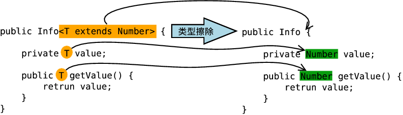


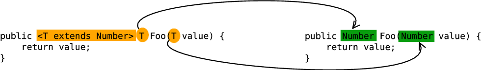

**泛型不能实例化**

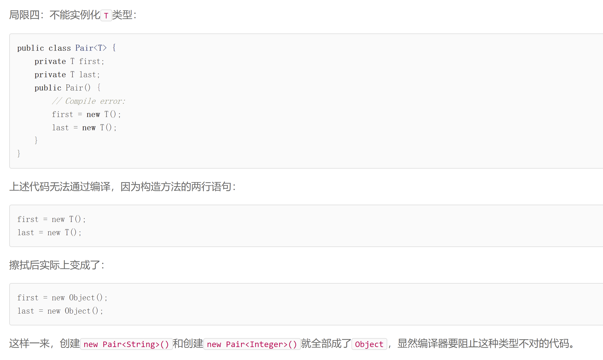

**泛型T不能直接获取T.class，必须通过反射获取**

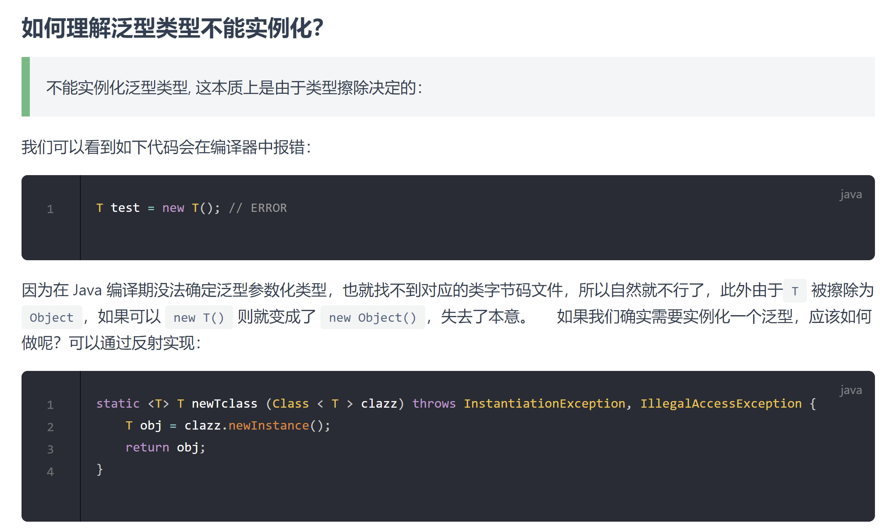

**泛型小结**

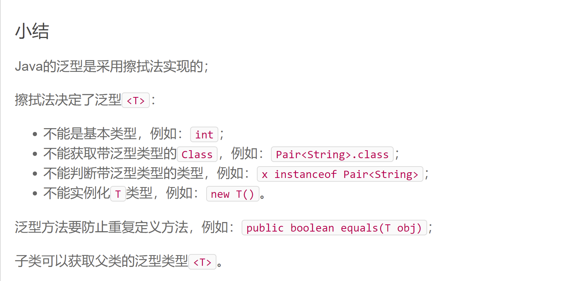

## 泛型补充


## 泛型方法

````java
public static <T> Pair<T> create(T first, T last) {
    return new Pair<T>(first, last);
}

public <T> Pair<T> createNum(T first, T last) {
    return null;
}

static <T> T handleData(T t, String[] names){
    return t;
}
````

使用泛型之前一定要对泛型进行声明，在返回值之前的<T>就是对泛型类型的声明

````java
public <T> T getMapper(Class<T> type) {
		return null;
	}

第一个<T>表示这个方法是一个泛型的方法(若不加，编译器会把T当作String一样的数据类型，会报错，<T>的作用就是告诉编译器这是一个泛型方法，返回值类型，形参类型都不确定，被调用时确定T具体代指的类型)

第二个T 表示是这个方法返回的类型

第三个Class<T>表示获取T类型的class
````

# 枚举的概念

## 一、枚举

Java中的魔法值：

```java
int[] nums = new int[20];
//…… 间隔了很多代码
for(int i = 0; i < 20; i ++){
    //一串代码
}
```

> 其中的20 就是一个魔法值，因为它具备了很多含义：可能是数组的长度，也可能是循环的次数

```java
class Person{
    private String name;
    private int gender;
   //setter() 和 getter()
}
main(String[] args){
    Person person = new Person();
    person.setName("张三");
    person.setGender(0);
}
```

> 其中的0 就是一个魔法值，因为它具备了很多含义：可能是性别0，也可能变成一个数字0

解决方案：`使用static final` | `枚举`

枚举：是JDK1.5之后提供的一种 专门用来存储==整形常数==的集合。在日常中使用的比较多：性别(男/女) 一周(7天) 一年4季(春夏秋冬) 颜色(红黑白蓝灰……)

类似于==当某一个变量只有有限的几个值的时候，我们可以使用枚举类型==

```java
enum GenderType{
    MAN,WOMAN
}
```

在使用时：

```java
class Person{
    private String name;
    private GenderType gender;
   //setter() 和 getter()
}
main(String[] args){
    Person person = new Person();
    person.setName("张三");
    person.setGender(GenderType.MAN);
}
```

## 二、枚举的定义

语法格式：

```java
访问修饰符 enum 枚举的名称{
    枚举的实例
}
```

```java
public class Demo3 {
    public static void main(String[] args) {
        //0-红色  1-灰色 2-蓝色 3-绿色 4-黄色  5-白色 6-黑色
        System.out.println(ColorType.BLACK);
    }
}
enum ColorType{
    RED,GREEN,WHITE,BLACK,BLUE,YELLOW
}
```

具体的使用

```java
public class Demo3 {
    public static void main(String[] args) {
        ColorType type = ColorType.GREEN;
        switch (type) {
        case GREEN:
            System.out.println("我是健康色！大家都喜欢");
            break;
        case RED:
            System.out.println("我是中国红！");
            break;
        case WHITE:
            System.out.println("我是天空白！");
            break;
        case BLACK:
            System.out.println("我是夜晚黑！");
            break;
        default:
            break;
        }
    }
}
enum ColorType{
    RED,GREEN,WHITE,BLACK,BLUE,YELLOW
}
```

## 三、枚举的进阶

在枚举中定义属性，和定义构造器

> 要求：构造器必须是私有的。枚举的实例，必须放置在代码的第1行

```java
public class Demo3 {
    public static void main(String[] args) {
        //0-红色，1-灰色 ，2-绿色……
        ColorType type = ColorType.GREEN;
        switch (type) {
        case GREEN:
            System.out.println(type);
            System.out.println(type.getValue());
            System.out.println("我是健康色！大家都喜欢");
            break;
        case RED:
            System.out.println("我是中国红！");
            break;
        case WHITE:
            System.out.println("我是天空白！");
            break;
        case BLACK:
            System.out.println("我是夜晚黑！");
            break;
        default:
            break;
        }
    }
}
enum ColorType{
    //根据枚举类，创建枚举对象(语法：必须放置代码的第1行)
    RED(0,"红的发亮"),GREEN(1,"绿的心慌"),WHITE(2,"白的刺眼"),BLACK(3,"五彩斑斓的黑"),BLUE(4,"天空的蓝"),YELLOW(5,"带颜色的黄");
    //在枚举中添加属性
    private int value;
    private String desc;
    //创建枚举的构造器(要求：必须私有)
    private ColorType(int value,String desc) {
        this.value = value;
         this.desc = desc;
    }
    public int getValue() {
        return value;
    }
}
```

**枚举的name()方法和toString()方法**

```java
public abstract class Enum<E extends Enum<E>> implements Comparable<E>, Serializable {

    private final String name;
        public final String name() {
        return name;
    }
    
    public String toString() {
        return name;
    }
    //……
}
```

枚举的name()方法返回类型为String ，返回枚举常量的名称，toString()方法默认也是返回枚举常量的名称，而重写toStirng()方法后会返回重写方法的值，而name()无法被重写，永远返回的是枚举常量的名称。

```java
package com.apexsoft.prac.enums;/**
 * @author TangXiaoGang
 */

import lombok.ToString;

/**
 * @Author: TangXiaoGang
 * @Date: 2023/2/6
 * @Description:
 */
public enum Weather {

    SPRING(1,"春季"),
    SUMMER(1,"夏季"),
    AUTUMN(1,"秋季"),
    WINTER(1,"冬季");

    private Integer value;
    private String name;
    private Weather(Integer value,String name){
        this.value = value;
        this.name = name;
    }
    public Integer getValue(){
        return this.value;
    }
    public String getName(){
        return this.name;
    }

    @Override
    public String toString() {
        switch (this){
            case SPRING:
                return "SPRING春季";
            case SUMMER:
                return "SUMMER夏季";
            case AUTUMN:
                return "AUTUMN秋季";
            case WINTER:
                return "WINTER冬季";
            default:
                return "";
        }
    }
}
```

```java
public class EnumTest {
    private static final Logger logger = LoggerFactory.getLogger(EnumTest.class);

    @Test
    public void t(){
        Weather weather = Weather.SPRING;
        System.out.println(weather.getValue());
        System.out.println(weather.getName());
        System.out.println("name()结果 ----->" + weather.name());
        System.out.println("toString()结果 ----->" + weather);
    }
}
```

结果

```java
1
春季
name()结果 ----->SPRING
toString()结果 ----->SPRING春季
```
