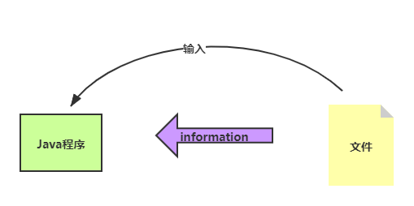
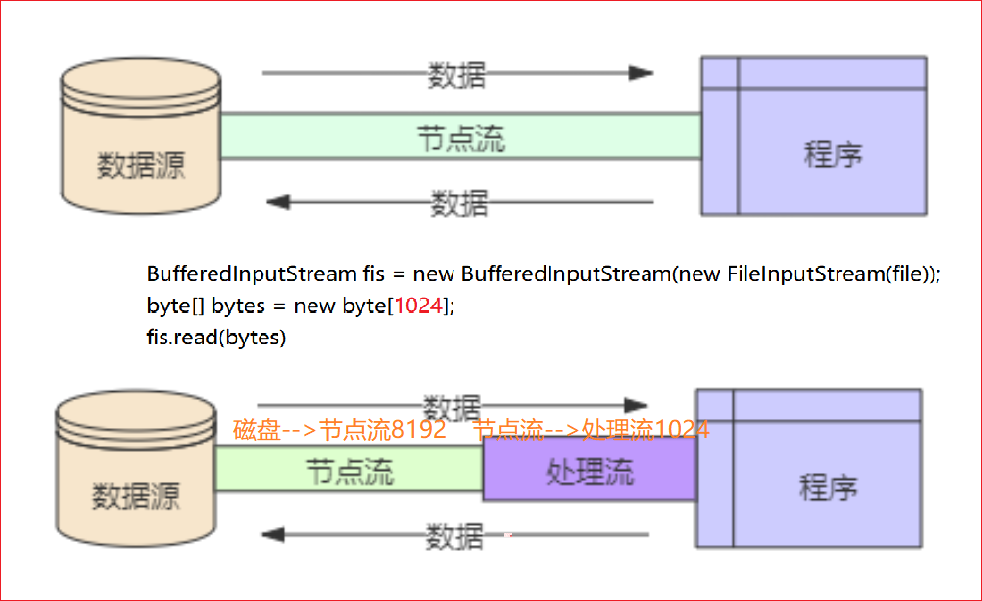
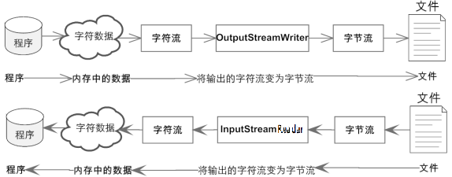

# I/O流介绍

http://www.zyiz.net/tech/detail-294289.html

## 一、I/O流

I/O 流： I == Input (输入)，O == Output(输出)

流：相当于水管中的水流

输出：Java中创建的对象，失去引用之后这种就会被GC回收掉，那如果需要将这种对象永久的保存起来？


输入：如果想把外部文件的内容，加载到程序的内部来



> IO流的作用：完成程序内部与外部 进行数据交换

## 二、IO的分类


从数据流的方向来分：

1. 输入流：以内存作为参照物，往内存中去，叫做输入(Input)。或者叫做读(Read)。
2. 输出流：从内存中出来，叫做输出(Output)。或者叫做写(Write)。

从流处理数据的最小单位来分：

1. 字节流：每次按照字节byte为单位进行数据的传输，等同于一次读取8个二进制位。这种流是万能的，什么类型的文件都可以读取，包括：文本文件，图片，声音文件，视频文件等....

   假设文件file1.txt，采用字节流的话是这样读的：
   					a中国bc张三fe
   					第一次读：一个字节，正好读到'a'
   					第二次读：一个字节，正好读到'中'字符的一半。
   					第三次读：一个字节，正好读到'中'字符的另外一半。

2. 字符流：每次按照字符char为单位，进行数据的传输，一次读取一个字符，这种流是为了方便读取普通文本文件而存在的，这种流不能读取：图片、声音、视频等文件。只能读取纯文本文件，连word文件都无法读取。

   假设文件file1.txt，采用字符流的话是这样读的：
   					a中国bc张三fe
   					第一次读：'a'字符（'a'字符在windows系统中占用1个字节。）
   					第二次读：'中'字符（'中'字符在windows系统中占用2个字节。）


从流的功能来分：

1. 节点流：针对某些特殊的数据源(磁盘文件，数据库，内存，网络)，进行直接读/写的流
2. 功能流：不直接对应的数据源，它是在节点流的基础上，进一步封装了某特殊的功能(提供某些缓冲能力)

## 三、操作流的步骤

1. 建立流
2. 操作流
3. 关闭流

I/O流读写数据的过程中数据的传输时连续的，就像连续不断的水流，所以称为输入输出流。 

# IO流四大家族

四大家族的首领：

> java.io.InputStream  		字节输入流
>
> java.io.OutputStream 	 字节输出流
>
> java.io.Reader					 字符输入流
>
> java.io.Writer						字符输出流

四大家族的首领都是抽象类。(abstract class)

所有的流都实现了：java.io.Closeable接口，都是可关闭的，都有close()方法。流毕竟是一个管道，这个是内存和硬盘之间的通道，用完之后一定要关闭，不然会耗费(占用)很多资源。养成好习惯，用完流一定要关闭。

所有的输出流都实现了：java.io.Flushable接口，都是可刷新的，都有flush()方法。养成一个好习惯，输出流在最终输出之后，一定要记得flush()刷新一下。这个刷新表示将通道/管道当中剩余未输出的数据强行输出完（清空管道！）刷新的作用就是清空管道。注意：如果没有flush()可能会导致丢失数据。

在java中只要“类名”以Stream结尾的都是字节流。以“Reader/Writer”结尾的都是字符流。

**java.io包下需要掌握的流有16个：**

	文件专属：
		java.io.FileInputStream（掌握）
		java.io.FileOutputStream（掌握）
		java.io.FileReader
		java.io.FileWriter
	
	转换流：（将字节流转换成字符流）
		java.io.InputStreamReader
		java.io.OutputStreamWriter
	
	缓冲流专属：
		java.io.BufferedReader
		java.io.BufferedWriter
		java.io.BufferedInputStream
		java.io.BufferedOutputStream
	
	数据流专属：
		java.io.DataInputStream
		java.io.DataOutputStream
	
	标准输出流：
		java.io.PrintWriter
		java.io.PrintStream（掌握）
	
	对象专属流：
		java.io.ObjectInputStream（掌握）
		java.io.ObjectOutputStream（掌握）

# File文件

## 一、File

在Java中，我们在操作IO时，都需要使用到目录或某一个文件。java.io.File 代表目录或文件！

构造方法

`File(String pathName)`

## 二、常用的API

| boolean canRead()        | 表示目录或文件是否可读                                |
| :----------------------- | :---------------------------------------------------- |
| 方法                     | 描述                                                  |
| boolean canWrite()       | 表示目录或文件是否可写                                |
| boolean createNewFile()  | 创建一个新的文件                                      |
| boolean delete()         | 删除某一个文件或某一个目录                            |
| boolean exists()         | 判断某一个目录或文件是否真实存在                      |
| String getAbsolutePath() | 得到某一个文件或某一个目录的绝对路径(D://files/1.txt) |
| boolean isFile()         | 判断是否是个文件                                      |
| boolean isDirectory()    | 判断是否是个目录                                      |
| long lastModified()      | 得到这个文件或者目录的最后一次修改时间                |
| long length()            | 得到文件的长度（文件大小）                            |
| String[] list()          | 返回该目录中所有的文件的名称(字符串的数组)            |
| File[] listFiles()       | 返回该目录中所有的文件(文件/子目录) (File的数组)      |
| boolean mkdir()          | 创建一个新的目录                                      |

```JAVA
package com.apexsoft.io.java.io;

import java.io.File;

/**
File
    1、File类和四大家族没有关系，所以File类不能完成文件的读和写。
    2、File对象代表什么？
        文件和目录路径名的抽象表示形式。
        C:\Drivers 这是一个File对象
        C:\Drivers\Lan\Realtek\Readme.txt 也是File对象。
        一个File对象有可能对应的是目录，也可能是文件。
        File只是一个路径名的抽象表示形式。
    3、需要掌握File类中常用的方法
 */
public class FileTest01 {
    public static void main(String[] args) throws Exception {
        // 创建一个File对象
        File f1 = new File("D:\\file");

        // 判断是否存在！
        System.out.println(f1.exists());

        // 如果D:\file不存在，则以文件的形式创建出来
        /*if(!f1.exists()) {
            // 以文件形式新建
            f1.createNewFile();
        }*/

        // 如果D:\file不存在，则以目录的形式创建出来
        /*if(!f1.exists()) {
            // 以目录的形式新建。
            f1.mkdir();
        }*/

        // 可以创建多重目录吗？
        File f2 = new File("D:/a/b/c/d/e/f");
        /*if(!f2.exists()) {
            // 多重目录的形式新建。
            f2.mkdirs();
        }*/

        File f3 = new File("D:\\course\\01-开课\\学习方法.txt");
        // 获取文件的父路径
        String parentPath = f3.getParent();
        System.out.println(parentPath); //D:\course\01-开课
        File parentFile = f3.getParentFile();
        System.out.println("获取绝对路径：" + parentFile.getAbsolutePath());

        File f4 = new File("copy");
        System.out.println("绝对路径：" + f4.getAbsolutePath()); // C:\Users\Administrator\IdeaProjects\javase\copy

    }
}
```

```java
 public static void main(String[] args) {
        String path = "F:\\123";
        //使用File类代表上述的目录或者文件
        File file = new File(path);
        //判断文件或目录是否存在
        if(file.exists()) {
            //判断具体是个目录，还是是个文件
            System.out.println(file.isDirectory());
            System.out.println(file.isFile());
//            //得到子目录或文件的名字
//            String[] names = file.list();
//            System.out.println(Arrays.toString(names));
            //得到子目录或文件
            File[] files = file.listFiles();
            System.out.println(Arrays.toString(files));
            //删除一个文件或目录
            files[2].delete();
        }else {
            //创建一个目录
            file.mkdir();
        }
    }
```

小练习：输出D盘下所有的文件名称，包括：各层的子目录，以及子文件`提醒：不要轻易的使用delete()`

```java
 public static void main(String[] args) {
        String path = "F:\\123\\1.txt";
        File file = new File(path);
        // 输出目录的内容
        print(file);
    }
    /**
     * 输出某一个目录中 所有的文件的名称
     * 
     * @param file
     */
    public static void print(File file) {
        //file不存在时或为文件时
        if (!file.exists() || file.isFile()) {
            System.out.println(file);
            return;
        }
        //file为目录时
        File[] files = file.listFiles();
        if(files != null) {
            for (File f : files) {
                if (f.isFile()) {
                    System.out.println(f);
                } else {// 如果它是个目录呢
                    print(f);
                }
            }
        }
    }
```

## 补充

各级目录之间要使用`\\`而不是`\`

```java
// 文件路径：D:\course\JavaProjects\02-JavaSE\temp （IDEA会自动把\编程\\，因为java中\表示转义）
FileInputStream fis = new FileInputStream("D:\\course\\JavaProjects\\02-JavaSE\\temp");
```

# 字节流

## 一、FileInputStream 

字节流：顾名思义，以字节为单位进行数据操作的一种流，可分为输入字节流、输出字节流

FileInputStream 文件字节输入流，它是一个典型的节点流


`fileInputStream.read()`：返回值为读取到的字节的大小，当没有读取到字节时或读完时返回-1

`fileInputStream.read(byte[] arra)`：返回值为读取到的字节的数量，当读取不到或读完时返回-1，数组中装读取到的字节

`fileInputStream.skip(int n)`：跳过n个字节后读取

`fileInputStream.available()`：返回流当中剩余的没有读到的字节数量

```JAVA
package com.apexsoft.io.java.wn;

import java.io.FileInputStream;
import java.io.IOException;

public class FileInputStreamTest1 {
	public static void main(String[] args) {
		String path = "D:\\UTF-8.txt";
//		String path = "D:\\GBK.txt";
		FileInputStream fis = null;
		try {
			fis = new FileInputStream(path);
            /*
             * UTT-8和GBK编码的txt文档输入相同的内容：中国劳动法呵呵AB12
             * UTF-8编码fis.available()为 25
             * GBK编码fis.available()为 18
             * UTF-8 一个中文字符为3个字节 一个英文数字占1个字节
             * GBK   一个中文字符为2个字节 一个英文数字占1个字节
             */
			System.out.println(fis.available());
            fis.close();
		} catch (Exception e) {
            
        }
	}
}
```

```java
public static void main(String[] args) {
        String path = "F:\\123\\1.txt";//定位到具体的文件
        FileInputStream fis = null;
        try {
            //创建流
            fis = new FileInputStream(path);
            //操作流
            /*一个字节一个字节的读取*/
//            int i = 0;
//            fis.read()返回值为读取到的字节的ASCII值，当没有读取到字节时或读完时返回-1
//            while((i = fis.read()) != -1) {
//                System.out.println(i);//每次读取回来的内容
//            }
            /*一次读取多个字节
             * fis.read(data)返回值为读取到的字节的数量，当读取不到或读完时返回-1
             */
            byte[] data = new byte[1024];
            int readCount = 0;
            while((readCount = fis.read(data)) != -1) {
                // 不应该全部都转换，应该是读取了多少个字节，转换多少个。
                System.out.println(new String(data,0,readCount));//真确写法
//  			System.out.println(new String(data));//错误写法，最后一次可能打印重复字符
//              System.out.println(new String(data,"utf-8"));
            }
        } catch (FileNotFoundException e) {
            // TODO Auto-generated catch block
            e.printStackTrace();
        } catch (IOException e) {
            // TODO Auto-generated catch block
            e.printStackTrace();
        }finally {
            //关闭流
            try {
                fis.close();
            } catch (IOException e) {
                // TODO Auto-generated catch block
                e.printStackTrace();
            }
        }
    }
```

注意：批量读取时，最后一次读取的数组可能含有之前读到的字节，如一个文件有6的字符abcdef，在Java中占6个字节，使用长度为4的字节数组批量读取，第一次读取abcd，数组中为abcd；第二次读取，只读取到ef，添加到数组的前两位，但数组上一次读取的cd还在数组的后两位，所以第二次读取后数组中为efcd。

```java
package com.apexsoft.io.java.io;

import java.io.FileInputStream;
import java.io.FileNotFoundException;
import java.io.IOException;

/*
最终版，需要掌握。
 */
public class FileInputStreamTest04 {
    public static void main(String[] args) {
        FileInputStream fis = null;
        try {
            fis = new FileInputStream("chapter23/io/io/src/tempfile3");
            // 准备一个byte数组
            byte[] bytes = new byte[4];
            /*while(true){
                int readCount = fis.read(bytes);
                if(readCount == -1){
                    break;
                }
                // 把byte数组转换成字符串，读到多少个转换多少个。
                System.out.print(new String(bytes, 0, readCount));
            }*/

            int readCount = 0;
            while((readCount = fis.read(bytes)) != -1) {
                System.out.print(new String(bytes, 0, readCount));
            }

        } catch (FileNotFoundException e) {
            e.printStackTrace();
        } catch (IOException e) {
            e.printStackTrace();
        } finally {
            if (fis != null) {
                try {
                    fis.close();
                } catch (IOException e) {
                    e.printStackTrace();
                }
            }
        }
    }
}
```


## 二、FileOutputStream

FileOutputStream：文件字节输出流 也是一个节点流


```java
package com.apexsoft.io.java.io;

import java.io.FileNotFoundException;
import java.io.FileOutputStream;
import java.io.IOException;

/**
 * 文件字节输出流，负责写。
 * 从内存到硬盘。
 */
public class FileOutputStreamTest01 {
    public static void main(String[] args) {
        FileOutputStream fos = null;
        try {
            // myfile文件不存在的时候会自动新建！
            // 这种方式谨慎使用，这种方式会先将原文件清空，然后重新写入。
            //fos = new FileOutputStream("myfile");
            //fos = new FileOutputStream("chapter23/src/tempfile3");

            // 以追加的方式在文件末尾写入。不会清空原文件内容。
            fos = new FileOutputStream("chapter23/io/io/src/tempfile3", true);
            // 开始写。
            byte[] bytes = {97, 98, 99, 100};
            // 将byte数组全部写出！
            fos.write(bytes); // abcd
            // 将byte数组的一部分写出！
            fos.write(bytes, 0, 2); // 再写出ab

            // 字符串
            String s = "我是一个中国人，我骄傲！！！";
            // 将字符串转换成byte数组。
            byte[] bs = s.getBytes();
            // 写
            fos.write(bs);

            // 写完之后，最后一定要刷新
            fos.flush();
        } catch (FileNotFoundException e) {
            e.printStackTrace();
        } catch (IOException e) {
            e.printStackTrace();
        } finally {
            if (fos != null) {
                try {
                    fos.close();
                } catch (IOException e) {
                    e.printStackTrace();
                }
            }
        }
    }
}
```

> 字节流：除了操作文本文件，还可以操作二进制文件

```java
public static void main(String[] args) {
    String path = "E:\\360download\\3.jpg";
    try {
        //创建流
        FileInputStream fis = new FileInputStream(path);
        //操作流
        byte[] data = new byte[1024];
        while(fis.read(data) != -1) {
            //数据都存储在data 数组中
            System.out.println(Arrays.toString(data));
        }
        //关闭流
        fis.close();
    } catch (Exception e) {
        // TODO Auto-generated catch block
        e.printStackTrace();
    }
}
```

## 三、文件复制

```java
package com.apexsoft.io.java.io;

import java.io.FileInputStream;
import java.io.FileNotFoundException;
import java.io.FileOutputStream;
import java.io.IOException;

/**
使用FileInputStream + FileOutputStream完成文件的拷贝。
拷贝的过程应该是一边读，一边写。
使用以上的字节流拷贝文件的时候，文件类型随意，万能的。什么样的文件都能拷贝。
 */
public class Copy01 {
    public static void main(String[] args) {
        FileInputStream fis = null;
        FileOutputStream fos = null;
        try {
            // 创建一个输入流对象
            fis = new FileInputStream("D:\\course\\02-JavaSE\\video\\chapter01\\动力节点-JavaSE-杜聚宾-001-文件扩展名的显示.avi");
            // 创建一个输出流对象
            fos = new FileOutputStream("C:\\动力节点-JavaSE-杜聚宾-001-文件扩展名的显示.avi");

            // 最核心的：一边读，一边写
            byte[] bytes = new byte[1024 * 1024]; // 1MB（一次最多拷贝1MB。）
            int readCount = 0;
            while((readCount = fis.read(bytes)) != -1) {
                fos.write(bytes, 0, readCount);
            }

            // 刷新，输出流最后要刷新
            fos.flush();
        } catch (FileNotFoundException e) {
            e.printStackTrace();
        } catch (IOException e) {
            e.printStackTrace();
        } finally {
            // 分开try，不要一起try。
            // 一起try的时候，其中一个出现异常，可能会影响到另一个流的关闭。
            if (fos != null) {
                try {
                    fos.close();
                } catch (IOException e) {
                    e.printStackTrace();
                }
            }
            if (fis != null) {
                try {
                    fis.close();
                } catch (IOException e) {
                    e.printStackTrace();
                }
            }
        }
    }
}
```


```java
public static void main(String[] args) {
    String path = "E:\\360download\\2.jpg";
    String target = "F:\\123\\2.jpg";
    try {
        //创建流
        FileInputStream fis = new FileInputStream(path);
        FileOutputStream fos = new FileOutputStream(target);

        //byte[] data = new byte[1024];
        //int readCount = 0;
        //while(readCount = fis.read(data) != -1) {
            //将读回来的内容，写到新的文件中
            //fos.write(data,0,readCount);
        //}

        //操作流(性能稍微要低1点：读1个字节，写1个字节)
        int i = 0;
        while((i = fis.read()) != -1) {
            //写出去
            fos.write(i);
        }
        //关闭流
        fis.close();
        fos.close();
    } catch (Exception e) {
        // TODO Auto-generated catch block
        e.printStackTrace();
    }
}
```

# 字符流

## 一、字符流

区别于字节流而言，字节流操作的是字节为单位，而这里字符流是以字符为单位！

字节流：除了可以操作文本文件，还可以操作二进制文件；字符流，只能操作文本文件！

所有字符流都继承于抽象类Reader、Writer ,Reader 是咱的输入流，而Writer是咱的输出流！

## 二、FileReader

FileReader：文件字符输入流，它只能操作文本文件！


`fileReader.read()`：返回值为读取到的字符的编码值，当没有读取到字符时或读完时返回-1

`fileReader.read(char[] arra)`：返回值为读取到的字符的数量，当读取不到或读完时返回-1，数组中装读取到的字符

`fileReader.skip(int n)`

```Java
 public static void main(String[] args) {
        // TODO Auto-generated method stub
        String source = "E:" + File.separator + "360download" + File.separator + "1.txt";
        //创建流
        try {
            FileReader fr = new FileReader(source);
            //操作流
            /*第1种：一个一个的读(不推荐)*/
//            int i = 0;
//            while((i = fr.read()) != -1) {
//                System.out.println(i);
//            }
            /*第2种：大量的读*/
            char[] data = new char[1024];
            while(fr.read(data) != -1) {
                System.out.println(new String(data));
            }
            fr.close();
        } catch (Exception e) {
            // TODO Auto-generated catch block
            e.printStackTrace();
        }
    }
```

```java
package com.apexsoft.io.java.io;

import java.io.FileNotFoundException;
import java.io.FileReader;
import java.io.IOException;

/**
FileReader：
    文件字符输入流，只能读取普通文本。
    读取文本内容时，比较方便，快捷。
 */
public class FileReaderTest {
    public static void main(String[] args) {
        FileReader reader = null;
        try {
            // 创建文件字符输入流
            reader = new FileReader("tempfile");

            //准备一个char数组
            char[] chars = new char[4];
            // 往char数组中读
            reader.read(chars); // 按照字符的方式读取：第一次e，第二次f，第三次 风....
            for(char c : chars) {
                System.out.println(c);
            }

            /*// 开始读
            char[] chars = new char[4]; // 一次读取4个字符
            int readCount = 0;
            while((readCount = reader.read(chars)) != -1) {
                System.out.print(new String(chars,0,readCount));
            }*/
        } catch (FileNotFoundException e) {
            e.printStackTrace();
        } catch (IOException e) {
            e.printStackTrace();
        } finally {
            if (reader != null) {
                try {
                    reader.close();
                } catch (IOException e) {
                    e.printStackTrace();
                }
            }
        }
    }
}
```

## 三、FileWriter

FileWriter : 文件字符输出流


```java
package com.apexsoft.io.java.io;

import java.io.FileWriter;
import java.io.IOException;

/**
FileWriter:
    文件字符输出流。写。
    只能输出普通文本。
 */
public class FileWriterTest {
    public static void main(String[] args) {
        FileWriter out = null;
        try {
            // 创建文件字符输出流对象
            //out = new FileWriter("file");
            out = new FileWriter("file", true);

            // 开始写。
            char[] chars = {'我','是','中','国','人'};
            out.write(chars);
            out.write(chars, 2, 3);

            out.write("我是一名java软件工程师！");
            // 写出一个换行符。
            out.write("\n");
            out.write("hello world!");

            // 刷新
            out.flush();
        } catch (IOException e) {
            e.printStackTrace();
        } finally {
            if (out != null) {
                try {
                    out.close();
                } catch (IOException e) {
                    e.printStackTrace();
                }
            }
        }
    }
}
```

```Java
public static void main(String[] args) {
        // TODO Auto-generated method stub
        String source = "E:" + File.separator + "360download" + File.separator + "2.txt";
        //创建流
        try {
            FileWriter fw = new FileWriter(source);
            //操作流
            String str = "蜗牛蜗牛，你最牛！！！！";
//            char[] datas = str.toCharArray();
//            fw.write(datas);
            //这种方式，香的很
            fw.write(str);
            fw.close();
        } catch (Exception e) {
            // TODO Auto-generated catch block
            e.printStackTrace();
        }
    }
```

## 四、文本文件复制

```Java
package com.apexsoft.io.java.io;

import java.io.FileNotFoundException;
import java.io.FileReader;
import java.io.FileWriter;
import java.io.IOException;

/**
使用FileReader FileWriter进行拷贝的话，只能拷贝“普通文本”文件。
 */
public class Copy02 {
    public static void main(String[] args) {
        FileReader in = null;
        FileWriter out = null;
        try {
            // 读
            in = new FileReader("chapter23/io/io/src/com/bjpowernode/java/io/Copy02.java");
            // 写
            out = new FileWriter("Copy02.java");

            // 一边读一边写：
            char[] chars = new char[1024 * 512]; // 1MB
            int readCount = 0;
            while((readCount = in.read(chars)) != -1){
                out.write(chars, 0, readCount);
            }

            // 刷新
            out.flush();
        } catch (FileNotFoundException e) {
            e.printStackTrace();
        } catch (IOException e) {
            e.printStackTrace();
        } finally {
            if (in != null) {
                try {
                    in.close();
                } catch (IOException e) {
                    e.printStackTrace();
                }
            }
            if (out != null) {
                try {
                    out.close();
                } catch (IOException e) {
                    e.printStackTrace();
                }
            }
        }

    }
}
```

普通文本文件不一定是txt文件，只要能用记事本打开编辑的都是文本文件。

# 缓冲流

## 一、功能流

功能流：不直接面对数据源，在节点流的基础上做了一定的功能扩展！

缓冲流：为了尽量的减少 节点流在操作IO时，对磁盘的大量读写导致的性能低下问题，而提供了一种缓冲能力！缓冲流 只是功能流的一种！

## 二、字节缓冲流

BufferedInputStream 、BufferedOutputStream 提供了缓冲能力，内部都提供：8192字节大小的数组，作为：我们操作数据的缓冲空间！


```Java
public static void main(String[] args) {
    //File.separatorChar Windows 系统中是\\    Linux 系统中是  /     做跨平台
    String soure = "E:"+File.separatorChar+"360download"+File.separatorChar+"1.jpg";
    String target= "F:"+File.separatorChar+"123"+File.separatorChar+"1.jpg";
    try {
        //输入流
        BufferedInputStream bis = new BufferedInputStream(new FileInputStream(soure));
        //输出流
        BufferedOutputStream bos = new BufferedOutputStream(new FileOutputStream(target));
        //定义每次读取的内容大小
        byte[] data = new byte[1024];
        int readCount;
        while((readCount = bis.read(data)) != -1) {
            System.out.println(Arrays.toString(data));
            bos.write(data, 0 ,readCount);//边读边写
        }
        //关闭流
        bis.close();
        bos.close();
    } catch (Exception e) {
        // TODO Auto-generated catch block
        e.printStackTrace();
    }
}
```

## 三、字符缓冲流

字符在操作时，同样提供的对应的缓冲流：BufferedReader、BufferedWriter (目的：依旧是为了减少大量磁盘操作)

BufferedReader、BufferedWriter 缓冲大小依旧是：8192


`bufferedReader.readLine()`：方法读取一个文本行，但不带换行符

`bufferedWriter.newLine()`：写入换行符（换行）

```java
package com.apexsoft.io.java.io;

import java.io.BufferedReader;
import java.io.File;
import java.io.FileReader;

/**
BufferedReader:
    带有缓冲区的字符输入流。
    使用这个流的时候不需要自定义char数组，或者说不需要自定义byte数组。自带缓冲。
 */
public class BufferedReaderTest01 {
    public static void main(String[] args) throws Exception{
        String source = "C:" + File.separatorChar + "Users" + File.separatorChar + "TXG" + File.separatorChar +"desktop"+ File.separatorChar + "test.txt";

        FileReader reader = new FileReader(source);
        // 当一个流的构造方法中需要一个流的时候，这个被传进来的流叫做：节点流。
        // 外部负责包装的这个流，叫做：包装流，还有一个名字叫做：处理流。
        // 像当前这个程序来说：FileReader就是一个节点流。BufferedReader就是包装流/处理流。
        BufferedReader br = new BufferedReader(reader);

        // 读一行
        /*String firstLine = br.readLine();
        System.out.println(firstLine);

        String secondLine = br.readLine();
        System.out.println(secondLine);

        String line3 = br.readLine();
        System.out.println(line3);*/

        // br.readLine()方法读取一个文本行，但不带换行符。
        String s = null;
        while((s = br.readLine()) != null){
            System.out.print(s);
        }

        // 关闭流
        // 对于包装流来说，只需要关闭最外层流就行，里面的节点流会自动关闭。（可以看源代码。）
        br.close();
    }
}
```

方式一：

```Java
public static void main(String[] args) {
    String source = "E:" +File.separator + "360download" + File.separator + "1.txt";
    String target = "F:" +File.separator + "123" + File.separator + "1.txt";
    try {
        //创建流
        BufferedReader br = new BufferedReader(new FileReader(source));
        BufferedWriter bw = new BufferedWriter(new FileWriter(target));
        //操作流
        char[] data = new char[1024];
        int lenth = 0;
        while((lenth = br.read(data)) != -1) {
            bw.write(data,0,lenth);//data 数组  0 起始位   lenth 数组中元素的个数
        }
        //关闭流
        br.close();
        bw.close();
    } catch (Exception e) {
        // TODO Auto-generated catch block
        e.printStackTrace();
    }
}
```

方式二(推荐)：

```Java
public static void main(String[] args) {
    String source = "E:" +File.separator + "360download" + File.separator + "1.txt";
    String target = "F:" +File.separator + "123" + File.separator + "1.txt";
    try {
        //创建流
        BufferedReader br = new BufferedReader(new FileReader(source));
        BufferedWriter bw = new BufferedWriter(new FileWriter(target));
        //操作流
        String str = "";
        //读取数据
        while((str = br.readLine()) != null) {
            bw.write(str);
            bw.newLine();//表示换行
        }
        //关闭流
        br.close();
        bw.close();
    } catch (Exception e) {
        // TODO Auto-generated catch block
        e.printStackTrace();
    }
}
```

```JAVA
package com.apexsoft.io.java.io;

import java.io.BufferedReader;
import java.io.File;
import java.io.FileInputStream;
import java.io.InputStreamReader;

/**
    转换流：InputStreamReader
 */
public class BufferedReaderTest02 {
    public static void main(String[] args) throws Exception{
        String source = "C:" + File.separatorChar + "Users" + File.separatorChar + "TXG" + File.separatorChar +"desktop"+ File.separatorChar + "test.txt";

        /*// 字节流
        FileInputStream in = new FileInputStream("Copy02.java");

        // 通过转换流转换（InputStreamReader将字节流转换成字符流。）
        // in是节点流。reader是包装流。
        InputStreamReader reader = new InputStreamReader(in);

        // 这个构造方法只能传一个字符流。不能传字节流。
        // reader是节点流。br是包装流。
        BufferedReader br = new BufferedReader(reader);*/

        // 合并
        BufferedReader br = new BufferedReader(new InputStreamReader(new FileInputStream(source)));

        String line = null;
        while((line = br.readLine()) != null){
            System.out.println(line);
        }

        // 关闭最外层
        br.close();
    }
}
```

## 四、缓冲流提高效率


> 当我们将文件读取的时候，会先加载到内存，然而刚刚加载了一个字节到内存，马上又要告诉磁盘，喂~大兄弟，给我把这个字节写到磁盘上，我们知道磁盘的效率比内存要低很多的，在磁盘写入的过程中，内存只能干瞪眼，当磁盘写完一个字节后，内存再把下一个字节交给磁盘，喂~大兄弟，继续写下一个，然后内存又等着磁盘写下一个字节。
>
> 普通流效率低下的最大原因就在于此，频繁的调用磁盘，导致无法发挥内存速度快的优点。于是为了提高效率，缓冲流出现了。看看缓冲流缓冲了什么？缓冲流并不是每一个字节都要调用一次磁盘，而是根据设置的缓冲区大小，每当缓冲区满了以后，再调用一次磁盘，比如上图中，缓冲区设置为3，结果就是每次缓冲区有3个字节的数据以后，再调用一次磁盘，这样一来，调用磁盘的次数就减少了很多，使效率得到了很大的提升。文件越大，缓冲流效率的提升越明显。

## 五、缓冲流使用数组读写



https://developer.aliyun.com/article/902978

缓冲流流内部已经有数组作为缓冲，为什么还需要数据读写？


数组相当于是定义的每次从缓冲流搬运数据到节点流的数量；

而缓冲流内部的数组大小是节点流将数据每次写入磁盘的数据数量

# IO流的选择

如果你想要减少磁盘的消耗，毫无疑问：选择 缓冲流

到底选择那种节点流：

1. 如果源文件打开，看的懂，你就用字符流
2. 看不懂，就用字节流 (不管看的懂，看不懂都可以用字节流)

> 图片，小视频，音乐，*.class 这些都是看不懂的
>
> 肉眼看的懂，识别的了的，那就是文本文件

# IO流构造器API

## FileInputStream


## FileOutputStream


## FileReader


## FileWriter


## BurfferedInputStream


## BurfferedOutputStream


## BufferedReader


## BufferedWriter


# 打印流

https://blog.csdn.net/weixin_39951988/article/details/124043818

https://blog.csdn.net/qq_72935001/article/details/128708807

打印输出流，是方便将输出信息打印的流，在显示信息的时候，可以让其有格式地进行显示。 一般，打印输出流输出的对象是屏幕， 但也可以是输出流。 打印输出流，根据字节/字符的不同，又可以分为 字节打印输出流 PrintStream 和字符打印输出流 PrintWriter.

相比较以前讲得输出流， 主要区别是对输出信息进行格式化。

注意：PrintStream和PrintWriter的操作中，最后必须要close关闭，因为实际的输出方法在close方法中

## PrintWriter

字符打印输出流：将字符输出到指定文件或打印到控制台

```Java
 public static void main(String[] args) {
        String path = "F:" + File.separator + "123" + File.separator + "1.txt";
        try {
            PrintWriter pw = new PrintWriter(new FileWriter(path));
            //输出到文件
            //println()方法等价于write() + write("\n")
            //pw.write("活着");
            //pw.write("\n");
            //pw.write("罪与罚");
            pw.println("平凡的世界");
            //关闭流（注意不关闭流，文件写入可能会关闭）
            pw.close();
        } catch (Exception e) {
            // TODO Auto-generated catch block
            e.printStackTrace();
        }
    }
```

**打印到控制台**

```java
PrintWriter printWriter = new PrintWriter(System.out);
printWriter.print("hi,你好");
printWriter.close();
```

**打印到指定文件**

```java
PrintWriter printWriter = null;
try {
    printWriter = new PrintWriter(new FileWriter("E:\\test.txt"));
} catch (IOException e) {
    e.printStackTrace();
}
printWriter.print("hi,你好");
printWriter.close();
```

## PrintStream

字节打印输出流：将字节输出到指定文件或打印到控制台（直接打印字符底层会转成字节写）

**打印到控制台**

```java
// System.out：表示标准输出，用来往控制台输出数据，控制台默认打印的是hello world（默认打印是在显示器打印，可以进行修改数据输出的位置）
PrintStream out = System.out;
out.print("hello world");
out.close();
```

**打印到指定文件**

```java
String s = "E:\\test.txt";
try {
    //修改打印流的输出位置/设备
    System.setOut(new PrintStream(s));
    System.out.println("hello world");
} catch (FileNotFoundException e) {
    e.printStackTrace();
}
```

**PrintStream print相关方法**

print相关方法调用了writer方法，因为writer方法底层是按照字节打印的（PrintStream本身就是字节流），所以getByte()方法（String类中）得到一个操作系统默认的编码格式的字节数组

```java
PrintStream out = System.out;
try {
    //getBytes()方法，字符转换为操作系统默认的编码格式的字节数组
    out.write("hello world".getBytes());
} catch (IOException e) {
    e.printStackTrace();
}
out.close();
```


```Java
   public static void main(String[] args) {
        System.out.println("……………………");
        String path = "F:" + File.separator + "123" + File.separator + "1.txt";
        try {
            PrintStream out = new PrintStream(new FileOutputStream(path));
//            out.print("111");
//            out.print("222");
            out.println("aaa");
            out.println("sss");
            //关闭流
            out.close();
        } catch (Exception e) {
            // TODO Auto-generated catch block
            e.printStackTrace();
        }
    }
```

```JAVA
package com.apexsoft.io.java.io;

import java.io.FileOutputStream;
import java.io.PrintStream;

/**
java.io.PrintStream：标准的字节输出流。默认输出到控制台。
 */
public class PrintStreamTest {
    public static void main(String[] args) throws Exception{

        // 联合起来写
        System.out.println("hello world!");
        // 分开写
        PrintStream ps = System.out;
        ps.println("hello zhangsan");
        ps.println("hello lisi");
        ps.println("hello wangwu");

        // 标准输出流不需要手动close()关闭。
        // 可以改变标准输出流的输出方向吗？ 可以
        // 修改输出方向，标准输出流不再指向控制台，将输出方向修改到"log"文件。
        System.setOut(new PrintStream(new FileOutputStream("log")));
        // 再输出
        System.out.println("hello world");
        System.out.println("hello kitty");
        System.out.println("hello zhangsan");
    }
}
```

利用PrintStream实现日志记录：

```JAVA
/**
日志工具
 */
public class Logger {
    /*
    记录日志的方法。
     */
    public static void log(String msg) {
        try {
            // 指向一个日志文件
            PrintStream out = new PrintStream(new FileOutputStream("log.txt", true));
            // 改变输出方向
            System.setOut(out);
            // 日期当前时间
            Date nowTime = new Date();
            SimpleDateFormat sdf = new SimpleDateFormat("yyyy-MM-dd HH:mm:ss SSS");
            String strTime = sdf.format(nowTime);

            System.out.println(strTime + ": " + msg);
        } catch (FileNotFoundException e) {
            e.printStackTrace();
        }
    }
}
```

# 转换流

https://www.cnblogs.com/tanghaorong/p/12363660.html

Java既支持字节流，又支持字符流，但是有时我们可能同时需要使用到字节和字符。那么如何在字节和字符之间相互转换？此时就需要使用 转换流！

Java提供的转换流：InputStreamReader、OutputStreamWrite

InputStreamReader：字节------>字符

OutputStreamWriter：字符------>字节



```Java
public static void main(String[] args) {
    // TODO Auto-generated method stub
    String path = "F:" + File.separator + "123" + File.separator + "2.txt";
    //转换流的使用场景：针对输出的内容，设置特定的编码集
    try {
        PrintWriter pw = new PrintWriter(
                new OutputStreamWriter(new FileOutputStream(path), "ascii"));
        pw.println("刘亦菲");
        pw.println("刘若英");
        pw.println("范冰冰");
        pw.close();
    } catch (Exception e) {
        // TODO Auto-generated catch block
        e.printStackTrace();
    }
}
```

## 转换文本文件编码

将UTF-8编码的文本文件，转换为GBK编码的文本文件。

1、指定UTF-8编码的转换流，读取文本文件。

2、使用GBK编码的转换流，写出文本文件。


```java
package com.apexsoft.io.java.io;

/**
 * @Author: TangXiaoGang
 * @Date: 2023/4/7
 * @Description:
 */


import java.io.*;

/**
 * 将文本文件从uft-8编码转换为GBK编码而不乱码
 */
public class InputStreamReaderAndOutputStreamWriter {
    public static void main(String[] args) {
        String source = "C:" + File.separatorChar + "Users" + File.separatorChar + "TXG" + File.separatorChar + "desktop" + File.separatorChar + "test.txt";
        String target = "C:" + File.separatorChar + "Users" + File.separatorChar + "TXG" + File.separatorChar + "desktop" + File.separatorChar + "GBK.txt";
        InputStreamReader ir = null;
        OutputStreamWriter ow = null;
        try {
            ir = new InputStreamReader(new FileInputStream(source), "UTF-8");
            ow = new OutputStreamWriter(new FileOutputStream(target), "GBK");
            char[] data = new char[100];
            int readCount;
            try {
                while ((readCount = ir.read(data)) != -1) {
                    System.out.println(data);
                    System.out.println(readCount);
                    ow.write(data,0,readCount);
                }
                //ow.flush();
            } catch (IOException e) {
                e.printStackTrace();
            }
        } catch (FileNotFoundException | UnsupportedEncodingException e) {
            e.printStackTrace();
        } finally {
            if(ir != null){
                try {
                    ir.close();
                } catch (IOException e) {
                    e.printStackTrace();
                }
            }
            if(ow != null){
                try {
                    ow.close();
                } catch (IOException e) {
                    e.printStackTrace();
                }
            }
        }
    }
}
```

## 构造方法


**`转换流构造方法支持，编码方式设置，因此对于文本文件的读写可以借助转换流避免乱码`**

# DataInputStream

DataInputStream：数据字节输入流。

DataOutputStream写的文件，只能使用DataInputStream去读。并且读的时候需要提前知道写入的顺序。读的顺序需要和写的顺序一致。才可以正常取出数据。

```java
package com.apexsoft.io.java.io;

import java.io.DataInputStream;
import java.io.FileInputStream;

/**
DataInputStream:数据字节输入流。
DataOutputStream写的文件，只能使用DataInputStream去读。并且读的时候你需要提前知道写入的顺序。
读的顺序需要和写的顺序一致。才可以正常取出数据。

 */
public class DataInputStreamTest01 {
    public static void main(String[] args) throws Exception{
        DataInputStream dis = new DataInputStream(new FileInputStream("data"));
        // 开始读
        byte b = dis.readByte();
        short s = dis.readShort();
        int i = dis.readInt();
        long l = dis.readLong();
        float f = dis.readFloat();
        double d = dis.readDouble();
        boolean sex = dis.readBoolean();
        char c = dis.readChar();

        System.out.println(b);
        System.out.println(s);
        System.out.println(i + 1000);
        System.out.println(l);
        System.out.println(f);
        System.out.println(d);
        System.out.println(sex);
        System.out.println(c);

        dis.close();
    }
}
```

# DataOutputStream

java.io.DataOutputStream：数据专属的流。

这个流可以将数据连同数据的类型一并写入文件。注意：这个文件不是普通文本文档。（这个文件使用记事本打不开。）

```java
package com.apexsoft.io.java.io;

import java.io.DataOutputStream;
import java.io.FileOutputStream;

/**
java.io.DataOutputStream：数据专属的流。
这个流可以将数据连同数据的类型一并写入文件。
注意：这个文件不是普通文本文档。（这个文件使用记事本打不开。）
 */
public class DataOutputStreamTest {
    public static void main(String[] args) throws Exception{
        // 创建数据专属的字节输出流
        DataOutputStream dos = new DataOutputStream(new FileOutputStream("data"));
        // 写数据
        byte b = 100;
        short s = 200;
        int i = 300;
        long l = 400L;
        float f = 3.0F;
        double d = 3.14;
        boolean sex = false;
        char c = 'a';
        // 写
        dos.writeByte(b); // 把数据以及数据的类型一并写入到文件当中。
        dos.writeShort(s);
        dos.writeInt(i);
        dos.writeLong(l);
        dos.writeFloat(f);
        dos.writeDouble(d);
        dos.writeBoolean(sex);
        dos.writeChar(c);

        // 刷新
        dos.flush();
        // 关闭最外层
        dos.close();
    }
}
```

# 序列化

## 一、序列化

**序列化：**将对象数据转换为字节码数据以流的方式写入到文件中

**反序列化：**将文件中的字节码数据 读取出来之后，再反向的转换为对象数据(也是创建对象的一种方式)


> 序列化的代码：JavaBean 一定要实现Serializable接口，否则该JavaBean将不具备序列化能力
>
> ```Java
> class JavaBean implements Serializable{
> }
> ```

```java
package com.apexsoft.io.java.bean;

import java.io.Serializable;

public class Student implements Serializable {

    // IDEA工具自动生成序列化版本号。
    //private static final long serialVersionUID = -7998917368642754840L;

    // Java虚拟机看到Serializable接口之后，会自动生成一个序列化版本号。
    // 这里没有手动写出来，java虚拟机会默认提供这个序列化版本号。
    // 建议将序列化版本号手动的写出来。不建议自动生成
    private static final long serialVersionUID = 1L; // java虚拟机识别一个类的时候先通过类名，如果类名一致，再通过序列化版本号。

    private int no;
    //private String name;

    // 过了很久，Student这个类源代码改动了。
    // 源代码改动之后，需要重新编译，编译之后生成了全新的字节码文件。
    // 并且class文件再次运行的时候，java虚拟机生成的序列化版本号也会发生相应的改变。
    private int age;
    private String email;
    private String address;

    public Student() {
    }

    public Student(int no, String name) {
        this.no = no;
        //this.name = name;
    }

    public int getNo() {
        return no;
    }

    public void setNo(int no) {
        this.no = no;
    }

    @Override
    public String toString() {
        return "Student{" +
                "no=" + no +
                ", age=" + age +
                ", email='" + email + '\'' +
                ", address='" + address + '\'' +
                '}';
    }
}
```

```Java
package com.apexsoft.io.java.io;


import com.apexsoft.io.java.bean.Student;
import java.io.FileOutputStream;
import java.io.ObjectOutputStream;

/**
1、java.io.NotSerializableException:
    Student对象不支持序列化！！！！

2、参与序列化和反序列化的对象，必须实现Serializable接口。

3、注意：通过源代码发现，Serializable接口只是一个标志接口：
    public interface Serializable {
    }
    这个接口当中什么代码都没有。
    那么它起到一个什么作用呢？
        起到标识的作用，标志的作用，java虚拟机看到这个类实现了这个接口，可能会对这个类进行特殊待遇。
        Serializable这个标志接口是给java虚拟机参考的，java虚拟机看到这个接口之后，会为该类自动生成
        一个序列化版本号。

4、序列化版本号有什么用呢？
    java.io.InvalidClassException:
        com.bjpowernode.java.bean.Student;
        local class incompatible:
            stream classdesc serialVersionUID = -684255398724514298（十年后）,
            local class serialVersionUID = -3463447116624555755（十年前）

    java语言中是采用什么机制来区分类的？
        第一：首先通过类名进行比对，如果类名不一样，肯定不是同一个类。
        第二：如果类名一样，再怎么进行类的区别？靠序列化版本号进行区分。

    小鹏编写了一个类：com.bjpowernode.java.bean.Student implements Serializable
    胡浪编写了一个类：com.bjpowernode.java.bean.Student implements Serializable
    不同的人编写了同一个类，但“这两个类确实不是同一个类”。这个时候序列化版本就起上作用了。
    对于java虚拟机来说，java虚拟机是可以区分开这两个类的，因为这两个类都实现了Serializable接口，
    都有默认的序列化版本号，他们的序列化版本号不一样。所以区分开了。（这是自动生成序列化版本号的好处）

    请思考？
        这种自动生成序列化版本号有什么缺陷？
            这种自动生成的序列化版本号缺点是：一旦代码确定之后，不能进行后续的修改，
            因为只要修改，必然会重新编译，此时会生成全新的序列化版本号，这个时候java
            虚拟机会认为这是一个全新的类。（这样就不好了！）

    最终结论：
        凡是一个类实现了Serializable接口，建议给该类提供一个固定不变的序列化版本号。
        这样，以后这个类即使代码修改了，但是版本号不变，java虚拟机会认为是同一个类。

 */
public class ObjectOutputStreamTest01 {
    public static void main(String[] args) throws Exception{
        // 创建java对象
        Student s = new Student(1111, "zhangsan");
        // 序列化
        ObjectOutputStream oos = new ObjectOutputStream(new FileOutputStream("students"));

        // 序列化对象
        oos.writeObject(s);

        // 刷新
        oos.flush();
        // 关闭
        oos.close();
    }
}
```

**一次序列化多个对象**

```java
package com.apexsoft.io.java.io;


import com.apexsoft.io.java.bean.User;

import java.io.FileOutputStream;
import java.io.ObjectOutputStream;
import java.util.ArrayList;
import java.util.List;

/**
一次序列化多个对象呢？
    可以，可以将对象放到集合当中，序列化集合。
提示：
    参与序列化的ArrayList集合以及集合中的元素User都需要实现 java.io.Serializable接口。
 */
public class ObjectOutputStreamTest02 {
    public static void main(String[] args) throws Exception{
        List<User> userList = new ArrayList<>();
        userList.add(new User(1,"zhangsan"));
        userList.add(new User(2, "lisi"));
        userList.add(new User(3, "wangwu"));
        ObjectOutputStream oos = new ObjectOutputStream(new FileOutputStream("users"));

        // 序列化一个集合，这个集合对象中放了很多其他对象。
        oos.writeObject(userList);

        oos.flush();
        oos.close();
    }
}
```

## 二、反序列化

反序列化：将文件中的字节码数据，再转换为对象数据

```Java
package com.apexsoft.io.java.io;

import java.io.FileInputStream;
import java.io.ObjectInputStream;

/*
反序列化
 */
public class ObjectInputStreamTest01 {
    public static void main(String[] args) throws Exception{
        ObjectInputStream ois = new ObjectInputStream(new FileInputStream("students"));
        // 开始反序列化，读
        Object obj = ois.readObject();
        // 反序列化回来是一个学生对象，所以会调用学生对象的toString方法。
        System.out.println(obj);
        ois.close();
    }
}
```

```java
package com.apexsoft.io.java.io;


import com.apexsoft.io.java.bean.User;
import java.io.FileInputStream;
import java.io.ObjectInputStream;
import java.util.List;

/*
反序列化集合
 */
public class ObjectInputStreamTest02 {
    public static void main(String[] args) throws Exception{
        ObjectInputStream ois = new ObjectInputStream(new FileInputStream("users"));
        //Object obj = ois.readObject();
        //System.out.println(obj instanceof List);
        List<User> userList = (List<User>)ois.readObject();
        for(User user : userList){
            System.out.println(user);
        }
        ois.close();
    }
}
```

## 三、序列化的ID

> 序列化ID：Java类只要实现了Serializable接口，那么该类的每次修改，编译器都会自动的生成的一个 唯一的ID值，对应这个类
>
> **固定序列化ID：**为了解决序列化或者反序列化过程中，类结构发生改变，导致无法序列化或者反序列化的问题

```Java
class Person implements Serializable{
    /**
     * 
     */
    private static final long serialVersionUID = -4542901758620777045L;
}
```

以后实在忘了，请再看一次视频

## 四、transient关键字(了解)

作用：让某一个属性，不参与到序列化或者反序列化中去

```Java
//登录名(transient 让某一个属性，不参与序列化)
private transient String loginName;
```

# 特殊文件的读写

## 一、Properties

Properties 也是一个集合，而且它是Map结构的集合，所以它也满足K-V键值对结构！

> `Properties`类表示一组持久的属性。 
>
> `Properties`可以通过流将属性的内容写入到文件中，或通过流中从文件进制加载到内存中来。 属性列表中的每个键及其对应的值都是一个字符串
>
> Properties的父类是Hashtable，Hashtable和HashMap 都是Map接口的实现类，而且它俩的操作方式都一样！
>
> 区别：Hashtable 添加synchronized关键字，HashMaps是没有添加这个关键字！

```java
持久：长久不变的东西
```

常见的API：

| 方法                                        | 描述                                                         |
| :------------------------------------------ | :----------------------------------------------------------- |
| put(String key,String value)                | 向集合中添加元素                                             |
| getProperty(String key)                     | 从集合中，根据Key获取值                                      |
| getProperty(String key,String defaultValue) | 从集合中，根据Key获取值，如果key不存在，那就返回默认值       |
| setProperty(String key,String value)        | 从集合中，根据Key修改值                                      |
| keySet()                                    | 返回集合中，所有的Key                                        |
| replace(K key, V oldValue, V newValue)      | 从集合中，根据key 完成新值 替换 旧值                         |
| load(InputStream inStream)                  | 根据字节流，将外部的*.properties文件中的内容，加载到内存的Properties对象中 |
| load(Reader reader)                         | 根据字符流，将外部的*.properties文件中的内容，加载到内存的Properties对象中 |
| store(OutputStream out, String comments)    | 使用字节流，将内存中Properties对象 存储到外部的*.properties文件中去，所以才具备持久化 |
| store(Writer writer, String comments)       | 使用字符流，将内存中Properties对象 存储到外部的*.properties文件中去，所以才具备持久化 |
| stringPropertyNames()                       | == keySet() 返回集合中，所有的Key                            |

```java
    public static void main(String[] args) {
        //定义一个空集合
        Properties prop = new Properties();
        prop.setProperty("name", "老张");
        prop.setProperty("age", "28");
        prop.setProperty("gender", "1");
        //获取
        System.out.println(prop.getProperty("name"));
        System.out.println(prop.getProperty("age"));
        System.out.println(prop.getProperty("gender"));
        //如果没有， 就返回默认值
        System.out.println(prop.getProperty("address","孵化园5号楼3楼"));
        //获得所有的Key
        Set<String> names = prop.stringPropertyNames();
        names.forEach(new Consumer<String>() {
            @Override
            public void accept(String key) {
                // TODO Auto-generated method stub
                System.out.println(key);
            }
        });
    }
```

> 如何Properties与外部文件关联起来呢？

保存到properties文件中：

```java
        //将内存中Properties的内容，写入到文件
        try {
            prop.store(new FileWriter("src/person.properties"), "个人信息");
        } catch (IOException e) {
            // TODO Auto-generated catch block
            e.printStackTrace();
        }
```

------

从properties文件中读取内容：

方式一：

```java
    public static void main(String[] args) {
        //定义一个空集合
        Properties prop = new Properties();
        try {
            //将外部文件的内容，通过流加载到内存中的prop对象上
            prop.load(new FileReader("src/person.properties"));
            System.out.println(prop.getProperty("name"));
            System.out.println(prop.getProperty("age"));
            System.out.println(prop.getProperty("gender"));
            System.out.println(prop.getProperty("address"));
        } catch (Exception e) {
            // TODO Auto-generated catch block
            e.printStackTrace();
        }
    }
```

方式二(推荐的方式)：

```java
public class Demo4 {
    public static void main(String[] args) {
        System.out.println(PropUtil.getValue("name"));
        System.out.println(PropUtil.getValue("age"));
        System.out.println(PropUtil.getValue("gender"));
        System.out.println(PropUtil.getValue("address"));
    }
}
class PropUtil{
    static Properties prop = new Properties();
    /**
     * 静态初始化块
     */
    static {
        try {
            //与外部的文件，关联到一起
            prop.load(new FileReader("src/person.properties"));
        } catch (Exception e) {
            // TODO Auto-generated catch block
            e.printStackTrace();
        }
    }
    /**
     * 根据Key返回值
     * @param key
     * @return
     */
    public static String getValue(String key) {
        return prop.getProperty(key);
    }
}
```

## 二、CSV格式文件的读写(了解)

CSV是一种使用逗号分割内容的文件格式，可以通过电脑自带的记事本，或者Excel打开。CSV采用的是纯文本方式进行存储，里面不存在任何的二进制东西！

写：

```java
public static void main(String[] args) {
    try {
        write();
    } catch (IOException e) {
        // TODO Auto-generated catch block
        e.printStackTrace();
    }
}
/**
 * 写
 * @throws IOException 
 */
private static void write() throws IOException {
    // TODO Auto-generated method stub
    String[] contents = {"张三,22,1,家住：犀浦","李四,19,1,家住：高新区"};
    String path = "F:" + File.separator + "123" + File.separator + "student.csv";
    BufferedWriter out = new BufferedWriter(new FileWriter(path));
    //遍历
    for (String str : contents) {
        out.write(str);//写
        out.newLine();//写一行，换一行
    }
    out.close();
}
```

读：

```java
    public static void main(String[] args) {
        try {            
            read();
        } catch (IOException e) {
            // TODO Auto-generated catch block
            e.printStackTrace();
        }
    }
    private static void read() throws IOException {
        // TODO Auto-generated method stub
        String path = "F:" + File.separator + "123" + File.separator + "student.csv";
        BufferedReader in = new BufferedReader(new FileReader(path));
        //循环读
        String str = "";
        while((str = in.readLine()) != null) {
            System.out.println(str);
        }
        in.close();
    }
```
