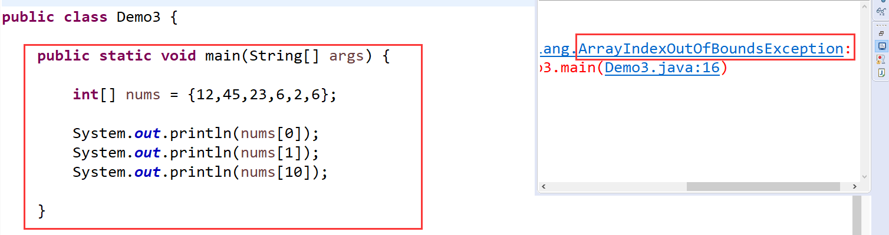
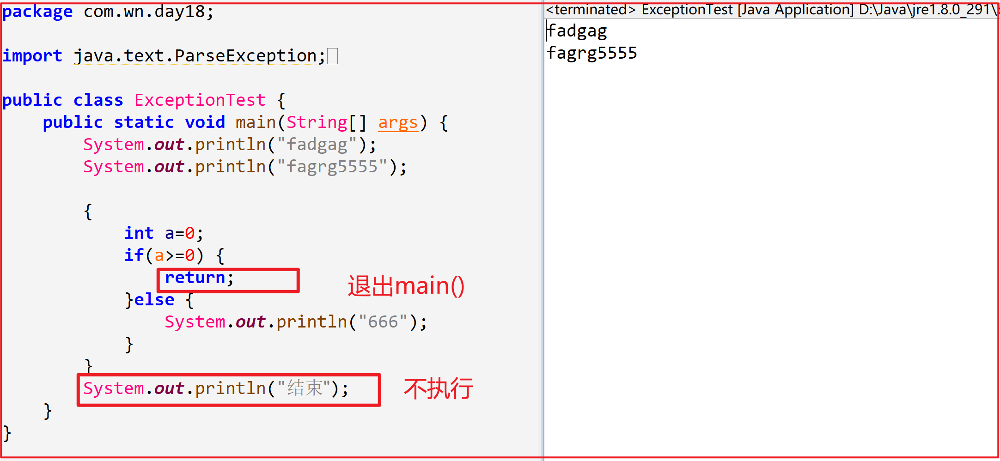
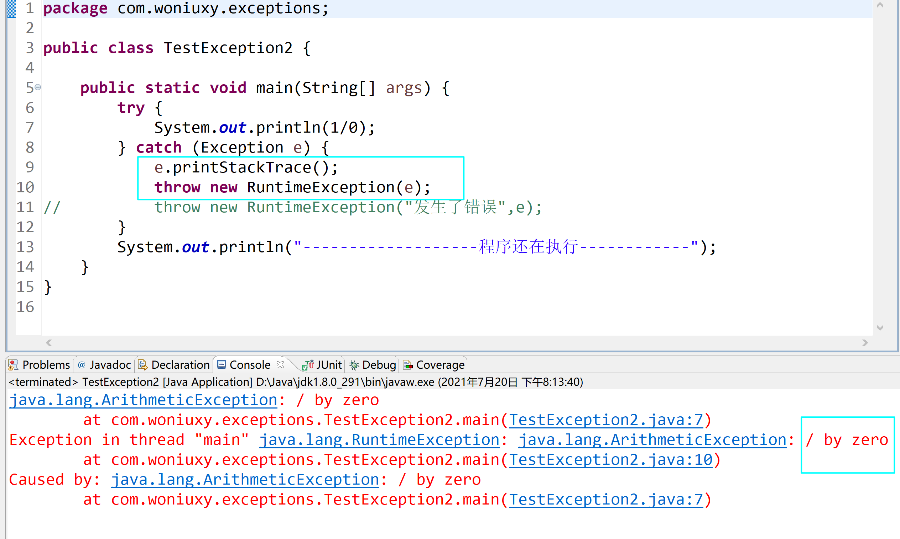

# 异常

## 一、异常概述

异常：程序在执行的过程中，出现的问题(缺陷)！产生异常的原因可能有多种：用户输入了无效的数据、找不到文件、在通讯的过程中断网了、JVM在运行的过程中内存不足了、

调用null对象的属性和行为、操作数组的过程中，下标越界……

有的异常是用户导致的，有的异常是程序员导致的，有的异常是硬件的导致！

## 二、异常分类


分类：错误、编译时异常、运行时异常

**错误：**程序员搞不定，比如：硬盘容量不足、内存空间不够、网络异常 ……（程序员无法通过修改代码来修复的）

**编译时异常：**检查用户的输入的错误，或者是程序无法提前预见的错误 比如：文件无法找到 `编译时异常，通常由编译器来检查`

**运行时异常：**程序在编译期间没有任何错误，但是在运行的过程中，抛出的问题 比如：

```java
Person[] persons = new Person[5];
persons[0].setName("张三");// 可能会抛出 NullPointerException
```

## 编译时异常

### 一、编译时异常

编译时异常：是程序员无法提前预见的问题，可能是用户的输入的问题！


(编译时异常：)举个例子：


### 二、编译时异常的解决方案

1. 捕获异常，不向上抛出
2. 捕获异常，向上抛出
3. 不捕获它，直接向上抛出


## 运行时异常

### 一、运行时异常

运行时异常：在编译时，没有任何错误。但是在运行过程中抛出了问题！




> 记住：只要的直接父类是RuntimeException ，那么这个异常就是运行时异常(编译器是检测不出来的) 。
>
> 如果它的直接父类是Exception，那么这个异常就是编译时异常 (编译器就会自动帮你检测)


### 二、运行时异常的解决方案

不去捕获，也不要去抛！等程序自己抛异常，抛出来之后，我们再解决它就好！

```java
int[] nums = new int[5];
System.out.println(nums[3]);
String str = null;
//直接非空判断就好
if(str != null) {    
    System.out.println(str.length());
}
```

## 异常捕获

### 一、编译时异常

每个方法在遇到编译时异常时，都有3种选择：

1. 直接捕获，不上报
2. 直接捕获，并上报
3. 不捕获，直接上报

### 二、捕获的方式

捕获的方式：

```java
try{
    需要监控异常的代码
}catch(异常 e){
    处理异常的代码
}finally{
    收尾的代码
}
```

举个例子

```java
String str = "2020-12-12";
    SimpleDateFormat sdf = new SimpleDateFormat("yyyy/MM/dd");
    //解析成日期
    try {
        Date date = sdf.parse(str);
        System.out.println("解析成功");
    }catch (ParseException e) {
        // TODO: handle exception
        e.printStackTrace();//输出异常的详细信息(在控制台)
        System.out.println("解析失败");
    }finally {
        //不管是否抛出异常，都需要执行的代码，就放置在finally中
        System.out.println("解析结束");
    }
```

### 三、多个catch块结构

> 注意：如果有多个catch块存在的情况，catch块的顺序一定要遵从“从小到大”的顺序！ 多态导致的

```java
try{
    监控可能会出异常的代码
}catch(异常类型1 e){
    异常处理代码
}catch(异常类型2 e){
    异常处理代码
}catch(异常类型3 e){
    异常处理代码
}
```

举个例子

```java
public static void main(String[] args) {
    File file = new File("D://index.txt");
    try {
        FileInputStream fis = new FileInputStream(file);
        fis.read();
    } catch (FileNotFoundException e) {
        // TODO Auto-generated catch block
        e.printStackTrace();
    } catch (IOException e) {
        // TODO Auto-generated catch block
        e.printStackTrace();
    }
}
```

> 面试题：如果catch太多，怎么办？
>
> 答案：多态 父类的引用可以指向 子类的实例
>
> ```java
> try{
> }catch(Exception e){
> }
> ```

### 四、变量的定义

如果try-catch结构的外部，也需要使用到某一变量，**解决方案是：**`将变量的声明定义在try-catch结构的外部，但是一定要赋初值`

```java
String str = "2020-12-12";
    SimpleDateFormat sdf = new SimpleDateFormat("yyyy-MM-dd");
    Date date = null;
    //解析成日期
    try {
        date = sdf.parse(str);
        System.out.println("解析成功");
    }catch (Exception e) {
        // TODO: handle exception
        e.printStackTrace();//输出异常的详细信息(在控制台)
        System.out.println("解析失败");
    }finally {
        //不管是否抛出异常，都需要执行的代码，就放置在finally中
        System.out.println("解析结束");
    }
    System.out.println(date);//如何才能输出date
```

### 五、面试题

跟return有关！

```java
public static void main(String[] args) {
    String str = "2020/12-12";
    SimpleDateFormat sdf = new SimpleDateFormat("yyyy-MM-dd");
    Date date = null;
    if(str.length() != 0) {
        return;
    }
    //解析成日期
    try {
        date = sdf.parse(str);
        System.out.println("解析成功");
//            return;
    }catch (Exception e) {
        // TODO: handle exception
        e.printStackTrace();//输出异常的详细信息(在控制台)
        System.out.println("解析失败");
//            return;
    }finally {
        //不管是否抛出异常，都需要执行的代码，就放置在finally中
        System.out.println("解析结束");
    }
    System.out.println(date);//如何才能输出date    
}
```

> 总结一下：return 放置在try-catch结构的内部的话，finally一定执行；但是如果return 放置在try-catch结构的外部的话，finally就不一定要执行

## 异常的抛出

### 一、编译时异常

每个方法在遇到编译时异常时，都有3种选择：

1. 直接捕获，不上报 `自己默默解决掉，其他人不知道`
2. 直接捕获，并上报 `自己解决掉，通知其他人`
3. 不捕获，直接上报 `我看着问题，但是我不解决！我去找我的领导`

### 二、抛出异常

让调用我的方法，也知道该异常！

方式一：`自己解决掉，通知我的领导`

```java
public static void main(String[] args) {
    a("2020/12/12");
}
private static void a(String str) throws Exception {
    SimpleDateFormat sdf = new SimpleDateFormat("yyyy-MM-dd");
    Date date = null;
    //解析成日期
    try {
        date = sdf.parse(str);
        System.out.println("解析成功");
//            return;
    }catch (Exception e) {
        // TODO: handle exception
        e.printStackTrace();//输出异常的详细信息(在控制台)
        System.out.println("解析失败");
//            return;
        //将异常抛出去
        throw new Exception(e.getMessage());
    }finally {
        //不管是否抛出异常，都需要执行的代码，就放置在finally中
        System.out.println("解析结束");
    }
    System.out.println(date);//如何才能输出date
}
```

方式二：`我看着问题，但是我不解决！我把问题抛给我的领导`

```java
public static void main(String[] args) {
    a("2020/12/12");
}
/**
 * 抛出问题之后，问题就跟我没关了
 * @param str
 * @throws ParseException
 */
private static void a(String str) throws ParseException{
    SimpleDateFormat sdf = new SimpleDateFormat("yyyy-MM-dd");
    Date date = null;
    date = sdf.parse(str);
    System.out.println("解析成功");
    System.out.println(date);// 如何才能输出date
}
```

问题：`你的领导，他该如何办？`

```java
public static void main(String[] args) {
    //3种选择：自己默默处理     自己处理了，通知他的领导      自己也不处理，抛给他的领导
    //注意，main() 中的编译时异常，就不要抛了，再抛JVM就挂了
    try {
        a("2020/12/12");
    } catch (ParseException e) {
        // TODO Auto-generated catch block
        e.printStackTrace();
    }
    System.out.println("主函数结束！");
}
```

对于Java来说：我们可能使用最多的是：`第1种和第3种`

> throw 抛出一个异常 语法：throw new 异常类型(提示信息);
>
> throws 在方法上，提前声明该方法可能会有异常

## 自定义异常

### 一、自定义编译时异常

编译时异常 的直接父类是：Exception

Alt + Shift + S 按照父类的构造方式，生成自己的构造器

```Java
/**
* 编译时异常
* @author 蜗牛老蒲
*
*/
public class MoneyNotEnoughException extends Exception{
public MoneyNotEnoughException() {
    super();
    // TODO Auto-generated constructor stub
}
public MoneyNotEnoughException(String message) {
    super(message);
    // TODO Auto-generated constructor stub
}
}
```

具体的使用

```Java
public static void main(String[] args) {
    int m = 1000;
    try {
        buy(m);
    } catch (MoneyNotEnoughException e) {
        // TODO Auto-generated catch block
        e.printStackTrace();
    }
}
/**
 * 购物
 * @param money
 * @throws MoneyNotEnoughException 可能抛出的异常
 */
private static void buy(int money) throws MoneyNotEnoughException {
    if(money < 2000) {
        throw new MoneyNotEnoughException("余额不足，请找你老公！当前余额：" + money);
    }
    System.out.println("购买成功！");
}
```

### 二、自定义运行时异常

运行时异常：直接父类 RuntimeException

```Java
/**
 * 运行时异常
 * @author 蜗牛老蒲
 *
 */
public class MoneyNotEnoughException extends RuntimeException{
    public MoneyNotEnoughException() {
        super();
        // TODO Auto-generated constructor stub
    }
    public MoneyNotEnoughException(String message) {
        super(message);
        // TODO Auto-generated constructor stub
    }
}
```

具体的使用：

```Java
public static void main(String[] args) {
        int m = 1000;
        buy(m);
    }
    /**
     * 购物
     * @param money
     */
    private static void buy(int money){
        if(money < 2000) {
            throw new MoneyNotEnoughException("余额不足，请找你老公！当前余额：" + money);
        }
        System.out.println("购买成功！");
    }
```

### 区别：

1. 编译时异常，父类是Exception
2. 运行时异常，父类是RuntimeException
3. 编译时异常，既要使用throw 又要使用throws 进行方法声明
4. 运行时异常，只需要使用throw

自定义异常，大家在蜗牛学习期间，可能不会太多的定义。但是在工作中，可能真需要定义！！！

**课堂练习**

需求一：老师Teacher类中有一个teach(int i)的方法，当i 为正数时，可以正常上课；当i为负数时，课堂异常！(请使用编译时异常实现需求)

需求二：在需求一的基础上，给Teacher类添加2个属性：name，age 并提供getter()与setter() 方法，要求调用setter()时，针对年龄进行控制，

如果年龄 < 18 或年龄 > 60岁，那么抛出 年龄越界异常！(请使用运行时异常实现需求)

需求三：在需求二的基础上，给Teacher类添加一个行为buySmoke(int money) 的方法，如果money < 20 元，抛出：钱不够异常！(请使用运行时异常实现需求)

需求四：完成上述所有需求，在main() 中 创建一个老师，分别调用它的teach(int i)方法、setter()、buySmoke(int money) 测试异常！

## 补充

1、抛出异常，跳过try{ }代码，执行catch{ }、finally{ }代码；

2、不抛出异常，跳过catch{ }代码，执行try{}、finally{ }代码。


---




# 异常处理补充

## 分类


受查异常：    编译时异常 checked exception

非受查异常 ：运行时异常

````java
try{
     //可能发生异常的代码
}catch( ){
     //处理异常的代码
}
````

> throws 声明在方法后面，告诉编译器，
>
> throw 抛出异常

```java
public class MyUserInterface {
    //表示层
    public static void main(String[] args)  {
        test1();
        test2();
        while (true) {
            Scanner scanner=new Scanner(System.in);
            System.out.println("输入一个数");
            int num = Integer.parseInt(scanner.next());
            System.out.println(num);
        }
//        while(true) {
//            myservice();
//        }
    }
    //业务层方法
    public static void myservice() {
        try {
            mydao();
        } catch (Exception e) {
            //e.printStackTrace();
            //throw e;
        }
    }
    //数据访问层
    public static void mydao() throws Exception   {
        Scanner scanner=new Scanner(System.in);
        System.out.println("输入一个数");
        int num = scanner.nextInt();
        try {
            System.out.println(10/num);
        }catch (Exception e) {
            //执行处理异常
            //e.printStackTrace();
            throw new Exception();
        }
    }
    public static void test1()  {
        try {
            Class.forName("");
        } catch (ClassNotFoundException e) {
            //将受查异常转成非受查异常
            throw new RuntimeException(e);
        }
    }
    public static void test2() throws ClassNotFoundException  {
        try {
            Class.forName("");
        } catch (ClassNotFoundException e) {
            throw e;
        }
    }
}
```

## 自定义异常

继承自Exception或者RuntimeException

## Dao

```java
package com.woniuxy.dao;
import java.sql.Connection;
import java.sql.DriverManager;
import java.sql.PreparedStatement;
import java.sql.ResultSet;
import java.sql.SQLException;
import java.util.ArrayList;
import java.util.List;
import com.woniuxy.entity.User;
import com.woniuxy.exception.DaoException;
public class UserDao {
    public void insertUser(User user) {
        Connection connection=null;
        PreparedStatement pstmt=null;
        try {
            // JDBC四大参数
            String className = "com.mysql.jdbc.Driver";
            String url = "jdbc:mysql:///db1";
            String username = "root";
            String password = "123";
            // 加载驱动
            Class.forName(className);
            // 创建连接对象
            // jdbc:mysql://localhost:3306/db1，连接本地电脑的3306端口可以简写
            connection = DriverManager.getConnection(url, username, password);
            //定义sql语句
            String sql = "insert into user values(?,?,?,?)";
            //创建执行sql的PreparedStatement对象
            pstmt = connection.prepareStatement(sql);
            //添加构建数    
            pstmt.setString(1,user.getUid());
            pstmt.setString(2,user.getUname());
            pstmt.setString(3,user.getPwd());
            pstmt.setString(4,user.getEmail());
            //执行增删改
            pstmt.executeUpdate();
        } catch (Exception e) {
            // TODO Auto-generated catch block
            e.printStackTrace();
        }finally {
            //关闭资源
            if(pstmt!=null) {
                try {
                    pstmt.close();
                } catch (SQLException e) {
                    // TODO Auto-generated catch block
                    e.printStackTrace();
                }
            }
            if(connection!=null) {
                try {
                    connection.close();
                } catch (SQLException e) {
                    // TODO Auto-generated catch block
                    e.printStackTrace();
                }
            }
        }
    }
    public List<User> selectAllUsers() {
        Connection connection=null;
        PreparedStatement pstmt=null;
        List<User> users=new ArrayList<User>();
        try {
            String className = "com.mysql.jdbc.Driver";
            String url = "jdbc:mysql:///db1";
            String username = "root";
            String password = "123";
            Class.forName(className);
            connection = DriverManager.getConnection(url, username, password);
            String sql = "select * from1 user";
            pstmt = connection.prepareStatement(sql);
            ResultSet rs = pstmt.executeQuery();
            while(rs.next()) {
                User user=new User(rs.getString(1), rs.getString(2), 
                        rs.getString(3), rs.getString(4));
                users.add(user);
            }
        } catch (Exception e) {
            // TODO Auto-generated catch block
            //e.printStackTrace();
            throw new DaoException();
        }finally {
            //关闭资源
            if(pstmt!=null) {
                try {
                    pstmt.close();
                } catch (SQLException e) {
                    // TODO Auto-generated catch block
                    e.printStackTrace();
                }
            }
            if(connection!=null) {
                try {
                    connection.close();
                } catch (SQLException e) {
                    // TODO Auto-generated catch block
                    e.printStackTrace();
                }
            }
        }
        return users;
    }
}
```


## service

```java
package com.woniuxy.service;
import java.util.List;
import com.woniuxy.dao.UserDao;
import com.woniuxy.entity.User;
import com.woniuxy.exception.DaoException;
import com.woniuxy.exception.UserException;
/**
 * 业务逻辑层，处理和用户相关的业务操作
 * @author Administrator
 *
 */
public class UserService {
    UserDao userDao=new UserDao();
    public List<User> getAllUsers(){
        try {
            return userDao.selectAllUsers();
        } catch (DaoException e) {
            //e.printStackTrace();
            throw new UserException("系统维护中，稍后重试");
        }
    }
}
```

## UI

```java
package com.woniuxy.ui;
import java.sql.Connection;
import java.sql.DriverManager;
import java.util.Scanner;
import javax.management.RuntimeErrorException;
import com.woniuxy.service.UserService;
public class MyUserInterface {
    //表示层
    public static void main(String[] args)  {
        try {
            System.out.println(new UserService().getAllUsers());
        } catch (Exception e) {
            // TODO Auto-generated catch block
            e.printStackTrace();
            System.out.println(e.getMessage());
        }
    }
}
```


## 异常处理

**多方法调用异常处理：**

a()有异常，b()调用a()，main()调用b()。最好且规范的的解决方法是a()抛出异常，b()抛出异常，main()处理异常。即遵循最终的调用着处理异常。

业务层调用DAO，表现层调业务层。

dao有异常，抛出---业务层继续抛出---表示层处理。

**自定义异常**

继承Exception或RuntimeException。自定义异常的目的是为了根据业务不同场景的异常抛出不同种类的更为具体的异常，在特定场景抛出特定名称的异常。

**catch处理异常继续抛出异常**

在catch块内处理异常，继续抛出异常时，若抛出的异常时受查异常，编译器会报错，需要再次使用try-catch进行处理，或者在方法上声明异常；若抛出的异常为非受查异常，编译器不会报错，不需要直接处理，但当其他方法调用该方法时也不会提示有异常，所以需要记得在调用方法中处理异常。

````java
aMethod( ){
    try{
        
    }catch(Exception e){
        throw new AException();
        // AEexception 继承自 RuntimeException
    }
}

bMethod( ){
    try{
        aMethod( );
        //b方法调用a方法，a方法抛出了异常，但在b方法中不会受到处理提示，需要自行处理
    }catch(Exception e){
        throw new BException();
        // BEexception 继承自 RuntimeException
    }
}

cMethod( ){
    try{
        bMethod( );
        //c方法调用b方法，b方法抛出了异常，但在c方法中不会受到处理提示，需要自行处理
    }catch(Exception e){
       e.printStackTrace();
    }
}
````


## 异常信息

> `e.getMessage(); `只会获得具体的异常名称. 比如说NullPoint 空指针,就告诉你说是空指针 
>
> `e.printStackTrace();`会打出详细异常,异常名称,出错位置,便于调试用


## 异常的包装





> `throw new RuntimeExcetion(e)和throw new RuntimeException(""，e)的作用是将catch捕获的异常进行包装，并添加新的异常描述后抛出。`


