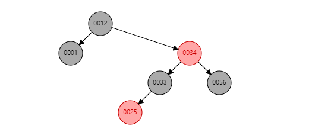

# 集合框架概述

## 一、集合

> 集合就是一个可以装东西的容器

**集合的特点：**

1. 集合的长度是可变的
2. 集合中的元素只能放置引用数据类型
3. 集合中的元素可以是不同类型的对象

**集合和数组的区别：**

1. 集合的长度是可变的，但是数组的长度是不可变的
2. 集合中存储的元素只能存储引用数据类型的数据，但是数组中即可以存储基本数据，也可以存储引用数据类型
3. 集合中元素可以不同类型，但是数组中只能存储同一类型

## 二、集合体系的结构图


ConcurrentHashMapsh属于java.util.current包中的类，即JUC，线程安全。

# Collection接口

Collection 中的API：

1. boolean add(Object e) ; 向集合添加元素
2. boolean addAll(Collection c) ; 将集合c中的所有的元素，添加到当前集合中
3. void clear(); 清理所有的元素
4. boolean remove(Object o); 从集合中删除某一个元素
5. boolean removeAll(Collection c); 从当前集合中，将集合c包含的元素一起删除
6. boolean removeIf(Predicate predicate); 从集合中按照条件删除元素
7. int size(); 获得集合中元素的个数
8. boolean contains(Object o); 集合中是否包含某个元素
9. boolean isEmpty(); 判断集合是否为空集合(判断是否有元素)
10. Object[] toArray(); 将集合转换为数组
11. Iterator iterator(); 迭代器(遍历集合的一种方式)

# ArrayList

## 一、List

List 列表

List 列表的特点：

1. 元素在存储时，有顺序的
2. 元素是可以重复
3. 每一个元素都是有下标

List常用的方法：

> void add(Object obj);
>
> void add(int index, Object obj); //向指定位置，添加元素
>
> Object get(int index); //根据下标获得元素
>
> Object remove(int index); //根据下标移除某一个元素
>
> Object set(int index,Object element); //根据下标，修改元素
>
> int indexOf(Object element); //根据元素的内容，查找第一次出现的下标
>
> int lastIndexOf(Object element); //根据元素的内容，查找最后一次出现的下标
>
> List subList(int from,int to); //从from开始到to之间结束的所有元素，截取出来

## 二、ArrayList

ArrayList：顾名思义 这玩意一定跟数组有关！

ArrayList的特点：

1. 有序
2. 元素可以重复
3. 有下标

举例说明：声明集合，向集合中添加元素

```Java
String a = "123";
String b = "asdf";
//人对象
Person person = new Person();
//学生对象
Student student = new Student();
//创建一个ArrayList 集合
ArrayList datas = new ArrayList();
/*add() 代表一个一个装元素 */
datas.add(a);
datas.add(b);
datas.add(person);
datas.add(student);
datas.add(a);//可以存放重复元素
System.out.println("集合中的元素：" + datas.size());
```

查看集合中的元素

```Java
/*获得数组元素的方式*/
System.out.println(datas.get(0));
System.out.println(datas.get(1));
System.out.println(datas.get(2));
System.out.println(datas.get(3));
System.out.println(datas.get(4));
//        System.out.println(datas.get(5));//越界了！！！
```

修改集合中固定位置的元素

```Java
datas.set(1, "林志玲");
System.out.println(datas.get(1));
```

判断集合中是否存在某一个元素

```Java
//判断集合中是否存在某一个元素
System.out.println(datas.contains("隔壁王哥"));
```

根据下标移除元素

```Java
//移除下标是1的元素
datas.remove(1);
System.out.println(datas.get(1));//移除之后，后面的元素，自动向前补位
```

根据元素内容，移除元素

```Java
//根据元素内容，移除元素
datas.remove("林志玲");
System.out.println(datas.get(1));
```

在指定的位置添加元素

```Java
datas.add(1, "吴亦凡");//在指定的位置添加元素，后面的元素，自动依次向后移位
```

**课堂练习**

> “隔壁王哥”、“隔壁张哥”、“隔壁宋哥”、Student(“小强”)、Teacher(“老蒲”) 、5 添加到ArrayList中去，并检索 下标是3 的元素是哪一个？ 移除下标是2的元素，后再检查2号元素是哪一个？
>
> ```Java
> public static void main(String[] args) {
>      String str1 = "隔壁王哥";
>      String str2 = "隔壁张哥";
>      String str3 = "隔壁宋哥";
>      Teacher teacher = new Teacher("老蒲");
>      Student student = new Student("小强");
>      ArrayList datas = new ArrayList();
>      datas.add(str1);//0
>      datas.add(str2);//1
>      datas.add(str3);//2
>      datas.add(teacher);//3
>      datas.add(student);//4
>      //依次性查看集合中，所有元素
>      System.out.println(datas);
>  }
> }
> class Teacher{
>  private String name;
>  public Teacher() {
>      super();
>  }
>  public Teacher(String name) {
>      super();
>      this.name = name;
>  }
>  public String getName() {
>      return name;
>  }
>  public void setName(String name) {
>      this.name = name;
>  }
>  @Override
>  public String toString() {
>      return "Teacher [name=" + name + "]";
>  }
> }
> class Student{
>  private String name;
>  private Integer age;
>  public Student() {
>      super();
>  }
>  public Student(String name) {
>      super();
>      this.name = name;
>  }
>  public String getName() {
>      return name;
>  }
>  public void setName(String name) {
>      this.name = name;
>  }
>  public Integer getAge() {
>      return age;
>  }
>  public void setAge(Integer age) {
>      this.age = age;
>  }
>  @Override
>  public String toString() {
>      return "Student [name=" + name + ", age=" + age + "]";
>  }
> }
> ```

## **三、ArrayList的遍历**

**方式一、使用for**

```Java
   //遍历
        int size = datas.size();
        for(int i = 0; i < size; i++) {
            System.out.println(datas.get(i));
        }
```

**方式二、使用增强for循环foreach**

```Java
        //遍历    
        for (Object obj : datas) {
            System.out.println(obj);
            //如果针对特殊类型数据，需要进行：向下强制转型
            if(obj instanceof Student) {
                Student s = (Student)obj;
                System.out.println(s.getName());
            }
        }
```

**最便捷的方式**

```Java
        //遍历
//        datas.forEach(new Consumer<Object>() {
//
//            @Override
//            public void accept(Object e) {
//                // TODO Auto-generated method stub
//                System.out.println(e);
//            }
//        });
        //最便捷
        datas.forEach((e) ->{
            System.out.println(e);
        });
```

**方式三、使用迭代器**

```Java
        //得到迭代对象
        Iterator it = datas.iterator();
        while(it.hasNext()) {
            //移动"迭代标记"，并获得数据
            Object obj = it.next();
            System.out.println(obj);
            //用完就删除(以下，不是必须，慎用)
            it.remove();
        }
        System.out.println(datas.size());
```

## 四、ArrayList的元素排序

**一、自然排序**

数组是可以排序的，使用数组的工具类Arrays.sort()

集合同样可以排序，使用集合的工具类Collections.sort()

> 要求：集合中的元素必须是同一类型元素，元素必须要实现Comparable

举例说明：

```Java
public class Demo2 {
    public static void main(String[] args) {
        Student stu01 = new Student("张三", 20);
        Student stu02 = new Student("李四", 12);
        Student stu03 = new Student("王五", 45);
        Student stu04 = new Student("赵六", 23);
        Student stu05 = new Student("田七", 78);
        //需求 要求学生 按照 年龄进行排序(升序)
        ArrayList datas = new ArrayList();
        //一次添加所有元素，到datas集合中
        Collections.addAll(datas, stu01,stu02,stu03,stu04,stu05);
        //排序
        Collections.sort(datas);//要求 集合的元素，一定要实现一个接口Comparable
        System.out.println(datas);
    }
}
class Student implements Comparable<Student>{
    private String name;
    private Integer age;
    public Student() {
        super();
    }
    public Student(String name,Integer age) {
        super();
        this.name = name;
        this.age = age;
    }
    public String getName() {
        return name;
    }
    public void setName(String name) {
        this.name = name;
    }
    public Integer getAge() {
        return age;
    }
    public void setAge(Integer age) {
        this.age = age;
    }
    @Override
    public String toString() {
        return "Student [name=" + name + ", age=" + age + "]";
    }
    @Override
    public int compareTo(Student o) {
        // TODO Auto-generated method stub
        //3种值：负数  0  正数
        return o.age - this.getAge();
    }
}
```

缺陷：元素类一定要 实现Comparable接口

**二、自定义排序**

自定义排序：就是程序员使用Comparator 自己去定义排序规则，元素不需要实现任何的接口

```Java
public class Demo2 {
    public static void main(String[] args) {
        Student stu01 = new Student("张三", 20);
        Student stu02 = new Student("李四", 12);
        Student stu03 = new Student("王五", 45);
        Student stu04 = new Student("赵六", 23);
        Student stu05 = new Student("田七", 78);
        //需求 要求学生 按照 年龄进行排序(升序)
        ArrayList datas = new ArrayList();
        //一次添加所有元素，到datas集合中
        Collections.addAll(datas, stu01,stu02,stu03,stu04,stu05);
//        Comparator<Student> compr = new Comparator<Student>() {
//
//            @Override
//            public int compare(Student o1, Student o2) {
//                // TODO Auto-generated method stub
//                return o1.getAge() - o2.getAge();
//            }
//        };
        //Lambda 表达式
        Comparator<Student> compr = (o1,o2) ->{
            return o2.getAge() - o1.getAge();
        };
        //排序
        Collections.sort(datas, compr);
        System.out.println(datas);
    }
}
class Student{
    private String name;
    private Integer age;
    public Student() {
        super();
    }
    public Student(String name,Integer age) {
        super();
        this.name = name;
        this.age = age;
    }
    public String getName() {
        return name;
    }
    public void setName(String name) {
        this.name = name;
    }
    public Integer getAge() {
        return age;
    }
    public void setAge(Integer age) {
        this.age = age;
    }
    @Override
    public String toString() {
        return "Student [name=" + name + ", age=" + age + "]";
    }
}
```

## 五、底层结构


**ArrayList常用方法总结**

`void add(Object obj)`；增

`void add(int index,Object obj)`;指定位置添加

void add(内容)；


`Object get(int index);`查看


`Object remove(int index);`删除

Object remove(内容)；

Object remove(变量)；


`Object set(int index,Object element);`修改

`int indexOf(Object element);`第一次出现下标志

`int lastIndexOf(Object element);`最后一次出现下标

`lise subList(int fromIndex,int toIndex);`[fromIndex,toIndex);

`int size()`;元素个数

`boolean contains(Object o)`;是否包含


`System.out.println(ArrayList alt);`全部输出元素

`Colletctions.addall(ArrayList alt,...)`:批量添加；

 **Iterator it = datas.iterator();的理解：**

**iterator为接口(接口不能被实例化)，但ArrayList为iterator的实现类，实现类可以创建对象。**

# Comparable

Comparable 接口：作用给元素提供一个相互比较的能力


> 返回3种类型的值：
>
> 1. 负值 当前对象 在 排序时，应该位于比较对象的前面
> 2. 0 当前对象 和 比较对象 位置应该一样
> 3. 正值 当前对象 在 排序时，应该位于比较对象的后面

接口如何使用？

```java
class Student implements Comparable<Student>{
    private String name;
    private Integer age;
    public Student() {
        super();
    }
    public Student(String name,Integer age) {
        super();
        this.name = name;
        this.age = age;
    }
    public String getName() {
        return name;
    }
    public void setName(String name) {
        this.name = name;
    }
    public Integer getAge() {
        return age;
    }
    public void setAge(Integer age) {
        this.age = age;
    }
    @Override
    public String toString() {
        return "Student [name=" + name + ", age=" + age + "]";
    }
    @Override
    public int compareTo(Student o) {
        // TODO Auto-generated method stub
        //3种值：负数  0  正数
        return this.age - o.getAge();
    }
}
```

# comparator

comparator接口

# Iterable

Iterable 迭代能力接口，作用：给集合类，添加迭代(遍历)能力


**Iterable与Iterator的联系区别：**

> 1.Iterator是迭代器类，而Iterable是为了只要实现该接口就可以使用foreach，进行迭代.Iterable中封装了Iterator接口，只要实现了Iterable接口的类，就可以使用Iterator迭代器了。
>
> 2.集合Collection、List、Set都是Iterable的实现类，所以他们及其他们的子类都可以使用foreach进行迭代。
>
> 3.Iterator中和核心的方法next(),hasnext(),remove(),都是依赖当前位置，如果这些集合直接实现Iterator，则必须包括当前迭代位置的指针。当集合在方法间进行传递的时候，由于当前位置不可知，所以next()之后的值，也不可知。而当实现Iterable则不然，每次调用都返回一个从头开始的迭代器，各个迭代器之间互不影响。


# Iterator

Iterator该接口，具备迭代能力！


移动规则


> 箭头：代表迭代的标记，标记开始位置是在0号元素之前！

该接口的好处：为集合类提供统一的遍历机制

**补充：**

Itetator接口：支持所有集合元素的迭代遍历（有的集合不适用foreach等遍历）。

> 迭代器：
>
> 就是把不同的数据结构 "相同功能 "的函数装到一个名字相同的函数里，这样的话你在写算法的时候就可以不管你要操作的数据结构的逻辑结构了。比如不管是链表,数组还是别的什么，统一都用迭代器进行访问的话可能都是   Next()表示下一个元素   Pre()表示上一个元素等等 。其实意思就是，不管你用的是链表，2叉树、3叉树、N叉树，还是向量。 迭代器都可以让你从first开始，使用next，到达last，而且一个不漏滴都走一遍。

`E it.next() `会返回迭代器的下一个元素，并且更新迭代器的状态。

`Boolean it.hasNext() `用于检测集合中是否还有元素。

`default void it.remove() `将迭代器返回的元素删除。

# LinkedList

## 一、LinkedList

LinkedList 它的底层不再是数组结构，它的底层是双向链表结构。它将列表中的每个对象都有一个单独的存储空间，而且每个存储空间都具备上一个节点，和下一个节点的索引！


JDK1.5 以后针对LinkedList 做了改进，让实现了Queue接口，从而实现了先进先出(FIFO)的功能

**补充**

特点：

（1）允许null值

（2）内部以双向链表的形式来保存集合中的元素

（3）实现了Deque接口，意味着可以当做双端队列、栈来使用

（4）线程不安全，线程安全的可以使用：List list = Collections.synchronizedList(new LinkedList(…));

（5）fail-fast机制

（6）所有指定位置的操作都是从头开始遍历进行的

（7）有序

## **二**、LinkedList的常用API


它扩展的API：

| 方法            | 描述                                                         |
| :-------------- | :----------------------------------------------------------- |
| `addFirst(E e)` | 向链表的头部，添加元素                                       |
| `addLast(E e)`  | 向链表的尾部，添加元素                                       |
| `element()`     | 检索但不删除此列表的头（第一个元素）                         |
| `getFirst()`    | 返回此列表中的第一个元素。                                   |
| `getLast()`     | 返回此列表中的最后一个元素。                                 |
| `peek()`        | 检索但不删除此列表的头（第一个元素）                         |
| `poll()`        | 检索并删除此列表的头（第一个元素） 根据这个方法：就可以实现FIFO |


```java
datas.add("苹果");//First
datas.add("香蕉");
datas.add("菠萝");//Last
System.out.println(datas);
//头部元素的位置
datas.addFirst("木瓜");
//尾部元素的位置
datas.addLast("西瓜");
System.out.println(datas);
//获得下标为3的元素
System.out.println(datas.get(3));
```

LinkedList 默认是没有下标索引的，通过datas.get(3)方法时，LinkedList 将从First开始进行计算下标位置，最后给你对应位置的元素！从这里也能看出LinkedList 在获取元素时，性能比ArrayList 低！

```java
datas.set(3, "草莓");//修改3号位置的值
datas.add(3, "桃子");//在3号位置插入一个元素
System.out.println(datas);
```


LinkedList 在插入元素或者删除元素时，性能比ArrayList 要高一些！

```java
datas.remove(4);
System.out.println(datas);
```

## 三、LinkedList的遍历

方式一：

```java
int size = datas.size();
for(int i = 0; i < size; i ++) {
System.out.println(datas.get(i));
}
```

方式二：

```java
for (String str : datas) {
    System.out.println(str);
}
```

方式三：

```java
datas.forEach(new Consumer<String>() {
    @Override
    public void accept(String t) {
        // TODO Auto-generated method stub
        System.out.println(t);
    }
});
```

## 四、LinkedList排序

自然排序

```java
 LinkedList<String> datas = new LinkedList<String>();
    datas.add("abc");//First
    datas.add("bad");
    datas.add("cad");
    datas.add("abd");
    datas.add("bac");//Last
    Collections.sort(datas);
    System.out.println(datas);
```

自定义排序

```java
LinkedList<String> datas = new LinkedList<String>();
    datas.add("abc");//First
    datas.add("bad");
    datas.add("cad");
    datas.add("abd");
    datas.add("bac");//Last
    Collections.sort(datas,new Comparator<String>() {
        @Override
        public int compare(String o1, String o2) {
            // TODO Auto-generated method stub
            return o2.compareTo(o1);
        }
    });
    System.out.println(datas);
```

## 五、ArrayList 和 LinkedList的区别

1. 底层不同 ArrayList 底层是数组结构，而LinkedList 底层是双向链表结构
2. ArrayList 在根据下标查询元素时，性能比LinkedList 高；但是在新增或删除元素时，性能比LinkedList 低（原因是：ArrayList涉及到移位）；

## 补充

自然排序，String默认实现comparable接口。


# Vector

## 一、Vector

Vector 向量 是JDK提供的很古老的List集合！

Vector的用法，和ArrayList一模一样！

```Java
Vector<Integer> vec = new Vector<Integer>();
Collections.addAll(vec, 12,34,23,12,56,2);
System.out.println(vec);
//遍历
vec.forEach(new Consumer<Integer>() {
    @Override
    public void accept(Integer t) {
        // TODO Auto-generated method stub
        System.out.println(t);
    }
});
Collections.sort(vec);
System.out.println(vec);
```

## 二、Vector 和ArrayList的区别

1. Vector 使用synchronized关键字
2. Vector的底层虽然依旧采用数组结构，但是是ArrayList稍微有点不同


默认长度：10 每次扩容：默认按照2倍来进行扩容

# HashSet

## 一、Set

Set 集 是跟List集合有很大区别的一种集合

Set集合的特点：

1. 可有序，也可无序
2. 元素不允许放置重复元素
3. 不能通过下标的方式，访问元素

## 二、HastSet


HashSet底层是：`Hash表`

​	JDK8之前，底层采用`数组+链表（Hash表）`实现。

​	JDK8及以后，底层进行了优化。由`数组+链表+红黑树（Hash表）`实现。


HashSet的特点：

1. 集合中元素在存储和获取时，是没有顺序
2. 不能放置任何的重复元素
3. 不能通过下标来访问中间的元素
4. 可以放置null，但是只能放置1个

## 三、HashSet 常见API

构造器：


```Java
HashSet<String> hs = new HashSet<String>();
```

常用API:


```Java
HashSet<String> hs = new HashSet<String>();
//依旧可以使用Collections，完成元素的添加
Collections.addAll(hs, "adc","abc","bad","adw");
hs.add(null);
hs.add("bad");//具有去重的能力
System.out.println(hs);
System.out.println(hs.contains("bad"));
hs.remove(null);//移除元素
System.out.println(hs);
hs.clear();//移除所有的元素
System.out.println(hs.isEmpty());//判断集合是否为空
System.out.println(hs.size());//输出元素的个数
```

------

> 面试题：HashSet 针对元素如何去重？
>
> 答案：使用元素身上的2个方法：hashcode() 、equals()
>
> ​				hashCode不同------------------------------->与hashSet中的已有元素都不同，可以添加
>
> ​				hashCode相同，equals结果为false--->与hashSet中的已有元素都不同，可以添加
>
> ​				hashCode相同，equals结果为true--->与hashSet中的某个元素不同，不可以可以添加

```
Object 的 hashcode 方法是本地方法，也就是用 c 或 c++ 实现的，该方法直接返回对象的内存地址。
如果没有重写hashCode()，则任何对象的hashCode（）值都不相等（而hashmap想让部分值的hashCode值一样，所以就要重写）
```

```Java
HashSet<String> hs = new HashSet<String>();
//依旧可以使用Collections，完成元素的添加
Collections.addAll(hs, "Aa","abc","bad","adw");
//不同的对象，由于重写的hashcode() 可能出现：相同的hash值，但是是不同的对象
System.out.println("Aa".hashCode());
System.out.println("BB".hashCode());
hs.add("BB");
```

注意：`不同的对象，由于重写的hashcode() 可能出现：相同的hash值，但是是不同的对象`，`两个对象是同一对象，那么它的hash值一定是相同的`

```Java
class Person{
    private String name;
    private Integer age;
    public Person() {
        super();
    }
    public Person(String name, Integer age) {
        super();
        this.name = name;
        this.age = age;
    }
    public String getName() {
        return name;
    }
    public void setName(String name) {
        this.name = name;
    }
    public Integer getAge() {
        return age;
    }
    public void setAge(Integer age) {
        this.age = age;
    }
    @Override
    public String toString() {
        return "Person [name=" + name + ", age=" + age + "]";
    }
    @Override
    public int hashCode() {
        final int prime = 31;
        int result = 1;
        result = prime * result + ((age == null) ? 0 : age.hashCode());
        result = prime * result + ((name == null) ? 0 : name.hashCode());
        return result;
    }
    @Override
    public boolean equals(Object obj) {
        if (this == obj)
            return true;
        if (obj == null)
            return false;
        if (getClass() != obj.getClass())
            return false;
        Person other = (Person) obj;
        if (age == null) {
            if (other.age != null)
                return false;
        } else if (!age.equals(other.age))
            return false;
        if (name == null) {
            if (other.name != null)
                return false;
        } else if (!name.equals(other.name))
            return false;
        return true;
    }
}
public class Demo3 {
    public static void main(String[] args) {
        HashSet<Person> hs = new HashSet<Person>();
        Person p1 = new Person("张三", 22);
        Person p2 = new Person("李四", 12);
        Person p3 = new Person("王五", 34);
        Person p4 = new Person("张三", 22);
        Collections.addAll(hs, p1,p2,p3,p4);
        System.out.println(hs.size());
    }
}
```

综上所述：如果某一天，大家想用HashSet 针对元素进行内容去重，一定要在元素身上 重写：hashcode() 以及 equals()

## 四、HashSet遍历

方式一：

```Java
for (Person person : hs) {
    System.out.println(person);
}
```

```java
hs.forEach(new Consumer<Person>() {
    @Override
    public void accept(Person t) {
        // TODO Auto-generated method stub
        System.out.println(t);
    }
});
```

方式二：

```Java
Iterator<Person> it = hs.iterator();
while(it.hasNext()) {
    Person person = it.next();
    System.out.println(person);
}
```

## 五、排序

HashSet默认是无序的，如果业务要求：一定要排序。解决方案：转换为ArrayList 然后再排序

```Java
HashSet<Person> hs = new HashSet<Person>();
    Person p1 = new Person("张三", 22);
    Person p2 = new Person("李四", 22);
    Person p3 = new Person("王五", 34);
    Person p4 = new Person("张三", 22);
    Collections.addAll(hs, p1,p2,p3,p4);
    //HashSet 是无序，但是业务要求，一定要有排序
    ArrayList<Person> list = new ArrayList<Person>(hs);
    Collections.sort(list,new Comparator<Person>() {
        @Override
        public int compare(Person o1, Person o2) {
            // TODO Auto-generated method stub
            return o1.getAge() - o2.getAge();
        }
    });
    System.out.println(list);
```

## 六、底层原理

HashSet的底层：HashMap的Key ，HashMap 请看后面的讲解

# TreeSet

## 一、TreeSet

TreeSet 一个基于红黑二叉树 结构的集合！红黑演示网站：http://rbtree.phpisfuture.com/


**红黑树的特点：**

1. 每个节点要么是黑色，要么就是红色
2. 根节点一定是黑色(59 就是根)
3. 红色节点，它的子节点一定是黑色
4. 任何一个节点，到每个叶子节点的所有路径，黑色节点的个数都是一样的

> 红黑树的优点：在查询时，减少检索的次数

**TreeSet的特点：**

1. 集合中元素是有序的
2. 元素也是唯一的
3. 它同样没有下标索引

## 二、TreeSet常见API

```Java
TreeSet<Integer> ts = new TreeSet<Integer>();
Collections.addAll(ts, 12,34,1,33,56,25);
```



```Java
TreeSet<Integer> ts = new TreeSet<Integer>();
Collections.addAll(ts, 12,34,1,33,56,25);
//默认就完成了排序(升序)
System.out.println(ts);
```

字符串也是同理

```Java
TreeSet<String> ts = new TreeSet<String>();
Collections.addAll(ts, "abc","acd","ade","bab","bac");
//默认就完成了排序(升序)
System.out.println(ts);
```


> 问题？TreeSet 可以自动排序，它考啥完成？
>
> 答案：Comparable

------

自定义元素类型：

```Java
public class Demo4 {
    public static void main(String[] args) {
        TreeSet<Student> ts = new TreeSet<Student>();
        Student s1 = new Student("小鱼", 20);
        Student s2 = new Student("小猫", 10);
        Student s3 = new Student("小狗", 15);
        Student s4 = new Student("小乌龟", 120);
        Student s5 = new Student("小牛", 20);
        //向集合中添加元素
        Collections.addAll(ts, s1,s2,s3,s4,s5);
        //输出集合
        System.out.println(ts);
    }
}
class Student implements Comparable<Student>{
    private String name;
    private Integer age;
    public Student() {
        super();
    }
    public Student(String name, Integer age) {
        super();
        this.name = name;
        this.age = age;
    }
    public String getName() {
        return name;
    }
    public void setName(String name) {
        this.name = name;
    }
    public Integer getAge() {
        return age;
    }
    public void setAge(Integer age) {
        this.age = age;
    }
    @Override
    public String toString() {
        return "Student [name=" + name + ", age=" + age + "]";
    }
    /**
     * TreeSet底层依靠compareTo() 的返回值，完成排序
     * 如果返回值 ==0 意味着集合中已经存在该元素，所以它会去重
     */
    @Override
    public int compareTo(Student o) {
        // TODO Auto-generated method stub
        int i = this.age - o.age;// -  +  0
        if(i == 0) {
            //再次比较名字
            return this.name.compareTo(o.name);
        }else {
            return i;
        }
    }
}
```

> 结论：TreeSet 去重原理和HashSet 是不一样的，HashSet 依靠的hashcode() 和equals() ，而咱的TreeSet 依靠的是 compareTo() 的返回值，当返回值=0时，就开始去重

## 三、常见的API

重点的是构造器：

```Java
public class Demo4 {
    public static void main(String[] args) {
        TreeSet<Student> ts = new TreeSet<Student>(new Comparator<Student>() {
            @Override
            public int compare(Student o1, Student o2) {
                // TODO Auto-generated method stub
                int i = o1.getAge() - o2.getAge();// -  +  0
                if(i == 0) {
                    //再次比较名字
                    return o1.getName().compareTo(o2.getName());
                }else {
                    return i;
                }
            }
        });
        Student s1 = new Student("小鱼", 20);
        Student s2 = new Student("小猫", 10);
        Student s3 = new Student("小狗", 15);
        Student s4 = new Student("小乌龟", 120);
        Student s5 = new Student("小牛", 20);
        //向集合中添加元素
        Collections.addAll(ts, s1,s2,s3,s4,s5);
        //输出集合
        System.out.println(ts);
    }
}
class Student{
    private String name;
    private Integer age;
    public Student() {
        super();
    }
    public Student(String name, Integer age) {
        super();
        this.name = name;
        this.age = age;
    }
    public String getName() {
        return name;
    }
    public void setName(String name) {
        this.name = name;
    }
    public Integer getAge() {
        return age;
    }
    public void setAge(Integer age) {
        this.age = age;
    }
    @Override
    public String toString() {
        return "Student [name=" + name + ", age=" + age + "]";
    }
}
```

## 四、遍历

方式一：

```Java
for (Student student : ts) {
        System.out.println(student);
    }
```

```java
ts.forEach(new Consumer<Student>() {
    @Override
    public void accept(Student t) {
        // TODO Auto-generated method stub
        System.out.println(t);
    }
});
```

方式二：

```Java
Iterator<Student> it = ts.iterator();
while(it.hasNext()) {
    Student s = it.next();
    System.out.println(s);
}
```

**课堂练习**

需求一：TreeSet集合排序：将五个学生对象放入集合中，先按照总分降序排 序，总分相同就按照数学成绩降序排序，结合面向对象的思想设计程序


## 补充

1、TrssSet本身自带排序功能，元素要打印输出必须要实现comparable或comparator否则会出现类型转换异常，无法输出。

引用数据类型使用`!=`比较的是地址，而不是内容。

2、TreeSet实现comparable或comparator后会自动排序和去重，若不需要去重，只需在加一个条件分支，o1-o2==0时，返回一个正数或负数即可。

# LinkedHashSet

## 一、LinkedHashSet

LinkedHashSet 的使用方法跟HashSet 一模一样，特点也是一模一样

LinkedHashSet的特点：

1. 无序
2. 元素是唯一的
3. 没有下标索引

唯一区别：底层结构上有一丢丢的不一样，HashSet 是HashMap的键，而LinkedHashSet 的底层是：LinkedHashMap的键；

## 二、LinkedHashSet的常用API

```java
LinkedHashSet<String> lhs = new LinkedHashSet<String>();
        Collections.addAll(lhs, "abc","acd","abd","bac","bda");
        System.out.println(lhs);//无序的
        System.out.println(lhs.contains("acd"));
        lhs.add("abc");//去重 先比较hashcode() 然后再比较equals() 
//        lhs.clear();
//        System.out.println(lhs.size());
        //遍历
        lhs.forEach(new Consumer<String>() {
            @Override
            public void accept(String t) {
                // TODO Auto-generated method stub
                System.out.println(t);
            }
        });
```

## 补充

**LinkedHashSet是HashSet的子类，元素是“有序”不重复，无索引。**
LinkedHashSet底层依然是使用哈希表存储元素的，但是每个元素都额外带一个链表来维护添加顺序。
不光增删查快，还有序。
缺点是多了一个存储顺序的链会占内存空间，而且不允许重复，无索引。

# HashMap

## 一、Map

Map 是有区别于Collection体系的集合，是Java提供的另外一种非常重要的集合。它的数据通常是成对(Key键-Value值)出现!


Map中有2套集合，一套存储Key，另一套存储Value。Key是不能重复的，但是Value是可以重复的！

Key 和Value之间的关系是：单向1对1 ；换句话说：如果我要取值，那么我就需要通过Key去获取对应的Value。

所有的Key 组成起来，实际上就是Set集合。所有的Value组成起来，实际上就是普通的Collection (可以放置重复元素)!

已知的Map实现类：`HashMap`、TreeMap、LinkedHashMap、HashTable、`Properties`、`ConcurrentHashMap`

常见的Map的API:

| 方法                         | 描述                                         |
| :--------------------------- | :------------------------------------------- |
| get(Object key)              | 根据key 获得相关的值！                       |
| put(Object key,Object value) | 向Map中添加k-v 键值对结构                    |
| remove(Object key)           | 从Map中删除k-v 键值对结构                    |
| containsKey(Object key)      | 判断Map中是否拥有k-v 键值对结构              |
| containsValue(Object key)    | 判断Map中是否拥有对应的 value存在            |
| size()                       | Map 中元素的个数                             |
| isEmpty()                    | 判断Map 是否是空集合                         |
| clear()                      | 删除Map所有的k-v键值对结构                   |
| putAll(Map m)                | 将m中所有的k-v键值对结构，添加到当前的集合中 |
| keySet()                     | 返回所有的Key组成的Set集合                   |
| values()                     | 返回所有的Value组成的Collection对象          |
| entrySet()                   | 返回所有的Key-Value组成的Set集合             |

## 二、HashMap

HashMap 底层是：Hash表

数组+单向链表


**HashMap的特点：**

1. 无序的
2. 不能通过下标索引的方式，完成对元素的检索
3. 元素的唯一(Key 是唯一的，Value是可以重复的)

## 三、HashMap的常用API

构造器


常用API：

```java
HashMap<String,Integer> hm = new HashMap<String,Integer>();
hm.put("abc", 12);
hm.put("abd", 13);
hm.put("aba", 10);
hm.put("bac", 4);
hm.put("abc", 23);//相同的Key，Value将会被覆盖
System.out.println(hm);
System.out.println(hm.size());//获得集合中K-V元素的个数
System.out.println(hm.containsKey("bac"));//判断集合是否存在某一个Key
System.out.println(hm.containsValue(4));//判断集合是否存在某一个Value
//        hm.clear();//清空集合中所有的元素
hm.remove("bac");
System.out.println(hm);//按照Key删除对应的K-V结构
```

------

具体的案例1：

```java
public class Demo7 {
    public static void main(String[] args) {
        HashMap<String,Dog> hm = new HashMap<String,Dog>();
        hm.put("小白", new Dog("一条小白"));
        hm.put("花儿", new Dog("一条白狗"));
        hm.put("大黄", new Dog("一条黄狗"));
        hm.put("玲玲", new Dog("一条哈巴狗"));
        System.out.println(hm);
    }
}
class Dog {
    private String name;
    public Dog() {
        super();
    }
    public Dog(String name) {
        super();
        this.name = name;
    }
    public String getName() {
        return name;
    }
    public void setName(String name) {
        this.name = name;
    }
    @Override
    public String toString() {
        return "Dog [name=" + name + "]";
    }
}
```

------

具体的案例2：

```java
public class Demo7 {
    public static void main(String[] args) {
        HashMap<Dog,String> hm = new HashMap<Dog,String>();
        hm.put(new Dog("大黄"), "一条大黄狗");
        hm.put(new Dog("小白"), "一条小白狗");
        hm.put(new Dog("大黄"), "一条小黄狗");
        hm.put(new Dog("小黑"), "一条小黑狗");
        System.out.println(hm);
    }
}
class Dog {
    private String name;
    public Dog() {
        super();
    }
    public Dog(String name) {
        super();
        this.name = name;
    }
    public String getName() {
        return name;
    }
    public void setName(String name) {
        this.name = name;
    }
    @Override
    public int hashCode() {
        final int prime = 31;
        int result = 1;
        result = prime * result + ((name == null) ? 0 : name.hashCode());
        return result;
    }
    @Override
    public boolean equals(Object obj) {
        if (this == obj)
            return true;
        if (obj == null)
            return false;
        if (getClass() != obj.getClass())
            return false;
        Dog other = (Dog) obj;
        if (name == null) {
            if (other.name != null)
                return false;
        } else if (!name.equals(other.name))
            return false;
        return true;
    }
    @Override
    public String toString() {
        return "Dog [name=" + name + "]";
    }
}
```

## 四、遍历

方式一：

```java
hm.forEach(new BiConsumer<Dog, String>() {
        @Override
        public void accept(Dog k, String v) {
            // TODO Auto-generated method stub
            System.out.println("key=" + k);
            System.out.println("value=" + v);
        }
    });
```

方式二：

```java
Set<Dog> keys = hm.keySet();
    keys.forEach(new Consumer<Dog>() {
        @Override
        public void accept(Dog d) {
            // TODO Auto-generated method stub
            System.out.println("key=" + d);
            System.out.println("value=" + hm.get(d));//根据Key获得Value
        }
    });
```

方式三：

```java
Set<Entry<Dog, String>> set = hm.entrySet();
    for (Entry<Dog, String> entry : set) {
        System.out.println("key=" + entry.getKey());
        System.out.println("value=" + entry.getValue());
    }
```

## 五、底层结构


# TreeMap

## 一、TreeMap

TreeSet 底层就是 TreeMap ，用的是TreeMap的Key。TreeSet 红黑二叉树的结构，意味着：这里的TreeMap的Key就是红黑二叉树！

## 二、TreeMap的常用API

TreeMap的Key必须有具备 比较的能力

```java
TreeMap<String,Integer> tm = new TreeMap<String,Integer> ();
    tm.put("a", 23);
    tm.put("c", 12);
    tm.put("d", 5);
    tm.put("e", 68);
    tm.put("b", null);
    //自动针对Key排序
    System.out.println(tm);
```

```java
TreeMap<Integer,Integer> tm = new TreeMap<Integer,Integer> ();
    tm.put(1003, 89);
    tm.put(1001, 56);
    tm.put(1002, 90);
    tm.put(1005, 89);
    tm.put(1004, 12);
    //自动针对Key排序
    System.out.println(tm);
```

## 三、遍历

```java
tm.forEach(new BiConsumer<Integer,Integer>() {
    @Override
    public void accept(Integer t, Integer u) {
        // TODO Auto-generated method stub
        System.out.println("key= " +t + "  value= "+ u);
    }
});
```

**课堂练习**

将学生（name,age）作为Key，练习TreeSet集合的使用

```java
public class Demo2 {
    public static void main(String[] args) {
        TreeMap<Student,String> tm = new TreeMap<Student,String>(new Comparator<Student>() {
            @Override
            public int compare(Student o1, Student o2) {
                // TODO Auto-generated method stub
                int i = o1.getAge() - o2.getAge();
                if(i == 0) {
                    //继续比较名字
                    return o1.getName().compareTo(o2.getName());
                }else {
                    return i;
                }
            }
        });
        //向tm中添加学生
        tm.put(new Student("abc", 20), "法外狂徒");
        tm.put(new Student("acd", 25), "法内狂徒");
        tm.put(new Student("bae", 18), "女装大佬");
        tm.put(new Student("bce", 18), "男装大佬");
        tm.put(new Student("bab", 16), "一未成年妹妹~");
        System.out.println(tm);
    }
}
class Student {
    private String name;
    private Integer age;
    public Student() {
        super();
    }
    public Student(String name, Integer age) {
        super();
        this.name = name;
        this.age = age;
    }
    public String getName() {
        return name;
    }
    public void setName(String name) {
        this.name = name;
    }
    public Integer getAge() {
        return age;
    }
    public void setAge(Integer age) {
        this.age = age;
    }
    @Override
    public String toString() {
        return "Student [name=" + name + ", age=" + age + "]";
    }
}
```

## 四、底层结构

底层结构：红黑二叉树


每个红色节点，或者黑色节点都是由以下 6个部分组成！


# LinkedHashMap

## 一、LinkedHashMap

它的使用方式，等同于HashMap的使用方式。它和HashMap的底层结构大致相同，只是在Node节点上有所区别！

> HashMap 的Node是个单链表
>
> LinkedHashMap 的Node是个双链表

## 二、LinkedHashMap的底层结构


# 集合补充

## 小结

1、HashMap value不能为基本数据类型，必须要为引用数据类型。

2、HashMap的键和值为非自定义引用数据类型时（比如String、Integer)，会自动去除，当为自定义引用数据类型时，不会自动去重，需要手动重写自定义数据类型的hashcode()和equals()方法,hashset同理。

3、自然排序中，非自定义引用数据类型String默认实现comparable接口，所以不用手动实现，直接可以实现排序。

## 关系图


## 比较

|                   | **重复** | 有序 |    **底层**     | 特点                                                     |
| :---------------- | :------: | :--: | :-------------: | -------------------------------------------------------- |
| **ArrayList**     |    √     |  √   |      数组       | 允许重复、有序、有下标、1.5倍扩容                        |
| **LinkedList**    |    √     |  √   |    双向链表     | 允许重复、有序、默认无下标，位置相关操纵都要从头开始遍历 |
| **Vector**        |    √     |  √   |      数组       | 允许重复、有序、有下标、2倍扩容、synchronized关键字      |
|                   |          |      |                 |                                                          |
| **HashSet**       |    ×     |  ×   |  HashMap的Key   | 唯一、无序、不能下标访问、可放置一个null                 |
| **TreeSet**       |    ×     |  √   |   红黑二叉树    | 唯一、有序、无索引                                       |
| **LinkedHashSet** |    ×     |  ×   |   Hash表+链表   | 唯一、无序、无索引                                       |
|                   |          |      |                 |                                                          |
| **HashMap**       |    ×     |  ×   |     Hash表      | 唯一、无序、无索引                                       |
| **TreeMap**       |    ×     |  √   |   红黑二叉树    | 唯一、有序、无索引                                       |
| **LinkedHashMap** |    ×     |  ×   | Hash表+双向链表 | 唯一、无序、无索引                                       |

## 去重原理

1、Set去重原理：Set集合在调用add方法的时候，add方法会调用元素的hashCode方法和equals方法，判断元素是否重复。先调用hashCode()，若不同，两个元素都保存，若hash值相同，在调用equals()比较内容，若内容相同则认定为同一个元素，去重不存入，若内容不同，则存下。

2、HashSet、HashMap依靠的hashcode() 和equals()

3、TreeSet 依靠的是 compareTo() 的返回值，当返回值=0时，就开始去重。()


