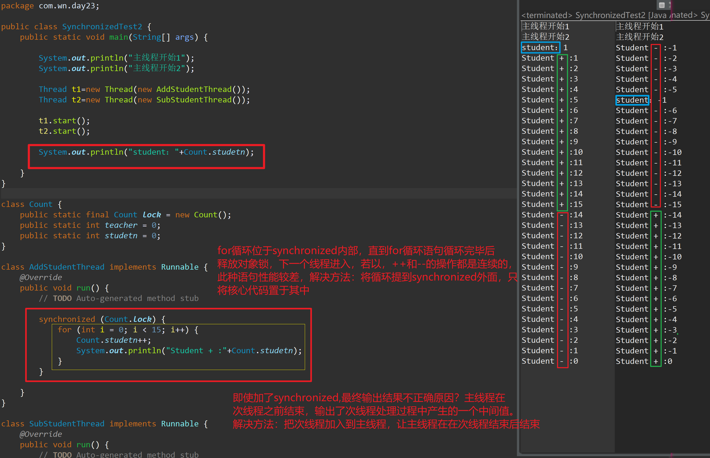

# 多线程概述

## 一、生活中的多线程

一个小学数学题：扫地要5分钟，擦玻璃5分钟，请问：既要扫地，又要擦玻璃要多少分钟？

答案：10分钟(一个人干) | 5分钟(二个人干)

## 二、进程

什么是进程？


一个处于运行状态下的应用程序，就是一个进程！==进程是计算机OS管理的最基本的运行单元，也是它分配资源(CPU，内存)的最小单元。==

## 三、线程

例如：QQ打开后，就会有很多的子任务在同时运行。例如：可以同时开5个聊天窗体，也可以同时下载5个文件，同时传输5个小视频，同时传输5个小图片……

其中每个任务，就是一个“线程”。线程：是运行在进程内部的一个执行任务的东西，每一个进程至少应该包含一个以上的线程。==线程：进程中最小的任务执行单位！==

> 线程如何执行？得靠CPU

## 四、CPU

CPU：中央处理器


CPU：作为计算机系统的运算和控制核心(地位：等同于人类的心脏)，是信息处理，程序运行的最终的执行单位。目前CPU上，一般都具有4核，8核，16核的内核。每个内核上又承载了多个微型的内核，每个内核都具备独立的CPU。

每个内核都具备独立的CPU，`每个内核都具备2个逻辑处理器`,`每个逻辑处理器可以执行1个线程`。例如：4个内核，那么就具备8个逻辑处理器，8个逻辑处理器就可以同时执行8个线程任务。


每个CPU在选择线程执行时：分时调度、优先级调度

## 五、并发和并行

并发：一边唱歌，一边吃饭

并行：一边唱歌，一边听歌

> 并发：多个任务交替执行 (每个单独的核，在执行任务时)
>
> 并行：多个任务同时执行 (多核，同时执行多个任务)

# 线程的创建

## 一、创建线程的4种方式

1. 继承Thread类
2. 实现Runnable接口
3. 实现Callable接口
4. 通过线程池创建线程(后面的小节，将会进行讲解)

## 二、继承Thread类


Thread类在Java中就代表的是线程类，所有的线程对象都必须是Thread类或者子类的实例。

> 继承Thread类，创建多线程的步骤：
>
> 1. 定义一个子类，继承Thread类，重写run() 定义线程需要执行的任务
> 2. 创建子类的实例，并通过start()启动线程

```Java
public class Demo1 {
    public static void main(String[] args) {
        System.out.println("主线程开启");
        //注册  -发送邮件  -发送短信 -发送红包(100元) 
        Thread t = new EmailThread();
        //运行线程
        t.start();
        System.out.println("主线程结束");
    }
}
/**
 * 邮件线程
 * @author 老蒲
 *
 */
class EmailThread extends Thread{
    /**
     * 线程中，需要执行的任务
     */
    @Override
    public void run() {
        // TODO Auto-generated method stub
        System.out.println("给XXX发邮件！！！");
    }
}
```

## 三、实现Runnable接口

> 问题：如果子类还有一个父类怎么办呢？
>
> 答：Java只支持单继承，还有其他的解决方案：Runnable，Callable
>
> Runnable接口实现线程的步骤：
>
> 1. 定义任务类，实现Runnable接口，重写run()方法 定义线程需要执行的任务
> 2. 通过Thread类 创建线程，使用Thread类的有参构造器将 任务类 交给线程

```Java
public class Demo1 {
    public static void main(String[] args) {
        System.out.println("主线程开启");
        Thread t1 = new Thread(new MessageThread());
        //运行线程
        t1.start();
        System.out.println("主线程结束");
    }
}
/**
 * 短信线程
 * @author 老蒲
 *
 */
class MessageThread implements Runnable{
    /**
     * 线程中，需要执行的任务
     */
    @Override
    public void run() {
        // TODO Auto-generated method stub
        System.out.println("给XXX发短信！！");
    }
}
```

`通过实现Runnable接口创建的线程对象，也可以不用经过Thread类包装使用，但必须自定义启动方法，因为Runnable接口无start()方法。`

```java
package com.wn.day23;

class RunnableDemo implements Runnable {
	   private Thread t;
	   private String threadName;
	   
	   RunnableDemo( String name) {
	      threadName = name;
	      System.out.println("Creating " +  threadName );
	   }
	   
	   public void run() {
	      System.out.println("Running " +  threadName );
	      try {
	         for(int i = 4; i > 0; i--) {
	            System.out.println("Thread: " + threadName + ", " + i);
	            // 让线程睡眠一会
	            Thread.sleep(50);
	         }
	      }catch (InterruptedException e) {
	         System.out.println("Thread " +  threadName + " interrupted.");
	      }
	      System.out.println("Thread " +  threadName + " exiting.");
	   }
	   
    	//自定义启动方法
	   public void start () {
	      System.out.println("Starting " +  threadName );
	      if (t == null) {
	         t = new Thread (this, threadName);
	         t.start ();
	      }
	   }
	}
	 
	public class RunnableThreadTest1 {
	 
	   public static void main(String args[]) {
	      RunnableDemo R1 = new RunnableDemo( "Thread-1");
	      R1.start();
	      
	      RunnableDemo R2 = new RunnableDemo( "Thread-2");
	      R2.start();
	   }   
	}
```

> 问题：如果我想要获得 该子线程的返回结果？
>
> 答：Callable + Futrue 组合

## 四、实现Callable接口


Callable + Future 是JDK1.5之后提供的一套可以获得返回值，可以处理异常的线程组合。特点：可以拿到返回結果，它所定义的子线程执行完毕之后，主线程才会继续执行！！！

> 使用Callable定义线程的步骤：
>
> 1. 编写任务类，实现Callable接口，并重写call() 定义线程执行的任务，而且要有返回值
> 2. 使用FutureTask 的run() 启动Callable定义的任务
> 3. 使用FutureTask的get() 获得Callable定义的返回结果

```Java
public class Demo1 {
    public static void main(String[] args) {
        System.out.println("主线程开启");
        FutureTask<Integer> task = new FutureTask<Integer>(new RedPacketThread());
        // 启动线程
        task.run();
        // 得到Callable实例的返回结果
        try {
            Integer i = task.get();
            System.out.println("发出去的红包是：" + i);
        } catch (Exception e) {
            // TODO Auto-generated catch block
            e.printStackTrace();
        }
        System.out.println("主线程结束");
    }
}
/**
 * 红包线程
 * 
 * @author 老蒲
 *
 */
class RedPacketThread implements Callable<Integer> {
    /**
     * 线程中，需要执行的任务
     */
    @Override
    public Integer call() throws Exception {
        // TODO Auto-generated method stub
        System.out.println("给XXX转个大红包！！！");
        Random random = new Random();
        return random.nextInt(200000);
    }
}
```

> 面试题：现在有一个主线程，有10根子线程，问：如何做到10根子线程都执行完毕之后，主线程方可继续执行？
>
> 答案：Callable + Future

## 补充

1、**`Runnable和Colloable接口都只有一个抽象方法，因此都支持lambda表达式的写法。`**

当接口或抽象类实例需要作为里一个对象的构造方法参数时，若只需需要创建一个该对象，推荐使用匿名内部类或lambda表达式，若需要创建多个对象时，推荐创建继承子类或实现类。

```java
lambda表达式结构

(方法形参)->{
    方法体；
}
```

2、通过继承Thread类和实现Runnable接口产生的子线程，主线程的进行不受子线程的影响。

3、线程的开启要调用start()方法，而不能调用重写的run()方法，若调用run（）,则表明不是线程，而是普通方法的实现。

4、`创建线程对象并重写run()方法，重要的是理解的 run() 可以调用其他方法，使用其他类，并声明变量，就像主线程一样。在创建一个实现 Runnable 接口的类之后，你可以在类中实例化一个线程对象。`但业务需要的方法和属性要定义在run()内部，或被Run()调用，对于Run()外部与Run()毫无关系的方法则不会被执行，除非在在main()中单独调用。


# 三种方式的比较

重要级别：极高

## 面试题

> 继承Tread类和实现Runnable接口的区别？
>
> 1. 两个共同点：都是创建一个异步线程
> 2. Thread类是通过继承的方式来实现，而Runnable接口是通过实现的方式
> 3. Thread类的子类不能再继承其他类，而Runnable接口的实现类是可以继承其他类
> 4. Thread类的实例直接就是一个线程，而Runnable接口的实现类只是定义了线程需要执行的任务
> 5. Runnable接口的实现类，可以被多个Thread实例同时使用
>
> 实现Runnable接口和实现Callable接口的区别？
>
> 1. Runnable接口是JDK1.1提供的，而Callable接口是JDK1.5之后才提供的
> 2. Runnable接口没有返回值，而Callable接口是有返回值
> 3. Runnable接口无法处理异常，而Callable接口可以处理异常
> 4. Runnable接口所定义的线程是一种异步线程，而Callable接口所定义的线程是一种同步线程

## 补充：线程同步与异步

多线程并发时，多个线程同时请求同一个资源，必然导致此资源的数据不安全，A线程修改了B线
程的处理的数据，而B线程又修改了A线程处理的数理。显然这是由于全局资源造成的，有时为了解
决此问题，优先考虑使用局部变量，退而求其次使用同步代码块，出于这样的安全考虑就必须牺牲
系统处理性能，加在多线程并发时资源挣夺最激烈的地方，这就实现了线程的同步机制。

`线程同步`：A线程要请求某个资源，但是此资源正在被B线程使用中，因为同步机制存在，A线程请求
不到，怎么办，A线程只能等待下去。

`线程异步`：A线程要请求某个资源，但是此资源正在被B线程使用中，因为没有同步机制存在，A线程
仍然请求的到，A线程无需等待。

# 线程状态及转换

## 一、线程的状态

人在不同的阶段，存在不同的人生状态，相当于人是有一个生命周期。线程同样也对应着有一定的生命周期！


1. 新建：线程对象被new出来了，此时它就是普通的Java对象

2. 就绪：调用了线程的start()方法，线程将一些初始化的任务都做了，等待CPU选择它

3. 运行：线程被CPU已经选中，拥有执行任务的权利

4. 阻塞：

   > 1、休眠式阻塞 Thread.sleep(时间)
   >
   > 2、等待式阻塞 Thread.wait()
   >
   > 3、同步式阻塞 是使用synchronized关键字，或者使用的Lock锁

5. 死亡：线程执行完毕

## 二、CPU线程调度的方式

一般来讲CPU调用线程有2种方案：分时调度模型、抢占式调度模型 Java中支持的是：抢占式调度模型

**分时调度模型：**

给每个线程划分一片代码执行的时间片，CPU按照时间片依次执行即可！

**抢占式调度模型：**

让可运行迟中优先级高的线程优先占用CPU，而对于优先级相同的线程，随机选择一个线程使其占用CPU，当它失去了CPU的使用权后，再随机选择其它线程获取CPU的使用权。

Java中每个线程都有默认的优先级5，优先级的范围是1-10。优先级是可以通过代码进行修改，优先级级别越高的，在CPU选中的概率也就越高！

如果所有的线程的优先级都是一样的，那么CPU就随机选择！

一旦被选中，那么线程的状态就会由“就绪”状态，转变为“运行”的状态！

## 三、转换线程状态的方法

1. 新建：`new Thread()`

   ```Java
           Thread t = new Thread(new Runnable() {
               @Override
               public void run() {
                   // TODO Auto-generated method stub
                   System.out.println("宝，我就是你的真命天子！");
               }
           });
   ```

   该方法：就是创建一个新的线程起来！

2. 启动：`t.start()`

   ```Java
        Thread t = new Thread(new Runnable() {
               @Override
               public void run() {
                   // TODO Auto-generated method stub
                   System.out.println("宝，我就是你的真命天子！");
               }
           });
           t.start();//启动线程，让线程处于"就绪"的状态！
   ```

   该方法：启动线程，让线程处于”就绪”的状态！

3. 阻塞：`Thread.sleep()`

   ```Java
    public static void main(String[] args) {
           for(int i = 0; i < 5; i ++) {
               Thread t = new Thread(new Runnable() {
                   @Override
                   public void run() {
                       // TODO Auto-generated method stub
                       long id = Thread.currentThread().getId();
                       System.out.println(id + ": 宝，我就是你的真命天子！" + new Date());
                       try {
                           Thread.sleep(5000);//休眠5S
                       } catch (InterruptedException e) {
                           // TODO Auto-generated catch block
                           e.printStackTrace();
                       }
                       System.out.println(id + ": 王思聪语录！"  + new Date());
                   }
               });
               t.start();//启动线程，让线程处于"就绪"的状态！
           }
       }
   ```

   执行效果：

   

   从图中可以分析得出：Thread.sleep()的作用，让当前正在执行的线程由“运行”状态，转换为“阻塞”状态，当休眠的时间结束以后，状态将由“阻塞”变更为“就绪”状态，然后等待CPU选中

4. 线程让步：`Thread.yield()`

   Thread.yield() 用来做：线程让步！当所有的线程优先级都是一样，CPU就只能通过随机选中。如果某一个线程想让它的执行权，就可以使用这个方法！

   ```Java
   public class Demo2 {
       public static void main(String[] args) {
           EmailThread et = new EmailThread();
   //        et.setPriority(5);
           et.start();
           for(int i = 0; i < 15; i ++) {
               Thread t = new Thread(new Runnable() {
                   @Override
                   public void run() {
                       // TODO Auto-generated method stub
                       System.out.println(Thread.currentThread().getId() + ": 宝");
                   }
               });
               t.start();
           }
       }
   }
   /**
    * 邮件线程
    * 
    * @author 老蒲
    *
    */
   class EmailThread extends Thread {
       /**
        * 线程中，需要执行的任务
        */
       @Override
       public void run() {
           // TODO Auto-generated method stub
           System.out.println("邮件线程开始执行！！！！");
           try {
               Thread.sleep(1);//修改1S
           } catch (InterruptedException e) {
               // TODO Auto-generated catch block
               e.printStackTrace();
           }
           Thread.yield();//让出线程的执行权
           System.out.println("回来邮件线程继续执行！！！！");
       }
   }
   ```

   Thread.yield() 导致线程让出执行权利，状态将会由“运行”的状态，重新变更为“就绪”的状态，继续等待CPU的选中！

5. 线程添加：`t.join()`

   join()不是一个静态方法，作用：将某一个线程加入到其他线程中去。例如：将线程B 加入到线程A的内部，而且B线程执行完毕之后，A线程才能继续执行！

```Java
  public class Demo2 {
       public static void main(String[] args) {
           System.out.println("主线程启动！");
           EmailThread et1 = new EmailThread();
           EmailThread et2 = new EmailThread();
           EmailThread et3 = new EmailThread();
           et3.setName("3儿");
           //启动
           et1.start();
           et2.start();
           et3.start();
           //将某一根线程加入到其他线程中去
           try {
   //            et1.join();
   //            et2.join();
               et3.join();
           } catch (InterruptedException e) {
               // TODO Auto-generated catch block
               e.printStackTrace();
           }
           System.out.println("主线程结束！");
       }
   }
   /**
    * 邮件线程
    * 
    * @author 老蒲
    *
    */
   class EmailThread extends Thread {
       /**
        * 线程中，需要执行的任务
        */
       @Override
       public void run() {
           // TODO Auto-generated method stub
           System.out.println(Thread.currentThread().getName() + ": 宝，我就是你的真命天子！！！！");
       }
   }
```

## 四、Thread类中的常见方法

| 方法名                       | 描述                                                         |
| :--------------------------- | :----------------------------------------------------------- |
| run()                        | 该方法用于定义，线程在执行时，需要完成的任务                 |
| start()                      | 启动某根线程，让线程进入到“就绪”状态                         |
| setName(String name)         | 给线程定义一个名字                                           |
| getName()                    | 获得线程的名字                                               |
| setPriority(int newPriority) | 设置线程的优先级，取值范围：1-10，默认是：5                  |
| `static` sleep(long 毫秒值)  | 让线程进入到休眠状态，休眠的时间，就是你设置的毫秒值         |
| `static` yield()             | 让正在执行的线程，让出CPU的执行权，状态由“运行”变换为“就绪”  |
| join()                       | 让某根线程，加入到其他线程内部！                             |
| setDaemon(boolean 布尔值)    | 是否让线程变更为：后台线程                                   |
| getState()                   | 获得线程的状态                                               |
| getId()                      | 每根线程都会有唯一标识，这个标识就是ID                       |
| isAlive()                    | 测试这个线程是否活着。 如果一个线程已经启动并且尚未死亡，那么线程是活着的 |
| getPriority()                | 获得线程的优先级                                             |

# 线程安全

## 一、线程安全

线程安全？线程安全的由来


线程不安全，更多出现的地方：高并发 会导致 数据不一致，数据不一致就出现不安全的问题！

## 二、举例说明

以上面的火车站卖票为例：

```Java
public class Demo3 {
    public static void main(String[] args) {
        SellTicketTask task = new SellTicketTask();
        //创建线程，并设置名称
        Thread t1 = new Thread(task,"窗口1");
        Thread t2 = new Thread(task,"窗口2");
        Thread t3 = new Thread(task,"窗口3");
        t1.start();
        t2.start();
        t3.start();
    }
}
class SellTicketTask implements Runnable{
    private int ticket = 50;
    @Override
    public void run() {
        // TODO Auto-generated method stub
        while(ticket > 0) {
            System.out.println(Thread.currentThread().getName() + "售出第" + ticket + "张票！");
            ticket --;
            //模拟真实场景
            try {
                Thread.sleep(1000);
            } catch (InterruptedException e) {
                // TODO Auto-generated catch block
                e.printStackTrace();
            }
        }
        if(ticket <= 0) {
            System.out.println(Thread.currentThread().getName() + "售票结束！！！");
        }
    }
}
```

效果图：


从图上分析：得出结论 多线程操作相同的数据，有可能导致数据不一致！解决方案：加锁

# 补充：多线程程序执行顺序

## 举例1


**`上面的代码执行时，有三个线程，首先是主线程main创建2个线程对象，并开启这两个线程任务，开启两个线程后主线程输出"main thread over"，然后main线程结束。在开启两个线程任务后，这两个线程加入到了就绪队列等待CPU的调度执行。如下图。因为每个线程被cpu调度是随机的，执行时间也是随机的，所以即使mt1先开启任务，但mt2可能会比mt1线程先执行，也可能更先消亡。`**

---

## 举例2


----


## start()方法与run()方法

 **1.start()** `方法来启动线程，真正实现了多线程运行。这时无需等待 run 方法体代码执行完毕，可以直接继续执行下面的代码`；通过调用 Thread 类的 start() 方法来启动一个线程， 这时此线程是处于就绪状态， 并没有运行。 然后通过此 Thread 类调用方法 run() 来完成其运行操作的， 这里方法 run() 称为线程体，它包含了要执行的这个线程的内容， run 方法运行结束， 此线程终止。然后 CPU 再调度其它线程。

**2.run()** `方法当作普通方法的方式调用。程序还是要顺序执行，要等待 run 方法体执行完毕后，才可继续执行下面的代码`； 程序中只有主线程——这一个线程， 其程序执行路径还是只有一条， 这样就没有达到写线程的目的。

多线程就是分时利用 CPU，宏观上让所有线程一起执行 ，也叫并发。

# synchronized

## 一、synchronized

上个小节中出现了多线程操作同一数据时，数据不准确的问题。解决方案？

> 大多数场景下：我们的解决方案都是“序列化访问临界资源”的方法 —- 串行化访问临界资源(想象成烤串 只不过这个烤串上串的是线程)

**序列化访问临界资源，如何实现：**

需要给代码加锁，让多线程在操作某个对象时，给这个对象赋一个锁，让线程分别去抢占这个锁！谁抢占到这个锁，谁就先执行。其他线程处于等待状态，直到上一个线程释放了锁资源，其他线程才可以去继续抢占！

意味着：这把锁具有一定的互斥能力

Java中如何实现这个锁：synchronized ，Lock(自学)

> 记住：在Java中每个对象，都自带一个了锁标记

synchronized 可以作用在：代码块，方法上

## 二、synchronized 同步代码块

使用方式：

```Java
synchronized(需要获得锁的对象){
    锁定的代码
}
```

改写抢票：

```Java
public class Demo1 {
    public static void main(String[] args) {
        SellTicketTask task = new SellTicketTask();
        // 创建5跟线程
        Thread t1 = new Thread(task, "窗口1");
        Thread t2 = new Thread(task, "窗口2");
        Thread t3 = new Thread(task, "窗口3");
        Thread t4 = new Thread(task, "窗口4");
        Thread t5 = new Thread(task, "窗口5");
        // 开启线程
        t1.start();
        t2.start();
        t3.start();
        t4.start();
        t5.start();
    }
}
class SellTicketTask implements Runnable {
    private int ticket = 50;
    @Override
    public void run() {
        // TODO Auto-generated method stub
        while (true) {
            // 同步代码块(请记住：锁范围，越小越好，效率越高)
            synchronized (this) {// 锁的开始
                if (ticket <= 0) {
                    System.out.println(Thread.currentThread().getName() + " : 售票结束！");
                    return;// 售票结束，就应该退出
                }
                System.out.println(Thread.currentThread().getName() + " : 售出第" + ticket + "张票！");
                // 每次卖1张票
                ticket--;
            } // 锁的结束
                // 模拟真实场景
//            try {
//                Thread.sleep(500);// 休眠期间，不会释放线程所持有的锁
//            } catch (InterruptedException e) {
//                // TODO Auto-generated catch block
//                e.printStackTrace();
//            }
        }
    }
}
```

## 三、synchronized 同步方法

同步方法的语法：

```Java
访问修饰符 synchronized 返回类型 方法名称（参数列表）{
    需要锁定的代码
}
```

代码举例：

```Java
public class Demo1 {
    public static void main(String[] args) {
        SellTicketTask task = new SellTicketTask();
        // 创建5跟线程
        Thread t1 = new Thread(task, "窗口1");
        Thread t2 = new Thread(task, "窗口2");
        Thread t3 = new Thread(task, "窗口3");
        Thread t4 = new Thread(task, "窗口4");
        Thread t5 = new Thread(task, "窗口5");
        // 开启线程
        t1.start();
        t2.start();
        t3.start();
        t4.start();
        t5.start();
    }
}
class SellTicketTask implements Runnable {
    private int ticket = 50;
    @Override
    public void run() {
        // TODO Auto-generated method stub
        while (true) {
            boolean flag = sellTicket();
            if(!flag) {
                break;
            }
        }
    }
    /**
     * 同步方法
     */
    public synchronized boolean sellTicket() {
        if (ticket <= 0) {
            System.out.println(Thread.currentThread().getName() + " : 售票结束！");
            return false;// 售票结束，就应该退出
        }
        System.out.println(Thread.currentThread().getName() + " : 售出第" + ticket + "张票！");
        // 每次卖1张票
        ticket--;
        return true;
    }
}
```

推荐大家使用：同步代码块

## 四、面试题

> ```Java
> synchronized(this){}
> ```
>
> 问：线程获得的是谁的锁？ this所在的对象的锁

> ```Java
> Object obj = new Object();synchronized(obj){}
> ```
>
> 问：线程获得的是谁的锁？ obj对象的锁

> ```Java
> synchronized(类名.class){}
> ```
>
> 问：线程获得的是谁的锁？类的Class对象的锁

> ```Java
> public synchronized void meth01(参数){}
> ```
>
> 问：线程获得的是谁的锁？对象的锁

> ```Java
> public static synchronized void meth01(参数){}
> ```
>
> 问：线程获得的是谁的锁？类的Class对象的锁

## 补充：

**1、错误示例**

**2、改进后**

**3、不需要synchronized的操作**

JVM规范定义了几种原子操作：

- 基本类型（`long`和`double`除外）赋值，例如：`int n = m`；
- 引用类型赋值，例如：`List<String> list = anotherList`。

`long`和`double`是64位数据，JVM没有明确规定64位赋值操作是不是一个原子操作，不过在x64平台的JVM是把`long`和`double`的赋值作为原子操作实现的。

单条原子操作的语句不需要同步。例如：

```Java
public void set(int m) {
    synchronized(lock) {
        this.value = m;
    }
}
```

就不需要同步。

对引用也是类似。例如：

```Java
public void set(String s) {
    this.value = s;
}
```

上述赋值语句并不需要同步。

但是，如果是多行赋值语句，就必须保证是同步操作，例如：

```Java
class Pair {
    int first;
    int last;
    public void set(int first, int last) {
        synchronized(this) {
            this.first = first;
            this.last = last;
        }
    }
}
```

有些时候，通过一些巧妙的转换，可以把非原子操作变为原子操作。例如，上述代码如果改造成：

```Java
class Pair {
    int[] pair;
    public void set(int first, int last) {
        int[] ps = new int[] { first, last };
        this.pair = ps;
    }
}
```

就不再需要同步，因为`this.pair = ps`是引用赋值的原子操作。而语句：

```Java
int[] ps = new int[] { first, last };
```

这里的`ps`是方法内部定义的局部变量，每个线程都会有各自的局部变量，互不影响，并且互不可见，并不需要同步。

**小结**

1、多线程同时读写共享变量时，会造成逻辑错误，因此需要通过`synchronized`同步；

2、同步的本质就是给指定对象加锁，加锁后才能继续执行后续代码；

3、注意加锁对象必须是同一个实例；

4、对JVM定义的单个原子操作不需要同步。

# 线程通信

## 一、Object的3个方法


举个例子

```Java
public class Demo4 {
    public static void main(String[] args) {
        Student student = new Student();
        Thread t1 = new Thread(new Runnable() {
            @Override
            public void run() {
                // TODO Auto-generated method stub
                System.out.println(Thread.currentThread().getName() + ": 开始执行任务！！！");
                student.printName();
                System.out.println(Thread.currentThread().getName() + ": 执行任务结束！！！");
            }
        }, "线程1");
        t1.start();
        Thread t3 = new Thread(new Runnable() {
            @Override
            public void run() {
                // TODO Auto-generated method stub
                System.out.println(Thread.currentThread().getName() + ": 开始执行任务！！！");
                student.printName();
                System.out.println(Thread.currentThread().getName() + ": 执行任务结束！！！");
            }
        }, "线程3");
        t3.start();
        // 再创建一个线程去 唤醒上述的线程
        Thread t2 = new Thread(new Runnable() {
            @Override
            public void run() {
                // TODO Auto-generated method stub
                System.out.println(Thread.currentThread().getName() + ": 唤醒前！！！");
                // 唤醒其他线程
                student.notifyThread();
                System.out.println(Thread.currentThread().getName() + ": 唤醒后！！！");
            }
        },"线程2");
        t2.start();
    }
}
class Student {
    public synchronized void printName() {
        System.out.println("输出的名字！");
        try {
            wait();// 调用wait() 必须要定义在synchronized下
        } catch (InterruptedException e) {
            // TODO Auto-generated catch block
            e.printStackTrace();
        }
    }
    public synchronized void notifyThread() {
        notify();//只能唤醒1根
    }
    public synchronized void notifyAllThread() {
        notifyAll();//可以唤醒所有线程(只能唤醒，跟该对象有关的线程)
    }
}
```

**课堂思考**

如果在以下代码的基础上，实现固定输出：A B C (提示：使用wait() notifyAll() )

```Java
public class Demo4 {
    public static void main(String[] args) {
        PrintSource ps = new PrintSource();
        Runnable task01 = ()->{
            ps.print("A");
        };
        Runnable task02 = ()->{
            ps.print("B");
        };
        Runnable task03 = ()->{
            ps.print("C");
        };
        new Thread(task01).start();
        new Thread(task02).start();
        new Thread(task03).start();
        //要求输出的顺序：一定要是A B C
    }
}
class PrintSource{
    /**
     * 输出字符串
     * @param str
     */
    public synchronized void print(String str) {
        System.out.println(str);
    }
}
```

**解决问题**

```Java
public class Demo4 {
    public static void main(String[] args) {
        PrintSource ps = new PrintSource();
        Runnable task01 = ()->{
            ps.print("A","B");
        };
        Runnable task02 = ()->{
            ps.print("B","C");
        };
        Runnable task03 = ()->{
            ps.print("C","");
        };
        new Thread(task01).start();
        new Thread(task02).start();
        new Thread(task03).start();
        //要求输出的顺序：一定要是A B C
    }
}
class PrintSource{
    private String current = "A";
    /**
     * 输出字符串
     * @param str
     */
    public synchronized void print(String str,String next) {
        while(!str.equals(current)) {
            try {
                wait();
            } catch (InterruptedException e) {
                // TODO Auto-generated catch block
                e.printStackTrace();
            }
        }
        System.out.println(str);
        current = next;
        notifyAll();//唤醒所有的线程
    }
}
```

> wait() 的特点：线程在等待的过程中，会主动释放线程所持有的对象的锁资源！而sleep()方法是不会主动释放的！
>
> wait(带参数) ： 代表的是某一个线程到达指定的时候，也可以自动执行代码！和sleep()的区别是：sleep()休眠时间范围内是无法唤醒的，wait()的等待时间范围内，是可以唤醒的。

## 二、线程池(扩展)

没有线程池：

1. 需要线程，就new一根线程，这就可能导致线程不可控制
2. 创建线程和销毁线程是一个非常消耗系统性能的东西

为了做到线程的复用，以及系统资源的节约，所以必须要有线程池：


Java中的线程池的组成：

1. 线程池管理器 作用：创建线程，销毁线程，管理线程，将工作线程放入线程池中
2. 工作线程 作用：完成任务的执行，执行完毕之后，将会重新回到线程池中
3. 任务队列 作用：提供一个任务的缓冲机制，一般使用的具有FIFO的Queue队列集合来处理
4. 任务接口 作用：Runnable 和Callable 是专门用来定义任务的接口，作用：让线程具有能力进入到任务内部，去执行任务

------

Java一般提供了2种线程池方案：简易线程池Executors 、复杂线程池ThreadPoolExcutor

**1、Executors 简易线程池**

```Java
   public static void main(String[] args) {
       //定义任务
       Runnable task = ()->{
           System.out.println("我来自中国！");
       };
       Callable<Integer> task02 = ()->{
           return (int) (Math.random() * 10);
       };
       //简易线程池
       
       // ExecutorService es = Executors.newSingleThreadExecutor();//创建一个只有1根线程的线程池
	// ExecutorService es = Executors.newCachedThreadPool();//创建一个具有缓存能力的线程池(会自动根据任务，来分配线程)
	ExecutorService es = Executors.newFixedThreadPool(5);//创建具有固定数量线程的线程池
       es.execute(task);//将Runnable的任务，交给线程池
       Future<Integer> fu =  es.submit(task02);//将Callable的任务，交给线程池
       try {
           System.out.println(fu.get());
       } catch (InterruptedException e) {
           // TODO Auto-generated catch block
           e.printStackTrace();
       } catch (ExecutionException e) {
           // TODO Auto-generated catch block
           e.printStackTrace();
       }
   }
```

**2、复杂线程池ThreadPoolExcutor**   

​	ThreadPoolExcutor 中7个参数，是需要大家记住的，因为面试要问它！

```Java
 ThreadPoolExecutor(int corePoolSize, int maximumPoolSize, long keepAliveTime, TimeUnit unit, BlockingQueue<Runnable> workQueue, ThreadFactory threadFactory, RejectedExecutionHandler handler)
```

| 参数            | 描述                                                         |
| :-------------- | :----------------------------------------------------------- |
| corePoolSize    | 线程池创建完毕之后，初始化的线程数                           |
| maximumPoolSize | 线程池中，可以存在的最大线程数。意味着：任务过多，线程池会自动的创建新的线程。 |
| keepAliveTime   | 当线程没有任务可以执行的时候，变成空闲线程。指的是：空闲线程允许在线程池中的存活时间！ |
| unit            | 时间单位(秒，分，时，天……)！                                 |
| workQueue       | 保存任务的任务队列，可以设置大小，这个任务大小还跟线程池有关！ |
| threadFactory   | 一个专门用来创建线程的工厂类                                 |
| handler         | 当任务队列已经满了，对于新的任务应该如何处理？               |

```Java
public class Demo5 {
       public static void main(String[] args) {
           //定义任务
           Runnable task = ()->{
               System.out.println("我来自中国！");
           };
           Callable<Integer> task02 = ()->{
               return (int) (Math.random() * 10);
           };
           ThreadPoolExecutor es = new ThreadPoolExecutor(10,//初始化线程数
                   200,//最大线程数
                   1,//空闲时间
                   TimeUnit.MINUTES,//时间单位
                   new LinkedBlockingDeque<>(500),//任务队列(FIFO),
                   Executors.defaultThreadFactory(),//创建线程的工厂类
                   new ThreadPoolExecutor.AbortPolicy()
                   );
           es.execute(task);//将Runnable的任务，交给线程池
           Future<Integer> fu =  es.submit(task02);//将Callable的任务，交给线程池
           try {
               System.out.println(fu.get());
           } catch (InterruptedException e) {
               // TODO Auto-generated catch block
               e.printStackTrace();
           } catch (ExecutionException e) {
               // TODO Auto-generated catch block
               e.printStackTrace();
           }
       }
   }
```

> ```Java
> ThreadPoolExecutor.AbortPolicy 抛弃新的任务，并抛出异常
> ThreadPoolExecutor.CallerRunsPolicy 使用创建线程池的主线程，去执行这个新的任务，其他任务将会被阻塞。
> ThreadPoolExecutor.DiscardOldestPolicy 抛弃任务队列中的，排在第1位的任务。并将新任务加入到队列中
> ThreadPoolExecutor.DiscardPolicy  直接抛弃新的任务，不抛出任何的异常
> ```
>
> 上述的线程拒绝策略，有可能会被问到！

# String、StringBuilder、StringBuffer区别

## 一、面试题

> 问String，StringBuffer，StringBuilder的区别：
>
> String 代表Java中的字符串，特点：内容，长度不可改变
>
> StringBuilder 代表Java中的字符串，特点：内容，长度均可以改变，但是它线程非安全
>
> 针对StringBuilder出现的`线程非安全`，于是Java提供了一套线程安全的字符串类(StringBuffer)

## 二、StringBuffer

为什么线程安全？原因是：它的方法都添加了synchronized


> 添加了关键字之后，表示多线程情况下，StringBuffer的数据一定是准确的，但是：它的性能也是最低的

# 定时器Timer

定时任务

比如：

1. 手机运营商每月的月初1号开始算钱
2. 平均每半年，清理一次数据库中无效数据
3. 间隔半个小时，同步一次天气数据

Java中的定时任务，主要依靠2个类来实现：Timer(控制任务何时执行)、TimerTask(定义任务)

1. 延迟任务

   ```Java
   public class Demo6 {
       public static void main(String[] args) {
           System.out.println("开始" + new Date());
           Timer timer = new Timer();
           //调度一个任务
           timer.schedule(new TimerTask() {
               @Override
               public void run() {
                   // TODO Auto-generated method stub
                   System.out.println("我走了，我会想念你们的！" + new Date());
               }
           }, 10000);//10S后执行一个任务
       }
   }
   ```

   > 方法：
   >
   > ```Java
   > schedule(TimerTask task, Date time) //time 具体的时间（推荐）
   > schedule(TimerTask task, long delay)  //delay 需要延迟的毫秒数
   > ```

2. 周期任务

   ```Java
   public class Demo6 {
       public static void main(String[] args) {
           System.out.println("开始" + new Date());
           Timer timer = new Timer();
           //调度一个任务
           timer.schedule(new TimerTask() {
               @Override
               public void run() {
                   // TODO Auto-generated method stub
                   System.out.println("我走了，我会想念你们的！" + new Date());
               }
           }, 10000,2000);//10S后执行第一个任务，然后：间隔2S周期性的执行任务
       }
   }
   ```

方法：

> ```Java
> schedule(TimerTask task, Date firstTime, long period) // firstTime 任务第1次的执行时间，period 任务周期性执行的间隔时间
> schedule(TimerTask task, long delay, long period) // delay  任务第1次的延迟毫秒数， period 任务周期性执行的间隔时间
> ```

# 死锁

## 一、死锁

死锁：多个线程之间，由于针对多个对象进行上锁，导致多个线程之间，需要相互等待对方释放锁对象的过程！


## 二、死锁的4个条件

(要面试前，回来看一下)

1. 互斥使用：一定用到了互斥锁(synchronized)

2. 不可剥夺：当某一个线程持有锁以后，其他线程是不能抢的

3. 相互等待：线程1需要等待线程2先释放，而线程2需要等待线程1先释放

4. 请求和保持条件：线程1 持有a对象的锁，但是它又想持有b对象的锁。而b对象的锁已经被线程2给持有了， 那么线程1就只能线程阻塞，但是它阻塞的期间针对自己已经

   持有的资源，又不释放

```Java
public class Demo7 {
    public static void main(String[] args) {
        // TODO Auto-generated method stub
        Thread t1 = new Thread(new DeadLockTask(1));
        Thread t2 = new Thread(new DeadLockTask(2));
        //开启
        t1.start();
        t2.start();
    }
}
class DeadLockTask implements Runnable {
    private static Object o1 = new Object();
    private static Object o2 = new Object();
    // 1 = 表示：先锁1，然后再锁2
    // 2 = 表示：先锁2，然后再锁1
    private int flag;
    public DeadLockTask(int flag) {
        this.flag = flag;
    }
    @Override
    public void run() {
        // TODO Auto-generated method stub
        if (flag == 1) {
            synchronized (o1) {
                System.out.println(Thread.currentThread().getName() + "锁住了o1");
                try {
                    Thread.sleep(200);
                } catch (InterruptedException e) {
                    // TODO Auto-generated catch block
                    e.printStackTrace();
                }
                synchronized (o2) {
                    System.out.println(Thread.currentThread().getName() + "锁住了o2");
                }
            }
        } else {
            synchronized (o2) {
                System.out.println(Thread.currentThread().getName() + "锁住了o2");
                try {
                    Thread.sleep(200);
                } catch (InterruptedException e) {
                    // TODO Auto-generated catch block
                    e.printStackTrace();
                }
                synchronized (o1) {
                    System.out.println(Thread.currentThread().getName() + "锁住了o1");
                }
            }
        }
    }
}
```

检测工具：C:\Program Files\Java\jdk1.8.0_144\bin\jconsole.exe 或者是jvisualvm.exe


## 三、死锁的产生的原因

绝大多数的情况下，都是程序员胡乱的瞎搞！(代码设计不合理)

## 四、解决方案

1、使用一些具有 时效性的锁 Lock

2、让所有的业务代码，都按照相同的顺序来完成对 不同的对象进行上锁

```Java
public class Demo7 {
    public static void main(String[] args) {
        // TODO Auto-generated method stub
        Thread t1 = new Thread(new DeadLockTask());
        Thread t2 = new Thread(new DeadLockTask());
        // 开启
        t1.start();
        t2.start();
    }
}
class DeadLockTask implements Runnable {
    private static Object o1 = new Object();
    private static Object o2 = new Object();
    @Override
    public void run() {
        // TODO Auto-generated method stub
        synchronized (o1) {
            System.out.println(Thread.currentThread().getName() + "锁住了o1");
            try {
                Thread.sleep(200);
            } catch (InterruptedException e) {
                // TODO Auto-generated catch block
                e.printStackTrace();
            }
            synchronized (o2) {
                System.out.println(Thread.currentThread().getName() + "锁住了o2");
            }
        }
    }
}
```

# 可重复锁

```Java
public class Counter {
    private int count = 0;

    public synchronized void add(int n) {
        if (n < 0) {
            dec(-n);
        } else {
            count += n;
        }
    }

    public synchronized void dec(int n) {
        count += n;
    }
}
```

观察`synchronized`修饰的`add()`方法，一旦线程执行到`add()`方法内部，说明它已经获取了当前实例的`this`锁。如果传入的`n < 0`，将在`add()`方法内部调用`dec()`方法。由于`dec()`方法也需要获取`this`锁，现在问题来了：

对同一个线程，能否在获取到锁以后继续获取同一个锁？

答案是肯定的。JVM允许同一个线程重复获取同一个锁，这种能被同一个线程反复获取的锁，就叫做可重入锁。

由于Java的线程锁是可重入锁，所以，获取锁的时候，不但要判断是否是第一次获取，还要记录这是第几次获取。每获取一次锁，记录+1，每退出`synchronized`块，记录-1，减到0的时候，才会真正释放锁。

# 生产者和消费者模式

## 一、生产者消费者模式

生产者消费者模式：使用一个特殊的容器来进行存储数据，容器的两端分别对应的是：数据的生产者，数据的消费者！

这种容器，一般我们都采用具有特殊结构的Queue集合来实现。

Queue集合：特点数据在存储时，采用的是First in First Out的结构！

生产者消费者模式的好处：

1. 实现生产者和消费者的一种解耦
2. 完美的解决：生产和消费的速度不匹配的问题

## 二、Queue

Queue 队列：也是一种集合，只不过它这种集合具有严格的插入顺序而已！


常见API：


```java
public class Demo1 {
    public static void main(String[] args) {
        //创建一个队列起来
        Queue<String> queue = new ConcurrentLinkedQueue<String>();
        //模拟3个蜗牛学院分校长，讲话
        Thread t1 = new Thread(new Runnable() {
            @Override
            public void run() {
                // TODO Auto-generated method stub
                for (int i = 0; i < 5; i++) {
                    queue.add("蜗牛成都：好好学！");
                }
            }
        });
        t1.start();
        Thread t2 = new Thread(new Runnable() {
            @Override
            public void run() {
                // TODO Auto-generated method stub
                for (int i = 0; i < 5; i++) {
                    queue.add("蜗牛西安：好好学！");
                }
            }
        });
        t2.start();
        Thread t3 = new Thread(new Runnable() {
            @Override
            public void run() {
                // TODO Auto-generated method stub
                for (int i = 0; i < 5; i++) {
                    queue.add("蜗牛上海：好好学！");
                }
            }
        });
        t3.start();
        //所有的学生听
        Thread t4 = new Thread(new Runnable() {
            @Override
            public void run() {
                // TODO Auto-generated method stub
                while(queue.size() != 0) {
//                    System.out.println(queue.peek());//检索不删除    
                    System.out.println(Thread.currentThread().getName() + ": " + queue.poll());//检索 ，并删除
                }
            }
        });
        t4.start();
        Thread t5 = new Thread(new Runnable() {
            @Override
            public void run() {
                // TODO Auto-generated method stub
                while(queue.size() != 0) {
//                    System.out.println(queue.peek());//检索不删除    
                    System.out.println(Thread.currentThread().getName() + ": " +queue.poll());//检索 ，并删除
                }
            }
        });
        t5.start();
    }
}
```

4阶段时，会学习：RabbitMQ、RocketMQ、kafka
