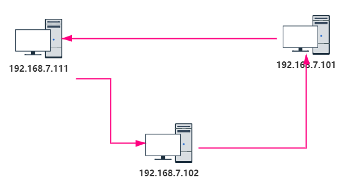
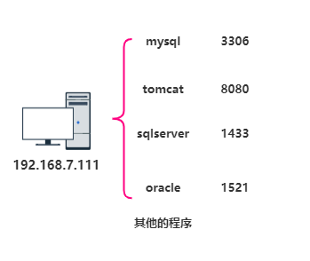
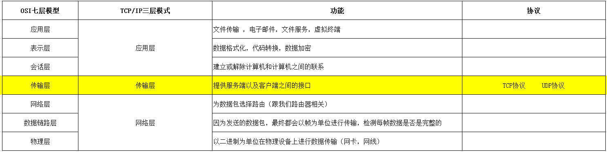
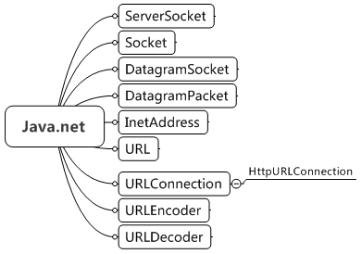
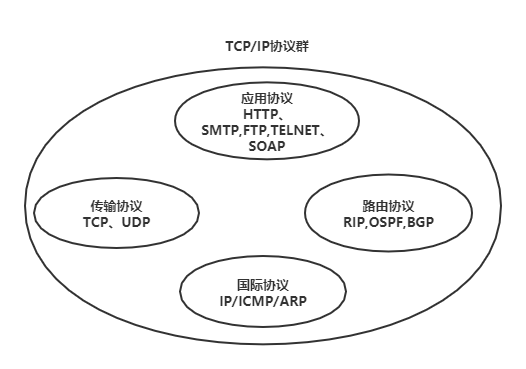
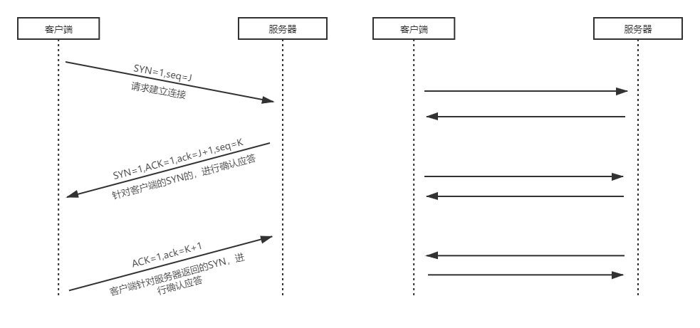
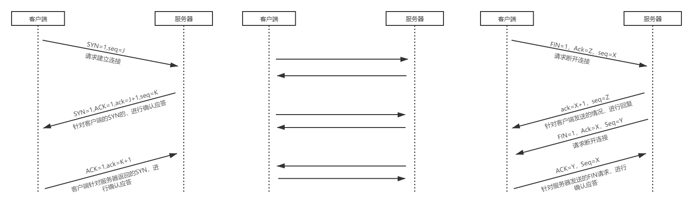

# 网路编程的概念

## 一、网络编程

网络编程：我们写好的程序，可能会和其他的程序进行数据对接，数据对接依靠的是网络

网络编程技术：又被称为Socket编程技术，`套接字`编程！

## 二、网络编程三要素

> 三要素：
>
> 1. IP地址
> 2. 端口
> 3. 通讯协议

------

**IP地址：**家庭地址是我们每个人的家的唯一标识，那么IP地址，就是每一台电脑在网络范围内的唯一标识！



查看IP地址：ipconfig | ipconfig -all

测试两台计算机的网络，是否通畅？ ping IP地址

**端口：**端口就相当于每个家的门！应用程序就可以通过这个门与外部进行数据交互。每一台电脑可能安装了非常多的应用程序，为了保证相互之间互不干扰，于是，这个门变成了一个应用程序对应一扇门(`每个程序都对应一个对应的端口号`)！



端口号的取值范围：0- 65535 1024以下的端口号，都是系统默认自己占用的。常见端口：22/23、80、8080、3306……

**通讯协议：**就是计算机与计算机之间进行通讯，需要遵从的规则！

现实的协议：人类的语言，特务之间的通讯方式（03-160.5.10,02-119.6.12,04-111.10.15…… 蜗牛你好！！！）

计算机之间，如果要通讯，一定要遵从协议！
我们在这周会学：`TCP/IP、UDP协议`

## 三、OSI七层模型

网络：我们使用通信设备，或线路将位于不同地理位置的计算机串起来。但是网络的出现的早期，由于OS，软件，硬件都来自于不同的生产厂商，这就导致

我们在网络通信的过程中，可能存在不兼容的问题。国际标准化组织(ISO)提出了一个OSI (Open System Interconnection 开放系统互联) —- (计算机网络通信的标准)



帧：每秒钟能够处理画面数，以游戏为例：帧数越数越高越流畅！

# InetAddress

## 一、InetAddress

InetAddress：可以说IP地址的代表

比如：http://woniuxy.com/ 如何去获得对应的IP地址

凡是网络编程的类，统一被JDK放置在java.net目录中



```java
    public static void main(String[] args) {
        String str = "www.baidu.com";//域名
        try {
            InetAddress inet = InetAddress.getByName(str);
            //输出域名对应的IP地址对象
            System.out.println(inet);
            System.out.println(inet.getHostName());//主机的名称
            System.out.println(inet.getHostAddress());//IP地址
            //输出本机的IP地址对象
            InetAddress localhost = InetAddress.getLocalHost();
            System.out.println(localhost);
            System.out.println(localhost.getHostName());//本机的主机名称
            System.out.println(localhost.getHostAddress());//本机的IP地址
        } catch (UnknownHostException e) {
            // TODO Auto-generated catch block
            e.printStackTrace();
        }
    }
```

## 三、API

| 返回值               | 方法与描述                                         |
| :------------------- | :------------------------------------------------- |
| `static InetAddress` | `getByName(String host)`  确定主机名称的IP地址。   |
| `String`             | `getHostAddress()`  返回文本显示中的IP地址字符串。 |
| `String`             | `getHostName()`  获取此IP地址的主机名。            |
| `static InetAddress` | `getLocalHost()`  返回本地主机的地址。             |

# URL

## 一、URL

URL：Uniform Resource Locator 统一资源定位符，代表网络上的一个资源，例如：一张网页，一条数据，一系列数据，一篇文章，一个视频，一张图片……

http://woniuxy.com/

http://woniuxy.com/sc/toNote/6091-456

http://woniuxy.com/playvideo/110900

URI：Uniform Resource Identifier 统一资源修饰符/标识符 (形容词和名词) ,URI 通常用来标识某一种资源，但是URI不包括如何访问这个资源

```
<form action="url">
```

> 例如：
>
> sc/toNote/6091-456 编号为6091-456 的笔记资源
>
> playvideo/110900 编号为110900的视频资源
>
> order/20210616/9727 20210616号，订单编号为9727的，订单数据

URL 包含URI的，在URI提供了如何去进一步访问该资源！

------

URL的格式：

```Java
协议://主机:端口/路径?查询字符串#锚点
http://woniuxy.com:80/sc/toNote/6091-456?teacherName="老蒲"#1
查询字符串#锚点是可以省略的（按照需求去写就好）！
```

协议：`HTTP，HTTPS`，FTP……

## 二、URL类(了解)

```Java
public static void main(String[] args) {
        String str = "http://woniuxy.com/sc/toNote/6091-456?teacherName='laopu'#1";
        try {
            URL url = new URL(str);
            System.out.println(url.getHost());//获得主机的名字
            System.out.println(url.getPath());//URI
            System.out.println(url.getPort());//获得端口号80 8080 
            System.out.println(url.getDefaultPort());//获得HTTP协议，默认端口号为80
            System.out.println(url.getProtocol());//获得该URL使用的协议
            System.out.println(url.getQuery());//获得URL中的查询数据
            System.out.println(url.getRef());//获得URL中，定义的锚点
        } catch (Exception e) {
            // TODO Auto-generated catch block
            e.printStackTrace();
        }
    }
```

URI标识资源，URL指示如何访问资源，URL包含URI。

# TCP/IP协议

## 一、TCP/IP协议

TCP/IP协议：互联网中的通讯协议，这玩意的定义目的，就是为互联网通讯而开发。而且：TCP/IP是一系列协议。



## 二、传输协议之TCP

TCP这是传输层的一种协议，这种协议的特点：依赖连接，数据通讯采用的1问1答模式，数据通讯安全有效，不需要数据可能在通讯的过程中有丢失的情况！

TCP协议，有的人就将这个协议也称为：TCP/IP协议

==重点：==

在建立连接时，有“三次握手”的过程！



**步骤：**

1. 第一步，客户端发送请求：携带数据SYN=1 ,并且随机产生了一个seq 的数据包
2. 第二步：服务器返回响应：携带数据SYN=1,ACK=1，并且随机一个seq的数据包，ack的数据将客户端的seq + 1
3. 第三步：客户端再次发送请求：协议ACK=1，返回ack的数据，将服务端的seq + 1

==重点：==

在断开连接时，有“四次挥手”的过程！



**步骤：**

1. 第一步：客户端 发送请求，断开连接
2. 针对请求，服务器发起响应，确定收到断开请求
3. 服务器向客户端发送请求，请求断开连接
4. 客户端确认断开

在5阶段，准备面试的时候，回来看下笔记！

## 三、传输协议之UDP

UDP协议：该协议的特点：不依赖连接，它的传输过程很像发送短信，发送邮件 (不在乎对方是否可以正常的接收信息)

它是一种面向数据的协议，数据中指定了该数据应该被投递的位置！但是这个位置是否有效，协议是检测不出来！

## 补充

ACK：确认

断开连接也可能是服务器先向客户端先申请断开，同样也经历“4次挥手”过程，建立链接只能是客户端主动请求服务器，而不能是服务器请求客户端建立联系。

# TCP服务端开发

## 一、Socket

Socket：套接字 作用：建立端到端的传输通道

**Socket**：端口号与IP地址的组合得出一个网络套接字

## 二、建立基于TCP协议的服务端

案例1：从服务端接收来自客户端的消息

```Java
public class TcpServer {
    public static void main(String[] args) {
        // TODO Auto-generated method stub
        BufferedReader reader = null;
        Socket socket = null;
        try {
            //建立Socker服务端，并侦听9999这个端口号，看是否有客户端通过该端口号，发送数据
            ServerSocket server = new ServerSocket(9999);
            System.out.println("正在侦听9999，并等待客户端的连接！！！！");
            while(true){
                //接收客户端的连接(特点：阻塞式方法)
                socket = server.accept();
                System.out.println("有客户端来连接了！！！！");
                //建立连接之后，服务器这边可以输出 客户端连接信息
                reader = new BufferedReader(new InputStreamReader(socket.getInputStream()));
                String str = "";
                while((str = reader.readLine()) != null) {
                    System.out.println("接收到客户端的内容是：" +  str);
                }
                reader.close();
                socket.close();
            }
        } catch (Exception e) {
            // TODO Auto-generated catch block
            e.printStackTrace();
        }
    }
}
```

------

## 二、服务端开发

服务端同样可以主动向客户端发送消息

```Java
public class TcpServer {
    public static void main(String[] args) {
        // TODO Auto-generated method stub
        Socket socket = null;
        try {
            //建立Socker服务端，并侦听9999这个端口号，看是否有客户端通过该端口号，发送数据
            ServerSocket server = new ServerSocket(9999);
            while(true) {
                socket = server.accept();//获得一个客户端的连接对象(一旦执行这句代码，就意味：3次握手已经成功！)
                BufferedWriter writer = new BufferedWriter(new OutputStreamWriter(socket.getOutputStream()));
                //写数据 
                writer.write("今天吃鸡，大吉大利！");
                writer.newLine();
                writer.close();//关闭流
            }    
        } catch (Exception e) {
            // TODO Auto-generated catch block
            e.printStackTrace();
        }
    }
}
```

# TCP客户端开发

## 一、客户端开发

客户端建立连接，并向服务端发送数据

```Java
public class TcpClient {
    public static void main(String[] args) {
        // TODO Auto-generated method stub
        Socket socket = null;
        BufferedWriter out = null;
        try {
            //客户端根据IP地址，和端口号，访问服务端
            socket = new Socket("192.168.7.73", 9999);
            System.out.println("与服务端，建立连接！！！！");
            //问候服务端
            out = new BufferedWriter(new OutputStreamWriter(socket.getOutputStream()));
            out.write("服务端，你好！");
            out.newLine();
            out.write("吃了么？");
            out.newLine();
        } catch (Exception e) {
            // TODO Auto-generated catch block
            e.printStackTrace();
        }finally {
            try {
                out.close();//关闭流
                socket.close();//关闭连接
            } catch (IOException e) {
                // TODO Auto-generated catch block
                e.printStackTrace();
            }
        }
    }
}
```

**练习题(文件上传)：**

使用Socket 传输，完成客户端，将某一个文件，复制到服务端去 (字节流)

```Java
public class TcpClient {
    public static void main(String[] args) {
        // TODO Auto-generated method stub
        Socket socket = null;
        BufferedWriter out = null;
        BufferedReader reader = null;
        try {
            reader = new BufferedReader(new FileReader("F:\\123\\1.txt"));
            //客户端根据IP地址，和端口号，访问服务端
            socket = new Socket("192.168.7.73", 9999);
            System.out.println("与服务端，建立连接！！！！");
            //给服务器传输数据
            out = new BufferedWriter(new OutputStreamWriter(socket.getOutputStream()));
            String str = "";
            while((str = reader.readLine()) != null) {
                //读出来之后，通过socket 进行传输，传输到服务器上去
                out.write(str);
                out.newLine();
            }
        } catch (Exception e) {
            // TODO Auto-generated catch block
            e.printStackTrace();
        }finally {
            try {
                reader.close();
                out.close();//关闭流
                socket.close();//关闭连接
            } catch (IOException e) {
                // TODO Auto-generated catch block
                e.printStackTrace();
            }
        }
    }
}
```

```java
public class TcpServer {
    public static void main(String[] args) {
        // TODO Auto-generated method stub
        BufferedReader reader = null;
        Socket socket = null;
        try {
            //建立Socker服务端，并侦听9999这个端口号，看是否有客户端通过该端口号，发送数据
            ServerSocket server = new ServerSocket(9999);
            System.out.println("正在侦听9999，并等待客户端的连接！！！！");
            while(true){
                //接收客户端的连接(特点：阻塞式方法)
                socket = server.accept();
                System.out.println("有客户端来连接了！！！！");
                //建立连接之后，服务器这边可以输出 客户端连接信息
                reader = new BufferedReader(new InputStreamReader(socket.getInputStream()));
                BufferedWriter out = new BufferedWriter(new FileWriter("F:\\123\\2.txt"));
                String str = "";
                while((str = reader.readLine()) != null) {
                    System.out.println("接收到客户端的内容是：" +  str);
                    //边读边写
                    out.write(str);
                    out.newLine();
                }
                //关闭流
                reader.close();
                out.close();
            }
        } catch (Exception e) {
            // TODO Auto-generated catch block
            e.printStackTrace();
        }
    }
}
```

## 二、客户端开发

客户端建立连接，从服务器获得数据

```Java
public class TcpClient {
    public static void main(String[] args) {
        // TODO Auto-generated method stub
        //建立联系 本机：127.0.0.1 / localhost
        Socket socket = null;
        BufferedReader reader = null;
        try {
            socket = new Socket("192.168.7.73", 9999);
            //读取服务器返回的消息
            reader = new BufferedReader(new InputStreamReader(socket.getInputStream()));
            String str = "";
            while((str = reader.readLine())!= null) {
                System.out.println(str);
            }
        } catch (Exception e) {
            // TODO Auto-generated catch block
            e.printStackTrace();
        }finally {
            try {
                reader.close();
                socket.close();//表示关闭连接，4次挥手就已经完成了
            } catch (IOException e) {
                // TODO Auto-generated catch block
                e.printStackTrace();
            }
        }
    }
}
```

**练习题(文件下载)：**

服务器上有一个文本文件，客户端需要去下载到本地来

```Java
public class TcpServer {
    public static void main(String[] args) {
        // TODO Auto-generated method stub
        Socket socket = null;
        try {
            //建立Socker服务端，并侦听9999这个端口号，看是否有客户端通过该端口号，发送数据
            ServerSocket server = new ServerSocket(9999);
            while(true) {
                socket = server.accept();//获得一个客户端的连接对象(一旦执行这句代码，就意味：3次握手已经成功！)
                System.out.println("得到客户端的连接！！！！");
                //读文件
                BufferedInputStream bis = new BufferedInputStream(new FileInputStream("F:\\123\\1.txt"));
                BufferedOutputStream bos = new BufferedOutputStream(socket.getOutputStream());
                byte[] b = new byte[1024];
                int lenth = 0;
                while((lenth = bis.read(b)) != -1) {
                    //读回来的数据在b数组
                    bos.write(b,0,lenth);
                }
                bis.close();
                bos.close();//关闭它，并刷新缓冲区
            }    
        } catch (Exception e) {
            // TODO Auto-generated catch block
            e.printStackTrace();
        }
    }
}
```

```java
public class TcpClient {
    public static void main(String[] args) {
        // TODO Auto-generated method stub
        //建立联系 本机：127.0.0.1 / localhost
        Socket socket = null;
        BufferedReader reader = null;
        try {
            socket = new Socket("192.168.7.73", 9999);
            //读取服务器返回的消息
            BufferedInputStream bis = new BufferedInputStream(socket.getInputStream());
            BufferedOutputStream bos = new BufferedOutputStream(new FileOutputStream("F:\\123\\2.txt"));
            byte[] b = new byte[1024];
            int lenth = 0;
            while((lenth = bis.read(b)) != -1) {
                //读回来的数据在数组b中
                //向文件中进行写
                bos.write(b,0,lenth);
            }
            //关闭流
            bis.close();
            bos.close();
        } catch (Exception e) {
            // TODO Auto-generated catch block
            e.printStackTrace();
        }
    }
}
```

## 补充

getInputStream()、getOutputStream()方法得到的流是网络的节点流，FileWriter，FileReader得到的文件的节点流。

# UDP服务端开发

## 一、UDP

UDP：同样是传输层的一种通讯协议。它的特点：不依赖于连接，它依赖于数据！

它的数据中，自带了服务器的IP地址以及对应的端口，它在发送数据时，不需要接收者在线；在接收数据时，也不需要发送者在线。

> UDP在使用时，都需要使用java.net.DatagramSocket类，即代表发送者，又代表接收者
>
> 发送数据时，需要DatagramSocket类的send() 来发送数据，而在接收数据时，需要使用receive() 来接收数据。
>
> send() 和 receive() 都有一个参数DatagramPacket (数据包) ，数据包就代表了数据：IP地址，端口，传输的数据

## 二、UDP的服务端

```java
public class UdpServer {
    public static void main(String[] args) {
        // TODO Auto-generated method stub
        try {
            //表示监听一个端口10000
            DatagramSocket socket = new DatagramSocket(10000);
            System.out.println("客户端给我传输数据了！！！！");
            //定义了一个字节数据 1024位
            byte[] buf = new byte[1024];
            DatagramPacket packet = new DatagramPacket(buf, buf.length);
            socket.receive(packet);//接收数据
            //获得packet中的数据
            buf = packet.getData();
            System.out.println(new String(buf));
        } catch (Exception e) {
            // TODO Auto-generated catch block
            e.printStackTrace();
        }
    }
}
```

# UDP客户端开发

```java
public class UdpClient {
    public static void main(String[] args) {
        // TODO Auto-generated method stub
        //定义客户端的Socket通道，并开启端口10001
        try {
            DatagramSocket socket = new DatagramSocket(10001);
            System.out.println("我发送短信了！！！！！");
//            byte[] buf = new byte[1024];
            String data = "三缺一，约不？";
            byte[] buf = data.getBytes();
            DatagramPacket packet = new DatagramPacket(buf, buf.length, new InetSocketAddress("192.168.7.73", 10000));
            socket.send(packet);//发送数据
            System.out.println("发送完成！！！！");
        } catch (Exception e) {
            // TODO Auto-generated catch block
            e.printStackTrace();
        }
    }
}
```

> 总结：`UDP和TCP协议的区别：`
>
> 1. TCP 依赖连接，UDP依赖数据
> 2. TCP数据可靠，安全性高
> 3. UDP在传输的过程中，可能出现丢失数据的问题(缓冲区定义的不合理)
> 4. UDP在传输的过程中，可能存在数据顺序不一致的问题
