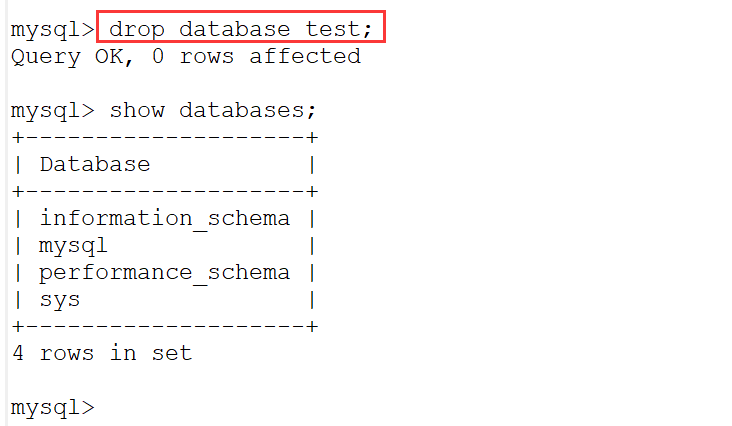
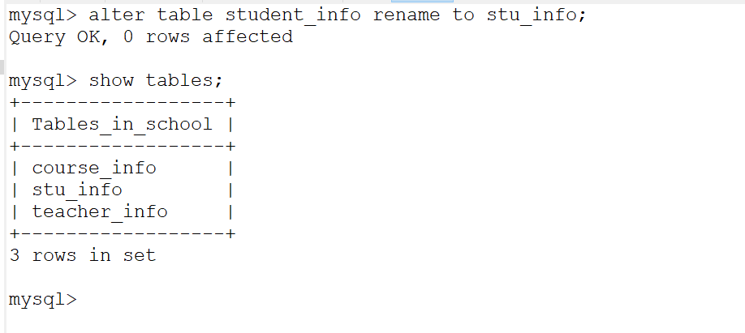
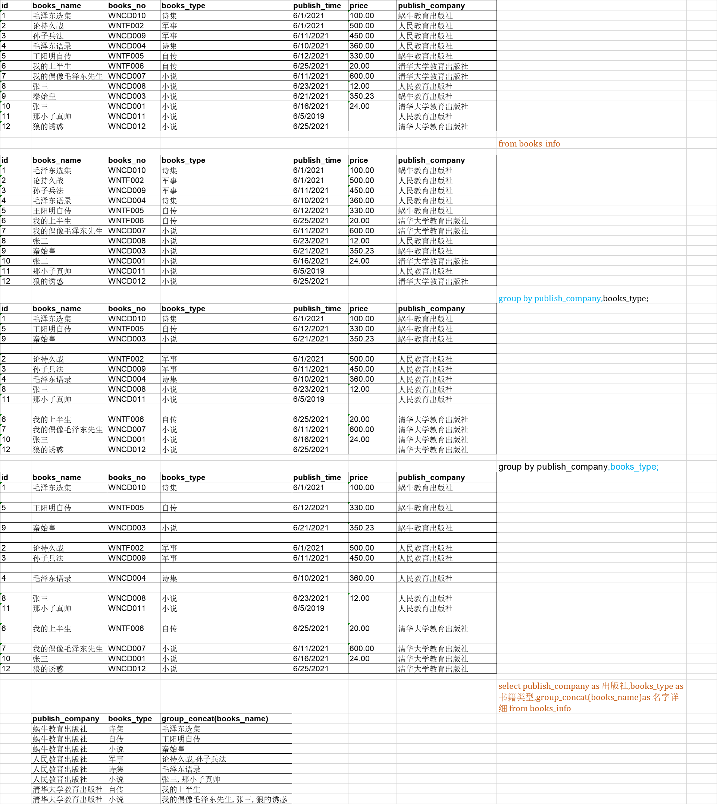
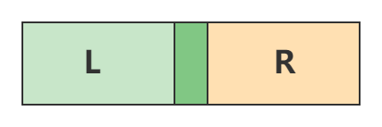

# 数据库的介绍

## 一、数据库

库：仓库的含义。数据库：一个存放数据的仓库！

仓库：变量、对象、数组、集合、文件、数据库


数据库的发展：萌芽、初级、中级、高级阶段

萌芽/初级：直接使用磁盘文件进行数据的存储，例如：txt、excel、word……

中级：出现了一些生产厂商，有意识的开发出一些数据库管理软件，开发出来的数据：几乎都是 `关系型数据库`的东西，并且针对这种数据库，还定义专门的通讯语言：SQL

高级：`对象关系型数据库`，由于某些原因，目前高级数据库推广或应用上面，还没正式的使用起来！

目前：最高级的“Big Data” 大数据。

我们这周学的是：中级的“关系型数据库”

## 二、学习数据库的目的

目的：让我们的数据持久化，让我们针对数据的操作更加的便利！

数据库能做的事情：

1. 存储数据
2. 查询数据
3. 创建数据库，创建表
4. 针对数据进行权限控制

## 三、数据库管理软件

数据库：DataBase 存放数据的仓库

数据库管理软件：Database Management System 用来管理数据仓库的软件

当然：我们一般所说的数据库，指的就是：数据库管理软件

> 管理软件：
>
> ACCESS 微软的数据库 免费，闭源
>
> MS SQLServer 关系型数据库(RDBMS) 微软的数据库 免费，闭源
>
> `MySQL` 关系型数据库(RDBMS) 瑞典一家MySQL的公司开发出来的，目前，已经被Oracle 收购了！ 免费，开源
>
> DB2 关系型数据库(RDBMS) 微软的数据库 收费，闭源
>
> Oracle 关系型数据库(RDBMS) Oracle 的数据库 收费，闭源
>
> PostgreSQL 对象关系型数据库
>
> NoSQL数据库：非关系型数据库，例如：Redis

所有的关系型数据库，都是使用SQL进行程序之间的通讯，表示：我们学好其中的一个，其他的大同小异

## 四、关系数据库的一些概念

| 概念           | 描述                                               |
| :------------- | :------------------------------------------------- |
| 数据库         | 存放数据的仓库                                     |
| 数据库管理软件 | 用来管理数据库的软件                               |
| 表             | 实质上：一个专门用来存储数据的文件，文件可以有多个 |
| 行             | 一行数据                                           |
| 列             | 一行数据中某一个字段/属性                          |

例如：蜗牛官网系统中，需要记录所有学生的信息

| 序号 | 学号          | 姓名 | 性别 | 年龄 | 学历 | 毕业学校     |
| :--- | :------------ | :--- | :--- | :--- | :--- | :----------- |
| 1    | WNCD202105001 | 老佘 | 男   | 23   | 本科 | 四川大学     |
| 2    | WNCD202105002 | 老刘 | 男   | 22   | 本科 | 电子科大     |
| 3    | WNCD202105003 | 老肖 | 男   | 20   | 本科 | 西南交大     |
| 4    | WNCD202105004 | 老张 | 男   | 23   | 本科 | 西南石油大学 |
| 5    | WNCD202105005 | 小冉 | 女   | 20   | 本科 | 北大         |
| 6    | WNCD202105006 | 小清 | 女   | 20   | 本科 | 复旦         |

## 五、关系模型

数据库：可以同时存在多张表，表和表的数据之间可能存在一定的关系

> 1对1的关系
>
> 1对n的关系
>
> n对n的关系

**1对1的关系：**


**1对n的关系：**


**n对n的关系：**


当然，还有其他关系：自关联 (后面讲)

## 六：结构化查询语言

SQL：Structured Query Language 结构化查询语言，用于：Java程序 和 数据库管理软件进行通讯的语言！

> SQL的读法：see-kwall

SQL几乎是所有的RDBMS 都能识别的一种标准语言！不管你的程序是Java也好，还是C、C#、Phython、PHP这都是一样的！

SQL具体可以分为4种语言：

> DDL：数据库定义语言 作用：建库，建表
>
> DML：数据库操作语言 作用：针对表进行新增，修改，删除数据
>
> DQL： 数据库查询语言 作用：针对表进行数据的查询
>
> DCL：数据库控制语言 作用：针对数据库进行用户授权

# 数据库的安装

## 一、数据库下载

数据库采用MySQL 5.7为例，来进行讲解：

下载地址：https://dev.mysql.com/downloads/mysql/


## 二、数据库安装

第一步：选择自定义安装


第二步：选择64位服务版


第三步：设定MySQL的端口号，默认：3306

****

第四步：设置root账号的默认密码 (大小写字母，数字，下划线 ：Flzx3qC )


第五步：设置服务注册名，建议不做任何改动


第六步：执行配置即可


第七步：所有配置都成功，代表安装成功


后面的操作：直接一直NEXT即可

## 三、检验是否成功


安装目录：C:\Program Files\MySQL\MySQL Server 5.7

数据目录：C:\ProgramData\MySQL\MySQL Server 5.7\Data

## 四、数据库客户端软件

数据库自带了客户端，但是这个客户端不方便，一般可以使用更直观的客户端：Navicat、Sqlyog、……

安装Navicat： 设定Navicat软件的安装位置


破解方式：将PatchNavicat.exe 复制到 Navicat的安装目录中，直接双击PatchNavicat.exe ，选择navicat.exe


即可完成破解！

## 五、连接数据库

在Navicat软件中，点击“连接” 弹出窗体：在窗体中设置IP地址，端口，用户名，密码

> 本机IP地址：127.0.0.1 / localhost
>
> 其他IP地址：问下对方


## 六、卸载MySQL

普通的软件，针对MySQL是无法进行完整卸载的，只有通过安装软件才可以进行卸载！


数据库语法不区分大小写；

数据库的修改只能修改编码集；

[ ]中的东西可写可不写

存储引擎；默认为innoDB


数据库：新建库、修该库（编码集）、删除库，
    -> //表：新建表、修改表（名字）、删除表，
    -> //字段：增加字段、修改字段、删除字段


# 数据库语言

SQL具体可以分为4种语言：

> DDL：数据库定义语言 作用：建库，建表
>
> DML：数据库操作语言 作用：针对表进行新增，修改，删除数据
>
> DQL： 数据库查询语言 作用：针对表进行数据的查询
>
> DCL：数据库控制语言 作用：针对数据库进行用户授权

# 创建库

## 一、针对数据库的操作

1. 创建数据库

   > 语法：
   >
   > ```sql
   > create database [if not exists] 数据库名 [character set '字符集的名字'];
   > ```

   举例说明：

   ```sql
   create database test character set 'utf8';
   ```

   

   > 数据库的名称的定义规范：
   >
   > ```sql
   > 1. 名称的组成：字母，数字，下划线，$ , @ 但是不要使用空格
   > 2. 不要使用关键字来作为名称，例如：create，dropinsert，update，delete，alter，select，return，use，grant，revoke……
   > 3. 数据库的名称，一般记住需要小写
   > ```

   更多的规范，可以参见《阿里巴巴编程规范》

2. 修改数据库

   > 修改数据库的语法：
   >
   > ```sql
   > alter datababse 数据库的名称 character set '新的编码集';
   > ```

   例如：

   ```sql
   alter database test character set 'utf8mb4';
   ```

   

   在数据库中utf8只有3个字节，但是有些字符需要使用到4个字节的空间，utf8mb4刚好就是4个字节！

   修改一般只能修改编码集！

3. 删除数据库

   > 删除数据库的语法：
   >
   > ```sql
   > drop database 数据库的名称；
   > ```

   例如：

   ```sql
   drop database test;
   ```

   

   当然，这个操作需要慎重，你把库删了，就意味着你把表删了，你把表删了，就意味你把数据删了！！！

## 二、创建表

> 语法：
>
> ```sql
> create table 表的表名(
>     列名 数据类型  约束,
>     列名 数据类型  约束,
>     列名 数据类型  约束
> ) [engine = 存储引擎的名称];
> ```
>
> 存储引擎：RDBMS 针对不同的表提供的不同的存储方式，比如(MyIsam ,`InnoDB` )

例如：

```sql
create table student_info(
    id int primary key,
    student_no varchar(20) not null,
    student_name varchar(20) null
);
```

==数据表字典：==

它是一种针对数据表的文字描述，通常都是给程序员看的：

student_info学生表

| id   | student_no  | student_name |
| :--- | :---------- | :----------- |
| 序号 | 学号        | 学生的姓名   |
| int  | varchar(20) | varchar(20)  |
| 主键 | 非空约束    | 空约束       |

# 创建表

## 一、建表语句

表：是数据库中专门用来存储数据的文件！表中数据存储方式，采用行和列的方式

有一个学生表：

| 序号 | 学号          | 姓名 | 性别 | 年龄 | 学历 | 毕业学校     |
| :--- | :------------ | :--- | :--- | :--- | :--- | :----------- |
| 1    | WNCD202105001 | 老佘 | 男   | 23   | 本科 | 四川大学     |
| 2    | WNCD202105002 | 老刘 | 男   | 22   | 本科 | 电子科大     |
| 3    | WNCD202105003 | 老肖 | 男   | 20   | 本科 | 西南交大     |
| 4    | WNCD202105004 | 老张 | 男   | 23   | 本科 | 西南石油大学 |
| 5    | WNCD202105005 | 小冉 | 女   | 20   | 本科 | 北大         |
| 6    | WNCD202105006 | 小清 | 女   | 20   | 本科 | 复旦         |

> 创建表的语法：
>
> ```sql
> create table 表的表名(
>  列名 数据类型  [约束],
>  列名 数据类型  [约束],
>  列名 数据类型  [约束]
> ) [engine = 存储引擎的名称];
> ```

举例说明：

```sql
create table student_info(
    id int,
    stu_no varchar(20),
    stu_name varchar(30),
    gender varchar(10),
    age int,
    edu_level varchar(20),
    graduate_school varchar(120)
);
```


> 其中：student_info 表的表名(要求：全小写，由字母，数字，下划线构成，通常下划线用于分割单词)`[必填项]`
>
> id stu_no stu_name gender age edu_level graduate_school 都是列名`[必填项]`
>
> int varchar 都是数据类型`[必填项]`
>
> 建表时，同样使用;作为语句的结束标志！

## 二、数据类型

MySQL支持很多数据类型，大体可以分为三种：数值，字符串，日期类型

### 1. 数值类型


### 2. 字符串类型

字符串类型：char，varchar，binary，varbinary，blob，text，enum ……


### 3. 日期类型


**课堂练习**

在school库中，创建3张表： 学生表(学号 姓名 性别 年龄 学历 毕业学校) 老师表(姓名，年龄，工号，所在部门，入职时间 date) 课程表(课程的名称，课程的学分 )

```sql
create table teacher_info(
    teacher_name varchar(20),
    age int,
    job_no varchar(20),
    deptment_name varchar(20),
    entry_date date
);
```

```sql
create table course_info(
    course_name varchar(20),
    study_score int
);
```

## 三、修改表

### 1. 修改表名

> 语法：
>
> ```sql
> alter table 原表名 rename to 新表名;
> ```

举例：

```sql
alter table student_info rename to stu_info;
```



### 2. 添加字段

> 语法：
>
> ```sql
> alter table 表的表名 add [column] 字段名 数据类型 [约束];
> ```

举例：

```sql
alter table stu_info add open_class_date date;
```

### 3. 修改字段

> 语法：
>
> ```sql
> alter table 表的表名 change [column] 旧字段 新字段 数据类型 [约束];
> ```

举例：

```sql
alter table stu_info change open_class_date start_date date;
```

### 4. 删除字段

> 语法：
>
> ```sql
> alter table 表的表名 drop [column] 字段名称;
> ```

举例：

```sql
alter table stu_info drop start_date;
```

## 四、删除表

删除表：代表表中的数据也会被删除！

> 语法：
>
> ```sql
> drop table 表的表名;
> ```

举例：

```sql
drop table teacher_info;
```

# E-R图

## 一、E-R图

E-R图的全称：Entity-Relationship 图 实体关系图

> 问题：说数据库中可以创建表，那表是哪儿来的？表中的字段是哪儿来的？表记录的是什么数据？
>
> ```java
> class Student{
>     private String stuName;
>     private int age;
>     private String gender;
> }
> main(String[] args){
>     Student s1 = new Student(张三，18，男);
>     Student s2 = new Student(李四，18，男);
>     Student s3 = new Student(王五，18，男);
> }
> ```

E-R图的作用：为你创建表，提供一个依据

E-R图的组成：实体、属性、关系


> 从上述的E-R中，我们可以分析出：学生表 课程表 学生和课程之间的关系表
>
> 学生的属性：姓名，年龄，性别，学号，家庭地址
>
> 课程的属性：课程名，课程编号，学时，学分
>
> 学生和课程之间的关系表：学生，课程，成绩

E-R图谁画？答案：项目经理画，你看 看图分析出表，建库建表

## 二、如何画

使用某些工具https://processon.com/，矩形代表：实体 椭圆代表：属性 菱形代表：关系

关系：1对1 1对n n对n


**此处的实体 ：**一组相同类型的对象

# 主键与主键约束

## 一、约束

约束[constraint]：限制的作用，指的是：创建表的过程中，可以给表的字段添加一个限制条件！在这些条件的配合下，可以保证数据的唯一性，完整性。

有的约束针对整行都有效，但是有的约束只针对某一列有效！

> **针对某一个列有效：**
>
> 1. 性别只能是男或女
> 2. 身份证是否满足18位
> 3. 年龄必须是数字，不能是字符串
>
> **针对整行有效：**
>
> 1. 数据不能重复
> 2. 信誉值大于5以上的，是系统的会员

## 二、主键约束

主键约束：数据库表中，一般为了区分重复数据，我们往往需要定义一列/多列专门用来去重！定义的那一列/多列，就叫做主键！

主键列：用来表示表中的每一行数据都是唯一的，例如：书本中的页码，表示每一页都是唯一的

```sql
create table user_info (
    id int primary key,
    user_name varchar(20),
    age int
);
```

不推荐直接使用表中的某些字段的组合来作为：主键 原因是：字段的值可能会修改 而是直接创建一个id主键列！

表中不是必须创建主键列，但是推荐创建起来！

==主键设定原则==：

1. 1个表中，尽量只有1个主键
2. 主键的值，一定不能发生改变
3. 主键字段，不能具备任何的业务含义。例如：身份证，电话号码……

## 三、主键的创建

第1种方式：建表的时候

> ```sql
> create table user_info(
>     id bigint primary key,
>     user_name varchar(20),
>     age int,
>     gender int
> );
> ```
>
> 直接在主键字段后，添加：primary key

第2种方式：修改表的时候

```sql
create table user_info(
    id bigint,
    user_name varchar(20),
    age int,
    gender int
);
//语法
alter table 表的表名 add constraint 主键的名称 primary key(某一列);
alter table user_info add constraint pk_id primary key(id);
```

主键约束：非空 + 唯一

# 外键与外键约束

## 一、外键约束

老师表teacher_info

| id   | teacher_name | fk_dept_id |
| :--- | :----------- | :--------- |
| 1    | 老蒲         | 2          |
| 2    | 老谭         | 2          |
| 3    | 老李         | 1          |
| 4    | 老王         | 1          |
| 5    | 老宋         | 3          |
| 6    | 老张         | `4`        |

部门表dept_info

| id   | dept_name | dept_desc              |
| :--- | :-------- | :--------------------- |
| 1    | 咨询部    | 该部门主要面向社会招生 |
| 2    | 教学部    | 完成对学生的授课任务   |
| 3    | 财务部    | 统计公司的出入帐情况   |

> 分析：老师是属于部门的，一个部门下可能存在多个老师

此时：发现 依靠 fk_dept_id 字段，完成2张表之间的数据的关系维护 fk_dept_id 就是外键

外键：表中的某一个字段的值，来自于本表外面的另外一张表的主键的值

------

主表：外键值来源的表

从表：拥有外键的表

外键约束：针对外键进行添加的一些条件限制，比如：主表在删除时，需要级联删除从表的数据；主表在修改时，需要级联修改从表的数据；从表不能设置主表不存在的数据；

## 二、外键约束的添加

### 1. 第一种方式

在创建的表的时候，就设置好外键约束

> 语法：
>
> ```sql
> create table 表的表名(
>     列 数据类型 [约束],
>     列 数据类型 [约束],
>     外键列 数据类型 [约束],
>     foreign key(外键列) references 主表的表名(id) [on delete cascade on update cascade] 
> );
> ```
>
> cascade：级联(连坐) [on delete cascade on update cascade] 不需要强制添加

```sql
create table teacher_info(
    id int primary key,
    teacher_name varchar(20),
    fk_dept_id int,
    foreign key(fk_dept_id) references dept_info(id) [on delete cascade on update cascade]
);
```

### 2. 第二种方式

针对现有的表，直接添加外键约束

> 语法：
>
> ```sql
> alter table 表的表名 add constraint 外键约束的名称 foreign key(外键列) references 主表的名称(id) 
> [on delete cascade on update cascade];
> ```

```sql
create table teacher_info(
    id int primary key,
    teacher_name varchar(20),
    fk_dept_id int
);
alter table teacher_info add constraint fk_dept_id foreign key(fk_dept_id) references dept_info(id) 
on delete cascade on update cascade;
```

**删除外键约束：**

> 语法：
>
> ```sql
> alter table 表的表名 drop foreign key 外键约束的名称;
> ```

```sql
alter table teacher_info drop foreign key fk_dept_id;
```

**课堂作业**

需求一：在学生表添加一个外键，引用至老师表的主键，学生表和 老师表的关系：1 对 n

> 针对1对n的 建表模式： 在n的一方，添加外键，并设置约束

```sql
alter table stu_info add constraint fk_teacher_id foreign key(fk_teacher_id) references teacher_info(id);
```

需求二：在数据库添加 学生详细信息表(id,家庭住址,紧急联系人,紧急联系电话) ，学生表 和 学生信息表的关系：1 对 1

> 针对1对1的 建立外键：在主要的一方，建立外键

```sql
create table stu_detail_info(
    id int primary key,
    address varchar(120),
    urgency_person varchar(20),
    urgency_telphone varchar(11)
);
```

在stu_info 中添加一列：fk_detail_id

```sql
alter table stu_info add constraint fk_detail_cons foreign key(fk_detail_id) references stu_detail_info(id);
```

需求三：学生需要选课，1个学生可以选择多门课，1门课也可以被多个学生所选择，学生表 和 课程表之间的关系：n 对 n

> 针对n对n的 建立外键：使用一张中间表来管理外键

```sql
create table stu_course_relation(
    id int primary key,
    fk_stu_id int,
    fk_course_id int,
    foreign key(fk_stu_id) references stu_info(id),
    foreign key(fk_course_id) references course_info(id)
);
```

请注意：1对1 实际上就是 1对n的一个特例！1对n 也可以认为是 n 对 n的特例。当然，我们程序员面向最多的：1 对 n

> 1 对1 建表方式：在主要的一方，添加外键
>
> 1 对 n 建表方式：在对的一方，添加外键
>
> n 对 n 建表方式：在中间表中，添加外键

# 其他约束

## 一、自增长约束

自增长约束：一般只用来主键上，目的：减少程序员对主键的操作！通常来讲，一个表只能有1个自增长约束！

> 语法：
>
> ```sql
>  主键 数据类型 主键约束 auto_increment
> ```

```sql
create table test_info (
    id int primary key auto_increment,
    test_name varchar(20)
);
```

但是自增长，只能针对 数值类型的 主键有效，其他类型都没效果！

> ID：并不一定数据类型，就只能是数值的int或bigint , varchar同样可以

## 二、唯一约束

唯一约束：也是来保证整个数据行不重复的一种约束

使用场景：电话号码，身份证，学生的学号……

> 语法：
>
> ```sql
> 列名 数据类型 unique
> ```

```sql
create table user_info (
    id int primary key auto_increment,
    user_name varchar(20),
    age int,
    gender int,
    id_card varchar(18) unique,
    telphone varchar(11) unique
);
```

## 三、非空约束

非空约束：保证某一个列中一定有值，不是Null

> 语法：
>
> ```sql
> 字段 数据类型  not null
> ```
>
> 当然，如果字段没有添加 not null，表示该字段是可以填充Null的

```sql
create table user_info (
    id int primary key auto_increment,
    user_name varchar(20) not null,
    age int,
    gender int,
    id_card varchar(18) unique,
    telphone varchar(11) unique
);
```

## 四、检查约束

检查约束：检查某一个列的值，是否是自己规定的值，如果不是将抛出错误(Java中)！

> 语法：
>
> ```sql
> 字段 set(值1，值2，值3)
> ```

```sql
create table user_info (
    id int primary key auto_increment,
    user_name varchar(20) not null,
    age int,
    gender set('0','1','-1'),
    id_card varchar(18) unique,
    telphone varchar(11) unique
);
```

## 五、默认值约束

默认值约束：当某一个列，没有任何值的时候，将自动填充默认值！

比如：用户在注册的时候，忘了输入密码，系统给他默认密码为：123456

> 语法：
>
> ```sql
> 字段 数据类型 default '默认值'
> ```

**课堂练习**

针对woniuxy库，创建学生表(id,stu_name,login_name,pwd,gender,age,edu_level,grade_school)

> 要求：
>
> 1. id 列 数据类型是bigint pk 自增
> 2. stu_name 使用默认约束 默认值为：蜗牛学生
> 3. login_name 使用唯一约束 ，非空约束
> 4. pwd 默认约束 默认值：123456
> 5. edu_level 检查约束 : 大专、本科、研究生

```sql
create table student_info(
    id bigint primary key auto_increment,
    stu_name varchar(20) default '蜗牛学生',
    login_name varchar(20) not null unique,
    pwd varchar(36) default '123456',
    edu_level set('大专','本科','研究生'),
    grade_school varchar(120)
);
```

# 范式三约定

## 一、范式三约定

Java 程序需要如果需要满足“高内聚，低耦合”，有一套需要遵循的标准“7大设计原则，21个设计模式”！

同理，数据库表在设计时，同样满足一定的要求，也有对应需要遵循的东西：“范式约定”

范式约定有6个，但是我们需要遵循只需要前3个就可以了！

## 二、第一范式

第一范式：设计表时，针对字段上来讲，字段一定满足原子性

> 列具有原子性，不能再次拆分

原子：不能再分，也就意味着：拆分字段时，一定要拆分到不可以再次拆分为止


> 需求：根据家庭地址，分别统计：四川省有多少个学生，江北区有多少个学生，北京市有多少个学生？

所以，家庭地址就可以分为：省、市、区/县、 详细地址

```sql
create table student_info(
    id bigint primary key auto_increment,
    stu_name varchar(20) default '蜗牛学生',
    login_name varchar(20) not null unique,
    pwd varchar(36) default '123456',
    edu_level set('大专','本科','研究生'),
    grade_school varchar(120),
        province varchar(20),
        city varchar(20),
      district varchar(20),
        address_detail varchar(120)
);
```

## 三、第二范式

> 第二范式：在遵循第一范式的基础上，所有的列都必须要跟主键相关

| 订单编号 | 商品编号 | 商品名称 | 数量 | 单位 | 单价   | 客户 | 所属单位 | 联系方式    | 总价    |
| :------- | :------- | :------- | :--- | :--- | :----- | :--- | :------- | :---------- | :------ |
| 001      | 1        | 挖挖机   | 12   | 台   | 120000 | 张三 | 中铁6局  | 13398194567 | 1440000 |
| 002      | 2        | 推土机   | 3    | 台   | 230000 | 张三 | 中铁6局  | 13398194567 | 690000  |
| 003      | 3        | 压路机   | 6    | 台   | 100000 | 老蒲 | 蜗牛学院 | 13398194532 | 600000  |

上述表中，没有定义的任何的主键，那么通常来讲：就需要将表中的某些列组合起来作为主键，比如：订单编号+商品编号

> 出现问题：张三，老蒲 跟 商品编号并没有什么直接关系！

订单表：

| id   | 订单编号 | 客户(外键) | 商品名称 | 数量 | 单价   | 单位 | 订单总价 |
| :--- | :------- | :--------- | :------- | :--- | :----- | :--- | :------- |
| 1    | 001      | 1          | 挖挖机   | 12   | 120000 | 台   | 1440000  |
| 2    | 002      | 1          | 推土机   | 3    | 230000 | 台   | 690000   |
| 3    | 003      | 2          | 压路机   | 6    | 100000 | 台   | 600000   |

客户表：

| id   | 客户编号 | 客户姓名 | 所在单位 | 联系方式    |
| :--- | :------- | :------- | :------- | :---------- |
| 1    | 001      | 张三     | 中铁6局  | 13398194567 |
| 2    | 002      | 老蒲     | 蜗牛学院 | 13398194532 |

> 第2范式：
>
> 1. 每个表，都添加了一个主键
> 2. 表中的所有的字段，都跟该主键有一定的关系

## 四、第三范式

> 第三范式：在遵循第一范式，第二范式的基础上，要求表中的字段必须要跟主键直接相关，而不是间接相关！

订单表：

| id   | 订单编号 | 客户(外键) | 商品名称 | 数量 | 单价   | 单位 | 订单总价 |
| :--- | :------- | :--------- | :------- | :--- | :----- | :--- | :------- |
| 1    | 001      | 1          | 挖挖机   | 12   | 120000 | 台   | 1440000  |
| 2    | 002      | 1          | 推土机   | 3    | 230000 | 台   | 690000   |
| 3    | 003      | 2          | 压路机   | 6    | 100000 | 台   | 600000   |

再次拆分：

客户表：

| id   | 客户编号 | 客户姓名 | 所在单位 | 联系方式    |
| :--- | :------- | :------- | :------- | :---------- |
| 1    | 001      | 张三     | 中铁6局  | 13398194567 |
| 2    | 002      | 老蒲     | 蜗牛学院 | 13398194532 |

商品表：

| id   | 商品编号 | 商品名称 | 单价   |
| :--- | :------- | :------- | :----- |
| 1    | W01      | 挖挖机   | 120000 |
| 2    | T01      | 推土机   | 230000 |
| 3    | Y01      | 压路机   | 100000 |

订单表：

| id   | 订单编号 | 客户(外键) | 商品(外键) | 数量 | 单位 | 总价    |
| :--- | :------- | :--------- | :--------- | :--- | :--- | :------ |
| 1    | 001      | 1          | 1          | 12   | 台   | 1440000 |
| 2    | 002      | 1          | 2          | 3    | 台   | 690000  |
| 3    | 003      | 2          | 3          | 6    | 台   | 600000  |

**六大范式地址：**https://blog.csdn.net/weixin_42818698/article/details/90311764 (不推荐看)

## 课堂思考

XX大学有一套图书管理系统：`借阅者`持有`借阅证` 可以 通过 `管理员` 借阅 某些`图书` 如何设计该数据库？

> 总结：如果从需求中分析出实体或表，通过==名词抽离法==


# 增删改

## 一、新增数据

> 语法：
>
> ```sql
> insert into 表的表名(字段列表) values (值列表);
> ```
>
> 一个() 就是一条完整的数据！

例如：在学生表中添加数据

```sql
create table student_info(
    id bigint primary key auto_increment,
    stu_name varchar(20) default '蜗牛学生',
    login_name varchar(20) not null unique,
    pwd varchar(36) default '123456',
    edu_level set('大专','本科','研究生'),
    grade_school varchar(120),
        province varchar(20),
        city varchar(20),
      district varchar(20),
        address_detail varchar(120)
);
```

```java
insert into student_info(id,stu_name,login_name,edu_level,grade_school,province,city,district,address_detail) values (null,'老王','lw','大专','XXX职业技术学院','四川省','成都市','武侯区','孵化园5号楼3楼307号');
insert into student_info(id,stu_name,login_name,edu_level,grade_school,province,city,district,address_detail) values (1,'老宋','ls','大专','XXX职业技术学院','四川省','成都市','武侯区','孵化园5号楼3楼307号');
insert into student_info(id,stu_name,login_name,edu_level,grade_school,province,city,district,address_detail) values (null,'PigOne','po','大专','XXX职业技术学院','四川省','成都市','武侯区',null);
```

> 注意：当ID是自增长的情况下，ID列是可以设置为null的

------

简化写法：ID当时自增长的情况下，还可以省略掉

```sql
insert into student_info(stu_name,login_name,edu_level,grade_school,province,city,district,address_detail) values ('老盖','lg','大专','四川邮电职业技术学院','四川省','成都市','武侯区',null);
```

最简化写法：

```sql
insert into student_info values (null,'老库','lk','123456','本科','四川大学','四川省','成都市','武侯区',null);
```

当然，最简化写法不推荐，因为：它在添加的值的时候，一定要按照字段的顺序进行添加内容，而且还不能省略！

## 二、批量添加数据

### 1. 直接批量添加

> 语法：
>
> ```sql
> insert into 表的表名(字段列表) values (值列表),(值列表),(值列表),(值列表)……;
> ```
>
> 有多个() 就有多少条数据！

举例说明：

```sql
insert into student_info(id,stu_name,login_name,edu_level,grade_school,province,city,district,address_detail) values 
(null,'老王','lw','大专','XXX职业技术学院','四川省','成都市','武侯区','孵化园5号楼3楼307号'),
(null,'老宋','ls','大专','XXX职业技术学院','四川省','成都市','武侯区','孵化园5号楼3楼307号'),
(null,'PigOne','po','大专','XXX职业技术学院','四川省','成都市','武侯区',null),
(null,'老盖','lg','大专','四川邮电职业技术学院','四川省','成都市','武侯区',null);
```

### 2. 从其他表中复制数据

> 语法：
>
> ```sql
> insert into 表的表名(字段列表) select 字段列表 from 源表名;
> ```

举例说明：

```sql
create table tongxunlu(
    id bigint primary key auto_increment,
    user_name varchar(20),
    grade_school varchar(30)
);
insert into tongxunlu(user_name,grade_school) select stu_name,grade_school from student_info;
```

## 三、修改数据

> 语法：
>
> ```sql
> update 表的表名 set 字段名=值,字段名=值,字段名=值 ……  [where 修改条件]
> ```
>
> 推荐：一定要写 [where 修改条件]

### 1. 不带条件的修改

举例说明：

```sql
update student_info set stu_name = '蜗牛学院',edu_level = '本科';
```


不带条件，一般不推荐！

### 2. 带条件的修改

举例说明：

```sql
update student_info set stu_name = 'PigOne',edu_level = '大专' where id = '8';
```

条件还可以带多个：

```sql
update student_info set pwd = '654321' where stu_name = '蜗牛学院' and edu_level = '本科';
update student_info set pwd = '654321' where stu_name = '蜗牛学院' or edu_level = '本科';
```

> and 代表并且关系，or 代表是或者关系！

## 四、删除数据

### 1. Delete删除

> 语法：
>
> ```sql
> delete from 表的表名 [where 删除条件];   #按照条件进行删除数据
> ```
>
> 如果不添加where 语句，会直接删除所有的数据！

举例说明：

```sql
delete from dept_info;
```

注意事项：

1. DELETE删除，是一条一条的删除，而且这种删除数据库会有记录
2. DELETE删除，如果DBA开启了二进制日志的情况下，会有记录
3. DELETE删除，是可以回滚的

举例说明：

```sql
delete from dept_info where id = '2';
```

### 2.Truncate删除

> 语法：
>
> ```sql
> truncate table 表的表名;
> ```
>
> 删除：属于重置类型的删除，将表恢复到最初的状态！

举例说明：

```sql
truncate table student_info;
```

注意事项：

1. TRUNCATE删除，属于重置性删除，不会记录任何的日志
2. 删除的数据，不能恢复
3. TRUNCATE删除，不需要添加任何的条件


**补充**

id自增长，id可以省略或写nll，自动增长添加id；

有默认约束字段值若采用默认值，直接不写值，对应的字段也应省略不写；

delete删除条件也可以配合and、or使用，delete删除若DBA不开起二进制日志删除后也无法恢复。

**不要将业务含义的字段作为主键，因为业务字段可能发生改变，导致数据丢失？？？**

# 基础查询

## 一、DQL

DQL：数据查询语言

> 最基本的语法：
>
> ```sql
> select 列名列表 from 表的表名 [where 查询条件]
> ```

### 1.不带任何条件的查询

不带任何条件的查询，将数据表中的所有数据全部查询出来(并显示所有列)

```sql
select id,books_name,books_no,books_type from books_info;
```

当然也可以使用`简化写法`，查询所有的列

```sql
select * from books_info
```

将数据表中的所有数据全部查询出来(显示某些列)

```sql
select id,books_name from books_info;     # 只查询id 和 books_name 列
```

### **具体的执行步骤：**

1. 先执行from books_info
2. 再执行select id,books_name


### 2.添加条件的查询

> 语法：
>
> ```sql
> select 列的列表 from 表的表名 where 查询条件;
> ```

举例说明：

```sql
select id,books_name from books_info where books_type = '军事';
```


**具体的执行步骤：**

1. 先执行from books_info
2. 执行where 条件，筛选数据
3. 再执行select id,books_name


------

==where 后可以使用的运算符:==

| 运算符  | 说明                                                         |
| :------ | :----------------------------------------------------------- |
| =       | 等于                                                         |
| !=或<>  | 不等于                                                       |
| >       | 大于                                                         |
| >=      | 大于等于                                                     |
| <       | 小于                                                         |
| <=      | 小于等于                                                     |
| in      | 在某些范围内容 id `in (1,3) `的含义 id = 1 or id = 3         |
| between | 在某一个区间范围内 id `between 20 and 50 id` >= 20 && id <= 50 |

`not in`，`not between`，`not like`……

还可以使用一些逻辑运算符

| 运算符 | 说明                 |
| :----- | :------------------- |
| or     | 多个条件任意成立均可 |
| and    | 多个条件同时成立     |

### 3.别名

别名：小名

张三(大名) — 二狗子(小名)

```sql
select books_name as 书籍名称,books_no as 书籍编号 from books_info where id in (2,4);
```

**课堂练习**

需求一：查询所有“自传”的书籍，显示所有列！

```sql
select * from books_info where books_type = '自传';
```

需求二：查询id > 3 以上的书籍，显示id，书籍名称，书籍编号

```sql
select id,books_name,books_no from books_info where id > 3;
```

需求三：查询 id = 2 或 id = 4的书籍，显示书籍名称，书籍编号

```sql
select books_name,books_no from books_info where id = 2 or id = 4;//inselect books_name,books_no from books_info where id in (2,4);
```

> 问题：查询跟“毛泽东”有关的所有书籍？
>
> 答案：模糊查询

## 二、模糊查询

模糊查询：像那回事的东西

模糊查询：Like

### 1.%的像

%在后：表示以某一个东西开头，向后无限匹配 (0-N个字符)

```sql
select * from books_info where books_name like '毛泽东%';
```

%在前：表示以某一个东西结尾，向前无限匹配 (0-N个字符)

```sql
select * from books_info where books_name like '%毛泽东先生';
```

%在两头：表示以某一个东西，向两边无限匹配 (0-N个字符)

```sql
select * from books_info where books_name like '%毛泽东%';
```

### 2._的像

_ 代表匹配单个字符

_在后，向后匹配多个字符(1个杠1个字符串)

```sql
select * from books_info where books_name like '张__';
```

_在前，向前匹配多个字符(1个杠1个字符串)

```sql
select * from books_info where books_name like '__三';
```

_在中间，向前后匹配多个字符(1个杠1个字符串)

```sql
select * from books_info where books_name like '_三_';
```

> 使用最多：%

**课堂练习**

需求一：查询WNCD开头的所有书籍

```sql
select * from books_info where books_no like 'WNCD%';
```

需求二：查询包含`偶像`这个字的书籍

```sql
select * from books_info where books_name like '%偶像%';
```

## 三、去重查询

去重：当查询出来的结果，如果有重复数据时，如何去重的问题

使用：distinct

```sql
select distinct books_name,books_type from books_info where books_no like 'WNCD%';
```

## 四、排序查询

排序：order by asc/desc asc升序 desc 降序

```sql
select distinct books_name,books_type,books_no from books_info where books_no like 'WNCD%' order by books_no asc;
select distinct books_name,books_type,books_no from books_info where books_no like 'WNCD%' order by books_no desc;
```

> 需求一：按照id降序排序
>
> ```sql
> select distinct id,books_name,books_type,books_no from books_info where books_no like 'WNCD%' order by id desc;
> ```
>
> 需求二：按照出版时间先降序排列，如果相同的时间，按照编号升序排列
>
> ```sql
> select distinct id,books_name,books_no,publish_time from books_info where books_no like 'WNCD%' order by publish_time desc,books_no asc;
> ```

**执行步骤：**

1. 先执行from books_info
2. 再执行where books_no like ‘WNCD%’ ，筛选数据
3. select distinct id,books_name,books_no,publish_time 投影
4. 执行order by publish_time desc,books_no asc

## 五、限制/分页查询

limit 关键字：起到一个限制显示数据条数的作用

`limit  index，rows`:index 是第一条数据显示的索引（从0开始），rows 是显示的数据的条数（数据不足时，显示全部）

`limit  rows`：显示指定数目的数据，从第一条开始显示（索引从0开始）


> 语法：
>
> ```sql
> select 字段列表 from 表的表名 [where 查询条件] [order by asc/desc] [limit 分页条件]
> ```
>
> limit index,rows index 数据的起始位置，rows 代表的是获得的数据条件

```sql
select distinct id,books_name,books_no,publish_time from books_info where books_no like 'WNCD%' order by publish_time desc,books_no asc limit 0,5;
```


**执行步骤：**

1. 先执行from books_info
2. 再执行where books_no like ‘WNCD%’
3. 执行select distinct id,books_name,books_no,publish_time
4. order by publish_time desc,books_no asc
5. 执行limit 0,5


# 多条件查询

## 一、And

and 并且关系，当有多个条件处于并列关系的情况，条件可以使用and进行拼接

> 语法：
>
> ```sql
> select 字段列表 from 表的表名 where 条件1 and 条件2 and 条件3 ……
> ```

举例说明：查询 价格 >=300 并且 类型是 军事 的数据

```sql
select * from books_info where price >= 300 and books_type = '军事';
```

## 二、Or

or 或者关系，当有多个条件任意满足的情况的下，就可以or来进行拼接

> 语法：
>
> ```sql
> select 字段列表 from 表的表名 where 条件1 or 条件2 or 条件3 ……
> ```

举例说明：查询 类型是军事 以及 小说 的书籍

```sql
select * from books_info where books_type = '军事' or books_type = '小说';
```

举例说明：查询 价格在100元以下，500元以上的所有书籍

```sql
select * from books_info where price <= 100 or price >= 500;
```

------

假如：查询 价格在100元以上，500以下的所有书籍

```sql
select * from books_info where price >= 100 and price <= 500;
```

## 三、Between-and

between and 是专门用来查询区间范围的组合

假如：查询 价格在100元以上，500以下的所有书籍

```sql
select * from books_info where price between 100 and 500;
#等价与
select * from books_info where price >= 100 and price <= 500;
```

> MySQL 5.7 版本 ：between and 既包括前面，又包括后面 没有：between or

## 四、null值查询

假如：查询 没有标记价格的书籍

```sql
select * from books_info where price is null;
```

> 查询null值，一定更要使用is null 不是 = null 或 = ‘’

假如：查询 所有已经标记价格的书籍

```sql
select * from books_info where price is not null;
```

**补充：**

```sql
下面 and or 联用，结果相同

select * from books_info where price>=300 and (books_type='军事' or books_type='诗集');
select * from books_info where books_type='军事' or books_type ='诗集'  and  price>=300;
```

## 五、in与exit

in与eixt区别：

https://blog.csdn.net/qq_36561697/article/details/80713824

# 聚合查询

## 一、聚合函数

通常：在程序中会存在大量的“数据报表”，比如：每个月当月的报名人数

| 聚合函数 | 描述                         |
| :------- | :--------------------------- |
| count()  | 满足条件的数据，总共有多少行 |
| max()    | 满足条件的数据，求最大数据   |
| min()    | 满足条件的数据，求最小数据   |
| sum()    | 满足条件的数据，用来求和     |
| avg()    | 满足条件的数据，用来求平均值 |

## 二、count()

举例说明：查询表中总共存在多少条数据

```sql
select count(*) from books_info;
```

举例说明：查询表中价格大于 300 元以上的书，总共存在多少条数据

```sql
select count(*) from books_info where price >= 300;
```

需要注意：

```sql
select count(price) from books_info;
```

> count() 中不是 * ，而是具体的某一列，表示统计的是：该列中非Null 数据总共有多少行

------

了解：

```sql
select count(1) from books_info;//效果  等同于 count (*)
```

## 三、max

举例说明：查询最贵的书，价格是多少？

```sql
select max(price) from books_info;
```

> max() 中不能使用 * 或 1 2 3 常量，它写的就是某一个具体的列

## 四、min

举例说明：查询最便宜的书，价格是多少？

```sql
select min(price) from books_info;
```

> min() 中不能使用 * 或 1 2 3 常量，它写的就是某一个具体的列

## 五、sum

举例说明：查询所有的书卖完，一共可以收入多少钱？

```sql
select sum(price) from books_info;
```

> sum() 中不能使用 * 或 1 2 3 常量，它写的就是某一个具体的列

## 六、avg

求平均数

举例说明：查询所有书籍，平均价格？

```sql
select avg(price) from books_info;
```

> avg的特点：排除Null行之后，统计有效数据的平均值

## 七、ifnull空数据函数

ifnull() 该函数专门用来处理null值

```sql
select avg(ifnull(price,0)) from books_info;
```

> ifnull(字段 , 默认值) 如果字段是NULL，就设置为默认值

**课堂练习**

需求一：求类型是小说的书籍的平均价

```sql
select avg(ifnull(price,0)) from books_info where books_type = '小说';
```

需求二：统计类型是军事的书籍，总共有多少本

```sql
select count(*) from books_info where books_type = '军事';
```

需求三：在一条语句中，完成count(),max(),min(),sum(),avg()的使用,可以针对价格列

```sql
select count(*) as 总共多少本,max(price) as 最高价,min(price) as 最低价,avg(price) as 平均价,sum(price)as 总价 from books_info;
```

需求四：统计价格在200 到 500元之间的书籍，总共有多少本

```sql
select count(*) from books_info where price between 200 and 500;
```

> 问题一：统计下各种书籍类型，它们分别有多少本？
>
> 问题二：统计下 大于平均价格的，书籍总共有多少本？

**补充：**

count(1)、count(0)、count(15)、count(3)、count(数字)……等同于count(*)；

count(字段)：统计该字段非空行数；

count(*)：统计该表总行数；

avg()求平均数：字段列为null的行不计入统计。

> 价格大于平均价格的书籍数量
>
> ```sql
> select count(*) from books_info where price>(select avg(price) from books_info);
> ```

# 分组查询

## 一、单字段分组

分组：group by

> 语法：
>
> ```sql
> select 分组字段,[group_concat(分析详细)] from 表的表名 [where 查询条件] [group by 分组字段][order by 排序字段 asc/desc] [limit 分页条件]
> ```

group_concat(字段)，查看具体的分组详细

```sql
select books_type as 分组,group_concat(books_name)as 名字详细,group_concat(books_no) as 编号详细 from books_info group by books_type;
```

错误写法：

```sql
select books_type as 分组,books_name,books_no from books_info group by books_type;
```

> MySQL中不允许直接 将非分组字段，添加到投影列中，如果实在添加，请使用group_concat() 完成 相关的拼接！

## 二、多字段分组

举例：查看不同的出版社，针对不同类型的数据，具体的分组情况

```sql
select publish_company as 出版社,books_type as 书籍类型,group_concat(books_name)as 名字详细 from books_info group by publish_company,books_type;
```


**执行步骤：**

1. from books_info
2. group by publish_company,books_type;
3. select publish_company as 出版社,books_type as 书籍类型,group_concat(books_name)as 名字详细 from books_info



## 三、结合聚合函数

分组，通常都是配合聚合函数一起使用！

**1.统计每个出版社分别出版多少本书**

```sql
select publish_company as 分组,group_concat(books_name),count(books_name) from books_info group by publish_company;
```


**2.统计每个出版社分别出版的书籍，总价分别是多少**

```sql
select publish_company as 分组,group_concat(books_name),sum(price) from books_info group by publish_company;
```


**3.统计每个出版社分别出版的书籍，最贵的价钱**

```sql
select publish_company as 分组,group_concat(books_name),max(price) from books_info group by publish_company;
```


min() 是一样的道理

**4.统计每个出版社分别出版的书籍，平均价格**

```sql
select publish_company as 分组,group_concat(books_name),avg(ifnull(price,0)) from books_info group by publish_company;
```


> 需求：统计每个出版社分别出版的书籍，平均价格 >= 200元 的书籍，分别总共出版了多少本？

## 四、Having

having的作用：将聚合过后的结果，再次做过滤

```sql
SELECT    publish_company AS 分组,    group_concat(books_name),    avg(ifnull(price, 0)) AS avgp,    count(*) AS 出版数量FROM    books_infoGROUP BY    publish_company HAVING    avgp >= 200;
```

筛选前：


筛选后：


## 五、SQL的执行顺序

```sql
select 字段列表，聚合函数 from 表的表名 [where 查询条件] [group by 分组字段] [having 聚合过滤] [order by 排序字段 asc/desc] [limit 分页条件];
```


**课后作业**

按照图样，创建数据库表：student_info

并完成以下任务：

1、查询电话号码是133开头的学生信息

2、查询电话号码是848结尾的学生信息

3、查询电话号码包含845的学生信息

4、查询全体学生的姓名与电话号码

5、查询Java方向的全体学生的姓名与电话号码

6、查询所有年龄在26岁以下的学生的姓名及年龄

7、查询年龄在20~26岁之间的学生的姓名，专业方向和年龄

8、查询年龄不在20~26之间的学生的姓名，专业方向和年龄

9、查询学生表中姓“张”的学生的详细信息

10、查询所有不姓“刘”的学生的姓名，专业方向和年龄

11、分页查询所有“赵”姓学生，取出第2页的5条数据

12、查询“Java”专业女学生的平均年龄

13、统计“UI”专业所有学生的个数

14、查询电话号码是133开头，或者131开头的女学生的姓名，专业方向和年龄

15、统计每个专业 平均年龄 大于 20岁 的人数，分别是多少个

16、分别统计每个专业，分别人数是多少

17、分别统计每个专业，男生，女生人数分别是多少

建表：

```sql
create table student_info(
    id bigint primary key auto_increment,
    student_name varchar(20),
  age int ,
    gender set('男','女'),
    telphone varchar(20),
    study_direction varchar(20),
  `password` varchar(32)
);
1、查询电话号码是133开头的学生信息 
SELECT
    *
FROM
    student_info
WHERE
    telephone LIKE '133%';
2、查询电话号码是848结尾的学生信息 
SELECT
    *
FROM
    student_info
WHERE
    telephone LIKE '%848';
3、查询电话号码包含845的学生信息 
SELECT
    *
FROM
    student_info
WHERE
    telephone LIKE '%845%';
4、查询全体学生的姓名与电话号码 
SELECT
    student_name AS 姓名,
    telephone AS 电话号码
FROM
    student_info;
5、查询Java方向的全体学生的姓名与电话号码 
SELECT
    student_name AS 姓名,
    telephone AS 电话号码
FROM
    student_info
WHERE
    study_direction = 'Java';
6、查询所有年龄在26岁以下的学生的姓名及年龄 
SELECT
    student_name,
    age
FROM
    student_info
WHERE
    age < 26;
7、查询年龄在20 ~ 26岁之间的学生的姓名，专业方向和年龄 
SELECT
    student_name,
    study_direction,
    age
FROM
    student_info
WHERE
    age BETWEEN 20
AND 26;
8、查询年龄不在20 ~ 26之间的学生的姓名，专业方向和年龄 
SELECT
    student_name,
    study_direction,
    age
FROM
    student_info
WHERE
    age NOT BETWEEN 20
AND 26;
9、查询学生表中姓“张”的学生的详细信息 
SELECT
    *
FROM
    student_info
WHERE
    student_name LIKE '张%';
10、查询所有不姓“刘”的学生的姓名，专业方向和年龄 
SELECT
    student_name,
    study_direction,
    age
FROM
    student_info
WHERE
    student_name NOT LIKE '刘%';
11、分页查询所有“赵”姓学生，取出第2页的5条数据 
SELECT
    *
FROM
    student_info
WHERE
    student_name LIKE '赵%'
LIMIT 5,
 5;
12、查询“Java”专业女学生的平均年龄 
SELECT
    avg(ifnull(age, 0))
FROM
    student_info
WHERE
    study_direction = 'Java'
AND gender = '女';
13、统计“UI”专业所有学生的个数 
SELECT
    count(*)
FROM
    student_info
WHERE
    study_direction = 'UI设计';
14、查询电话号码是133开头，或者131开头的女学生的姓名，专业方向和年龄 
SELECT
    student_name,
    age,
    study_direction,
    telephone
FROM
    student_info
WHERE
    (
        telephone LIKE '133%'
        OR telephone LIKE '131%'
    )
AND gender = '女';
15、统计每个专业 平均年龄 大于 20岁 的人数，分别是多少个 
select study_direction,count(*),avg(ifnull(age,0)) as 平均年龄 from student_info group by study_direction having 平均年龄 > 20;
16、分别统计每个专业，分别人数是多少
select study_direction,count(*) from student_info group by study_direction;
 17、分别统计每个专业，男生，女生人数分别是多少
select study_direction,gender,count(*) from student_info group by study_direction,gender;
```

## 六、where having区别

where子句：是在分组之前使用，表示从所有数据中筛选出部分数据，以完成分组的要求，在where子句中不允许使用统计函数，没有group by子句也可以使用。

having子句：是在分组之后使用的，表示对分组统计后的数据执行再次过滤，可以使用统计函数，有group  by子句之后才可以出现having子句。


**1. where和having都可以使用的场景**

```sql
select goods_price,goods_name from sw_goods where goods_price > 100
```

```sql
select goods_price,goods_name from sw_goods having goods_price > 100
```

解释：上面的having可以用的前提是我已经筛选出了goods_price字段，在这种情况下和where的效果是等效的，但是如果我没有select goods_price 就会报错！！因为having是从前筛选的字段再筛选，而where是从数据表中的字段直接进行的筛选的。

**2. 只可以用where，不可以用having的情况**

```sql
select goods_name,goods_number from sw_goods where goods_price > 100
```

```csharp
select goods_name,goods_number from sw_goods having goods_price > 100 //报错！！！因为前面并没有筛选出goods_price 字段
```

**3. 只可以用having，不可以用where情况**

查询每种goods_category_id商品的价格平均值，获取平均价格大于1000元的商品信息

```sql
select goods_category_id , avg(goods_price) as ag from sw_goods group by goods_category having ag > 1000
```

```sql
select goods_category_id , avg(goods_price) as ag from sw_goods where ag>1000 group by goods_category //报错！！因为from sw_goods 这张数据表里面没有ag这个字段
```

注意:where 后面要跟的是数据表里的字段，如果我把ag换成avg(goods_price)也是错误的！因为表里没有该字段。而having只是根据前面查询出来的是什么就可以后面接什么。

# 多表联合查询

## 一、多表联合查询

在公司中，一般的多表联合查询是非常常见的，例如：查询管理员，要求显示他的部门


执行查询语句：

```sql
select * from admin_info,dept_info;
```


笛卡尔乘积出现的目的：是为了将表数据和表数据，所有可能出现的情况都给分析出来！

## 二、具体的筛选

### **隐式内连接**

使用where条件消除无用的数据

```sql
select * from admin_info as a,dept_info as d where a.fk_dept_id = d.id;
```


## 三、交叉连接

交叉连接返回的结果，是被连接的两个表中所有数据行的笛卡尔积，也就是返回第一个表中符合查询条件的数据行数，乘以第二个表中符合查询条件的数据行数。

连接查询包括`交叉连接查询`、`内连接查询`、`外连接查询`(也即查询的三大分类)

# 外连接

## 一、内连接

Inner Join 内连接查询：

```sql
select * from 左边的表 inner join 右边的表 on 左边的外键 = 右表的主键;
```



内连接：查询左表以及右表，有关联关系的数据

举例：

```sql
select * from admin_info as a inner join dept_info as d on a.fk_dept_id =  d.id;
select a.id,a.admin_name,d.dept_name from admin_info as a,dept_info as d where a.fk_dept_id = d.id;
```

简化写法：

```sql
select * from admin_info as a,dept_info as d where a.fk_dept_id = d.id;
```


> 问题：假如管理员，没有分配部门，我现在想要查询出这些管理员？

## 二、外连接

外连接：左外连接，右外连接

左外连接：以左表为基础，去匹配右表，右表如果有对应的关联数据，就显示关联数据，如果没有对应的关联数据，就显示NULL

```sql
SELECT
    a.id,
    a.admin_name,
    d.dept_name
FROM
    admin_info AS a
LEFT JOIN dept_info AS d ON a.fk_dept_id = d.id;
```


------

右外连接：以右表为基础，去匹配左表，左表如果有对应的关联数据，就显示关联数据，如果没有对应的关联数据，就显示NULL

```sql
SELECT
    a.id,
    a.admin_name,
    d.dept_name
FROM
    admin_info AS a
RIGHT JOIN dept_info AS d ON a.fk_dept_id = d.id;
```


**课堂举例**

> 说：显示管理员的部门，以及角色

```sql
SELECT
    a.id,a.admin_name,d.dept_name,r.role_name
FROM
    admin_info AS a
LEFT JOIN dept_info AS d ON a.fk_dept_id = d.id
LEFT JOIN role_info AS r ON a.fk_role_id = r.id;
```

## 课堂练习

> 需求一：输出借阅者和对应的借阅证

```sql
SELECT
    p.id,
    p.user_name,
    p.age,
    b.card_no,
    b.card_time
FROM
    person_info AS p
LEFT JOIN borrow_card AS b ON p.fk_borrow_card_id = b.id;
```

> 需求二：查询管理员“老王”都借出去哪些书

```sql
SELECT
    a.id,a.admin_name,b.books_name,b.books_no,br.borrow_time,br.reback_time
FROM
    admin_info AS a
LEFT JOIN borrow_record AS br ON a.id = br.fk_administrator_id
LEFT JOIN books_info AS b ON b.id = br.fk_books_id
WHERE
    a.admin_name = '老王';
```

> 需求三：查询管理员“老王”共借出去多少本书

```sql
SELECT
    count(*)
FROM
    admin_info AS a
LEFT JOIN borrow_record AS br ON a.id = br.fk_administrator_id
WHERE
    a.admin_name = '老王';
```

> 需求四：查询所有的管理员，分别借了多少本书出去

```sql
SELECT
    a.admin_name,count(br.fk_books_id)
FROM
    admin_info AS a
LEFT JOIN borrow_record AS br ON a.id = br.fk_administrator_id
GROUP BY a.admin_name;
```

> 需求五：查询“张三”从“老王”手上，借了哪些书

```sql
SELECT
    p.id,
    p.user_name,
    a.admin_name,
    b.books_name,
    b.books_no,
    br.borrow_time,
    br.reback_time
FROM
    person_info AS p
LEFT JOIN borrow_record AS br ON p.id = br.fk_person_id
LEFT JOIN admin_info AS a ON a.id = br.fk_administrator_id
LEFT JOIN books_info AS b ON b.id = br.fk_books_id
WHERE
    p.user_name = '张三'
AND a.admin_name = '老王';
```

> 需求六：查询查询“张三”从“老王”手上，总共借了多少本书

```sql
SELECT
count(br.fk_books_id)
FROM
    person_info AS p
LEFT JOIN borrow_record AS br ON p.id = br.fk_person_id
LEFT JOIN admin_info AS a ON a.id = br.fk_administrator_id
WHERE
    p.user_name = '张三'
AND a.admin_name = '老王';
```

## 总结一下

> 面试题：Left Join Right Join Inner Join 区别是啥？

**补充**

外连接多表查询语句中，若对表指定了别名，使用表的id的字段时都要使用`别名.字段`的方法调用，用`表名.字段`方法会出错；若没有指定别名，则正常使用`表名.字段`即可。


多条件正确写法：

```sql
WHERE user_name='张三' and  admin_name='老王';
```

错误写法：

```sql
WHERE user_name='张三' and  WHERE admin_name='老王';
```


内连接，可以不写on 及其后面的语句，的出的结果与多表联合查询的结果一样，都为笛卡尔乘积结果，而left join和right join必须与on配合使用，脱离on使用会报错。

```sql
select * from admin_info   INNER JOIN dept_info  ;
#等价于
select * from admin_info  , dept_info ;
```


**若有where筛选条件，外联和右外联结果一样。**

## 补充


# 自关联

## 一、自关联


自己关联自己

具体的案例场景：

1. 地区表 中国的省市区的数据
2. 权限表 菜单之间也存在自关联关系
3. 职员表 存在明显的上下级关系
4. 商品表 查询比A商品价格高的所有商品

## 二、省市区的案例

```sql
create table area_info(
    id varchar(20) primary key,
  area_name varchar(20),
  pid varchar(20)
);
insert into area_info (id,area_name,pid) values('1','中华人民共和国',null),
('00001','四川省','1'),
('00002','甘肃省','1'),
('00003','山西省','1'),
('00001001','成都市','00001'),
('000010010001','郫都区','00001001'),
('000010010002','青羊区','00001001'),
('000010010003','天府新区','00001001'),
('000010010004','武侯区','00001001'),
('000010010005','高新区','00001001'),
('000010010006','简阳区','00001001'),
('00001002','绵阳市','00001'),
('000010020001','江油区','00001002'),
('000010020002','游仙区','00001002'),
('000010020003','涪城区','00001002'),
('000010020004','三台县','00001002'),
('00001003','德阳市','00001'),
('00001004','南充市','00001'),
('00002001','兰州市','00002'),
('00002002','白银市','00002'),
('00002003','武威市','00002'),
('00002004','天水市','00002');
```

> 需求一：查询“中华人民共和国”有哪些省

```sql
SELECT
    a1.id,
    a1.area_name
FROM
    area_info AS a1
INNER JOIN area_info AS a2 ON a1.pid = a2.id
WHERE
    a2.area_name = '中华人民共和国';
```

> 需求二：查询“四川省”有哪些市

```sql
SELECT
    a1.id,
    a1.area_name
FROM
    area_info AS a1
INNER JOIN area_info AS a2 ON a1.pid = a2.id
WHERE
    a2.area_name = '四川省';
```

> 需求三：查询“成都市”有哪些区

```sql
SELECT
    a1.id,
    a1.area_name
FROM
    area_info AS a1
INNER JOIN area_info AS a2 ON a1.pid = a2.id
WHERE
    a2.area_name = '成都市';
```

> 需求四：查询“四川省”有哪些区

```sql
SELECT
    a1.id,
    a1.area_name
FROM
    area_info AS a1
INNER JOIN area_info AS a2 ON a1.pid = a2.id
INNER JOIN area_info AS a3 ON a2.pid = a3.id
WHERE
    a3.area_name = '四川省';
```

a1 可以认为是区县表 a2 可以认为是市表 a3 可以认为是省表

## 三、课堂练习

### 1.本表筛选数据


> 从上述的表中，筛选出：比 翔哥年龄更大的人

```sql
SELECT
    p2.*
FROM
    person_info AS p1
INNER JOIN person_info AS p2
WHERE
    p1.age < p2.age
AND p1.user_name = '翔哥';
```

### 2.菜单权限案例

```sql
CREATE TABLE premission_info (
    id BIGINT PRIMARY KEY,
    premission_name VARCHAR (20),
    pid BIGINT
);
INSERT INTO premission_info (id, premission_name, pid)
VALUES
    (1, '蜗牛学生系统', NULL),
    (2, '添加课程', 1),
    (3, '课程作业', 1),
    (4, '在线考试', 1),
    (5, '添加随堂课程', 2),
    (6, '添加线上课程', 2),
    (7, '线下作业', 3),
    (8, '线下作业批改', 3);
```

> 需求一：查询“蜗牛学生系统” 有哪些一级菜单！

```sql
SELECT
    p1.*
FROM
    premission_info AS p1
LEFT JOIN premission_info AS p2 ON p1.pid = 
```

p1 可以认为是一级菜单表，p2 可以认为是根菜单表

> 需求二：查询”添加课程” 菜单下，有哪些二级菜单

```sql
SELECT
    p1.*
FROM
    premission_info AS p1
LEFT JOIN premission_info AS p2 ON p1.pid = p2.id
where p2.premission_name = '添加课程';
```

p1 可以认为是二级菜单表，p2 可以认为是一级菜单表

**补充**

自联中，若表中不存在外键（即不存在上下级关系），就不需要写on及on后的语句了。


# 子查询

## 一、子查询

子查询：SQL嵌套另外的其他SQL，那么其他SQL的查询 ，就称为：子查询语句。

子查询语句可以出现在SQL查询语句的任何地方：

```sql
select 字段列表 from 表的表名 [where 查询语句] [group by分组语句] [having 聚合条件] [order by 排序字段 asc/desc] [limit 分页条件];
```

但一般出现在：

1. select 后
2. from 后
3. where后

> 子查询：相关子查询、非相关子查询
>
> 相关子查询：内部的SQL在查询时， 需要外部SQL提供值
>
> 非相关子查询：内部的SQL在查询时， 跟外部SQL没有多少必然联系

## 二、作用在select语句上

特点：放置在Select语句上的子查询语句，返回结果：只能返回单行以及单列的数据

比如：查询管理员时，显示部门以及角色

```sql
SELECT
    id,
    admin_name,
    (
        SELECT
            dept_name
        FROM
            dept_info
        WHERE
            id = fk_dept_id
    ) as 部门名称,
    (
        SELECT
            role_name
        FROM
            role_info
        WHERE
            id = fk_role_id
    ) as 角色名称
FROM
    admin_info;
```

## 三、作用在where语句上

特点：作用在where 上，主要用于筛选数据

```sql
SELECT
    *
FROM
    admin_info
WHERE
    fk_dept_id = (
        SELECT
            id
        FROM
            dept_info
        WHERE
            dept_name = '教学部'
    );
```

查询教学部，角色是：超级管理员的 管理员信息

```sql
SELECT
    *
FROM
    admin_info
WHERE
    fk_dept_id = (
        SELECT
            id
        FROM
            dept_info
        WHERE
            dept_name = '教学部'
    )
AND fk_role_id = (
    SELECT
        id
    FROM
        role_info
    WHERE
        role_name = '超级管理员'
);
```

上述的查询，都可以使用Left Join来实现，但是下面这个不行：

查询学生中：年龄大于平均年龄的学生信息

```sql
SELECT
    *
FROM
    person_info
WHERE
    age > (
        SELECT
            avg(ifnull(age, 0))
        FROM
            person_info
    );
```

> 总结：Left Join 无法干的事情，我们可以想下子查询是否可以做

## 四、作用在from语句上

举例说明：查询借阅者以及对应的借阅证

```sql
SELECT
    p.*,b.card_no
FROM
    person_info AS p,
    (SELECT * FROM borrow_card) AS b
WHERE
    p.fk_borrow_card_id = b.id;
```

## 五、in 与 Exists 的使用

> 查询：部门是 教学部 或者后勤部的 管理员

```sql
SELECT
    *
FROM
    admin_info
WHERE
    fk_dept_id IN (
        SELECT
            id
        FROM
            dept_info
        WHERE
            dept_name IN ('教学部', '后勤部')
    );
```

> in 就是 or， id in (1,3,5) === id = 1 or id = 3 or id = 5

In的执行顺序：

1. 首先执行 子查询语句
2. 然后， 将子查询的数据 同 外表的数据进行 笛卡尔乘积
3. 最后使用 where 进行数据筛选

> 使用的场景：子查询的数据量 不是特别的多，外表的数据比较多

------

Exists 的使用

Exists 的作用：判断子查询中是否有内容，如果有内容则返回true，如果没有内容则返回false

```sql
SELECT
    *
FROM
    admin_info
WHERE
    EXISTS (
        SELECT
            id
        FROM
            dept_info
        WHERE
            id = fk_dept_id
        AND dept_name IN ('教学部', '后勤部')
    );
```

Exists 的执行顺序：

1. 先查询外表，遍历外表的数据
2. 将每次遍历的数据，代入到子查询中，判断子查询是否有内容
3. 有内容则返回true，没有内容则返回false ；当然后true时，则将代入到子查询的数据 则被认为应该显示出来
4. 如果是false，则将代入到子查询的数据，不需要显示出来

> 使用的场景：外表的数据量较少，内表的数据较多的情况下

------

> 面试题：in 和exists 谁的性能最高？
>
> 1. 当内表的数据和外表的数据量一样，两者一样
> 2. 当内表的数据多，外表的数据少 用exists
> 3. 当内表的数据少，外表的数据多 用in

**课堂练习**

> 需求一：将下表的外键，统统更换成名字


```sql
SELECT
    id,
    (
        SELECT
            admin_name
        FROM
            admin_info
        WHERE
            id = fk_administrator_id
    ),
    (
        SELECT
            books_name
        FROM
            books_info
        WHERE
            id = fk_books_id
    ),
    (
        SELECT
            user_name
        FROM
            person_info
        WHERE
            id = fk_person_id
    ),
    borrow_time
FROM
    borrow_record;
```

> 需求二：查询张三，借阅了哪些书

```sql
SELECT
    (
        SELECT
            books_name
        FROM
            books_info
        WHERE
            id = fk_books_id
    )
FROM
    borrow_record
WHERE
    fk_person_id = (
        SELECT
            id
        FROM
            person_info
        WHERE
            user_name = '张三'
    );
```

> 需求三：查询张三，总共借了几本

```sql
SELECT
    count(fk_books_id)
FROM
    borrow_record
WHERE
    fk_person_id = (
        SELECT
            id
        FROM
            person_info
        WHERE
            user_name = '张三'
    );
```

select 后的子查询只能查，一列字段，并返回一条数据(一行)

# DCL

## 一、DCL

CRUD:增、查、修、删

DDL: 建库建表

DML: 针对表进行CUD

DQL: 针对表进行查询

DCL: 针对库，针对表进行授权

数据库的权限：


一般来讲，root用户是超级管理员，他拥有所有的权限！

> 项目中，能否一直使用root账号？
>
> 答案：不能 ，一般是每个项目一个账号 切记：不能将数据库的账号和密码，提交给第3方人员

## 二、创建账号，并授权

需要：使用到grant

```SQL
grant 权限名1，权限名2…… on 数据库的名称.表的名称 to '用户名称' @ '允许登录的地址' [identified by '密码'];
```

说明：

1. 权限名：就是上图中的单词，特例：ALL 表示所有权限
2. identified by ‘密码’ 针对新创建用户设置密码，针对老用户修改密码
3. @’允许登录的地址’ 如果内容是% 表示任意地址，都可以连接服务器。但是：192.168.7.111 则表示只能在该IP地址所在的机器，登录服务器
4. grant 当用户不存在的情况下，将创建用户；当用户存在的情况下，则修改用户

举例：创建一个账号：woniuxy 123456

```SQL
grant all on booksys.* to 'woniuxy'@'%' identified by '123456';
flush privileges;//刷新权限
```

## 三、使用账号，连接


## 四、移除某些权限

移除某些权限：revoke

```SQL
revoke 权限名1,权限名2 …… on 数据名.表的名称  from '用户名'@'允许登录的地址';
```

举例说明：

```SQL
revoke insert on booksys.* from 'woniuxy'@'%';
flush privileges;
```

# 视图

## 一、创建视图

多表联合查询，特别是超过3表以上的联合查询，往往非常考验程序员的SQL功底。如果团队中有SQL能力不太突出的人，建议使用视图来做“多表联合查询”！

视图：就是由多张表数据构成的一张虚拟表！

举个例子：

```SQL
SELECT
    p.id,
    p.user_name,
    a.admin_name,
    b.books_name,
    b.books_no,
    br.borrow_time,
    br.reback_time
FROM
    person_info AS p
LEFT JOIN borrow_record AS br ON p.id = br.fk_person_id
LEFT JOIN admin_info AS a ON a.id = br.fk_administrator_id
LEFT JOIN books_info AS b ON b.id = br.fk_books_id
WHERE
    p.user_name = '张三'
AND a.admin_name = '老王';
```

> 上述的语句，已经涉及到4表的联查，已经有点点的难度了！

==创建视图：==

语法：

```sql
create view v_视图的名称 as  select 语句;
```

举例：

```SQL
CREATE VIEW v_person_borrow_books AS SELECT
    p.id,
    p.user_name,
    a.admin_name,
    b.books_name,
    b.books_no,
    br.borrow_time,
    br.reback_time
FROM
    person_info AS p
LEFT JOIN borrow_record AS br ON p.id = br.fk_person_id
LEFT JOIN admin_info AS a ON a.id = br.fk_administrator_id
LEFT JOIN books_info AS b ON b.id = br.fk_books_id;
```

使用：

```SQL
select * from v_person_borrow_books where user_name = '张三' and admin_name = '老王';
```

> 但是：记住不要向视图中，添加，修改，删除

## 二、删除视图

> 语法：
>
> ```SQL
> drop view v_person_borrow_books;
> ```


# 函数

## 一、数据库中常见函数

### 1. 字符串处理函数

concat(s1,s2,s3……) 字符串的拼接函数

```sql
select * from admin_info where admin_name like concat('老','%');
```

concat_ws(sep,s1,s2,s3……) 字符串的拼接函数，字符与字符之间，使用sep分割符进行分隔

```sql
select concat_ws(';','hello','world','woniuxy');
```

substring() 字符串的截取函数

```sql
select SUBSTR('helloworld' FROM 6 FOR 5); #结果是 worldselect SUBSTR("helloworld" FROM 6);
```

trim(str) 去掉字符串首尾的空格

```sql
select TRIM('  woniuxy    ');select TRIM("hello" FROM "helloworld") #从helloworld中移除hello
```

uuid() 生成具有唯一性的字符串

```sql
insert into admin_info (id,admin_name) values(uuid(),'张三');
```

last_insert_id() 返回最后插入的id的值

```sql
select last_insert_id();
```


### 2.日期处理函数

now() 返回当前的日期和时间

```sql
select now() from dual;
```

curdate() 返回当前的日期

```sql
select curdate() from dual;
```

curtime() 返回当前的时间

```sql
select curtime() from dual;
```

date_format(date,fmt) 针对日期进行格式化

```sql
select DATE_FORMAT(CURDATE(),'%y-%m-%d') from dual;
```

date_add(date,INTERVAL int unit) 向后推算某一天

```sql
select DATE_ADD(CURDATE(),INTERVAL 6 DAY);
select DATE_ADD(CURDATE(),INTERVAL 6 MONTH);
select DATE_ADD(CURDATE(),INTERVAL 6 YEAR);
```

date_sub(date,INTERVAL int unit) 向前推算某一天

```sql
select DATE_SUB(CURDATE(),INTERVAL 6 DAY);
select DATE_SUB(CURDATE(),INTERVAL 6 MONTH);
select DATE_SUB(CURDATE(),INTERVAL 6 YEAR);
```

year(date) 获得年份，month(date) 获得月份 day(date) 获得某一天

```sql
SELECT YEAR (CURDATE());
SELECT MONTH (CURDATE());
SELECT DAY (CURDATE());
```

## 二、自定义函数(了解)

数据库：存储 + 计算

> 计算：主要依靠函数，当然：数据量比较大的公司，他们只希望数据库就做存储就好，不要做计算，计算由我们程序员自己来做！

### 1.创建函数

语法：

```sql
create function 函数的名称(参数列表) returns 返回的类型
begin -- 代表开始
函数中的内容
end -- 代表结束
```

举例说明：比较2个数的大小 返回： 10>5 a<b a=b

```sql
create function compare(a int,b int) returns varchar(20)
begin
    declare str varchar(20); # declare定义一个字符串的变量
    if a > b then #格式： if 条件 then
        set str = '>';
    elseif a = b then  #格式：elseif 条件 then
        set str = '=';
    else
        set str = '<';
    end if; #if结束
    set str = concat(a,str,b); #赋值
    return str;
end
```

函数的调用：

```sql
select compare(10,5);
```

或者：

```sql
set @result = compare(10,5); #定义一个全局变量
select @result; #查询该变量
```

> IF结构的语法：
>
> ```sql
> if 判断条件 then 满足条件的代码
>  elseif 判断条件 then 满足条件的代码
>  elseif 判断条件 then 满足条件的代码
>  ……
>  else 满足条件的代码
> end if;
> ```

课堂练习：

> 定义一个函数，判断2个数的大小，返回最大数？
>
> ```sql
> create function mymax(a int,b int) returns INT
> BEGIN
>  declare r int default 0;
>  if a >= b then 
>      set r = a;
>  else
>      set r = b;
>  end if;
>  return r;
> END
> ```
>
> 调用：
>
> ```sql
> select mymax(10,20);
> ```

具体案例：根据名称统计分析 管理员有多少数据！

```sql
CREATE FUNCTION queryData (str VARCHAR(20)) RETURNS INT
BEGIN
DECLARE count INT DEFAULT 0;
IF str IS NULL THEN
    SELECT
        count(*) INTO count
    FROM
        admin_info;
ELSE
    SELECT
        count(*) INTO count
    FROM
        admin_info
    WHERE
        admin_name = str;
END IF;
RETURN count;
END
```

调用：

```sql
SELECT queryData (NULL);
SELECT queryData ('老王');
```

### 2.存储过程

存储过程 是一种特殊的函数，特殊在：它可以脱离select 进行存在

> 语法：
>
> ```sql
> create procedure 存储过程的名称(参数列表)
> begin
>  函数的代码
> end
> ```
>
> 参数列表：in 输入参数(默认的参数)，out 输出参数

举例说明：查询10次系统时间

```sql
create procedure dowhile(num int)
begin
    while num >= 1 do
        select now() from dual;
        set num = num - 1;
    end while;    
end
```

调用：

```sql
call dowhile(10);
```

`扩展：` iterate 相当于continue ,leave 相当于break

```sql
create procedure dowhile(num int)
begin
    outw:while true do
            set num = num +1;
            if(num = 5) THEN
                    iterate outw; #退出本次循环，进入到下次循环
            elseif (num = 10) THEN
                    leave outw; #退出当前循环
            end if;
        select num; #输出num 的值
    end while outw;    #循环结束
end
call dowhile(5);
```

具体案例：封装CURD

```sql
create procedure p_insert_admin(in admin_name varchar(20),in fk_dept_id bigint,in fk_role_id bigint,out res int)
begin
    insert into admin_info(admin_name,fk_dept_id,fk_role_id) values (admin_name,fk_dept_id,fk_role_id);
    set res = 1;
end;
```

调用：

```sql
call p_insert_admin('小蜗牛',1,2,@result);
select @result;
```

**补充**

substr(字符串 from 开始位置 for 截取长度)，开始位置从1算起而非0

last_insert_id()：获取最近插入数据的id，只能返回通过语句插入的数据，直接在表中添加的无法获取。

select now() from dual；dual为一张虚拟表，利用虚拟表满足语法结构；

DATE_ADD(日期,数据类型 数量 单位)

DATE_ADD(date,INTERVAL expr unit)

# 索引

## 一、索引

学习数组时，有个概念叫索引，它的作用：快速的查询元素

书：目录 的作用，快速的查询内容

索引：就等同于上述的目录

在MySQL中提供的索引技术主要有2种：Hash索引，BTree索引 (了解)


HASH索引，是MySQL 5.5以前的默认索引。BTree索引，是MySQL 5.5以后的默认索引！

HASH索引：在索引上不挂载数据，所以它是 非聚簇索引 是MyIsam 存储引擎提供的

BTree索引：在索引上挂载数据，所以它是 聚簇索引 是InnoDB 存储引擎提供的

## 二、MySQL支持的索引类型

> 主键索引，唯一索引，普通索引，组合索引，全文索引

表复制：

```sql
insert into books_info (books_name,books_no,books_type,price,publish_time,publish_company)
select books_name,books_no,books_type,price,publish_time,publish_company from books_info;
```


## 三、MySQL如何创建索引

### 1.主键索引

```sql
alter table 表的表名 add primary key(字段);
```

### 2.普通索引

```sql
alter table 表的表名 add index 索引的名字(字段);
```

举例：

```sql
alter table books_info add index idx_books_name(books_name);
select id,books_name from books_info where books_name like '毛%';
```

### 3.组合索引

```sql
alter table 表的表名 add index 索引的名字(字段1,字段2,字段3);
```

举例：

```sql
alter table books_info add index idx_books_name_no(books_name,books_no);
select books_name,books_no from books_info where books_name like '毛%' and books_no like 'WN%';
```

> 组合索引：一定要按照从左到右的顺序来定义查询条件，因为它需要遵从：最左化原则

### 4.唯一索引

```sql
alter table 表的表名 add unique(字段);
```

举例说明：

```sql
alter table books_info add unique(books_no);
```

## 四、执行计划

执行计划：explain 可以帮助程序员，查看自己的SQL语句是否使用到索引

```sql
EXPLAIN SELECT
    books_name,
    books_no
FROM
    books_info
WHERE
    books_name LIKE '毛%'
AND books_no LIKE 'WN%';
```


分析时：重点关注type、possible_kes、key 、rows

TYPE：All index range ref eq_ref const system null (从左到右，性能越来越好)

如果是ALL，一定需要优化，表示：全表检索

possible_kes：此次查询可能用到的索引

key：此次查询用到的索引

rows：此次查询影响到多少行数据

## 五、索引使用场景

使用场景：

1. 数据量非常大 以十万，百万，千万……
2. 在频繁查询的列上添加索引

不适合使用索引的情况：

1. 数据量非常小
2. 数据的唯一性差的列，例如：性别(男，女)
3. 频繁修改的列

==索引可能失效的场景：==

1. 使用select *
2. like % 放在前面
3. 组合索引中，没有使用“最左原则”
4. 数据库认为不使用索引，效率更高的情况
5. 非null判断时，使用is null 或者 is not null
6. SQL包含计算表达式
7. 在where中使用 != <>
8. 在where中使用or

**补充**

存储引擎：数据库的存储方式，如InnoBD采用2个文件存储数据，MyIsam采用3个文件存储数据。

普通索引

索引建立在最常用的列上，当查询非索引列时，索引效果消失；查询索引列，对于'%毛'这种条件查询也会失效；查询索引列+非索引列时也会失效。


# 事务

## 一、事务

事务：一段具有`明确开始标记和结束标记`，并且`执行顺序是有序`的过程

例如：张三给李四转钱5000

具有4大特性(ACID)：

1. 原子性
2. 一致性
3. 隔离性
4. 持久性

> 原子性：事务应该是完整，不可再分！整个过程要么同时成功，要么同时失败，绝不可能一半成功，一半失败！
>
> 一致性：事务的整个过程，数据在流转时，应该一直都是准确的。(质量守恒定律)
>
> 隔离性：事务和事务之间是相互独立的，互不干扰的
>
> 持久性：事务只要被确定下来，那么它的结果就应该被持久化到数据库中，同一事务不能再次更改

## 二、MySQL对事务的支持

MySQL针对事务的支持，专门提供了一个种存储引擎：InnoDB

> 事务命令：
>
> ```sql
> begin 或者 start transaction;  #开启事务
> commit;   #确定事务
> rollback;  #回滚事务
> ```
>
> MySQL：默认情况下，会自动提交事务

手动处理事务：

```sql
begin;
insert into admin_info(admin_name) values ('蜗牛');
commit;
```

```sql
begin;
insert into admin_info(admin_name) values ('蜗牛');
rollback;
```

**三阶段关于事务：**事务的隔离级别、事务的传播特性

**补充**

回滚操作的数据不会添加到数据库中，但有一瞬间会进入数据库，会占用一个id 


# 补充

## 多表查询

`一对多、多对一、多对多`

约束：数据完整性，保证数据真实有效

 主键：不能为空，一列数据的唯一标志，通过主键查询查到的是唯一的一条数据

 外键：保证关联关系，保证引用完整性,减少冗余，查询效率低，三阶范式

 唯一键：可以为空，MySQL允许多列为空

````sql
-- 这个在SQLServer和Oralce 中是语法错误
SELECT province,gender,COUNT(*) 
FROM stu
GROUP BY province
-- 这个有意义
SELECT province,COUNT(*) 
FROM stu
GROUP BY province,gender
````

## 连接查询

`交叉连接`（笛卡尔积 m n m*n）

````mysql
SELECT <字段名> FROM <表1> CROSS JOIN <表2> [WHERE子句]
或
SELECT <字段名> FROM <表1>, <表2> [WHERE子句] 
````

`内连接`

 	自己外键关联自己主键，不属于基本连接类型，只是连接的特例。

 **隐式内连接**：使用where消除笛卡尔积的无用数据(语法同交叉连接SELECT <字段名> FROM <表1>, <表2> [WHERE子句]相同 )

`外连接`

​		 左外连接：内连接+左边数据 left outer join

​		 右外连接：内连接+右边数据 right outer join

​		 完全外连接：内连接+左边数据+右边数据 full outer join (MySQL不支持)

`自连接`: 表中的外键，引用本表的主键,也不属于基本的连接类型，只是连接的特例。

`自然连接`：也不属于基本的连接类型，只是连接的特例。

````sql
SELECT * FROM emp
SELECT * FROM dep
SELECT * FROM emp ,dep
-- SQL99    
-- 内连接    
-- SQL方言    limit 
SELECT * FROM emp e,dep d WHERE e.did=d.did
-- 标准的内连接 inner可以省
SELECT * FROM emp e
INNER JOIN dep d
ON e.did=d.did
-- 左外：内连接+所有的左边数据必须出现在查询结果中
SELECT * FROM dep d LEFT OUTER JOIN emp e ON e.did=d.did
SELECT * FROM emp e RIGHT OUTER JOIN dep d ON e.did=d.did
SELECT * FROM emp e LEFT JOIN dep d ON d.did=e.did
SELECT * FROM emp e RIGHT OUTER JOIN dep d ON e.did=d.did
UNION
SELECT * FROM emp e LEFT JOIN dep d ON d.did=e.did
-- 员工姓名    直接领导姓名
SELECT e.ename,m.ename
FROM emp e LEFT OUTER JOIN emp m
ON e.mgr=m.empno
-- 自然连接
SELECT * FROM emp e
NATURAL JOIN dep d
SELECT ename, (SELECT dname FROM dep d WHERE d.did=e.did)
FROM emp e
````

# MySQL补充

在 MySQL 中只有使用了 Innodb 数据库引擎的数据库或表才支持事务。

MySQL默认自动提交，可以用 SET 来改变 MySQL 的自动提交模式:

SET AUTOCOMMIT=0 禁止自动提交

SET AUTOCOMMIT=1 开启自动提交

> ```mysql
> SET AUTOCOMMIT = 0;
> BEGIN;
> INSERT INTO km_xtyh (YHID,YHMC) VALUE ('asdjoi213hjsh','李四');
> COMMIT;
> ```
>
> 先将自动提交给关闭了~然后用“BEGIN”开启事务，之后虽然是插入语句，但是还没有进行“COMMIT”操作，并没有真正的提交，该条数据只是暂时性存在数据库中（注意：此时数据库里已经有“李四”这一条数据），如果执行了"COMMIT"语句，该条数据将永久性插入数据库；
>
> 如果不执行"COMMIT"执行的是另外一个语句"ROLLBACK"，则数据库中将不会存在该条记录，数据没有真正插入成功。

rollback只能回滚还未commit的事务，对于已经commit的事务，无法进行rollback操作。

## 连接查询

> 
>
> 数据库查询，对于已经设置了别名的表，在使用“表.字段”的形式定位字段时，必须要使用“别名.字段”，否则会出错。但设置别名后，也可以不使用，直接使用字段，前提是该字段可以和其他表的字段区分。

## MySQL之设置别名

为表取别名的基本语法格式为：

> **`<表名> [AS] <别名>`**
>
> <表名>：数据中存储的数据表的名称。 
> <别名>：查询时指定的表的新名称。
> AS：关键字为可选参数。

为列取别名的基本语法格式为：

> **`<列名> [AS] <列别名>`**
>
> <列名>：为表中字段定义的名称。
> <列别名>：字段新的名称。
> AS：关键字为可选参数。

> 交叉连接：
>
> ````mys
> select * from admin_info as a,dept_info as d [where a.fk_dept_id = d.id]
> ````
>
> 内连接
>
> ````mys
> select * from admin_info as a inner join dept_info as d on  a.fk_dept_id = d.id [where]
> ````
>
> 注意：where和on的作用是不同的，on只能用于连接查询，且不能省略，on不是筛选条件，where是筛选条件，有需要时就添加。

> **where和on的区别：**
>
> ① 先执行on，后执行where；on是建立关联关系在生成临时表时候执行，where是在临时表生成后对数据进行筛选的。如果查询语句中同时存在where和on，那么where一定要在on的后面，否则会报错。
> ②比如两个表进行left join连接查询结果，where会对查询的结果进行过滤， on会返回驱动表(左边表)的所有数据。
> ③left join按照条件关联，不管是否为真，都返回左边表的数据。
