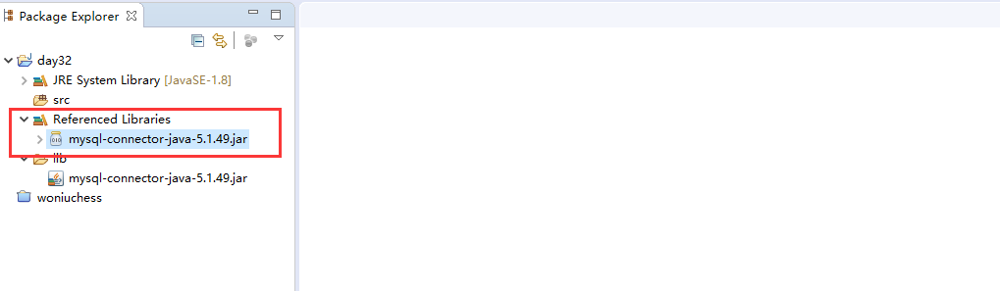

# JDBC概念

JDBC：Java Database Connectivity Java 针对DB的一种连接技术！


JDBC：是SUN公司针对不同的数据库，提供一套统计的规范。这套规范中更多的是接口和抽象类组成。具体的实现还是要依靠各自数据库生产厂商自行实现。

JDBC：该规范支持跨平台，也就是说该规范定义的接口适用于不同的OS，也针对不同的数据库！

JDBC提供的类和接口，大多都存放在java.sql.*包下

| 类和接口的名称    | 描述                                                         |
| :---------------- | :----------------------------------------------------------- |
| CallableStatement | 用于调用DB中的存储过程                                       |
| Connection        | 用于和DB建立连接                                             |
| Driver            | 驱动类的实现，不同的DB都有各自的实现，作用：驱动DB和Java程序建立连接 |
| PreparedStatement | 预编译SQL语句                                                |
| Statement         | 直接编译SQL语句                                              |
| ResultSet         | 结果集，主要用于存放：从DB查询回来的数据                     |
| DriverManager     | 用于管理JDBC的驱动程序                                       |
| Time              | 数据库的时间                                                 |
| Date              | 数据库的日期                                                 |
| SQLException      | 该异常或它的子异常，主要用于抛出SQL错误问题！                |

# JDBC编程步骤

## 一、JDBC编程步骤

1. 根据DB，选择对应的驱动
2. 连接DB，获得Connection对象
3. 根据Connection对象，创建Statement编译对象
4. 使用Statement编译对象，提交SQL语句
5. 操作结果集
6. 关闭Connection对象

> 1、注册驱动
>
> 2、建立连接
>
> 3、创建数据库操作对象
>
> 4、执行sql （得到结果集ResultSet）
>
> 5、处理运行结果（遍历结果集）
>
> 6、释放资源（关闭连接）

### 1.选择驱动程序

DB的选择是MySQL5.7，那么我们就应该使用MySQL的驱动程序！

从 https://mvnrepository.com/ 上，下载：mysql-connector-java.jar 版本：[5.1.49](https://mvnrepository.com/artifact/mysql/mysql-connector-java/5.1.49)


如果是sqlserver数据库：mssql-jdbc.jar

如果是oracle数据库： oracle-jdbc.jar

### 2.连接DB，获得Connection对象

将mysql-connector-java-5.1.49.jar 拷贝到项目中的lib目录下，然后选择该jar包，使用`Builder Path - Add to Builder Path`



加载驱动：

```java
Class.forName("com.mysql.jdbc.Driver");
//Class.forName("oracle.jdbc.driver.OracleDriver");   //加载Oracle驱动  
//Class.forName("com.microsoft.jdbc.sqlserver.SQLServerDriver");   //加载SQLServer驱动
```

建立连接：

```java
//配置数据库的连接地址
String url = "jdbc:mysql://127.0.0.1:3306/woniu?useUnicode=true&characterEncoding=UTF8&useSSL=false";
Connection conn = DriverManager.getConnection(url,"root","123456");
```

> url的语法：
>
> ```java
> jdbc:mysql://IP地址:端口号/数据库名称?useUnicode=true&characterEncoding=UTF8&useSSL=false
> ```
>
> useUnicode=true 支持使用Unicode编码集
>
> characterEncoding=UTF8 客户端使用UTF8的编码集
>
> useSSL=false 不支持使用SSL连接MySQL

完整代码：

```java
 public static void main(String[] args) {
        //加载MYSQL驱动
        try {
            //该代码跟反射有关，反射2阶段讲
            Class.forName("com.mysql.jdbc.Driver");
            //配置数据库的连接地址
            String url = "jdbc:mysql://127.0.0.1:3306/woniu?useUnicode=true&characterEncoding=UTF8&useSSL=false";
            Connection conn = DriverManager.getConnection(url,"root","123456");
            System.out.println(conn);
        } catch (Exception e) {
            // TODO Auto-generated catch block
            e.printStackTrace();
        }
    }
```

### 3.创建Statement编译对象

Statement 针对SQL提供的一个编译对象

有3个编译对象：Statement，PreparedStatement，CallableStatement

Statement：代表一个没有任何参数的SQL语句

PreparedStatement：代表具有参数的SQL语句

CallableStatement：代表调用DB中存储过程

```java
//创建一个编译对象
Statement statement = conn.createStatement();
```

完整代码：

```java
 public static void main(String[] args) {
        //加载MYSQL驱动
        try {
            //该代码跟反射有关，反射2阶段讲
            Class.forName("com.mysql.jdbc.Driver");
            //配置数据库的连接地址
            String url = "jdbc:mysql://127.0.0.1:3306/woniu?useUnicode=true&characterEncoding=UTF8&useSSL=false";
            Connection conn = DriverManager.getConnection(url,"root","123456");
            //创建一个编译对象
            Statement statement = conn.createStatement();
//            String sql = "insert into major_info (major_name) values ('物联网')";
//            String sql = "update major_info set major_name = '大数据' where id = 5";
            String sql = "delete from major_info where id = 5";
            //rows 代表数据库中受影响的行数
            int rows = statement.executeUpdate(sql);//executeUpdate 主要执行新增，修改，删除
            System.out.println(rows);
        } catch (Exception e) {
            // TODO Auto-generated catch block
            e.printStackTrace();
        }
    }
```

### 4.使用Statement编译对象，提交SQL语句

编写sql语句用字符串拼接时注意`双引号`和逗号的位置。


> 新增，修改，删除 操作 ，需要使用statement.executeUpdate(sql);
>
> 查询操作，需要使用statement.executeQuery(sql);

### 5.处理结果集

ResultSet

| 方法名 | 描述                                     |
| :----- | :--------------------------------------- |
| get*() | 获得结果集中每行数据的列的数据           |
| next() | 判断是否有下一行，并将光标移动到下一行去 |

```java
//返回结果集
ResultSet rs = statement.executeQuery(sql);
while(rs.next()) {
    //获得每行的数据(如果通过下标获得每列数据：下标从1开始)
    //                System.out.println(rs.getLong(1));
    //                System.out.println(rs.getString(2));
    //推荐使用 字段名去获取
    System.out.println(rs.getLong("id"));
    System.out.println(rs.getString("note_name"));
    System.out.println(rs.getDate("modify_time"));
}
```

参照表：

| DB数据类型 | Java数据类型 |
| :--------- | :----------- |
| char       | String       |
| varchar    | String       |
| int        | int          |
| integer    | int          |
| bigint     | Long         |
| tinyint    | Byte         |
| smallint   | Short        |
| float      | Float        |
| double     | Double       |
| date       | Date         |
| time       | Time         |
| timestamp  | TimeStamp    |
| datetime   | Date         |
| bit        | boolean      |

### 6.关闭Connection对象

> conn 关闭很重要，不关闭连接，DB中有可能连接不够！默认情况DB中尽支持200根左右的连接，当然可以通过配置文件去修改！

```java
conn.close();
```

## 二、课堂练习(学生CRUD)

### 1.新增

> **需求一：**完成对学生资料的新增

```java
public class Demo1 implements Serializable{
    public static void main(String[] args) {
        StudentBean stu = new StudentBean("张三", "zs", "123456", "男", 23);
        //加载MYSQL驱动
        try {
            //该代码跟反射有关，反射2阶段讲
            Class.forName("com.mysql.jdbc.Driver");
            //配置数据库的连接地址
            String url = "jdbc:mysql://127.0.0.1:3306/woniu?useUnicode=true&characterEncoding=UTF8&useSSL=false";
            Connection conn = DriverManager.getConnection(url,"root","123456");
            //创建一个编译对象
            Statement state = conn.createStatement();
            String sql = "insert into student_info (student_name,login_name,pwd,gender,age) values ("
                    + "'"+stu.getStudentName()+"','"+stu.getLoginName()+"','"+stu.getPwd()+"','"+stu.getGender()+"','"+stu.getAge()+"')";
            //执行该语句
            int rows = state.executeUpdate(sql);
            System.out.println(rows);
            //关闭连接
            conn.close();
        } catch (Exception e) {
            // TODO Auto-generated catch block
            e.printStackTrace();
        }
    }
}
class StudentBean implements Serializable{
    /**
     * 
     */
    private static final long serialVersionUID = 1L;
    private Integer id;
    private String studentName;
    private String loginName;
    private String pwd;
    private String gender;
    private Integer age;
    public StudentBean() {
        super();
    }
    public StudentBean(String studentName, String loginName, String pwd, String gender, Integer age) {
        super();
        this.studentName = studentName;
        this.loginName = loginName;
        this.pwd = pwd;
        this.gender = gender;
        this.age = age;
    }
    public Integer getId() {
        return id;
    }
    public void setId(Integer id) {
        this.id = id;
    }
    public String getStudentName() {
        return studentName;
    }
    public void setStudentName(String studentName) {
        this.studentName = studentName;
    }
    public String getLoginName() {
        return loginName;
    }
    public void setLoginName(String loginName) {
        this.loginName = loginName;
    }
    public String getPwd() {
        return pwd;
    }
    public void setPwd(String pwd) {
        this.pwd = pwd;
    }
    public String getGender() {
        return gender;
    }
    public void setGender(String gender) {
        this.gender = gender;
    }
    public Integer getAge() {
        return age;
    }
    public void setAge(Integer age) {
        this.age = age;
    }
    @Override
    public String toString() {
        return "StudentBean [id=" + id + ", studentName=" + studentName + ", loginName=" + loginName + ", pwd=" + pwd
                + ", gender=" + gender + ", age=" + age + "]";
    }
}
```

### 2.修改

> **需求二：**完成对学生资料的修改

```java
 private static void updateStudent() {
        // TODO Auto-generated method stub
        StudentBean stu = new StudentBean("张三", "zs", "654321", "男", 24);
        stu.setId(1);
        //加载MYSQL驱动
        try {
            //该代码跟反射有关，反射2阶段讲
            Class.forName("com.mysql.jdbc.Driver");
            //配置数据库的连接地址
            String url = "jdbc:mysql://127.0.0.1:3306/woniu?useUnicode=true&characterEncoding=UTF8&useSSL=false";
            Connection conn = DriverManager.getConnection(url,"root","123456");
            //创建一个编译对象
            Statement state = conn.createStatement();
            String sql = "update student_info set pwd = '"+stu.getPwd()+"',age = '"+stu.getAge()+"' where id = '"+stu.getId()+"'";
            System.out.println(sql);
            //执行该语句
            int rows = state.executeUpdate(sql);
            System.out.println(rows);
            //关闭连接
            conn.close();
        } catch (Exception e) {
            // TODO Auto-generated catch block
            e.printStackTrace();
        }
    }
```

### 3.删除

> 需求三：删除学生资料

```java
private static void deleteStudent() {
        // TODO Auto-generated method stub
        Integer id = 1;
        //加载MYSQL驱动
        try {
            //该代码跟反射有关，反射2阶段讲
            Class.forName("com.mysql.jdbc.Driver");
            //配置数据库的连接地址
            String url = "jdbc:mysql://127.0.0.1:3306/woniu?useUnicode=true&characterEncoding=UTF8&useSSL=false";
            Connection conn = DriverManager.getConnection(url,"root","123456");
            //创建一个编译对象
            Statement state = conn.createStatement();
            String sql = "delete from student_info where id = '"+id+"'";
            System.out.println(sql);
            //执行该语句
            int rows = state.executeUpdate(sql);
            System.out.println(rows);
            //关闭连接
            conn.close();
        } catch (Exception e) {
            // TODO Auto-generated catch block
            e.printStackTrace();
        }
    }
```

### 4.根据id查询学生

> 需求四：根据ID查询学生资料

```java
private static void findStudentById() {
        // TODO Auto-generated method stub
        Integer id = 1;
        // 加载MYSQL驱动
        try {
            // 该代码跟反射有关，反射2阶段讲
            Class.forName("com.mysql.jdbc.Driver");
            // 配置数据库的连接地址
            String url = "jdbc:mysql://127.0.0.1:3306/woniu?useUnicode=true&characterEncoding=UTF8&useSSL=false";
            Connection conn = DriverManager.getConnection(url, "root", "123456");
            // 创建一个编译对象
            Statement state = conn.createStatement();
            String sql = "select * from student_info where id = '" + id + "'";
            System.out.println(sql);
            // 执行该语句
            ResultSet rs = state.executeQuery(sql);
            StudentBean stu = null;
            while (rs.next()) {
                String studentName = rs.getString("student_name");
                String loginName = rs.getString("login_name");
                String pwd = rs.getString("pwd");
                Integer age = rs.getInt("age");
                String gender = rs.getString("gender");
                stu = new StudentBean(studentName, loginName, pwd, gender, age);
                stu.setId(id);
            }
            System.out.println(stu);
            // 关闭连接
            conn.close();
        } catch (Exception e) {
            // TODO Auto-generated catch block
            e.printStackTrace();
        }
    }
```

### 5.根据学生名称模糊查询学生

> 需求五：输入张，将学生信息输出

```java
  private static void findStudentByName() {
        // TODO Auto-generated method stub
        String name = "张三";
        // 加载MYSQL驱动
        try {
            // 该代码跟反射有关，反射2阶段讲
            Class.forName("com.mysql.jdbc.Driver");
            // 配置数据库的连接地址
            String url = "jdbc:mysql://127.0.0.1:3306/woniu?useUnicode=true&characterEncoding=UTF8&useSSL=false";
            Connection conn = DriverManager.getConnection(url, "root", "123456");
            // 创建一个编译对象
            Statement state = conn.createStatement();
            String sql = "select * from student_info where student_name like '" + name + "%'";
            System.out.println(sql);
            // 执行该语句
            ResultSet rs = state.executeQuery(sql);
            List<StudentBean> datas = new ArrayList<StudentBean>();
            while (rs.next()) {
                String studentName = rs.getString("student_name");
                String loginName = rs.getString("login_name");
                String pwd = rs.getString("pwd");
                Integer age = rs.getInt("age");
                String gender = rs.getString("gender");
                StudentBean stu = new StudentBean(studentName, loginName, pwd, gender, age);
                stu.setId(rs.getInt("id"));
                datas.add(stu);
            }
            // 遍历集合
            for (StudentBean studentBean : datas) {
                System.out.println(studentBean);
            }
            // 关闭连接
            conn.close();
        } catch (Exception e) {
            // TODO Auto-generated catch block
            e.printStackTrace();
        }
    }
```

> 将Java中对象 向 DB中进行存储，查询

## 三、ORM

ORM：Object RelationshipDB Mapping 对象关系映射

| Object | Mapping | RelationShipDB     |
| :----- | :------ | :----------------- |
| 类     | 对应    | 表                 |
| 对象   | 对应    | 一行数据           |
| 属性   | 对应    | 一行数据某一个字段 |

> Mybaits 框架，Hibernate框架，Spring-Data-JPA框架 ，它们都是这样的思想！

## 四、JDBC补充

JDBC执行完所有操作后要释放资源，即所有的connection和statement，preparestatement都要关闭，先开放的后关闭，后开放的先关闭，同时在关闭时需要做判断，因为可能存在链接数据库参数错误导致连接失败的情况，若连接没有成功，关闭连接时就可能报异常。

**常见错误**


https://www.cnblogs.com/thePeaceOftheLord/p/11836772.html

finally block does not complete normally

 原因：

> 1、不管try块、catch块中是否有return语句，finally块都会执行。
>
> 2、finally块中的return语句会覆盖前面的return语句（try块、catch块中的return语句），所以如果finally块中有return语句，Eclipse编译器会报警告“finally block does not complete normally”。
>
>  3、如果finally块中包含了return语句，即使前面的catch块重新抛出了异常，则调用该方法的语句也不会获得catch块重新抛出的异常，而是会得到finally块的返回值，并且不会捕获异常。

所以 尽量不要在finally内使用return。

**比较**


# 使用属性文件配置连接信息

## 一、封装Connection对象

```java
public class ConnectionUtil {
    /**
     * 提供连接
     * @return
     * @throws ClassNotFoundException
     * @throws SQLException
     */
    public static Connection getConnection() throws ClassNotFoundException, SQLException {
        // 该代码跟反射有关，反射2阶段讲
        Class.forName("com.mysql.jdbc.Driver");
        // 配置数据库的连接地址
        String url = "jdbc:mysql://127.0.0.1:3306/woniu?useUnicode=true&characterEncoding=UTF8&useSSL=false";
        Connection conn = DriverManager.getConnection(url, "root", "123456");
        return conn;
    }
}
```

## 二、属性文件

### 1.定义属性文件

> db.properties 文件直接存放在src目录下

db.properties的内容：

```properties
jdbc.driverClassName=com.mysql.jdbc.Driver
jdbc.url=jdbc:mysql://127.0.0.1:3306/woniu?useUnicode=true&characterEncoding=UTF8&useSSL=false
jdbc.userName=root
jdbc.password=123456
```

### 2.加载属性文件

```java
public class PropUtil {
    static Properties prop = new Properties();
    static {
        try {
            //加载文件
            prop.load(new FileReader("src/db.properties"));//相对路径表达
        } catch (FileNotFoundException e) {
            // TODO Auto-generated catch block
            e.printStackTrace();
        } catch (IOException e) {
            // TODO Auto-generated catch block
            e.printStackTrace();
        }
    }
    public static String getValue(String key) {
        return prop.getProperty(key);
    }
}
```

### 3.获得属性文件中内容

```java
public class ConnectionUtil {
    /**
     * 提供连接
     * @return
     * @throws ClassNotFoundException
     * @throws SQLException
     */
    public static Connection getConnection() throws ClassNotFoundException, SQLException {
        // 该代码跟反射有关，反射2阶段讲
        Class.forName(PropUtil.getValue("jdbc.driverClassName"));
        // 配置数据库的连接地址
        String url = PropUtil.getValue("jdbc.url");
        Connection conn = DriverManager.getConnection(url, PropUtil.getValue("jdbc.userName"), PropUtil.getValue("jdbc.password"));
        return conn;
    }
}
```

# 预编译语句

## 一、直接编译的缺陷

Statement 直接编译，PreparedStatement 预编译

Statement 直接编译的缺陷：无法防止 SQL注入

```java
String name = "'张三' or 1=1";
String sql = "select * from student_info where student_name = " + name + "";
```

> select * from student_info where student_name = ‘张三’ or 1=1

还有一个情况：

```java
String sql1 = "insert into student_info(student_name,age,gender) values ('张三',18,'男')";
String sql2 = "insert into student_info(student_name,age,gender) values ('李四',18,'男')";
String sql3 = "insert into student_info(student_name,age,gender) values ('王五',18,'男')";
```

Statement 直接编译的缺陷：无法针对相同的SQL语句进行 复用

## 二、预编译(重点)

PreparedStatement 预编译：使用? 来代表参数 ?所在的位置，就是一个参数 第1个? 下标为1

```java
String sql1 = "insert into student_info(student_name,age,gender) values (?,?,?)";
```

具体的案例1：

```java
 private static void saveStudent() {
        // TODO Auto-generated method stub
        StudentBean stu = new StudentBean("张三", "zs", "123456", "男", 23);
        // 加载MYSQL驱动
        try {
            Connection conn = ConnectionUtil.getConnection();
            String sql = "insert into student_info (student_name,login_name,pwd,gender,age) values (?,?,?,?,?)";
            // 执行该语句(预编译)
            PreparedStatement ps = conn.prepareStatement(sql);
            //替换?    ?的下标从1开始
            ps.setString(1, stu.getStudentName());// 'zs' or 1=1
            ps.setString(2, stu.getLoginName());
            ps.setString(3, stu.getPwd());
            ps.setString(4, stu.getGender());
            ps.setInt(5, stu.getAge());
            //执行语句
            int rows = ps.executeUpdate();//不要将sql作为参数
            System.out.println(rows);
            // 关闭连接
            conn.close();
        } catch (Exception e) {
            // TODO Auto-generated catch block
            e.printStackTrace();
        }
    }
```

具体的案例2：

```java
private static void findStudentByName() {
        // TODO Auto-generated method stub
        //防止SQL注入
         //String name = "'张三' or 1 = 1";
        String name = "张三";
        try {
            Connection conn = ConnectionUtil.getConnection();
            //select * from student_info where student_name = '张三' or 1=1;
            String sql = "select * from student_info where student_name like concat(?,'%')";
            System.out.println(sql);
            PreparedStatement ps = conn.prepareStatement(sql);
            ps.setString(1, name);
            // 执行该语句
            ResultSet rs = ps.executeQuery();
            List<StudentBean> datas = new ArrayList<StudentBean>();
            while (rs.next()) {
                String studentName = rs.getString("student_name");
                String loginName = rs.getString("login_name");
                String pwd = rs.getString("pwd");
                Integer age = rs.getInt("age");
                String gender = rs.getString("gender");
                StudentBean stu = new StudentBean(studentName, loginName, pwd, gender, age);
                stu.setId(rs.getInt("id"));
                datas.add(stu);
            }
            // 遍历集合
            for (StudentBean studentBean : datas) {
                System.out.println(studentBean);
            }
            // 关闭连接
            conn.close();
        } catch (Exception e) {
            // TODO Auto-generated catch block
            e.printStackTrace();
        }
    }
```

# 事务控制

## 一、事务

JDBC中，也可以控制语句要么操作成功，要么操作失败！

处理事务的步骤：

1. 开启事务
2. 提交/回滚事务

JDBC中，默认支持的 自动提交事务

## 二、JDBC操作事务

取消自动提交：

```java
public class ConnectionUtil {
    /**
     * 提供连接
     * @return
     * @throws ClassNotFoundException
     * @throws SQLException
     */
    public static Connection getConnection() throws ClassNotFoundException, SQLException {
        // 该代码跟反射有关，反射2阶段讲
        Class.forName(PropUtil.getValue("jdbc.driverClassName"));
        // 配置数据库的连接地址
        String url = PropUtil.getValue("jdbc.url");
        Connection conn = DriverManager.getConnection(url, PropUtil.getValue("jdbc.userName"), PropUtil.getValue("jdbc.password"));
        //取消自动提交
        conn.setAutoCommit(false);
        return conn;
    }
}
```

提交或回滚事务：

> conn.commit();//提交事务
>
> conn.rollback();//回滚事务

```java
private static void saveStudent() {
        // TODO Auto-generated method stub
        StudentBean stu = new StudentBean("王五", "zs", "123456", "男", 23);
        // 加载MYSQL驱动
        Connection conn = null;
        try {
            conn = ConnectionUtil.getConnection();
            String sql = "insert into student_info (student_name,login_name,pwd,gender,age) values (?,?,?,?,?)";
            // 执行该语句(预编译)
            PreparedStatement ps = conn.prepareStatement(sql);
            //替换?    ?的下标从1开始
            ps.setString(1, stu.getStudentName());// 'zs' or 1=1
            ps.setString(2, stu.getLoginName());
            ps.setString(3, stu.getPwd());
            ps.setString(4, stu.getGender());
            ps.setInt(5, stu.getAge());
            //执行语句
            int rows = ps.executeUpdate();//不要将sql作为参数
            System.out.println(rows);
//            System.out.println(1/0);
            conn.commit();//提交事务
        } catch (Exception e) {
            // TODO Auto-generated catch block
            e.printStackTrace();
            try {
                conn.rollback();//回滚事务
            } catch (SQLException e1) {
                // TODO Auto-generated catch block
                e1.printStackTrace();
            }
        }finally {
            // 关闭连接
            try {
                conn.close();
            } catch (SQLException e) {
                // TODO Auto-generated catch block
                e.printStackTrace();
            }
        }
    }
```

> 注意：新增，修改，删除 一定要处理事务！但是查询可以不处理事务，因为查询不会修改数据库中的任何数据！

# DAO的概述

## 一、三层架构

以蜗牛五子棋为例，发现问题：对战界面类中既包含UI页面代码，又包含一部分业务代码，还包含一部分持久化代码

**导致：**对战界面类非常的复杂，繁琐


> 表现层：只负责向用户展示界面
>
> 业务层：只负责对应的业务代码
>
> 持久层：只负责同文件或同DB进行交互

## 二、DAO

DAO：Data Access Object `数据访问对象` DAO就是持久层，它的作用：就是同文件或者同DB进行数据的交互！

扩展：

BO：业务对象

PO：持久化对象，根数据库有关的JavaBean

VO：视图对象

DAO：数据访问对象

DTO：数据传输对象

PO VO DTO 现在都可以使用JavaBean来进行替代！

# DAO的封装

## 一、DAO的封装

以学生表为例，来完成DAO的封装 示例：CRUD

**1.封装JavaBean**

```java
public class StudentBean implements Serializable{
    /**
     * 
     */
    private static final long serialVersionUID = -2476431201128137945L;
    private Integer id;
    private String studentName;
    private String loginName;
    private String password;
    private Integer age;
    private String gender;
    public StudentBean() {
        super();
    }
    public StudentBean(String studentName, String loginName, String password, Integer age, String gender) {
        super();
        this.studentName = studentName;
        this.loginName = loginName;
        this.password = password;
        this.age = age;
        this.gender = gender;
    }
    public Integer getId() {
        return id;
    }
    public void setId(Integer id) {
        this.id = id;
    }
    public String getStudentName() {
        return studentName;
    }
    public void setStudentName(String studentName) {
        this.studentName = studentName;
    }
    public String getLoginName() {
        return loginName;
    }
    public void setLoginName(String loginName) {
        this.loginName = loginName;
    }
    public String getPassword() {
        return password;
    }
    public void setPassword(String password) {
        this.password = password;
    }
    public Integer getAge() {
        return age;
    }
    public void setAge(Integer age) {
        this.age = age;
    }
    public String getGender() {
        return gender;
    }
    public void setGender(String gender) {
        this.gender = gender;
    }
    @Override
    public String toString() {
        return "StudentBean [id=" + id + ", studentName=" + studentName + ", loginName=" + loginName + ", password="
                + password + ", age=" + age + ", gender=" + gender + "]";
    }
}
```

**2.封装DAO的接口**

DAO：访问数据库 封装CURD

```java
public interface IStudentDao {
    /**
     * 保存学生
     * @param stu
     */
    void addStudent(StudentBean stu);
    /**
     * 修改学生
     * @param stu
     */
    void updateStudent(StudentBean stu);
    /**
     * 根据ID删除学生
     * @param id
     */
    void deleteStudent(Integer id);
    /**
     * 根据ID查询学生
     * @param id
     * @return
     */
    StudentBean getStudentById(Integer id);
    /**
     * 根据学生名称查询学生
     * @param name
     * @return
     */
    List<StudentBean> findStudentByName(String name);
}
```

**3.实现该Dao接口**

在dao目录中，创建impl目录，去掉Dao接口的I，然后在Dao后添加Impl

```java
public class StudentDaoImpl implements IStudentDao{
    @Override
    public void addStudent(StudentBean stu) {
        // TODO Auto-generated method stub
    }
    @Override
    public void updateStudent(StudentBean stu) {
        // TODO Auto-generated method stub
    }
    @Override
    public void deleteStudent(Integer id) {
        // TODO Auto-generated method stub
    }
    @Override
    public StudentBean getStudentById(Integer id) {
        // TODO Auto-generated method stub
        return null;
    }
    @Override
    public List<StudentBean> findStudentByName(String name) {
        // TODO Auto-generated method stub
        return null;
    }
}
```

**4.编写工具类**

先使用db.properties配置连接信息

```properties
jdbc.driverClassName=com.mysql.jdbc.Driver
jdbc.url=jdbc:mysql://127.0.0.1:3306/woniu?useUnicode=true&characterEncoding=UTF8&useSSL=false
jdbc.userName=root
jdbc.password=123456
```

然后编写2个工具类：

```java
public class PropUtil {
    static Properties prop = new Properties();
    static {
        try {
            prop.load(new FileReader("src/db.properties"));
        } catch (FileNotFoundException e) {
            // TODO Auto-generated catch block
            e.printStackTrace();
        } catch (IOException e) {
            // TODO Auto-generated catch block
            e.printStackTrace();
        }
    }
    public static String getValue(String key) {
        return prop.getProperty(key);
    }
}
public class ConnectionUtil {
    /**
     * 提供连接
     * @return
     * @throws ClassNotFoundException
     * @throws SQLException
     */
    public static Connection getConnection() throws ClassNotFoundException, SQLException {
        // 该代码跟反射有关，反射2阶段讲
        Class.forName(PropUtil.getValue("jdbc.driverClassName"));
        // 配置数据库的连接地址
        String url = PropUtil.getValue("jdbc.url");
        Connection conn = DriverManager.getConnection(url, PropUtil.getValue("jdbc.userName"), PropUtil.getValue("jdbc.password"));
        //取消自动提交
        conn.setAutoCommit(false);
        return conn;
    }
}
```

**5.在DAO完成CRUD**

```java
public class StudentDaoImpl implements IStudentDao{
    @Override
    public void addStudent(StudentBean stu) {
        // TODO Auto-generated method stub
        Connection conn = null;
        try {
            conn = ConnectionUtil.getConnection();
            String sql = "insert into student_info (student_name,login_name,pwd,age,gender) values (?,?,?,?,?)";
            PreparedStatement ps= conn.prepareStatement(sql);
            //设置
            ps.setString(1, stu.getStudentName());
            ps.setString(2, stu.getLoginName());
            ps.setString(3, stu.getPassword());
            ps.setInt(4, stu.getAge());
            ps.setString(5, stu.getGender());
            ps.executeUpdate();
            conn.commit();
        } catch (Exception e) {
            // TODO Auto-generated catch block
            e.printStackTrace();
            try {
                conn.rollback();
            } catch (SQLException e1) {
                // TODO Auto-generated catch block
                e1.printStackTrace();
            }
        } finally {
            try {
                conn.close();
            } catch (SQLException e) {
                // TODO Auto-generated catch block
                e.printStackTrace();
            }
        }
    }
    @Override
    public void updateStudent(StudentBean stu) {
        // TODO Auto-generated method stub
        Connection conn = null;
        try {
            conn = ConnectionUtil.getConnection();
            String sql = "update student_info set student_name = ?,login_name = ?,pwd = ?,age = ?,gender = ? where id = ?";
            PreparedStatement ps = conn.prepareStatement(sql);
            ps.setString(1, stu.getStudentName());
            ps.setString(2, stu.getLoginName());
            ps.setString(3, stu.getPassword());
            ps.setInt(4, stu.getAge());
            ps.setString(5, stu.getGender());
            ps.setInt(6, stu.getId());
            //执行
            ps.executeUpdate();
            conn.commit();//提交事务
        } catch (Exception e) {
            // TODO Auto-generated catch block
            e.printStackTrace();
            try {
                conn.rollback();
            } catch (SQLException e1) {
                // TODO Auto-generated catch block
                e1.printStackTrace();
            }
        } finally {
            try {
                conn.close();
            } catch (SQLException e) {
                // TODO Auto-generated catch block
                e.printStackTrace();
            }
        }
    }
    @Override
    public void deleteStudent(Integer id) {
        // TODO Auto-generated method stub
    }
    @Override
    public StudentBean getStudentById(Integer id) {
        // TODO Auto-generated method stub
        Connection conn = null;
        try {
            conn = ConnectionUtil.getConnection();
            String sql = "select * from student_info where id = ?";
            PreparedStatement ps = conn.prepareStatement(sql);
            ps.setInt(1, id);
            //查询
            ResultSet rs = ps.executeQuery();
            StudentBean stu = null;
            while(rs.next()) {
                String studentName = rs.getString("student_name");
                String loginName = rs.getString("login_name");
                String password = rs.getString("pwd");
                Integer age = rs.getInt("age");
                String gender = rs.getString("gender");
                stu = new StudentBean(studentName, loginName, password, age, gender);
                stu.setId(id);
            }
            return stu;
        } catch (Exception e) {
            // TODO Auto-generated catch block
            e.printStackTrace();
        } finally {
            try {
                conn.close();
            } catch (SQLException e) {
                // TODO Auto-generated catch block
                e.printStackTrace();
            }
        }
        return null;
    }
    @Override
    public List<StudentBean> findStudentByName(String name) {
        // TODO Auto-generated method stub
        return null;
    }
}
```

## 二、Dao的调用

在com.woniuxy.day33目录下，创建main目录

```java
public class StudentMain {
    public static void main(String[] args) {
//        addStudent();
        updateStudent();
    }
    private static void updateStudent() {
        // TODO Auto-generated method stub
        //先查询
        Integer id = 7;
        IStudentDao dao = new StudentDaoImpl();
        StudentBean stu = dao.getStudentById(id);
        System.out.println(stu);
        //再修改
        stu.setAge(34);
        stu.setGender("女");
        dao.updateStudent(stu);
    }
    private static void addStudent() {
        // TODO Auto-generated method stub
        StudentBean stu = new StudentBean("张三", "zs", "123456", 23, "男");
        IStudentDao dao = new StudentDaoImpl();
        dao.addStudent(stu);
    }
}
```

`javaBean一定要实现Serializable序列化`

# 运行该Jar包

在jar所在的目录，输入以下命令可以执行该Jar包

> java -jar *.jar


# 数据库连接池

连接池：一种专门用来管理连接的容器

> 作用：做到连接的复用，以及对连接的有效控制


