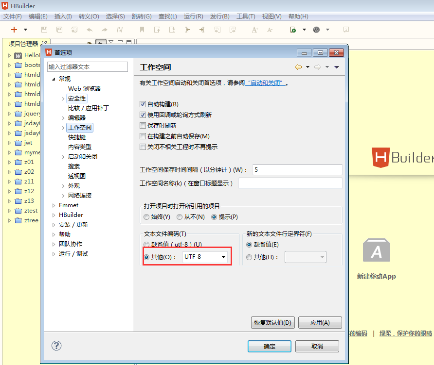
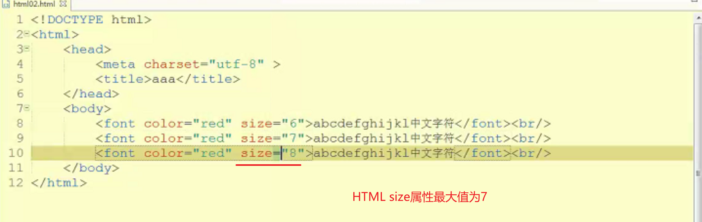
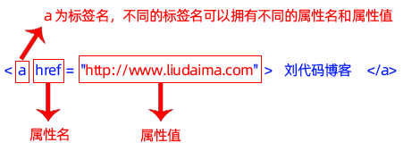
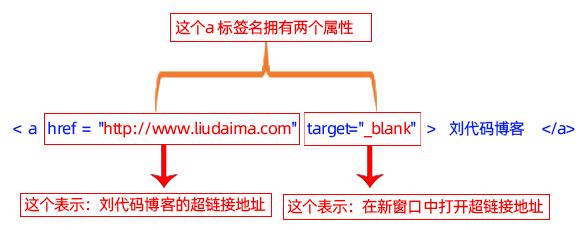
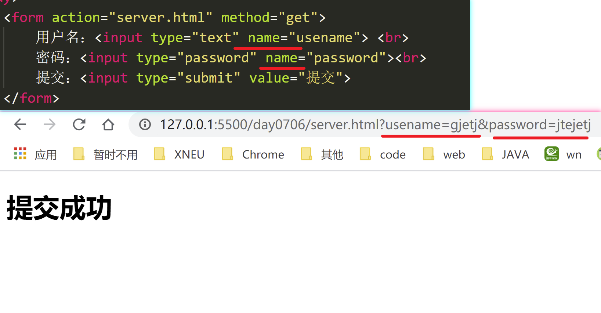
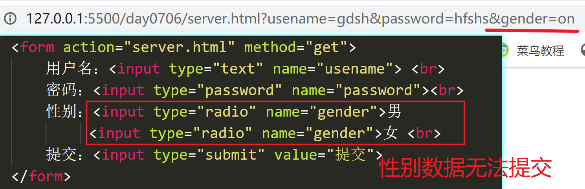
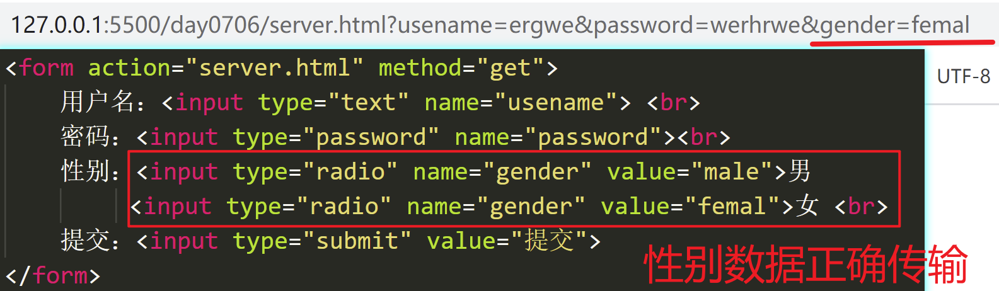
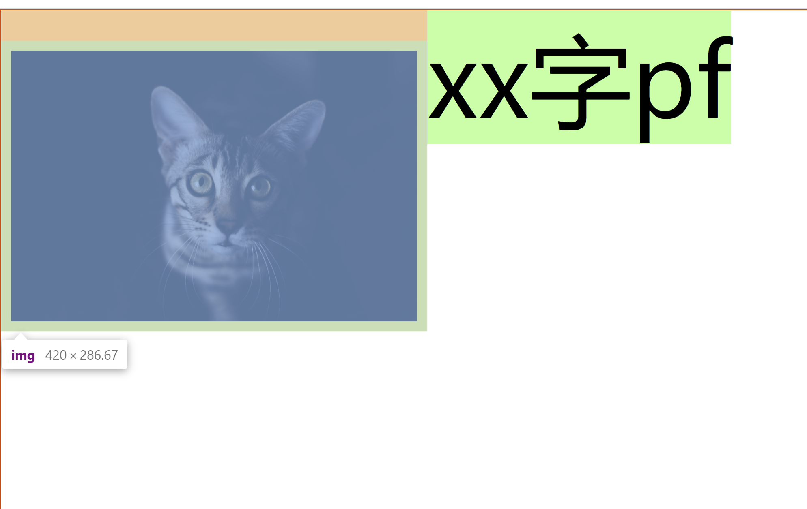
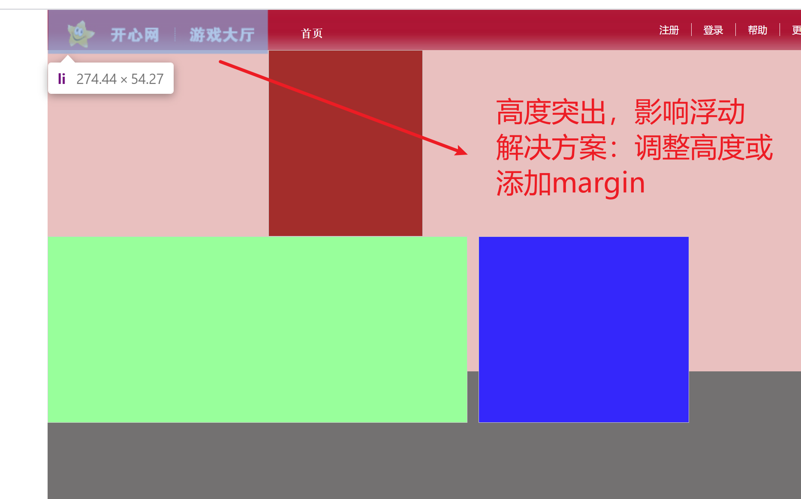

# HTML

## 课程体系

**一阶段 Java基础**

 程序逻辑 顺序 选择 循环 熟练、理解

 面向对象 封装 继承 多态 基本概念 语法 理解（编程思想）

 JavaAPI 常用类和方法 String 集合 IO 多线程 网络编程 熟练使用

 数据库 SQL语句 熟练使用

 JDBC 熟练使用

 JavaFX 做Windows程序，桌面程序，不是Java的强项，Windows的标准是MS做的，MS的C#

程序界面

 控制台程序，命令行程序，DOS界面

 Windows程序，桌面程序

 JavaWeb web网站

**二阶段 JavaWeb开发**

 做一个有交互功能的动态网站

 HTML 静态页面，这个是Web开发的基础

 JS/jQUery 客户端交互效果

 MyBatis 封装了JDBC操作的数据持久层框架，替换JDBC

 JavaWeb Servlet JSP AJAX 交互功能的动态网站

**三阶段 开源框架**

 使用框架来重写二阶段的功能

**四阶段 分布式框架**

 把二阶段和三阶段的单体项目，拆成多个项目

要求

整理笔记：尽量详细

## HTML概述

HTML Hyper Text Markup Language 超文本标记语言

标记：又叫标签，是构成HTML的基础， 标签一般成对 <标签名></标签名>

超文本: HTML语言靠浏览器解释执行，浏览器会将标签变成特定的效果展示：文字，图片，超链接，表格，列表，音频，视频

HTML用了制作静态页面

在线帮助文档 https://www.w3school.com.cn/index.html

W3C World Wide Web C(联盟) 万维网联盟 国际组织，定制HTML标准

## 编码

 utf-8

## 开发软件

开发软件目录：不要放到默认目录下，不要有中文和空格

安装版：下一步，电脑重装系统，不能正常使用。有写文件安装在C盘系统目录下，系统数据写入注册表。软件有问题，不能直接删，卸载软件。

解压版：绿色软件，解压使用，重装系统，可以继续用。卸载：直接删除

## 入门代码

编辑工具

 记事本

 IDE集成开发环境 DreamWeaver HBuilder VSCode WebStrom

设置编码

扩展名 .html .htm



```html
<!--文档声明：HTML最前面，告诉浏览器，当前是一个HTML文档-->
<!DOCTYPE html>
<!--所有的HTML代码都在<html>标签中-->
<html>
    <!--头部-->
    <head>
        <!--设置编码-->
        <meta charset="UTF-8">
        <!--标题-->
        <title>我的标题</title>
    </head>
    <!--正文主体-->
    <body>
        网页正文内容
    </body>
</html>
```

## 标签概述

HTML由浏览器将特定的标签解释成特定的效果展示。

浏览器容错性：一般各种问题，浏览器尽量解释，不会报错。

标签一般成对，<开始标签></结束标签>，凡是成对的标签都成对出现

少数标签不成对，显示关闭<标签名 />

`HTML不区分到小写，一般写小写`

`<标签 属性名=”属性值” 属性名=”属性值” 属性名=”属性值”>`，属性值使用单引号或者双引号

嵌套标签，使用缩进

标签嵌套要严格嵌套，不要部分嵌套



## 标题标签

````html
    <!--不同级别字体大小的标题-->
        <h1>一级标题</h1>
        <h2>二级标题</h2>
        <h3>三级标题</h3>
        <h4>四级标题</h4>
        <h5>五级标题</h5>
        <h6>六级标题</h6>
        普通文字
````

## 段落标签

````html
<p>第一段</p>
````

## 换行标签

```html
<br> html写法

<br/>xhtml写法

</br> 此写法不正确但浏览器可以解析
```

## **特殊字符**

即转义字符，以`&`开始，`；`结尾，常见如下：

`&nbsp;`：空格

`&lt;`：小于号<

`&gt;`：大于号>

`&quot;`：双引号"

## **字体加粗**

推荐使用strong

```html
<strong></strong>
<b></b>
```

## **斜体**

```html
<em></em>
<i></i>
```

## 横线

````html
<hr>推荐写法
<hr/>xhtml写法，可以解析
</hr>错误写法，无法解析
````

## 图片标签

img常用属性：src、title 、width、 height、alt

````html

````

## 绝对引用与相对引用

**绝对引用**：从协议开始    协议://网址/图片资源

- 大型网站：.html文件和图片存储在不同服务器上的，我们自己的网站，引用其他网站的图片
- 协议://IP地址:端口/资源路径

```html
</br>
这种写法没有意义，开了端口不能用
```

ip：网络中的一台电脑

端口：电脑中的一个程序

**相对引用**：小网站：网页文件和图片文件在一个项目目录下（在同一个服务器）

- 不以/开头（静态页面使用）

```html


当前网页目录中有img目录

当前网页目录的上级目录有img目录

当前网页目录的上级目录的上级目录有img目录
```

- 以/开头（JavaWeb动态网站使用这种）

```html
//绝对路径（当前服务器）
</br>

<!--/前面已经包含IP地址和端口号-->
<!--直接写为：/项目名/资源地址-->
</br>
```

​	`./`：当前目录

​	`../`：当前目录的上级目录

## src写法总结

````html
		<!-- 绝对引用：在文件所在目录用浏览器打开可以正常显示，在vscode、builder中以访问服务器的方式打开错误，无法显示-->
		
		
		<!-- 绝对引用：在文件所在目录用浏览器打开可以正常显示，在vscode、builder中以访问服务器的方式打开错误，无法显示-->
		
		
		<!-- 绝对引用：从协议开始寻找资源-->
		
		
		<!-- 相对引用：/之前已经包含了ip和端口，hworkspace相对于当前ip、端口访问资源 -->
		
		
		<!-- 相对引用：相对当前路径访问资源（省略了./） -->
		
		
		<!-- 相对引用：相对当前路径访问资源 -->
		
		
		<!-- 错误写法 -->
		
````

## 超链接

````html
<a href="index.html" target="_blank">链接焦点</a>
````

target属性：控制跳转页面的打开方式

​	_self：当前窗口打开，为默认值

​	_blank：新窗口打开

注意：

- href里面空白，刷新网页
- href=”#“ 刷新页面，回到页面顶端
- #id名  锚点，在href里面的路径可以使用锚点，用于定位到页面中的某一个标签

**锚点跳转**

1、跳转目标为a链接(若要使用name属性跳转，必须要用a标签包裹跳转目标)

```html
跳转目标链接：
<a  name="tag"></a>

点击链接：
<a href="#tag"></a>
<a href="test.html#tag"></a>
```

2、通用方法(跳转目标不一定为a标签)

````html
跳转目标标签：
<   id="tag"><  >;
点击链接：
<a href="#tag"></a>
<a href="test.html#tag"></a>
````

## css属性内联写法

````html
<p style="css属性1: css属性值1;  css属性2：css属性值2；"></p>
````

## html属性写法

1、HTML属性应该写在开始标签内，且在标签名之后

2、HTML属性总是以"属性名="属性值"的形式出现



3、HTM元素可以拥有一个或多个属性

4、多个HTML属性之间是用空格隔开的

5、多个html属性可以不用区分顺序

下面以标签为例



6、html属性值要加引号，通常为双引号，不过，使用单引号也可以！

7、如果html属性值本身就含有双引号，那么就必须使用单引号，比如 

````html
name='Bill "HelloWorld" Gates'
````

## 列表

无序列表（under list）

````html
<ul type="">
    <li></li>
    <li></li>
    ……
</ul>
````

> type属性默认值为：disc：符号显示为实心圆
>
> ​	circle：空心圆
>
> ​	square：实心方块

有序列表

````html
<ol type="1">
      <li></li>
      <li></li>
      ……
</ol>
````

> type属性默认值为：1，编号显示为阿拉伯数字
>
> ​	A：编号显示为A、B、C、D……
>
> ​	a：编号显示为a、b、c、d……
>
> ​	i：编号显示为i、 ii 、iv……

自定义列表

````html
<dl>
    <dt>标题1</dt>
    <dd>内容</dd>
    <dd>内容</dd>
    <dt>标题2</dt>
    <dd>内容</dd>
    <dd>内容</dd>
</dl>
````

> 内容项默认缩进一定距离

## 表格

- 页面布局

   门户网站：div布局，目前流行的布局

   表格：1998，早期的门户网站，使用表格做布局，现在淘汰了。表格现在一般用在页面的局部，主要用来实现排列规整的布局。

   框架布局：后台管理界面

- 语法：

  ```html
  <table border="1" width="500px" align="center" cellspacing="0" cellpadding="0px" bgcolor="pink">
          <tr align="center" bgcolor="yellowgreen">
              <td width="80px" height="60px" align="right" bgcolor="tomato">姓名</td>
              <td>性别</td>
              <td>年龄</td>
          </tr>
          <tr>
              <td>张三</td>
              <td>女</td>
              <td>16</td>
          </tr>
          <tr>
              <td>李四</td>
              <td>男</td>
              <td>18</td>
          </tr>
          <tr>
              <td>王二</td>
              <td>女</td>
              <td>20</td>
          </tr>
      </table>
  ```

  - align:控制水平对齐方式，table控制表格在页面中的对齐方式，tr和td控制的单元格里面内容的对齐方式(tr,td都设置，就近原则，以td设置的为准)
    - left 默认 左对齐
    - center 居中
    - right 右对齐
  - valign:控制单元格内容垂直方向对齐方式（作用与tr与td，作用于table不起作用，tr,td都设置，就近原则，以td设置的为准）
    - top:顶端对齐
    - middle：中间对齐
    - bottom：底部对齐
  - cellspacing：控制单元格之间的间距
  - cellpadding：控制单元格里面内容到单元格边框的距离
  - bgcolor ：设置背景颜色   优先级：td>tr>table
  - border:设置表格的边框

- 注意：

  1. th标签代表表头，会进行加粗，文字居中
  2. 表格的基本结构，table里面只能放tr ，tr里面只能放td或th
  3. 表格是可以相互嵌套，注意里面的表格是放在单元格td里面的，不能破坏外面单元格的结构
  4. **td中的内容默认垂直居中**
  5. 表格记得设置边框或填充内容，否则效果不可见。

**单元格合并**

- rowspan：设置跨行合并单元格，垂直方向上合并
- colspan：跨列合并单元格，水平方向上合并

## 框架集、框架

一种页面布局的方式，一般不会用在官网门户网站，一般用在后台管理界面。

一个框架集包含若干个框架，框架中可以继续嵌套框架集，框架中显示页面。可以将多个网页整合到一个框架集中显示。

1、先将一个网页myebook.html分成若干个框架。

```html
<!--当前页面是个框架集,不能使用body标签-->
<frameset rows="25%,*">
    <frame />
    <frameset cols="25%,*">
        <frame /> 
        <frame />
    </frameset>
</frameset>
```

> rows：定义框架集中行的数目和尺寸，尺寸单位为 pixels，%，*
>
> clos：定义框架集中列的数目和尺寸，尺寸单位为 pixels，%，*

2、准备其他页面，top.html、left.html、java01.html、java02.html、java03.html

```html
<body>
        <h1>Java</h1>
        <a href="java01.html">java入门</a><br/>
        <a href="java02.html" >java逻辑</a><br/>
        <h1>HTML</h1>
        <a href="html01.html">HTML入门</a><br/>
        <a href="html02.html" >HTML常用标签</a><br/>
    </body>
```

3、将对应的页面嵌入到框架的对应位置

```html
<frameset rows="25%,*">
        <frame src="top.html"/>
        <frameset cols="25%,*">
            <frame src="left.html"/>
            <frame src="java01.html"/>
        </frameset>
</frameset>
```

4、左边的超链接导航，显示的位置是在左，我们希望在右边的框架中展示，给右边框架使用name属性起个名字，left.html中的超链接使用target属性指定对应的名字

```html
<!--当前页面是个框架集-->
<frameset rows="25%,*">
    <frame src="top.html"/>
    <frameset cols="25%,*">
        <frame src="left.html"/>
        <frame src="java01.html" name="right"/>
    </frameset>
</frameset>
```

````html
<body>
        <h1>Java</h1>
        <a href="java01.html" target="right">java入门</a><br/>
        <a href="java02.html" target="right">java逻辑</a><br/>
        <h1>HTML</h1>
        <a href="html01.html" target="right">HTML入门</a><br/>
        <a href="html02.html" target="right">HTML常用标签</a><br/>
</body>
````

## 子框架

```html
<iframe src="html01.html" name="content"></iframe>
```

可以实现页面复用，更灵活，可以在任意页面嵌套使用


框架集不能和body连用(head后面直接跟frameset,去掉body)

子框架嵌入body标签中使用,子框架iframe由于没有内容,可以成对写也可以单个写

````html
<iframe src="java.html"></iframe>
或
<iframe src="java.html">
````

## 表单和表单元素

**表单:**

````html
<form action=" "  method=""> </form>
````

**表单元素：**

1、文本输入框：value设置默认输入内容

````html
用户名：<input type="text" name=" " value="">
````

> value：指定默认值

2、密码输入框

````html
密码：<input type="password" name="" value="">
````

> value：指定默认值

3、提交按钮

````html
<input type="submit" value="提交">
````

> value：按钮上显示的文字

4、重置按钮

````html
<input  type="reset" value="重置">
````

> value：按钮上显示的文字

5、普通按钮：默认无任何功能，配合js实现强大功能

````html
<input type="button" value="提交">
````

> value：按钮上显示的文字

> 提交、重置按钮不需要name属性，无数据提交

6、单选

````html
<input type="radio" name="n1" value="v1" checked>
<input type="radio" name="n1" value="v2">
<input type="radio" name="n1 " value="v3">
````

7、多选

````html
<input type="checkbox" name="n1" value="v1" checked>
<input type="checkbox" name="n1" value="v2">
<input type="checkbox" name="n1" value="v3">
````

> - 单选，多选中，name属性除了提交数据时作为属性名外，还将同组的单选项和多选项绑定在一起，因此对于属于同一组的单选项多多选项，name属性的值必须相同。
> - checked属性值与属性名相同，此处为省略写法。

8、下拉选择

````html
<select name="booldtype" id="" >
        <option>A型</option>
        <option >B型</option>
        <option  selected>O型</option>
        <option >AB型</option>
 </select>

<select name="booldtype" id="">
        <option value="0">A型</option>
        <option value="1">B型</option>
        <option value="2">O型</option>
        <option value="3">AB型</option>
</select>
````

> - 下拉选择不写`value`也可以传数据，传输数据值为`option`标签之间的内容，若加了value值，则传递`value`指定的值
> - selected属性值与属性名相同，可以简写。指定默认选择。

9、文本域(多行文本)

````html
<textarea name="" id="" cols="30" rows="10"></textarea>
````

10、文件上传

````html
<input type="file" name="file1">

<!-- 上传对表单要求：-->
<form methlod="post" enctype="multipart/form-data">	</form>
````

11、隐藏域

````html
<!--隐藏域，可以在表单中隐藏数据，用户不知道，程序员编程的时候可以使用-->
<input type="hidden"name="uid"value="123">
````

12、其他属性

````html
<!--只读属性-->
用户名：<input type="text"name="uname"value="zs"readonly="readonly">

<!--禁用-->
<input type="submit"value="ok"disabled="disabled">
````

13、语义化表单(实现点击标题光标定位到输入框)

点击label中的文字，会自动定位鼠标光标焦点 for="id的属性值"

```html
<label for="myaddress">地址:</label><input type="text" name="address" id="myaddress">
```

**表单数据提交服务器**

1、表单中的有name属性的表单元素的value属性值才会传到服务器。

2、表单元素中输入框、文本域、选择框等表单元素必须要有`name`属性，否则数据无法传输给服务器。name值实际为提交时的属性，而输入的内容为属性对应的值，对于单选框，由于没有输入，所以必须要加上value属性，并指定值：



3、单选框提交





> **总结：**
>
> 除了按钮其他表单元素都要提交数据(按钮虽无需name属性，但需有value属性，指定按钮上显示的文字。)，所以都必须要有name属性。
>
> 1、单选、多选框必须要有value属性，并指定值；
>
> 2、文本输入框、密码框当有value属性并指定值，若不输入，则传输默认值，若有输入则传输输入的值；
>
> 3、下拉选择若不写value属性并不指定值则传输option标签之间的内容，若写了value，则传输value指定的值。

# CSS

## CSS概述

Cascading Style Sheets  层叠样式表，用来美化网页，给网页设置样式

层叠：多个地方的样式会层叠为一，相同的样式根据优先级决定，不同的样式直接作用，最终形成一套样式

样式表：是指css的样式代码；指代就是内联样式、内部样式、外部样式里面书写代码

## 标签的分类

**块级标签（块级元素）**

一般用来进行页面布局或组织行级元素的

- 特点：
  - 独占一行
  - 支持宽和高
- 比如：div，p，h，table，tr，ol、ul，li等等

**行内元素**

一般用于组织文本

- 特点：
  - 共享一行
  - 不支持宽高，由内容撑开
- 常见行内元素：span，a，label等等

**行内块级元素**

- 介于块级和行内之间，一般会进行特殊的使用
- 特点：
  - 共享一行，可以同行显示
  - 支持宽高
- 比如：td，img等等

**相互转换**

- display：inline；  转为行内元素
- display：inline-block：转为行内块级元素
- display:block；转为块级元素
- display:none; 隐藏元素，原来页面中的空间不存在的

## 选择器

用于定位页面中的标签，在里面书写的css样式代码

语法：

````css
选择器{
	css属性1：css属性值1；
	css属性2：css属性值2；
}
````

## 基本选择器

### 标签选择器

- 把标签名作为的选择器，在里面书写css样式，默认去找满足条件的所有标签，在整个页面中去找

  ```css
  p{
  	css样式代码
  }
  ```


### class选择器

- 给标签关联类选择器样式` <标签名 class=”自定义类名”>`

- 通过标签上class属性的属性值去定位的标签，去作用样式

- 不同的标签复用相同的样式

- 语法

  ```css
  .class名{
      css样式代码；
  }
  ```

- 注意：

  - 如果同一个标签上作用多个class选择器样式，class名中使用空格隔开

  - 多个class选择器同时使用时，中间没有空格，代表并且的意思

    ```css
    .op.oa{
        css样式代码
    }
    ```

### id选择器

- id选择器不是为了复用，就是给一个标签使用。

- 给标签关联类选择器样式 `<标签名 id=”自定义ID名”>`

- 通过标签上的id名去定位标签，作用的css样式

- 语法：

  ```css
  #id名{
      css样式代码
  }
  ```

- 注意：

  - 页面中id是唯一的，不能重复，慎用，以后js会通过id去控制标签
  - id命名规范
    - 以数字，字母，_和-构成
    - 不能以数字开头，不能包含特殊的字符
  - id选择器权重最终

- 注意：

  - 优先级（权重）: 内联>id>类选择器>标签选择器
  - 内联样式的权重最大，优先使用

  

- name和id都是给标签起名
- name:可以重复。js可以用name，name的值可以传到服务器
- id:不能重复，保证JS通过id找到唯一的一个元素。服务无法使用ID


font复合属性只写一个属性值没有效果。解决方案：将各个属性值补齐或单独使用各个单独属性，如font-size，font-style等。

## 复合选择器

### 后代选择器

- 找到满足条件的所有的后代，即找儿子，又孙子，或者孙子的孙子，所有的后代都会被找到

- 注意：中间使用空格隔开

- 语法：

  ```css
  找到页面中所有div，再找div里面的所有后代p标签
  div   p{
      css样式代码
  }
  ```

### 交集选择器

`标签选择器.自定义类名`

`标签选择器#自定义ID名`

```css
<style type="text/css">
            p.red{
                color: red;
            }
            div#blue{
                color: blue;
            }
</style>
```

### 并集选择器

- 中间使用逗号隔开，隔开的选择器会分别作用css样式代码
- 选择器1,选择器2,选择器3

```css
 /* h1{
color: red;
}
p{
color: red;
}
label{
color: red;
}
span{
color: red;
} */
/* 选择器分组 中间使用逗号隔开，逗号隔开的的选择器会分别作用css样式*/
h1,p,label,span {
    color: red;
}
```

## 样式引用方式

### 内联样式(行内样式)

- 优先级最高，不能复用

- 在标签的style属性里面书写css样式代码

- 语法：

  ```html
  <p style="css属性1: css属性值1;  css属性2：css属性值2；"> 文本</p>
  ```

- 优点：

  - 哪儿需要写在哪儿

- 缺点：

  - 结构和css样式混淆

### 内部样式（内嵌样式）

- 只能给当前页面的标签复用样式，其他页面无法使用

- 在head标签里面添加`<style>`标签，通过选择器来书写css的样式代码

- 语法：

  ```html
  <head>
      <style>
          选择器{
              css属性1：css属性值1；
              css属性2：css属性值2；
          }
      </style>
  </head>
  ```

- 优点：

  - 结构和样式分离
  - 结构清晰，便于以后维护
  - 批量操作标签的样式

- 缺点：

  - 样式和结构没有完全分离

### 外部样式

- 将样式定义在独立的.css文件中,其他页面都可以引用 

- 创建一个后缀名为.css的文件，在里面通过选择器书写css样式代码，在html文件中head标签里面通过link标签引入css文件的路径

- 语法：

  ```html
  <head>
      <link rel="stylesheet" href="css文件路径" rel="stylesheet">
  </head>
  ```

- 优点

  - 样式和结构完全分离
  - 一处改处处改

注意：

- 相同选择器的情况下，内联权重最大，内部和外部跟文档顺序有关，就近原则

## 选择器优先级

基础选择器：id选择器、类选择器、标签选择器、属性选择器、伪类选择器、伪元素选择器、统配符选择器

复合选择器：后代选择器、子元素选择器、兄弟选择器

1. 相同选择器：内联权重最高，就近原则

2. 在相同位置下，基础选择器：

   id > class（属性选择器）> 标签 > 通配符选择器

3. 复合选择器的权重需要计算，将里面所有的基础选择合起来计算

**选择器的计算方案**

1、**加法运算**

- 内联样式默认值为1000
- id选择器权重默认为100
- 类选择器（伪类、属性）权重为 10
- 标签选择器（伪元素）权重为1
- 继承的属性为 0

将所有选择器相加得出结构，进行对比，值最大的优先作用，如果由多个最大值，那么作用最后一个

注意: 加法运算不满足满10 进 1 的说法

2、**4个0** 

（0，0，0，0）

- 第一个0：代表是否由内联样式，有则为1，无则0
- 第二个0：代表id选择器的个数
- 第三个0：类选择器（伪类、属性）的个数
- 第四个0：代表标签选择器（伪元素）的个数

统计所有标签的个数，通过对比第一个0，如果不同，取值大的，如果相同，那么对比第一个0，依次类推，最终找到值更大的优先作用。

注意：

1. 默认内联样式权重最高
2. !important 这个用来定义标签是最终，比较暴力，无视权重，直接作用成最终样式；慎用，破坏了选择器权重的规则

## 复合属性顺序

css中的复合属性，有的可以不按照顺序，比如border、background等复合属性的顺序可以随便调；而有的复合属性必须按特定顺序书写，如font就必须按照下顺序书写（部分子属性可以不写）：

````css
font-style;
font-variant;
font-weight;
font-size/line-height;
font-family;

复合属性写法举例：
font:italic small-caps bold 20px/10px non-sans;
font:italic small-caps bold non-sans;
````

> 对于font复合属性，有的有的子属性只写一个或多个（非全部）对有的浏览器并不会有效果，如：
>
> ````css
> font:'隶书';/*无效果*/
> font:italic '隶书';/*无效果*/
> font: 50px '隶书';/*有效果*/
> ````
>
> 解决方案：没效果时补足其他子属性或采用子属性分开写法，如font-size,font-variant、font-family等等。

## 字体样式

- `font-size`：字体大小

- `font-family`：设置字体的类型

  - 一般不设置默认使用浏览器的字体

  - 可以同时设置多种字体，字体默认从系统去找到，先找第一种字体，如果有则使用，如果没有就找第二种，最终找到serif 通用字体。

  - 注意：字体是多个单词或中文，需使用引号引起来

    ```css
      font-family: 'Franklin Gothic Medium', 'Arial Narrow', Arial, sans-serif; 
    ```

  - 字体引用技术

    ```css
    @font-face{
        font-family:  字体名字；
            src：url(字体文件的路径)，url( 字体文件的其他格式的路径)    
    }
    
    div{
        font-family：字体名字；
    }
    ```

- `font-weight`：设置字体是否加粗

  - 取值：100-900   值越大，加粗效果越明显

    ​          normal  正常字体   blod 加粗   bolder 更加粗

- `font-style`:设置字体的风格

  - normal：正常
  - italic：斜体
  - oblique：斜体

**字体图标  fontawesome**

- 是一种字体形式的图标，是一种矢量图标，可以使用css属性去控制图标的样式，看作是一个字体

  font awesome官网 https://fontawesome.dashgame.com/

## 文本样式

- `color`:设置文本颜色
  - 单词
  - #十六进制
  - rgb
- `line-height`：设置文本的行高
  - 像素
  - 数字或百分比：参考文字的大小，是文字大小的倍数
  - 应用：设置line-height等于盒子的高度，可以实现单行文本垂直居中，对行内元素同样有效。
- `text-align`：设置文本对齐方式
  - left：默认，左对齐
  - center：居中  ；可以设置文本水平方向上的居中
  - right：右对齐
  - 应用：针对单行文本垂直水平居中，可以设置text-align：center和line-height等于盒子的高度
- `text-decoration`:设置文本的修饰
  - none：无
  - underline：下划线
  - line-through：删除线
  - overline：上划线
- `text-indent`:设置首行缩进，建议使用`em`单位（字体大小倍数）
- `word-space`:设置字间距，以空格为参考
- `letter-space`:设置字符间距，一个中文就是一个字符，一个字母就是一个字符
- `text-transform`:设置字母大小写
- `white-space`:设置空白处理方式

## 超链接

- 语法：

  ```css
  /* 超链接没有被访问的时候的样式 */
  a:link{
      color: red;
  }
  /* 超连接被访问过的样式 */
  a:visited{
      color: green;
  }
  /* 鼠标移入时的效果  hover需要放在link和visited后面 ,其他标签同样可以使用*/
  a:hover{
      color: blue;
  }
  /* 鼠标点击时的作用效果  active需要放在hover之后*/
  a:active{
      color: blueviolet;
  }
  ```

  注意：hover需要放在link和visited之后，active需要放在hover之后（顺序:L-V-H-A）

## 背景样式

- `background-color`：设置背景颜色

  - 单词
  - #十六进制
  - rgb（0~255，0~255，0~255）

- `background-image`:设置背景图片

  ```css
  background-image: url( 图片的路径 )；
  ```

  - 注意：背景图片和背景颜色同时存在，优先使用背景图片
  - 图片默认在盒子的左上角开始铺设，默认平铺

- `backgroud-repeat`:设置图片是否平铺

  - repeat：平铺
  - repeat-x：x轴方向上平铺
  - repeat-y：y轴方向平铺
  - no-repeat：不平铺

- `background-position`:设置背景图片的位置

  两个值：x轴 y轴

  - 单词  top center bottom  left  right 两两搭配使用    center center 居中
  - 像素
  - 百分比： 50% 50% 相当于center center   以当前盒子的宽高为参考

- `background-size`:设置背景图片的大小

  - cover：两边都铺满，超出部分隐藏
  - contain：一边铺满就停止
  - 像素

- `background-attachment`:设置背景图片是否固定

  - fixed：固定
  - scroll：默认，随着滚动条滚动

- `background`:复合属性

  语法：

  ```css
  /* 复合属性  只写两个值，代表定位，写四个值，中间是由/隔开，前面代表定位，后面是大小*/ background: red url(img/img-2.jpg) no-repeat 50px 100px/300px 300px ;  
  ```

## 列表样式

- list-style：复合属性，设置列表的样式
  - list-style：none；清除列表的标记（小圆点，数字等等）
- list-style-type:设置列表标记的样式
- list-style-position：设置列表标记的位置


## 固定宽度页面设计

宽度确定依据：确保宽度小于当前(用户)电脑屏幕最低分辨率。


## 浮动

盒子同行显示的方案：

1. display：inline-block
   - 默认盒子之间有5px像素的间距
   - 存在兼容问题
2. 浮动

### 浮动

可以让盒子同行显示，一行排列不下时，自动换行

- 语法：

  ```css
  float:left | none | right;
  ```

- 注意：

  1. 块级元素不设置宽度，浮动后宽度auto由内容决定
  2. 排列规则：元素一旦设置浮动，后面浮动的元素会找前面浮动元素的边界，第一个浮动元素会找父盒子的边界或者前面元素浮动的边界就停止下来

- 特点：

  1. 浮动元素可以同行显示，排列不下，自动换行，不存在兼容问题
  2. 浮动元素脱离文档流，在标准文档流之上，相当于页面进行重绘
  3. 原来的空间不存在，不再占有
  4. 给行级元素设置浮动，行级元素支持宽高

### 标准文档流

- 概念：页面默认从上到下，从左到右，块级元素独占一行，行级元素共享一行的排列规范，称为标准文档流

### 脱离文档流

- 概念：元素不再遵循标准文档流的规范，自己按照自己的规范进行排列称为脱离文档流。

### 浮动对非浮动元素的影响

1. 非浮动元素会占用浮动元素原来的空间

2. 如果非浮动元素中有文本，那么文本会被浮动元素挤下来

   - 实现图文混排


    html
        <style>
            img{
                float：left；
            }
        </style>
        
        
        <div>
            文本
        </div>
        ```

3. 子元素浮动，父元素高度塌陷
4. `同一行盒子内子元素浮动后，垂直方向的对齐不再相互影响，可以通过设置子元素margin来实现垂直对齐。`

````html
<!DOCTYPE html>
<html lang="zh">
<head>
    <meta charset="UTF-8">
    <meta http-equiv="X-UA-Compatible" content="IE=edge">
    <meta name="viewport" content="width=device-width, initial-scale=1.0">
    <title>Document</title>
    <style>
        *{
            margin: 0;
            padding: 0;
        }
        div {
            border: 1px solid orangered;
            height: 600px;
        }
        span {
            font-size: 100px;
            background-color: rgb(176, 253, 165);
        }
        img {
            padding: 10px;
            margin-top:30px ;
            float: left;
        }
    </style>
</head>
<body>
    <div>
        
        <span>xx字pf</span>
    </div>
</body>
</html>
````



### 清除浮动

- 作用：清除浮动元素对非浮动元素的影响(父元素高度塌陷、兄弟元素挤到下方)

- 语法：

  ```css
  clear: left  | right  | both；
  ```

  - left:清除左浮动的影响
  - right：清除右浮动的影响
  - both：清除两边的影响

### 清除浮动的方法

1. 为受影响的元素上添加css样式属性clear， `clear:both;`

   clear 属性规定元素的哪一侧不允许其他浮动元素。

   ````css
   div{
       clear：both；
   }
   /*不能通过给浮动元素父元素添加此属性解决父元素高度塌陷问题*/
   ````

2. 使用`<br  clear="all" >` 清除浮动，将浮动元素和非浮动元素隔开。

3. 添加一个空白的div，设置内联属`style="clear:both;"`将浮动的区域和非浮动区域隔开

   ```html
   <div  style="clear:both;"></div>
   ```

4. 在父元素上添加伪元素选择器可以动态添加一个子元素，完成清除浮动的效果（推荐使用）

   ```css
   .clearfix::after{
       content: "";
       clear: both;
       display: block;
   }
   ```

   总结：上述四种方法都能解决子元素浮动父元素高度塌陷的问题。`但当部分子元素浮动，部分子元素未浮动，未浮动元素沉入浮动元素下方的问题，方法四无法解决`。

   子元素全部浮动：解决父元素高度塌陷：方法一、二、三、四；

   子元素部分浮动：解决父元素高度塌陷：方法一、二、三、四；

   ​						   解决未浮动元素被浮动元素遮挡：方法一、二、三。

- 注意:

  `overflow：hidden`借助BFC容器的特点，可以解决子元素浮动，父元素高度塌陷的问题，但不是清除浮动的方法，因为并不能解决未浮动元素沉入浮动元素下方的问题。
  
- 块级元素若浮动前未指定宽度（独占一行），浮动后宽度由内容撑开，可以共享一行显示。



## 定位

### margin负值

- margin可以设置负值，会破坏文档流进行移动，
- 注意：
  - margin一旦设置负值，在移动过程中不遵循标准文档流的规范，移动完成还会受标准文档流的管控
- 应用：
  - 内容区域和banner重叠，后面盒子要翻盖在前面盒子的上方

### 文档流的概念

- 破坏文档流：在页面布局过程中，元素在移动时不遵循标准文档流的规范，移动完成后还在标准文档流中。
- 脱离文档流：在页面布局过程中，元素不遵循标准文档流的规范，按照自己的规范进行排列。
- 标准文档流：在页面布局过程中，元素从上到下，从左到右，块级元素独占一行，行级共享一行的排列规范

### 让盒子移动到指定位置

- margin负值
- 定位

### CSS定位

### 静态定位

- 所有的元素默认都是静态定位

- 语法：

  ```css
  position:static;
  ```

### 相对定位

- 参考原来的位置进行移动

- 语法：

  ```css
  position:relative;
  ```

  - 偏移量：
    - top：设置距离原来位置上边缘的距离
    - left：设置距离原来位置左边缘的距离
    - right：设置距离原来位置右边缘的距离
    - bottom：设置距离原来位置下边缘的距离

- 特点：

  - 相对定位的盒子不脱离标准文档流，只是`破坏文档流`
  - `原来的空间还在`
  - 相对定位参考原来的位置进行移动

- 注意：

  - `盒子只设置相对定位，盒子排列不受影响，但是一旦设置了偏移量，盒子参考原来的位置进行移动`，移动过程中破坏文档流，移动完成后，还受标准文档流的管控
  - 盒子设置了相对定位，`层级高于标准文档流的盒子`
  - 子元素设置相对定位，`父元素进行移动时，子元素跟着移动`（原因：父元素移动后，子元素**原来的位置**跟着移动，所以设置相对定位后，原来的位置发生了改变，这个元素也跟移动）
  - `相对定位一般不会单独使用，一般配合绝对定位使用`

### 绝对定位

- 概念：元素会脱离文档流，按照你设置的偏移量进行移动

- 语法：

  ```css
  position:absolute；
  ```

  偏移量：

  - top：设置距离文档上边缘的距离
  - left：设置距离文档左边缘的距离
  - right：设置距离文档右边缘的距离
  - bttom：设置距离文档下边缘的距离

- 特点：

  - `会脱离文档流，原来的位置不再占有`
  - `一旦设置里绝对定位，后面绝对定位的元素会盖住前面绝对定位的元素`
  - 绝对定位的元素在移动时默认`参考`的`document对象`（参考文档进行移动）

- 注意：

  - 只设置绝对定位的元素，元素是在当前位置脱离文档流（原来的位置是不再），一旦设置偏移量，元素是默认参考文档进行移动
  - **`行级元素设置绝对定位，行级元素支持宽高设置`**

### 结构父级

- 在html代码中属于某个元素的父元素(父标签)

### 定位父级

- 绝对定位默认以文档为参考，但是在父元素上设置了相对定位，绝对定位的元素会以这个相对定位到父级作为参考进行移动（这个父级就称为定位父级）
- 注意：
  - `如果有多个定位父级，那么参考最近的那个定位父级`
  - 一般使用相对定位作为定位父级，定位父级也可以是绝对定位和固定定位，但是这两种定位会脱离文档流，就会影响后面的元素进行排列
  - 定位父级只能是相对定位、绝对定位、固定定位。

### 固定定位

- 固定在屏幕上，不随着滚动条的滚动而滚动

- 语法：

  ```css
  position:fixed;
  ```

- 特点：

  - `脱离文档流，固定在屏幕上，不随着滚动条滚动而滚动`
  - 参考的是整个文档进行移动

- 应用：头部固定，登录框固定，侧边栏导航、广告等等

### 拓展：定位层级

- 设置元素的层级关系，只针对于定位元素（相对定位、绝对定位、固定定位）有效

- 语法：

  ```css
  z-index:数字；
  ```

  - 数字越大，层级越高，数字越小，层级越低
  - 如果数字相同，那么按照元素默认的html和定位的关系进行显示

- 注意：

  z-index只针对于定位元素（相对定位、绝对定位、固定定位）有效。

### 盒子水平垂直居中

方案一：margin自动控制距离

- 父元素设置相对定位

- 子元素设置绝对定位，四个方向偏移量为0，（top：0；bottom：0；left：0；right：0；）；设置margin：auto ；

  ```html
  <style>
      .container{
          width: 600px;
          height: 600px;
          background-color: #ccc;
          position: relative;
      }
      .box{
          width: 200px;
          height: 200px;
          background-color: pink;
          /* margin :auto auto只能实现水平居中 */
          margin: auto auto;
          /* 指定自适应的范围区域 */
          position: absolute;
          top: 0;
          left: 0;
          right: 0;
          bottom: 0;
      }
  </style>
  
  <div class="container">
      <div class="box"></div>
  </div>
  ```

方案二：通过margin来调整，使用calc函数进行计算，calc兼容相对差一点

- 在子元素上设置margin-top：calc（50% - 子元素盒子高度的一半），margin-left：calc（50% - 子元素盒子宽度的一半）

```html
<style>
    .container{
        width: 600px;
        height: 600px;
        background-color: #ccc;
        position: relative;
        overflow: hidden;
    }
    .box{
        width: 200px;
        height: 200px;
        background-color: pink;
        /* calc 是css函数，可以进行计算 */
        margin-top:calc(50% - 100px);
        margin-left:calc(50% - 100px)
    }
</style>
<div class="container">
    <div class="box"></div>
</div>
```

- 注意：由于margin设置百分比参考的是父元素的宽度，所以这种方案只适用于父盒子宽高一样时（正方形）。

方案三：借助绝对定位和margin，需要自己计算margin值

- 父元素相对定位
- 子元素绝对定位，top：50%，left：50%；设置margin-top:子元素盒子高度的一半（负数）；margin-left：子元素宽度的一半（负数）

```html
<style>
.container{
    width: 400px;
    height: 600px;
    background-color: #ccc;
    position: relative;
}
.box{
    width: 200px;
    height: 200px;
    background-color: pink;
    position: absolute;
    top: 50%;
    left: 50%;
    margin-top: -100px;
    margin-left: -100px;
}
</style>
<div class="container">
<div class="box"></div>
</div>
```

