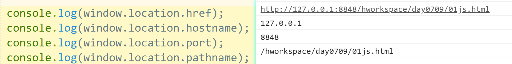
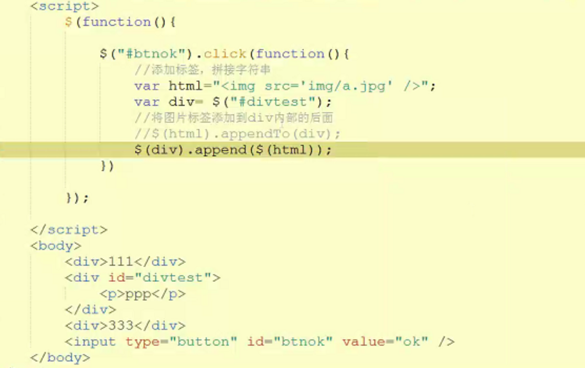

# 索引

1. typeof()；
2. alert();
3. console.log();
4. document.write();
5. onload;
6. onclick；
7. document;
8. location;
9. history;
10. console;
11. window.location.href;
12. window.location.hostname;
13. window.location.port;
14. window.location.pathname;
15. prompt(text,defaultText);
16. confirm(message) ;
17. setTimeout()；
18. clearTimeout()；
19. setInterval()；
20. clearInterval()；
21. innerHTML;
22. parentNode;
23. childNodes;
24. attributes;
25. getElementById();
26. getElementsByTagName();
27. getElementsByClassName();
28. `appendTo();`外部指定元素之后
29. `append();`外部指定元素之后
30. `prependTo();`外部指定元素之前
31. `prepend();`外部指定元素之后前
32. `insertBefore(newItem,existingItem);`内部指定元素之前
33. `appendChild(newNode);`内部所有元素之后
34. removeChild(childNode);
35. replaceChild(newNode,oldNode);
36. createAttribute();
37. createElement();
38. createTextNode();
39. getAttribute();
40. setAttribute();
41. click();
42. prop();
43. attr();
44. each();
45. this;
46. onmouseover;
47. onmouseout ;
48. test();
49. match();
50. onsubmit;
51. submit();
52. html();
53. css();
54. mouseover();
55. mouseout();
56. attr();
57. domObj=jQueryObj[0];
58. jQueryObj=$("#divtest");
59. bind();
60. unbind();
61. toggleClass();
62. removeClass();
63. addClass();
64. val();
65. value;
66. focus();
67. blur();
68. className;
69. text();
70. innerText();
71. insertAfter();
72. remove();
73. parent();
74. $("#divtest").get(0);
75. prevAll()；
76. siblings()；

# JavaScript

## JS概述

javascript：由网景公司开发，一种客户端动态脚本语言，由浏览器解释执行，不需要编译器，通过js可以使页面产生动态交互的效果，但功能有限，不能和数据库交互，不能连接数据库。

jQuery：实质为js的库，是对js的封装，底层仍是js。

Javaweb：和服务器产生动态交互，使用java语言访问数据库。

## JS核心组成

**ECMAScript**

欧洲计算机制造商协会，国际组织，定制标准 目前流行ES6，我们入门的语法以ES5

**DOM**

Document Object Model 文档对象模型

 一个HTML文件就是一个对象

HTML文档中每个标签也是一个对象

我们要操作页面的元素（标签），通过属性和方法进行操作


**BOM**

 Browser Object Model 浏览对象模型

 BOM包含DOM

 BOM就是浏览器对象，在JS中对应window对象，是JS的顶层对象

 


## JS的功能

动态改变客户端页面效果

页面添加、删除，修改内容

修改样式: 隐藏、显示、 按钮禁用启用

表单数据，输入验证


## JS引用方式

1、内嵌引入，在<head>标签下添加<script>标签，在<script>标签内书写代码。

````html
<head>
	<meta charset="UTF-8">
	<meta http-equiv="X-UA-Compatible" content="IE=edge">
	<meta name="viewport" content="width=device-width, initial-scale=1.0">
	<title>Document</title>
	<script type="text/javascript">
	// window是最定层对象，可以省略window
		window.alert("提示");
		alert('第二次提示');
	</script>
</head>
````

2、外部文件引入，js代码定义到.js文件中，通过<csript></csript>标签。

````html
<!DOCTYPE html>
<html> 
    <head>
        <meta charset="utf-8" />
        <title></title>
        <!--成对标签，中间没有内容，可以直接结束，script标签引用js文件，不能直接结束-->
        <script type="text/javascript" src="js/test.js" >
        </script>
        <!--外部引用和内嵌引用，分开写-->
        <script type="text/javascript">
            alert("内嵌提示框");
        </script>
    </head>
    <body>
        页面内容
        <a href="#">aaa</a>
        <iframe src=""/>
        <a name="mytag" />
    </body>
</html>
````

注意：当同时使用内嵌引入和文件引入的样式时，两个<script>标签要分开单独写，不能写在一起。


3、行内引入，直接在标签的属性上添加。

````html
<body>
	<a href="javascript:alert('超链接点击弹框')">link</a>
</body>
````

`a标签要绑定方法必须javascript:+方法();`

`给事件绑定方法：javascript:+方法()或直接写方法();`

## 基本语法

## **1、变量声明**

js是弱数据类型的语言，声明变量不需要指定类型，直接用var，也可以省略var

隐式定义：直接给变量赋值。
显式定义：使用var关键字定义变量。

js支持变量类型自动转换。

````javascript
<script type="text/javascript">
            //Java是强数据类型的语言    int i;    i="aaa";
            //JS是弱数据类型的语言，声明变量使用var 
            var a=1;
            console.log("a="+a);
            var s="abc";
            console.log("s="+s);
            //声明变量也可以不用var
            d=1.1;
            console.log("d="+d);
            var i=123;
            console.log("i="+i);
            i="abc";
            console.log("i="+i);
            var t=1;
            console.log("t="+t);
            var t=2;
            console.log("t="+t);
</script>
````

ES5允许重复变量的存在；允许跨域（代码块）使用变量。

````javascript
var a=3.14;
console.log(a);
var a=6;
console.log(a);


{
    var b=
;}
console.log(b);
````

ES6使用`let`声明变量，不允许重复变存在；不允许跨域（代码块）使用变量。

````js
<script type="text/javascript">
    //let是ES6扩展语法,不能定义同名变量
//            let a=1;
//            console.log("a="+a);
//            let a=1;
//            console.log("a="+a);
    {
        var b=1;
        console.log("b="+b);
    }
    console.log("b="+b);
</script>
````

JS语法松散，建议尽量遵循java规范编写代码

## 2、数据类型

JS中数据类型分为两类： 基本数据类型 + 引用数据类型

**1.基本数据类型** ----- 直接在栈内存中保存数据值，按值访问。

 有5种：**String字符串**、**Number数字**、 **Boolean布尔值**、**Undefined**、**Null** 

> **数值类型**：包含整数或浮点数。 
>
> **布尔类型**：只有true或false两个值。
>
> **字符串类型**：字符串变量必须用引号括起来，引号可以是单引号，也可以是双引号。
>
> **undefined类型**：专门用来确定一个已经创建但是没有初值的变量(初值可以为具体的值或者为null)。
>
> **null类型**：用于表明某个变量的值为空。


**==和\=\==区别**:

== 代表相同， \=\==代表严格相同。当进行双等号比较时候： 先检查两个操作数数据类型，如果相同， 则进行\=\==比较， 如果不同， 则愿意为你进行一次类型转换， 转换成相同类型后再进行比较， 而===比较时， 如果类型不同，直接就是false.

**2.引用数据类型** ----- 变量保存的是内存地址(对象的引用)，访问时访问的也是内存地址（相当于指针，在各自的内存地址里存储了数据）


var推断类型，变量在声明的时候没有一个具体的类型，类型是根据值的变化自动变化的。可以通过`typeof()`函数查看变量类型。

````js
<script type="text/javascript">
        var a=1;
        console.log("a="+a+",type:"+typeof(a));
        a=1.1;
        console.log("a="+a+",type:"+typeof(a));
        a=true;
        console.log("a="+a+",type:"+typeof(a));
        a="aaa";
        console.log("a="+a+",type:"+typeof(a));
        a=null;
        console.log("a="+a+",type:"+typeof(a));
        a=[1,2,3];
        console.log("a="+a+",type:"+typeof(a));
        console.log("a[0]="+a[0]+",type:"+typeof(a[0]));
        a=new Date();
        console.log("a="+a+",type:"+typeof(a));
        var b;
        console.log("b="+b+",type:"+typeof(b));
</script>
````


````javascript
var a="fadag";
console.log(typeof(a));
或
console.log(typeof a);
````

js中数组的类型是object，对象。

**3、常用方法**

alert();

console.log();

document.write();向页面中添加内容，普通文本直接显示，标签文本展示渲染结果。

````javascript
<script type="text/javascript">
		// window是最顶层对象，可以省略window
		//弹框输出
		// window.alert("提示");
		alert('第二次提示');
		
		// 控制台输出
		console.log("控制台输出");
		//window.console.log("控制台输出");

		//调用doucument对象的方法，doucment为系统内置对象，浏览器创建，不需要自行创建，在文档（浏览器）页面添加内容
		document.write("页面输出 <br>");
		document.write("页面输出2");
	//	window.document.write("页面输出2");

		//声明变量未赋值
		var b;
		console.log(b);
	</script>
````

`通过js向页面添加标签`

````javascript
<script>
        document.write('<p> javascripe</p>')；
        document.write("<table border='1'><tr><td>hello</td><td>world</td></tr></table>");
</script>
````

# window.onload

该方法用于在网页加载完毕后立刻执行的操作，即当html加载完毕后，立刻执行某个方法等。因为页面中的代码一般情况下按照从上到下，从左到右的顺序执行。所以当js代码需要获取页面中的元素时，如果script标签在元素的前面，需要加window.onload；如果script放在了元素后面，就不需要加 window.onload。

# 函数

## 函数定义与调用

````javascript
<script>
    //定义函数：
    function 函数名(){
	函数体；
	}

	//调用函数
	函数名();
</script>
````

````html
<!DOCTYPE html>
<html>
    <head>
        <meta charset="utf-8" />
        <title></title>
        <script type="text/javascript">
            /*定义函数
                 function 函数名(){
                     //函数体
                 }
             */
            function test(){
                alert("test函数");
            }
        </script>
    </head>
    <body>
        页面内容<br/>
        <!--缺点：不能复用；复杂的逻辑代码不方便-->
        <input type="button" onclick="javascript:alert('提示框1');" value="btn"/>
        <!--给事件绑定方法-->
        <input type="button" onclick="test()" value="btn1"/>
        <input type="button" onclick="test()" value="btn2"/>
        <!-- 绑定方法一定要() -->
        <input type="button" onclick="test" value="btn3"/>
    </body>
</html>
````

`在标签内为事件绑定方法，方法需要保留括号。`

定义并调用初始化函数

```html
<!DOCTYPE html>
<html>
    <head>
        <meta charset="utf-8" />
        <title></title>
        <script type="text/javascript">
            /*定义方法*/
            function init(){
                alert("网页初始化");
            }
        </script>
    </head>
    <!--onload页面初始化事件-->
    <body onload="init()">
        页面内容<br/>
    </body>
</html>
```

````html
<!DOCTYPE html>
<html>
    <head>
        <meta charset="utf-8" />
        <title></title>
        <script type="text/javascript">
            /*定义方法*/
            function init(){
                alert("网页初始化");
            }
            /*给窗体绑定初始化事件处理方法*/
            //window.onload=init();
            window.onload=init;
        </script>
    </head>
    <body>
        页面内容<br/>
    </body>
</html>
````

## 匿名函数

匿名函数定义

````javascript
window.onload=function(){
    方法体；
}
````

````js
<script type="text/javascript">
    /*使用匿名函数绑定事件，无法重用。js和jQuery中匿名函数用的很多*/
    window.onload=function(){
        alert("窗体初始化2")
    };
</script>
````

立即执行函数

````javascript
(function(){
    方法体；
}) ();
````

注意：自定义方法时，函数名可能和系统函数重名，发生冲突，在调用函数时可能调用了系统的函数而非自定义的函数，所以推荐使用匿名函数；在定义函数可以在方法体第一句添加弹框函数，判读是否引用成功，函数执行不正确可以首先考虑是否命名冲突，尝试修改函数名。

> 1、HTML 大小写不敏感，不区分大小写，也就是说大小写都不影响。但根据W3C的规范写法，一般使用小写。
>
> 2、CSS大小写不敏感，也不区分大小写。但根据W3C的规范写法，一般使用小写。
>
> 3、JavaScript 对大小写非常敏感，一定要区分大小写。


JS函数通常与事件联用。

注意：`在标签内为事件绑定方法(函数)时，方法要加括号，在<script></script>标签中为时间绑定方法时不能加括号`。

JS中函数的定义与调用顺序没有先后顺序


## 有参有返回值函数

定义带参数的方法，直接写形参名，不需要变量声明var ；

若有返回值，直接在方法体中用return，方法声明不需要写返回值类型

```html
<!DOCTYPE html>
<html>
    <head>
        <meta charset="utf-8" />
        <title></title>
        <script type="text/javascript">
            /*定义带参数的方法，直接写形参名，不需要变量声明var
              返回值，直接在方法体中用return，方法声明不需要写返回值类型
             */
            function add(a,b){
                //alert(a+b);
                return a+b;
            }
            function test(){
                alert("test:"+add(1,2));
            }
        </script>
    </head>
    <body>
        <input type="button" onclick="test()" value="ok"  />
    </body>
</html>
```

````html
<!DOCTYPE html>
<html>
    <head>
        <meta charset="utf-8" />
        <title></title>
        <script type="text/javascript">
            /*定义带参数的方法，直接写形参名，不需要变量声明var
              返回值，直接在方法体中用return，方法声明不需要写返回值类型
             */
            function add(a,b){
                alert(parseInt(a)+parseInt(b));
            }
        </script>
    </head>
    <body>
        <input type="button" onclick="add(prompt('输入'),prompt('输入'))" value="ok"  />
    </body>
</html>
````

# BOM

## window对象

常见window对象属性有document、location、history、console等。

**location**

```js
<script type="text/javascript">
            function test(){
                /*获取浏览器的范围地址*/
                console.log(window.location.href);
                console.log(window.location.hostname);
                console.log(window.location.port);
                console.log(window.location.pathname);
                /*修改属性值*/
                //location.href="index.html";
                //window.location.href="http://www.baidu.com";
            }
</script>
```



## window对象方法

> **`alert() -------提示框`**
>
> **`prompt() ----输入框`**
>
> 
>
> **`confirm() ----确认框`**
>
> 
>
> **定时器方法：**
>
> `setTimeout()；`
>
> `clearTimeout()；`
>
> `setInterval()；`
>
> `clearInterval()；`

```html
<!DOCTYPE html>
<html>
    <head>
        <meta charset="utf-8" />
        <title></title>
        <script type="text/javascript">
            function del(){
                //删除操作一定要确认,点击确认返回true,点击取消返回false
                if(confirm("确认删除？")){
                    alert("执行删除操作");
                }
            }
        </script>
    </head>
    <body>
        <input type="button" onclick="del()" value="删除"  />
    </body>
</html>
```

## DOM常用属性


## DOM常用方法


```
document.getElementById(id)；
document.getElementsByTagName(tagname)；
document.getElementsByClassName("example");
document.getElementById("myList").appendChild(newListItem);
replaceChild(newnode,oldnode);
removeChild(list.childNodes[0]);
document.getElementById("myList").appendChild(newListItem);
document.getElementById("myList").insertBefore(newItem,existingItem);

var att=document.createAttribute("class");
att.value="democlass";
document.getElementsByTagName("H1")[0].setAttributeNode(att);

var btn=document.createElement("BUTTON");
document.createTextNode("Hello World");
document.getElementsByTagName("a")[0].getAttribute("target");
document.getElementsByTagName("INPUT")[0].setAttribute("type","button");
```


1、`write()；`

2、`getElementById() `：据ID获取唯一的标签，返回一个元素，同一个页面所有标签的id 不能重复

```html
<!DOCTYPE html>
<html>
    <head>
        <meta charset="utf-8" />
        <title></title>
        <script type="text/javascript">
            function test(){
                //DOM的思想：每个标签都是一个对象，JS中提供了查找标签对象的方法，
                //找到一个标签就可以使用对应的属性和方法来操作他
//                var divtag = document.getElementById("div1");
//                divtag.innerHTML="aaa";
                console.log(document.getElementById("div1").innerHTML);
                document.getElementById("div1").innerHTML="aaa";
                console.log(document.getElementById("div1").innerHTML);
            }
        </script>
    </head>
    <body>
        <div id="div1">111</div>
        <div id="div2">222</div>
        <div id="div2">333</div>
        <input type="button" onclick="test()" value="ok"  />
    </body>
</html>
```

3、`getElementsByTagName() `：根据标签名查找页面元素，返回数组

```html
<!DOCTYPE html>
<html>
    <head>
        <meta charset="utf-8" />
        <title></title>
        <script type="text/javascript">
            function test(){
                var items=document.getElementsByTagName("div");
                /*遍历数组*/
                for(var i=0;i<items.length;i++){
                    var item=items[i];
                    //console.log(item.innerHTML);
                    item.innerHTML=item.innerHTML+"---"+(i+1);
                }
            }
        </script>
    </head>
    <body>
        <div id="div1">111</div>
        <div id="div2">222</div>
        <div id="div2">333</div>
        <input type="button" onclick="test()" value="ok"  />
    </body>
</html>
```

````html
<!DOCTYPE html>
<html>
    <head>
        <meta charset="utf-8" />
        <title></title>
        <script type="text/javascript">
            function test(){
                var name=document.getElementById("name");
//                console.log(name.type);
//                console.log(name.tagName);
//                name.value="用户名";
                name.type="password";
            }
        </script>
    </head>
    <body>
        用户名<input type="text" id="name" /><br/>
        密码<input type="password" id="pwd"/><br/>
        年龄<input type="text" id="age" /><br/>
        <input type="button" onclick="test()" value="ok"  />
    </body>
</html>
````

````html
<!DOCTYPE html>
<html>
    <head>
        <meta charset="utf-8" />
        <title></title>
        <script type="text/javascript">
            function test(){
                //获取所有的input标签
                var items= document.getElementsByTagName("input");
                for(var i=0;i<items.length;i++){
                    if(items[i].type!="button"){
                        items[i].value="aaa";
                    }
                }
            }
        </script>
    </head>
    <body>
        用户名<input type="text" id="name" /><br/>
        密码<input type="password" id="pwd"/><br/>
        年龄<input type="text" id="age" /><br/>
        <input type="button" onclick="test()" value="ok"  />
    </body>
</html>
````

4、`getElementsByName() `：根据name属性，获取相同name的所有元素，返回值为数组。(用于实现复选框特效)

## js事件与html事件关系

HTML 事件是发生在 HTML 元素上的事情。html有事件属性，如onclick等，指定了发生事件的类型。

当在 HTML 页面中使用 JavaScript 时， JavaScript 可以触发这些事件，实现具体事件的发生。

如html的onclick事件属性定义了鼠标点击事件，而当绑定具体的js方法后，可以实现鼠标点击是发生具体的事件，如改变标签样式、标签的内容等等。

## 复选框特效实现

全选按钮控制其他复选框是否全部选择或者不选


反选选功能

单独点击每个选项时，也应该影响全选按钮

```	html
<!DOCTYPE html>
<html lang="">

	<head>
		<meta charset="UTF-8">
		<meta http-equiv="X-UA-Compatible" content="IE=edge">
		<meta name="viewport" content="width=device-width, initial-scale=1.0">
		<title>Document</title>
		<script src="js/jquery-2.1.4.js" type="text/javascript" charset="utf-8"></script>
		<script>
			window.onload = function() {

				// 全选
				// document.getElementById('ckAll').onclick = function() {
				// 	var arra = document.getElementsByName("radio");
				// 	for (var i = 0; i < arra.length; i++) {
				// 		arra[i].checked = document.getElementById("ckAll").checked;
				// 	}
				// }

				$("#ckAll").click(function() {
					$("input[name]").prop("checked", $('#ckAll').prop('checked'));
				});

				// 反选
				// document.getElementById('inverSlect').onclick = function() {
				// 	var arra = document.getElementsByName('radio');
				// 	var count = 0;
				// 	for (var i = 0; i < arra.length; i++) {
				// 		arra[i].checked = !arra[i].checked;
				// 	}
				// traversal();
				// }

				$("#inverSlect").click(function() {
					$("input[name]").each(function() {
						$(this).prop("checked", !$(this).prop("checked"));
					});
					traversal();
				});

				//单选影响全选
				// var arra = document.getElementsByName("radio");
				// for (var i = 0; i < arra.length; i++) {
				// 	arra[i].onclick = traversal;
				// }

				$("input[name]").each(function() {
					$(this).click(traversal);
				});

				// function traversal() {
				// 	var arras = document.getElementsByName("radio");
				// 	var counts = 0;
				// 	for (var j = 0; j < arras.length; j++) {
				// 		if (arras[j].checked) {
				// 			counts++;
				// 			console.log(j);
				// 		}
				// 		console.log(j);
				// 	}
				// 	if (counts == arras.length) {
				// 		document.getElementById("ckAll").checked = true;
				// 	} else {
				// 		document.getElementById("ckAll").checked = false;
				// 	}
				// }

				function traversal() {
					var count = 0;
					$("input[name]").each(function() {
						if ($(this).prop("checked") == true) {
							count++;
						}
					});
					if (count == $("input[name]").length) {
						$("#ckAll").prop("checked", true);
					} else {
						$("#ckAll").prop("checked", false);
					}
				}
				
			}
		</script>
	</head>

	<body>
		<input type="checkbox" id="ckAll">全选 <br>
		<input type="checkbox" name="radio"><br>
		<input type="checkbox" name="radio"><br>
		<input type="checkbox" name="radio"><br>
		<input type="checkbox" name="radio"><br>
		<input type="button" value="反选" id="inverSlect">
	</body>

</html>

```


# 定时器

> `setTimeout()是延时器`。setTimeout(表达式,延时时间)在执行时,是在载入后延迟指定时间后,去执行一次表达式，整个过程只执行一次表达式。
>
> `setInterval()是定时器`。setInterval(表达式,交互时间)则不一样,它从载入后,每隔指定的时间就执行一次表达式。

## setTimeout()

setTimeout() 是属于 window 的方法，该方法用于在指定的毫秒数后调用函数或计算表达式。

语法格式可以是以下两种：

```js
setTimeout(要执行的代码, 等待的毫秒数)
setTimeout(JavaScript 函数, 等待的毫秒数)
```

setTimeout("alert('对不起, 要你久候')", 3000 );注意引号。

setTimeout(function(){ alert("Hello") }, 3000);


```html
<!DOCTYPE html>
<html>
    <head>
        <meta charset="utf-8" />
        <title></title>
        <script type="text/javascript">
            var num=0;
            var timer;
            function btnBegin(){
                document.getElementById("divNum").innerHTML=num;
                //定时器方法(要执行的方法,时间间隔):指定时间间隔，到了指定的时间间隔自动执行方法
                //一秒以后执行一次addNum()
                timer=setTimeout(addNum,1000);
                //setTimeout("addNum()",1000);
                //error:现在就执行
                //setTimeout(addNum(),1000);
                //error:无效
                //setTimeout("addNum",1000);
            }
            function addNum(){
                num++;
                document.getElementById("divNum").innerHTML=num;
                timer=setTimeout(addNum,1000);
            }
            function btnEnd(){
                clearTimeout(timer);
            }
            function btnClear(){
                num=0;
                document.getElementById("divNum").innerHTML=num;
            }
        </script>
    </head>
    <body>
        <div id="divNum">0</div>
        <input type="button" onclick="btnBegin()" value="开始计时"  />
        <input type="button" onclick="btnEnd()" value="关闭计时"  />
        <input type="button" onclick="btnClear()" value="清零计时"  />
    </body>
</html>
```

````html
<!DOCTYPE html>
<html>
    <head>
        <meta charset="utf-8" />
        <title></title>
        <script type="text/javascript">
//            
//            function init(){
//                alert("页面初始化");
//            }
//            
//            window.onload=init;
            function test(){
                alert("test");
            }
            window.onload=function(){
                document.getElementById("btntest").onclick=test;
            }
            //没有再初始化事件方法中，一定错误.JS和HTML从上往下执行，执行到这来还没有页面。
//            document.getElementById("btntest").onclick=test;
        </script>
    </head>
    <body>
        <div id="divNum">0</div>
        <input type="button" id="btntest" value="ok"  />
    </body>
</html>
````

都使用匿名函数

```html
<!DOCTYPE html>
<html>
    <head>
        <meta charset="utf-8" />
        <title></title>
        <script type="text/javascript">
            window.onload=function(){
                document.getElementById("btntest").onclick=function(){
                    alert("按钮点击");
                }
            }
        </script>
    </head>
    <body>
        <div id="divNum">0</div>
        <input type="button" id="btntest" value="ok"  />
    </body>
</html>
```

使用匿名函数实现计时器

```html
<!DOCTYPE html>
<html>
    <head>
        <meta charset="utf-8" />
        <title></title>
        <script type="text/javascript">
            var num=0;
            var timer;
            function addNum(){
                num++;
                document.getElementById("divNum").innerHTML=num;
                timer=setTimeout(addNum,1000);
            }
            window.onload=function(){
                document.getElementById("btnBegin").onclick=function(){
                    document.getElementById("divNum").innerHTML=num;
                    timer=setTimeout(addNum,1000);
                };
                document.getElementById("btnEnd").onclick=function(){
                    clearTimeout(timer);
                };
                document.getElementById("btnClear").onclick=function(){
                    num=0;
                    document.getElementById("divNum").innerHTML=num;
                };
            }
        </script>
    </head>
    <body>
        <div id="divNum">0</div>
        <input type="button" id="btnBegin" value="开始计时"  />
        <input type="button" id="btnEnd" value="关闭计时"  />
        <input type="button" id="btnClear" value="清零计时"  />
    </body>
</html>
```

## setInterval()

指定时间间隔，到了指定的时间，自动执行

```js
<!DOCTYPE html>
<html>
	<head>
		<meta charset="utf-8" />
		<title></title>js
		<script type="text/javascript">
			var num = 0;
			var timer;
			window.onload = function() {
				document.getElementById("btnBegin").onclick = function() {
					document.getElementById("divNum").innerHTML = num;
					timer = setInterval(function() {
						num++;
						document.getElementById("divNum").innerHTML = num;
					}, 1000);
				};
				document.getElementById("btnEnd").onclick = function() {
					clearTimeout(timer);
				};
				document.getElementById("btnClear").onclick = function() {
					num = 0;
					document.getElementById("divNum").innerHTML = num;
				};
			}
		</script>
	</head>
	<body>
		<div id="divNum">0</div>
		<input type="button" id="btnBegin" value="开始计时" />
		<input type="button" id="btnEnd" value="关闭计时" />
		<input type="button" id="btnClear" value="清零计时" />
	</body>
</html>

```

## 定时器显示系统时间

**setTimeout()显示系统时间**


注意：**`setTimeout(addNum,1000)中addNum不能加括号，加括号直接执行addNum()方法，而不是1s后执行。若要括号可以添加引号。`**


**setInterval()显示系统时间**


getElementsXXXX()方法返回值为数组，不能直接进行操作，只能对数组的元素操作。

innerHTML属性：修改标签中的内容，内容为标签则显示为标签；

````javascript
doucument.getElementsByTagName("").innerHTML=''<p>段落</P>'';
````

innerText属性：修改标签中的内容，内容为标签转译成文本显示，不显示标签效果；

````js
doucument.getElementsByTagName("").innerText=''<p>段落</P>'';
````


测试某个方法返回值类型：alert(document.getElementById("ckAll").disbald);

# JS操作标签


## 元素的隐藏显示

````css
img{
    /*隐藏*/
	display:none;
    /*行内显示*/
    display:inlin;
    /*块级显示*/
    display:block;
}
````

`dom操作标签的属性：dom对象.标签属性`

`dom操作标签的样式：dom对象.style.样式属性`

对于css中以含有“-”的样式属性名，在js中使用dom定位时要转换为驼峰样式的名字。

````js
如：background-color转换为backgroundColor

document.getElementById("div2").style.backgroungColor="red";
````

**JS控制元素隐藏**

````js
//元素隐藏，不占页面空间
document.getElementById("img2").stytle.display="none";

//元素不显示，仍占页面空间，不会脱离标准流
document.getElementById("img2").stytle.visibility="hidden";
````

**图片轮播实现**（移仓显示+定时器）


## JS操作标签属性

````js
//获取属性
getAttribute("属性名")；

//修改属性
setAttribute("属性名","属性值")
````

````html
        <script type="text/javascript">
            window.onload=function(){
                document.getElementById("btnok").onclick=function(){
//                    var img1=document.getElementById("img1");
//                    console.log(img1.src);
//                    img1.src="img/sixty2.jpg";
//                    console.log(img1.src);
                    //JS操作属性的标准方法
                    var img1=document.getElementById("img1");
                    console.log(img1.getAttribute("src"));
                    img1.setAttribute("src","img/sixty2.jpg");
                    img1.setAttribute("width","500px");
                    console.log(img1.getAttribute("src"));
                };
            }
        </script>
    </head>
    <body>
         
        <input type="button" value="ok" id="btnok" />
    </body>
````

## DOM 动态修改页面内容

**添加元素**

````js
//在元素内部前面添加元素
insertBefore();

//在元素内部后面添加元素
appendChild();
````

````js
//创造元素
createElement();
````

````html
<!DOCTYPE html>
<html>
    <head>
        <meta charset="utf-8" />
        <title></title>
        <style type="text/css">
        </style>
        <script type="text/javascript">
            window.onload=function(){
                document.getElementById("btnok").onclick=function(){
                    //创建一个标签，就是一个dom对象
                    var imgnew=document.createElement("img");
                    imgnew.setAttribute("src","img/sixty2.jpg");
                    var imgold=document.getElementById("imgold");
                    
                    //将imgnew添加到divtest层中imgold之前---divtest层内部之前
                    //document.getElementById("divtest").insertBefore(imgnew,imgold);
                    
                    //divtest层内部之后
                    document.getElementById("divtest").appendChild(imgnew);
                };
            }
        </script>
    </head>
    <body>
        <div id="divtest">
             
        </div>
        <input type="button" value="ok" id="btnok" />
    </body>
</html>
````

**删除元素**

删除子元素，要从待删除元素的直接父元素开始定位。

````js
removeChild();
````

````html
<!DOCTYPE html>
<html>
    <head>
        <meta charset="utf-8" />
        <title></title>
        <style type="text/css">
        </style>
        <script type="text/javascript">
            window.onload=function(){
                document.getElementById("btnok").onclick=function(){
                    document.getElementById("divtest")
                            .removeChild(document.getElementById("imgold"));
                };
            }
        </script>
    </head>
    <body>
        <div id="divtest">
             
             
        </div>
        <input type="button" value="ok" id="btnok" />
    </body>
</html>


/*
 <body>
         
         
        <input type="button" value="ok" id="btnok" />
</body>
 */
//document.body.removeChild(document.getElementById("imgold"));
````

**替换元素**

````js
replaceChild();
````

````js
<script type="text/javascript">
        window.onload=function(){
            document.getElementById("btnok").onclick=function(){
                var imgnew=document.createElement("img");
                imgnew.setAttribute("src","img/sixty2.jpg");
                var imgold=document.getElementById("imgold");
                document.getElementById("divtest").replaceChild(imgnew,imgold);
            };
        }
</script>
````

## DOM操作CSS

**在标签的事件中通过this关键字，控制样式**

this是JS中的关键字，代指当前类的dom对象，即this所在的标签。

> onmouseover：浮事件
> onmouseout ：标移除（离开）事件

````html
<body>
        <ul>
            <li onmouseover="this.style.background='url(img/bg2.gif)'" 
                onmouseout="this.style.background='url(img/bg1.gif)'">aaa</li>
            <li onmouseover="this.style.background='url(img/bg2.gif)'" 
                onmouseout="this.style.background='url(img/bg1.gif)'">bbb</li>
            <li onmouseover="this.style.background='url(img/bg2.gif)'" 
                onmouseout="this.style.background='url(img/bg1.gif)'">ccc</li>
        </ul>
    </body>
````


**函数中利用this控制样式**

````js
<script type="text/javascript">
    window.onload = function () {
        var items = document.getElementsByTagName("li");
        for (var i = 0; i < items.length; i++) {
            items[i].onmouseover = function () {
                this.style.background = 'url(img/bg2.gif)';
                //这里面不能使用items[i],由于使用var声明了变量i，此处的i一直为items.length，若用let声明i,则可以使用item[i]
            };
            items[i].onmouseout = function () {
                this.style.background = 'url(img/bg1.gif)';
            };
        }
    }
</script>
````

**将所有要修改的样式定义成类样式，直接利用this整体切换**

````html
<!DOCTYPE html>
<html>
    <head>
        <meta charset="utf-8" />
        <title></title>
        <style type="text/css">
            ul li{
                float: left;
                list-style: none;
                width: 103px;
                height: 33px;
                line-height: 33px;
                background: url(img/bg1.gif);
                color: white;
                text-align: center;
            }
            .liover{
                background: url(img/bg2.gif);
            }
            .liout{
                background: url(img/bg1.gif);
            }
        </style>
        <script type="text/javascript">
            window.onload=function(){
                var items=document.getElementsByTagName("li");
                for(var i=0;i<items.length;i++){
                    items[i].onmouseover=function(){
                        //将所有要修改的样式定义成类样式，直接整体切换
                        this.className="liover";
                    };
                    items[i].onmouseout=function(){
                        this.className="liout";
                    };
                }
            }
        </script>
    </head>
    <body>
        <ul>
            <li>aaaa</li>
            <li>bbba</li>
            <li>ccca</li>
        </ul>
    </body>
</html>
````

## 正则表达式

所有语言都支持正则表达式，主要用来做格式验证、数据验证。不同语言中格式有所不同。

**java正则表达式：**

````java
String regex="[0-1][3-6]";
第一位字符只能使0-1；
第二位字符只能是3-6；
    
String regex="[0-9][a-z]{3，6}";
第一位字符只能使0-9；
a-z范围内的字符至少出现3次，至多出现6次数（字符串长度在4-7）
````

标注正则表达式以^开头，以$结尾，但都可以省略。

[1-6]：在1-6范围内；

[^1-6]：不在1-6范围内；

Greedy 数量词 

*X*`?` *X*，一次或零次 	<=1

*X*`*` *X*，零次或多次 (含一次) >=0

*X*`+` *X*，一次或多次		>=1

 *`X{n}`* *X*，恰好 *n* 次

 X*`{n,}` *X*，至少 *n* 次

 *X*`{n,m}` *X*，至少 *n* 次，但是不超过 *m* 次

**JS正则表达式**

js正则表达式放在//中间，特殊字符不转译。

````js
<script type="text/javascript">
            //    正则表达式定义在//中间，特殊字符不转义
            var reg=/^\w+@\w+\.\w+$/;
            var str="abc@163.com";
            //正则.test(匹配字符)    布尔值
            console.log(reg.test(str));
            //str.match(正则)        匹配，输出结果；不匹配null
            console.log(str.match(reg));
</script>
````


## 数据验证

表单提交数据，服务器处理数据之前一定要做数据验证。数据验证有三种：

1、前端验证：使用JS和jQuery验证，验证不通过，数据不会提交，减轻服务器压力

2、后端验证：JavaWeb中使用服务端的Java代码进行验证，验证不通过，服务器不会做后续处理

3、AJAX验证：前端+后端

前端验证不安全，可以伪造，如浏览器js禁用，所以必须还要经服务器验证，但可以减轻服务器的压力。

**验证实例**

`onsubmit`提交事件：绑定方法返回值为true则提交，返回false不提交。

````html
<!DOCTYPE html>
<html>
	<head>
		<meta charset="utf-8">
		<title></title>
		<script type="text/javascript">
			//用户名输入、长度判读
			function validatename(){
				var name=document.getElementById('name').value;
				if(name==""){
					document.getElementById("errorname").innerHTML="用户名不能为空";
					return false;
				}else{
					document.getElementById("errorname").innerHTML="";
				}
				if(name.length<3||name.length>5){
					document.getElementById("errorname").innerHTML="用户名长度为3-5位";
					return false;
				}else{
					document.getElementById("errorname").innerHTML="";
				}
				return true;
			}
			//密码输入、长度判断
			function validatepwd(){
				var pwd=document.getElementById("pwd").value;
				if(pwd==''){
					document.getElementById("errorpwd").innerHTML="密码不能为空";
					return false;
				}else{
					document.getElementById("errorpwd").innerHTML="";
				}
				if(pwd.length<6||pwd.length>15){
					document.getElementById("errorpwd").innerHTML="密码长度为6-15位";
					return false;
				}else{
					document.getElementById("errorpwd").innerHTML="";
				}
				return true;
			}
			//确认密码判断
			function validateispwd(){
				var pwd=document.getElementById("pwd").value;
				var ispwd=document.getElementById("ispwd").value;
				if(ispwd==""){
					document.getElementById("errorispwd").innerHTML="请再次输入密码";
					return false;
				}
				if(pwd!=ispwd){
					document.getElementById("errorispwd").innerHTML="密码不一致，请重新输入";
					return false;
				}else{
					document.getElementById("errorispwd").innerHTML="";
				}
				return true;
			}
			//邮箱格式判断
			function validatemail(){
				var email=document.getElementById("email").value;
				if(email==""){
					document.getElementById("erroremail").innerHTML="邮箱不能为空";
					return false;
				}else{
					document.getElementById("erroremail").innerHTML="";
				}
				var regex=/^\w+@\w+\.\w+$/;
				if(regex.test(email)==false){
					document.getElementById("erroremail").innerHTML="邮箱格式不正确，请重新输入";
					return false;
				}else{
					document.getElementById("erroremail").innerHTML="";
				}
				return true;
			}
			function validate(){
				return validatename()&&
                			validatepwd()&&
                			validateispwd()&&
                			validatemail();
			}
		</script>
	</head>
	<body>
        <!--onsubmit事件绑定方法，这个方法返回ture提交，返回false不提交。"return validate()"中的return可以不写-->
		<form action="server.html" method="get" onsubmit="return validate()">
			姓名:<input type="text" name="name" id="name"/>
            <span id="errorname"></span><br>
			密码:<input type="password" name="pwd" id="pwd"  />
            <span id="errorpwd"></span><br>
			确认密码:<input type="password" name="ispwd" id="ispwd"/>
            <span id="errorispwd"></span><br>
			邮箱:<input type="text" name="email" id="email" />
            <span id="erroremail"></span><br>
			提交:<input type="submit"  value="提交" />
		</form>
	</body>
</html>
````

## submit提交

````html
<body>
		<form action="server.html" method="get" onsubmit="return validate()">
			姓名:<input type="text" name="name" id="name"/>
            <span id="errorname"></span><br>
			密码:<input type="password" name="pwd" id="pwd"  />
            <span id="errorpwd"></span><br>
			确认密码:<input type="password" name="ispwd" id="ispwd"/>
            <span id="errorispwd"></span><br>
			邮箱:<input type="text" name="email" id="email" />
            <span id="erroremail"></span><br>
			提交:<input type="submit"  value="提交" />
		</form>
	</body>
````

## button提交

使用button提交，必须给button绑定点击事件，通过点击button，表单(form)调用submit()，从而提交。但无法使用onsubmit进行表单验证，可以在点击事件中自己定义验证。

````html
<!DOCTYPE html>
<html>
	<head>
		<meta charset="utf-8">
		<title></title>
		<script type="text/javascript">
			//用户名输入、长度判读
			function validatename(){
				var name=document.getElementById('name').value;
				if(name==""){
					document.getElementById("errorname").innerHTML="用户名不能为空";
					return false;
				}else{
					document.getElementById("errorname").innerHTML="";
				}
				if(name.length<3||name.length>5){
					document.getElementById("errorname").innerHTML="用户名长度为3-5位";
					return false;
				}else{
					document.getElementById("errorname").innerHTML="";
				}
				return true;
			}
			//密码输入、长度判断
			function validatepwd(){
				var pwd=document.getElementById("pwd").value;
				if(pwd==''){
					document.getElementById("errorpwd").innerHTML="密码不能为空";
					return false;
				}else{
					document.getElementById("errorpwd").innerHTML="";
				}
				if(pwd.length<6||pwd.length>15){
					document.getElementById("errorpwd").innerHTML="密码长度为6-15位";
					return false;
				}else{
					document.getElementById("errorpwd").innerHTML="";
				}
				return true;
			}
			//确认密码判断
			function validateispwd(){
				var pwd=document.getElementById("pwd").value;
				var ispwd=document.getElementById("ispwd").value;
				if(ispwd==""){
					document.getElementById("errorispwd").innerHTML="请再次输入密码";
					return false;
				}
				if(pwd!=ispwd){
					document.getElementById("errorispwd").innerHTML="密码不一致，请重新输入";
					return false;
				}else{
					document.getElementById("errorispwd").innerHTML="";
				}
				return true;
			}
			//邮箱格式判断
			function validatemail(){
				var email=document.getElementById("email").value;
				if(email==""){
					document.getElementById("erroremail").innerHTML="邮箱不能为空";
					return false;
				}else{
					document.getElementById("erroremail").innerHTML="";
				}
				var regex=/^\w+@\w+\.\w+$/;
				if(regex.test(email)==false){
					document.getElementById("erroremail").innerHTML="邮箱格式不正确，请重新输入";
					return false;
				}else{
					document.getElementById("erroremail").innerHTML="";
				}
				return true;
			}
			
			
			function validate(){
				return validatename()&&validatepwd()&&validateispwd()&&validatemail();
			}
			//验证提交
			window.onload=function(){
				document.getElementById("btn").onclick=function(){
					if(validate()){
						document.getElementById('form').submit();
					}
				}
			}
		</script>
	</head>
	<body>
		<form action="server.html" method="get" id="form" >
			姓名:<input type="text" name="name" id="name"/>
            <span id="errorname"></span><br>
			密码:<input type="password" name="pwd" id="pwd"  />
            <span id="errorpwd"></span><br>
			确认密码:<input type="password" name="ispwd" id="ispwd"/>
            <span id="errorispwd"></span><br>
			邮箱:<input type="text" name="email" id="email" />
            <span id="erroremail"></span><br>
			提交:<input type="button"  id="btn" value="提交" />
		</form>
	</body>
</html>
````

# JQuery

## jQuery概述

jQuery就是JS的封装库，底层就是JS实现的，JS能做到Query都能做，jQuery实现同样的功能但更简单，jQuery虽然是js的分装库，但语法体系与JS不同。

JS操作CSS属性，属性名需要做驼峰转换，jQuery不需要做转换，转换了也可以正常使用。

## jQuery基本使用

**1、引入库文件**

​	本地文件引入

​	远程地址引入


jquery.js 开发阶段使用，便于学习

jquery.min.js 生成环境使用，删除上面文件中多余的空格，换行，注释。文件小，项目正式上线，服务器上使用。

````js
$(function(){

});

相当于：

winddow.onload=function(){
}
用于初始化页面，jQuery的初始化比js的初始化更早执行（顺序无关），且可以写多个初始化代码块，而js只能写一个。

旧版本的jQuery，jQuery初始化比js初始化先执行，新版本刚好相反。

js初始化：即页面所有标签加载完成（img标签图片下载完成），初始化中的代码开始执行
jquery初始化：只需页面所有标签加载完成（img标签图片无需下载完成），初始化中的代码开始执行
````

## jQuery代码结构

````js
<script type="text/javascript">
            //$(function(){});
            //初始化执行的更早，页面标签相关的内容加载完以后就会执行
            //一个页面可以定义多个
            //window.onload
            //初始化执行的晚，等待资源全部加载完成才会执行
            //一个页面只能定义一个，如果有多个，后面的覆盖前面的
            $(function(){
                alert("jQuery初始化1");
            });
            $(function(){
                alert("jQuery初始化2");
            });
            window.onload=function(){
                alert("js初始化1");
            }
            window.onload=function(){
                alert("js初始化2");
            }
</script>
````

jQuery中的关键子$就是jQuery的简写,初始化语句`$(function(){});`为简略写法，完整写法为`$(document).ready(function(){});`

````js
<script type="text/javascript">
			window.onload=function(){
				alert("js页面初始化");
			}
			//js初始化写法
			$(function(){
				alert("jquery页面初始化");
			});
			
			//$即jQuery
			jQuery(function(){
				alert("$即jquery");
			});
			
			//完整初始化写法
			jQuery(document).ready(function(){
				alert("jquery完整写法");
			});
</script>
````

## jQuery语法

````js
$(选择器).方法();
````

选择器就是满足条件的标签

`$(选择器)---工厂方法：将dom对象转换成jQuery对象`

js中的属性，方法在jQuery中都转换为方法。js中可以写jQuery，jQuery中也可以写js,但注意不能混用对象，jQuery对象必须对应jQuery方法，js对象对应js方法或属性。


## jQuery常用方法

### 1、`click();`


### 2、`html();`

取值：

html() 方法来获取任意一个元素的内容。 如果选择器匹配多于一个的元素，那么只有第一个匹配元素的 HTML 内容会被获取。(获取多个匹配元素内容需要结合each()遍历)。

设置值：

```js
//设置所有 p 元素的内容（）
$("p").html("Hello <b>world</b>!");


//使用函数来设置所有匹配元素的内容。
$(selector).html(function(index,oldcontent))
如：
<html>
<head>
<script type="text/javascript" src="/jquery/jquery.js"></script>
<script type="text/javascript">
$(document).ready(function(){
  $("button").click(function(){
    $("p").html(function(n){
    return "dfdsgd";
    });
  });
});
</script>
</head>
<body>
<p>这是一个段落。</p>
<p>这是另一个段落。</p>
<button>改变 p 元素的内容</button>
</body>
</html>
```

3、css();

4、mouseover();

5、mouseout();

### 6、attr();

attr() 方法设置或返回被选元素的属性和值。

当该方法用于**返回**属性值，则返回第一个匹配元素的值。

当该方法用于**设置**属性值，则为匹配元素设置一个或多个属性/值对。

返回属性的值：

````js
$(selector).attr(attribute)
````

设置属性和值：

````js
$(selector).attr(attribute,value)
````

设置多个属性和值：

````js
$(selector).attr({attribute:value, attribute:value,...})
````

使用函数设置属性和值：

````js
$(selector).attr(attribute,function(index,currentvalue))
````


````html
          <!DOCTYPE html>
<html>
<head>
<meta charset="utf-8">
<title>入门小站(rumenz.com)</title>
<script src="https://cdn.staticfile.org/jquery/1.10.2/jquery.min.js">
</script>
<script>
$(document).ready(function(){
	$("button").click(function(){
		$("img").attr("width",function(n,v){
			return v-50;
		});
	});
});
</script>
</head>
<body>

<br>
<button>图像宽度减少50 px</button>
</body>
</html>
````

https://rumenz.com/demo/tryjquery_html_attr_set_func.html

## jQuery对象与js对象转换

### jQuery对象转dom对象

````js
<script type="text/javascript">
            window.onload=function(){
            }
            //dom对象调用dom的方法，jQuery使用jQuery方法
            //这是两套语法，不能混用
            $(document).ready(function(){
                $("#btnok").click(function(){
                    var jQueryObj=$("#divtest");
                    //jquery对象转成dom对象
                    var domObj=jQueryObj[0];
                    domObj.innerHTML="bbb";
                });
            });
</script>
````


### dom对象转jQuery对象

````js
<script type="text/javascript">
    window.onload=function(){
    }
    //dom对象调用dom的方法，jQuery使用jQuery方法
    //这是两套语法，不能混用
    $(document).ready(function(){
        $("#btnok").click(function(){
//                    var jQueryObj=$("#divtest");
//                    //jquery对象转成dom对象
//                    var domObj=jQueryObj[0];
//                    domObj.innerHTML="bbb";
            var domObj=document.getElementById("divtest");
            //dom对象转成jquery对象
            var jQueryObj=$(domObj);
            jQueryObj.html("ddd");
        });
    });
</script>
````


## 链式编程

````js
<script type="text/javascript">
    $(function(){
     //常规写法
        $("#divtest").mouseover(function(){
            $(this).css("background","red");
        })；
         $("#divtest").mouseout(function(){
            $(this).css("background","white");
        });
        //链式编程
        $("#divtest").mouseover(function(){
            $(this).css("background","red");
        }).mouseout(function(){
            $(this).css("background","white");
        });
    });
    $("#divtest").css("border","1px solid red").css("background","blue");
</script>
````


## 自动迭代

1、jQuery部分方法可以自动循环。如css()、mouseover()、mouseout()等，有的方法不能自动循环，需要借助each()方法实现。

````js
<script type="text/javascript">
    $(function(){
//                var items= document.getElementsByTagName("div");
//                for(var i=0;i<items.length;i++){
//                    items[i].style.color="red";
//                }
        //自动循环
        $("div").css("color","blue");
        $("div").mousemove(function(){
            $(this).css("background","gray");
        }).mouseout(function(){
            $(this).css("background","white");
        });
    });
</script>
````


2、借助each()方法实现循环

````js
<script type="text/javascript">
    $(function(){
        $("div").each(function(){
            console.log(this.innerHTML);
            console.log($(this).html());
        });
        //$("div").css("background","gray");
        $("div").each(function(){
            $(this).css("background","blue");
        });
    });
</script>
````


3、可以自动循环的方法也可以使用each()方法，但没必要。


4、匿名函数带有参数

````js
<script type="text/javascript">
        $(function(){
            //循环函数有两个参数:第一个是下标，第二个就是当前对象this
            $("div").each(function(i,obj){
                console.log(i);
                console.log($(obj).html());
                console.log($(this).html());
                console.log(this==obj);
            });
        });
    </script>
</head>
<body>
    <div>aaaa</div>
    <div>bbbb</div>
    <div>cccc</div>
    <input type="button" id="btnok" value="ok"/>
</body>
````


5、图片循环

````js
<script type="text/javascript">
        $(function(){
            $("img").each(function(i){
                //this.setAttribute("src","img-"+(i+1)+".jpg");
                //this.src="img-"+(i+1)+".jpg";
                $(this).attr("src","img-"+(i+1)+".jpg");
            });
        });
</script>
````


# 选择器

## 常用选择器总结

1、id选择器

````js
$("#id")
````

2、标签选择器

````js
$("h2");
````

3、类选择器

````js
$(".className");
````

4、通配符选择器*，匹配所有元素

````js
$("*")
````

5、交集选择器

````js
$("p.red");
````

6、并集选择器

````js
$("h1,h2,p");
````

7、后代选择器

````js
$("#far span");
````

8、子元素选择器

````js
$("#far > p");
````

9、直接兄弟元素选择器：后面紧挨的第一个兄弟

````js
$("lable + input");
````

10、后续兄弟选择器：后面的所有兄弟

````js
$("lable ~ inpit");
````

11、属性选择器

````js
$("[id]");
//所有有id的标签

$("span[id]");
//有id属性的span标签

$("[id=red]");
//id为red的标签

$("li[id*=red]");
//id名中含有red的li标签

$("li[id^=red]");
//id名以red开头的li标签

$("li[id$=red]");
//id名以red结尾的li标签

$("li[id!=red]");
//id名不为red的li标签（注意是id名不为red，而非id名不含red）
````

12、过滤选择器

````js
$("li:first");
//获取第一个li元素

$("li:last");
//获取最后一个li元素

$("li:even");
//匹配所有索引值为偶数的li元素，从 0 开始计数

$("li:odd");
//匹配所有索引值为奇数的li元素，从 0 开始计数

$("li:eq(1)");
//匹配一个给定索引值(1)的li元素

$("li:gt(1)");
//匹配所有大于给定索引值(1)的li元素

$("li:lt(1)");
//匹配所有小于给定索引值(1)的li元素

:not(selector)
//去除所有与给定选择器匹配的元素
$("li:not(.three)");
//选择类名不为three的所有li标签
$("div:not([id])");
//选择没有id的所有div标签


$("li:.three");
//错误语法，无此语法
````

13、表单选择器

````js
$(":input");
//选择所有input, textarea, select 和 button 元素
````

14、表单对象属性属性选择器

````js
$("input:enabled");
//选择未禁用input标签；

$("input:disabled");
//选择不可用的input标签

$("input:checked");
//匹配所有的被选中元素(复选框、单选框等，不包括select中的option)

$("select option:selected");
//匹配所有选中的option元素
````

## 基本选择器

````html
<!DOCTYPE html PUBLIC "-//W3C//DTD HTML 4.01 Transitional//EN" "http://www.w3.org/TR/html4/loose.dtd">
<html>
<head>
<meta http-equiv="Content-Type" content="text/html; charset=UTF-8">
<title>jQuery基本选择器示例</title>
<style type="text/css">
#box {background-color:#FFF; border:2px solid #000; padding:5px;}
</style>
<script src="js/jquery-1.8.3.js" type="text/javascript"></script>
<script type="text/javascript">
    $(function(){
        $("h2").click(function(){
            //id选择器
            //$("#mydl").css("background","red");
            //类选择器
            //$(".title").css("background","red");
            //标签选择器
            //$("h3").css("background","red");
            //交集选择器
            //$("h3.title").css("background","red");
            //并集选择器，集体声明
            //$("h3,h2,.title").css("background","red");
            $("*").css("background","red");
        });
    });
</script>
</head>
<body>
    <div id="box"> id为box的div
        <h2 class="title">class为title的h2</h2>
         <h3 class="title">class为title的h3</h3>
          <h3>热门排行</h3>
          <dl id="mydl">
            <dt></dt>
            <dd class="title">斗地主</dd>
              <dd>休闲游戏</dd>
              <dd>QQ斗地主是国内同时在线人数最多的棋牌游戏......</dd>
          </dl>
    </div>
</body>
</html>
````

## 层次选择器

````html
<!DOCTYPE html PUBLIC "-//W3C//DTD HTML 4.01 Transitional//EN" "http://www.w3.org/TR/html4/loose.dtd">
<html>
<head>
<meta http-equiv="Content-Type" content="text/html; charset=UTF-8">
<title>jQuery层次选择器示例</title>
<style type="text/css">
* {margin:0; padding:0; line-height:30px;}
body {margin:10px;}
#menu {border:2px solid #03C; padding:10px;}
a {text-decoration:none; margin-right:5px;}
span {font-weight:bold; padding:3px;}
h2 {margin:10px 0;}
</style>
<script src="js/jquery-1.8.3.js" type="text/javascript"></script>
<script type="text/javascript">
    $(function(){
        $("h2").click(function(){
            //后代选择器
            //$("#menu span").css("background","red");
            //在给定的父元素下匹配所有的子元素
            //$("#menu > span").css("background","red");
            //匹配所有紧接在 prev 元素后的 next 元素
            //$("h2 + dl").css("background","red");
            //匹配 prev 元素之后的所有 siblings 元素
            //$("h2 ~ dl").css("background","red");
            //所有兄弟元素，使用方法
            $("h2").siblings().css("background","red");
        });
    });
</script>
</head>
<body>
    <div id="menu">
        <dl>
            <dt>北京周边旅游<span id="test">特价</span></dt>
            <dd><a href="#">按天数</a> <a href="#">海边旅游</a> <a href="#">草原</a></dd>
        </dl>
        <h2>全部旅游产品分类</h2>
        <dl>
            <dt>北京周边旅游<span id="test">特价</span></dt>
            <dd><a href="#">按天数</a> <a href="#">海边旅游</a> <a href="#">草原</a></dd>
        </dl>
        <dl>
            <dt>景点门票</dt>
            <dd><a href="#">名胜</a> <a href="#">暑期</a> <a href="#">乐园</a></dd>
            <dd><a href="#">山水</a> <a href="#">双休</a></dd>
        </dl>
        <span>更多分类</span>
    </div>
</body>
</html>
````

## 属性选择器

````html
<!DOCTYPE html PUBLIC "-//W3C//DTD HTML 4.01 Transitional//EN" "http://www.w3.org/TR/html4/loose.dtd">
<html>
<head>
<meta http-equiv="Content-Type" content="text/html; charset=UTF-8">
<title>jQuery属性选择器示例</title>
<style type="text/css">
#box {background-color:#FFF; border:2px solid #000; padding:5px;}
</style>
<script src="js/jquery-1.8.3.js" type="text/javascript"></script>
<script type="text/javascript">
    $(function(){
        $("h2").click(function(){
            //查找有id属性的标签
            //$("[id]").css("background","red");
            //有id属性的span标签
            //$("span[id]").css("background","red");
            //$("li[title=yh_jp]").css("background","red");
            //$("li[title!=yh_jp]").css("background","red");
            //$("li[title^=y]").css("background","red");
            //$("li[title$=jp]").css("background","red");
        });
    });
</script>
</head>
<body>
    <div id="box">
        <h2 class="odds" title="cartoonlist">动画列表</h2>
        <ul>
            <li class="odds" title="kn_jp">名侦探柯南</li>
            <li class="evens" title="hy_jp">火影忍者</li>
            <li class="odds" title="ss_jp">死神</li>
            <li class="evens" title="yj_jp">妖精的尾巴</li>
            <li class="odds" title="yh_jp">银魂</li>
            <li class="evens" title="hm_da">黑猫警长</li>
            <li class="odds" title="xl_ds">仙履奇缘</li>
        </ul>
    </div>
    <span id="s1">aaa</span>
    <span >bbb</span>
    <div id="div1">1111</div>
    <div >222</div>
</body>
</html>
````

## 过滤选择器

````html
<!DOCTYPE html PUBLIC "-//W3C//DTD HTML 4.01 Transitional//EN" "http://www.w3.org/TR/html4/loose.dtd">
<html>
<head>
<meta http-equiv="Content-Type" content="text/html; charset=UTF-8">
<title>jQuery基本过滤选择器示例</title>
<script src="js/jquery-1.8.3.js" type="text/javascript"></script>
<script type="text/javascript">
$(function(){
        $("h2").click(function(){
            //$("li:first").css("background","red");
            //$("li:last").css("background","red");
            //$("li:even").css("background","red");
            //$("li:odd").css("background","red");
            //$("li:eq(1)").css("background","red");
            //$("li:gt(1)").css("background","red");
            //$("li:not(.three)").css("background","red");
            //$("div[id]").css("background","red");
            $("div:not([id])").css("background","red");
        });
    });
</script>
</head>
<body>
<h2>网络小说</h2>
<ul>
  <li>王妃不好当</li>
  <li>致命交易</li>
  <li class="three">迦兰寺</li>
  <li>逆天之宠</li>
  <li>交错时光的爱恋</li>
  <li>张震鬼故事</li>
  <li>第一次亲密接触</li>
</ul>
<div id="div1">aaa</div>
<div id="div2">bbb</div>
<div >ccc</div>
<div >ddd</div>
</body>
</html>
````

## each循环

遍 jQuery 对象

````js
$(选择器).each(function(){
});
````

通用例遍方法，可用于例遍对象和数组。

````js
$.each("选择器",function(){
})
````

# 事件绑定

## 事件绑定方法

特定事件绑定方法

````js
$("选择器").特定事件(function(){

});
````

通用方法绑定

````js
$("选择器").bind("方法名"，function(){
    
});
````

举例：

> toggleClass("class属性值") ：对选中的标签设置或移除指定值的class属性。
>
> 该方法检查每个元素中指定的class属性。如果不存在则添加指定值的calss属性，如果已设置则删除class属性及其值。

````html
<!DOCTYPE html>
<html>
    <head>
        <meta charset="utf-8" />
        <title></title>
        <style type="text/css">
            .red{
                background: red;
            }
        </style>
    </head>
    <script type="text/javascript" src="js/jquery-2.1.4.js"> </script>
    <script>
        $(function(){
            //$(选择器).事件方法(function(){});
//            $("#btnok").click(function(){
//                alert("111");
//            });
            //通用事件绑定    $(选择器).bind("事件",function(){});
//            $("#btnok").bind("click",function(){
//                alert("222");
//            });
//            $("div").mouseover(function(){
//                        //$(this).css("background","red");
//                        //$(this).addClass("red");
//                        $(this).toggleClass("red");
//                    }).mouseout(function(){
//                        //$(this).css("background","white");
//                        //$(this).removeClass("red");
//                        $(this).toggleClass("red");
//                    });
            //一个对象同时绑定多个方法，响应相同的事件处理方法
//            $("div").bind("mouseover mouseout",function(){
//                $(this).toggleClass("red");
//            });
            //一个对象同时绑定多个方法，响应不同的事件处理方法
            $("div").bind({
                mouseover:function(){$(this).addClass("red");},
                mouseout:function(){$(this).removeClass("red");}
            });
        });
    </script>
    <body>
        <input type="button" id="btnok" value="ok" />
        <div>aaaa</div>
        <div>bbbb</div>
        <div>cccc</div>
    </body>
</html>
````

## 解除绑定

```js
//一个对象同时绑定多个方法，响应不同的事件处理方法
    $("div").bind({
        mouseover:function(){$(this).addClass("red");},
        mouseout:function(){$(this).removeClass("red");},
        click:function(){alert("click div")}
    });
    $("#btnok").click(function(){
        //解除所有事件
        //$("div").unbind();
        //解除指定事件
        $("div").unbind("mouseover click");
    });
```

## 常用事件

ready()

click()

mouseover()

mouseout()

submit()

change() 下拉列表省市联动

focus() 获取焦点时触发

blur() 获取焦点时触发

```js
<script>
    $(function(){
        //指定文本框获取焦点
        //$("#email").focus();
        //获取焦点事件
        $("#username").focus(function(){
            $("#username").val("");
        });
        //失去焦点事件
        $("#username").blur(function(){
            alert("执行验证，显示提示信息");
        });
    });
</script>
<body>
    <input type="text" id="username" value="输入用户名"/> <br/>
    <input type="text" id="email" /> <br/>
    <input type="button" id="btnok" value="ok" />
</body>
```

## 标签属性

dom.src=””

console.log(dom.src)

attr(“属性名”) 取值

attr(“属性名”,属性值) 赋值 (input没有明确标出checked属性，attr无法取得checked的值，但可以设置值。prop都可以 )

prop

```js
<script>
    $(function(){
        $("#btnok").click(function(){
            //checked disabled这些属性使用prop来操作
//                console.log($("#ck").attr("checked"));
//                console.log($("#ck").prop("checked"));
            //$("#ck").attr("checked",false);
            $("#ck").prop("checked",false);
        });
    });
</script>
```

## 样式属性

css(“属性名”) 取值

css(“属性名”,属性值) 赋值

addClass(“类样式”) 就是JS中的dom.className=”类样式”

removeClass(“类样式”)

## 文本/值

html() 无参，取值

html(“参数”) 赋值 dom.innerHTTML

text()    dom.innerText

val()      dom.value

## 元素添加

```js
<script type="text/javascript" src="js/jquery-2.1.4.js"> </script>
<script>
    $(function(){
        $("#btnok").click(function(){
            //添加标签，拼接字符串
            var html="";
            var div= $("#divtest");
            
            //将图片标签添加到div内部的后面
            //$(html).appendTo(div);
            //$(div).append($(html));
            
            //将图片标签添加到div内部的前面
            //$(html).prependTo(div);
            //$(div).prepend($(html));
            
            //将图片标签添加到div外部之后
            $(html).insertAfter(div);
        })
    });
</script>
<body>
    <div>111</div>
    <div id="divtest">
        <p>ppp</p>
    </div>
    <div>333</div>
    <input type="button" id="btnok" value="ok" />
</body>
```

**内部插入**

前面插入：append(content | fn); A append(B)----A中插入B

​				 appendTo(content)；B appendTo(A)---B插入到A中（A中插入B）



后面插入：prepend(content | fn); A append(B)----A中插入B

​				prependTo(content); B appendTo(A)---B插入到A中（A中插入B）

## 删除元素

````js
remove();
````

```js
<script>
        function del(id){
            if(confirm("确认删除")){
                //alert("执行删除:"+id);
                $("#"+id).remove();
            }
        }
        $(function(){
        });
    </script>
    <body>
        <table>
            <tr id="tr1">
                <td>a</td>
                <td>10</td>
                <td><a href="javascript:del('tr1')">删除</a></td>
            </tr>
            <tr id="tr2">
                <td>b</td>
                <td>10</td>
                <td><a href="javascript:del('tr2')">删除</a></td>
            </tr>
            <tr id="tr3">
                <td>c</td>
                <td>10</td>
                <td><a href="javascript:del('tr3')">删除</a></td>
            </tr>
            <tr id="tr4">
                <td>d</td>
                <td>10</td>
                <td><a href="javascript:del('tr4')">删除</a></td>
            </tr>
        </table>
    </body>
```

````JS
//选择当前元素的直接父元素
parent();
````


jQuery并没有对js的基本方法做封装，如alert()、定时器、控制台输出，在jQuery中直接使用。


## 筛选

````js
//选择当前元素的直接父元素
parent();

//选择当前元素之前的所有元素
prevAll()；

//选择当前元素的所有兄弟元素
siblings()；
````

````js
<script type="text/javascript" src="js/jquery-2.1.4.js"> </script>
    <script>
        $(function(){
            $("span").mouseover(function(){
                $(this).css("background","red");
                $(this).siblings().css("background","white");
                $(this).prevAll().css("background","red");
            });
        });
    </script>
    <body>
        <div>
            <span></span>
            <span></span>
            <span></span>
            <span></span>
            <span></span>
        </div>
    </body>
````

## this对象

````html
<!DOCTYPE html>
<html>
    <head>
        <meta charset="utf-8" />
        <title></title>
        <style type="text/css">
        </style>
    </head>
    <script type="text/javascript" src="js/jquery-2.1.4.js"> </script>
    <script>
        $(function(){
            $("#btn1").click(function(){
                //$("#btn1").css("background","red");
                $(this).css("background","red");
                alert($(this)==$("#btn1"));
            });
        });
        function test(){
            //$(this).css("background","red");
            alert(this==window);
            //$()工厂函数    new(对象) 
            alert($(this)==$(window));
            alert($(this)[0]==$(window).get(0));
        }
    </script>
    <body>
        <input type="button" value="btn1" id="btn1"/>
        <input type="button" value="btn2" id="btn2" onclick="test()"/><br/>
    </body>
</html>
````


## jQuery插件

在jQuery的基础上，将jQuery实现的功能进一步封装得到的js文件，jQuery插件底层直接jQuery实现。

jQuery是对js的封装，jQuery插件是对jQuery的封装。

因此在使用jQuery插件时，需要先引入jQuery.js文件，再引入jQuery插件.js插件。如

````js
<script src="//apps.bdimg.com/libs/jqueryui/1.10.4/jquery.min.js"></script>
<script src="//apps.bdimg.com/libs/jqueryui/1.10.4/jquery-ui.min.js"></script>
````

jQuery插件可分为功能简单的独立插件和功能丰富的成套插件

独立插件：验证插件、jQueryValidator、星级评分、日期时间等；

成套插件：jQueryUl 、BootStrap 、esyuilayui 等。

elementUl也是成套框架，但由vue实现。

## dist文件夹

全称是distribution，即发行版。

```
distribution英 [dɪstrɪ'bjuːʃ(ə)n]美 ['dɪstrə'bjʊʃən]: 发行版
n. 分布；分配
```

在某些框架中，因为开发和发布是的内容或者代码形式是不一样的（比如利用Grunt压缩等等)，

这时候就需要一个存放最终发布版本的代码，这就是dist文件夹的用处。

是最终放到服务器上的发布版本。

如果是放到开源去，一般放开发版，而不是发布版的，因为发布版通常是全部压缩优化过，不利于开源开发。
