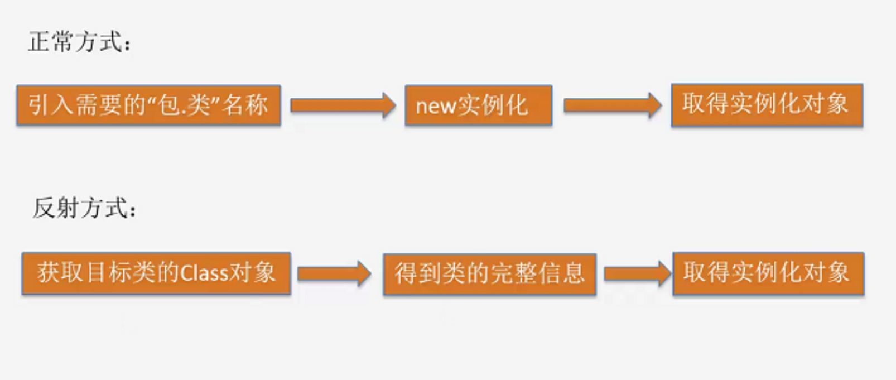
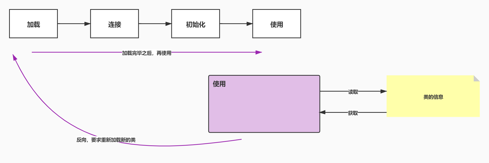
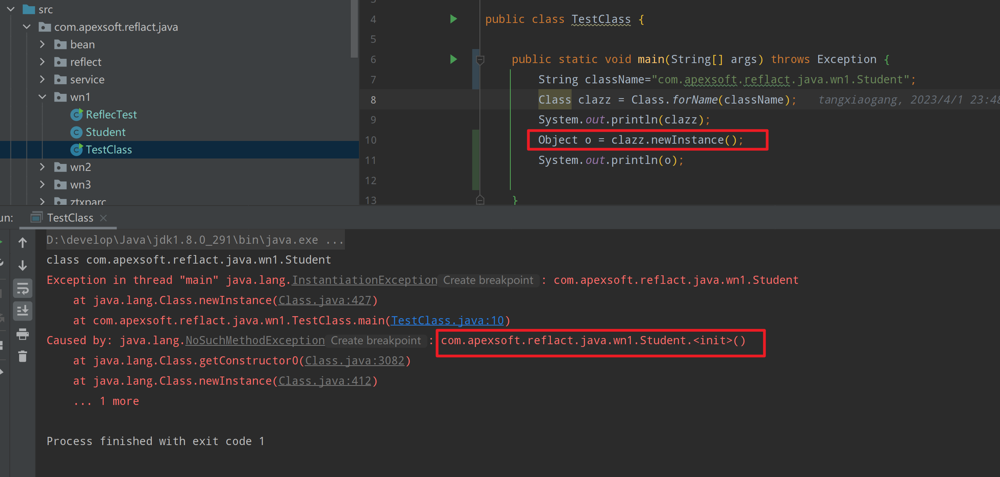
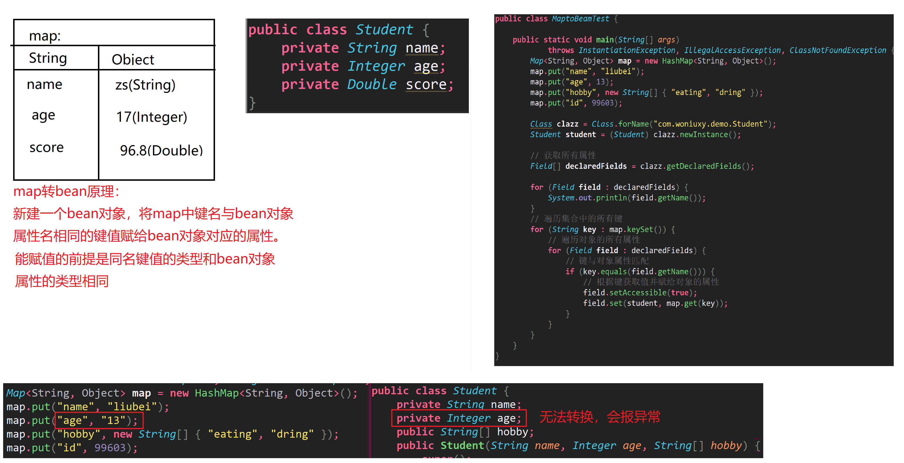
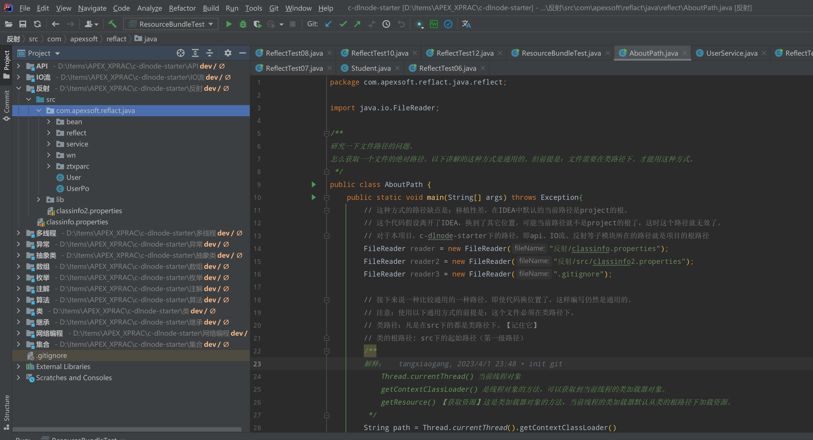
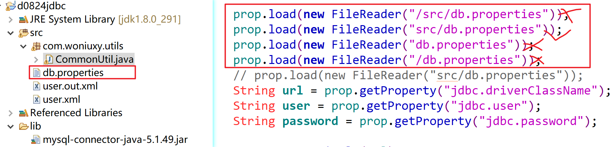
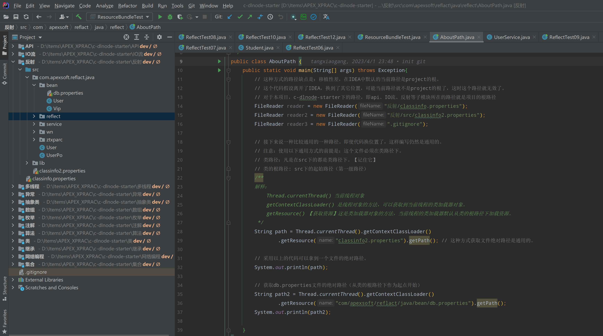

# 反射

## 一、反射概念

反射：程序运行时可以动态创建对象，操作对象的成员（属性和方法等）

反射本质：能够获取并操作字节码文件。

框架的底层实现很多地方都使用了反射。





## 二、Class对象获取

> 1、`Class.forName(类全限定名);`
>
> 2、`类名.class;`
>
> 3、`对象.getClass();`

**区别：**

> 1、类名.class：JVM将使用类装载器，将类装入内存(前提是:类还没有装入内存)，不做类的初始化工作，返回Class的对象。
>
> 2、Class.forName(“类的全限定名”)：装入类，并做类的静态初始化，返回Class的对象。
>
> 3、实例对象.getClass()：对类进行静态初始化、非静态初始化；

<? extends Student>：通配匹配，匹配Student类型和Student子类的类型。

````java
Class clazz=student.getClass();
//clazz就是Student类编译后的字节码文件
````

Class是JDK中定义的一个类（数据类型），就是代码编译后的二进制字节码.class文件，通过二进制字节码就可以创建对象，操作对象的成员。


**在类中写了有参构造方法，一定要写无参构造方法。框架底层使用反射创建对象，一般都是调用无参构造方法。**



## 三、反射操作类

### 1.创建对象

> `clazz.newInstance();`
>
> `clazz.isInstance(Object obj)；`判断指定对象是否为当前Class实例对应的类的对象

### 2.获取类相关信息

获取：类名、类修饰符、构造器等。

> `clazz.getSimpleName();`获取类名
>
> `clazz.getName();`获取类全限定名
>
> `clazz.getModeifiers();`获取类修饰符;Modifier.toString(clazz.getModeifiers());getModeifier()返回值为int型，Modeifier.toString()可以转成对应字符串。
>
> `clazz.getSuperClass();`获取父类
>
> `clazz.getInterfaces();`获取实现的接口，返回值为Class数组。
>
> 
>
> `clazz.getConstructor(参数类型列表)；`获取本类某一个构造器------只能为public修饰的
>
> `clazz.getConstructors()；`获取本类所有构造器-------public修饰的所有构造函数
>
> `clazz.getDeclaredConstructor(参数类型列表)；`获取本类某一个构造器-------可以是任何修饰符修饰的
>
> `clazz.getDeclaredConstructors()；`获取本类所有构造器------任何修饰符修饰的构造函数
>
> 
>
> `construncor.newInstance(实参列表)；`通过当前构造器创建对象
>
> `construncor.getParameter()；`获取构造器参数
>
> `construncor.getParameter().getType()；`获取构造器参数类型；
>
> `construncor.getParameter().getName()`；获取构造器参数名；
>
> `construncor.getModeifiers()`；获取构造器的修饰符；
>
> 
>
> `clazz.cgetComponentType()；`返回数组元素的Class，若调用者不是数组的Class则返回null；
>
> `clazz.isArray()；`判断此Class是否是一个数组的Class；

````java
public class ClassDemo {

	public static void main(String[] args) throws ClassNotFoundException {
		// 获取Class对象
		Class c1 = Integer.class;
		Class c2 = Class.forName("java.lang.Integer");
		Class c3 = new Integer(3).getClass();
		
		//获取类全限定名
		String name = c3.getName();
		System.out.println(name);
		//获取简单类名
		System.out.println(c3.getSimpleName());
		//获取类修饰符
		System.out.println(Modifier.toString(c3.getModifiers()));
		//获取父类
		System.out.println(c3.getSuperclass());
		//获取父类接口
		Class[] interfaces = c3.getInterfaces();
		System.out.println(Arrays.toString(interfaces));
		//获取目标类的包
		System.out.println(c3.getPackage());
		//获取数组元素的Class
		//数组的Class对象
		String[] arra= {"dfsa","rewt","dsgdw"};
		Class  arraClazz = arra.getClass();
		System.out.println(arraClazz);
		//数组元素所属类的Class对象
		Class componentType = arraClazz.getComponentType();
		System.out.println(componentType);
		//判断是否为数组
		System.out.println(arraClazz.isArray());
		System.out.println(componentType.isArray());
	}

}
````

Class类 的newInstance();调用无参构造器创建对象；

Constructor类的newInstance();可变参数创建对象；


**练习**

创建一个UserPo的失血模型，有编号、用户名、密码三个属性，两个构造器，一个有参，一个无参，利用反射分别调用无参和有参构造创建实例

利用反射，在控制台输出以下信息 :

```java
public class Userf{
    public User(String name, int age){};
    public User(){};
}
```

---

```java
package com.apexsoft.reflact.java.wn3;

import com.apexsoft.reflact.java.UserPo;
import java.lang.reflect.Constructor;
import java.lang.reflect.Modifier;
import java.lang.reflect.Parameter;
import java.util.Arrays;

public class ClassDemo {

	public static void main(String[] args) throws ClassNotFoundException {

		//获取类信息
		Class c = UserPo.class;
		// 存储字符串
		StringBuilder sb = new StringBuilder();
		// 获取修饰符
		sb.append(Modifier.toString(c.getModifiers()) + " ");
		// 获取类名
		sb.append("class" + " " + c.getSimpleName() + " ");
		// 获取父类及父类名
		sb.append("extends " + c.getSuperclass().getSimpleName() + " ");
		// 获取父类接口及其名
		Class[] interfaces2 = c.getInterfaces();
//		System.out.println(interfaces2.length);
		for (int i = 0; i < interfaces2.length; i++) {
			sb.append("implements " + interfaces.getClass().getSimpleName());
			if (i < interfaces2.length) {
				sb.append(",");
			}
		}
		sb.append("{\n");
		// 获取所有构造器
		Constructor[] constructors = c.getConstructors();
		for (Constructor constructor : constructors) {
			// 获取构造器修饰符
			sb.append("\t"+Modifier.toString(constructor.getModifiers()) + " ");
			// 获取构造器名
			sb.append(c.getSimpleName() + "(");
			// 获取构造器参数
			Parameter[] parameters = constructor.getParameters();
			for (int i = 0; i < parameters.length; i++) {
				// 参数类型名
				sb.append(parameters[i].getType().getSimpleName() + " ");
				// 参数名
				sb.append(parameters[i].getName());
				if (i < parameters.length - 1) {
					sb.append(",");
				}
			}
			sb.append("){};\n");
		}
		sb.append("}");
		System.out.println(sb);
	}
}
```

`\t`：缩进

## 三、反射操作类属性

### 1.获取属性相关信息

> `getField("属性名")；`	获取指定public属性（包括继承自父类的）；
>
> `getDeclaredField("属性名")；`	获取本类指定属性（包括private）
>
> `getFields()；`	获取所有public属性（包括继承自父类的）；
>
> `getDeclaredFields()；`	获取本类所有属性（包括private）；
>
> `getType()；`	获取属性类型的Class实例；

### 2.对象属性赋值

> `field.set(Object obj,Object value);`为指定对象的当前属性赋值;
>
> `setAccessible(true)；`突破当前属性的访问权限

**利用私有构造器创建对象、给私有属性赋值、获取私有属性的值、调用私有方法，必须要设置访问属性为true才能操作**

```java
//属性赋值
Son son1 = sonClass.newInstance();
Field id = sonClass.getField("id");
id.set(son1,"199999999");
//私有属性赋值、取值
Field name = sonClass.getDeclaredField("name");
//设置访问属性
name.setAccessible(true);
name.set(son1,"liuBei");
System.out.println(son1);
System.out.println(name.get(son1));
//私有属性取值
Field age = sonClass.getDeclaredField("age");
//设置访问属性
age.setAccessible(true);
System.out.println(age.get(son1));

//利用私有构造器创建对象
Constructor<Son> con = sonClass.getDeclaredConstructor(String.class, Integer.class, String.class);
//设置访问属性
con.setAccessible(true);
Son liBai = con.newInstance("LiBai", 19, "20231009");
System.out.println(liBai);
```

### 3.对象属性取值

> `Object   field.get(Object obj)；`获取指定对象的当前属性值；

```java
//共有属性取值
Son son1 = sonClass.newInstance();
Field id = sonClass.getField("id");
id.set(son1,"199999999");
System.out.println(id.get(son1));

//私有属性取值
Field age = sonClass.getDeclaredField("age");
//设置访问属性
age.setAccessible(true);
System.out.println(age.get(son1));
```

## 三、反射操作类方法

### 1.获得类方法信息

> `clazz.getMethod(String 方法名,方法的参数Class…)`：获取指定名称的非private方法
>
> `clazz.getMethods()`：获取所有非private方法
>
> `clazz.getDeclaredMethod(String 方法名,方法的参数Class…)`：获取指定的private方法
>
> `clazz.getDeclaredMethods()`：获取所有方法，包括private方法
>
> `method.getName()`：获取方法名称

```java
/**
 *  方法操作
 **/
//获取指定非private方法
Method pubMethod = sonClass.getMethod("pubMethod", String.class);
System.out.println(pubMethod);
System.out.println(pubMethod.getName());
//获取所有非private方法
Method[] methods = sonClass.getMethods();
System.out.println(Arrays.toString(methods));

//获取指定private方法
Method priMethod = sonClass.getDeclaredMethod("priMethod",String.class);
System.out.println(priMethod);
System.out.println(priMethod.getName());
//获取所有方法，包括private方法
Method[] methods1 = sonClass.getDeclaredMethods();
System.out.println(Arrays.toString(methods1));
```

```java
package com.apexsoft.reflact.java.wn1;

import java.io.Serializable;
import java.util.Comparator;

/**
 * @Author: TangXiaoGang
 * @Date: 2023/4/3
 * @Description:
 */
public class Son implements Serializable,Comparable, Comparator {
    private String name;
    private  Integer age;
    public String id;
    @Override
    public int compare(Object o1, Object o2) {
        return 0;
    }

    public Son() {
    }

    public Son(String name, Integer age) {
        this.name = name;
        this.age = age;
    }

    public Son(String name) {
        this.name = name;
    }

    public Son(Integer age) {
        this.age = age;
    }

    public String getId() {
        return id;
    }

    public void setId(String id) {
        this.id = id;
    }

    private Son(String name,Integer age, String id){
        this.name = name;
        this.age = age;
        this.id = id;
    }

    @Override
    public String toString() {
        return "Son{" +
                "name='" + name + '\'' +
                ", age=" + age +
                ", id='" + id + '\'' +
                '}';
    }

    @Override
    public int compareTo(Object o) {
        return 0;
    }

    private void priMethod(String name){
        System.out.println(name);
    }
    public void pubMethod(String name){
        System.out.println(name);
    }
    public void pubMethod(Integer age){
        System.out.println(age);
    }
    public void pubMethod(String name, Integer age){
        System.out.println(name);
        System.out.println(age);
    }
}
```

### 2.调用方法

> `method.invoke(obj，param)`

````java
//获得公共的方法
//    Method method = cls.getMethod("setUserName", String.class);
//     method.invoke(obj, "张三");
//     ystem.out.println(obj);
//针对非公共方法的操作
Method method = cls.getDeclaredMethod("setUserName", String.class);
method.setAccessible(true);
method.invoke(obj, "张三");
System.out.println(obj);
````

```java
//方法调用
//非private方法调用
Method pubMethod1 = sonClass.getMethod("pubMethod", String.class);
Object invoke = pubMethod1.invoke(son1, "hello world!");
System.out.println(invoke);

//private方法调用
Method priMethod1 = sonClass.getDeclaredMethod("priMethod", String.class);
//设置访问属性
priMethod1.setAccessible(true);
Object invoke1 = priMethod1.invoke(son1, "private hello world!");
System.out.println(invoke1);
```

# 反射封装JDBC

## 一、创建db.properties文件

> 文件放置在：src目录下

```properties
jdbc.driverClassName=com.mysql.jdbc.Driver
jdbc.url=jdbc:mysql://127.0.0.1:3306/woniuxy?useUnicode=true&characterEncoding=UTF8&useSSL=false
jdbc.user=root
jdbc.password=123456
```

## 二、编写PropUtil工具类

> 该工具类的作用：将文件中的内容，在加载期写入到内存中去

```java
import java.io.FileReader;
import java.io.IOException;
import java.util.Properties;
public class PropUtil {
    static Properties prop = new Properties();
    /*静态代码块*/
    static {
        try {
            prop.load(new FileReader("src/db.properties"));
        } catch (IOException e) {
            // TODO Auto-generated catch block
            e.printStackTrace();
        }
    }
    public static String getValue(String key) {
        return prop.getProperty(key);
    }
    public static void main(String[] args) {
        System.out.println(getValue("jdbc.driverClassName"));
        //同样是K-V结构的集合(特点是：K-V都是String结构的数据)
//        Properties prop = new Properties();
//        prop.setProperty("user", "root");
//        prop.setProperty("password", "123456");
//        
//        System.out.println(prop.getProperty("user"));
//        System.out.println(prop.getProperty("password"));
    }
}
```

## 三、修改连接工具类

> 将以前的硬连接代码，修改为从Properties中进行获取

```java
package com.woniuxy.day0824.util;
import java.sql.Connection;
import java.sql.DriverManager;
import java.sql.SQLException;
public class ConnectionUtil {
    public static Connection getCon() throws ClassNotFoundException, SQLException {
        //加载驱动
        Class.forName(PropUtil.getValue("jdbc.driverClassName"));
        return DriverManager.getConnection(
            PropUtil.getValue("jdbc.url"), 
            PropUtil.getValue("jdbc.user"), 
            PropUtil.getValue("jdbc.password"));
    }
    public static void main(String[] args) {
        try {
            System.out.println(getCon());
        } catch (ClassNotFoundException e) {
            // TODO Auto-generated catch block
            e.printStackTrace();
        } catch (SQLException e) {
            // TODO Auto-generated catch block
            e.printStackTrace();
        }
    }
}
```

# Map转对象




````java
//Map转对象封装成方法
public static <T> T mapToBean(Map map,Class<T> clazz) throws Exception{
    T t=clazz.newInstance();
    Field[] declaredFields = clazz.getDeclaredFields();
    //Map的key和对象的属性，对应复制
    for(Object key : map.keySet()) {
        //System.out.println(key);
        for(Field field : declaredFields) {
            if(key.equals(field.getName())) {
                //使用反射赋值
                field.setAccessible(true);
                field.set(t, map.get(key));
            }
        }
    }
    return t;
}
@Test
public void testmapToBean() throws Exception {
    Map<String, Object> map=new HashMap<String, Object>();
    map.put("sid", 1);
    map.put("sname", "zs");
    Student student = mapToBean(map, Student.class);
    System.out.println(student);
}
````

## JDBC查询封装

````java
ResultSet rs = pstmt.executeQuery();
    List<User> users = new ArrayList<User>();
    //MetaData元数据：数据的数据
    ResultSetMetaData metaData = rs.getMetaData();
    for(int i=0;i<metaData.getColumnCount();i++) {
        System.out.println(metaData.getColumnLabel(i+1));
    }
````

````java
public static <T> List<T> query(Class<T> clazz,String sql,Object... params ) throws Exception {
        T bean=null;
        List<T> beans=new ArrayList<T>();
        Connection con = getConnection();
        PreparedStatement pstmt = con.prepareStatement(sql);
        if(params!=null) {
            for(int i=0;i<params.length;i++) {
                pstmt.setObject(i+1, params[i]);
            }
        }
        //执行查询
        ResultSet rs = pstmt.executeQuery();
        //获取查询结果的原数据：获取列名
        ResultSetMetaData metaData = rs.getMetaData();
        //遍历查询结果，读取每条数据
        while(rs.next()) {
            //反射创建对象
            bean=clazz.newInstance();
            //获取每列的名字和值，使用反射给bean对应的属性赋值
            for(int i=0;i<metaData.getColumnCount();i++) {
                //获取表的列名
                String columnLabel = metaData.getColumnLabel(i+1);
                //获取表的列值
                Object value = rs.getObject(i+1);
                //使用反射获取列名对应的字段
                Field filed = clazz.getDeclaredField(columnLabel);
                filed.setAccessible(true);
                //赋值
                filed.set(bean, value);
            }
            beans.add(bean);
        }
        closeResource(con, pstmt, rs);
        return beans;
    }
````

````java
public User selectUserByUname(String uname)  {
    try {
        String sql="select * from user where uname =?";
        List<User> users = JdbcTool.query(User.class, sql, uname);
        if(users.size()>0) {
            return users.get(0);
        }else {
            return null;
        }
    }catch (Exception e) {
        e.printStackTrace();
        throw new DaoException(e);
    }
}
````

## 第三方工具类

Apache开源组织

http://www.apache.org/

添加 dbutils和MySQL驱动jar包

常用工具包

````java
package com.woniuxy.dao;
import java.sql.Connection;
import java.sql.SQLException;
import java.util.List;
import org.apache.commons.dbutils.QueryRunner;
import org.apache.commons.dbutils.handlers.BeanHandler;
import org.apache.commons.dbutils.handlers.BeanListHandler;
import com.woniuxy.entity.User;
public class UserDao {
    // jdbutils封装的JDBC的工具类
    QueryRunner qr = new QueryRunner();
    public void insertUser(User user) throws Exception {
        String sql="insert into user values(?,?,?,?)";
        Connection con = JdbcTool.getConnection();
        qr.update(con, sql, user.getUid(),
                user.getUname(),user.getPwd(),user.getEmail());
        JdbcTool.closeResource(con, null, null);
    }
    public void deleteUser(String uid) {
    }
    public User selectUserByUname(String uname) throws SQLException, Exception {
        String sql="select * from user where uname=?";
        User user = qr.query(JdbcTool.getConnection(),sql, 
                new BeanHandler<User>(User.class), uname);
        return user;
    }
    public List<User> selectAllUsers() throws Exception {
        String sql="select * from user ";
        List<User> users = qr.query(JdbcTool.getConnection(), sql, new BeanListHandler<User>(User.class));
        return users;
    }
}
````

> **框架底层**
>
> 使用反射给对象的属性赋值，一般不会直接操作私有的成员变量
>
> 框架中给属性赋值，就是将setXxxx() getXxxx()，去掉前面的get/set，截取后面的单词，将第一个字母变小写

# Java路径/和\\

````java
String path="D:\\新建文件夹\\2.png";  
File file=new File(path);   
System.out.println(file.exists());   
String path1="D:/新建文件夹/2.png";  
File file1=new File(path);
System.out.println(file1.getAbsolutePath());   
System.out.println(file1.getCanonicalPath());  
````

> `具体使用中都可以达到访问路径的效果`，只不过有一点小区别
>
> 正斜杠/：一般在配置文件路径时，指向下一个路径只要使用一个。例如："c:/a/1.txt";
>
> 反斜杠\：在配置文件路径时，由于作为转义符，所以具体意义上的反斜杠要两个。例如：`"c\\a\\1.txt"`;这里的第一个反斜杠是作为转义符存在的，第二个才是真正意义上的反斜杠。
>
> 在java中路径一般用"/"
>
> windows中的路径一般用"\\"
>
> linux、unix中的路径一般用"/"
>
> 推荐用“/”  因为java是跨平台的。“\”（在java代码里应该是`\\`）是windows环境下的路径分隔符，Linux和Unix下都是用“/”。而在windows下也能识别“/”。所以`最好用“/”`

# 项目根路径 类路径

**项目根路径**：项目起始路径即为项目根路径（对于多模块的项目，父工程起始路径即为项目更路径），对于非父子工程，src所在目录即为项目根路径。

**类路径**：src（不包含src）下的路径即为类路径，注意类路径不只一个，只要位于src下，无论嵌了多少层都属于类路径。

**类根路径**： src（不包含src）下的起始路径（第一级路径）

如下项目：c-dlnode-statrer为包含多个模块的父子工程，API、IO流、反射等子模块所在的目录为项目的根目录；对于反射子项目，src目录下的所有目录为类路径。



以下项目：src所在目录即项目根路径



> 使用IO流读取文件，相对路径为`项目的根目录`开始寻找文件
>
> 使用类加载器加载文件，相对路径为`项目根目录下的src下（不包含src）的目录（类路径）`开始寻找文件

**获取文件绝对路径**

```java
package com.apexsoft.reflact.java.reflect;

import java.io.FileReader;

/**
研究一下文件路径的问题。
怎么获取一个文件的绝对路径。以下讲解的这种方式是通用的。但前提是：文件需要在类路径下。才能用这种方式。
 */
public class AboutPath {
    public static void main(String[] args) throws Exception{
        // 这种方式的路径缺点是：移植性差，在IDEA中默认的当前路径是project的根。
        // 这个代码假设离开了IDEA，换到了其它位置，可能当前路径就不是project的根了，这时这个路径就无效了。
        // 对于本项目，c-dlnode-starter下的路径，即api、IO流、反射等子模块所在的路径就是项目的根路径
        FileReader reader = new FileReader("反射/classinfo.properties");
        FileReader reader2 = new FileReader("反射/src/classinfo2.properties");
        FileReader reader3 = new FileReader(".gitignore");

        // 接下来说一种比较通用的一种路径。即使代码换位置了，这样编写仍然是通用的。
        // 注意：使用以下通用方式的前提是：这个文件必须在类路径下。
        // 类路径：凡是在src下的都是类路径下。【记住它】
        // 类的根路径: src下的起始路径（第一级路径）
        /**
        解释：
            Thread.currentThread() 当前线程对象
            getContextClassLoader() 是线程对象的方法，可以获取到当前线程的类加载器对象。
            getResource() 【获取资源】这是类加载器对象的方法，当前线程的类加载器默认从类的根路径下加载资源。
         */
        String path = Thread.currentThread().getContextClassLoader()
                .getResource("classinfo2.properties").getPath(); // 这种方式获取文件绝对路径是通用的。

        // 采用以上的代码可以拿到一个文件的绝对路径。
        System.out.println(path);

        // 获取db.properties文件的绝对路径（从类的根路径下作为起点开始）
        String path2 = Thread.currentThread().getContextClassLoader()
                .getResource("com/apexsoft/reflact/java/bean/db.properties").getPath();
        System.out.println(path2);

    }
}
```




