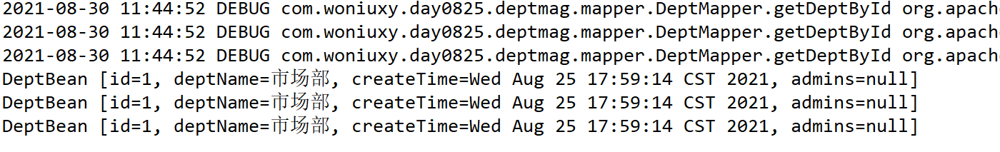
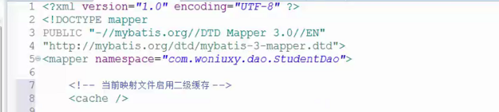

# XML概述

XML：extended Markup Language 可扩展标记语言。HTML全是W3C制定的，程序员不能自定义标签。XML为了解决这个问题，而被产生出来。

程序员可以自定义自己的标签，只需要遵从XML的规范即可


HTML：语法不严格

​		展示效果，一个标签在浏览器中被解释成一种效果属示我们能够使用的标签和属性是W3C规定好的。

XML有严格的语法

​		可扩展：标签和标签的属性可以自定义用来存储数据，用来当配置文件。xml适合做复杂的配置文件

properties key=value 适合简单的配置文件

> 规范：
>
> 1、自定义的标签，有开始有结束
>
> 2、大小写字母组成，见名知意

语法结构：

```xml
<!--XML文档声明：版本信息，编码集-->
<?xml version="1.0" encoding="utf-8" ?>
<!-- 自定义标签 -->
<userBean>
    <id>1L</id>
    <userName>张三</userName>
    <loginName>zs</loginName>
    <password>123456</password>
</userBean>
<userBean>
    <id>2L</id>
    <userName>李四</userName>
    <loginName>ls</loginName>
    <password>123456</password>
</userBean>
```

> 好处：结构清晰
>
> XML的使用场景：Mybatis框架，以前的Spring全家桶框架，在多个项目之间数据传输(也比较多，但是最多的是JSON)

XML的文档声明必须放在最前面，注释也不可以放在声明前面

XML严格区分大小写

标签可以嵌套，但根节点只能有一个

标签必须成对，不成对的标签必须显示关闭，不能只写一个开始标签。

# XML文件编写

## 一、创建文件


## 二、定义标签

```xml
<?xml version="1.0" encoding="UTF-8"?>
<userbean>
    <!-- 可以放置自定义的标签 -->
    <id>1L</id>
    <userName>张三</userName>
    <loginName>zs</loginName>
    <password>123456</password>
</userbean>
```

## 三、定义符号

XML中转义字符：

> <：\&lt;
>
> \>：\&gt;
>
> "：\&quot;
>
> '：\&apos;
>
> &：\&amp;
>

举例说明：

```xml
<?xml version="1.0" encoding="UTF-8"?>
<userbean>
    <!-- 可以放置自定义的标签 -->
    <id>1L</id>
    <userName>"张三"</userName>
    <loginName>'zs'</loginName>
    <password>123456</password>
    <!-- 可以放置特殊符号 -->
    3  < 4
    5  > 4
    &&
</userbean>
```

## 四、静态字符

> 静态字符的特点：XML不会解析写在\<![CDATA[ ]]>中的内容,不需要转义，写的什么就是什么

```xml
   <!-- 静态字符空间 -->
    <![CDATA[      
    3  <  4
    5  >= 4 
    &&
    ]]>
```

## 五、添加属性

```xml
<?xml version="1.0" encoding="UTF-8"?>
<users>
<userbean>
    <!-- 可以放置自定义的标签 -->
    <id type="long">1L</id>
    <userName type="string">"张三"</userName>
    <loginName type="string">'zs'</loginName>
    <password type="string">123456</password>
    <age type="int">18</age>
    <!-- 静态字符空间 -->
    <![CDATA[      
    3  <  4
    5  >= 4 
    &&
    ]]>
    &&
</userbean>
<userbean id="2L">
    <userName type="string">李四</userName>
    <loginName type="string">ls</loginName>
    <password type="string">123456</password>
    <age type="int">22</age>
</userbean>
</users>
```

# XML校验

程序员在编写XML过程中，容易出现一些常规错误，比如：单词写错了，前后标签对不上，有多个根标签……

XML提供2种校验格式方案：DTD，Schema

XML(校验)约束文件作用：限制，检查在当前文件中出现的标签，属性必须符合mybatis的要求。

约束文件分类：dtd schema

## 一、DTD

### 1、DTD的概述

DTD 全称：文档类型定义 作用：规范XML中标签的使用

> DTD的特点：
>
> （1）、一个XML中，只能引入一个DTD文件
>
> （2）、XML中必须严格遵从DTD中定义的规则

### 2、DTD的写法

```dtd
<?xml version="1.0" encoding="UTF-8" ?>
<!ELEMENT users (user*)>
<!--? 代表出现0或1次，* 代表出现0到N次，+ 代表出现1到N次 -->
<!ELEMENT user (id,username,loginname?,password?)>
<!--EMPTY 代表标签中，没有需要解析的字符数据 -->
<!-- (#PCDATA) 代表标签中，有需要被XML解析的字符数据 -->
<!ELEMENT id (#PCDATA)>
<!-- 针对标签定义属性 -->
<!ATTLIST id
type CDATA #REQUIRED
>
<!ELEMENT username (#PCDATA)>
<!--ATTLIST 标签上的属性-->
<!ATTLIST username
type CDATA #REQUIRED
>
<!ELEMENT loginname (#PCDATA)>
<!ATTLIST loginname
type CDATA #REQUIRED
>
<!ELEMENT password (#PCDATA)>
<!ATTLIST password
type CDATA #REQUIRED
>
```

### 3、DTD的使用方法

在XML中使用如下语句：

```xml
<!DOCTYPE users SYSTEM "users.dtd">
```

> DOCTYPE 代表文档类型
>
> users 代表根标签
>
> SYSTEM 代表DTD来自于本地
>
> users.dtd 具体的DTD的文件路径

举例说明：

```xml
<?xml version="1.0" encoding="UTF-8"?>
<!DOCTYPE users SYSTEM "users.dtd">
<users>
    <user>
        <id type="long">1L</id>
        <username type="string">"张三"</username>
        <loginname type="string">'zs'</loginname>
        <password type="string">123456</password>
    </user>
    <user>
        <id type="long">2L</id>
        <username type="string">"李四"</username>
        <loginname type="string">'ls'</loginname>
        <password type="string">123456</password>
    </user>
</users>
```

## 二、Schema

3阶段老师讲解，在初学Spring框架时使用：

它的特点：

一个xml中可以导入多个xsd文件

# 文件对象模型

```xml
<?xml version="1.0" encoding="UTF-8"?>
<!DOCTYPE users SYSTEM "users.dtd">
<users>
    <user>
        <id type="long">1L</id>
        <username type="string">&quot;张三&quot;</username>
        <loginname type="string">&apos;zs&apos;</loginname>
        <password type="string">123456</password>
    </user>
    <user>
        <id type="long">2L</id>
        <username type="string">&quot;李四&quot;</username>
        <loginname type="string">&apos;ls&apos;</loginname>
        <password type="string">123456</password>
    </user>
</users>
```

程序在读取上述的xml文件时，也会产生对应的DOM节点树：


# DOM4J解析XML内容

DOM4J： 4—for J—java DOM FOR Java 技术，是一种专门用来解析XML文件内容的技术，中心思想：1个标签代表一个对象

首先，需要下载dom4j.jar ，并放置在lib目录下：

下载位置：https://mvnrepository.com/ （需要翻墙） https://search.maven.org/（还可以使用）

API的位置：https://dom4j.github.io/javadoc/2.1.3/

DTD内容是：

```dtd
<?xml version="1.0" encoding="UTF-8" ?>
<!ELEMENT users (user*)>
<!--? 代表出现0或1次，* 代表出现0到N次，+ 代表出现1到N次 -->
<!ELEMENT user (id,username,loginname?,password?)>
<!ATTLIST user
class CDATA #REQUIRED
>
<!--EMPTY 代表标签中，没有需要解析的字符数据 -->
<!-- (#PCDATA) 代表标签中，有需要被XML解析的字符数据 -->
<!ELEMENT id (#PCDATA)>
<!-- 针对标签定义属性 -->
<!ATTLIST id
type CDATA #REQUIRED
>
<!ELEMENT username (#PCDATA)>
<!--ATTLIST 标签上的属性-->
<!ATTLIST username
type CDATA #REQUIRED
>
<!ELEMENT loginname (#PCDATA)>
<!ATTLIST loginname
type CDATA #REQUIRED
>
<!ELEMENT password (#PCDATA)>
<!ATTLIST password
type CDATA #REQUIRED
>
```

XML内容是：

```xml
<?xml version="1.0" encoding="UTF-8"?>
<!DOCTYPE users SYSTEM "users.dtd">
<users>
    <user class="com.woniuxy.day0824.entity.UserBean">
        <id type="long">1L</id>
        <username type="string">"张三"</username>
        <loginname type="string">'zs'</loginname>
        <password type="string">123456</password>
    </user>
    <user class="com.woniuxy.day0824.entity.UserBean">
        <id type="long">2L</id>
        <username type="string">"李四"</username>
        <loginname type="string">'ls'</loginname>
        <password type="string">123456</password>
    </user>
</users>
```

Java解析代码内容是：

```java 
package com.woniuxy.day0824.main;
import java.util.List;
import org.dom4j.Document;
import org.dom4j.Element;
import org.dom4j.io.SAXReader;
/**
 * XML的解析
 * @author 老蒲
 *
 */
public class XMLParseMainEnter {
    public static void main(String[] args) {
        // TODO Auto-generated method stub
        //加载核心类
        SAXReader reader = new SAXReader();
        try {
            //通过核心类，得到文档节点树
            Document doc = reader.read(XMLParseMainEnter.class.getClassLoader()
                    .getResourceAsStream("userbean.xml"));
//            //获得文档的编码集
//            System.out.println(doc.getXMLEncoding());
//            //获得文档类型
//            System.out.println(doc.getDocType());
            //得到根节点
            Element root = doc.getRootElement();
            //查看元素节点下的所有节点情况
//            System.out.println(root.asXML());
            //返回标签下的所有子标签
            List<Element> eles = root.elements();
            //遍历
            for (Element element : eles) {
                //查看元素节点下的所有节点情况
//                System.out.println(element.asXML());
                System.out.println(element.element("id").getText());
                System.out.println(element.element("username").getText());
                System.out.println(element.element("loginname").getText());
                System.out.println(element.element("password").getText());
                //读取元素上 class属性的值
                System.out.println(element.attributeValue("class"));
                System.out.println("----------------");
            }
        } catch (Exception e) {
            // TODO Auto-generated catch block
            e.printStackTrace();
        }
    }
}
```

# JDBC封装XML

## 一、准备XML

```xml
<?xml version="1.0" encoding="UTF-8"?>
<environment>
    <driver>com.mysql.jdbc.Driver</driver>
    <url>jdbc:mysql://127.0.0.1:3306/woniuxy?useUnicode=true&characterEncoding=UTF8&useSSL=false</url>
    <user>root</user>
    <password>123456</password>
</environment>
```

## 二、解析XML

```java
package com.woniuxy.day0824.util;
import org.dom4j.Document;
import org.dom4j.Element;
import org.dom4j.io.SAXReader;
public class XMLUtil {
    public static void main(String[] args) {
        SAXReader reader = new SAXReader();
        try {
            Document doc = reader.read(XMLUtil.class.getClassLoader().getResourceAsStream("db.xml"));
            //获得根节点
            Element root = doc.getRootElement();
            System.out.println(root.element("driver").getText());
            System.out.println(root.element("url").getText());
            System.out.println(root.element("user").getText());
            System.out.println(root.element("password").getText());
        } catch (Exception e) {
            // TODO Auto-generated catch block
            e.printStackTrace();
        }
    }
}
```

# 单例设计模式

## 一、OOAD

OOAD 面向对象分析与设计 说：程序做的好不好，主要看这个设计时/编码时是否满足“高内聚低耦合”

咋满足？遵循7大设计原则，21个设计模式

7大设计原则：

| 原则         | 描述                                                         |
| :----------- | :----------------------------------------------------------- |
| 单一原则     | 一个类只干1件事（高内聚的体现）                              |
| 开闭原则     | 在开发时，针对新功能的扩展应该是开放的。而在新功能扩展时，针对老功能的修改应该是关闭的！ |
| 依赖倒置原则 | 面向接口编程，说法：层次之间相互调用时，需要满足：上层不能直接依赖下层，而应该依赖层次之间的接口！ |
| 接口隔离原则 | 最小接口原则，设计接口的时候，接口应该越小越好！             |
| 迪米特法则   | 最少知道原则，类尽量不要和太多的陌生类发生关系！             |
| 里式替换原则 | 说法：龙生龙，凤生凤，老鼠的儿子会打洞。父类能出现的地方，子类也可以出现。如何做到？答案：子类不要去重写父类已经实现过的方法 |
| 组合聚合原则 | 如果有大量的重复代码，如果不能使用继承的情况下，可以使用组合聚合(部分和整体的关系) |

------

21个设计模式：

**对象创建：**`1、克隆模式` `2、简单工厂模式` 3、抽象工厂模式 `4、单例模式` 5、生成器模式

**接口适配：**`1、适配器模式` 2、桥接模式 3、外观模式

**对象去耦：**1、中介者模式 2、观察者模式

**行为扩展：**1、访问者模式 2、装饰器模式 `3、责任链模式`

**抽象集合：**1、组合模式 2、迭代器模式

**性能和对象访问：**1、亨元模式 `2、代理模式`

**对象状态：**1、备忘录模式

**算法封装：**1、模板方法模式 2、策略模式 3、命令模式

> 设计原则：是总纲 需要遵循的底线
>
> 设计模式：为了实现大纲，在特殊的场景下，采用的一些特殊的手段（都是先人给我们准备好了的）

## 二、单例模式

当：程序中针对某一类，只需要它提供1个唯一的实例的时候，此时，就可以使用单例

**主要解决：**频繁的创建对象和销毁对象，提升JVM的性能

单例模式主要有2种：饿汉式单例、懒汉式单例

### 1、饿汉式单例

```java
/**
 * 饿汉式单例
 * @author Administrator
 *
 */
public class SingleModel {
    /**
     * 类加载时，就产出对象
     * 所以：天生就是 线程安全的
     */
    private static SingleModel instance = new SingleModel();
    private SingleModel() {
    }
    public static SingleModel getInstance() {
        return instance;
    }
}
```

### 2、懒汉式单例

```java
/**
 * 懒汉式单例
 * @author Administrator
 *
 */
public class SingleModel {
    /**
     * 类加载时，就产出对象
     */
    private static SingleModel instance = null;
    private SingleModel() {
    }
    public static SingleModel getInstance() {
        //双重校验，完成对单例对象的创建
        if(instance == null) {
            synchronized (SingleModel.class) {
                //规避多线程，同时创建多个对象
                if(instance == null) {
                    instance = new SingleModel();
                }
            }
        }
        return instance;
    }
}
```

测试代码：

```java
public class MainEnter {
    public static void main(String[] args) {
        SingleModel sm1 = SingleModel.getInstance();
        SingleModel sm2 = SingleModel.getInstance();
        SingleModel sm3 = SingleModel.getInstance();
        System.out.println(sm1);
        System.out.println(sm2);
        System.out.println(sm3);
    }
}
```

## 三、克隆模式

克隆模式：参照某一个对象为原型，去产生大量的其他对象

### 1、浅克隆

> 需要实现接口Cloneable

```java
public class UserBean implements Cloneable{
    private Long id;
    private String userName;
    private String loginName;
    private String password;
    public UserBean() {
        super();
        // TODO Auto-generated constructor stub
    }
    public UserBean(Long id, String userName) {
        super();
        this.id = id;
        this.userName = userName;
    }
    public UserBean(Long id, String userName, String loginName, String password) {
        super();
        this.id = id;
        this.userName = userName;
        this.loginName = loginName;
        this.password = password;
    }
    @Override
    public Object clone() throws CloneNotSupportedException {
        // TODO Auto-generated method stub
        return super.clone();
    }
    public Long getId() {
        return id;
    }
    public void setId(Long id) {
        this.id = id;
    }
    public String getUserName() {
        return userName;
    }
    public void setUserName(String userName) {
        this.userName = userName;
    }
    public String getLoginName() {
        return loginName;
    }
    public void setLoginName(String loginName) {
        this.loginName = loginName;
    }
    public String getPassword() {
        return password;
    }
    public void setPassword(String password) {
        this.password = password;
    }
//    @Override
//    public String toString() {
//        return "UserBean [id=" + id + ", userName=" + userName + ", loginName=" + loginName + ", password=" + password
//                + "]";
//    }
}
```

> 上述的克隆，还是属于：浅克隆

### 2、深克隆

> 浅克隆：克隆时，只克隆对象本身，不克隆其他的关联对象
>
> 深克隆：克隆时，除了需要克隆对象本身之外，其他的关联对象也需要进行克隆

```java
package com.woniuxy.day0824.entity;
public class UserBean implements Cloneable{
    private Long id;
    private String userName;
    private String loginName;
    private String password;
    private WifeBean wife;
    public UserBean() {
        super();
        // TODO Auto-generated constructor stub
    }
    public UserBean(Long id, String userName) {
        super();
        this.id = id;
        this.userName = userName;
    }
    public UserBean(Long id, String userName, String loginName, String password) {
        super();
        this.id = id;
        this.userName = userName;
        this.loginName = loginName;
        this.password = password;
    }
    @Override
    public Object clone() throws CloneNotSupportedException {
        // TODO Auto-generated method stub
        WifeBean wifeBean = (WifeBean) wife.clone();
        UserBean user = (UserBean) super.clone();
        user.setWife(wifeBean);
        return user;
    }
    public Long getId() {
        return id;
    }
    public void setId(Long id) {
        this.id = id;
    }
    public String getUserName() {
        return userName;
    }
    public void setUserName(String userName) {
        this.userName = userName;
    }
    public String getLoginName() {
        return loginName;
    }
    public void setLoginName(String loginName) {
        this.loginName = loginName;
    }
    public String getPassword() {
        return password;
    }
    public void setPassword(String password) {
        this.password = password;
    }
    public WifeBean getWife() {
        return wife;
    }
    public void setWife(WifeBean wife) {
        this.wife = wife;
    }
    @Override
    public String toString() {
        return "UserBean [id=" + id + ", userName=" + userName + ", loginName=" + loginName + ", password=" + password
                + ", wife=" + wife + "]";
    }
}
```

````java
public class WifeBean implements Cloneable{
    private Long id;
    private String wifeName;
    public WifeBean() {
        super();
        // TODO Auto-generated constructor stub
    }
    public WifeBean(Long id, String wifeName) {
        super();
        this.id = id;
        this.wifeName = wifeName;
    }
    @Override
    public Object clone() throws CloneNotSupportedException {
        // TODO Auto-generated method stub
        return super.clone();
    }
    public Long getId() {
        return id;
    }
    public void setId(Long id) {
        this.id = id;
    }
    public String getWifeName() {
        return wifeName;
    }
    public void setWifeName(String wifeName) {
        this.wifeName = wifeName;
    }
//    @Override
//    public String toString() {
//        return "WifeBean [id=" + id + ", wifeName=" + wifeName + "]";
//    }
}
````


# Dao的概述

## 一、三层架构

回顾下：蜗牛五子棋

问题：UI界面的代码，业务逻辑处理的代码，与文件进行数据持久的代码 放置在同一个类中，这就导致这个类：冗长，维护性，阅读性都很差

解决方案：


> 三层结构的作用：
>
> UI视图代码，叫：表现层|视图层 作用：将系统的数据展现给用户看
>
> 业务逻辑代码，叫：业务层 作用：完成业务逻辑 例如：判断胜负，开新局，悔棋，保存棋谱，退出系统
>
> 持久化代码，叫：持久层 作用：完成对数据的持久化操作，同文件或数据库进行数据交互
>
> 三层靠什么技术来实现？
>
> 表现层：二阶段 Servlet + JSP + HTML + CSS + JS
>
> 业务层：Java代码
>
> 持久层：IO流，JDBC，Mybatis框架

> **面试题**
>
> 简述三层架构
>
> 数据访问层：执行数据CRUD
>
> 业务逻辑层：执行核心业务逻辑
>
> 表示层：用户界面，接收用户输入，调用业务方法，将结果展示给用户
>
> 优点：结构清醒，实现代码灵活复用，便于维护。

## 二、DAO

DAO：Data Access Object 数据访问对象，就是上述的持久层，作用：完成对数据的持久化操作，同文件或数据库进行数据交互


# ORM概述

## 一、架构模式

系统可能分为3层，那么3层如何实现？有架构模式为它提供最基本的思想

架构模式：

表现层：MVC Model + View + Controller

业务层：`事务脚本（面向过程编程）`，领域模型（DDD 面向对象编程）

持久层：ORM Object Relation Mapping

## 二、ORM

回顾下：JDBC

ORM 实际上：就是将数据库中数据与Java中对象，完成一个双向映射

| 数据库                     | 映射   | Java                 |
| :------------------------- | :----- | :------------------- |
| 一张表                     | 代表着 | 一种类型             |
| 表中的一行记录             | 代表着 | 一个对象             |
| 表中的一行记录的某一个字段 | 代表着 | 一个对象的某一个属性 |

> ORM的映射的好处：
>
> Java程序员可以更多的关注Java对象，而不需要关注数据库中的字段

------

基于ORM思想的框架有：

全自动化框架：Hibernate （早5年）、Spring-Data-JPA （国外）

半自动化框架：Mybatis

> 半自动的好处：程序员可以自己控制SQL语句，特殊适合做SQL调优


# Mybatis框架


MyBatis：数据持久层框架，用来替换JDBC。

JDBC必须使用mysqljdbc驱动包，mysqljdbc驱动包就是一个jar包、过个工具类。

框架：就是多个jar包，也即工具类，但底层封装更复杂，功能更强大，使用更方便。框架的使用需要相关的配置文件。

JavaWeb：Jsp Servlet Ajax

## 一、Mybatis的概述

学习的官网：https://mybatis.org/mybatis-3/zh/index.html

Mybatis 是一个非常简单的ORM持久层框架，它可帮助程序员：极大减少JDBC的连接代码，减少预编译对象参数设值的代码，减少结果集封装的代码。它可以使用接口以及JavaBean就可以完成对DB的持久层操作。

1、JDBC的特点(缺陷)

程序员自己写SQL语句

程序员自己建立连接，管理连接，管理事务

2、ORM持久层框架

（1）统一的提供数据库连接池，程序员不需要进行JDBC连接的管理

（2）有的封装了SQL语句，有的没封装SQL语句

（3）针对数据库的查询，几乎都提供了对应的缓存技术（性能得以提升）

## 二、框架的好处

框架：是一种工具，作用：帮助程序员极大的简化代码，可以让程序员更多的关注核心业务

框架：Mybatis、Spring、SpringMVC、SpringBoot、Spring全家桶的套餐、SpringCloud微服务

## 三、Mybatis相关包


## XML约束文件


括号中的cache-ref、cache等表示根节点下可以出现的子标签，|表示子标签间没有顺序，*表示子标签数量不限，,表示标签之间有顺序，? 表述子标签数量 <= 1

## Mapper映射文件

```xml
<?xml version="1.0" encoding="UTF-8" ?>
<!-- 引用dtd约束文件 -->
<!DOCTYPE mapper
PUBLIC "-//mybatis.org//DTD Mapper 3.0//EN"
"http://mybatis.org/dtd/mybatis-3-mapper.dtd">
<!-- 映射文件位置:建议目前放在实现类的包中，名字可以任意；后面使用动态代理，不能任意 -->
<!-- mapper就是映射文件的根节点
    namespace属性,命名空间，名称空间,就是给映射文件起个名字，目前可以任意，目前就使用文件名
 -->
<mapper namespace="StudentDaoImplMapper">
    <!-- 映射文件就是用来存放要执行方法的SQL语句 -->
    <!-- id就是个名字，目前可以任意，建议就使用方法名，以后必须使用方法名 
        parameterType:使用方法参数类型的全限定名
    -->
    <!-- 调用方法的参数类型，可以不写。写要使用参数类型的全限定名。不想全写，可以配置别名 -->
    <insert id="insertStudent" parameterType="Student">
        <!-- 传递的参数是学生对象， 以前使用?作为占位符，现在使用    #{属性名}-->
        insert into student values(null,#{name},#{age},#{score})
    </insert>
    <update id="updateStudent">
        update student set name=#{name},age=#{age},score=#{score} where id=#{id}
    </update>
    <!-- 如果参数只有一个，并且是基本类型和字符串,语法上就是一个占位符，叫什么名字都可以 -->
    <delete id="deleteStudent">
        delete from student where id=#{idxxx}
    </delete>
    <!-- 查询要指定返回值类型,有别名 -->
    <select id="selectStudentById" resultType="Student">
        select * from student where id=#{id}
    </select>
    <select id="selectAllStudents" resultType="Student">
        select * from student
    </select>
</mapper>
```

## mybatisconfig配置文件

作用：配置运行基本环境，可以同时配置多种运行环境，一个\<environment>\</environment>标签就是一种环境。通过default值关联environment的id设置当前使用的环境。

```xml
<?xml version="1.0" encoding="UTF-8" ?>
<!-- 主配置文件
    位置：类路径根目录
    名字：任意
 -->
 <!-- 约束头 -->
<!DOCTYPE configuration
PUBLIC "-//mybatis.org//DTD Config 3.0//EN"
"http://mybatis.org/dtd/mybatis-3-config.dtd">
<configuration>
    <!-- 配置运行基本环境  ,同时配置多种运行环境,default必须和某个environment的id值一样。告诉mybatis使用哪个数据库的连接信息。也就是访问哪个数据肩-->
    <environments default="development">
        <!-- 配置一种运行环境        id就是起个名字 -->
        <environment id="development">
            <!-- 配置事务管理器：默认使用JDBC内置的事务管理，以后用Spring框架管理事务 -->
           <!-- transactionManager:mybatis的事务类型
				type:JDBC（表示使用jdbc中的connection对象的commit，ro1lback做事务处理）-->
            <transactionManager type="JDBC" />
            <!-- 配置数据源： 使用内置的连接池，以后学了Spring可以配置第三方连接池-->
            <dataSource type="POOLED">
                <!-- JDBC四大参数 -->
                <!--driver，user，username，password 是固定的，不能自定义。-->
                <property name="driver" value="com.mysql.jdbc.Driver" />
                <property name="url" value="jdbc:mysql:///mybatisdb" />
                <property name="username" value="root" />
                <property name="password" value="123" />
            </dataSource>
        </environment>
    </environments>
    <!-- 关联映射文件 -->
    <mappers>
        <!--个mapper标签指定一个文件的位置。从类路径开始的路径信息-->
        <!-- 相对路径src根目录 -->
        <mapper resource="com/woniuxy/dao/impl/StudentDaoImplMapper.xml" />
    </mappers>
</configuration>
```

注意：xml中的&符号需要转义，不能直接使用，用`&amp;`

````xml
<property name="url" value="jdbc:mysql:///student?useUnicode=true&amp;characterEncoding=UTF8&amp;useSSL=false" />
````

**配置日志功能**

mybatisconfig.xml文件加入日志配置，可以在控制台输出执行的sql语句和参数

```xml
<configuration>
	<!--settings : 控制mybatis全局行为-->
    <settings>
		<!--设置mybatis输出日志-->
		<setting name="logImpl" value="STDOUT_LOGGING"/>
    </settings>
</configuration>
```

**置文件加载jdbc参数properties文件**

```xml
<configuration>
	<!-- 读取jdbc参数文件 -->
	<properties resource="db.properties" />
</configuration>
```

**实体类别名配置**

当映射文件sql语句的方法有参数时（增、删、改），parameterType可以省略，也可以保留，保留时，值必须是全限定名。当方法没有参数（查询）时，需要全限定名，查询有返回值，也需要全限定名，由于全限定名过于冗长，可以选择用简单的别名代替，需要配置别名。

```xml
<configuration>
	<!-- 实体类别名配置 -->
	<typeAliases>
		<!-- 给Student实体设置别名，别名为类名 -->
		<!-- <typeAlias type="com.woniuxy.entity.Student" alias="Student"/> -->
		
		<!-- 给com.woniuxy.entity报下的所有实体类设置别名，别名为类名 -->
		<package name="com.woniuxy.entity" /> 
	</typeAliases>
</configuration>
```

```xml
<insert id="insertStudent" parameterType="Student">
	insert into student values(null,#{name},#{age},#{score})
</insert>
```

**配置统一扫描映射文件**

```xml
<configuration>
	<mappers>
        <!-- 相对路径src根目录 -->
		<!-- <mapper resource="com/woniuxy/dao/studentDaoImplMapper.xml"/> -->
		<!-- <mapper resource="com/woniuxy/dao/stuDaoImplMapper.xml"/> -->
        
        <!-- 统一配置: 扫描指定包下的所有映射文件，映射文件的名字必须和接口的名字一样 -->
		<package name="com.woniuxy.dao"/>
	</mappers>
</configuration>
```

**驼峰转换**


数据表中的字段若命名若含有`_`,前缀最好不要以用单个字母，有的环境下会出错。

字段名：s_id  s_name  s_age      不推荐

字段名：stu_id  stu_name  stu_age    推荐

属性名：stuId   stuName  stuAge

````xml
<configuration>
    <!--开启驼峰命名规则自动转换-->
    <settings>
    	<setting name="mapUnderscoreToCamelCase" value="true" />
    </settings>
</configuration>
````

## 四、如何使用Mybatis框架

### 1、导入jar包

> mybatis.jar
>
> mysql-connector-java-5.1.47.jar

### 2、编写mybatis-config.xml文件

```xml
<?xml version="1.0" encoding="UTF-8"?>
<!DOCTYPE configuration PUBLIC "-//mybatis.org//DTD Config 3.0//EN"
"http://mybatis.org/dtd/mybatis-3-config.dtd">
<configuration>
    <!-- 数据库的连接环境（MyBatis 可以同时访问多个DB） -->
    <environments default="01">
        <environment id="01">
            <!-- 默认采用JDBC的事务方式，管理事务 -->
            <transactionManager type="JDBC"></transactionManager>
            <!-- 配置数据源：数据源就是数据库 -->
            <!-- POOLED 使用基于JDBC完成的一个连接池 -->
            <dataSource type="POOLED">
                <!-- 连接数据库时，最基本的4个参数 -->
                <property name="driver" value="com.mysql.jdbc.Driver"/>
                <property name="url" value="jdbc:mysql://127.0.0.1:3306/woniuxy?useUnicode=true&amp;characterEncoding=UTF8&amp;useSSL=false"/>
                <property name="username" value="root"/>
                <property name="password" value="123456"/>
                <!-- 如果需要配置更多，请参看：离线版官网文档 -->
            </dataSource>
        </environment>
    </environments>
</configuration>
```

### 3、获得Session会话对象

Session：会话 实际上就是针对JDBC连接做的封装

Mybatis 指的是：Java程序和DB之间的一次交互，这次交互中可能处理了N多条SQL语句！

```java
import java.io.IOException;
import java.io.Reader;
import org.apache.ibatis.io.Resources;
import org.apache.ibatis.session.SqlSession;
import org.apache.ibatis.session.SqlSessionFactory;
import org.apache.ibatis.session.SqlSessionFactoryBuilder;
public class SessionUtil {
    static SqlSessionFactory factory = null;
    static {
        String resource = "mybatis-config.xml";
        try {
            Reader reader = Resources.getResourceAsReader(resource);
            //依靠建造者模式，产生工厂类
            factory = new SqlSessionFactoryBuilder().build(reader);
        } catch (IOException e) {
            // TODO Auto-generated catch block
            e.printStackTrace();
        }
    }
    public static SqlSession getSession() {
        return factory.openSession();//通过工厂类，产生Session对象
    }
```

# Mybatis操作数据(非动态代理)

## 1、sqlSession封装

```java
package com.woniuxy.dao;
import java.io.InputStream;
import org.apache.ibatis.io.Resources;
import org.apache.ibatis.session.SqlSession;
import org.apache.ibatis.session.SqlSessionFactory;
import org.apache.ibatis.session.SqlSessionFactoryBuilder;
/**
 * 封装SqlSession的创建，以后学了Spring框架，Spring会自动创建
 * @author Administrator
 *
 */
public class MyBatisUtil {
    //将SqlSessionFactory对象设计成单例的
    private static SqlSessionFactory sqlSessionFactory=null;
    public static SqlSession getSqlSession() {
        SqlSession sqlSession=null;
        try {
            if(sqlSessionFactory==null) {
                InputStream inputStream = 
                        Resources.getResourceAsStream("mybatisconfig.xml");
                sqlSessionFactory = 
                        new SqlSessionFactoryBuilder().build(inputStream);
            }
            sqlSession = sqlSessionFactory.openSession();
        } catch (Exception e) {
            e.printStackTrace();
            throw new RuntimeException(e);
        }
        return sqlSession;
    }
}
```

## 2、DAO

```java
public interface StudentDao {
    public void insertStudent(Student student);
    public void updateStudent(Student student);
    public void deleteStudent(int id);
    public Student selectStudentById(int id);
    public List<Student> selectAllStudents();
}
```

## 3、DAOImpl

```java
package com.woniuxy.dao.impl;
import java.io.IOException;
import java.io.InputStream;
import java.util.List;
import org.apache.ibatis.io.Resources;
import org.apache.ibatis.session.SqlSession;
import org.apache.ibatis.session.SqlSessionFactory;
import org.apache.ibatis.session.SqlSessionFactoryBuilder;
import com.woniuxy.dao.MyBatisUtil;
import com.woniuxy.dao.StudentDao;
import com.woniuxy.entity.Student;
public class StudentDaoImpl implements StudentDao{
    /**
     * 使用MyBatis的API执行数据库操作
     */
    @Override
    public void insertStudent(Student student) {
        SqlSession sqlSession=MyBatisUtil.getSqlSession();
        sqlSession.insert("insertStudent",student);
        sqlSession.commit();
        if(sqlSession!=null) {
            sqlSession.close();
        }
    }
    @Override
    public void updateStudent(Student student) {
        SqlSession sqlSession=MyBatisUtil.getSqlSession();
        sqlSession.update("updateStudent",student);
        sqlSession.commit();
        if(sqlSession!=null) {
            sqlSession.close();
        }
    }
    @Override
    public void deleteStudent(int id) {
        SqlSession sqlSession=MyBatisUtil.getSqlSession();
        sqlSession.delete("deleteStudent",id);
        sqlSession.commit();
        if(sqlSession!=null) {
            sqlSession.close();
        }
    }
    @Override
    public Student selectStudentById(int id) {
        SqlSession sqlSession=MyBatisUtil.getSqlSession();
        //查询单个对象
        Student student = sqlSession.selectOne("selectStudentById",id);
        return student;
    }
    @Override
    public List<Student> selectAllStudents() {
        SqlSession sqlSession=MyBatisUtil.getSqlSession();
        //查询集合
        return sqlSession.selectList("selectAllStudents");
    }
}
```

## 4、映射文件

mapper文件位置：https://blog.csdn.net/friggly/article/details/125979303

```xml
<?xml version="1.0" encoding="UTF-8" ?>
<!-- 引用dtd约束文件 -->
<!DOCTYPE mapper
PUBLIC "-//mybatis.org//DTD Mapper 3.0//EN"
"http://mybatis.org/dtd/mybatis-3-mapper.dtd">
<!-- 映射文件位置:建议目前放在实现类的包中，名字可以任意；后面使用动态代理，不能任意 -->
<!-- mapper就是映射文件的根节点
    namespace属性,命名空间，名称空间,就是给映射文件起个名字，目前可以任意，目前就使用文件名
 -->
<mapper namespace="StudentDaoImplMapper">
    <!-- 映射文件就是用来存放要执行方法的SQL语句 -->
    <!-- id就是个名字，目前可以任意，建议就使用方法名，以后必须使用方法名 
        parameterType:使用方法参数类型的全限定名
    -->
    <!-- 调用方法的参数类型，可以不写。写要使用参数类型的全限定名。不想全写，可以配置别名 -->
    <insert id="insertStudent" parameterType="Student">
        <!-- 传递的参数是学生对象， 以前使用?作为占位符，现在使用    #{属性名}-->
        insert into student values(null,#{name},#{age},#{score})
    </insert>
    <update id="updateStudent">
        update student set name=#{name},age=#{age},score=#{score} where id=#{id}
    </update>
    <!-- 如果参数只有一个，并且是基本类型和字符串,语法上就是一个占位符，叫什么名字都可以 -->
    <delete id="deleteStudent">
        delete from student where id=#{idxxx}
    </delete>
    <!-- 查询要指定返回值类型,有别名 -->
    <select id="selectStudentById" resultType="Student">
        select * from student where id=#{id}
    </select>
    <select id="selectAllStudents" resultType="Student">
        select * from student
    </select>
</mapper>
```

## 5、获取自增主键值

```xml
<insert id="insertStudentGetId" parameterType="Student">
    insert into student values(null,#{name},#{age},#{score})
    <!--    keyProperty：查询的结果给实体类的哪个属性赋值
            resultType：查询返回值的类型，系统定义的别名
            order:指定自增主键的生成策略：
                MySQL数据库，先添加数据，后生成主键    AFTER
                Oracle数据库，先生成主键，后添加数据    BEFORE
                新版本的jar包可以自动识别
     -->
    <selectKey keyProperty="id" resultType="int" order="AFTER">
        select @@identity
    </selectKey>
</insert>
```

## 6、列名和属性不一致

```xml
<insert id="insertStu" parameterType="Stu">
	<!-- insert into 表名(列名) values(${实体类属性})  -->
	insert into stu(sid,sname,sage) values(#{id},#{name},#{age}) 
</insert>
```

```xml
<!-- 查询不一致：起别名 -->
<select id="selectStuById" resultType="Stu">
	SELECT sid id,sname NAME,sage age FROM stu where sid=#{idxxx}
</select>
```


# Mybatis操作数据(动态代理)

`采用动态代理操作数据时，xml映射文件namespace必须要和mapper接口全类名保持一致,xml映射文件sql语句id必须和mapper接口方法名保持一致`

`不采用动态代理操作数据时，xml映射文件namespace和sql语句id可以随便起，因为mapper接口需要自己实现，并不需要通过代理产生`

> 引入动态代理技术，以后使用Mybatis框架的时候，只写映射文件和实现类，不写接口的实现类
>
> 动态代理：Proxy.newProxyInstance()这个方法可以自动生成接口的实现类
>
> Spring的AOP的底层也是动态代理

如何构建3层架构的结构？

第4层包：业务进行分包 （新闻包，地图包，贴吧包……）


## 一、新增

Mybatis框架的架构图：


### 1、建包

先按照业务进行垂直，建立业务包。在每个业务包中，进行水平分层（servlet、service、mapper）

### 2、DeptService

在service包中，创建该接口，定义业务方法

```java
import com.woniuxy.day0825.entity.DeptBean;
public interface DeptService {
    /**
     * 新增部门
     * @param dept
     */
    void saveDept(DeptBean dept);
}
```

### 3、DeptServiceImpl

在service中，创建impl目录，在目录中创建DeptServiceImpl实现类

```java
import org.apache.ibatis.session.SqlSession;
import com.woniuxy.day0825.deptmag.mapper.DeptMapper;
import com.woniuxy.day0825.deptmag.service.DeptService;
import com.woniuxy.day0825.entity.DeptBean;
import com.woniuxy.day0825.util.SessionUtil;
/**
 * 部门业务实现类
 * @author Administrator
 *
 */
public class DeptServiceImpl implements DeptService {
    private SqlSession session = SessionUtil.getSession();
    private DeptMapper deptMapper;
    {
        //从Mybatis中获得DeptMapper接口的实现类
        //底层通过动态代理获得DeptMapper的代理类，即DeptMapper的实现类
        deptMapper = session.getMapper(DeptMapper.class);
    }
    @Override
    public void saveDept(DeptBean dept) {
        // TODO Auto-generated method stub
        deptMapper.saveDept(dept);
        //事务提交
        session.commit();
    }
}
```

### 4、DeptMapper

在mapper目录中，创建DeptMapper接口

```java
import com.woniuxy.day0825.entity.DeptBean;
public interface DeptMapper {
    /**
     * 如果直接传递对象，那么在对象的XML文件中，可以通过#{属性名} 的方式获得内容
     * @param dept
     */
    void saveDept(DeptBean dept);
}
```

### 5、编写映射文件DeptMapper.xml

```xml
<?xml version="1.0" encoding="UTF-8"?>
<!DOCTYPE mapper PUBLIC "-//mybatis.org//DTD Mapper 3.0//EN"
"http://mybatis.org/dtd/mybatis-3-mapper.dtd">
<!-- namespace 命名空间：1、与Myabtis接口取得联系    2、配置文件方法名不能重复 -->
<mapper namespace="com.woniuxy.day0825.deptmag.mapper.DeptMapper">
    <insert id="saveDept">
        insert into dept_info (dept_name,create_time) values (#{deptName},#{createTime});
    </insert>
</mapper>
```

### 6、编写配置文件mybatis-config.xml

编写配置文件mybatis-config.xml，将SQL映射文件，向Mybatis进行注册

```xml
<!-- 向Mybatis中注册SQL映射文件 -->
<mappers>
    <mapper resource="com/woniuxy/day0825/deptmag/mapper/DeptMapper.xml"/>
</mappers>
```

### 7、完成测试

```java
import java.util.Date;
import com.woniuxy.day0825.deptmag.service.impl.DeptServiceImpl;
import com.woniuxy.day0825.entity.DeptBean;
public class DeptTest {
    public static void main(String[] args) {
        DeptServiceImpl deptService = new DeptServiceImpl();
        DeptBean dept = new DeptBean();
        dept.setDeptName("财务部");
        dept.setCreateTime(new Date());
        deptService.saveDept(dept);
    }
}
```

## 二、修改

### 1、业务接口DeptService中添加方法

```java
/**
     * 修改部门
     * @param dept
     */
void updateDept(DeptBean dept);
```

### 2、DeptMapper中添加方法

```java
/**
     * 修改
     * @param dept
     */
void updateDept(DeptBean dept);
```

### 3、DeptMapper.xml中添加实现

```xml
<update id="updateDept">
    update dept_info set dept_name = #{deptName} where id = #{id}
</update>
```

### 4、DeptServiceImpl中添加实现

```java
@Override
public void updateDept(DeptBean dept) {
    // TODO Auto-generated method stub
    deptMapper.updateDept(dept);
    //事务提交
    session.commit();
}
```

### 5、添加测试

```java
/**
     * 测试修改
     * @param args
     */
    public static void main(String[] args) {
        DeptBean dept = new DeptBean();
        dept.setId(5);
        dept.setDeptName("市场部");
        DeptServiceImpl deptService = new DeptServiceImpl();
        deptService.updateDept(dept);
    }
```

## 三、删除

### 1、业务接口DeptService中添加方法

```java
/**
     * 删除部门
     * @param id
     */
void deleteDept(int id);
```

### 2、DeptMapper中添加方法

> 当参数只有1个时，XML文件中可以使用#{id}完成获得值，但是为了避免不理解，请添加[@Param](https://github.com/Param)(“id”) 注解进行标识

```java
/**
     * 删除部门
     * @param id
     */
void deleteDept(@Param("id") int id);
```

### 3、DeptMapper.xml中添加实现

```xml
<delete id="deleteDept">
    delete from dept_info where id = #{id}
</delete>
```

### 4、DeptServiceImpl中添加实现

```java
@Override
public void deleteDept(int id) {
    // TODO Auto-generated method stub
    deptMapper.deleteDept(id);
    // 事务提交
    session.commit();
}
```

### 5、添加测试

```java
public static void main(String[] args) {
    int id = 5;
    DeptServiceImpl deptService = new DeptServiceImpl();
    deptService.deleteDept(id);
}
```

## 四、查询

### 1、业务接口DeptService添加方法

```java
    /**
     * 根据ID查询部门信息
     * @param id
     * @return
     */
    DeptBean getDeptById(int id);
```

### 2、DeptMaper添加方法

```java
/**
     * 根据ID查询部门信息
     * @param id
     * @return
     */
DeptBean getDeptById(int id);
```

### 3、DeptMapper.xml添加实现

```xml
<!-- resultType="DeptBean" 结果类型映射，DeptBean：是使用了别名   ORM映射时，
 将采用字段-属性对应的方式，完成结果集的处理 -->
<select id="getDeptById" resultType="DeptBean">
    select id,dept_name as deptName,create_time as createTime from dept_info where id = #{id}
</select>
```

### 4、添加别名处理

在mybatis-config.xml中，添加如下内容

```xml
<!-- 定义类的别名 -->
<typeAliases>
    <!-- 给com.woniuxy.day0825.entity下面的所有JavaBean 取别名，别名：就是类名 -->
    <package name="com.woniuxy.day0825.entity"/>
</typeAliases>
```

### 5、DeptServiceImpl中添加实现

```java
@Override
public DeptBean getDeptById(int id) {
    // TODO Auto-generated method stub
    return deptMapper.getDeptById(id);
}
```

### 6、添加测试

```java
/**
     * 测试根据id查询对象
     * @param args
     */
public static void main(String[] args) {
    int id = 5;
    DeptServiceImpl deptService = new DeptServiceImpl();
    DeptBean dept = deptService.getDeptById(id);
    System.out.println(dept);
}
```

增、删、改需要提交，查询无需提交。

# MyBatis日志框架

作用：控制日志信息是否显示、控制日志信息的输出位置：控制台输出，文件输出、控制内容的优先级

分类：日志门面（接口）：common-logging、slf4j

​			  日志实现：log4j、JUL(JDK内置的日志API)、logback、log4j2 (apache对log4j的升级版)


# Log4J

## 一、Log4J

Log4J：Log for Java Java的日志框架，该框架的作用：帮助Java程序记录运行期间所发生的事情

> 为你解决系统运行环境出现的问题，提供一个跟踪资料
>
> 这种跟踪资料，可以保存在内存，也可以保存在文件中

## 1、日志级别

Log4J根据日志的重要程度，划分为：Debug，Info，Warn，Error

Debug：用于程序员开发环境中，记录系统调试过程中的数据

Info：用于程序员在开发，上线环境中，记录系统中的相对比较重要的一些数据

Warn：用于程序员记录一些警告信息，比如：做的一些监控(内存到达80%，开始预警；某些收费的接口，快没钱了，需要预警)

Error：用于程序员在开发，上线环境中，记录系统出现的错误(异常)

> Debug 级别低于 Info 级别低于 Warn 级别低于 Error

如果你写的Error，那么表示只记录Error信息；如果你写的是Info，那么表示记录Info，Warn，Error；如果你写的是Debug，那么表示记录Debug，Info，Warn，Error；

## 2、日志框架使用

Log4J的API位置：https://logging.apache.org/log4j/1.2/apidocs/index.html

（1）导入log4j.jar (log4j-1.2.17.jar)文件

（2）在src目录下，创建log4j.properties文件

（3）在文件中，编写内容

```properties
log4j.rootLogger=debug,stdout,I,W,E
log4j.appender.stdout=org.apache.log4j.ConsoleAppender
log4j.appender.stdout.layout=org.apache.log4j.PatternLayout
log4j.appender.stdout.layout.ConversionPattern=%d{yyyy-MM-dd hh:mm:ss} %p %c %l %m%n
log4j.appender.I=org.apache.log4j.RollingFileAppender
log4j.appender.I.File=/logs/info.log
log4j.appender.I.MaxFileSize=50MB
log4j.appender.I.MaxBackupIndex=5
log4j.appender.I.Threshold=Info
log4j.appender.I.Appender=true
log4j.appender.I.encoding=utf-8
log4j.appender.I.layout=org.apache.log4j.PatternLayout
log4j.appender.I.layout.ConversionPattern=%d{yyyy-MM-dd hh:mm:ss} %p %c %l %m%n
log4j.appender.W=org.apache.log4j.RollingFileAppender
log4j.appender.W.File=/logs/warn.log
log4j.appender.W.MaxFileSize=50MB
log4j.appender.W.MaxBackupIndex=5
log4j.appender.W.Threshold=WARN
log4j.appender.W.Appender=true
log4j.appender.W.encoding=utf-8
log4j.appender.W.layout=org.apache.log4j.PatternLayout
log4j.appender.W.layout.ConversionPattern=%d{yyyy-MM-dd hh:mm:ss} %p %c %l %m%n
log4j.appender.E=org.apache.log4j.RollingFileAppender
log4j.appender.E.File=/logs/error.log
log4j.appender.E.MaxFileSize=50MB
log4j.appender.E.MaxBackupIndex=5
log4j.appender.E.Threshold=ERROR
log4j.appender.E.Appender=true
log4j.appender.E.encoding=utf-8
log4j.appender.E.layout=org.apache.log4j.PatternLayout
log4j.appender.E.layout.ConversionPattern=%d{yyyy-MM-dd hh:mm:ss} %p %c %l %m%n
```

> 描述：
>
> log4j.rootLogger=debug,stdout,I,W,E debug指：从哪一种日志级别，开始记录日志 。stdout,I,W,E 都是输出位置
>
> org.apache.log4j.ConsoleAppender(控制台输出)，org.apache.log4j.RollingFileAppender(文件输出) 都是具体的输出器
>
> log4j.appender.W.MaxBackupIndex 保留文件的个数
>
> log4j.appender.W.Threshold 文件中，记录什么级别的日志
>
> %d{yyyy-MM-dd hh} %p %c %l %m%n 具体的布局 (%d 代表的时间，%p 代表日志级别，%c 代表发生在哪个类，%l 代表发生在哪一行，%m 代表具体的消息，%n 换行)


映射文件\<mapper namespace="">,namespace的值可以随便取，日志文件log4j.properties通过 namespace的值来关联映射文件。

但采用动态代理后，namespace的值必须为dao的全限定名。


**log4j配置文件**：

由于底层读取文件的代码写死了，所以配置文件的名字和路径是固定的，不能随意写（myBatis底层有读取日志的对象和特定方法，所以无需自己创建logger对象，只需按规定修改配置文件、命名、放于src下即可）

位置：只能在src根目录下

名字：必须为log4j.properties

## 3、Java中具体的用法

```java
import org.apache.log4j.Logger;
import com.woniuxy.day0825.entity.RoleBean;
import com.woniuxy.day0825.rolemag.service.impl.RoleServiceImpl;
public class RoleTest {
    //针对该类进行日志记录
    private static Logger log = Logger.getLogger(RoleTest.class);
    /**
     * 测试新增
     * @param args
     */
    public static void main(String[] args) {
        // TODO Auto-generated method stub
        RoleBean role = new RoleBean("超级管理员", null, 1);
        log.info(role);
        log.warn(role);
        log.debug(role);
        log.error(role);
        RoleServiceImpl roleService = new RoleServiceImpl();
        roleService.saveRole(role);
    }
}
```

# Junit

## 一、Junit的概述

Junit：Java的单元测试框架！

单元：Java中的一个类就一个单元

如果想测试这个类中的所有的方法，是否是正确的，那么就应该使用Junit单元测试框架！

> 单元测试，也是唯一需要程序员进行的一种测试！

## 二、Junit的使用

下载jar包

`junit-4.13.jar `

`hamcrest-core-1.3.jar`

## 三、Junit的核心注解

Junit的API网址：https://junit.org/junit4/javadoc/latest/index.html

> [@Test](https://github.com/Test)
>
> [@Before](https://github.com/Before)
>
> [@After](https://github.com/After)
>
> [@Igonre](https://github.com/Igonre)

断言：Assert 作用：判断实际的结果 是否 满足 程序员的预期

举例说明：

```java
import org.junit.After;
import org.junit.Assert;
import org.junit.Before;
import org.junit.Ignore;
import org.junit.Test;
import com.woniuxy.day0825.entity.RoleBean;
import com.woniuxy.day0825.rolemag.service.impl.RoleServiceImpl;
/**
 * 测试类
 * @author 老蒲
 *
 */
public class RoleServiceImplTest {
    private RoleServiceImpl roleServiceImpl;
    /**
     * @Before 执行在测试之前
     */
    @Before
    public void before() {
        System.out.println("加个好友！");
        roleServiceImpl = new RoleServiceImpl();
    }
    /**
     * @After 执行在测试之后
     */
    @After
    public void after() {
        System.out.println("删除好友！");
    }
    /**
     * 测试
     * 测试方法中：没有参数，没有返回值
     */
    @Test
    public void deleteRole() {
        //断言 / 断定
        int id = 6;
        RoleBean role = roleServiceImpl.getById(id);
        //Assert 断言类
        Assert.assertNotNull(role);
        roleServiceImpl.deleteRoleById(role.getId());
    }
    @Test
    public void saveRole() {
        System.out.println("今晚，约么？");
    }
    /**
     * @Ignore 忽略
     */
    @Ignore
    public void updateRole() {
        System.out.println("在么？");
    }
}
```

## 四、Junit进行单元测试

测试类，创建在test目录(源代码目录)

举例说明：

```java
import org.junit.After;
import org.junit.Assert;
import org.junit.Before;
import org.junit.Test;
import com.woniuxy.day0825.entity.RoleBean;
import com.woniuxy.day0825.rolemag.service.impl.RoleServiceImpl;
/**
 * 测试类
 * @author 老蒲
 *
 */
public class RoleServiceImplTest {
    private RoleServiceImpl roleServiceImpl;
    /**
     * @Before 执行在测试之前
     */
    @Before
    public void before() {
        roleServiceImpl = new RoleServiceImpl();
    }
    /**
     * @After 执行在测试之后
     */
    @After
    public void after() {
        System.out.println("删除好友！");
    }
    /**
     * 测试
     * 测试方法中：没有参数，没有返回值
     */
    @Test
    public void deleteRole() {
        //断言 / 断定
        int id = 6;
        RoleBean role = roleServiceImpl.getById(id);
        //Assert 断言类
        Assert.assertNotNull(role);
        roleServiceImpl.deleteRoleById(role.getId());
    }
    @Test
    public void saveRole() {
        RoleBean role = new RoleBean("超级管理员",null,1);
        roleServiceImpl.saveRole(role);
    }
    /**
     * @Ignore 忽略
     */
    @Test
    public void updateRole() {
        int id = 6;
        RoleBean role = roleServiceImpl.getById(id);
        //Assert 断言类
        Assert.assertNotNull(role);
        role.setRoleName("资料管理员");
        roleServiceImpl.updateRole(role);
    }
}
```

> 测试类中方法注意事项：
>
> 1、作为单元测试来运行，公有方法，不要写static
>
> 2、不能有参数和返回值

# Mybatis传递单个参数

#### 一、单参数的传递

##### 1、编写业务接口AdminService

```java
import java.util.List;
import com.woniuxy.day0825.entity.AdminBean;
public interface AdminService {
    /**
     * 根据名称查询管理员
     * @param adminName
     * @return
     */
    List<AdminBean> findByAdminName(String adminName);
}
```

##### 2、编写持久接口AdminMapper

```java
import java.util.List;
import com.woniuxy.day0825.entity.AdminBean;
public interface AdminMapper {
    /**
     * 根据名称查询管理员
     * Mybatis中如果参数不是对象，那么在接收时，就可以使用 arg0,arg1……  或者  param1,param2……   
     * @param adminName
     * @return
     */
    List<AdminBean> findByAdminName(String adminName);
}
```

##### 3、编写持久实现AdminMapper.xml

```xml
<?xml version="1.0" encoding="UTF-8"?>
<!DOCTYPE mapper PUBLIC "-//mybatis.org//DTD Mapper 3.0//EN"
"http://mybatis.org/dtd/mybatis-3-mapper.dtd">
<mapper namespace="com.woniuxy.day0825.adminmag.mapper.AdminMapper">
    <select id="findByAdminName" resultType="AdminBean">
        select id,admin_name as adminName,login_name as loginName,pwd as password,age,gender,telphone from
        admin_info where admin_name like concat(#{arg0},'%')
    </select>
</mapper>
```

##### 4、编写业务实现类AdminServiceImpl

```java
import java.util.List;
import org.apache.ibatis.session.SqlSession;
import com.woniuxy.day0825.adminmag.mapper.AdminMapper;
import com.woniuxy.day0825.adminmag.service.AdminService;
import com.woniuxy.day0825.entity.AdminBean;
import com.woniuxy.day0825.util.SessionUtil;
public class AdminServiceImpl implements AdminService{
    private AdminMapper adminMapper;
    private SqlSession session = SessionUtil.getSession();
    {
        adminMapper = session.getMapper(AdminMapper.class);
    }
    @Override
    public List<AdminBean> findByAdminName(String adminName) {
        // TODO Auto-generated method stub
        return adminMapper.findByAdminName(adminName);
    }
}
```

##### 5、向Mybatis框架进行注册

```xml
<mappers>
    <mapper resource="com/woniuxy/day0825/deptmag/mapper/DeptMapper.xml"/>
    <mapper resource="com/woniuxy/day0825/rolemag/mapper/RoleMapper.xml"/>
    <mapper resource="com/woniuxy/day0825/adminmag/mapper/AdminMapper.xml"/>
</mappers>
```

##### 6、编写测试代码

```java
import java.util.List;
import org.junit.Assert;
import org.junit.Before;
import org.junit.Test;
import com.woniuxy.day0825.adminmag.service.impl.AdminServiceImpl;
import com.woniuxy.day0825.entity.AdminBean;
public class AdminServiceImplTest {
    private AdminServiceImpl adminServiceImpl;
    @Before
    public void before() {
        adminServiceImpl = new AdminServiceImpl();
    }
    @Test
    public void findByAdminName() {
        String adminName = "张";
        List<AdminBean> datas = adminServiceImpl.findByAdminName(adminName);
        Assert.assertNotNull(datas);
        System.out.println(datas);
    }
}
```

# Mybatis传递多个参数

#### 一、传递多个参数

##### 1、AdminService中添加方法

```java
    /**
     * 根据登录名以及密码查询管理员
     * @param loginName
     * @param password
     * @return
     */
    AdminBean login(String loginName,String password);
```

##### 2、AdminMapper添加方法

```java
    /**
     * 根据登录名以及密码查询管理员
     * @param loginName
     * @param password
     * @return
     */
    AdminBean login(String loginName,String password);
```

##### 3、AdminMapper.xml中添加实现

```xml
    <select id="login" resultType="AdminBean">
    select id,admin_name as adminName,login_name as loginName,pwd as password,age,gender,telphone from
        admin_info where login_name = #{arg0} and pwd = #{arg1}
    </select>
```

##### 4、AdminServiceImpl中，添加实现

```java
    @Override
    public AdminBean login(String loginName, String password) {
        // TODO Auto-generated method stub
        return adminMapper.login(loginName, password);
    }
```

##### 5、添加测试代码

```java
@Test
public void login() {
    String loginName = "zs2";
    String password = "123456";
    AdminBean admin = adminServiceImpl.login(loginName, password);
    Assert.assertNotNull(admin);
    System.out.println(admin);
    System.out.println("登录成功！");
}
```

#### 二、使用@Param()

@Param() 给参数取别名，注解名最好和参数一

##### 1、修改AdminMapper

```java
 /**
     * 根据登录名以及密码查询管理员
     * @param loginName
     * @param password
     * @return
     */
    AdminBean login(@Param("ln")String loginName,@Param("pwd")String password);
```

##### 2、修改AdminMapper.xml

```xml
  <select id="login" resultType="AdminBean">
    select id,admin_name as adminName,login_name as loginName,pwd as password,age,gender,telphone from
        admin_info where login_name = #{ln} and pwd = #{pwd}
    </select>
```

**3、多个参数方法**

````java
public List<Student> selectStudentsByNameAndAge(@Param("name") String name, @Param("age") int age);
````

````xml
<select id="selectStudentsByNameAndAge" resultType="Student">
	select * from student where name like '%' #{name} '%' and age>#{age}
</select>
````

传入参数为一个，加注解可以不加也可以。

传入参数为一个，且为对象，若添加注解，sql语句需要修改，属性变为`对象.属性`

````java
public void insertStudent(Student student);
public void insertStudent01(@Param("student") Student student);
````

````xml
<insert id="insertStudent" parameterType="Student">
	insert into student values(null,#{name},#{age},#{score})
</insert>
<insert id="insertStudent01" parameterType="Student">
	insert into student values(null,#{student.name},#{student.age},#{student.score})
</insert>
````

多参数模糊查询

````java
public List<Student> selectStudentsByParameter(@Param("name") String name, @Param("age") int age,@Param("student") Student student);
````

````xml
<select id="selectStudentsByParameter" resultType="Student">
	select * from student where name like '%' #{name} '%' and age > #{age} and score>#{student.score}
</select>
````

# Mybatis传递对象

## 一、Mybatis传递对象

比如：当参数过多，超过3个以上…… ，就可以使用对象作为参数进行传递

### 1、AdminService添加方法

```java
    /**
     * 当多参数时，可以使用封装对象来做为参数
     * @param admin
     * @return
     */
    List<AdminBean> findByAdminBean(AdminBean admin);
```

### 2、AdminMapper添加方法

```java
/**
         * 当多参数时，可以使用封装对象来做为参数
         * @param admin
         * @return
         */
List<AdminBean> findByAdminBean(@Param("a")AdminBean admin);
```

### 3、AdminMapper.xml中添加实现

```java
    <select id="findByAdminBean" resultType="AdminBean">
        select id,admin_name as adminName,login_name as loginName,pwd as password,age,gender,telphone from
        admin_info where admin_name like concat(#{a.adminName},'%') and gender = #{a.gender} 
        and telphone like concat(#{a.telphone},'%') 
    </select>
```

### 4、AdminServiceImpl中添加实现

```java
    @Override
    public List<AdminBean> findByAdminBean(AdminBean admin) {
        // TODO Auto-generated method stub
        return adminMapper.findByAdminBean(admin);
    }
```

### 5、测试代码

```java
@Test
public void findByAdminBean() {
    String adminName = "张";
    String gender = "女";
    String telphone = "133";
    AdminBean admin = new AdminBean(adminName,telphone,gender);
    List<AdminBean> datas = adminServiceImpl.findByAdminBean(admin);
    Assert.assertNotNull(datas);
    System.out.println(datas);
}
```

## 二、使用Map做为参数传递

### 1、AdminService中添加方法

```java
    /**
     * 使用Map作为多参数进行传递
     * @param params
     * @return
     */
    List<AdminBean> findByMap(Map params);
```

### 2、AdminMapper中添加方法

```java
    /**
     * 使用Map作为多参数进行传递
     * @param params
     * @return
     */
    List<AdminBean> findByMap(@Param("m")Map params);
```

### 3、AdminMapper.xml中添加实现

```xml
    <select id="findByMap" resultType="AdminBean">
        select id,admin_name as adminName,login_name as loginName,pwd as password,age,gender,telphone from
        admin_info where admin_name like concat(#{m.adminName},'%') and gender = #{m.gender} 
        and telphone like concat(#{m.telphone},'%') 
    </select>
```

### 4、AdminServiceImpl中添加实现

```java
   @Override
    public List<AdminBean> findByMap(Map params) {
        // TODO Auto-generated method stub
        return adminMapper.findByMap(params);
    }
```

### 5、测试代码

```java
    @Test
    public void findByMap() {
        String adminName = "张";
        String gender = "女";
        String telphone = "133";
        Map<String,Object> params = new HashMap<String,Object>();
        params.put("adminName", adminName);
        params.put("gender", gender);
        params.put("telphone", telphone);
        List<AdminBean> datas = adminServiceImpl.findByMap(params);
        Assert.assertNotNull(datas);
        System.out.println(datas);
    }
```

# 新增数据的补充

### 一、如何获得自增长的ID

新增数据的时候，如何获得自增长的ID？

> insert标签中：
>
> useGeneratedKeys=”true” 表示需要获得数据库中，自增长的ID
>
> keyProperty=”a.id” 表示将自增的ID赋值给 a这个对象的id属性

### 1、AdminService添加方法

```java
    /**
     * 新增
     * @param admin
     */
    void saveAdmin(AdminBean admin);
```

### 2、AdminMapper添加方法

```java
    /**
     * 新增
     * @param admin
     */
    void saveAdmin(@Param("a")AdminBean admin);
```

### 3、AdminMapper.xml中添加实现

> useGeneratedKeys=”true” 通知JDBC将此次新增数据的ID返回回来
> keyProperty=”a.id” 将返回的ID，赋值给a这个对象的id属性

```xml
    <!-- 
    以下两个属性：仅针对insert有效
     useGeneratedKeys="true" 通知JDBC将此次新增数据的ID返回回来
     keyProperty="a.id" 将返回的ID，赋值给a这个对象的id属性-->
    <insert id="saveAdmin" useGeneratedKeys="true" keyProperty="a.id">
        insert into admin_info (admin_name,login_name,pwd,age,gender,telphone,fk_dept_id,fk_role_id) values
        (#{a.adminName},#{a.loginName},#{a.password},#{a.age},#{a.gender},#{a.telphone},#{a.dept.id},#{a.role.id});    
    </insert>
```

### 4、AdminServiceImpl中添加实现

```java
    @Override
    public void saveAdmin(AdminBean admin) {
        // TODO Auto-generated method stub
        try {
            adminMapper.saveAdmin(admin);
            session.commit();
        } catch (Exception e) {
            // TODO: handle exception
            e.printStackTrace();
            session.rollback();
        }
    }
```

### 5、测试代码

```java
public class AdminServiceImplTest {
    private AdminServiceImpl adminServiceImpl;
    private DeptServiceImpl deptServiceImpl;
    private RoleServiceImpl roleServiceImpl;
    @Before
    public void before() {
        adminServiceImpl = new AdminServiceImpl();
        deptServiceImpl = new DeptServiceImpl();
        roleServiceImpl = new RoleServiceImpl();
    }
    @Test
    public void saveAdmin() {
        DeptBean dept = deptServiceImpl.getDeptById(1);
        RoleBean role = roleServiceImpl.getById(1);
        Assert.assertNotNull(dept);
        Assert.assertNotNull(role);
        AdminBean admin = new AdminBean(null,"尼古拉斯","lgls","123456","13378348734","男",54,null,null,dept,role);
        adminServiceImpl.saveAdmin(admin);
        System.out.println(admin);
    }
}
```

# 动态更新

```xml
<update id="updateAdmin">
update admin_info set admin_name=#{a.adminName},login_name=#{a.loginName},pwd=#{a.password} where id = #{a.id}
</update>
```

> 正常情况下：传递admin对象时，应该给adminName，loginName，password赋值
>
> 假如：传递admin对象时，只是给adminName，loginName赋值了，上述语句执行完毕后，会有问题？其他字段值变为null

动态更新：set -if 组合

## 1、AdminService中添加方法

```java
    /**
     * 更新
     * @param admin
     */
    void updateAdmin(AdminBean admin);
```

## 2、AdminMapper中添加方法

```java
    /**
     * 更新
     * @param admin
     */
    void updateAdmin(@Param("a")AdminBean admin);
```

## 3、AdminMapper.xml中添加实现

```xml
  <!-- 以后，在做修改时，一定要使用动态更新 -->
    <update id="updateAdmin">
<!--         update admin_info set admin_name=#{a.adminName},login_name=#{a.loginName},pwd=#{a.password} where id = #{a.id}    
 -->    
         update admin_info 
         <set>
             <if test="a.adminName != null and a.adminName != ''">
                 admin_name=#{a.adminName},
             </if>
             <if test="a.loginName != null and a.loginName !=''">
                 login_name=#{a.loginName},
             </if>
             <if test="a.password != null and a.password !=''">
                 pwd=#{a.password},
             </if>
         </set>
         where id = #{a.id}
 </update>
```

## 4、AdminServiceImpl添加实现

```java
 @Override
    public void updateAdmin(AdminBean admin) {
        // TODO Auto-generated method stub
        try {
            adminMapper.updateAdmin(admin);
            session.commit();
        } catch (Exception e) {
            // TODO: handle exception
            e.printStackTrace();
            session.rollback();
        }
    }
```

## 5、测试代码

```java
@Test
    public void updateAdmin() {
        AdminBean admin = new AdminBean();
        admin.setId(6);
        admin.setAdminName("田七");
        admin.setLoginName("tq");
        adminServiceImpl.updateAdmin(admin);
    }
```

# 动态SQL

```xml
<select id="findByAdminBean">
    select id,admin_name as adminName,login_name as loginName,pwd as password,age,gender,telphone from
        admin_info where admin_name like concat(#{a.adminName},'%') and gender = #{a.gender} 
        and telphone like concat(#{a.telphone},'%') 
</select>
```

> 问题：你敢不敢保证，用户一定同时输入 adminName gender telphone
>
> 用户：并不一定知道所有信息

解决方案：where if

```xml
 <select id="findByAdminBean" resultType="AdminBean">
        <!-- select id,admin_name as adminName,login_name as loginName,pwd as password,age,gender,telphone from
        admin_info where admin_name like concat(#{a.adminName},'%') and gender = #{a.gender} 
        and telphone like concat(#{a.telphone},'%')  -->
        select id,admin_name as adminName,login_name as loginName,pwd as password,age,gender,telphone from
        admin_info 
        <!-- where 如果直接跟and 或or ，会自动删除它们 -->
        <where>
            <if test="a.adminName != null and a.adminName !=''">
                admin_name like concat(#{a.adminName},'%')
            </if>
            <if test="a.gender != null and a.gender !=''">
                and gender = #{a.gender}
            </if>
            <!-- a.age 在判断时，千万不要写：a.age != null and a.age !='' 
            需要写成：a.age != null 即可
            -->
            <if test="a.telphone != null and a.telphone !=''">
                and telphone like concat(#{a.telphone},'%')
            </if>
                and delete_flag=0
        </where>
    </select>
```

注意：动态sql中，在\<if>标签test属性内写判断条件，传入参数不写在#{}内，而\<if>标签内的sql语句中参数要写在#{}内。

## if

````java
public List<Student> selectStudentsByIf(Student student);
````

````xml
<select id="selectStudentsByIf" resultType="Student">
        select * from student where 1=1
        <!-- 姓名不为空 -->
        <if test="name!=null and name!=''">
            and name like '%' #{name} '%'
        </if>
        <!-- 年龄有效 -->
        <if test="age>0">
            and age > #{age}
        </if>
    </select>
````

## where

不用写where1=1框架底层会自动优化SQL

```java
public List<Student> selectStudentsByWhere(Student student);
```

````xml
<select id="selectStudentsByWhere" resultType="Student">
    select * from student
    <where>
        <if test="name!=null and name!=''">
            and name like '%' #{name} '%'
        </if>
        <if test="age>0">
            and age > #{age}
        </if>
    </where>
</select>
````

## choose

````java
//二选一if-else，多选一 if-else if-else if-else
public List<Student> selectStudentsByChoose(Student student);
````

````xml
<select id="selectStudentsByChoose" resultType="Student">
        select * from student
        <where>
            <choose>
                <!-- 姓名有效就使用姓名查询，这个条件满足，选择结构结束，不会判断后面的条件 -->
                <when test="name!=null and name!=''">
                    and name like '%' #{name} '%'
                </when>
                <!-- 上一个条件不满足，才判断这个条件， -->
                <when test="age>0">
                    and age > #{age}
                </when>
                <!-- 前面的条件都不满足，才执行 -->
                <otherwise>
                    and 1=2
                </otherwise>
            </choose>
        </where>
</select>
````

## foreach

````java
public List<Student> selectStudentsByForeachArray(int[] ids);
public List<Student> selectStudentsByForeachList(List<Integer> ids);
public List<Student> selectStudentsByForeachListStduent(List<Student> students);
````

````xml
<select id="selectStudentsByForeachArray" resultType="Student">
    SELECT * FROM student 
    <!-- 参数是数组，使用array数组别名 -->
    <if test="array!=null and array.length>0 ">
        where id in
        <!-- for(int i : myarrays)    (1,2,3) -->
        <foreach collection="array" item="id" open="(" close=")" separator=",">
            #{id}
        </foreach>
    </if>
</select>
<select id="selectStudentsByForeachList" resultType="Student">
    SELECT * FROM student 
    <if test="list!=null and list.size>0 ">
        where id in
        <foreach collection="list" item="id" open="(" close=")" separator=",">
            #{id}
        </foreach>
    </if>
</select>
<select id="selectStudentsByForeachListStduent" resultType="Student">
    SELECT * FROM student 
    <if test="list!=null and list.size>0 ">
        where id in
        <foreach collection="list" item="student" open="(" close=")" separator=",">
            #{student.id}
        </foreach>
    </if>
</select>
````

## foreach批量操作

**往往：**批量的将成绩导入到系统中，批量的将学员信息导入到系统中，批量的删除某些数据

### 1、DeptService添加方法

```java
    /**
     * 批量删除
     * @param ids
     */
    void deleteBatchDept(Integer[] ids);
    /**
     * 批量新增
     * @param depts
     */
    void saveBatchDept(List<DeptBean> depts);
```

### 2、DeptMapper添加方法

```java
    /**
     * 批量删除
     * @param ids
     */
    void deleteBatchDept(@Param("ids")Integer[] ids);
    /**
     * 批量新增
     * @param depts
     */
    void saveBatchDept(@Param("depts")List<DeptBean> depts);
```

### 3、DeptMapper.xml添加实现

```xml
    <!-- 批量新增 -->
    <insert id="saveBatchDept">
        insert into dept_info (dept_name,create_time) values
        <foreach collection="depts" item="d" separator=",">
            (#{d.deptName},now())
        </foreach>
    </insert>
    <!-- 批量删除 -->
    <delete id="deleteBatchDept">
        delete from dept_info where id in 
        <!-- open="(" 循环开始以前，以( 符号开始
         close=")" 循环结束之后，以) 符号结束
         separator="," 每循环一次，添加一个,进行分割
         -->
        <foreach collection="ids" item="id" open="(" close=")" separator=",">
            #{id}
        </foreach>
    </delete>
```

### 4、DeptServiceImpl添加实现

```java
    <!-- 批量新增 -->
    <insert id="saveBatchDept">
        insert into dept_info (dept_name,create_time) values
        <foreach collection="depts" item="d" separator=",">
            (#{d.deptName},now())
        </foreach>
    </insert>
    <!-- 批量删除 -->
    <delete id="deleteBatchDept">
        delete from dept_info where id in 
        <!-- open="(" 循环开始以前，以( 符号开始
         close=")" 循环结束之后，以) 符号结束
         separator="," 每循环一次，添加一个,进行分割
         -->
        <foreach collection="ids" item="id" open="(" close=")" separator=",">
            #{id}
        </foreach>
    </delete>
```

### 5、测试代码

```java
   @Test
    public void batchDelete() {
        //已知的id
        Integer[] ids = {5,6,7};
        deptService.deleteBatchDept(ids);
    }
    @Test
    public void batchAdd() {
         DeptBean dept = new DeptBean();
         dept.setDeptName("研发部");
         DeptBean dept2 = new DeptBean();
         dept2.setDeptName("测试部");
         DeptBean dept3 = new DeptBean();
         dept3.setDeptName("财务部");
         //将元素向集合中进行添加
         List<DeptBean> depts = new ArrayList<DeptBean>();
         Collections.addAll(depts, dept,dept2,dept3);
         //调用业务代码，完成数据的新增
         deptService.saveBatchDept(depts);
    }
```

> foreach批量添加/删除
> 	传入集合使用了注解，collection值为注解名，若没有注解:
> 			传入参数类型为List，collection值为list;
> 			传入参数类型为多参数，collection值为array;
> 			传入参数类型为数组，没有注解，collection值为array;


# 

## sql片段

可重复使用的sql代码段

````xml
<select id="selectAllStudentsBySqlfragment" resultType="Student">
        select <include refid="mysqlfragment" />  student
    </select>
    <!-- 定义sql片段，就是一段可以重用的sql语句  -->
    <sql id="mysqlfragment">
        * from
    </sql>
````


数据库主键设置为自增长，映射文件指定主键，插入数据主键以文件指定为主


mybatis映射文件sql语句


映射文件错误


# 模糊查询

````JAVA
public List<Student> selectStudentsByName(String name);
````

````xml
<select id="selectStudentsByName" resultType="Student">
    <!-- error -->
    <!-- select * from student where name like '%#{name}%' -->//错误写法
    select * from student where name like '%' #{name} '%' //正确写法
    <!-- select * from student where name like concat('%',#{name},'%') -->//真确写法
    <!-- $可以这样用，只能写value -->
    <!-- select * from student where name like '%${value}%' -->
</select>
````

```xml
<select id="selectStudentsByConditionPage" resultType="Student">
		select * from student 
		<!-- 错误写法  单引号，需要保留空格-->
		where name like '%'#{student.name}'%' 
		<!-- 正确写法  双引号，空格可留可不留-->
		where name like '%' #{student.name} '%' 
		where name like "%"#{student.name}"%"
		where name like "%" #{student.name} "%"
</select>
```

> mqsql中 ： =就是等于符号，而非赋值运算符
>
> 模糊查询'%'和#{name}之间有空格，没空格查询不到内容
>
> 查询的\<select>一定要有resultType属性，否怎会没有结果输出

# 分页查询

````java
//获取分页查询的总数条数
public int selectStudentsCountByConditionPage(
        @Param("student")Student student);
// 分页数据
public List<Student> selectStudentsByConditionPage(
        @Param("student") Student student,
        @Param("pageIndex") int pageIndex, 
        @Param("pageSize") int pageSize);
````

````xml
<sql id="studentconditionpagesql">
    <where>
        <if test="student.name!=null and student.name!=''">
            and name like '%' #{student.name} '%'
        </if>
        <if test="student.age>0">
            and age>#{student.age}
        </if>
    </where>
</sql>

<select id="selectStudentsCountByConditionPage" resultType="int">
	select count(*) from student 
	<include refid="studentconditionpagesql" />
</select>

<select id="selectStudentsByConditionPage" resultType="Student">
	select * from student 
	<include refid="studentconditionpagesql" />
	limit #{pageIndex},#{pageSize}
</select>
````

````java
@Test
public void testselectStudentsByConditionPage() {
    Student student=new Student();
	//	student.setName("a");
	//	student.setAge(12);
    int pageIndex=2;
    int pageSize=2;
    pageIndex=(pageIndex-1)*pageSize;
    System.out.println(studentDao.selectStudentsByConditionPage(student,pageIndex,pageSize));
}
````

bind计算值绑定

````xml
<select id="selectStudentsByConditionPage" resultType="Student">
    <bind name="mypage" value="((pageIndex-1)*pageSize)"/>
    select * from student 
    <include refid="studentconditionpagesql" />
    limit #{mypage},#{pageSize}
</select>
````

````java
@Test
public void testselectStudentsByConditionPage() {
    Student student=new Student();
	//	student.setName("a");
	//	student.setAge(12);
    int pageSWIndex=2;
    int pageSize=2;
    //pageIndex=(pageIndex-1)*pageSize;
    System.out.println(studentDao.selectStudentsByConditionPage(student,pageIndex,pageSize));
}
````

# 关联查询

## 关联关系

外键：保证引用完整性，降低冗余

数据库 关系模型 外键(id) 降低冗余

实体类 对象模型 对应的主表实体的对象 展示用户完整的信息

数据持久层框架，ORM框架 Object Relation Mapping 对象关系映射

实体类的写法

 实体类的属性就对应数据库表中的字段

````java
public class Dep {
    private Integer did;
    private String dname;
    //一对多:一个部门有多个员工
    private List<Emp> emps;
}
````

````java
public class Emp {
    private Integer eid;
    private String ename;
    //对一：一个员工属于一个部门
    //在表中是外键，在实体类中定义成主表对应的实体类对象
    private Dep dep;
}
````


## 一对多

````java
public interface DepDao {
    /**
     * 查询指定部门的信息，以及该部门的所有员工
     */
    public Dep selectDepByDid(int did);
    /**
     * 查询所有部门，和每个部门所有的员工信息
     * @return
     */
    public List<Dep> selectAllDeps();
}
````

### 连接查询（一步查询）

````xml
<?xml version="1.0" encoding="UTF-8" ?>
<!DOCTYPE mapper
PUBLIC "-//mybatis.org//DTD Mapper 3.0//EN"
"http://mybatis.org/dtd/mybatis-3-mapper.dtd">
<mapper namespace="com.woniuxy.dao.DepDao">
    <!-- 一对多:使用连接一步查询 ，resultMap自定义转换规则-->
    <select id="selectDepByDid" resultMap="depMapper">
        SELECT * FROM dep d ,emp e WHERE d.did=e.did AND d.did= #{did}
    </select>
    <resultMap type="Dep" id="depMapper">
        <!-- 主键列使用id,非主键列使用result -->
        <id column="did" property="did"/>
        <result column="dname" property="dname"/>
        <!-- 一对多 关联匹配使用collection标签,
            property：指定实体类中对应的多（集合属性）
            ofType:property属性对应的对象的类型-->
        <collection property="emps" ofType="Emp">
            <id column="eid" property="eid"/>
            <result column="ename" property="ename"/>
        </collection>
    </resultMap>
    <select id="selectAllDeps" resultMap="depMapper">
        SELECT * FROM dep d ,emp e WHERE d.did=e.did 
    </select>
</mapper>
````

### 分步查询


## 多对一

### 连接查询

````xml
 <select id="selectEmpByEid" resultMap="empMapper">
        select * from emp e ,dep d where d.did=e.did and eid=#{eid}
    </select>
    <resultMap type="Emp" id="empMapper">
        <id column="eid" property="eid"/>
        <result column="ename" property="ename"/>
        <!-- 对一:一个员工属于一个部门 -->
        <association prope
            rty="dep" javaType="Dep">
            <id column="did" property="did"/>
            <result column="dname" property="dname"/>
        </association>
    </resultMap>
    <select id="selectAllEmps" resultMap="empMapper">
        select * from emp e ,dep d where d.did=e.did 
    </select>
````

### 分步查询

````xml
<?xml version="1.0" encoding="UTF-8" ?>
<!DOCTYPE mapper
PUBLIC "-//mybatis.org//DTD Mapper 3.0//EN"
"http://mybatis.org/dtd/mybatis-3-mapper.dtd">
<mapper namespace="com.woniuxy.dao.EmpDao">
<!--     
    <select id="selectEmpByEid" resultMap="empMapper">
        select * from emp e ,dep d where d.did=e.did and eid=#{eid}
    </select>
    <resultMap type="Emp" id="empMapper">
        <id column="eid" property="eid"/>
        <result column="ename" property="ename"/>
        <association property="dep" javaType="Dep">
            <id column="did" property="did"/>
            <result column="dname" property="dname"/>
        </association>
    </resultMap>
    <select id="selectAllEmps" resultMap="empMapper">
        select * from emp e ,dep d where d.did=e.did 
    </select> -->
    <select id="selectEmpByEid" resultMap="empMapper">
        SELECT * FROM emp WHERE eid=#{eid}
    </select>
    <resultMap type="Emp" id="empMapper">
        <id column="eid" property="eid"/>
        <result column="ename" property="ename"/>
        <association property="dep" javaType="Dep" select="selectDepByDid" column="did"/>
    </resultMap>
    <select id="selectDepByDid" resultType="Dep">
        SELECT * FROM dep WHERE did = #{did}
    </select>
    <select id="selectAllEmps" resultMap="empMapper">
        SELECT * FROM emp 
    </select>
</mapper>
````


## 多对多


# 延迟加载

条件：关联查询，分步查询

默认不延迟：查询语句分开书写，执行查询方法，所有的关联语句都会依次执行

````xml
<!-- 常用配置 -->
    <settings>
        <!-- 启用延迟加载，延迟加载的总开关，默认值false -->
        <setting name="lazyLoadingEnabled" value="true"/>
        <!-- 启用延迟加载，aggressiveLazyLoading侵入式延迟就会生效，默认值true
             只要访问对象的属性，无论该属性在第一次执行的查询结果中是否存在，都会执行关联查询。
             设置成false:就是深度延迟，访问的属性第一次查询已经查询到，后面的关联查询不会执行；没有这个属性值才执行关联查询。
         -->
        <setting name="aggressiveLazyLoading" value="false"/>
    </settings>
````


3.4.1及之前的版本 aggressiveLazyLoading 值为true（默认值）---->侵入式延迟加载；

​							  aggressiveLazyLoading 值为false-------------->深度延迟加载


3.4.1及之后版本 	aggressiveLazyLoading 值为true------------------->侵入式延迟加载；

​							  aggressiveLazyLoading 值为false（默认值）------>深度延迟加载

```	xml
<!-- 常用配置 -->
    <settings>
        <!-- 启用延迟加载，延迟加载的总开关，默认值false -->
        <setting name="lazyLoadingEnabled" value="true"/>
        <!-- 启用延迟加载，aggressiveLazyLoading侵入式延迟就会生效，默认值true
             只要访问对象的属性，就会执行关联，无论该属性在第一次执行的查询中是否存在
             设置成false:就是深度延迟，访问属性是，已经查询，不会执行关联查询；没有这个属性值，才执行关联查询
         -->
        <setting name="aggressiveLazyLoading" value="false"/>
    </settings>
```


# MyBatis缓存

了解

缓存：实际上就是使用了内存


第1次顺序：

1. 查询内存，判断内存中是否存在数据
2. 内存如果不存在数据，查询DB
3. 将查询回来的结果，存入到内存中
4. 并将内存中数据获取，返回给用户

第2次顺序：

1. 查询内存，判断内存中是否存在数据
2. 内存中存在数据，则直接从内存中获取数据返回给用户

## 1、缓存的分类

一级缓存、二级缓存

一级缓存：由Session来提供，Session存在缓存空间就存在，每个Session 都有独立的缓存空间！

二级缓存：由SessionFactory来提供，默认情况下二级缓存没有开启，需要程序员手动开启！当一级缓存事务提交，或Session关闭时，Session将自动

将内部的缓存数据，推送到二级缓存中！


## 2、一级缓存

```java
    /**
     * 一级缓存
     */
    @Test
    public void testSessionCache() {
        DeptMapper dm = SessionUtil.getSession().getMapper(DeptMapper.class);
        DeptBean dept = dm.getDeptById(1);
        System.out.println(dept);
        //从内存中直接获取
        DeptBean dept2 = dm.getDeptById(1);
        System.out.println(dept2);
        DeptBean dept3 = dm.getDeptById(1);
        System.out.println(dept3);
    }
```



## 3、二级缓存

> mybatis的二级缓存：存在明显的缺陷，因为：不同的命名空间，提供不同的二级缓存！可能会导致缓存空间之间数据不一致的问题！


> 推荐：三阶段认真学习Redis 它能帮我们解决这问题！

# 缓存

MyBatis：内置功能简单，学习成本低，程序员自己写SQL语句

Hibernate：内置功能强大，学习成本高自动生成SQL语句

mybatis内置缓存功能简单。

以后要学Redis，一种专门实现缓存的NoSQL技术。


缓存：

​	执行查询语句，先去缓存中查照，缓存中有数据，直接返回缓存数据，缓存中没有数据，再去数据库中查询，查询到数据后将数据存储到缓存。

作用：减轻数据库服务的压力，提高查询性能。


## 一级缓存

又叫SqlSession缓存，SqlSession一旦关闭，缓存中的数据清空。一级缓存默认开启，不能关闭。


SqlSession关闭，一级缓存就清空

````java
@Test
    public void testinsertStudent() {
        SqlSession sqlSession=MyBatisUtil.getSqlSession();
        StudentDao studentDao=sqlSession.getMapper(StudentDao.class);
        System.out.println(studentDao.selectStudentById(1));
        System.out.println(studentDao.selectStudentById(2));
        //SqlSession关闭，一级缓存就清空
        sqlSession.close();
        sqlSession=MyBatisUtil.getSqlSession();
        studentDao=sqlSession.getMapper(StudentDao.class);
        System.out.println(studentDao.selectStudentById(1));
    }
````


MyBatis的缓存，底层是通过namespace来管理的
缓存匹配条件：映射文件sql id+对象的唯一标志id


增删改的操作会清空缓存，无论是否提交


## 二级缓存

二级缓存默认是开启的，需要在主配置文件和映射文件中配置。

主配置文件中配置（全局配置）


映射文件中配置




二级缓存存在：底层使用序列化技术，将缓存的对象序列到内存中，下一次查询，将内存中的数据反序列化还原成对象（实体类必须实现可序列化接口）

````java
@Test
    public void test04() {
        SqlSession sqlSession=MyBatisUtil.getSqlSession();
        StudentDao studentDao=sqlSession.getMapper(StudentDao.class);
        System.out.println(studentDao.selectStudentById(1));
        //二级缓存存在：底层使用序列化技术，将缓存的对象序列到内存中，下一次查询，将内存中的数据反序列化还原成对象
        //实体类必须实现可序列化接口
        sqlSession.close();
        sqlSession=MyBatisUtil.getSqlSession();
        studentDao=sqlSession.getMapper(StudentDao.class);
        System.out.println(studentDao.selectStudentById(1));
        sqlSession.close();
        sqlSession=MyBatisUtil.getSqlSession();
        studentDao=sqlSession.getMapper(StudentDao.class);
        System.out.println(studentDao.selectStudentById(1));
    }
````


缓存底层是Map        key(缓存匹配条件)    value(缓存的数据)
清空缓存:没有删除key,清空了value

````java
    @Test
    public void test05() {
        SqlSession sqlSession=MyBatisUtil.getSqlSession();
        StudentDao studentDao=sqlSession.getMapper(StudentDao.class);
        System.out.println(studentDao.selectStudentById(1));
        sqlSession.close();
        sqlSession=MyBatisUtil.getSqlSession();
        studentDao=sqlSession.getMapper(StudentDao.class);
        //缓存底层是Map        key(缓存匹配条件)    value(缓存的数据)
        //清空缓存:没有删除key,清空了value
        studentDao.deleteStudent(1);
        System.out.println(studentDao.selectStudentById(1));
    }
````


## 第三方二级缓存

ehcache第三方的缓存技术，可以在MyBatis中集成ehcache。

ehcache：可以将缓存数据序列化的文件

# #和$的区别

**\#  PreparedStatement**

```xml
<insert id="insertstudent" parameterType="com.woniuxy.entity.student">
    <!-- 传递的参数是学生对象，以前使用?作为占位符，现在使用${属性名} -->
	insert into student values(null, '${name}', ${age}, ${score})
</insert>
```

```
2021-07-22 11:15:34 [DEBUG] ==> Preparing:insert into student values (null,'张三',13,13.0)
```

**$ Statement**

```xml
<insert id="insertstudent" parameterType="com.woniuxy.entity.student">
    <!-- 传递的参数是学生对象，以前使用?作为占位符，现在使用#{属性名} -->
	insert into student values(null, #{name}, #{age}, #{score})
</insert>
```

```
2021-07-22 11:15:34 [DEBUG] ==> Preparing:insert into student values (null,?,?,?)
```

# 转义字符

````xml
<select id="selectStudentsByNameAndAge" resultType="Student">
	select * from student where name like '%' #{name} '%' and age &lt; #{age}
</select>
````

映射文件sql语句有的符号不能正常解析，需要转义

````xml
< -------&lt;
> -------&gt;
````

# 简单工厂

## 一、简单工厂

作用：来用松散程序之间的耦合关系 （解耦）


> Person 和 水果的关系，进行了松散！

### 1、Fruit

```java
public class Fruit {
    
}
```

### 2、具体的水果

```java
public class Apple extends Fruit{
    
}
public class Banana extends Fruit{
    
}
public class Pear extends Fruit{
    
}
```

### 3、水果工厂

```java
public class FruitFactory {
    /**
     * 
     * @param str
     * @return
     */
    public Fruit getBean(String str) {
        if(str.equals("apple")) {
            return new Apple();
        }else if(str.equals("banana")) {
            return new Banana();
        }else if(str.equals("pear")) {
            return new Pear();
        }
        return null;
    }
}
```

### 4、人

```java
public class Person {
    public static void main(String[] args) {
        //人想吃水果
//        Fruit fruit = new Apple();
//        Fruit banana = new Banana();
        FruitFactory factory = new FruitFactory();
        Fruit fruit = factory.getBean("pear");
        System.out.println(fruit);
    }
}
```

## 二、简单演化

### 1、产品

```java
public class Rocket {
    
}
```

### 2、BeanFactory工厂类

```java
public class BeanFactory {
    /**
     * 
     * @param str 类的全限名
     * @return
     */
    public Object getBean(String str) {
        try {
            Class<?> cls = Class.forName(str);
            return cls.newInstance();
        } catch (Exception e) {
            // TODO Auto-generated catch block
            e.printStackTrace();
        }
        return null;
    }
}
```

### 3、人

```java
public class Person {
    public static void main(String[] args) {
        BeanFactory factory = new BeanFactory();
        System.out.println(factory.getBean("com.woniuxy.day0825.model.Rocket"));
    }
}
```

## 三、急速进化

### 1、添加beans.xml配置文件

```xml
<?xml version="1.0" encoding="UTF-8"?>
<beans>
    <bean id="adminServiceImpl" class="com.woniuxy.day0825.adminmag.service.impl.AdminServiceImpl"></bean>
</beans>
```

### 2、升华Bean工厂

```java
import java.util.HashMap;
import java.util.List;
import java.util.Map;
import org.dom4j.Document;
import org.dom4j.DocumentException;
import org.dom4j.Element;
import org.dom4j.io.SAXReader;
public class BeanFactory {
    /**
     * 
     * @param str 类的全限名
     * @return
     * @throws DocumentException 
     * @throws IllegalAccessException 
     * @throws InstantiationException 
     * @throws ClassNotFoundException 
     */
    public Object getBean(String str) throws DocumentException, ClassNotFoundException, InstantiationException, IllegalAccessException {
        Map<String,Object> map = xml2map();
        if(map.containsKey(str))return map.get(str);
        return null;
    }
    private Map<String,Object> xml2map() throws DocumentException, ClassNotFoundException, InstantiationException, IllegalAccessException {
        // TODO Auto-generated method stub
        SAXReader reader = new SAXReader();
        Document document = reader.read(this.getClass().getClassLoader().getResourceAsStream("beans.xml"));
        //获得根节点
        Element elm = document.getRootElement();
        //获得一级节点
        List<Element> eles = elm.elements();
        Map<String,Object> datas = new HashMap<String, Object>();
        for (Element ele : eles) {
            String id = ele.attributeValue("id");
            String cls = ele.attributeValue("class");//类的全路径
            Class<?> c =Class.forName(cls);
            //产生对象
            Object obj = c.newInstance();
            datas.put(id, obj);
        }
        return datas;
    }
}
```

### 3、人

```
public class Person {
    public static void main(String[] args) {
        BeanFactory factory = new BeanFactory();
        try {
            System.out.println(factory.getBean("adminServiceImpl"));
        } catch (Exception e) {
            // TODO Auto-generated catch block
            e.printStackTrace();
        }
    }
}
```

## 四、究极版

### 1、设置配置

```xml
<?xml version="1.0" encoding="UTF-8"?>
<beans>
    <bean id="adminServiceImpl" class="com.woniuxy.day0825.adminmag.service.impl.AdminServiceImpl"></bean>
    <bean id="deptServiceImpl" class="com.woniuxy.day0825.deptmag.service.impl.DeptServiceImpl"></bean>
    <bean id="roleServiceImpl" class="com.woniuxy.day0825.rolemag.service.impl.RoleServiceImpl"></bean>
</beans>
```

### 2、修改BeanFactory

> 添加了单例的应用

```java
import java.util.HashMap;
import java.util.List;
import java.util.Map;
import org.dom4j.Document;
import org.dom4j.DocumentException;
import org.dom4j.Element;
import org.dom4j.io.SAXReader;
public class BeanFactory {
    /**
     * 单例
     */
    private BeanFactory() {}
    private static BeanFactory instance = new BeanFactory();
    public static BeanFactory getInstance() {
        return instance;
    }
    /**
     * 
     * @param str 类的全限名
     * @return
     * @throws DocumentException 
     * @throws IllegalAccessException 
     * @throws InstantiationException 
     * @throws ClassNotFoundException 
     */
    public Object getBean(String str) throws DocumentException, ClassNotFoundException, InstantiationException, IllegalAccessException {
        Map<String,Object> map = xml2map();
        if(map.containsKey(str))return map.get(str);
        return null;
    }
    private Map<String,Object> xml2map() throws DocumentException, ClassNotFoundException, InstantiationException, IllegalAccessException {
        // TODO Auto-generated method stub
        SAXReader reader = new SAXReader();
        Document document = reader.read(this.getClass().getClassLoader().getResourceAsStream("beans.xml"));
        //获得根节点
        Element elm = document.getRootElement();
        //获得一级节点
        List<Element> eles = elm.elements();
        Map<String,Object> datas = new HashMap<String, Object>();
        for (Element ele : eles) {
            String id = ele.attributeValue("id");
            String cls = ele.attributeValue("class");//类的全路径
            Class<?> c =Class.forName(cls);
            //产生对象
            Object obj = c.newInstance();
            datas.put(id, obj);
        }
        return datas;
    }
}
```

### 3、修改测试类

```java
public class AdminServiceImplTest {
    /**
     * 放置的是接口
     */
    private AdminService adminServiceImpl;
    private DeptService deptServiceImpl;
    private RoleService roleServiceImpl;
    @Before
    public void before() {
        BeanFactory factory = BeanFactory.getInstance();
        try {
            adminServiceImpl = (AdminService) factory.getBean("adminServiceImpl");
            deptServiceImpl = (DeptService) factory.getBean("deptServiceImpl");
            roleServiceImpl = (RoleService) factory.getBean("roleServiceImpl");
        } catch (Exception e) {
            // TODO Auto-generated catch block
            e.printStackTrace();
        } 
    }
    //……
}
```

# 分页查询

二选其一，推荐：第2种

## 一、基础的分页

> 使用SQL语句来分页：
>
> 2条SQL语句分页：
>
> （1）、查询满足条件的数据，总共有多少条
>
> （2）、使用Limit 关键字查询具体的数据

Mybatis中内置的 数据类型的别名映射：

| 别名       | 映射       |
| :--------- | :--------- |
| _byte      | byte       |
| _long      | long       |
| _short     | short      |
| _int       | int        |
| _integer   | int        |
| _double    | double     |
| _float     | float      |
| _boolean   | boolean    |
| string     | String     |
| byte       | Byte       |
| long       | Long       |
| short      | Short      |
| int        | Integer    |
| integer    | Integer    |
| double     | Double     |
| float      | Float      |
| boolean    | Boolean    |
| date       | Date       |
| decimal    | BigDecimal |
| bigdecimal | BigDecimal |
| object     | Object     |
| map        | Map        |
| hashmap    | HashMap    |
| list       | List       |
| arraylist  | ArrayList  |
| collection | Collection |
| iterator   | Iterator   |


### 1、分页前的准备

分页请求对象

```java
/**
 * 分页请求对象
 * @author 老蒲
 *
 */
public class PageRequest {
    /**
     * 当前页码
     */
    private Integer page;
    /**
     * 每页显示的行数
     */
    private Integer rows;
    public PageRequest() {
        super();
        // TODO Auto-generated constructor stub
    }
    public PageRequest(Integer page, Integer rows) {
        super();
        this.page = page;
        this.rows = rows;
    }
    /**
     * 起始位置
     * @return
     */
    public Integer getIndex() {
        return (page - 1) * rows;
    }
    public Integer getPage() {
        return page;
    }
    public void setPage(Integer page) {
        this.page = page;
    }
    public Integer getRows() {
        return rows;
    }
    public void setRows(Integer rows) {
        this.rows = rows;
    }
    @Override
    public String toString() {
        return "PageRequest [page=" + page + ", rows=" + rows + "]";
    }
}
```

分页响应对象

```java
import java.util.List;
/**
 * 分页结果对象
 * @author 老蒲
 *
 * @param <T>
 */
public class PageBean<T> {
    /**
     * 总条数
     */
    private Integer total;
    /**
     * 具体数据
     */
    private List<T> datas;
    public PageBean() {
        super();
        // TODO Auto-generated constructor stub
    }
    public PageBean(Integer total, List<T> datas) {
        super();
        this.total = total;
        this.datas = datas;
    }
    public Integer getTotal() {
        return total;
    }
    public void setTotal(Integer total) {
        this.total = total;
    }
    public List<T> getDatas() {
        return datas;
    }
    public void setDatas(List<T> datas) {
        this.datas = datas;
    }
    @Override
    public String toString() {
        return "PageBean [total=" + total + ", datas=" + datas + "]";
    }
}
```

### 2、AdminService添加业务方法

```java
    /**
     * 分页方法
     * @param admin 携带数据的参数
     * @param request 分页请求对象
     * @return 分页响应对象
     */
    PageBean<AdminBean> findByAdminBean2Page(AdminBean admin,PageRequest request);
```

### 3、AdminMapper添加持久方法

```java
/**
     * 查询具体的数据
     * @param admin
     * @param request
     * @return
     */
    List<AdminBean> findByAdminBean2Page(@Param("a")AdminBean admin,@Param("p")PageRequest request);
    /**
     * 统计满足条件的数据总共有多少条
     * @param admin
     * @return
     */
    int countByAdminBean(@Param("a")AdminBean admin);
```

### 4、AdminMapper.xml中实现

```xml
<!-- limit 起始位置,每页行数 -->
<!-- #{} 与 ${} 都是Mybatis中用来获取值的方式：
  1、#{} 是预编译，可以防止SQL注入，而${} 是直接编译，不能防止SQL注入
  2、#{} 会在参数的两边添加 '' ,而${} 不会
  注意：用户输入的，使用#{}   ;非用户输入的，可使用${}      拿不准，统统用#{}
  -->
<select id="findByAdminBean2Page" resultType="AdminBean">
    select id,admin_name as adminName,login_name as loginName,pwd as password,age,gender,telphone from
    admin_info 
    <include refid="commonSQL"></include>
    limit ${p.index},${p.rows}    
</select>
<select id="countByAdminBean" resultType="int">
    select count(*) from admin_info 
    <include refid="commonSQL"></include>
</select>
<!-- 重复代码 -->
<sql id="commonSQL">
    <where>
        <if test="a.adminName != null and a.adminName != ''">
            admin_name like concat(#{a.adminName},'%')
        </if>
        <if test="a.telphone != null and a.telphone != ''">
            and telphone like concat(#{a.telphone},'%')
        </if>
    </where>
</sql>
5、AdminServiceImpl中具体实现
```

### 5、AdminServiceImpl中具体实现

```java
    @Override
    public PageBean<AdminBean> findByAdminBean2Page(AdminBean admin, PageRequest request) {
        // TODO Auto-generated method stub
        //先查询满足条件的总条数
        int total = adminMapper.countByAdminBean(admin);
        List<AdminBean> datas = null;
        if(total > 0) {
            datas = adminMapper.findByAdminBean2Page(admin, request);
        }
        //返回分页结果
        return new PageBean<AdminBean>(total,datas);
    }
```

### 6、测试代码

```java
 @Test
    public void findByAdminBean2Page() {
        PageRequest request = new PageRequest(2,5);
        String adminName = "张";
        AdminBean admin = new AdminBean();
        admin.setAdminName(adminName);
        //调用业务层方法 （测试-业务-持久）
        PageBean<AdminBean> page = adminServiceImpl.findByAdminBean2Page(admin, request);
        System.out.println(page);
    }
```

## 二、使用插件分页

Mybatis 专门有一个分页查询，PageHelper

PageHelper官网：https://pagehelper.github.io/docs/howtouse/

### 1、导入jar包

`pagehelper-5.2.0.jar`

`jsqlparser-3.2.jar`

### 2、Mybatis配置文件，添加插件

```xml
    <!-- 集成PageHelper的分页插件 -->
    <plugins>
       <plugin interceptor="com.github.pagehelper.PageInterceptor">
              <!-- helperDialect方言：区分数据库 oracle,mysql,sqlserver2012 -->
            <property name="helperDialect" value="mysql"/>
            <!-- 合理化参数：当page <= 0时，查询第1页。当page > totalPage，查询最后一页 -->
            <property name="reasonable" value="true"/>
        </plugin>
    </plugins>
```


### 3、AdminService编写业务代码

```java
    /**
     * 分页方法
     * @param admin 携带数据的参数
     * @param req 分页请求对象
     * @return
     */
    List<AdminBean> findAll2Page(AdminBean admin,PageRequest req);
```

### 4、AdminMapper中添加代码

```java
    /**
     * 查询数据
     * @param admin
     * @return
     */
    List<AdminBean> findAll(@Param("a")AdminBean admin);
```

### 5、AdminMapper.xml添加实现

> 不需要添加limit，top，rownum 这些特殊的分页关键字

```xml
    <!-- limit 不需要添加过来，自动分页 -->
    <select id="findAll" resultType="AdminBean">
        select id,admin_name as adminName,login_name as loginName,pwd as password,age,gender,telphone from
        admin_info 
        <include refid="commonSQL"></include>
    </select>
```

### 6、AdminServiceImpl中添加实现

```java
    @Override
    public List<AdminBean> findAll2Page(AdminBean admin, PageRequest req) {
        // TODO Auto-generated method stub
        //参数1：第几页；参数2：多少条
        PageHelper.startPage(req.getPage(), req.getRows());
        //紧跟着的第1个select 将会被分页
        List<AdminBean> datas = adminMapper.findAll(admin);
        return datas;
    }
```

### 7、测试代码

```java

    @Test
    public void findAll2Page() {
        PageRequest request = new PageRequest(1,5);
        String adminName = "张";
        AdminBean admin = new AdminBean();
        admin.setAdminName(adminName);
        List<AdminBean> datas = adminServiceImpl.findAll2Page(admin, request);
        Page<AdminBean> page = (Page<AdminBean>)datas;
        System.out.println(page);
        //总条数
        System.out.println(page.getTotal());
        //总页数
        System.out.println(page.getPages());
        //具体数据
        System.out.println(page.getResult());
    }
```


> #{}与${}都是Mybatis中用来获取值的方式：
>
> 1、#{}是预编译，可以防止sQL注入，而${}是直接编译，不能防止sQL注入
>
> 2、#{}会在参数的两边添加’’，而${}不会
>
> 注意：用户输入的，使用#{}；非用户输入的，可使用${}拿不准，统统用#{}
>

# 自定义结果集

resultType：查询时，可以自动根据 类型 完成ORM映射 ，需要大家使用 as 不断取 别名

resultMap：查询时，根据程序员自己定义的ORM关系，完成结果集映射

> 二选其一，不能同时存在

```xml
    <!-- resultMap 完成手动ORM映射，相同名字的属性可以不用映射 -->
    <resultMap type="AdminBean" id="adminmap">
        <!-- id是特殊的，必须使用id标签 -->
        <id property="id" column="id" javaType="int"/>
        <!-- 其他的，使用result标签进行映射 -->
        <result property="adminName" column="admin_name" javaType="string" />
        <result property="loginName" column="login_name" javaType="string" />
        <result property="password" column="pwd" javaType="string" />
        <result property="createTime" column="create_time" javaType="date"/>
    </resultMap>
    <!-- limit 不需要添加过来，自动分页 -->
    <select id="findAll" resultMap="adminmap">
        select * from admin_info 
        <include refid="commonSQL"></include>
    </select>
```

# 多对一的映射

部门 和 管理员 是 1对n的关系！

> 多对一使用的标签是：association
>
> 换句话说：查1的一方，就使用这个标签association

## 一、预加载（了解）

预加载：实际上就是联表查询**（一步查询）**

> 预加载：查询自己时候，一起把关联对象都查询出来

```xml
<resultMap type="AdminBean" id="adminAndDeptMap">
        <!-- id是特殊的，必须使用id标签 -->
        <id property="id" column="id" javaType="int"/>
        <!-- 其他的，使用result标签进行映射 -->
        <result property="adminName" column="admin_name" javaType="string" />
        <result property="loginName" column="login_name" javaType="string" />
        <result property="password" column="pwd" javaType="string" />
        <result property="createTime" column="create_time" javaType="date"/>
        <result property="telphone" column="telphone" javaType="string" />
        <result property="age" column="age" javaType="int" />
        <result property="flag" column="flag" javaType="int" />
        <!-- 查询1的一方：使用association 标签，含义：关联/关系 -->
        <association property="dept" javaType="DeptBean">
            <id property="id" column="did" javaType="int"/>
            <result property="deptName" column="dept_name" javaType="string"/>
        </association>
    </resultMap>
    <select id="findAllAdminAndDept" resultMap="adminAndDeptMap">
        select a.*,d.id as did,d.dept_name from admin_info as a left join dept_info as d on a.fk_dept_id = d.id 
    </select>
```

## 二、及时加载（了解）

> 及时加载：有关联对象存在时，把自己查询完毕之后，及时查询 与之有关的关联对象**（分步查询）**

```xml
  <resultMap type="AdminBean" id="adminAndDeptMap">
        <!-- id是特殊的，必须使用id标签 -->
        <id property="id" column="id" javaType="int"/>
        <!-- 其他的，使用result标签进行映射 -->
        <result property="adminName" column="admin_name" javaType="string" />
        <result property="loginName" column="login_name" javaType="string" />
        <result property="password" column="pwd" javaType="string" />
        <result property="createTime" column="create_time" javaType="date"/>
        <result property="telphone" column="telphone" javaType="string" />
        <result property="age" column="age" javaType="int" />
        <result property="flag" column="flag" javaType="int" />
        <!-- 查询1的一方：使用association 标签，含义：关联/关系 -->
        <association property="dept" javaType="DeptBean" column="fk_dept_id" select="getDeptById"></association>
    </resultMap>
    <select id="findAllAdminAndDept" resultMap="adminAndDeptMap">
        select * from admin_info
    </select>
    <select id="getDeptById" resultType="DeptBean">
        <!--子表查询也可以继续做resultMap隐射-->
        select id,dept_name as deptName from dept_info where id = #{id}
        <!--只有一个参数，#{}中随便写，#{id}实际就是#{fk_dept_id}-->
    </select>
```

## 三、延迟加载（掌握）

> 延迟加载：查询对象的时候，先不查询 与之有关的关联对象，等到关联对象需要使用的时候，再进行查询**（分布查询）**

### 1、mybats-config.xml添加配置

```xml
 <settings>
        <!-- 开启延迟加载 -->
        <setting name="lazyLoadingEnabled" value="true"/>
        <!-- 将积极主动的加载方法，修改为：消极加载/懒加载 -->
        <setting name="aggressiveLazyLoading" value="false"/>
    </settings>
```


### 2、AdminMapper.xml中添加内容

> fetchType=”lazy” 要求：延迟加载

```xml
 <resultMap type="AdminBean" id="adminAndDeptMap">
        <!-- id是特殊的，必须使用id标签 -->
        <id property="id" column="id" javaType="int"/>
        <!-- 其他的，使用result标签进行映射 -->
        <result property="adminName" column="admin_name" javaType="string" />
        <result property="loginName" column="login_name" javaType="string" />
        <result property="password" column="pwd" javaType="string" />
        <result property="createTime" column="create_time" javaType="date"/>
        <result property="telphone" column="telphone" javaType="string" />
        <result property="age" column="age" javaType="int" />
        <result property="flag" column="flag" javaType="int" />
        <!-- 查询1的一方：使用association 标签，含义：关联/关系 -->
        <association property="dept" javaType="DeptBean" column="fk_dept_id" 
        fetchType="lazy" select="getDeptById"></association>
    </resultMap>
    <select id="findAllAdminAndDept" resultMap="adminAndDeptMap">
        select * from admin_info
    </select>
    <select id="getDeptById" resultType="DeptBean">
        <!--子表查询也可以继续做resultMap隐射-->
        select id,dept_name as deptName from dept_info where id = #{id}
         <!--只有一个参数，#{}中随便写，#{id}实际就是#{fk_dept_id}-->
    </select>
```

### 补充：

预加载：本质是`一步查询`，查询时将对应的关联字段的数据一并查出，然后再与JavaBean做映射。

及时加载、延迟加载：先查出符合条件的所有数据，然后与javaBean做映射，映射到关联字段时，再去关联表查询符合条件的数据，再将查到的关联数据做映射，因此，及时加载，延迟加载是`分步查询`，而且延迟加载的前提是分步查询，延迟加载实在及时加载的基础上实现的。

# 一对多的映射

> 一对多的查询：使用collection 标签
>
> 换句话说：凡是查多的一方，统一使用collection 标签

不管是查1，还是查多都需要使用 延迟加载！拒绝预加载，或 及时加载。

### 1、DeptBean添加admin

```java
import java.io.Serializable;
import java.util.Date;
import java.util.List;
/**
 * 部门实体
 * @author Administrator
 *
 */
public class DeptBean implements Serializable {
    /**
     * 
     */
    private static final long serialVersionUID = 2697918802304565627L;
    private Integer id;
    private String deptName;
    private Date createTime;
    /**
     * 多的一方
     */
    private List<AdminBean> admins;
    public String getDeptName() {
        return deptName;
    }
    public void setDeptName(String deptName) {
        this.deptName = deptName;
    }
    public Integer getId() {
        return id;
    }
    public void setId(Integer id) {
        this.id = id;
    }
    public Date getCreateTime() {
        return createTime;
    }
    public void setCreateTime(Date createTime) {
        this.createTime = createTime;
    }
    public List<AdminBean> getAdmins() {
        return admins;
    }
    public void setAdmins(List<AdminBean> admins) {
        this.admins = admins;
    }
    @Override
    public String toString() {
        return "DeptBean [id=" + id + ", deptName=" + deptName + ", createTime=" + createTime + ", admins=" + admins
                + "]";
    }
}
```

### 2、DeptService中添加方法

```java
  /**
     * 查询部门
     * @param deptName 部门的名称
     * @return
     */
    List<DeptBean> findByDeptName(String deptName);
```

### 3、DeptMapper中添加方法

```java
 /**
     * 查询部门
     * @param deptName 部门的名称
     * @return
     */
    List<DeptBean> findByDeptName(@Param("dn")String deptName);
```

### 4、DeptMapper.xml中添加配置

```xml
 <resultMap type="DeptBean" id="deptAndAdminMap">
        <id property="id" column="id" javaType="int"/>
        <result property="deptName" column="dept_name" javaType="string"/>
        <result property="createTime" column="create_time" javaType="date"/>
        <!-- collection 集合 -->
        <collection property="admins" javaType="list" fetchType="lazy" column="id" select="findAdminById"></collection>
    </resultMap>
    <select id="findAdminById" resultType="AdminBean">
        select id,admin_name as adminName from admin_info where fk_dept_id = #{id}
    </select>
    <select id="findByDeptName" resultMap="deptAndAdminMap">
        select * from dept_info 
        <where>
            <if test="dn != null and dn !=''">
                dept_name = #{dn}
            </if>
        </where>
    </select>
```

### 5、DeptServiceImpl中添加实现

```java
 @Override
    public List<DeptBean> findByDeptName(String deptName) {
        // TODO Auto-generated method stub
        return deptMapper.findByDeptName(deptName);
    }
```

### 6、测试代码

```java
 @Test
    public void findByDeptName() {
        String str = null;
        List<DeptBean> datas = deptService.findByDeptName(str);
        for (DeptBean deptBean : datas) {
            System.out.println(deptBean.getDeptName());
            //延迟加载
            System.out.println(deptBean.getAdmins());
        }
    }
```

# Mybatis常见异常

> java.lang.NullPointerException 空指针异常
>
> 解决方案：
>
> 检查变量，是否有赋值？
>
> ```
> private AdminService adminServiceImpl;private DeptService deptServiceImpl;private RoleService roleServiceImpl;
> ```

------

> org.apache.ibatis.binding.BindingException: Type interface com.woniuxy.day0825.adminmag.mapper.AdminMapper is not known to the MapperRegistry. 绑定异常
>
> 问题：没有将Mapper.xml 向mybatis-config.xml 中进行注册
>
> 解决方案：
>
> 去注册
>
> ```
>     <!-- 向Mybatis中注册SQL映射文件 -->    <mappers>        <mapper resource="com/woniuxy/day0825/deptmag/mapper/DeptMapper.xml"/>        <mapper resource="com/woniuxy/day0825/rolemag/mapper/RoleMapper.xml"/>        <mapper resource="com/woniuxy/day0825/adminmag/mapper/AdminMapper.xml"/>    </mappers>
> ```

------

> Cause: com.mysql.jdbc.exceptions.jdbc4.MySQLSyntaxErrorException: Unknown column ‘a_name’ in ‘field list’
>
> 问题：SQL异常 ，具体：不知道的字段a_name
>
> 解决方案：
>
> 去数据库看下，字段是否匹配正确

------

> Caused by: org.apache.ibatis.ognl.NoSuchPropertyException: com.woniuxy.day0825.entity.PageRequest.index
>
> 问题：没有 index 这种属性
>
> 解决方案：
>
> 在PageRequest 中，添加上这种属性，或者给它添加getter()

------

> Caused by: org.apache.ibatis.binding.BindingException: Parameter ‘ln’ not found. Available parameters are [arg0, pwd, param1, param2]
>
> 问题：参数ln 没找到
>
> 解决方案：
>
> 在Mapper接口中，使用[@Param](https://github.com/Param)(“ln”) 进行定义

------

> Caused by: org.apache.ibatis.reflection.ReflectionException: There is no getter for property named ‘an’ in ‘class com.woniuxy.day0825.entity.AdminBean’
>
> 问题：属性an 在 AdminBean 中，没有提供getter()
>
> 解决方案：
>
> 1、认真检查，这个属性是不是写错了
>
> 2、没写错的情况，给这个属性在AdminBean 中，提供getter()方法

------

> Caused by: org.apache.ibatis.reflection.ReflectionException: There is no setter for property named ‘an’ in ‘class com.woniuxy.day0825.entity.AdminBean’
>
> 问题：属性an 在 AdminBean 中，没有提供setter ()
>
> 解决方案：
>
> 1、认真检查，这个属性是不是写错了
>
> 2、没写错的情况，给这个属性在AdminBean 中，提供setter()方法

> org.apache.ibatis.binding.BindingException: Invalid bound statement (not found): com.woniuxy.mybatis.dept.mapper.DeptMapper.selectCountbyLimitDept
>
> 无效的绑定语句：持久层方法名与映射文件标签id值不一致。

> org.apache.ibatis.exceptions.TooManyResultsException: Expected one result (or null) to be returned by selectOne(), but found: 5
>
> 结果太多异常：dao中方法返回值与查询结果返回值不一致，查询结果为null或多个值，而dao方法返回值只有一个，通常时由于模糊查询方法返回值类型没有设置为List

> Error querying database. Cause: java.lang.UnsupportedOperationException
>
> 未支持操作异常：查新返回值为结合时，resultType属性值为集合内的元素类型值，而非java.util.List或是其他


# mybatis中的#{}和${}

1、在MyBatis 的映射配置文件中，动态传递参数有两种方式：

（1）#{} 占位符

（2）${} 拼接符

2、#{} 和 ${} 的区别

（1）

　　1）#{} 为参数占位符 ?，即sql 预编译

　　2）${} 为字符串替换，即 sql 拼接

（2）

　　1）#{}：动态解析 -> 预编译 -> 执行

　　2）${}：动态解析 -> 编译 -> 执行

（3）

　　1）#{} 的变量替换是在DBMS 中

　　2）${} 的变量替换是在 DBMS 外

（4）

　　1）变量替换后，#{} 对应的变量自动加上单引号 ''

　　2）变量替换后，${} 对应的变量不会加上单引号 ''

（5）

　　1）#{} 能防止sql 注入

　　2）${} 不能防止sql 注入

3、#{} 和 ${} 的实例：假设传入参数为 1

（1）开始

　　1）#{}：select * from t_user where uid=#{uid}

　　2）${}：select * from t_user where uid= '${uid}'

（2）然后

1）#{}：select * from t_user where uid= ?

2）${}：select * from t_user where uid= '1'

（3）最后

　　1）#{}：select * from t_user where uid= '1'

　　2）${}：select * from t_user where uid= '1'

4、#{} 和 ${} 的大括号中的值

（1）单个参数的情形

　　1）#{}

　　　　无MyBatis 默认值，可任意，且与参数名无关


　　2）${}

　　　　<1>使用 MyBatis 默认值 value，即 ${value}


　　　　<2>使用自定义参数名，前提：在映射器接口方法的参数前加注解@Param("")


（2）多个参数的情形

　　1）#{}

　　　　<1>使用MyBatis 默认值 arg0、arg1、arg2 … 或 param1、param2、param3 …


　　　　<2>使用自定义参数名，前提：在映射器接口方法的参数前加注解@Param("")


　　2）${}

　　　　<1>使用MyBatis 默认值 arg0、arg1、arg2 … 或 param1、param2、param3 …


　　　　<2>使用自定义参数名，前提：在映射器接口方法的参数前加注解@Param("")


　　　　注：@Param("") 是 @Param(value="") 的简写

5、#{} 和 ${} 在使用中的技巧和建议

（1）不论是单个参数，还是多个参数，一律都建议使用注解@Param("")

（2）能用 #{} 的地方就用 #{}，不用或少用 ${}

（3）表名作参数时，必须用 ${}。如：select * from ${tableName}

（4）order by 时，必须用 ${}。如：select * from t_user order by ${columnName}

（5）使用 ${} 时，要注意何时加或不加单引号，即 ${} 和 '${}'

https://www.cnblogs.com/xiao-lin-unit/p/13644004.html

# 总结

在没JDBC没有用到框架时，利用JDBC四大参数建立连接并且返回connection连接对象，并利用此对象创建执行数据库操作的statement对象或prepareStatement;

在使用里mybatis框架后，在配置文件中写入JDBC四大参数，工厂构建对象利用对象利用四大是参数创建工厂对象，工厂对象生产sqlSession对象，利用sqlSession对象和动态代理产生Dao对象。

使用ByBatis不需要直接创建connection对象，只需要创建sqlSession对象。

**异常总结**

org.apache.ibatis.binding.BindingException: Type interface com.woniuxy.mybatis.role.mapper.RoleMapper is not known to the MapperRegistry.

映射文件未向主配置文件注册、映射文件namespace值并非mapper.java的全限定名。

**数据表主键自增，添加数据时，设置指定主键无效**


解决方法


或者使用注解，推荐使用注解。
