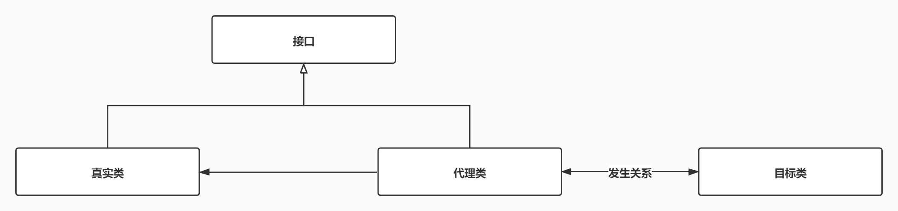
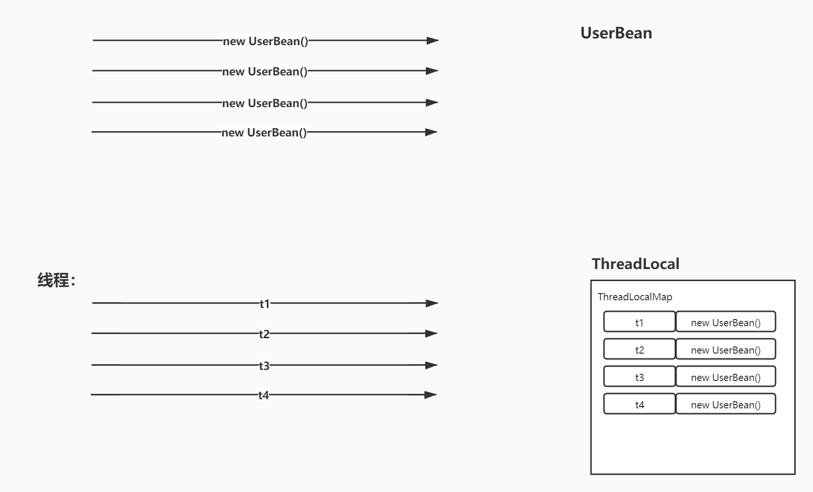

# 代理模式

生活中的代理：经纪人 是 明星的代理，律师 是 被告的代理。



> 使用场景：
>
> 1、如果想隐藏自己，就可以找个代理类，帮我们完成任务
>
> 2、如果想在自己完成任务之前，或完成任务之后，需要新增一个新的事务时，可以使用代理类

现实生活： 准备工作（约酒店，排婚纱照，发请柬） `结婚（人生大事）` 收尾的工作（给酒店支付钱，支付排婚纱照的钱）

公司：婚庆公司

现实生活： 代理人（你的哥们） 真实人（你） 初恋（买花，写情书，约她喝秋天的第1杯奶茶） 女孩

# 静态代理

`静态代理每一个真实类都要有一个对应的代理类`	

静态代理：看得见代理类的代理，这种就是静态代理

> 《上海滩》：丁力，许文强，冯程程

1、丁力非常喜欢 冯程程，但是丁力是挑担家，背景很差

2、许文强是知识分子，他跟丁力是朋友，兄弟关系

3、丁力给冯程程写信，送花，约电影，全让许文强帮忙

真实干事情的人：丁力

真实的代理：许文强

目标对象：冯程程


## 1、IProxy

```Java
public interface IProxy {
    /**
     * 送信
     */
    void sendLetter();
}
```

## 2、目标类Girl

```Java
public class Girl {
    private String girlName;
    public String getGirlName() {
        return girlName;
    }
    public void setGirlName(String girlName) {
        this.girlName = girlName;
    }
    @Override
    public String toString() {
        return "Girl [girlName=" + girlName + "]";
    }
    public Girl(String girlName) {
        super();
        this.girlName = girlName;
    }
    public Girl() {
        super();
        // TODO Auto-generated constructor stub
    }
}
```

## 3、真实类RealObject

```Java
public class RealObject implements IProxy{
    private Girl girl;
    /**
     * 构造器
     * @param girl
     */
    public RealObject(Girl girl) {
        super();
        this.girl = girl;
    }
    @Override
    public void sendLetter() {
        // TODO Auto-generated method stub
        System.out.println("给" + girl.getGirlName() + "送一封 情书！");
    }
}
```

## 4、代理类ProxyObject

```Java
/**
 * 代理对象
 * @author Administrator
 */
public class ProxyObject implements IProxy{
    private Girl girl;
    private RealObject real;
    public ProxyObject(Girl girl) {
        super();
        this.girl = girl;
        //内部拥有 真实对象的引用
        real = new RealObject(girl);
    }
    @Override
    public void sendLetter() {
        // TODO Auto-generated method stub
        //送信之前
        System.out.println("羞涩的给：女孩信！");
        real.sendLetter();
        //送信之后
        System.out.println("问：约么？");
    }
}
```

## 5、MainEnter测试类

```Java
public class MainEnter {
    public static void main(String[] args) {
        Girl girl = new Girl("冯程程");
        ProxyObject xwq = new ProxyObject(girl);
        xwq.sendLetter();
        //最后结果：许文强被  丁力干掉了。丁力最后成了上海滩老大
    }
}
```

# 动态代理

动态代理：看不到代理类的代理方式

动态代理：JDK代理，CGLIB代理

## 一、JDK代理

JDK代理：属于接口代理，真实类和代理类之间需要实现相同的接口。真实类和代理类之间的关系是“兄弟关系”！

### 1、IUserService

```java
public interface IUserService {
    void saveUser();
}
```

### 2、真实类UserServiceImpl

```java
/**
 * 真实类
 * @author 老蒲
 */
public class UserServiceImpl implements IUserService{
    @Override
    public void saveUser() {
        // TODO Auto-generated method stub
        System.out.println("约么？在么？饿了么？");
    }
}
```

### 3、代理类工厂JDKProxy

```java
/**
 * JDK代理类
 * @author 老蒲
 */
public class JDKProxy {
    /**
     * 目标对象（真实类）
     */
    private Object target;
    public void setTarget(Object target) {
        this.target = target;
    }
    //获取代理对象（JDKProxy类相当于一个工厂，生产代理对象）
    public Object getProxyInstance() {
        // target.getClass().getClassLoader() 得到目标对象的类加载器
        // target.getClass().getInterfaces() 得到目标对象的所有公共接口（从而实现获得的接口）
        return Proxy.newProxyInstance(target.getClass().getClassLoader(), target.getClass().getInterfaces(),
                new InvocationHandler() {
                    /**
                     * 调用代理对象的方法时 由真实对象去执行
                     */
                    @Override
                    public Object invoke(Object proxy, Method method, Object[] args) throws Throwable {
                        // TODO Auto-generated method stub
                        //proxy 即代理类本身
        				System.out.println(proxy.getClass().getName());
                        System.out.println("执行之前！");
                        Object result = method.invoke(target, args);
                        System.out.println("执行之后！");
                        return result;
                    }
                });
    }
}
```

### 4、MainEnter测试类

```java
public class MainEnter {
    public static void main(String[] args) {
        //真实对象
        IUserService userService = new UserServiceImpl();
        //通过代理工厂，产生代理实例
        JDKProxy proxyFactory = new JDKProxy();
        proxyFactory.setTarget(userService);
        //将代理实例，赋值给接口的引用
        IUserService proxy = (IUserService) proxyFactory.getProxyInstance();
        //调用方法
        proxy.saveUser();
        System.out.println(userService.getClass().getSuperclass());
        System.out.println(proxy.getClass().getSuperclass());
    }
}
```

## 二、CGLIB代理

CGLIB代理：属于子类代理

CGLIB代理，需要引入2个Jar包！它不是JDK提供的！

> cglib-2.2.2.jar
>
> asm-3.3.1.jar

### 1、UserService

```java
public class UserService {
    public void saveUser() {
        System.out.println("约么？在么？饿了么？");
    }
}
```

### 2、CglibProxy

```java
import java.lang.reflect.Method;
import net.sf.cglib.proxy.Enhancer;
import net.sf.cglib.proxy.MethodInterceptor;
import net.sf.cglib.proxy.MethodProxy;
/**
 * Cglib 代理
 * @author 老蒲
 */
public class CglibProxy implements MethodInterceptor{
    /**
     * 真实对象
     */
    private Object target;
    public Object getProxyInstance(Object target) {
        this.target = target;
        //加载CGLIB的核心类
        Enhancer enhance = new Enhancer();
        //指定父类是谁
        enhance.setSuperclass(this.target.getClass());
        //设置回调
        enhance.setCallback(this);
        //产生一个代理实例
        return enhance.create();
    }
    /**
     * 拦截方法
     * obj 代理对象
     * method 方法对象
     * args 方法参数
     * proxy 方法代理对象
     */
    @Override
    public Object intercept(Object obj, Method method, Object[] args, MethodProxy proxy) throws Throwable {
        // TODO Auto-generated method stub
        //proxy 即代理类本身
        System.out.println(proxy.getClass().getName());
        System.out.println("方法执行之前");
        Object result = proxy.invoke(target, args);
        System.out.println("方法执行之后");
        return result;
    }
}
```

### 3、MainEnter 测试代码

```java
public class MainEnter {
    public static void main(String[] args) {
        // TODO Auto-generated method stub
        //真实实例
        UserService us = new UserService();
        //根据Cglib产生代理实例
        CglibProxy proxyFactory = new CglibProxy();
        UserService proxy = (UserService) proxyFactory.getProxyInstance(us);
        //调用代理的方法
        proxy.saveUser();
        System.out.println(us.getClass().getSuperclass());
        System.out.println(proxy.getClass().getSuperclass());
    }
}
```

## 三、JDK代理和CGLIB代理的区别

1、代理原理不一样，JDK代理是属于接口代理，实现类上一定要有个接口，代理工厂产生的代理类和真实类之间是兄弟关系；而CGLIB 代理属于子类代理，代理工厂产生的代理类和真实类之间是父子关系（真实类是父，代理类是子）。

2、JDK代理通过JVM底层在内存中根据接口，动态产生一个代理实例出来；而Cglib是依靠ASM 字节码框架才能产生，不是JDK自带的。

# 使用CGLIB完成事务控制

## 一、动态代理

可以在真实方法处理之前，或处理之后，添加一些新的业务！

## 二、ThreadLocal

ThreadLocal：线程变量副本

> 简化：多线程大量的创建 相同类型的对象
>
> 作用：相同的线程，获得的永远是相同的副本对象
>
> CGLIB管理事务必须要作用同一个sqlsession,可通过threadlocal实现。



> 先导入2个Jar包！
>
> cglib-2.2.2.jar
>
> asm-3.3.1.jar

### 1、CglibProxy

```java 
import java.lang.reflect.Method;
import org.apache.ibatis.session.SqlSession;
import net.sf.cglib.proxy.Enhancer;
import net.sf.cglib.proxy.MethodInterceptor;
import net.sf.cglib.proxy.MethodProxy;
/**
 * 代理工具类
 * @author 老蒲
 *
 */
public class CglibProxy implements MethodInterceptor{
    /**
     * 真实对象
     */
    private Object target;
    public Object getProxyInstance(Object target) {
        this.target = target;
        //加载CGLIB的核心类
        Enhancer enhance = new Enhancer();
        //指定父类是谁
        enhance.setSuperclass(this.target.getClass());
        //设置回调
        enhance.setCallback(this);
        //产生一个代理实例
        return enhance.create();
    }
    /**
     * 拦截方法
     * obj 代理对象
     * method 方法对象
     * args 方法参数
     * proxy 方法代理对象
     */
    @Override
    public Object intercept(Object obj, Method method, Object[] args, MethodProxy proxy) throws Throwable {
        // TODO Auto-generated method stub
//        System.out.println("方法执行之前");
        SqlSession session = SessionUtil.getSession();
        //调用真实对象的方法执行代码
        Object result = null;
        try {
            result = proxy.invoke(target, args);
            //事务提交
            session.commit();
        } catch (Exception e) {
            // TODO: handle exception
            e.printStackTrace();
            //事务回滚
            session.rollback();
        }
        return result;
    }
}
```

### 2、BeanFactory

```java 
    /**
     * 
     * @param str 类的全限名
     * @return
     * @throws DocumentException 
     * @throws IllegalAccessException 
     * @throws InstantiationException 
     * @throws ClassNotFoundException 
     */
    public Object getBean(String str) throws DocumentException, ClassNotFoundException, InstantiationException, IllegalAccessException {
        Map<String,Object> map = xml2map();
        CglibProxy proxyFactory = new CglibProxy();
        //能不能返回代理对象？
        if(map.containsKey(str)) {
            //代理实例
            return proxyFactory.getProxyInstance(map.get(str));
        }
        return null;
    }
```

### 3、修改SessionUtil

> 使用：线程变量副本类

```java 
import java.io.IOException;
import java.io.Reader;
import org.apache.ibatis.io.Resources;
import org.apache.ibatis.session.SqlSession;
import org.apache.ibatis.session.SqlSessionFactory;
import org.apache.ibatis.session.SqlSessionFactoryBuilder;
public class SessionUtil {
    static SqlSessionFactory factory = null;
    static ThreadLocal<SqlSession> local = new ThreadLocal<SqlSession>(){
        //设置初始化的值
        protected SqlSession initialValue() {
            return factory.openSession();
        };
    };
    static {
        String resource = "mybatis-config.xml";
        try {
            Reader reader = Resources.getResourceAsReader(resource);
            //依靠建造者模式，产生工厂类
            factory = new SqlSessionFactoryBuilder().build(reader);
        } catch (IOException e) {
            // TODO Auto-generated catch block
            e.printStackTrace();
        }
    }
    public static SqlSession getSession() {
        if(local.get() != null) {
            return local.get();
        }else {
            SqlSession session = factory.openSession();
            local.set(session);
            return local.get();
        }
    }
}
```

### 4、删除所有*ServiceImpl的事务代码

```java 
import java.util.List;
import org.apache.ibatis.session.SqlSession;
import com.woniuxy.day0825.deptmag.mapper.DeptMapper;
import com.woniuxy.day0825.deptmag.service.DeptService;
import com.woniuxy.day0825.entity.DeptBean;
import com.woniuxy.day0825.util.SessionUtil;
/**
 * 部门业务实现类
 */
public class DeptServiceImpl implements DeptService {
    private SqlSession session = SessionUtil.getSession();
    private DeptMapper deptMapper;
    {
        // 从Mybatis中获得DeptMapper接口的实现类
        deptMapper = session.getMapper(DeptMapper.class);
    }
    @Override
    public void saveDept(DeptBean dept) {
        // TODO Auto-generated method stub
        deptMapper.saveDept(dept);
    }
    @Override
    public void updateDept(DeptBean dept) {
        // TODO Auto-generated method stub
        deptMapper.updateDept(dept);
    }
    @Override
    public void deleteDept(int id) {
        // TODO Auto-generated method stub
        deptMapper.deleteDept(id);
    }
    @Override
    public DeptBean getDeptById(int id) {
        // TODO Auto-generated method stub
        return deptMapper.getDeptById(id);
    }
    @Override
    public List<DeptBean> findByDeptName(String deptName) {
        // TODO Auto-generated method stub
        return deptMapper.findByDeptName(deptName);
    }
    @Override
    public void saveBatchDept(List<DeptBean> depts) {
        // TODO Auto-generated method stub
        deptMapper.saveBatchDept(depts);
    }
    @Override
    public void deleteBatchDept(Integer[] ids) {
        // TODO Auto-generated method stub
        deptMapper.deleteBatchDept(ids);
    }
}
```

# 注解概述

注解：是JDK1.5提出的一种新的数据类型 ，注解主要可以配置：方法上，属性上，类上。用来获得方法、属性，类的某些信息!

本质上，依旧是个接口，继承了java.lang.annotation.Annotation接口的接口

常见的注解：[@Override](https://github.com/Override) [@Test](https://github.com/Test) [@Before](https://github.com/Before) [@After](https://github.com/After) [@Param](https://github.com/Param) [@Ignore](https://github.com/Ignore)

> **注解的作用：**
>
> 1、注释代码
>
> 2、与第3方达成约定 ，例如：[@Override](https://github.com/Override) 跟JVM达成约定，说这下面这个方法是一个重写方法
>
> 3、替代XML配置文件 约定优于配置

------

## Java三大内置注解

### @Override：

重写注解，没有任何的属性，所以并不能存储任何其他信息。它只能作用于方法之上，编译结束后将被丢弃。

### @Deprecated

弃用注解，标记当前的类或者方法或者字段等已经不再被推荐使用了，可能下一次的 JDK 版本就会删除。

### @SuppressWarnings

警告压制注解

如何自定义注解：需要使用到元注解 [@Target](https://github.com/Target) [@Retention](https://github.com/Retention) [@Documented](https://github.com/Documented)

## java四大源注解

### @Target

:注解的作用目标, 用于指明被修饰的注解最终可以作用的目标是谁，也就是指明，你的注解到底是用来修饰方法的？修饰类的？还是用来修饰字段属性的。

```java
@Target(value = { ElementType.METHOD })
@Target(value =  ElementType.METHOD )
@Target(ElementType.METHOD )
```

value类型为ElementType[ ]，因此可以指定多个作用目标(之间用逗号隔开)，当只有一个左右目标时，{}可以省略；也可以省去value，直接写值。

> ElementType.TYPE：允许被修饰的注解作用在类、接口和枚举上
>
> ElementType.FIELD：允许作用在属性字段上
>
> ElementType.METHOD：允许作用在方法上
>
> ElementType.PARAMETER：允许作用在方法参数上
>
> ElementType.CONSTRUCTOR：允许作用在构造器上
>
> ElementType.LOCAL_VARIABLE：允许作用在本地局部变量上
>
> ElementType.ANNOTATION_TYPE：允许作用在注解上
>
> ElementType.PACKAGE：允许作用在包上

### @Retention

:描述该注解的生命周期

```java
@Retention(value = RetentionPolicy.RUNTIME)
@Retention(RetentionPolicy.RUNTIME)
```

value的类型为RetentionPolicy[ ],书写形式：value=值，或者省略value，直接写值（与@target不同，不能写{}）

> RetentionPolicy.SOURCE：当前注解编译期可见，不会写入 class 文件
> RetentionPolicy.CLASS：类加载阶段丢弃，会写入 class 文件
> RetentionPolicy.RUNTIME：永久保存，可以反射获取

### @Documented

:该注解支持文档注释，可以使用javadoc.exe 将该注解导出到API文件中

### @Inherited

:是否允许子类继承该注解

# 注解定义与使用

属性值只能是基本类型，Class，String，enum

可以通过default来声明属性的默认值

**`如果只有一个属性，一般属性名为value，使用注解设置值时value可以省略，若使用其他属性名，不能省略`**

注解元素必须要有值，我们定义注解元素时，经常使用空字符串，0作为默认值

注解属性设置值时没有顺序要求

> 以[@Entity](https://github.com/Entity) [@Column](https://github.com/Column) [@Id](https://github.com/Id)为例

1、[@Entity](https://github.com/Entity)

```java
import java.lang.annotation.Documented;
import java.lang.annotation.ElementType;
import java.lang.annotation.Retention;
import java.lang.annotation.RetentionPolicy;
import java.lang.annotation.Target;
/**
 * @interface 声明一个注解
 * @author 老蒲
 *
 */
@Documented
@Retention(RetentionPolicy.RUNTIME)
@Target(value= {ElementType.TYPE})
public @interface Entity {
    /**
     * 定义属性,后面一定要添加()
     * default "" 如果不写，该属性是一个必填属性,使用注解时必须给该属性赋值
     * @return
     */
    String database() default "";
    String name();
}
```

2、[@Id](https://github.com/Id)

```java
import java.lang.annotation.Documented;
import java.lang.annotation.ElementType;
import java.lang.annotation.Retention;
import java.lang.annotation.RetentionPolicy;
import java.lang.annotation.Target;
@Documented
@Target(ElementType.FIELD)
@Retention(RetentionPolicy.RUNTIME)
public @interface Id {
    String column();
    String desc() default "";
}
```

3、 [@Column](https://github.com/Column)

```java
import java.lang.annotation.Documented;
import java.lang.annotation.ElementType;
import java.lang.annotation.Retention;
import java.lang.annotation.RetentionPolicy;
import java.lang.annotation.Target;
@Documented
@Target(ElementType.FIELD)
@Retention(RetentionPolicy.RUNTIME)
public @interface Column {
    String column();
    /**
     * String类型的值，最长可以达到多少
     * admin_name  varchar(20)
     * @return
     */
    int lenth();
    String desc() default "";
}
```

4、具体的使用

```java
import java.io.Serializable;
import com.woniuxy.proxy.anno.Column;
import com.woniuxy.proxy.anno.Entity;
import com.woniuxy.proxy.anno.Id;
@Entity(name = "user_info", database = "woniuxy")
public class UserBean implements Serializable{
    /**
     * 
     */
    private static final long serialVersionUID = 7967553890937926468L;
    @Id(column = "id",desc="用户ID！")
    private Integer id;
    @Column(column="user_name",lenth=20,desc="用户名称！")
    private String userName;
    @Column(column="login_name",lenth=20,desc="登录名称！")
    private String loginName;
    @Column(column="password",lenth=32,desc="密码！")
    private String password;
    public UserBean() {
        super();
        // TODO Auto-generated constructor stub
    }
    public UserBean(String userName, String loginName, String password) {
        super();
        this.userName = userName;
        this.loginName = loginName;
        this.password = password;
    }
    //省略了大量的getter与setter()
}
```

```java
package com.apexsoft.prac.P06注解;

import java.lang.annotation.*;

/**
 * @author Zz
 */

public class AnnotationDefTest {

    @XAnnotation("sushi")
    public void test(){

    }

    //name省略会报错
    @GAnnotation(name = "test2")
    public void test2(){

    }

    //注解属性设置值时没有顺序要求
    @TAnnotation(id = "1")
    public void test3(){

    }
}


/**
 * @author Zz
 */
@Documented
@Retention(RetentionPolicy.RUNTIME)
@Target({ElementType.TYPE,ElementType.METHOD})
@interface XAnnotation {

    //注解属性后面带有括号，若只有一个属性，且属性名称为value,使用注解给属性赋值时value可以省略
    String value();
}

/**
 * @author Zz
 */
@Documented
@Retention(RetentionPolicy.RUNTIME)
@Target(ElementType.METHOD)
@interface GAnnotation{
    String name();
}

/**
 * @author Zz
 */
@Documented
@Retention(RetentionPolicy.RUNTIME)
@Target(ElementType.METHOD)
@interface TAnnotation{
    String[] names() default {"1","2"};
    int age() default 0;
    String hobby() default "swim";
    String id();
}
```

# 反射获取注解信息

## 获取注解

```java
/**
 * @author Zz
 */
//生成的javadoc文档中，使用了该注解的类，方法也会现实该注解
@Documented
//指定注解的使用位置，值为数组
//@Target({ElementType.ANNOTATION_TYPE,ElementType.TYPE,ElementType.METHOD,ElementType.FIELD})
@Target(value = {ElementType.ANNOTATION_TYPE,ElementType.TYPE,ElementType.METHOD,ElementType.FIELD})
//指定注解的生命周期 RESOURCE<CLASS<RUNTIME
 @Retention(RetentionPolicy.RUNTIME)
@Inherited
public @interface MyAnnotation {
 String desc();
 String name();
}

```

```java
package com.apexsoft.anno.java;
@MyAnnotation(desc = "老师类", name = "teacher")
public class Teacher {
    private String name;
    private int id;

    public String getName() {
        return name;
    }

    public void setName(String name) {
        this.name = name;
    }

    public int getId() {
        return id;
    }

    public void setId(int id) {
        this.id = id;
    }
}
```

```java
package com.apexsoft.anno.java;

public class ReflactAnnotationTest {
    public static void main(String[] args) throws Exception{
        Class c = Class.forName("com.apexsoft.anno.java.Teacher");
        //判断注解是否存在
        if(c.isAnnotationPresent(MyAnnotation.class)){
            //获取注解
            MyAnnotation annotation = (MyAnnotation)c.getAnnotation(MyAnnotation.class);
            System.out.println(annotation.name());
            System.out.println(annotation.desc());
        }
    }
}
```

## 反射注解代理实现事务

**1、创建注解**

[@Transactional](https://github.com/Transactional) 作用在：方法上 生命周期：Runtime 添加属性：String methodName()

```java
import java.lang.annotation.Documented;
import java.lang.annotation.ElementType;
import java.lang.annotation.Retention;
import java.lang.annotation.RetentionPolicy;
import java.lang.annotation.Target;
@Documented
@Target(ElementType.METHOD)
@Retention(RetentionPolicy.RUNTIME)
public @interface Transactional {
    String methodName();
}
```

------

**2、添加注解**

将该注解作用在所有需要进行事务提交的方法上！*ServiceImpl类上的新增，修改，删除方法上，需要添加该注解！

------

> 要求：所有添加的[@Transactional](https://github.com/Transactional)的方法，都必须要事务处理

**3、修改CglibProxy上的intercept()**

```java
/**
 * 拦截方法
 * obj 代理对象
 * method 方法对象
 * args 方法参数
 * proxy 方法代理对象
 */
@Override
public Object intercept(Object obj, Method method, Object[] args, MethodProxy proxy) throws Throwable {
    // TODO Auto-generated method stub
    Object result = null;
    //通过反射得到主键对象
    Transactional trans = method.getAnnotation(Transactional.class);
    if(trans == null) {
        result = proxy.invoke(target, args);
    }else {//需要处理事务
        SqlSession session = SessionUtil.getSession();
        try {
            result = proxy.invoke(target, args);
            //事务提交
            session.commit();
        } catch (Exception e) {
            // TODO: handle exception
            e.printStackTrace();
            //事务回滚
            session.rollback();
        }
    }
    return result;
}
```
