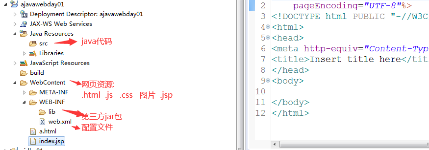
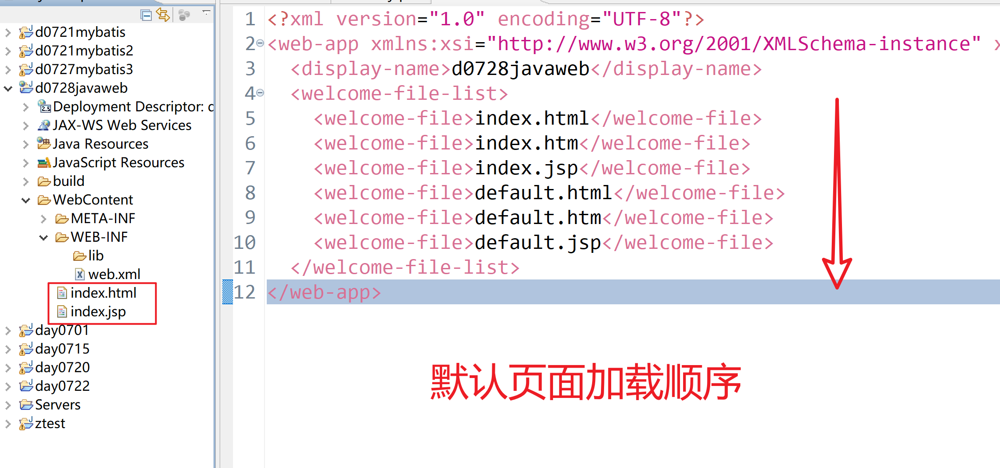
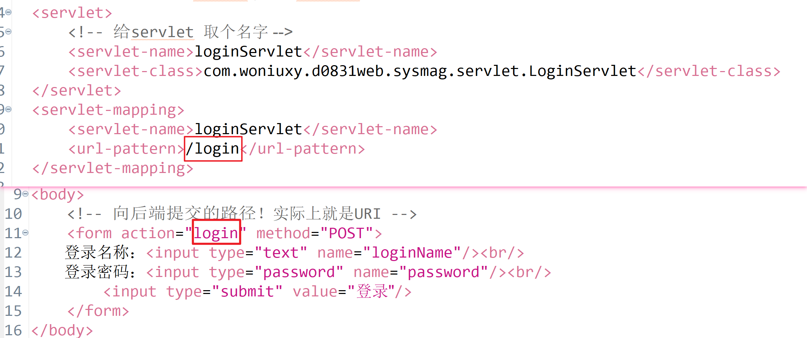

# JavaWeb概述

以Java作为服务器端运行的语言，实现可以动态交互一个网站。

Java基础+JDBC+MyBatis+MYSQL+HTML+CSS+JS+jQurey 

JavaWeb:JSP Servlet（原生API）

# B/S与C/S

一、B/S 与 C/S

WEB系统：是基于网页和HTTP协议的，支持全球性的，动态交互的，跨平台的一种分布式图形系统！

例如：百度，淘宝，谷歌，京东，


WEB系统，通常有2种表现架构方式：B/S C/S

> B/S 浏览器/服务端模式 轻量级的方式
>
> C/S 客户端/服务端模式 重量级的方式

B/S架构模式的特点：

1. 客户端不需要安装，直接使用浏览器即可
2. 系统升级，用户只需要刷新浏览器即可
3. 浏览器不需要用户自己安装

------

C/S架构模式的特点：

1. 客户端需要用户自己下载安装
2. 系统升级，用户需要下载安装包或更新包进行升级

> 所有C/S架构，比B/S架构更加的重量级！

------

> 开发一个WEB系统，我们都需要什么技术？
>
> 1. TOMCAT服务器技术
> 2. 网页编程技术：HTML CSS JS JQUERY ……
> 3. HTTP通讯技术
> 4. Java WEB的编程技术


# Http协议概述

HTTP：HyperText Transform Protocal 超文本传输协议，一种专门用于浏览器和WEB程序之间进行通讯的协议！

该协议是：TCP/IP协议的上层协议

该协议的里程碑的版本：

96年5月 HTTP1.0版本，97年1月 HTTP1.1版本（到目前，都是使用最多的），12年发布HTTP 2.0 …… 3.0还在路上！

HTTP1.1协议的特点：

1. 支持缓存处理 （可以让浏览器，根据协议的的内容，完成对某些数据的缓存处理）
2. 使用了带宽优化以及网络连接的使用 （支持请求资源时，可以只请求某一部分）
3. 扩大了对错误通知的管理 （例如：404 400 302 200 502 …… 新增了24个错误状态码）
4. 支持长连接
5. 满足请求响应模式

> 请求响应模式：浏览器发起请求，后端给与响应！不能反着来！后端服务器不会主动给浏览器发送任何东西！

一、HTTP协议的请求方式

HTTP协议的请求方式：GET、POST、PUT、DELETE、HEAD、CONNECT、OPTIONS、TRACE

需要我们记住的：

| 请求方法 | 应用场景             | 成功状态码 | 描述                                         |
| :------- | :------------------- | :--------- | :------------------------------------------- |
| GET      | 查询数据             | 200        | 向服务器发送请求，获得某些数据！             |
| POST     | 新增数据[修改，删除] | 200        | 向服务器发送请求，新增，修改，删除某些数据！ |
| PUT      | 修改数据             | 200        | 向服务器发送请求，修改某些数据！             |
| DELETE   | 删除数据             | 200        | 向服务器发送请求，删除某些数据！             |

HTTP协议的组成：请求协议、响应协议

**1、请求协议的组成**

语法格式：4个部分

```java
请求行：请求方法  请求路径  协议的版本
请求头：以K-V结构方式存在
空行
请求体：向后端携带参数 (GET携带参数时，不走请求体)
```

> 请求头：向后端告知浏览器的相关信息！

浏览器在发送HTTP请求时，必须要严格遵从上述的协议格式，否则后端服务器将无法解读该协议！

举例说明：

```xml
POST /hello/index.jsp HTTP/1.1
Accept: image/gif, image/jpeg, image/pjpeg, image/pjpeg, application/msword, application/vnd.ms-excel, application/vnd.ms-powerpoint, application/x-ms-application, application/x-ms-xbap, application/vnd.ms-xpsdocument, application/xaml+xml, */*
Referer: http://localhost:8080/hello/index.jsp
Accept-Language: zh-cn,en-US;q=0.5
User-Agent: Mozilla/5.0 (Windows NT 10.0; Win64; x64) AppleWebKit/537.36 (KHTML, like Gecko) Chrome/92.0.4515.159 Safari/537.36
Content-Type: application/x-www-form-urlencoded
Accept-Encoding: gzip, deflate
Host: localhost:8080
Content-Length: 12
Connection: Keep-Alive
Cache-Control: no-cache
Cookie: JSESSIONID=E365D980343B9307023A1D271CC48E7D

loginName=zs
```

**2、响应协议的组成**

后端返回给浏览器的一种HTTP协议的格式！

语法格式：

```java
响应行：协议版本 状态码 状态码的描述
响应头：以K-V结构方式存在
空行
响应体：向浏览器携带数据
```

> 响应头：是后端要告诉浏览器的内容！

举例说明：

```html
HTTP/1.1 200 OK
Server: Apache-Coyote/1.1
Content-Type: text/html;charset=UTF-8
Content-Length: 724
Set-Cookie: JSESSIONID=C97E2B4C55553EAB46079A4F263435A4; Path=/hello
Date: Wed, 25 Sep 2012 04:15:03 GMT
<!DOCTYPE HTML PUBLIC "-//W3C//DTD HTML 4.01 Transitional//EN">
<html>
  <head>
    <base href="http://localhost:8080/hello/">
    <title>My JSP 'index.jsp' starting page</title>
    <meta http-equiv="pragma" content="no-cache">
    <meta http-equiv="cache-control" content="no-cache">
    <meta http-equiv="expires" content="0">    
    <meta http-equiv="keywords" content="keyword1,keyword2,keyword3">
    <meta http-equiv="description" content="This is my page">
    <!--
    <link rel="stylesheet" type="text/css" href="styles.css">
    -->
  </head>
  <body>
<form action="" method="post">
  关键字：<input type="text" name="keyword"/>
  <input type="submit" value="提交"/>
</form>
  </body>
</html>
```

java环境变量配置：windows系统下是不区分大小写的，classpath跟CLASSPAHT， path跟PATH ，java_home跟JAVA_HOME效果一样。

## 请求协议

格式

> 请求首行
> 请求头信息
> 空行
> 请求体

请求头：都是key-value对数据， 包含特定客户端信息

请求体：get请求没有请求体，post请求的请求体就是用户提交到服务器的数据

get请求：

	浏览器地址栏直接输入地址访问
	
	超链接
	
	表单提交，默认get 
	
	Ajax使用get提交

post请求

	表单post提交
	
	Ajax使用post提交

## 响应协议

格式

> 响应首行
> 响应头信息
> 空行
> 响应体

响应状态码

	200	正常
	
	302	重定向
	
	404	访问的资源不存在
	
	405 	post/get请求没有对应处理请求的方法
	
	500	服务器java代码异常

响应头：都是key-value对，响应头包含特定响应给客户端信息，客户端对每个响应头按照特定的规则进行解析

# URL和URI

## 一、URL和URI

URI：Uniform Resource Identifier 统一资源修饰符/标识符 主要用于在服务器上标识某些资源

例如：

20210831/order/9527 标识的是：20210831号一个编号为9527的订单资源

playvideo/127881 标识的是：一个编号为127881 的视频资源

sc/toNote/8900-473 标识的是：一个编号为8900-473 的四川老师发布的笔记

------

URL：Uniform Resource Location 统一资源定位符 主要用于服务器上资源进行网络定位

语法：

```html
协议://域名:端口/路径?查询参数
```

例如：

http://woniuxy.com/sc/toNote/8900-473

http://woniuxy.com/playvideo/127881

> http 是协议
>
> woniuxy.com 是域名
>
> 端口：80 80端口是可以省略的
>
> sc/toNote/8900-473 路径，实际上就是URI

所以URL 包含了URI的！

## 二、URI的作用

浏览器上，使用URI标识某一个资源，使用HTTP4种标准方法完成对资源的CRUD！

# Tomcat的安装和配置

## 一、WEB服务器

WEB服务器：一种专门用来接收浏览器请求的服务器！

web服务器作用：处理请求，响应用户

Tomcat 			Apache	开源免费	  JavaWeb服务器

JBoss				RedHat	 收费				JavaEE容器，支持EJB 

GlassFish		Oracle 	  收费				JavaEE容器，支持EJB 

WebLogic		Oracle		收费				JavaEE容器，支持EJB

Websphere  	IBM 		   收费				JavaEE容器，支持EJB

EJB-Enterprise Java Bean


常见的WEB服务器：Apache （早些年的产品），Nginx（目前使用最多的）

> WEB服务器通常放置静态代码，例如：HTML CSS JS……


WEB容器：才是放置Java代码的东西！

## 二、Tomcat容器

Tomcat ：Tom猫 是Apache平台和SUN公司合作产生出来的产品，这个产品：集成WEB服务器接收用户请求的模块，以及集成了传统WEB容器放置Java代码的模块！

所以：Tomcat容器，也被称为：Tomcat服务器

但是这个服务器由于是简化版，所以性能不算太高，但是同时支持：300-500个并发量还是可以的！

例如：几千人的校园网站系统，蜗牛官网…… 但是：淘宝，京东，百度 那是100%扛不住……

解决方案：集群

------

其他的WEB容器：

WebLogic bea公司 收费

WebSphere 微软 收费

JBoss Redhat 收费

Jetty 免费的

**1、Apache-Tomcat**

下载地址：https://tomcat.apache.org/download-80.cgi


**2、Tomcat的安装**

解压即可！

------

配置环境变量：TOMCAT_HOME PATH

TOMCAT_HOME：E:\apache-tomcat-8.0.53-windows-x64\apache-tomcat-8.0.53

PATH：;%TOMCAT_HOME%\bin; (win7系统)

​			  %TOMCAT_HOME%\bin (win10系统)

启动：startup.bat


**3、Eclipse 集成Tomcat**

通过菜单 windows-preferences 打开如下界面：


双击Tomcat 配置如下路径：


------

tomcat的目录介绍：

bin 目录 ：放置的tomcat 的启动或关闭的二进制脚本

conf 目录：tomcat的 配置文件所在的目录

lib 目录：tomcat的jar 库文件

logs 目录：tomcat 的启动，运行日志文件

temp 目录：临时目录

webapps 目录：用于放置java 的WEB程序！

work 目录：用于放置jsp 翻译过后的java文件，以及class文件！

**4、创建WEB项目**







**5、部署WEB项目到Tomcat**


访问地址：http://localhost:8080/web01/

> URL： 协议://IP地址:端口/路径

# Servlet的初步使用

Servlet 也是一个Java类，只是这个Java类的作用：可以用来接收用户通过浏览器发起的请求！

> 作用：
>
> 1. 获得用户发起的请求参数
> 2. 针对用户发起的数据进行有效性的校验
> 3. 调用业务逻辑层的代码，完成业务逻辑
> 4. 根据调用业务层代码返回后的结果，响应数据给浏览器

Servlet 必须运行在Tomcat这种WEB容器中，Servlet实现了javax.servlet.Servlet接口中代码！

Servlet API的地址：http://tomcat.apache.org/tomcat-5.5-doc/servletapi/javax/servlet/package-summary.html


> Servlet 规范要求：自定义Servlet时，只需要继承HttpServlet 即可实现Servlet接口中的所有方法！

**1、index.jsp**

```java
<%@ page language="java" contentType="text/html; charset=UTF-8"
    pageEncoding="UTF-8"%>
<!DOCTYPE html>
<html>
<head>
<meta charset="UTF-8">
<title>Insert title here</title>
</head>
<body>
    <!-- 向后端提交的路径！实际上就是URI -->
    <form action="login" method="POST">
        登录名称：<input type="text" name="loginName"/>
        <br/>
        登录密码：<input type="password" name="password"/>
        <br/>
        <input type="submit" value="登录"/>
    </form>
</body>
</html>
```

**2、LoginServlet类**

```java
import java.io.IOException;
import javax.servlet.ServletException;
import javax.servlet.http.HttpServlet;
import javax.servlet.http.HttpServletRequest;
import javax.servlet.http.HttpServletResponse;
/**
 * 登录Servlet类
 * @author 老蒲
 *
 */
public class LoginServlet extends HttpServlet{
    /**
     * 
     */
    private static final long serialVersionUID = 4876214152284486264L;
    /**
     * 重写的方法
     * req 请求对象
     * resp 响应对象
     */
    @Override
    protected void doPost(HttpServletRequest req, HttpServletResponse resp) throws ServletException, IOException {
        // TODO Auto-generated method stub
        //loginName 对应着表单中input 标签的name 属性
        String loginName = req.getParameter("loginName");
        String password = req.getParameter("password");
        System.out.println(loginName);
        System.out.println(password);
        //请求转发(跳转页面)
        req.getRequestDispatcher("main.jsp").forward(req, resp);
    }
}
```

**3、在web.xml中，配置Servlet**

```java
<?xml version="1.0" encoding="UTF-8"?>
<web-app xmlns:xsi="http://www.w3.org/2001/XMLSchema-instance" xmlns="http://xmlns.jcp.org/xml/ns/javaee" xsi:schemaLocation="http://xmlns.jcp.org/xml/ns/javaee http://xmlns.jcp.org/xml/ns/javaee/web-app_3_1.xsd" id="WebApp_ID" version="3.1">
  <display-name>web01</display-name>
  <!-- 设置欢迎界面 -->
  <welcome-file-list>
    <welcome-file>index.jsp</welcome-file>
  </welcome-file-list>
  <!-- 通过web.xml 向Tomcat中注册Servlet -->
  <servlet>
      <!-- 给servlet 取个名字 -->
      <servlet-name>loginServlet</servlet-name>
      <servlet-class>com.woniuxy.web01.sysmag.servlet.LoginServlet</servlet-class>
  </servlet>
  <servlet-mapping>
      <servlet-name>loginServlet</servlet-name>
      <url-pattern>/login</url-pattern>
  </servlet-mapping>
</web-app>
```

> 当然也可以使用注解[@WebServlet](https://github.com/WebServlet)，进行配置Servlet
>
> 一定要将web.xml 中的Servlet配置，删除掉！ 二选其一

```java
import java.io.IOException;
import javax.servlet.ServletException;
import javax.servlet.annotation.WebServlet;
import javax.servlet.http.HttpServlet;
import javax.servlet.http.HttpServletRequest;
import javax.servlet.http.HttpServletResponse;
/**
 * 登录Servlet类
 * @author 老蒲
 *
 */
@WebServlet(name="loginServlet",urlPatterns="/login")
public class LoginServlet extends HttpServlet{
    /**
     * 
     */
    private static final long serialVersionUID = 4876214152284486264L;
    /**
     * 重写的方法
     * req 请求对象
     * resp 响应对象
     */
    @Override
    protected void doPost(HttpServletRequest req, HttpServletResponse resp) throws ServletException, IOException {
        // TODO Auto-generated method stub
        //loginName 对应着表单中input 标签的name 属性
        String loginName = req.getParameter("loginName");
        String password = req.getParameter("password");
        System.out.println(loginName);
        System.out.println(password);
        //请求转发(跳转页面)
        req.getRequestDispatcher("main.jsp").forward(req, resp);
    }
}
```

# Servlet的生命周期

Servlet：单实例多线程

在Tomcat中每个Servlet 都只有1个唯一的实例，这个唯一的实例可以同时被多个线程进行访问！

> 整个生命周期： 编译-加载-实例化-初始化-服务化-销毁

实例化：Tomcat容器创建Servlet的实例，而且只创建1次

初始化：Tomcat针对Servlet 做一些初始的任务，初始任务，需要配合init()

服务阶段：Servlet 针对不同HTTP请求方法，提供不同的支持，需要配合service()

销毁：关闭Tomcat时，Tomcat会销毁产生所有Servlet实例，需要配合destroy()

> 其中编译，加载，实例化，初始化，销毁都只做1次
>
> 服务化：做多次

| Servlet生命周期方法 | 描述                                                    |
| :------------------ | :------------------------------------------------------ |
| init()              | 初始化，作用：初始化Servlet实例                         |
| service()           | 服务方法，在HttpServlet中已经演变为：doGet()/doPost()…… |
| destroy()           | 销毁方法，作用：销毁Servlet实例                         |


# URL地址匹配规则

**1、精准路径**

> 精准路径：一个非常明确的路径

```java
@WebServlet(name = "loginServlet", urlPatterns = "/login")
```

**2、扩展名匹配**

> 常见的扩展名： .do .action .spring

```java
@WebServlet(name = "loginServlet", urlPatterns = "*.do")
```

**3、路径匹配**

```java
@WebServlet(name = "loginServlet", urlPatterns = "/sys/*")
```

**4、任意匹配**

```java
@WebServlet(name = "loginServlet", urlPatterns = "/")或@WebServlet(name = "loginServlet", urlPatterns = "/*")
```

> / 如果其他路径无法匹配，那么就匹配这个路径
>
> /* 所有请求都匹配到这个路径上来，通常：在过滤器中使用的比较多

我们在写Servlet的时候，使用的最多的：精准路径

# 核心 API

## 一、ServletConfig

ServletConfig ：Servlet 的配置类

作用：可以针对Servlet 在初始化，做一些准备的配置工作！

每个Servlet 都有一个对应的ServletConfig对象！


第1种使用方法：在web.xml 中配置初始化参数

```xml
<servlet>
  <servlet-name>loginServlet</servlet-name>
  <servlet-class>com.woniuxy.web01.sysmag.servlet.LoginServlet</servlet-class>
  <!-- 初始化参数 -->
  <init-param>
      <param-name>encoding</param-name>
      <param-value>UTF-8</param-value>
  </init-param>
<!--       <init-param>
      <param-name></param-name>
      <param-value></param-value>
  </init-param> -->
</servlet>
<servlet-mapping>
  <servlet-name>loginServlet</servlet-name>
  <url-pattern>/login</url-pattern>
</servlet-mapping>
```

Servlet 中 使用init(ServletConfig config) 方法进行获取参数

```java
public class LoginServlet extends HttpServlet {
    /**
     * 编码集
     */
    private String encoding;
    /**
     * 初始化方法
     * 而且只执行1次
     */
    @Override
    public void init(ServletConfig config) throws ServletException {
        // TODO Auto-generated method stub
        //从配置中，获得相关的配置信息
        encoding = config.getInitParameter("encoding");
    }
    //省略了doPost（）
}
```

------

第2种方式：使用注解

```java
@WebServlet(name = "loginServlet", urlPatterns = "/login",initParams= {
    @WebInitParam(name = "encoding", value = "utf-8")
//    ,@WebInitParam(name = "encoding", value = "utf-8")
})
public class LoginServlet extends HttpServlet {
    /**
     * 编码集
     */
    private String encoding;
    /**
     * 初始化方法
     * 而且只执行1次
     */
    @Override
    public void init(ServletConfig config) throws ServletException {
        // TODO Auto-generated method stub
        //从配置中，获得相关的配置信息
        encoding = config.getInitParameter("encoding");
    }
}
```

## 二、ServletContext

ServletContext ：Servlet 上下文对象 Tomcat 针对每个WEB程序只提供1个ServletContext 对象。

该对象，也是Java WEB程序可以和Tomcat容器进行交互的唯一途径！

整个Tomcat的生命周期范围内，该对象都存在！同一WEB项目中，所有Servlet 共享 一个ServletContext ！

作用：

1. Servlet之间可以使用ServletContext ，进行数据的交换
2. 可以使用ServletContext上下文对象 ，设置全局变量

##### 1、数据的交换

LoginServlet的doPost()

```java
//得到Servlet上下文对象，并向该对象添加属性
ServletContext context = req.getServletContext();
context.setAttribute("user", "张三");
```

UserServlet的doGet()

```java
ServletContext context = req.getServletContext();
System.out.println(context.getAttribute("user"));
```

##### 2、可以设置全局参数

web.xml 使用context-param 标签，针对ServletContext 进行属性赋值

```xml
<!-- 设置Servlet上下文参数 -->
<context-param>
  <param-name>encoding</param-name>
  <param-value>utf-8</param-value>
</context-param>
<!--   <context-param>
  <param-name></param-name>
  <param-value></param-value>
</context-param> -->
```

在所有的Servlet中，都可以取值

```java
@Override
protected void doGet(HttpServletRequest req, HttpServletResponse resp) throws ServletException, IOException {
    // TODO Auto-generated method stub
    //获得ServletContext上下文对象
    ServletContext context = req.getServletContext();
    //通过getInitParameter() 获得对应的值
    String value =  context.getInitParameter("encoding");
    System.out.println(value);
}
```

##### 3、其他的方法

| 方法名                                                       | 描述                                      |
| :----------------------------------------------------------- | :---------------------------------------- |
| void setAttribute(String name,Object obj)                    | 给上下文对象添加属性                      |
| Object getAttribute(String name)                             | 从上下文对象中，获得属性的值              |
| void removeAttribute(String name)                            | 从上下文对象中，移除某一个属性            |
| String context.getServletContextName()                       | 从上下文对象中，获得项目的名称            |
| String context.getServerInfo()                               | 从上下文对象中，获得服务器的名称以及版本  |
| String context.getRealPath(“index.jsp”)                      | 根据上下文获得 某一个文件或目录的真实路径 |
| InputStram context.getResourceAsStream(“WEB-INF/db.properties”) | 根据上下文加载资源，返回流对象            |

```java
//得到项目名称
System.out.println(context.getServletContextName());
//得到服务器的名称以及版本
System.out.println(context.getServerInfo());
//得到目录或文件的真实路径
System.out.println(context.getRealPath("users"));
Properties prop = new Properties();
//获得项目中某个文件的文件流
prop.load(context.getResourceAsStream("WEB-INF/db.properties"));
System.out.println(prop.getProperty("username"));
```

# 路径问题



# eclipse连接源码


doGet转为doPost解决乱码：doGet调用doPost

# HttpServletRequest处理请求

HttpServletRequest ：Servlet针对页面HTTP请求的封装对象！

作用：接收来自页面的请求数据

## 1、Tomcat 处理请求的过程


## 2、传递参数与参数的获取

请注意：使用HttpServletRequest对象获得参数时，页面提交项一定需要和 后端的参数名称保持一致！

获得参数的方法：

| 方法名                                        | 描述                             |
| :-------------------------------------------- | :------------------------------- |
| String getParameter(String name);             | 根据提交项的名称，获得单个值     |
| String[] req.getParameterValues(String name); | 根据提交项的名称，获得多个值     |
| Enumeration\ enums = req.getParameterNames(); | 获得页面表单的所有提交项的名称   |
| Map\ params = req.getParameterMap();          | 一次性获得所有的提交项与对应的值 |

示例代码：

```java
   @Override
    protected void doPost(HttpServletRequest req, HttpServletResponse resp) throws ServletException, IOException {
        // TODO Auto-generated method stub
        //获得单个值的方法
        String userName = req.getParameter("userName");
        String loginName = req.getParameter("loginName");
        String pwd = req.getParameter("pwd");
        //获得多个值的方法(复选框)
        String[] hobbys = req.getParameterValues("hobby");
        System.out.println(userName);
        System.out.println(loginName);
        System.out.println(pwd);
        System.out.println(Arrays.toString(hobbys));
        System.out.println("---------------------------------------------");
        //作用：查看页面表单都添加了哪些提交项到后端来  (框架用的方法，纯了解)
        Enumeration<String> enums = req.getParameterNames();
        while(enums.hasMoreElements()) {
            System.out.println(enums.nextElement());
        }
        //作用：一次性获得所有的提交项与对应的值  (框架用的方法，纯了解)
        Map<String, String[]> params = req.getParameterMap();
    }
```

## 3、Post的中文乱码处理方案

```java
req.setCharacterEncoding("utf-8");
```

> 上述代码，一定要放置获得参数之前，才有效！

## 4、Get的中文乱码处理方案

> GET出现中文乱码的原因：Tomcat容器在解析URL路径时，通常都采用的是 ISO-8859-1的编码集

```java
req.setCharacterEncoding("utf-8");//这句话如果不生效，则使用new String（）方案来解决问题
//获得单个值的方法
String userName = req.getParameter("userName");
userName = new String(userName.getBytes("ISO-8859-1"), "utf-8");
```

## 5、其他的方法

获得HTTP请求头的方法：

```java
req.setCharacterEncoding("utf-8");
//获得请求头的方法
//获得某一个请求头的信息
String agent = req.getHeader("User-Agent");
System.out.println(agent);
System.out.println("-----------------------");
//获得所有的请求头的名称
Enumeration<String> enums = req.getHeaderNames();
while(enums.hasMoreElements()) {
    System.out.println(enums.nextElement());
}
System.out.println("-----------------------");
//当某一个头，对应多个值
Enumeration<String> hosts = req.getHeaders("Host");
while(hosts.hasMoreElements()) {
    System.out.println(hosts.nextElement());
}
```

------

获得连接的相关方法：

```java
@Override
protected void doPost(HttpServletRequest req, HttpServletResponse resp) throws ServletException, IOException {
    // TODO Auto-generated method stub
    req.setCharacterEncoding("utf-8");
    //得到完整的URL路径
    System.out.println(req.getRequestURL());
    //得到完整的URI路径
    System.out.println(req.getRequestURI());
    //得到用户发起的查询参数
    System.out.println(req.getQueryString());
    //得到该路径有关的额外访问路径
    System.out.println(req.getPathInfo());
    //得到访问者的IP地址
    System.out.println(req.getRemoteAddr());
    //得到访问者的IP地址
    System.out.println(req.getRemoteHost());
    //得到访问者的访问端口
    System.out.println(req.getRemotePort());
    //得到远程用户信息
    System.out.println(req.getRemoteUser());
    //得到本机的本机名
    System.out.println(req.getLocalName());
}
```

------

跟HttpServletRequest上下文作用域相关的方法：

```java
//给HttpServletRequest上下文对象，赋属性
req.setAttribute("user", "张三");
//从HttpServletRequest上下文对象，根据属性获得属性值
System.out.println(req.getAttribute("user"));
```

## 获取请求头信息

req.getHeader("User-Agent");

*equalsIgnoreCase(String) 将此 String 与另一个 String 比较，不考虑大小写。*

## 请求相关方法


req.getMethod();获取请求方式

req.getRemoteHost();获取远程主机ip(客户端ip)

req.getRemoteAddr();获取远程主机ip(客户端ip)

req.getContextPath();

req.getServerName();获取服务器ip

````java
public class FServlet extends HttpServlet {
    @Override
    protected void service(HttpServletRequest req, HttpServletResponse resp) throws ServletException, IOException {
        System.out.println(req.getHeader("User-Agent"));
        System.out.println(req.getMethod());
        if(req.getMethod().equalsIgnoreCase("POST")) {
            doMyPost(req,resp);
        }else if(req.getMethod().equalsIgnoreCase("GET")) {
            doMyGet(req,resp);
        }
    }
    private void doMyGet(HttpServletRequest req, HttpServletResponse resp) {
        System.out.println("doMyGet");
    }
    private void doMyPost(HttpServletRequest req, HttpServletResponse resp) {
        System.out.println("doMyPost");        
    }
}
````

````java
@Override
    protected void service(HttpServletRequest req, HttpServletResponse resp) throws ServletException, IOException {
        System.out.println(req.getHeader("User-Agent"));
        System.out.println(req.getMethod());
        System.out.println(req.getRemoteHost());
        System.out.println(req.getRemoteAddr());
        System.out.println(req.getContextPath());
        System.out.println(req.getServerName());
    }
````

## 请求参数乱码

post请求乱码解决方法：


get请求乱码解决方法：

​	Toncat8及之后的版本，默认采用utf-8解码，不会乱码，直接读取。

​	Tomcat7以前的版本，服务收到请求数据默认使用ISO-8859-1解码，直接取，会乱码


Tomcat7解决乱码：先将读到的字符串使用ISO-8859-1编码，再使用utf-8解码。

模拟请求乱码并解决

````java
public static void main(String[] args) throws UnsupportedEncodingException {        
        //客户端表单输入字符串
        String str="我们的";
        //通过网络发送到服务器，底层I/O使用utf-8编码后的字节
        byte[] bytes = str.getBytes("utf-8");
        //Tomcat收到数据，使用默认的编码ISO-8859-1解码
        str=new String(bytes,"ISO-8859-1");
        //使用req.getParameter()方法获取的就是解码以后的数据
        System.out.println(str);
       
    
    //解决方案
        System.out.println(new String(str.getBytes("ISO-8859-1"),"utf-8"));
    }
````


方法一、单独设置解码


方法二、统一配置解码


## POST请求与GET请求的区别

POST：

​		有请求体，请求参数封装以后放到请求体中，

​		安全性高，

​		传输效率慢，

​		数据量没有限制

GET：

​		没有请求体

​		数据在地址栏明文传送，安全性低

​		传输效率快

​		数据量有限制

## 获取用户提交的请求参数

**获取单个参数：**

`public String getParameter(String name);` 获取请求参数。获取到的数据都是字符串，根据需要转换。

````java
public Enumeration<String> getParameterNames();    获取所有参数名
````

`public Enumeration<String> getParameterNames(); `   获取所有参数名

````html
<form action="/ajavawebday01/FServlet" method="get">
    姓名:<input type="text" name="name"><br/>
    年龄:<input type="text" name="age"><br/>
    爱好:<input type="checkbox" name="hobbies" value="eat"/>吃饭
        <input type="checkbox" name="hobbies" value="sleep"/>睡觉
        <input type="checkbox" name="hobbies" value="code"/>敲代码<br/>
    <input type="submit" value="ok"/>
</form>
````

````java
@Override
    protected void service(HttpServletRequest req, HttpServletResponse resp) throws ServletException, IOException {
        req.setCharacterEncoding("utf-8");
        //获取同名的多个参数值
        String[] hobbies = req.getParameterValues("hobbies");
        System.out.println(Arrays.toString(hobbies));
    }
````

将所有的请求参数数据封装成Map。我们就可以直接将Map转Bean

````java
 public Map<String, String[]> getParameterMap();    
````


````java
public class MyTest {
    public static void main(String[] args) throws UnsupportedEncodingException, IllegalAccessException, InvocationTargetException {        
//        Student stu=new Student();
//        System.out.println(stu);
//        Map<String,Object> map=new HashMap<String, Object>();
//        map.put("name", "zs");
//        map.put("age",11);
//        BeanUtils.populate(stu, map);
//        System.out.println(stu);
        Map<String,Object> map=new HashMap<String, Object>();
        map.put("name", "zs");
        map.put("age",11);
        Student student = CommonUtil.mapToBean(map, Student.class);
        System.out.println(student);
    }
}
````

````java
public class CommonUtil {
    public static <T> T mapToBean(Map map,Class<T> clazz) {
        T bean=null;
        try {
            bean = clazz.newInstance();
            BeanUtils.populate(bean, map);
        } catch (Exception e) {
            e.printStackTrace();
            throw new RuntimeException(e);
        } 
        return bean;
    }
}
````

````java
    @Override
    protected void service(HttpServletRequest req, HttpServletResponse resp) throws ServletException, IOException {
        req.setCharacterEncoding("utf-8");
        //接收参数封装成对象
        Student student = new Student(req.getParameter("name"), 
                Integer.parseInt(req.getParameter("age")));
        System.out.println(student);
        //map转成对象:一键封装
        Student stu = CommonUtil.mapToBean(req.getParameterMap(), Student.class);
        System.out.println(stu);
    }
````

**获取多个同名参数的值：**

比如复选框

`public String[] getParameterValues(String name);`


## 接收参数封装为对象


## 请求转发


> `RequestDispatcher	requestDispatcher=req.getRequestDispatcher("相对于服务器地址");`
>
> `requestDispatcher.forWard(req,resp);`

````java
@Override
    protected void service(HttpServletRequest req, HttpServletResponse resp) throws ServletException, IOException {
//        RequestDispatcher requestDispatcher = req.getRequestDispatcher("/a.html");
//        requestDispatcher.forward(req, resp);
//        /相对路径：服务器的相对路径
        req.getRequestDispatcher("/index.jsp").forward(req,resp);
    }
````


**WEB-INF目录下的资源，不能直接访问，必须转发以后才能访问**


**转发和重定向的区别**

**转发**

​	一次请求

​	浏览器地址栏不变

​	只能在当前网站跳转，不能转发到其他网站

**重定向**

​	两次请求

​	浏览器地址栏要变

​	可以重定向其它网站

## JavaWeb基本访问模式—MVC

**一个完整的请求流程**：(用户访问服务器，不会直接请求Servlet)

​	进入jsp页面（点击超链接，button，submit向服务器发送请求）--->Servlet（接收参数，处理请求，响应用）--->响应数据转发到jsp页面展示。

````html
<form action="/ajavawebday01/FServlet" method="get">
    姓名:<input type="text" name="name"><br/>
    密码:<input type="text" name="pwd"><br/>
    <input type="submit" value="登录"/>
</form>
````

````java
    @Override
    protected void service(HttpServletRequest req, HttpServletResponse resp) throws ServletException, IOException {
        System.out.println("接收参数");
        System.out.println("name:"+req.getParameter("name"));
        System.out.println("pwd:"+req.getParameter("pwd"));
        System.out.println("调用Service和Dao代码执行登录判断");
        System.out.println("登录成功,转发到首页");
        req.getRequestDispatcher("/index.jsp").forward(req, resp);
    }
````


**可以转发到页面（这是用的最多的），也可以转发到另一个Servlet**

```java
public class FServlet extends HttpServlet {
    @Override
    protected void service(HttpServletRequest req, HttpServletResponse resp) throws ServletException, IOException {
        System.out.println("FServlet接收参数");
        System.out.println("name:"+req.getParameter("name"));
        System.out.println("pwd:"+req.getParameter("pwd"));
        System.out.println("客户端请求FServlet,FServlet无法完成，转发给另外一个GServlet");
        //F转发给G,F不能响应
        resp.getWriter().write("FServelt响应");
        req.getRequestDispatcher("/GServlet").forward(req, resp);
    }
}
```

````java
public class GServlet extends HttpServlet {
    @Override
    protected void service(HttpServletRequest req, HttpServletResponse resp) throws ServletException, IOException {
        System.out.println("GServlet接收参数");
        System.out.println("name:"+req.getParameter("name"));
        System.out.println("pwd:"+req.getParameter("pwd"));
        System.out.println("GServlet继续处理");
        resp.getWriter().write("GServelt响应");
        //req.getRequestDispatcher("/index.jsp").forward(req, resp);
    }
}
````

转发也可以从一个servlet转发给另一个servlet，响应最终的servlet响应，转发者不能响应，否则会报异常（谁最终处理，谁响应）


> **页面**(客户端请求)------->**servlet**(服务器处理)------->**页面**(服务器响应)

## 请求包含

包含：多个Serlvet共同完成响应

> `RequestDispatcher	requestDispatcher=req.getRequestDispatcher("相对于服务器地址");`
>
> `requestDispatcher.include(req,resp);`

````java
public class FServlet extends HttpServlet {
    @Override
    protected void service(HttpServletRequest req, HttpServletResponse resp) throws ServletException, IOException {
        System.out.println("FServlet接收参数");
        System.out.println("name:"+req.getParameter("name"));
        System.out.println("pwd:"+req.getParameter("pwd"));
        System.out.println("客户端请求FServlet,FServlet无法完成，转发给另外一个GServlet");
        //F转发给G,F不能响应
        resp.getWriter().write("FServelt响应");
        req.getRequestDispatcher("/GServlet").include(req, resp);
    }
}
````

````java
public class GServlet extends HttpServlet {
    @Override
    protected void service(HttpServletRequest req, HttpServletResponse resp) throws ServletException, IOException {
        System.out.println("GServlet接收参数");
        System.out.println("name:"+req.getParameter("name"));
        System.out.println("pwd:"+req.getParameter("pwd"));
        System.out.println("GServlet继续处理");
        resp.getWriter().write("GServelt响应");
        //req.getRequestDispatcher("/index.jsp").include(req, resp);
    }
}
````

# HttpServletResponse响应数据

HttpServletResponse：Tomcat给每个请求生成的一个响应对象，每个HTTP请求都有这么一个对象！

响应时可能会用到的方法：

```java
//代表响应的数据是二进制流数据 （通常：文件下载）
ServletOutputStream out = resp.getOutputStream();
//代表响应的数据是文本信息（使用最多）
PrintWriter out = resp.getWriter();
```

## 1、响应文本

> out.write() 与 out.print() 二选其一，进行使用！

```java
//代表响应的数据是文本信息（使用最多）
PrintWriter out = resp.getWriter();
//该方法会将所有的数据类型，转换字符进行输出
//        out.write("hello china!");
//该方法会将所有的数据类型，转换字符进行输出，还支持传递null数据
String str = null;
out.print(str);
```

## 2、响应HTML网页(纯了解)

> 响应时解决中文乱码：resp.setContentType(“text/html”); resp.setCharacterEncoding(“utf-8”);

```java
resp.setCharacterEncoding("utf-8");
resp.setContentType("text/html");
//代表响应的数据是文本信息（使用最多）
PrintWriter out = resp.getWriter();
out.write("<html>");    
out.write("<head>");    
out.write("<title>蜗牛系统</title>");    
out.write("</head>");    
out.write("<body>");
out.write("<h1>你好！</h1>");
out.write("</body>");
out.write("</html>");
```

## 3、跳转页面（请求转发与重定向）

请求转发：将一个HTTP请求，在WEB服务器内部多次进行转发！

> 请求转发的特点：
>
> 1. 内部多次转发，浏览器地址不会发生改变（浏览器只发了一次请求）
> 2. HTTP请求，在转发过程中，共享同一组HttpServletRequest HttpServletResponse对象
> 3. 请求转发，将最后一次处理的结果呈现给用户观看

```java
req.getRequestDispatcher("请求转发的路径").forward(req,resp);
```

请求转发在二阶段的使用：

```java
//请求转发 在2阶段，更多的用来跳转页面
req.getRequestDispatcher("main.jsp").forward(req,resp);
```

------

重定向：当某一个HTTP请求，在对应的方法的方法中无法处理，被重定向到服务器（内部，外部）的其他方法的过程！

> 重定向的特点：
>
> 1. 浏览器多次发起请求，完成重定向，地址栏会发生改变
> 2. 在重定向过程中，不共享HttpServletRequest HttpServletResponse对象
> 3. 重定向，将最后一次处理的结果呈现给用户观看

```java
resp.sendRedirect("register2");
```

重定向，还可以重定向到其它服务器上去！比如：百度一下

重定向的过程中，第1次请求，将会收到：302的状态码，结合Location的响应头，就可以做到重定向！

## 4、响应添加响应头

默认的响应头：https://www.runoob.com/http/http-header-fields.html

```java
//新增一个HTTP的响应头
resp.addHeader("company", "woniuxy");
//设置默认头的相关信息
resp.setHeader("Server", "Jetty");
```

## 响应体

resp获取输出流：一次响应只能选择一种流，不能有多种。

````java
    @Override
    protected void service(HttpServletRequest req, HttpServletResponse resp) throws ServletException, IOException {
        //字节流---图片，二进制
        //ServletOutputStream outputStream = resp.getOutputStream();
        //字符流---文本
        //PrintWriter writer = resp.getWriter();
        //一次响应只能使用一种流
        //resp.getOutputStream().write("abcd".getBytes());
        resp.getWriter().write("abcdefg");
    }
````


## 响应乱码

tomcat响应默认编码是ISO-8859-1，不支持中文。

`setCharacterEncoding("utf-8")`；指定编码格式为utf-8;

`setContentType("text/html;charset=utf-8")`；指定解码格式为utf-8;

````java
@Override
    protected void service(HttpServletRequest req, HttpServletResponse resp) throws ServletException, IOException {
        //响应乱码:Tomcat默认响应编码是ISO-8859-1,不支持中文
        //setCharacterEncoding()设置响应数据的编码格式
        //resp.setCharacterEncoding("utf-8");
        
        //告诉浏览器，使用指定的编码格式进行解码,设置ContentType响应头
        //setContentType()的底层会自动调用setCharacterEncoding()
        resp.setContentType("text/html;charset=utf-8");
        resp.getWriter().write("bbbb");
        resp.getWriter().write("中文乱码");
    }
````

setContentType()的底层会自动调用setCharacterEncoding(),所以post响应乱码只需要设置setContentType("text/html;charset=utf-8")即可。


## 响应头

````java
//设置响应头
        resp.setHeader("Content-Type", "text/html;charset=utf-8");
        resp.setHeader("Refresh", "3;url=http://www.baidu.com");
````

## 响应码

````java
@Override
    protected void service(HttpServletRequest req, HttpServletResponse resp) throws ServletException, IOException {
        resp.setContentType("text/html;charset=utf-8");
        //设置错误状态码
        resp.sendError(404, "你要访问的信息存在，就不给你看");
        //设置正常的状态码    200    302
        //resp.setStatus(200);
        resp.getWriter().write("aaa");
    }
````

## 重定向

````java
    @Override
    protected void service(HttpServletRequest req, HttpServletResponse resp) throws ServletException, IOException {
        resp.setContentType("text/html;charset=utf-8");
        //重定向到其他网站
        //resp.sendRedirect("http://www.baidu.com");
        //重定向到当前网站的其他资源，使用相对路径,重定向的/是客户端路径
        //重定向是两次请求
        //resp.sendRedirect("/ajavawebday01/index.jsp");
        
        
        //底层就是302状态码+Location头
        resp.setStatus(302);
        resp.setHeader("Location", "/ajavawebday01/index.jsp");
    }
````


# 

# 乱码处理总结

**get请求乱码：**

tomcat 7及以前的版本：`new String(str.getBytes("iso-8859-1"),"utf-8");`

tomcat 7之后的版本不需要处理。

**post请求乱码**

`req.setCharacterEncoding("utf-8");`

**get post相应乱码**

`resp.setContentType("text/html;charset=utf-8");`

# 响应JSON

JSON：JavaScript Object Notation JS的一种对象表示方法！

> 语法格式：使用{} 来表示一个对象，而使用[] 来表示一个对象的数组

```json
{
   "id":"1",
   "userName":"张三",
   "loginName":"zs"
}
```

```json
[{
   "id":"1",
   "userName":"张三",
   "loginName":"zs"
},{
   "id":"2",
   "userName":"李四",
   "loginName":"ls"
}]
```

------

两种转换方式：fastjson jackson

## 1、fastjson

> 阿里巴巴的产品，导入fastjson.jar

```java
@Override
protected void doGet(HttpServletRequest req, HttpServletResponse resp) throws ServletException, IOException {
    // TODO Auto-generated method stub
    resp.setCharacterEncoding("utf-8");
    resp.setContentType("text/html");
    //Java对象
    UserBean user = new UserBean(1L, "张三", "123456");
    PrintWriter out = resp.getWriter();
    //将Java对象转换给JSON格式的字符串
    String json = JSON.toJSONString(user);
    System.out.println(json);
    //将JSON格式的字符串，反向的转换为Java对象
    UserBean u = JSON.parseObject(json, UserBean.class);
    System.out.println(u);
    out.print(json);
}
```

## 2、jackson

> 导入：jackson-annotations-2.13.0-rc2.jar jackson-core-2.13.0-rc2.jar jackson-databind-2.13.0-rc2.jar

```java
@Override
protected void doGet(HttpServletRequest req, HttpServletResponse resp) throws ServletException, IOException {
    // TODO Auto-generated method stub
    resp.setCharacterEncoding("utf-8");
    resp.setContentType("text/html");
    //Java对象
    UserBean user = new UserBean(1L, "张三", "123456");
    PrintWriter out = resp.getWriter();
    //Jackson的核心类
    //将Java对象转换为JSON字符串
    ObjectMapper om = new ObjectMapper();
    String json = om.writeValueAsString(user);
    System.out.println(json);
    //将JSON字符串，转换为Java对象
    UserBean u = om.readValue(json, UserBean.class);
    System.out.println(u);
    out.print(json);
}
```

集合对象的处理方式：

```java
@Override
protected void doGet(HttpServletRequest req, HttpServletResponse resp) throws ServletException, IOException {
    // TODO Auto-generated method stub
    resp.setCharacterEncoding("utf-8");
    resp.setContentType("text/html");
    //Java对象
    UserBean user = new UserBean(1L, "张三", "123456");
    UserBean user2 = new UserBean(2L, "李四", "123456");
    UserBean user3 = new UserBean(3L, "王五", "123456");
    List<UserBean> users = new ArrayList<UserBean>();
    Collections.addAll(users, user,user2,user3);
    PrintWriter out = resp.getWriter();
    //Jackson的核心类
    //将Java对象转换为JSON字符串
    ObjectMapper om = new ObjectMapper();
    String json = om.writeValueAsString(users);
    System.out.println(json);
    out.print(json);
}
```

# JSP入门

## 一、JSP的概念

JSP：Java Server Page Java服务器的页面技术

```jsp
<%@ page language="java" contentType="text/html; charset=UTF-8"    pageEncoding="UTF-8"%><!DOCTYPE html>
<html>
    <head>
        <meta charset="UTF-8">
        <title>Insert title here</title>
    </head>
    <body>
    </body>
</html>
```

JSP的组成：HTML（模板） + Java代码

## 二、JSP的由来


最早期：HTML 发展到 CGI 发展到 Servlet技术 发展到JSP

## 三、JSP的定位

定义：做OA办公系统，做各种管理系统！ （10年以前）

5年前，出现SpringBoot + 各种其他模板引擎页面技术（Thymeleaf / Freemarker）

现在：前后端分离，这个东西就更废了！

> 个人建议：如果还在使用JSP，抓紧时间跑路！

# JSP语法组成

## 一、JSP的组成

JSP的组成：Java代码、HTML代码

## 二、脚本

脚本：用来编写Java代码的地方

```jsp
<!-- 小脚本：用于存放Java代码 -->
<% String str = "张三";
int a = 4;
int b = 5;
System.out.println(a + b);
%>
<!-- 脚本表达式：一种专门用来输出的东西 -->
<%=a+b %>
```

> 小脚本：用于存放Java代码
>
> 脚本表达式：是一种在页面上输出内容的表达式

## 三、JSP指令

JSP指令：是JSP引擎提供的

主要有三种指令：page include taglib

### 1、page指令

```jsp
<%@ page language="java" contentType="text/html; charset=UTF-8"
    pageEncoding="UTF-8" import="java.util.*,com.woniuxy.web02.entity.*" %>
```

> import 用来导包，导包之后，在脚本中，就使用使用对应的Java类

```jsp
<!-- 小脚本：用于存放Java代码 -->
<% String str = "张三";
int a = 4;
int b = 5;
System.out.println(a + b);
UserBean user = new UserBean(1L,"张三","123456");
%>
<!-- 脚本表达式：一种专门用来输出的东西 -->
<%=a+b %>
<br/>
<%=new Date() %>
<br/>
<%=user %>
```

<%=a+b%>：脚本表达式，直接再页面输出；

<&System.out.println(a+b)&>：在控制台输出；

------

错误页面的处理：记住必须写/

```jsp
<%@ page language="java" contentType="text/html; charset=UTF-8"
    pageEncoding="UTF-8" import="java.util.*,com.woniuxy.web02.entity.*" 
    errorPage="/error.jsp"%>
```

### 2、include指令

```jsp
<%@ page language="java" contentType="text/html; charset=UTF-8"
    pageEncoding="UTF-8"%>
<!DOCTYPE html>
<html>
<head>
<meta charset="UTF-8">
<title>Insert title here</title>
</head>
<body>
    版权声明：此系统归属 蜗牛所独有！
</body>
</html>
```

通过指令，将上述的footer.jsp包含到index.jsp页面中！

```jsp
<!-- 指令包含：其他页面 -->
<%@ include file="footer.jsp" %>
```

> include静态指令包含的特点：先将需要包含的内容，添加到对应的jsp中，然后再翻译为java文件!

JSP就是一个Servlet！

------

还有一种叫动态包含！

```jsp
<!-- 动态包含：其他页面 -->
<jsp:include page="footer.jsp"></jsp:include>
```

> include 的动态包含：先各自翻译自己的java文件，然后再通过java代码进行动态的包含其他的页面！

### 3、taglib

等我讲JSTL的时候，再说！

# JSP的执行原理

在传统的WEB编程技术中，几乎所有的请求都是：需要Servlet进行处理（包含：JSP）！

> JSP 就是Servlet !


JSP的整个生命周期：也就是比Servlet多了个翻译的过程

> 翻译：JSP转换为Java
>
> 编译：Java源代码转换字节码文件

------

具体的执行原理：


第1次用户访问页面时：

1. WEB容器加载通过编译后的class文件，并产生对应的实例（单实例）
2. WEB容器针对单实例进行初始化
3. 通过out.write(“标签”)的方式，将页面内容传输给用户

后面的访问页面时：

1. 通过out.write(“标签”)的方式，将页面内容传输给用户

# EL表达式

## 一、JSP中9大内置对象

| 对象        | 描述                                                 |
| :---------- | :--------------------------------------------------- |
| pageContext | 页面上下文对象，代表：整个页面范围                   |
| request     | 就是后端HttpServletRequest                           |
| response    | 就是后端HttpServletResponse                          |
| session     | HttpSession 浏览器和后端WEB程序之间的一次会话        |
| application | 就是后端ServletContext                               |
| config      | 就是后端ServletConfig                                |
| out         | 可以认为：后端PrintWriter，只不过在页面上：JspWriter |
| page        | 代表整个页面对象                                     |
| exception   | 代表页面抛出的异常对象                               |

9大内置对象中具有存储能力：page request session application （4大作用域）

```java 
request.setAttribute("user","张三");
request.getAttribute("user");
```

## 二、EL表达式

EL表达式：是一种从4大作用域中 显示数据的的方法

> 语法：
>
> ```el
> ${user}
> ```

```jsp
<body>
    <!-- 以前脚本表达式的输出方法 -->
    <%=request.getAttribute("userName") %>
    <% UserBean user = (UserBean)request.getAttribute("user"); 
    int a = 4;
    int b = 6;
    //页面上下文设置属性
    pageContext.setAttribute("a", 4);
    pageContext.setAttribute("b", 6);
    %>
    <%=user.getUserName() %>
    <br/>
    <!-- EL表达式 替代：脚本表达式-->
    欢迎你：${userName} 登录系统！
    欢迎你：${user.userName} 登录系统！
    欢迎你：${ a + b } 登录系统！
</body>
```

> EL的作用：
>
> 1. 获得数据 ，有个顺序：page -> request ->session -> application
> 2. 执行计算

# JSTL

JSTL：JSP针对HTML补充一种标签，补充了5种类型的标签：核心库标签，SQL标签，格式化标签，XML标签，JSTL函数

> 导入：standard.jar 和 jstl.jar

```jsp
<body>
    <!-- 循环标签 -->
     <c:forEach items="${users}" var="u" begin="0">
         <c:if test="${u.age >= 18}">
            用户ID：<c:out value="${u.id}"></c:out>
            用户名：<c:out value="${u.userName}"></c:out>
            密码：<c:out value="${u.password}"></c:out>
            年龄：<c:out value="${u.age}"></c:out>
            <br/>
        </c:if>
    </c:forEach> 
</body>
```

# JSP作用域

JSP四大作用域：

page request session application

> page 对应 PageContext
>
> request 对应HttpServletRequest
>
> session 对应 HttpSession
>
> application 对应ServletContext

作用范围：

| 作用域对象  | 作用范围                         |
| :---------- | :------------------------------- |
| page        | 仅在当前页面有效                 |
| request     | 在当次Http请求范围有效           |
| session     | 在当次会话范围是有效             |
| application | 在整个Tomcat生命周期范围，都有效 |

> 推荐：在使用作用域保存属性时，尽量使用生命周期短的作用域对象
>
> 使用最多的也是：request，其次，是session

# MVC架构模式

表现层：MVC - 开发出来的框架：struts1/2 springmvc

业务层：面向过程、面向对象（DDD）

持久层：ORM - 开发出来的框架：mybatis hibernate spring-data-jpa

------

MVC的由来：

## 1、模式一

JSP：即可以页面代码，又可以写Java代码

模式一：JavaBean + JSP

缺陷：

1. 代码维护性极差，阅读性极差
2. 代码不能复用，并且违背了：高内聚低耦合

## 2、模式二

MVC：表现层分为3个部分，Model-View-Controller

> Model 模型对象，实际上就是JavaBean 作用：封装页面数据，提供业务支持
>
> View 视图对象，实际上就是JSP ， 作用：显示数据给用户看
>
> Controller 控制器，实际上就是Servlet 作用：接收用户请求，返回用户响应，调用JavaBean身上的业务方法

好处：职责更加的分离

# Session

## 一、Session

Session：会话

> 会话：比如你和你女朋友/男朋友的一次通话
>
> 请求：比如你和你女朋友在一次通话范围内，说出的每一句情话

浏览器的会话：从你第一次访问系统开始，到你关闭该系统的页面结束

Session 在Servlet编程中，叫：HttpSession


> 每个用户，只要访问我们系统，都会产生一个与之对应的Session对象！

## 二、Session的具体用法

给Session添加属性：setAttribute()

```java
 @Override
    protected void doPost(HttpServletRequest req, HttpServletResponse resp) throws ServletException, IOException {
        // TODO Auto-generated method stub
        String loginName = req.getParameter("loginName");
        String password = req.getParameter("password");
        System.out.println(loginName);
        System.out.println(password);
        //模拟从数据库判断用户是否存在
        UserBean user = new UserBean(1l, "老范", 30, "lf", "123456");
        //获得Session实例
        HttpSession session = req.getSession();
        session.setAttribute("user", user);
        //请求转发
        req.getRequestDispatcher("/main.jsp").forward(req, resp);
    }
```

获得Session中的属性：getAttribute()

```java
 @Override
    protected void doGet(HttpServletRequest req, HttpServletResponse resp) throws ServletException, IOException {
        // TODO Auto-generated method stub
        HttpSession session = req.getSession();
        UserBean user = (UserBean)session.getAttribute("user");
        System.out.println(user);
    }
```

## 三、Session的工作原理

每个在线的用户，都存在一个Session对象！但是Session 默认生命周期只有30分钟！

而且：在30分钟范围内，每发一个HTTP请求，Session将会重置为：30分钟！

tomcat中web.xml中有默认配置！

```xml
<session-config>
    <session-timeout>30</session-timeout>
</session-config>
```

如果需要自己修改：打开自己项目的web.xml ，添加如下内容：

```xml
<session-config>
    <session-timeout>15</session-timeout>
</session-config>
```

# Cookie

## 一、Cookie

Cookie：饼干、甜点

后端给前端提供的一些：数据（甜点）

Cookie一般只有浏览器提供，换句话：app应用（如果没有内置浏览器），就没有Cookie

Cookie在浏览器端：是以Key-Value结构文本信息存在系统！


> 所以：敏感信息，后端尽量不要提供给前端


> 用户通过浏览器访问系统，系统返回用户Cookie信息，用户浏览器会自动以K-V的文本方式进行存储。每次HTTP请求，用户浏览器都会自动向后端系统发送所有的Cookie信息
>
> 所以：考虑到流量浪费问题，推荐Cookie发送的数据，越少越好！

## 二、后端设置Cookie

```java
//后端给前端浏览器添加Cookie信息
Cookie cookie = new Cookie("user", "loginName="+loginName+",password="+password);
//使用响应对象的addCookie(cookie); 即可给浏览器添加Cookie
//设置Cookie的使用范围   / 代表前端的所有路径
cookie.setPath("/");
resp.addCookie(cookie);
```

## 三、后端获得Cookie

```java
//得到Cookie的数组
Cookie[] cookies = req.getCookies();
//输出Cookie的内容
for (Cookie cookie : cookies) {
    System.out.println(cookie.getName()+"==="+cookie.getValue());
}
```

# 会话跟踪

## 一、Cookie结合Session

> 问题？HTTP是无状态协议，每次HTTP请求都是独立的，都是互不干扰的，后端如何识别用户的？

答案：依赖Cookie 结合Session来做

> Cookie 存 Session的ID，然后每次请求Cookie 都携带上Session的ID，Tomcat容器就可以根据Session的ID判断HTTPSession是否存在？
>
> 如果不存在，则新创新的Session并返回新的SessionID给Cookie; 如果存在，则判断Session是否有登录的user信息，如果有则表示登录过，没有则表示从未登录，需要用户去登录！


## 二、浏览器Cookie禁用

解决方案：

1. 通过地址栏传递JSESSIONID 例如：路径上?JSESSIONID =424A6FD2EB50CE1AE23233392987AA96 （该技术：地址重写）
2. 通过隐藏表单域
3. 使用请求头传递：JSESSIONID =424A6FD2EB50CE1AE23233392987AA96

# 文件上传

| **文件上传**     |      |
| ---------------- | ---- |
| getName()        |      |
| getContentType() |      |
| getSize()        |      |
| getHeader()      |      |
| lastIndexOf()    |      |
|                  |      |

## 一、文件上传

主要使用的技术：IO流

> 在Serlvet 2.0版本时，需要导入commons-fileupload.jar commons-io.jar （apache.org）
>
> 但是，在Serlvet 3.0 以上的版本，不需要导入任何jar包

1、编写上传页面

fileupload.jsp

> 文件上传：前端页面必须
>
> 1. 提交方式使用POST
> 2. 必须写 enctype=”multipart/form-data” 告诉后端，表单传递的内容是 很多的组件/片段

```java
<%@ page language="java" contentType="text/html; charset=UTF-8"
    pageEncoding="UTF-8"%>
<!DOCTYPE html>
<html>
<head>
<meta charset="UTF-8">
<title>文件上传</title>
</head>
<body>
    <!-- enctype="application/x-www-form-urlencoded" 提交的是：正常表单文本数据 -->
    <!-- enctype="multipart/form-data" 提交的是：需要上传的文件数据 -->
    <form action="fileupload" method="post" enctype="multipart/form-data">
        上传者：<input type="text" name="userName">
        <br/>
        文件1：<input type="file" name="file1">
        <br/>
        文件2：<input type="file" name="file2">
        <br/>
            <input type="submit" value="上传"/>
    </form>
</body>
</html>
```

2、FileUploadServlet

```java
import java.io.FileOutputStream;
import java.io.IOException;
import java.io.InputStream;
import java.util.Collection;
import java.util.UUID;
import javax.servlet.ServletException;
import javax.servlet.annotation.MultipartConfig;
import javax.servlet.annotation.WebServlet;
import javax.servlet.http.HttpServlet;
import javax.servlet.http.HttpServletRequest;
import javax.servlet.http.HttpServletResponse;
import javax.servlet.http.Part;
/**
 * 
 * @author 老蒲
 *
 * @MultipartConfig 该注解只针对 文件上传
 */
@WebServlet(name="fileUploadServlet",urlPatterns="/fileupload")
@MultipartConfig
public class FileUploadServlet extends HttpServlet{
    /**
     * 
     */
    private static final long serialVersionUID = -215665450865562648L;
    /**
     * 后端一定是doPost
     */
    @Override
    protected void doPost(HttpServletRequest req, HttpServletResponse resp) throws ServletException, IOException {
        // TODO Auto-generated method stub
        //根据名字获得某一部分的片段
//        Part part = req.getPart("file1");
        //获得所有的片段（表单中的input元素）
        Collection<Part> pars = req.getParts();
        for (Part p : pars) {
//            System.out.println(p.getName());//获得片段的名称
//            System.out.println(p.getContentType());//获得片段的内容类型
//            System.out.println(p.getSize());//获得文件的大小
            String contentType = p.getContentType();
            if(contentType == null) {
                //普通的文本数据
            }else {
                //文件数据
                //内容倾向   - Content-Disposition 
                String disp = p.getHeader("Content-Disposition");
                //得到文件的后缀
                String suffix = disp.substring(disp.lastIndexOf("."),disp.length() - 1);
                //拼接文件名
                String fileName = UUID.randomUUID() + suffix;
                //从片段中获得输入流
                InputStream is = p.getInputStream();
                //文件路径
                String filePath = "E://files" + "/" + fileName;
                FileOutputStream fos = new FileOutputStream(filePath);
                //边读编写
                byte[] byt = new byte[1024];
                int lenth = 0;
                while((lenth = is.read(byt)) != -1) {
                    fos.write(byt,0,lenth);
                }
                //关流
                fos.close();
                is.close();
            }
        }
    }
}
```

## 二、文件下载

1、filedownload.jsp

```java
<%@ page language="java" contentType="text/html; charset=UTF-8"
    pageEncoding="UTF-8"%>
<!DOCTYPE html>
<html>
<head>
<meta charset="UTF-8">
<title>文件下载</title>
<style type="text/css">
    img{
        width: 200px;
        height: 200px;
    }
</style>
</head>
<body>
    
    <a href="filedownload?fileName=a7ad952b-ec7f-4d06-acc5-bf117aabb479.png" >文件1</a>
    <br/>
    
    <a href="filedownload?fileName=2d75d9a9-ad3b-4e92-b27c-8edf4e0c3e53.jpg" >文件2</a>
    <br/>
    
    <a href="filedownload?fileName=e6bb34de-0f09-42ac-90e4-64c07d8a8f49.jpg" >文件3</a>
</body>
</html>
```

2、FileDownLoadServlet

```java
import java.io.FileInputStream;
import java.io.IOException;
import javax.servlet.ServletException;
import javax.servlet.ServletOutputStream;
import javax.servlet.annotation.WebServlet;
import javax.servlet.http.HttpServlet;
import javax.servlet.http.HttpServletRequest;
import javax.servlet.http.HttpServletResponse;
/**
 * @author 老蒲
 */
@WebServlet(name="fileDownloadServlet",urlPatterns="/filedownload")
public class FileDownloadServlet extends HttpServlet{
    /**
     * 
     */
    private static final long serialVersionUID = -215665450865562648L;
    @Override
    protected void doGet(HttpServletRequest req, HttpServletResponse resp) throws ServletException, IOException {
        // TODO Auto-generated method stub
        String fileName = req.getParameter("fileName");
        String filePath = "E://files" + "/" + fileName;
        //输入流
        FileInputStream fis= new FileInputStream(filePath);
        byte[] byt = new byte[1024];
        int lenth = 0;
        //解决中文乱码，以及告诉浏览器：我给的东西是一个文件
        resp.setCharacterEncoding("utf-8");
        resp.setHeader("Content-Disposition", "attachment; filename=" + fileName);
        //跟响应有关的一个字节输出流
        ServletOutputStream out = resp.getOutputStream();
        while((lenth = fis.read(byt)) != -1) {
            //边写
            out.write(byt, 0, lenth);
        }
        //关闭流
        fis.close();
        out.close();
    }
}
```

# Ajax概述和原生Ajax

## 一、Ajax的概述

Ajax：Asynchronous JavaScript And XML 异步的JS以及XML技术

> Ajax 它实际上就是一种 页面局部刷新技术

我们现在：

```java
req.getRequestDispatcher("/main.jsp").forward(req, resp);
//
resp.sendRedirect("/main.jsp");
```

发现特点：加载整个页面

## 二、原生Ajax（了解）

纯JS代码 ajax.jsp

```jsp 
<%@ page language="java" contentType="text/html; charset=UTF-8"
    pageEncoding="UTF-8"%>
<!DOCTYPE html>
<html>
<head>
<meta charset="UTF-8">
<title>Ajax代码演示</title>
<style type="text/css">
img {
    width: 200px;
    height: 200px;
}
</style>
</head>
<body>
    
    
    
    <!-- 添加1条分割线 -->
    <hr />
    <button onclick="getfun()">GET提交</button>
    <button onclick="postfun()">Post提交</button>
    <hr />
    <div >
        <table>
            <tr>
                <th>用户名：</th>
                <th>登录名：</th>
                <th>电话号码：</th>
            </tr>
            <tbody id="tbody">
                <tr>
                    <td>张三</td>
                    <td>zs</td>
                    <td>12312312312</td>
                </tr>
                <tr>
                    <td>李四</td>
                    <td>ls</td>
                    <td>45636345</td>
                </tr>
            </tbody>
        </table>
    </div>
</body>
<script type="text/javascript">
    function getfun() {
        var userName = "zs";
        var password = "123123";
        //第1步：创建1个可以发送XML数据的请求对象
        var xhttp = new XMLHttpRequest();
        //第2步：设置请求发送的参数(第1个参数：提交方式，第2个参数：提交的路径)
        xhttp.open("GET", "users?userName=" + userName + "&password="
                + password);
        //第3步，发送请求
        xhttp.send();
        //第4步，编写回调函数
        xhttp.onreadystatechange = function() {
            /* this.readyState == 4 就表示这个请求处理完成了 */
            /* this.status == 200 表示后端返回的响应码是：200 */
            if (this.readyState == 4 && this.status == 200) {
                //得到响应的文本信息
                var responseText = xhttp.responseText;
                //将JSON字符串转换为JS对象
                var json = JSON.parse(responseText);
                console.log(json);
                var lenth = json.length;
                //拼接便签
                var tbody = ""
                for(var i = 0; i < lenth; i ++){
                    var obj = json[i];
                    tbody += "<tr><td>"+obj.userName+"</td><td>"+obj.loginName+"</td><td>"+obj.age+"</td></tr>"
                }
                //替换内容
                document.getElementById("tbody").innerHTML = tbody;
            }
        }
    }
    function postfun() {
        var userName = "zs";
        var password = "123123";
        //第1步：创建1个可以发送XML数据的请求对象
        var xhttp = new XMLHttpRequest();
        //第2步：设置请求发送的参数(第1个参数：提交方式，第2个参数：提交的路径)
        xhttp.open("POST", "users");
        xhttp.setRequestHeader("Content-type", "application/x-www-form-urlencoded");
        //第3步，发送请求
        xhttp.send("userName="+userName+"&password=" + password);
        //第4步，编写回调函数
        xhttp.onreadystatechange = function() {
            /* this.readyState == 4 就表示这个请求处理完成了 */
            /* this.status == 200 表示后端返回的响应码是：200 */
            if (this.readyState == 4 && this.status == 200) {
                //得到响应的文本信息
                var responseText = xhttp.responseText;
                //将JSON字符串转换为JS对象
                var json = JSON.parse(responseText);
                console.log(json);
                var lenth = json.length;
                //拼接便签
                var tbody = ""
                for(var i = 0; i < lenth; i ++){
                    var obj = json[i];
                    tbody += "<tr><td>"+obj.userName+"</td><td>"+obj.loginName+"</td><td>"+obj.age+"</td></tr>"
                }
                //替换内容
                document.getElementById("tbody").innerHTML = tbody;
            }
        }
    }
</script>
</html>
```

------

UserServlet

```java
import java.io.IOException;
import java.io.PrintWriter;
import java.util.ArrayList;
import java.util.Collections;
import java.util.List;
import javax.servlet.ServletException;
import javax.servlet.annotation.WebServlet;
import javax.servlet.http.HttpServlet;
import javax.servlet.http.HttpServletRequest;
import javax.servlet.http.HttpServletResponse;
import com.fasterxml.jackson.databind.ObjectMapper;
import com.woniuxy.web03.entity.UserBean;
@WebServlet(name="userServlet",urlPatterns="/users")
public class UserServlet extends HttpServlet {
    /**
     * 
     */
    private static final long serialVersionUID = -1826287846959768178L;
    @Override
    protected void doPost(HttpServletRequest req, HttpServletResponse resp) throws ServletException, IOException {
        // TODO Auto-generated method stub
        String userName = req.getParameter("userName");
        String password = req.getParameter("password");
        System.out.println(userName);
        System.out.println(password);
        UserBean user = new UserBean(4L, "老黄", 33, "lh", "123456");
        UserBean user2 = new UserBean(5L, "老王", 33, "lw", "123456");
        UserBean user3 = new UserBean(6L, "老驴", 33, "lv", "123456");
        List<UserBean> users = new ArrayList<UserBean>();
        Collections.addAll(users, user,user2,user3);
        //转换为JSON格式的字符串
        ObjectMapper om = new ObjectMapper();
        String json = om.writeValueAsString(users);
        resp.setContentType("text/json;charset=utf-8");
        //得到打印输出流
        PrintWriter out = resp.getWriter();
        out.write(json);
        //记住：不跳页面，就不要写请求转发，或重定向
    }
    @Override
    protected void doGet(HttpServletRequest req, HttpServletResponse resp) throws ServletException, IOException {
        // TODO Auto-generated method stub
        String userName = req.getParameter("userName");
        String password = req.getParameter("password");
        System.out.println(userName);
        System.out.println(password);
        UserBean user = new UserBean(1L, "老范", 33, "lf", "123456");
        UserBean user2 = new UserBean(2L, "老李", 33, "ll", "123456");
        UserBean user3 = new UserBean(3L, "老谭", 33, "lt", "123456");
        List<UserBean> users = new ArrayList<UserBean>();
        Collections.addAll(users, user,user2,user3);
        //转换为JSON格式的字符串
        ObjectMapper om = new ObjectMapper();
        String json = om.writeValueAsString(users);
        resp.setContentType("text/json;charset=utf-8");
        //得到打印输出流
        PrintWriter out = resp.getWriter();
        out.write(json);
        //记住：不跳页面，就不要写请求转发，或重定向
    }
}
```

## 三、Ajax的执行步骤


1. 网页中发生一个事件（页面加载、按钮点击）
2. 由 JavaScript 创建 XMLHttpRequest 对象
3. XMLHttpRequest 对象向 web 服务器发送请求
4. 服务器处理该请求
5. 服务器将响应发送回网页
6. 由 JavaScript 读取响应
7. 由 JavaScript 执行正确的动作（比如更新页面）

## 四、Ajax都使用的技术

1. JavaScript
2. HTML
3. XML
4. XMLHttpRequest
5. JSON

# Jquery的Ajax

## Jquery Ajax请求

Jquery 是 js 的方法封装，底层依旧是：JS

https://jquery.cuishifeng.cn/


```jsp
<%@ page language="java" contentType="text/html; charset=UTF-8"
    pageEncoding="UTF-8"%>
<!DOCTYPE html>
<html>
<head>
<meta charset="UTF-8">
<title>Ajax代码演示</title>
<style type="text/css">
img {
    width: 200px;
    height: 200px;
}
</style>
<script type="text/javascript" src="js/jquery.js"></script>
</head>
<body>
    
    
    
    <!-- 添加1条分割线 -->
    <hr />
    <button onclick="getfun()">GET提交</button>
    <button onclick="postfun()">Post提交</button>
    <button onclick="ajaxfun()">Ajax提交</button>
    <hr />
    <div>
        <table>
            <tr>
                <th>用户名：</th>
                <th>登录名：</th>
                <th>电话号码：</th>
            </tr>
            <tbody id="tbody">
                <tr>
                    <td>张三</td>
                    <td>zs</td>
                    <td>12312312312</td>
                </tr>
                <tr>
                    <td>李四</td>
                    <td>ls</td>
                    <td>45636345</td>
                </tr>
            </tbody>
        </table>
    </div>
</body>
<script type="text/javascript">
    function getfun() {
        var userName = "zs";
        var password = "123123";
        //第1个参数：路径
        //第2个参数：提交到后端的数据
        //第3个参数：回调函数
        //第4个参数：返回内容格式：xml, html, script, json, text, _default。
        $.get("users", {
            userName : userName,
            password : password
        }, function(data) {
            console.log(data);
            //遍历上述的数组
            var lenth = data.length;
            var tbody = "";
            for (var i = 0; i < lenth; i++) {
                var obj = data[i];
                tbody += "<tr><td>" + obj.userName + "</td><td>"
                        + obj.loginName + "</td><td>" + obj.age + "</td></tr>"
            }
            //装tbody标签中
            $('#tbody').html(tbody);
        }, "json");
    }
    function postfun() {
        var userName = "zs";
        var password = "123123";
        $.post("users", {
            userName : userName,
            password : password
        }, function(data) {
            console.log(data);
            //遍历上述的数组
            var lenth = data.length;
            var tbody = "";
            for (var i = 0; i < lenth; i++) {
                var obj = data[i];
                tbody += "<tr><td>" + obj.userName + "</td><td>"
                        + obj.loginName + "</td><td>" + obj.age + "</td></tr>"
            }
            //装tbody标签中
            $('#tbody').html(tbody);
        }, "json");
    }
    function ajaxfun() {
        var userName = "zs";
        var password = "123123";
        $.ajax({
            type : "POST",//GET  |  POST
            url : "users",
            dataType : "json", //数据类型：xml, html, script, json, text, _default
            //data: "userName="+userName+"&password="+password,//GET的传参方式
            data : {
                userName : userName,
                password : password
            },//POST的传参方式
            success : function(msg) {
                console.log(msg);
                //遍历上述的数组
                var lenth = msg.length;
                var tbody = "";
                for (var i = 0; i < lenth; i++) {
                    var obj = msg[i];
                    tbody += "<tr><td>" + obj.userName + "</td><td>"
                            + obj.loginName + "</td><td>" + obj.age
                            + "</td></tr>"
                }
                //装tbody标签中
                $('#tbody').html(tbody);
            }
        });
    }
</script>
</html>
```

------

UserServlet

```java
import java.io.IOException;
import java.io.PrintWriter;
import java.util.ArrayList;
import java.util.Collections;
import java.util.List;
import javax.servlet.ServletException;
import javax.servlet.annotation.WebServlet;
import javax.servlet.http.HttpServlet;
import javax.servlet.http.HttpServletRequest;
import javax.servlet.http.HttpServletResponse;
import com.fasterxml.jackson.databind.ObjectMapper;
import com.woniuxy.web03.entity.UserBean;
@WebServlet(name="userServlet",urlPatterns="/users")
public class UserServlet extends HttpServlet {
    /**
     * 
     */
    private static final long serialVersionUID = -1826287846959768178L;
    @Override
    protected void doPost(HttpServletRequest req, HttpServletResponse resp) throws ServletException, IOException {
        // TODO Auto-generated method stub
        String userName = req.getParameter("userName");
        String password = req.getParameter("password");
        System.out.println(userName);
        System.out.println(password);
        UserBean user = new UserBean(4L, "老黄", 33, "lh", "123456");
        UserBean user2 = new UserBean(5L, "老王", 33, "lw", "123456");
        UserBean user3 = new UserBean(6L, "老驴", 33, "lv", "123456");
        List<UserBean> users = new ArrayList<UserBean>();
        Collections.addAll(users, user,user2,user3);
        //转换为JSON格式的字符串
        ObjectMapper om = new ObjectMapper();
        String json = om.writeValueAsString(users);
        resp.setContentType("text/json;charset=utf-8");
        //得到打印输出流
        PrintWriter out = resp.getWriter();
        out.write(json);
        //记住：不跳页面，就需要写请求转发，或重定向
    }
    @Override
    protected void doGet(HttpServletRequest req, HttpServletResponse resp) throws ServletException, IOException {
        // TODO Auto-generated method stub
        String userName = req.getParameter("userName");
        String password = req.getParameter("password");
        System.out.println(userName);
        System.out.println(password);
        UserBean user = new UserBean(1L, "老范", 33, "lf", "123456");
        UserBean user2 = new UserBean(2L, "老李", 33, "ll", "123456");
        UserBean user3 = new UserBean(3L, "老谭", 33, "lt", "123456");
        List<UserBean> users = new ArrayList<UserBean>();
        Collections.addAll(users, user,user2,user3);
        //转换为JSON格式的字符串
        ObjectMapper om = new ObjectMapper();
        String json = om.writeValueAsString(users);
        resp.setContentType("text/json;charset=utf-8");
        //得到打印输出流
        PrintWriter out = resp.getWriter();
        out.write(json);
        //记住：不跳页面，就需要写请求转发，或重定向
    }
}
```

JSON对象转JSON字符串

JSON字符串转JSON对象

JSON对象转JS对象

JS对象的键不用引号包裹，JSON对象的键使用引号包裹，在JSON对象的外面添加引号即得到JSON字符串。

## JSON转JS对象

通过 JSON 的 parse() 方法，可以将一个 JSON 解析为一个JS对象，解析格式如下：

**`JSON.parse(json)`**
例如：

```js
var json = '{"name":"张三", "age":36}';//定义一个JSON
var obj = JSON.parse(json);//调用parse()将json解析为一个JS对象
console.log(obj);//输出：{name: "张三", age: 36}
```

## JS对象转JSON

通过 JSON 的 stringify() 方法，可以将一个 JS 对象转换为 JSON，转换格式如下：

**`JSON.stringify(obj)`**
例如：

```js
var obj = {name:"张三", age:36};//定义一个JS对象
var json = JSON.stringify(obj);//调用stringify()将一个JS对象转换为JSON
console.log(json);//输出：{"name":"张三","age":36}
```

## JSON的JS语法

因为 JSON 使用 JavaScript 语法，所以无需额外的软件就能处理 JavaScript 中的 JSON。

通过 JavaScript，您可以创建一个对象数组，并像这样进行赋值：

````js
var sites = [{ "name":"runoob" , "url":"www.runoob.com" },    
             { "name":"google" , "url":"www.google.com" },    
             { "name":"微博" , "url":"www.weibo.com" } ];
````

可以像这样访问 JavaScript 对象数组中的第一项（索引从 0 开始）：

sites[0].name;

返回的内容是：runoob

可以像这样修改数据：

sites[0].name="菜鸟教程";

JSON对象的值必须为字符串、数字、对象（JSON 对象）、数组、布尔、Null，不能为方法；而JS对象的值可以为方法。

## Ajax传递JSON


# 封装的BaseServlet

Servlet 的缺陷： 1个HTTP的URL 就需要写个Servlet！

修改方案：提出一个公共的Servlet 使用继承 + 反射

举例说明：

页面：

```jsp
<%@ page language="java" contentType="text/html; charset=UTF-8"
    pageEncoding="UTF-8"%>
<!DOCTYPE html>
<html>
<head>
<meta charset="UTF-8">
<title>Insert title here</title>
</head>
<body>
    <form action="users" method="post">
        <input type="hidden" name="method" value="add"/>
        用户名：<input type="text" name="userName">
        <br/>
        <input type="submit" value="新增"/>
    </form>
    <hr/>
    <form action="users" method="post">
        <input type="hidden" name="method" value="update"/>
        <input type="hidden" name="id" value="1">
        用户名：<input type="text" name="userName">
        <br/>
        <input type="submit" value="修改"/>
    </form>
    <hr/>
    <form action="users" method="post">
        <input type="hidden" name="method" value="delete"/>
        <input type="hidden" name="id" value="1">
        用户名：<input type="text" name="userName">
        <br/>
        <input type="submit" value="删除"/>
    </form>
</body>
</html>
```

最重要的BaseServlet：

```java
import java.io.IOException;
import java.lang.reflect.Method;
import javax.servlet.ServletException;
import javax.servlet.http.HttpServlet;
import javax.servlet.http.HttpServletRequest;
import javax.servlet.http.HttpServletResponse;
/**
 * 公共的Servlet父类
 * @author 蜗牛老蒲
 *
 */
public class BaseServlet extends HttpServlet{
    /**
     * 
     */
    private static final long serialVersionUID = -9220203254726525965L;
    @Override
    protected void doGet(HttpServletRequest req, HttpServletResponse resp) throws ServletException, IOException {
        // TODO Auto-generated method stub
        //接下来需要调用的方法
        String method = req.getParameter("method");
        //当前正在调用的类
        Class<? extends BaseServlet> cls = this.getClass();
        try {
            Method m = cls.getMethod(method, HttpServletRequest.class,HttpServletResponse.class);
            m.invoke(this, req,resp);
        } catch (Exception e) {
            // TODO Auto-generated catch block
            e.printStackTrace();
            System.out.println("页面请求的方法，不存在（请检查页面method参数是否正确）！");
        }
    }
    @Override
    protected void doPost(HttpServletRequest req, HttpServletResponse resp) throws ServletException, IOException {
        // TODO Auto-generated method stub
        doGet(req, resp);
    }
}
```

------

自己的类：

```java
import javax.servlet.annotation.WebServlet;
import javax.servlet.http.HttpServletRequest;
import javax.servlet.http.HttpServletResponse;
import com.woniuxy.web04.base.BaseServlet;
@WebServlet(name="userServlet",urlPatterns="/users")
public class UserServlet extends BaseServlet{
    /**
     * 
     */
    private static final long serialVersionUID = -1293734881946852399L;
    public void add(HttpServletRequest req,HttpServletResponse resp) {
        System.out.println("新增");
    }
    public void update(HttpServletRequest req,HttpServletResponse resp) {
        System.out.println("修改");
    }
    public void delete(HttpServletRequest req,HttpServletResponse resp) {
        System.out.println("删除");
    }
}
```

# Filter概述

filter对jsp，servlet都可以作过滤，只需在web.xml中配置即可。

对于多个过滤器，首先执行配置路径与目标servlet请求路径相同的过滤器，再执行通配过滤器，通配过滤器的执行顺序与在web.xml中的书写顺序有关。

chain.doFilter(req,resp);执行多个过滤器时进行过滤传递，最后一个过滤器执行完后进行放行。

## 一、Filter

Filter：过滤器    它是Servlet API 中3大组件之一

作用：帮我们过滤我们的页面请求，不管这个请求是访问Servlet，还是访问JSP，哪怕是访问JS，CSS这种资源的时候，它都可以过滤！

**使用场景：**身份识别（判断这个人有没有登录过），敏感词过滤（干、操、你妈 ）转成*，防SQL注入，字符集的处理……

1、具体如何过滤

```java
public class FilterDemo1 implements Filter{
    @Override
    public void destroy() {
        // TODO Auto-generated method stub
        //销毁方法
    }
    @Override
    public void doFilter(ServletRequest request, ServletResponse response, FilterChain chain)
            throws IOException, ServletException {
        // TODO Auto-generated method stub
        //咱们的过滤方法
    }
    @Override
    public void init(FilterConfig filterConfig) throws ServletException {
        // TODO Auto-generated method stub
        //初始化方法
    }
}
```


> 过滤器主要通过doFilter()完成对资源请求的过滤，而且，请求来的时候，以及响应回去的时候，都会经过一系列的过滤器！

## 二、过滤器的使用

1、定义一个过滤器

```java
import java.io.IOException;
import javax.servlet.Filter;
import javax.servlet.FilterChain;
import javax.servlet.FilterConfig;
import javax.servlet.ServletException;
import javax.servlet.ServletRequest;
import javax.servlet.ServletResponse;
public class FilterDemo1 implements Filter{
    @Override
    public void destroy() {
        // TODO Auto-generated method stub
        //销毁方法
    }
    @Override
    public void doFilter(ServletRequest request, ServletResponse response, FilterChain chain)
            throws IOException, ServletException {
        // TODO Auto-generated method stub
        //咱们的过滤方法
        System.out.println("FilterDemo1");
        //将请求传递到下一个过滤器上
        chain.doFilter(request, response);
    }
    @Override
    public void init(FilterConfig filterConfig) throws ServletException {
        // TODO Auto-generated method stub
        //初始化方法
    }
}
```

2、在web.xml配置文件注册过滤器

```xml
<filter>
    <filter-name>filterDemo1</filter-name>
    <filter-class>com.woniuxy.web04.filter.FilterDemo1</filter-class>
</filter>
<filter-mapping>
    <filter-name>filterDemo1</filter-name>
    <!-- /* 所有的请求都需要经过该过滤器 -->
    <url-pattern>/*</url-pattern>
</filter-mapping>
```

3、使用注解替代web.xml

```java
@WebFilter(filterName="filterDemo1",urlPatterns="/*")
```

## 三、过滤器链


**过滤器链：**针对某些HTTP请求，由很多的过滤器组成的链状结构的东西

组成的顺序：相同的urlPatterns 组成链状结构中的第1批需要执行的过滤器，然后，将相同的servletNames 组成链状结构中的第2批需要执行的过滤器

> 不同的HTTP请求，可能对应不同的过滤器链

## 四、过滤器的生命周期

跟Servlet一样的：加载，实例，初始化，服务，销毁

> 加载，实例，初始化，销毁 都是只执行1次
>
> 而服务，执行多次

如果要做初始化，结合FilterConfig配置类来实现

（1）设置初始化参数

第一种方式：

```xml
<filter>
    <filter-name>filterDemo1</filter-name>
    <filter-class>com.woniuxy.web04.filter.FilterDemo1</filter-class>
    <init-param>
        <param-name>encoding</param-name>
        <param-value>utf-8</param-value>
    </init-param>
</filter>
```

第二种方式：

```java
    @WebFilter(filterName="filterDemo1",servletNames="userServlet",initParams= {
        @WebInitParam(name="encoding",value="utf-8")    
    })
```

（2）、Filter中init（）获得初始化参数

```java
@Override
public void init(FilterConfig filterConfig) throws ServletException {
    // TODO Auto-generated method stub
    //初始化方法
    encoding = filterConfig.getInitParameter("encoding");
}
```

# Filter的应用

## 一、登录过滤器

> 效果：没有登录的人，不能访问系统中内部的请求

```java
import java.io.IOException;
import javax.servlet.Filter;
import javax.servlet.FilterChain;
import javax.servlet.FilterConfig;
import javax.servlet.ServletException;
import javax.servlet.ServletRequest;
import javax.servlet.ServletResponse;
import javax.servlet.annotation.WebFilter;
import javax.servlet.http.HttpServletRequest;
import javax.servlet.http.HttpServletResponse;
import javax.servlet.http.HttpSession;
@WebFilter(filterName="loginFilter",urlPatterns="/*")
public class LoginFilter implements Filter{
    @Override
    public void destroy() {
        // TODO Auto-generated method stub
    }
    /**
     * request 请求对象
     * response 响应对象
     * chain 过滤器链
     */
    @Override
    public void doFilter(ServletRequest request, ServletResponse response, FilterChain chain)
            throws IOException, ServletException {
        // TODO Auto-generated method stub
        //第1步：向下转型为HttpServletRequest，HttpServletResponse
        HttpServletRequest req = (HttpServletRequest)request;
        HttpServletResponse resp = (HttpServletResponse)response;
        //第2：定义过滤器规则         session必须存在，session中必须有user 用户
        HttpSession session = req.getSession();
        if(session == null || session.getAttribute("user") == null) {
            String uri = req.getRequestURI();
            System.out.println(uri);
            if(uri.equals("/web04/") || uri.equals("/web04/index.jsp") || uri.equals("/web04/login")) {
                chain.doFilter(req, resp);
            }else {
                //重定向到登录页面
                resp.sendRedirect("index.jsp");
            }
        }else {
            //过滤后放行
            chain.doFilter(req, resp);
        }
    }
    @Override
    public void init(FilterConfig filterConfig) throws ServletException {
        // TODO Auto-generated method stub
    }
}
```

## 二、乱码过滤器

```java
import java.io.IOException;
import javax.servlet.Filter;
import javax.servlet.FilterChain;
import javax.servlet.FilterConfig;
import javax.servlet.ServletException;
import javax.servlet.ServletRequest;
import javax.servlet.ServletResponse;
import javax.servlet.annotation.WebFilter;
import javax.servlet.annotation.WebInitParam;
import javax.servlet.http.HttpServletRequest;
import javax.servlet.http.HttpServletResponse;
@WebFilter(filterName="characterFilter",urlPatterns="/*",
initParams= {@WebInitParam(name="encoding",value="utf-8")})
public class CharacterFilter implements Filter {
    private String encoding;
    @Override
    public void destroy() {
        // TODO Auto-generated method stub
    }
    @Override
    public void doFilter(ServletRequest request, ServletResponse response, FilterChain chain)
            throws IOException, ServletException {
        // TODO Auto-generated method stub
        HttpServletRequest req = (HttpServletRequest)request;
        HttpServletResponse resp = (HttpServletResponse)response;
        //设置编码集
        req.setCharacterEncoding(encoding);
        resp.setCharacterEncoding(encoding);
        resp.setContentType("text/html");
        //过滤放行
        chain.doFilter(req, resp);
    }
    @Override
    public void init(FilterConfig config) throws ServletException {
        // TODO Auto-generated method stub
        encoding = config.getInitParameter("encoding");
    }
}
```

WEB的学习地址：https://www.cnblogs.com/xdp-gacl/category/574705.html

# Listener概述

Listener：监听器            底层：观察者模式

Listener 也是属于Servlet API 3大组件之一，作用：

1. 监听WEB程序中三大作用域 request    session    servletContext 对象的创建和销毁
2. 监听WEB程序中三大作用域 request    session    servletContext 对象的属性是否发生改变

针对上述的作用，于是就出现两大类的不同的监听器：

------

> 专门用来监听作用域对象创建和销毁的监听器：
>
> ServletContextListener           HttpSessionListener            ServletRequestListener
>
> 专门用来监听作用域对象属性发生改变的监听器：
>
> ServletContextAttributeListener             HttpSessionAttributeListener                 ServletRequestAttributeListener   

# HttpSessionListener 的使用

> 需求：统计当前系统中在线人数


首先，分析：在线不在线跟Session有关

> Session创建1个，表示在线人数多了1个人
>
> Session销毁1个，表示在线人数少了1个人

我们得去监听Session 的生命周期状态

一、具体实现

## 1、OnlineCountListener

```java
    import javax.servlet.ServletContext;
    import javax.servlet.annotation.WebListener;
    import javax.servlet.http.HttpSessionEvent;
    import javax.servlet.http.HttpSessionListener;
    public class OnlineCountListener implements HttpSessionListener {
        /**
         * Session创建
         */
        @Override
        public void sessionCreated(HttpSessionEvent se) {
            // TODO Auto-generated method stub
            // 得到ServletContext对象
            ServletContext context = se.getSession().getServletContext();
            Integer count = (Integer) context.getAttribute("count");
            // 判断是否是第1个人
            if (count == null) {
                context.setAttribute("count", 1);
            } else {
                count++;
                context.setAttribute("count", count);
            }
        }
        /**
         * Session销毁
         */
        @Override
        public void sessionDestroyed(HttpSessionEvent se) {
            // TODO Auto-generated method stub
            // 得到ServletContext对象
            ServletContext context = se.getSession().getServletContext();
            Integer count = (Integer) context.getAttribute("count");
            count--;
            context.setAttribute("count", count);
        }
    }
```

## 2、向Tomcat中注册监听器

第1种方式：

```xml
<listener>
    <listener-class>com.woniuxy.web04.listener.OnlineCountListener</listener-class>
</listener>
```

------

第2种方式：

```java
@WebListener
```

# HttpSessionAttributeListener使用

> 需求：统计在线的登录了多少个人！

```java
session.setAttribute("user",user);
```

统计登录人数

```java
    import javax.servlet.ServletContext;
    import javax.servlet.annotation.WebListener;
    import javax.servlet.http.HttpSessionAttributeListener;
    import javax.servlet.http.HttpSessionBindingEvent;
    @WebListener
    public class LoginCountListener implements HttpSessionAttributeListener {
        private int count = 0;
        /**
         * 添加属性
         */
        @Override
        public void attributeAdded(HttpSessionBindingEvent event) {
            // TODO Auto-generated method stub
            //event.getName() 得到Session 中属性的名字
            //event.getValue()  得到Session 中属性的值
            if(event.getName().equals("user")) {
                count ++;
                ServletContext context = event.getSession().getServletContext();    
                context.setAttribute("loginCount", count);
            }
        }
        @Override
        public void attributeRemoved(HttpSessionBindingEvent event) {
            // TODO Auto-generated method stub
            if(event.getName().equals("user")) {
                count --;
                ServletContext context = event.getSession().getServletContext();    
                context.setAttribute("loginCount", count);
            }
        }
        @Override
        public void attributeReplaced(HttpSessionBindingEvent event) {
            // TODO Auto-generated method stub
        }
    }
```

# 类的初始化顺序(扩) 		

```java
    public class Test {
        public static void main(String[] args) {
            A a = new B();//AB ab
        }
    }
    class A {
        static {
            System.out.println("A");
        }
        {
            System.out.println("a");
        }
    }
    class B extends A{
        static {
            System.out.println("B");
        }
        {
            System.out.println("b");
        }
    }
```

## 一、类的加载顺序

类，在JVM中如果要运行，需要先经过如下步骤：


1. 加载

   加载：又被称为类加载          将.class文件中的内容，使用`类加载器` 读取到JVM的内存中

   **类加载器：**引导类加载器、扩展类加载器、应用类加载器

   它们的特点是：引导类加载器 是 扩展类加载器 父类；扩展类加载器 是 应用类加载器 父类；

   `类加载器的作用`：

   1. 引导类加载器 负责加载JDK中核心代码(java.*)
   2. 扩展类加载器 负责加载JDK中扩展代码(javax.*)
   3. 应用类加载器 负责加载我们程序员自己写的代码

   ------

   应用类加载器在加载类时，遵循：双亲委派机制

   

   步骤：

   1. 应用类加载器，委派扩展类加载器进行加载
   2. 扩展类加载器，委派引导类加载器进行加载
   3. 引导类加载器，发现不该它来加载| 或者是它已经加载过(直接结束)
   4. 引导类加载器，委派扩展类加载器进行加载
   5. 扩展类加载器，发现不该它来加载| 或者是它已经加载过(直接结束)
   6. 扩展类加载器，委派应用类加载器进行加载
   7. 应用类加载器，加载该代码

   > 所以：双亲委派的`目的`，防止程序员篡改 核心代码，或扩展代码

2. 连接

   当类被加载之后，JVM会给这个类创建一个Class对象，如果加载器发现某一个类，已经有Class对象了，那么这个类就不需要再次进行加载！

   加载完毕后，进入到`连接`阶段。

   > **连接的3个阶段：**
   >
   > 1. 验证：判断class的内容，是否满足运行条件(比如：1.7的JVM 需要判断  你的代码是1.8的)
   > 2. 准备：给类中定义的类属性赋初值，基本数据类型赋值为0，引用数据类型赋值为null；给常量赋值3.14；
   > 3. 解析：将类中二进制数据中的符号引用，变更为 直接引用  String name = “张三”;  

3. 初始化

## 二、类的初始化顺序

类初始化就干2件大事：

1. 给类中静态属性 赋值;

2. 执行类中的静态初始块代码

   ```java
   static double pi = 3.14;
   static{
   }
   ```

**初始化的步骤：**

1. 首先，判断这个类有没有被加载完，如果没有被加载完毕，那就继续加载
2. 判断父类有没有被初始化，如果父类没有被初始化，那么先初始化它的父类
3. 最后，才初始化自己

**在哪些情况下，类会初始化呢？**

1. 当创建某一个类的实例的时候
2. 调用某一个类的静态方法
3. 调用某一个类的静态属性
4. 初始化某一个类的子类
5. 通过反射调用某一个类的Class对象的时候
6. 直接使用java.exe 运行某一个类的时候

## 三、Lambda表达式

Lambda表达式：JDK1.8的新特性      作用：解决当接口作为参数时，匿名内部类的编写过于复杂的问题！

> Lambda表达式的使用条件：
>
> 1. 接口作为方法的形参
> 2. 接口中只有1个抽象方法(可以有default，static的方法)

例子1：接口中的方法没有参数

```java
    public class Demo1 {
        public static void main(String[] args) {
            // 最原始的写法
    //        IFly animal = new FlyImpl();
    //        animal.fly();
            // 匿名内部类
    //        IFly animal = new IFly() {
    //            
    //            @Override
    //            public void fly() {
    //                // TODO Auto-generated method stub
    //                System.out.println("我唱着歌飞！！！");
    //            }
    //        };
    //        animal.fly();
            // 箭头函数(前端)，Lambda表达式
            IFly animal = () -> {
                System.out.println("我唱着歌飞！！！");
            };
            animal.fly();
        }
    }
    interface IFly {
        // 飞
        void fly();
    }
    class FlyImpl implements IFly {
        @Override
        public void fly() {
            // TODO Auto-generated method stub
            System.out.println("我唱着歌飞！！！");
        }
    }
```

例子2：接口的方法有参数

```java
    public class Demo1 {
        public static void main(String[] args) {
            //给接口产生一个对应的函数实例
            IFly animal = (String a,String b)->{
                System.out.println(a);
                System.out.println(b);
                System.out.println("我正在天空中飞！！！");
            };
            //调用上述的方法
            animal.fly("向左", "向右");
        }
    }
    interface IFly {
        // 飞
        void fly(String a,String b);
    }
```

例子3：有返回值

```java
    public class Demo1 {
        public static void main(String[] args) {
            //给接口产生一个对应的函数实例
            IFly animal = (String a,String b)->{
                System.out.println(a);
                System.out.println(b);
                System.out.println("我正在天空中飞！！！");
                return 100;//飞了100米
            };
            //调用上述的方法
            animal.fly("向左", "向右");
        }
    }
    interface IFly {
        // 飞
        int fly(String a,String b);
    }
```

特例：

1. 当接口中方法没有返回结果，而且实现也只有1句话的情况下 ，{}可以省略

   ```java
       public class Demo1 {
           public static void main(String[] args) {
               //给接口产生一个对应的函数实例
               IFly animal = (String a,String b)-> System.out.println("我正在天空中飞！！！");
               //调用上述的方法
               animal.fly("向左", "向右");
           }
       }
       interface IFly {
           // 飞
           void fly(String a,String b);
       }
   ```

1. 当接口中方法有返回结果，而且实现也只有1句话的情况下 ，{}可以省略，return也可以省略

   ```java
       public class Demo1 {
           public static void main(String[] args) {
               //给接口产生一个对应的函数实例
               IFly animal = (String a,String b)-> 10;
               //调用上述的方法
               System.out.println(animal.fly("向左", "向右"));
           }
       }
       interface IFly {
           // 飞
           int fly(String a,String b);
       }
   ```

对匿名内部类的替代

```java
    public class Demo1 {
        public static void main(String[] args) {
            Person person = new Person();
            //有良心的写法
    //        IFly annimal = (String a,String b)->{
    //            System.out.println(a);
    //            System.out.println(b);
    //            System.out.println("我唱着歌飞！！！！");
    //        };
            //没有良心的写法
            person.studyFly("向左", "向右", (String a,String b)->{
                System.out.println(a);
                System.out.println(b);
                System.out.println("我唱着歌飞！！！！");
            });
        }
    }
    interface IFly {
        // 飞
        void fly(String a,String b);
    }
    class Person{
        public void studyFly(String a,String b,IFly annimal) {
            annimal.fly(a, b);
        }
    }
```

上课案例：

```java
    import java.util.ArrayList;
    import java.util.Collections;
    import java.util.List;
    public class Test {
        public static void main(String[] args) {
            //最初级的写法
    //        IFly f = new FlyImpl();
    //        f.fly();
            //匿名内部类
    //        IFly f = new IFly() {
    //            
    //            @Override
    //            public void fly() {
    //                // TODO Auto-generated method stub
    //                System.out.println("我在飞！");
    //            }
    //        };
    //        f.fly();
            //无参的情况
            //Lambda  表达式    () ->{ }
    //        IFly f = ()->{System.out.println("我在飞！");};
    //        f.fly();
            //有参的情况
    //        IFly f = (l,r)->{System.out.println("我在飞！");};
            //当代码块只有1行代码的情况下，可以不写{}
    //        IFly f = (l,r)->{System.out.println("我在飞！")};
    //        f.fly("左","右");
            //当返回的代码只有1行代码的情况下，可以不行return
    //        IFly f = (l,r)-> 1;
    //        f.fly("左","右");
            //经典案例1：遍历
            List<String> strs = new ArrayList<String>();
            strs.add("wr");
            strs.add("assdfdf");
            strs.add("wqerq");
            strs.add("uio");
            //遍历
    //        strs.forEach((e)->{
    //            System.out.println(e);
    //        });
            strs.forEach((e)-> System.out.println(e));
            //经典案例2：排序
    //        Collections.sort(strs, new Comparator<String>() {
    //            @Override
    //            public int compare(String o1, String o2) {
    //                // TODO Auto-generated method stub
    //                return o1.compareTo(o2);
    //            }
    //        });
            Collections.sort(strs,(o1,o2)->o1.compareTo(o2)); 
    //        Collections.sort(strs, new Comparator<String>() {
    //            @Override
    //            public int compare(String o1, String o2) {
    //                // TODO Auto-generated method stub
    //                return o2.compareTo(o1);
    //            }
    //        });
            Collections.sort(strs,(o1,o2)->o2.compareTo(o1));
        }
    }
    interface IFly{
    //    void fly();
    //     void fly(String left,String right);
        int fly(String left,String right);
    }
    //class FlyImpl implements IFly{
    //
    //    @Override
    //    public void fly() {
    //        // TODO Auto-generated method stub
    //        
    //    }
    //    
    //}
```

