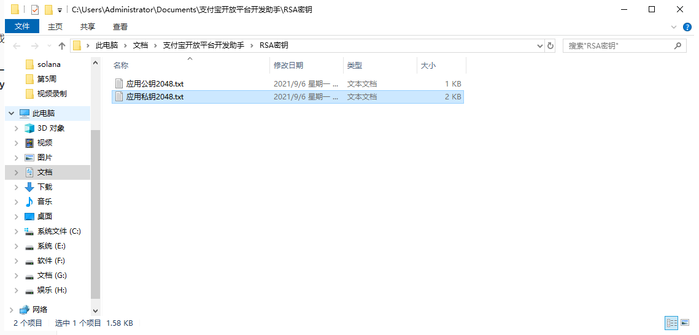

# JavaMail

## 一、Java的邮件服务

通过Java的邮件服务，进行给其他的邮箱发送邮件！

使用场景：登录/注册时，请输入验证码（通过邮箱发给）

邮件时，会使用到：SMTP协议（发送），POP3协议（接收）！

## 二、邮件案例

以：163网易邮箱为例

1、开启POP3以及SMTP协议入口


请记住授权密码：IMBQWJDQLJFGAIAE     （该密码主要用于第3方代理）

2、Java代码第3方接入

导入：javax.mail.jar                      hutool-all.jar             

https://www.hutool.cn/     糊涂工具网，提供了很多的工具类

发送邮件示例：[https://www.hutool.cn/docs/#/extra/%E9%82%AE%E4%BB%B6%E5%B7%A5%E5%85%B7-MailUtil](https://www.hutool.cn/docs/#/extra/邮件工具-MailUtil)

第一步：在str或者是src/main/resources 目录下，创建mail.setting文件

```
from=puxubo55@163.com
pass=IMBQWJDQLJFGAIAE
```

> from 发送者
>
> pass  授权密码，不是你的邮箱登录密码

第二步，使用糊涂示例，发送邮件

```java
public void sendMails() {

		ArrayList<String> tos = CollUtil.newArrayList(
				//群发邮件，必须抄送自己，以防被标记为垃圾邮件
				"txgpro@163.com", 
				"neutxg@qq.com", 
				"neutxg@163.com",
				"fermitang@gmail.com");

		//收件人群、主题、内容、发送内容是否为html，附件
		MailUtil.send(tos, "录取通知", "祝贺您被UCLA录取", false,
				FileUtil.file("D:/000f93ab90c-c1da-4a69-a5c2-88baad048801.jpg"));
	}
```

> 注意：最好先给自己抄送1份邮件，防止被识别为垃圾邮件！
>
> 

# 阿里云沙箱支付

## 一、订单的支付

沙箱支付：阿里云提供了一套虚拟的支付场景，提供了商家的账号，以及买家的账号，便于我们程序员模拟支付宝的支付流程！

## 二、阿里云注册

去阿里云服务器上，开通注册“沙箱”功能！

开发者入口：

https://developers.alipay.com/platform/home.htm

沙箱支付的官方文档：

https://opendocs.alipay.com/open/270/106291/

支付宝扫描登录！


录入资料，并开启开发服务


### 1、配置app_id和gatewayUrl地址


### 2、阿里巴巴的公钥生成器

AlipayDevelopmentAssistant-1.0.7.exe           下载地址：https://opendocs.alipay.com/open/291/105971#LDsXr

安装之后，运行软件，并生成：公钥，私钥


------

将公钥复制一下


### 3、配置alipay_public_key 和 merchant_private_key




将《应用公钥2048.txt》中的内容，复制到：alipay_public_key

将《应用私钥2048.txt》中的内容，复制到：merchant_private_key

### 4、配置notify_url 和return_url

先从官网中，下载JavaDemo，将Demo中的jar包复制到lib目录下，并且将jsp复制到WebRoot下去

> 需要修改jsp中配置类的路径

```java
// 服务器异步通知页面路径  需http://格式的完整路径，不能加?id=123这类自定义参数，必须外网可以正常访问
public static String notify_url = "http://localhost:8080/web05/nofity_url.jsp";
// 页面跳转同步通知页面路径 需http://格式的完整路径，不能加?id=123这类自定义参数，必须外网可以正常访问
public static String return_url = "http://localhost:8080/web05/return_url.jsp";
```

## 三、最终完整的配置类

```java
import java.io.FileWriter;
import java.io.IOException;
/**
 * 阿里巴巴的配置类
 * 
 * @author 老蒲
 *
 */
public class AlipayConfig {
    // 应用ID,您的APPID，收款账号既是您的APPID对应支付宝账号
    public static String app_id = "2021000118612337";
    // 商户私钥，您的PKCS8格式RSA2私钥
    public static String merchant_private_key = "MIIEvgIBADANBgkqhkiG9w0BAQEFAASCBKgwggSkAgEAAoIBAQCoSIEN8QQoJcWVSmYtF046zVOesK/k1ipSeMjAmb/PITogZCPU6NHOcf2qvly0qKxG8H6PuXmgbd3zPiNMW3wiULmZGXy2vYBBjhNtak21w5EAg2bomiSUiv/N7vQVO1GFt7Lry0lwfzHzJM+su/KZY1epDztyYjwuCC3Xwsyk+yPcEBPg2UtOsjfffZu1JgKOJwMgX4SokxhAL68TYRFt+P3l1GC2Thk9LaUWFWoaCdpqqDy5QL0QSdnrRY6H+pjn6t0IWEfSH3JK+lukltJeXwuKD9JgF4y5NgUqXagZEVAVkzpU4xOBetMg0A1/RsLB1X7mx4eTlcQd87PGEp3FAgMBAAECggEAeIU0qB9ssrQahYj7FGAUjthugsBXuLQJK3eFjyqNzHInhvsxDlKPsCLDYX1kN551g3jJq3VSPitxQbvG2/DJPmpCAfvW7alaKZjvIPV5IiwltRBmqz9540iJW5s/A9Wv1OxzH5w/xGnUBCbg9PzGCkSzi0h1cr4YC3+gFV5V4fEsUcoxJI8zsad/ygMK3KfE8XqCMhxz3zpmKTQRvoNBwzMbjfyCg42Eh5CQfgAUXR58gbZS5DJofbB4bTgrZCMizLahU6/Yzlf/fcAYewAIzV+Ei7l02R2Yg+8G2cFzAn6T99Agjs2ykSragXlQMPM9cSsXRxKZtGEa+cwPMeb2AQKBgQD7EhndMA+Lv0/3iuZHzbt3hjzxn8AfPsfAksgh8hlPUO0G7EPIseEbf+XOVPNxmufmEZ4NaV/rXSJL1kDAxqcF+jp2AFozKnAbbby4JkY1ocb2Nt05+NK7AvBArk5PBZj35aWBufZU+g394IKC+YWg5xZZpTYdp5QRC1S3lzHeNQKBgQCrlk6v6Y3LP9Jh65exoZZuGEevx+2DBUVxwDLTUqWGph4qt/uU1OiEq9fJaQhjajdp2k/BeMcjCGjtyKf9up1ohGSIqQnssj1sTP1JzxQSQcNQYzjgH5vQ9j4HdVa0/btUtI2jJKSQ+z5Xx7i9j9Cst5Mo/zDN2VwRnI2R28PzUQKBgQCSZKKKEwztehahiu7s7Sui7LW6WWCHl26Xfb6N9IEHe3NJdxeq/PT5uOCBJ41vL1iKELmsrkWMkhh+SaYmAW7AEIBn75qofNUzWRAR+9cyTGsbgzAJLmmJO5Rk0n28m9HusYuIkartL4RbBL50qhNdl4Czsp5UOjMeoRG7nsAoBQKBgQCAIs3+Ri6SYsXMRDBTAXWiH9Wg6m9vEYeri7ko4KYl6HXMtvpUSa6eLOoHSb1u6EobbWFz/KrReZ1KPTdennagL4YYHAwCS5TdBJ19+ftmKuAdbwtxK4mjwc/OqAypOnYjqnW/KEUQ097ZlJdcUEKoSKrHydJ7Vt+Pc1axXul1EQKBgCe8OW920aXbxm7bncO2KKKltkT5IfGBKcIPhXDAxsT7cNCWcSH1Rvh0AzfqTKis79si1dIO7aOyyWv+7x4GlBAHVWBfHpPTtPOdSk4U6Miskkq1GI3inZazVoc78xm7VdelYTfBM7n9EkyK4kI/XskOEh/wkWTVi7VSttTuUgGZ";
    // 支付宝公钥,查看地址：https://openhome.alipay.com/platform/keyManage.htm 对应APPID下的支付宝公钥。
    public static String alipay_public_key = "MIIBIjANBgkqhkiG9w0BAQEFAAOCAQ8AMIIBCgKCAQEAqEiBDfEEKCXFlUpmLRdOOs1TnrCv5NYqUnjIwJm/zyE6IGQj1OjRznH9qr5ctKisRvB+j7l5oG3d8z4jTFt8IlC5mRl8tr2AQY4TbWpNtcORAINm6JoklIr/ze70FTtRhbey68tJcH8x8yTPrLvymWNXqQ87cmI8Lggt18LMpPsj3BAT4NlLTrI3332btSYCjicDIF+EqJMYQC+vE2ERbfj95dRgtk4ZPS2lFhVqGgnaaqg8uUC9EEnZ60WOh/qY5+rdCFhH0h9ySvpbpJbSXl8Lig/SYBeMuTYFKl2oGRFQFZM6VOMTgXrTINANf0bCwdV+5seHk5XEHfOzxhKdxQIDAQAB";
    // 服务器异步通知页面路径 需http://格式的完整路径，不能加?id=123这类自定义参数，必须外网可以正常访问
    public static String notify_url = "http://localhost:8080/web05/nofity_url.jsp";
    // 页面跳转同步通知页面路径 需http://格式的完整路径，不能加?id=123这类自定义参数，必须外网可以正常访问
    public static String return_url = "http://localhost:8080/web05/return_url.jsp";
    // 签名方式
    public static String sign_type = "RSA2";
    // 字符编码格式
    public static String charset = "utf-8";
    // 支付宝网关
    public static String gatewayUrl = "https://openapi.alipaydev.com/gateway.do";
    // 支付宝沙箱日志路径
    public static String log_path = "E:\\";
    /**
     * 写日志，方便测试（看网站需求，也可以改成把记录存入数据库）
     * 
     * @param sWord 要写入日志里的文本内容
     */
    public static void logResult(String sWord) {
        FileWriter writer = null;
        try {
            writer = new FileWriter(log_path + "alipay_log_" + System.currentTimeMillis() + ".txt");
            writer.write(sWord);
        } catch (Exception e) {
            e.printStackTrace();
        } finally {
            if (writer != null) {
                try {
                    writer.close();
                } catch (IOException e) {
                    e.printStackTrace();
                }
            }
        }
    }
}
```

## 四、沙箱模拟支付

启动Tomcat服务器，访问首页！提交订单


如果你的浏览器，抛出以下页面：请更换为IE浏览器再试试！


### 1、查看沙箱账号


### 2、使用沙箱账号支付

账号：[wklnyn9933@sandbox.com](mailto:wklnyn9933@sandbox.com)        密码：111111


### 3、查看卖家账号


