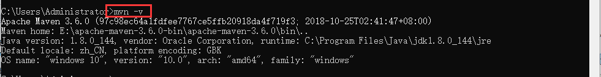

# JavaEE

一、传统应用：Tomcat + Servlet + JSP + JavaBean + Mybatis

1. 支持高并发？不支持
2. 支持大数据量？不支持
3. 支持复杂的事务么？不支持
4. 过于依赖Servlet api ,开发测试非常的麻烦

二、过去的解决方案

JavaEE的解决方案：EJB

EJB :Enterprice JavaBean 企业应用JavaBean

> 分类：会话Bean，实体Bean，异步组件Bean

会话Bean：业务对象，主要完成业务逻辑

实体Bean：持久化对象，主要和数据库进行交互

异步Bean：通常是用来完成与MQ服务器进行通信的组件

上述的3个组件，必须要运行在EJB容器中！

------

EJB容器的特点：

（1）提倡面向过程编程

（2）所有的EJB组件都需要遵从EJB的编程规范，相当于Servlet API

（3）EJB容器启动，至少需要3-5分钟范围，开发测试非常的不方便

（4）好处：容器可以帮你管理事务控制，支持集群操作，支持远程调用，支持面向切面编程……

三、现在的解决方案

POJOS + 轻量级框架

> POJOS 普通Java类，实际上就是JavaBean

普通Java类：没有任何的强制，不需要继承任何类，也不需要实现任何接口

作用：完成业务逻辑

------

轻量级框架：负责除了业务逻辑以外的任何的事务

比如：事务控制，接收用户情况，操作日志，运行日志，调用远程接口

> 轻量级：便于开发，测试，低侵入式

轻量级框架：

表现层：Struts1/2 SpringMvc

业务层：Spring

持久层：Mybatis

上述的基础之上：SpringBoot、SpringCloud、阿里巴巴的相关框架

# Maven

Maven：一个项目管理工具

官网地址：https://apache.org/index.html#projects-list

工具作用：

（1）构架项目（规范：包结构）

（2）管理Jar包

（3）测试，部署上线

## 一、下载

下载地址：http://maven.apache.org/


要求：Maven3.6以上的版本，必须JDK1.7 + 磁盘：具有500M以上的空间

## 二、安装

解压开，然后配置环境变量即可！

```xml
M2_HOME=E:\apache-maven-3.6.0-bin\apache-maven-3.6.0
PATH=%M2_HOME%\bin
```

> Win7系统，需要添加;(分号)
>
> Win10系统，不需要添加;(分号)

校验配置是否成功：

在DOC命令窗体中，输入：mvn -v



## 三、配置

conf目录下settings.xml

**1、配置本地仓库**

```xml
<localRepository>e://repo</localRepository>
```


**2、配置加速器**

Maven所有的Jar包，默认都放置在国外https://mvnrepository.com/

配置国内加速器：

```xml
<mirror>
    <id>alimaven</id>
    <mirrorOf>central</mirrorOf>
    <name>aliyun maven</name>
    <url>https://maven.aliyun.com/repository/central</url>
</mirror>
```


## Maven执行原理

POM：Project Object Model 项目对象模型

pom.xml：用来描述一个Maven项目的构成

构成：自己的代码，其它外部的项目（mybatis、mysql-connection-java）


先去本地仓库找jar包，找不到去国内加速镜像网站下载jar包，找不到再去mvnrepository.com去下载。下载之后添加到本地仓库中，其他项目都可以使用本地仓库中的jar包。

## Maven核心概念

> 仓库：一个用来放置jar包的目录
>
> pom.xml：Maven项目一个用来描述jar关系的配置文件
>
> 依赖：外部的jar包的相关说明，使用dependency来进行描述
>
> 项目的坐标：每个项目的唯一的标识（组织机构名称+项目的名称+项目的版本）

项目的坐标：

```xml
<dependency>
    <groupId>org.mybatis</groupId>
    <artifactId>mybatis</artifactId>
    <version>3.5.7</version>
</dependency>
```

> groupId 组织结构的名称 com.woniuxy
>
> artifactId 项目的名称 stall
>
> version 项目的版本

## Maven的项目结构

src/main/java 用来放置Java的核心代码

src/main/resources 用来放置Java的核心配置文件

src/test/java 用来放置Java的测试代码

src/test/resources 用来放置测试相关的配置文件

target目录 用来放置 编译的文件，以及未来打包的文件

pom.xml 用来描述 Maven的项目组成模型

## Maven项目的生命周期

从产生到项目发布需要经过的过程：

创建项目-编写代码-测试代码-打包上线

具体步骤如下：

第1个步骤：先将src/main/resources 中的内容，复制到target目录中去

第2个步骤：将src/main/java中的内容，编译到target目录中去

第3个步骤：将src/test/resources 中的内容，复制到target目录中去

第4个步骤：将src/test/java中的内容，编译到target目录中去

第5个步骤：使用Junit框架，完成项目中所有的单元测试

第6个步骤：压缩打包（Java项目打包成jar包，Web项目打包成war包）

第7个步骤：将打好的压缩包，添加到本地仓库中去，供其他项目使用

## IDEA集成Maven

### 1、打开settings设置界面


### 2、创建Maven项目

根据Maven工具，创建Java项目


pom.xml的描述：

```xml
<?xml version="1.0" encoding="UTF-8"?>
<project xmlns="http://maven.apache.org/POM/4.0.0" xmlns:xsi="http://www.w3.org/2001/XMLSchema-instance"
  xsi:schemaLocation="http://maven.apache.org/POM/4.0.0 http://maven.apache.org/xsd/maven-4.0.0.xsd">
  <modelVersion>4.0.0</modelVersion>
  <!--自己的坐标-->
  <groupId>com.woniuxy</groupId>
  <artifactId>springstudy</artifactId>
  <version>1.0</version>
  <packaging>jar</packaging>
  <name>springstudy</name>
  <!-- FIXME change it to the project's website -->
  <url>http://www.example.com</url>
  <!--pom.xml 中的一些默认全局变量-->
  <properties>
    <project.build.sourceEncoding>UTF-8</project.build.sourceEncoding>
    <maven.compiler.source>1.8</maven.compiler.source>
    <maven.compiler.target>1.8</maven.compiler.target>
  </properties>
  <!--依赖-->
  <dependencies>
    <dependency>
      <groupId>junit</groupId>
      <artifactId>junit</artifactId>
      <version>4.11</version>
      <scope>test</scope>
    </dependency>
  </dependencies>
  <!--Maven工具跟生命周期有关的相关插件-->
  <build>
    <pluginManagement><!-- lock down plugins versions to avoid using Maven defaults (may be moved to parent pom) -->
      <plugins>
        <!-- clean lifecycle, see https://maven.apache.org/ref/current/maven-core/lifecycles.html#clean_Lifecycle -->
        <plugin>
          <artifactId>maven-clean-plugin</artifactId>
          <version>3.1.0</version>
        </plugin>
        <!-- default lifecycle, jar packaging: see https://maven.apache.org/ref/current/maven-core/default-bindings.html#Plugin_bindings_for_jar_packaging -->
        <plugin>
          <artifactId>maven-resources-plugin</artifactId>
          <version>3.0.2</version>
        </plugin>
        <plugin>
          <artifactId>maven-compiler-plugin</artifactId>
          <version>3.8.0</version>
        </plugin>
        <plugin>
          <artifactId>maven-surefire-plugin</artifactId>
          <version>2.22.1</version>
        </plugin>
        <plugin>
          <artifactId>maven-jar-plugin</artifactId>
          <version>3.0.2</version>
        </plugin>
        <plugin>
          <artifactId>maven-install-plugin</artifactId>
          <version>2.5.2</version>
        </plugin>
        <plugin>
          <artifactId>maven-deploy-plugin</artifactId>
          <version>2.8.2</version>
        </plugin>
        <!-- site lifecycle, see https://maven.apache.org/ref/current/maven-core/lifecycles.html#site_Lifecycle -->
        <plugin>
          <artifactId>maven-site-plugin</artifactId>
          <version>3.7.1</version>
        </plugin>
        <plugin>
          <artifactId>maven-project-info-reports-plugin</artifactId>
          <version>3.0.0</version>
        </plugin>
      </plugins>
    </pluginManagement>
  </build>
</project>
```

## Maven中基础命令

### 1、基础命令

基础命令：没有开发工具的情况下，使用

```
mvn clean 删除target目录，清理编译的文件，以及包
mvn compile 编译代码
mvn test 测试代码
mvn package 压缩打包
mvn install 压缩打包，并安装到本地仓库
```

### 2、IDEA中工具


## Maven的依赖范围

### 1、依赖范围

依赖：指所依赖的其它Jar包

依赖范围：指依赖Jar包在什么情况下有用的

```xml
<dependency>
  <groupId>junit</groupId>
  <artifactId>junit</artifactId>
  <version>4.11</version>
  <!--该依赖的作用范围：
  test 	   表示该Jar包，测试期间有效，不参与打包
  compile  表示该Jar包，编译、测试、运行期间都是有效的，参与打包（默认，指定scope即采用compile）
  provided 表示该Jar包，编译、测试期间有效，运行期间不需要，不参与打包
  runtime  表示该Jar包，编译期间不需要，测试、运行期间有效，参与打包
  system   表示该Jar包，不是来自于 本地仓库，而来自：你固定的地址
  -->
  <scope>test</scope>
</dependency>
```


### 2、依赖传递

Maven具有一个作用：将某一个Jar相关的所有的依赖，都自动下载到本地仓库


但是依赖传递中，也可以使用就近原则：


## 补充


# Spring

## Spring框架介绍

### 一、库和框架

库：封装了大量的类和接口的集合，比如：mysql-connector-java.jar，jdk自带的库

框架：针对项目的整体或某一个部分的一种完整的实现方案

> Mybatis 框架：完成对DB的CURD
>
> SpringMVC 框架：完成页面到后端的请求封装
>
> Spring框架：针对企业应用提供一个“1条龙”的完整解决方案

### 二、Spring

官网地址：https://spring.io/

Spring 7大核心体系：


整个框架的核心：Spring Core，Spring AOP（面向切面编程）

我们用MyBatis代替Spring DAO

### 三、该框架的优点

（1）属于轻量级框架，意味：开发，测试都非常的方便

（2）核心业务中，几乎看不到任何它的侵入代码

（3）大量使用注解，支持：约定优于配置

（4）除了框架自己的产品以外，还支持兼容其他框架

（5）它没有任何的强制要求，不需要遵从任何的编程规范

（6）它是免费开源的，你自己可以扩展

## IOC容器

### 一、BeanFactory

BeanFactory的作用：通过反射 + 工厂模式 完成对（业务）组件的管理！

BeanFactory 实际上，也被称为：Spring容器

容器：装东西的地方

Spring容器：管理各层的组件实例，以及其他框架的实例

大量使用的技术：反射 + XML + DOM4J + 工厂

------

在Spring框架中BeanFactory它不是类，它是1套接口，它有它自己的实现类！

但是这套接口：使用的项目的不多

缺陷：用户在调用getBean(“id”)方法时，才会产生对应的对象

### 二、ApplicationContext

ApplicationContext：应用上下文

ApplicationContext 该接口是BeanFactory的子接口

> 优化：
>
> （1）它继承了BeanFactory所有的方法
>
> （2）它扩展了Events, Resources, i18n, Validation, Data Binding, Type Conversion, SpEL
>
> （3）它实例化组件的时机，项目一启动它就开始实例化所有的组件(ApplicationContext实例化的时候将其中的所有组件都实例化)
>
> （4）它还支持WEB项目的集成

ApplicationContext 提供的：IoC Container, Events, Resources, i18n, Validation, Data Binding, Type Conversion, SpEL, AOP.

> 所以，ApplicationContext 是现在项目中，使用最多的容器

### 补充

ApplicationContext是Spring容器最常用的接口，该接口有如下两个实现类：

1、ClassPathXmlApplicationContext: 从`类加载路径`下搜索配置文件，并根据配置文件来创建Spring容器。

classpath:前缀是不需要的,默认就是指项目的classpath路径下面;如果要使用绝对路径,需要加上file:前缀表示这是绝对路径;

```java
ApplicationContext factory = new ClassPathXmlApplicationContext("classpath:appcontext.xml");
ApplicationContext factory = new ClassPathXmlApplicationContext("appcontext.xml");

ApplicationContext factory = new ClassPathXmlApplicationContext("file:F:/workspace/example/src/appcontext.xml");
```

2、FileSystemXmlApplicationContext: 从`文件系统`的相对路径或绝对路径下去搜索配置文件，并根据配置文件来创建Spring容器。

````java
// 用文件系统的路径,默认指项目的根路径
ApplicationContext factory = new FileSystemXmlApplicationContext("src/appcontext.xml");
ApplicationContext factory = new FileSystemXmlApplicationContext("webRoot/WEB-INF/appcontext.xml");

// 使用了classpath:前缀,这样,FileSystemXmlApplicationContext也能够读取classpath下的相对路径
ApplicationContext factory = new FileSystemXmlApplicationContext("classpath:appcontext.xml");
ApplicationContext factory = new FileSystemXmlApplicationContext("file:F:/workspace/example/src/appcontext.xml");

// 不加file前缀
ApplicationContext factory = new FileSystemXmlApplicationContext("F:/workspace/example/src/appcontext.xml");
````

## Spring环境搭建

### 一、创建Maven项目

### 二、导入Spring框架的依赖

在项目的pom.xml 的 dependencies 中导入

```xml
<dependency>
    <groupId>org.springframework</groupId>
    <artifactId>spring-context</artifactId>
    <version>5.2.9.RELEASE</version>
</dependency>
```

### 三、简单使用

#### 1、创建配置文件

beans.xml / applicationContext.xml

```xml
<?xml version="1.0" encoding="UTF-8"?>
<beans xmlns="http://www.springframework.org/schema/beans"
       xmlns:xsi="http://www.w3.org/2001/XMLSchema-instance"
       xsi:schemaLocation="http://www.springframework.org/schema/beans
        https://www.springframework.org/schema/beans/spring-beans.xsd">
    <!-- 向Spring的容器中，注册某一个组件, id 和class 是必填内容  -->
    <bean id="userBean" class="com.woniuxy.springstudy.entity.UserBean"></bean>
</beans>
```

#### 2、从容器中获得实例

```java
import org.junit.Before;
import org.junit.Test;
import org.springframework.context.ApplicationContext;
import org.springframework.context.support.ClassPathXmlApplicationContext;
public class ApplicationContextTest {
    /**
     * Spring容器
     * BeanFactory factory
     */
    private ApplicationContext ac;
    @Before
    public void before(){
        //创建容器
        ac = new ClassPathXmlApplicationContext("classpath:beans.xml");
    }
    @Test
    public void testUserBean(){
        UserBean userBean = (UserBean) ac.getBean("userBean");
        System.out.println(userBean);
    }
}
```

# IOC容器

IOC概念：Inversion of Control 控制反转


控制反转：以前没有Spring容器的情况下，我们的程序需要主动创建对象。有了Spring容器之后，创建对象的权利，我们交给了Spring容器，由容器去创建对象，创建好之后，再返回给我们的程序

在这个过程中，创建对象的控制权，由主动创建 反转成 被动接收

# Bean的概念

bean：是Spring容器管理组件的最基本的单位！

组件：可大可小，大可以大到 子项目为单位，小可以小到以 类 为单位！

Spring容器中，管理的最小的单位

------

如何进行管理？

```xml
<!-- 向Spring的容器中，注册某一个组件 id 和class 是必填内容  -->
<bean id="userBean" class="com.woniuxy.springstudy.entity.UserBean"></bean>
```

# Bean的作用范围

作用范围：什么情况下有效！

| 作用范围    | 描述                                                         |
| :---------- | :----------------------------------------------------------- |
| singleton   | 单实例，Spring容器中默认每个组件，都只有1个唯一的实例！      |
| prototype   | 原型模式[克隆模式]，以最初的实例为原型，创建新的实例对象（每次调用，都会给你一个新的实例） |
| request     | 请求，跟HttpServletRequest对象有关，在一个请求范围内容，Spring容器针对组件只有1个唯一的实例 |
| session     | 会话，跟HttpSession对象有关，在一个会话范围内容，Spring容器针对组件只有1个唯一的实例 |
| application | 应用上下文，跟ServletContext有关，在一个ServletContext上下文范围内，Spring容器针对组件只有1个唯一的实例 |
| websocket   | 一种WEB的Socket通讯技术，在每次的通讯的范围内，Spring容器针对组件只有1个唯一的实例 |

> singleton是默认的，可以不写，组件实例的整个生命周期，都是由Spring容器负责
>
> prototype是原型模式，组件实例的创建，由Spring容器负责，但是组件实例的销毁，由应用程序自己负责

```xml
 1 <?xml version="1.0" encoding="UTF-8"?>
 2 <beans xmlns="http://www.springframework.org/schema/beans"
 3     xmlns:xsi="http://www.w3.org/2001/XMLSchema-instance"
 4     xsi:schemaLocation="http://www.springframework.org/schema/beans
 5         http://www.springframework.org/schema/beans/spring-beans.xsd">
 6 
 7     <bean id="dog" class="com.fuwh.test.Dog" scope="singleton">
 8         <property name="id" value="001"></property>
 9         <property name="name" value="heihu"></property>
10         <property name="age" value="5"></property>
11     </bean>   
     
14 </beans>
```

# 依赖注入

**DI**：Dependency Injection 依赖注入


依赖注入：以前是组件之间直接相互依赖，现在组件依赖容器，由容器创建组件的实例，以及维护实例之间的关系。容器创建好实例以及关系之后，再由容器将实例注入到程序的过程

> 所以：IOC和DI都是对Spring容器的一种描述
>
> 只不过：说法的方向不一样的
>
> IOC：是从创建对象的控制权出发
>
> DI：从对象的依赖关系的出现

# Setter设值注入

通过setter()方法，完成组件实例之间进行相互赋值！

## 1、提供setter()

```Java
public class UserServiceImpl implements IUserService {
    private IUserDao userDao;
    public void setUserDao(IUserDao userDao) {
        this.userDao = userDao;
    }
}
```

## 2、Spring容器配置关系

```xml
<!-- 向Spring的容器中，注册某一个组件 id 和class 是必填内容  -->
<bean id="userServiceImpl" class="com.woniuxy.springstudy.usermag.service.impl.UserServiceImpl">
    <property name="userDao" ref="userDaoImpl"></property>
    //property name值与组件属性名保持一致
</bean>
<bean id="userDaoImpl" class="com.woniuxy.springstudy.usermag.dao.impl.UserDaoImpl"></bean>
```

# 构造器注入

通过构造方法()，完成组件实例之间进行相互赋值！

## 1、提供构造器

```java
public class UserServiceImpl implements IUserService {
    private IUserDao userDao;
    public UserServiceImpl(IUserDao userDao) {
        this.userDao = userDao;
    }
}
```

## 2、Spring容器配置关系

```xml
<!-- 向Spring的容器中，注册某一个组件 id 和class 是必填内容  -->
<bean id="userServiceImpl" class="com.woniuxy.springstudy.usermag.service.impl.UserServiceImpl">
    <constructor-arg name="userDao" ref="userDaoImpl"></constructor-arg>
    //constructor-arg name与构造器参数名一致
</bean>
<bean id="userDaoImpl" class="com.woniuxy.springstudy.usermag.dao.impl.UserDaoImpl"></bean>
```

------

怎么选择设值注入或者构造注入？

> 对注入顺序如果没有严格的要求，我们推荐使用设值注入
>
> 设值注入，也是早期程序员使用最多的一种方案

# 自动装配

相对于”手动装配”

手动装配：程序员在xml中，手动的指定组件之间的关系

```xml
//构造器手动装配
<bean id="userServiceImpl" class="com.woniuxy.springstudy.usermag.service.impl.UserServiceImpl">
    <constructor-arg name="userDao" ref="userDaoImpl"></constructor-arg>
</bean>
<bean id="userDaoImpl" class="com.woniuxy.springstudy.usermag.dao.impl.UserDaoImpl"></bean>
```

------

## 一、自动装配

不需要程序员，自动指定关系！

| 装配规则    | 描述                                     |
| :---------- | :--------------------------------------- |
| byName      | 按照属性名称进行装配，必须提供setter()   |
| byType      | 按照属性类型进行装配，必须提供setter()   |
| constructor | 按照构造器来进行装配，必须提供构造方法() |
| default     | 默认，不使用自动装配                     |
| no          | 不使用自动装配                           |

byName：Spring在装配组件时，会`自动检查组件身上的所有的属性，并获得属性的名称`，回到Spring容器问有没有跟这个名称一模一样的组件存在 ？如果没有，装配时不会抛出任意异常，但是在运行时，会抛出NullPointerException 属于精准装配

byType：Spring在装配组件时，会`自动检查组件身上的所有的属性，并获得属性的类型`，回到Spring容器问有没有跟这个类型有关的组件实例存在？

如果没有，装配时不会抛出任意异常，但是在运行时，会抛出NullPointerException；如果有，但是超过1个以上，那么在装配时将会抛出UnsatisfiedDependencyException；如果有，并且只有1个，则装配成功

constructor：Spring在装配组件时，会`自动检查组件身上所有的构造器，并获得构造器的参数类型`，使用byType的方法完成对参数进行装配值

> 当手动装配和自动装配同时存在的情况下，以手动装配为主
>
> 针对早期程序员来说：推荐使用手动装配，而不是自动装配

实现方法：

```xml
//constructor自动装配
<bean id="userServiceImpl" class="com.woniuxy.springstudy.usermag.service.impl.UserServiceImpl" default-autowire="constructor"> </bean>
<bean id="userDaoImpl" class="com.woniuxy.springstudy.usermag.dao.impl.UserDaoImpl"></bean>
```

**1.byName自动装配**

设置autowire属性为byName，那么Spring会根据class属性找到实体类，然后查询实体类中所有setter方法的名字，根据setter方法后面的名字（例如SetDog，则setter方法后面的名字为dog）再到配置文件中寻找一个与该名字相同id的Bean，注入进来。如图：


 

 

**2.byType自动装配**

设置autowire属性为byType，那么Spring会自动寻找一个与该属性类型相同的Bean，注入进来。

 

*注意：使用byType这种方式，必须保证配置文件中所有bean的class属性的值是唯一的，否则就会报错

例如：下边这种方式是错误的，因为两个bean中的class属性的值重复了，会报错


# Spring容器的注解

早期程序员，通过xml来完成组件的注册，以及组件关系的维护！这些都可以通过注解来解决。

## 一、组件注解用法

[@Component](https://github.com/Component)：表示一个需要被Spring容器管理起来的普通Java类

[@Repository](https://github.com/Repository)：表示一个需要被Spring容器管理起来的持久层类

[@Service](https://github.com/Service)：表示一个需要被Spring容器管理起来的业务层类

@Service注解是标注在实现类上的，因为@Service是把spring容器中的bean进行实例化，也就是等同于new操作，只有实现类是可以进行new实例化的，而接口则不能，所以是加在实现类上的。

[@Controller](https://github.com/Controller)：表示一个需要被Spring容器管理起来的控制层类

在对应的Java类上，添加对应的注解

https://blog.csdn.net/qq_28967139/article/details/116748703

> 默认情况下：会使用UserServiceImpl类名的首字母小写，
>
> 作为该组件在Spring容器中的名字
>
> @Service(value="us") 自定义名字,value可以省略

```java
/**
 * 默认情况下：会使用UserServiceImpl类名的首字母小写，
 * 作为该组件在Spring容器中的名字
 * @Service(value="us") 自定义名字,value可以省略
 */
@Service
public class UserServiceImpl implements IUserService {
    private IUserDao userDao;
}
```

```java
@Repository
public class UserDaoImpl implements IUserDao {
    
}
```

在XML配置文件中，开启自动扫描

Spring引入了组件自动扫描机制，**它可以在类路径底下寻找标注了@Component、@Service、@Controller、@Repository注解的类，并把这些类纳入进Spring容器中管理。**

它的作用和在XML文件中使用bean节点配置组件是一样的。要使用自动扫描机制，需要打开以下配置信息：

```xml
<?xml version="1.0" encoding="UTF-8"?>
<beans xmlns="http://www.springframework.org/schema/beans"
       xmlns:xsi="http://www.w3.org/2001/XMLSchema-instance"
       xmlns:context="http://www.springframework.org/schema/context"
       xsi:schemaLocation="http://www.springframework.org/schema/beans
        https://www.springframework.org/schema/beans/spring-beans.xsd
        http://www.springframework.org/schema/context
        https://www.springframework.org/schema/context/spring-context.xsd">
    <!--开启Spring容器的自动扫描功能-->
    <context:component-scan base-package="com.woniuxy.springstudy"></context:component-scan>
</beans>
```

**补充**


https://juejin.cn/post/6858510995192168462

## 二、关系注解用法

### 1、[@Autowired](https://github.com/Autowired)

> 原理：反射（所以不需要提供setter方法） + 先使用byType的方式进行装配，byType找多了，然后再使用byName进行装配
>
> Spring提供的模糊装配方式

```java
@Service
public class UserServiceImpl implements IUserService {
    @Autowired
    private IUserDao userDao;
}
```

### 2、[@Resource](https://github.com/Resource)

> 原理：反射 （所以不需要提供setter方法）+ 先使用byName的方式进行装配，byName找不到，然后再使用byType进行装配
>
> JDK提供的精准装配方式

> 非常精准的指定：需要装配的组件，一旦写了name，那么就不会再ByType

```java
@Service
public class UserServiceImpl implements IUserService {
    //非常精准的指定：需要装配的组件
    //一旦写了name，那么就不会再ByType
    @Resource(name="userDaoImpl")
    private IUserDao userDao;
}
```

### 3、查看容器中组件的名称

```java
@Before
public void before(){
    //创建容器
    ac = new ClassPathXmlApplicationContext("classpath:beans.xml");
    //查看所有组件的名称
    String[] beans = ac.getBeanDefinitionNames();
    System.out.println(Arrays.toString(beans));
}
```

## 三、扩展注解

### 1、[@PostConstruct](https://github.com/PostConstruct)

该注解的作用：实例化组件时，做初始化任务

```java
@Service
public class UserServiceImpl implements IUserService {
    @PostConstruct
    public void init(){
        System.out.println("初始化的任务");
    }
}
```

### 2、[@PreDestroy](https://github.com/PreDestroy)

该注解的作用：销毁组件实例时，做收尾的任务

```java
@Service
public class UserServiceImpl implements IUserService {
    @PreDestroy
    public void destory(){
        System.out.println("收尾的任务");
    }
}
```

### 3、自定义配置类

替代：beans.xml文件

```java
@Configuration
@ComponentScan(basePackages = {"com.woniuxy.springstudy"})//开启自动扫描
public class ApplicationContextConfigure {
}
```

具体的用法：

```java
@Before
public void before(){
    ac = new AnnotationConfigApplicationContext(ApplicationContextConfigure.class);
    //查看所有组件的名称
    String[] beans = ac.getBeanDefinitionNames();
    System.out.println(Arrays.toString(beans));
}
```

注册：告知spring容器，哪些组件需要spring容器来管理，可以通过xml文件注册或注解注册。

注入：程序运行过程中，spring容器将创建的组件实例添加到程序中。

# AOP的概述及出现的背景

## 一、AOP

Aspect Oriented Programming 面向切面编程！

> 需求：让大家记录操作日志
>
> 需求：让大家记录运行日志（Log4J）
>
> 需求：让大家做敏感词处理
>
> 需求：让大家处理事务

交叉业务：非核心功能，又散落在到处；而且还是不得不处理的功能


------

如何解决？需要使用到AOP编程


## 二、具体的原理

依赖的是：动态代理模式


先使用JDK代理，如果JDK代理代理不成功的情况，将使用CGLIB代理！(业务类实现接口则使用JDK代理，直接使用类而未实现接口，使用CGLIB代理。)

AOP的特点：

（1）程序员只需要关注核心业务，交叉业务将交给切面

（2）由于使用动态代理模式，核心类和切面之间是没有直接的耦合关系

## AOP的核心概念

切面：又被称为方面，指的是交叉业务，通常：1个交叉业务，对应1个切面，切面=切入点+通知。

切入点：满足切面切入条件的点，就是切入点

连接点：当切面正式进入到某一个切入时，该切入点就是连接点

通知：又被称为增强，实际上就是切面的代码（前置通知，后置通知，后置返回通知，后置异常通知，环绕通知）

目标对象：需要被切面进行增强的对象

代理对象：使用JDK代理或CGLIB代理，针对目标对象创建出来的代理实例！

织入：AOP切面应用到切入点的过程，就是织入


# AOP的具体使用

## 一、导入AOP的相关Jar包

Spring针对AOP的处理，提供了思想也提供具体的第3方对接！

```xml
<!-- 导入第3方的切面相关Jar包-->
<dependency>
    <groupId>org.aspectj</groupId>
    <artifactId>aspectjrt</artifactId>
    <version>1.8.8</version>
</dependency>
<dependency>
    <groupId>org.aspectj</groupId>
    <artifactId>aspectjweaver</artifactId>
    <version>1.8.8</version>
    <scope>runtime</scope>
</dependency>
```

## 二、创建切面对象

```java
import org.aspectj.lang.annotation.Aspect;
import org.springframework.stereotype.Component;
import org.springframework.stereotype.Service;
/**
 * 事务切面
 * @Aspect 将该Java类声明为一个切面
 *
 */
@Aspect
@Component
public class TransactionAspect {
}
```

## 三、定义条件表达式

```java
execution(modifiers-pattern? ret-type-pattern declaring-type-pattern?name-pattern(param-pattern) throws-pattern?)
```

> modifiers-pattern 访问修饰符，非必填项
>
> ret-type-pattern 返回类型 必填项
>
> declaring-type-pattern 类的路径，非必填项
>
> name-pattern(param-pattern) 方法以及参数，必填项
>
> throws-pattern 抛出的异常，非必填项

```java
    /**
     * 定义条件表达式
     */
    @Pointcut("execution(* com.woniuxy.stall.*mag.service.impl.*ServiceImpl.save(..))")
    private void pointcut01(){}
    @Pointcut("execution(* com.woniuxy.stall.*mag.service.impl.*ServiceImpl.update(..))")
    private void pointcut02(){}
    @Pointcut("execution(* com.woniuxy.stall.*mag.service.impl.*ServiceImpl.delete(..))")
    private void pointcut03(){}
```

## 四、添加通知

### 1、前置通知

前置通知：运行在目标方法执行之前！

```java
@Before("pointcut01() || pointcut02() || pointcut03()")
public void beforeAdvice(){
    System.out.println("前置通知，我运行在目标方法执行之前！");
}
```

------

开启动态代理支持：

```xml
<?xml version="1.0" encoding="UTF-8"?>
<beans xmlns="http://www.springframework.org/schema/beans"
       xmlns:xsi="http://www.w3.org/2001/XMLSchema-instance"
       xmlns:aop="http://www.springframework.org/schema/aop"
       xmlns:context="http://www.springframework.org/schema/context"
       xsi:schemaLocation="http://www.springframework.org/schema/beans
        https://www.springframework.org/schema/beans/spring-beans.xsd
        http://www.springframework.org/schema/context
        https://www.springframework.org/schema/context/spring-context.xsd
        http://www.springframework.org/schema/aop
        https://www.springframework.org/schema/aop/spring-aop.xsd">
    <!--开启容器的自动扫描-->
    <context:component-scan base-package="com.woniuxy.stall"></context:component-scan>
    <!--开启AOP的动态代理功能-->
    <aop:aspectj-autoproxy></aop:aspectj-autoproxy>
</beans>
```

------

前置通知的完整案例：

```java
/**
     * 前置通知
     * 作用：获得SqlSession
     * @param joinPoint 连接点
     */
@Before("pointcut01() || pointcut02() || pointcut03()")
public void beforeAdvice(JoinPoint joinPoint){
    System.out.println("前置通知，我运行在目标方法执行之前！");
    Object obj = joinPoint.getTarget();//得到目标对象
    System.out.println(obj);
    String name = joinPoint.getSignature().getName();//得到目标方法
    System.out.println(name);
    Object[] args = joinPoint.getArgs();
    System.out.println(Arrays.toString(args));//得到目标参数
}
```

### 2、后置返回通知

后置返回通知：执行在目标方法成功执行之后

```java
/**
     * 后置返回通知
     * @param joinPoint
     * @param res
     */
@AfterReturning(value = "pointcut01() || pointcut02() || pointcut03()",returning = "res")
public void afterReturnAdvice(JoinPoint joinPoint,Object res){
    System.out.println("我是后置返回通知，我执行在目标方法正常执行之后！");
    System.out.println(res);
}
```

### 3、后置异常通知

后置异常通知：执行在目标方法抛出异常之后

```java
/**
     * 后置异常通知
     * @param joinPoint
     * @param res 异常
     */
@AfterThrowing(value="pointcut01() || pointcut02() || pointcut03()",throwing = "res")
public void afterThrowsAdvice(JoinPoint joinPoint,Exception res){
    System.out.println("我是后置异常通知，我执行在目标方法抛出异常之后！");
    System.out.println(res);
}
```

### 4、后置通知

```java
/**
     * 后置通知
     * @param joinPoint
     */
@After("pointcut01() || pointcut02() || pointcut03()")
public void afterAdvice(JoinPoint joinPoint){
    System.out.println("我是后置通知，不管目标方法能否正常执行，我都执行！");
}
```

### 5、环绕通知

这是最NB的通知，它是唯一一个可以控制目标方法是否执行的通知，它也是唯一一个可以修改方法参数，方法返回的通知！

```java
/**
     * 环绕通知
     * @param pjp
     * @return
     * @throws Throwable
     */
@Around("pointcut01() || pointcut02() || pointcut03()")
public Object aroundAdvice(ProceedingJoinPoint pjp) throws Throwable {
    System.out.println("我是环绕通知，我最NB！属于无法无天的……");
    Object[] args = pjp.getArgs();//原始的参数
    args[0] = null;
    Object result = pjp.proceed(args);//调用目标方法（如果不写，目标方法将不执行）
    return result;
}
```

NB的东西意味着风险高，这玩意相当于：[@Before](https://github.com/Before) + [@After](https://github.com/After)

> 能用[@Before](https://github.com/Before) + [@After](https://github.com/After)搞定的事情，一定不要用[@Around](https://github.com/Around)

## 五、完整课堂代码

```java
import org.aspectj.lang.JoinPoint;
import org.aspectj.lang.ProceedingJoinPoint;
import org.aspectj.lang.annotation.*;
import org.springframework.stereotype.Component;
import org.springframework.stereotype.Service;
import java.util.Arrays;
/**
 * 事务切面
 * @Aspect 将该Java类声明为一个切面
 *
 */
@Aspect
@Component
public class TransactionAspect {
    /**
     * 定义条件表达式
     * execution(* com.woniuxy.stall.*mag.service.impl.*ServiceImpl.*(..))   最常见的表达式
     */
    @Pointcut("execution(* com.woniuxy.stall.*mag.service.impl.*ServiceImpl.save(..))")
    private void pointcut01(){}
    @Pointcut("execution(* com.woniuxy.stall.*mag.service.impl.*ServiceImpl.update(..))")
    private void pointcut02(){}
    @Pointcut("execution(* com.woniuxy.stall.*mag.service.impl.*ServiceImpl.delete(..))")
    private void pointcut03(){}
    /**
     * 前置通知
     * 作用：获得SqlSession
     * @param joinPoint 连接点
     */
    @Before("pointcut01() || pointcut02() || pointcut03()")
    public void beforeAdvice(JoinPoint joinPoint){
        System.out.println("前置通知，我运行在目标方法执行之前！");
        Object obj = joinPoint.getTarget();//得到目标对象
        System.out.println(obj);
        String name = joinPoint.getSignature().getName();//得到目标方法
        System.out.println(name);
        Object[] args = joinPoint.getArgs();
        System.out.println(Arrays.toString(args));//得到目标参数
    }
    /**
     * 后置返回通知
     * @param joinPoint
     * @param res
     */
    @AfterReturning(value = "pointcut01() || pointcut02() || pointcut03()",returning = "res")
    public void afterReturnAdvice(JoinPoint joinPoint,Object res){
        System.out.println("我是后置返回通知，我执行在目标方法正常执行之后！");
        System.out.println(res);
    }
    /**
     * 后置异常通知
     * @param joinPoint
     * @param res 异常
     */
    @AfterThrowing(value="pointcut01() || pointcut02() || pointcut03()",throwing = "res")
    public void afterThrowsAdvice(JoinPoint joinPoint,Exception res){
        System.out.println("我是后置异常通知，我执行在目标方法抛出异常之后！");
        System.out.println(res);
    }
    /**
     * 后置通知
     * @param joinPoint
     */
    @After("pointcut01() || pointcut02() || pointcut03()")
    public void afterAdvice(JoinPoint joinPoint){
        System.out.println("我是后置通知，不管目标方法能否正常执行，我都执行！");
    }
    /**
     * 环绕通知
     * @param pjp
     * @return
     * @throws Throwable
     */
    @Around("pointcut01() || pointcut02() || pointcut03()")
    public Object aroundAdvice(ProceedingJoinPoint pjp) throws Throwable {
        System.out.println("我是环绕通知，我最NB！属于无法无天的……");
        Object[] args = pjp.getArgs();//原始的参数
        args[0] = null;
        Object result = pjp.proceed(args);//调用目标方法（如果不写，目标方法将不执行）
        return result;
    }
}
```

## 六、注解作为切入点

```java
import java.lang.annotation.*;
/**
 * 自定义一个日志注解
 */
@Documented
@Target(ElementType.METHOD)
@Retention(RetentionPolicy.RUNTIME)
public @interface MyLog {
    /**
     * 菜单的名称
     * @return
     */
    String menuName() default "";
    /**
     * 操作类型：CUD
     * @return
     */
    String optType() default "";
}
```

操作日志通知：

```java
import com.woniuxy.stall.anno.MyLog;
import org.aspectj.lang.JoinPoint;
import org.aspectj.lang.annotation.AfterReturning;
import org.aspectj.lang.annotation.Aspect;
import org.springframework.stereotype.Component;
import java.util.Arrays;
/**
 * 操作日志
 */
@Aspect
@Component
public class OptLogAspect {
    //所有使用了MyLog注解的方法都需要该切面通知，
    //若为value="@target……"，表示使用了该注解的类中的所有方法都需要该切面通知，同样定义的注解target也要作用于类上
    @AfterReturning(value = "@annotation(log)",returning = "result")
    public void afterReturningAdvice(JoinPoint joinPoint, Object result,MyLog log){
        System.out.println("模块的名称：" + log.menuName());
        System.out.println("操作的类型："+log.optType());
        System.out.println("操作的数据：" + Arrays.toString(joinPoint.getArgs()));
    }
}
```


# lombok插件

JavaBean目前的问题：需要写大量getter()以及setter(),构造器，tostring(),equals()以及hashcode()

让JavaBean看起来非常的丑，没有阅读性！

> 解决方案：使用Lombok插件
>
> 作用：让代码在编译时，自动添加getter(),setter(),构造器，tostring(),equals()以及hashcode()

## 一、首先，针对插件进行安装

离线插件下载位置：https://plugins.jetbrains.com/plugin/6317-lombok/versions

下载好之后，可以使用离线安装！


## 二、导入Lombok的Jar包

```xml
<dependency>
    <groupId>org.projectlombok</groupId>
    <artifactId>lombok</artifactId>
    <version>1.18.10</version>
    <scope>provided</scope>
</dependency>
```

## 三、使用注解完成自动生产

[@Data](https://github.com/Data) //产生所有 （使用最多的）

[@Getter](https://github.com/Getter) //产生getter()

[@Setter](https://github.com/Setter) 产生setter()

[@toString](https://github.com/toString) 产生toString()

[@EqualsAndHashCode](https://github.com/EqualsAndHashCode) 产生hashcode以及equals

[@NoArgsConstructor](https://github.com/NoArgsConstructor) 产生无构造器

[@RequiredArgsConstructor](https://github.com/RequiredArgsConstructor) + [@NonNull](https://github.com/NonNull) 产生有参构造器

[@AllArgsConstructor](https://github.com/AllArgsConstructor) 产生全参构造器

```java
import lombok.Data;
import lombok.NonNull;
import lombok.RequiredArgsConstructor;
import lombok.experimental.Tolerate;
@Data
@RequiredArgsConstructor
public class AdminEntity implements Serializable {
    /**
     * 自定义多个有参构造器
     * @param adminName
     */
    @Tolerate
    public AdminEntity(String adminName){
        this.adminName = adminName;
    }
    @NonNull
    private Long id;
    private String adminName;
}
```

# Spring整合Mybatis

## 一、准备工作

准备Jar包：Spring ，Mybatis，数据库的相关连接Jar包，Lombok包，

Junit包，Log4J包

## 二、开始整合

### 1、导入依赖

```xml
<!--导入mybatis的Jar包-->
<dependency>
  <groupId>org.mybatis</groupId>
  <artifactId>mybatis</artifactId>
  <version>3.5.7</version>
</dependency>
<!--导入Mybatis兼容Spring的Jar包-->
<dependency>
  <groupId>org.mybatis</groupId>
  <artifactId>mybatis-spring</artifactId>
  <version>2.0.6</version>
</dependency>
<!--导入数据库的jar包-->
<dependency>
  <groupId>mysql</groupId>
  <artifactId>mysql-connector-java</artifactId>
  <version>5.1.46</version>
</dependency>
<!--导入Log4J的Jar包-->
<dependency>
  <groupId>log4j</groupId>
  <artifactId>log4j</artifactId>
  <version>1.2.17</version>
</dependency>
<!--导入Spring的Jar-->
<dependency>
  <groupId>org.springframework</groupId>
  <artifactId>spring-context</artifactId>
  <version>5.2.9.RELEASE</version>
</dependency>
<!-- 导入第3方的切面相关Jar包-->
<dependency>
  <groupId>org.aspectj</groupId>
  <artifactId>aspectjrt</artifactId>
  <version>1.8.8</version>
</dependency>
<dependency>
  <groupId>org.aspectj</groupId>
  <artifactId>aspectjweaver</artifactId>
  <version>1.8.8</version>
  <scope>runtime</scope>
</dependency>
<!-- 导入lombok插件Jar包-->
<dependency>
  <groupId>org.projectlombok</groupId>
  <artifactId>lombok</artifactId>
  <version>1.18.10</version>
  <scope>provided</scope>
</dependency>
<!-- 导入junit Jar包-->
<dependency>
  <groupId>junit</groupId>
  <artifactId>junit</artifactId>
  <version>4.11</version>
  <scope>test</scope>
</dependency>
```

### 2、创建Spring配置文件

beans.xml | spring-context.xml | applicationContext.xml

```xml
<?xml version="1.0" encoding="UTF-8"?>
<beans xmlns="http://www.springframework.org/schema/beans"
       xmlns:xsi="http://www.w3.org/2001/XMLSchema-instance"
       xmlns:aop="http://www.springframework.org/schema/aop"
       xmlns:context="http://www.springframework.org/schema/context"
       xsi:schemaLocation="http://www.springframework.org/schema/beans
        https://www.springframework.org/schema/beans/spring-beans.xsd
        http://www.springframework.org/schema/context
        https://www.springframework.org/schema/context/spring-context.xsd
        http://www.springframework.org/schema/aop
        https://www.springframework.org/schema/aop/spring-aop.xsd">
</beans>
```

### 3、创建包结构


## 三、整合的步骤

重点在beans.xml中，mybatis并没有什么配置！

> 配置内容很多，但是：我不需要你记住它，我需要你知道的是spring已经全权管理了mybatis

（1）开启容器的自动扫描

（2）配置数据库连接池，提供JDBC连接

（3）配置SessionFactory，提供Session

（4）配置MapperScanner，扫描：*Mapper.java*、 Mapper.xml

（5）配置事务管理器，提供事务支持

（6）使用AOP切面思想，管理事务

（7）开启切面动态代理支持

### 1、开启容器的自动扫描

```xml
<context:component-scan base-package="com.woniuxy.sm"></context:component-scan>
```

### 2、配置数据库连接池

连接池：就像线程池，作用：管理数据库连接，连接的复用！

执行原理：


Spring已经提供了一个非常简化的连接池！

```xml
<dependency>
    <groupId>org.springframework</groupId>
    <artifactId>spring-jdbc</artifactId>
    <version>5.2.9.RELEASE</version>
</dependency>
```

但是它自带的连接池，性能差，高并发能力差，稳定性差！

------

一般公司使用 商业化的连接池：C3P0、DBCP（阿帕奇）、DRUID（德鲁伊-阿里巴巴）

DBCP官网：http://commons.apache.org/proper/commons-dbcp/configuration.html

（1）导入DBCP的依赖包

```xml
<dependency>
    <groupId>org.apache.commons</groupId>
    <artifactId>commons-dbcp2</artifactId>
    <version>2.7.0</version>
</dependency>
```

（2）配置DBCP

在src/main/resources中，创建database.properties

```properties
jdbc.driverClassName=com.mysql.jdbc.Driver
jdbc.url=jdbc:mysql://127.0.0.1:3306/sm?useUnicode=true&characterEncoding=UTF8&useSSL=false
jdbc.username=root
jdbc.password=123456
```

然后，在beans.xml中进行配置

```xml
<!--第2步：配置数据库连接池-->
<context:property-placeholder location="database.properties"></context:property-placeholder>
<bean id="dataSource" class="org.apache.commons.dbcp2.BasicDataSource">
    <!--配置连接数据库的 4个最基本的元素-->
    <property name="url" value="${jdbc.url}"></property>
    <property name="username" value="${jdbc.username}"></property>
    <property name="password" value="${jdbc.password}"></property>
    <property name="driverClassName" value="${jdbc.driverClassName}"></property>
    <!--额外的配置-->
    <!--初始化容量-->
    <property name="initialSize" value="5"></property>
    <!--最大容量-->
    <property name="maxTotal" value="200"></property>
    <!--最大空闲连接数-->
    <property name="maxIdle" value="20"></property>
    <!--是否支持预编译-->
    <property name="poolPreparedStatements" value="true"></property>
    <!--设置预编译对象的数据-->
    <property name="maxOpenPreparedStatements" value="20"></property>
    <!--创建连接时，校验连接是否可用-->
    <property name="testOnCreate" value="true"></property>
    <!--向数据库发送的校验语句-->
    <property name="validationQuery" value="select now() from dual"></property>
    <!--取消 自动提交-->
    <property name="defaultAutoCommit" value="false"></property>
    <!--取消 连接只读-->
    <property name="defaultReadOnly" value="false"></property>
    <!--配置最长的查询超时时间，单位是：秒-->
    <property name="defaultQueryTimeout" value="5"></property>
</bean>
```

### 3、配置SessionFactory

> 以后所有的Mapper.xml，大家就可以放置在src/main/resources 目录下的mappers目录中

```xml
<bean id="sessionFactory" class="org.mybatis.spring.SqlSessionFactoryBean">
    <!--配置数据源连接池-->
    <property name="dataSource" ref="dataSource"></property>
    <!--定义别名包-->
    <property name="typeAliasesPackage" value="com.woniuxy.sm.entity"></property>
    <property name="mapperLocations">
        <array>
            <value>classpath:mappers/*.xml</value>
        </array>
    </property>
    <property name="configuration">
        <bean class="org.apache.ibatis.session.Configuration">
            <!--开启延迟加载-->
            <property name="lazyLoadingEnabled" value="true"></property>
            <!--取消积极主动的 加载方法-->
            <property name="aggressiveLazyLoading" value="false"></property>
            <!--开启日志记录功能-->
            <property name="logImpl" value="org.apache.ibatis.logging.stdout.StdOutImpl"></property>
        </bean>
    </property>
</bean>
```

### 4、配置MapperScanner

作用：将Mapper文件与SessionFactory关联起来，并产生代理实例

```xml
<bean id="mapperScannerConfigurer" class="org.mybatis.spring.mapper.MapperScannerConfigurer">
    <!--通过MapperScanner向Mybatis中注册 *Mapper的相关信息，多个包之间需要使用,或;进行分割-->
    <property name="basePackage" value="com.woniuxy.sm.sysmag.mapper,com.woniuxy.sm.usermag.mapper"></property>
    <!--关联工厂-->
    <property name="sqlSessionFactoryBeanName" value="sessionFactory"></property>
</bean>
```

### 5、配置事务管理器

事务管理器：一个专门用来管理事务的组件/工具


```xml
<bean id="transactionManager" class="org.springframework.jdbc.datasource.DataSourceTransactionManager">
    <property name="dataSource" ref="dataSource"></property>
</bean>
```

### 6、使用AOP切面思想，管理事务

```xml
<tx:annotation-driven transaction-manager="transactionManager"/>
```

然后在需要控制事务的地方，使用[@Transactional](https://github.com/Transactional)搞定！

### 7、开启切面动态代理支持

```xml
<aop:aspectj-autoproxy></aop:aspectj-autoproxy>
```

## 四、完整的Spring配置内容

```xml
<?xml version="1.0" encoding="UTF-8"?>
<beans xmlns="http://www.springframework.org/schema/beans"
       xmlns:xsi="http://www.w3.org/2001/XMLSchema-instance"
       xmlns:aop="http://www.springframework.org/schema/aop"
       xmlns:tx="http://www.springframework.org/schema/tx"
       xmlns:context="http://www.springframework.org/schema/context"
       xsi:schemaLocation="http://www.springframework.org/schema/beans
        https://www.springframework.org/schema/beans/spring-beans.xsd
        http://www.springframework.org/schema/context
        https://www.springframework.org/schema/context/spring-context.xsd
        http://www.springframework.org/schema/aop
        https://www.springframework.org/schema/aop/spring-aop.xsd
        http://www.springframework.org/schema/tx
        https://www.springframework.org/schema/tx/spring-tx.xsd">
    <!--第1步：开启容器的自动扫描-->
    <context:component-scan base-package="com.woniuxy.sm"></context:component-scan>
    <!--第2步：配置数据库连接池-->
    <context:property-placeholder location="database.properties"></context:property-placeholder>
    <bean id="dataSource" class="org.apache.commons.dbcp2.BasicDataSource">
        <!--配置连接数据库的 4个最基本的元素-->
        <property name="url" value="${jdbc.url}"></property>
        <property name="username" value="${jdbc.username}"></property>
        <property name="password" value="${jdbc.password}"></property>
        <property name="driverClassName" value="${jdbc.driverClassName}"></property>
        <!--额外的配置-->
        <!--初始化容量-->
        <property name="initialSize" value="5"></property>
        <!--最大容量-->
        <property name="maxTotal" value="200"></property>
        <!--最大空闲连接数-->
        <property name="maxIdle" value="20"></property>
        <!--是否支持预编译-->
        <property name="poolPreparedStatements" value="true"></property>
        <!--设置预编译对象的数据-->
        <property name="maxOpenPreparedStatements" value="20"></property>
        <!--创建连接时，校验连接是否可用-->
        <property name="testOnCreate" value="true"></property>
        <!--向数据库发送的校验语句-->
        <property name="validationQuery" value="select now() from dual"></property>
        <!--取消 自动提交-->
        <property name="defaultAutoCommit" value="false"></property>
        <!--取消 连接只读-->
        <property name="defaultReadOnly" value="false"></property>
        <!--配置最长的查询超时时间，单位是：秒-->
        <property name="defaultQueryTimeout" value="5"></property>
    </bean>
    <!--第3步，配置SessionFactory-->
    <bean id="sessionFactory" class="org.mybatis.spring.SqlSessionFactoryBean">
        <!--配置数据源连接池-->
        <property name="dataSource" ref="dataSource"></property>
        <!--定义别名包-->
        <property name="typeAliasesPackage" value="com.woniuxy.sm.entity"></property>
        <property name="mapperLocations">
            <array>
                <value>classpath:mappers/*.xml</value>
            </array>
        </property>
        <property name="configuration">
            <bean class="org.apache.ibatis.session.Configuration">
                <!--开启延迟加载-->
                <property name="lazyLoadingEnabled" value="true"></property>
                <!--取消积极主动的 加载方法-->
                <property name="aggressiveLazyLoading" value="false"></property>
                <!--开启日志记录功能-->
                <property name="logImpl" value="org.apache.ibatis.logging.stdout.StdOutImpl"></property>
            </bean>
        </property>
    </bean>
    <!--第4步：配置MapperScanner-->
    <bean id="mapperScannerConfigurer" class="org.mybatis.spring.mapper.MapperScannerConfigurer">
        <!--通过MapperScanner向Mybatis中注册 *Mapper的相关信息，多个包之间需要使用,或;进行分割-->
        <property name="basePackage" value="com.woniuxy.sm.sysmag.mapper,com.woniuxy.sm.usermag.mapper"></property>
        <!--关联工厂-->
        <property name="sqlSessionFactoryBeanName" value="sessionFactory"></property>
    </bean>
    <!--第5步：配置事务管理器-->
    <bean id="transactionManager" class="org.springframework.jdbc.datasource.DataSourceTransactionManager">
        <property name="dataSource" ref="dataSource"></property>
    </bean>
    <!--第6步：采用AOP思想管理事务-->
    <tx:annotation-driven transaction-manager="transactionManager"/>
    <!--第7步，开启切面的动态代理支持-->
    <aop:aspectj-autoproxy></aop:aspectj-autoproxy>
</beans>
```

## 五、测试代码

### 1、导入相关Jar包

```xml
<!--导入Spring兼容JUnit的Jar包-->
<dependency>
    <groupId>org.springframework</groupId>
    <artifactId>spring-test</artifactId>
    <version>5.2.9.RELEASE</version>
</dependency>
```

### 2、将Junit版本提升为4.12

```xml
<dependency>
    <groupId>junit</groupId>
    <artifactId>junit</artifactId>
    <version>4.12</version>
    <scope>test</scope>
</dependency>
```

### 3、在测试中使用注解开启Spring容器

```java
import com.woniuxy.sm.entity.RoleEntity;
import com.woniuxy.sm.usermag.service.IRoleService;
import org.junit.Test;
import org.junit.runner.RunWith;
import org.springframework.test.context.ContextConfiguration;
import org.springframework.test.context.junit4.SpringJUnit4ClassRunner;
import javax.annotation.Resource;
import static org.junit.Assert.*;

//@RunWith(SpringJUnit4ClassRunner.class)表示启动junit4时同时实例化spring容器
@RunWith(SpringJUnit4ClassRunner.class)
@ContextConfiguration({"classpath:beans.xml"})
public class RoleServiceImplTest {
    @Resource
    private IRoleService roleServiceImpl;
    @Test
    public void save() {
        RoleEntity role = new RoleEntity();
        role.setRoleName("超级管理员");
        role.setRoleDesc("内裤穿在外面！");
        roleServiceImpl.save(role);
    }
    @Test
    public void update() {
    }
    @Test
    public void delete() {
    }
    @Test
    public void deleteById() {
    }
    @Test
    public void getById() {
    }
}
```


连接池：对连接数量有一定的限制，可以控制访问数据库的人数，保证数据库不会因为大量访问而崩溃。


切面调用事务管理器管理事务


# property  ref  vakue

一、property中ref和value的区别

1、ref引用一个已经存在的对象（配置文件中已经存在的对象）

  	value创建一个新的对象

2、value可以赋一些简单类型的值和对象的值

 	 ref可以引用其他的bean对象。

​	使用ref的时候，spring容器会在引用后进行验证，验证当前的xml是否存在引用的bean

 	使用value的时候，spring会在容器启动，实例化bean的时候进行验证。

二、property'中value和name的区别

```xml
<bean id="person" class="service.Person">
  <!-- 控制器调用setAxe方法，将容器中的axe bean作为传入的参数 -->
  <!--此处的name是决定Person类中的那个参数，ref是指bean配置文件中的bean名称-->
  <property name="axe" ref="axe"> </property>
</bean>
```

这里的name和ref虽然是同名的，但是name是指Person类中的属性，Person类中有一个Axe类型名叫axe的对象，而ref是将当前xml文件中叫做axe的这个bean，把它当作参数传进Person中。并不是直接引用。


虽然在IDEA的提示很智能，但如果我们不了解两者的区别，还是会存在用混的情况：

1.用ref


Q:为什么这里用ref?
A:点击SqlSessionFactoryBean的源码，想要的dataSource为DataSource的引用类型


2.用value


Q:为什么这里用value?
A:点击MapperScannerConfigurer的源码，想要的sqlSessionFactoryBeanName是一个字符串


综上：

**`ref代表的是引用这个对象，相当于传入的是对象的引用；而value是引入的这个对象名字的字符串。至于使用哪个是依据你所用的属性类型决定的。`**

**总结：**

> \<property name="" value="">\</property>
>
> \<property name="" ref="">\</property>
>
> 中name的值就是bean的属性名，是反射通过setter方法获取的，value和ref都相当于是为属性赋值，value的值表示的是一个字符串，而ref表示引用，引用了当前beans.xml文件中一个已经存在的bean,所以值是一个已经存在的bean的id
>

# 声明式事务处理

Spring框架针对事务提供了2种处理方案：编程式事务处理方案，声明式事务处理方案

## 一、编程式事务处理方案（了解）

> 将Spring提供的事务管理器，以及提供的TransactionTemplate类，耦合到业务代码中，去处理事务(每一个需要经行事务处理的方法都要添加耦合spring提供的事务处理代码，代码耦合度提高)

```java
public class SimpleService implements Service {
    // single TransactionTemplate shared amongst all methods in this instance
    private final TransactionTemplate transactionTemplate;
    // use constructor-injection to supply the PlatformTransactionManager
    public SimpleService(PlatformTransactionManager transactionManager) {
        this.transactionTemplate = new TransactionTemplate(transactionManager);
    }
    public Object someServiceMethod() {
        return transactionTemplate.execute(new TransactionCallback() {
            // the code in this method runs in a transactional context
            public Object doInTransaction(TransactionStatus status) {
                updateOperation1();
                return resultOfUpdateOperation2();
            }
        });
    }
}
```

## 二、声明式事务处理方案(重点)

声明式事务处理方案：通过xml文件，或者是通过注解，将事务声明到AOP切面上去，业务代码中不耦合任何的事务代码！

### 1、通过XML声明事务(早10年)

```xml
<!--第6步：采用AOP思想管理事务-->
<tx:advice id="txAdvice" transaction-manager="transactionManager">
    <tx:attributes>
        <!-- 让所有的方法，默认都是连接只读-->
        <tx:method name="*" read-only="true" propagation="SUPPORTS"/>
        <!-- 分别设定不同的方法，各自的事务处理方案-->
        <tx:method name="save*" read-only="false" rollback-for="java.lang.Exception" isolation="REPEATABLE_READ" propagation="REQUIRED"/>
        <tx:method name="insert*" read-only="false" rollback-for="java.lang.Exception" isolation="REPEATABLE_READ" propagation="REQUIRED"/>
        <tx:method name="update*" read-only="false" rollback-for="java.lang.Exception" isolation="REPEATABLE_READ" propagation="REQUIRED"/>
        <tx:method name="modify*" read-only="false" rollback-for="java.lang.Exception" isolation="REPEATABLE_READ" propagation="REQUIRED"/>
        <tx:method name="delete*" read-only="false" rollback-for="java.lang.Exception" isolation="REPEATABLE_READ" propagation="REQUIRED"/>
        <tx:method name="remove*" read-only="false" rollback-for="java.lang.Exception" isolation="REPEATABLE_READ" propagation="REQUIRED"/>
    </tx:attributes>
</tx:advice>
<aop:config>
    <aop:pointcut id="serviceOperation" expression="execution(* com.woniuxy.sm.*mag.service.impl.*ServiceImpl.*(..))"/>
    <aop:advisor advice-ref="txAdvice" pointcut-ref="serviceOperation"/>
</aop:config>
```

### 2、现在的通常都是使用注解

```xml
<tx:annotation-driven transaction-manager="transactionManager"/>
```

```java
@Transactional
```

## 三、事务的隔离级别

```xml
isolation="REPEATABLE_READ"
```

isolation 配置事务隔离级别！

事务有4大隔离级别：

| 隔离级别                 | 级别                                                         | 幻读 | 不可重复读 | 脏读 |
| :----------------------- | :----------------------------------------------------------- | :--- | :--------- | :--- |
| 可串行化SERIALIZABLE     | 最高，让事务排队顺序执行，不能保证你得到什么，但是能保证你得到的一定是对的，效率最低 | 否   | 否         | 否   |
| 可重复读REPEATABLE_READ  | 仅次与SERIALIZABLE，但是会导致幻读                           | 是   | 否         | 否   |
| 读已提交READ_COMMITTED   | 仅次与REPEATABLE_READ，但是会导致”不可重复读”                | 是   | 是         | 否   |
| 读未提交READ_UNCOMMITTED | 最低，最严重时，会导致”脏读”                                 | 是   | 是         | 是   |

`幻读`：当A操作大量数据时，B刚好操作了其中的某几条，大家都做了事务提交，当A再次查询数据库时，可能会有一种幻觉(自己可能没改完)

`不可重复读`：当A操作1条数据时，B刚好也操作了同一条数据，并做了数据的修改，当A再次查询该条数据时，绝望了，因为数据已经发生改变了……

`脏读`：我们拿着 别人没提交的数据，处理业务！这种数据就是脏数据。

> 使用最多是 **可重复读**

> **脏写**:脏写是指事务回滚了其他事务对数据项的已提交修改。
>
> **脏读**：是指一个事务读取了另一个事务未提交的数据。
>
> **不可重复读**：不可重复读是指一个事务对同一数据的读取结果前后不一致。脏读和不可重复读的区别在于:前者读取的是事务未提交的脏数据,后者读取的是事务已经提交的数据,只不过因为数据被其他事务修改过导致前后两次读取的结果不一样。
>
> **幻读**：幻读是指事务读取某个范围的数据时，因为其他事务的操作导致前后两次读取的结果不一致。幻读和不可重复读的区别在于,不可重复读是针对确定的某一行数据而言,而幻读是针对不确定的多行数据。因而幻读通常出现在带有查询条件的范围查询中。
>
> **丢失更新**：丢失更新是指事务覆盖了其他事务对数据的已提交修改,导致这些修改好像丢失了一样。
>
> https://www.cnblogs.com/takumicx/p/9998844.html


------

降低隔离级别，还可能引发：`更新丢失`

第1类更新丢失：因为撤销事务，导致数据更新丢失的问题(`回滚丢失`)

A给B转钱

| 时间 | 事务A                     | 事务B                     |
| :--- | :------------------------ | :------------------------ |
| T1   | 开始事务                  |                           |
| T2   |                           | 开始事务                  |
| T3   | 查询余额剩5000元          |                           |
| T4   |                           | 查询余额剩1000元          |
| T5   | 取出500元，修改余额4500元 |                           |
| T6   |                           | 汇入500元，修改余额1500元 |
| T7   |                           | 提交事务                  |
| T8   | 撤销事务                  |                           |
| T9   | 余额恢复到5000元          |                           |

第2类更新丢失：事务提交时，将其他的人给覆盖了(`覆盖丢失`)

AB给同一个账号转钱

| 时间 | 事务A                            | 事务B                            |
| :--- | :------------------------------- | :------------------------------- |
| T1   | 开始事务                         |                                  |
| T2   |                                  | 开始事务                         |
| T3   | 查询账号的余额：500              |                                  |
| T4   |                                  | 查询账号的余额：500              |
| T5   | 给账号汇入1000元，修改余额1500元 |                                  |
| T6   | 提交事务                         |                                  |
| T7   |                                  | 给账号汇入5000元，修改余额5500元 |
| T8   |                                  | 提交事务                         |

> 第1类更新丢失，只是存在于理论上的，现实中不会有那种情况
>
> 第2类更新丢失，隔离级别在低于“可重复读”以下，都有可能会出现

## 四、事务的传播机制

事务传播行为（propagation behavior）指的就是当一个事务方法被另一个事务方法调用时，这个事务方法应该如何进行。 例如：methodA事务方法调用methodB事务方法时，methodB是继续在调用者methodA的事务中运行呢，还是为自己开启一个新事务运行，这就是由methodB的事务传播行为决定的。Spring中，有7种类型的事务传播行为。


当同时具有事务能力的方法在相互调用时，事务如何传播的问题？

| 传播行为     | 含义                                                         |
| :----------- | :----------------------------------------------------------- |
| requierd     | 当前调用时（被调用事务方法），如果没事务，那就创1个事务；如果有事务，那么就加入到事务中去，通常使用：CUD |
| supports     | 当前调用时，如果存在事务，那么加入到事务中去；没有事务 ，就算了！通常使用：R |
| required_new | 当前调用时，如果存在事务，就事务挂起来；创建一个新的事务进行处理！ |
| not-supports | 当前调用时，如果存在事务，就事务挂起来；然后，使用非事务方式执行！ |
| never        | 当前调用时，如果存在事务，就抛出异常！没有事务，那就正常执行！ |
| mandatory    | 当前调用时，如果存在事务，就按照事务方式来执行；如果没有事务，就抛出异常！ |
| nested       | 当前调用时，如果存在事务，那么就将自身的事务嵌套到当前的事务中；如果没有事务，则按照requierd方式执行 |


# Mybatis的注解

[@Insert](https://github.com/Insert) [@Update](https://github.com/Update) [@Delete](https://github.com/Delete) [@Select](https://github.com/Select) [@Results](https://github.com/Results) [@Result](https://github.com/Result) [@ResultType](https://github.com/ResultType)

> 推荐：简单的SQL就用注解，凡是涉及到动态SQL的，那就用XML配置文件

```java
import com.woniuxy.sm.entity.DeptEntity;
import org.apache.ibatis.annotations.*;
import java.util.Date;
public interface DeptMapper {
    @Insert("insert into dept_info(dept_name,dept_desc,create_time," +
            "state,delete_flag,pid) values (#{d.deptName},#{d.deptDesc},now(),'1','1'," +
            "#{d.parent.id})")
    void save(@Param("d") DeptEntity t);
    /**
     * 缺陷：没有动态SQL组成
     * 所有动态SQL，写到XML中去
     *
     * @param t
     */
    @Update("update dept_info set dept_name = #{d.deptName},dept_desc=#{d.deptDesc},state=#{d.state} " +
            "where id = #{id}")
    void update(@Param("d") DeptEntity t);
    @Delete("delete from dept_info where id = #{d.id}")
    void delete(@Param("d") DeptEntity t);
    @Delete("delete from dept_info where id = #{id}")
    void deleteById(@Param("id") Long id);
    
    
    @Results({
            @Result(id = true, property = "id", column = "id", javaType = Long.class),
            @Result(property = "deptName", column = "dept_name", javaType = String.class),
            @Result(property = "deptDesc", column = "dept_desc", javaType = String.class),
            @Result(property = "createTime", column = "create_time", javaType = Date.class),
            @Result(property = "state", column = "state", javaType = Integer.class),
            @Result(property = "deleteFlag", column = "delete_flag", javaType = Integer.class),
            @Result(property = "parent",javaType = DeptEntity.class,column = "pid",one = @One(select = "getByPId"))
    })
    @Select("select * from dept_info where id = #{id}")
//    @ResultType(DeptEntity.class)
//    @Select("select id,dept_name as deptName,dept_desc as deptDesc from dept_info where id = #{id}")
    DeptEntity getById(@Param("id") Long id);
    
    
    @ResultType(DeptEntity.class)
    @Select("select id,dept_name as deptName,dept_desc as deptDesc from dept_info where id = #{id}")
    DeptEntity getByPId(@Param("id") Long id);
}
```


# spring整合mybatis错误整理

> Error creating bean with name 'orderServiceImpl': Injection of resource depe……
>
> 原因：可能是*Mapper.xml,文件中namespace的值不是\*Mapper.java的全名。

