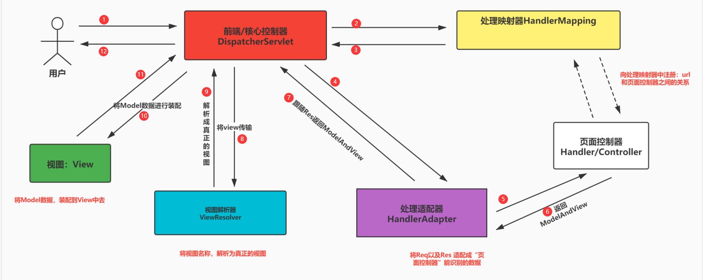
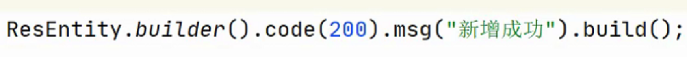

# SpringMVC概念

MVC：Model-View-Controller

JSP（可以写页面代码，还可以写业务代码）-> MVC

表现层的架构的模式：MVC

M：model 模型对象 作用：处理业务逻辑以及传输数据 ,就是JavaBean

V:    view 视图对象 作用：显示数据

C：Controller 控制对象 作用：接收用户的情况，调用业务对象完成业务逻辑，返回响应 Servlet

------

## 一、Servlet的缺陷

（1）过于依赖Servlet API

（2）过于依赖Tomcat服务器

（3）开发和测试非常的麻烦

## 二、解决方案

出来的一些表现层的框架：struts1/2 springmvc

springmvc：是spring的产品

如何解决问题？

> 将控制器划分的更加的详细：
>
> （1）前端控制器（Serlvet） 作用：接收用户的请求，以及请求派发到其他的控制器上
>
> （2）应用控制器（不再是Servlet） 作用：针对请求，进行不同的工作处理
>
> （3）页面控制器（也不是Servlet） 作用：处理页面的情况，调用业务层的代码完成业务逻辑，并返回响应

只有1个需要程序员写：页面控制器

# SpringMVC的工作流程

> 前端/核心控制器：DispatcherServlet
>
> 应用控制器：HandlerMapping,HandlerAdapter,ViewResolver
>
> 页面控制器：Handler/Controller



前端/核心控制器作用：接收请求，派发请求，相当于：大堂经理

HandlerMapping作用：管理url和页面控制器之间的映射关系

HandlerAdapter作用：适配Req，Res与页面控制器之间的参数问题

ViewResolver作用：将viewName解析为真实的视图资源

页面控制器作用：处理请求，完成业务逻辑，并响应数据

> 只有页面控制器，需要程序员自己编写

------

工作流程：

（1）用户发起请求，到核心控制器

（2）核心控制器将请求，派发到处理映射器，问询映射关系

（3）将映射关系，返还给核心控制器[如果没有，直接页面返回404]

（4）核心控制器将请求，派发到处理适配器，适配请求和响应

（5）请求转发到页面控制器，处理业务逻辑

（6）页面控制器返回ModelAndView对象，至处理适配器

（7）处理适配器再将ModelAndView对象，返还到核心控制器

（8）核心控制器将ModelAndView解开，将ViewName交给视图解析器进行视图解析

（9）视图解析器将视图返还给核心控制器

（10）核心控制器将Model向View中进行填充

（11）将填充完毕的View，返回给核心控制器

（12）核心控制器，将View数据返还给用户浏览器


# SpringMVC的初级示例

不要记！没有用，下午我会推翻！原因是：XML版

## 1、创建web项目


## 2、导入配置

```xml
spring mvc jar
<dependency>
    <groupId>org.springframework</groupId>
    <artifactId>spring-webmvc</artifactId>
    <version>5.2.9.RELEASE</version>
</dependency>
<dependency>
    <groupId>org.projectlombok</groupId>
    <artifactId>lombok</artifactId>
    <version>1.18.10</version>
    <scope>provided</scope>
</dependency>
servlet jar
<dependency>
    <groupId>javax.servlet</groupId>
    <artifactId>servlet-api</artifactId>
    <version>2.5</version>
    <scope>provided</scope>
</dependency>
jstl jar
<dependency>
    <groupId>javax.servlet</groupId>
    <artifactId>jstl</artifactId>
    <version>1.2</version>
</dependency>
<dependency>
    <groupId>junit</groupId>
    <artifactId>junit</artifactId>
    <version>4.12</version>
    <scope>test</scope>
</dependency>
```

## 3、配置核心控制器

在web.xml中，配置核心控制器

```xml
<!--向Tomcat容器，注册Servlet-->
<servlet>
<servlet-name>dispatcherServlet</servlet-name>
<servlet-class>org.springframework.web.servlet.DispatcherServlet</servlet-class>
<!--向Spring WebApplicationContext容器中，添加对应的配置文件-->
<init-param>
  <param-name>contextConfigLocation</param-name>
  <param-value>classpath:spring-mvc.xml</param-value>
</init-param>
</servlet>
<servlet-mapping>
<servlet-name>dispatcherServlet</servlet-name>
<!-- / 所有的请求-->
<url-pattern>/</url-pattern>
</servlet-mapping>
```

## 4、配置spring-mvc.xml

```xml
<?xml version="1.0" encoding="UTF-8" standalone="no"?>
<beans xmlns="http://www.springframework.org/schema/beans"
       xmlns:mvc="http://www.springframework.org/schema/mvc"
       xmlns:xsi="http://www.w3.org/2001/XMLSchema-instance"
       xsi:schemaLocation="
        http://www.springframework.org/schema/beans
        https://www.springframework.org/schema/beans/spring-beans.xsd
        http://www.springframework.org/schema/mvc
        https://www.springframework.org/schema/mvc/spring-mvc.xsd">
        <!--1 页面控制器：进行业务处理的Java类，LoginController类为自定义控制器-->
        <bean id="loginController" class="com.woniuxy.mvc.sysmag.controller.LoginController"></bean>
        <!--2 配置映射关系，需要：处理映射器-->
        <bean id="simpleUrlHandlerMapping" class="org.springframework.web.servlet.handler.SimpleUrlHandlerMapping">
            <!--配置映射关系-->
            <property name="urlMap">
                <map>
                    <entry key="sys/login" value-ref="loginController"></entry>
                </map>
            </property>
        </bean>
        <!--3 处理适配器-->
        <bean id="handlerAdapter" class="org.springframework.web.servlet.mvc.SimpleControllerHandlerAdapter"></bean>
        <!--4 配置视图解析器-->
        <bean id="viewResolver" class="org.springframework.web.servlet.view.UrlBasedViewResolver">
            <!-- /sysmag/main.jsp-->
            <!--前缀-->
            <property name="prefix" value="/"></property>
            <!--后缀-->
            <property name="suffix" value=".jsp"></property>
            <!--专门解析：JSTL标签库-->
            <property name="viewClass" value="org.springframework.web.servlet.view.JstlView"></property>
        </bean>
</beans>
```

## 5、配置到Tomcat容器

（1）点击Edit ……


（2）点击+


（3）Tomcat Local


（4）配置Tomcat路径


（5）向Tomcat中部署项目


（6）修改项目名称


（7）启动Tomcat Server

## 补充


# SpringMVC的正式示例

## 1、配置核心控制器

在web.xml中进行配置

```xml
<!--向Tomcat容器，注册Servlet-->
<servlet>
<servlet-name>dispatcherServlet</servlet-name>
<servlet-class>org.springframework.web.servlet.DispatcherServlet</servlet-class>
<!--向Spring WebApplicationContext容器中，添加对应的配置文件-->
<init-param>
  <param-name>contextConfigLocation</param-name>
  <param-value>classpath:spring-mvc.xml</param-value>
</init-param>
</servlet>
<servlet-mapping>
<servlet-name>dispatcherServlet</servlet-name>
<!-- / 所有的请求-->
<url-pattern>/</url-pattern>
</servlet-mapping>
```

## 2、配置SpringMVC框架

src/main/resouces目录下，spring-mvc.xml

```xml
<?xml version="1.0" encoding="UTF-8" standalone="no"?>
<beans xmlns="http://www.springframework.org/schema/beans"
       xmlns:mvc="http://www.springframework.org/schema/mvc"
       xmlns:xsi="http://www.w3.org/2001/XMLSchema-instance"
       xmlns:context="http://www.springframework.org/schema/context"
       xsi:schemaLocation="http://www.springframework.org/schema/beans
        https://www.springframework.org/schema/beans/spring-beans.xsd
        http://www.springframework.org/schema/mvc
        https://www.springframework.org/schema/mvc/spring-mvc.xsd http://www.springframework.org/schema/context https://www.springframework.org/schema/context/spring-context.xsd">
    <!--第1步：开启自动扫描-->
    <context:component-scan base-package="com.woniuxy.springmvc"></context:component-scan>
    <!--第2步：开启SpringMVC的注解支持，

开启注解后，处理映射器可以用注解配置，而使用@RequestMapping注解后，SpringMVC框架将自动使用RequestMappingHandlerMapping、RequestMappingHandlerAdapter-->
    <mvc:annotation-driven></mvc:annotation-driven>
    <!--第3步：配置逻辑视图名-->
    <bean id="viewResolver" class="org.springframework.web.servlet.view.UrlBasedViewResolver">
        <!-- /sysmag/main.jsp-->
        <!--前缀-->
        <property name="prefix" value="/"></property>
        <!--后缀-->
        <property name="suffix" value=".jsp"></property>
        <!--专门解析：JSTL标签库-->
        <property name="viewClass" value="org.springframework.web.servlet.view.JstlView"></property>
    </bean>
</beans>
```

## 3、编写页面控制器

```java
import org.springframework.stereotype.Controller;
import org.springframework.web.bind.annotation.RequestMapping;
import org.springframework.web.servlet.ModelAndView;
@RequestMapping("/sys")
@Controller
public class SystemController {
    /**
     * 要求：后端的名字与 表单提交项的名称一样
     * @param loginName
     * @param pwd
     * @return
     */
    @RequestMapping("/login")
    public ModelAndView login(String loginName,String pwd){
        System.out.println(loginName);
        System.out.println(pwd);
        //返回ModelAndView
        ModelAndView mv = new ModelAndView();
        mv.addObject("user","张三");
        mv.setViewName("sysmag/main");
        return mv;
    }
}
```

## 4、编写请求页面

index.jsp

```jsp
<%--
  Created by IntelliJ IDEA.
  User: Administrator
  Date: 2021/9/26 0026
  Time: 11:44
  To change this template use File | Settings | File Templates.
--%>
<%@ page contentType="text/html;charset=UTF-8" language="java" %>
<html>
<head>
    <title>登录页面</title>
</head>
<body>
<form action="sys/login" method="post">
    登录名：<input type="text" name="loginName">
    <br>
    密码：<input type="password" name="pwd">
    <br>
    <input type="submit" value="登录">
</form>
</body>
</html>
```

# SpringMVC常用注解

## 1、@Controller

Controller 声明该组件，是一个Spring容器需要管理的表现层组件！

> 该组件的方法，需要跳转页面，Form

## 2、@RestController

RestController声明该组件，是一个Spring容器需要管理的表现层组件！

> 该组件的方法，不需要跳转页面，Ajax

## 3、@RequestMapping

RequestMapping作用：完成页面URL请求，与处理该请求的方法之间的映射关系！

替代：

```xml
<!--配置映射关系，需要：处理映射器-->
<bean id="simpleUrlHandlerMapping" class="org.springframework.web.servlet.handler.SimpleUrlHandlerMapping">
    <!--配置映射关系-->
    <property name="urlMap">
        <map>
            <entry key="sys/login" value-ref="loginController"></entry>
        </map>
    </property>
</bean>
<!--处理适配器-->
<bean id="handlerAdapter" class="org.springframework.web.servlet.mvc.SimpleControllerHandlerAdapter"></bean>
```

使用[@RequestMapping](https://github.com/RequestMapping)之后，就不需要在XML配置文件中，配置处理映射器，以及处理适配器。因为一旦使用注解：SpringMVC框架将自动使用RequestMappingHandlerMapping、RequestMappingHandlerAdapter

------

属性说明：该注解有3个属性 value    method    params

（1）`value 用来指定映射关系`

写法：

value={“/sys/login”} 精准匹配

value={/sys/lo*} 模糊匹配，匹配：sys/lo、sys/lo1、sys/loasfd，但是无法匹配：sys/login/1

value={/sys/login/*} 匹配：sys/login/1

value={“/sys/login1”,”/sys/login2”} 匹配：/sys/login1，又能匹配/sys/login2

value={“/user/{userName}/{password}”} 路径匹配，通常使用在Rest架构风格中，后面详讲

（2）`method 用来控制前端的提交方式`

```java
@RequestMapping(value="/login",method = RequestMethod.GET)
```

如果不满足，将抛出405的状态码


（3）`params 用来控制参数`

```java
@RequestMapping(value="/login",params = {"userName"})
```


常见写法：

params={“userName”} 表单提交项中，一定要有userName这个提交项

params={“!userName”} 表单提交项中，一定不能有userName这个提交项

params={“userName=张三”} 表单提交项中，一定要有userName这个提交项，而且它的值一定要是张三

params={“userName!=张三”} 表单提交项中，一定要有userName这个提交项，而且它的值一定不能是张三

params={“userName”,”loginName”} 多个条件可以同时存在

------

针对RequestMapping，出现了4个延伸注解

[@PostMapping](https://github.com/PostMapping) 等同于

```Java
@RequestMapping(value="/login",method = RequestMethod.POST)
```

[@GetMapping](https://github.com/GetMapping) 等同于

```Java
@RequestMapping(value="/login",method = RequestMethod.GET)
```

[@PutMapping](https://github.com/PutMapping) 等同于

```Java
@RequestMapping(value="/login",method = RequestMethod.PUT)
```

[@DeleteMapping](https://github.com/DeleteMapping) 等同于

```Java
@RequestMapping(value="/login",method = RequestMethod.DELETE)
```

## 4、@RequestParam

该注解：用于完成请求参数的映射

// String pwd = request.getParameter(“password”);

```Java
public ModelAndView login(String loginName,@RequestParam("password") String pwd){//表单提交项为password
    
}
```

------

还可以给默认值

```Java
@RequestParam(value = "password",defaultValue = "123456")
```

## 5、@CookieValue

该注解的作用：获得Cookie的值

```java
@RequestMapping(value="/login")
public ModelAndView login(String loginName,String pwd,@CookieValue("JSESSIONID") String jessionid){
    System.out.println(loginName);
    System.out.println(pwd);
    System.out.println(jessionid);
    //返回ModelAndView
    ModelAndView mv = new ModelAndView();
    mv.addObject("user","张三");
    mv.setViewName("sysmag/main");
    return mv;
}
```

## 6、@RequestHeader

该注解的作用：可以获得请求头中的数据

```java
@RequestMapping(value="/login")
public ModelAndView login(String loginName,String pwd,
                          @RequestHeader("User-Agent") String userAgent){
    System.out.println(loginName);
    System.out.println(pwd);
    System.out.println(userAgent);
    //返回ModelAndView
    ModelAndView mv = new ModelAndView();
    mv.addObject("user","张三");
    mv.setViewName("sysmag/main");
    return mv;
}
```

# 能作为参数的类型

## 一、参数的类型

### 1、作用域对象

了解

HttpServletRequest、HttpServletResponse、HttpSession

> 特点：个数，顺序 请自定义

```java
@RequestMapping(value="/login")
public ModelAndView login(HttpServletRequest request, HttpServletResponse response, HttpSession session){
    String loginName = request.getParameter("loginName");
    String pwd = request.getParameter("pwd");
    Cookie[] cookies = request.getCookies();
    System.out.println(loginName);
    System.out.println(pwd);
    for (Cookie cookie:cookies) {
        System.out.println(cookie.getName() + "-----------" + cookie.getValue());
    }
    //返回ModelAndView
    ModelAndView mv = new ModelAndView();
    mv.addObject("user","张三");
    mv.setViewName("sysmag/main");
    return mv;
}
```

但是 ，我不认为我的学生是傻子！

### 2、表单提交项

```jsp
<form action="sys/login" method="post">
    登录名：<input type="text" name="loginName">
    <br>
    密码：<input type="password" name="pwd">
    <br>
    <input type="submit" value="登录">
</form>
```

loginName、pwd就是表单提交项！

> 参数的名字，一定要跟表单提交性的名称保持一致！

```java
@RequestMapping(value="/login")
public ModelAndView login(String loginName,String pwd){
    System.out.println(loginName);
    System.out.println(pwd);
    //返回ModelAndView
    ModelAndView mv = new ModelAndView();
    mv.addObject("user","张三");
    mv.setViewName("sysmag/main");
    return mv;
}
```

### 3、使用对象[最多]

> 对象身上的属性名，必须要和表单项保持一致

```java
import lombok.Data;
import java.io.Serializable;
@Data
public class AdminEntity implements Serializable {
    private Long id;
    private String loginName;
    private String pwd;
    private String userName;
}
```

后端：

```java
@RequestMapping(value="/login")
public ModelAndView login(AdminEntity adminEntity){
    System.out.println(adminEntity);
    //返回ModelAndView
    ModelAndView mv = new ModelAndView();
    mv.addObject("user","张三");
    mv.setViewName("sysmag/main");
    return mv;
}
```

### 4、Model对象[了解]

Model对象作为参数时，通常配合String作为返回类型

> String的返回，就是即将要跳转的页面
>
> 而Model，那就是需要携带页面的数据

```java
@RequestMapping(value="/login")
public String login(AdminEntity adminEntity, Model model){
    System.out.println(adminEntity);
    model.addAttribute("user","李四");//向model对象中，传递数据
    return "sysmag/main";//要跳转的页面
}
```

### 5、[@CookieValue](https://github.com/CookieValue)以及[@RquestHeader](https://github.com/RquestHeader)[了解]

作用：获得Cookie的数据，以及请求头的数据

### 6、PrintWriter[了解]

> 通常配合在Ajax的场景下

```java
@RequestMapping(value="/login")
public void login(AdminEntity adminEntity, PrintWriter out){
    System.out.println(adminEntity);
    out.print(true);//将前端返回true
}
```

## 二、静态资源的释放

spring-mvc.xml中添加如下代码，即可释放静态资源文件

```xml
<!--释放静态资源-->
<mvc:resources mapping="/static/**" location="/static/"></mvc:resources>
```


# 能作为返回的类型

## 一、ModelAndView

适合场景：需要跳转页面

用法：new ModelAndView()，然后分别设置model数据，以及viewName数据

```java
@RequestMapping(value="/login")
public ModelAndView login(AdminEntity adminEntity){
    System.out.println(adminEntity);
    ModelAndView mv = new ModelAndView("sysmag/main");
    mv.addObject("user","老张");
    return mv;
}
```

`这种跳转地址栏不会发生改变，但不是请求转发。`

## 二、void

适合场景：不需要跳转页面，ajax的场景

```java
@RequestMapping(value="/login")
public void login(AdminEntity adminEntity, PrintWriter out){
    System.out.println(adminEntity);
    out.print(true);//将前端返回true
}
```

## 三、String

适合场景：需要跳转页面，通常配合Model作为参数来使用

```java
@RequestMapping(value="/login")
public String login(AdminEntity adminEntity, Model model){
    System.out.println(adminEntity);
    model.addAttribute("user","老张");
    return "sysmag/main";
}
```

注意：若使用返回值类型为String，但采用ajax发起请求访问该方法，可以进入方法内部，但不会通过return 指定的字符串路径进行跳转，因为ajax请求就是局部刷新不跳转页面。

------

请求转发：

```java
return "forward:/sys/login02";
```

重定向：

```java
return "redirect:/sys/login02";
```

> 但是不管请求转发，还是重定向也好，:后面，都需要写完整路径

重定向，如果要定向外部服务器，也是可以的，例如：

```java
return "redirect:https://www.baidu.com";
```

# 参数绑定

框架都是通过getter方法获取对象的属性，对于Boolean类型的属性，getter方法为public Boolean isXxxx(){}，所以Boolean类型的属性命名时不要以is开头，比如，isMarry，isRight等等。


记住：页面上传输的数据，凡是从表单上提交到后端的数据，都可以认为是String类型的数据

后端：String，基本类型的数据，包装类型的数据，对象，String[]……

> 针对数据类型的转换，Spring在spring-core.jar包下已经提供了很多的自动转换方式


SpringMVC框架中，以下关系是可以自动转换的：

（1）String	to	基本数据类型

（2）String	to	String

（3）String	to	String[]

（4）String	to	包装数据类型

（5）String	to	对象

举例说明：

register.jsp

```jsp
<form action="user/register" method="post">
    用户名：<input type="text" name="userName"/>
    <br>
    年龄：<input type="text" name="age">
    <br>
    婚配：<input type="radio" name="marry" value="true" checked>是
    <input type="radio" name="marry" value="false">否
    <br>
    爱好：
    <input type="checkbox" name="hobbies" value="0"/>抽烟
    <input type="checkbox" name="hobbies" value="1"/>喝酒
    <input type="checkbox" name="hobbies" value="2"/>吹NB
    <br>
    出生日期：
    <%-- <input type="date" name="birthday"/>--%>
    <br>
    <input type="submit" value="注册">
</form>
```

UserEntity.java

```java
import lombok.Data;
import java.io.Serializable;
import java.util.Date;
@Data
public class UserEntity implements Serializable {
    private String userName;
    private Integer age;
    private Boolean marry;
    private Integer[] hobbies;
    private Date birthday;
}
```

UserController.java

```java
import com.woniuxy.springmvc.entity.UserEntity;
import org.springframework.stereotype.Controller;
import org.springframework.web.bind.annotation.RequestMapping;
import java.util.Arrays;
import java.util.Date;
@RequestMapping("user")
@Controller
public class UserController {
    @RequestMapping("/register")
    public String register(UserEntity userEntity){
        System.out.println(userEntity);
        return "index";
    }
/*    @RequestMapping("/register")
    public String register(String userName, Integer age, Boolean marry,
                           Integer[] hobbies, Date birthday){
        System.out.println(userName);
        System.out.println(age);
        System.out.println(marry);
        System.out.println(Arrays.toString(hobbies));
        System.out.println(birthday);
        return "index";
    }*/
}
```

# 类型转换器

当类型转换无法匹配的情况，可以自己自定义类型转换器！

## 1、自定义转换器

```java
import org.springframework.core.convert.converter.Converter;
import org.springframework.stereotype.Component;
import org.springframework.util.StringUtils;
import java.text.SimpleDateFormat;
import java.util.Date;
import java.util.regex.Matcher;
import java.util.regex.Pattern;
/**
 * 自定义转换器
 */
@Component
public class StringToDateConverter implements Converter<String, Date> {
    /**
     * String 转向 Date
     * @param s  2021-09-27  |   2021-09-27 12:12:12
     * @return
     */
    @Override
    public Date convert(String s) {
        SimpleDateFormat sdf = null;
        try{
            if(!StringUtils.hasLength(s)){
                return null;
            }else{
                //匹配格式 yyyy-MM-dd (短)   yyyy-MM-dd hh:mm:ss
                Pattern pattern = Pattern.compile("^\\d{4}\\-(0[1-9]|1[012])\\-(0[1-9]|[12][0-9]|3[01])$");
                Matcher m = pattern.matcher(s);
                if(m.matches()){//短格式
                    sdf = new SimpleDateFormat("yyyy-MM-dd");
                }else{//长格式
                    sdf = new SimpleDateFormat("yyyy-MM-dd hh:mm:ss");
                }
                Date parse = sdf.parse(s);
                return parse;
            }
        }catch (Exception e){
            e.printStackTrace();
        }
        return null;
    }
}
```

## 2、向springmvc框架进行注册

```xml
<!--第2步：开启SpringMVC的注解支持-->
<mvc:annotation-driven conversion-service="conversionService"></mvc:annotation-driven>
<!--向SpringMVC中注册转换工厂-->
<bean id="conversionService" class="org.springframework.context.support.ConversionServiceFactoryBean">
    <property name="converters">
        <set>
            <!--添加自定义类型转换器-->
            <ref bean="stringToDateConverter"></ref>
        </set>
    </property>
</bean>
```

# 中文乱码解决

SpringMVC框架针对POST请求，提供了对应的乱码过滤器

在web.xml中配置如下内容：

```xml
<filter>
    <filter-name>characterEncodingFilter</filter-name>
    <filter-class>org.springframework.web.filter.CharacterEncodingFilter</filter-class>
    <init-param>
        <param-name>encoding</param-name>
        <param-value>utf-8</param-value>
    </init-param>
    <!--请求和响应时，都使用UTF-8的编码集-->
    <init-param>
        <param-name>forceEncoding</param-name>
        <param-value>true</param-value>
    </init-param>
</filter>
<filter-mapping>
    <filter-name>characterEncodingFilter</filter-name>
    <url-pattern>/*</url-pattern>
</filter-mapping>
```

注意:表单提交,单选,多选没有value属性也会报400错误


# 文件上传下载

## 一、文件上传

### 1、导入依赖包

commons-fileupload.jar,commons-io.jar

```xml
<!--导入文件上传的依赖包-->
<dependency>
    <groupId>commons-fileupload</groupId>
    <artifactId>commons-fileupload</artifactId>
    <version>1.3.3</version>
</dependency>
```

### 2、配置SpringMVC

配置上传文件的解析器

spring-mvc.xml中添加如下内容：

```xml
<!--配置文件解析器，ID：multipartResolver-->
<bean id="multipartResolver" class="org.springframework.web.multipart.commons.CommonsMultipartResolver">
    <!--默认编码集-->
    <property name="defaultEncoding" value="utf-8"></property>
    <!--最大的上传容量：单位是byte，例如：100M= 1024*1024*100-->
    <property name="maxUploadSize" value="104857600"></property>
    <!--单次每个文件的最大上传容量：10M-->
    <property name="maxUploadSizePerFile" value="10485760"></property>
    <!--byte[] byts = new byte[1024] ,每次读取的字节数-->
    <property name="maxInMemorySize" value="1024"></property>
</bean>
```

### 3、编写页面

```jsp
<%--文件上传的必须条件：method="post" enctype="multipart/form-data"--%>
<form action="file/upload" method="post" enctype="multipart/form-data">
    上传者：<input type="text" name="userName">
    <br>
    请选择文件：<input type="file" name="file01"/>
    <br>
    <input type="submit" value="提交"/>
</form>
```

### 4、后端Controller

```java
import org.springframework.stereotype.Controller;
import org.springframework.web.bind.annotation.PostMapping;
import org.springframework.web.bind.annotation.RequestMapping;
import org.springframework.web.bind.annotation.RequestParam;
import org.springframework.web.multipart.MultipartFile;
import java.io.File;
import java.io.IOException;
@RequestMapping("/file")
@Controller
public class FileController {
    @PostMapping("/upload")
    public String upload(String userName,@RequestParam("file01") MultipartFile file){
        String fileName = file.getOriginalFilename();
        //存在本地
        String path = "E://files";
        File dir = new File(path);
        if(!dir.exists()){
            dir.mkdir();
        }
        try {
            //将文件写入到真实文件中
            file.transferTo(new File(path + "/" + fileName));
        } catch (IOException e) {
            e.printStackTrace();
        }
        return "filedownload";
    }
}
```

## 二、文件下载

### 1、编写页面

filedownload.jsp

```jsp
<%--
  Created by IntelliJ IDEA.
  User: Administrator
  Date: 2021/9/27 0027
  Time: 14:19
  To change this template use File | Settings | File Templates.
--%>
<%@ page contentType="text/html;charset=UTF-8" language="java" %>
<% String path = request.getContextPath();%>
<html>
<head>
    <title>Title</title>
</head>
<body>
    /file/download?fileName=1.jpg">
    <br>
    <a href="<%=path%>/file/download?fileName=1.jpg">下载美女</a>
</body>
</html>
```

### 2、后端Controller

```java
@RequestMapping("/download")
public ResponseEntity<byte[]> download(String fileName){
    //得到完整的文件名称
    String path = "E://files" + "/" + fileName;
    File file = new File(path);
    if(file.exists()){
        //构建状态码 200
        ResponseEntity.BodyBuilder builder = ResponseEntity.ok();
        //设置文件的长度
        builder.contentLength(file.length());
        //设置响应头 告诉前端：后端传递过来的数据，是文件数据
        builder.header("Content-Disposition","attachment; filename=" + fileName);
        //构建响应身体
        try {
            return builder.body(FileUtils.readFileToByteArray(file));
        } catch (IOException e) {
            e.printStackTrace();
        }
    }
    return null;
}
```


# 拦截器

## 一、拦截器的概述

过滤器：一种专门用来针对请求进行过滤处理的工具

使用场景：字符过滤器，登录过滤器，……

过滤器：既可以过滤动态请求，也可以过滤静态请求

> 动态请求：发向servlet或Controller 的请求，都是动态请求
>
> 静态请求：针对JS,CSS,IMG 它们的请求，都是静态请求

------

拦截器：一种专门用来拦截“动态请求”的工具

拦截器：它可以运行在Controller中的方法，执行之前或执行之后

> 底层：动态代理（设计模式）

使用场景：记录登录日志，记录退出日志


## 二、拦截器的实现

有2种实现方式：

（1）实现接口HandlerInterceptor

（2）继承HandlerInterceptorAdapter

| 方法名                                | 描述                                                         |
| :------------------------------------ | :----------------------------------------------------------- |
| boolean preHandle(req,res,handler)    | Controller中的目标方法，执行之前需要增强的方法               |
| void postHandle(req,res,handler)      | Controller中的目标方法，执行之后需要增强的方法               |
| void afterCompletion(req,res,handler) | 所有拦截器中preHandle()以及postHandle()执行完毕之后的收尾的方法 |

### 1、LoginLogEntity以及LoginLogInteceptor

```java
import lombok.Data;
import java.io.Serializable;
import java.util.Date;
@Data
public class LoginLogEntity implements Serializable {
    private Long id;
    private String userName;
    private Date loginTime;
    /**
     * IP地址
     */
    private String address;
}
```

------

```java
import javax.annotation.Resource;
import javax.servlet.http.HttpServletRequest;
import javax.servlet.http.HttpServletResponse;
import java.util.Date;
@Component
public class LoginLogInteceptor implements HandlerInterceptor {
//    @Resource
//    private ILoginLogService loginLogServiceImpl;
    @Override
    public boolean preHandle(HttpServletRequest request, HttpServletResponse response, Object handler) throws Exception {
        System.out.println("LoginLogInteceptor我执行在登录方法之前！");
        //返回false 表示：不满足拦截条件
        //返回true 表示：满足拦截条件
        return true;
    }
    @Override
    public void postHandle(HttpServletRequest request, HttpServletResponse response, Object handler, ModelAndView modelAndView) throws Exception {
        System.out.println("LoginLogInteceptor我执行在登录方法之后！");
        LoginLogEntity log = new LoginLogEntity();
        log.setLoginTime(new Date());
        String userName = (String) request.getSession().getAttribute("user");
        log.setUserName(userName);
        String ip = getIp(request);
        log.setAddress(ip);
        //调用业务层，向数据库存在该JavaBean
        System.out.println(log);
    }
    public String getIp(HttpServletRequest request){
        //请求头中获得IP地址
        if(request.getHeader("x-forward-for") == null){
            return  request.getRemoteAddr();//返回远程IP地址
        }else{
            return request.getHeader("x-forward-for");
        }
    }
    @Override
    public void afterCompletion(HttpServletRequest request, HttpServletResponse response, Object handler, Exception ex) throws Exception {
        System.out.println("LoginLogInteceptor我执行在所有拦截方法都执行之后！");
    }
}
```

### 2、ExitLogInteceptor

```java
import org.springframework.stereotype.Component;
import org.springframework.web.servlet.HandlerInterceptor;
import org.springframework.web.servlet.ModelAndView;
import javax.servlet.http.HttpServletRequest;
import javax.servlet.http.HttpServletResponse;
@Component
public class ExitLogInteceptor implements HandlerInterceptor {
    @Override
    public boolean preHandle(HttpServletRequest request, HttpServletResponse response, Object handler) throws Exception {
        System.out.println("ExitLogInteceptor我执行在退出方法之前！");
        //返回false 表示：不满足拦截条件
        //返回true 表示：满足拦截条件
        return true;
    }
    @Override
    public void postHandle(HttpServletRequest request, HttpServletResponse response, Object handler, ModelAndView modelAndView) throws Exception {
        System.out.println("ExitLogInteceptor我执行在退出方法之后！");
    }
    @Override
    public void afterCompletion(HttpServletRequest request, HttpServletResponse response, Object handler, Exception ex) throws Exception {
        System.out.println("ExitLogInteceptor我执行在所有拦截方法都执行之后！");
    }
}
```

### 3、GlobalInteceptor

```java
import org.springframework.stereotype.Component;
import org.springframework.web.servlet.HandlerInterceptor;
import org.springframework.web.servlet.ModelAndView;
import javax.servlet.http.HttpServletRequest;
import javax.servlet.http.HttpServletResponse;
@Component
public class GlobalInteceptor implements HandlerInterceptor {
    @Override
    public boolean preHandle(HttpServletRequest request, HttpServletResponse response, Object handler) throws Exception {
        System.out.println("GlobalInteceptor我执行在所有的Controller方法之前！");
        //返回false 表示：不满足拦截条件
        //返回true 表示：满足拦截条件
        return true;
    }
    @Override
    public void postHandle(HttpServletRequest request, HttpServletResponse response, Object handler, ModelAndView modelAndView) throws Exception {
        System.out.println("GlobalInteceptor我执行在所有的Controller方法之后！");
    }
    @Override
    public void afterCompletion(HttpServletRequest request, HttpServletResponse response, Object handler, Exception ex) throws Exception {
        System.out.println("GlobalInteceptor我执行在所有拦截方法都执行之后！");
    }
}
```

### 4、配置拦截器

spring-mvc.xml添加如下内容：

```xml
<mvc:interceptors>
    <!--写法：所有的动态请求，都会被该拦截器所拦截-->
    <ref bean="globalInteceptor"></ref>
    <!--针对登录系统的请求，进行拦截-->
    <mvc:interceptor>
        <mvc:mapping path="/sys/login"/>
        <ref bean="loginLogInteceptor"></ref>
    </mvc:interceptor>
    <!--针对退出系统的请求，进行拦截-->
    <mvc:interceptor>
        <mvc:mapping path="/sys/exit"/>
        <ref bean="exitLogInteceptor"></ref>
    </mvc:interceptor>
</mvc:interceptors>
```

## 三、拦截器链

拦截器链：多个拦截器同时真多某一些请求进行拦截！


## 四、过滤器与拦截器的区别

（1）过滤器放置在Tomcat中，而拦截器在WEB程序的Spring容器里面

（2）过滤器可以过滤所有的请求，但是拦截器只能拦截“动态请求”

（3）拦截器底层原理是“动态代理模式”，而过滤器底层原理是“回调函数”

（4）拦截器是SpringMVC框架提供，而过滤器是Servlet API提供的

（5）拦截器可以针对请求进行拦截，而过滤器是不能针对请求进行中断

拦截器链的执行顺序与拦截器在xml中的配置顺序有关。

# SpringMVC数据校验

校验：格式校验，数据校验

> 格式校验：非空？邮箱格式？电话号码？身份证？…… JS +正则表达式
>
> 数据校验：登录名是否已经存在，注册时手机号码是否已经有过注册…… Ajax

后端校验：格式校验

------

前后端分离项目中：


> 前后端不分离的项目，一般不需要做后端校验
>
> 原因是：前端也是你写的，后端还是你写的

## 一、SpringMVC校验框架

SpringMVC校验框架，是Hibernate提供的一套校验框架。这套校验框架遵循JSR303规范！

JSR303规范：一套针对JavaBean属性进行格式校验的规范！

## 二、具体的实现

### 1、导入相关的依赖包

```xml
<!--导入hibernate校验框架-->
<dependency>
    <groupId>org.hibernate</groupId>
    <artifactId>hibernate-validator</artifactId>
    <version>5.4.1.Final</version>
</dependency>
<dependency>
    <groupId>taglibs</groupId>
    <artifactId>standard</artifactId>
    <version>1.1.2</version>
</dependency>
<dependency>
    <groupId>javax.servlet</groupId>
    <artifactId>jstl</artifactId>
    <version>1.2</version>
</dependency>
```

### 2、修改配置文件

spring-mvc.xml

```xml
<!--第2步：开启SpringMVC的注解支持-->
<mvc:annotation-driven conversion-service="conversionService" validator="validatorFactoryBean"></mvc:annotation-driven>
<!--提供一个验证工厂-->
<bean id="validatorFactoryBean" class="org.springframework.validation.beanvalidation.LocalValidatorFactoryBean">
    <!--设置提供类：Hibernate提供验证-->
    <property name="providerClass" value="org.hibernate.validator.HibernateValidator"></property>
</bean>
```

### 3、使用JSR303规范


扩展约束：


具体的约束地址：请查看2.3.1-2.3.2的内容

https://docs.jboss.org/hibernate/validator/5.4/reference/en-US/html_single/#section-validating-bean-constraints

```java
import lombok.Data;
import org.hibernate.validator.constraints.NotEmpty;
import javax.validation.Valid;
import javax.validation.constraints.*;
import java.io.Serializable;
import java.util.Date;
@Data
public class UserEntity implements Serializable {
    @NotNull(message = "用户名为必填项！")
    @NotEmpty(message = "用户名不能为空！")
    @Size(min = 6,max = 12,message = "用户名必须要[6-12]位！")
    private String userName;
    @NotNull(message = "密码为必填项！")
    @NotEmpty(message = "密码不能为空！")
    @Pattern(regexp = "^(?![0-9]+$)(?![a-zA-Z]+$)[0-9A-Za-z]{8,16}$",message = "密码长度密码是[8-16]位，而且不能是全数字以及字母！")
    private String password;
    @Min(value = 18,message = "未成年，禁止访问！")
    @Max(value = 60,message = "内容过于刺激，老年不宜！")
    private Integer age;
    @AssertFalse(message = "已婚人士，严禁入内！")
    private Boolean marry;
    @Size(min = 1,max = 3,message = "你连点个人爱好都没有吗？")
    private Integer[] hobbies;
    @Past(message = "不能出生在未来！")
    private Date birthday;
//    @Valid  //关联对象的验证
//    private DeptEntity dept;
}
```

### 4、在Controller开启校验

```java
@RequestMapping("user")
@Controller
public class UserController {
    /**
     * @Validated的作用：通知SpringMVC框架，针对userEntity对象，进行格式校验
     * @param userEntity
     * @param br 固定参数，专门用来接收错误的提醒
     * @return
     */
    @RequestMapping("/validator")
    public String validator(@Validated UserEntity userEntity, BindingResult br, Model model){
        if(br.hasErrors()){
            //获得所有的错误
            List<ObjectError> allErrors = br.getAllErrors();
//            for (ObjectError e:allErrors) {
//                System.out.println(e.getObjectName());
//                System.out.println(e.getDefaultMessage());
//                System.out.println(e.getCode());
//            }
            //得把错误，传递给前端，如果是AJAX，那么就返回JSON
            model.addAttribute("err",allErrors);
            return "validator";
        }
        //一切正常，进入业务处理
        System.out.println(userEntity);
        return "index";
    }
}
```

### 5、JSP

```jsp
<%@ page contentType="text/html;charset=UTF-8" language="java" isELIgnored="false" %>
<%@ taglib prefix="c" uri="http://java.sun.com/jsp/jstl/core" %>
<% String path = request.getContextPath();%>
<html>
<head>
    <title>校验页面</title>
</head>
<body>
    错误提示：
    <c:if test="${err != null && err.size() > 0}">
        <c:forEach items="${err}" var="e">
            <font style="color: red;font-size: 11px">${e.defaultMessage}</font>
            <br/>
        </c:forEach>
    </c:if>
    <form action="<%=path%>/user/validator" method="get">
        用户名：<input type="text" name="userName"/>
        <br>
        密码：<input type="password" name="password">
        <br>
        年龄：<input type="text" name="age">
        <br>
        婚配：<input type="radio" name="marry" value="true" checked>是
        <input type="radio" name="marry" value="false">否
        <br>
        爱好：
        <input type="checkbox" name="hobbies" value="0"/>抽烟
        <input type="checkbox" name="hobbies" value="1"/>喝酒
        <input type="checkbox" name="hobbies" value="2"/>吹NB
        <br>
        出生日期：
        <input type="text" name="birthday"/>
        <br>
        <input type="submit" value="注册">
    </form>
</body>
</html>
```

# 整合JSON

一、前后端分离的交互方式

SpringMVC针对JSON，提供了默认的兼容：Jackson

## 1、导入JAR包

```xml
<!--导入Jackson的相关依赖-->
<dependency>
    <groupId>com.fasterxml.jackson.core</groupId>
    <artifactId>jackson-databind</artifactId>
    <version>2.11.4</version>
</dependency>
```

## 2、@ResponseBody

该注解的作用：`将返回的Java对象，在响应体中转换为JSON数据，并返回到前端`

```java
@RequestMapping("/user")
@Controller
public class UserController {
    @ResponseBody
    @RequestMapping("/save")
    public ResEntity save(UserEntity userEntity) {
        ResEntity res = new ResEntity(200, "新增成功！");
        return res;
    }
}
```

[@ResponseBody](https://github.com/ResponseBody) 主要借助：MappingJackson2HttpMessageConverter完成Java对象到JSON对象的相互转换！

> [@ResponseBody](https://github.com/ResponseBody) 添加了该注解之后，将无法跳转页面

当Controller类中所有的方法，都不跳转页面的时候，我们可以类上，使用[@RestController](https://github.com/RestController)

> [@RestController](https://github.com/RestController) = [@Controller](https://github.com/Controller) + [@ResponseBody](https://github.com/ResponseBody)

```java
@Data
@NoArgsConstructor
@RequiredArgsConstructor
public class ResEntity<T> implements Serializable {
    /**
     * 状态码
     */
    @NonNull
    private Integer code;
    /**
     * 消息
     */
    @NonNull
    private String msg;
    /**
     * 具体的数据
     */
    private List<T> datas;
}
```

## 3、@RequestBody

该注解的作用：`在请求体中，将JSON数据转换Java数据`！主要借助：MappingJackson2HttpMessageConverter完成JSON对象到Java对象的相互转换！

```java
@RequestMapping("/update")
public  ResEntity update(@RequestBody UserEntity userEntity) {
    System.out.println(userEntity);
    ResEntity res = new ResEntity(200, "修改成功！");
    return res;
}
```

某个方法不需要跳页面，在方法前或返回值类型前加@ResponseBody;

当某个类的所有方法都不需要跳转页面时，可以在类前加@ResonseBody;

@RestController=@ResponseBody+@Controller。

正常通过ajax发送给后端的数据时js对象，相当于表单提交。将js对象使用stringify()方法转换成json再提交，提交给后端的就是json数据。

# PostMan

邮递员工具：帮我们测试后端接口

适合于前后端分离的情景，模拟前端向后端发起HTTP请求！

`注意：Ajax请求默认提交的是js对象，是键值对数据，仍然属于表单提交，将需要提交的js对象转为json再提交，后端受到的才是json数据。`

## 一、GET请求

### 1、发送表单数据


### 2、发送JSON数据


## 二、POST请求

### 1、发送表单数据


### 2、发JSON数据


# Rest架构风格

## RestFul 风格

Rest: Representational State Transfer 表述性状态传递风格

该风格，不是一种什么新的技术，也不是一种新的框架，它只是提交方式的一种转变！

该风格由 Roy Fielding 在2000年 他的博士学位论文上提出的，此人是HTTP1.0 以及HTTP1.1 协议的主要制造者。

最早期：提出说法uri(统一资源修饰符) 与url(统一资源定位符)

uri：是资源的一种唯一的描述，

url：使用url去找到资源

------

资源，可以是数据，也可以是图片，还是可以是视频，反是对项目有用的东西，都是资源！

然后，使用HTTP的4种标准方法，完成对资源的操作

| 方法   | 幂等性             | 描述     |
| :----- | :----------------- | :------- |
| GET    | 幂等               | 查询资源 |
| POST   | 非幂等（从无到有） | 新增资源 |
| PUT    | 幂等               | 修改资源 |
| DELETE | 幂等               | 删除资源 |

------

新的概念：面向资源编程 - 针对资源进行统一接口，路径传值。

接口：user/{id}		GET/POST/PUT/DELETE

## 具体的操作

[@PostMapping](https://github.com/PostMapping) [@GetMapping](https://github.com/GetMapping) [@PutMapping](https://github.com/PutMapping) [@DeleteMapping](https://github.com/DeleteMapping)

> 举例：部门这种资源的CURD

### 1、编写资源统一接口

```java
import com.woniuxy.springmvc.entity.DeptEntity;
import com.woniuxy.springmvc.res.ResEntity;
import org.springframework.web.bind.annotation.*;
import java.util.ArrayList;
import java.util.List;
@RequestMapping("/dept")
@RestController
public class DeptController {
    @PostMapping("/{id}")
    public ResEntity save(@PathVariable("id") Long id,DeptEntity deptEntity){
        System.out.println(id);
        System.out.println(deptEntity);
        return ResEntity.builder().code(200).msg("新增成功").build();
    }
    @PutMapping("/{id}")
    public ResEntity update(DeptEntity deptEntity){
        System.out.println(deptEntity);
        return ResEntity.builder().code(200).msg("新增成功").build();
    }
    @DeleteMapping("/{id}")
    public ResEntity delete(@PathVariable("id") Long id){
        System.out.println(id);
        return ResEntity.builder().code(200).msg("删除成功").build();
    }
    @GetMapping("/{id}")
    public ResEntity get(@PathVariable("id") Long id){
        System.out.println(id);
        DeptEntity deptEntity = new DeptEntity();
        deptEntity.setId(1L);
        deptEntity.setDeptName("财务部");
        deptEntity.setDeptDesc("一个专门来管钱的部门！");
        List datas = new ArrayList();
        datas.add(deptEntity);
        return ResEntity.builder().code(200).msg("查询成功").datas(datas).build();
    }
}
```

### 2、配置解决PUT，DELETE无法使用请求体的过滤器

web.xml中进行配置

```xml
<!-- 解决PUT,DELETE 无法使用请求体，传输数据的问题 -->
<filter>
    <filter-name>formContentFilter</filter-name>
    <filter-class>org.springframework.web.filter.FormContentFilter</filter-class>
</filter>
<filter-mapping>
    <filter-name>formContentFilter</filter-name>
    <servlet-name>dispatcherServlet</servlet-name>
</filter-mapping>
```

### 3、发起测试


## 总结一下

什么是Rest风格？一种面向资源编程的方式，使用uri定义统一资源接口，使用HTTP的4种标准完成对资源的操作！

优势：

（1）前后端分离过程，不管前端是什么，后端都只有唯一的接口

（2）便于服务器集群


使用@builder建造者模式，可以不用new



但使用@Builder后是使用@Data,@AllArgsConstructor,@RrequiredArgsConstructor等注解产生的构造器无法用，需要用@Tolerate注解自定义构造器。

@PathVariable从路径中获取值。

PUT  DELETE走消息体（请求体）body请求，后端拿不到数据，需要添加过滤器。


get、post可以通过表单（请求头）、ajax向后端提交数据（请求体）

put、delete默认不支持表单提交(`默认不支持，但通过配置可以利用隐藏表单域实现表单提交`)，通常通过Ajax向后端提交数据（请求体），但通过ajax发送的数据无论是js还是json，springMVC都不能直接转换成Java对象（后端接口传入对向的属性为null），需要在web.xml中配置，才能数据的完成自动转换。


浏览器form表单只支持GET与POST请求，而DELETE、PUT等method并不支持，spring3.0添加了一个过滤器，可以将这些请求转 换为标准的http方法，使得支持GET、POST、PUT与DELETE请求，该过滤器为HiddenHttpMethodFilter，只需要在表单中添加一个隐藏字段"_method"

https://www.cnblogs.com/rhett-web/p/4913893.html

```xml
<!-- 解决PUT,DELETE 无法使用请求体，传输数据的问题 -->
<filter>
    <filter-name>formContentFilter</filter-name>
    <filter-class>org.springframework.web.filter.FormContentFilter</filter-class>
</filter>
<filter-mapping>
    <filter-name>formContentFilter</filter-name>
    <servlet-name>dispatcherServlet</servlet-name>
</filter-mapping>
```


# SpringMVC的异常处理

## 一、异常处理

采用AOP思想来处理异常！

通常做法：持久层 -> 业务层 -> 表现层 -> 页面

需要在表现层到页面的过程中，适当做些合理的处理！

### 1、第1套方案

> 适用于前后端不分离的项目

跳转页面，使用页面来显示异常！

[@ControllerAdvice](https://github.com/ControllerAdvice) + [@ExceptionHandler](https://github.com/ExceptionHandler)

（1）定义异常处理器

```java
import com.woniuxy.springmvc.exceptions.DataErrorException;
import org.springframework.web.bind.annotation.ControllerAdvice;
import org.springframework.web.bind.annotation.ExceptionHandler;
import org.springframework.web.servlet.ModelAndView;
@ControllerAdvice
public class ControllerExceptionHandler {
    @ExceptionHandler
    public ModelAndView handler(Exception e){
        ModelAndView mv = new ModelAndView("error");
        if(e instanceof DataErrorException){
            mv.addObject("err","数据输入错误，请重新输入！");
        }else{
            mv.addObject("err","系统繁忙，请稍后重试！");
        }
        return mv;
    }
}
```

（2）自定义业务异常

```java
/**
 * 数据错误异常
 */
public class DataErrorException extends RuntimeException {
    public DataErrorException() {
    }
    public DataErrorException(String message) {
        super(message);
    }
}
```

（3）定义一个异常页面

```jsp
<%@ page contentType="text/html;charset=UTF-8" language="java" isELIgnored="false" %>
<html>
<head>
    <title>Title</title>
</head>
<body>
    系统异常：${err}
    <br>
请联系管理员！
</body>
</html>
```

（4）使用异常

```java
@RequestMapping("/save")
public  ResEntity save(UserEntity userEntity) {
    System.out.println(userEntity);
    if(userEntity.getUserName() == null){
        throw new DataErrorException("用户名录入错误！");
    }
    ResEntity res = new ResEntity(200, "新增成功！");
    return res;
}
```

### 2、第2套方案

> 适合于 前后端分离的场景

不会再跳转页面，使用[@RestControllerAdvice](https://github.com/RestControllerAdvice) + [@ExceptionHandler](https://github.com/ExceptionHandler)

```java
import com.woniuxy.springmvc.exceptions.DataErrorException;
import com.woniuxy.springmvc.exceptions.ExceptionEntity;
import org.springframework.web.bind.annotation.ExceptionHandler;
import org.springframework.web.bind.annotation.RestControllerAdvice;
@RestControllerAdvice
public class RestControllerExceptionHandler {
    @ExceptionHandler
    public ExceptionEntity handler(Exception e){
        if(e instanceof DataErrorException){
            return ExceptionEntity.builder().
                    code(10000).msg("数据录入异常").build();
        }else{
            return ExceptionEntity.builder().
                    code(20000).msg("系统繁忙，请稍后重试").build();
        }
    }
}
```

## 二、状态码的异常

（1）web.xml中配置错误页面

```xml
<error-page>
    <error-code>404</error-code>
    <location>/error/404.jsp</location>
</error-page>
<error-page>
    <error-code>500</error-code>
    <location>/error/500.jsp</location>
</error-page>
```

（2）自定义错误页面

404.jsp

```jsp
<%@ page contentType="text/html;charset=UTF-8" language="java" %>
<html>
<head>
    <title>Title</title>
</head>
<body>
    访问资源不存在！
</body>
</html>
```

500.jsp

```jsp
<%@ page contentType="text/html;charset=UTF-8" language="java" %>
<html>
<head>
    <title>Title</title>
</head>
<body>
    服务器异常，请联系管理员！
</body>
</html>
```


持久层异常抛到业务层，业务层抛到controller，controller用异常处理切面处理：

跳转页面：@ControllerAdvice+@ExcecptionHandler

不跳页面，返回json：@RestControllerAdvice+@ExceptionHandler


# SSM整合

SSH：Struts2 + Spring + Hibernate

SSM: SpringMVC + Spring + Mybatis

## 一、先整合SM

### 1、导入Jar包

spring.jar mybatis.jar mybatis-spring.jar junit.jar log4j.jar mysql-connector-java.java dbcp.jar

------

pom.xml

德鲁伊数据源的中文学习地址：

[https://github.com/alibaba/druid/wiki/%E5%B8%B8%E8%A7%81%E9%97%AE%E9%A2%98](https://github.com/alibaba/druid/wiki/常见问题)

```xml
<!--阿里巴巴的Druid-->
<dependency>
    <groupId>com.alibaba</groupId>
    <artifactId>druid</artifactId>
    <version>1.2.6</version>
</dependency>
<!--导入mybatis的Jar包-->
<dependency>
    <groupId>org.mybatis</groupId>
    <artifactId>mybatis</artifactId>
    <version>3.5.7</version>
</dependency>
<!--导入Mybatis兼容Spring的Jar包-->
<dependency>
    <groupId>org.mybatis</groupId>
    <artifactId>mybatis-spring</artifactId>
    <version>2.0.6</version>
</dependency>
<!--导入数据库的jar包-->
<dependency>
    <groupId>mysql</groupId>
    <artifactId>mysql-connector-java</artifactId>
    <version>5.1.46</version>
</dependency>
<!--导入Log4J的Jar包-->
<dependency>
    <groupId>log4j</groupId>
    <artifactId>log4j</artifactId>
    <version>1.2.17</version>
</dependency>
<!--导入Spring的Jar-->
<dependency>
    <groupId>org.springframework</groupId>
    <artifactId>spring-context</artifactId>
    <version>5.2.9.RELEASE</version>
</dependency>
<!--导入Spring兼容JUnit的Jar包-->
<dependency>
    <groupId>org.springframework</groupId>
    <artifactId>spring-test</artifactId>
    <version>5.2.9.RELEASE</version>
</dependency>
<dependency>
    <groupId>org.springframework</groupId>
    <artifactId>spring-jdbc</artifactId>
    <version>5.2.9.RELEASE</version>
</dependency>
<!-- 导入第3方的切面相关Jar包-->
<dependency>
    <groupId>org.aspectj</groupId>
    <artifactId>aspectjrt</artifactId>
    <version>1.8.8</version>
</dependency>
<dependency>
    <groupId>org.aspectj</groupId>
    <artifactId>aspectjweaver</artifactId>
    <version>1.8.8</version>
    <scope>runtime</scope>
</dependency>
<dependency>
    <groupId>org.projectlombok</groupId>
    <artifactId>lombok</artifactId>
    <version>1.18.10</version>
    <scope>provided</scope>
</dependency>
<dependency>
    <groupId>junit</groupId>
    <artifactId>junit</artifactId>
    <version>4.12</version>
    <scope>test</scope>
</dependency>
```

### 2、创建包结构


### 3、spring整合mybatis的配置

applicationContext.xml(之前的beans.xml ，可以随便起名)

```xml
<?xml version="1.0" encoding="UTF-8"?>
<beans xmlns="http://www.springframework.org/schema/beans"
       xmlns:xsi="http://www.w3.org/2001/XMLSchema-instance"
       xmlns:aop="http://www.springframework.org/schema/aop"
       xmlns:tx="http://www.springframework.org/schema/tx"
       xmlns:context="http://www.springframework.org/schema/context"
       xsi:schemaLocation="http://www.springframework.org/schema/beans
        https://www.springframework.org/schema/beans/spring-beans.xsd
        http://www.springframework.org/schema/context
        https://www.springframework.org/schema/context/spring-context.xsd
        http://www.springframework.org/schema/aop
        https://www.springframework.org/schema/aop/spring-aop.xsd
        http://www.springframework.org/schema/tx
        https://www.springframework.org/schema/tx/spring-tx.xsd">
    <!--第1步：开启容器自动扫描-->
    <context:component-scan base-package="com.woniuxy.ssm">
        <!--排除掉WEB层的组件-->
        <context:exclude-filter type="annotation" expression="org.springframework.stereotype.Controller"/>
    </context:component-scan>
    <!--第2步：配置数据源连接池-->
    <context:property-placeholder location="classpath:database.properties"></context:property-placeholder>
    <bean id="dataSource" class="com.alibaba.druid.pool.DruidDataSource" init-method="init" destroy-method="close">
        <!--连接数据库最基本元素-->
        <property name="url" value="${jdbc.url}" />
        <property name="username" value="${jdbc.username}" />
        <property name="password" value="${jdbc.password}" />
        <!--额外的扩展-->
        <property name="maxActive" value="20" />
        <property name="initialSize" value="5" />
        <!--获得连接时，最大的等待时间：6秒-->
        <property name="maxWait" value="6000" />
        <!--数据库连接池最少连接数！-->
        <property name="minIdle" value="1" />
        <!--间隔1分钟检测1次所有的空闲连接-->
        <property name="timeBetweenEvictionRunsMillis" value="60000" />
        <!--空闲连接在连接池中，最大的存活时间为5分钟！-->
        <property name="minEvictableIdleTimeMillis" value="300000" />
        <!--设置何时触发：校验语句-->
        <property name="testWhileIdle" value="false" />
        <property name="testOnBorrow" value="true" />
        <property name="testOnReturn" value="false" />
        <!--校验语句-->
        <property name="validationQuery" value="select now() from dual"></property>
        <!-- 是否可以缓存预编译对象-->
        <property name="poolPreparedStatements" value="true" />
        <!--缓存20个预编译对象-->
        <property name="maxOpenPreparedStatements" value="20" />
        <!--配置获得连接时，使用异步获得连接方式-->
        <property name="asyncInit" value="true" />
        <!--扩展插件：stat 监控功能，log4j 记录日志，wall 防SQL注入-->
        <property name="filters" value="log4j,wall" />
        <property name="proxyFilters">
            <list>
                <ref bean="stat-filter" />
            </list>
        </property>
    </bean>
    <!--监控设置-->
    <bean id="stat-filter" class="com.alibaba.druid.filter.stat.StatFilter">
        <!--设置慢SQL的标记时间-->
        <property name="slowSqlMillis" value="5000" />
        <property name="logSlowSql" value="true" />
    </bean>
    <!--第3步：sessionFactory-->
    <bean id="sessionFactory" class="org.mybatis.spring.SqlSessionFactoryBean">
        <!--配置数据源连接池-->
        <property name="dataSource" ref="dataSource"></property>
        <!--定义别名包-->
        <property name="typeAliasesPackage" value="com.woniuxy.ssm.entity"></property>
        <property name="mapperLocations">
            <array>
                <value>classpath:mappers/*.xml</value>
            </array>
        </property>
        <property name="configuration">
            <bean class="org.apache.ibatis.session.Configuration">
                <!--开启延迟加载-->
                <property name="lazyLoadingEnabled" value="true"></property>
                <!--取消积极主动的 加载方法-->
                <property name="aggressiveLazyLoading" value="false"></property>
                <!--开启日志记录功能-->
                <property name="logImpl" value="org.apache.ibatis.logging.stdout.StdOutImpl"></property>
            </bean>
        </property>
    </bean>
    <!--第4步：配置MapperScanner-->
    <bean id="mapperScannerConfigurer" class="org.mybatis.spring.mapper.MapperScannerConfigurer">
        <!--通过MapperScanner向Mybatis中注册 *Mapper的相关信息，多个包之间需要使用,或;进行分割-->
        <property name="basePackage" value="com.woniuxy.ssm.sysmag.mapper"></property>
        <!--关联工厂-->
        <property name="sqlSessionFactoryBeanName" value="sessionFactory"></property>
    </bean>
    <!--第5步：配置事务管理器-->
    <bean id="transactionManager" class="org.springframework.jdbc.datasource.DataSourceTransactionManager">
        <property name="dataSource" ref="dataSource"></property>
    </bean>
    <!--第6步：声明式事务处理-->
    <tx:annotation-driven transaction-manager="transactionManager"/>
    <!--第7步：开启动态代理支持-->
    <aop:aspectj-autoproxy></aop:aspectj-autoproxy>
</beans>
```

## 二、整合SpringMVC

### 1、导入依赖

springmvc.jar hibernate-validator.jar（随你自己）

pom.xml中去

```xml
<!--导入Jackson的相关依赖-->
<dependency>
  <groupId>com.fasterxml.jackson.core</groupId>
  <artifactId>jackson-databind</artifactId>
  <version>2.11.4</version>
</dependency>
<dependency>
  <groupId>org.springframework</groupId>
  <artifactId>spring-webmvc</artifactId>
  <version>5.2.9.RELEASE</version>
</dependency>
<dependency>
  <groupId>javax.servlet</groupId>
  <artifactId>servlet-api</artifactId>
  <version>2.5</version>
  <scope>provided</scope>
</dependency>
<dependency>
  <groupId>javax.servlet</groupId>
  <artifactId>jstl</artifactId>
  <version>1.2</version>
</dependency>
<!--导入文件上传的依赖包-->
<dependency>
  <groupId>commons-fileupload</groupId>
  <artifactId>commons-fileupload</artifactId>
  <version>1.3.3</version>
</dependency>
```

### 2、springmvc的配置

```xml
<?xml version="1.0" encoding="UTF-8" standalone="no"?>
<beans xmlns="http://www.springframework.org/schema/beans"
       xmlns:mvc="http://www.springframework.org/schema/mvc"
       xmlns:xsi="http://www.w3.org/2001/XMLSchema-instance"
       xmlns:context="http://www.springframework.org/schema/context"
       xsi:schemaLocation="http://www.springframework.org/schema/beans
        https://www.springframework.org/schema/beans/spring-beans.xsd
        http://www.springframework.org/schema/mvc
        https://www.springframework.org/schema/mvc/spring-mvc.xsd http://www.springframework.org/schema/context https://www.springframework.org/schema/context/spring-context.xsd">
    <!--第1步：开启自动扫描-->
    <context:component-scan base-package="com.woniuxy.ssm">
        <!--在自动扫描，排除：@Service @Repository 标识的组件-->
        <context:exclude-filter type="annotation" expression="org.springframework.stereotype.Repository"/>
        <context:exclude-filter type="annotation" expression="org.springframework.stereotype.Service"/>
    </context:component-scan>
    <!--第2步：释放静态资源-->
    <mvc:resources mapping="/static/**" location="/static/"></mvc:resources>
    <!--第3步：开启mvc的注解支持-->
    <mvc:annotation-driven conversion-service="conversionService"></mvc:annotation-driven>
    <!--向SpringMVC中注册转换工厂-->
    <bean id="conversionService" class="org.springframework.context.support.ConversionServiceFactoryBean">
        <property name="converters">
            <set>
                <!--添加自定义类型转换器-->
                <ref bean="stringToDateConverter"></ref>
            </set>
        </property>
    </bean>
    <!--第4步：文件上传解析器-->
    <!--配置文件解析器，ID：multipartResolver-->
    <bean id="multipartResolver" class="org.springframework.web.multipart.commons.CommonsMultipartResolver">
        <!--默认编码集-->
        <property name="defaultEncoding" value="utf-8"></property>
        <!--最大的上传容量：单位是byte，例如：100M= 1024*1024*100-->
        <property name="maxUploadSize" value="104857600"></property>
        <!--单次每个文件的最大上传容量：10M-->
        <property name="maxUploadSizePerFile" value="10485760"></property>
        <!--byte[] byts = new byte[1024] ,每次读取的字节数-->
        <property name="maxInMemorySize" value="1024"></property>
    </bean>
    <!--第5步：视图解析器-->
    <bean id="viewResolver" class="org.springframework.web.servlet.view.UrlBasedViewResolver">
        <!-- /sysmag/main.jsp-->
        <!--前缀-->
        <property name="prefix" value="/"></property>
        <!--后缀-->
        <property name="suffix" value=".jsp"></property>
        <!--专门解析：JSTL标签库-->
        <property name="viewClass" value="org.springframework.web.servlet.view.JstlView"></property>
    </bean>
</beans>
```

## 三、上下文关系

spring-mvc.xml 由DispatcherServlet 启动，产生Spring容器

applicationContext.xml 由ContextLoaderListener 启动，产生Spring容器


## 四、分别启动

web.xml

### 1、启动springmvc的容器

```xml
<!--启动SpringMVC的容器-->
<servlet>
    <servlet-name>dispatcherServlet</servlet-name>
    <servlet-class>org.springframework.web.servlet.DispatcherServlet</servlet-class>
    <init-param>
        <param-name>contextConfigLocation</param-name>
        <param-value>classpath:spring-mvc.xml</param-value>
    </init-param>
</servlet>
<servlet-mapping>
    <servlet-name>dispatcherServlet</servlet-name>
    <url-pattern>/</url-pattern>
</servlet-mapping>
```

### 2、启动spring的容器

```xml
<!--启动Spring容器-->
<context-param>
    <param-name>contextConfigLocation</param-name>
    <param-value>classpath:applicationContext.xml</param-value>
</context-param>
<listener>
    <listener-class>org.springframework.web.context.ContextLoaderListener</listener-class>
</listener>
```

### 3、乱码过滤器

```xml
<!--配置乱码过滤器-->
<filter>
    <filter-name>encodingFilter</filter-name>
    <filter-class>org.springframework.web.filter.CharacterEncodingFilter</filter-class>
    <init-param>
        <param-name>encoding</param-name>
        <param-value>UTF-8</param-value>
    </init-param>
    <init-param>
        <param-name>forceEncoding</param-name>
        <param-value>true</param-value>
    </init-param>
</filter>
<filter-mapping>
    <filter-name>encodingFilter</filter-name>
    <url-pattern>/*</url-pattern>
</filter-mapping>
```

### 4、支持Rest风格的过滤器

```xml
<!--配置支持Rest风格的过滤器-->
<filter>
    <filter-name>formContentFilter</filter-name>
    <filter-class>org.springframework.web.filter.FormContentFilter</filter-class>
</filter>
<filter-mapping>
    <filter-name>formContentFilter</filter-name>
    <servlet-name>dispatcherServlet</servlet-name>
</filter-mapping>
```

### 5、配置德鲁伊的过滤器

```xml
<!--配置德鲁伊的监控页面-->
<filter>
    <filter-name>DruidStatViewFilter</filter-name>
    <filter-class>com.alibaba.druid.support.http.StatViewFilter</filter-class>
    <!--不允许用户清理 监控数据-->
    <init-param>
        <param-name>resetEnable</param-name>
        <param-value>false</param-value>
    </init-param>
    <init-param>
        <param-name>loginUsername</param-name>
        <param-value>druid</param-value>
    </init-param>
    <init-param>
        <param-name>loginPassword</param-name>
        <param-value>druid</param-value>
    </init-param>
</filter>
<filter-mapping>
    <filter-name>DruidStatViewFilter</filter-name>
    <url-pattern>/druid/*</url-pattern>
</filter-mapping>
```

## 五、完整的web.xml

```xml
<?xml version="1.0" encoding="UTF-8"?>
<web-app version="3.1" xmlns="http://xmlns.jcp.org/xml/ns/javaee"
         xmlns:xsi="http://www.w3.org/2001/XMLSchema-instance"
         xsi:schemaLocation="http://xmlns.jcp.org/xml/ns/javaee                       http://xmlns.jcp.org/xml/ns/javaee/web-app_3_1.xsd">
    <!--启动SpringMVC的容器-->
    <servlet>
        <servlet-name>dispatcherServlet</servlet-name>
        <servlet-class>org.springframework.web.servlet.DispatcherServlet</servlet-class>
        <init-param>
            <param-name>contextConfigLocation</param-name>
            <param-value>classpath:spring-mvc.xml</param-value>
        </init-param>
    </servlet>
    <servlet-mapping>
        <servlet-name>dispatcherServlet</servlet-name>
        <url-pattern>/</url-pattern>
    </servlet-mapping>
    <!--启动Spring容器-->
    <context-param>
        <param-name>contextConfigLocation</param-name>
        <param-value>classpath:applicationContext.xml</param-value>
    </context-param>
    <listener>
        <listener-class>org.springframework.web.context.ContextLoaderListener</listener-class>
    </listener>
    <!--配置乱码过滤器-->
    <filter>
        <filter-name>encodingFilter</filter-name>
        <filter-class>org.springframework.web.filter.CharacterEncodingFilter</filter-class>
        <init-param>
            <param-name>encoding</param-name>
            <param-value>UTF-8</param-value>
        </init-param>
        <init-param>
            <param-name>forceEncoding</param-name>
            <param-value>true</param-value>
        </init-param>
    </filter>
    <filter-mapping>
        <filter-name>encodingFilter</filter-name>
        <url-pattern>/*</url-pattern>
    </filter-mapping>
    <!--配置支持Rest风格的过滤器-->
    <filter>
        <filter-name>formContentFilter</filter-name>
        <filter-class>org.springframework.web.filter.FormContentFilter</filter-class>
    </filter>
    <filter-mapping>
        <filter-name>formContentFilter</filter-name>
        <servlet-name>dispatcherServlet</servlet-name>
    </filter-mapping>
    <!--配置德鲁伊的监控页面-->
    <filter>
        <filter-name>DruidStatViewFilter</filter-name>
        <filter-class>com.alibaba.druid.support.http.StatViewFilter</filter-class>
        <!--不允许用户清理 监控数据-->
        <init-param>
            <param-name>resetEnable</param-name>
            <param-value>false</param-value>
        </init-param>
        <init-param>
            <param-name>loginUsername</param-name>
            <param-value>druid</param-value>
        </init-param>
        <init-param>
            <param-name>loginPassword</param-name>
            <param-value>druid</param-value>
        </init-param>
    </filter>
    <filter-mapping>
        <filter-name>DruidStatViewFilter</filter-name>
        <url-pattern>/druid/*</url-pattern>
    </filter-mapping>
</web-app>
```

## 六、访问德鲁伊

http://localhost:8080/ssm/druid/login.html


## 七、整合PageHelper

### 1、导入依赖

pom.xml中导入

```xml
<!--分页插件-->
<dependency>
    <groupId>com.github.pagehelper</groupId>
    <artifactId>pagehelper</artifactId>
    <version>5.2.0</version>
</dependency>
```

### 2、整合PageHelper

applicationContext.xml 中的SessionFactory

```xml
<bean id="sessionFactory" class="org.mybatis.spring.SqlSessionFactoryBean">
    <!--配置数据源连接池-->
    <property name="dataSource" ref="dataSource"></property>
    <!--定义别名包-->
    <property name="typeAliasesPackage" value="com.woniuxy.ssm.entity"></property>
    <property name="mapperLocations">
        <array>
            <value>classpath:mappers/*.xml</value>
        </array>
    </property>
    <property name="configuration">
        <bean class="org.apache.ibatis.session.Configuration">
            <!--开启延迟加载-->
            <property name="lazyLoadingEnabled" value="true"></property>
            <!--取消积极主动的 加载方法-->
            <property name="aggressiveLazyLoading" value="false"></property>
            <!--开启日志记录功能-->
            <property name="logImpl" value="org.apache.ibatis.logging.stdout.StdOutImpl"></property>
        </bean>
    </property>
    <!-- 整合PageHelper分页插件 -->
    <property name="plugins">
        <array>
            <bean class="com.github.pagehelper.PageInterceptor">
                <property name="properties">
                    <props>
                        <!-- helperDialect方言：区分数据库 oracle,mysql,sqlserver2012 -->
                        <prop key="helperDialect">mysql</prop>
                        <!-- 合理化参数：当page <= 0时，查询第1页。
                           当page > totalPage，查询最后一页 -->
                        <prop key="reasonable">true</prop>
                    </props>
                </property>
            </bean>
        </array>
    </property>
</bean>
```

### 3、项目代码

```java

```

## 补充


SQL调优：

查看德鲁伊飘红语句，拿到语句在数据库中产看索引，没有就添加，进一步优化。


利用接口实现解耦


