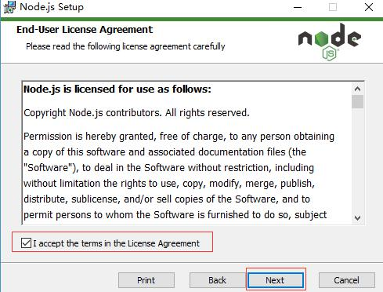
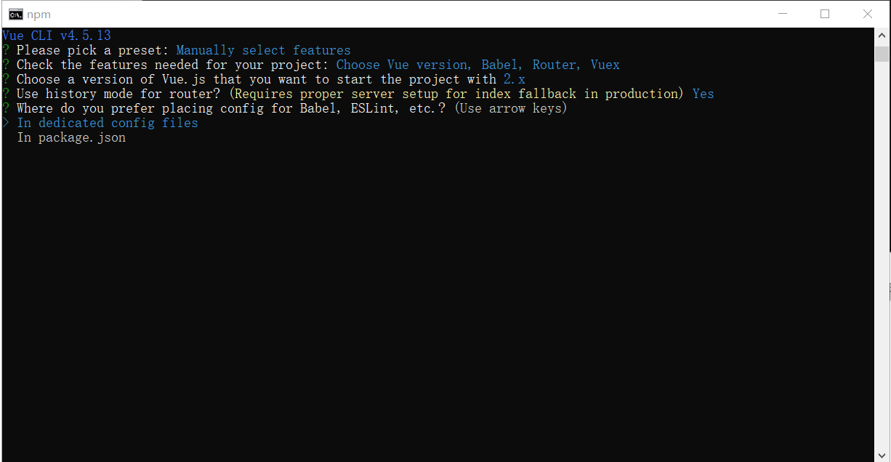
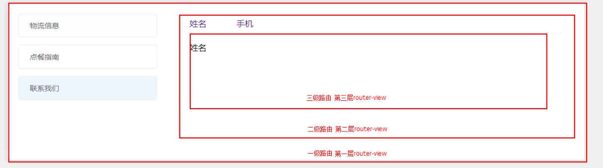

# SpringBoot

## 一、SpringBoot介绍

### 1、SpringBoot简述

Spring Boot是Spring开源组织下的子项目，是Spring组件一站式解决方案，其设计目的是用来简化Spring应用项目的搭建以及开发过程，简化繁琐的配置，提供了各种启动器，开发者能快速上手。

该框架使用了特定的方式来进行配置，从而使开发人员不再需要定义样板化的配置

- SpringBoot就是spring以及springmvc的衍生，是“懒人工具包”
- SpringBoot只是一个配置工具,整合工具,辅助工具.
- SpringBoot 最大化的实现了convention over configuration(约定大于配置)

这个框架的底层，依旧是： 前面课程中说讲的内容。(IOC,AOP,DI,application等)

> 启动器（名词记忆，重点词语）

启动器：就是SpringBoot将很多的框架进行独立的封装，并在封装的Jar中完成了对应的依赖关系，以及各种配置

Eg:

- spring-boot-starter-web:支持全栈web开发，里面包括了Tomcat和Spring- webmvc。
- spring-boot-starter-mail:提供对javax.mail的支持。
- spring-boot-starter-ws: 提供对Spring Web Services的支持。
- spring-boot-starter-test:提供对常用测试框架的支持，包括JUnit，Hamcrest 以及Mockito等。
- spring-boot-starter-actuator:支持产品环境下的一些功能，比如指标度量及监控等。
- spring-boot-starter-jetty:支持jetty容器。
- spring-boot-starter-log4j:引入默认的log框架（logback）

### 2、SpringBoot的优点

1. 遵循"约定优于配置"原则,使用Spirng Boot只需很少的配置,大部分时候可以
2. 使用默认配置;
3. 项目快速搭建,另外还可以无配置整合第三方框架- springscrerity;
4. 简化Maven及Gradle配置;
5. 内嵌入Servlet如Tomcat、jetty容器,应用可用jar包运行(java -jar);
6. 可完全不使用xml配置,只使用自动配置和Java Config;
7. 有多种强大的开发包，支持热启动

### 3、SpringBoot与SpringMVC的区别

Spring MVC 提供了一种轻度耦合的方式来开发web应用。它是Spring的一个模块，是一个web框架。通过Dispatcher Servlet, ModelAndView 和 View Resolver，开发web应用变得很容易。解决的问题领域是网站应用程序或者服务开发——URL路由、Session、模板引擎、静态Web资源等等。

Spring Boot 实现了自动配置，降低了项目搭建的复杂度。它主要是为了解决使用Spring框架需要进行大量的配置太麻烦的问题，所以它并不是用来替代Spring的解决方案，而是和Spring框架紧密结合用于提升Spring开发者体验的工具。同时它集成了大量常用的第三方库配置(例如Jackson, JDBC, Mongo,Redis, Mail等等)，Spring Boot应用中这些第三方库几乎可以零配置的开箱即用(out-of-the-box)。

## 二、SpringBoot入门案例

### 1、创建一个SpringBoot工程

第一种： 网页创建


第二种： idea中创建


创建好了之后，工程的结构图：


src/main/java 应用程序的代码（类似以前单纯的src）

src/main/resources 配置文件包，静态资源包（static），页面包（templates）

src/test/java 测试代码

target 编译后的代码存放文件夹

### 2、 Pom.xml的文件介绍

```xml
<?xml version="1.0" encoding="UTF-8"?>
<project xmlns="http://maven.apache.org/POM/4.0.0"
xmlns:xsi="http://www.w3.org/2001/XMLSchema-instance"
xsi:schemaLocation="http://maven.apache.org/POM/4.0.0
https://maven.apache.org/xsd/maven-4.0.0.xsd">
	<modelVersion>4.0.0</modelVersion>
	<parent>
		<groupId>org.springframework.boot</groupId>
		<artifactId>spring-boot-starter-parent</artifactId>
		<version>2.4.2</version>
		<relativePath/> <!-- lookup parent from repository -->
	</parent>
	<groupId>com.woniuxy</groupId>
	<artifactId>springboot-ok</artifactId>
	<version>0.0.1-SNAPSHOT</version>
	<name>springboot-ok</name>
	<description>Demo project for Spring Boot</description>
	<properties>
		<java.version>1.8</java.version>
	</properties>
	<dependencies>
		<dependency>
			<groupId>org.springframework.boot</groupId>
			<artifactId>spring-boot-starter-web</artifactId>
		</dependency>
		<dependency>
			<groupId>org.springframework.boot</groupId>
			<artifactId>spring-boot-starter-test</artifactId>
			<scope>test</scope>
		</dependency>
		<dependency>
			<groupId>org.thymeleaf</groupId>
			<artifactId>thymeleaf</artifactId>
		</dependency>
		<!-- 引入热部署的相关Jar包 -->
		<dependency>
			<groupId>org.springframework.boot</groupId>
			<artifactId>spring-boot-devtools</artifactId>
			<!-- optional=true, 依赖不会传递, 该项目依赖devtools; 之后依赖boot项目的项
目如果想要使用devtools, 需要重新引入 -->
			<optional>true</optional>
			<scope>true</scope>
		</dependency>
	</dependencies>
	<build>
		<plugins>
			<plugin>
				<groupId>org.springframework.boot</groupId>
				<artifactId>spring-boot-maven-plugin</artifactId>
			</plugin>
		</plugins>
	</build>
</project>
```

### 3、编写用户Controller

```java
package com.woniuxy.controller;
import org.springframework.stereotype.Controller;
import org.springframework.web.bind.annotation.RequestMapping;
/**
* @author: mayuhang <br/>
* Date: 2021/4/21:0:15 <br/>
* Description:用于测试页面跳转
*/
@Controller
public class MyController {
	@RequestMapping("/hello")
	public String jumpTemplates(){
	return "success";
	}
}
```

### 4、启动SpringBoot工程

```java
package com.woniuxy;
import org.springframework.boot.SpringApplication;
import org.springframework.boot.autoconfigure.SpringBootApplication;

@SpringBootApplication
public class SpringbootOkApplication {
	public static void main(String[] args) {
		SpringApplication.run(SpringbootOkApplication.class, args);
	}
}
```

执行该类中的main方法，即可启动SpringBoot工程

> 启动类会扫描当前启动类的包及其子包中的注解，如果一定要扫描其他包路径下的注解，可以如下
> 配置

```java
package com.woniuxy.springboot01;
import org.springframework.boot.SpringApplication;
import org.springframework.boot.autoconfigure.SpringBootApplication;
import org.springframework.context.annotation.ComponentScan;

@SpringBootApplication
@ComponentScan("com.woniuxy.controller.lastcontroller")
public class Springboot01Application {
	public static void main(String[] args) {
		SpringApplication.run(Springboot01Application.class, args);
	}
}
```

分析：

1、没有spring-servlet.xml的配置信息

2、没有到处去寻找tomcat容器

3、只需要引入web的starter启动器，即可完成Jar包依赖，以及自动配置

### 5、编写index.html

页面拒绝以前的JSP，现在统一编写HTML，并放置在templates下

```html
<!DOCTYPE html>
<html lang="en">
<head>
<meta charset="UTF-8">
	<title>Title</title>
</head>
<body>
	这是我的初始页面！！！
</body>
</html>
```


static(静态页面)：一般我们是放 静态js css或者图片 xxx.html可以直接通过url访问！但是不能直接通过controller访问，不过，可以配置的！

templates（动态页面）：是我们放页面的地方，他需要通过controller直接return 页面跳转过来！

application.properties：我们配置文件！

## 三、SpringBoot配置文件

### 1.配置文件类型及位置

#### 1.1 有2种配置文件类型：

SpringBoot项目中，有2种配置文件的类型，常用的是yaml类型。

application.properties

application.yml(常用)或者application.yaml

> YML文件格式是YAML (YAML Aint Markup Language)编写的文件格式，YAML是一种直观的能够被电脑识别的的数据数据序列化格式，并且容易被人类阅读，容易和脚本语言交互的，可以被支持YAML库的不同的编程语言程序导入，比如： C/C++, Ruby, Python, Java, Perl, C#, PHP等。YML文件是以数据为核心的，比传统的xml方式更加简洁。
>
> YML文件的扩展名可以使用.yml或者.yaml。

区别：properties 是k=v结构 ，必须要放置在同一行

```properties
server.port=8888
server.servlet.context-path=demo
```

yml 是层次结构，需要注意的是：yml类型的属性和属性值之间一定要有 空格

```yaml
server:
	port: 80
	servlet:
		context-path: /demo
```

#### 1.2 配置文件的优先级顺序

配置文件的位置（按优先级降序排列）：

- 项目根目录: /config

- 项目根目录: /

- classpath（resources）: /config

- classpath（resources）: /

### 2、常用配置

> 1. server.port
> 2. server.servlet.context-path
> 3. spring.mvc.format.date
> 4. spring.jackson.date-format
> 5. spring.jackson.time-zone

1、server.port：配置端口号 内置了tomcat
2、server.servlet.context-path：会在url请求中，添加一截请求

```properties
server.port=8081
server.servlet.context-path=/abc
```


```properties
spring.mvc.format.date=yyyy-MM-dd HH:mm:ss
```

这个配置，无法转换json格式的日期，只能通过form表单提交！

注意：在form表单提交时，参数前面不能用@RequestBody，应该使用@RequestParams

```properties
spring.jackson.date-format=yyyy-MM-dd HH:mm:ss
spring.jackson.time-zone=Asia/Shanghai
```

这两个配置，和之前的mvc.format.date配置，是可以同时存在的！

这两个配置，是处理，json格式的日期数据的转换！

但是无法转换新的日期类型：LocalDate，LocalTime， LocalDateTime

### 3.加载配置文件中的数据

核心知识点：

> 1. @ConfigurationProperties(prefix= "配置文件中=号左边的值的前缀")
> 2. @EnableConfigurationProperties
> 3. @Value

1、@ConfigurationProperties

```java
package com.woniuxy.entity;
import lombok.Data;
import lombok.ToString;
import org.springframework.boot.context.properties.ConfigurationProperties;
import org.springframework.context.annotation.ComponentScan;
import org.springframework.stereotype.Component;
/**
* @author: mayuhang <br/>
* Date: 2021/4/21:20:06 <br/>
* Description:
*/
@Data
@ToString
@Component
@ConfigurationProperties(prefix ="datasource-my")
public class DataSource {
	String url;
	String username;
	String password;
}
```

下面这个配置文件 ，是主文件：application.yml

如果说是自定义额外的配置文件，引入额外的注解@PropertySource("classpath:xxx.properties")的方式

```yaml
datasourceMy:
	url: jdbc:mysql:/localhost:3306/woniuxy
	username: root
	password: 10086
```

2、如果不在实体类上使用@Component注册组件到spring容器中，还可以在启动类上配置扫描@ConfigurationPropertiesScan

3、@Value在spring框架中，使用比较频繁，一般有2种：

第一种是：获取当前application文件中的数据；直接配置@Value("${xxxx.xx}")即可


第二种是：引入额外的自定义properties文件的方式，如下图


### 4.多环境配置

#### 4.1 出现多环境配置的原因

开发

测试

上线

命名规则：application-dev|prod|test.properties


项目部署好后，在启动项目的时候，根据配置文件后缀，使用~cmd或者linux中使用下面指令运行线上的配置文件

```java
java -jar 生成的jar包(比如：myproject.jar) --spring.profiles.active=prod
```

#### 4.2 多环境配置可以声明在一个配置环境中

```yaml
spring:
	profiles:
		active: test
---
#开发环境
spring:
	profiles: dev
server:
	port: 8081
---
#测试环境
spring:
	profiles: test
server:
	port: 8082
---
#生产环境
spring:
	profiles: prod
server:
	port: 8083
```

### 5.Java Config配置

5.1 @Configuration 相当于以前在applicationContext注册配置类bean

5.2 @Bean注解声明需要被Spring容器管理的对象 类似以前的WebMvcConfigurer接口其实是spring的一种内部配置方式，采用java Bean的形式代替传统的xml配置形式，可以自定义一些Handler，Interceptor，ViewResolver，MessageConverter。基于java-based方式的spring mvc配置，需要创建一个配置类并实现WebMvcConfigurer 接口；
　　springboot2.0版本以后推荐使用这种方式来进行web配置，这样不会覆盖掉springboot的一些默认配置。配置类如下：
设置index欢迎页面，默认8080/ 即可访问这个index页面！

```java
package com.woniuxy.utils;
import org.springframework.context.annotation.Bean;
import org.springframework.context.annotation.Configuration;
import org.springframework.core.Ordered;
import org.springframework.format.FormatterRegistry;
import org.springframework.web.servlet.config.annotation.ViewControllerRegistry;
import org.springframework.web.servlet.config.annotation.WebMvcConfigurer;
 
/**
* @author: mayuhang <br/>
* Date: 2021/4/21:21:53 <br/>
* Description:
*/
@Configuration
public class MyConverter implements WebMvcConfigurer {
/**
* Description : 配置默认的8080访问的欢迎页面 <br/>
* ChangeLog : 1. 创建 (2021/4/21 21:55 [mayuhang]);
* @param registry
* @return void
**/
	@Override
	public void addViewControllers(ViewControllerRegistry registry) {
		//设置欢迎页面
		registry.addViewController("/").setViewName("index");;
		//将该注册器，权限设置为SpringMVC框架中最高权限
		registry.setOrder(Ordered.HIGHEST_PRECEDENCE);
	}
	@Override
	public void addFormatters(FormatterRegistry registry) {
		registry.addConverter(string2DateConverter());
	}
	@Bean
	//类似<bean id="string2DateConverter" class="...">
	public String2DateConverter string2DateConverter(){
		return new String2DateConverter();
	}
}
```

@Bean注解，可以使用在当前类已经被spring扫描到的情况下：

只要类上面有@Component @Configuration @Service @Controller等，那么我们的@Bean注解 就会生效，把下面的返回值，注册到spring容器中，类似以前直接在applicationContext.xml中写。

```java
@Bean(name = {"myd","myy"})
```

name是数组，类似以前 spring的 bean标签 name属性!

## 四、SpringBoot热部署(可以不用看)

1、原理：

深层原理是使用了两个ClassLoader：

Base ClassLoader 加载不变的类，比如：jar的class类 （双亲委派）

Restart ClassLoader 加载可变的类，比如：我们自己编写的类 （普通加载类）

加载速度非常的快，因为Restart ClassLoader 只加载变化的东西

> 面试问题：SpringBOOT热部署时候，为什么Restart ClassLoader不采用双亲委派机制？
>
> 相关名词解释！
>
> 双亲委派机制：
>
> 某个特定的类加载器在接到加载类的请求时，首先将加载任务委托给父类加载器，依次递归，如果父类加载器可以完成类加载任务，就成功返回；只有父类加载器无法完成此加载任务时，才自己去加载。委托机制的意义 — 防止内存中出现多份同样的字节码(全限定类名一致) 。
>
> 什么是SPI:
> SPI全称Service Provider Interface，是Java提供的一套用来被第三方实现或者扩展的接口，它可以用来启用框架扩展和替换组件。 SPI的作用就是为这些被扩展的API寻找服务实现。
>
> SPI和API的使用场景:
> API （ Application Programming Interface）在大多数情况下，都是实现方制定接口并完成对接口的实现， 调用方仅仅依赖接口调用，且无权选择不同实现。 从使用人员上来说，API 直接被应用开发人员使用。
>
> SPI （ Service Provider Interface） 是调用方来制定接口规范，提供给外部来实现， 调用方在调用时则选择自己需要的外部实现。 从使用人员上来说，SPI 被框架扩展人员使用。

2、导入pom依赖：

```xml
<dependency>
	<groupId>org.springframework.boot</groupId>
	<artifactId>spring-boot-devtools</artifactId>
	<!-- 只在运行时候生效 -->
	<scope>runtime</scope>
	<!-- true 就不会传递到下一个maven项目中，只在当前项目中生效 -->
	<optional>true</optional>
</dependency>
```

配置文件：

```properties
#这个配置是默认为true
spring.devtools.restart.enabled=true
spring.devtools.restart.additional-paths=src/main/java
#默认 META-INF/maven/**,"
# + "METAINF/
resources/**,resources/**,static/**,public/**,templates/**,"
# + "**/*Test.class,**/*Tests.class,git.properties,META-INF/buildinfo.
properties"
#有改动 不会重启
spring.devtools.restart.exclude=WEB-INF/
```

3、开启自动编译或者通过ctrl+F9 手动编译：java-->class文件！

> 同时可以使用JRebel插件，自行百度品尝。

## 五、SpringBoot集成Mybatis

### 1、流程步骤

#### 1.1引入依赖

添加依赖mybatis-spring-boot-starter 和 mysql-connector-java

```xml
<dependency>
	<groupId>org.mybatis.spring.boot</groupId>
	<artifactId>mybatis-spring-boot-starter</artifactId>
	<version>2.1.4</version>
</dependency>
<dependency>
	<groupId>mysql</groupId>
	<artifactId>mysql-connector-java</artifactId>
	<version>5.1.49</version>
</dependency>
```

#### 1.2 配置

自行换成yml格式

```properties
#配置mybatis框架
mybatis.config-location=classpath:mybatis-config.xml
#配置SQLMapping.xml映射文件的位置
mybatis.mapper-locations=classpath:mapper/*.xml
#给所有的JavaBean取别名
mybatis.type-aliases-package=com.woniuxy.entity
#开启mybatis框架延迟加载
mybatis.configuration.lazy-loading-enabled=true
mybatis.configuration.aggressive-lazy-loading=false
#配置数据源(内置：HikariCP)
spring.datasource.driver-class-name=com.mysql.jdbc.Driver
spring.datasource.url=jdbc:mysql://127.0.0.1:3306/woniu_k15?
useUnicode=true&characterEncoding=UTF8&allowMultiQueries=true
spring.datasource.username=root
spring.datasource.password=root
```

#### 1.3 在resource下创建mapper文件夹，并编写Mapper.xml映射文件

#### 1.4 在dao接口上加@Mapper

#### 1.5 或者在启动类上加@MapperScan("com.woniuxy.dao")

1.4和1.5选项，2选一即可配置成功！！

如果需要开启事务：

在启动类上加@EnableTransactionManagement和@EnableAspectJAutoProxy之后在对应的业务代码方法（类也行）上加上：@Transactional(readOnly = true)

#### 1.6 集成pageHelper分页插件

引入依赖

```xml
<dependency>
	<groupId>com.github.pagehelper</groupId>
	<artifactId>pagehelper-spring-boot-starter</artifactId>
	<version>1.3.0</version>
</dependency>
```

配置：

```properties
pagehelper:
#配置mybatis的分页插件pageHelper
helper-dialect: mysql
row-bounds-with-count: true
#分页合理化参数，默认值为 false 。当该参数设置为 true 时， pageNum<=0 时会查询第一页，
pageNum>pages （超过总数时） 会查询最后一页。默认 false 时，直接根据参数进行查询。
reasonable: true
```

代码开发：

```java
public PageInfo<ResponseEntityDto> page(RequestParamDto param){
	PageHelper.startPage(param.getPageNum(), param.getPageSize());
	List<ResoinseEntityDto> list = mapper.selectManySelective(param);
	PageInfo<ResponseEntityDto> pageInfo = (PageInfo<ResponseEntityDto>)list;
	return pageInfo;
}
```

优化版：

```java
public PageInfo<ResponseEntityDto> page(RequestParamDto param){
	return PageHelper.startPage(param.getPageNum(), param.getPageSize())
	.doSelectPageInfo(() -> list(param))
}
public List<ResponseEntityDto> list(RequestParamDto param){
	return mapper.selectManySelective(param);
}
```

## 六、SpringBoot日志配置

```yaml
logging:
	level:
		#在这个包文件下执行的日志 比如 mybatis 的sql语句
		com.woniuxy.dao: debug
```

# Springboot项目创建流程

SpringBoot创建CURD流程，完整开发流程，基于gitee的！

## 第一步 初始化项目

通过，自动构建选项，Spring Initializr选项，进行Springboot创建，勾选，web，jdbc，mybatis，lombok，mysql，thymeleaf；等待下载完成即可。

前置条件，maven配置好。

## 第二步 提交到git

本地先有项目，再提交到git云端。

在本地项目中，右键选中 `git在此创建版本库`，会出现下图，不要勾选纯版本库，直接点击确定:


之后，会有一个.git的隐藏文件。能看见说明已经有了本地的版本管理。

之后，再说……

## 第三步 进行配置

先修改properties配置文件为yml或者yaml文件。

```yaml
server:
  port: 8081
spring:
  datasource:
    driver-class-name: com.mysql.cj.jdbc.Driver
    url: jdbc:mysql://localhost:3306/woniu_rbac?serverTimezone=UTC
    username: root
    password: 123456
mybatis:
  mapper-locations: mapper/*.xml
```

只要配置了datasource启动将不会报错，我们必须先测试一波。

在启动类上配置dao扫描，类似之前xml中的MapperScan配置：

```java
package com.woniuxy;
import org.mybatis.spring.annotation.MapperScan;
import org.springframework.boot.SpringApplication;
import org.springframework.boot.autoconfigure.SpringBootApplication;
@SpringBootApplication
@MapperScan("com.woniuxy.dao")
public class SpringBootAllApplication {
    public static void main(String[] args) {
        SpringApplication.run(SpringBootAllApplication.class, args);
    }
}
```

## 第四步 业务开发

我习惯是从上往下开发。上就是controller，下就是dao。


基本框架搭建完成以后，先把实体类，对应着数据库把属性建好。

按住alt+shift 点击屏幕，会有意想不到的事情发生。

需要CRUD代码。

## 第五步 测试类测试

```java
package com.woniuxy;
import com.woniuxy.controller.RbacManagerController;
import com.woniuxy.entity.RbacManager;
import org.junit.jupiter.api.Test;
import org.springframework.beans.factory.annotation.Autowired;
import org.springframework.boot.test.context.SpringBootTest;
@SpringBootTest
class SpringBootAllApplicationTests {
    @Autowired
    RbacManagerController rbacManagerController;
    @Test
    void contextLoads() {
//        RbacManager rbacManager = new RbacManager();
//        rbacManager.setId(3);
//        rbacManager.setAccount("蒲旭波");
//        rbacManager.setPassword("hehehehe");
//        rbacManagerController.saveMananger(rbacManager);
////        rbacManagerController.deleteOne(2);
//        rbacManagerController.updateOne(rbacManager);
        System.out.println(rbacManagerController.findAll());
    }
}
```

## 补充

springboot项目由于springboot内部自动集成了tomcat，所以没有项目打包时项目项目命名的过程，因此通过浏览器地址栏直接访问springboot项目的接口时，不能含有项目名。而spring mvc项目访问时需要在端口号后面添加项目名


修改maven配置文件pom.xml后虽然会自动保存，但也需要刷星，即使是注释或删除了某些依赖，也需要刷新一下。


使用spring提供的devtools
Spring Boot提供了一个名为spring-boot-devtools的模块来使应用支持热部署，提高开发者的开发效率，无需手动重启Spring Boot应用。虽然平时开发web项目过程中，改动项目启重启总是报错；但springBoot对调试支持很好，修改之后可以实时生效，需要添加以下的配置：


# vue

## 复习

Springboot懒人工具包，常用于从0开发的项目，同学们做私活的时候，通常都是springboot项目。

yml文件：直接在控制台jar -jar 中使用的命令 > jvm命令 -Dport=8081 > 读取的优先级，项目路径下的config/application.yml > 项目路径下的application > resources目录下的config/application > resources目录下的application

配置文件信息读取[@Value](https://github.com/Value)注解和[@ConfigurationProperties](https://github.com/ConfigurationProperties)

[@Bean](https://github.com/Bean)注解 生成的bean的名称，是根据方法名。

## 一、ES6语法

### 1.基础语法

ECMA Script6，简称ES6。它是JavaScript语言的下一代标准，这个版本是在2015年发布的，所以又称ECMAScript2015。

> ES6的常用语法：
>
> let、const、class、template string 是我们需要了解的语法
>
> extends、super、arrow、functions、destructuring、default、rest arguments

#### 1.1 let

把它当做java的关键字来使用，比如基本数据类型，String用法一致。

let和我们var类似，都是用来声明变量的，但是实际使用中，是有区别的。

let声明的变量是有`作用域`的，只在let命令所在的代码块中有效。

```js
<!DOCTYPE html>
<html lang="en">
<head>
    <meta charset="UTF-8">
    <meta http-equiv="X-UA-Compatible" content="IE=edge">
    <meta name="viewport" content="width=device-width, initial-scale=1.0">
    <title>Document</title>
</head>
<body>
    <script>
        var name = "zhangsan"
        while(true){
            var name = "lisi";
            console.log(name);
            break
        }
        console.log(name);
    </script>
</body>
</html>
```

这两个控制台输出结果都是 lisi，因为ES5只有全局作用域和函数作用域，没有块级作用域。

所有在ES6中，提出块级作用域，我们就需要使用let。

ES5及之前没有块级作用域，只有全局作用域与块级作用域。

> 变量泄露：通过var产生的一个不合理的常见，就是循环计数的时候循环变量泄露为全局变量

```js
var a = [];
//var 变量泄露为全局的
for(var i = 0;i < 10;i++){
    a[i] = function(){
        console.log(i);
    }
}
a[5]();//10
```

上述代码，i是用的var声明，在全局范围内都生效，`所以每次循环，新的i的值都会覆盖旧值`，导致最后一轮输出的i的值会覆盖掉之前的var i 定义的值。

如果var  i 使用的是let  i，那么将不会发生这种现象，和java中使用int  i 一致。

> 变量提升：在定义之前也能使用。

```js
//变量提升
// console.log(password);
// let password = 123546;
//var username; 类似变量提升到之前的代码中
console.log(username);
var username = "admin";
```

let是不存在变量提升的，没有定义就直接报错。var会出现变量提升（提到定义的代码之前），由于没有赋值操作，所以结果是undefined；

#### 1.2 const

const定义一个`只读变量`，也就是我们的常量，定义好以后，就不允许修改。

类似java中的 final；

> java中final定义在类上，不能被继承。
>
> 定义在方法上，不能被重写。
> 定义在变量上，不能被修改。

const和let一样，有块级作用域。

#### 1.3 字符串

和java比较接近，需要使用时品尝: https://www.runoob.com/w3cnote/es6-string.html

#### 1.4 for-of

遍历数组

```js
var arr = ['nick','mike','pig'];
    for(var item of arr){
        console.log(item);
    }
```

如果要遍历对象数组：

```js
var arr = [
	{ name:'nick', age:18 },
	{ name:'freddy', age:24 },
	{ name:'mike', age:26 },
	{ name:'james', age:34 }];
for (const iterator of arr) {
    console.log(iterator.name,iterator.age);
}
```

> 与for-in的区别：

for-of是遍历的结果可以是对象；

for-in是遍历的结果是索引。

for-of是无法遍历对象的。

```js
//遍历对象 for-of是无法遍历对象的
var obj = {"name":"mayuhang","password":12346};
// for (const value of obj) {
//     console.log(value);
// }
//forin遍历对象，结果是属性
for (const key in obj) {
   console.log(key);
   console.log(obj[key]);//获取到对应key的值！
}
```

### 2. 箭头函数

提供给前端一种简洁的函数书写方法，语法：

> 参数 => 函数体

基本用法：

```js
var f = v => v;
//等价于
var f = function(v){
    return v;
}
f(1); // 1
```

有多个参数:

```js
var f = (a,b) =>a+b;
f(2,3);//5
//如果不止一行
var f = (a,b,c) => {
    a = b;
    c = a + b;
    c = a;
}
```

箭头表达式, 需要返回对象的时候, 为了`区别于代码块`, 要用()将对象和{}也包裹起来;

```js
var f = (id,name) => {id:id, name:name};
f(5,1);//报错
var f = (id,name) => ({id:id,name:name});
console.log(f(5,1));//加括号就正常显示了
```

### 3. 解构

#### 3.1 概述

解构赋值就是对`赋值运算的一种扩展`。他是一种针对数组或者对象进行模式匹配，然后对其中的变量进行赋值。在代码上简单易读，语义更加清晰明了，也方便了复杂数据字段的获取。

#### 3.2 解构模型

在解构中，有下面2个部分参与：

`解构的源`，解构赋值表达式的右边部分。

`解构的目标`，解构赋值表达式的左边部分。

#### 3.3 数组模型的解构(Array)

基本:

```js
let [a,b,c] = [1,2,3];
// a = 1
// b = 2
// c = 3
//常规写法
let arr = [1,2,3];
arr[0];
arr[1];
arr[2];
```

可嵌套:

```js
let [a,[b,c]] = [1,[2,3]];
```

可忽略:

```js
let [a,,b] = [1,2,3];
```

不完全解构:

```js
let [a=1,b] = [];
// a = 1
// b = undefined
```

剩余运算符:

```js
let [a, ...b] = [1,2,3];
// a = 1
// b = [2,3]
```

字符串:

在数组的解构中,解构的目标若为可以遍历的对象,皆可进行解构赋值。

```js
let [a,b,c,d,e] = "hello";
// a = 'h';
// b = 'e';
...
```

解构默认值:

```js
let [a = 1] = [undefined];
// a = 1
```

当解构模式有匹配结果,且匹配结果为undefined时, 会出发默认值作为返回结果;

```js
let [a=3,b=a] = [];
//a = 3,b = 3
let [a = 3,b = a] = [1];
//a = 1, b = 1
let [a = 3,b=a] = [1,2];
// a = 1,b = 2
```

#### 3.4 对象模型的解构(Object)

基本:

```js
let {foo,bar} = {foo:"aaa",bar:"bbb"};
//foo = "aaa" ...
let {baz : foo} = {baz : "ddd"};
//foo = "ddd"
```

可嵌套:

```js
let ojb = {p:['hello',{y:"world"}]};
let {p:[x,{y}]} = obj;
```

可忽略

```js
let ojb = {p:['hello',{y:"world"}]};
let {p:[x,{}]} = obj;
```

不完全解构

```js
let obj = {p: [{y:'world'}]}
let {p:[{y},x]} = obj;
//x = undefined
//y = 'world'
```

剩余运算符

```js
let {a, b, ...rest} = {a: 10, b: 20, c: 30, d: 40}; 
// a = 10 
// b = 20 
// rest = {c: 30, d: 40}
```

解构默认值

```js
let {a = 10, b = 5} = {a: 3}; 
// a = 3; b = 5; 
let {a: aa = 10, b: bb = 5} = {a: 3}; 
// aa = 3; bb = 5;
```

#### 3.5 解构使用场景

用途:

用途1：前端使用假数据进行页面渲染，如果和后端接口调通，则获取到后端数据，通过解构会变成前端的正常显示数据。

用途2：传参。往后端传数据的时候，是需要一个默认值，比如搜索，条件判断。

## 二、Vue基础概念

### 1. Vue的基本介绍

Java程序猿，我们Vue只学2.0版本。前端，我对同学们的要求只有一个，依葫芦画瓢可以写出一个列表：含列表数据展示，分页，编辑，新建，删除，多条件搜索。

Vue三件套必须要懂和能使用:`组件，axios，路由`

> *Vue* (读音 */vjuː/*，类似于 *view*) 是一套用于构建用户界面的**渐进式框架**。

### 2. 渐进式

渐进式，我们可以理解为：`主张最少`、逐渐替换页面的H5原生代码。每个框架都不可避免会有自己的一些特点，从而会对使用者有一定的要求，这些要求就是主张，主张有强有弱，它的强势程度会影响在业务开发中的使用方式。

比如说：*Angular*。它两个版本都是强主张的，如果你用它，必须接受以下东西：

- 必须使用它的模块机制
- 必须使用它的依赖注入
- 必须使用它的特殊形式定义组件（这一点每个视图框架都有，难以避免）

而 *Vue*，没有什么强主张，我们可以在原有大系统的上面，把一两个组件改用 *Vue* 实现，把它当 *jQuery* 用；也可以整个用 *Vue* 全家桶来进行项目开发；还可以用它的视图，搭配我们自己设计的整个下层应用。也可以在底层数据逻辑的地方用 *OO* 和设计模式的那套理念，也可以函数式，都可以，它只是个`轻量视图`而已。

通俗的来讲，*Vue* 就是一个已经搭建好的空屋。与单纯使用 *jQuery* 这种库比，*Vue* 可以更好地实现代码复用，减少工作量；与*Angular* 这种家具电器一应俱全的框架相比，又不需要一件件挑选，再把自己不喜欢的一件件扔了。

简而言之，***Vue\* 只做自己该做的事，不会做职责以外的事。**

### 3. MVVM

Vue采用的就是MVVM的设计模式，即Model-View-ViewModel，它是数据驱动模式，即所有的一切行为都通过操作数据来进行，从而避免对DOM进行操作。


- *Model* ：模型层，主要负责业务数据相关；
- *View*：视图层，顾名思义，负责视图相关，细分下来就是 *html + css* 层；
- *ViewModel*：*View* 与 *Model* 沟通的桥梁，负责监听 *View* 或者 *Model* 的修改，是实现 *MVVM* 双向绑定的要点；

### 4.MVVM与MVC的关系


MVVM是可以独立存在，不用考虑后端接口，可以完全由前端实现的设计模式。

MVVM支持双向绑定，意思就是当Model层的数据进行修改的时候，ViewModel会监控到Model的改变，从而通知View层进行相应的修改。反之亦然。核心目标，`解耦`！视图和模型层的耦合。

## 三、Vue的安装

要学习使用 *Vue*，首先需要在项目中去安装引入 *Vue*。官方提供了下列几种 *Vue* 的安装方式：

- `<script>` 直接引入
- *NPM*
- 命令行工具 (*CLI*)

对于初学者来说，我们还是建议从第一种最简单的安装方式来学习 *Vue*。

### 1.\<script>引入

在 *HTML* 文档中通过 `<script>` 标签引入 *Vue* 的依赖文件 *Vue.js* ，是最简单快速的安装方式。官网提供了两个版本的依赖文件：

- 开发版本：包含完整的警告和调试模式；
- 生产版本：删除了警告，*33.30KB min+gzip*；

我们可以选择将 *Vue.js* 文件下载到本地后直接在项目中引入。

```js
<!-- 开发环境版本，包含了有帮助的命令行警告 -->
<script src="./js/vue.js"></script>
```

或者：

```js
<!-- 生产环境版本，优化了尺寸和速度 -->
<script src="./js/vue.min.js"></script>
```

下载地址：[开发版地址 - *vue.js*](https://vuejs.org/js/vue.js)、[生产版地址 - *vue.min.js*](https://vuejs.org/js/vue.min.js)

当然，懒得下载的话我们也可以在项目中直接通过 *CDN* 引入。

```js
<!-- 开发环境版本，包含了有帮助的命令行警告 -->
<script src="https://cdn.jsdelivr.net/npm/vue/dist/vue.js"></script>
```

或者：

```js
<!-- 生产环境版本，优化了尺寸和速度 -->
<script src="https://cdn.jsdelivr.net/npm/vue"></script>
```

### 2. NPM(入门后学)

在用 *Vue* 构建大型应用时推荐使用 NPM 安装。NPM 能很好地和诸如 [webpack](https://webpack.js.org/) 或 [Browserify](http://browserify.org/) 模块打包器配合使用。同时 *Vue* 也提供配套工具来开发[单文件组件](https://cn.vuejs.org/v2/guide/single-file-components.html)。

```js
# 最新稳定版$ npm install vue
```

### 3. 命令行工具 CLI(入门后学)

*Vue* 提供了一个[官方的 *CLI*](https://github.com/vuejs/vue-cli)，为单页面应用 (*SPA*) 快速搭建繁杂的脚手架。它为现代前端工作流提供了 *batteries-included* 的构建设置。只需要几分钟的时间就可以运行起来并带有热重载、保存时 *lint* 校验，以及生产环境可用的构建版本。

> *CLI* 工具要求用户对 *Node.js* 和相关构建工具有一定程度的了解。如果你是新手，我们强烈建议先在不用构建工具的情况下熟悉 *Vue* 本身之后再使用 *CLI*。

## 四、Vue的使用

### 1.Vue的实例(非常重要)

每个Vue的应用都是通过Vue的函数创建出来的一个Vue的实例开始的。

> **尚硅谷：**
>
> 1.想让Vue工作，就必须创建一个Vue实例，且要传入一个配置对象；
> 2.root容器里的代码依然符合html规范，只不过混入了一些特殊的Vue语法；
> 3.root容器里的代码被称为【Vue模板】；
> 4.Vue实例和容器是一一对应的；
> 5.真实开发中只有一个Vue实例，并且会配合着组件一起使用；
> 6.{{xxx}}中的xxx要写js表达式，且xxx可以自动读取到data中的所有属性；
> 7.一旦data中的数据发生改变，那么页面中用到该数据的地方也会自动更新；

#### 1.1 创建一个Vue的实例

可以把Vue当做一个java中的类。可以通过new Vue();的方式创建Vue对象来使用，也可以Vue.方法来进行操作。

```js
const vm = new Vue({
    //记住,类似java中构造方法参数是对象
    //对象中就有很多很多很多很多的属性、函数等
    });
```

当创建一个 *Vue* 实例时，可以传入一个选项对象，`选项`对象可以包含`数据`、*`DOM`*、`生命周期钩子`、`资源`等等。我们可以通过设置选项来创建我们想要的行为。

> 在 [*API* 文档](https://cn.vuejs.org/v2/api/#选项-数据) 中可以浏览完整的选项列表。

#### 1.2 选项/数据model

**`data`**

data是Vue实例的一个数据属性，用于定义Vue实例所需要用的数据。当一个Vue实例被创建的时候，data对象中的所有属性便会加入到Vue的响应式系统中。

在Vue实例中，`data类型可以是对象，也可以是带返回值的函数`。

> 在后面我们要学习的 *Vue* 组件中，`data` 的类型只能是函数，所以建议大家一开始就习惯用函数的方式去定义 `data` 的属性值。

对象的写法:

```js
第一步一定是这样定义好:const vm = new Vue({});
const vm = new Vue({
    data:{
        count:0,
        name:"admin"
    }
});
```

函数的写法(推荐写法):

```js
const vm = new Vue({
    //这里面的东西 就是我们的Model
    data(){
        return {
            count:0,
            name:"admin"
        }
    }
});
```

#### 1.3 选项/DOM

**`el`**

提供一个在页面上已存在的 DOM 元素作为 Vue 实例的`挂载`目标。可以是 CSS 选择器，也可以是一个 HTMLElement 实例。

```html
<!-- 准备把vue的内容挂载渲染的地方 -->
<div id = "app"></div>
<script>
    const vm = new Vue({
        el:'#app',
        data(){
            return {
            }
        },
    });
</script>
```

>  el即element的缩写，值通常是CSS选择器字符串，dom有id,就用#id;dom有calss,就用.类名，还可以使用直接操作dom的方法。如el:document.getElemengById('app');

> 注意：由于挂载元素会被 *Vue* 生成的 *DOM* 替换。因此不推荐挂载 *root* 实例到 `<html>` 或者 `<body>` 上。

完整页面demo:

```html
<!DOCTYPE html>
<html lang="en">
<head>
    <meta charset="UTF-8">
    <meta http-equiv="X-UA-Compatible" content="IE=edge">
    <meta name="viewport" content="width=device-width, initial-scale=1.0">
    <!-- 生产环境版本，优化了尺寸和速度 -->
    <script src="https://cdn.jsdelivr.net/npm/vue"></script>
    <title>Document</title>
</head>
<body>
    <div id="app">
        <!-- 插值表达式 -->
        {{ context }}
    </div>
    <script>
       const vm = new Vue({
           el:"#app",
           data(){
               return {
                   context : "我的第一个vue页面"
               }
           }
       });
    </script>
</body>
</html>
```

### 2. 模板语法

*Vue.js* 使用了基于 *HTML* 的模板语法，允许开发者声明式地将 *DOM* 绑定至底层 *Vue* 实例的数据。所有 *Vue.js* 的模板都是合法的 *HTML* ，所以能被遵循规范的浏览器和 *HTML* 解析器解析。

在底层的实现上，*Vue* 将模板编译成虚拟 *DOM* 渲染函数。结合响应系统，*Vue* 能够智能地计算出最少需要重新渲染多少组件，并把 *DOM* 操作次数减到最少。

#### 2.1 插值表达式

数据绑定最常见的形式就是使用“*Mustache*”语法 (双大括号) 的文本插值：{{msg}}

它既然是表达式，那么和我们后端的jstl 或者el表达式一致。比如`三目运算`，`普通数学计算`或者`字符串`操作等都能实现。

```html
<div id="app">
    <!-- 插值表达式 -->
    <h1>我爱中国: {{ context }}, 也行</h1>
</div>
<script>
   const vm = new Vue({
       el:"#app",
       data(){
           return {
               context : "我的第一个vue页面"
           }
       }
   });
</script>
```

#### 2.2 v-html

之前双大括号会将数据解析为普通文本，而不是Html代码。为了输出Html代码，就要使用v-html指令。

v-html主要用来把字符串html标签，转换成真正的html标签。

v-html相当于一个属性，添加了该属性的标签相当于在该标签之间添加文本内容，而这些内容中若含有标签字符，可以将文本内容解析为html标签，最终的结果相当于在拥有该标签的内添加标签。

```html
<!DOCTYPE html>
<html lang="en">
<head>
    <meta charset="UTF-8">
    <meta http-equiv="X-UA-Compatible" content="IE=edge">
    <meta name="viewport" content="width=device-width, initial-scale=1.0">
    <!-- 生产环境版本，优化了尺寸和速度 -->
    <script src="https://cdn.jsdelivr.net/npm/vue"></script>
    <title>Document</title>
</head>
<body>
    <div id="app">
        <!-- 插值表达式 -->
        {{link}}
        <div>我爱中国:
            <span v-html="link"></span>
            , 也行
        </div>
    </div>
    <script>
       const vm = new Vue({
           el:"#app",
           data(){
               return {
                   context : "<b>我的第一个vue页面</b>",
                   link : '<a href="http://www.woniuxy.com" target="_blank">蜗牛官网</a>'
               }
           }
       });
    </script>
</body>
</html>
```

## 五、Vue的指令（非常重要）

在原始 *HTML* 的设置中，我们用到了一个叫做 `v-html` 指令的东西，那么指令到底是什么？

> 指令 (*Directives*) ，是带有 `v-` 前缀的特殊特性。指令的职责是，当表达式的值改变时，将其产生的连带影响，响应式地作用于 *DOM*。**`vue指令也属于模板语法`**

例如我们前面使用到的 `v-html` 指令，它就是根据表达式 `rowHtml` 的值来{控制节点 `<h2>` 的内容显示，类似的指令还有 `v-text`。

### 1. v-show 是否显示

style=”display: none;” 它如果属性值为false，则会隐藏。使用的是CSS的样式来进行的。

```html
<div id = "app">
    <h2 v-show="flag">你看不看得见我?</h2>
</div>
<script>
   const vm = new Vue({
        el:"#app",
        data(){
            return{
                flag : false
            }
        }
    });
</script>
```

### 2. v-if 是否显示

v-if和我们的v-show的区别是什么?v-if会直接清除dom节点。v-show会保留节点，只是添加了display：none属性，因此相比v-show来说，v-if消耗的性能更大，但是更安全。

```html
<div id = "app">
    <h2 v-if="flag">你看不看得见我?</h2>
</div>
<script>
   const vm = new Vue({
        el:"#app",
        data(){
            return{
                flag : false
            }
        }
    });
</script>
```

和java中if else 类似

```html
<div id = "app">
    <h2 v-if="flag">你看不看得见我?</h2>
    <h2 v-else="flag">我看不见它就能看见我</h2>
</div>
<script>
   const vm = new Vue({
        el:"#app",
        data(){
            return{
                flag : true
            }
        }
    });
</script>
```

v-if和v-else与java中if-else类似，只能选择一条分支执行，当if分支条件为false时，即使else分支条件为false，else分支也会执行。v-if也可以不用赋值，默认为true。v-else也可以不赋值。也可以类似扩展出v-else-if

````html
<h1 v-if="false">  v-if </h1>
<h1 v-else="true"> v-else</h1>
<!-- v-else-->
````

```html
<h1 v-if>  v-if </h1>
<h1 v-else> v-else</h1>
<!-- v-if-->
```


### 3. v-bind 数据绑定

动态绑定标签的属性和值（实现动态赋值）

#### 3.1 绑定特殊属性

当我们希望动态去绑定一些html的属性（标签中的 href）时，可以通过v-bind指令来响应式地动态更新。

v-bind是写在属性前

```html
<a v-bind:href="link" target="_blank">点我撒</a>
可以省略v-bind,只留下冒号:
<a :href="link" target="_blank">点我撒</a>
```

#### 3.2 绑定class属性

操作元素的 *class* 列表和 *style* 内联样式是数据绑定的一个常见需求。因为它们都是属性，所以我们可以用 `v-bind` 处理它们：只需要通过表达式计算出字符串结果即可。

不过，字符串拼接麻烦且易错。因此，在将 `v-bind` 用于 `class` 和 `style` 时，*Vue.js* 做了专门的增强。表达式结果的类型除了字符串之外，还可以是对象或数组。

原始写法，如果只是普通的 *class* 绑定，不需要采用 *Vue* 的语法，按照以前 *CSS* 中的方式设置即可，如下传统的绑定方式：

```html
<!DOCTYPE html>
<html lang="en">
<head>
    <meta charset="UTF-8">
    <meta http-equiv="X-UA-Compatible" content="IE=edge">
    <meta name="viewport" content="width=device-width, initial-scale=1.0">
    <script src="https://cdn.jsdelivr.net/npm/vue@2/dist/vue.js"></script>
    <title>Document</title>
    <style>
        .setColor {
          color: red;
        }
        .setFontSize {
           font-size: 16px;
        }
        .set-border {
          border: 1px solid #ccc;
        }
    </style>
</head>
<body>
    <div id = "app">
       <a v-bind:href="link" target="_blank">点我撒</a>
       <h1 class="setColor setFontSize set-border">传统class绑定方式</h1>
       <h1 :class="styles">普通v-bind绑定class的方式</h1>
       <input type="password" @change="meht"/>密码输入
       <h1 :class="{'setColor' : flag,'setFontSize':flag,'set-border':flag}">进阶对象使用v-bind绑定class的方式</h1>
    </div>
    <script>
       const vm = new Vue({
            el:"#app",
            data(){
                return{
                    link  : 'http://www.woniuxy.com',
                    styles : 'setColor',
                    flag: true//判断 属性的值是否存在
                }
            },
            methods:{
                meht(){
                    this.flag = false
                }
            }
        });
    </script>
</body>
</html>
```

练习

```html
<!DOCTYPE html>
<html lang="en">
<head>
    <meta charset="UTF-8">
    <meta http-equiv="X-UA-Compatible" content="IE=edge">
    <meta name="viewport" content="width=device-width, initial-scale=1.0">
    <title>Document</title>
    <style>
        .red{
            color: red;
        }
        .green{
            background-color: greenyellow;
        }
    </style>
    <script src="https://cdn.jsdelivr.net/npm/vue@2/dist/vue.js"></script>
    <script src="https://cdn.jsdelivr.net/npm/vue/dist/vue.js"></script>
   
</head>
<body>
    <div id="div">
        <!-- 插值表达式 -->
       <h1>你好：{{context}}！！！</h1>

       <!-- v-html渲染html标签 -->
       <span v-html="context"></span> 
       <h2 v-html="link1"></h2>

       <!-- v-show控制元素的显示隐藏 不显示时标签存在-->
       <h1 v-show="flag">are you ok??</h1>

        <!-- v-if控制元素的显示隐藏 不显示时标签不存在-->
        <h1 v-if="flag">v-if</h1>
        <h1 v-else="flag==false">v-else</h1>
        <!-- <h1 v-else-if="flag">v-else-if</h1> -->
            
        <!-- v-bind动态绑定数据，可省略v-bind只保留： -->
        <a v-bind:href="link" target="_blank">淘宝</a>
        <a :href="link" target="_blank">淘宝</a>

        <!-- v-bind绑定class属性，class="{'red',flag}",flag值为真，为此标class属性添加值red，flag
        值为false,移除class的值red -->
        <h1 v-bind:class="{'red':flag2,'green':flag3}">绑定class</h1>
        <input type="text" @change="show"/>
        <h1 v-bind:class="{'red':flag,'green':flag}">绑定class------</h1>
    </div>

    <script>
        const vm=new Vue({
            // 指定挂载渲染的dom节点
            el:"#div",
            data(){
                return{
                    // 返回属性名自定义，属性之间逗号隔开
                    context:"hello vue",
                    link1:"<a href='http://www.baidu.com' target='_blank'>百度</a>",
                    flag:true,
                    link:'http://taobao.com',
                    flag2:true,
                    flag3:false
                }
            },
            methods:{
                show(){
                    this.flag=false;
                }    
            }
        });
    </script>
</body>
</html>
```

### 4.v-for

可以循环遍历 data中的 数组 或者对象。v-for指令需要使用`item in items` 形式的特殊语法。items是数组或者对象。

```html
<div id="app">
        <ul>
            <li v-for="item in items">
                {{ item }}
            </li>
        </ul>
    </div>
    <script>
        new Vue({
            el:"#app",
            data(){
                return{
                    items:[
                        {msg:"foo"},
                        {msg:"fbb"},
                        {msg:"fxx"}
                    ]
                }
            }
        });
    </script>
```

除了上述这种情况，item in items以外，还支持第二个属性 (item,index) in items

> 处理对象类型

```	html
<div id="app">
        <ul>
            <li v-for="(item,index) in items">
              {{ index+1 }} ----  {{ item.msg }}
            </li>
        </ul>
        <ol>
            <li v-for="(item,name,index) in obj" :key="obj.id">
                {{index+1}} ---  {{name}} ---- {{ item }}
            </li>
        </ol>
    </div>
    <script>
        new Vue({
            el:"#app",
            data(){
                return{
                    items:[
                        {msg:"foo"},
                        {msg:"fbb"},
                        {msg:"fxx"}
                    ],
                    obj:{
                        id:1,
                        titile:"中华上下五千年",
                        author:"马宇航",
                        publishedAt:"2099-12-11"
                    }
                }
            }
        });
    </script>
```

维护状态（*key*）

当 *Vue* 正在更新使用 `v-for` 渲染的元素列表时，它默认使用“就地更新”的策略。如果数据项的顺序被改变，*Vue* 将不会移动 *DOM* 元素来匹配数据项的顺序，而是就地更新每个元素，并且确保它们在每个索引位置正确渲染。

为了给 *Vue* 一个提示，以便它能跟踪每个节点的身份，从而重用和重新排序现有元素，我们需要为每项提供一个唯一 `key` 属性：

````html
<div v-for="item in items" v-bind:key="item.id">
  <!-- 内容 -->
</div>
````

建议尽可能在使用 `v-for` 时提供 `key`，来给每个节点做一个唯一标识。

> 不要使用对象或数组之类的非基本类型值作为 `v-for` 的 `key`。请用字符串或数值类型的值。

### 5.v-on

用来绑定事件，在Vue中，用来绑定dom的事件，同时触发一些js代码方法。常见的事件有：点击，改变，聚焦，移出，键入。

vue中button的onclick属性不起作用要用v-on:click替换，v-on:click还可以缩写为@click

vue实例中methods属性中的方法的作用：修改data()方法返回对象的属性的值。

````html
<div id="app">
        <!-- @ 是v-on的缩写 -->
        <button @click="clinkMe"> +1 </button>
        点击了 {{num}} 下
    </div>
    <script>
      const vm = new Vue({
            el:"#app",
            data(){
                return{
                    num:0
                }
            },
            methods:{
                clinkMe(){
                    //这里的this表示vue的实例也就是 vm变量
                    this.num++;
                }
            }
        });
    </script>
````

> `v-on` 指令可以缩写为 `@`。例如 `v-on:click` 缩写成 `@click`。

methods属性：这属性对象中，是写我们的方法。类似之前在script中直接写事件方法。

方法可以有一个形参，形参可以获取到很多方法：如下图


````html
<div id="app">
        <!-- @ 是v-on的缩写 -->
        <button @click="clinkMe"> +1 </button>
        点击了 {{num}} 下
    </div>
    <script>
      const vm = new Vue({
            el:"#app",
            data(){
                return{
                    num:0
                }
            },
            methods:{
                clinkMe(target){
                    //这里的this表示vue的实例也就是 vm变量
                    this.num++;
                    //target 能够获取到点击事件的 所有信息 比如 坐标,dom对象,window对象等
                    console.log(target);
                }
            }
        });
````

### 6.v-model

v-model是我们用得最多的，其次是v-bind和v-on。

v-model 叫做双向绑定，可以修改data中的值，和显示修改后的值。

v-model 语法糖！为了简便我们开发，封装的一个方法。它的底层实际上就是用 v-bind和v-on来实现的这个效果。

v-model极大地减轻了开发压力。


#### 3.1 基础用法

key属性可以保证dom标签拖动改变顺寻时，器key值保持不变，key就不会重排序。

*Vue* 中提供了 `v-model` 指令，用于在表单 `<input>`、`<textarea>` 及 `<select>` 元素上创建双向数据绑定。它会根据控件类型自动选取正确的方法来更新元素。 `v-model` 本质上不过是语法糖。它负责监听用户的输入事件以更新数据，并对一些极端场景进行一些特殊处理。

> `v-model` 会忽略所有表单元素的 `value`、`checked`、`selected` 特性的初始值而总是将 *Vue* 实例的数据作为数据来源。我们应该通过 *JavaScript* 在组件的 `data` 选项中声明初始值。

##### 3.1.1 文本

````html
<!DOCTYPE html>
<html lang="en">
<head>
    <meta charset="UTF-8">
    <meta http-equiv="X-UA-Compatible" content="IE=edge">
    <meta name="viewport" content="width=device-width, initial-scale=1.0">
    <script src="https://cdn.jsdelivr.net/npm/vue@2/dist/vue.js"></script>
    <title>Document</title>
</head>
<body>
    <!-- view  -->
    <div id="app">
        <!--利用v-bind和v-on实现双向绑定-->
        <input type="text" :value="val" @change="updateVal"/>
        <!--利用v-model实现双向绑定-->
        <input type="text" v-model="val">
        您输入的值是 {{ val }}
    </div>
    <script>
       const vm = new Vue({
            el:"#app",
            //model
            data() {
                return {
                    val:""
                }
            },
            methods: {
                updateVal(inp){
                    console.log(inp);
                    this.val = inp.target.value;
                }
            },
        });
    </script>
</body>
</html>
````

##### 3.1.2 多行文本

````html
<h2>多行文本</h2>
    <textarea cols="30" rows="10" :value="textarea" placeholder="文本显示"> </textarea>
    <textarea v-model="textarea" placeholder="v-model输入框"></textarea><br/>
<script>
   const vm = new Vue({
        el:"#app",
        //model
        data() {
            return {
                val:"",
                textarea:``,
            }
        }
    });
</script>
````

##### 3.1.3 复选框与单选框

````html
<h2>复选框</h2>
    <input type="checkbox" v-model="checked"  name="md"/> 选中
    <label for="checkbox">{{checked}}</label><br>
    <input type="checkbox" v-model="checked1" name="md"/> 选不中
    <label for="checkbox">{{!checked1?"男":"女"}}</label>
    <hr/>
    <h2>单选框</h2>
    <input type="radio" v-model="sex" value="男"  name="md"/> 男
    <input type="radio" v-model="sex" value="女" name="md"/> 女
    <br>
    您选中的性别是:<label for="radio">{{sex}}</label>
<script>
   const vm = new Vue({
        el:"#app",
        //model
        data() {
            return {
                val:"",
                textarea:``,
                checked:"",
                checked1:"",
                sex:""
            }
        }
    });
</script>
````

##### 3.1.4 下拉框

````html
<h2>下拉框</h2>
    <select v-model="optionnal">
        <option disabled value="">请选择</option>
        <option value="A">A</option>
        <option value="B">B</option>
        <option value="C">C</option>
    </select>
    <span>您选择的是{{optionnal}}</span>
<script>
   const vm = new Vue({
        el:"#app",
        //model
        data() {
            return {
                val:"",
                textarea:``,
                checked:"",
                checked1:"",
                sex:"",
                optionnal:""
            }
        },
        methods: {
            updateVal(inp){
                console.log(inp);
                this.val = inp.target.value;
            }
        },
    });
</script>
````

## 六、Node.js

### 1. Node.js简介

Node.js 是一个开源与跨平台的 `JavaScript 运行时环境`。 它是一个可用于几乎任何项目的流行工具！

Node.js 在浏览器外运行 V8 JavaScript 引擎（Google Chrome 的内核）。 这使 Node.js 表现得非常出色。

Node.js 可以在一台服务器上处理数千个并发连接，而无需引入管理线程并发的负担（这可能是重大 bug 的来源）。

Node.js 具有独特的优势，因为为浏览器编写 JavaScript 的数百万前端开发者现在除了`客户端代码`之外还可以编写`服务器端代码`，而无需学习完全不同的语言。

在 Node.js 中，可以毫无问题地使用新的 ECMAScript 标准，因为不必等待所有用户更新其浏览器，你可以通过更改 Node.js 版本来决定要使用的 ECMAScript 版本，并且还可以通过运行带有标志的 Node.js 来启用特定的实验中的特性。

> 从广泛使用 JavaScript 的前端开发者的角度来看，Node.js 应用程序具有巨大的优势：使用单一语言轻松编程所有一切（前端和后端）。

### 2. 安装Node.js

官网下载地址：**http://nodejs.cn/download/**

下载完成后，双击“ **node-v14.16.1-x64.msi**”，开始安装：


点击“ Next ”按钮 :



勾选后，点击next：


选择安装目录，点击“ Next ”按钮


选择安装项，此处选择默认，点击“ Next ”按钮 ：


点击“ Install ”按钮，开始安装 ……

安装完成后finish即可

查看是否安装成功 ：

在cmd黑窗口中：

A、node -v 查看 node 版本
B、npm -v 查看 npm 版本

出现下图内容，则表示安装完成：


安装完成后文件目录如下图 ：


## 七、Vue脚手架

### 1.安装Vue CLI

使用npm执行以下命令，全局安装Vue CLI(前置要求Node.js安装完成，npm -v能打印出版本号)

打开cmd命令行窗口，执行下列命令：

```js
npm i -g @vue/cli
```

## CLI创建vue项目

安装完成后，基于node.js，创建Vue项目：

在需要创建 vue 项⽬的⽬录中，运行cmd命令行窗口，执⾏以下命令（其中 vue-project 是项⽬⽂件名）：

```js
 vue create vue-project
```

> 如果说没有安装脚手架会出现vue找不到该命令，如下图：
>
> 
>
> 此时重新安装脚手架即可。

如果vue create 项目名，创建成功，将出现下图：


此处有三个选择，使用方向机上下来进行选项切换：

default vue2|3，是默认模式，提供vue2.0或者vue3.0的项目创建，我们的课程基于vue2.0，所以，我们就还是老老实实使用Manually，自定义手动模式创建，可以自己选择需要的功能。

所以此处，选择第三项(最后一项)：

进入自定义模式，选中Router和Vuex，即使不选，后期可以自己配置也行，但是推荐勾选上，可以不用，但是我必须有：


选择完后，回车：


选择2.x版本，回车：


这里让我们选择是否使用history router：

这里我们选N，回车进入下一步：



该页面，是选择关于Babe、PostCSS、ESLint、etc. 这些配置文件是放在package.json里面，还是单独放在外面。

编辑器一般默认会在项目根目录下寻找配置文件，所以这里选择In dedicated config files即可，直接回车。


是否将以上设置保存为未来项⽬的预配置，也就是可以快速创建这次配置的vue项目。是否保存，都无所谓，此处直接N，回车：


此时，将会在对应cmd打开的目录下，创建vue项目；


创建完成后，显示如上图所示，可以直接通过命令 cd vue-project，切换进入项目目录，然后使用npm run serve运行项目：


运行成功如下，浏览器访问http://localhost:8080/即可，出现下图，即表示成功！


## 八、组件（三件套中）

我们创建的项目结构简单的解释：


### 1. 组件介绍

前端组件化是现在前端框架中一个非常重要的思想元素。组件可以扩展 *HTML* 元素、封装`可重用`的代码。根据项目需求，抽象出一些组件，每个组件里包含了`展现、功能和样式`。每个页面，根据自己所需，使用不同的组件来拼接页面。这种开发模式使前端页面易扩展、灵活性高，同时可独立维护、可复用性大大提高。


因此组件（*Component*）也是 *Vue* 中最重要的功能之一。

> 我们在一个页面中 使用其他的组件，那么对于这个页面来说，那个组件就是当前页面的子组件。
>
> 声子（声明子组件） 挂子（挂载子组件） 用子（使用子组件）

### 2. 组件创建流程

#### 2.1 定义子组件

在components中创建子组件，使用template标签包裹起来。一定以注意，只能有一个根标签。


````html
<template>
  <div class="hello">
    <h1>{{ msg }}</h1>
</template>

<script>
export default {
  name: 'HelloWorld',
  props: {
    msg: String
  }
}
</script>
````

#### 2.2 在目标页面声明组件

声子,挂子和用子!

```html
<template>
  <div class="about">
    <h1>This is an about page</h1>
    <!-- 用子 -->
    <coma></coma>
  </div>
</template>
<script>
// 声子
import coma from "@/components/comA.vue";
//把export default当做之前new Vue()
export default {
   data() {
     return {
       msg:"data中的数据"
     }
   },
   //挂子
   components:{
       //coma等同于  coma(自定义组件的名称):coma(import导入时指定的名称)
      coma
   }
}
</script>
```

### 3. 父组件传子组件

> 什么是父子组件?
>
> A页面中引入B页面，那么A是父组件，B子组件。
>
> 为什么需要子组件传值父组件？
>
> 比如说，子组件是个输入框！那么，子组件输入的值，仅仅只会存在于子组件的model中。父组件只能看见有这个值，但是父组件的model中是拿不到这个值的。
>
> 为什么需要父组件传值子组件？
>
> 那么如果子页面需要父页面data中的值，也有可能。比如，登录后，右上角显示的用户名……

父传值给子组件，怎么传？`props属性`。

props表示，子组件的自定义属性名称！

```html
<input type="">
type就是input组件的属性。
我们的props，就可以自行定义属性的名称。类似input中的type！
```

我们需要在子组件中，添加props属性;

#### 3.1 props以数组形式定义

```js
props:['msg','type','value']
```

#### 3.2 props以对象形式定义

```js
export default {
  name: 'HelloWorld',
  props: {
    title: String,
    likes: Number,
    isPublished: Boolean,
    commentIds: Array,
    author: Object,
    callback: Function,
    contactsPromise: Promise  // or any other constructor
  }
})
```

> 额外知识:
>
> ```js
> export default {
>     props: {
>          // 基础的类型检查 (`null` 和 `undefined` 会通过任何类型验证)
>          propA: Number,
>          // 多个可能的类型
>          propB: [String, Number],
>          // 必填的字符串
>          propC: {
>            type: String,
>            required: true
>          },
>          // 带有默认值的数字
>          propD: {
>            type: Number,
>            default: 100
>          },
>          // 带有默认值的对象
>          propE: {
>            type: Object,
>            // 对象或数组默认值必须从一个工厂函数获取
>            default: function () {
>              return { message: 'hello' }
>            }
>          },
>          // 自定义验证函数
>          propF: {
>            validator: function (value) {
>              // 这个值必须匹配下列字符串中的一个
>              return ['success', 'warning', 'danger'].indexOf(value) !== -1
>            }
>          }
>     }
> }
> ```

#### 父传子案例

子组件

````html
<template>
<div>
    <h1>
        你好，vue!{{msgs}}
    </h1>
</div>
</template>
<script>
export default {
    // props:{
    //     msgs:String,
    // }
    props:['msgs','loginname','password']
}
</script>
````

父组件

````html
<template>
  <div class="home">
    <!-- 用子 -->
    <coma :msgs="ms"></coma>
    <input type="text" v-model="ms">
  </div>
</template>

<script>
//声子  comA为引入组件时自定的组件名
import comA from '@/components/comA.vue'

export default {
  //挂子
  name: 'Home',
  components: {
    //组件名和组件值相同时，可以省略只写一个。
    // HelloWorld,
    coma:comA
  },
  data(){
    return{
      ms:"父组件数据"
    }
  }
}
</script>
````

@input属性：一般用于监听事件，只要输入的值变化了就会触发input所绑定的方法。


### 4. 单向数据流

所有的props属性让父子之间的一个数据传输形成一个单向数据流：父级的数据更新会向下流到子组件中，但是反过来是不行的。这样是为了防止从子组件中，意外修改父组件的数据状态，从而导致你写的数据传输代码难以理解。

因为，我们父组件的值一旦发生变化，那么子组件props后面的值，也会刷新成新的值。所以，我们绝对不要去直接修改props后面的属性值。

> 父传子，直接修改传过来的prop的值，会报错
>
> Avoid mutating a prop directly since the value will be overwritten whenever the parent component re-renders. Instead, use a data or computed property based on the prop’s value. Prop being mutated: “value”

我们实际开发过程中，想要修改prop的值，先把他赋值给data中的属性，然后再修改data中的属性值，就不会报错了。这个就是我们vue的组件单向数据流，只能从上往下传数据，子组件中不能直接修改这个数据。

### 5. 子传父

怎么解决：自定义事件！

> 子组件中，有一个内建(自带的) `$emit` 方法并传入事件名称来出发一个事件。

父组件：about

````html
<template>
  <div class="about">
    <h1>This is an about page</h1>
    <!-- 用子 -->
    <coma :type="msg" :value="msg" @sonEventName="fatherMethod"></coma>
    <coma :type="msg" @sonEventName="fatherMethod"></coma>
    <!-- <input type="text" v-model="msg"> -->
    来自儿子的关爱：{{sonValue}}
  </div>
</template>
<script>
// 声子
import coma from "@/components/comA.vue";
//把export default当做之前new Vue()
export default {
   data() {
     return {
       msg:"父亲给儿子的关爱",
       sonValue:""
     }
   },
   //挂子
   components:{
      coma
   },
   methods:{
     fatherMethod(m){
        console.log(m);
        this.sonValue = m;
     }
   }
}
</script>
````

子组件：$emit(‘sonEventName’,msg) 第一个参数 自定义事件的名称，第二个参数 传给父亲的值

````HTML
<template>
    <div>
        <h1>这个是子组件 {{value}}</h1>
       <input type="text" v-model="msg" @input="$emit('sonEventName',msg)"/>
       {{msg}}
    </div>
</template>
<script>
export default {
    data() {
        return {
            msg:this.value
        }
    },
    props:['value','type'],
    methods:{
    }
}
</script>
````


**子传父案例2**

子组件

````html
<template>
    <div>
        {{val}}<br>
        <input type="text" v-model="content" @input="$emit('toFar',content)"/>
        {{prop}}<br>
    </div>
</template>
<script>
export default {
    data(){
        return{
            content:"hello"
        }
    },
    props:['prop','val'],
}
</script>

````

父组件

````html
<template>
  <div class="about">
    <comd :prop="msg" :val="msg" @toFar="far"></comd>
    {{dval}}
  </div>
</template>
<script>
// 声子
import comd from '@/components/comD.vue'
//把export default当做之前new Vue()
export default {
   data() {
     return {
       msg:"父组件msg",
       dval:""
     }
   },
   //挂子
   components:{
      // comc,
      comd
   },
     far(content){
        this.dval=content;
     }
   }
}
</script>
````

## 九、路由

### 1.什么是路由

Vue Router是Vue.js官方的路由管理器，它和我们的Vue.js深度集成，让我们构建单页面应用变得更简单。

路由可以把它理解为指向，在页面上点击某个按钮要跳转到其他页面，我们就叫做路由跳转。

### 2. Vue Router开发

在vue create 项目名称，我们是勾选vuex和router。

之前在通过脚手架创建vue项目时：通过命令vue create vue-project，在其中一个选项中勾选了router，所以我们创建的项目中，就已经集成了router路由了。

如果没有勾选怎么办？

我们可以在命令行中输入`npm install vue-router -g`来安装vue-router，安装完之后我们可以打开package.json文件，在package.json文件中可以看到vue-router的版本号：


到这一步我们的准备工作就完成了，如果说src下没有router文件夹，则可以创建一个即可，然后在该文件夹下创建index.js；如果是脚手架创建时，就选中了vue，则会有系统自带的路由demo，如下：

````js
import Vue from 'vue'
import VueRouter from 'vue-router'
//引入目标路由页面
import Home from '../views/Home.vue'
//全局引入
Vue.use(VueRouter)
//自定义路由数组
const routes = [
  {
    //路由路径  
    path: '/',
    name: 'Home',
    //对应路由界面的第一种写法
    component: Home
  },
  {
    path: '/about',
    name: 'About',
    // route level code-splitting
    // this generates a separate chunk (about.[hash].js) for this route
    // which is lazy-loaded when the route is visited.
      //额外引入路由页面组件的第二种写法
    component: () => import(/* webpackChunkName: "about" */ '../views/About.vue')
  }
]
//创建VueRouter对象，返回该对象
const router = new VueRouter({
  mode: 'history',
  base: process.env.BASE_URL,
  routes  //就是routes：routes
  //也可以直接写在里面，不过提出去直观一点
  //routes: [...]
})
})
export default router
````

至此路由配置是完成了，直接通过url可以访问：

比如http://localhost:8080/about 可以访问上面配置的path为/about的组件页面About.vue；

之前有学过a标签，可以跳转到对应的url上，那么在路由中，也是这么写的么？

找到主页App.vue页面，新增一个a标签，此时，发现a标签也可以跳转。

****


### 3.路由嵌套

路由嵌套：在路由页面中，还有一级子路由页面，更多层级子路由页面。一般来说，路由页面不也超过3级。



整个路由嵌套页面，入口页面为App.vue，核心子路由在About.vue页面下，再创建子路由。

主页路由嵌套流程：

#### 3.1 第一步

布局我们的一级路由页面。

在app中，布局一级路由出口页面。

App.vue

```html
<template>
  <div id="app">
    <el-container>
       <el-header>
          <!-- 外部引入的头部组件和路由无关  -->
          <headd></headd>
       </el-header>
        <el-container>
      <el-aside width="220px" > 
      <!-- <router-link to="/">Home</router-link> |<br>
      <router-link to="/about">About</router-link> | <br>
      <router-link to="/transo">穿梭框</router-link> <br> -->
          <!-- 左侧菜单组件  -->
      <leftmenu></leftmenu>
      </el-aside>
        <el-main>
          <!-- 这个路由出口我希望显示 viewmain.vue页面 一级路由出口
            在router文件夹中的index.js文件中，最外层定义的route路由，都是一级路由，二级路由是一级路由的children属性来定义的。
-->
            <router-view></router-view>
        </el-main>
      </el-container>
    </el-container>
  </div>
</template>
<script>
import headd from '@/views/header/head.vue';
import leftmenu from '@/views/menus/leftmenu.vue'
export default {
  components:{
    headd,
    leftmenu
  }
}
</script>
<style>
  .el-header, .el-footer {
    background-color: #B3C0D1;
    color: #333;
    text-align: right;
    line-height: 80px;
  }
  .el-aside {
    background-color: #D3DCE6;
    color: #333;
    text-align: center;
    line-height: 200px;
  }
  .el-main {
    background-color: #E9EEF3;
    color: #333;
    text-align: center;
    line-height: 160px;
  }
  body > .el-container {
    margin-bottom: 40px;
  }
  .el-container:nth-child(5) .el-aside,
  .el-container:nth-child(6) .el-aside {
    line-height: 260px;
  }
  .el-container:nth-child(7) .el-aside {
    line-height: 320px;
  }
</style>
<style>
#app {
  font-family: Avenir, Helvetica, Arial, sans-serif;
  -webkit-font-smoothing: antialiased;
  -moz-osx-font-smoothing: grayscale;
  text-align: center;
  color: #2c3e50;
}
#nav {
  padding: 30px;
}
#nav a {
  font-weight: bold;
  color: #2c3e50;
}
#nav a.router-link-exact-active {
  color: #42b983;
}
</style>
```

#### 3.2 第二步

在第一步之前，创建好 head头部组件和 leftmenu左菜单组件，以及main中抽出来的主页。

/views/header/myhead.vue

```html
<template>
  <div class="demo-type">
    <el-header style="text-align: right; font-size: 12px">
        <el-dropdown>
          <i class="el-icon-setting" style="margin-right: 15px"></i>
          <el-dropdown-menu slot="dropdown">
            <el-dropdown-item>查看</el-dropdown-item>
            <el-dropdown-item>新增</el-dropdown-item>
            <el-dropdown-item>删除</el-dropdown-item>
          </el-dropdown-menu>
        </el-dropdown>
        <span>王小虎</span>
      </el-header>
  </div>
</template>
```

/menus/leftmenu.vue

```html
<template>
<el-row height="100%">
<el-col :span="24">
    <el-menu
      default-active="2"
      class="el-menu-vertical-demo"
      @open="handleOpen"
      @close="handleClose"
      background-color="#545c64"
      text-color="#fff"
      active-text-color="#ffd04b">
      <el-menu-item index="1">
        <i class="el-icon-menu"></i>
        <span slot="title">
          <router-link to="/main"> 导航一</router-link>
          </span>
      </el-menu-item>
      <el-menu-item index="2">
        <i class="el-icon-menu"></i>
        <span slot="title">导航二</span>
      </el-menu-item>
      <el-menu-item index="3" disabled>
        <i class="el-icon-document"></i>
        <span slot="title">导航三</span>
      </el-menu-item>
      <el-menu-item index="4">
        <i class="el-icon-setting"></i>
        <span slot="title">导航四</span>
      </el-menu-item>
    </el-menu>
  </el-col>
</el-row>
</template>
<script>
  export default {
    methods: {
      handleOpen(key, keyPath) {
        console.log(key, keyPath);
      },
      handleClose(key, keyPath) {
        console.log(key, keyPath);
      }
    }
  }
</script>
```

/views/main/myMainPage.vue 这个页面将从上面的一级路由出口显示出来

```html
<template>
  <el-container>
    <el-header>
      <!-- 横向导航 -->
      <el-menu
        :default-active="activeIndex"
        class="el-menu-demo"
        mode="horizontal"
        @select="handleSelect"
      >
        <el-menu-item index="1">
            <!-- 路由中提供的跳转 to就会跳转到对应页面 页面将从对应的路由出口显示出来 -->
            <router-link to="/main/list">处理中心</router-link>
            </el-menu-item>
        <el-submenu index="2">
          <template slot="title">我的工作台</template>
          <el-menu-item index="2-1">选项1</el-menu-item>
          <el-menu-item index="2-2">选项2</el-menu-item>
          <el-menu-item index="2-3">选项3</el-menu-item>
          <el-submenu index="2-4">
            <template slot="title">选项4</template>
            <el-menu-item index="2-4-1">选项1</el-menu-item>
            <el-menu-item index="2-4-2">选项2</el-menu-item>
            <el-menu-item index="2-4-3">选项3</el-menu-item>
          </el-submenu>
        </el-submenu>
        <el-menu-item index="3">
          <router-link to="/main/transo">消息中心</router-link>
        </el-menu-item>
        <el-menu-item index="4"
          ><a href="https://www.ele.me" target="_blank"
            >订单管理</a
          ></el-menu-item
        >
      </el-menu>
    </el-header>
    <el-main>
        <!-- 二级路由出口 -->
        <router-view />
</el-main>
  </el-container>
</template>
```

在继续第一步……

#### 3.3 第三步

修改路由配置：/router/index.js

```js
import Vue from 'vue'
import VueRouter from 'vue-router'
import Home from '../views/Home.vue'
Vue.use(VueRouter)
const routes = [
  {
    path: '/',
    name: 'Home',
    component: Home
  },
  {
    path: '/about',
    name: 'About',
    // route level code-splitting
    // this generates a separate chunk (about.[hash].js) for this route
    // which is lazy-loaded when the route is visited.
    component: () => import(/* webpackChunkName: "about" */ '../views/About.vue')
  },
  {
    //一级路由
    path: '/main',
    name: 'Main',
    // route level code-splitting
    // this generates a separate chunk (about.[hash].js) for this route
    // which is lazy-loaded when the route is visited.
    component: () => import(/* webpackChunkName: "about" */ '../views/mainpage/viewmain.vue'),
    children:[
      {
        //二级路由
        path: '/main/transo',
        name: 'Transo',
        // route level code-splitting
        // this generates a separate chunk (about.[hash].js) for this route
        // which is lazy-loaded when the route is visited.
        component: () => import(/* webpackChunkName: "about" */ '../components/transo.vue')
      },
      {
        //二级路由
        path: '/main/list',
        name: 'Mylist',
        // route level code-splitting
        // this generates a separate chunk (about.[hash].js) for this route
        // which is lazy-loaded when the route is visited.
        component: () => import(/* webpackChunkName: "about" */ '../views/mylist.vue')
      },
    ]
  }
]
const router = new VueRouter({
  routes
})
export default router
```

### 4.router-link和a标签的区别

> a标签:
>
> 点击a标签以后从当前页面跳转到另外一个页面。
>
> 通过a标签跳转，页面会重新加载，相当于重新打开了一个页面。
>
> router-link
>
> 通过这个跳转将不会产生新页面，同时也不会重新渲染，它会选择路由所指向的组件渲染那一个组件。
>
> 区别：
>
> router-link避免了重复的渲染加载。

### 5.动态路由

核心目标是用来传参数。通常我们需要把某种模式匹配到所有的路由，或映射到同一个组件。比如，我们有一个userinfo组件，对于不同的userid，我们应该显示出不同的页面内容，但是我们的组件都是同一个组件。我们就需要引入动态路由的概念，在路由的路径上使用”动态路径参数(dynamic segment)”来达到这个效果。

在地址栏上，动态路由传参有2种方式：

1. xxx.vue#/user/1 restful风格，`params`动态路由传参
2. ooo.vue#/user?userId=1 `query`参数模式

动态路由传参流程

#### 5.1 第一步

在router/index.js中，配置好相应的动态路由传参的配置(只有params需要修改这个代码)

```js
{
        //二级路由
        // params 动态传参 #/main/transo/1  url效果
        path: '/main/transo/:userid',
        name: 'Transo',
        // route level code-splitting
        // this generates a separate chunk (about.[hash].js) for this route
        // which is lazy-loaded when the route is visited.
        component: () => import(/* webpackChunkName: "about" */ '../components/transo.vue')
      },
      {
        //二级路由
          //query 的形式进行传参 不用修改任何地方  /main/list?userId=1
        path: '/main/list',
        name: 'Mylist',
        // route level code-splitting
        // this generates a separate chunk (about.[hash].js) for this route
        // which is lazy-loaded when the route is visited.
        component: () => import(/* webpackChunkName: "about" */ '../views/mylist.vue')
      },
```

#### 5.2 第二步

在对应的router-link 标签的位置修改 to后面的值。:to to前面一定要冒号，只有加上冒号才能够解析后面的对象。如果没有冒号，后面 就单纯是个字符串。

query中的 userid 是url上拼接的名字，后面的userId是对应着data中的值；

params中的userid对应，路由配置中的/url/:userid

```js
<!--这个是query形式传参  ？userid=1 -->    
<el-menu-item index="1">
            <router-link :to="{name:'Mylist',query:{userid:userId}}">处理中心</router-link>
            </el-menu-item>
        <el-submenu index="2">
<!--这个是params形式传参  /url/1 -->             
  <el-menu-item index="3">
          <router-link :to="{name:'Transo',params:{userid:userId}}">消息中心</router-link>
        </el-menu-item>     
<script>
 export default {
    data() {
        return {
            userId:1
        }
    },
}
</script>
```

#### 5.3 第三步

接收路由传参参数：

> $route.query.userid
>
> $route.params.userid

如果是用插值表达式可以直接写上面代码，但是如果是在Vue对象的某个方法中写，必须在前面添加this：

> this.$route.query.userid
>
> this.$route.params.userid

### 6. 导航守卫

> 也称之为路由守卫：“导航”表示路由正在发生改变。
>
> 导航守卫对于前端来说，可以用来刷新token和控制前端权限以及把vuex中的数据存到浏览器本地内存中。
>
> 但是对于后端来说，我们只需要了解即可。

https://router.vuejs.org/zh/guide/advanced/navigation-guards.html

## 十、贯穿项目信息

首先，你们可以拉我的代码：

https://gitee.com/wasp_nest/vue-element-shiro.git

记住这个链接，后续所有的上课内容，都将通过git进行提交。

项目拉到本地以后，先拖到vscode中。

> 第一步优先查看 readme.md文档
>
> 第二步查看main.js
>
> 第三步找到一个页面，看一下大体代码情况。
>
> 第四步可以直接模仿一个页面，自己新增一个菜单。


## 总结

v-for：循环遍历数组或者对象。for in可以遍历所有。for of只能遍历数组。

v-on：绑定事件。缩写成@。以前 onchange ——>[@change](https://github.com/change)

v-model：双向绑定。view和model之间的绑定。页面数据变化后，model中的数据也会改变。model中的数据改变后，又会让view中的页面发生改变。

> `数据驱动视图`：只要model(data)中的数据发生了改变，那么页面中显示的数据，就会改变。

node.js ==>npm 指令

一个新项目 下载好以后，如果没有下载依赖包 js css，运行 npm install

启动一个vue项目的默认指令是：npm run serve

正式项目中，会修改启动方法的名字：npm run dev

这个就是前段的多环境配置。

> 组件

组件的创建：在components文件夹下创建 xxx.vue页面，由标签包裹起来。

组件的使用口诀：声子，挂子，用子。

声明子组件：import 导入子组件的页面

挂载子组件：在components属性后，加个子组件的名称即可，多个组件之间使用逗号分开。

使用子组件：挂载定义的子组件的名称作为标签直接使用即可。通常驼峰我们会用-分开，全部变成小写。

父子组件传值，父传子。

在子组件中定义一个属性：props，在这个属性后面可以是 数组类型或者对象类型。这个props定义的值是子组件标签的自定义属性。


前端拼接推荐使用逗号,当凭借对象时，使用+可能无法显示，可以用逗号。

生命周期钩子函数类似Java AOP


# Vue CRUD

## 复习

组件：`单向数据流`。子里面不能直接去修改props中接收的数据，需要把这个数据放data。只有初始有值，后续props中的值改变，data并不会改变。watch属性，监听，可以拿到修改前和修改后的值，然后重新对data中的值进行赋值。

子传父：$emit(‘自定义事件名’,msg需要穿给父亲的数据) 直接写在子组件的标签中，通过方法来出发[@input](https://github.com/input) 、[@change](https://github.com/change)等

````HTML
<input type="text" @input="$emit('sonMethod',msg)">
````

还可以通过方法来触发

```HTML
<input type = "text"  @input="methodd"/>
<script>
new Vue({
    methods:{
        methodd(e){
            this.$emit('sonMethod',e.target.msg);
        }
    }
});
</script>
```

`路由`：

路由出口：多级路由的情况，通常不会超过3级路由。

```HTML
<router-view>
    //一下内容将通过上面的路由出口显示出来
    <template>
    //二级路由
        <router-view/>
    </template>
</router-view>
```

动态路由：路由传参

params传参 restFul风格 需要在路由index.js path:”/main/page/:userid”

query传参 ?userid=1 不用修改路由配置

在使用时候，

```HTML
<router-link :to="{path:'/main/page',params:{userid(就是key):userid(data中的数据)}}">
```

在git中找到的项目模板。

## 一、axios

### 1.Axios

Axios 是一个基于 promise 的 HTTP 库，可以用在浏览器和 node.js 中。

axios类似之前的ajax，只是封装了一下。

### 2. 特点

- 从浏览器中创建 [XMLHttpRequests](https://developer.mozilla.org/en-US/docs/Web/API/XMLHttpRequest)
- 从 node.js 创建 [http](http://nodejs.org/api/http.html) 请求
- 支持 [Promise](https://developer.mozilla.org/en-US/docs/Web/JavaScript/Reference/Global_Objects/Promise) API
- 拦截请求和响应
- 转换请求数据和响应数据
- 取消请求
- 自动转换 JSON 数据
- 客户端支持防御 [XSRF](http://en.wikipedia.org/wiki/Cross-site_request_forgery)

### 3. 安装

使用 npm:

```vue
$ npm install axios
```

使用 bower:

```VUE
$ bower install axios
```

使用 cdn:

```JS
<script src="https://unpkg.com/axios/dist/axios.min.js"></script>
```

### 4. Example

执行 `GET` 请求

```js
// 为给定 ID 的 user 创建请求
axios.get('/user?ID='+this.userid)
  .then(function (response) {
    console.log(response);
  })
  .catch(function (error) {
    console.log(error);
  });
// 可选地，上面的请求可以这样做
axios.get('/user', {
    params: {
      ID: this.userid
    }
  })
  .then(function (response) {
    console.log(response);
  })
  .catch(function (error) {
    console.log(error);
  });
```

执行 `POST` 请求

```JS
axios.post('/user', {
    firstName: 'Fred',
    lastName: 'Flintstone'
  })
  .then(function (response) {
    console.log(response);
  })
  .catch(function (error) {
    console.log(error);
  });
```

### 5. axios API

可以通过向 `axios` 传递相关配置来创建请求

##### axios(config)

```JS
// 发送 POST 请求
axios({
  method: 'post',
  url: '/user/12345',
  data: {
    firstName: 'Fred',
    lastName: 'Flintstone'
  }
});
```

##### axios(url[, config]) RESTful风格

```JS
// 发送 GET 请求（默认的方法）
axios('/user/12345');
```

### 6.请求方法的别名

为方便起见，为所有支持的请求方法提供了别名

```JS
axios.request(config)
axios.get(url[, config])
axios.delete(url[, config])
axios.head(url[, config])
axios.post(url[, data[, config]])
axios.put(url[, data[, config]])
axios.patch(url[, data[, config]])
```

### 7. 请求配置

这些是创建请求时可以用的配置选项。只有 `url` 是必需的。如果没有指定 `method`，请求将默认使用 `get` 方法。

```JS
{
  // `url` 是用于请求的服务器 URL
  url: '/user',
  // `method` 是创建请求时使用的方法
  method: 'get', // 默认是 get
  // `baseURL` 将自动加在 `url` 前面，除非 `url` 是一个绝对 URL。
  // 它可以通过设置一个 `baseURL` 便于为 axios 实例的方法传递相对 URL
  baseURL: 'https://some-domain.com/api/',
  // `transformRequest` 允许在向服务器发送前，修改请求数据
  // 只能用在 'PUT', 'POST' 和 'PATCH' 这几个请求方法
  // 后面数组中的函数必须返回一个字符串，或 ArrayBuffer，或 Stream
  transformRequest: [function (data) {
    // 对 data 进行任意转换处理
    return data;
  }],
  // `transformResponse` 在传递给 then/catch 前，允许修改响应数据
  transformResponse: [function (data) {
    // 对 data 进行任意转换处理
    return data;
  }],
  // `headers` 是即将被发送的自定义请求头
  headers: {'X-Requested-With': 'XMLHttpRequest'},
  // `params` 是即将与请求一起发送的 URL 参数
  // 必须是一个无格式对象(plain object)或 URLSearchParams 对象
  params: {
    ID: 12345
  },
  // `paramsSerializer` 是一个负责 `params` 序列化的函数
  // (e.g. https://www.npmjs.com/package/qs, http://api.jquery.com/jquery.param/)
  paramsSerializer: function(params) {
    return Qs.stringify(params, {arrayFormat: 'brackets'})
  },
  // `data` 是作为请求主体被发送的数据
  // 只适用于这些请求方法 'PUT', 'POST', 和 'PATCH'
  // 在没有设置 `transformRequest` 时，必须是以下类型之一：
  // - string, plain object, ArrayBuffer, ArrayBufferView, URLSearchParams
  // - 浏览器专属：FormData, File, Blob
  // - Node 专属： Stream
  data: {
    firstName: 'Fred'
  },
  // `timeout` 指定请求超时的毫秒数(0 表示无超时时间)
  // 如果请求话费了超过 `timeout` 的时间，请求将被中断
  timeout: 1000,
  // `withCredentials` 表示跨域请求时是否需要使用凭证
  withCredentials: false, // 默认的
  // `adapter` 允许自定义处理请求，以使测试更轻松
  // 返回一个 promise 并应用一个有效的响应 (查阅 [response docs](#response-api)).
  adapter: function (config) {
    /* ... */
  },
  // `auth` 表示应该使用 HTTP 基础验证，并提供凭据
  // 这将设置一个 `Authorization` 头，覆写掉现有的任意使用 `headers` 设置的自定义 `Authorization`头
  auth: {
    username: 'janedoe',
    password: 's00pers3cret'
  },
  // `responseType` 表示服务器响应的数据类型，可以是 'arraybuffer', 'blob', 'document', 'json', 'text', 'stream'
  responseType: 'json', // 默认的
  // `xsrfCookieName` 是用作 xsrf token 的值的cookie的名称
  xsrfCookieName: 'XSRF-TOKEN', // default
  // `xsrfHeaderName` 是承载 xsrf token 的值的 HTTP 头的名称
  xsrfHeaderName: 'X-XSRF-TOKEN', // 默认的
  // `onUploadProgress` 允许为上传处理进度事件
  onUploadProgress: function (progressEvent) {
    // 对原生进度事件的处理
  },
  // `onDownloadProgress` 允许为下载处理进度事件
  onDownloadProgress: function (progressEvent) {
    // 对原生进度事件的处理
  },
  // `maxContentLength` 定义允许的响应内容的最大尺寸
  maxContentLength: 2000,
  // `validateStatus` 定义对于给定的HTTP 响应状态码是 resolve 或 reject  promise 。如果 `validateStatus` 返回 `true` (或者设置为 `null` 或 `undefined`)，promise 将被 resolve; 否则，promise 将被 rejecte
  validateStatus: function (status) {
    return status >= 200 && status < 300; // 默认的
  },
  // `maxRedirects` 定义在 node.js 中 follow 的最大重定向数目
  // 如果设置为0，将不会 follow 任何重定向
  maxRedirects: 5, // 默认的
  // `httpAgent` 和 `httpsAgent` 分别在 node.js 中用于定义在执行 http 和 https 时使用的自定义代理。允许像这样配置选项：
  // `keepAlive` 默认没有启用
  httpAgent: new http.Agent({ keepAlive: true }),
  httpsAgent: new https.Agent({ keepAlive: true }),
  // 'proxy' 定义代理服务器的主机名称和端口
  // `auth` 表示 HTTP 基础验证应当用于连接代理，并提供凭据
  // 这将会设置一个 `Proxy-Authorization` 头，覆写掉已有的通过使用 `header` 设置的自定义 `Proxy-Authorization` 头。
  proxy: {
    host: '127.0.0.1',
    port: 9000,
    auth: : {
      username: 'mikeymike',
      password: 'rapunz3l'
    }
  },
  // `cancelToken` 指定用于取消请求的 cancel token
  // （查看后面的 Cancellation 这节了解更多）
  cancelToken: new CancelToken(function (cancel) {
  })
}
```

### 8. 响应结构

某个请求的响应包含以下信息

```JS
{
  // `data` 由服务器提供的响应
  data: {},
  message:'消息描述'，
  // `status` 来自服务器响应的 HTTP 状态码
  status: 200,
  // `statusText` 来自服务器响应的 HTTP 状态信息
  statusText: 'OK',
  // `headers` 服务器响应的头
  headers: {},
  // `config` 是为请求提供的配置信息
  config: {}
}
```

使用 `then` 时，你将接收下面这样的响应：

```JS
axios.get('/user/12345')
    .then(function(response) {
    	console.log(response.data);                                             	
    	console.log(response.status);    
    	console.log(response.statusText);    
    	console.log(response.headers);    
    	console.log(response.config);  
       this.listData = response.data;
});
```

在使用 `catch` 时，或传递 `rejection callback`作为 `then` 的第二个参数时，响应可以通过 `error` 对象可被使用，正如在`错误处理`这一节所讲。

### 9.配置的默认值/defaults

你可以指定将被用在各个请求的配置默认值

#### 9.1 全局的 axios 默认值

```js
axios.defaults.baseURL = 'https://api.example.com';
axios.defaults.headers.common['Authorization'] = AUTH_TOKEN;
axios.defaults.headers.post['Content-Type'] = 'application/x-www-form-urlencoded';
```

#### 9.2 自定义实例默认值

```js
// 创建实例时设置配置的默认值
var instance = axios.create({
  baseURL: 'https://api.example.com'
});
// 在实例已创建后修改默认值
instance.defaults.headers.common['Authorization'] = AUTH_TOKEN;
```

### 10.拦截器

在请求或响应被 `then` 或 `catch` 处理前拦截它们。

```js
// 添加请求拦截器
axios.interceptors.request.use(function (config) {
    // 在发送请求之前做些什么
    return config;
  }, function (error) {
    // 对请求错误做些什么
    return Promise.reject(error);
  });
// 添加响应拦截器
axios.interceptors.response.use(function (response) {
    // 对响应数据做点什么
    return response;
  }, function (error) {
    // 对响应错误做点什么
    return Promise.reject(error);
  });
```

如果你想在稍后移除拦截器，可以这样：

```js
var myInterceptor = axios.interceptors.request.use(function () {/*...*/});
axios.interceptors.request.eject(myInterceptor);
```

可以为自定义 axios 实例添加拦截器

```js
var instance = axios.create();
instance.interceptors.request.use(function () {/*...*/});
```

### 11.错误处理

```js
axios.get('/user/12345')
  .catch(function (error) {
    if (error.response) {
      // 请求已发出，但服务器响应的状态码不在 2xx 范围内
      console.log(error.response.data);
      console.log(error.response.status);
      console.log(error.response.headers);
    } else {
      // Something happened in setting up the request that triggered an Error
      console.log('Error', error.message);
    }
    console.log(error.config);
  });
```

可以使用 `validateStatus` 配置选项定义一个自定义 HTTP 状态码的错误范围。

```js
axios.get('/user/12345', {
  validateStatus: function (status) {
    return status < 500; // 状态码在大于或等于500时才会 reject
  }
})
```

## 二、跨域攻击

### 1.出现原因

前端的服务器地址，和后端的请求地址不一致。

比如：前端localhost:9999，后端localhost:8081 端口不一致。浏览器就会识别出来，你是通过你的服务器去‘攻击’别人的服务器。浏览器不允许一个服务器去请求另外一个服务器。这个就叫跨域。

### 2.跨域解决方案

最简单方式，直接在后端contoller上面加[@CrossOrigin](https://github.com/CrossOrigin)就可以解决跨域问题。

另外一种，纯前端解决方案：

在config/index.js配置文件中，配置前端代理服务器。

```js
 dev: {
        // Paths
        assetsSubDirectory: 'static',
        assetsPublicPath: '/',
        proxyTable: {
            '/api': {
                target: 'http://localhost:8081', // 你请求的第三方接口
                changeOrigin: true, // 在本地会创建一个虚拟服务端，然后发送请求的数据，并同时接收请求的数据，这样服务端和服务端进行数据的交互就不会有跨域问题
                pathRewrite: { // 路径重写，
                    '^/api': '/' // 替换target中的请求地址，也就是说以后你在请求http://api.jisuapi.com/XXXXX这个地址的时候直接写成/api即可。
                }
            }
        },
```

要注意，在main.js中，就不要配置axios的 axios.defaults.baseURL = “[http://localhost:8081](http://localhost:8081/)“; 如果配置了baseURL，则请求优先走的baseURL，则前端配置的跨域就会无效。此时，就需要后端进行跨域处理。

### 3.在前端对应请求的位置

引入axios到页面中 import axios from ‘axios’;

在create(){}调用的方法里面，加入axios请求代码：

```js
axios.get('/manager/findAll')
      .then((res)=>{
        console.log("manager对象后端数据",res.data)
        this.listData = res.data;
        console.log("listdata:",this.listData);
      })
      .catch((err)=>{
      });
```

最开始优先修改页面代码view的代码绑定上对应key，后期开发仅仅只需要关注vm与model：

```html
<!--列表-->
    <el-table size="small" :data="listData" highlight-current-row v-loading="loading" border element-loading-text="拼命加载中" style="width: 100%;">
      <el-table-column align="center" type="selection" width="60">
      </el-table-column>
      <el-table-column sortable prop="account" label="用户名称" width="200">
      </el-table-column>
      <el-table-column sortable prop="password" label="用户密码" width="200">
      </el-table-column>
      <!-- <el-table-column sortable prop="editTime" label="修改时间" width="300">
        <template slot-scope="scope">
          <div>{{scope.row.editTime|timestampToTime}}</div>
        </template>
      </el-table-column> -->
      <el-table-column sortable prop="status" label="状态" width="200">
      </el-table-column>
      <el-table-column align="center" label="操作" min-width="300">
        <template slot-scope="scope">
          <el-button size="mini" @click="handleEdit(scope.$index, scope.row)">编辑</el-button>
          <el-button size="mini" type="danger" @click="deleteUser(scope.$index, scope.row)">删除</el-button>
        </template>
      </el-table-column>
    </el-table>
```

后端代码，参考之前作业的代码。

具体改动 请参考，第4个提交版本。

https://gitee.com/wasp_nest/vue-element-shiro/commit/e2ec815558a4c38ff648acfec9512554235103b8

## 三、前端开发流程

1. 配置菜单

   

2. 配置路由

   

3. 配置axios的代理解决跨域

   

   > 这里需要注意：我们在main.js(主配置文件中)，不要添加
   >
   > axios.defaults.baseURL = “[http://localhost:8081](http://localhost:8081/)“; ===>如果想使用这个，则需要在后端进行[@CrossOrigin](https://github.com/CrossOrigin)注解，写在controller上。
   >
   > 否则，我们的axios请求，会优先使用baseURL，而不是使用我们写的代理服务器，来进行跨域处理。

4. 修改目标页面的view代码中的属性值

   MV VM 我们核心操作的是VM，用它来修改model，view直接可以动态获取到model中的值来渲染页面。

   由于我们知道数据库字段名称，可以我们可以先把view的prop属性值定义好，然后后期，就不用再回头来该页面。

   我们就能专注于VM操作model，只要model有数据，view自动会渲染。

   

   下面是vue中的data数据信息。

   

5. 找到目标方法

   我们优先找列表数据渲染的方法。

   由于我们是窗口页面打开后(实际是Vue对象实例化的时候)，自动就会去调用后台代码，所以，我们必须使用Vue的生命周期的钩子`函数`：created。

   我们就去找created函数：

   

1. 修改目标方法为我们的axios

   

2. 写完后端代码

   略……请参考第一次作业。

3. 获取到后端返回的响应

   后端代码用自定义ResponseEntity来对数据进行封装。

4. 把响应中的值放入data(model)中

   

5. data中的值改变，则view页面自动改变

   只要请求成功，则页面自动有数据。

# Vue 分页

## 复习

跨域：浏览器的一种限制手段，禁止从一个服务器ip去访问另一个服务器的资源。

解决跨域：方案很多，通常，我们都是让前端来处理跨域。

完成前端单表的CRUD操作！

## 一、前后端分页

前端分页：这个是引入的子组件。

```html
<Pagination
      v-bind:child-msg="pageparm"
      @callFather="callFather"
    ></Pagination>
```

关注 :child-msg 后面绑定的pageparm值。也就是说，这个是子组件自定义的属性child-msg。

[@callFather](https://github.com/callFather)=”callFather” 子传父自定义的事件。

```js
// 分页参数 子组件需要这个参数 这个分页是
//传给子组件
//方便子组件显示页码 size  总页数
        pageparm: {
          currentPage: 1,
          pageSize: 3,
          total: 10,
        },
//这个是父组件获取到的子组件的分页信息，用来传给后台的对象
        formInline: {
          page: 1,
          limit: 3,
          rbacManager:{
            account:"",
            password:""
          },
        },
```

解析子组件：

```html
/**
* 分页组件
*/ 
<template>
  <el-pagination class="page-box" 
  @size-change="handleSizeChange" //标签自带事件：页码size调整方法 
  @current-change="handleCurrentChange"// 页码变更方法
   background
   :current-page="childMsg.currentPage" //当前页码，由父传子过来的数据
   :page-sizes="[3, 5, 8, 10]" //这个是可选的页码size
   :page-size="childMsg.pageSize" //当前所选的页码size
   layout="total, sizes, prev, pager, next, jumper" //功能选项
   :total="childMsg.total"> //总页数
  </el-pagination>
</template>
<script>
export default {
  name: 'Pagination',
  props: ['childMsg'],
  data() {
    return {
      //单向数据流的解决办法
      pageparm: {
        currentPage: this.childMsg.currentPage,
        pageSize: this.childMsg.pageSize
      }
    }
  },
  created() {},
  methods: {
      //页码size变化方法
    handleSizeChange(val) {
      /**
       * 子传父
       * 参数1 父元素方法
       * 参数2 数据
       */
      this.pageparm.pageSize = val
        //emit 子传父 用的自定义事件
      this.$emit('callFather', this.pageparm)
    },
    handleCurrentChange(val) {
      /**
       * 子传父
       * 参数1 父元素方法
       * 参数2 数据
       */
      this.pageparm.currentPage = val
      this.$emit('callFather', this.pageparm)
    }
  }
}
</script>
<style>
.page-box {
  margin: 10px auto;
}
</style>
```

页面初始化数据优化：

```js
// 获取用户列表
      getdata(parameter) {
        this.loading = true;
          //查询和搜索公用方法
        this.$axios
          .post("/api/manager/findAll",
            this.formInline//含分页和搜索的内容，如果没有搜索的内容，则查询全部
          )
          .then((res) => {
            console.log(res);
            if (res.data.code == 200) {
              this.listData = res.data.data.list;
                //后端返回的当前页和页码size和数据总数
                //必须封装到pageparm，如果不封装，子组件显示不会改变
              this.pageparm.currentPage = res.data.data.pageNum;
              this.pageparm.pageSize = res.data.data.pageSize;
              this.pageparm.total = res.data.data.total;
            }
          })
          .catch((err) => {});
        this.loading = false;
      },
```

子组件传给父组件的事件(子传父)：

```js
// 分页插件事件
      callFather(parm) {
          //这个formInline是用来初始化数据用
        this.formInline.page = parm.currentPage;
        this.formInline.limit = parm.pageSize;
        this.getdata();
      },
```

搜索方法的代码：

```js
 // 搜索事件
      search() {
          //搜索的页码和size不会改变的bug 因为我们写死这个数据
        this.formInline.page = this.pageparm.currentPage;
        this.formInline.limit = this.pageparm.pageSize;
        this.getdata();
      },
```

注意测试：编辑和新增不要出问题

> 编辑后，页码保持在当前页码。
>
> 但是，新增数据后，页码必须`跳转回第一页`，而且，查询的列表必须是`倒序`。(客户体验感问题)

后端：

引入pom依赖：

```xml
<dependency>
        <groupId>com.github.pagehelper</groupId>
        <artifactId>pagehelper-spring-boot-starter</artifactId>
        <version>1.3.0</version>
</dependency>
```

添加配置文件：

```yaml
pagehelper:
  helper-dialect: mysql
  #分页合理化参数，默认值为 false 。当该参数设置为 true 时，
  # pageNum<=0 时会查询第一页， pageNum>pages （超过总数时），
  # 会查询最后一页。默认 false 时，直接根据参数进行查询。
  reasonable: true
  #日志配置 会帮忙把sql语句打印出来
logging:
  level:
    com.woniuxy.dao: debug
```

代码使用方式:


## 二、搜索功能

搜索功能的页面view：

```html
<!-- 搜索筛选 -->     
<!-- :model是单向绑定 formInline-->    
<el-form :inline="true" :model="formInline" class="user-search">      
    <el-form-item label="搜索：">  
        < !-- v-model是双向绑定 formInline.rbacManager.account-->
        <el-input size="small"  v-model="formInline.rbacManager.account" placeholder="输入用户名称" ></el-input>      
        </el-form-item>     
    <el-form-item label="">        
        <el-input size="small" v-model="formInline.rbacManager.password"          placeholder="输入用户密码" > </el-input>      
    </el-form-item>      
    <el-form-item>        
        <el-button size="small" type="primary" icon="el-icon-search"  @click="search" >搜索 </el-button >        
        <el-button size="small" type="primary" icon="el-icon-plus"  @click="handleEdit()"  >添加  </el-button>      
    </el-form-item>    
</el-form>
```

````js
 // 搜索事件     
search() {          
    //数据 通过页面的v-model自动就已经存好了         
    //所以这里只需要存分页数据即可       
    this.formInline.page = this.pageparm.currentPage;        
    this.formInline.limit = this.pageparm.pageSize;       
    this.getdata( );     
},
````

项目

删除：后端修改后需要重新启动，否则前端删除后不能自动刷新（可在后端配置热启动）

# vue补充

**1、vue实例**


**2、el的2种写法**


**3、data的两种写法**


使用组件时data必须是函数形式（普通函数），不能是第一种写法，通常给函数还会简写


data是函数时，注意函数必须时普通函数，不能是箭头函数，若是箭头函数，this就是window，而非vue实例


**4、MVVM模型**


**5、时间**


