11.8  四阶段开始---12.15号

主要内容：技术，简历和面试准备

技术：微服务（基于SpringBoot+MyBatis），解决方案（分布式事务，分布式锁，搜索,.....）,前端（移动端）

简历和面试准备:简历最后一周完成，面试：今天开始布置典型的面试题（8道），每天抽人中午上课前（14:00点）把前一天的题目答案分享，我统一讲解一下


案例：若干个小的微服务，互相调用实现功能

每个服务的技术实现，使用的SpringBoot，MyBatis（MyBatis-Plus），MySQL完成若干接口

SpringCloud：有若干组件实现功能：注册中心，网关，OpenFeign，熔断降级，配置中心，

分布式事务：Seata

分布式锁：Redis

调用：MQ异步调用（RabbitMQ）

搜索：ElasticSearch

......


使用PostMan测试所有的接口

特点：不是以业务为主，以解决方案为主，但是需要准备工作要实现若干个SpringBoot项目


技术要求：

1，SQL：insert，update，delete，select（单表，多表）；事务，视图

2，MyBatis：与SpringBoot集成

3，SpringBoot：接收与返回JSON数据

4，接口测试 Postman


有欠缺：自己检查到，外部检查到，  补上去

# 复习spring boot

## 1、实现数据库

```sql
CREATE DATABASE wn82_goods DEFAULT CHARACTER SET UTF8MB4;
USE wn82_goods;

CREATE TABLE mall_category
(
   id                   INT NOT NULL AUTO_INCREMENT,
   NAME                 VARCHAR(10) NOT NULL,
   PRIMARY KEY (id)
);
```

## 2、创建SpringBoot项目

```xml
<dependency>
    <groupId>org.springframework.boot</groupId>
    <artifactId>spring-boot-starter-web</artifactId>
</dependency>
<dependency>
    <groupId>org.mybatis.spring.boot</groupId>
    <artifactId>mybatis-spring-boot-starter</artifactId>
    <version>2.2.0</version>
</dependency>
<dependency>
    <groupId>org.springframework.boot</groupId>
    <artifactId>spring-boot-devtools</artifactId>
    <scope>runtime</scope>
    <optional>true</optional>
</dependency>
<dependency>
    <groupId>mysql</groupId>
    <artifactId>mysql-connector-java</artifactId>
    <scope>runtime</scope>
</dependency>
<dependency>
    <groupId>org.projectlombok</groupId>
    <artifactId>lombok</artifactId>
    <optional>true</optional>
</dependency>
<dependency>
    <groupId>org.springframework.boot</groupId>
    <artifactId>spring-boot-starter-test</artifactId>
    <scope>test</scope>
</dependency>
```

## 3、实体类

```java
@Getter
@Setter
public class Category {
    private int id;    //使用int还是Integer？
    private String name;
}
```

## 4、实现Mapper接口

```java
public interface CategoryMapper {
    @Insert("insert into mall_category(name) values(#{name})")
    void add(Category category);
}
```

## 5、配置注解，用于扫描Mapper接口

```
@MapperScan("com.woniuxy.goods.mapper")
@SpringBootApplication
public class Wn82goodsApplication {

    public static void main(String[] args) {
        SpringApplication.run(Wn82goodsApplication.class, args);
    }
}
```

## 6，编写单元测试

```java
@SpringBootTest
public class CategoryMapperTest {

    @Autowired
    private CategoryMapper categoryMapper;

    @Test
    public void testAdd(){
        Category category=new Category();
        category.setName("类别1");
        categoryMapper.add(category);
    }

}

```

建议测试Mapper中的方法

## 7，编写Service的接口

```java
public interface CategoryService {
    void add(Category category);
}
```

## 8、实现Service

```java
@Service
public class CategoryServiceImpl implements CategoryService {
    @Autowired
    private CategoryMapper categoryMapper;
    @Transactional
    @Override
    public void add(Category category) {
        categoryMapper.add(category);
    }
}
```

## 9、实现Controller

```java
@Slf4j
@RestController
@RequestMapping("category")
public class CategoryController {
    @Autowired
    private CategoryService categoryService;

    @PostMapping("add")
    public String add(@RequestBody Category category) {
        log.info("类别名：{}", category.getName());
        categoryService.add(category);
        return "ok";
    }
}
```

## 10、Postman测试


不允许类别重复

## 异常处理

在业务逻辑层，需要自定义逻辑异常，有统一的父异常，根据不同的异常自定义不同的子异常

```java
public class ServiceException extends RuntimeException {
    public ServiceException() {
    }

    public ServiceException(String msg) {
        super(msg);
    }

    public ServiceException(Throwable cause) {
        super(cause);
    }

    public ServiceException(String msg, Throwable cause) {
        super(msg, cause);
    }

}


public class NameExistException extends ServiceException {
    public NameExistException() {
    }

    public NameExistException(String msg) {
        super(msg);
    }

    public NameExistException(Throwable cause) {
        super(cause);
    }

    public NameExistException(String msg, Throwable cause) {
        super(msg, cause);
    }

}
```

## 异常处理类

````java
@RestControllerAdvice
public class MallExceptionaHandler {

    @ExceptionHandler(NameExistException.class)
    public ResponseResult handleException() {
        return new ResponseResult(601, "类别名重复");
    }

    @ExceptionHandler(DataAccessException.class)
    public ResponseResult dbException() {
        return new ResponseResult(500, "系统维护中");
    }
}
````

## 统一响应	

```java
@Getter
@Setter
public class ResponseResult<T> {
    private int code;
    private String msg;
    private T data;

    public ResponseResult(int code, String msg, T data) {
        this.code = code;
        this.msg = msg;
        this.data = data;
    }

    public ResponseResult(int code, String msg) {
        this(code, msg, null);
    }

    public static final ResponseResult SUCCESS = new ResponseResult(200, "ok");
}

```

自行补充：数据有效性校验

# Idea中项目结构的重构

1，新建Empty Project

2，在该项目中新建Module（模块），实际上就是Spring Boot项目


OrderController 

OrderService

add(){

​	orderMapper.add();

  userMapper.updatePoint();

 goodsMapper.updateStock();

}


Java如何发送HTTP请求，请求发问某个服务所提供的接口

URL：原生API

Apache HttpClient：业界流行

RestTemplate：Spring提供的，要求使用JavaConfig配置

任务：使用RestTemplate提供的post方法访问之前已经实现的category/add接口的调用

# 补充


旧版本的idea不能直接使用loombok，必须装插件，引入依赖后才可以使用。新版本支持使用loombok，直接引入依赖即可。

扫描多个mapper：@MapperScan(包名全名)

扫描单个mapper：@Mapper


@SpringBootTest：单元测试


springboot 自动添加了事务，不过在dao层。可以在service层手动添加@Transactional注解。


dao的方法发生异常，spring会捕获后抛出DataAccessException异常。无论时mybatis,还是hblite,springboot捕获后抛出封装的DataAccessException。

异常处理：业务逻辑异常、系统异常


# 微服务通用类的复用：

创建maven项目，其他服务通过引入通用类依赖，即可使用；


1、通过新模块创建maven项目


2、其他服务使用时，引入依赖


# spring Cloud

## 1，微服务架构

背景，起源，优缺点，实现方式


## 2，SpringCloud

注册中心，服务注册，服务发现与调用（OpenFeign），


微服务架构的优缺点

优点：

由于每个服务独立开发，独立测试，独立部署，独立数据存储，做到职责单一，维护起来方便

服务之间通过某种方式（HTTP，RPC），HTTP与语言无关，技术实现独立

缺点：

运维难度在于微服务数量多

调用面临网络问题

事务如何保证（难点）

调用链长可能的性能问题

使用场景：业务较为简单，用户量不大的项目，使用单体应用更为合适，内部管理系统

业务复杂，服务众多，用户量大，适合拆分

如何拆分是一个解决方案

解决方案

Spring Cloud：注意版本

Spring Cloud Alibaba：阿里提供的

Dubbo：补充

https://spring.io/

Spring Cloud：https://spring.io/projects/spring-cloud

本次课程中我采用Hoxton.SR12

与SpringBoot版本关系

Release Train Version: **Hoxton.SR12**

Supported Boot Version: **2.3.12.RELEASE**

Spring Cloud：将业界流行的开发框架，还有自身开发的组件合起来，配合实现功能

Netflix：Eureka，Ribbon，Hystrix，Zuul

OpenFeign

Gateway：

Config：

创建注册中心

1，引入Eureka Server相关的依赖，Idea中选择


2，在SpringBoot的入口类使用[@EnableEurekaServer](https://github.com/EnableEurekaServer)

3，在application.yml中配置

```
server:  port: 8761eureka:  instance:    hostname: localhost  client:    registerWithEureka: false    fetchRegistry: false    serviceUrl:      defaultZone: http://${eureka.instance.hostname}:${server.port}/eureka/
```

4,使用浏览器访问本机8761

服务的注册

1，引入依赖

2，在application.yml中配置

```
server:  port: 10003spring:  application:    name: service-goodseureka:  client:    service-url:      defaultZone: http://localhost:8761/eureka/
```

Ribbon：

在调用的一方引入Ribbon依赖

在RestTemplate增加一个注解[@LoadBalanced](https://github.com/LoadBalanced)

在调用的是指定的URL要以服务名替代真实的ip和端口

```
String url = "http://SERVICE-USER/user/add";
```

任务：

1，用户服务中，积分修改接口

2，商品服务中，库存更新接口

3，订单服务中，下订单接口

统一说明：默认请求参数和响应格式都是JSON

响应统一格式

| 接口名   | url               | 方法 | 参数说明                      | 返回值         | 备注 |
| :------- | :---------------- | :--- | :---------------------------- | :------------- | :--- |
| 积分修改 | /user/updatepoint | post | id：用户id；point：更新的积分 | code：200 成功 |      |
| 用户注册 |                   |      |                               |                |      |
| 用户登录 |                   |      |                               |                |      |

|        | url  | 方法 | 参数                         |      |      |
| :----- | :--- | :--- | :--------------------------- | :--- | :--- |
| 下订单 |      | post | 订单，商品多个id和对应的数量 |      |      |
|        |      |      |                              |      |      |
|        |      |      |                              |      |      |

下订单：分析前端有哪些数据传给该接口（订单，id数组，num数组） —难点1：怎么获取复杂参数

 根据id数组去商品服务中查询对应商品的价格，才有可能计算总金额，同时为订单明细表的价格赋值 -难点2

 增加订单和订单明细之后，调用用户服务减少用户的积分（总金额换换），到商品服务中减少商品的库存


spring Cloud新版版去掉了老版本的一些模块，也引入了一些新的模块，更新跨度大，新版本可能不能兼容旧版本，使用spring Cloud一定要注意版本的选择。


## Eureka注册中新创建

1、新建模块


2、选择工具


springboot版本选择低版本，也可以随便选，后面还要修改

3、修改pom中springboot和springCloud版本，使两者的版本匹配


4、添加yml配置文件

````yaml
server:
  port: 8761

eureka:
  instance:
    hostname: localhost
  client:
    registerWithEureka: false
    fetchRegistry: false
    serviceUrl:
      defaultZone: http://${eureka.instance.hostname}:${server.port}/eureka/
````

5、主应用程序添加@EnableEurekaServer注解


6、测试

浏览器打开配置的地址端口（localhost:8761）,出现一下界面，表明注册中心搭建成功


## 新服务注册到注册中心

1、新建服务

springboot自动配置：

不连数据库就就不要选SQL中的工具


pom中springboot springcloud依赖版本修改为与注册中西一致

添加yml配置：


````yacas
````

应用程序注解：


测试：

测试应用是否注册成功，必须先启动注册中心。

## 已有项目添加到注册中心

已有服务添加到注册中心，修改pom和yml

pom.xml中添加如下类容：

```xml
<?xml version="1.0" encoding="UTF-8"?>
<project xmlns="http://maven.apache.org/POM/4.0.0" xmlns:xsi="http://www.w3.org/2001/XMLSchema-instance"
         xsi:schemaLocation="http://maven.apache.org/POM/4.0.0 https://maven.apache.org/xsd/maven-4.0.0.xsd">
    <modelVersion>4.0.0</modelVersion>
    <parent>
        <groupId>org.springframework.boot</groupId>
        <artifactId>spring-boot-starter-parent</artifactId>
        -----------------------修改springboot版本---------------------------
        <version>2.3.12.RELEASE</version>
        -------------------------------------------------------------------
        <relativePath/> <!-- lookup parent from repository -->
    </parent>
    <groupId>com.woniuxy</groupId>
    <artifactId>order</artifactId>
    <version>0.0.1-SNAPSHOT</version>
    <name>order</name>
    <description>Demo project for Spring Boot</description>
    <properties>
        <java.version>1.8</java.version>
       ------------------------添加内容------------------------------------------
        <spring-cloud.version>Hoxton.SR12</spring-cloud.version>
       -------------------------------------------------------------------------
    </properties>
    <dependencies>
        <dependency>
            <groupId>org.springframework.boot</groupId>
            <artifactId>spring-boot-starter-web</artifactId>
        </dependency>
        ------------------添加内容 位置随意-----------------------------------------------
        <dependency>
            <groupId>org.springframework.cloud</groupId>
            <artifactId>spring-cloud-starter-netflix-eureka-client</artifactId>
        </dependency>
        ------------------------------------------------------------------------------
        <dependency>
            <groupId>org.mybatis.spring.boot</groupId>
            <artifactId>mybatis-spring-boot-starter</artifactId>
            <version>2.2.0</version>
        </dependency>

        <dependency>
            <groupId>org.springframework.boot</groupId>
            <artifactId>spring-boot-devtools</artifactId>
            <scope>runtime</scope>
            <optional>true</optional>
        </dependency>
        <dependency>
            <groupId>mysql</groupId>
            <artifactId>mysql-connector-java</artifactId>
            <scope>runtime</scope>
        </dependency>
        <dependency>
            <groupId>org.projectlombok</groupId>
            <artifactId>lombok</artifactId>
            <optional>true</optional>
        </dependency>
        <dependency>
            <groupId>org.springframework.boot</groupId>
            <artifactId>spring-boot-starter-test</artifactId>
            <scope>test</scope>
        </dependency>
        <dependency>
            <groupId>com.woniuxy</groupId>
            <artifactId>commons</artifactId>
            <version>1.0-SNAPSHOT</version>
        </dependency>
    </dependencies>
    -------------------------------------添加内容 位置：放于</dependencies>后面-----------------------------
    <dependencyManagement>
        <dependencies>
            <dependency>
                <groupId>org.springframework.cloud</groupId>
                <artifactId>spring-cloud-dependencies</artifactId>
                <version>${spring-cloud.version}</version>
                <type>pom</type>
                <scope>import</scope>
            </dependency>
        </dependencies>
    </dependencyManagement>
    ----------------------------------------------------------------------------------------------------
    <build>
        <plugins>
            <plugin>
                <groupId>org.springframework.boot</groupId>
                <artifactId>spring-boot-maven-plugin</artifactId>
                <configuration>
                    <excludes>
                        <exclude>
                            <groupId>org.projectlombok</groupId>
                            <artifactId>lombok</artifactId>
                        </exclude>
                    </excludes>
                </configuration>
            </plugin>
        </plugins>
    </build>

</project>

```

2、修改yml配置中添加如下内容（全部添加）

````yml
server:
  port: 8084
spring:
  application:
    name: test （服务名）
eureka:
  client:
    service-url:
      defaultZone: http://localhost:8761/eureka/
````

3、测试

修改后重新启动应用；访问localhost:8761，可以看到注册的服务即添加成功


注册中心挂掉：添加到注册中心的服务任然可以启动，还能不能提供服务。

**注册中心和目标服务不在同一个项目中，只要配置成功，两个项目启动后，服务仍然可以在注册中心看到，仍然可以使用。**

# 一个服务调用另一服务

1、引入ribbon


通过注册中心访问，屏蔽了对方的id和端口，通过服务名访问，好处是对方修改端口只要不改变服务名就可以访问。


getForEntity()返会的结果包含更多的信息，比getForbject()方法返回值更全面，getForbject()方法返回值仅包括数据。


引入ribbon依赖，添加@LoadBalanced注解的目的是实现“负载均衡”，大量请求访问同名服务器时，可以将请求分发到多个服务器，减轻服务器压力。

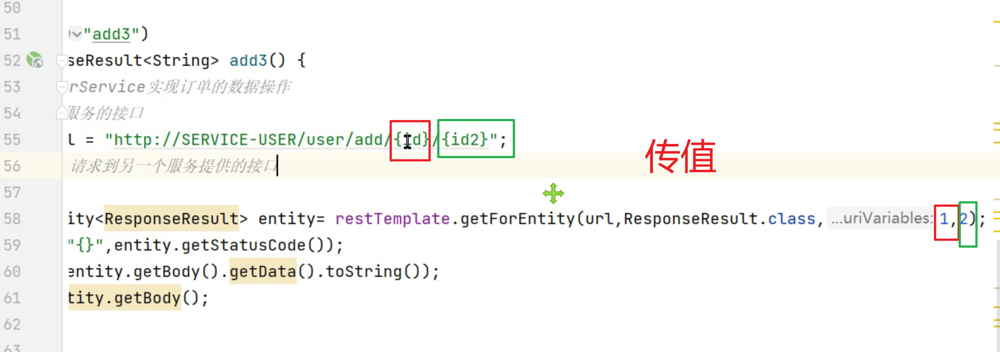

同一个服务不同端口同时启动（模拟集群）


# 作业

| 接口名   | URL               | 请求方式 | 参数说明                                         | 返回值                                                       | 备注 |
| -------- | ----------------- | -------- | ------------------------------------------------ | ------------------------------------------------------------ | ---- |
| 积分修改 | /user/updatepoint | POST     | 传入json，<br />id：用户id<br/>point：增加的积分 | 返回json对象，<br />code：状态码 200表示修改<br/>msg：提示信息 |      |
|          |                   |          |                                                  |                                                              |      |


Ribbon：单独使用也可以实现服务调用，也可以和RestTemplate一起使用，实现服务调用。

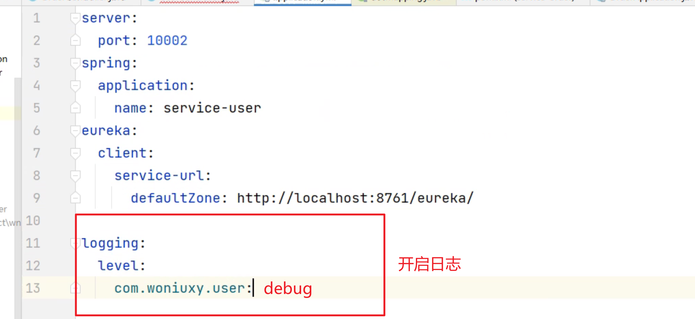

# OpenFeign服务调用

1、调用方pom引入依赖

````xml
<dependency>
            <groupId>org.springframework.cloud</groupId>
            <artifactId>spring-cloud-starter-openfeign</artifactId>
</dependency>
````

2、调用方Application类添加@EnableFeignClients注解

````java
@EnableFeignClients
@MapperScan("com.woniuxy.user.mapper")
@SpringBootApplication
public class UserApplication {

    public static void main(String[] args) {
        SpringApplication.run(UserApplication.class, args);
    }

    @LoadBalanced
    @Bean
    public RestTemplate restTemplate(){
        return new RestTemplate();
    }
}
````

3、在调用方编写接口，指定需要调用的服务和接口；

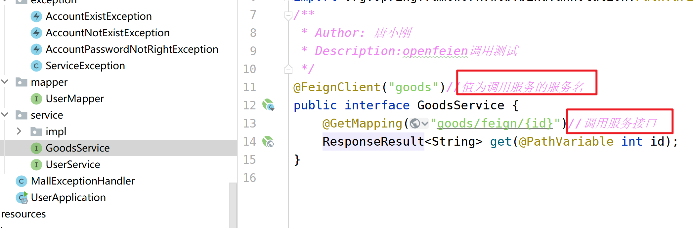

被调用方接口：


测试：http://localhost:8082/user/feign/200


测试结果：


# 获取参数注解补充

## @PathVariable

**@PathVariable是spring3.0的一个新功能：接收请求路径中占位符的值**

````java
@PathVariable("xxx")
通过 @PathVariable 可以将URL中占位符参数{xxx}绑定到处理器类的方法形参中@PathVariable(“xxx“) 
 
@RequestMapping(value=”user/{id}/{name}”)
请求路径：http://localhost:8080/hello/show5/1/james
````

````java
package com.day01springmvc.controller;
import org.springframework.stereotype.Controller;
import org.springframework.web.bind.annotation.*;
import org.springframework.web.servlet.ModelAndView;
 
/**
 * @ Author     ：ShaoWei Sun.
 * @ Date       ：Created in 20:58 2018/11/16
 */
@Controller
@RequestMapping("hello")
public class HelloController2 {
    /**
     *3、占位符映射
     * 语法：@RequestMapping(value=”user/{userId}/{userName}”)
     * 请求路径：http://localhost:8080/hello/show5/1/james
     * @param ids
     * @param names
     * @return
     */
    @RequestMapping("show5/{id}/{name}")
    public ModelAndView test5(@PathVariable("id") Long ids ,@PathVariable("name") String names){
        ModelAndView mv = new ModelAndView();
        mv.addObject("msg","占位符映射：id:"+ids+";name:"+names);
        mv.setViewName("hello2");
        return mv;
    }
}
````

@RequestParam 和 @PathVariable 注解是用于从request中接收请求的，两个都可以接收参数，关键点不同的是@RequestParam 是从request里面拿取值，而 @PathVariable 是从一个URI模板里面来填充

## @RequestParam

看下面一段代码：

http://localhost:8080/springmvc/hello/101?param1=10&param2=20

根据上面的这个URL，你可以用这样的方式来进行获取

````java
public String getDetails(
    @RequestParam(value="param1", required=true) String param1,
        @RequestParam(value="param2", required=false) String param2){
...
}
````

@RequestParam 支持下面四种参数

- defaultValue 如果本次请求没有携带这个参数，或者参数为空，那么就会启用默认

- name 绑定本次参数的名称，要跟URL上面的一样

- required 这个参数是不是必须的

- value 跟name一样的作用，是name属性的一个别名

## @PathVariable

  这个注解能够识别URL里面的一个模板，我们看下面的一个URL

http://localhost:8080/springmvc/hello/101?param1=10&param2=20

````java
@RequestMapping("/hello/{id}")
    public String getDetails(@PathVariable(value="id") String id,
    @RequestParam(value="param1", required=true) String param1,
    @RequestParam(value="param2", required=false) String param2){
.......
}
````

区别：@PathParam 这个注解是和spring的pathVariable是一样的，也是基于模板的，但是这个是jboss包下面的一个实现，@PathVariable是spring的一个实现，都要导包

## @QueryParam

@QueryParam 是 JAX-RS 本来就提供的，和Spring的RequestParam作用一致

## @ResponseBody

responseBody表示服务器返回的时候以一种什么样的方式进行返回， 将内容或对象作为 HTTP 响应正文返回，值有很多，一般设定为json

## @RequestBody

一般是post请求的时候才会使用这个请求，把参数丢在requestbody里面

# Mybatis plus使用

## 1、创建项目


## 2、引入mybatis-plus依赖

pom.xml


## 3、编写mapper


mapper中什么也不用写

## 4、编写service


service中可以写一些CRUD方法

## 5、编写impl


imp中放置业务方法。

## 实体

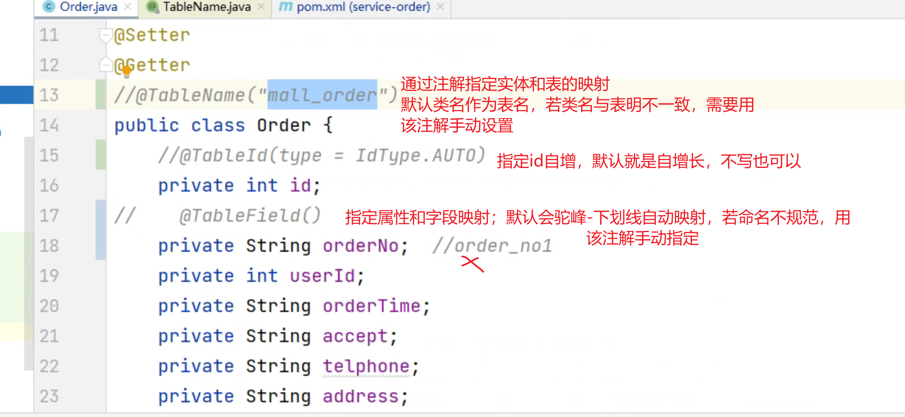


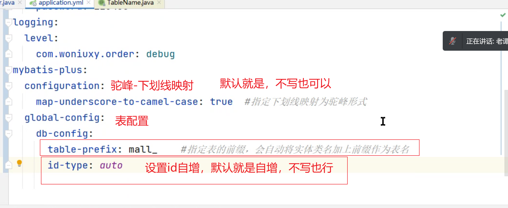

使用Mybatis-plus,新增数据后，会自动返回自增的主键并赋值给对像的id，获取新增后对象的id即可获取自增主键。


一个服务需要用到另一个服务的实体类：

1、通过maven引入项目依赖（不推荐，耦合）

2、放到commons模块


hutool工具，产生当前时间

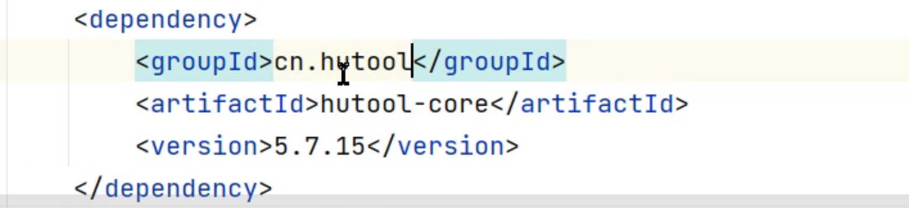

mybatis


arraylist有顺序。


idea打开项目，有时会在左侧project侧边栏直接显示根目录，根目录下展开显示子目录，


可通过设置-->模块，移除根目录，直接从子目录开始显示，效果如下：


# springboot 数据库中文乱码

springboot项目向mysql存入中文变成问号；解决方法：

在yml的数据库url后面加上utf-8编码格式声明：`&useUnicode=true&characterEncoding=utf-8`

```yml
server:
  port: 10003
spring:
  application:
    name: service-order
  datasource:
    driver-class-name: com.mysql.cj.jdbc.Driver
    url: jdbc:mysql:///wn82_order?serverTimezone=UTC&useUnicode=true&characterEncoding=utf-8
    username: root
    password: 621799
```

# mysql库、表、字段编码

## 查看编码

- 查看数据库编码。

```
show variables like '%char%';
```

- 查看表编码

```
show create table <表名>;

例：show create table user;
```

- 查看字段编码

```
show full columns from <表名>;

例： show full column from user;
```

## 修改编码格式

- 修改数据库编码格式

```
alter database <数据库名> character set utf8mb4;
例：alter database db_user character set utf8mb4;
```

- 修改表编码

```
alter table <表名> character set utf8mb4;
例：alter table user character set utf8mb4;
```

- 修改字段编码

```
ALTER TABLE <表名> MODIFY COLUMN <字段名> <字段类型> CHARACTER SET utf8mb4 COLLATE utf8mb4_unicode_ci;
例：ALTER TABLE comment MODIFY COLUMN content VARCHAR(512) CHARACTER SET utf8mb4 COLLATE utf8mb4_unicode_ci;
```


多个表之间的操作有相互影响时，一定要控制好事务，一起成功或失败，如下订单后就应增加订单明细表，就需要在serviceImpl类上添加注解`@Transcational(rollback=Excepion.class)`，避免下订单成功而增加订单明细失败，导致数据不一致。

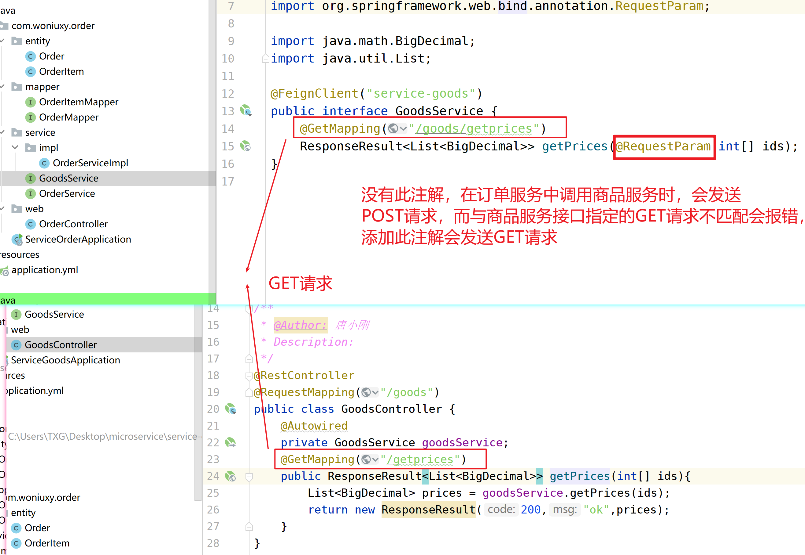


# 跨域问题

单体项目前端页面和后端代码在同一个项目包下，不存在跨域问题，而前后端分离项目前后端不在同一个域中，需要解决跨域问题。

同源策略是针对浏览器来说的。同源策略是指协议、域名、端口相同。

地址栏发送请求、java发送http请求、表单提交发送请求不存在跨域，当使用脚本ajax（axious）发送请求，请求目标的协议、域名(ip)、端口与请求该静态页面的协议、域名(ip)、端口不同时会产生跨域问题。


## @CrossOrigin解决跨域


## 过滤器解决跨域


## jsonp解决跨域


## 跨域总结

跨域：

同源：协议，域名（ip），端口完全一样，称之为同源

产生的原因：同源策略，只有在使用Ajax发送请求时，浏览器才回检查是否陆反了同源策略，浏览器检查响应头，看其中是否存在Access-Control-Allow-Origin

解决方案：

1、后端：在响应头中增加Access-Control-Allow-Origin，具体到springboot技术栈：@CrossOrign、拦截器、过滤器（最好的方案）

2、前端与后端配合：jsop ，jsonp利用script标签不存在跨域问题，jQuery对其有支持，Axios默认不持jsonp。

3、配置代理服务器：如VUE开发（开发阶段）

4、在WebServer中配置：生产阶段使用

# Gateway

Gateway：网关，

作用：

1、统一入口，所有的请求经过网关，由网关把请求路由到各个服务。

2、认证，授权/鉴权

3、限流

注册中心作用：服务之间相互调用时通过用户中心相互利用服务名调用（不是ip端口调用）。

## Gateway建立

1、新建模块


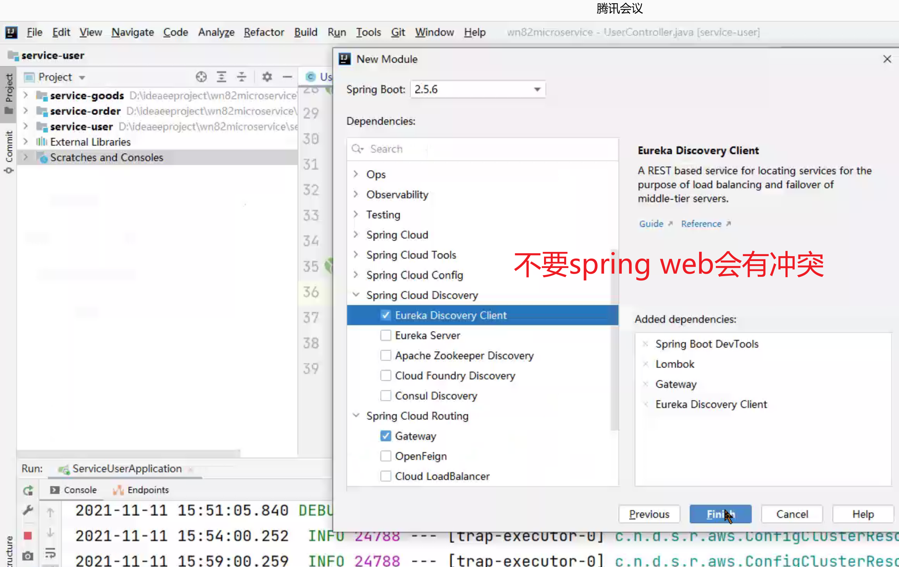

2、修改pom.xml中引入依赖，修改springboot版本、spring cloud版本

````xml
引入
  <dependency>
            <groupId>org.springframework.cloud</groupId>
            <artifactId>spring-cloud-starter-gateway</artifactId>
        </dependency>
        <dependency>
            <groupId>org.springframework.cloud</groupId>
            <artifactId>spring-cloud-starter-netflix-eureka-client</artifactId>
        </dependency>
修改
    <parent>
        <groupId>org.springframework.boot</groupId>
        <artifactId>spring-boot-starter-parent</artifactId>
        -----------------------修改版本-----------------------------
        <version>2.3.12.RELEASE</version>
        -----------------------------------------------------------
        <relativePath/> <!-- lookup parent from repository -->
    </parent>
    <properties>
        <java.version>1.8</java.version>
        -------------------------添加-------------------------------
        <spring-cloud.version>Hoxton.SR12</spring-cloud.version>
        ------------------------------------------------------------
    </properties>
````

3、修改yml，添加基本配置

```yml
server:
  port: 10000	#网关端口
spring:
  application:
    name: gateway	#网关名，类似服务名
eureka: #注册到注册中心
  client:
    service-url:
      defaultZone: http://localhost:8761/eureka/
```

4、测试能否注册到注册中心

5、配置路由和跨域

```yml
server:
  port: 10000	#网关端口
spring:
  application:
    name: gateway	#网关名，类似服务名
  cloud:
    gateway:
      routes: #路由
        - id: user_route #路由名（随便取）
          uri: lb://service-user #lb即loadbalanced，支持负载均衡；service-user路由到的服务名，与对应的服务名保持一致，
          predicates: #断言，即条件，当访问网关ip端口后的路径为/user/...时，路由到名为service-user的服务；一个*可用于表示/user/login类型的请求，两个**还可以表示/user/register?name=zs...这种复杂的uri,推荐使用两个**
            - Path=/user/**
      globalcors: 	#解决跨域
        cors-configurations:
          '[/**]':
            allowedHeaders: "*"
            allowedOrigins: "*"
            allowedCredentials: true
            allowedMethods:
              - GET
              - POST
              - DELETE
              - PUT
              - OPTION
eureka: #注册到注册中心
  client:
    service-url:
      defaultZone: http://localhost:8761/eureka/
```

注意：网关配置跨域后，前端请求网关，网关根据断言路由请求到对应的服务，服务的Controller就不需要在配置跨域了，再配置会出错。

6、测试通过网关访问服务


访问的路径由网关的ip端口和服务的controller、方法uri组成

# JWT

JWT是一种认证的标准，不同的语言有不同的实现，jwt的java实现也有很多，常用的是JJWT（apache）和java-jwt

jjwt：https://www.jianshu.com/p/278ad96dc7f3

java-jwt：https://blog.csdn.net/qq_42120178/article/details/97645746


过滤器使用场景：

做权限判断、统一解决乱码

gateway的功能类似一个全局过滤器

# AuthFilter全局过滤器


token一般加在请求头和响应头中


VO：与界面打交道的实体，接收界面数据的javabean

DTO：

BeanUtils.copy...

构造方法不能被继承？

# 异步

**目标**

MQ的作用
RabbitMQ的结构，安装与配置（省略）Java理解RabbitMQ的工作模式
SpringBoot集成
RabbitMQ应用：订单服务发送消息，邮件服务接收翡息

# Message Queue

Message Queue简称MQ，即消息队列。

作用：异步调用，提升性能；解耦，维护性高；削峰限流。

同步调用：下订单之-->调用用户服务成功-->调用商品服务成功-->调用邮件服务成功--->下订单成功。

异步调用：下订单-->发送用户服务消息给MQ-->调用商品服务成功-->发送邮件信息给MQ-->下订单成功。后台继续处理用户服务和邮件服务。


# RabbitMQ

RabbitMQ官网：https://www.rabbitmq.com/由Erlang语言实现，目前课程使用

其他MQ产品：Kafka：大数据领域、RocketMQ：阿里开源、ActiveMQ：支持JMS规范


## RabbitMQ结构

核心结构
1、虚拟主机：逻辑上互相独立的组件2，交换机：是接收消息的组件
3、队列：队列的消息来自于与其绑定的交换机
4、连接：Connection，物理上连接
5、通道：Channel，建立在物理的逻辑组件，通过通道发送消息

6、消息生产者：发送消息，本案例中就是订单服务
7、消息消费者：监听队列，消费其中的消息，本案例中就是邮件服务


RabbitMQ有多个虚拟主机，一个虚拟主机有多个交换机和多个消息队列。

消息队列和交换机绑定，未绑定到交换机的消息队列会和默认交换机隐式绑定。

消息通过物理上的connection和逻辑上的channel发送到交换机，交换机将消息通过路由键路由到消息队列，消息消费者监听消息队列，处理消息。


## RabbitMQ使用

## Hello World模式

最基本形式，一个队列绑定到默认交换机，发送消息到默认交换机，队列监听接收来自交换机的消息。


具体过程测试过程：

1、新建项目，使用maven项目测试

2、引入依赖（所有默认都只要需要且相同的下面依赖）

```xml
<dependencies>
    -------------------------------采用单元测试，也可main方法测试，不引入此依赖---------------------------
        <dependency>
            <groupId>junit</groupId>
            <artifactId>junit</artifactId>
            <version>4.13.2</version>
            <scope>test</scope>
        </dependency>
    ----------------------RabbitMQ依赖-------------------------------------------------------------
        <dependency>
            <groupId>com.rabbitmq</groupId>
            <artifactId>amqp-client</artifactId>
            <version>5.13.1</version>
        </dependency>
    </dependencies>
```

3、编写测试代码

````java
import com.rabbitmq.client.Channel;
import com.rabbitmq.client.Connection;
import com.rabbitmq.client.ConnectionFactory;
import com.rabbitmq.client.DeliverCallback;
import org.junit.Test;
import org.junit.runner.manipulation.Ordering;

import java.io.IOException;
import java.util.concurrent.TimeoutException;

/**
 * @Author: 唐小刚
 * Description:
 */
public class MQtest {
    //---------------------------------------发送消息到交换机--------------------------------------------
    @Test
    public void sendMessage() throws IOException, TimeoutException {
        //队列名
        final String QUEUE_NAME="atanx-q";
        ConnectionFactory factory=new ConnectionFactory();
        factory.setHost("1.14.74.48");//设置RabbitMQ服务器地址
        factory.setPort(5672);//设置RabbitMQ服务器端口
        factory.setUsername("guest");
        factory.setPassword("laotanrabbitmq");
        Connection connection = factory.newConnection();//创建连接
        Channel channel = connection.createChannel();//创建通道
        //声明队列（不存在则创建，不存在则创建新队列）
        channel.queueDeclare(QUEUE_NAME,false,false,false,null);
        String message="hello atanx";
        //发送消息，第一个参数值是字符串，代表交换机，为空字符串即消息发送给默认交换机；第二个参数为路由键，与队列名相同
        channel.basicPublish("",QUEUE_NAME,null,message.getBytes());
    }
   //---------------------------------------------接收消息---------------------------------------------
    @Test
    public void receiceMessage() throws IOException, TimeoutException {
        //队列名
        final String QUEUE_NAME="atanx-q";
        ConnectionFactory factory=new ConnectionFactory();
        factory.setHost("1.14.74.48");//设置RabbitMQ服务器地址
        factory.setPort(5672);//设置RabbitMQ服务器端口
        factory.setUsername("guest");
        factory.setPassword("laotanrabbitmq");
        Connection connection = factory.newConnection();//创建连接
        Channel channel = connection.createChannel();//创建通道
         channel.queueDeclare(QUEUE_NAME,false,false,false,null);
        //回调函数
        DeliverCallback deliverCallback = (consumerTag, delivery) -> {
            String message = new String(delivery.getBody(), "UTF-8");
            System.out.println(" [x] Received '" + message + "'");
        };
        //此方法不会停止，一直监听队列中的消息
        channel.basicConsume(QUEUE_NAME, true, deliverCallback, consumerTag -> { });
        //单元测试会自动关闭主线程，利用此语句可让其不自动关闭，若用main()测试，不用加此语句
        System.in.read();
    }
}
````

4、结果


监听消息队列，队列一有消息，便将消息取出


## Work queues模式


不需要指定交换机类型，多个消息队列绑定到默认交换机，发送消息到默认交换机，每个队列轮流交替接收来自交换机的消息。

````JAVA
import com.rabbitmq.client.Channel;
import com.rabbitmq.client.Connection;
import com.rabbitmq.client.ConnectionFactory;
import com.rabbitmq.client.DeliverCallback;
import org.junit.Test;
import org.junit.runner.manipulation.Ordering;

import java.io.IOException;
import java.util.concurrent.TimeoutException;

/**
 * @Author: 唐小刚
 * Description:
 */
public class MQtest {
    //---------------------------------发消息------------------------------------------
    @Test
    public void sendMessage() throws IOException, TimeoutException {
        //队列名
        final String QUEUE_NAME="atanx-q";
        ConnectionFactory factory=new ConnectionFactory();
        factory.setHost("1.14.74.48");//设置RabbitMQ服务器地址
        factory.setPort(5672);//设置RabbitMQ服务器端口
        factory.setUsername("guest");
        factory.setPassword("laotanrabbitmq");
        Connection connection = factory.newConnection();//创建连接
        Channel channel = connection.createChannel();//创建通道
        //声明队列（不存在则创建，不存在则创建新队列）
        channel.queueDeclare(QUEUE_NAME,false,false,false,null);
        String message="hello atanx";
        //发送消息，第一个参数值是字符串，代表交换机，为空字符串即消息发送给默认交换机；第二个参数为路由键，与队列名相同
        channel.basicPublish("",QUEUE_NAME,null,message.getBytes());
    }
    //------------------------------------消费者1接收队列q消息---------------------------------------
    @Test
    public void receiceMessage() throws IOException, TimeoutException {
        //队列名
        final String QUEUE_NAME="atanx-q";
        ConnectionFactory factory=new ConnectionFactory();
        factory.setHost("1.14.74.48");//设置RabbitMQ服务器地址
        factory.setPort(5672);//设置RabbitMQ服务器端口
        factory.setUsername("guest");
        factory.setPassword("laotanrabbitmq");
        Connection connection = factory.newConnection();//创建连接
        Channel channel = connection.createChannel();//创建通道
         channel.queueDeclare(QUEUE_NAME,false,false,false,null);
        //回调函数
        DeliverCallback deliverCallback = (consumerTag, delivery) -> {
            String message = new String(delivery.getBody(), "UTF-8");
            System.out.println(" [x] Received 1：'" + message + "'");
        };
        //此方法不会停止，一直监听队列中的消息
        channel.basicConsume(QUEUE_NAME, true, deliverCallback, consumerTag -> { });
        //单元测试会自动关闭主线程，利用此语句可让其不自动关闭，若用main()测试，不用加此语句
        System.in.read();
    }
    //------------------------------------消费者2接收队列q消息---------------------------------------
    @Test
    public void receiceMessage2() throws IOException, TimeoutException {
        //队列名
        final String QUEUE_NAME="atanx-q";
        ConnectionFactory factory=new ConnectionFactory();
        factory.setHost("1.14.74.48");//设置RabbitMQ服务器地址
        factory.setPort(5672);//设置RabbitMQ服务器端口
        factory.setUsername("guest");
        factory.setPassword("laotanrabbitmq");
        Connection connection = factory.newConnection();//创建连接
        Channel channel = connection.createChannel();//创建通道
        channel.queueDeclare(QUEUE_NAME,false,false,false,null);
        //回调函数
        DeliverCallback deliverCallback = (consumerTag, delivery) -> {
            String message = new String(delivery.getBody(), "UTF-8");
            System.out.println(" [x] Received 2： '" + message + "'");
        };
        //此方法不会停止，一直监听队列中的消息
        channel.basicConsume(QUEUE_NAME, true, deliverCallback, consumerTag -> { });
        //单元测试会自动关闭主线程，利用此语句可让其不自动关闭，若用main()测试，不用加此语句
        System.in.read();
    }
}

````

## Publish/Subscribe模式


交换机类型为：fanout。

发送消息到fanout交换机，不需要指定路由键；fanout交换机绑定到多个消息队列，每个消息队列都能受到交换机发送的消息

````java
import com.rabbitmq.client.*;
import org.junit.Test;

import java.io.IOException;
import java.util.concurrent.TimeoutException;

/**
 * @Author: 唐小刚
 * Description:
 */
public class FanoutTest {
    //------------------------------发送消息到交换机-------------------------------------------
   @Test
    public void send() throws IOException, TimeoutException {
       //队列名
       final String EXCHANGE_NAME="atanx-e-fanout";
       ConnectionFactory factory=new ConnectionFactory();
       factory.setHost("1.14.74.48");//设置RabbitMQ服务器地址
       factory.setPort(5672);//设置RabbitMQ服务器端口
       factory.setUsername("guest");
       factory.setPassword("laotanrabbitmq");
       Connection connection = factory.newConnection();//创建连接
       Channel channel = connection.createChannel();//创建通道
       //声明交换机
       channel.exchangeDeclare(EXCHANGE_NAME, BuiltinExchangeType.FANOUT);
      //发送消息到交换机
       channel.basicPublish(EXCHANGE_NAME,"",null,"hellow exchange atanx!".getBytes());
   }
    //------------------------------队列1接收消息----------------------------------------------------
   @Test
    public void receive1() throws IOException, TimeoutException {
       //队列名
       final String QUEUE_NAME="atanx-q-1";
       ConnectionFactory factory=new ConnectionFactory();
       factory.setHost("1.14.74.48");//设置RabbitMQ服务器地址
       factory.setPort(5672);//设置RabbitMQ服务器端口
       factory.setUsername("guest");
       factory.setPassword("laotanrabbitmq");
       Connection connection = factory.newConnection();//创建连接
       Channel channel = connection.createChannel();//创建通道
       //声明交换机
       channel.exchangeDeclare("atanx-e-fanout", BuiltinExchangeType.FANOUT);
       //声明队列
       channel.queueDeclare(QUEUE_NAME,false,false,false,null);
       //绑定队列，交换机
       channel.queueBind(QUEUE_NAME,"atanx-e-fanout","");
       //回调函数
       DeliverCallback deliverCallback = (consumerTag, delivery) -> {
           String message = new String(delivery.getBody(), "UTF-8");
           System.out.println(" [x] Received 1：'" + message + "'");
       };
       //此方法不会停止，一直监听队列中的消息
       channel.basicConsume(QUEUE_NAME, true, deliverCallback, consumerTag -> { });
       //单元测试会自动关闭主线程，利用此语句可让其不自动关闭，若用main()测试，不用加此语句
       System.in.read();
   }
    //------------------------------队列2接收消息----------------------------------------------------
    @Test
    public void receive2() throws IOException, TimeoutException {
        //队列名
        final String QUEUE_NAME="atanx-q-2";
        ConnectionFactory factory=new ConnectionFactory();
        factory.setHost("1.14.74.48");//设置RabbitMQ服务器地址
        factory.setPort(5672);//设置RabbitMQ服务器端口
        factory.setUsername("guest");
        factory.setPassword("laotanrabbitmq");
        Connection connection = factory.newConnection();//创建连接
        Channel channel = connection.createChannel();//创建通道
        //声明交换机、类型为fanout（若已有改交换机存在可以省略此语句，不存在则创建该名称的交换机）
        channel.exchangeDeclare("atanx-e-fanout", "fanout");
        //声明队列
        channel.queueDeclare(QUEUE_NAME,false,false,false,null);
        //绑定交换机和队列,本来应该指定路由键，由于交换机的类型是fanout.路由键省略
        channel.queueBind(QUEUE_NAME,"atanx-e-fanout","");
        //回调函数
        DeliverCallback deliverCallback = (consumerTag, delivery) -> {
            String message = new String(delivery.getBody(), "UTF-8");
            System.out.println(" [x] Received 2：'" + message + "'");
        };
        //此方法不会停止，一直监听队列中的消息
        channel.basicConsume(QUEUE_NAME, true, deliverCallback, consumerTag -> { });
        //单元测试会自动关闭主线程，利用此语句可让其不自动关闭，若用main()测试，不用加此语句
        System.in.read();
    }
}
````

## Routing模式

交换机类型为：direct。

队列绑定到交换机时指定的路由键与发送消息到交换机的路由键**`相同`**时，该队列可接收到交换机的消息。


```JAVA
import com.rabbitmq.client.Channel;
import com.rabbitmq.client.Connection;
import com.rabbitmq.client.ConnectionFactory;
import com.rabbitmq.client.DeliverCallback;
import org.junit.Before;
import org.junit.Test;

import java.io.IOException;
import java.nio.charset.StandardCharsets;
import java.util.concurrent.TimeoutException;

/**
 * @Author: 唐小刚
 * Description:
 */
public class DirectTest {
    //-----------------------------抽提公共代码------------------------------------------
    private  Channel channel;
    @Before
    public void set() throws IOException, TimeoutException {
        final String EXCHANGE_NAME="atanx-e-fanout";
        ConnectionFactory factory=new ConnectionFactory();
        factory.setHost("1.14.74.48");//设置RabbitMQ服务器地址
        factory.setPort(5672);//设置RabbitMQ服务器端口
        factory.setUsername("guest");
        factory.setPassword("laotanrabbitmq");
        Connection connection = factory.newConnection();//创建连接
        channel = connection.createChannel();//创建通道
    }
	//----------------------------声明交换机、队列，绑定，发送消息到交换机-------------------------------
    @Test
    public void send() throws IOException {
        //声明交换机
        channel.exchangeDeclare("atanx-e-direct","direct");

        //声明队列1
        channel.queueDeclare("atanx-q-d1",false,false,false,null);
        //绑定队列1到交换机
        channel.queueBind("atanx-q-d1","atanx-e-direct","white");

        //声明队列2
        channel.queueDeclare("atanx-q-d2",false,false,false,null);
        //绑定队列2到交换机
        channel.queueBind("atanx-q-d2","atanx-e-direct","black");

        //发消息到交换机
        channel.basicPublish("atanx-e-direct","black",null,"你好direct".getBytes(StandardCharsets.UTF_8));
    }
    //---------------------------------------监听队列1，接收消息----------------------------------
    @Test
    public void receive1() throws IOException {
        //回调函数
        DeliverCallback deliverCallback = (consumerTag, delivery) -> {
            String message = new String(delivery.getBody(), "UTF-8");
            System.out.println(" [x] Received 1：'" + message + "'");
        };
        //此方法不会停止，一直监听队列中的消息
        channel.basicConsume("atanx-q-d1", true, deliverCallback, consumerTag -> { });
        //单元测试会自动关闭主线程，利用此语句可让其不自动关闭，若用main()测试，不用加此语句
        System.in.read();
    }
   //-------------------------------------------监听队列2，接收消息--------------------------------
    @Test
    public void receive2() throws IOException {
        //回调函数
        DeliverCallback deliverCallback = (consumerTag, delivery) -> {
            String message = new String(delivery.getBody(), "UTF-8");
            System.out.println(" [x] Received 1：'" + message + "'");
        };
        //此方法不会停止，一直监听队列中的消息
        channel.basicConsume("atanx-q-d2", true, deliverCallback, consumerTag -> { });
        //单元测试会自动关闭主线程，利用此语句可让其不自动关闭，若用main()测试，不用加此语句
        System.in.read();
    }
}
```

队列绑定到交换机时指定的路由键与发送消息到交换机的路由键**`相同`**时，该队列可接收到交换机的消息。


**交换机和队列的声明、绑定在发送消息和接收消息都可以设置。**

## Topic模式

类似routing，但路由键支持通配符，通常用`.`将通配符和字符隔开。绑定交换机和队列时指定的路由可以匹配发消息的路由，该队列可以接收交换机的消息。

> *：一个单词
>
> #：0个或多个单词

```java
import com.rabbitmq.client.Channel;
import com.rabbitmq.client.Connection;
import com.rabbitmq.client.ConnectionFactory;
import com.rabbitmq.client.DeliverCallback;
import org.junit.Before;
import org.junit.Test;

import java.io.IOException;
import java.nio.charset.StandardCharsets;
import java.util.concurrent.TimeoutException;

/**
 * @Author: 唐小刚
 * Description:
 */
public class TopicTest {
    private Channel channel;
    //-----------------------------------抽离公共代码----------------------------------------------------
    @Before
    public void set() throws IOException, TimeoutException {
        final String EXCHANGE_NAME="atanx-e-fanout";
        ConnectionFactory factory=new ConnectionFactory();
        factory.setHost("1.14.74.48");//设置RabbitMQ服务器地址
        factory.setPort(5672);//设置RabbitMQ服务器端口
        factory.setUsername("guest");
        factory.setPassword("laotanrabbitmq");
        Connection connection = factory.newConnection();//创建连接
        channel = connection.createChannel();//创建通道
    }
    //----------------------------------声明交换机、队列，绑定，发消息到交换机-----------------------------
    @Test
    public void send() throws IOException {
        //声明交换机
        channel.exchangeDeclare("atanx-e-topic","topic");

        //声明队列1
        channel.queueDeclare("atanx-q-t1",false,false,false,null);
        //绑定队列1到交换机
        channel.queueBind("atanx-q-t1","atanx-e-topic","sds.black.fsf");

        //声明队列2
        channel.queueDeclare("atanx-q-t2",false,false,false,null);
        //绑定队列2到交换机
        channel.queueBind("atanx-q-t2","atanx-e-topic","df.black.sd");

        //发消息   利用通配符指定模糊的路由键*.black.*
        channel.basicPublish("atanx-e-topic","*.black.*",null,"你好topic".getBytes(StandardCharsets.UTF_8));
    }
    //--------------------------------------监听队列1接收消息-----------------------------------------
    @Test
    public void receive1() throws IOException {
        //回调函数
        DeliverCallback deliverCallback = (consumerTag, delivery) -> {
            String message = new String(delivery.getBody(), "UTF-8");
            System.out.println(" [x] Received 2： '" + message + "'");
        };
        //此方法不会停止，一直监听队列中的消息
        channel.basicConsume("atanx-q-t1", true, deliverCallback, consumerTag -> { });
        //单元测试会自动关闭主线程，利用此语句可让其不自动关闭，若用main()测试，不用加此语句
        System.in.read();
    }
    //----------------------------------------监听队列2接收消息---------------------------------------
    @Test
    public void receive2() throws IOException {
        //回调函数
        DeliverCallback deliverCallback = (consumerTag, delivery) -> {
            String message = new String(delivery.getBody(), "UTF-8");
            System.out.println(" [x] Received 2： '" + message + "'");
        };
        //此方法不会停止，一直监听队列中的消息
        channel.basicConsume("atanx-q-t2", true, deliverCallback, consumerTag -> { });
        //单元测试会自动关闭主线程，利用此语句可让其不自动关闭，若用main()测试，不用加此语句
        System.in.read();
    }
}
```

绑定交换机和队列时指定的路由可以匹配发消息的路由，该队列可以接收交换机的消息。


## 交换机类型总结

fanout：消息会路由到和交换机绑定的所有队列，与路由键无关、不需要指定路由键，路由键为空字符串；

direct：消息发给交换机时需要指定路由键，消息会路由到使用该路由键和交换机绑定的队列；

topic：与direct类似，但是路由键是支持通配符；

默认交换机的类型是direct，路由键就是绑定到其上的队列的名称。

# springboot发邮件

1、新建服务

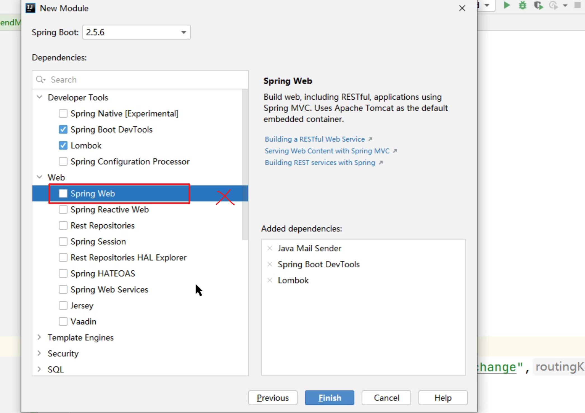

2、引入依赖

```xml
 <dependency>
    <groupId>org.springframework.boot</groupId>
    <artifactId>spring-boot-starter-mail</artifactId>
</dependency>
```

3、yml添加配置

```yaml
server:
  port: 10004
spring:
  application:
    name: service-mail
  rabbitmq:
    host: 1.14.74.48
    port: 5672
    username: guest
    password: laotanrabbitmq
    virtual-host: / #可不配
  -------------------------------------邮件配置-----------------------------------------------------------
  mail:
    # 配置 SMTP 服务器地址
    host: smtp.qq.com
    # 发送者邮箱
    username: neutxg@qq.com
    # 配置密码，注意不是真正的密码，而是刚刚申请到的授权码
    password: tzezbapzftgacffg
    # 端口号465或587
    port: 587
    # 默认的邮件编码为UTF-8
    default-encoding: utf-8
    # 配置SSL 加密工厂
    properties:
      mail:
        smtp:
          socketFactoryClass: javax.net.ssl.SSLSocketFactory
        #表示开启 DEBUG 模式，这样，邮件发送过程的日志会在控制台打印出来，方便排查错误
        debug: true
```

3、发送邮件测试

发送的前提是确认邮箱已经开始了pop3，smtp协议，获得了授权码。

```java
@SpringBootTest
public class MailSendTest {
    @Autowired
    private JavaMailSender javaMailSender;
    @Test
    public void sendMail(){
        // 构建一个邮件对象
        SimpleMailMessage message = new SimpleMailMessage();
        // 设置邮件主题
        message.setSubject("这是一封测试邮件");
        // 设置邮件发送者，这个跟application.yml中设置的要一致
        message.setFrom("neutxg@qq.com");
        // 设置邮件接收者，可以有多个接收者，中间用逗号隔开，以下类似
        // message.setTo("10*****16@qq.com","12****32*qq.com");
        message.setTo("txgpro@163.com");
        // 设置邮件抄送人，可以有多个抄送人
        message.setCc("neutxg@163.com");
        // 设置隐秘抄送人，可以有多个
        message.setBcc("neutxg@163.com");
        // 设置邮件发送日期
        message.setSentDate(new Date());
        // 设置邮件的正文
        message.setText("这是测试邮件的正文");
        // 发送邮件
        javaMailSender.send(message);
    }
}
```

# SpringBoot发送MQ消息

1、引入依赖

```xml
<dependency>
    <groupId>org.springframework.boot</groupId>
    <artifactId>spring-boot-starter-amqp</artifactId>
</dependency>
```

2、yml添加配置MQ连接信息

```yaml
server:
  port: 10003
spring:
  application:
    name: service-order
  datasource:
    driver-class-name: com.mysql.cj.jdbc.Driver
    url: jdbc:mysql:///wn82_order?serverTimezone=UTC&useUnicode=true&characterEncoding=utf-8
    username: root
    password: 621799
 ---------------------------------添加配置-------------------------------------------------------
  rabbitmq:
    host: 1.14.74.48
    port: 5672
    username: guest
    password: laotanrabbitmq
    virtual-host: / #可不配
```

3、在配置类声明交换机，队列及绑定（在生产端或消费端都可声明绑定）

入口类可作为配置类使用。

```java
package com.woniuxy.order;

import org.mybatis.spring.annotation.MapperScan;
import org.springframework.amqp.core.*;
import org.springframework.amqp.rabbit.core.RabbitTemplate;
import org.springframework.boot.SpringApplication;
import org.springframework.boot.autoconfigure.SpringBootApplication;
import org.springframework.cloud.openfeign.EnableFeignClients;
import org.springframework.context.annotation.Bean;
import org.springframework.web.bind.annotation.CrossOrigin;


@EnableFeignClients
@MapperScan("com.woniuxy.order.mapper")
@SpringBootApplication
public class ServiceOrderApplication {

    public static void main(String[] args) {
        SpringApplication.run(ServiceOrderApplication.class, args);
    }
    
    @Bean
    public Exchange directExchange(){
        return new DirectExchange("atanx-mail-exchange");
    }
    @Bean
    public Queue queue(){
        return new Queue("atanx-mail-queue");
    }
    @Bean
    public Binding binding(){
        return BindingBuilder.bind(queue()).to(directExchange()).with("order-mail").noargs();
    }
}

```

4、单元测试

```java
package com.woniuxy.order;

//import org.junit.Test;
import com.fasterxml.jackson.core.JsonProcessingException;
import com.fasterxml.jackson.databind.ObjectMapper;
import com.woniuxy.order.entity.OrderMessage;
import org.junit.jupiter.api.Test;
import org.springframework.amqp.core.AmqpTemplate;
import org.springframework.amqp.rabbit.core.RabbitTemplate;
import org.springframework.beans.factory.annotation.Autowired;
import org.springframework.boot.test.context.SpringBootTest;

/**
 * @Author: 唐小刚
 * Description:
 */
@SpringBootTest
public class MQtest {
    @Autowired
    private AmqpTemplate amqpTemplate;
//    private RabbitTemplate rabbitTemplate;
    @Test
    public void sendMessage(){
        amqpTemplate.convertAndSend("atanx-mail-exchange","order-mail","qq@163.com");
    }
    @Test
    public void send() throws JsonProcessingException {
        OrderMessage orderMessage=new OrderMessage();
        orderMessage.setOrderId(2);
        orderMessage.setEmail("163@qq.com");
        ObjectMapper objectMapper=new ObjectMapper();
        String orderMsg = objectMapper.writeValueAsString(orderMessage);

        amqpTemplate.convertAndSend("atanx-mail-exchange","order-mail",orderMsg);
    }
}

```

# springboot接收MQ消息

1、引入依赖

```xml
<dependency>
    <groupId>org.springframework.boot</groupId>
    <artifactId>spring-boot-starter-amqp</artifactId>
</dependency>
```

2、yml添加配置MQ连接信息

```yaml
server:
  port: 10003
spring:
  application:
    name: service-order
  datasource:
    driver-class-name: com.mysql.cj.jdbc.Driver
    url: jdbc:mysql:///wn82_order?serverTimezone=UTC&useUnicode=true&characterEncoding=utf-8
    username: root
    password: 621799
 ---------------------------------添加配置-------------------------------------------------------
  rabbitmq:
    host: 1.14.74.48
    port: 5672
    username: guest
    password: laotanrabbitmq
    virtual-host: / #可不配
```

3、新建消息接收类，接收消息

```java
@Slf4j
@Component
@RabbitListener(queues = "atanx-mail-queue")//指定监听队列
public class MailMessageReceiver {
    @RabbitHandler	//消息处理方法
    public void process(String msg) {
        log.info("受到的信息：{}",msg);
        System.out.println("MQReceiver消费者收到消息  : " + msg);
    }

}
```


# ttl队列

x-message-ttl：设置队列中消息的存活时间，单位为毫秒。

@Bean管理对象，产生对象名为方法名。

```java
 @Bean
    public Queue queueTTL(){
        Map<String,Object> arguments=new HashMap<>();
        arguments.put("x-message-ttl",20000);//指定队列为ttl队列，队列中消息存活时间单位为毫秒
        Queue queue=new Queue("atanx-mail-qTTL",true,false,
                false, arguments);
        return queue;
    }
```

ttl队列创建后，若要修改存活时间，只能在网页上删除该ttl队列，修改存活时间后再运行代码重新创建队列，不删除队列修改属性后直接发消息会报错：


死信交换机：接收ttl队列的交换机，本质同一般交换机。

死信队列：绑定到死信交换机的队列，本质还是一般队列。

ttl队列中的消息过期后会进入死信交换机，死信队列可以从死信交换机获消息。利用ttl队列和死信队列可以做到延迟接收消息的效果。


```java
package com.woniuxy.order;

import org.mybatis.spring.annotation.MapperScan;
import org.springframework.amqp.core.*;
import org.springframework.amqp.rabbit.core.RabbitTemplate;
import org.springframework.boot.SpringApplication;
import org.springframework.boot.autoconfigure.SpringBootApplication;
import org.springframework.cloud.openfeign.EnableFeignClients;
import org.springframework.context.annotation.Bean;
import org.springframework.web.bind.annotation.CrossOrigin;

import java.util.HashMap;
import java.util.Map;


@EnableFeignClients
@MapperScan("com.woniuxy.order.mapper")
@SpringBootApplication
public class ServiceOrderApplication {

    public static void main(String[] args) {
        SpringApplication.run(ServiceOrderApplication.class, args);
    }
    //交换机
    @Bean
    public Exchange directExchange(){
        return new DirectExchange("atanx-mail-exchange");
    }
    //队列
    @Bean
    public Queue queue(){
        return new Queue("atanx-mail-queue");
    }
    //绑定
    @Bean
    public Binding binding(){
        return BindingBuilder.bind(queue()).to(directExchange()).with("order-mail").noargs();
    }
    //ttl队列
    @Bean
    public Queue queueTTL(){
        Map<String,Object> arguments=new HashMap<>();
        arguments.put("x-message-ttl",20000);//指定该队列为ttl队列，队列中消息的存活时间为20000ms
        arguments.put("x-dead-letter-exchange","atanx-mial-e-dead");//指定该ttl队列消息过期后进入的死信交换机
        arguments.put("x-dead-letter-routing-key","order-mail-dead");//指定私信交换机的路由键
        Queue queue=new Queue("atanx-mail-qTTL",true,false,
                false, arguments);
        return queue;
    }
    //死信交换机
    @Bean
    public Exchange directExchangeDead(){
        return new DirectExchange("atanx-mial-e-dead");
    }
    //死信队列
    @Bean
    public Queue queueDead(){
        return new Queue("atanx-mial-q-dead");
    }
    //死信交换机和死信队列绑定
    @Bean
    public Binding bindingDead(){
        return BindingBuilder.bind(queueDead()).to(directExchangeDead()).with("order-mail-dead").noargs();
    }
}
```


@RabbitListener标注的消费者类中@RabbitHandler标注的方法支持重载，根据接收的消息的类型与方法参数的类型匹配，方法只有一个参数，自动匹配同类型参数的方法，方法参数有多个时，消息类型与方法参数匹配时，要匹配的方法参数可加@Payload指定关系。

```java
接收到的消息为OrderMessage类型，则自动匹配第一个方法。
接收到的消息为User类型，由于含有User参数的方法有2个参数，需要加@Payload指定关系
推荐只接受一的消息都为同一种类型
-------------------------------------------------------------------------------------------------------
@Slf4j
@Component
@RabbitListener(queues = "atanx-order-queue")
public class MessageReceiver {
    @Autowired
    private MailService mailService;

    @RabbitHandler
    public void process(OrderMessage orderMessage) throws MessagingException {
        log.info("受到的信息：{}",orderMessage);
        System.out.println("MQReceiver消费者收到消息  : " + orderMessage);
        //发送邮件
        mailService.sendThymeleafMail(orderMessage);
    }
    
    
    @RabbitHandler
    public void process(String msg) {
    log.info("受到的信息：{}",msg);
    System.out.println("MQReceiver消费者收到消息  : " + msg);
    //发送邮件
    mailService.sengMail("neutxg@qq.com");
    }
    
    
    @RabbitHandler
    public void process(String msg,@Payload User user) {
    log.info("受到的信息：{}",msg);
    System.out.println("MQReceiver消费者收到消息  : " + msg);
    //发送邮件
    mailService.sengMail("neutxg@qq.com");
    }

}
```

RabbitTemplate与AmqpTemplate的作用类似，但提供的方法略有区别，RabbitTemplate提供操作队列的方法（删除队列等），而AmqpTemplate不提供。

```java
@Test
public void testDelete() throws IOException {
    Channel channel = rabbitTemplate.getConnectionFactory().createConnection().createChannel(true);
    channel.queueDelete("wn82_mail_queue");
}
```

# WebSocket

## 介绍

背景：
传统的BS开发，都是基于请求响应的，在特定场景中，服务器能主动向客户端发送消息(如即时聊天)，传统BS开发可以使用“轮询”解决（服务端隔一定时间主动向服务器发送请求），推荐使用webSocket可以解决。

WebSocket是双通道的协议，能在客户端和服务器任意发送消息。

## 注解

Java中的注解

```
@OnOpen：客户端连接上来，执行修饰的方法
@OnMessage：客户端发送消息，执行修饰的方法
@OnError：出错，执行修饰的方法
@OnClose：客户端关闭，执行修饰的方法
```

JavaScript

```
onopen：连接到服务器端，执行指定的函数
onmessage：接收到服务端消息，执行指定的函数
onerror：出错时，执行指定的函数
onclose：客户端关闭时，执行指定的函数
```

## 基本使用

**1、建立项目**

只需确保有websocket依赖即可

```xml
<dependency>
    <groupId>org.springframework.boot</groupId>
    <artifactId>spring-boot-starter-websocket</artifactId>
</dependency>
```


开启日志

```yaml
logging:
  level:
    com.woniuxy.chat: debug
```

**2、新建bean，可在入口类中建立**

```java
@SpringBootApplication
public class ServiceChatApplication {

    public static void main(String[] args) {
        SpringApplication.run(ServiceChatApplication.class, args);
    }
    @Bean
    public ServerEndpointExporter serverEndpointExporter(){
        return new ServerEndpointExporter();
    }
}
```

**3、新建要请求的类**

```java
@Slf4j
@Component
@ServerEndpoint("/chat")//请求路径
public class ChatEndpoint {
    @OnOpen
    public void onOpen(){
        log.debug("客户端连接成功......");
    }
}

```

@onOpen：连上服务器时执行的方法

**4、新建网页**

```html
<!DOCTYPE html>
<html lang="en">
<head>
    <meta charset="UTF-8">
    <meta http-equiv="X-UA-Compatible" content="IE=edge">
    <meta name="viewport" content="width=device-width, initial-scale=1.0">
    <title>Document</title>
    <script src="js/jquery-2.1.4.js"></script>
    <script>
        $(function(){
            let ws=new WebSocket("ws://localhost:8080/chat");//ws协议 支持跨域
            ws.onopen=function(){//onopen 回调
                alert("连接成功......");
            }
        })
    </script>
</head>
<body>
    
</body>
</html>
```

**5、访问测试**


websocket提供的ws协议支持跨域。

@onMessage 接受到消息时执行的方法

```java
@Slf4j
@Component
@ServerEndpoint("/chat")//请求路径
public class ChatEndpoint {
    @OnOpen//客户端连接到此服务时执行的方法
    public void onOpen(){
        log.debug("客户端连接成功......");
    }
    @OnMessage//客户端发送消息时执行的方法
    public void onMessage(String msg){//参数类型与客户端发送的数据类型保持一致
        log.debug("收到的消息是:{}",msg);
    }
}
```

```html
<!DOCTYPE html>
<html lang="en">
<head>
    <meta charset="UTF-8">
    <meta http-equiv="X-UA-Compatible" content="IE=edge">
    <meta name="viewport" content="width=device-width, initial-scale=1.0">
    <title>Document</title>
    <script src="js/jquery-2.1.4.js"></script>
    <script>
        $(function(){
            let ws=new WebSocket("ws://localhost:8080/chat");//ws协议 支持跨域
            ws.onopen=function(){//onopen 回调
                alert("连接成功......");
            }
            $("#sendBtn").click(function(){
                let msg=$("#msg").val();
                ws.send(msg)//发送消息
            })
        })
    </script>
</head>
<body>
    <input type="text" id="msg">
    <input type="button" value="发送" id="sendBtn">
</body>
</html>
```

## Encoder Decoder

利用编码器实现后端发送的消息对象，自动转为json被前端接收；利用解码器，将前端发送的json消息自动转为Java对象

1、自定义编码器

```jaVA
package com.woniuxy.chat;

import com.fasterxml.jackson.core.JsonProcessingException;
import com.fasterxml.jackson.databind.ObjectMapper;

import javax.websocket.EncodeException;
import javax.websocket.Encoder;
import javax.websocket.EndpointConfig;

/**
 * @Author: 唐小刚
 * Description:编码器，将object转为json，text中的泛型为要发送消息对象类型
 */
public class WnEncoder implements Encoder.Text<ResponseResult> {
    @Override
    public String encode(ResponseResult responseResult) throws EncodeException {
        ObjectMapper objectMapper=new ObjectMapper();
        String s = null;
        try {
            //转为json
            s = objectMapper.writeValueAsString(responseResult);
        } catch (JsonProcessingException e) {
            e.printStackTrace();
        }
        return s;
    }

    @Override
    public void init(EndpointConfig endpointConfig) {

    }

    @Override
    public void destroy() {

    }
}
```

2、自定义解码器

```java
package com.woniuxy.chat;

import com.fasterxml.jackson.core.JsonProcessingException;
import com.fasterxml.jackson.databind.ObjectMapper;

import javax.websocket.DecodeException;
import javax.websocket.Decoder;
import javax.websocket.EndpointConfig;

/**
 * @Author: 唐小刚
 * Description: 消息解码器，将来自其前端的json转换成objec,Text泛型为接收消息对象类型
 */
public class WnDecoder implements Decoder.Text<Message> {
    @Override
    public Message decode(String s) throws DecodeException {
        ObjectMapper objectMapper=new ObjectMapper();
        Message message = null;
        try {
            //json转对象
            message = objectMapper.readValue(s, Message.class);
        } catch (JsonProcessingException e) {
            e.printStackTrace();
        }
        return message;
    }

    @Override
    public boolean willDecode(String s) {
        return true;//注意此处需为true
    }

    @Override
    public void init(EndpointConfig endpointConfig) {

    }

    @Override
    public void destroy() {

    }
}

```

3、配置解码器、编码器

```java
package com.woniuxy.chat;

import lombok.Getter;
import lombok.Setter;
import lombok.extern.slf4j.Slf4j;
import org.springframework.stereotype.Component;

import javax.websocket.EncodeException;
import javax.websocket.OnMessage;
import javax.websocket.OnOpen;
import javax.websocket.Session;
import javax.websocket.server.PathParam;
import javax.websocket.server.ServerEndpoint;
import java.io.IOException;
import java.text.SimpleDateFormat;
import java.util.*;
import java.util.concurrent.ConcurrentHashMap;

/**
 * @Author: 唐小刚
 * Description:
 */
@Getter
@Setter
@Slf4j
//@Component使用后spring创建该类实例是单例形式
@Component
//@ServerEndpoint使用后spring创建该类实例不在是单例形式
@ServerEndpoint(value = "/chat/{account}", encoders = WnEncoder.class, decoders = WnDecoder.class)//请求路径,配置编码器、解码器
public class ChatEndpoint {

    public ChatEndpoint() {
        log.debug("创建对象实例");//单例测试
    }

    //static实现非单例对象变量共享
    private static Map<String, Session> sessions = new ConcurrentHashMap();//线程安全map,

    @OnOpen//客户端连接到此服务时执行的方法
    public void onOpen(@PathParam("account") String account, Session session) throws EncodeException, IOException {
        sessions.put(account, session);
        Set<String> accounts = sessions.keySet();
        ResponseResult responseResult = new ResponseResult(1, "ok", accounts);
        session.getBasicRemote().sendObject(responseResult);
    }


    @OnMessage//客户端发送消息时执行的方法
    public void onMessage(Message message, Session session) {//参数类型与客户端发送的数据类型保持一致
        //获取账号
        for (String account:sessions.keySet()) {
            if(session.equals(sessions.get(account))){
                message.setAccount(account);
            }
        }
        //设置时间
        Date date=new Date();
        SimpleDateFormat simpleDateFormat=new SimpleDateFormat("yyyy-MM-dd hh:mm:ss");
        String time = simpleDateFormat.format(date);
        message.setTime(time);
        //获取所有连接到服务器的客户端连接会话
        ResponseResult  responseResult=new ResponseResult(2,"ok",message);
        Set<Session> openSessions = session.getOpenSessions();
        openSessions.forEach(s -> {
            try {
                s.getBasicRemote().sendObject(responseResult);//向每个客户端发送消息
            } catch (IOException e) {
                e.printStackTrace();
            } catch (EncodeException e) {
                e.printStackTrace();
            }
        });
    }
}

```

4、前端

```html
<!DOCTYPE html>
<html lang="en">

<head>
    <meta charset="UTF-8">
    <meta http-equiv="X-UA-Compatible" content="IE=edge">
    <meta name="viewport" content="width=device-width, initial-scale=1.0">
    <title>Document</title>
    <script src="js/jquery-2.1.4.js"></script>
    <script>
        $(function () {
            let ws;
            $("#connBtn").click(function () {
                let account = $("#account").val();
                //类似restfull,传递参数，后端用@PathParam从路径占位符获取
                ws = new WebSocket("ws://localhost:8080/chat/" + account);//ws协议 支持跨域
                ws.onopen = function () {//onopen 回调
                    alert("连接成功......");
                    // $.ajax({
                    //     url:"http://localhost:8080/chats/sessions",
                    //     type:"GET",
                    //     // contentType: "application/json;charset=UTF-8",
                    //     dataType: "json",
                    //     success:function(res){
                    //         console.log(res);
                    //     }
                    // })
                }
                //接收客户端消息
                ws.onmessage = function (r) {
                    // console.log("r", r);
                    // console.log("r.data", r.data);

                    let data = JSON.parse(r.data);
                    if (data.code == 1) {
                        data.data.forEach(element => {
                            let option = "<option>" + element + "</option>";
                            $("#users").append(option);
                        });
                    }
                    if (data.code == 2) {
                        // console.log("2-data:", data);
                        // console.log("account", data.data.account);
                        // console.log("time", data.data.time);
                        // console.log("text", data.data.text);
                        $("#msgs").html($("#msgs").html() + '<br />' + data.data.account + ':' + data.data.time + '<br/>' + data.data.text);
                    }
                }
            })

            //发送消息
            $("#sendBtn").click(function () {
                // let msg={
                //     "code":2,
                //     "account":"",
                //     "time":null,
                //     "text":$("#msg").val()
                // }
                //与后端对象保持一致
                let msg = {
                    code: 2,
                    account: "",
                    time: "",
                    text: $("#msg").val()
                }
                console.log(msg);
                let message = JSON.stringify(msg);
                console.log("message:", message);
                ws.send(message)//发送消息
            })
        })
    </script>
    <style>
        #msgs {
            height: 400px;
            border: 1px solid black;
            width: 600px;
            overflow-x: hidden;
            overflow-y: scroll;
            margin-bottom: 5px;
        }

        #users {
            float: left;
            margin-left: 603px;
            margin-top: -407px;
            /* width: 50px; */
            height: 402px;
        }

        #connBtn {
            margin-right: 50px;
        }

        #msg,
        #account {
            height: 18px;
            width: 200px;
        }
    </style>
</head>

<body>
    <div id="msgs"></div>

    <select name="" id="users" size="20" multiple>
        <option value="">全部</option>
    </select>

    <input type="text" id="account">
    <input type="button" value="连接" id="connBtn">

    <input type="text" id="msg">
    <input type="button" value="发送" id="sendBtn">
</body>

</html>
```

# 文件上传

jar文件运行时不会解压，因此对于打包成jar包的spring项目，上传文件不能存储在resources-->static目录下

war包解压后才运行。对于打包成war包的spring项目,上传文件可以存储在resources-->static目录下，但不推荐。

文件上传服务

1、新建项目


spring静态资源默认去static目录去找，可自己配置寻找位置。

2、


SpringBoot静态文件位置

# OOS


上传文件到oss

1、引入依赖

```xml\
<dependency>
    <groupId>com.aliyun.oss</groupId>
    <artifactId>aliyun-sdk-oss</artifactId>
    <version>3.13.2</version>
</dependency>
```

2、配置endpoint、keyid、keysecret


从阿里云官网oss查找这三个值

在yml中自定义配置，新建配置类，配置类属性值绑定为yml中的配置，将配置类注入，即可在上传方法或获取配置，这种方法方便后续修改配置。

yml文件：

```yml
#自定义阿里云oss相关配置
aliyun:
  oss:
    endpoint: https://oss-cn-beijing.aliyuncs.com
    keyid: LTAI5t82eY1nz6mFKskaKJdQ
    keysecret: oNdlSKm07zPVnlB6jO8ZAH57VQ5NA8
```

配置类ossConfig

```java
@Component
@Getter
@Setter
@ConfigurationProperties(prefix = "aliyun.oss")//前缀为yml中配置的层级aliyun:oss
public class OssConfig {
    //属性名与yml中保持一致
    private String endpoint;//对应yml中的endpoint
    private String keyid;
    private String keysecret;
}

```

3、上传方法

```java
/**
 * @Author: 唐小刚
 * Description:
 */
@RestController
public class FileUploadController {

    @Autowired
    private OssConfig ossConfig;

    @PostMapping("upload2oss")
    public ResponseResult<String> uploda2oss(MultipartFile file) throws IOException {
        // 创建OSSClient实例。
        OSS ossClient = new OSSClientBuilder().build(ossConfig.getEndpoint(), ossConfig.getKeyid(), ossConfig.getKeysecret());

        // 创建PutObjectRequest对象。
        // 依次填写Bucket名称（例如examplebucket）和Object完整路径（例如exampledir/exampleobject.txt）。Object完整路径中不能包含Bucket名称。
        PutObjectRequest putObjectRequest = new PutObjectRequest("atanx", "userimgs/txg.jpg", file.getInputStream());
        // 上传文件
        ossClient.putObject(putObjectRequest);
        // 关闭OSSClient。
        ossClient.shutdown();
        //oss服务器文件地址
        //https://atanx.oss-cn-beijing.aliyuncs.com/userimgs/txg.jpg

        //ossConfig.getEndpoint()
        //https://oss-cn-beijing.aliyuncs.com
        String path = ossConfig.getEndpoint().substring(0, 8) + "atanx." + ossConfig.getEndpoint().substring(8) + "/userimgs/txg.jpg";
        System.out.println(path);
        return new ResponseResult(200, "ok", path);
    }
}
```

4、前端

```html
<!DOCTYPE html>
<html lang="en">
<head>
    <meta charset="UTF-8">
    <title>Title</title>
    <script src="jquery-3.6.0.min.js"></script>
    <script>
        $(function (){

            $("#file").change(function() {
                var reader = new FileReader();
                reader.onload = function(e) {
                    $("#preview").attr("src", e.target.result);
                }
                reader.readAsDataURL($(this)[0].files[0]);
            })

            $("#uploadBtn").click(function (){
                let formData=new FormData();
                formData.append("file",$("#file")[0].files[0]);
                $.ajax({
                    // url:"upload",
                    url:"upload2oss",
                    type:"post",
                    data:formData,
                    processData: false,
                    contentType: false,
                    success:function(r){
                        console.log(r)
                        $("#img").attr("src",r.data);
                    }
                })
            });
        })
    </script>
</head>
<body>

    <input type="file" name="file" id="file">
    <input type="button" value="上传" id="uploadBtn">

</body>
</html>
```

结果


## 任务调度

利用spring提供的@Scheduled和@EnableScheduling注解可以实现任务的调度

入口类：

```java
@EnableScheduling//开启任务调度
@SpringBootApplication
public class JobScheduleApplication {

    public static void main(String[] args) {
        SpringApplication.run(JobScheduleApplication.class, args);
    }

}

```

需要执行的方法类

```java
@Service

public class Schedule {
    //带有此注解的方法会调度规格持续执行
    @Scheduled(fixedRate = 10,timeUnit = TimeUnit.SECONDS) //fixrate：执行频率
//    @Scheduled(cron = "0/5 * * * * ? ")//使用cron表达式指定执行规律
    public void send(){
        System.out.println("hello");
    }
}
---------------------------------------
    频率单位属性timeUnit不同的spring版本，支持不同 
```

# Quartz定时任务


# 搜索


solr与ES的区别：

两者都是基于lucene的，底层都是lucene。

## ES与kibana的安装

kibana是ES（elasticsearch）的图形化界面。

在elasticsearch官网下载两个软件包后解压即可。注意下载时两者版本保持一致。

先运行elasticsearch的elasticsearch.bat命令，访问`localhost:9200`出现如下界面说明ES安装正常。


ES启动成功后不要关闭，运行kibana的kibana.bat命令，浏览器访问`localhost:5601`出现以下界面说明安装成功


## ES核心概念

**索引**：最顶层概念，类似于`数据库`，使用小写字母建索引。

**文档**：索引中单条记录称为Document，使用JSON表示，不要求相同schema的数据，实际开发中存相同的数据类型

**类型**：可以对文档分组，相当于mysql的表，（一个数据库可以有多张表，7.15.2版本的es只能一个索引下只能存一种类型的文档，类型为_doc，其他版本可能存在一个锁引对应多种类型）

**字段**：组成文档的基本单位

kibana设置中文

打开config目录下的kibana.yml，添加如下配置，重启即可。


## ES语法

查询数据

```sql
GET _search
{
  "query": {
    "match_all": {}
  }
}
```

增加数据

```sql
	/索引名/类型/唯一标识（相当于mysql每条记录的id,类型名可以自定义，推荐使用es规定的_doc）
PUT /82woniu_goods/goods/1
{
  "name":"huawei",
  "price":1890
}

PUT /82woniu_goods/_doc/2
{
  "name":"xiaomi",
  "price":9999
}
```

查询索引

```sql	
GET /_cat/indices
```


查询文档

```sql
GET /82woniu_goods/goods/2  (索引名/类型名/id)
```

{
  "_index" : "82woniu_goods",
  "_type" : "goods",
  "_id" : "2",
  "_version" : 6,
  "_seq_no" : 7,
  "_primary_term" : 1,
  "found" : true,
  "_source" : {
    "name" : "xiaomi",
    "price" : 9999
  }
}

修改数据

```sql
POST /82woniu_goods/goods/1/_update （/索引/类型/id/标识）
{
  "doc":{
    "price":8888 //修改字段：值
  }
}
```

删除数据

```sql
DELETE /82woniu_goods/goods/2
```

语句

```sql
#查询所有
GET _search
{
  "query": {
    "match_all": {}
  }
}
# 添加数据
PUT /82woniu_goods/goods/1
{
  "name":"huawei",
  "price":1890
}
# 添加数据
PUT /82woniu_goods/_doc/2
{
  "name":"xiaomi",
  "price":9999
}

#新增
PUT /82woniu_goods/_doc/2
{
  "name":"xiaomi",
  "price":9999
}
#查询所有索引
GET /_cat/indices
#查询id为1的文档
GET /82woniu_goods/_doc/1
#修改
POST /82woniu_goods/goods/1/_update
{
  "doc":{
    "price":8888
  }
}
DELETE /82woniu_goods/goods/2
PUT /ataxn/user/student/1
{
  "name":"txg",
  "hobby":"sing"
}
#查询所有
GET /82woniu_goods/goods/_search
{
  "query": {
    "match_all": {}
  }
}
#根据名字查询
GET /82woniu_goods/goods/_search
{
  "query": {
    "match": {
      "name": "xiaomi"
    }
  }
}

#根据名字分词查询（类似模糊查询）
GET /82woniu_goods/goods/_search
{
  "query": {
    "match": {
      "name": "xiaomi phone"
    }
  }
}
#根据名字 不分词完全匹配查询
GET /82woniu_goods/goods/_search
{
  "query": {
    "match_phrase": {
      "name": "xiaomi phone"
    }
  }
}

#查询所有 排序
GET /82woniu_goods/goods/_search
{
  "query":{
    "match_all": {}
  },
  "sort": [
    {
      "price": "asc"
    }
  ]
}
#查询所有 分页 from:页码 size:每页显示文档数量
GET /82woniu_goods/goods/_search
{
  "query":{
    "match_all": {}
  },
  "from":1, 
  "size":1
}
#拆寻指定字段
GET /82woniu_goods/goods/_search
{
  "query":{
    "match_all": {}
  },
  "_source":["name"]
}
```

## 分词器

下载地址：https://github.com/medcl/elasticsearch-analysis-ik

选择与elasticsearch相同的版本下载

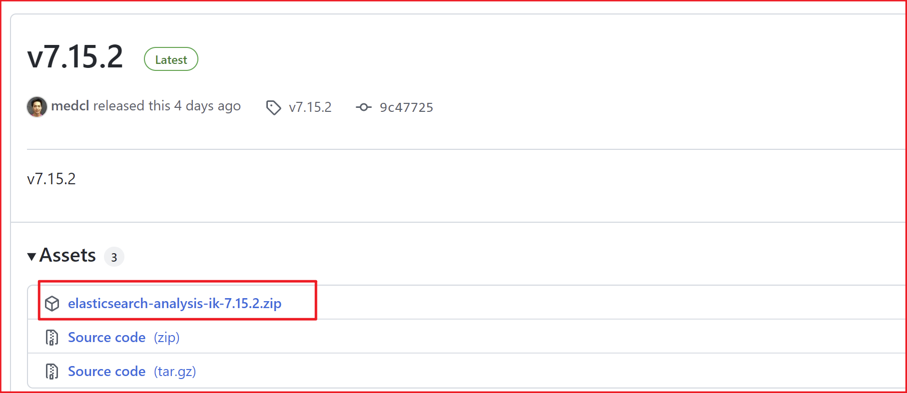

下载后在elasticsearch的plugins目录下新建文件夹，把下载的压缩包解压进去


重启elasticsearch

```sql
#分词
GET /_analyze
{
  "text": "你好，欢迎来到蜗牛学院",
  #指定分词词典
  "analyzer": "ik_smart"(或者使用ik_max_word)

}
```

自定义扩展词典


使用分词器可以扩大匹配范围，

例如，给定文本：

```
"Elasticsearch 是一个强大的搜索引擎"
```

分词器将其分割为：

```
["Elasticsearch", "是", "一个", "强大", "的", "搜索", "引擎"]
```

去除不必要的内容

```
["Elasticsearch", "强大", "搜索", "引擎"]
```

有这些"Elasticsearch", "强大", "搜索", "引擎"词的都可以匹配，而不是只匹配“Elasticsearch 是一个强大的搜索引擎”，相当于扩大了匹配范围，允许搜索引擎更加灵活和宽松地匹配相关的文档。


正向索引

倒排索引

# 搜索服务


 @MapperScan 扫描的包下,统统都会被扫描(注入 MapperFactoryBean)

> **springboot 入口类不加@MapperScan，dao也不加@Mapper也能自动扫描？？**
>
> 这种接口都是由spring实例化，所以不需要添加

# springboot整合elasticsearch

## 新建索引

1、引入依赖

```xml、
<dependency>
    <groupId>org.springframework.boot</groupId>
    <artifactId>spring-boot-starter-data-elasticsearch</artifactId>
</dependency>
```

2、配置yml

```yaml
spring:
  data:
    elasticsearch:
      cluster-name: elasticsearch
      cluster-nodes: 127.0.0.9300 #程序连接es端口
 
```

3、建立文档对应的实体类

```java
@Getter
@Setter
@ToString
//表示要持久化es的域对象
@Document(indexName = "wn82_goods")//索引名
public class Goods {
    @Id //表示是文档的id，文档可以认为是mysql中表行的概念
    private int id;
    @Field(index = true,analyzer = "ik_smart",type = FieldType.Text)//index是否建立倒排索引，默认为false，type es按照什么数据类型解析这个Field
    private String name;
    @Field(index = false,type = FieldType.Double)
    private BigDecimal price;
}

```

4、创建dao

```java
package com.woniuxy.search.dao;

import com.woniuxy.search.entity.Goods;
import org.springframework.data.elasticsearch.repository.ElasticsearchRepository;
import org.springframework.data.repository.CrudRepository;

public interface GoodsRepository extends ElasticsearchRepository<Goods,Integer> {
}

```

5、测试

```java
@SpringBootTest
class ServiceSearchApplicationTests {
@Autowired
private GoodsRepository goodsRepository;

    @Test
    void contextLoads() {
        Goods goods=new Goods();
        goods.setId(1);
        goods.setName("华硕无畏Pro14 锐龙版 2.8K OLED轻薄笔记本电脑(R7-5800H 16G 512G 100%DCI-P3 高色域600尼特90Hz护眼屏)银");
        goods.setPrice(new BigDecimal("5799.00"));
        //添加索引
        goodsRepository.save(goods);
    }

}
```

结果


## 查询索引

dao

```java
public interface GoodsRepository extends ElasticsearchRepository<Goods,Integer> {
    List<Goods> findByNameLike(String name);
}
```

测试

```java
@SpringBootTest
class ServiceSearchApplicationTests {
@Autowired
private GoodsRepository goodsRepository;

    @Test
    void contextLoads2() {

        //查询索引
        goodsRepository.findByNameLike("博鳌峰会珍品自饮版").forEach(s->{
            System.out.println(s);
        });
    }
}
```

# 事务

## 1、事务的特点

ACID

原子性：（一个事务通常由多条sql语句构成）要么全部成功，要么全部失败

一致性：事务完成后，数据要保证一致性

隔离性：事务之间如何影响

持久化：事务完成后，数据持久到数据库中

## 2、java如何实现事务控制

原生JDBC默认事务提交，框架的事务都默认不会提交，需要自己提交或配置，如mybatis，spring。

**原生JDBC**

Connection接口的setAutoCommit（false）设置不要自动提交
commit()：提交
rollback(）：回滚

## 3、spring

@Transactional：

rollbackFor：指定哪种异常会导致回滚，默认情况：RuntimeException，Error会导致回滚

propagation：传播机制，指定了若干选项，

isolation：指定隔离级别，一般不改


把XML配置的事务控制收集


事务一旦完成就不能提交或回滚？

# 分布式事务：Seata

分布式事务出现的场景；一次业务逻辑操作中涉及到多个数据库的表操作角色


TC：事务协调者，是独立运行的组件，，Seata充当该角色

TM：事务管理者，开启事务的服务，我们案例中订单服务充当该角色

## seata操作步骤

1、下载解压
2、修改改registry.conf文件
    		registry：type="eureka"
   		 config：type="file"
    修改file.conf文件
    		store="db"
3、创建新的数据库seata
 创建三张表

```sql
 #分支事务表
CREATE TABLE IF NOT EXISTS `global_table`
(
    `xid`                       VARCHAR(128) NOT NULL,
    `transaction_id`            BIGINT,
    `status`                    TINYINT      NOT NULL,
    `application_id`            VARCHAR(32),
    `transaction_service_group` VARCHAR(32),
    `transaction_name`          VARCHAR(128),
    `timeout`                   INT,
    `begin_time`                BIGINT,
    `application_data`          VARCHAR(2000),
    `gmt_create`                DATETIME,
    `gmt_modified`              DATETIME,
    PRIMARY KEY (`xid`),
    KEY `idx_gmt_modified_status` (`gmt_modified`, `status`),
    KEY `idx_transaction_id` (`transaction_id`)
) ENGINE = InnoDB
  DEFAULT CHARSET = utf8;

-- the table to store BranchSession data
#全局事务表
CREATE TABLE IF NOT EXISTS `branch_table`
(
    `branch_id`         BIGINT       NOT NULL,
    `xid`               VARCHAR(128) NOT NULL,
    `transaction_id`    BIGINT,
    `resource_group_id` VARCHAR(32),
    `resource_id`       VARCHAR(256),
    `branch_type`       VARCHAR(8),
    `status`            TINYINT,
    `client_id`         VARCHAR(64),
    `application_data`  VARCHAR(2000),
    `gmt_create`        DATETIME(6),
    `gmt_modified`      DATETIME(6),
    PRIMARY KEY (`branch_id`),
    KEY `idx_xid` (`xid`)
) ENGINE = InnoDB
  DEFAULT CHARSET = utf8;

-- the table to store lock data
#全局锁
CREATE TABLE IF NOT EXISTS `lock_table`
(
    `row_key`        VARCHAR(128) NOT NULL,
    `xid`            VARCHAR(96),
    `transaction_id` BIGINT,
    `branch_id`      BIGINT       NOT NULL,
    `resource_id`    VARCHAR(256),
    `table_name`     VARCHAR(32),
    `pk`             VARCHAR(36),
    `gmt_create`     DATETIME,
    `gmt_modified`   DATETIME,
    PRIMARY KEY (`row_key`),
    KEY `idx_branch_id` (`branch_id`)
) ENGINE = InnoDB
  DEFAULT CHARSET = utf8;
```

修改file.conf文件中seata数据库的连接配置

4、在每一个参与全局事务的数据库中创建表

```sql
create table `undo_log` (
  `id` bigint(20) not null auto_increment,
  `branch_id` bigint(20) not null,
  `xid` varchar(100) not null,
  `context` varchar(128) not null,
  `rollback_info` longblob not null,
  `log_status` int(11) not null,
  `log_created` datetime not null,
  `log_modified` datetime not null,
  `ext` varchar(100) default null,
  primary key (`id`),
  unique key `ux_undo_log` (`xid`,`branch_id`)
) engine=innodb auto_increment=1 default charset=utf8;
```

5、引入依赖
每个服务pom引入

```xml
<dependency>
    <groupId>com.alibaba.cloud</groupId>
    <artifactId>spring-cloud-starter-alibaba-seata</artifactId>
</dependency>

<dependencyManagement>
    <dependencies>
        <dependency>
            <groupId>com.alibaba.cloud</groupId>
            <artifactId>spring-cloud-alibaba-dependencies</artifactId>
            <version>2.2.2.RELEASE</version>
            <type>pom</type>
            <scope>import</scope>
        </dependency>
    </dependencies>
</dependencyManagement>
```

6、拷贝seata中的registry.conf和file.conf到各个项目中
 在file.conf中增加了service

```conf
 service {
  #transaction service group mapping
  #修改，可不改,my_test_tx_group随便起名字。
  vgroup_mapping.my_test_tx_group = "default"
  #only support when registry.type=file, please don't set multiple addresses

此服务的地址

  default.grouplist = "127.0.0.1:8091"
  #disable seata
  disableGlobalTransaction = false
}
```

7、修改yml
每个服务yml均修改

```yaml
spring:
 cloud:
    alibaba:
      seata:
        tx-service-group:  my_test_tx_group
```

8、在事务开始的方法上增加注解@GlobalTransactional

9、启动seata-server.bat，在注册中心中可以看到默认名为default的seata服务。dos窗口显示如下信息


事务的边界一般控制在业务逻辑层，即*serviceImpl；

# Nginx

## 配置：

1、下载压缩包解压，nginx.org

2、运行nginx.exe，浏览器运行localhost (默认端口为80，可以省略)，见如下界面即安装成功


3、配置

修改conf/nginx.conf文件，代理服务的端口


4、以配置的8081，8082启动两个同名服务，模拟服务器集群

5、再次浏览器运行localhost，出现服务的页面，说明代理成功


nginx默认采用“轮询”模式，轮流着把请求转发到两个服务器，但存在多线程（分布式锁解决），session不一致（spring session解决）问题。


正向代理：从客户端角度搭建代理服务器


反向代理：从服务器角度搭建代理服务器


## 分布式锁

分类：乐观锁、悲观锁


redis复习：

使用场景：热点数据缓存


servlet、controller都是单实例，在多线程环境先运行。所以定义全局变量要注意线程安全。


spring retry


## Redisson


# JMeter

jmeter是一个新能测试工具，可以模拟高并发请求

## 配置安装：

1、下载压缩包，解压

2、运行jmeter.bat，出现如下界面即成功


## 使用

1、创建线程组

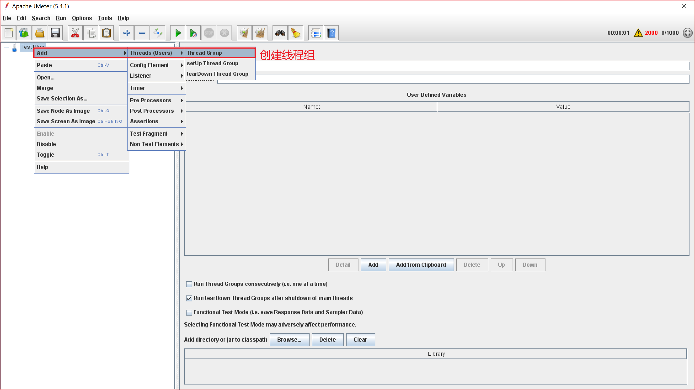


2、模拟请求


**spring-web依赖作用**

spring-boot-starter-web依赖启动器的主要作用是提供Web开发场景所需的底层所有依赖，正是如此，在pom.xml中引入spring-boot-starter-web依赖启动器时，就可以实现Web场景开发，而不需要额外导入Tomcat服务器以及其他Web依赖文件等。当然，这些引入的依赖文件的版本号还是由spring-boot-starter-parent父依赖进行的统一管理。

所以一般spring mvc、spring boot、springcloud项目都需要引入spring-web依赖。

# Hibernate

Hibernate是对JPA规范的一种实现。

jqpl语法

传递依赖不会自动下载jar包，还是得自己下


