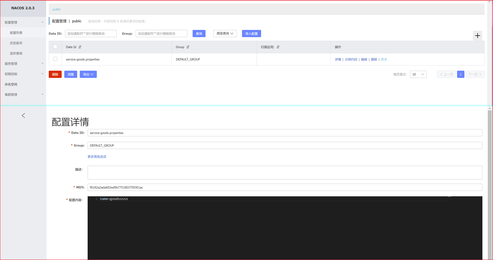

# 主从复制

搭建主从复制数据库，可实现在主数据库中添加数据，而从数据库自动复制添加主数据库的数据；通过主数据库添加数据，通过从数据库读取数据，可大大减轻数据库的压力（实际业务中，读取数据的需求比写入数据的需求量更大，可以考虑数据库集群，搭建主从复制数据库）。

主数据库和从数据库的数据完全一致。


主从复制过程是异步的，需要考虑数据一致性。

# 数据库集群

## 主从数据库搭建

对于同一种数据库，采用解压安装可以在一台电脑上安装多个数据库，而采用exe文件安装，只能安装一个，主从服务器的搭建采用解压方式。

## **搭建主数据库（master）**

1、解压mysql8.0.27压缩包，不要使用中文目录


2、进到解压根目录，新建一个文件my.ini,将以下内容拷贝过去

```java
[mysqld]
port=3306 #修改端口，注意不要被占用
basedir=C:\\mysql # 这里替换成你自己的解压目录即可
datadir=C:\\mysql\\data   # 存储数据的文件
max_connections=200
max_connect_errors=10
character-set-server=UTF8MB4
default-storage-engine=INNODB
default_authentication_plugin=mysql_native_password
[mysql]
default-character-set=UTF8MB4
[client]
port=3306 #端口与上面保持一致
default-character-set=utf8
```

注意：以下命令使用管理员角色执行

3、进到根目录/bin目录，执行以下命令，找到随机产生的密码

```java
mysqld --initialize --console
```


 记住初始密码:y085zWT6Rp_H

4、进到根目录/bin目录，将MySQL安装为一个Windows Service

```java
mysqld --install mysqlsevicename  #自定义服务名
```

  如需要删除服务，执行以下命令：

```java
sc delete mysqlsevicename	#mysqlsevicename为第4步自定义服务名
```

5、启动

```java
net start mysqlsevicename	#mysqlsevicename为第4步自定义服务名
```

6、执行命令连接MySQL

```java
mysql -uroot -p
#输入刚才的随机密码
```

7，修改密码

```java
alter user 'root'@'localhost' IDENTIFIED BY '123456'; #123456为自定义密码
```

8、使用`quit`退出连接

9、使用`mysql -uroot -p` 输入新密码123456 能登录成功就结束

​      或者`mysql -uroot -p123456`直接登录

## **搭建从服务器（slave）**

方法1：

按照主服务器安装方法安装从服务器，注意端口和服务名不要重复。

方法2：

利用以安装好的主服务器搭建。拷贝mysql文件夹修改其中的my.ini  client端口注意与mysqld端口一致，删除data根目录下的aotu.cnf文件，执行 mysqld install ssss命令

## **关联主从数据库**

1、在主服务器的my.ini中配置

```java
[mysqld]
server-id=1    #服务器 id 
log-bin=mysql-bin   #二进制文件存放路径
```

 2、重启mysql服务

```java
net stop mysqlsevicename	#关闭服务
```

```java
net start mysqlsevicename	#开启服务
```

 3、命令行连接MySQL

```java
mysql -uroot -p 
```

4、查看状态：show master status;


记住file和position对应的值，配置从数据库需要。

5、创建用户主从同步的账号，并授权:

```java
CREATE USER 'testuser'@'localhost' IDENTIFIED BY 'testuser';#创建用户
```

```java
GRANT REPLICATION SLAVE ON *.* TO 'testuser'@'localhost';#授权
```

```java
flush privileges;
```

6、在从服务器上的my.ini中配置

```java
[mysqld]
#从库
server-id=3  #必须唯一
default-storage-engine=MyISAM  #一般从数据库作为读数据库
```

7、重启从数据库服务

```java
net stop mysqlsevicename	#关闭服务
```

```java
net start mysqlsevicename	#开启服务
```

8、打开从数据库的命令行。连接数据库

```java
mysql -u root -p
```

9、执行同步SQL设置语句

```java
CHANGE MASTER TO MASTER_HOST='localhost', MASTER_PORT = 3306, MASTER_USER='testuser', MASTER_PASSWORD='testuser',MASTER_LOG_FILE='mysql-bin.000001',MASTER_LOG_POS=156;

#MASTER_PORT为主数据库设置的端口
#MASTER_LOG_FILE为主数据库file值
#MASTER_LOG_POS为主数据库position值
```

10、启动slave同步进程。

```java
start slave;    #若要停止slave进程：stop slave
```

11、产看状态

```java
show slave status\G;
```


两个yes，表示配置成功。

# MyCat

MyCat是一个数据库服务器，一个中间代理，可以进行多个数据库中的表进行管理。MyCat作为MySQL数据库的中间件，可在数据库集群中引入，引入MyCat完成相关配置后，数据的读写操作都请求MyCat，根据配置，MyCat将数据写入主数据库，而从数据库读取数据。（不引入MyCat也可以通过配置指定读写数据时的请求数据库，但配置比较复杂）


# MyCat安装

1、下载压缩包解压

下载地址：http://dl.mycat.org.cn/1.6.7.6/20201112144313/Mycat-server-1.6.7.6-release-20201112144313-win.tar.gz

2、修改conf/server.xml文件


3、修改conf/schema.xml文件

```xml
<?xml version="1.0"?>
<!DOCTYPE mycat:schema SYSTEM "schema.dtd">
<mycat:schema xmlns:mycat="http://io.mycat/">

	<schema name="TESTDB" checkSQLschema="false" sqlMaxLimit="100" dataNode="dn1">
	</schema>
	<dataNode name="dn1" dataHost="localhost1" database="test" />
	<dataHost name="localhost1" maxCon="1000" minCon="10" balance="0"
			  writeType="0" dbType="mysql" dbDriver="native" switchType="1"  slaveThreshold="100">
		<heartbeat>select user()</heartbeat>
		<!-- can have multi write hosts -->
		<writeHost host="master" url="127.0.0.1:3307" user="root"
				   password="621799">
				   <readHost host="slave1" url="127.0.0.1:3308" user="root" password="621799" />
		</writeHost>
	</dataHost>
</mycat:schema>
```


4、运行bin目录下`startup_nowrap.bat`命令


出现MyCAT Server startup successfully表示配置成功。

5、测试

启动并连接主从数据库，连接MyCat，端口为8066，密码为上述配置。可在MyCat创建的TESTDB数据库中看到主从数据库中的数据。


在mycat的user表中进行写入操作，会同步到主从数据库中，在mycat中读取user表中的数据，实际会从从数据库中读取（配置了从从数据库读取）

# 权限


若不使用框架，通过过滤器控制权限和角色


利用视图查询，视图就是一张虚拟表


springboot自动配置

前后端分离，验证使用jwt

不分离，验证使用session

表单请求放回页面

ajax请求返回json


springboot static中放置静态资源，html、css、js可以通过浏览器直接访问

springboot template中放置模板，如html，不能直接通过浏览器访问页面，要访问controller，通过controller访问template中的页面，使用模板需要引入以下依赖：

```xml
<dependency>
    <groupId>org.springframework.boot</groupId>
    <artifactId>spring-boot-starter-thymeleaf</artifactId>
</dependency>
```


springboot，springmvc 返回、重定向到某个jsp、html页面不需要要写后缀？

springboot路径问题


shiro有多个realm，需重写support方法

过滤器一定要执行dofilter()，没有此方法则去父类找。

# 后端校验

## Bean Validation

规范：Bean Validation

实现：[Hibernate Validator](http://hibernate.org/validator)

https://docs.jboss.org/hibernate/stable/validator/reference/en-US/html_single/

```xml
//-----------------------引入依赖-----------------------------------------
<dependency>
    <groupId>org.hibernate.validator</groupId>
    <artifactId>hibernate-validator</artifactId>
    <version>7.0.1.Final</version>
</dependency>
<dependency>
    <groupId>org.glassfish</groupId>
    <artifactId>jakarta.el</artifactId>
    <version>4.0.0</version>
</dependency>
```

```java
public class User {
    private int id;
    @NotNull(message = "名字不能为null")
    @NotEmpty(message = "不能为空内容（空字符串、空数组、空集合等等） 或 null")
    @NotBlank(message = "不能全为空格 或 null 或 空字符串")
    private String name;
}
```

> @NotNull(message = "名字不能为null")
> @NotEmpty(message = "不能为空内容（空字符串、空数组、空集合等等） 或 null")
> @NotBlank(message = "不能全为空格 或 null 或 空字符串")
>
> @Min：最小
>
> @Max：最小
>
> @Valid：级联校验
>
> 分组校验：
>
> 

## springboot整合validation

1、新建springboot项目，勾选Validation，会引入如下依赖

```xml
<dependency>
    <groupId>org.springframework.boot</groupId>
    <artifactId>spring-boot-starter-validation</artifactId>
</dependency>
```

2、测试

bean

```java
package com.woniuxy.validate.entity;

import lombok.Getter;
import lombok.Setter;

import javax.validation.constraints.Max;
import javax.validation.constraints.Min;
import javax.validation.constraints.NotBlank;
import javax.validation.constraints.NotNull;

/**
 * @Author: 唐小刚
 * Description:
 */
@Setter
@Getter
public class User {
    @Min(value = 1,message = "最小值为1")
    @Max(value = 5,message = "最大值为5")
    private int id;
    @NotNull(message = "名字不能为null")
//    @NotEmpty(message = "不能为空字符串或null")
//    @NotBlank(message = "不能全为空格或null或空字符串")
    private String name;
}
```

controller

```java
package com.woniuxy.validate.web;

import com.woniuxy.response.ResponseResult;
import com.woniuxy.validate.entity.User;
import lombok.extern.slf4j.Slf4j;
import org.springframework.validation.BindingResult;
import org.springframework.web.bind.annotation.GetMapping;
import org.springframework.web.bind.annotation.RestController;

import javax.validation.Valid;

/**
 * @Author: 唐小刚
 * Description:
 */
@Slf4j
@RestController
public class UserController {

    @GetMapping("/add")
    public ResponseResult add(@Valid User user, BindingResult result){
        //@Valid级联校验
        //BindingResult接收检验不通过的错误，必须紧跟在须校验参数后面

        //判断是否有校验错误
        if(result.hasErrors()){
            result.getFieldErrors().forEach(e->{
                String field = e.getField();//发生错误属性
                Object value = e.getRejectedValue();//错误值
                String message = e.getDefaultMessage();//描述信息
                log.debug("{},{},{}",field,value,message);
            });
            return new ResponseResult(201,"错误",null);
        }
        log.debug("{}",user.getName());
        return ResponseResult.SUCCESS;
    }
}
```

上面处理方法利用BindingResul对象接收校验不通过结果，从BindingResul实体中获取校验不通过信息，最后返回响应，确定是每一个方法都需要BindingResul实体接收校验结果。各自分装响应结果，推荐使用全局异常处理。

当controller方法参数校验不通过时，全局异常类捕获异常，进行处理，如下：

入口类：

```java
package com.woniuxy.validate;

import org.hibernate.validator.HibernateValidator;
import org.springframework.boot.SpringApplication;
import org.springframework.boot.autoconfigure.SpringBootApplication;
import org.springframework.context.annotation.Bean;

import javax.validation.Validation;
import javax.validation.Validator;
import javax.validation.ValidatorFactory;

@SpringBootApplication
public class SpringbootValidateApplication {

    public static void main(String[] args) {
        SpringApplication.run(SpringbootValidateApplication.class, args);
    }
    //快速失败（当有一个条件校验失败，其他的校验不在进行，直接通知校验结果）
    @Bean
    public Validator validator() {
        ValidatorFactory validatorFactory = Validation.byProvider(HibernateValidator.class)
                .configure()
                // 快速失败模式
                .failFast(false)
                .buildValidatorFactory();
        return validatorFactory.getValidator();
    }

}

```

controller

```java
package com.woniuxy.validate.web;

import com.woniuxy.response.ResponseResult;
import com.woniuxy.validate.entity.User;
import com.woniuxy.validate.group.UserUpdateGroup;
import lombok.extern.slf4j.Slf4j;
import org.springframework.validation.BindingResult;
import org.springframework.validation.annotation.Validated;
import org.springframework.web.bind.annotation.GetMapping;
import org.springframework.web.bind.annotation.PostMapping;
import org.springframework.web.bind.annotation.RequestBody;
import org.springframework.web.bind.annotation.RestController;

import javax.validation.Valid;
import javax.validation.constraints.Min;
import javax.validation.constraints.NotEmpty;
import javax.validation.constraints.NotNull;
import javax.validation.constraints.Size;
import javax.validation.groups.Default;
import java.util.HashMap;
import java.util.Map;

/**
 * @Author: 唐小刚
 * Description:
 */
@Slf4j
@Validated  //多参数校验注解，无此校验失效
@RestController
public class UserController {


    @GetMapping("/update2")
    public ResponseResult update2(@NotNull(message = "账号不能为空") String name,
                                  @Min(value = 0, message = "id必须大于0") @NotNull(message = "id不能为空") Integer id) {//多参数校验
        log.debug("{},{}", name, id);
        return ResponseResult.SUCCESS;
    }

    //    @GetMapping("/add")
//    public ResponseResult add(@Valid User user, BindingResult result){
//        //@Valid级联校验
//        //BindingResult接收检验不通过的错误，必须紧跟在须校验参数后面
//
//        if(result.hasErrors()){
//            result.getFieldErrors().forEach(e->{
//                String field = e.getField();
//                Object value = e.getRejectedValue();
//                String message = e.getDefaultMessage();
//                log.debug("{},{},{}",field,value,message);
//            });
//            return new ResponseResult(201,"错误",null);
//        }
//        log.debug("{}",user.getName());
//        return ResponseResult.SUCCESS;
//    }
    @GetMapping("/add")
    public ResponseResult add(@Valid User user) {//级联校验
        log.debug("{}", user.getName());
        return ResponseResult.SUCCESS;
    }

    //    @GetMapping("/update")
//    public ResponseResult update(@Validated({UserUpdateGroup.class, Default.class}) User user, BindingResult result){
//        //UserUpdateGroup.class指定user为UserUpdateGroup组数据，需要校验
//        //BindingResult接收检验不通过的错误，必须紧跟在须校验参数后面
//
//        Map<String,String> map=new HashMap<>();
//        if(result.hasErrors()){
//            result.getFieldErrors().forEach(e->{
//                String field = e.getField();
//                Object value = e.getRejectedValue();
//                String message = e.getDefaultMessage();
//                log.debug("{},{},{}",field,value,message);
//                map.put(field,message);
//            });
//            return new ResponseResult(201,"错误",map);
//        }
//        log.debug("{}",user.getName());
//        return ResponseResult.SUCCESS;
//    }
    @GetMapping("/update")
    public ResponseResult update(@Validated({UserUpdateGroup.class, Default.class}) User user) {//级联校验
         //所有的约束越校验都属于Default分组（不显示指定分组），Default.class 此数据也进行Default分组校验（不加则name不进行校验）
        log.debug("{}", user.getName());
        return ResponseResult.SUCCESS;
    }

    @PostMapping("/pupdate")
    public ResponseResult pupdate(@Validated({UserUpdateGroup.class, Default.class}) @RequestBody User user) {//级联校验
         //所有的约束越校验都属于Default分组（不显示指定分组），Default.class 此数据也进行Default分组校验（不加则name不进行校验）
        log.debug("{}", user.getName());
        return ResponseResult.SUCCESS;
    }
}
```

全局异常类

```java
package com.woniuxy.validate;

import com.woniuxy.response.ResponseResult;
import org.springframework.validation.BindException;
import org.springframework.validation.BindingResult;
import org.springframework.web.bind.annotation.ExceptionHandler;
import org.springframework.web.bind.annotation.RestControllerAdvice;

import javax.validation.ConstraintViolation;
import javax.validation.ConstraintViolationException;
import java.util.HashMap;
import java.util.Map;
import java.util.Set;

/**
 * @Author: 唐小刚
 * Description:全局异常，捕获controller层的异常，进行处理（AOP）
 */
@RestControllerAdvice
public class GlobalException {
    @ExceptionHandler(BindException.class)
    public ResponseResult<Map<String,String>> handleBindException(BindException e) {

        BindingResult result = e.getBindingResult();
        Map<String, String> map = new HashMap<>();
        result.getFieldErrors().forEach(error -> {
            String field = error.getField();//属性
            Object value = error.getRejectedValue();//属性对应的值
            String message = error.getDefaultMessage();//校验错误信息
            map.put(field, message);
        });
        return new ResponseResult(201, "参数异常", map);
    }

    @ExceptionHandler(ConstraintViolationException.class)
    public ResponseResult<Map<String,String>> handleConstraintViolationException(ConstraintViolationException e){
        Map<String, String> map = new HashMap<>();
        Set<ConstraintViolation<?>> constraintViolations = e.getConstraintViolations();
        constraintViolations.forEach(c->{
            //c.getPropertyPath().toString()的返回值为uri.属性
            System.out.println(c.getPropertyPath().toString());
            int index = c.getPropertyPath().toString().lastIndexOf('.');
            String field = c.getPropertyPath().toString().substring(index+1);
            //校验不通过提示信息
            String message = c.getMessage();
            map.put(field,message);
                }
        );
        return new ResponseResult<>(201,"参数异常",map);
    }
}

```

## 日志

**1、jdK提供：**

​	Logging类（基本不用）

**2、第三方：**

commons-logging门面

​		实现：Log4j、Log4j2

slf4j门面

​		实现：Logback、Log4j、Log4j2

日志需要配置开启，否则不起作用。

# 接口编写

1、顺利获取前端发送来的数据（文本（普通字符串，JSON），二进制（文件））

https://docs.spring.io/spring-framework/docs/current/reference/html/web.html#mvc-ann-methods

2、正确做出响应（文本（页面，数据），二进制）

3、数据的有效性校验

使用Bean Validation规范实现参数校验，使用统一异常处理

4、保护接口

使用权限控制，单体中：使用自定义的过滤器，Shiro，Spring Security、JWT

5、高并发场景下的接口：限流，集群（负载均衡）

6、接口的幂等性

找一个开源代码生成器
JFinal跑一个Demo

幂等：使用背景，解决方案

限流：一定的时间范围

# gateway限流

1、在网关pom引入依赖

```xml
<dependency>
    <groupId>org.springframework.boot</groupId>
    <artifactId>spring-boot-starter-data-redis-reactive</artifactId>
</dependency>
```

2、网关yml配置redis

```yml
spring:
  redis:
    host: 1.14.74.48
    port: 6379
    password: laotanredis #没有设置密码就不要写
```

注意连接redis时，若redis没有设置密码，就不要写，否则要报错

3、网关入口类配置

```java
@Bean
public KeyResolver apiKeyResolver() {
    return exchange ->
            Mono.just(exchange.getRequest().getPath().value());
}
```

4、在网关yml配置中需要限流的服务面添加配置，注意缩进

```yml
- id: order_route
  uri: lb://service-order
  predicates:
    - Path=/order/**
--------------------------------对service-order限流--------------------------------------------------------
  filters:
    - name: RequestRateLimiter
      args:
        redis-rate-limiter.replenishRate: 1   
        redis-rate-limiter.burstCapacity: 3
        key-resolver: "#{@apiKeyResolver}"
```

5、测试

快速点击发送请求，结果如下,429状态码即请求次数过多。


# 远程调用服务挂掉

远程调用，被调用服务出问题（挂掉或api不存在），可通过实现被调用服务的调用方法，去调用默认实现方法，而不是抛出异常。

GoodService

```java
//openfein调用goods服务，若以下api出现问题，则调用fallback指定的GoodServiceImpl的实现方法
//例如调用openFeinErrorTest，若在goods服务中openFeinErrorTest不存在，则执行GoodServiceImpl中的重写openFeinErrorTest
@FeignClient(value = "service-goods",fallback = GoodServiceImpl.class)
public interface GoodsService {
    @GetMapping("/goods/getprices")
    ResponseResult<List<BigDecimal>> getPrices(@RequestParam int[] ids);

    @GetMapping("/goods/updatestock")
    ResponseResult<Void> updateStock(@RequestParam int[] ids,@RequestParam int[] nums);

    @GetMapping("/goods/openfeinerrortest")
    ResponseResult<Void> openFeinErrorTest();
}
```

GoodServiceImpl

```java
@Service
public class GoodServiceImpl implements GoodsService {
    @Override
    public ResponseResult<List<BigDecimal>> getPrices(int[] ids) {
        return new ResponseResult(200,"服务异常，稍后再试",null);
    }

    @Override
    public ResponseResult<Void> updateStock(int[] ids, int[] nums) {
        return new ResponseResult(200,"服务异常，稍后再试",null);
    }

    @Override
    public ResponseResult<Void> openFeinErrorTest() {
        System.out.println("openfein调用异常测试=================================================");
        return  new ResponseResult(200,"openFeinErrorTest",null);
    }
}
```

调用者yml配置

```yml
feign:
  hystrix:
    enabled: true
```


# 配置中心


1、新建服务模块，引入如下依赖


```xml
<dependency>
    <groupId>org.springframework.cloud</groupId>
    <artifactId>spring-cloud-config-server</artifactId>
</dependency>
```

2、application.yml配置

```yml
server:
  port: 9003
spring:
  application:
    name: service-config
  cloud:
    config:
      server:
        git:
          uri: https://gitee.com/tang-xiaogang/config.git #git仓库地址
          search-paths: config
        label: master	#仓库分支
        name: config-dev #配置文件名
        
debug: true

#添加注册中心，若注册中心端口为默认8761，以下可以省略
#eureka:
#  client:
#    service-url:
#      defaultZone: http://localhost:8761/eureka/
```

3、入口类添加注解@EnableEurekaServer

```java
@EnableConfigServer //开启配置中心
@SpringBootApplication
public class ServiceConfigApplication {

    public static void main(String[] args) {
        SpringApplication.run(ServiceConfigApplication.class, args);
    }

}
```

4、启动服务，猜测访问gitee仓库的配置文件

http://localhost:9003/config-dev.properties	（http://ip:配置中心端口/git仓库配置文件名）

结果如下，说明可以配置中心基本配置成功，后面配置其他服务从配置中心获取配置数据


5、在需要从配置中西获取配置数据的服务的**pom.xml**中引入依赖

```xml
<dependency>
    <groupId>org.springframework.cloud</groupId>
    <artifactId>spring-cloud-config-client</artifactId>
</dependency>
```

6、在需要从配置中西获取配置数据的服务的中新建配置文件：bootstrap.properties

```pro
```

7、从配置中心获取配置数据测试

```java
```


微服务在注册中心注册，也在网关配置了路由，网关中设置过滤器，没登录不能访问。但不通过网关，直接在浏览器地址栏访问是可以越过网关过滤器的过滤效果的。

# 链路追踪

追踪所有微服务的运行状态。

使用**ZipKin**

在需要追踪的微服务中进行配置

1、待追踪微服务引入依赖

```xml
<dependency>
    <groupId>org.springframework.cloud</groupId>
    <artifactId>spring-cloud-starter-sleuth</artifactId>
</dependency>
<dependency>
    <groupId>org.springframework.cloud</groupId>
    <artifactId>spring-cloud-starter-zipkin</artifactId>
</dependency>
```

2、cmd运行zipkin-server.jar


浏览器访问localhost:9411，运行引入追踪依赖的服务，追踪结果如下


# Nacos

可以作为注册中心和配置中心使用，可以代替Eurake和config

1、解压，启动


2、访问http://localhost:8848/nacos/index.html

账号密码都为：nacos


3、在需要添加到注册中心的服务pom引入依赖

```xml
<dependency>
    <groupId>com.alibaba.cloud</groupId>
    <artifactId>spring-cloud-starter-alibaba-nacos-discovery</artifactId>
</dependency>

<!--alibaba版本管理-->
<dependency>
    <groupId>com.alibaba.cloud</groupId>
    <artifactId>spring-cloud-alibaba-dependencies</artifactId>
    <version>2.2.2.RELEASE</version>
    <type>pom</type>
    <scope>import</scope>
</dependency>
```

5、yml配置

```yml
spring:  
  nacos:
    discovery:
      server-addr: 127.0.0.1:8848
```

6、入口类添加注解@EnableDiscoveryClient

```Java
@EnableDiscoveryClient
@MapperScan("com.woniuxy.goods.mapper")
@SpringBootApplication
public class ServiceGoodsApplication {

    public static void main(String[] args) {
        SpringApplication.run(ServiceGoodsApplication.class, args);
    }

}
```

7、启动服务结果


作为配置中心

1、引入依赖

```xml
<dependency>
    <groupId>com.alibaba.cloud</groupId>
    <artifactId>spring-cloud-starter-alibaba-nacos-config</artifactId>
</dependency>


<!--alibaba版本管理-->
    <dependency>
        <groupId>com.alibaba.cloud</groupId>
        <artifactId>spring-cloud-alibaba-dependencies</artifactId>
        <version>2.2.2.RELEASE</version>
        <type>pom</type>
        <scope>import</scope>
    </dependency>
```

2、yml配置

```yml
spring:  
  nacos:
    config:
      server-addr: 127.0.0.1:8848
```

3、controller添加注解@RefreshScope

```java
@RefreshScope//nacos
@RestController
@RequestMapping("/goods")
public class GoodsController {
    @Autowired
    private GoodsService goodsService;
    @GetMapping("/getprices")
    public ResponseResult<List<BigDecimal>> getPrices(int[] ids){
        List<BigDecimal> prices = goodsService.getPrices(ids);
        return new ResponseResult(200,"ok",prices);
    }
```

4、配置中心添加配置



5、测试从配置中心获取数据

```java
@RefreshScope//nacos
@RestController
@RequestMapping("/goods")
public class GoodsController {

    //@Value从注册中心获取数据测试
    @Value("${name}")
    private String name;
    @GetMapping("configtest")
    public void configTest(){
        System.out.println("测试结果we++++++++++++++++++++++++++++++++++"+name);
    }

}

```

# Dubbo

RPC

Dubbo与openFeign的区别：

SpringCloud与Dubbo对比

# Sentinel

作用：Sentinel是阿里开源的项目，提供了流量控制、熔断降级、系统负载保护等多个维度来保障服务之间的稳定性。

1、运行jar包


2、访问localhost:8080	账号密码都为sentinel，结果如下


3、在消费者服务pom添加依赖

```xml
<!--sentinel-->
<dependency>
    <groupId>com.alibaba.cloud</groupId>
    <artifactId>spring-cloud-starter-alibaba-sentinel</artifactId>
    <version>2.2.7.RELEASE</version>
</dependency>
```

4、消费者服务yml配置

```yml
spring:
  cloud:
    sentinel:
      transport:
        dashboard: localhost:8080
      eager: true
```

重启服务，访问localhost:8080，可见sentinel关联到的服务


从消费者服务进行限流


sentinel配置的各种规则默认在内存中，重启会失效，可将配置规则存在配置中心nacos中，从nacos获取配置，

消费者pom引入依赖

```xml
<!--sentinel  从nacos获取配置-->
<dependency>
    <groupId>com.alibaba.csp</groupId>
    <artifactId>sentinel-datasource-nacos</artifactId>
    <version>1.8.2</version>
</dependency>
```

消费者yml配置

```yml
spring:
  application:
    name: dubbo-consumer
  cloud:
    sentinel:
      transport:
        dashboard: localhost:8080
      eager: true
     #--------------------------------从nacos获取配置------------------------------------
      datasource:
        ds1:
          nacos:
            server-addr: http://localhost:8848
            data-id: wn-sentinel #nacos配置文件名
            group-id: DEFAULT_GROUP
            data-type: json
            rule-type: flow
```

# SpringCloud总结


# Controller Servlcet

Controller和Servlcet都是单例的，Servlcet实例由tomcat实例化。

利用Servlet创建的项目，浏览器访问必须添加Context path名，通常项目名与Context path名相同，即通过http://ip:port/项目名/请求路径 方式访问，而spring项目Context path默认为空，所以浏览器访问不需要添加项目名


Springboot禁用默认数据源


