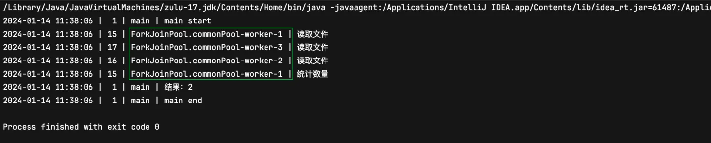

# CompletableFuture

# CompletableFuture入门

## 学习内容

- 为什么会选择 CompletableFuture
- 创建CompletableFuture异步任务
- CompletableFuture异步任务回调
- CompletableFuture异步任务编排
- CompletableFuture的异常处理

## 学习目标

- 了解 CompletableFuture 的优点
- 掌握创建异步任务
    - 创建异步任务的2种方式
    - 知道异步任务中线程池的作用
    - 理解异步编程思根
- 掌握异步任务回调
    - thenApply / thenAccept / thenRun 3类方法使用和区别
    - 解锁一系列Async版本回调 （thenXxxAsync）
- 掌握异步任务编排
    - 会对2个异步任务的依赖关系、并行关系进行编排
    - 会对n个任务的合并进行编排
- 掌握异步任务的异常处理
    - 会对异步任务进行异常处理
    - 会对回调链上对单个异步任务的异常进行现场恢复

## 课程学习说明

课程学习说明

- 熟悉多线程理论知识
- 接触过 Future 和 线程池 的经历
- 会使用Lambda表达式和 Stream-API

## 1、Future vs CompletableFuture

### 1.1 准备工作

为了便于后续的调试和学习，我们需要定义一个工具类辅助我们对知识的理解。

```java
package com.apexsoft;

import java.nio.file.Files;
import java.nio.file.Paths;
import java.text.SimpleDateFormat;
import java.util.Date;
import java.util.StringJoiner;
import java.util.concurrent.TimeUnit;

/**
 * 异步辅助工具类
 */
public class Commonutils {

    //读取指定路径文件
    public static String readFile(String pathToFile) {
        try {
            return Files.readString(Paths.get(pathToFile));
        } catch (Exception e) {
            e.printStackTrace();
            return "";
        }
    }

    //休眠指定毫秒数
    public static void sleepMillis(long millis) {
        try {/**/
            TimeUnit.MILLISECONDS.sleep(millis);
        } catch (InterruptedException e) {
            e.printStackTrace();
        }
    }

    //休眠指定秒数
    public static void sleepsecondCint(int seconds) {
        try {
            TimeUnit.SECONDS.sleep(seconds);
        } catch (InterruptedException e) {
            e.printStackTrace();
        }
    }

    //打印线程日志信息
    public static void printThreadLog(String message) {
        // 时间戳｜线程ID｜线程名｜日志信息
        String result = new StringJoiner(" | ")
                .add(String.valueOf(System.currentTimeMillis()))
                .add(String.format("%2d", Thread.currentThread().getId()))
                .add(String.valueOf(Thread.currentThread().getName()))
                .add(message)
                .toString();
        System.out.println(result);
    }

    //打印线程日志信息
    public static void printTimeThreadLog(String message) {
        // 时间戳｜线程ID｜线程名｜日志信息
        String result = new StringJoiner(" | ")
                .add(String.valueOf(new SimpleDateFormat("yyyy-MM-dd hh:mm:ss").format(new Date(System.currentTimeMillis()))))
                .add(String.format("%2d", Thread.currentThread().getId()))
                .add(String.valueOf(Thread.currentThread().getName()))
                .add(message)
                .toString();
        System.out.println(result);
    }
}

```

### 1.2 Future 的局限性

需求：替换新闻稿（news.txt）中敏感词汇，把敏感词汇替换成 **，敏感词存储在 filter_words.txt 中

```java
package com.apexsoft;

import java.util.concurrent.*;

public class FutureDemo {
    public static void main(String[] args) throws ExecutionException, InterruptedException {
        /**
         * 读取比较耗时，采用线程池多线程处理
         * 步骤3的处理依赖于步骤1、2的处理结果
         * 步骤4的处理依赖于步骤3的处理结果
         */
        ExecutorService executorService = Executors.newFixedThreadPool(5);
        //1、读取敏感词=> thread1
        Future<String[]> filterWordFuture = executorService.submit(() -> {
            String words = Commonutils.readFile("filter_words.txt");
            String[] wordArr = words.split(",");
            return wordArr;
        });

        //2、读取新闻稿=> thread2
        Future<String> newsFuture = executorService.submit(() -> {
            String news = Commonutils.readFile("news.txt");
            return news;
        });

        //3、敏感词替换=> thread3
        Future<String> replaceFuture = executorService.submit(() -> {
            String news = newsFuture.get();
            String[] filters = filterWordFuture.get();
            for (String filter : filters) {
                while (news.indexOf(filter) >= 0) {
                    news = news.replace(filter, "**");
                }
            }
            return news;
        });
        //4、打印替换后新闻稿=> main
        System.out.println("replaceFuture.get() = " + replaceFuture.get());
    }
}
```

通过上面的代码，我们会发现，Future相比于所有任务都直接在主线程处理，有很多优势，但同时也存在不足，至少表现如下：

- **在没有阻塞的情况下，无法对Future的结果执行进一步的操作**。Future不会告知你它什么时候完成，你如果想要得到结果，必须通过一个get()方法，该方法会阻塞直到结果可用为止。它不具备将回调函数附加到Future后并在Future的结果可用时自动调用回调的能力。
- **无法解决任务相互依赖的问题**。filterWordFuture和newsFuture的结果不能自动发送给replaceFuture，需要在replaceFuture中手动获取，所以使用Future不能轻而易举地创建异步工作流。
- **不能将多个Future合并在一起**。假设你有多种不同的Future，你想在它们全部并行完成后然后再运行某个函数，Future很难独立完成这一需要。
- **没有异常处理**。Future提供的方法中没有专门的API应对异常处理，还是需要开发者自己手动异常处理。

### 1.3 CompletableFuture 的优势

CompletableFuture 实现了Future和CompletionStage接口
CompletableFuture 相对于 Future 具有以下优势：


- 为快速创建、链接依赖和组合多个Future提供了大量的便利方法。
- 提供了适用于各种开发场景的回调函数，它还提供了非常全面的异常处理支持。
- 无缝衔接和亲和 lambda 表达式 和 Stream-API。
- 真正意义上的异步编程，把异步编程和函数式编程、响应式编程多种高阶编程思维集于一身，设计上更优雅。

## 2、创建异步任务

### 2.1 runAsync

如果你要异步运行某些耗时的后台任务，并且不想从任务中返回任何内容，则可以使用compTetableFuture.runAsync()方法。它接受一个Runnable接口的实现类对象，方法返回CompletableFuture 对象
completabLeFuture 中的异步任务底层通过开启线程的方式完成的

```java
static CompletableFuture<void> runAsync (Runnable runnable);
```

演示案例：创建一个不从任务中返回任何内容的CompletableFuture异步任务对象

```java
package com.apexsoft;

import java.util.concurrent.CompletableFuture;

public class RunAsyncDemo {
    public static void main(String[] args) {

        /**
         * completabLeFuture 中的异步任务底层通过开启线程的方式完成的
         */

        Commonutils.printTimeThreadLog("主线程开始执行");
        //runAsync开启异步任务
        CompletableFuture<Void> voidCompletableFuture = CompletableFuture.runAsync(() -> {
            //休眠模拟长时间的任务（读取文件、网络请求）
            Commonutils.printTimeThreadLog("读取文件开始");
            Commonutils.sleepsecond(3);
            String s = Commonutils.readFile("news.txt");
            Commonutils.printTimeThreadLog("读取文件结束");

        });

        Commonutils.printTimeThreadLog("主线程继续执行");
        //祝线休眠，让completefuture背后的线程池执行结束
        Commonutils.sleepsecond(4);
        Commonutils.printThreadLog("主线程执行结束");
    }
}

```

> 疑问：异步任务是并发执行还是并行执行？
如果是单核CPU，那么异常任务之间就是并发执行；如果是多核CPU（多CPU）异步任务就是并行执行
重点（敲黑板）:
作为开发者，我们只需要清楚如何开启异步任务，CPU硬件会把异步任务合理的分配给CPU上的核运行。
> 

### 2.2 supplyAsync

completableFuture.runAsync() 开启不带返回结果异步任务。但是，如果您想从后台的异步任务中返回一个结果怎么办？此时，completableFuture.supplyAsync()是你最好的选择了。

```java
static <U> CompletableFuture<U> supplyAsync(Supplier<U> supplier);
```

它入参一个 Supplier＜U>供给者，用于供给带返回值的异步任务
并返回 completableFuture，其中U是供给者给程序供给值的类型。
需求：开启异步任务读取 news.txt 文件中的新闻稿，返回文件中内容并在主线程打印输出

```java
package com.apexsoft;

import java.util.concurrent.CompletableFuture;
import java.util.concurrent.ExecutionException;

public class SupplySyncDemo {
    public static void main(String[] args) throws ExecutionException, InterruptedException {
        Commonutils.printTimeThreadLog("主线程开始执行");
        CompletableFuture<String> newsFuture = CompletableFuture.supplyAsync(() -> {
            String news = Commonutils.readFile("news.txt");
            Commonutils.printTimeThreadLog("异步任务执行完毕");
            return news;
        });
        Commonutils.printTimeThreadLog("主线程未阻塞，继续执行");
        String news = newsFuture.get();
        System.out.println("news = " + news);
        Commonutils.printTimeThreadLog("主线程执行结束");

    }
}

```

### 2.3 异步任务中的线程池

大家已经知道，runAsync()和 supplyAsync()方法都是开启单独的线程中执行异步任务。但是，我们从未创建线程对吗？不是吗！
CompletableFuture 会从全局的ForkJoinPool.commonPool()线程池获取线程来执行这些任务
当然，你也可以创建一个线程池，并将其传递给 runAsync()和supplyAsync()方法，以使它们在从您指定的线程池获得的线程中执行任务。
CompletableFuture API中的所有方法都有两种变体，一种是接受传入的Executor 参数作为指定的线程池，而另一种则使用默认的线程池（ForkJoinPoo1.commonPool()）。

```java
//runAsync()的重载方法
static CompletableFuture<void> runAsync(Runnable runnable);
static CompletableFuture<void> runAsync(Runnable runnable, Executor executor);
//supplyAsyc()的重载方法
static <U> CompletableFuture<U> supplyAsync(Supplier<U> supplier)
static <U> CompletableFuture<U> supplyAsync(Supplier<U> supplier, Executoe executor)
```

需求：指定线程池，开启异步任务读取 news.txt 中的新闻稿，返回文件中内容并在主线程打印输出

```java
package com.apexsoft;

import java.util.concurrent.*;

public class SupplyAsyncThreadPoolDemo {
    public static void main(String[] args) throws ExecutionException, InterruptedException {
        Commonutils.printTimeThreadLog("主线程开始执行……");

        //使用自定义线程池，若不指定则使用默认线程池ForkJoinPool.commonPool
        ExecutorService executor = Executors.newFixedThreadPool(5);
        CompletableFuture<String> newsFuture = CompletableFuture.supplyAsync(() -> {
            String s = Commonutils.readFile("news.txt");
            Commonutils.printTimeThreadLog("异步任务执行结束");
            return s;
        }, executor);
        String s = newsFuture.get();
        System.out.println("s = " + s);
        Commonutils.printTimeThreadLog("祝线程执行结束");
        /*使用默认的ForkJoinPool.commonPool，会由主线程在任务执行结束后关闭，
        * 使用自己创建的线程，主线程执行结束后不会自动关闭，需要自己关闭
        * */
        executor.shutdown();
    }
}

```

> 最佳实践：创建属于自己的业务线程池，如果所有 completableFuture 共享一个线程池，那么一旦有异步任务执行一些很慢的I/O操作，就会导致线程池中所有线程都阻塞在 I/O操作上，从而造成线程饥饿，进而影响整个系统的性能。所以，强烈建议你要根据不同的业务类型创建不同的线程池，以避免互相干扰。
> 

注意：使用默认的线程池ForkJoinPool.commonPool，主线程执行完毕后ForkJoinPool.commonPool会关闭，实际使用中可能会出现主线程执行结束，异步任务还未都执行结束，ForkJoinPool.commonPool线程池就关闭的情况，所以要在主线程中做处理，例如主线程休眠，或使用get()获取异步任务结果进行阻塞，确保异步任务都执行完毕；使用自己创建的线程，主线程执行结束后不会自动关闭，需要手动关闭

### 2.4 异步编程思想

综合上述，看到了吧，我们没有显式地创建线程，更没有涉及线程通信的概念，整个过程根本就没涉及线程知识吧，以上专业的说法是：**线程的创建和线程负责的任务进行解耦，它给我们带来的好处线程的创建和启动全部交给线程池负责，具体任务的编写就交给程序员，专人专事**。
异步编程是可以让程序并行（也可能是并发）运行的一种手段，其可以让程序中的一个工作单元作为异步任务，与主线程分开独立运行，并且在异步任务运行结束后，会通知主线程它的运行结果或者失败原因，毫无疑问，一个异步任务其实就是开启一个线程来完成的，使用异步编程可以提高应用程序的性能和响应能力等。
作为开发者，只需要有一个意识：开发者只需要把耗时的操作交给CompletableFuture开启一个异步任务，然后继续关注主线程业务，当异步任务运行完成时会通知主线程它的运行结果。我们把具备了这种编程思想的开发称为异步编程思想。

## 3、任务异步回调

completableFuture.get()方法是阻塞的。调用时它会阻塞等待直到这个Future完成，并在完成后返回结果。但是，很多时候这不是我们想要的。
对于构建异步系统，我们应该能够将回调附加到CompletableFuture上，当这个Future完成时，该回调应自动被调用。这样，我们就不必等待结果了，我们可以在Future的回调函数内部编写完成Future之后需要执行的逻辑。您可以使用 thenApply()，thenAccept()和 thenRun()方法将回调函数附加到CompletableFuture

### 3.1 thenApply

使用 thenApply()方法可以处理和转换CompletableFuture的结果。它以Function<T，R>作参数。Function<T，R>是一个函数式接口，表示一个转换操作，它接受类型T的参数并产生类型R的结果

```java
static <R> CompletableFuture<R> thenApply(Function<T,R> fn);
```

需求：异步读取 filter_words.txt 文件中的内容，读取完成后，把内容转换成数组（敏感词数组），异步任务返回敏感词数组

```java
/**
 * 总结
 * thenAppLy（FunctionsT, R>）可以对异步任务的结果进一步应用Function转换
 * 转换后的结果可以在主线程获取，也可以进行下一步的转换。
 */
public class ThenApplyDemo {
    public static void main(String[] args) throws ExecutionException, InterruptedException {
        Commonutils.printTimeThreadLog("主线程开始执行");
        //异步任务执行任务
        CompletableFuture<String> readFlieFuture = CompletableFuture.supplyAsync(() -> {
            Commonutils.sleepsecond(4);
            String s = Commonutils.readFile("news.txt");
            Commonutils.printTimeThreadLog("异步任务读取文件完成");
            return s;
        });
        //异步回调转换处理
        CompletableFuture<String[]> newsFuture = readFlieFuture.thenApply(str -> {
            String[] newsArr = str.split(",");
            Commonutils.printTimeThreadLog("异步任务转换处理完成");
            return newsArr;
        });
        Commonutils.printTimeThreadLog("主线程继续执行");
        String[] strings = newsFuture.get();
        System.out.println("strings = " + Arrays.toString(strings));
        Commonutils.printTimeThreadLog("主线程执行结束");
    }
}
```

你还可以通过附加一系列 thenApply()回调方法，在CompletableFuture上编写一系列转换序列。一个thenApply()方法的结果可以传递给序列中的下一个，如果你对链式操作很了解，你会发现结果可以在链式操作上传递。

```java
    public static void main(String[] args) throws ExecutionException, InterruptedException {
        Commonutils.printTimeThreadLog("主线程开始执行");
        //异步任务执行任务
        CompletableFuture<String[]> completableFuture = CompletableFuture.supplyAsync(() -> {
            Commonutils.sleepsecond(4);
            String s = Commonutils.readFile("news.txt");
            Commonutils.printTimeThreadLog("异步任务读取文件完成");
            return s;
        }).thenApply(str -> {
            String[] newsArr = str.split(",");
            Commonutils.printTimeThreadLog("异步任务转换处理完成");
            return newsArr;
        });
        Commonutils.printTimeThreadLog("主线程继续执行");
        String[] strings = completableFuture.get();
        System.out.println("strings = " + Arrays.toString(strings));
        Commonutils.printTimeThreadLog("主线程执行结束");
    }
```

注意

```java
    public static void main(String[] args) throws ExecutionException, InterruptedException {
        Commonutils.printTimeThreadLog("主线程开始执行");
        //异步任务执行任务
        CompletableFuture<String[]> completableFuture = CompletableFuture.supplyAsync(() -> {
            String s = Commonutils.readFile("news.txt");
            Commonutils.printTimeThreadLog("异步任务读取文件完成");
            return s;
        }).thenApply(str -> {
            String[] newsArr = str.split(",");
            Commonutils.printTimeThreadLog("异步任务转换处理完成");
            return newsArr;
        });
        Commonutils.printTimeThreadLog("主线程继续执行");
//        String[] strings = completableFuture.get();
//        System.out.println("strings = " + Arrays.toString(strings));
        //没有阻塞，主线程执行结束，ForkJoinPool.commonPool线程池关闭，异步任务还未完全执行结束
        Commonutils.printTimeThreadLog("主线程执行结束");
    }
```


### 3.2 thenAccept

如果你不想从回调函数返回结果，而只根在Future完成后运行一些代码，则可以使用 thenAccept()，这些方法是入参一个 Consumer，它可以对异步任务的执行结果进行消费使用，方法返回CompletableFuture。

```java
static CompletableFuture<void> thenAccept(Consumer<T> action)
```

通常用作回调链中的最后一个回调。
需求：异步读取 filter_words.txt 文件中的内容，读取完成后，转换成敏感词数组，然后打印敏感词数组

```java
/**
 * 总结
 * thenAccept(Consumer<T> c)可以对异步任务的结果进行消费使用
 * 返回返回一个不带结果的CompletableFuture对象
 */
public class ThenAcceptDemo {
    public static void main(String[] args) {
        Commonutils.printTimeThreadLog("主线程开始执行");
        CompletableFuture.supplyAsync(()->{
            Commonutils.printTimeThreadLog("读取铭敏感词汇文件");
            String wourdStr = Commonutils.readFile("filter_words.txt");
            return wourdStr;
        }).thenApply(str->{
            Commonutils.printTimeThreadLog("字符转换数组处理");
            String[] words = str.split(",");
            return words;
        }).thenAccept(arr->{
            Commonutils.printTimeThreadLog("打印处理后的结果");
            Commonutils.printTimeThreadLog(Arrays.toString(arr));
        });
        Commonutils.printTimeThreadLog("主线程继续执行");
        //主线程休眠，等待异步任务执行结束（避免线程池ForkJoinPool.commonPool过早关闭）
        Commonutils.sleepsecond(2);
        Commonutils.printTimeThreadLog("主线程执行结束");
    }
}
```

### 3.3 thenRun

前面我们已经知道，通过thenApply(Function<T,R>)对链式操作中的上一个异步任务的结果进行转换，返回一个新的结果；
通过thenAccept( Consumer)对链式操作中上一个异步任务的结果进行消费使用，不返回新结果；
如果我们只是想从CompletableFuture的链式操作得到一个完成的通知，甚至都不使用上一步链式操作的结果，那么CompletableFuture.thenRun()会是你最佳的选择，它需要一个Runnable并返回 completableFuture。

```java
static CompletableFuture<Void> thenRun(Runnable action);
```

演示案例：我们仅仅想知道 filter_words.txt 的文件是否读取完成

```java
/**
 * thenRun(Runnable action)；
 * 当异步任务完成后，只想得到一个完成的通知，不使用上一步异步任务的结果，就可以thenRun
 * 通过会把它用在链式操作的未端
 */
public class ThenRunDemo {
    public static void main(String[] args) {
        Commonutils.printTimeThreadLog("主线程序开始执行");
        CompletableFuture<Void> readFuture = CompletableFuture.supplyAsync(() -> {
            Commonutils.printTimeThreadLog("开始读取文件");
            String s = Commonutils.readFile("news.txt");
            return s;
        }).thenRun(() -> {
            Commonutils.printTimeThreadLog("读取文件完成");
        });
        Commonutils.printTimeThreadLog("主线程序继续执行");
        Commonutils.sleepsecond(2);
        Commonutils.printTimeThreadLog("主线程序执行结束");
    }
}
```

### 3.4 更进一步提升并行化

CompletableFuture 提供的所有回调方法都有两个异步变体

```java
static <U> CompletableFuture<U> thenApply(Function<T,U> fn);
//回调方法的异步变异（异步回调）
static <U> CompletableFuture<U> thenApplyAsync(Function<T,U> fn);
static <U> CompletableFuture<U> thenApplyAsync(Function<T,U> fn, Executor executor);
```

注意：这些带了Async的异步回调**通过在单独的线程中执行回调任务** 来帮助您进一步促进并行化计算。
回顾需求：异步读取 filter_words.txt 文件中的内容，读取完成后，转换成敏感词数组，主线程获取结果打印输出这个数组

```java
public class SupplyAsyncDemo2 {
    public static void main(String[] args) {
        Commonutils.printTimeThreadLog("main start");
        CompletableFuture.supplyAsync(()->{
            Commonutils.printTimeThreadLog("读取文件");
            String s = Commonutils.readFile("filter_words.txt");
            return s;
        }).thenApply(str->{
            /**
             * 一般而言，thenApply任务的执行和supplyAsync()任务执行可以使用同一线程执行
             * 如果supplyAsync()任务立即返回结果，则thenApply的任务在主线程中执行
             */
            Commonutils.printTimeThreadLog("敏感词字符串处理为数组");
            String[] filter = str.split(",");
            return filter;
        }).thenRun(()->{
            Commonutils.printTimeThreadLog("敏感词转换处理结束");
        });
        Commonutils.printTimeThreadLog("main continue");
        Commonutils.sleepsecond(2);
        Commonutils.printTimeThreadLog("main end");
    }
}
```


```java
public class SupplyAsyncDemo2 {
    public static void main(String[] args) {
        Commonutils.printTimeThreadLog("main start");
        CompletableFuture.supplyAsync(()->{
            Commonutils.printTimeThreadLog("读取文件");
//            String s = Commonutils.readFile("filter_words.txt");
//            return s;
            //立即返回结果不耗时
            return "abcdefg";
        }).thenApply(str->{
            /**
             * 一般而言，thenApply任务的执行和supplyAsync()任务执行可以使用同一线程执行
             * 如果supplyAsync()任务立即返回结果，则thenApply的任务在主线程中执行
             */
            Commonutils.printTimeThreadLog("敏感词字符串处理为数组");
            String[] filter = str.split(",");
            return filter;
        }).thenRun(()->{
            Commonutils.printTimeThreadLog("敏感词转换处理结束");
        });
        Commonutils.printTimeThreadLog("main continue");
        Commonutils.sleepsecond(2);
        Commonutils.printTimeThreadLog("main end");
    }
}
```


> 总结一般而言：commonPool为了提高性能，thenApply中回调任务和supplyAsync中的异步任务使用的是同一个线程特殊情况：如果supplyAsync中的任务是立即返回结果（不是耗时的任务），thenApply 回调任务也会在主线程执行。
> 

要更好地控制执行回调任务的线程，可以使用异步回调。如果使用thenApplyAsync()回调，那么它将在从ForkJoinPool.commonPool获得的另一个线程中执行

```java
public class ThenApplyAsyncDemo {
    public static void main(String[] args) {
        Commonutils.printTimeThreadLog("main start");
        CompletableFuture.supplyAsync(()->{
            Commonutils.printTimeThreadLog("读取文件");
            String s = Commonutils.readFile("filter_words.txt");
            return s;
        }).thenApplyAsync(str->{
            Commonutils.printTimeThreadLog("敏感词字符串处理为数组");
            String[] filter = str.split(",");
            return filter;
        });
        Commonutils.printTimeThreadLog("main continue");
        Commonutils.sleepsecond(2);
        Commonutils.printTimeThreadLog("main end");
    }
}
```


> 使用thenApplyAsync不是绝对从ForkJoinPool.commonPool获取另一个线程，取决于CompletableFuture的优化策略，这种写法有概率能获取另一个线程(测试可以多跑几次)，从而提高效率，因此可以使用重载带有线程池的方法，自己指定线程池，就会从指定的线程池中获取另一个线程
> 

```java
public class ThenApplyAsyncExecutorDemo {
    public static void main(String[] args) {
        //自定义线程池
        ExecutorService executor = Executors.newFixedThreadPool(5);
        Commonutils.printTimeThreadLog("main start");
        CompletableFuture.supplyAsync(()->{
            //supplyAsync从默认的ForkJoinPool.commonPool获取线程
            Commonutils.printTimeThreadLog("读取文件");
            String s = Commonutils.readFile("filter_words.txt");
            return s;
        }).thenApplyAsync(str->{
            //thenApplyAsync从指定的executor线程池获取线程
            Commonutils.printTimeThreadLog("敏感词字符串处理为数组");
            String[] filter = str.split(",");
            return filter;
        },executor);
        Commonutils.printTimeThreadLog("main continue");
        Commonutils.sleepsecond(2);
        //关闭线程池
        executor.shutdown();
        Commonutils.printTimeThreadLog("main end");
    }
}
```


## 4、异步任务编排

### 4.1 编排2个依赖关系的异步任务 thenCompose()

回顾需求：异步读取 filter_words.txt 文件中的内容，读取完成后，转换成敏感词数组让主线程待用。
关于读取和解析内容，假设使用以下的 readFileFuture(String) 和 splitFuture(String)方法完成。

```java
    public static CompletableFuture<String> readFileFuture(String fileName){
        return CompletableFuture.supplyAsync(()->{
            Commonutils.printTimeThreadLog("读取文件");
            return Commonutils.readFile(fileName);
        });
    }

    public static CompletableFuture<String[]> splitFuture(String content){
        return CompletableFuture.supplyAsync(()->{
            Commonutils.printTimeThreadLog("字符串分割转换数组处理");
            return content.split(",");
        });
    }
```

现在，让我们先了解如果使用thenApply()结果会发生什么

```java
        CompletableFuture<CompletableFuture<String[]>> completableFutureCompletableFuture = readFileFuture("filter_words.txt")
                .thenApplyAsync(content -> {
                    CompletableFuture<String[]> completableFuture = splitFuture(content);
                    return completableFuture;
        });
```

回顾在之前的案例中，thenApply(Function<T,R>)中Function回调会对上一步任务结果转换后得到一个简单值，但现在这种情况下，最终结果是嵌套的CompletableFuture，所以这是不符合预期的，那怎么办呢？
我们想要的是：把上一步异步任务的结果，转成一个CompletableFuture对象，这个completableFuture对象中包含本次异步任务处理后的结果。也就是说，**我们想组合上一步异步任务的结果到下一个新的异步任务中，结果由这个新的异步任务返回**，此时，你需要使用thencompose()方法代替，我们可以把它理解为 异步任务的组合

```java
static <U> CompletableFuture<U> thenCompose(Function<T,CompletableFuture<U>> fn);
```

所以，thencompose()用来连接两个有依赖关系的异步任务，结果由第二个任务返回

```java
public class ThenComposeDemo3 {
    public static void main(String[] args) throws ExecutionException, InterruptedException {
        /**
         * 不使用thenCompose()
         */
        CompletableFuture<CompletableFuture<String[]>> completableFutureCompletableFuture = readFileFuture("filter_words.txt")
                .thenApplyAsync(content -> {
                    return splitFuture(content);
                });
        CompletableFuture<String[]> completableFuture1 = completableFutureCompletableFuture.get();
        String[] strings1 = completableFuture1.get();
        Commonutils.printTimeThreadLog(Arrays.toString(strings1));

        /**
         * 使用thenCompose()
         */
        CompletableFuture<String[]> completableFuture2 = readFileFuture("filter_words.txt").thenCompose(content -> {
            return splitFuture(content);
        });
        String[] strings = completableFuture2.get();
        Commonutils.printTimeThreadLog(Arrays.toString(strings));

    }
    public static CompletableFuture<String> readFileFuture(String fileName){
        return CompletableFuture.supplyAsync(()->{
            Commonutils.printTimeThreadLog("读取文件");
            return Commonutils.readFile(fileName);
        });
    }

    public static CompletableFuture<String[]> splitFuture(String content){
        return CompletableFuture.supplyAsync(()->{
            Commonutils.printTimeThreadLog("字符串分割转换数组处理");
            return content.split(",");
        });
    }
}
```

> thenApply(Function<T,R>)
重心在于对上一步异步任务的结果T进行应用转换，经Function回调转换后的结果R是一个简单的值
thencompose(FunctionsT, CompletabLeFuture>)
重心在于对上一步异步任务的结果T进行应用，经Function回调转换后的结果是一个completableFuture对象
结论
编排两个依赖关系的异步任务(CompLetableFuture对象)，请使用 thencompose()方法
> 

[CompletableFuture的thenCompose和thenApply有什么区别？_后端知识库](https://backend.devrank.cn/traffic-information/7310177037304760357)
因此，这里积累了一个经验：如果我们想连接（编排）两个依赖关系的异步任务（CompletableFuture 对象），请使用 thenCompose()方法。

```java
public class ThenComposeDemo4 {
    public static void main(String[] args) throws ExecutionException, InterruptedException {
        /**
         * 使用回调的方式实现
         */
        Commonutils.printTimeThreadLog("main start");
        CompletableFuture<String[]> completableFuture = CompletableFuture.supplyAsync(() -> {
            Commonutils.printTimeThreadLog("读取文件");
            return Commonutils.readFile("filter_words.txt");
        }).thenCompose(str ->  CompletableFuture.supplyAsync(()->{
                Commonutils.printTimeThreadLog("转换处理");
                return  str.split(",");
            }));
        Commonutils.printTimeThreadLog("main continue");
        String[] arrays = completableFuture.get();
        Commonutils.printTimeThreadLog(Arrays.toString(arrays));
        Commonutils.printTimeThreadLog("main end");
    }
}
```

当然，thenCompose 也存在异步回调变体版本：

```java
static <U> CompletableFuture<U> thenCompose(Function<T,CompletableFuture<U>> fn);
static <U> CompletableFuture<U> thenComposeAsync(Function<T,CompletableFuture<U>> fn);
static <U> CompletableFuture<U> thenComposeAsync(Function<T,CompletableFuture<U>> fn, Executor executor);
```

### 4.2编排2个非依赖关系的异步任务thenCombine()

我们已经知道，当其中一个Future依赖于另一个Future，使用thencompose()用于组合两个Future。如果两个Future之间没有依赖关系，你希望两个Future独立运行并在两者都完成之后执行回调操作时，则使用thenCombine()；

```java
// T是第一个任务的结果 U是第二个任务的结果 V是经BiFunction应用转换后的结果
CompletableFuture<V> thenCombine(CompletableFuture<U> other, BiFunction<T, U, V> func);
```

需求：替换新闻稿（news.txt）中敏感词汇，把敏感词汇替换成 *，敏感词存储在 filter_words.txt 中
需求分析：

step1：读取敏感词文件filter_words.txt，并将文本内容转换成字符串数组；
step2：读取新闻稿文件news.txt中的内容
step3：新闻稿内容敏感词替换操作
step4：主线程获取替换后的结果
step1和step2无依赖关系，step3依赖step1和step2的结果

```java
public class ThenCombineDemo {
    public static void main(String[] args) throws ExecutionException, InterruptedException {
        Commonutils.printTimeThreadLog("main start");
        //1、读取敏感词文件filter_words.txt，并将文本内容转换成字符串数组
        CompletableFuture<String[]> future1 = CompletableFuture.supplyAsync(() -> {
            Commonutils.printTimeThreadLog("读取敏感词汇");
            String words = Commonutils.readFile("filter_words.txt");
            String[] filterWords = words.split(",");
            return filterWords;
        });
        //2、读取读取新闻稿文件news.txt中的内容
        CompletableFuture<String> future2 = CompletableFuture.supplyAsync(() -> {
            Commonutils.printTimeThreadLog("读取新闻稿内容");
            String content = Commonutils.readFile("news.txt");
            return content;
        });
        //3、替换操作
        CompletableFuture<String> future = future1.thenCombine(future2, (filterWords, content) -> {
            Commonutils.printTimeThreadLog("替换操作");
            for (String filterWord : filterWords) {
                while (content.indexOf(filterWord) >= 0) {
                    content = content.replace(filterWord, "**");
                }
            }
            return content;
        });

        //4、获取替换后的结果
        String news = future.get();
        Commonutils.printTimeThreadLog("news：" + news);
        Commonutils.printTimeThreadLog("main end");
    }
}

```


> 说明：两个读取任务在不同的线程中进行，替换操作时由于读取任务已经完成，所以不用归还线程池，直接使用work-1或work-2线程执行替换操作任务
> 

注意：当两个Future都完成时，才将两个异步任务的结果传递给thenCombine()的回调函数做进一步处理。和以往一样，thenCombine 也存在异步回调变体版本

```java
CompletableFuture<V> thenCombine(CompletableFuture<U> other, BiFunction<T, U, V> func);
CompletableFuture<V> thenCombineAsync(CompletableFuture<U> other, BiFunction<T, U, V> func);
CompletableFuture<V> thenCombineAsync(CompletableFuture<U> other, BiFunction<T, U, V> func, Executor executor);
```

### 4.3 合并多个异步任务 allOf/anyOf

我们使用thenCompose()和thenCombine()将两个CompletableFuture组合和合并在一起。
如果要编排任意数量的CompletableFuture怎么办？可以使用以下方法来组合任意数量的CompletableFuture

```java
public static CompletaleFuture<Void> allOf(CompletableFuture<?>……cfs);
public static CompletaleFuture<object> anyOf(CompletableFuture<?>……cfs);
```

completableFuture.allOf用于()以下情形中：**有多个需要独立并行运行的Future，并在所有这些Future 都完成后执行一些操作。**
需求：统计news1.txt、news2.txt、 news3.txt 文件中包含CompletableFuture关键字的文件的个数

```java
public class AllOfDemo {
    public static void main(String[] args) {
        // 需求：统计news1.txt、news2.txt、news3.txt文件中包含compLetableFuture关键字的文件的个数
        // step 1：创建List集合存储文件名
        Commonutils.printTimeThreadLog("main start");
        List<String> fileList = Arrays.asList("news1.txt", "news2.txt", "news3.txt");
        // step 2：根据文件名e创建多个completabLeFuture，并存入List集合中
        List<CompletableFuture<String>> readFileFutureList = fileList.stream().map(v -> {
            return CompletableFuture.supplyAsync(() -> {
                Commonutils.printTimeThreadLog("读取文件");
                String news = Commonutils.readFile(v);
                return news;
            });
        }).collect(Collectors.toList());
        // step 3：把List集合转换成数组待用，以便传入aLLOf方法中
//        int len = readFileFutureList.size();
//        CompletableFuture[] futureArr = readFileFutureList.toArray(new CompletableFuture[len]);
        CompletableFuture[] futureArr = readFileFutureList.stream().toArray(CompletableFuture[]::new);
        // step 4：使用allof方法合并多个异步任务
        CompletableFuture<Void> allOfFuture = CompletableFuture.allOf(futureArr);
        // step 5：当多个异步任务都完成后，使用回调操作文件结果，统计符合案件的文件个数
        CompletableFuture<Long> countFuture = allOfFuture.thenApply(v -> {
            Commonutils.printTimeThreadLog("统计数量");
            long count = readFileFutureList.stream()
                    .filter(f -> f.join().contains("CompletableFuture"))
                    .count();
            return count;

        });
        // step 6：主线程打印输出文件个数
        Long count = countFuture.join();
        Commonutils.printTimeThreadLog("结果：" + count);
        Commonutils.printTimeThreadLog("main end");
    }
}
```

顾名思义，当给定的多个异步任务中的有任意一个Future完成时，需要执行一些操作，可以使用 anyOf 方法



```java
public static CompletableFuture<object> anyOf(completableFuture<?>……cfs);
```

anyOf() 返回一个新的CompletableFuture，新的CompletableFuture的结果和cfs中已完成的那个异步任务结果相同。
演示案例：anyOf执行过程

```java
public class AnyOfDemo {
    public static void main(String[] args) throws ExecutionException, InterruptedException {
        Commonutils.printTimeThreadLog("main start");
        CompletableFuture<String> future1 = CompletableFuture.supplyAsync(() -> {
            Commonutils.sleepsecond(3);
            return "future1的结果";
        });
        CompletableFuture<String> future2 = CompletableFuture.supplyAsync(() -> {
            Commonutils.sleepsecond(2);
            return "future2的结果";
        });
        CompletableFuture<String> future3 = CompletableFuture.supplyAsync(() -> {
            Commonutils.sleepsecond(4);
            return "future3的结果";
        });

        Commonutils.printTimeThreadLog("main continue");
        CompletableFuture<Object> future = CompletableFuture.anyOf(future3, future2, future1);
        Object o = future.get();
        Commonutils.printTimeThreadLog("结果：" + o);
        Commonutils.printTimeThreadLog("main end");
    }
}
```

在上面的示例中，当三个CompletableFuture中的任意一个完成时，anyOfFuture就完成了。由于future2的睡眠时间最少，因此它将首先完成，最终结果将是”Future2的结果”。
注意：

- anyOf()方法返回类型必须是 CompletableFuture 。
- anyOf()的问题在于，如果您拥有返回不同类型结果的CompletableFuture，那么您将不知道最终CompletableFuture的类型。

## 5、异步任务的异常处理

在前面的章节中，我们并没有更多地关心异常处理的问题，其实，CompletableFuture 提供了优化处理异常的方式。
首先，让我们了解异常如何在回调链中传播。

```java
public class ExceptionDemo1 {
    public static void main(String[] args) {
        CompletableFuture.supplyAsync(()->{
            int i = 1/0;
            return "result1";
        }).thenApply(str->{
            return str + " result2";
        }).thenApply(str->{
            return str + " result3";
        }).thenAccept(str->{
            Commonutils.printTimeThreadLog(str);
        });
    }
}
```

如果在 supplyAsync 任务中出现异常，后续的 thenApply 和 thenAccept 回调都不会执行，CompletableFuture 将转入异常处理
如果在第一个thenApply 任务中出现异常，第二个 thenApply 和 最后的thenAccept 回调不会被执行，CompletableFuture 将转入异常处理，依次类推。

### 5.1 exceptionally()

exceptionally用于处理回调链上的异常，回调链上出现的任何异常，回调链不继续向下执行，都在exceptionally中处理异常。

```java
// Throwable表示具体的异常对象e ,R要返回的结果
CompletableFuture<R> exceptionally(Function<Throwable,R> func);
```

```java
public class ExceptionallyDemo2 {
    public static void main(String[] args) {
        CompletableFuture.supplyAsync(()->{
            int i = 1/0;
            return "result1";
        }).thenApply(str->{
            String name = null;
            int length = name.length();
            return str + " result2";
        }).thenApply(str->{
            return str + " result3";
        }).exceptionally(e->{
            System.out.println("出现异常：" + e.getMessage());
            return "出现异常";
        });
    }
}

```


因为exceptionally只处理一次异常，所以常常用在回调链的未端。


### 5.2 handle()

CompletableFuture API 还提供了一种更通用的方法 handle()表示从异常中恢复
handle()常常被用来恢复回调链中的一次特定的异常（handle处理前面的回调链(上一步即上一步之前)中的异常都能捕获到），回调链恢复后可以进一步向下传递。
异步任务是否发生异常，handle方法都会执行

```java
CompletableFuture<R> handle(BiFunction<T, Throwable, R> fn);
```

需求：对回调链中的一次异常进行恢复处理

```java
public class ExceptionHandleDemo {

    public static void main(String[] args) throws ExecutionException, InterruptedException {
        CompletableFuture<String> future = CompletableFuture.supplyAsync(() -> {
            int i = 1 / 0;
            return "result1";
        }).handle((result, e) -> {
            //如果发生异常，则res参数将为null，否则ex参数将为null。
            Commonutils.printTimeThreadLog("上一步结果：" + result);
            if (e != null) {
                Commonutils.printTimeThreadLog("出现异常：" + e.getMessage());
                return "异常错误";
            }
            return " result2";
        }).thenApply(str -> {
            Commonutils.printTimeThreadLog("上一步结果：" + str);
            Integer.parseInt(null);
            return str + " result2";
        }).handle((result, e) -> {
            Commonutils.printTimeThreadLog("上一步结果：" + result);
            if (e != null) {
                Commonutils.printTimeThreadLog("出现异常：" + e.getMessage());
                return "异常错误";
            }
            return " result3";
        }).thenApply(str -> {
            return str + " result4";
        });
        Commonutils.printTimeThreadLog("main continue");
        String result = future.get();
        Commonutils.printTimeThreadLog("结果：" + result);
        Commonutils.printTimeThreadLog("main end");
    }
}

```

和以往一样，为了提升并行化，异常处理可以方法单独的线程执行，以下是它们的异步回调版本


```java
CompletableFuture<R> exceptionally（Function<Throwable,R>fn）
CompletableFuture<R> exceptionallyAsync（Function<Throwable, R> fn） // jdk17+
CompletableFuture<R> exceptionallyAsync（Function<Throwable,R> fn, Executor executor）// jdk17+

CompletableFuture<R> handle（BiFunction<T, Throwable, R> fn）
CompletableFuture<R> handleAsync （BiFunction<T, Throwable, R> fn）
CompletableFuture<R> handleAsync （BiFunction<T,Throwable, R> fn, Executor executor）
```

# CompletableFuture进阶

## 学习内容

- 异步任务的交互
- get方法和join方法区别
- CompletableFuture 在流式编程（Stream API）的优势
- CompletableFutrue实战应用之大数据商品比价

## 学习目标

- 掌握异步任务的交互操作
- 了解get方法和join方法区别
- 掌握CompletableFuture 结合Stream API进阶应用
- 掌握CompletableFuture 在实战中的应用

## 1、异步任务的交互

异步任务交互指将异步任务对获取结果的速度相比较，按一定的规则（先到先用）进行下一步处理。

### 1.1 applyToEither

applyToEither()把两个异步任务做比较，先获得执行结果的，就对该结果进行下一步的操作。

```java
CompletableFuture<R> applyToEither（CompletableFuture<T> other, Function<T,R> func）
```

演示案例：使用最先完成的异步任务的结果

```java
public class ApplyToEitherDemo {
    public static void main(String[] args) throws ExecutionException, InterruptedException {
        Commonutils.printTimeThreadLog("main start");
        //1、第一个异步任务
        CompletableFuture<Integer> future1 = CompletableFuture.supplyAsync(() -> {
            int x = new Random().nextInt(3);
            Commonutils.sleepsecond(x);
            Commonutils.printTimeThreadLog("任务1耗时：" + x);
            return x;
        });
        //1、第一个异步任务
        CompletableFuture<Integer> future2 = CompletableFuture.supplyAsync(() -> {
            int y = new Random().nextInt(3);
            Commonutils.sleepsecond(y);
            Commonutils.printTimeThreadLog("任务2耗时：" + y);
            return y;
        });

        Commonutils.printTimeThreadLog("main continue");
        // 哪个异步任务结果先到达，使用哪个异步任务的结果
        CompletableFuture<Integer> future = future1.applyToEither(future2, k -> {
            return k;
        });
        Commonutils.printTimeThreadLog("结果是：" + future.get());
        Commonutils.printTimeThreadLog("main end");
    }
}

```


> 说明：为什么没有看见任务2执行？应为使用的是默认的线程池，任务1线执行完成，future利用先到的结果进行处理，主线程获取到future结果后，主线程执行完步，默认线程池关闭，任务2还没来及执行或执行取消。
让主线程睡眠阻塞即可看见任务2的执行
> 

```java
public class ApplyToEitherDemo {
    public static void main(String[] args) throws ExecutionException, InterruptedException {
        Commonutils.printTimeThreadLog("main start");
        //1、第一个异步任务
        CompletableFuture<Integer> future1 = CompletableFuture.supplyAsync(() -> {
            int x = new Random().nextInt(3);
            Commonutils.sleepsecond(x);
            Commonutils.printTimeThreadLog("任务1耗时：" + x);
            return x;
        });
        //1、第一个异步任务
        CompletableFuture<Integer> future2 = CompletableFuture.supplyAsync(() -> {
            int y = new Random().nextInt(3);
            Commonutils.sleepsecond(y);
            Commonutils.printTimeThreadLog("任务2耗时：" + y);
            return y;
        });

        Commonutils.printTimeThreadLog("main continue");
        // 哪个异步任务结果先到达，使用哪个异步任务的结果
        CompletableFuture<Integer> future = future1.applyToEither(future2, k -> {
            return k;
        });
        //阻塞主线程
        Commonutils.sleepsecond(3);
        Commonutils.printTimeThreadLog("结果是：" + future.get());
        Commonutils.printTimeThreadLog("main end");
    }
}
```


applyToEither与anyOf有什么区别
速记心法：任务1、任务2就像两辆公交，哪路公交先到，就乘坐（使用）哪路公交。
以下是applyToEither 和其对应的异步回调版本

```java
CompletableFuture<R> applyToEither（CompletableFuture<T> other,Function<T,R> func）
CompletableFuture<R> applyToEitherAsync（CompletableFuture<T> other,Function<T,R> func）
completableFuture<R> app1yToEitherAsync（completableFuture<T>other, Function<T,R> func, EXecutor executor）
```

### 1.2 acceptEither

acceptEither()把两个异步任务做比较，异步任务先到结果的，就对先到的结果进行下一步操作（消费使用）。

```java
CompletableFuture<Void> acceptEither（CompletableFuture<T> other, Consumer<T> action）
CompletableFuture<Void> acceptEitherAsync （CompletableFuture<T> other, Consumer<T> action）
CompletableFuturecVoid> acceptEitherAsync（completableFuture<T> other, Consumer<T> action, Executor executor）
```

演示案例：使用最先完成的异步任务的结果

```java
public class AcceptToEitherDemo {
    public static void main(String[] args) {
        //异步任务1
        CompletableFuture<String>  future1 = CompletableFuture.supplyAsync(() -> {
            int x = new Random().nextInt(3);
            Commonutils.sleepsecond(x);
            Commonutils.printTimeThreadLog("任务1耗时:" + x + "秒");
            return "任务1执行结果";
        });

        //异步任务2
        CompletableFuture<String> future2 = CompletableFuture.supplyAsync(() -> {
            int y = new Random().nextInt(3);
            Commonutils.sleepsecond(y);
            Commonutils.printTimeThreadLog("任务2耗时:" + y + "秒");
            return "任务2执行结果";
        });

        //谁先完成采用誰的结果
        future1.acceptEither(future2,str->{
            Commonutils.printTimeThreadLog("结果为：" + str);
        });

        //主线程休眠，确保两个任务都执行完毕
        Commonutils.sleepsecond(3);
    }
}

```


### 1.3 runAfterEither

如果不关心最先到达的结果，只想在有一个异步任务先完成时得到完成的通知，可以使用 runAfterEither()，以下是它的相关方法：

```java
CompletableFuture<Void> runAfterEither（completab1eFuture<T> other, Runnable action）
CompletableFuture<Void> runAfterEitherAsync（CompletableFuture<T> other, Runnable action）
CompletableFuture<Void> runAfterEitherAsync（CompletableFuture<T> other, Runnable action, Executor executor）
```

> 提示
异步任务交互的三个方法和之前学习的异步的回调方法 thenApply、thenAccept、thenRun 有异曲同工之妙。
thenApply thenAccept thenRun
对上一个异步任务的结果进行操作（转换、消费使用等）
appLyToEither acceptEither runAfterEither
对两个异步任务先到的结果进行操作（转换，消费使用）
> 

```java

public class RunAfterEitherDemo {
    public static void main(String[] args) {
        //1、第一个异步任务
        CompletableFuture<Integer> future1 = CompletableFuture.supplyAsync(() -> {
            int x = new Random().nextInt(3);
            Commonutils.sleepsecond(x);
            Commonutils.printTimeThreadLog("任务1耗时：" + x);
            return x;
        });
        //1、第一个异步任务
        CompletableFuture<Integer> future2 = CompletableFuture.supplyAsync(() -> {
            int y = new Random().nextInt(3);
            Commonutils.sleepsecond(y);
            Commonutils.printTimeThreadLog("任务2耗时：" + y);
            return y;
        });

        future1.runAfterEither(future2,()->{
            Commonutils.printTimeThreadLog("又一个任务已经完成了");
        });

        Commonutils.sleepsecond(3);
    }
}
```


## 2、get()和 join()区别

get()和 join()都是CompletableFuture提供的以阻塞方式获取结果的方法。那么该如何选用呢？请看如下案例：

```java
public class JoinVsGetDemo {
    public static void main(String[] args) {
        CompletableFuture<String> future = CompletableFuture.supplyAsync(() -> {
            return "hello";
        });

        try {
            String ret = future.get();
            Commonutils.printTimeThreadLog("ret = " + ret);
        } catch (InterruptedException e) {
            throw new RuntimeException(e);
        } catch (ExecutionException e) {
            throw new RuntimeException(e);
        }
        
        String result = future.join();
        Commonutils.printTimeThreadLog("result = " + result);
    }
}

```

使用时，我们发现，get()抛出检查时异常，需要程序必须处理；而join()方法抛出运行时异常，程序可以不处理。所以，join()更适合用在流式编程中。

## 3、ParallelStream VS CompletableFuture

CompletableFuture 虽然提高了任务并行处理的能力，如果它和 Stream API结合使用，能否进一步多个任务的并行处理能力呢？
同时，对于 Stream API 本身就提供了并行流Parallelstream，它们有什么不同呢？
我们将通过一个耗时的任务来体现它们的不同，更重要地是，我们能进一步加强CompletableFuture 和 Stream API 的结合使用，同时搞清楚CompletableFuture 在流式操作的优势
需求：创建10个MyTask耗时的任务，统计它们执行完的总耗时
定义一个MyTask类，来模拟耗时的长任务

```java
public class MyTask {
    private int duration;

    public MyTask(int duration) {
        this.duration = duration;
    }

    //模拟耗时长的任务
    public int doWork(){
        Commonutils.printTimeThreadLog("doWork");
        Commonutils.sleepsecond(duration);
        return duration;
    }
}
```

同时，我们创建10个任务，每个持续1秒。

```java
IntStream range = IntStream.range(0, 10);
List<MyTask> tasks = range.mapToObj(v -> new MyTask(1)).collect(Collectors.toList());
```

### 3.1 并行流的局限性

先用串行执行，每个任务都在祝线程main中执行

```java
public class Sequence {
    public static void main(String[] args) {
        //并行流的局限性
        // 需求：创建10个MyTask耗时的任务，统计它们执行完的总耗时
        // 方案一：在主线程中使用串行执行
        // step 1：创建10个MyTask对象，每个任务持续1s，存入List集合
        IntStream range = IntStream.range(0, 10);
        List<MyTask> tasks = range.mapToObj(v -> new MyTask(1)).collect(Collectors.toList());
        // step 2：执行1e个MyTask，统计总耗时
        long start = System.currentTimeMillis();
        tasks.stream().forEach(v->v.doWork());
        long end = System.currentTimeMillis();
        double costs = (end-start)/1000.0;
        System.out.printf("processed %d tasks cost %.2f seconds", tasks.size(),costs);
    }
}
```

它花费了10秒，因为每个任务在主线程一个接一个的执行。
因为涉及 Stream API，而且存在耗时的长任务，所以，我们可以使用 parallelstream()

```java
public class ParallelStream {
    public static void main(String[] args) {
        //并行流的局限性
        // 需求：创建10个MyTask耗时的任务，统计它们执行完的总耗时
        // 方案一：在主线程中使用串行执行
        // step 1：创建10个MyTask对象，每个任务持续1s，存入List集合
        IntStream range = IntStream.range(0, 10);
        List<MyTask> tasks = range.mapToObj(v -> new MyTask(1)).collect(Collectors.toList());
        // step 2：执行1e个MyTask，统计总耗时
        long start = System.currentTimeMillis();
        //使用并行流parallelStream
        tasks.parallelStream().forEach(v->v.doWork());
        long end = System.currentTimeMillis();
        double costs = (end-start)/1000.0;
        System.out.printf("processed %d tasks cost %.2f seconds", tasks.size(),costs);
    }
}
```

它花费了2秒多，因为此次并行执行使用了8个线程（7个是ForkJoinPodl线程池中的，一个是 main 线程），需要注意是：运行结果由自己电脑CPU的核数决定

### 3.2 CompletableFuture 在流式操作的优势

让我们看看使用CompletableFuture是否执行的更有效率

```java
public class CompletableFutureDemo {
    public static void main(String[] args) {
        // CompLetabLeFuture 在流式操作中的优势
        // 需求：创建LeMyTask耗时的任务，统计它们执行完的，总耗时
        // 方案三：使用CompLetableFuture
        // step 1：创建10个My Task对象，每个任务持续Is，存入List集合
        IntStream range = IntStream.range(0, 10);
        List<MyTask> tasks = range.mapToObj(v -> new MyTask(1)).collect(Collectors.toList());
        // step 2：根据MyTask对象构建10个异步任务
        List<CompletableFuture<Integer>> futures = tasks.stream().map(v -> {
            CompletableFuture<Integer> future = CompletableFuture.supplyAsync(() -> v.doWork());
            return future;
        }).collect(Collectors.toList());
        // step 3：执行异步任务，执行完成后，获取异步任务的结果，存入List集合中，统计总耗时

        long start = System.currentTimeMillis();
        List<Integer> collect = futures.stream().map(f ->{
            Integer duration = f.join();
            return duration;
        }).collect(Collectors.toList());
        long end = System.currentTimeMillis();
        double ccosts = (end - start)/1000.0;
        System.out.printf("processed %d tasks costs %.2f seconds", collect.size(), ccosts);
    }
}

```

运行发现，ParallelStream 与CompletableFuture 两者使用的时间大致一样。能否进一步优化呢？
CompletableFutures 比 ParallelStream优点之一是你可以指定Executor去处理任务。你能选择更合适数量的线程。我们可以选择大于
Runtime.getRuntime().availableProcessors() 数量的线程，如下所示：
Runtime.getRuntime().availableProcessors() ：获取系统的处理器数量，这通常被认为是系统最大可用线程数量的一个很好的估计

```java
public class CompletableFutureDemo2 {
    public static void main(String[] args) {
        // CompLetabLeFuture 在流式操作中的优势
        // 需求：创建LeMyTask耗时的任务，统计它们执行完的，总耗时
        // 方案三：使用CompLetableFuture
        // step 1：创建10个My Task对象，每个任务持续Is，存入List集合
        IntStream range = IntStream.range(0, 10);
        List<MyTask> tasks = range.mapToObj(v -> new MyTask(1)).collect(Collectors.toList());
        // step 2：根据MyTask对象构建10个异步任务
        // 使用自定义线程池 设置线程池中线程的最小数量为10
        ExecutorService executor = Executors.newFixedThreadPool(Math.min(Runtime.getRuntime().availableProcessors() * 2, tasks.size()));
        List<CompletableFuture<Integer>> futures = tasks.stream().map(v -> {
            CompletableFuture<Integer> future = CompletableFuture.supplyAsync(() -> v.doWork(),executor);
            return future;
        }).collect(Collectors.toList());
        // step 3：执行异步任务，执行完成后，获取异步任务的结果，存入List集合中，统计总耗时

        long start = System.currentTimeMillis();
        List<Integer> collect = futures.stream().map(f ->{
            Integer duration = f.join();
            return duration;
        }).collect(Collectors.toList());
        long end = System.currentTimeMillis();
        double ccosts = (end - start)/1000.0;
        System.out.printf("processed %d tasks costs %.2f seconds", collect.size(), ccosts);
        executor.shutdown();
        /**
         * 总结：
         * CompLetabLeFuture 可以控制更多的线程数量。而ParallelStream 不能
         */
    }
}
```

使用CompletableFutures指定合适线程池后比Parallelstream效率更高。
测试代码时，电脑配置是4核8线程，而我们创建的线程池中线程数最少也是10个，所以，每个线程负责一个任务（耗时1s），总体来说，处理10个任务总共需要约1秒。

## 3.3 合理配置线程池中的线程数

正如我们看到的，CompletableFuture 可以更多的控制线程池的数量，而 ParallelStream 不能。
问题1：如何选用CompletableFuture 和 Parallelstream？
如果你的任务是IO密集型的，你应该使用CompletableFuture；
如果你的任务是CPU密集型的，使用比处理器更多的线程是没有意义的，所以选择Parallelstream，因为它不需要创建线程池，更容易使用。

问题2：10密集型任务和CPU密集型任务的区别？
CPU密集型也叫计算密集型，此时，系统运行时大部分的状况是CPU占用率近乎100%，I/O在很短的时间就可以完成，而CPU还有许多运算要处理，CPU 使用率很高。比如说要计算1+2+3+..+10万亿、天文计算、圆周率后几十位等，都是属于CPU密集型程序。
CPU密集型任务的特点：大量计算，CPU占用率一般都很高，I/O时间很短
IO密集型指大部分的状况是CPU在等I/O（硬盘/内存）的读写操作，但CPU的使用率不高。简单的说，就是需要大量的输入输出，例如读写文件、传输文件、网络请求。
IO密集型任务的特点：大量网络请求，文件操作，CPU运算少，很多时候CPU在等待资源才能进一步操作。

问题3：既然要控制线程池的数量，多少合适呢？
如果是CPU密集型任务，就需要尽量压榨CPU，参考值可以设为 Ncpu+1
如果是IO密集型任务，参考值可以设置为2*Ncpu，其中Ncpu 表示 核心数。
注意的是：以上给的是参考值，详细配置超出本次课程的范围，选不赘述。

## 4、大数据商品比价

### 4.1需求描述和需求分析

需求描述：实现一个大数据比价服务，价格数据可以从京东、天猫、拼多多等平台去获取指定商品的价格、优惠金额，然后计算出实际付款金额（商品价格-优惠金额），最终返回价格最优的平台与价格信息。


### 4.2构建工具类和实体

定义价格实体类

```java
public class PriceResult {

    private int price;//平台价格
    private int discount;//折扣
    private int realPrice;//最终价

    private String platform;//商品平台

    public int getPrice() {
        return price;
    }

    public void setPrice(int price) {
        this.price = price;
    }

    public int getDiscount() {
        return discount;
    }

    public void setDiscount(int discount) {
        this.discount = discount;
    }

    public int getRealPrice() {
        return realPrice;
    }

    public void setRealPrice(int realPrice) {
        this.realPrice = realPrice;
    }

    public String getPlatform() {
        return platform;
    }

    public void setPlatform(String platform) {
        this.platform = platform;
    }

    public PriceResult(String platform) {
        this.platform = platform;
    }

    public PriceResult() {
    }

    public PriceResult(int price, int discount, int realPrice, String platform) {
        this.price = price;
        this.discount = discount;
        this.realPrice = realPrice;
        this.platform = platform;
    }

    @Override
    public String toString() {
        return "PriceResult{" +
                "price=" + price +
                ", discount=" + discount +
                ", realPrice=" + realPrice +
                ", platform='" + platform + '\'' +
                '}';
    }
}

```

修改工具类CommonUtils，添加 getCurrentTime()方法获取当前时间并格式化，修改 printThreadLog()方法，把时间戳替换成当前时间

```java
    public static String getCurrentTime(){
        LocalDate now = LocalDate.now();
        return now.format(DateTimeFormatter.ofPattern("[HH:ss:SSS]"));
    }

    public static void printHssTimeThreadLog(String message) {
        // 时间戳｜线程ID｜线程名｜日志信息
        String result = new StringJoiner(" | ")
                .add((getCurrentTime()))
                .add(String.format("%2d", Thread.currentThread().getId()))
                .add(String.valueOf(Thread.currentThread().getName()))
                .add(message)
                .toString();
        System.out.println(result);
    }
```

### 4.3构建 HttpRequest

HttpRequest 用于模拟网络请求（耗时的操作）

```java
public class HttpRequest {
    //获取指定商品的淘宝价格
    public static PriceResult getTaoBaoPrice(String productName){
        Commonutils.printHssTimeThreadLog("获取淘宝上" + productName + "价格");
        mockCostTimeOperation();

        PriceResult priceResult = new PriceResult("淘宝");
        priceResult.setPrice(5199);
        Commonutils.printHssTimeThreadLog("获取淘宝上" + productName + "价格完成:5199元");
        return priceResult;
    }
    //获取淘宝价格优惠
    public static int getTaoBaoDiscount(String productName){
        Commonutils.printHssTimeThreadLog("获取淘宝上" + productName + "优惠");
        mockCostTimeOperation();
        Commonutils.printHssTimeThreadLog("获取淘宝上" + productName + "优惠完成:-200");
        return 200;
    }

    //获取指定商品的京东价格
    public static PriceResult getJingDongPrice(String productName){
        Commonutils.printHssTimeThreadLog("获取京东上" + productName + "价格");
        mockCostTimeOperation();

        PriceResult priceResult = new PriceResult("京东");
        priceResult.setPrice(5299);
        Commonutils.printHssTimeThreadLog("获取京东上" + productName + "价格完成:5299元");
        return priceResult;
    }
    //获取京东价格优惠
    public static int getJingDongDiscount(String productName){
        Commonutils.printHssTimeThreadLog("获取京东上" + productName + "优惠");
        mockCostTimeOperation();
        Commonutils.printHssTimeThreadLog("获取京东上" + productName + "优惠完成:-100");
        return 100;
    }

    //获取指定商品的拼多多价格
    public static PriceResult getPDDPrice(String productName){
        Commonutils.printHssTimeThreadLog("获取拼多多上" + productName + "价格");
        mockCostTimeOperation();

        PriceResult priceResult = new PriceResult("拼多多");
        priceResult.setPrice(5099);
        Commonutils.printHssTimeThreadLog("获取拼多多上" + productName + "价格完成:5099元");
        return priceResult;
    }
    //获取拼多多价格优惠
    public static int getPDDDiscount(String productName){
        Commonutils.printHssTimeThreadLog("获取拼多多上" + productName + "优惠");
        mockCostTimeOperation();
        Commonutils.printHssTimeThreadLog("获取拼多多上" + productName + "优惠完成:-300");
        return 300;
    }

    //模拟耗时操作
    public static void  mockCostTimeOperation(){
        Commonutils.sleepsecond(1);
    }
}

```

### 4.4使用串行方式操作商品比价

```java
public class ComparePirceService {
    private PriceResult priceResult;
    private int discount;
    //获取价格最低的产品
    public PriceResult getCheapestPrice(String productName){
        //获取淘宝产品价格和优惠
        priceResult = HttpRequest.getTaoBaoPrice(productName);
        discount = HttpRequest.getTaoBaoDiscount(productName);
        PriceResult taoBaoCheapestPrice = getDiscountPrice(priceResult, discount);
        //获取京东产品价格和优惠
        priceResult = HttpRequest.getJingDongPrice(productName);
        discount = HttpRequest.getJingDongDiscount(productName);
        PriceResult jingDongCheapestPrice = getDiscountPrice(priceResult, discount);
        //获取拼多多产品价格和优惠
        priceResult = HttpRequest.getPDDPrice(productName);
        discount = HttpRequest.getPDDDiscount(productName);
        PriceResult pDDCheapestPrice = getDiscountPrice(priceResult, discount);

        //比较后取最低价
       return Stream.of(taoBaoCheapestPrice, jingDongCheapestPrice, pDDCheapestPrice)
                .min(Comparator.comparing(PriceResult::getRealPrice))
                .get();
    }

    //获取优惠后的价格
    public PriceResult getDiscountPrice(PriceResult priceResult, int discount){
        PriceResult price = new PriceResult();
        price.setPlatform(priceResult.getPlatform());
        price.setRealPrice(priceResult.getPrice() - discount);
        price.setDiscount(discount);
        price.setPrice(priceResult.getPrice());
        return price;
    }
}

```

```java
public class ComparePriceDemo {
    public static void main(String[] args) {
        //串行执行
        ComparePirceService comparePirceService = new ComparePirceService();

        long start = System.currentTimeMillis();
        PriceResult iphone15 = comparePirceService.getCheapestPrice("iphone15");
        long end = System.currentTimeMillis();
        double costs = (end - start)/1000.0;
        System.out.printf("耗时：%.2f", costs);
        System.out.println(iphone15);
    }
}

```


### 4.5使用Future+线程池增强并行

```java
public class ComparePirceService2 {
    private PriceResult priceResult;
    private int discount;
    //获取价格最低的产品
    public PriceResult getCheapestPrice(String productName){
        ExecutorService executor = Executors.newFixedThreadPool(5);
        ArrayList<Future<PriceResult>> list = new ArrayList<>();

        list.add(executor.submit(()->{
            //获取淘宝产品价格和优惠
            PriceResult taoBaoPrice = HttpRequest.getTaoBaoPrice(productName);
            int taoBaoDiscount = HttpRequest.getTaoBaoDiscount(productName);
            return getDiscountPrice(taoBaoPrice, taoBaoDiscount);
        }));

        list.add(executor.submit(()->{
            //获取京东产品价格和优惠
            PriceResult jingDongPrice = HttpRequest.getJingDongPrice(productName);
            int jingDongDiscount = HttpRequest.getJingDongDiscount(productName);
            return getDiscountPrice(jingDongPrice, jingDongDiscount);
        }));

        list.add(executor.submit(()->{
            //获取拼多多产品价格和优惠
            PriceResult pddPrice = HttpRequest.getPDDPrice(productName);
            int pddDiscount = HttpRequest.getPDDDiscount(productName);
            return getDiscountPrice(pddPrice, pddDiscount);
        }));

        //计算最优平台和价格
        PriceResult collect = list.stream()
                .map(v -> {
                    try {
                        PriceResult price = v.get(5, TimeUnit.MINUTES);
                        return price;
                    } catch (Exception e) {
                        return null;
                    }finally {
                        executor.shutdown();
                    }
                })
                .filter(Objects::nonNull)
                .min(Comparator.comparing(PriceResult::getRealPrice))
                .get();
        return collect;
    }

    //获取优惠后的价格
    public PriceResult getDiscountPrice(PriceResult priceResult, int discount){
        PriceResult price = new PriceResult();
        price.setPlatform(priceResult.getPlatform());
        price.setRealPrice(priceResult.getPrice() - discount);
        price.setDiscount(discount);
        price.setPrice(priceResult.getPrice());
        return price;
    }
}
```

```java
public class ComparePriceDemo {
    public static void main(String[] args) {
        //串行执行
//        ComparePirceService comparePirceService = new ComparePirceService();

        //feture + 线程池
        ComparePirceService2 comparePirceService = new ComparePirceService2();

        long start = System.currentTimeMillis();
        PriceResult iphone15 = comparePirceService.getCheapestPrice("iphone15");
        long end = System.currentTimeMillis();
        double costs = (end - start)/1000.0;
        System.out.printf("耗时：%.2f \n", costs);
        System.out.println(iphone15);
    }
}
```


### 4.6使用 CompletableFuture 进一步增强并行

```java
public class ComparePirceService3 {
    
    //获取价格最低的产品
    public PriceResult getCheapestPrice(String productName){
        
        //获取淘宝产品价格和优惠
        CompletableFuture<PriceResult> tabaoPriceFuture = CompletableFuture
                .supplyAsync(
                        () -> {
                            return HttpRequest.getTaoBaoPrice(productName);
                        })
                .thenCombine(
                        CompletableFuture.supplyAsync(() -> {
                            return HttpRequest.getTaoBaoDiscount(productName);
                        }),
                        (priceResult, discount) -> {
                            return getDiscountPrice(priceResult, discount);
                        });
        //获取京东产品价格和优惠
        CompletableFuture<PriceResult> jingDongPriceFuture = CompletableFuture
                .supplyAsync(
                        () -> {
                            return HttpRequest.getJingDongPrice(productName);
                        })
                .thenCombine(
                        CompletableFuture.supplyAsync(() -> {
                            return HttpRequest.getJingDongDiscount(productName);
                        }), this::getDiscountPrice
                );
        //获取拼多多产品价格和优惠
        CompletableFuture<PriceResult> pddPriceFuture = CompletableFuture.
                supplyAsync(() -> HttpRequest.getPDDPrice(productName))
                .thenCombine(
                        CompletableFuture.supplyAsync(() ->  HttpRequest.getPDDDiscount(productName)),
                        this::getDiscountPrice
                );

        //比较计算优惠价格和平台
        PriceResult priceResult1 = Stream.of(tabaoPriceFuture, jingDongPriceFuture, pddPriceFuture)
                .map(CompletableFuture::join)
                .min(Comparator.comparing(PriceResult::getRealPrice))
                .get(); 
        return priceResult1;
    }

    //获取优惠后的价格
    public PriceResult getDiscountPrice(PriceResult priceResult, int discount){
        PriceResult price = new PriceResult();
        price.setPlatform(priceResult.getPlatform());
        price.setRealPrice(priceResult.getPrice() - discount);
        price.setDiscount(discount);
        price.setPrice(priceResult.getPrice());
        return price;
    }
}
```

```java
public class ComparePriceDemo {
    public static void main(String[] args) {
        //串行执行
//        ComparePirceService comparePirceService = new ComparePirceService();

        //feture + 线程池
//        ComparePirceService2 comparePirceService = new ComparePirceService2();

        //completableFuture
        ComparePirceService3 comparePirceService = new ComparePirceService3();

        long start = System.currentTimeMillis();
        PriceResult iphone15 = comparePirceService.getCheapestPrice("iphone15");
        long end = System.currentTimeMillis();
        double costs = (end - start)/1000.0;
        System.out.printf("耗时：%.2f \n", costs);
        System.out.println(iphone15);
    }
}
```


> 方案一：串行方式操作商品比价 costTime: 6.09
方案二：Future+线程池 提高了任务处理的并行性 costTime：2.09
方案三测试：使用compLetabLeFuture进一步增强并行 costTime: 1.10
> 

### 4.7 Stream API 操作批量商品比价

```java
public class CompareBatchPriceService {
    public PriceResult getCheapestPrice(List<String> productNames){
        List<CompletableFuture<PriceResult>> futureList = productNames.stream()
                .map(product ->
                        CompletableFuture
                                .supplyAsync(() -> HttpRequest.getTaoBaoPrice(product))
                                .thenCombine(CompletableFuture.supplyAsync(() -> HttpRequest.getTaoBaoDiscount(product))
                                        , (priceResult, discount) -> getDiscountPrice(priceResult, discount)))
                .collect(Collectors.toList());

        return futureList.stream()
                .map(CompletableFuture::join)
                .min(Comparator.comparing(PriceResult::getRealPrice))
                .get();
    }

    //获取优惠后的价格
    public PriceResult getDiscountPrice(PriceResult priceResult, int discount){
        PriceResult price = new PriceResult();
        price.setPlatform(priceResult.getPlatform());
        price.setRealPrice(priceResult.getPrice() - discount);
        price.setDiscount(discount);
        price.setPrice(priceResult.getPrice());
        return price;
    }
}
```

```java
public class ComparePriceDemo {
    public static void main(String[] args) {

        //批量产品价格比较获取最低价格和平台
        List<String> list = Arrays.asList("iphone14白色", "iphone14粉色", "iphone14黑色", "iphone14红色");
        CompareBatchPriceService compareBatchPriceService = new CompareBatchPriceService();
        long start2 = System.currentTimeMillis();
        PriceResult cheapestPrice = compareBatchPriceService.getCheapestPrice(list);
        long end2 = System.currentTimeMillis();
        double costs2 = (end2 - start2)/1000.0;
        System.out.printf("耗时：%.2f \n", costs2);
        System.out.println(cheapestPrice);
    }
}
```

