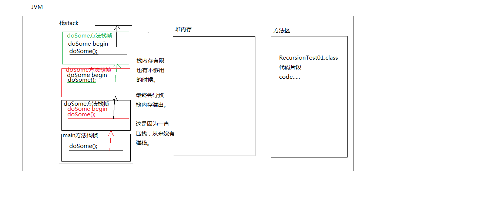

# DOS命令
1、常用的DOS命令
1.1、怎么打开DOS命令窗口
win键 + r （组合键）：可以打开“运行”窗口，在运行窗口文本框中输入: cmd，然后回车
1.2、什么是DOS命令呢？
在DOS命令窗口中才可以输入并执行DOS命令。在最初的windows计算机中没有图形界面的，只有DOS命令窗口。也就是说通过执行DOS命令窗口可以完全完成文件的新建、编辑、保存、删除等一系列操作。
1.3、mkdir abc（这个命令不是必须掌握的）make directory（创建目录）
创建一个目录，起名abc
1.4、默认情况下DOS命令窗口打开之后，定位的位置是哪里？
C:\Users\Administrator 这是默认的当前路径
1.5、在DOS命令窗口中怎么复制内容？
win7:任意位置点击右键-->标记-->选中要复制的内容-->点击右键-->此时就到剪贴板里面了
win10：左键直接选中，然后右键单击一下就到剪贴板里面了。
1.6、切换盘符？
直接输入盘符就行：c: 回车就OK了。
当切换到D盘根下了，那么当前路径就是：D:\>当前路径是当前所在的位置。
1.7、切换目录？（非常重要，必须掌握）
使用cd命令来完成目录的切换：cd是什么含义？change directory（改变目录）
cd命令怎么用，语法格式是什么？
cd 路径
路径在windows系统上包括：相对路径和绝对路径。
注意：
	cd .. 回到上级路径。
	cd \ 直接回到根路径。
	. 一个点，代表当前路径。（cd命令用不着。以后配置环境变量的时候一个点有用处。）
1.8、cls 清屏
1.9、dir 查看当前目录下有啥东西。
1.10、exit 退出DOS命令窗口。
## Java语言的特性
1.1、简单性
	在Java语言当中真正操作内存的是：JVM（Java虚拟机）
	所有的java程序都是运行在Java虚拟机当中的。
	而Java虚拟机执行过程中再去操作内存。
	对于C或者C++来说程序员都是可以直接通过指针操作内存的。
	C或者C++更灵活，可以直接程序员操作内存，但是要求程序员技术精湛。
	C语言或者C++更有驾驭感。
	Java语言屏蔽了指针概念，程序员不能直接操作指针，或者说程序员
	不能直接操作内存。这种方式有优点也有缺点：
		优点：不容易导致内存泄漏。（简单了。）
		缺点：效率问题，包括驾驭感比较差。

		Java语言底层是C++，所以JVM是用C++语言写好的一个虚拟的电脑。
		JVM在哪里？告诉大家，安装了JDK之后，JVM就代表安装好了。

1.2、java是堪称完全面向对象的。
	面向对象更容易让人理解，人类通常是以对象的方式认知世界的。
	采用面向对象的方式可以让复杂问题简单化。
	
1.3、健壮性
	主要是因为Java中有一种机制：自动垃圾回收机制（GC机制）。
	java语言是健壮的，相对于C语言来说，C语言没有Java健壮。
	Java不容易导致内存的泄漏。
	C++或者C语言使用不当时很容易导致内存泄漏。
	JVM负责调度GC机制。程序员不需要干涉

1.4、java完全/完美支持多线程并发。

1.5、可移植性/跨平台
	java语言只要编写一次，可以做到到处运行。
	例如：java程序编写完之后，可以运行在windows操作系统上，
	不需要做任何改动可以直接运行在Linux操作系统上，同样也
	可以运行到MaC OS上面。

	一次编写，到处运行。（平台改变了，程序不需要改。）
	
	JVM这种机制实现了跨平台，那么这种机制优点和缺点分别是什么？
		优点：一次编写到处运行，可以跨平台。
		缺点：麻烦。对于运行java程序来说必须先有一个JVM。
		就像你要想在网页上看视频，你必须先安装一个flash是一样的。
		
	Java语言可以编写病毒吗？
		可以，没问题。但是很难让用户中毒。
		中毒的一般都是java程序员。所以很少有人编写java的病毒脚本。
## JDK、JRE、JVM
JDK:Java开发工具箱
JRE:java运行环境
JVM:java虚拟机

JDK包括JRE，JRE包括JVM。

JVM是不能独立安装的。
JRE和JDK都是可以独立安装的。
有单独的JDK安装包。
也有单独的JRE安装包。
没有单独的JVM安装包。

安装JDK的时候：JRE就自动安装了，同时JRE内部的JVM也就自动安装了。
安装JRE的时候：JVM也就自动安装了。

问题：
	假设你在软件公司开发了一个新的软件，现在要去客户那边给客户把
	项目部署一下，把项目跑起来，你需要安装JDK吗？
		只需要安装JRE就行了。
		JRE体积很小，安装非常便捷快速。
	
问题：
	为什么安装JDK的时候会自带一个JRE？
		因为java程序员开发完程序之后，要测试这个程序，
		让这个程序运行起来，需要JRE。所以JDK安装的时候
		内部自带一个JRE。
## Java的加载与执行
java程序非常重要的两个阶段：编译阶段、运行阶段
注意：java程序员直接编写的java代码（普通文本）是无法执行被JVM识别的。java程序员编写的java代码这种普通文本必须经过一个编译，将这个“普通文本代码”变成“字节码”，JVM能够识别“字节码”。java代码这种普通文本变成字节码的过程，被称为：编译。

java代码这种普通文本被称为：java源代码。（你编写的代码是源代码），源代码不能直接执行，需要先进行编译，生成源代码对应的“字节码”，JVM可以识别的是字节码。

编译阶段和运行阶段可以在不同的操作系统上完成吗？
在windows上编译，编译之后生成了“字节码”，把“字节码”放到linux上运行
		完全可以，因为Java是跨平台的。
		可以做到一次编写到处运行。
	
	java源代码一旦编译之后，源代码可以删除吗？只留下字节码可以执行吗？
		完全可以执行，因为源代码不参与程序的执行过程。
		参与程序执行过程的是字节码。
		但是最好不要删除源代码。因为有可能执行结果不是你需要的，
		当执行结果不是你需要的时候，你可以重新打开源代码进行修改，
		然后重新编译生成新的字节码，再重新执行。这样会有新的执行效果。
	
	放源代码的文件扩展名必须是：xxx.java
	并且需要注意的是：编译生成的字节码文件扩展名是：xxx.class
	
	.java文件就是源文件，这个文件中编写源代码。
	.class文件就是字节码文件，这个文件是编译源代码而得到的。
	
	另外需要注意的是：
		1个java源文件是可以编译生成多个class文件的。
		最终运行的是class文件。
	
	问题：字节码文件是二进制文件吗？
		字节码文件不是二进制文件。
		如果是二进制的话，就不需要JVM了。
		因为操作系统可以直接执行二进制。
	
	java程序从开发到最终运行经历了什么？
	
		编译期：（可以在windows上）
			第一步：在硬盘的某个位置（随意），新建一个xxx.java文件
			第二步：使用记事本或者其它文本编辑器例如EditPlus打开xxx.java文件
			第三步：在xxx.java文件中编写“符合java语法规则的”源代码。
			第四步：保存（一定要将xxx.java文件保存一下）
			第五步：使用编译器（javac【JDK安装后自带】）对xxx.java文件进行编译。
	
			第六步：如果xxx.java文件中编写的源代码是符合语法规则的，编译会通过，
			如果xxx.java文件中编写的源代码违背了语法规则，那么编译器会报错，编译器
			报错之后class文件是不会生成的，只有编译通过了才会生成class字节码文件。
			并且一个java源文件是可以生成多个class文件的。（编译实质上是检查语法）
	
		运行期（JRE在起作用）：（可以在windows上，也可以在其他的OS上。）
			第七步：如果是在Linux上运行，需要将windows上生成的class文件拷贝过去
			不需要拷贝源代码，真正运行的是字节码。（但是源代码也不要删除，有用）
	
			第八步：使用JDK自带的一个命令/工具：java（负责运行的命令/工具）执行字节码
	
			第九步：往下的步骤就全部交给JVM了，就不需要程序员干涉了。
			JVM会将字节码文件装载进去，然后JVM对字节码进行解释（解释器负责将字节码
			解释为1010101010..等的二进制）
	
			第十步：JVM会将生成的二进制码交给OS操作系统，操作系统会执行二进制码和
			硬件进行交互。
	
	注意：在以上的过程中，需要使用两个非常重要的命令？
		javac 命令，负责编译
		java 命令，负责运行
	
	小插曲：
		xxx.java源文件经过编译之后生成了A.class、B.class、C.class等文件，
		那么我们称A是一个类、B是一个类、C是一个类。其中A、B、C是类的名字。
		没有为什么，死记硬背，SUN公司的java语法就是这么规定的。
		A/B/C是类的名称。A类、B类、C类。
	
	源文件中编写的代码叫做：源代码。
	
	以上是一个复杂的过程，那么缩减一下，程序员到底要干啥？
		新建java文件
		打开java文件
		写java源代码
		保存
		javac命令编译
		java命令运行
	
		编写、编译、运行
## HelloWorld
	这个程序不需要大家理解，大家照抄就行，因为目前我也不会讲解这个程序为什么这么写。
	主要是为了搭建java的开发环境，测试java的环境是否能用。
	
	第一步：安装文本编辑器（EditPlus）
	
	第二步：安装JDK（先下载JDK）
		安装JDK13，直接下一步就行。
	
		JDK13安装的时候内置了一个JRE，独立于JDK之外的JRE并没有生成。
		对于java13来说，如果你希望生成一个独立于JDK之外的JRE的话需要执行特殊的命令。
		这里先不讲，后期用到的时候再说。
	
		注意的是：
			JDK8安装的时候，不仅JDK内置了一个JRE，而且还会在JDK目录之外
			独立的生成一个单独的JRE。（以前低版本的时候，JRE实际上是有2个。）
			一个是JDK内置的，一个是独立于JDK之外的。
		
		JDK的bin目录下有：
			javac.exe 负责编译
			java.exe 负责运行
	
	第三步：写代码
	第四步：编译
	第五步：运行
2、到目前为止，大家告诉我，一共配置了哪些环境变量？
到目前为止，我们只配置了一个环境变量path，并且这个环境变量path和java实际上没关系，是人家windows操作系统的机制。
对于Java的JDK所属的环境变量，有一个叫做：JAVA_HOME这个JAVA_HOME目前我们不需要，不配置这个环境变量也不会影响当前java程序的运行。但是后期学习到JavaWEB的时候需要安装Tomcat服务器，那个时候JAVA_HOME就必须配置了。
## HelloWorld执行过程及原理

	D:\course\JavaProjects\02-JavaSE\chapter01>java HelloWorld
	敲完回车，都发生了什么？？？？？
		
		第一步：会先启动JVM（java虚拟机）
	
		第二步：JVM启动之后，JVM会去启动“类加载器classloader”
		类加载器的作用：加载类的。本质上类加载器负责去硬盘上找“类”对应的“字节码”文件。
		假设是“java HelloWorld”，那么类加载器会去硬盘上搜索：HelloWorld.class文件。
		假设是“java Test”，那么类加载器会去硬盘上搜索：Test.class文件。
		.......
	
		第三步：
			类加载器如果在硬盘上找不到对应的字节码文件，会报错，报什么错？
				错误: 找不到或无法加载主类
			类加载器如果在硬盘上找到了对应的字节码文件，类加载器会将该字节码
			文件装载到JVM当中，JVM启动“解释器”将字节码解释为“101010000...”这种
			二进制码，操作系统执行二进制码和硬件交互。
			
	问题？？？？？
		默认情况下，类加载器去硬盘上找“字节码”文件的时候，默认从哪找？？？？
			默认情况下类加载器（classloader）会从当前路径下找。
	
	此处应该有疑问，你可以提出哪些问题？？？？
		能不能给类加载器指定一个路径，让类加载器去指定的路径下加载字节码文件。
		答案：可以的。但是我们需要设置一个环境变量，叫做：classpath
	
	classpath是一个环境变量，是给谁指路的？
		答案：是给“类加载器”指路的。
	
	classpath环境变量不属于windows操作系统，classpath环境变量隶属于java。
	
	classpath环境变量是java特有的。
		classpath=A路径;B路径;C路径.....
		classpath是一个变量名
		A路径;B路径;C路径.....是变量值
	
	我们把classpath配置一下，这个环境变量在windows中没有，需要新建！！！！
		计算机-->右键-->属性-->高级系统设置-->环境变量-->新建...
	
	注意：变量名不能随意写：大小写无所谓，但必须叫做：classpath
		CLASSPATH
		ClassPath
		Classpath
		classpath
		都行。
	
	我目前是随意配置的：（重启CMD）
		classpath=D:\course
		非常重要的一个特点，必须记住：
			配置了classpath=D:\course之后，类加载器只会去D:\course目录下找“xxx.class”文件
			不再从当前路径下找了。
		
		结论是：
			到目前为止：classpath环境变量不需要配置。
			但你必须理解classpath环境变量是干什么的！！！！
	
	你一定要理解classpath环境变量的作用是什么？
		是给类加载器指路的。
		在没有配置环境变量classpath的时候，默认从当前路径下加载。
		如果配置了环境变量classpath的话，就只能从指定的路径下加载了。
	
	path java_home classpath，这3个环境变量path需要配置，后面两个暂时不配置。
## 单Java文件多class
一个.java文件中可以定义多个class，编译后每一个class都对应生成一个.class文件
## 标识符与关键字
## 一行申明多个变量
```java
// 一行上可以同时声明多个变量吗？
// 答案：可以一行声明多个变量。
public class VarTest06{
	public static void main(String[] args){
		// 声明三个变量，都是int类型，起名a,b,c
		// 通过测试得出结论是：a,b没有赋值，c赋值100
		int a, b, c = 100;

		// 变量必须先声明，再赋值，才能访问，a,b两个变量赋值了吗？
		//错误: 可能尚未初始化变量a
		//System.out.println(a);
		//错误: 可能尚未初始化变量b
		//System.out.println(b);
		System.out.println(c);

		// 给a赋值
		a = 200;
		// 给b赋值
		b = 300;
		System.out.println(a);
		System.out.println(b);
		
	}
}
```
## 变量就近原则
全局变量、局部变量同名，就近原则
```java

/*
	变量的作用域？
		1、什么是作用域？
			变量的有效范围。
		2、关于变量的作用域，大家可以记住一句话：
			出了大括号就不认识了。（死记这句话。）
		3、java中有一个很重要的原则：
			就近原则。（不仅java中是这样，其它编程语言都有这个原则。）
			哪个离我近，就访问哪个。
*/

public class VarTest08{

	// 成员变量
	int i = 10000;

	public static void main(String[] args){
		// 局部变量
		int i = 100; // 这个i的有效范围是main方法。
		System.out.println(i); // 这个i是多少？

		// 同一个域当中，这是不允许的。
		//int i = 90;  
	}

	// 这个方法怎么定义先不用管，后面会学习。
	public static void x(){
		// 在这个位置上能访问i吗？
		// 错误: 找不到符号
		// System.out.println(i); // i是无法访问的。

		// 可以定义一个变量起名i吗？
		// 这个i的有效范围是x方法。
		// 局部变量
		int i = 200; // 所以这个i和main方法中的i不在同一个域当中。不冲突。
	}
}
```
## 字符编码
什么是字符编码？
	字符编码是人为的定义的一套转换表。
	在字符编码中规定了一系列的文字对应的二进制。
	字符编码其实本质上就是一本字典，该字段中描述了文字与二进制之间的对照关系。
	字符编码是人为规定的。（是某个计算机协会规定的。）
		
字符编码涉及到编码和解码两个过程，编码和解码的时候必须采用同一套字符编码方式，不然就会出现乱码。

关于字符编码的发展过程？
起初的时候计算机是不支持文字的，只支持科学计算。实际上计算机起初是为了战争而开发的，计算导弹的轨道....后来随着计算机的发展，计算机开始支持文字，最先支持的文字是英文，英文对应的字符编码方式是：ASCII码。

ASCII码采用1byte进行存储，因为英文字母是26个。（键盘上所有的键全部算上也超不过256个。1byte可以表示256种不同的情况。所以英文本身在计算机方面就占有优势。）
	'a' --(采用ASCII码进行编码)-> 01100001
	01100001 --(采用ASCII码进行解码)-> 'a'
	如果编码和解码采用的不是同一个编码方式，会出现乱码。
	'b' ---> 98
	'c' ---> 99...
	'a' ---> 97
			
随着计算机语言的发展，后来国际标准组织制定了ISO-8859-1编码方式，又称为latin-1编码方式，向上兼容ASCII码。但不支持中文。后来发展到亚洲，才支持中文，日文，韩文....中文这块的编码方式：GB2312<GBK<GB18030 （容量的关系）以上编码方式是简体中文。繁体中文：big5（台湾使用的是大五码。）

在java中，java语言为了支持全球所有的文字，采用了一种字符编码方式叫做unicode编码。unicode编码统一了全球所有的文字，支持所有文字。具体的实现包括：UTF-8 UTF-16 UTF-32....

ASCII（'a'是97 'A'是65 '0'是48...）
ISO-8859-1（latin-1）
GB2312
GBK
GB18030
Big5
unicode（utf8 utf16 utf32）
## \u
```java
		// 反斜杠u表示后面的是一个字符的unicode编码。
		// unicode编码是十六进制的。
		char x = '\u4e2d';
		System.out.println(x); // '中'
```
## 类型转化
```java
/*
	在java中有一条非常重要的结论，必须记住：
		在任何情况下，整数型的“字面量/数据”默认被当做int类型处理。（记住就行）
		如果希望该“整数型字面量”被当做long类型来处理，需要在“字面量”后面添加L/l
		建议使用大写L，因为小写l和1傻傻分不清。
*/
public class IntTest02{
	public static void main(String[] args){

		// 分析这个代码存在类型转换吗，以下代码什么意思？
		// 不存在类型转换
		// 100 这个字面量被当做int类型处理
		// a变量是int类型，所以不存在类型的转换。
		// int类型的字面量赋值给int类型的变量。
		int a = 100;
		System.out.println(a);

		// 分析这个程序是否存在类型转换？
		// 分析：200这个字面量默认被当做int类型来处理
		// b变量是long类型，int类型占4个字节，long类型占8个字节
		// 小容量可以自动转换成大容量，这种操作被称为：自动类型转换。
		long b = 200;
		System.out.println(b);

		// 分析这个是否存在类型转换？
		// 这个不存在类型转换。
		// 在整数型字面量300后面添加一个L之后，300L联合起来就是一个long类型的字面量
		// c变量是long类型，long类型赋值给long类型不存在类型转换。
		long c = 300L;
		System.out.println(c);

		// 题目：
		// 可以吗？存在类型转换吗？
		// 2147483647默认被当做int来处理
		// d变量是long类型，小容量可以自动赋值给大容量，自动类型转换
		long d = 2147483647; // 2147483647是int最大值。
		System.out.println(d);

		// 编译器会报错吗？为什么？
		// 在java中，整数型字面量一上来编译器就会将它看做int类型
		// 而2147483648已经超出了int的范围，所以在没有赋值之前就出错了。
		// 记住，不是e放不下2147483648，e是long类型，完全可以容纳2147483648
		// 只不过2147483648本身已经超出了int范围。
		// 错误: 整数太大
		//long e = 2147483648;

		// 怎么解决这个问题呢？
		long e = 2147483648L;
		System.out.println(e);

	}
}
```
```java

/*
	1、小容量可以直接赋值给大容量，称为自动类型转换。

	2、大容量不能直接赋值给小容量，需要使用强制类型转换符进行强转。
	但需要注意的是：加强制类型转换符之后，虽然编译通过了，但是运行
	的时候可能会损失精度。
*/
public class IntTest03{
	public static void main(String[] args){
		
		// 不存在类型转换
		// 100L是long类型字面量，x是long类型字面量。
		long x = 100L;

		// x是long类型，占用8个字节，而y变量是int类型，占用4个字节
		// 在java语言中，大容量可以“直接”赋值给小容量吗？不允许，没有这种语法。
		// 编译错误信息：错误: 不兼容的类型: 从long转换到int可能会有损失
		//int y = x;

		// 大容量转换成小容量，要想编译通过，必须加强制类型转换符，进行强制类型转换。
		// 底层是怎么进行强制类型转换的呢？
		// long类型100L：00000000 00000000 00000000 00000000 00000000 00000000 00000000 01100100
		// 以上的long类型100L强转为int类型，会自动将“前面”的4个字节砍掉：00000000 00000000 00000000 01100100
		int y = (int)x; // 这个(int)就是强制类型转换符，加上去就能编译通过。
							 // 但是要记住：编译虽然过了，但是运行时可能损失精度。
		System.out.println(y); // 100


		// 定义变量a int类型，赋值100
		int a = 100;
		System.out.println(a);

		int b = a; // 将变量a中保存的值100复制一份给b变量。
		System.out.println(b);

	}
}
```
```java
/*
	java中有一个语法规则：
		当这个整数型字面量没有超出byte的取值范围，那么这个
		整数型字面量可以直接赋值给byte类型的变量。
	
	这种语法机制是为了方便写代码，而存在的。
*/
public class IntTest04{
	public static void main(String[] args){
		// 分析：以下代码编译可以通过吗？
		// 300 被默认当做int类型
		// b变量是byte类型
		// 大容量转换成小容量，要想编译通过，必须使用强制类型转换符
		// 错误: 不兼容的类型: 从int转换到byte可能会有损失
		//byte b = 300;

		// 要想让以上的程序编译通过，必须加强制类型转换符
		// 虽然编译通过了，但是可能精度损失。
		// 300这个int类型对应的二进制：00000000 00000000 00000001 00101100
		// byte占用1个字节，砍掉前3个字节，结果是：00101100 (44)
		byte b = (byte)300;
		System.out.println(b); // 44

		// 这个编译能通过吗？
		// 1是int类型，默认被当做int类型来看。
		// x是byte类型，1个字节，大容量无法直接转换成小容量。
		// 按说是编译报错的。
		byte x = 1;
		byte y = 127;
		// 错误: 不兼容的类型: 从int转换到byte可能会有损失
		byte z = 128;

		// 当整数型字面量没有超出short类型取值范围的时候，该字面量可以直接赋值给short
		// 类型的变量。
		short s = 1;
		short s1 = 32767;
		// 错误: 不兼容的类型: 从int转换到short可能会有损失
		//short s2 = 32768;
		System.out.println(s);

	}
}
```
```java
/*
	1、整数能否直接赋值给char
	2、char x = 97;
		这个java语句是允许的，并且输出的结果是'a'
		经过这个测试得出两个结论：
			第一个结论：当一个整数赋值给char类型变量的时候，会自动转换成char字符型，
			最终的结果是一个字符。

			第二个结论：当一个整数没有超出byte short char的取值范围的时候，
			这个整数可以直接赋值给byte short char类型的变量。
*/
public class CharTest03{
	public static void main(String[] args){
	
		char c1 = 'a';
		System.out.println(c1);

		// 这里会做类型转换吗？
		// 97是int类型（这是java中规定，默认当做int处理）
		// c2是char类型
		//char c2 = (char)97; // 不需要这样做。
		char c2 = 97;
		System.out.println(c2); // 'a'

		// char类型取值范围：[0~65535]
		char c3 = 65535; // 实际上最终是一个“看不懂”的字符。
		System.out.println(c3);

		//错误: 不兼容的类型: 从int转换到char可能会有损失
		//char c4 = 65536;

		// 怎么解决以上问题？
		char c4 = (char)65536;

		byte x = 1;
		short s = 1;
		char c = 1;

	}
}
```
当整数型字面量没有超出short类型取值范围的时候，该字面量可以直接赋值给short
当这个整数型字面量没有超出byte的取值范围，那么这个整数型字面量可以直接赋值给byte类型的变量。
当整数型字面量没有超出char类型取值范围的时候，该字面量可以直接赋值给char

经过这个测试得出两个结论：
第一个结论：当一个整数赋值给char类型变量的时候，会自动转换成char字符型，最终的结果是一个字符。
第二个结论：当一个整数没有超出byte short char的取值范围的时候，这个整数可以直接赋值给byte short char类型的变量。当超出范围时，必须做强制类型转换，否怎编译报错，但强转会丢失精度
```java
/*
	结论：byte、char、short做混合运算的时候，各自先转换成int再做运算。
*/
public class IntTest06{
	public static void main(String[] args){

		char c1 = 'a';
		byte b = 1;

		// 注意：这里的"+"是负责求和的
		System.out.println(c1 + b); // 98

		// 错误: 不兼容的类型: 从int转换到short可能会有损失
		//short s = c1 + b; // 编译器不知道这个加法最后的结果是多少。只知道是int类型。

		// 这样修改行吗？
		//错误: 不兼容的类型: 从int转换到short可能会有损失
		//short s = (short)c1 + b;

		short s = (short)(c1 + b);

		//short k = 98;

		int a = 1;
		//错误: 不兼容的类型: 从int转换到short可能会有损失
		// short x = 1; 可以
		short x = a; // 不可以，编译器只知道a是int类型，不知道a中存储的是哪个值。
		System.out.println(x);
	}
}
```
byte、char、short做混合运算的时候，各自先转换成int再做运算。
```java
/*
	结论：多种数据类型做混合运算的时候，最终的结果类型是“最大容量”对应的类型。

	char+short+byte 这个除外。
	因为char + short + byte混合运算的时候，会各自先转换成int再做运算。
*/
public class IntTest07{
	public static void main(String[] args){
		
		long a = 10L;
		char c = 'a';
		short s = 100;
		int i = 30;

		// 求和
		System.out.println(a + c + s + i); //237

		// 错误: 不兼容的类型: 从long转换到int可能会有损失
		// 计算结果是long类型
		//int x = a + c + s + i;

		int x = (int)(a + c + s + i);
		System.out.println(x);

		// 以下程序执行结果是？
		// java中规定，int类型和int类型最终的结果还是int类型。
		int temp = 10 / 3; // / 是除号。（最终取整）
		System.out.println(temp); // 3.33333吗？结果是：3

		// 在java中计算结果不一定是精确的。
		int temp2 = 1 / 2;
		System.out.println(temp2); // 0

	}
}
```
	结论：多种数据类型做混合运算的时候，最终的结果类型是“最大容量”对应的类型。
	
	char+short+byte 这个除外。
	因为char + short + byte混合运算的时候，会各自先转换成int再做运算。
## 类型转换总结
1、关于数据类型详解
	字符型：char
	整数型：byte short int long
		byte b = 127; // 可以直接赋值
		short s = 32767; // 可以直接赋值
		char // 没有超出char的取值范围可以直接赋值给char变量吗?
	浮点型：float double
	布尔型：boolean

2、综合的看一下，在类型转换的时候需要遵循哪些规则？

	第一条：八种基本数据类型中，除 boolean 类型不能转换，剩下七种类型之间都可以
	进行转换；
	
	第二条：如果整数型字面量没有超出 byte,short,char 的取值范围，可以直接将其赋
	值给byte,short,char 类型的变量；
	
	第三条：小容量向大容量转换称为自动类型转换，容量从小到大的排序为：
	byte < short(char) < int < long < float < double，其中 short和 char 
	都占用两个字节，但是char 可以表示更大的正整数；
	
	第四条：大容量转换成小容量，称为强制类型转换，编写时必须添加“强制类型转换符”，
	但运行时可能出现精度损失，谨慎使用；
	
	第五条：byte,short,char 类型混合运算时，先各自转换成 int 类型再做运算；
	
	第六条：多种数据类型混合运算，各自先转换成容量最大的那一种再做运算；

3、运算符
	算术运算符：+ - * / % ++ --
	关系运算符：> >= < <= == != 
	逻辑运算符：& | ! && ||
	赋值运算符：= += -= *= /= %=
	三目运算符：布尔表达式 ? 表达式1 : 表达式2
	字符串连接运算符：+
## switch
1、switch语句也是选择语句，也可以叫做分支语句。
2、switch语句的语法格式
```java
switch(值){
	case 值1:
		java语句;
		java语句;...
		break;
	case 值2:
		java语句;
		java语句;...
		break;
	case 值3:
		java语句;
		java语句;...
		break;
	default:
		java语句;
}
```
以上是一个完整的switch语句：其中：break;语句不是必须的。default分支也不是必须的。

2、switch语句支持的值有哪些？
	支持int类型以及String类型。
	但一定要注意JDK的版本，JDK8之前不支持String类型，只支持int。
	在JDK8之后，switch语句开始支持字符串String类型。

	switch语句本质上是只支持int和String，但是byte,short,char也可以
	使用在switch语句当中，因为byte short char可以进行自动类型转换。
	
	switch语句中“值”与“值1”、“值2”比较的时候会使用“==”进行比较。

3、switch语句的执行原理
拿“值”与“值1”进行比较，如果相同，则执行该分支中的java语句，然后遇到"break;"语句，switch语句就结束了。
如果“值”与“值1”不相等，会继续拿“值”与“值2”进行比较，如果相同，则执行该分支中的java语句，然后遇到break;语句，switch结束。

注意：如果分支执行了，但是分支最后没有“break;”，此时会发生case穿透现象。
所有的case都没有匹配成功，那么最后default分支会执行。
## break
1、break;语句比较特殊，特殊在：break语句是一个单词成为一个完整的java语句。
	另外：continue也是这样，他俩都是一个单词成为一条语句。
2、break 翻译为折断、弄断
3、break;语句可以用在哪里呢？
	用在两个地方，其它位置不行
	第一个位置：switch语句当中，用来终止switch语句的执行。
		用在switch语句当中，防止case穿透现象，用来终止switch。

	第二个位置：break;语句用在循环语句当中，用来终止循环的执行。
		用在for当中
		用在while当中
		用在do....while..当中。
4、以下程序主要是以for循环为例学习break转向语句。
5、break;语句的执行并不会让整个方法结束，break;语句主要是用来终止离它最近的那个循环语句。
6、break语句终止指定的循环
```java
a: for(){
	b:for(){
				break a;	
			}
	}
```
```java
public class BreakTest01{

	public static void main(String[] args){

		// 输出0-9
		/*
		for(int i = 0; i < 10; i++){
			System.out.println("i = " + i);
		}
		*/

		for(int i = 0; i < 10; i++){
			if(i == 5){
				// break;语句会让离它最近的循环终止结束掉。
				break; // break;终止的不是if，不是针对if的，而是针对离它最近的循环。
			}
			System.out.println("i = " + i); // 0 1 2 3 4
		}

		// 这里的代码照常执行。break;的执行并不会影响这里。
		System.out.println("Hello World!");

		// 这个for循环两次
		for(int k = 0; k < 2; k++){ // 外层for
			for(int i = 0; i < 10; i++){ // 内层for
				if(i == 5){
					break; // 这个break;语句只能终止离它最近的for
				}
				System.out.println("i ===> " + i); 
			}
		}

		System.out.println("------------------------------------------");

		// 以下讲解的内容，以后开发很少用。不要紧张。
		// 这种语法很少用，了解一下即可。
		a:for(int k = 0; k < 2; k++){ 
			b:for(int i = 0; i < 10; i++){
				if(i == 5){
					break a; // 终止指定的循环。
				}
				System.out.println("i ===> " + i); 
			}
		}

		System.out.println("呵呵");

	}
}
```
## continue
1、continue翻译为：继续
2、continue语句和break语句要对比着学习
3、continue语句的作用是：
	终止当前"本次"循环，直接进入下一次循环继续执行。
```java
			for(){
				if(){ // 当这个条件成立时，执行continue语句
					continue; //当这个continue语句执行时，continue下面的代码不执行，直接进入下一次循环执行。
				}
				// 以上的continue一旦执行，以下代码不执行，直接执行更新表达式。
				code1;
				code2;
				code3;
				code4;
			}
```

4、continue语句后面指定循环
```java
			a:for(;;更新表达式1){
				b:for(;;更新表达式2){
					if(){
						continue a;
					}
					code1;
					code2;
					code3;
				}
			}
```
```java
public class ContinueTest01{
	public static void main(String[] args){

		/*
			i = 0
			i = 1
			i = 2
			i = 3
			i = 4
		*/
		for(int i = 0; i < 10; i++){
			if(i == 5){
				break;
			}
			System.out.println("i = " + i);
		}

		System.out.println("----------------------------");

		/*
			i = 0
			i = 1
			i = 2
			i = 3
			i = 4
			i = 6
			i = 7
			i = 8
			i = 9
		*/
		for(int i = 0; i < 10; i++){
			if(i == 5){
				continue;
			}
			System.out.println("i = " + i); // 输出i是4
		}

	}
}
```
## 栈的数据结构


```java

// 局部变量：只在方法体中有效，方法结束之后，局部变量的内存就释放了。
// JVM三块主要的内存：栈内存、堆内存、方法区内存。
// 方法区最先有数据：方法区中放代码片段。存放class字节码。
// 堆内存：后面讲。
// 栈内存：方法调用的时候，该方法需要的内存空间在栈中分配。
// 方法不调用是不会在栈中分配空间的。

// 方法只有在调用的时候才会在栈中分配空间，并且调用时就是压栈。
// 方法执行结束之后，该方法所需要的空间就会释放，此时发生弹栈动作。

// 方法调用叫做：压栈。分配空间
// 方法结束叫做：弹栈。释放空间

// 栈中存储什么？方法运行过程中需要的内存，以及栈中会存储方法的局部变量。

public class MethodTest08{
	//主方法，入口
	public static void main(String[] args){
		
		//int a = 100;
		// 这个赋值原理是：将a变量中保存的100这个数字复制一份传给b变量。
		// 所以a和b是两个不同的内存空间，是两个局部变量。
		//int b = a;

		System.out.println("main begin");
		int x = 100;
		m1(x);
		System.out.println("main over");
	}
	public static void m1(int i){ // i是局部变量
		System.out.println("m1 begin");
		m2(i);
		System.out.println("m1 over");
	}
	public static void m2(int i){
		System.out.println("m2 begin");
		m3(i);
		System.out.println("m2 over");
	
	}
	public static void m3(int i){
		System.out.println("m3 begin");
		System.out.println(i);
		System.out.println("m3 over");
	}
}
```
## 方法执行过程中的内存变化

## 方法重载

/*
	方法重载（overload）:

		什么时候需要考虑使用方法重载？
			在同一个类当中，如果“功能1”和“功能2”它们的功能是相似的，
			那么可以考虑将它们的方法名一致，这样代码既美观，又便于
			后期的代码编写（容易记忆，方便使用）。
	
			注意：方法重载overload不能随便使用，如果两个功能压根不相干，
			不相似，根本没关系，此时两个方法使用重载机制的话，会导致
			编码更麻烦。无法进行方法功能的区分。
	
		什么时候代码会发生方法重载？	 
			条件1：在同一个类当中
			条件2：方法名相同
			条件3：参数列表不同
						参数的个数不同算不同
						参数的类型不同算不同
						参数的顺序不同算不同
	
			只要同时满足以上3个条件，那么我们可以认定方法和方法之间发生了
			重载机制。
	
	注意：
		不管代码怎么写，最终一定能让java编译器很好的区分开这两个方法。
	
		方法重载和方法的“返回值类型”无关。
		方法重载和方法的“修饰符列表”无关。
*/
## 方法递归
```java
/*
	方法递归？
		1、什么是方法递归？
			方法自己调用自己，这就是方法递归。

		2、当递归时程序没有结束条件，一定会发生：
			栈内存溢出错误：StackOverflowError
			所以：递归必须要有结束条件。（这是一个非常重要的知识点。）

			JVM发生错误之后只有一个结果，就是退出JVM。

		3、递归假设是有结束条件的，就一定不会发生栈内存溢出错误吗？
			假设这个结束条件是对的，是合法的，递归有的时候也会出现栈内存溢出错误。
			因为有可能递归的太深，栈内存不够了。因为一直在压栈。
		
		4、在实际的开发中，不建议轻易的选择递归，能用for循环while循环代替的，尽量
		使用循环来做。因为循环的效率高，耗费的内存少。递归耗费的内存比较大，另外
		递归的使用不当，会导致JVM死掉。
		(但在极少数的情况下，不用递归，这个程序没法实现。)
		所以：递归我们还是要认真学习的。

		5、在实际的开发中，假设有一天你真正的遇到了：StackOverflowError
		你怎么解决这个问题，可以谈一下你的思路吗？
			我来谈一下我的个人思路：
				首先第一步：
					先检查递归的结束条件对不对。如果递归结束条件不对，
					必须对条件进一步修改，直到正确为止。

				第二步：假设递归条件没问题，怎么办？
					这个时候需要手动的调整JVM的栈内存初始化大小。
					可以将栈内存的空间调大点。（可以调整大一些。）
				
				第三步：调整了大小，如果运行时还是出现这个错误，
				没办法，只能继续扩大栈的内存大小。
				
				(java -X)这个可以查看调整堆栈大小的参数
*/
public class RecursionTest01{
	// 入口
	public static void main(String[] args){
		doSome();
	}

	public static void doSome(){
		System.out.println("doSome begin");
		// 调用方法：doSome()既然是一个方法，那么doSome方法可以调用吗？当然可以。
		// 目前这个递归是没有结束条件的，会出现什么问题？
		doSome();
		// 这行代码永远执行不到。
		System.out.println("doSome over");
	}
}
```

```java

// 使用递归，请编写程序，计算1~n的和。
public class RecursionTest03{
	public static void main(String[] args){
		// 1~3的和
		int n = 3;
		int r = sum(n);
		System.out.println(r); // 6
	}

	// 大家努力的去看，去听，自己写不出来没关系，关键是能不能看懂。
	// 单独编写一个计算1~n和的方法
	// 这个代码修改为递归的方式。
	// 3 + 2 + 1
	public static int sum(int n){
		//n最初等于3
		// 3 + 2 (2是怎么的出来的：n - 1)
		//sum(n - 1); 
		if(n == 1){
			return 1;
		}
		// 程序能执行到此处说明n不是1
		return n + sum(n-1);
	}
}
```

## 面向对象
1、面向过程和面向对象有什么区别？

	从语言方面出发：
		对于C语言来说，是完全面向过程的。
		对于C++语言来说，是一半面向过程，一半是面向对象。（C++是半面向对象的）
		对于Java语言来说，是完全面向对象的。
	
	什么是面向过程的开发方式？
		面向过程的开发方式主要的特点是：
			注重步骤，注重的是实现这个功能的步骤。
			第一步干什么
			第二步干什么
			....
			另外面向过程也注重实现功能的因果关系。
				因为A所有B
				因为B所以C
				因为C所以D
				.....
			面向过程中没有对象的概念。只是实现这个功能的步骤以及因果关系。
		
		面向过程有什么缺点？（耦合度高，扩展力差。）
			面向过程最主要是每一步与每一步的因果关系，其中A步骤因果关系到B
			步骤，A和B联合起来形成一个子模块，子模块和子模块之间又因为因果
			关系结合在一起，假设其中任何一个因果关系出现问题（错误），此时
			整个系统的运转都会出现问题。（代码和代码之间的耦合度太高，扩展力
			太差。）
				螺栓螺母拧在一起：耦合度高吗？
					这是耦合度低的，因为螺栓螺母可以再拧开。（它们之间是有接口的。）
				螺栓螺母拧在一起之后，再用焊条焊接在一起，耦合度高吗？
					这个耦合度就很高了。耦合度就是黏连程度。
					往往耦合度高的扩展力就差。
				
				耦合度高导致扩展力差。（集成显卡：计算机显卡不是独立的，是集成到主板上的）
				耦合度低导致扩展力强。（灯泡和灯口关系，螺栓螺母关系）
			
			采用面向过程的方式开发一台计算机会是怎样？
				这台计算机将没有任何一个部件，所有的都是融合在一起的。
				你的这台计算机是一个实心儿的，没有部件的。一体机。
				假设这台一体机的任何一个“部位”出问题，整个计算机就不能用了，
				必须扔掉了。（没有对象的概念。）
	
			采用面向对象的方式开发一台计算机会是怎样？
				内存条是一个对象
				主板是一个对象
				CPU是一个对象
				硬盘是一个对象
				然后这些对象组装在一起，形成一台计算机。
				假设其中CPU坏了，我们可以将CPU拆下来，换一个新的。
	
		面向过程有什么优点？（快速开发）
			对于小型项目（功能），采用面向过程的方式进行开发，效率较高。
			不需要前期进行对象的提取，模型的建立，采用面向过程
			方式可以直接开始干活。一上来直接写代码，编写因果关系。
			从而实现功能。
	
	什么是面向对象的开发方式？
		采用面向对象的方式进行开发，更符合人类的思维方式。（面向对象成为主流的原因）
		人类就是以“对象”的方式去认识世界的。
		所以面向对象更容易让我们接受。
	
		面向对象就是将现实世界分割成不同的单元，然后每一个单元
		都实现成对象，然后给一个环境驱动一下，让各个对象之间协
		作起来形成一个系统。
	
		对象“张三”
		对象“香烟”
		对象“打火机”
		对象“吸烟的场所”
		然后将以上的4个对象组合在一起，就可以模拟一个人的抽烟场景。
		其中“张三”对象可以更换为“李四”
		其中“香烟”也可以更换品牌。
		其中“打火机”也可以更换。
		其中“吸烟的场所”也可以更换。
	
		采用面向对象的方式进行开发：
			耦合度低，扩展力强。
	
	找一个合适的案例。说明一下面向对象和面向过程的区别？
		蛋炒饭：
			鸡蛋和米饭完全混合在一起。没有独立对象的概念。
			假设客户提出新需求：我只想吃蛋炒饭中的米饭，怎么办？
				客户提出需求，软件开发者必须满足这个需求，于是
				开始扩展，这个软件的扩展是一场噩梦。（很难扩展，耦合度太高了。）
	
		盖饭：
			老板，来一份：鱼香肉丝盖饭
			鱼香肉丝是一道菜，可以看成一个独立的对象。
			米饭可以看成一个独立的对象。
			两个对象准备好之后，只要有一个动作，叫做：“盖”
			这样两个对象就组合在一起了。
	
			假设客户提出新需求：我不想吃鱼香肉丝盖饭,想吃西红柿鸡蛋盖饭。
			这个扩展就很轻松了。直接把“鱼香肉丝”对象换成“西红柿鸡蛋”对象。


	目前先听一下，需要三四年的时候才能彻底领悟面向对象。
	
	面向过程主要关注的是：实现步骤以及整个过程。
	面向对象主要关注的是：对象A，对象B，对象C，然后对象ABC组合，或者CBA组合.....

2、当我们采用面向对象的方式贯穿整个系统的话，涉及到三个术语：
	OOA：面向对象分析
	OOD：面向对象设计
	OOP：面向对象编程
	整个软件开发的过程，都是采用OO进行贯穿的。

	实现一个软件的过程：
		分析(A) --> 设计(D) --> 编程(P)
	
	在软件公司当中，一般同事与同事之间聊天，有的时候会突然说出来一个英语单词。
	这种情况是很常见的。所以一些术语还是要知道的，不然会闹出笑话。
	
	leader 领导/经理/组长
	team 团队
	PM 项目经理（整个项目的监管人）Project Manager

3、面向对象包括三大特征
	封装
	继承
	多态

	任何一个面向对象的编程语言都包括这三个特征
	例如：
		python也有封装 继承 多态。
		java也有封装 继承 多态。
	
		注意：java只是面向对象编程语言中的一种。
		除了java之外，还有其它很多很多的编程语言也是面向对象的。
	
	以上三个特征的名字先背会，后面一个一个进行学习。

4、类和对象的概念
	
	面向对象当中最主要“一词”是：对象。
	
	什么是类？
		类实际上在现实世界当中是不存在的，是一个抽象的概念。
		是一个模板。是我们人类大脑进行“思考、总结、抽象”的一个
		结果。(主要是因为人类的大脑不一般才有了类的概念。)
	
		类本质上是现实世界当中某些事物具有共同特征，将这些共同
		特征提取出来形成的概念就是一个“类”，“类”就是一个模板。
	
		明星是一个类
	
	什么是对象？
		对象是实际存在的个体。（真实存在的个体）
	
		宋小宝就是一个对象
		姚明就是一个对象
		刘德华就是一个对象
		....
	
		宋小宝、姚明、刘德华这3个对象都属于“明星”这个类。
	
	在java语言中，要想得到“对象”，必须先定义“类”，“对象”是通过“类”
	这个模板创造出来的。
		类就是一个模板：类中描述的是所有对象的“共同特征信息”
		对象就是通过类创建出的个体。
	
	这几个术语你需要自己能够阐述出来：
		类：不存在的，人类大脑思考总结一个模板（这个模板当中描述了共同特征。）
		对象：实际存在的个体。
		实例：对象还有另一个名字叫做实例。
		实例化：通过类这个模板创建对象的过程，叫做：实例化。
		抽象：多个对象具有共同特征，进行思考总结抽取共同特征的过程。
	
		类 --【实例化】--> 对象(实例)
		对象 --【抽象】--> 类

	
	类是一个模板，是描述共同特征的一个模板，那么共同特征包括什么呢？

		潘长江对象：
			名字：潘长江
			身高：165cm
	
			打篮球：非专业的，自己玩儿呢，无所谓了
			学习：考试80分
	
		姚明对象：
			名字：姚明
			身高：240cm
			打篮球：NBA专业球员，打篮球非常棒
			学习：考试100分
	
		共同特征包括哪些？
			名字、身高都属于名词（状态特征）
			打篮球、学习都属于动词（动作特征）
		
		类 = 属性 + 方法
		属性来源于：状态
		方法来源于：动作
	
		public class 明星类{
			//属性-->状态，多见于名词
			名字属性;
			身高属性;
	
			//方法-->动作，多见于动词
			打篮球方法(){
			
			}
			学习方法(){
			
			}
		}
	
		陈赓同学、何伟彬同学，他们俩有没有共同特征呢？
			有共同特征，就可以抽象一个类模板出来。
		
		可以定义一个学生类（Student）
		public class Student {
			// 属性
			// 姓名
			// 性别
			// 身高
	
			// 方法
			public .... sing(){
			
			}
			public .... dance(){
			
			}
			public .... study(){
			
			}
			....
		}

5、思考：“java软件工程师”在开发中起到的一个作用是什么？

	我们为什么要做软件开发？
		说的大一些是为了人民服务。解决现实生活当中的问题。
	
	软件开发既然是为了解决现实世界当中的问题，那么首先
	java软件必须能够模拟现实世界。
	
	其实软件是一个虚拟的世界。
	这个虚拟的世界需要和现实世界一一对应，这才叫模拟。

6、类的定义
	6.1、怎么定义一个类，语法格式是什么？
		[修饰符列表] class 类名 {
			//类体 = 属性 + 方法
			// 属性在代码上以“变量”的形式存在（描述状态）
			// 方法描述动作/行为
		}

		注意：修饰符列表可以省略。
	
	6.2、为什么属性是“以”变量的形式存在的？
		假设我们要描述一个学生：
			学生包括哪些属性：
				学号: 110
				姓名："张三"
				性别：'男' (true/false)
				住址："深圳宝安区"
		答案：是因为属性对应的是“数据”，数据在程序中只能放到变量中。
		结论：属性其实就是变量。
	
		变量的分类还记得吗？
			变量根据出现位置进行划分：
				方法体当中声明的变量：局部变量。
				方法体外声明的变量：成员变量。（这里的成员变量就是“属性”）
	
	6.3、请大家观察“学生对象1”和“学生对象2”的共同特征，然后再利用java语言
	将该“学生类”表述/表达出来。（这里只表达属性，不表达方法.）

7、关于编译的过程
	按说应该先编译XueSheng.java，然后再编译XueShengTest.java
	但是对于编译器来说，编译XueShengTest.java文件的时候，会自动
	找XueSheng.class，如果没有，会自动编译XueSheng.java文件，生成
	XueSheng.class文件。
		第一种方式：	
			javac XueSheng.java
			javac XueShengTest.java
		第二种方式：
			javac XueShengTest.java
		第三种方式：
			javac *.java

8、在语法级别上是怎么完成对象创建的呢？
	类名 变量名 = new 类名();
	这样就完成了对象的创建。

9、什么是实例变量？
	对象又被称为实例。
	实例变量实际上就是：对象级别的变量。
	public class 明星类{
		double height;
	}
	身高这个属性所有的明星对象都有，但是每一个对象都有“自己的身高值”。
	假设创建10个明星对象，height变量应该有10份。
	所以这种变量被称为对象级别的变量。属于实例变量。

	实例变量在访问的时候，是不是必须先创建对象？

10、对象和引用的区别？
	对象是通过new出来的，在堆内存中存储。
	引用是：但凡是变量，并且该变量中保存了内存地址指向了堆内存当中的对象的。
```java
/*
1、观察学生对象的共同特征（只观察属性）
	有哪些共同特征：
		学号：采用int类型
		姓名：采用String类型
		年龄：采用int类型
		性别：采用char或者boolean类型
		住址：采用String类型

		注意：属性是成员变量。
		
2、以上是分析总结的结果，可以开始写代码了：
	定义XueSheng类，编写成员变量作为属性。

3、变量有一个特点：
	必须先声明，再赋值，才能访问。
	成员变量可以不手动赋值？？？？？？？？？？

XueSheng既是一个类名，同时又是一个“类型名”，属于引用数据类型。
*/
public class XueSheng{ // 这个程序编译之后，会生成XueSheng.class字节码文件。

	// 属性

	// 学号（成员变量）
	int xueHao;

	// 姓名
	String xingMing;

	// 年龄
	int nianLing;

	// 性别
	boolean xingBie;

	// 住址
	String zhuZhi;

}
```
```java

/*
	对象的创建和使用。
*/
public class XueShengTest{
	public static void main(String[] args){

		int i = 100;
		System.out.println("i = " + i);
		
		// 在这里可以访问XueSheng类吗？
		// 当然可以。
		/*
			创建对象的语法是什么？
				目前死记硬背，先记住。后面你就理解了。
					new 类名();
			类是模板，通过一个类，是可以创建N多个对象的。
			new是一个运算符。专门负责对象的创建。

			XueSheng s1 = new XueSheng();
			和
			int i = 100;
			解释一下：
				i是变量名
				int是变量的数据类型
				100是具体的数据。
				
				s1是变量名（s1不能叫做对象。s1只是一个变量名字。）
				XueSheng是变量s1的数据类型（引用数据类型）
				new XueSheng() 这是一个对象。（学生类创建出来的学生对象。）
			
			数据类型包括两种：
				基本数据类型：byte short int long float double boolean char
				引用数据类型：String、XueSheng.....

			java中所有的“类”都属于引用数据类型。

		*/
		XueSheng s1 = new XueSheng(); // 和 int i = 10;一个道理。

		// 再通过该类创建一个全新的对象
		XueSheng s2 = new XueSheng();

		// 再创建一个呢？
		XueSheng xsh = new XueSheng();

		// 以上的这个程序就相当于通过XueSheng类实例化了3个XueSheng对象。
		// 创建对象的个数没有限制，可以随意。只要有模板类就行。
		// 3个对象都属于学生类型。

	}
}
```
```java
/*
学生类
	学号：int
	姓名：String
	年龄：int
	性别：boolean
	住址：String

变量必须先声明，再赋值才能访问。

注意：对于成员变量来说，没有手动赋值时，系统默认赋值。
赋的值都是默认值，那么默认值是什么？

类型				默认值
---------------------
byte				0
short				0
int				0
long				0L
float				0.0F
double			0.0
boolean			false
char				\u0000
引用数据类型	null

null是一个java关键字，全部小写，表示空。是引用类型的默认值。

分析：对于成员变量来说，是不是应该一个对象有一份。
	李四有李四的学号
	张三有张三的学号
	李四和张三的学号不一样。所以应该有两块不同的内存空间。

*/
public class Student{

	// 属性（描述状态），在java程序中以“成员变量”的形式存在。

	// 学号
	// 一个对象一份。
	int no; // 这种成员变量又被称为“实例变量”。

	// 姓名
	String name;

	// 年龄
	int age;

	// 性别
	boolean sex;

	// 住址
	String addr;

}

```
```java
/*
	对象的创建和使用。
*/
public class StudentTest{

	public static void main(String[] args){

		//局部变量
		//错误: 可能尚未初始化变量k
		/*
		int k;
		System.out.println(k);
		*/

		//访问学生姓名可以直接通过类名吗？
		// 学生姓名是一个实例变量。实例变量是对象级别的变量。
		// 是不是应该先有对象才能说姓名的事儿。
		// 不能通过“类名”来直接访问“实例变量”。
		//System.out.println(Student.name);
		
		// i属于局部变量吗？当然是。
		// 局部变量存储在栈内存当中。（栈主要存储局部变量。）
		//int i = 100;

		// 创建学生对象1
		// s1属于局部变量吗？当然是。
		// s1这个局部变量叫做引用
		Student s1 = new Student();
		// 怎么访问实例变量？
		// 语法：引用.实例变量名
		System.out.println(s1.no);
		System.out.println(s1.name);
		System.out.println(s1.age);
		System.out.println(s1.sex);
		System.out.println(s1.addr);

		System.out.println("-----------------------------");


		// 创建学生对象2
		// s2也是局部变量。
		// s2也叫做引用。
		Student s2 = new Student();
		System.out.println(s2.no);
		System.out.println(s2.name);
		System.out.println(s2.age);
		System.out.println(s2.sex);
		System.out.println(s2.addr);

		// 程序执行到此处我可以修改s1这个学生的学号吗？
		// 通过“=”赋值的方式将内存中实例变量的值修改一下。
		s1.no = 110;
		s1.name = "张三";
		s1.age = 20;
		s1.sex = true;
		s1.addr = "深圳宝安区";

		System.out.println("学号=" + s1.no);
		System.out.println("姓名=" + s1.name);
		System.out.println("年龄=" + s1.age);
		System.out.println("性别=" + s1.sex);
		System.out.println("住址=" + s1.addr);

		// 再次赋值
		s1.addr = "北京大兴区";
		System.out.println("住址：" + s1.addr);

	}

	public static void method(){
		// i s1 s2都是main方法中的局部变量，在这里是无法访问的。
		/*
		System.out.println(i);
		System.out.println(s1);
		System.out.println(s2);
		*/
	}
}
```
## 对象和引用--图


## 成员变量与局部变量
```java
public class mainTest {
    static int k;
    public static void main(String[] args) {
        int i;
//      System.out.println(i); //局部变量必须初始化否则会报错
//      User user;
//      System.out.println(user); //局部变量必须初始化否则会报错
        System.out.println(k); //实例变量会自动初始化不会报错
  
    }
}
```
## 内存图
```java

// 住址类
public class Address{

	// 一个家庭住址有3个属性。

	// 城市
	String city; // 实例变量

	// 街道
	String street;

	// 邮编
	String zipcode;
// }
```
```java
public class User{

	// 类=属性+方法
	// 以下3个都是属性，都是实例变量。（对象变量。）

	// 用户id
	// int是一种基本数据类型
	int id; // 实例变量

	// 用户名
	// String是一种引用数据类型
	String username; // 实例变量

	// 家庭住址
	// Address是一种引用数据类型
	// addr是成员变量并且还是一个实例变量
	// addr是否是一个引用呢？是。addr是一个引用。
	Address addr; 
}

// 实例变量都存储在哪里？
// 实例变量都在堆内存的对象内部。

// 方法体外，类体内定义的变量叫做：成员变量。
```
```java

/*
	到目前为止，如果什么也没听懂，怎么写代码？
		记住一个知识点就行，可以后期慢慢学习画图。
			记住一句话：里面有什么就能“点”什么。

			所有的实例变量（属性）都是通过“引用.”来访问的。
	
	引用和对象怎么区分？
		“引用”是啥？是存储对象内存地址的一个变量。
		“对象”是啥？堆里new出来的。
	
	通俗一点：
		只要这个变量中保存的是一个对象的内存地址，那么这个变量就叫做“引用”。
	
	思考：
		引用一定是局部变量吗？
			不一定。
*/
public class Test{
	public static void main(String[] args){

		//报错了。id是实例变量，必须先创建对象，通过“引用.”的方式访问。
		/*
			User u = new User();
			u是引用。
		*/
		//System.out.println(User.id);

		

		/*
		int i = 100;
		int j = i; // 原理：会将i中保存的100复制一份，传给j变量。
		*/
		
		// 家庭住址对象
		Address a = new Address();
		a.city = "北京";
		a.street = "大兴区";
		a.zipcode = "121221";
		
		// 用户对象
		User u = new User();
		System.out.println(u.id); // 0
		System.out.println(u.username); // null
		System.out.println(u.addr); // null

		u.id = 11111;
		u.username = "zhangsan";
		u.addr = a;

		// 思考一个问题：
		// 我想直到zhangsan他是哪个城市的，代码应该怎么写？
		System.out.println(u.username + "是"+u.addr.city+"城市的！");

		// u.addr.city 这行代码可否拆分呢？u.addr.city 节省变量。
		// 拆分成以下代码和以上效果完全相同，原理完全相同，不同的是以下代码多了两个变量。
		Address ad = u.addr;
		String zhuZhi = ad.city;

		System.out.println(zhuZhi);

		//-----------------------是否理解以下代码---------------------------
		int x = 100;
		// = 代表赋值运算，“赋值”中有一个“值”
		// x变量中的值是100. 将100复制一份给y
		// 表示：将x变量中保存的值100复制一份给y
		int y = x;

		//-----------------------是否理解以下代码---------------------------
		Address k = new Address(); // Address k = 0x1111;
		Address m = k; // 这里表示将k变量中保存的0x1111复制了一份传给了m变量。

	}
}
```

## 垃圾回收GC
空指针异常。（NullPointerException）

	关于垃圾回收器：GC
		在java语言中，垃圾回收器主要针对的是堆内存。
		当一个java对象没有任何引用指向该对象的时候，
		GC会考虑将该垃圾数据释放回收掉。
	
	出现空指针异常的前提条件是？
		"空引用"访问实例【对象相关】相关的数据时，都会出现空指针异常。

## 参数传递
```java
// 分析程序的输出结果。
// java中规定：参数传递的时候，和类型无关，不管是基本数据类型还是引用数据类型
// 统一都是将盒子中保存的那个“值”复制一份，传递下去。

// java中只有一个规定：参数传递的时候，一定是将“盒子”中的东西复制一份传递过去。

// 内存地址也是值，也是盒子中保存的一个东西。
public class Test1{
	public static void main(String[] args){

		int x = 100;
		int y = x; // x赋值给y，是怎么传递的？将x变量中保存的100这个值复制一份传给y

		// 局部变量，域是main
		int i = 10;
		// 将i变量中保存的10复制一份，传给add方法。
		add(i); 
		System.out.println("main ---> " + i); //10
	}

	/*
	public static void add(int i){ // i是局部变量，域是add
		i++;
		System.out.println("add ----> " + i); //11
	}
	*/

	public static void add(int k){ 
		k++;
		System.out.println("add ----> " + k); 
	}
}

```

```java
public class ValTRans {
    public static void main(String[] args) {
        User user = new User();
        user.username= "张三";
        Address address = new Address();
        user.addr = address;
        user.addr.city="中国";
        change(user);
        System.out.println("main----->"+user.username);
        System.out.println("main----->"+user.addr.city);
    }
    public  static void change(User user){

        System.out.println("change----->"+user.username);
        System.out.println("change----->"+user.addr.city);
        user.username = "李白";
        user.addr.city = "深圳";
        System.out.println("change----->"+user.username);
        System.out.println("change----->"+user.addr.city);

    }
}

```
```java
D:\Develop\Java\jdk1.8.0_291\bin\java.exe "-javaagent:D:\Develop\IntelliJ IDEA 2021.1.3\lib\idea_rt.jar=14279:D:\Develop\IntelliJ IDEA 2021.1.3\bin" -Dfile.encoding=UTF-8 -classpath D:\Develop\Java\jdk1.8.0_291\jre\lib\charsets.jar;D:\Develop\Java\jdk1.8.0_291\jre\lib\deploy.jar;D:\Develop\Java\jdk1.8.0_291\jre\lib\ext\access-bridge-64.jar;D:\Develop\Java\jdk1.8.0_291\jre\lib\ext\cldrdata.jar;D:\Develop\Java\jdk1.8.0_291\jre\lib\ext\dnsns.jar;D:\Develop\Java\jdk1.8.0_291\jre\lib\ext\jaccess.jar;D:\Develop\Java\jdk1.8.0_291\jre\lib\ext\jfxrt.jar;D:\Develop\Java\jdk1.8.0_291\jre\lib\ext\localedata.jar;D:\Develop\Java\jdk1.8.0_291\jre\lib\ext\nashorn.jar;D:\Develop\Java\jdk1.8.0_291\jre\lib\ext\sunec.jar;D:\Develop\Java\jdk1.8.0_291\jre\lib\ext\sunjce_provider.jar;D:\Develop\Java\jdk1.8.0_291\jre\lib\ext\sunmscapi.jar;D:\Develop\Java\jdk1.8.0_291\jre\lib\ext\sunpkcs11.jar;D:\Develop\Java\jdk1.8.0_291\jre\lib\ext\zipfs.jar;D:\Develop\Java\jdk1.8.0_291\jre\lib\javaws.jar;D:\Develop\Java\jdk1.8.0_291\jre\lib\jce.jar;D:\Develop\Java\jdk1.8.0_291\jre\lib\jfr.jar;D:\Develop\Java\jdk1.8.0_291\jre\lib\jfxswt.jar;D:\Develop\Java\jdk1.8.0_291\jre\lib\jsse.jar;D:\Develop\Java\jdk1.8.0_291\jre\lib\management-agent.jar;D:\Develop\Java\jdk1.8.0_291\jre\lib\plugin.jar;D:\Develop\Java\jdk1.8.0_291\jre\lib\resources.jar;D:\Develop\Java\jdk1.8.0_291\jre\lib\rt.jar;D:\Items\apex_xprac\c-jse-starter\target\classes com.apexsoft.jse.ValTRans
change----->张三
change----->中国
change----->李白
change----->深圳
main----->李白
main----->深圳

Process finished with exit code 0
```
```java

/*
	java中关于方法调用时参数传递实际上只有一个规则：
		不管你是基本数据类型，还是引用数据类型，实际上在传递的时候都是
		将变量中保存的那个“值”复制一份，传过去。

		int x = 1;
		int y = x; 把x中保存1复制一份传给y
		x和y都是两个局部变量。

		Person p1 = 0x1234;
		Person p2 = p1; 把p1中保存的0x1234复制一份传给p2
		p1和p2都是两个局部变量。

		你和你媳妇，都有你家大门上的钥匙，钥匙是两把。
		但是都可以打开你家的大门。

*/

public class Test2{
	public static void main(String[] args){
		Person p = new Person();
		p.age = 10;
		add(p);
		System.out.println("main--->" + p.age); //11
	}
	// 方法的参数可以是基本数据类型，也可以是引用数据类型，只要是合法的数据类型就行。
	public static void add(Person p){ // p是add方法的局部变量。
		p.age++;
		System.out.println("add--->" + p.age); //11
	}
}

class Person{
	// 年龄属性，成员变量中的实例变量。
	int age;
}
```


方法在调用的时候参数是如何传递的？
	实际上，在java语言中，方法调用时参数传递，和类型无关，都是将变量中保存
	的那个“值”传过去，这个“值”可能是一个数字100，也可能是一个java对象的内存
	地址：0x1234
		记住这句话：不管是哪一种数据类型的传递，都是将“变量中保存的那个值复制一份传递过去。”
## 构造方法
5、构造方法。
5.1、当一个类中没有提供任何构造方法，系统默认提供一个无参数的构造方法。这个无参数的构造方法叫做缺省构造器。
5.2、当一个类中手动的提供了构造方法，那么系统将不再默认提供无参数构造方法。建议将无参数构造方法手动的写出来，这样一定不会出问题。
5.3、无参数构造方法和有参数的构造方法都可以调用。
		Student x = new Student();
		Student y = new Student(123);
5.4、构造方法支持方法重载吗？
	构造方法是支持方法重载的。
	在一个类当中构造方法可以有多个。
	并且所有的构造方法名字都是一样的。
	方法重载特点：在同一个类中，方法名相同，参数列表不同。
5.5、对于实例变量来说，只要你在构造方法中没有手动给它赋值，统一都会默认赋值。默认赋系统值。
构造方法需要掌握的知识点：
	1.构造方法有什么作用？
	2.构造方法怎么定义，语法是什么？
	3.构造方法怎么调用，使用哪个运算符？
	4.什么是缺省构造器？
	5.怎么防止缺省构造器丢失？
	6.实例变量在类加载是初始化吗？实例变量在什么时候初始化？
```java
/*
	构造方法
		1、什么是构造方法，有什么用？
			构造方法是一个比较特殊的方法，通过构造方法可以完成对象的创建，
			以及实例变量的初始化。换句话说：构造方法是用来创建对象，并且
			同时给对象的属性赋值。（注意：实例变量没有手动赋值的时候，系统
			会赋默认值。）

		2、重点（需要记忆）：当一个类没有提供任何构造方法，系统会默认提供
		一个无参数的构造方法。（而这个构造方法被称为缺省构造器。）

		3、调用构造方法怎么调用呢？
			使用哪个运算符呢？
				使用new运算符来调用构造方法。
				语法格式：
					new 构造方法名(实际参数列表);
		
		4、构造方法的语法结构是？

			[修饰符列表] 构造方法名(形式参数列表){
				构造方法体;
				通常在构造方法体当中给属性赋值，完成属性的初始化。
			}

			注意：
				第一：修饰符列表目前统一写：public。千万不要写public static。

				第二：构造方法名和类名必须一致。

				第三：构造方法不需要指定返回值类型，也不能写void，写上void
				表示普通方法，就不是构造方法了。

			普通方法的语法结构是？
				[修饰符列表] 返回值类型 方法名(形式参数列表){
					方法体;
				}
*/
public class ConstructorTest01{
	public static void main(String[] args){

		// 调用Student类的无参数构造方法
		new Student();

		// 调用普通方法
		ConstructorTest01.doSome();
		doSome();

		// 创建Student类型的对象
		Student s1 = new Student();

		// 输出“引用”
		//只要输出结果不是null，说明这个对象一定是创建完成了。
		// 此处的输出结果大家目前是看不懂的，后期再说。
		System.out.println(s1); //Student@54bedef2

		// 这是调用另一个有参数的构造方法。
		Student s3 = new Student(100);
		System.out.println(s3); //Student@5caf905d
	}

	public static void doSome(){
		System.out.println("do some!!!!");
	}
}
```
```java
public class Student{

	// 学号
	int no;

	// 姓名
	String name;

	// 年龄
	int age;

	// 当前的Student这个类当中并没有定义任何构造方法。
	// 但是系统实际上会自动给Student类提供一个无参数的构造方法。
	// 将无参数的构造方法（缺省构造器）写出来
	public Student(){
		System.out.println("无参数的构造方法执行了！");
	}

	// 定义一个有参数的构造方法
	public Student(int i){
	
	}

	/*
		编译器检测到该方法名“Studen”，发现这个名字和类名不一致，
		编译器会认为该方法是一个普通方法，普通方法应该有返回值
		但是没有写返回值类型，所以报错了。
		 错误: 方法声明无效; 需要返回类型
	*/
	/*
	public Studen(String name){
	
	}
	*/

	// 第一种修改方式
	//public void Studen(String name){}

	// 第二种修改方式
	public Student(String name){
	
	}
}
```
```java

/*
	1、id,name,age都有默认值对吗？
		对。

	2、id的默认值是：0 
	name的默认值是：null
	age的默认值是：0
	
	3、思考：实例变量没有手动赋值的时候，实际上系统会默认赋值，
	那么这个默认赋值操作是在什么时间进行的？
		是在类加载的时候给这些实例变量赋值吗？
			不是，实例变量是在构造方法执行的过程中完成初始化的，完成赋值的。
*/
public class User{
	// 3个属性，3个实例变量【对象变量】
	// 用户id
	int id; //System.out.println(User.id);错误的。需要先new对象，只有对象有了才能谈id

	// 用户名
	String name;

	// 年龄
	int age;

	// 手动定义有参数的构造方法，无参数构造方法将消失。
	public User(int a){

	}

	public User(){
		//这里实际上有三行代码你看不见。
		// 无参数构造方法体当中虽然什么代码都没写，
		// 但是实际上是在这个方法体里面进行的实例变量默认值初始化
		/*
		id = 0;
		name = null;
		age = 0;
		*/
		
		// 这就表示不再采用系统默认值，手动赋值了。
		id = 111;
		name = "lisi";
		age = 30;

	}
}
```
实例变量是在构造方法执行的过程中完成初始化的，完成赋值的
## 封装
6.1、面向对象的三大特征：
	封装
	继承
	多态
	有了封装，才有继承，有了继承，才能说多态。
6.2、面向对象的首要特征：封装 。什么是封装？有什么用？
	现实生活中有很多现实的例子都是封装的，例如：
		手机，电视机，笔记本电脑，照相机，这些都是外部有一个坚硬的壳儿。
		封装起来，保护内部的部件。保证内部的部件是安全的。另外封装了之后，
		对于我们使用者来说，我们是看不见内部的复杂结构的，我们也不需要关心
		内部有多么复杂，我们只需要操作外部壳儿上的几个按钮就可以完成操作。

	那么封装，你觉得有什么用呢？
		封装的作用有两个：
			第一个作用：保证内部结构的安全。
			第二个作用：屏蔽复杂，暴露简单。
			
	在代码级别上，封装有什么用？
		一个类体当中的数据，假设封装之后，对于代码的调用人员来说，
		不需要关心代码的复杂实现，只需要通过一个简单的入口就可以访问了。
		另外，类体中安全级别较高的数据封装起来，外部人员不能随意访问，
		来保证数据的安全性。
6.3、怎么进行封装，代码怎么实现？
	第一步：属性私有化（使用private关键字进行修饰。）
	第二步：对外提供简单的操作入口。
```java
/*
	Person表示人类：
		每一个人都有年龄这样的属性。
		年龄age，int类型。
	
	我这里先不使用封装机制，分析程序存在什么缺点？
		Person类的age属性对外暴露，可以在外部程序中随意访问，导致了不安全。
	
	怎么解决这个问题？
		封装。
*/

// 这是没有封装的Person。
public class Person{

	// 实例变量(属性)
	int age; //age属性是暴露的，在外部程序中可以随意访问。导致了不安全。

}
```
```java
// 在外部程序中访问Person这个类型中的数据。
public class PersonTest{
	public static void main(String[] args){
		// 创建Person对象
		Person p1 = new Person();
		// 访问人的年龄
		// 访问一个对象的属性，通常包括两种操作，一种是读数据，一种是改数据。
		// 读数据
		System.out.println(p1.age); //读（get表示获取）

		// 修改数据（set表示修改/设置）
		p1.age = 50;
		
		//再次读取
		System.out.println(p1.age);

		// 在PersonTest这个外部程序中目前是可以随意对age属性进行操作的。
		// 一个人的年龄值不应该为负数。
		// 程序中给年龄赋值了一个负数，按说是不符合业务要求的，但是程序目前还是让它通过了。
		// 其实这就是一个程序的bug。
		p1.age = -100; //改（随意在这里对Person内部的数据进行访问，导致了不安全。）
		System.out.println("您的年龄值是：" + p1.age); //读
	}
}
```
```java
// 尝试封装一下
// 不再对外暴露复杂的数据，封装起来
// 对外只提供简单的操作入口。
// 优点：第一数据安全了。第二调用者也方便了。
public class Person{
	// private 表示私有的，被这个关键字修饰之后，该数据只能在本类中访问。
	// 出了这个类，age属性就无法访问了。私有的。
	private int age; // 每一个人年龄值不同，对象级别的属性。

	// 对外提供简单的访问入口(电视机的遥控器就相当于是电视机的访问入口，简单明了。)
	// 外部程序只能通过调用以下的代码来完成访问
	// 思考：你应该对外提供几个访问入口?
	// 思考：这些操作入口是否应该是方法呢？
	// 写一个方法专门来完成读。(get)
	// 写一个方法专门来完成写。(set)
	// get和set方法应该带有static，还是不应该有static,get和set方法应该定义为实例方法吗？
	// get读年龄，set改年龄，这个读和改都是操作的一个对象的年龄。（没有对象何来年龄）
	// 封装的第二步：对外提供公开的set方法和get方法作为操作入口。并且都不带static。都是实例方法。
	/*
		[修饰符列表] 返回值类型 方法名(形式参数列表){
		}

		注意：
			java开发规范中有要求，set方法和get方法要满足以下格式。
				get方法的要求：
					public 返回值类型 get+属性名首字母大写(无参){
						return xxx;
					}
				set方法的要求：
					public void set+属性名首字母大写(有1个参数){
						xxx = 参数;
					}
			
			大家尽量按照java规范中要求的格式提供set和get方法。
			如果不按照这个规范格式来，那么你的程序将不是一个通用的程序。

	*/
	// get方法
	public int getAge(){
		return age;
	}

	// set方法
	public void setAge(int nianLing){
		// 能不能在这个位置上设置关卡！！！！
		if(nianLing < 0 || nianLing > 150){
			System.out.println("对不起，年龄值不合法，请重新赋值！");
			return; //直接终止程序的执行。
		}
		//程序能够执行到这里，说明年龄一定是合法的。
		age = nianLing;
	}

}

```
```java
public class PersonTest02{
	public static void main(String[] args){
		// 创建对象
		Person p1 = new Person();

		// Person的age，彻底在外部不能访问了。但是这难免有点太安全了。
		// age不能访问，这个程序就意义不大了。
		/*
		// 读age属性的值
		System.out.println(p1.age);

		// 修改age属性的值
		p1.age = 20;

		// 读age
		System.out.println(p1.age);
		*/

		// 通过“类名.”可以调用set和get方法吗？不行。
		// 只有方法修饰符列表中有static的时候，才能使用“类名.”的方式访问
		// 错误的。
		//Person.getAge();

		//读调用getAge()方法
		//int nianLing = p1.getAge();
		//System.out.println(nianLing); //0
		//以上代码联合
		System.out.println(p1.getAge()); //0

		//改调用setAge()方法
		p1.setAge(20);

		System.out.println(p1.getAge()); //20

		// 你折腾半天了，这不是结果还是没控制住吗？？？？？？
		p1.setAge(-100);
		//System.out.println(p1.getAge()); // -100
		System.out.println(p1.getAge()); // 20

	}
}
```
### 实例方法
```java
//带有static的方法
//没有static的方法
//分别怎么调用？
	//带有static的方法怎么调用？通过“类名.”的方式访问。

//对象被称为实例。
//实例相关的有：实例变量、实例方法。
//实例变量是对象变量。实例方法是对象方法。
//实例相关的都需要先new对象，通过“引用.”的方式去访问。
public class MethodTest{

	/*
	public MethodTest(){
	
	}
	*/

	public static void main(String[] args){
		MethodTest.doSome();
		//类名. 可以省略（在同一个类中。）
		doSome();
		// 尝试使用“类名.”的方式访问“实例方法”
		// 错误的
		//MethodTest.doOther();
		
		// 创建对象
		MethodTest mt = new MethodTest();
		// 通过"引用."的方式访问实例方法。
		mt.doOther();

	}	

	// 带有static
	public static void doSome(){
		System.out.println("do some!");
	}

	//这个方法没有static，这样的方法被称为：实例方法。（对象方法，对象级别的方法）
	//这个没法解释，大家目前死记硬背。
	public void doOther(){
		System.out.println("do other....");
	}

}
```
### 空指针
```java

/*
空指针异常导致的最本质的原因是？
	空引用访问“实例相关的数据”，会出现空指针异常。

	实例相关的包括：实例变量 + 实例方法。
*/
public class NullPointerTest{
	public static void main(String[] args){
		User u = new User();
		System.out.println(u.id); // 0
		u.doSome();

		// 引用变成空null
		u = null;

		// id的访问，需要对象的存在。
		//System.out.println(u.id); // 空指针异常

		// 一个实例方法的调用也必须有对象的存在。
		//u.doSome(); // 空指针异常。
	}
}


// 类 = 属性 + 方法
// 属性描述状态
// 方法描述行为动作
class User{

	// 实例变量
	int id;

	// 实例方法（对象相关的方法，对象级别的方法，应该是一个对象级别的行为。）
	// 方法模拟的是对象的行为动作。
	public void doSome(){
		System.out.println("do some!");
	}

	// 考试的行为，由于每一个人考试之后的分数不一样，所以考试行为应该必须有对象的参与。
	public void exam(){
		
	}
}
```
**封装的代码实现两步：**
第一步：属性私有化
第二步：1个属性对外提供两个set和get方法。外部程序只能通过set方法修改，只能通过get方法读取，可以在set方法中设立关卡来保证数据的安全性。

set和get方法都是实例方法，不能带static。
不带static的方法称为实例方法，实例方法的调用必须先new对象。

set和get方法写的时候有严格的规范要求：（大家要按照规矩来）
```java
//set方法长这个样子：
public void set+属性名首字母大写(1个参数){
	xxx = 1个参数;
}

//get方法长这个样子：
public 返回值类型 get+属性名首字母大写(无参){
	return xxx;
}
```
## static
2、static关键字
	2.1、static修饰的统一都是静态的，都是类相关的，不需要new对象。直接采用“类名.”访问。
	2.2、当一个属性是类级别的属性，所有对象的这个属性的值是一样的，建议定义为静态变量。
```java
/*
	static:
		1、static翻译为“静态”
		2、所有static关键字修饰的都是类相关的，类级别的。
		3、所有static修饰的，都是采用“类名.”的方式访问。
		4、static修饰的变量：静态变量
		5、static修饰的方法：静态方法
	
	变量的分类：
		变量根据声明的位置进行划分：
			在方法体当中声明的变量叫做：局部变量。
			在方法体外声明的变量叫做：成员变量。
		
		成员变量又可以分为：
			实例变量
			静态变量
*/

class VarTest{

	// 以下实例的，都是对象相关的，访问时采用“引用.”的方式访问。需要先new对象。
	// 实例相关的，必须先有对象，才能访问，可能会出现空指针异常。
	// 成员变量中的实例变量
	int i;

	// 实例方法
	public void m2(){
		// 局部变量
		int x = 200;
	}


	// 以下静态的，都是类相关的，访问时采用“类名.”的方式访问。不需要new对象。
	// 不需要对象的参与即可访问。没有空指针异常的发生。
	// 成员变量中的静态变量
	static int k;

	// 静态方法
	public static void m1(){
		// 局部变量
		int m = 100;
	}
	
}
```
```java
/*
	什么时候变量声明为实例的，什么时候声明为静态的？
		如果这个类型的所有对象的某个属性值都是一样的，
		不建议定义为实例变量，浪费内存空间。建议定义
		为类级别特征，定义为静态变量，在方法区中只保留
		一份，节省内存开销。
	
	一个对象一份的是实例变量。
	所有对象一份的是静态变量。
*/
/*
public class StaticTest02{
	public static void main(String[] args){
		Chinese c1 = new Chinese("1231456456456456","张三","中国");
		System.out.println(c1.idCard);
		System.out.println(c1.name);
		System.out.println(c1.country);

		Chinese c2 = new Chinese("7897897896748564","李四","中国");
		System.out.println(c2.idCard);
		System.out.println(c2.name);
		System.out.println(c2.country);
	}
}

// 定义一个类：中国人
class Chinese{

	// 身份证号
	// 每一个人的身份证号不同，所以身份证号应该是实例变量，一个对象一份。
	String idCard; 

	// 姓名
	// 姓名也是一个人一个姓名，姓名也应该是实例变量。
	String name;

	// 国籍
	// 对于“中国人”这个类来说，国籍都是“中国”，不会随着对象的改变而改变。
	// 显然国籍并不是对象级别的特征。
	// 国籍属于整个类的特征。整个族的特征。
	// 假设声明为实例变量，内存图是怎样的？
	// 假设声明为静态变量，内存图又是怎样的?
	String country;

	// 无参数
	public Chinese(){
	
	}

	// 有参数
	public Chinese(String s1,String s2, String s3){
		idCard = s1;
		name = s2;
		country = s3;
	}
}
```

```java
/*
	什么时候变量声明为实例的，什么时候声明为静态的？
		如果这个类型的所有对象的某个属性值都是一样的，
		不建议定义为实例变量，浪费内存空间。建议定义
		为类级别特征，定义为静态变量，在方法区中只保留
		一份，节省内存开销。
	
	一个对象一份的是实例变量。
	所有对象一份的是静态变量。
*/
public class StaticTest02{
	public static void main(String[] args){
		Chinese c1 = new Chinese("1231456456456456","张三","中国");
		System.out.println(c1.idCard);
		System.out.println(c1.name);
		System.out.println(c1.country);

		Chinese c2 = new Chinese("7897897896748564","李四","中国");
		System.out.println(c2.idCard);
		System.out.println(c2.name);
		System.out.println(c2.country);
	}
}
// 定义一个类：中国人
class Chinese{

	// 身份证号
	// 每一个人的身份证号不同，所以身份证号应该是实例变量，一个对象一份。
	String idCard; 

	// 姓名
	// 姓名也是一个人一个姓名，姓名也应该是实例变量。
	String name;

	// 国籍
	// 重点重点五颗星：加static的变量叫做静态变量
	// 静态变量在类加载时初始化，不需要new对象，静态变量的空间就开出来了。
	// 静态变量存储在方法区。
	static String country = "中国";

	// 无参数
	public Chinese(){
	
	}

	// 有参数
	public Chinese(String s1,String s2){
		idCard = s1;
		name = s2;
	}
}
```

静态变量在类加载时初始化，不需要new对象，静态变量的空间就开出来了

### 实例变量静态变量区别
1、实例变量在创建对象调用构造方法时初始化，静态变量在类加载时初始化；
2、实例变量存在对了内存，静态变量存在方法区
3、实例变量通过引用.访问，静态变量通过类名.访问（使用引用.访问也可以访问，建议使用类名.访问，空引用.访问静态变量，不会出现空指针，会给人造成困惑）
```java

/*
	实例的：一定需要使用“引用.”来访问。

	静态的：
		建议使用“类名.”来访问，但使用“引用.”也行（不建议使用"引用."）。
		静态的如果使用“引用.”来访问会让程序员产生困惑：程序员以为是实例的呢。
	
	结论：
		空指针异常只有在什么情况下才会发生呢?
			只有在“空引用”访问“实例”相关的，都会出现空指针异常。
*/
public class StaticTest03{
	public static void main(String[] args){
		// 通过"类名."的方式访问静态变量
		System.out.println(Chinese.country);
		// 创建对象
		Chinese c1 = new Chinese("1111111", "张三");
		System.out.println(c1.idCard); // 1111111
		System.out.println(c1.name); // 张三
		System.out.println(c1.country); // 中国

		// c1是空引用
		c1 = null;
		// 分析这里会不会出现空指针异常？
		// 不会出现空指针异常。
		// 因为静态变量不需要对象的存在。
		// 实际上以下的代码在运行的时候，还是：System.out.println(Chinese.country);
		System.out.println(c1.country);

		// 这个会出现空指针异常，因为name是实例变量。
		//System.out.println(c1.name);
	}
}

class Chinese{

	// 实例变量
	String idCard;
	String name;

	// 静态变量
	static String country = "中国";

	//构造方法
	public Chinese(String x, String y){
		idCard = x;
		name = y;
	}
}
```
```java

public class StaticTest04{
	public static void main(String[] args){

		// 这是比较正规的方式，静态方法采用“类名.”
		StaticTest04.doSome();

		//对象
		StaticTest04 st = new StaticTest04();
		// 用“引用.”访问
		st.doSome();

		// 空引用
		st = null;
		// 不会出现空指针异常
		st.doSome(); // 这个代码在最终执行的时候还是会转变为：StaticTest04.doSome();

		// 实例方法doOther()
		// 对象级别的方法（先new对象，通过“引用.”来访问）
		//错误: 无法从静态上下文中引用非静态 方法 doOther()
		//StaticTest04.doOther();

		StaticTest04 st2 = new StaticTest04();
		st2.doOther();

		// 空引用
		st2 = null;
		// 空引用调用实例方法会出现什么问题？空指针异常。
		//st2.doOther();

	}

	// 静态方法（静态方法不需要new对象，直接使用“类名.”来访问）
	// 但是也可以使用“引用.”来访问，不建议用。（因为其他程序员会感到困惑。）
	public static void doSome(){
		System.out.println("静态方法doSome()执行了！");
	}

	// 实例方法（实例相关的都需要new对象，使用"引用."来访问。）
	public void doOther(){
		System.out.println("实例方法doOther执行了！");
	}
}

// 从第一天开始讲解HelloWorld到目前为止，一个类当中一共就写过这些东西。
```
> 类{
> 	// 实例相关的都是需要new对象的，通过"引用."访问。
> 	实例变量;
> 	实例方法;
> 
> 	// 静态相关的都是采用“类名.”访问。也可以使用“引用.”，只不过不建议。
> 	静态变量;
> 	静态方法;
> }

### static方法
```java
/*
	关于方法来说，什么时候定义为实例方法？什么时候定义为静态方法？
		有没有参考标准。

		此方法一般都是描述了一个行为，如果说该行为必须由对象去触发。
		那么该方法定义为实例方法。

		参考标准：
			当这个方法体当中，直接访问了实例变量，这个方法一定是实例方法。

			我们以后开发中，大部分情况下，如果是工具类的话，工具类当中的方法
			一般都是静态的。(静态方法有一个优点，是不需要new对象，直接采用类名
			调用，极其方便。工具类就是为了方便，所以工具类中的方法一般都是static的。)

			什么是工具类？？？？？
				以后讲。（工具类就是为了方便编程而开发的一些类。）
	
	类 = 属性 + 方法
		属性描述的是：状态
		方法描述的是：行为动作
	
	一个方法代表了一个动作。

	什么时候方法定义为实例方法？
		张三考试，得分90
		李四考试，得分100
		不同的对象参加考试的结果不同。
		我们可以认定“考试”这个行为是与对象相关的行为。
		建议将“考试”这个方法定义为实例方法。
*/
public class StaticTest05{
	public static void main(String[] args){
		User u = new User();
		System.out.println(u.getId()); //0

		//User.getId();

		User.printName2();

		User x = new User();
		x.printName1();

		// 访问T的id怎么访问
		/*
		T t = new T();
		System.out.println(t.id);
		*/

		User y = new User();
		y.printName1();
	}
}

class T{
	// 实例变量
	int id;
}

// 我之前怎么说的？实例变量访问的语法机制是什么？
// 语法：引用.实例变量名
class User{

	// 实例变量，需要对象
	private int id;

	// 实例变量
	private String name; // 首先先分析的是，这个name是对象级别的，一个对象一份。

	//分析这个方法应该定义为实例方法还是静态方法呢？
	// 打印用户的名字这样的一个方法。
	public void printName1(){ 
		System.out.println(name);
	}

	public static void printName2(){
		// 输出的是一个对象的name
		//System.out.println(name);
	}

	public void setId(int i){
		id = i;
	}

	public int getId(){
		return id;
	}

	/*
	public static int getId(){
		return id;
	}
	*/
}
```
### 静态代码块
1、static静态代码块在什么时候执行呢？
	类加载时执行。并且只执行一次。
	静态代码块有这样的特征/特点。
2、注意：静态代码块在类加载时执行，并且在main方法执行之前执行。
3、静态代码块一般是按照自上而下的顺序执行。
4、静态代码块有啥作用，有什么用？
	第一：静态代码块不是那么常用。（不是每一个类当中都要写的东西。）
	第二：静态代码块这种语法机制实际上是SUN公司给我们java程序员的一个特殊的时刻/时机。
	这个时机叫做：类加载时机。

	具体的业务：
		项目经理说了：大家注意了，所有我们编写的程序中，只要是类加载了，请记录一下
		类加载的日志信息（在哪年哪月哪日几时几分几秒，哪个类加载到JVM当中了）。
		思考：这些记录日志的代码写到哪里呢？
			写到静态代码块当中。
```java

/*
	1、使用static关键字可以定义：静态代码块
	2、什么是静态代码块，语法是什么？
		static {
			java语句;
			java语句;
		}
	3、static静态代码块在什么时候执行呢？
		类加载时执行。并且只执行一次。
		静态代码块有这样的特征/特点。

	4、注意：静态代码块在类加载时执行，并且在main方法执行之前执行。

	5、静态代码块一般是按照自上而下的顺序执行。

	6、静态代码块有啥作用，有什么用？
		第一：静态代码块不是那么常用。（不是每一个类当中都要写的东西。）
		第二：静态代码块这种语法机制实际上是SUN公司给我们java程序员的一个特殊的时刻/时机。
		这个时机叫做：类加载时机。

	具体的业务：
		项目经理说了：大家注意了，所有我们编写的程序中，只要是类加载了，请记录一下
		类加载的日志信息（在哪年哪月哪日几时几分几秒，哪个类加载到JVM当中了）。
		思考：这些记录日志的代码写到哪里呢？
			写到静态代码块当中。
		
*/
public class StaticTest06{

	// 静态代码块（特殊的时机：类加载时机。）
	static {
		System.out.println("A");
	}

	// 一个类当中可以编写多个静态代码块
	static {
		System.out.println("B");
	}

	// 入口
	public static void main(String[] args){
		System.out.println("Hello World!");
	}

	// 编写一个静态代码块
	static{
		System.out.println("C");
	}
}

/*
A
B
C
Hello World!
*/
```
### 静态变量 静态代码块顺序
总结：
	到目前为止，你遇到的所有java程序，有顺序要求的是哪些？
		第一：对于一个方法来说，方法体中的代码是有顺序的，遵循自上而下的顺序执行。
		第二：静态代码块1和静态代码块2是有先后顺序的。
		第三：静态代码块和静态变量是有先后顺序的。
```java
/*
	栈：方法只要执行，会压栈。（局部变量）
	堆：new出来的对象都在堆中。垃圾回收器主要针对。（实例变量）
	方法区：类的信息，字节码信息，代码片段。（静态变量）

	方法的代码片段放在方法区，但是方法执行过程当中需要的内存在栈中。
*/
public class StaticTest07{
	
	// 静态变量在什么时候初始化？类加载时初始化。
	// 静态变量存储在哪里？方法区
	static int i = 100;

	// 静态代码块什么时候执行？类加载时执行。
	static {
		// 这里可以访问i吗？
		System.out.println("i = " + i);
	}

	// 实例变量
	int k = 111; // k变量是实例变量，在构造方法执行时内存空间才会开辟。

	static {
		//k变量可以访问吗？
		// static静态代码块在类加载时执行，并且只执行一次。
		// 类加载时，k变量空间还没有开辟出来呢。
		//错误: 无法从静态上下文中引用非静态 变量 k
		//System.out.println("k = " + k);

		// 这里可以访问name吗？
		//错误: 非法前向引用
		// 静态代码块和静态变量都在类加载的时候执行，时间相同，只能靠代码的顺序来决定谁先谁后。
		//System.out.println("name = " + name);
	}

	// 静态变量在静态代码块下面。
	static String name = "zhangsan";


	//入口(main方法执行之前实际上执行了很多代码)
	public static void main(String[] args){
		System.out.println("main begin");
		System.out.println("main over");
	}
}

/*
总结：
	到目前为止，你遇到的所有java程序，有顺序要求的是哪些？
		第一：对于一个方法来说，方法体中的代码是有顺序的，遵循自上而下的顺序执行。
		第二：静态代码块1和静态代码块2是有先后顺序的。
		第三：静态代码块和静态变量是有先后顺序的。
*/
```
## 实例代码块
实例语句块在什么时候执行？
	只要是构造方法执行，必然在构造方法执行之前，自动执行“实例语句块”中的代码。
```java
/*
1、除了静态代码块之外，还有一种语句块叫做：实例语句块
2、实例语句在类加载是并没有执行。
3、实例语句语法？
	{
		java语句;
		java语句;
		java语句;
	}
4、实例语句块在什么时候执行？
	只要是构造方法执行，必然在构造方法执行之前，自动执行“实例语句块”中的代码。
	实际上这也是SUN公司为java程序员准备一个特殊的时机，叫做对象构建时机。
*/
public class InstanceCode{

	//入口
	public static void main(String[] args){
		System.out.println("main begin");
		new InstanceCode();
		new InstanceCode();

		new InstanceCode("abc");
		new InstanceCode("xyz");
	}


	//实例语句块
	{
		System.out.println("实例语句块执行！");	
	}

	// Constructor
	public InstanceCode(){
		System.out.println("无参数构造方法");
	}

	// Constructor
	public InstanceCode(String name){
		System.out.println("有参数的构造方法");
	}

}
```

```java
//判断以下程序的执行顺序
public class CodeOrder{
	
	// 静态代码块
	static{
		System.out.println("A");
	}

	// 入口
	// A X Y C B Z
	public static void main(String[] args){
		System.out.println("Y");
		new CodeOrder();
		System.out.println("Z");
	}

	// 构造方法
	public CodeOrder(){
		System.out.println("B");
	}

	// 实例语句块
	{
		System.out.println("C");
	}

	// 静态代码块
	static {
		System.out.println("X");
	}

}
```
## this
### this总结
1、this是一个关键字，全部小写。
2、this是什么，在内存方面是怎样的？
	一个对象一个this。
	this是一个变量，是一个引用。this保存当前对象的内存地址，指向自身。
	所以，严格意义上来说，this代表的就是“当前对象”
	**this存储在堆内存**当中对象的内部。
3、this只能使用在实例方法中。谁调用这个实例方法，this就是谁。
	所以this代表的是：当前对象。
4、“this.”大部分情况下是可以省略的。
5、为什么this不能使用在静态方法中？？？？？？
	this代表当前对象，静态方法中不存在当前对象。
```java
/*
	this：
		1、this是一个关键字，全部小写。
		2、this是什么，在内存方面是怎样的？
			一个对象一个this。
			this是一个变量，是一个引用。this保存当前对象的内存地址，指向自身。
			所以，严格意义上来说，this代表的就是“当前对象”
			this存储在堆内存当中对象的内部。

		3、this只能使用在实例方法中。谁调用这个实例方法，this就是谁。
		所以this代表的是：当前对象。

		4、“this.”大部分情况下是可以省略的。

		5、为什么this不能使用在静态方法中？？？？？？
			this代表当前对象，静态方法中不存在当前对象。
*/
public class ThisTest01{
	public static void main(String[] args){

		Customer c1 = new Customer("张三");
		c1.shopping();

		Customer c2 = new Customer("李四");
		c2.shopping();

		Customer.doSome();
	}
}

// 顾客类
class Customer{

	// 属性
	// 实例变量（必须采用“引用.”的方式访问）
	String name;   

	//构造方法
	public Customer(){
	
	}
	public Customer(String s){
		name = s;
	}

	// 顾客购物的方法
	// 实例方法
	public void shopping(){
		// 这里的this是谁？this是当前对象。
		// c1调用shopping(),this是c1
		// c2调用shopping(),this是c2
		//System.out.println(this.name + "正在购物!");

		// this. 是可以省略的。
		// this. 省略的话，还是默认访问“当前对象”的name。
		System.out.println(name + "正在购物!");
	}

	// 静态方法
	public static void doSome(){
		// this代表的是当前对象，而静态方法的调用不需要对象。矛盾了。
		// 错误: 无法从静态上下文中引用非静态 变量 this
		//System.out.println(this);
	}
}


class Student{

	// 实例变量，怎么访问？必须先new对象，通过“引用.”来访问。
	String name = "zhangsan";

	// 静态方法
	public static void m1(){
		//System.out.println(name);

		// this代表的是当前对象。
		//System.out.println(this.name);

		// 除非你这样
		Student s = new Student();
		System.out.println(s.name);

	}

	//为什么set和get方法是实例方法？
	public static void setName(String s){
		name = s;
	}
	public String getName(){
		return name;
	}

	// 又回到上午的问题了？什么时候方法定义为实例方法，什么时候定义为静态方法？
	// 如果方法中直接访问了实例变量，该方法必须是实例方法。
}
```

```java

// 分析：i变量在main方法中能不能访问？？？？

public class ThisTest02{

	// 实例变量
	int i = 100; // 这个i变量是不是必须先new对象才能访问。

	// 静态变量
	static int k = 111;

	// 静态方法
	public static void main(String[] args){
		// 错误: 无法从静态上下文中引用非静态 变量 i
		// System.out.println(i);

		// 怎么样访问i
		ThisTest02 tt = new ThisTest02();
		System.out.println(tt.i);

		// 静态变量用“类名.”访问。
		System.out.println(ThisTest02.k);

		// 类名. 能不能省略？
		// 可以
		System.out.println(k);
	}
}
```
### this不可省略
1、this可以使用在实例方法中，不能使用在静态方法中。
2、this关键字大部分情况下可以省略，什么时候不能省略呢？
	在实例方法中，或者构造方法中，为了区分局部变量和实例变量，
	这种情况下：this. 是不能省略的。
```java
/*
1、this可以使用在实例方法中，不能使用在静态方法中。
2、this关键字大部分情况下可以省略，什么时候不能省略呢？
	在实例方法中，或者构造方法中，为了区分局部变量和实例变量，
	这种情况下：this. 是不能省略的。
*/
public class ThisTest03{
	public static void main(String[] args){

		Student s = new Student();
		s.setNo(111);
		s.setName("张三");
		System.out.println("学号：" + s.getNo());
		System.out.println("姓名：" + s.getName());

		Student s2 = new Student(2222, "李四");
		System.out.println("学号：" + s2.getNo());
		System.out.println("姓名：" + s2.getName());

	}
}

// 分析一下：以下代码哪里写的不好。
// 学生类
class Student{
	//学号
	private int no;

	//姓名
	private String name;

	//构造方法无参
	public Student(){
	
	}

	//构造方法有参
	/*
	public Student(int i, String s){
		no = i;
		name = s;
	}
	*/

	// 上面的构造方法也增强以下可读性
	public Student(int no, String name){
		this.no = no;
		this.name = name;
	}

	// setter and getter方法
	/*
	public void setNo(int i){
		no = i;
	}
	*/
	/*
	public void setNo(int no){ // 就近原则。
		no = no; //这两个no都是局部变量no，和实例变量no没关系。
	}
	*/
	public void setNo(int no){ 
		//no是局部变量
		//this.no 是指的实例变量。
		this.no = no; // this. 的作用是：区分局部变量和实例变量。
	}
	public int getNo(){
		return no;
		//return this.no;
	}
	/*
	public void setName(String s){
		name = s;
	}
	*/
	/*
	public void setName(String name){ // 就近原则
		name = name; //这两个name都是局部变量name，和实例变量name没关系。
	}
	*/
	public void setName(String name){
		this.name = name;
	}

	/*
	public String getName(){
		return name;
	}
	*/

	public String getName(){ // getName实际上获取的是“当前对象”的名字。
		//return this.name; // 严格来说，这里是有一个 this. 的。只不过这个 this. 是可以省略的。
		return name;
	}
}
```
### this()  this(参数)使用
1、this除了可以使用在实例方法中，还可以用在构造方法中。
2、新语法：通过当前的构造方法去调用另一个本类的构造方法，可以使用以下语法格式：
	this(实际参数列表);
		通过一个构造方法1去调用构造方法2，可以做到代码复用。
		但需要注意的是：“构造方法1”和“构造方法2” 都是在同一个类当中。
3、this() 这个语法作用是什么？
	代码复用。
4、死记硬背：对于this()的调用只能出现在构造方法的第一行，且只能有一行。
```java
/*
	1、this除了可以使用在实例方法中，还可以用在构造方法中。
	2、新语法：通过当前的构造方法去调用另一个本类的构造方法，可以使用以下语法格式：
		this(实际参数列表);
			通过一个构造方法1去调用构造方法2，可以做到代码复用。
			但需要注意的是：“构造方法1”和“构造方法2” 都是在同一个类当中。

	3、this() 这个语法作用是什么？
		代码复用。
	
	4、死记硬背：
		对于this()的调用只能出现在构造方法的第一行。
*/
public class ThisTest04{
	public static void main(String[] args){
		// 调用无参数构造方法
		Date d1 = new Date();
		d1.detail();

		// 调用有参数构造方法
		Date d2 = new Date(2008, 8, 8);
		d2.detail();
	}
}

/*
需求：
	1、定义一个日期类，可以表示年月日信息。
	2、需求中要求：
		如果调用无参数构造方法，默认创建的日期为：1970年1月1日。
		当然，除了调用无参数构造方法之外，也可以调用有参数的构造方法来创建日期对象。
*/
class Date{ // 以后写代码都要封装，属性私有化，对外提供setter and getter
	//年
	private int year;
	//月
	private int month;
	//日
	private int day;

	// 构造方法无参
	// 调用无参数构造方法，初始化的日期是固定值。
	public Date(){
		//错误: 对this的调用必须是构造器中的第一个语句
		//System.out.println(11);
		/*
		this.year = 1970;
		this.month = 1;
		this.day = 1;
		*/
		this(1970, 1, 1);
	}
	// 构造方法有参数
	public Date(int year, int month, int day){
		this.year = year;
		this.month = month;
		this.day = day;
	}

	// 提供一个可以打印日期的方法
	public void detail(){
		//System.out.println(year + "年" + month + "月" + day + "日");
		System.out.println(this.year + "年" + this.month + "月" + this.day + "日");
	}

	//setter and getter
	public void setYear(int year){
		// 设立关卡（有时间可以设立关卡）
		this.year = year;
	}
	public int getYear(){
		return year;
	}
	public void setMonth(int month){
		// 设立关卡（有时间可以设立关卡）
		this.month = month;
	}
	public int getMonth(){
		return month;
	}
	public void setDay(int day){
		// 设立关卡（有时间可以设立关卡）
		this.day = day;
	}
	public int getDay(){
		return day;
	}
}


```
### this总结
1、this是一个关键字，是一个引用，保存内存地址指向自身。
2、this可以使用在实例方法中，也可以使用在构造方法中。
3、this出现在实例方法中其实代表的是当前对象。
4、this不能使用在静态方法中。
5、this. 大部分情况下可以省略，但是用来区分局部变量和实例变量的时候不能省略。
6、this() 这种语法只能出现在构造方法第一行，表示当前构造方法调用本类其他的构造方法，目的是代码复用。
## 类体
> 		类体{
> 			实例变量;
> 			实例方法;
> 	
> 			静态变量;
> 			静态方法;
> 	
> 			构造方法;
> 	
> 			静态代码块;
> 			实例语句块;
> 	
> 			方法(){
> 				// 局部变量
> 				int i = 100;
> 			}
> 		}

**只要负责调用的方法a和被调用的方法b在同一个类当中：**
**	this. 可以省略**
**	类名. 可以省略**
编译器检测到eat()方法是实例方法，会自动在eat()方法前添加 this.
java编译器会自动在m1()方法之前添加“类名.”，因为检测到m1()方法是一个静态方法
```java
	public void study(){
		//this.eat();		
		// this.可以省略
		// 编译器检测到eat()方法是实例方法，会自动在eat()方法前添加 this.
		eat();
	}
	
	public void eat(){ // 实例方法
		System.out.println(this.getName() + "在餐厅吃饭呢！！！");

		// 调用静态m1()方法
		// 静态方法使用“类名.”的方式访问
		// Student.m1();
		// 类名. 可以省略吗？可以。
		// java编译器会自动在m1()方法之前添加“类名.”，因为检测到m1()方法是一个静态方法。
		m1();
	}
	public static void m1(){
	}
```
## 三大变量

## 继承
1、什么是继承，有什么用？
	继承：在现实世界当中也是存在的，例如：父亲很有钱，儿子不用努力也很有钱。
	继承的作用：
		基本作用：子类继承父类，代码可以得到复用。（这个不是重要的作用，是基本作用。）
		主要(重要)作用：因为有了继承关系，才有了后期的方法覆盖和多态机制。
2、继承的相关特性
① B类继承A类，则称A类为超类(superclass)、父类、基类，B类则称为子类(subclass)、派生类、扩展类。class B extends A{}我们平时聊天说的比较多的是：父类和子类。superclass 父类subclass 子类
② java 中的继承只支持单继承，不支持多继承，C++中支持多继承，这也是 java 体现简单性的一点，换句话说，java 中不允许这样写代码：class B extends A,C{ } 这是错误的。
③ 虽然 java 中不支持多继承，但有的时候会产生间接继承的效果，例如：class C extends B，class B extends A，也就是说，C 直接继承 B，其实 C 还间接继承 A。
**④ java 中规定，子类继承父类，除构造方法不能继承之外，剩下都可以继承。但是私有的属性无法在子类中直接访问。(父类中private修饰的不能在子类中直接访问。可以通过间接的手段来访问。)**
⑤ java 中的类没有显示的继承任何类，则默认继承 Object类，Object类是 java 语言提供的根类（老祖宗类），也就是说，一个对象与生俱来就有 Object类型中所有的特征。
⑥ 继承也存在一些缺点，例如：CreditAccount 类继承 Account 类会导致它们之间的耦合度非常高，Account 类发生改变之后会马上影响到 CreditAccount 类
```java

// 使用继承机制来解决代码复用问题。
// 继承也是存在缺点的：耦合度高，父类修改，子类受牵连。
public class ExtendsTest02{
	public static void main(String[] args){
		// 创建普通账户
		Account act = new Account();
		act.setActno("1111111");
		act.setBalance(10000);
		System.out.println(act.getActno() + ",余额" + act.getBalance());

		// 创建信用账户
		CreditAccount ca = new CreditAccount();
		ca.setActno("2222222");
		ca.setBalance(-10000);
		ca.setCredit(0.99);
		System.out.println(ca.getActno() + ",余额" + ca.getBalance() + ",信誉度" + ca.getCredit());
	}
}

// 银行账户类
// 账户的属性：账号、余额
class Account{ // 父类
	// 属性
	private String actno;
	private double balance;

	// 构造方法
	public Account(){
	
	}
	public Account(String actno, double balance){
		this.actno = actno;
		this.balance = balance;
	}

	// setter and getter
	public void setActno(String actno){
		this.actno = actno;
	}
	public String getActno(){
		return actno;
	}
	public void setBalance(double balance){
		this.balance = balance;
	}
	public double getBalance(){
		return balance;
	}
}

// 其它类型的账户：信用卡账户
// 账号、余额、信誉度
class CreditAccount extends Account{ //子类

	// 属性
	private double credit;

	// 构造方法
	public CreditAccount(){
	
	}

	public void doSome(){
		//错误: actno 在 Account 中是 private 访问控制
		//System.out.println(actno);
		// 间接访问
		//System.out.println(this.getActno());
		System.out.println(getActno());
	}

	// setter and getter方法
	public void setCredit(double credit){
		this.credit = credit;
	}
	public double getCredit(){
		return credit;
	}
	
}
```
```java
class A
{
}

class B
{
}

class C extends A
{
}

class D extends B
{
}

// 语法错误
// java只允许单继承。不允许多继承。java是简单的。C++支持多重继承。
// C++更接近现实一些。因为在现实世界中儿子同时继承父母两方特征。
/*
class E extends A, B
{
}
*/

class X
{
}

class Y extends X
{
}

class M extends X
{
}

// 其实这也说明了Z是继承X和Y的。
// 这样描述：Z直接继承了Y，Z间接继承了X
class Z extends Y
{
}

/*

	Z继承了Y
	Y继承了X
	X继承了Object

	Z对象具有Object对象的特征（基因）。

	Object是所有类的超类。老祖宗。类体系结构中的根。
	java这么庞大的一个继承结构，最顶点是：Object
*/
```
子类继承父类之后，是将父类继承过来的方法归为自己所有。实际上调用的也不是父类的方法，是他子类自己的方法
```java

/*
测试：子类继承父类之后，能使用子类对象调用父类方法吗
	实际上以上的这个问题问的有点蹊跷！！！！！
	哪里蹊跷？“能使用子类对象调用父类方法”
	本质上，子类继承父类之后，是将父类继承过来的方法归为自己所有。
	实际上调用的也不是父类的方法，是他子类自己的方法（因为已经继承过来了
	就属于自己的。）。
		
*/
public class ExtendsTest04{
	public static void main(String[] args){
		// 创建子类对象
		Cat c = new Cat();
		// 调用方法
		c.move();
		// 通过子类对象访问name可以吗？
		System.out.println(c.name);
	}
}

// 父类
//class Animal extends Object {
class Animal{
	// 名字（先不封装）
	String name = "XiaoHua"; //默认值不是null，给一个XiaoHua

	// 提供一个动物移动的方法
	public void move(){
		System.out.println(name + "正在移动！");
	}
}

// Cat子类
// Cat继承Animal，会将Animal中所有的全部继承过来。
class Cat extends Animal{
}
```
子类继承自父类的私有属性，在子类中不能通过this访问，可以通过继承自父类的getter setter方法访问；
若继承自父类的属性是非私有的，子类中可以通过this访问
```java
public class AnimalTest {
    public static void main(String[] args) {
        Bird bird = new Bird("ooo");
        System.out.println(bird);
        System.out.println(bird.getName());
    }
}

class Animal {
    private String name;
    private Integer age;

    public String getName() {
        return name;
    }

    public void setName(String name) {
        this.name = name;
    }

    public Integer getAge() {
        return age;
    }

    public void setAge(Integer age) {
        this.age = age;
    }
}

class Bird extends Animal {
    private String ID;

    public Bird() {

    }

    public Bird(String name){
        //父类的name为非private时可以使用this访问
        // this.name = name; 
        this.setName(name);
    }
    public String getID() {
        return ID;
    }

    public void setID(String ID) {
        this.ID = ID;
    }
}

```
### 继承小结
1、测试：子类继承父类之后，能使用子类对象调用父类方法吗？
	可以，因为子类继承了父类之后，这个方法就属于子类了。
	当然可以使用子类对象来调用。

2、在实际开发中，满足什么条件的时候，我可以使用继承呢？
	凡是采用“is a”能描述的，都可以继承。
	例如：
		Cat is a Animal：猫是一个动物
		Dog is a Animal：狗是一个动物
		CreditAccount is a Account：信用卡账户是一个银行账户
		....
		
3、假设以后的开发中有一个A类，有一个B类，A类和B类确实也有重复的代码，那么他们两个之间就可以继承吗？
不一定，还是要看一看它们之间是否能够使用is a来描述。
```java
	class Customer{
			String name; // 名字
			// setter and getter
		}
		class Product{
			String name; // 名字
			// setter and getter
		}

		class Product extends Customer{
			
		}
```
以上的继承就属于很失败的。因为：Product is a Customer，是有违伦理的。
		
4、System.out.println(引用);
当直接输出一个“引用”的时候，println()方法会先自动调用“引用.toString()”，然后输出toString()方法的执行结果。	
## 方法覆盖
1、什么时候考虑使用方法覆盖？
	父类中的方法无法满足子类的业务需求，子类有必要对继承过来的方法进行覆盖。
2、什么条件满足的时候构成方法覆盖？
	第一：有继承关系的两个类
	第二：具有相同方法名、返回值类型、形式参数列表
	第三：访问权限不能更低。
	第四：抛出异常不能更多。
3、关于Object类中toString()方法的覆盖？
	toString()方法存在的作用就是：将java对象转换成字符串形式。
	大多数的java类toString()方法都是需要覆盖的。因为Object类中提供的toString()
	方法输出的是一个java对象的内存地址。
	至于toString()方法具体怎么进行覆盖？
		格式可以自己定义，或者听需求的。（听项目要求的。）
4、方法重载和方法覆盖有什么区别？
	方法重载发生在同一个类当中。
	方法覆盖是发生在具有继承关系的父子类之间。
	方法重载是一个类中，方法名相同，参数列表不同。
	方法覆盖是具有继承关系的父子类，并且重写之后的方法必须和之前的方法一致：
		方法名一致、参数列表一致、返回值类型一致。

实际上是内存地址经过“哈希算法”得出的十六进制结果
```java
/*
	回顾一下方法重载！！！！
		什么时候考虑使用方法重载overload？
			当在一个类当中，如果功能相似的话，建议将名字定义的一样，这样
			代码美观，并且方便编程。
		
		什么条件满足之后能够构成方法重载overload？
			条件一：在同一个类当中
			条件二：方法名相同
			条件三：参数列表不同（个数、顺序、类型）

	--------------------------------------------------------------------------------

	什么时候我们会考虑使用“方法覆盖”呢？
		子类继承父类之后，当继承过来的方法无法满足当前子类的业务需求时，
		子类有权利对这个方法进行重新编写，有必要进行“方法的覆盖”。
	
	方法覆盖又叫做：方法重写（重新编写），英语单词叫做：Override、Overwrite，都可以。
	比较常见的：方法覆盖、方法重写、override

	重要结论：
		当子类对父类继承过来的方法进行“方法覆盖”之后，
		子类对象调用该方法的时候，一定执行覆盖之后的方法。

	当我们代码怎么编写的时候，在代码级别上构成了方法覆盖呢？
		条件一：两个类必须要有继承关系。
		条件二：重写之后的方法和之前的方法具有：
					相同的返回值类型、
					相同的方法名、
					相同的形式参数列表。
		条件三：访问权限不能更低，可以更高。（这个先记住。）
		条件四：重写之后的方法不能比之前的方法抛出更多的异常，可以更少。（这个先记住）
	
	这里还有几个注意事项：（这几个注意事项，当学习了多态语法之后自然就明白了！）
		注意1：方法覆盖只是针对于方法，和属性无关。
		注意2：私有方法无法覆盖。
		注意3：构造方法不能被继承，所以构造方法也不能被覆盖。
		注意4：方法覆盖只是针对于“实例方法”，“静态方法覆盖”没有意义。

*/
public class OverrideTest02{
	public static void main(String[] args){
		Bird b = new Bird();
		b.move();
		b.sing(1000); //Animal sing....

		Cat c = new Cat();
		c.move();
	}
}

class Animal{
	public void move(){
		System.out.println("动物在移动！");
	}

	public void sing(int i){
		System.out.println("Animal sing....");
	}
}

class Bird extends Animal{

	// 对move方法进行方法覆盖，方法重写，override
	// 最好将父类中的方法原封不动的复制过来。（不建议手动编写）
	// 方法覆盖，就是将继承过来的那个方法给覆盖掉了。继承过来的方法没了。
	public void move(){
		System.out.println("鸟儿在飞翔！！！");
	}

	//protected表示受保护的。没有public开放。
	// 错误：正在尝试分配更低的访问权限; 以前为public
	/*
	protected void move(){
		System.out.println("鸟儿在飞翔！！！");
	}
	*/

	//错误：被覆盖的方法未抛出Exception
	/*
	public void move() throws Exception{
		System.out.println("鸟儿在飞翔！！！");
	}
	*/

	// 分析：这个sing()和父类中的sing(int i)有没有构成方法覆盖呢？
	// 没有，原因是，这两个方法根本就是两个完全不同的方法。
	// 可以说这两个方法构成了方法重载吗？可以。
	public void sing(){
		System.out.println("Bird sing.....");
	}
}

class Cat extends Animal{

	// 方法重写
	public void move(){
		System.out.println("猫在走猫步！！！");
	}
}
```
```java
//方法覆盖比较经典的案例
//一定要注意：方法覆盖/重写的时候，建议将父类的方法复制粘贴，这样比较保险。
public class OverrideTest03{
	public static void main(String[] args){
		// 创建中国人对象
		// ChinaPeople p1 = new ChinaPeople("张三");// 错误原因：没有这样的构造方法
		ChinaPeople p1 = new ChinaPeople();
		p1.setName("张三");
		p1.speak();

		// 创建美国人对象
		// AmericPeople p2 = new AmericPeople("jack"); // 错误原因：没有这样的构造方法
		AmericPeople p2 = new AmericPeople();
		p2.setName("jack");
		p2.speak();
	}
}

// 人
class People{
	// 属性
	private String name;
	// 构造
	public People(){}
	public People(String name){
		this.name = name;
	}
	//setter and getter
	public void setName(String name){
		this.name = name;	
	}
	public String getName(){
		return name;
	}
	// 人都会说话
	public void speak(){
		System.out.println(name + "....");
	}
}

// 中国人
class ChinaPeople extends People{

	// 中国人说话是汉语
	// 所以子类需要对父类的speak()方法进行重写
	public void speak(){
		System.out.println(this.getName() + "正在说汉语");
	}
}


// 美国人
class AmericPeople extends People{
	// 美国人说话是英语
	// 所以子类需要对父类的speak()方法进行重写
	public void speak(){
		System.out.println(getName() + " speak english!");
	}
}
```
重要结论：
	当子类对父类继承过来的方法进行“方法覆盖”之后，
	子类对象调用该方法的时候，一定执行覆盖之后的方法。
当我们代码怎么编写的时候，在代码级别上构成了方法覆盖呢？
	条件一：两个类必须要有继承关系。
	条件二：重写之后的方法和之前的方法具有：
			相同的返回值类型、
			相同的方法名、
			相同的形式参数列表。
	条件三：访问权限不能更低，可以更高。（这个先记住。）
	条件四：重写之后的方法不能比之前的方法抛出更多的异常，可以更少。（这个先记住）
这里还有几个注意事项：（这几个注意事项，当学习了多态语法之后自然就明白了！）
		注意1：方法覆盖只是针对于方法，和属性无关。
		注意2：私有方法无法覆盖。
		注意3：构造方法不能被继承，所以构造方法也不能被覆盖。
		注意4：方法覆盖只是针对于“实例方法”，“静态方法覆盖”没有意义。
### toString()
```java
/*
	关于Object类中的toString()方法
		1、toString()方法的作用是什么？
			作用：将“java对象”转换成“字符串的形式”。

		2、Object类中toString()方法的默认实现是什么？
			public String toString() {
				return getClass().getName() + "@" + Integer.toHexString(hashCode());
			}
			toString: 方法名的意思是转换成String
			含义：调用一个java对象的toString()方法就可以将该java对象转换成字符串的表示形式。

		3、那么toString()方法给的默认实现够用吗？
*/
public class OverrideTest04{
	public static void main(String[] args){
		// 创建一个日期对象
		MyDate t1 = new MyDate();
		// 调用toString()方法（将对象转换成字符串形式。）
		// 问：你对这个输出结果满意吗？不满意，希望输出：xxxx年xx月xx日
		// 重写MyDate的toString()方法之前的结果
		//System.out.println(t1.toString()); //MyDate@28a418fc 

		// 重写MyDate的toString()方法之后的结果
		System.out.println(t1.toString());

		// 大家是否还记得：当输出一个引用的时候，println方法会自动调用引用的toString方法。
		System.out.println(t1);

		MyDate t2 = new MyDate(2008, 8, 8);
		System.out.println(t2); //2008年8月8日

		//创建学生对象
		Student s = new Student(1111, "zhangsan");
		// 重写toString()方法之前
		//System.out.println(s); //Student@87aac27
		// 重写toString()方法之后
		// 输出一个学生对象的时候，可能更愿意看到学生的信息，不愿意看到对象的内存地址。
		System.out.println(s.toString());
		System.out.println(s);
	}
}

// 日期类
class MyDate {
	private int year;
	private int month;
	private int day;
	public MyDate(){
		this(1970,1,1);
	}
	public MyDate(int year,int month,int day){
		this.year = year;
		this.month = month;
		this.day = day;
	}
	public void setYear(int year){
		this.year = year;
	}
	public int getYear(){
		return year;
	}
	public void setMonth(int month){
		this.month = month;
	}
	public int getMonth(){
		return month;
	}
	public void setDay(int day){
		this.day = day;
	}
	public int getDay(){
		return day;
	}

	// 从Object类中继承过来的那个toString()方法已经无法满足我业务需求了。
	// 我在子类MyDate中有必要对父类的toString()方法进行覆盖/重写。
	// 我的业务要求是：调用toString()方法进行字符串转换的时候，
	// 希望转换的结果是：xxxx年xx月xx日，这种格式。
	// 重写一定要复制粘贴，不要手动编写，会错的。
	public String toString() {
		return year + "年" + month + "月" + day + "日";
	}
}

class Student{
	int no;
	String name;
	public Student(int no, String name){
		this.no = no;
		this.name = name;
	}
	// 重写  方法覆盖
	public String toString() {
		return "学号：" + no + "，姓名：" + name;
	}
}

```
## 多态
什么是多态。
	多种形态，多种状态，编译和运行有两个不同的状态。
	编译期叫做静态绑定。
	运行期叫做动态绑定。
	Animal a = new Cat();
	// 编译的时候编译器发现a的类型是Animal，所以编译器会去Animal类中找move()方法
	// 找到了，绑定，编译通过。但是运行的时候和底层堆内存当中的实际对象有关
	// 真正执行的时候会自动调用“堆内存中真实对象”的相关方法。
	a.move();

	多态的典型代码：父类型的引用指向子类型的对象。（java中允许这样写代码！！！）
多态的基础语法：
	1、学习多态基础语法之前，我们需要普及两个概念：
		第一个：向上转型
			子 ---> 父（自动类型转换）
		第二个：向下转型
			父 ---> 子（强制类型转换，需要加强制类型转换符）

		注意：
			java中允许向上转型，也允许向下转型。
	
			*****（五颗星）无论是向上转型，还是向下转型，
					两种类型之间必须有继承关系，没有继承关系编译器报错。
				
			以后在工作过程中，和别人聊天的时候，要专业一些，说
			向上转型和向下转型，不要说自动类型转换，也不要说强制
			类型转换，因为自动类型转换和强制类型转换是使用在基本
			数据类型方面的，在引用类型转换这里只有向上和向下转型。
		
	多态指的是：
		父类型引用指向子类型对象。
		包括编译阶段和运行阶段。
		编译阶段：绑定父类的方法。
		运行阶段：动态绑定子类型对象的方法。
		多种形态。
	3、什么时候必须使用“向下转型”？
		不要随便做强制类型转换。
		当你需要访问的是子类对象中“特有”的方法。此时必须进行向下转型。
```java
			什么是多态？
				多种形态，多种状态。
			分析：a2.move();
				java程序分为编译阶段和运行阶段。
				先来分析编译阶段：
					对于编译器来说，编译器只知道a2的类型是Animal，
					所以编译器在检查语法的时候，会去Animal.class
					字节码文件中找move()方法，找到了，绑定上move()
					方法，编译通过，静态绑定成功。（编译阶段属于静态绑定。）
				再来分析运行阶段：
					运行阶段的时候，实际上在堆内存中创建的java对象是
					Cat对象，所以move的时候，真正参与move的对象是一只猫，
					所以运行阶段会动态执行Cat对象的move()方法。这个过程
					属于运行阶段绑定。（运行阶段绑定属于动态绑定。）

			多态表示多种形态：
				编译的时候一种形态。
				运行的时候另一种形态。
```
```java
/*
	多态的基础语法：
		1、学习多态基础语法之前，我们需要普及两个概念：
			第一个：向上转型
				子 ---> 父（自动类型转换）
			第二个：向下转型
				父 ---> 子（强制类型转换，需要加强制类型转换符）

			注意：
				java中允许向上转型，也允许向下转型。

				*****（五颗星）无论是向上转型，还是向下转型，
						两种类型之间必须有继承关系，没有继承关系编译器报错。
				
				以后在工作过程中，和别人聊天的时候，要专业一些，说
				向上转型和向下转型，不要说自动类型转换，也不要说强制
				类型转换，因为自动类型转换和强制类型转换是使用在基本
				数据类型方面的，在引用类型转换这里只有向上和向下转型。
		
		2、多态指的是：
			父类型引用指向子类型对象。
			包括编译阶段和运行阶段。
			编译阶段：绑定父类的方法。
			运行阶段：动态绑定子类型对象的方法。
			多种形态。
		
		3、个别同学有点混乱了：
			java中只有“类名”或者“引用”才能去“点”
			类名.
			引用.
			万变不离其宗，只要你想“点”，“点”前面要么是一个类名，要么是一个引用。
		
		4、什么时候必须使用“向下转型”？
			不要随便做强制类型转换。
			当你需要访问的是子类对象中“特有”的方法。此时必须进行向下转型。
*/
public class Test01{

	public static void main(String[] args){

		Animal a1 = new Animal();
		a1.move(); //动物在移动！！！

		Cat c1 = new Cat();
		c1.move(); //cat走猫步！

		Bird b1 = new Bird();
		b1.move(); //鸟儿在飞翔！！！

		// 代码可以这样写吗？
		/*
			1、Animal和Cat之间有继承关系吗？有的。
			2、Animal是父类，Cat是子类。
			3、Cat is a Animal，这句话能不能说通？能。
			4、经过测试得知java中支持这样的一个语法：
				父类型的引用允许指向子类型的对象。
				Animal a2 = new Cat();
				a2就是父类型的引用。
				new Cat()是一个子类型的对象。
				允许a2这个父类型引用指向子类型的对象。
		*/
		Animal a2 = new Cat();
		Animal a3 = new Bird();

		// 没有继承关系的两个类型之间存在转型吗？
		// 错误: 不兼容的类型: Dog无法转换为Animal
		// Animal a4 = new Dog();

		// 调用a2的move()方法
		/*
			什么是多态？
				多种形态，多种状态。
			分析：a2.move();
				java程序分为编译阶段和运行阶段。
				先来分析编译阶段：
					对于编译器来说，编译器只知道a2的类型是Animal，
					所以编译器在检查语法的时候，会去Animal.class
					字节码文件中找move()方法，找到了，绑定上move()
					方法，编译通过，静态绑定成功。（编译阶段属于静态绑定。）
				再来分析运行阶段：
					运行阶段的时候，实际上在堆内存中创建的java对象是
					Cat对象，所以move的时候，真正参与move的对象是一只猫，
					所以运行阶段会动态执行Cat对象的move()方法。这个过程
					属于运行阶段绑定。（运行阶段绑定属于动态绑定。）

			多态表示多种形态：
				编译的时候一种形态。
				运行的时候另一种形态。
		*/
		a2.move(); //cat走猫步！
		
		// 调用a3的move()方法
		a3.move(); //鸟儿在飞翔！！！

		// ======================================================================
		Animal a5 = new Cat(); // 底层对象是一只猫。

		// 分析这个程序能否编译和运行呢？
		// 分析程序一定要分析编译阶段的静态绑定和运行阶段的动态绑定。
		// 只有编译通过的代码才能运行。没有编译，根本轮不到运行。
		// 错误: 找不到符号
		// why??? 因为编译器只知道a5的类型是Animal，去Animal.class文件中找catchMouse()方法
		// 结果没有找到，所以静态绑定失败，编译报错。无法运行。（语法不合法。）
		//a5.catchMouse(); 
		
		// 假设代码写到了这里，我非要调用catchMouse()方法怎么办？
		// 这个时候就必须使用“向下转型”了。（强制类型转换）
		// 以下这行代码为啥没报错？？？？
		// 因为a5是Animal类型，转成Cat，Animal和Cat之间存在继承关系。所以没报错。
		Cat x = (Cat)a5;
		x.catchMouse(); //猫正在抓老鼠！！！！

		// 向下转型有风险吗？
		Animal a6 = new Bird(); //表面上a6是一个Animal，运行的时候实际上是一只鸟儿。
		/*
			分析以下程序，编译报错还是运行报错？？？
				编译器检测到a6这个引用是Animal类型，
				而Animal和Cat之间存在继承关系，所以可以向下转型。
				编译没毛病。

				运行阶段，堆内存实际创建的对象是：Bird对象。
				在实际运行过程中，拿着Bird对象转换成Cat对象
				就不行了。因为Bird和Cat之间没有继承关系。
			
			运行是出现异常，这个异常和空指针异常一样非常重要，也非常经典：
				java.lang.ClassCastException：类型转换异常。
			
			java.lang.NullPointerException：空指针异常。这个也非常重要。
		*/
		//Cat y = (Cat)a6;
		//y.catchMouse();

		// 怎么避免ClassCastException异常的发生？？？
		/*	
			新的内容，运算符：
				instanceof （运行阶段动态判断）
			第一：instanceof可以在运行阶段动态判断引用指向的对象的类型。
			第二：instanceof的语法：
				(引用 instanceof 类型)
			第三：instanceof运算符的运算结果只能是：true/false
			第四：c是一个引用，c变量保存了内存地址指向了堆中的对象。
				假设(c instanceof Cat)为true表示:
					c引用指向的堆内存中的java对象是一个Cat。
				假设(c instanceof Cat)为false表示:
					c引用指向的堆内存中的java对象不是一个Cat。
			
			程序员要养成一个好习惯：
				任何时候，任何地点，对类型进行向下转型时，一定要使用
				instanceof 运算符进行判断。（java规范中要求的。）
				这样可以很好的避免：ClassCastException
		*/
		System.out.println(a6 instanceof Cat); //false

		if(a6 instanceof Cat){ // 如果a6是一只Cat
			Cat y = (Cat)a6;  // 再进行强制类型转换
			y.catchMouse();
		}
	}
}
```
## 多态作用
非常重要：五颗星。。。。（多态你会天天用，到处用！！！！）
多态在开发中的作用是：降低程序的耦合度，提高程序的扩展力。
```java
//Dog Cat继承自Pet
public class Master{
	public void feed(Dog d){}
	public void feed(Cat c){}
}
//以上的代码中表示：Master和Dog以及Cat的关系很紧密（耦合度高）。导致扩展力很差。

public class Master{
	public void feed(Pet pet){
		pet.eat();
	}
}
```
以上的代表中表示：Master和Dog以及Cat的关系就脱离了，Master关注的是Pet类。这样Master和Dog以及Cat的耦合度就降低了，提高了软件的扩展性。
## instanceof
instanceof （运行阶段动态判断）
第一：instanceof可以在运行阶段动态判断引用指向的对象的类型。
第二：instanceof的语法：
		(引用 instanceof 类型)
第三：instanceof运算符的运算结果只能是：true/false
第四：c是一个引用，c变量保存了内存地址指向了堆中的对象。
	假设(c instanceof Cat)为true表示:
		c引用指向的堆内存中的java对象是一个Cat。
	假设(c instanceof Cat)为false表示:
		c引用指向的堆内存中的java对象不是一个Cat。
什么时候必须进行向下转型？
		调用子类对象上特有的方法时。
```java

/*
	这个代码的疑问？
		肉眼可以观察到底层到底是new Bird()还是new Cat()！！
		我们为什么还要进行instanceof的判断呢！！！！

		原因是：
			你以后可能肉眼看不到(方法参数为父类，而方法中需要调用子类特有的方法)。
*/
public class Test02{
	public static void main(String[] args){
		Animal x = new Bird();
		Animal y = new Cat();

		if(x instanceof Bird){
			Bird b = (Bird)x;
			b.sing();
		} else if(x instanceof Cat){
			Cat c = (Cat)x;
			c.catchMouse();
		}


		if(y instanceof Bird){
			Bird b = (Bird)y;
			b.sing();
		} else if(y instanceof Cat){
			Cat c = (Cat)y;
			c.catchMouse();
		}
	}
}
```
> 	思考：软件在扩展新需求过程当中，修改Master这个类有什么问题？
> 		一定要记住：软件在扩展过程当中，修改的越少越好。
> 		修改的越多，你的系统当前的稳定性就越差，未知的风险就越多。
> 	
> 		其实这里涉及到一个软件的开发原则：
> 			软件开发原则有七大原则（不属于java，这个开发原则属于整个软件业）：
> 				其中有一条最基本的原则：OCP（开闭原则）
> 	
> 		什么是开闭原则？
> 			对扩展开放（你可以额外添加，没问题），对修改关闭（最好很少的修改现有程序）。
> 			在软件的扩展过程当中，修改的越少越好。

## 面向对象三大特征
封装、继承、多态

有了封装，有了这种整体的概念之后。
对象和对象之间产生了继承。
有了继承之后，才有了方法的覆盖和多态。
## OCP原则
七大原则最基本的原则：OCP（对扩展开放，对修改关闭）
目的是：降低程序耦合度，提高程序扩展力。
面向抽象编程，不建议面向具体编程
## 私有方法 静态方法不覆盖
私有方法无法覆盖。
方法覆盖只是针对于“实例方法”，“静态方法覆盖”没有意义。（这是因为方法覆盖通常和多态联合起来）
总结两句话：私有不能覆盖。静态不谈覆盖。

什么条件满足之后，会构成方法的覆盖呢？
1、发生具有继承关系的两个类之间。
2、父类中的方法和子类重写之后的方法：
	具有相同的方法名、相同的形式参数列表、相同的返回值类型。
		
学习了多态机制之后：“相同的返回值类型”可以修改一下吗？
	对于返回值类型是基本数据类型来说，必须一致。
	对于返回值类型是引用数据类型来说，重写之后返回值类型可以变的更小
```java
/*
	1、方法覆盖需要和多态机制联合起来使用才有意义。
		Animal a = new Cat();
		a.move();
		要的是什么效果？
			编译的时候move()方法是Animal的。
			运行的时候自动调用到子类重写move()方法上。
		
		假设没有多态机制，只有方法覆盖机制，你觉得有意义吗？
			没有多态机制的话，方法覆盖可有可无。

			没有多态机制，方法覆盖也可以没有，如果父类的方法无法满足
			子类业务需求的时候，子类完全可以定义一个全新的方法。
		
		方法覆盖和多态不能分开。

	2、静态方法存在方法覆盖吗？
		多态自然就和对象有关系了。
		而静态方法的执行不需要对象。
		所以，一般情况下，我们会说静态方法“不存在”方法覆盖。
		不探讨静态方法的覆盖。

*/
public class OverrideTest05{
	public static void main(String[] args){
		// 静态方法可以使用“引用.”来调用吗？可以
		// 虽然使用“引用.”来调用，但是和对象无关。
		Animal a = new Cat(); //多态
		// 静态方法和对象无关。
		// 虽然使用“引用.”来调用。但是实际运行的时候还是：Animal.doSome()
		a.doSome();
		
		Animal.doSome();
		Cat.doSome();
	}
}

class Animal{
	// 父类的静态方法
	public static void doSome(){
		System.out.println("Animal的doSome方法执行！");
	}
}

class Cat extends Animal{
	// 尝试在子类当中对父类的静态方法进行重写
	public static void doSome(){
		System.out.println("Cat的doSome方法执行！");
	}
}
```
```java

// 经过测试，你记住就行。
// 私有方法不能覆盖。
public class OverrideTest06{

	// 私有方法
	private void doSome(){
		System.out.println("OverrideTest06's private method doSome execute!");
	}

	// 入口
	public static void main(String[] args){
		// 多态
		OverrideTest06 ot = new T();
		ot.doSome(); //OverrideTest06's private method doSome execute!
	}
}

/*
// 在外部类中无法访问私有的。
class MyMain{
	public static void main(String[] args){
		OverrideTest06 ot = new T();
		//错误: doSome() 在 OverrideTest06 中是 private 访问控制
		//ot.doSome();
	}
}
*/

// 子类
class T extends OverrideTest06{
	// 尝试重写父类中的doSome()方法
	// 访问权限不能更低，可以更高。
	public void doSome(){
		System.out.println("T's public doSome method execute!");
	}
}
```
```java

public class OverrideTest07{
	public static void main(String[] args){
		// 一般重写的时候都是复制粘贴。不要动。不要改。	
	}
}

class Animal{
	/*
	public double sum(int a, int b){
		return a + b;
	}
	*/
	
	/*
	public long sum(int a, int b){
		return a + b;
	}
	*/

	/*
	public int sum(int a, int b){
		return a + b;
	}
	*/
}

class Cat extends Animal{
	// 重写
	// 错误: Cat中的sum(int,int)无法覆盖Animal中的sum(int,int)
	/*
	public int sum(int a, int b){
		return a + b;
	}
	*/
	
	/*
	public double sum(int a, int b){
		return a + b;
	}
	*/

	//错误: Cat中的sum(int,int)无法覆盖Animal中的sum(int,int)
	/*
	public long sum(int a, int b){
		return a + b;
	}
	*/
}

// 父类
class MyClass1{
	
	public Animal getAnimal(){
		return null;
	}
}

// 子类
class MyClass2 extends MyClass1{

	// 重写父类的方法
	/*
	public Animal getAnimal(){
		return null;
	}
	*/

	// 重写的时候返回值类型由Animal变成了Cat，变小了。（可以，java中允许）
	/*
	public Cat getAnimal(){
		return null;
	}
	*/

	// 重写的时候返回值类型由Animal变成了Object。变大了。（不行，java中不允许）
	/*
	public Object getAnimal(){
		return null;
	}
	*/
}
```
## super
### super总结
1、super能出现在实例方法和构造方法中。
2、super的语法是：“super.”、“super()”、“super(参数列表)”
3、super不能使用在静态方法中。
4、super. 大部分情况下是可以省略的。
5、super.什么时候不能省略呢？
	父类和子类中有同名属性，或者说有同样的方法，
	想在子类中访问父类的，super. 不能省略。
6、super() 只能出现在构造方法第一行，通过当前的构造方法去调用“父类”中的构造方法，目的是：创建子类对象的时候，先初始化父类型特征
7、super的使用：
	super.属性名		【访问父类的属性】
	super.方法名(实参)	【访问父类的方法】
	super(实参)		【调用父类的构造方法】
8、 严格来说，super 其实并不是一个引用，它只是一个关键字，super 代表了当前 对象中从父类继承过来的那部分特征。this 指向一个独立的对象，super 并不 是指向某个“独立”的对象，假设张大明是父亲，张小明是儿子，有这样一句 话：大家都说张小明的眼睛、鼻子和父亲的很像。那么也就是说儿子继承了父 亲的眼睛和鼻子特征，那么眼睛和鼻子肯定最终还是长在儿子的身上。假设this 指向张小明，那么 super 就代表张小明身上的眼睛和鼻子。换句话说 super 其 实是 this 的一部分。如下图所示：张大明和张小明其实是两个独立的对象，两 个对象内存方面没有联系，super 只是代表张小明对象身上的眼睛和鼻子，因 为这个是从父类中继承过来的，在内存方面使用了 super 关键字进行了标记， 对于下图来说“this.眼睛”和“super.眼睛”都是访问的同一块内存空间。


### super() super(实参)调用父类构造方法
```java
/**
	1、super是一个关键字，全部小写。
	2、super和this对比着学习。
		this:
			this能出现在实例方法和构造方法中。
			this的语法是：“this.”、“this()”、“this(参数列表)”
			this不能使用在静态方法中。
			this. 大部分情况下是可以省略的。
			this.什么时候不能省略呢？ 在区分局部变量和实例变量的时候不能省略。
				public void setName(String name){
					this.name = name;
				}
			this() 只能出现在构造方法第一行，通过当前的构造方法去调用“本类”中
			其它的构造方法，目的是：代码复用。

		super:
			super能出现在实例方法和构造方法中。
			super的语法是：“super.”、“super()”、“super(参数列表)”
			super不能使用在静态方法中。
			super. 大部分情况下是可以省略的。
			super.什么时候不能省略呢？ ？？？？？？？
			super() 只能出现在构造方法第一行，通过当前的构造方法去调用“父类”中
			的构造方法，目的是：创建子类对象的时候，先初始化父类型特征。

	3、super()
		表示通过子类的构造方法调用父类的构造方法。
		模拟现实世界中的这种场景：要想有儿子，需要先有父亲。
	
	4、重要的结论：
		当一个构造方法第一行：
			既没有this()又没有super()的话，默认会有一个super();
			表示通过当前子类的构造方法调用父类的无参数构造方法。
			所以必须保证父类的无参数构造方法是存在的。
	
	5、注意：
		this()和super() 不能共存，它们都是只能出现在构造方法第一行。
	
	6、无论是怎样折腾，父类的构造方法是一定会执行的。（百分百的。）
	
*/
public class SuperTest01{
	public static void main(String[] args){
		// 创建子类对象
		/*
			A类的无参数构造方法！
			B类的无参数构造方法！
		*/
		new B();
	}
}

class A extends Object{

	// 建议手动的将一个类的无参数构造方法写出来。
	public A(){
		//super(); // 这里也是默认有这一行代码的。
		System.out.println("A类的无参数构造方法！");
	}

	// 一个类如果没有手动提供任何构造方法，系统会默认提供一个无参数构造方法。
	// 一个类如果手动提供了一个构造方法，那么无参数构造系统将不再提供。
	public A(int i){
		//super();
		System.out.println("A类的有参数构造方法(int)");
	}
}

class B extends A{
	/*
	public B(){
		super();
		System.out.println("B类的无参数构造方法！");
	}
	*/

	public B(){
		this("zhangsan");
		// 调用父类中有参数的构造方法
		//super(123);
		System.out.println("B类的无参数构造方法！");
	}

	public B(String name){
		super();
		System.out.println("B类的有参数构造方法(String)");
	}
}
```
### super() super()调用父类构造方法先执行
调用对象的构方方法（包括有参和无参）创建对象，默认都会调用父类的无参构造方法（即使构造方法中第一行不显式写出super()）,若在构造方法显式写出super()，则和默认相同，即调用父类无参构造方法；
若构造方法第一行显式写出super(参数列表)，则会调用父类对应的有参构造方法，无参构造方法不再执行。
```java

/*
	判断程序的输出结果
	1
	3
	6
	5
	4

	在java语言中不管是是new什么对象，最后老祖宗的Object类的无参数构造方法
	一定会执行。（Object类的无参数构造方法是处于“栈顶部”）

	栈顶的特点：
		最后调用，但是最先执行结束。
		后进先出原则。
	
	大家要注意：
		以后写代码的时候，一个类的无参数构造方法还是建议大家手动的写出来。
		如果无参数构造方法丢失的话，可能会影响到“子类对象的构建”。

*/
public class SuperTest02{
	public static void main(String[] args){
		new C();

	}
}

/*
class Object{
	public Object(){	
	}
}
*/

class A extends Object{
	public A(){
		System.out.println("1"); //1
	}
    	public A(String name){
		System.out.println("0"); //0
	}
}

class B extends A{
	public B(){
		System.out.println("2"); //2
	}
	public B(String name){
		super();//第一行super()写不写都会默认有super()，即调用父类无参构造方法
        //super(name) 若第一行显示写明super(name),则调用父类只有一个参数的构造方法，有参构造方法不再调用
		System.out.println("3"); // 3
	}
}

class C extends B{
	public C(){ // 这个是最先调用的。但是最后结束。
		this("zhangsan");
		System.out.println("4");//4
	}
	public C(String name){
		this(name, 20);
		System.out.println("5");//5
	}
	public C(String name, int age){
		super(name);
		System.out.println("6");//6
	}
}
```
### super() .super意义
在构造方法执行过程中一连串调用了父类的构造方法，父类的构造方法又继续向下调用它的父类的构造方法，但是实际上对象只创建了一个；
super(实参)的作用是：初始化当前对象的父类型特征。并不是创建新对象。实际上对象只创建了1个；
super关键字代表的就是“当前对象”的那部分父类型特征（并不是一个类似this的引用）。我继承了我父亲的一部分特征：例如：眼睛、皮肤等.super代表的就是“眼睛、皮肤等”。“眼睛、皮肤等”虽然是继承了父亲的，但这部分是在我身上呢
```java
/*
	1、举个例子：在恰当的时间使用：super(实际参数列表);
	2、注意：在构造方法执行过程中一连串调用了父类的构造方法，
	父类的构造方法又继续向下调用它的父类的构造方法，但是实际上
	对象只创建了一个。

	3、思考：“super(实参)”到底是干啥的？
		super(实参)的作用是：初始化当前对象的父类型特征。
		并不是创建新对象。实际上对象只创建了1个。
	
	4、super关键字代表什么呀？
		super关键字代表的就是“当前对象”的那部分父类型特征。

		我继承了我父亲的一部分特征：
			例如：眼睛、皮肤等.
			super代表的就是“眼睛、皮肤等”。
			“眼睛、皮肤等”虽然是继承了父亲的，但这部分是在我身上呢。

*/
// 测试程序
public class SuperTest03{
	public static void main(String[] args){

		CreditAccount ca1 = new CreditAccount();
		System.out.println(ca1.getActno() + "," + ca1.getBalance() + "," + ca1.getCredit());

		CreditAccount ca2 = new CreditAccount("1111", 10000.0, 0.999);
		System.out.println(ca2.getActno() + "," + ca2.getBalance() + "," + ca2.getCredit());

	}
}

// 账户
class Account extends Object{
	// 属性
	private String actno;
	private double balance;

	// 构造方法
	public Account(){
		//super();
		//this.actno = null;
		//this.balance = 0.0;
	}
	public Account(String actno, double balance){
		// super();
		this.actno = actno;
		this.balance = balance;
	}

	// setter and getter
	public void setActno(String actno){
		this.actno = actno;
	}
	public String getActno(){
		return actno;
	}
	public void setBalance(double balance){
		this.balance = balance;
	}
	public double getBalance(){
		return balance;
	}
}

// 信用账户
class CreditAccount extends Account{

	// 属性：信誉度（诚信值）
	// 子类特有的一个特征，父类没有。
	private double credit;

	// 构造方法
	// 分析以下程序是否存在编译错误？？？？
	public CreditAccount(String actno, double balance, double credit){

		// 私有的属性，只能在本类中访问。
		/*
		this.actno = actno;
		this.balance = balance;
		*/

		// 以上两行代码在恰当的位置，正好可以使用：super(actno, balance);
		// 通过子类的构造方法调用父类的构造方法。
		super(actno, balance);
		this.credit = credit;
	}

	// 提供有参数的构造方法
	public CreditAccount(){
		//super();
		//this.credit = 0.0;
	}

	// setter and getter方法
	public void setCredit(double credit){
		this.credit = credit;
	}
	public double getCredit(){
		return credit;
	}
	
}
```
```java
public class SuperTest04{
    public static void main(String[] args){
        Vip v = new Vip("张三");
        v.shopping();
    }
}
class Customer{
    String name;
    public Customer(){}
    public Customer(String name){
        super();
        this.name = name;
    }
}
class Vip extends Customer{
    // String name;
    public Vip(){}
    public Vip(String name){
        super(name);
    }
    // super和this都不能出现在静态方法中。
    public void shopping(){

        // this表示当前对象。
        System.out.println(this.name + "正在购物!");
        // super表示的是当前对象的父类型特征。（super是this指向的那个对象中的一块空间。）
        System.out.println(super.name + "正在购物!");
        System.out.println(name + "正在购物!");
        //当子类没有和父类同名的属性name时，this.name、super.name都是指继承自父类的属性name
        //当子类有和父类同名的属性name时，this.name指子类自己的属性name、super.name指继承自父类的属性name
    }
}
```


### super.不能省略
父类子类有相同的属性，如果想在子中访问“父的特征”（继承自父类的属性），super. 不能省略
```java

/*
	1、“this.”和“super.”大部分情况下都是可以省略的。
	2、this. 什么时候不能省略？
		public void setName(String name){
			this.name = name;
		}
	3、super. 什么时候不能省略？
		父中有，子中又有，如果想在子中访问“父的特征”，super. 不能省略。
*/
public class SuperTest05{
	public static void main(String[] args){
		Vip v = new Vip("张三");
		v.shopping();
	}
}
class Customer {
	String name;
	public Customer(){}
	public Customer(String name){
		super();
		this.name = name;
	}

	public void doSome(){
		System.out.println(this.name + " do some!");
		System.out.println(name + " do some!");
		//错误: 找不到符号
		//System.out.println(super.name + " do some!");
	}
}
class Vip extends Customer{

	// 假设子类也有一个同名属性
	// java中允许在子类中出现和父类一样的同名变量/同名属性。
	String name; // 实例变量

	public Vip(){
	}
	public Vip(String name){
		super(name);
		// this.name = null;
	}
	public void shopping(){
		/*
			java是怎么来区分子类和父类的同名属性的？
				this.name：当前对象的name属性
				super.name：当前对象的父类型特征中的name属性。
		*/
		System.out.println(this.name + "正在购物!"); // null 正在购物
		System.out.println(super.name + "正在购物!"); // 张三正在购物
		System.out.println(name + "正在购物!"); //null 正在购物
	}
}

```
### super不是引用		
super 不是引用。super也不保存内存地址，super也不指向任何对象。
super 只是代表当前对象内部的那一块父类型的特征。
```java

/*
	通过这个测试得出的结论：
		super 不是引用。super也不保存内存地址，super也不指向任何对象。
		super 只是代表当前对象内部的那一块父类型的特征。
*/
public class SuperTest06 {

	// 实例方法
	public void doSome(){
		// SuperTest06@2f92e0f4
		System.out.println(this);
		// 输出“引用”的时候，会自动调用引用的toString()方法。
		//System.out.println(this.toString());

		//编译错误: 需要'.'
		//System.out.println(super);
	}

	// this和super不能使用在static静态方法中。
	/*
	public static void doOther(){
		System.out.println(this);
		System.out.println(super.xxx);
	}
	*/

	// 静态方法，主方法
	public static void main(String[] args){
		SuperTest06 st = new SuperTest06();
		st.doSome();

		// main方法是静态的
		// 错误的。
		/*
		System.out.println(this);
		System.out.println(super.xxxx);
		*/
	}
}
```
### super.访问父类特征（属性、方法）
在父和子中有同名的属性，或者说有相同的方法，
如果此时想在子类中访问父中的数据，必须使用“super.”加以区分。

super.属性名    	【访问父类的属性】
super.方法名(实参) 	【访问父类的方法】
super(实参)  		【调用父类的构造方法】
```java

/*
	在父和子中有同名的属性，或者说有相同的方法，
	如果此时想在子类中访问父中的数据，必须使用“super.”加以区分。

	super.属性名    【访问父类的属性】
	super.方法名(实参) 【访问父类的方法】
	super(实参)  【调用父类的构造方法】
*/
public class SuperTest07{
	public static void main(String[] args){
		/*
			Cat move!
			Cat move!
			Animal move!
		*/
		Cat c = new Cat();
		c.yiDong();
	}
}

class Animal{
	public void move(){
		System.out.println("Animal move!");
	}
}

class Cat extends Animal{
	// 对move进行重写。
	public void move(){
		System.out.println("Cat move!");
	}

	// 单独编写一个子类特有的方法。
	public void yiDong(){
		this.move();
		move();
		// super. 不仅可以访问属性，也可以访问方法。
		super.move();
	}
}
```
### super内存图


---


---


