# 多线程
## 多线程总结
1、什么是进程？什么是线程？
进程是一个应用程序（1个进程是一个软件）。线程是一个进程中的执行场景/执行单元；一个进程可以启动多个线程。
	
2、对于java程序来说，当在DOS命令窗口中输入：
java HelloWorld 回车之后。会先启动JVM，而JVM就是一个进程。JVM再启动一个主线程调用main方法。同时再启动一个垃圾回收线程负责看护，回收垃圾。最起码，现在的java程序中至少有两个线程并发，一个是垃圾回收线程，一个是执行main方法的主线程。

3、进程和线程是什么关系？
进程A和进程B的内存独立不共享
线程A和线程B，堆内存和方法区内存共享。但是栈内存独立，一个线程一个栈。假设启动10个线程，会有10个栈空间，每个栈和每个栈之间，互不干扰，各自执行各自的，这就是多线程并发。
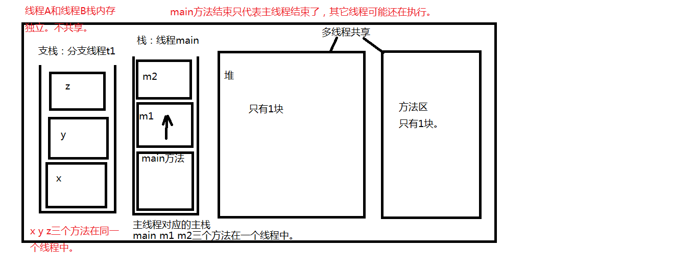
			
火车站，可以看做是一个进程。火车站中的每一个售票窗口可以看做是一个线程。我在窗口1购票，你可以在窗口2购票，你不需要等我，我也不需要等你。所以多线程并发可以提高效率。

java中之所以有多线程机制，目的就是为了提高程序的处理效率。

4、思考一个问题：
使用了多线程机制之后，main方法结束，是不是有可能程序也不会结束。
main方法结束只是主线程结束了，主栈空了，其它的栈(线程)可能还在压栈弹栈。

5、分析一个问题：对于单核的CPU来说，真的可以做到真正的多线程并发吗？
对于多核的CPU电脑来说，真正的多线程并发是没问题的。4核CPU表示同一个时间点上，可以真正的有4个进程并发执行。

什么是真正的多线程并发？
t1线程执行t1的。t2线程执行t2的。t1不会影响t2，t2也不会影响t1（多个线程同时执行，而非来回切换）。这叫做真正的多线程并发。

单核的CPU表示只有一个大脑：不能够做到真正的多线程并发，但是可以做到给人一种“多线程并发”的感觉。对于单核的CPU来说，在某一个时间点上实际上只能处理一件事情，但是由于CPU的处理速度极快，多个线程之间频繁切换执行，跟人来的感觉是：多个事情同时在做！！！！！
	线程A：播放音乐
	线程B：运行魔兽游戏
	线程A和线程B频繁切换执行，人类会感觉音乐一直在播放，游戏一直在运行，给我们的感觉是同时并发的。
	
5、java语言中，实现线程有两种方式，那两种方式呢？
java支持多线程机制。并且java已经将多线程实现了，我们只需要继承就行了。
第一种方式：编写一个类，直接继承java.lang.Thread，重写run方法。
```java
// 定义线程类
public class MyThread extends Thread{
	public void run(){
	
	}
}
// 创建线程对象
MyThread t = new MyThread();
// 启动线程。
t.start();
```
第二种方式：编写一个类，实现java.lang.Runnable接口，实现run方法。
```java
// 定义一个可运行的类
public class MyRunnable implements Runnable {
	public void run(){
			
	}
}
// 创建线程对象
Thread t = new Thread(new MyRunnable());
// 启动线程
t.start();
```
注意：第二种方式实现接口比较常用，因为一个类实现了接口，它还可以去继承其它的类，更灵活。

6、关于线程对象的生命周期？
	新建状态
	就绪状态
	运行状态
	阻塞状态
	死亡状态
## 线程创建
### 1、继承Thread类
继承Thread类，重写run()方法
```java
package com.apexsoft.jse.p04threadTest.thread;
/**
实现线程的第一种方式：
    编写一个类，直接继承java.lang.Thread，重写run方法。

    怎么创建线程对象？ new就行了。
    怎么启动线程呢？ 调用线程对象的start()方法。

注意：
    亘古不变的道理：
        方法体当中的代码永远都是自上而下的顺序依次逐行执行的。

以下程序的输出结果有这样的特点：
    有先有后。
    有多有少。
    这是咋回事？这里画一个问号？？？？？？？？？？？？？？？？？？？？？？？
 */
public class ThreadTest02 {
    public static void main(String[] args) {
        // 这里是main方法，这里的代码属于主线程，在主栈中运行。
        // 新建一个分支线程对象
        MyThread t = new MyThread();
        // 启动线程
        //t.run(); // 不会启动线程，不会分配新的分支栈。（这种方式就是单线程。）
        // start()方法的作用是：启动一个分支线程，在JVM中开辟一个新的栈空间，这段代码任务完成之后，瞬间就结束了。
        // 这段代码的任务只是为了开启一个新的栈空间，只要新的栈空间开出来，start()方法就结束了。线程就启动成功了。
        // 启动成功的线程会自动调用run方法，并且run方法在分支栈的栈底部（压栈）。
        // run方法在分支栈的栈底部，main方法在主栈的栈底部。run和main是平级的。
        //t.start()执行不结束，后界面的for循环不会执行，只是这句代码执行的非常快，执行完后下面、
        //的for循环开始执行
        t.start();
        // 这里的代码还是运行在主线程中。
        for(int i = 0; i < 1000; i++){
            System.out.println("主线程--->" + i);
        }
    }
}

class MyThread extends Thread {
    @Override
    public void run() {
        // 编写程序，这段程序运行在分支线程中（分支栈）。
        for(int i = 0; i < 1000; i++){
            System.out.println("分支线程--->" + i);
        }
    }
}

```
直接调用t.run()内存图
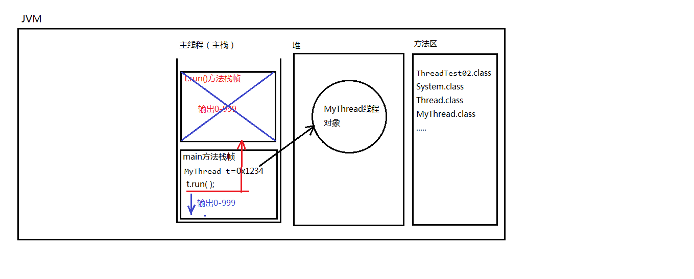
调用t.start()内存图
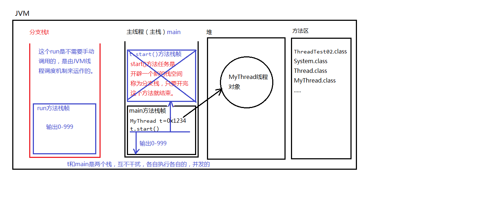

### 2、实现Runnable接口
实现Runnable接口，实现run()方法
```java
package com.apexsoft.jse.p04threadTest.thread;
/**
实现线程的第二种方式，编写一个类实现java.lang.Runnable接口。
 */
public class ThreadTest03 {
    public static void main(String[] args) {
        // 创建一个可运行的对象
        //MyRunnable r = new MyRunnable();
        // 将可运行的对象封装成一个线程对象
        //Thread t = new Thread(r);
        Thread t = new Thread(new MyRunnable()); // 合并代码
        // 启动线程
        t.start();

        for(int i = 0; i < 100; i++){
            System.out.println("主线程--->" + i);
        }
    }
}

// 这并不是一个线程类，是一个可运行的类。它还不是一个线程。
class MyRunnable implements Runnable {

    @Override
    public void run() {
        for(int i = 0; i < 100; i++){
            System.out.println("分支线程--->" + i);
        }
    }
}

```
采用匿名内部类实现
```java
package com.apexsoft.jse.p04threadTest.thread;

/**
采用匿名内部类可以吗？
 */
public class ThreadTest04 {
    public static void main(String[] args) {
        // 创建线程对象，采用匿名内部类方式。
        // 这是通过一个没有名字的类，new出来的对象。
        Thread t = new Thread(new Runnable(){
            @Override
            public void run() {
                for(int i = 0; i < 100; i++){
                    System.out.println("t线程---> " + i);
                }
            }
        });

        // 启动线程
        t.start();

        for(int i = 0; i < 100; i++){
            System.out.println("main线程---> " + i);
        }
    }
}

```
## 线程生命周期

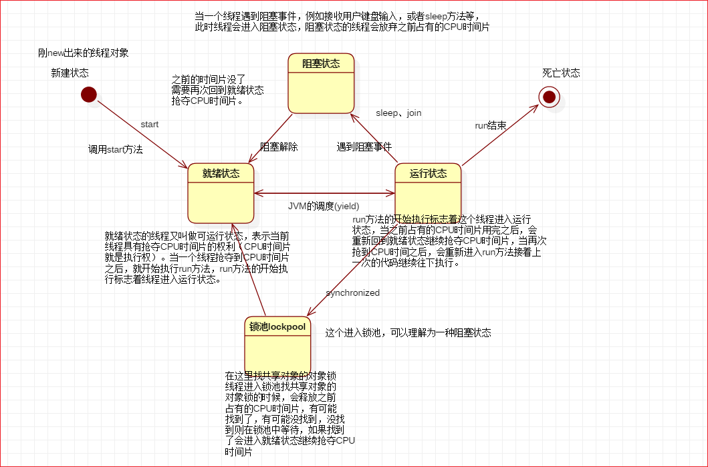

## 获取线程名字
```java
package com.apexsoft.jse.p04threadTest.thread;
/**
1、怎么获取当前线程对象？
    Thread t = Thread.currentThread();
    返回值t就是当前线程。

2、获取线程对象的名字
    String name = 线程对象.getName();

3、修改线程对象的名字
    线程对象.setName("线程名字");

4、当线程没有设置名字的时候，默认的名字有什么规律？（了解一下）
    Thread-0
    Thread-1
    Thread-2
    Thread-3
    .....
 */
public class ThreadTest05 {
    public void doSome(){
        // 这样就不行了
        //this.getName();
        //super.getName();
        // 但是这样可以
        String name = Thread.currentThread().getName();
        System.out.println("------->" + name);
    }

    public static void main(String[] args) {
        ThreadTest05 tt = new ThreadTest05();
        tt.doSome();

        //currentThread就是当前线程对象
        // 这个代码出现在main方法当中，所以当前线程就是主线程。
        Thread currentThread = Thread.currentThread();
        System.out.println(currentThread.getName()); //main

        // 创建线程对象
        MyThread2 t = new MyThread2();
        // 设置线程的名字
        t.setName("t1");
        // 获取线程的名字
        String tName = t.getName();
        System.out.println(tName); //Thread-0

        MyThread2 t2 = new MyThread2();
        t2.setName("t2");
        System.out.println(t2.getName()); //Thread-1\
        t2.start();

        // 启动线程
        t.start();
    }
}

class MyThread2 extends Thread {
    public void run(){
        for(int i = 0; i < 100; i++){
            // currentThread就是当前线程对象。当前线程是谁呢？
            // 当t1线程执行run方法，那么这个当前线程就是t1
            // 当t2线程执行run方法，那么这个当前线程就是t2
            Thread currentThread = Thread.currentThread();
            System.out.println(currentThread.getName() + "-->" + i);

            //System.out.println(super.getName() + "-->" + i);
            //System.out.println(this.getName() + "-->" + i);
        }
    }
}

```
## 获取当前线程对象
```java
Thread.currentThread()
```
## 线程睡眠sleep()方法
static void sleep(long millis)
 1、静态方法：Thread.sleep(1000);
 2、参数是毫秒
 3、作用：让当前线程进入休眠，进入“阻塞状态”，放弃占有CPU时间片，让给其它线程使用。
      这行代码出现在A线程中，A线程就会进入休眠。
      这行代码出现在B线程中，B线程就会进入休眠。
  4、Thread.sleep()方法，可以做到这种效果：
      间隔特定的时间，去执行一段特定的代码，每隔多久执行一次。
```java
package com.apexsoft.jse.p04threadTest.thread;
/**
关于线程的sleep方法：
    static void sleep(long millis)
    1、静态方法：Thread.sleep(1000);
    2、参数是毫秒
    3、作用：让当前线程进入休眠，进入“阻塞状态”，放弃占有CPU时间片，让给其它线程使用。
        这行代码出现在A线程中，A线程就会进入休眠。
        这行代码出现在B线程中，B线程就会进入休眠。
    4、Thread.sleep()方法，可以做到这种效果：
        间隔特定的时间，去执行一段特定的代码，每隔多久执行一次。
 */
public class ThreadTest06 {
    public static void main(String[] args) {

        // 让当前线程进入休眠，睡眠5秒
        // 当前线程是主线程！！！
        /*try {
            Thread.sleep(1000 * 5);
        } catch (InterruptedException e) {
            e.printStackTrace();
        }*/

        // 5秒之后执行这里的代码
        //System.out.println("hello world!");

        for(int i = 0; i < 10; i++){
            System.out.println(Thread.currentThread().getName() + "--->" + i);

            // 睡眠1秒
            try {
                Thread.sleep(1000);
            } catch (InterruptedException e) {
                e.printStackTrace();
            }
        }
    }
}

```
sleep面试题
```java
package com.apexsoft.jse.p04threadTest.thread;
/**
关于Thread.sleep()方法的一个面试题：
 */
public class ThreadTest07 {
    public static void main(String[] args) {
        // 创建线程对象
        Thread t = new MyThread3();
        t.setName("t");
        t.start();

        // 调用sleep方法
        try {
            // 问题：这行代码会让线程t进入休眠状态吗？
            t.sleep(1000 * 5); // 在执行的时候还是会转换成：Thread.sleep(1000 * 5);
                                     // 这行代码的作用是：让当前线程进入休眠，也就是说main线程进入休眠。
                                     // 这样代码出现在main方法中，main线程睡眠。
        } catch (InterruptedException e) {
            e.printStackTrace();
        }

        // 5秒之后这里才会执行。
        System.out.println("hello World!");
    }
}

class MyThread3 extends Thread {
    public void run(){
        for(int i = 0; i < 10000; i++){
            System.out.println(Thread.currentThread().getName() + "--->" + i);
        }
    }
}

```
## 线程睡眠终止interrupt()方法
```java
package com.apexsoft.jse.p04threadTest.thread;
/**
sleep睡眠太久了，如果希望半道上醒来，你应该怎么办？也就是说怎么叫醒一个正在睡眠的线程？？
    注意：这个不是终断线程的执行，是终止线程的睡眠。
 */
public class ThreadTest08 {
    public static void main(String[] args) {
        Thread t = new Thread(new MyRunnable2());
        t.setName("t");
        t.start();

        // 希望5秒之后，t线程醒来（5秒之后主线程手里的活儿干完了。）
        try {
            Thread.sleep(1000 * 5);
        } catch (InterruptedException e) {
            e.printStackTrace();
        }
        // 终断t线程的睡眠（这种终断睡眠的方式依靠了java的异常处理机制。）
        t.interrupt(); // 干扰，一盆冷水过去！
    }
}

class MyRunnable2 implements Runnable {

    // 重点：run()当中的异常不能throws，只能try catch
    // 因为run()方法在父类中没有抛出任何异常，子类不能比父类抛出更多的异常。
    @Override
    public void run() {
        System.out.println(Thread.currentThread().getName() + "---> begin");
        try {
            // 睡眠1年
            Thread.sleep(1000 * 60 * 60 * 24 * 365);
        } catch (InterruptedException e) {
            // 打印异常信息
            //e.printStackTrace();
        }
        //1年之后才会执行这里
        System.out.println(Thread.currentThread().getName() + "---> end");

        // 调用doOther
        //doOther();
    }

    // 其它方法可以throws
    /*public void doOther() throws Exception{

    }*/
}

```
注意与Thread.interrupted()的区别
## 线程终止stop()方法
```java
package com.apexsoft.jse.p04threadTest.thread;
/**
在java中怎么强行终止一个线程的执行。
    这种方式存在很大的缺点：容易丢失数据。因为这种方式是直接将线程杀死了，
    线程没有保存的数据将会丢失。不建议使用。
 */
public class ThreadTest09 {
    public static void main(String[] args) {
        Thread t = new Thread(new MyRunnable3());
        t.setName("t");
        t.start();

        // 模拟5秒
        try {
            Thread.sleep(1000 * 5);
        } catch (InterruptedException e) {
            e.printStackTrace();
        }
        // 5秒之后强行终止t线程
        t.stop(); // 已过时（不建议使用。）
    }
}

class MyRunnable3 implements Runnable {

    @Override
    public void run() {
        for(int i = 0; i < 10; i++){
            System.out.println(Thread.currentThread().getName() + "--->" + i);
            try {
                Thread.sleep(1000);
            } catch (InterruptedException e) {
                e.printStackTrace();
            }
        }
    }
}

```
## 线程终止-boolean标记法
```java
package com.apexsoft.jse.p04threadTest.thread;
/**
怎么合理的终止一个线程的执行。这种方式是很常用的。
 */
public class ThreadTest10 {
    public static void main(String[] args) {
        MyRunable4 r = new MyRunable4();
        Thread t = new Thread(r);
        t.setName("t");
        t.start();

        // 模拟5秒
        try {
            Thread.sleep(5000);
        } catch (InterruptedException e) {
            e.printStackTrace();
        }
        // 终止线程
        // 你想要什么时候终止t的执行，那么你把标记修改为false，就结束了。
        r.run = false;
    }
}

class MyRunable4 implements Runnable {

    // 打一个布尔标记
    boolean run = true;

    @Override
    public void run() {
        for (int i = 0; i < 10; i++){
            if(run){
                System.out.println(Thread.currentThread().getName() + "--->" + i);
                try {
                    Thread.sleep(1000);
                } catch (InterruptedException e) {
                    e.printStackTrace();
                }
            }else{
                // return就结束了，你在结束之前还有什么没保存的。
                // 在这里可以保存呀。
                //save....

                //终止当前线程
                return;
            }
        }
    }
}

```
## 线程调度
### 总结
1、常见的线程调度模型有哪些？
1.2、抢占式调度模型：
那个线程的优先级比较高，抢到的CPU时间片的概率就高一些/多一些。
	java采用的就是抢占式调度模型。
1.3、均分式调度模型：
	平均分配CPU时间片。每个线程占有的CPU时间片时间长度一样。
	平均分配，一切平等。
	有一些编程语言，线程调度模型采用的是这种方式。

2、java中提供了哪些方法是和线程调度有关系的呢？
2.1、实例方法：
void setPriority(int newPriority) 设置线程的优先级
	int getPriority() 获取线程优先级
	最低优先级1
	默认优先级是5
	最高优先级10
	优先级比较高的获取CPU时间片可能会多一些。（但也不完全是，大概率是多的。）
2.2、静态方法：
	static void yield()  让位方法
	暂停当前正在执行的线程对象，并执行其他线程
	yield()方法不是阻塞方法。让当前线程让位，让给其它线程使用。
	yield()方法的执行会让当前线程从“运行状态”回到“就绪状态”。
	注意：在回到就绪之后，有可能还会再次抢到。
2.3、实例方法：
	void join()  
	合并线程
```java
class MyThread1 extends Thread {
	public void doSome(){
		MyThread2 t = new MyThread2();
		t.join(); // 当前线程进入阻塞，t线程执行，直到t线程结束。当前线程才可以继续。
	}
}

class MyThread2 extends Thread{	
    
}
```
### 线程优先级
最高优先级 Thread.MAX_PRIORITY
最低优先级 Thread.MIN_PRIORITY
默认优先级 Thread.NORM_PRIORITY
优先级较高的，只是抢到的CPU时间片相对多一些
```java
package com.apexsoft.jse.p04threadTest.thread;

/**
了解：关于线程的优先级
 */
public class ThreadTest11 {
    public static void main(String[] args) {
        // 设置主线程的优先级为1
        Thread.currentThread().setPriority(1);

        /*System.out.println("最高优先级" + Thread.MAX_PRIORITY);
        System.out.println("最低优先级" + Thread.MIN_PRIORITY);
        System.out.println("默认优先级" + Thread.NORM_PRIORITY);*/

        // 获取当前线程对象，获取当前线程的优先级
        Thread currentThread = Thread.currentThread();
        // main线程的默认优先级是：5
        //System.out.println(currentThread.getName() + "线程的默认优先级是：" + currentThread.getPriority());

        Thread t = new Thread(new MyRunnable5());
        t.setPriority(10);
        t.setName("t");
        t.start();

        // 优先级较高的，只是抢到的CPU时间片相对多一些。
        // 大概率方向更偏向于优先级比较高的。
        for(int i = 0; i < 10000; i++){
            System.out.println(Thread.currentThread().getName() + "-->" + i);
        }


    }
}

class MyRunnable5 implements Runnable {

    @Override
    public void run() {
        // 获取线程优先级
        //System.out.println(Thread.currentThread().getName() + "线程的默认优先级：" + Thread.currentThread().getPriority());
        for(int i = 0; i < 10000; i++){
            System.out.println(Thread.currentThread().getName() + "-->" + i);
        }
    }
}

```
### 线程让位
```java
package com.apexsoft.jse.p04threadTest.thread;

/**
让位，当前线程暂停，回到就绪状态，让给其它线程。
静态方法：Thread.yield();
 */
public class ThreadTest12 {
    public static void main(String[] args) {
        Thread t = new Thread(new MyRunnable6());
        t.setName("t");
        t.start();

        for(int i = 1; i <= 10000; i++) {
            System.out.println(Thread.currentThread().getName() + "--->" + i);
        }
    }
}

class MyRunnable6 implements Runnable {

    @Override
    public void run() {
        for(int i = 1; i <= 10000; i++) {
            //每100个让位一次。
            if(i % 100 == 0){
                Thread.yield(); // 当前线程暂停一下，让给主线程。
            }
            System.out.println(Thread.currentThread().getName() + "--->" + i);
        }
    }
}

```
### 线程合并
```java
package com.apexsoft.jse.p04threadTest.thread;

/**
线程合并
 */
public class ThreadTest13 {
    public static void main(String[] args) {
        System.out.println("main begin");

        Thread t = new Thread(new MyRunnable7());
        t.setName("t");
        t.start();

        //合并线程
        try {
            t.join(); // t合并到当前线程中，当前线程受阻塞，t线程执行直到结束。
        } catch (InterruptedException e) {
            e.printStackTrace();
        }

        System.out.println("main over");//最后执行
    }
}

class MyRunnable7 implements Runnable {

    @Override
    public void run() {
        for(int i = 0; i < 10000; i++){
            System.out.println(Thread.currentThread().getName() + "--->" + i);
        }
    }
}

```
## 线程安全
### 总结
2.1、为什么这个是重点？
以后在开发中，我们的项目都是运行在服务器当中，而服务器已经将线程的定义，线程对象的创建，线程的启动等，都已经实现完了。这些代码我们都不需要编写。
最重要的是：你要知道，你编写的程序需要放到一个多线程的环境下运行，你更需要关注的是这些数据在多线程并发的环境下是否是安全的。（重点：*****）
2.2、什么时候数据在多线程并发的环境下会存在安全问题呢？
三个条件：
	条件1：多线程并发。
	条件2：有共享数据。
	条件3：共享数据有修改的行为。

	满足以上3个条件之后，就会存在线程安全问题。
2.3、怎么解决线程安全问题呢？
当多线程并发的环境下，有共享数据，并且这个数据还会被修改，此时就存在线程安全问题，怎么解决这个问题？
	线程排队执行（不能并发）。
	线程同步机制：用排队执行解决线程安全问题。

	专业术语叫做：线程同步，实际上就是线程不能并发了，线程必须排队执行。
		
	怎么解决线程安全问题呀？
	使用“线程同步机制”。
		
	线程同步就是线程排队了，线程排队了就会牺牲一部分效率，没办法，数据安全
	第一位，只有数据安全了，我们才可以谈效率。数据不安全，没有效率的事儿。

2.4、说到线程同步这块，涉及到这两个专业术语：
异步编程模型：
	线程t1和线程t2，各自执行各自的，t1不管t2，t2不管t1，谁也不需要等谁，这种编程模型叫做：异步编程模型。其实就是：多线程并发（效率较高。）**异步就是并发**。
同步编程模型：
	线程t1和线程t2，在线程t1执行的时候，必须等待t2线程执行结束，或者说在t2线程执行的时候，必须等待t1线程执行结束，两个线程之间发生了等待关系，这就是同步编程模型。效率较低。线程排队执行。**同步就是排队**。
### 线程不安全问题
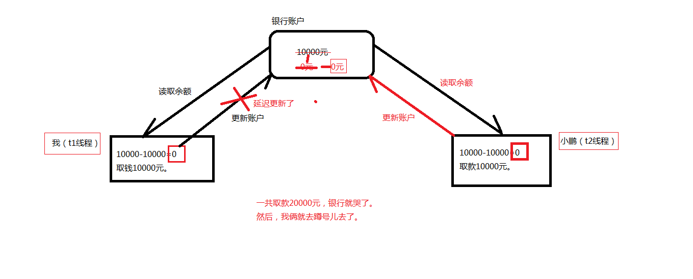
### 取款问题
```java
package com.apexsoft.jse.p04threadTest.threadsafe;
/**
银行账户
    不使用线程同步机制，多线程对同一个账户进行取款，出现线程安全问题。
 */
public class Account {
    // 账号
    private String actno;
    // 余额
    private double balance;

    public Account() {
    }

    public Account(String actno, double balance) {
        this.actno = actno;
        this.balance = balance;
    }

    public String getActno() {
        return actno;
    }

    public void setActno(String actno) {
        this.actno = actno;
    }

    public double getBalance() {
        return balance;
    }

    public void setBalance(double balance) {
        this.balance = balance;
    }

    //取款的方法
    public void withdraw(double money){
        // t1和t2并发这个方法。。。。（t1和t2是两个栈。两个栈操作堆中同一个对象。）
        // 取款之前的余额
        double before = this.getBalance(); // 10000
        // 取款之后的余额
        double after = before - money;

        // 在这里模拟一下网络延迟，100%会出现问题
        try {
            Thread.sleep(1000);
        } catch (InterruptedException e) {
            e.printStackTrace();
        }

        // 更新余额
        // 思考：t1执行到这里了，但还没有来得及执行这行代码，t2线程进来withdraw方法了。此时一定出问题。
        this.setBalance(after);
    }
}
```
```java
package com.apexsoft.jse.p04threadTest.threadsafe;

public class AccountThread extends Thread {

    // 两个线程必须共享同一个账户对象。
    private Account act;

    // 通过构造方法传递过来账户对象
    public AccountThread(Account act) {
        this.act = act;
    }

    @Override
    public void run(){
        // run方法的执行表示取款操作。
        // 假设取款5000
        double money = 5000;
        // 取款
        // 多线程并发执行这个方法。
        act.withdraw(money);

        System.out.println(Thread.currentThread().getName() + "对"+act.getActno()+"取款"+money+"成功，余额" + act.getBalance());
    }
}

```
```java
package com.apexsoft.jse.p04threadTest.threadsafe;

public class Test {
    public static void main(String[] args) {
        // 创建账户对象（只创建1个）
        Account act = new Account("act-001", 10000);
        // 创建两个线程
        Thread t1 = new AccountThread(act);
        Thread t2 = new AccountThread(act);
        // 设置name
        t1.setName("t1");
        t2.setName("t2");
        // 启动线程取款
        t1.start();
        t2.start();
    }
}

```

### sychronized
```java
package com.apexsoft.jse.p04threadTest.threadsafe2;
/**
银行账户
    使用线程同步机制，解决线程安全问题。
 */
public class Account {
    // 账号
    private String actno;
    // 余额
    private double balance; //实例变量。

    //对象
    Object obj = new Object(); // 实例变量。（Account对象是多线程共享的，Account对象中的实例变量obj也是共享的。）

    public Account() {
    }

    public Account(String actno, double balance) {
        this.actno = actno;
        this.balance = balance;
    }

    public String getActno() {
        return actno;
    }

    public void setActno(String actno) {
        this.actno = actno;
    }

    public double getBalance() {
        return balance;
    }

    public void setBalance(double balance) {
        this.balance = balance;
    }

    //取款的方法
    public void withdraw(double money){

        //int i = 100;
        //i = 101;

        // 以下这几行代码必须是线程排队的，不能并发。
        // 一个线程把这里的代码全部执行结束之后，另一个线程才能进来。
        /**
        线程同步机制的语法是：
            synchronized(){
                // 线程同步代码块。
            }
            synchronized后面小括号中传的这个“数据”是相当关键的。
            这个数据必须是多线程共享的数据。才能达到多线程排队。

            ()中写什么？
                那要看你想让哪些线程同步。
                假设t1、t2、t3、t4、t5，有5个线程，
                你只希望t1 t2 t3排队，t4 t5不需要排队。怎么办？
                你一定要在()中写一个t1 t2 t3共享的对象。而这个
                对象对于t4 t5来说不是共享的。

            这里的共享对象是：账户对象。
            账户对象是共享的，那么this就是账户对象吧！！！
            不一定是this，这里只要是多线程共享的那个对象就行。

            在java语言中，任何一个对象都有“一把锁”，其实这把锁就是标记。（只是把它叫做锁。）
            100个对象，100把锁。1个对象1把锁。

            以下代码的执行原理？
                1、假设t1和t2线程并发，开始执行以下代码的时候，肯定有一个先一个后。
                2、假设t1先执行了，遇到了synchronized，这个时候自动找“后面共享对象”的对象锁，
                找到之后，并占有这把锁，然后执行同步代码块中的程序，在程序执行过程中一直都是
                占有这把锁的。直到同步代码块代码结束，这把锁才会释放。
                3、假设t1已经占有这把锁，此时t2也遇到synchronized关键字，也会去占有后面
                共享对象的这把锁，结果这把锁被t1占有，t2只能在同步代码块外面等待t1的结束，
                直到t1把同步代码块执行结束了，t1会归还这把锁，此时t2终于等到这把锁，然后
                t2占有这把锁之后，进入同步代码块执行程序。

                这样就达到了线程排队执行。
                这里需要注意的是：这个共享对象一定要选好了。这个共享对象一定是你需要排队
                执行的这些线程对象所共享的。
         */
        //Object obj2 = new Object();
        synchronized (this){
        //共享Account对象，必然共享obj，此种写法也可以（只要保证多个线程操作的对象是共享的（唯一的），就能保证同一时间只有一个线程能拿到锁，就能实现排队）
        //synchronized (obj) { 
        //synchronized ("abc") { // "abc"在字符串常量池当中。--->只有一个对象--->唯一对象--->同一时间只有一个线程能拿到锁:所有线程都会同步
        //synchronized (null) { // 报错：空指针。
        //synchronized (obj2) { // 这样编写就不安全了。因为obj2不是共享对象。
            double before = this.getBalance();
            double after = before - money;
            try {
                Thread.sleep(1000);
            } catch (InterruptedException e) {
                e.printStackTrace();
            }
            this.setBalance(after);
        }
    }
}
```
```java
package com.apexsoft.jse.p04threadTest.threadsafe2;

public class AccountThread extends Thread {

    // 两个线程必须共享同一个账户对象。
    private Account act;

    // 通过构造方法传递过来账户对象
    public AccountThread(Account act) {
        this.act = act;
    }

    @Override
    public void run(){
        // run方法的执行表示取款操作。
        // 假设取款5000
        double money = 5000;
        // 取款
        // 多线程并发执行这个方法。
        act.withdraw(money);
        System.out.println(Thread.currentThread().getName() + "对"+act.getActno()+"取款"+money+"成功，余额" + act.getBalance());
    }
}

```
```java
package com.apexsoft.jse.p04threadTest.threadsafe2;

public class Test {
    public static void main(String[] args) {
        // 创建账户对象（只创建1个）
        Account act = new Account("act-001", 10000);
        // 创建两个线程
        Thread t1 = new AccountThread(act);
        Thread t2 = new AccountThread(act);

        // 设置name
        t1.setName("t1");
        t2.setName("t2");
        // 启动线程取款
        t1.start();
        t2.start();
    }
}

```

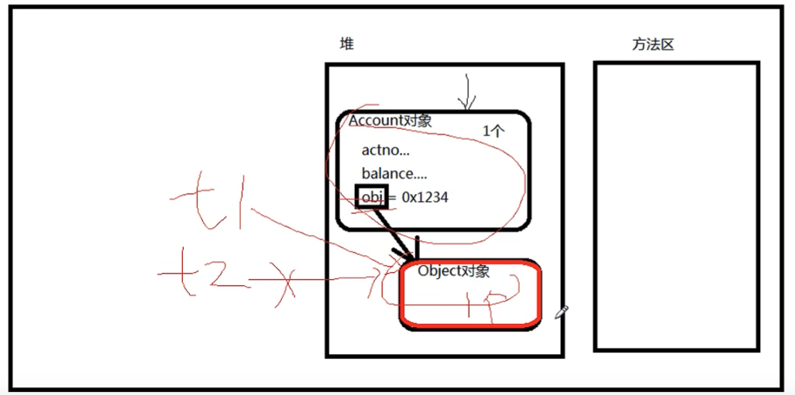
扩大范围 对withdraw方法添加sychronized，修改上面代码为，同样可以实现现场安全

```java
package com.apexsoft.jse.p04threadTest.threadsafe2;
/**
银行账户
    使用线程同步机制，解决线程安全问题。
 */
public class Account {
    // 账号
    private String actno;
    // 余额
    private double balance; //实例变量。

    //对象
    Object obj = new Object(); // 实例变量。（Account对象是多线程共享的，Account对象中的实例变量obj也是共享的。）

    public Account() {
    }

    public Account(String actno, double balance) {
        this.actno = actno;
        this.balance = balance;
    }

    public String getActno() {
        return actno;
    }

    public void setActno(String actno) {
        this.actno = actno;
    }

    public double getBalance() {
        return balance;
    }

    public void setBalance(double balance) {
        this.balance = balance;
    }

    //取款的方法
    public void withdraw(double money){
        double before = this.getBalance();
        double after = before - money;
        try {
            Thread.sleep(1000);
        } catch (InterruptedException e) {
            e.printStackTrace();
        }
        this.setBalance(after);
    }
}
```
```java
package com.apexsoft.jse.p04threadTest.threadsafe2;

public class AccountThread extends Thread {

    // 两个线程必须共享同一个账户对象。
    private Account act;

    // 通过构造方法传递过来账户对象
    public AccountThread(Account act) {
        this.act = act;
    }

    @Override
    public void run(){
        // run方法的执行表示取款操作。
        // 假设取款5000
        double money = 5000;
        // 取款
        // 多线程并发执行这个方法。
        //synchronized (this) { //这里的this是AccountThread对象，这个对象不共享！
        synchronized (act) { // 这种方式也可以，只不过扩大了同步的范围，效率更低了。
            act.withdraw(money);
        }

        System.out.println(Thread.currentThread().getName() + "对"+act.getActno()+"取款"+money+"成功，余额" + act.getBalance());
    }
}

```
```java
package com.apexsoft.jse.p04threadTest.threadsafe2;

public class Test {
    public static void main(String[] args) {
        // 创建账户对象（只创建1个）
        Account act = new Account("act-001", 10000);
        // 创建两个线程
        Thread t1 = new AccountThread(act);
        Thread t2 = new AccountThread(act);

        // 设置name
        t1.setName("t1");
        t2.setName("t2");
        // 启动线程取款
        t1.start();
        t2.start();
    }
}

```

### sychronized方法
    在实例方法上可以使用synchronized吗？可以的。
        synchronized出现在实例方法上，一定锁的是this。
        没得挑。只能是this。不能是其他的对象了。
        所以这种方式不灵活。
    
        另外还有一个缺点：synchronized出现在实例方法上，
        表示整个方法体都需要同步，可能会无故扩大同步的
        范围，导致程序的执行效率降低。所以这种方式不常用。
    
        synchronized使用在实例方法上有什么优点？
            代码写的少了。节俭了。
    
        如果共享的对象就是this，并且需要同步的代码块是整个方法体，
        建议使用这种方式。
```java
package com.apexsoft.jse.p04threadTest.threadsafe3;

public class Account {
    // 账号
    private String actno;
    // 余额
    private double balance;

    public Account() {
    }

    public Account(String actno, double balance) {
        this.actno = actno;
        this.balance = balance;
    }

    public String getActno() {
        return actno;
    }

    public void setActno(String actno) {
        this.actno = actno;
    }

    public double getBalance() {
        return balance;
    }

    public void setBalance(double balance) {
        this.balance = balance;
    }

    //取款的方法
    /**
    在实例方法上可以使用synchronized吗？可以的。
        synchronized出现在实例方法上，一定锁的是this。
        没得挑。只能是this。不能是其他的对象了。
        所以这种方式不灵活。

        另外还有一个缺点：synchronized出现在实例方法上，
        表示整个方法体都需要同步，可能会无故扩大同步的
        范围，导致程序的执行效率降低。所以这种方式不常用。

        synchronized使用在实例方法上有什么优点？
            代码写的少了。节俭了。

        如果共享的对象就是this，并且需要同步的代码块是整个方法体，
        建议使用这种方式。
     */
    public synchronized void withdraw(double money){
        double before = this.getBalance(); // 10000
        double after = before - money;
        try {
            Thread.sleep(1000);
        } catch (InterruptedException e) {
            e.printStackTrace();
        }
        this.setBalance(after);
    }
}
```
```java
package com.apexsoft.jse.p04threadTest.threadsafe3;

public class AccountThread extends Thread {

    // 两个线程必须共享同一个账户对象。
    private Account act;

    // 通过构造方法传递过来账户对象
    public AccountThread(Account act) {
        this.act = act;
    }

    @Override
    public void run(){
        // run方法的执行表示取款操作。
        // 假设取款5000
        double money = 5000;
        // 取款
        // 多线程并发执行这个方法。
        act.withdraw(money);

        System.out.println(Thread.currentThread().getName() + "对"+act.getActno()+"取款"+money+"成功，余额" + act.getBalance());
    }
}

```
```java
package com.apexsoft.jse.p04threadTest.threadsafe3;

public class Test {
    public static void main(String[] args) {
        // 创建账户对象（只创建1个）
        Account act = new Account("act-001", 10000);
        // 创建两个线程
        Thread t1 = new AccountThread(act);
        Thread t2 = new AccountThread(act);
        // 设置name
        t1.setName("t1");
        t2.setName("t2");
        // 启动线程取款
        t1.start();
        t2.start();
    }
}

```

### sycronized的3种用法
第一种：同步代码块
灵活
```java
synchronized(线程共享对象){
	同步代码块;
}
```
第二种：在实例方法上使用synchronized
表示共享对象一定是this
并且同步代码块是整个方法体。
第三种：在静态方法上使用synchronized
	表示找类锁。
	类锁永远只有1把。
	就算创建了100个对象，那类锁也只有一把。

对象锁：1个对象1把锁，100个对象100把锁。
类锁：100个对象，也可能只是1把类锁。
synchronized面试题
1、对象有多个方法，有synchronized方法，也有非synchronized方法，当一个线程获取到对象锁执行synchronized方法，另一个线程执行非synchronized方法不受限制
```java
package com.apexsoft.jse.p04threadTest.exam1;

import java.text.SimpleDateFormat;
import java.util.Date;

// 面试题：doOther方法执行的时候需要等待doSome方法的结束吗？

/**不需要，因为doOther()方法没有synchronized,有synchronized的方法才需要获取当前对象的锁
 * 获取到对象的锁才能执行代码，而没有synchronized的方法不需要获取对象的锁，代码可以直接执行
 */

public class Exam01 {
    public static void main(String[] args) throws InterruptedException {
        MyClass mc = new MyClass();

        Thread t1 = new MyThread(mc);
        Thread t2 = new MyThread(mc);

        t1.setName("t1");
        t2.setName("t2");

        t1.start();
        //这个睡眠的作用是：为了保证t1线程先执行。
        Thread.sleep(1000);
        t2.start();
    }
}

class MyThread extends Thread {
    private MyClass mc;
    public MyThread(MyClass mc){
        this.mc = mc;
    }
    @Override
    public void run(){
        if(Thread.currentThread().getName().equals("t1")){
            mc.doSome();
        }
        if(Thread.currentThread().getName().equals("t2")){
            mc.doOther();
        }
    }
}

class MyClass {
    public synchronized void doSome(){
        System.out.println(new SimpleDateFormat("yyyy-MM-dd HH:mm:ss").format(new Date(System.currentTimeMillis()))+"---doSome begin");
        try {
            Thread.sleep(1000 * 10);
        } catch (InterruptedException e) {
            e.printStackTrace();
        }
        System.out.println(new SimpleDateFormat("yyyy-MM-dd HH:mm:ss").format(new Date(System.currentTimeMillis()))+"---doSome over");
    }
    public void doOther(){
        System.out.println(new SimpleDateFormat("yyyy-MM-dd HH:mm:ss").format(new Date(System.currentTimeMillis()))+"---doOther begin");
        System.out.println(new SimpleDateFormat("yyyy-MM-dd HH:mm:ss").format(new Date(System.currentTimeMillis()))+"---doOther over");
    }
}

```

2、对象有多个synchronized方法，当一个线程获取到对象锁执行synchronized方法，另一个线程无法在此期间执行对象的另一个synchronized方法，必须等上一个synchronized方法执行完毕并且获取到对象锁才能执行
```java
package com.apexsoft.jse.p04threadTest.exam2;

// 面试题：doOther方法执行的时候需要等待doSome方法的结束吗？

import java.text.SimpleDateFormat;
import java.util.Date;

/**需要
 *
 */
public class Exam01 {
    public static void main(String[] args) throws InterruptedException {
        MyClass mc = new MyClass();

        Thread t1 = new MyThread(mc);
        Thread t2 = new MyThread(mc);

        t1.setName("t1");
        t2.setName("t2");

        t1.start();
        //这个睡眠的作用是：为了保证t1线程先执行。
        Thread.sleep(1000);
        t2.start();
    }
}

class MyThread extends Thread {
    private MyClass mc;
    public MyThread(MyClass mc){
        this.mc = mc;
    }
    @Override
    public void run(){
        if(Thread.currentThread().getName().equals("t1")){
            mc.doSome();
        }
        if(Thread.currentThread().getName().equals("t2")){
            mc.doOther();
        }
    }
}

class MyClass {
    public synchronized void doSome(){
        System.out.println(new SimpleDateFormat("yyyy-MM-dd HH:mm:ss").format(new Date(System.currentTimeMillis()))+"---doSome begin");
        try {
            Thread.sleep(1000 * 10);
        } catch (InterruptedException e) {
            e.printStackTrace();
        }
        System.out.println(new SimpleDateFormat("yyyy-MM-dd HH:mm:ss").format(new Date(System.currentTimeMillis()))+"---doSome over");
    }
    public synchronized void doOther(){
        System.out.println(new SimpleDateFormat("yyyy-MM-dd HH:mm:ss").format(new Date(System.currentTimeMillis()))+"---doOther begin");
        System.out.println(new SimpleDateFormat("yyyy-MM-dd HH:mm:ss").format(new Date(System.currentTimeMillis()))+"---doOther over");
    }
}

```

3、对象有多个synchronized方法，当一个线程获取到对象锁执行synchronized方法，另一个线程可以在此期间执行另一个对象的synchronized方法，不受锁机制排队，因为是两个对象，两把锁
```java
package com.apexsoft.jse.p04threadTest.exam3;

import java.text.SimpleDateFormat;
import java.util.Date;

// 面试题：doOther方法执行的时候需要等待doSome方法的结束吗？
    //不需要，因为MyClass对象是两个，两把锁。
public class Exam01 {
    public static void main(String[] args) throws InterruptedException {
        MyClass mc1 = new MyClass();
        MyClass mc2 = new MyClass();

        Thread t1 = new MyThread(mc1);
        Thread t2 = new MyThread(mc2);

        t1.setName("t1");
        t2.setName("t2");

        t1.start();
        //这个睡眠的作用是：为了保证t1线程先执行。
        Thread.sleep(1000);
        t2.start();
    }
}

class MyThread extends Thread {
    private MyClass mc;
    public MyThread(MyClass mc){
        this.mc = mc;
    }
    @Override
    public void run(){
        if(Thread.currentThread().getName().equals("t1")){
            mc.doSome();
        }
        if(Thread.currentThread().getName().equals("t2")){
            mc.doOther();
        }
    }
}

class MyClass {
    public synchronized void doSome(){
        System.out.println(new SimpleDateFormat("yyyy-MM-dd HH:mm:ss").format(new Date(System.currentTimeMillis()))+"---doSome begin");
        try {
            Thread.sleep(1000 * 10);
        } catch (InterruptedException e) {
            e.printStackTrace();
        }
        System.out.println(new SimpleDateFormat("yyyy-MM-dd HH:mm:ss").format(new Date(System.currentTimeMillis()))+"---doSome over");
    }
    public synchronized void doOther(){
        System.out.println(new SimpleDateFormat("yyyy-MM-dd HH:mm:ss").format(new Date(System.currentTimeMillis()))+"---doOther begin");
        System.out.println(new SimpleDateFormat("yyyy-MM-dd HH:mm:ss").format(new Date(System.currentTimeMillis()))+"---doOther over");
    }
}

```

4、对象有多个synchronized静态方法，当一个线程执行synchronized静态方法，另一个线程不可以在此期间执行另一个对象的synchronized静态方法，因为静态方法是类锁，不管创建了几个对象，类锁只有1把，必须拿到锁才能执行，否则要排队
```java
package com.apexsoft.jse.p04threadTest.exam4;


import java.text.SimpleDateFormat;
import java.util.Date;
// 面试题：doOther方法执行的时候需要等待doSome方法的结束吗？
/**需要，因为静态方法是类锁，不管创建了几个对象，类锁只有1把。
 *
 */
public class Exam01 {
    public static void main(String[] args) throws InterruptedException {
        MyClass mc1 = new MyClass();
        MyClass mc2 = new MyClass();

        Thread t1 = new MyThread(mc1);
        Thread t2 = new MyThread(mc2);

        t1.setName("t1");
        t2.setName("t2");

        t1.start();
        ////这个睡眠的作用是：为了保证t1线程先执行。
        Thread.sleep(1000);
        t2.start();
    }
}

class MyThread extends Thread {
    private MyClass mc;
    public MyThread(MyClass mc){
        this.mc = mc;
    }
    @Override
    public void run(){
        if(Thread.currentThread().getName().equals("t1")){
            MyClass.doSome();
        }
        if(Thread.currentThread().getName().equals("t2")){
            MyClass.doOther();
        }
    }
}

class MyClass {
    // synchronized出现在静态方法上是找类锁。
    public synchronized static void doSome(){
        System.out.println(new SimpleDateFormat("yyyy-MM-dd HH:mm:ss").format(new Date(System.currentTimeMillis()))+"---doSome begin");
        try {
            Thread.sleep(1000 * 10);
        } catch (InterruptedException e) {
            e.printStackTrace();
        }
        System.out.println(new SimpleDateFormat("yyyy-MM-dd HH:mm:ss").format(new Date(System.currentTimeMillis()))+"---doSome over");
    }
    public synchronized static void doOther(){
        System.out.println(new SimpleDateFormat("yyyy-MM-dd HH:mm:ss").format(new Date(System.currentTimeMillis()))+"---doOther begin");
        System.out.println(new SimpleDateFormat("yyyy-MM-dd HH:mm:ss").format(new Date(System.currentTimeMillis()))+"---doOther over");
    }
}

```

### 死锁
死锁：是指多个线程同时被阻塞,其中一个或者全部线程都在等待某个资源,由于资源争夺而造成的一中僵局

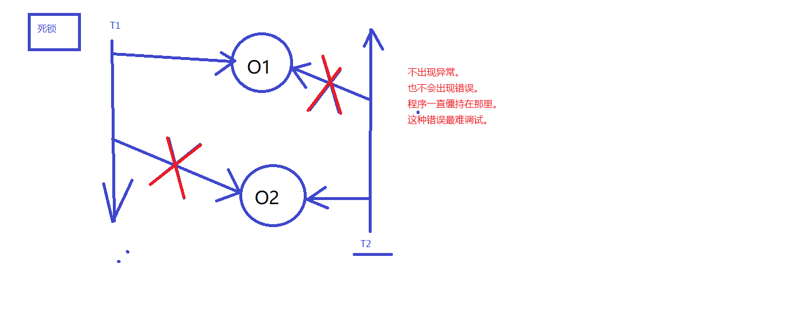
线程T1从上而下执行，T2从下而上执行，T1锁住对象O1，T2锁住对象O2，T1无法获取O2的锁，T2无法获取O1的锁

```java
package com.apexsoft.jse.p04threadTest.deadlock;
/**
死锁代码要会写。
一般面试官要求你会写。
只有会写的，才会在以后的开发中注意这个事儿。
因为死锁很难调试。
 */
public class DeadLock {
    public static void main(String[] args) {
        Object o1 = new Object();
        Object o2 = new Object();

        // t1和t2两个线程共享o1,o2
        Thread t1 = new MyThread1(o1,o2);
        Thread t2 = new MyThread2(o1,o2);

        t1.start();
        t2.start();
    }
}

class MyThread1 extends Thread{
    Object o1;
    Object o2;
    public MyThread1(Object o1,Object o2){
        this.o1 = o1;
        this.o2 = o2;
    }
    @Override
    public void run(){
        synchronized (o1){
            try {
                //不添加睡眠时间可能由于执行太快，不会出现死锁
                Thread.sleep(1000);
            } catch (InterruptedException e) {
                e.printStackTrace();
            }
            synchronized (o2){

            }
        }
    }
}

class MyThread2 extends Thread {
    Object o1;
    Object o2;
    public MyThread2(Object o1,Object o2){
        this.o1 = o1;
        this.o2 = o2;
    }
    @Override
    public void run(){
        synchronized (o2){
            try {
                //不添加睡眠时间可能由于执行太快，不会出现死锁
                Thread.sleep(1000);
            } catch (InterruptedException e) {
                e.printStackTrace();
            }
            synchronized (o1){

            }
        }
    }
}

```
## 三大变量并发问题
1、Java中有三大变量
	实例变量：在堆中。
	静态变量：在方法区。
	局部变量：在栈中。

	以上三大变量中：
		局部变量永远都不会存在线程安全问题。
		因为局部变量不共享。（一个线程一个栈。）
		局部变量在栈中。所以局部变量永远都不会共享。
	
	实例变量在堆中，堆只有1个。
	静态变量在方法区中，方法区只有1个。
	堆和方法区都是多线程共享的，所以可能存在线程安全问题。
	
	局部变量+常量：不会有线程安全问题。
	成员变量：可能会有线程安全问题。
2、如果使用局部变量的话：
	建议使用：StringBuilder。（StringBuffer有sychroinized，需要去锁池走一圈，而局部局部变量本来就是线程安全的）
	因为局部变量不存在线程安全问题。选择StringBuilder。
	StringBuffer效率比较低。

	ArrayList是非线程安全的。
	Vector是线程安全的。
	HashMap HashSet是非线程安全的。
	Hashtable是线程安全的。
## 线程安全解决方案
是一上来就选择线程同步吗？synchronized？
不是，synchronized会让程序的执行效率降低，用户体验不好。系统的用户吞吐量降低。用户体验差。在不得已的情况下再选择线程同步机制。
	
第一种方案：尽量使用局部变量代替“实例变量和静态变量”。
第二种方案：如果必须是实例变量，那么可以考虑创建多个对象，这样实例变量的内存就不共享了。（一个线程对应1个对象，100个线程对应100个对象，对象不共享，就没有数据安全问题了。）
第三种方案：如果不能使用局部变量，对象也不能创建多个，这个时候就只能选择synchronized了。线程同步机制。
## 守护线程
java语言中线程分为两大类：
一类是：用户线程
一类是：守护线程（后台线程），其中具有代表性的就是：垃圾回收线程（守护线程）。

守护线程的特点：一般守护线程是一个死循环，守护线程是为用户线程服务的，当用户线程全部结束，守护线程会自动结束。
注意：主线程main方法是一个用户线程。
实现：通多setDeamon(true)将用户线程变为守护线程
```java
package com.apexsoft.jse.p04threadTest.deamon;/**
 * @author TangXiaoGang
 */

/**
 * @Author: TangXiaoGang
 * @Date: 2023/3/10
 * @Description:
 */
public class ThreadDeamonTest {
    public static void main(String[] args) {
        Thread thread = new DiyThread();
        thread.setName("分支线程");
        thread.start();
        System.out.println("----主线程执行开始----");
        for (int i = 0; i < 5; i++) {
            System.out.println("主线程执行----" + i);
        }
        System.out.println("----主线程执行结束----");
    }
}

class DiyThread extends Thread {
    public void run() {
        for (int i = 0; i < 100; i++) {
            System.out.println(Thread.currentThread().getName() + "----" + i);
        }
    }
}

```
thread和main线程都是用户线程，两个线程的代码最终都会执行完毕
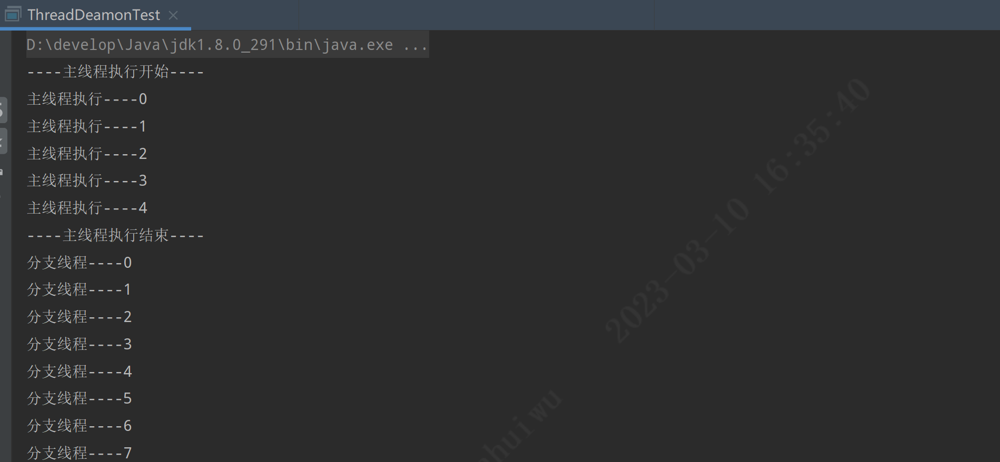
将thread变为守护线程

```java
package com.apexsoft.jse.p04threadTest.deamon;/**
 * @author TangXiaoGang
 */

/**
 * @Author: TangXiaoGang
 * @Date: 2023/3/10
 * @Description:
 */
public class ThreadDeamonTest {
    public static void main(String[] args) {
        Thread thread = new DiyThread();
        thread.setName("分支线程");
        //将thread变为守护线程
        thread.setDaemon(true);
        thread.start();
        System.out.println("----主线程执行开始----");
        for (int i = 0; i < 5; i++) {
            System.out.println("主线程执行----" + i);
        }
        System.out.println("----主线程执行结束----");
    }
}

class DiyThread extends Thread {
    public void run() {
        for (int i = 0; i < 100; i++) {
            System.out.println(Thread.currentThread().getName() + "----" + i);
        }
    }
}

```
用户线程main线程执行完毕后，守护线程并未完全执行结束就已经终止了
注意：main线程是用户线程
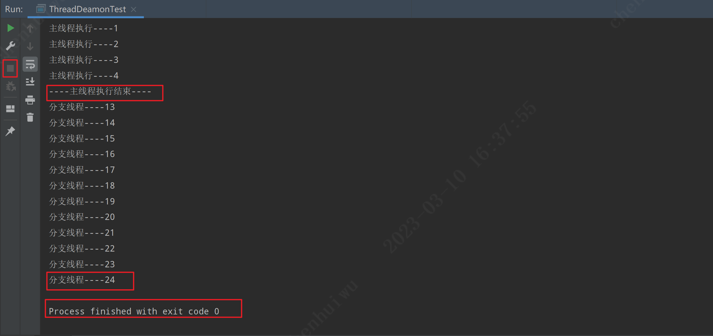
守护线程用在什么地方呢？
每天00:00的时候系统数据自动备份。这个需要使用到定时器，并且我们可以将定时器设置为守护线程。一直在那里看着，每到00:00的时候就备份一次。所有的用户线程如果结束了，守护线程自动退出，没有必要进行数据备份了。

## Timer定时器
定时器的作用：间隔特定的时间，执行特定的程序。
例如：每周要进行银行账户的总账操作。每天要进行数据的备份操作。在实际的开发中，每隔多久执行一段特定的程序，这种需求是很常见的。
java中可以采用多种方式实现：
1、可以使用sleep方法，睡眠，设置睡眠时间，没到这个时间点醒来，执行任务。这种方式是最原始的定时器。（比较low）
2、在java的类库中已经写好了一个定时器：java.util.Timer，可以直接拿来用。不过，这种方式在目前的开发中也很少用，因为现在有很多高级框架都是支持定时任务的。
```java
package com.apexsoft.jse.p04threadTest.timer;

import java.text.ParseException;
import java.text.SimpleDateFormat;
import java.util.Date;
import java.util.Timer;
import java.util.TimerTask;

/**
 * @Author: TangXiaoGang
 * @Date: 2023/3/10
 * @Description:
 */
public class TimerTest {
    public static void main(String[] args) throws ParseException {

        Date begTm = new SimpleDateFormat("yyyy-MM-dd HH:mm:ss").parse("2023-03-10 16:50:30");
        Timer timer = new Timer();
        //从2023-03-10 16:50:30开始执行任务，且每隔4秒重复执行
        timer.schedule(new DiyTimeTask(),begTm,1000*4);
    }
}
class DiyTimeTask extends TimerTask {
    public void run(){
        System.out.println(new SimpleDateFormat("yyyy-MM-dd HH:mm:ss").format(new Date(System.currentTimeMillis())) + "--定时任务");
    }
}
```
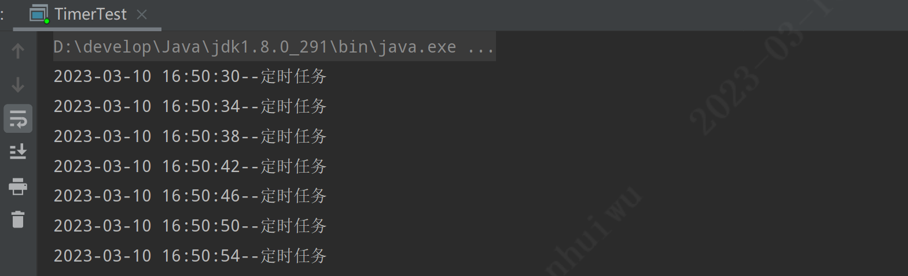
3、在实际的开发中，目前使用较多的是Spring框架中提供的SpringTask框架，这个框架只要进行简单的配置，就可以完成定时器的任务。

## Callable接口实现线程（JDK8新特性）
这种方式实现的线程可以获取线程的返回值。
思考：系统委派一个线程去执行一个任务，该线程执行完任务之后，可能会有一个执行结果，我们怎么能拿到这个执行结果呢？
使用第三种方式：实现Callable接口方式。
```java
package com.apexsoft.jse.p04threadTest.thread;

import java.util.concurrent.Callable;
import java.util.concurrent.FutureTask;

/**
实现线程的第三种方式：
实现Callable接口
这种方式的优点：可以获取到线程的执行结果。
这种方式的缺点：效率比较低，在获取t线程执行结果的时候，当前线程受阻塞，效率较低。
*/
public class ThreadTest15 {
    public static void main(String[] args) throws Exception {

        // 第一步：创建一个“未来任务类”对象。
        // 参数非常重要，需要给一个Callable接口实现类对象。
        FutureTask task = new FutureTask(new Callable() {
            @Override
            public Object call() throws Exception { // call()方法就相当于run方法。只不过这个有返回值
                // 线程执行一个任务，执行之后可能会有一个执行结果
                // 模拟执行
                System.out.println("call method begin");
                Thread.sleep(1000 * 10);
                System.out.println("call method end!");
                int a = 100;
                int b = 200;
                return a + b; //自动装箱(300结果变成Integer)
            }
        });

        // 创建线程对象
        Thread t = new Thread(task);

        // 启动线程
        t.start();

        // 这里是main方法，这是在主线程中。
        // 在主线程中，怎么获取t线程的返回结果？
        // get()方法的执行会导致“当前线程阻塞”
        Object obj = task.get();
        System.out.println("线程执行结果:" + obj);

        // main方法这里的程序要想执行必须等待get()方法的结束
        // 而get()方法可能需要很久。因为get()方法是为了拿另一个线程的执行结果
        // 另一个线程执行是需要时间的。
        System.out.println("hello world!");
    }
}

```
## Object的wait和notify方法（生产者和消费者模式）
第一：wait和notify方法不是线程对象的方法，是java中任何一个java对象都有的方法，因为这两个方式是Object类中自带的。wait方法和notify方法不是通过线程对象调用。

第二：wait()方法作用？`Object o = new Object(); o.wait();`
表示：让正在o对象上活动的线程进入等待状态，无期限等待，直到被唤醒为止。o.wait();方法的调用，会让“当前线程（正在o对象上活动的线程）”进入等待状态。

第三：notify()方法作用？`Object o = new Object(); o.notify();`
表示：唤醒正在o对象上等待的线程。还有一个notifyAll()方法：这个方法是唤醒o对象上处于等待的所有线程。
```java
package com.apexsoft.jse.p04threadTest.thread;

import java.util.ArrayList;
import java.util.List;

/**
1、使用wait方法和notify方法实现“生产者和消费者模式”

2、什么是“生产者和消费者模式”？
    生产线程负责生产，消费线程负责消费。
    生产线程和消费线程要达到均衡。
    这是一种特殊的业务需求，在这种特殊的情况下需要使用wait方法和notify方法。

3、wait和notify方法不是线程对象的方法，是普通java对象都有的方法。

4、wait方法和notify方法建立在线程同步的基础之上。因为多线程要同时操作一个仓库。有线程安全问题。

5、wait方法作用：o.wait()让正在o对象上活动的线程t进入等待状态，并且释放掉t线程之前占有的o对象的锁。

6、notify方法作用：o.notify()让正在o对象上等待的线程唤醒，只是通知，不会释放o对象上之前占有的锁。

7、模拟这样一个需求：
    仓库我们采用List集合。
    List集合中假设只能存储1个元素。
    1个元素就表示仓库满了。
    如果List集合中元素个数是0，就表示仓库空了。
    保证List集合中永远都是最多存储1个元素。

    必须做到这种效果：生产1个消费1个。
 */
public class ThreadTest16 {
    public static void main(String[] args) {
        // 创建1个仓库对象，共享的。
        List list = new ArrayList();
        // 创建两个线程对象
        // 生产者线程
        Thread t1 = new Thread(new Producer(list));
        // 消费者线程
        Thread t2 = new Thread(new Consumer(list));

        t1.setName("生产者线程");
        t2.setName("消费者线程");

        t1.start();
        t2.start();
    }
}

// 生产线程
class Producer implements Runnable {
    // 仓库
    private List list;

    public Producer(List list) {
        this.list = list;
    }
    @Override
    public void run() {
        // 一直生产（使用死循环来模拟一直生产）
        while(true){
            // 给仓库对象list加锁。
            synchronized (list){
                if(list.size() > 0){ // 大于0，说明仓库中已经有1个元素了。
                    try {
                        // 当前线程进入等待状态，并且释放Producer之前占有的list集合的锁。
                        list.wait();
                    } catch (InterruptedException e) {
                        e.printStackTrace();
                    }
                }
                // 程序能够执行到这里说明仓库是空的，可以生产
                Object obj = new Object();
                list.add(obj);
                System.out.println(Thread.currentThread().getName() + "--->" + obj);
                // 唤醒消费者进行消费
                list.notifyAll();
            }
        }
    }
}

// 消费线程
class Consumer implements Runnable {
    // 仓库
    private List list;

    public Consumer(List list) {
        this.list = list;
    }

    @Override
    public void run() {
        // 一直消费
        while(true){
            synchronized (list) {
                if(list.size() == 0){
                    try {
                        // 仓库已经空了。
                        // 消费者线程等待，释放掉list集合的锁
                        list.wait();
                    } catch (InterruptedException e) {
                        e.printStackTrace();
                    }
                }
                // 程序能够执行到此处说明仓库中有数据，进行消费。
                Object obj = list.remove(0);
                System.out.println(Thread.currentThread().getName() + "--->" + obj);
                // 唤醒生产者生产。
                list.notifyAll();
            }
        }
    }
}
```
# 反射
2、反射机制
2.1、反射机制有什么用？
通过java语言中的反射机制可以操作字节码文件。
优点类似于黑客。（可以读和修改字节码文件。）
	通过反射机制可以操作代码片段。（class文件。）
2.2、反射机制的相关类在哪个包下？
	java.lang.reflect.*;
2.3、反射机制相关的重要的类有哪些？
	java.lang.Class：代表整个字节码，代表一个类型，代表整个类。
java.lang.reflect.Method：代表字节码中的方法字节码。代表类中的方法。
java.lang.reflect.Constructor：代表字节码中的构造方法字节码。代表类中的构造方法
java.lang.reflect.Field：代表字节码中的属性字节码。代表类中的成员变量（静态变量+实例变量）。
```java
java.lang.Class：
			public class User{
				// Field
				int no;

				// Constructor
				public User(){
				
				}
				public User(int no){
					this.no = no;
				}

				// Method
				public void setNo(int no){
					this.no = no;
				}
				public int getNo(){
					return no;
				}
			}
```
## 一、获取Class
1、Class.forName("类全限定名")
2、引用.getClass()
3、.class属性（引用或基本数据类型）
```java
package chapter25.reflect.src.com.bjpowernode.java.reflect;

import java.util.Date;

/**
要操作一个类的字节码，需要首先获取到这个类的字节码，怎么获取java.lang.Class实例？
    三种方式
        第一种：Class c = Class.forName("完整类名带包名");
        第二种：Class c = 对象.getClass();
        第三种：Class c = 任何类型.class;

 */
public class ReflectTest01 {
    public static void main(String[] args) {
        /**
        Class.forName()
            1、静态方法
            2、方法的参数是一个字符串。
            3、字符串需要的是一个完整类名。
            4、完整类名必须带有包名。java.lang包也不能省略。
         */
        Class c1 = null;
        Class c2 = null;
        try {
            c1 = Class.forName("java.lang.String"); // c1代表String.class文件，或者说c1代表String类型。
            c2 = Class.forName("java.util.Date"); // c2代表Date类型
            Class c3 = Class.forName("java.lang.Integer"); // c3代表Integer类型
            Class c4 = Class.forName("java.lang.System"); // c4代表System类型
        } catch (ClassNotFoundException e) {
            e.printStackTrace();
        }

        // java中任何一个对象都有一个方法：getClass()
        String s = "abc";
        Class x = s.getClass(); // x代表String.class字节码文件，x代表String类型。
        System.out.println(c1 == x); // true（==判断的是对象的内存地址。）

        Date time = new Date();
        Class y = time.getClass();
        System.out.println(c2 == y); // true (c2和y两个变量中保存的内存地址都是一样的，都指向方法区中的字节码文件。)

        // 第三种方式，java语言中任何一种类型，包括基本数据类型，它都有.class属性。
        Class z = String.class; // z代表String类型
        Class k = Date.class; // k代表Date类型
        Class f = int.class; // f代表int类型
        Class e = double.class; // e代表double类型

        System.out.println(x == z); // true

    }
}

```
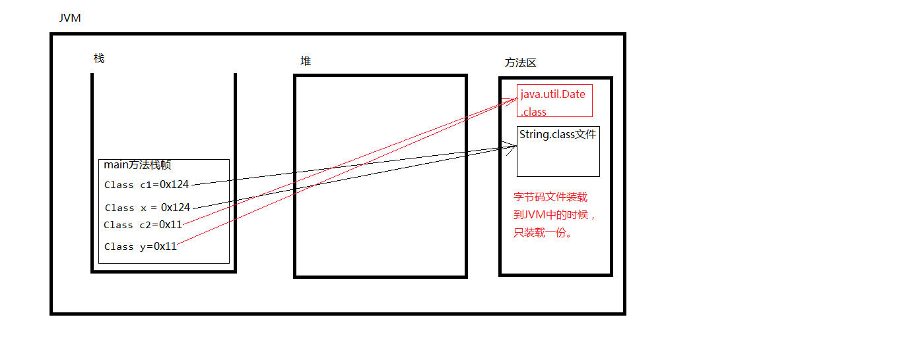
## 二、反射创建对象
```java
package com.apexsoft.reflact.java.reflect;


import com.apexsoft.reflact.java.bean.User;

/**
获取到Class，能干什么？
    通过Class的newInstance()方法来实例化对象。
    注意：newInstance()方法内部实际上调用了无参数构造方法，必须保证无参构造存在才可以。
 */
public class ReflectTest02 {
    public static void main(String[] args) {

        // 这是不使用反射机制，创建对象
        User user = new User();
        System.out.println(user);

        // 下面这段代码是以反射机制的方式创建对象。
        try {
            // 通过反射机制，获取Class，通过Class来实例化对象
            Class c = Class.forName("com.bjpowernode.java.bean.User"); // c代表User类型。

            // newInstance() 这个方法会调用User这个类的无参数构造方法，完成对象的创建。
            // 重点是：newInstance()调用的是无参构造，必须保证无参构造是存在的！
            Object obj = c.newInstance();

            System.out.println(obj); // com.bjpowernode.java.bean.User@10f87f48
        } catch (ClassNotFoundException e) {
            e.printStackTrace();
        } catch (IllegalAccessException e) {
            e.printStackTrace();
        } catch (InstantiationException e) {
            e.printStackTrace();
        }
    }
}

```
## 三、通过配置文件反射创建对象
```java
package com.apexsoft.reflact.java.reflect;

import java.io.FileReader;
import java.util.Properties;

/**
验证反射机制的灵活性。
    java代码写一遍，再不改变java源代码的基础之上，可以做到不同对象的实例化。
    非常之灵活。（符合OCP开闭原则：对扩展开放，对修改关闭。）

后期你们要学习的是高级框架，而工作过程中，也都是使用高级框架，
包括： ssh ssm
    Spring SpringMVC MyBatis
    Spring Struts Hibernate
    ...
    这些高级框架底层实现原理：都采用了反射机制。所以反射机制还是重要的。
    学会了反射机制有利于你理解剖析框架底层的源代码。
 */
public class ReflectTest03 {
    public static void main(String[] args) throws Exception{

        // 这种方式代码就写死了。只能创建一个User类型的对象
        //User user = new User();

        // 以下代码是灵活的，代码不需要改动，可以修改配置文件，配置文件修改之后，可以创建出不同的实例对象。
        // 通过IO流读取classinfo.properties文件
        FileReader reader = new FileReader("反射/src/com/apexsoft/reflact/java/classinfo2.properties");
//        FileReader reader = new FileReader("src/com/apexsoft/reflact/java/classinfo2.properties");//错误写法
//        FileReader reader = new FileReader("com/apexsoft/reflact/java/classinfo2.properties"); //错误写法
        // 创建属性类对象Map
        Properties pro = new Properties(); // key value都是String
        // 加载
        pro.load(reader);
        // 关闭流
        reader.close();

        // 通过key获取value
        String className = pro.getProperty("className");
        //System.out.println(className);

        // 通过反射机制实例化对象
        Class c = Class.forName(className);
        Object obj = c.newInstance();
        System.out.println(obj);
    }
}

```
## 四、Class.forName()与类加载
Class.forName()语句执行时，会发生类加载
```java
package com.apexsoft.reflact.java.reflect;
/**
研究一下：Class.forName()发生了什么？
    记住，重点：
        如果你只是希望一个类的静态代码块执行，其它代码一律不执行，
        你可以使用：
            Class.forName("完整类名");
        这个方法的执行会导致类加载，类加载时，静态代码块执行。

提示：
    后面JDBC技术的时候我们还需要。
 */
public class ReflectTest04 {
    public static void main(String[] args) {
        try {
            // Class.forName()这个方法的执行会导致：类加载。
            Class.forName("com.bjpowernode.java.reflect.MyClass");
        } catch (ClassNotFoundException e) {
            e.printStackTrace();
        }
    }
}


```
```java
package com.apexsoft.reflact.java.reflect;

public class MyClass {

    // 静态代码块在类加载时执行，并且只执行一次。
    static {
        System.out.println("MyClass类的静态代码块执行了！");
    }
}
```
## 四、文件路径
```java
package com.apexsoft.reflact.java.reflect;

import java.io.FileReader;

/**
研究一下文件路径的问题。
怎么获取一个文件的绝对路径。以下讲解的这种方式是通用的。但前提是：文件需要在类路径下。才能用这种方式。
 */
public class AboutPath {
    public static void main(String[] args) throws Exception{
        // 这种方式的路径缺点是：移植性差，在IDEA中默认的当前路径是project的根。
        // 这个代码假设离开了IDEA，换到了其它位置，可能当前路径就不是project的根了，这时这个路径就无效了。
        // 对于本项目，c-dlnode-starter下的路径，即api、IO流、反射等子模块所在的路径就是项目的根路径
        FileReader reader = new FileReader("反射/classinfo.properties");
        FileReader reader2 = new FileReader("反射/src/classinfo2.properties");
        FileReader reader3 = new FileReader(".gitignore");

        // 接下来说一种比较通用的一种路径。即使代码换位置了，这样编写仍然是通用的。
        // 注意：使用以下通用方式的前提是：这个文件必须在类路径下。
        // 类路径：凡是在src下的都是类路径下。【记住它】
        // 类的根路径: src下的起始路径（第一级路径）
        /**
        解释：
            Thread.currentThread() 当前线程对象
            getContextClassLoader() 是线程对象的方法，可以获取到当前线程的类加载器对象。
            getResource() 【获取资源】这是类加载器对象的方法，当前线程的类加载器默认从类的根路径下加载资源。
         */
        String path = Thread.currentThread().getContextClassLoader()
                .getResource("classinfo2.properties").getPath(); // 这种方式获取文件绝对路径是通用的。

        // 采用以上的代码可以拿到一个文件的绝对路径。
        System.out.println(path);

        // 获取db.properties文件的绝对路径（从类的根路径下作为起点开始）
        String path2 = Thread.currentThread().getContextClassLoader()
                .getResource("com/apexsoft/reflact/java/bean/db.properties").getPath();
        System.out.println(path2);

    }
}
```
### getResourceAsStream()
```java
package com.apexsoft.reflact.java.reflect;

import java.io.FileReader;
import java.io.InputStream;
import java.util.Properties;

public class IoPropertiesTest {
    public static void main(String[] args) throws Exception{

        // 获取一个文件的绝对路径了！！！！！
        String path = Thread.currentThread().getContextClassLoader()
            .getResource("classinfo2.properties").getPath();
        System.out.println(path);
        //FileReader fileReader = new FileReader(path);

        // 直接以流的形式返回。
        InputStream reader = Thread.currentThread().getContextClassLoader()
            .getResourceAsStream("classinfo2.properties");

        Properties pro = new Properties();
        pro.load(reader);
        reader.close();
        // 通过key获取value
        String className = pro.getProperty("className");
        System.out.println(className);
    }
}

```
### ResourceBundle
```java
package com.apexsoft.reflact.java.reflect;

import java.util.ResourceBundle;

/**
java.util包下提供了一个资源绑定器，便于获取属性配置文件中的内容。
使用以下这种方式的时候，属性配置文件xxx.properties必须放到类路径下。
 */
public class ResourceBundleTest {
    public static void main(String[] args) {

        // 资源绑定器，只能绑定xxx.properties文件。并且这个文件必须在类路径下。文件扩展名也必须是properties
        // 并且在写路径的时候，路径后面的扩展名不能写。
        //ResourceBundle bundle = ResourceBundle.getBundle("classinfo2");

        ResourceBundle bundle = ResourceBundle.getBundle("com/apexsoft/reflact/java/bean/db");

        String className = bundle.getString("className");
        System.out.println(className);

    }
}

```
## 五、JDK中自带的类加载器
3.1、什么是类加载器？
	专门负责加载类的命令/工具。ClassLoader
3.2、JDK中自带了3个类加载器
	启动类加载器:rt.jar
	扩展类加载器:ext/*.jar
	应用类加载器:classpath
3.3、假设有这样一段代码：
String s = "abc";代码在开始执行之前，会将所需要类全部加载到JVM当中。通过类加载器加载，看到以上代码类加载器会找String.class文件，找到就加载，那么是怎么进行加载的呢？
首先通过“启动类加载器”加载。注意：启动类加载器专门加载：C:\ProgramFiles\Java\jdk1.8.0_101\jre\lib\rt.jar；rt.jar中都是JDK最核心的类库。
如果通过“启动类加载器”加载不到的时候，会通过"扩展类加载器"加载。注意：扩展类加载器专门加载：C:\Program Files\Java\jdk1.8.0_101\jre\lib\ext\*.jar
如果“扩展类加载器”没有加载到，那么会通过“应用类加载器”加载。注意：应用类加载器专门加载：classpath中的类。
3.4、java中为了保证类加载的安全，使用了双亲委派机制。
优先从启动类加载器中加载，这个称为“父”，“父”无法加载到，再从扩展类加载器中加载，这个称为“母”。双亲委派。如果都加载不到，才会考虑从应用类加载器中加载。直到加载到为止。

## 五、反射操作属性Feild
### 获取属性
```java
package com.apexsoft.reflact.java.reflect;

import java.lang.reflect.Field;
import java.lang.reflect.Modifier;

/**
反射Student类当中所有的Field（了解一下）
 */
public class ReflectTest05 {
    public static void main(String[] args) throws Exception{

        // 获取整个类
        Class studentClass = Class.forName("com.apexsoft.reflact.java.wn.Student");

        //com.bjpowernode.java.bean.Student
        String className = studentClass.getName();
        System.out.println("完整类名：" + className);

        String simpleName = studentClass.getSimpleName();
        System.out.println("简类名：" + simpleName);

        // 获取类中所有的public修饰的Field
        Field[] fields = studentClass.getFields();
        System.out.println(fields.length); // 测试数组中只有1个元素
        // 取出这个Field
        Field f = fields[0];
        // 取出这个Field它的名字
        String fieldName = f.getName();
        System.out.println(fieldName);

        // 获取所有的Field
        Field[] fs = studentClass.getDeclaredFields();
        System.out.println(fs.length); // 4

        System.out.println("==================================");
        // 遍历
        for(Field field : fs){
            // 获取属性的修饰符列表
            int i = field.getModifiers(); // 返回的修饰符是一个数字，每个数字是修饰符的代号！！！
            System.out.println(i);
            // 可以将这个“代号”数字转换成“字符串”吗？
            String modifierString = Modifier.toString(i);
            System.out.println(modifierString);
            // 获取属性的类型
            Class fieldType = field.getType();
            //String fName = fieldType.getName();
            String fName = fieldType.getSimpleName();
            System.out.println(fName);
            // 获取属性的名字
            System.out.println(field.getName());
        }
    }
}

```
```java
package com.apexsoft.reflact.java.reflect;

/**
 * 通过反射机制，反编译一个类的属性Field（了解一下）
 */

import java.lang.reflect.Field;
import java.lang.reflect.Modifier;

public class ReflectTest06 {
    public static void main(String[] args) throws Exception{

        // 创建这个是为了拼接字符串。
        StringBuilder s = new StringBuilder();

        //Class studentClass = Class.forName("com.bjpowernode.java.bean.Student");
        Class studentClass = Class.forName("java.lang.Thread");

        s.append(Modifier.toString(studentClass.getModifiers()) + " class " + studentClass.getSimpleName() + " {\n");

        Field[] fields = studentClass.getDeclaredFields();
        for(Field field : fields){
            s.append("\t");
            s.append(Modifier.toString(field.getModifiers()));
            s.append(" ");
            s.append(field.getType().getSimpleName());
            s.append(" ");
            s.append(field.getName());
            s.append(";\n");
        }

        s.append("}");
        System.out.println(s);

    }
}

```
### 属性赋值
```java
package com.apexsoft.reflact.java.reflect;


import com.apexsoft.io.java.bean.Student;

import java.lang.reflect.Field;

/**
必须掌握：
    怎么通过反射机制访问一个java对象的属性？
        给属性赋值set
        获取属性的值get
 */
public class ReflectTest07 {
    public static void main(String[] args) throws Exception{

        // 我们不使用反射机制，怎么去访问一个对象的属性呢？
        Student s = new Student();

//        // 给属性赋值
//        s.no = 1111; //三要素：给s对象的no属性赋值1111
//                    //要素1：对象s
//                    //要素2：no属性
//                    //要素3：1111
//
//        // 读属性值
//        // 两个要素：获取s对象的no属性的值。
//        System.out.println(s.no);

        // 使用反射机制，怎么去访问一个对象的属性。（set get）
        Class studentClass = Class.forName("com.apexsoft.io.java.bean.Student");
        Object obj = studentClass.newInstance(); // obj就是Student对象。（底层调用无参数构造方法）

        // 获取no属性（根据属性的名称来获取Field）
        Field noFiled = studentClass.getDeclaredField("no");

        // 给obj对象(Student对象)的no属性赋值
        /*
        虽然使用了反射机制，但是三要素还是缺一不可：
            要素1：obj对象
            要素2：no属性
            要素3：2222值
        注意：反射机制让代码复杂了，但是为了一个“灵活”，这也是值得的。
         */
        noFiled.setAccessible(true);
        noFiled.set(obj, 22222); // 给obj对象的no属性赋值2222

        // 读取属性的值
        // 两个要素：获取obj对象的no属性的值。
        System.out.println(noFiled.get(obj));

        // 可以访问私有的属性吗？
        Field addressField = studentClass.getDeclaredField("address");

        // 打破封装（反射机制的缺点：打破封装，可能会给不法分子留下机会！！！）
        // 这样设置完之后，在外部也是可以访问private的。
        addressField.setAccessible(true);

        // 给name属性赋值
        addressField.set(obj, "jackson");
        // 获取name属性的值
        System.out.println(addressField.get(obj));
    }
}

```
## 六、反射操作方法Method
### 获取方法
```java
package com.apexsoft.reflact.java.reflect;

import java.lang.reflect.Method;
import java.lang.reflect.Modifier;

/**
作为了解内容（不需要掌握）：
    反射Method
 */
public class ReflectTest08 {
    public static void main(String[] args) throws Exception{

        // 获取类了
        Class userServiceClass = Class.forName("com.apexsoft.reflact.java.service.UserService");

        // 获取所有的Method（包括私有的！）
        Method[] methods = userServiceClass.getDeclaredMethods();
        //System.out.println(methods.length); // 2

        // 遍历Method
        for(Method method : methods){
            // 获取修饰符列表
            System.out.println(Modifier.toString(method.getModifiers()));
            // 获取方法的返回值类型
            System.out.println(method.getReturnType().getSimpleName());
            // 获取方法名
            System.out.println(method.getName());
            // 方法的修饰符列表（一个方法的参数可能会有多个。）
            Class[] parameterTypes = method.getParameterTypes();
            for(Class parameterType : parameterTypes){
                System.out.println(parameterType.getSimpleName());
            }
        }
    }
}

```
```java
package com.apexsoft.reflact.java.reflect;

import java.lang.reflect.Method;
import java.lang.reflect.Modifier;

/**
了解一下，不需要掌握（反编译一个类的方法。）
 */
public class ReflectTest09 {
    public static void main(String[] args) throws Exception{
        StringBuilder s = new StringBuilder();
        //Class userServiceClass = Class.forName("com.bjpowernode.java.service.UserService");
        Class userServiceClass = Class.forName("java.lang.String");
        s.append(Modifier.toString(userServiceClass.getModifiers()) + " class "+userServiceClass.getSimpleName()+" {\n");

        Method[] methods = userServiceClass.getDeclaredMethods();
        for(Method method : methods){
            //public boolean login(String name,String password){}
            s.append("\t");
            s.append(Modifier.toString(method.getModifiers()));
            s.append(" ");
            s.append(method.getReturnType().getSimpleName());
            s.append(" ");
            s.append(method.getName());
            s.append("(");
            // 参数列表
            Class[] parameterTypes = method.getParameterTypes();
            for(Class parameterType : parameterTypes){
                s.append(parameterType.getSimpleName());
                s.append(",");
            }
            // 删除指定下标位置上的字符
            s.deleteCharAt(s.length() - 1);
            s.append("){}\n");
        }

        s.append("}");
        System.out.println(s);
    }
}

```
### 调用方法
```java
package com.apexsoft.reflact.java.reflect;


import com.apexsoft.reflact.java.service.UserService;

import java.lang.reflect.Method;

/**
重点：必须掌握，通过反射机制怎么调用一个对象的方法？
    五颗星*****

    反射机制，让代码很具有通用性，可变化的内容都是写到配置文件当中，
    将来修改配置文件之后，创建的对象不一样了，调用的方法也不同了，
    但是java代码不需要做任何改动。这就是反射机制的魅力。
 */
public class ReflectTest10 {
    public static void main(String[] args) throws Exception{
        // 不使用反射机制，怎么调用方法
        // 创建对象
        UserService userService = new UserService();
        // 调用方法
        /*
        要素分析：
            要素1：对象userService
            要素2：login方法名
            要素3：实参列表
            要素4：返回值
         */
        boolean loginSuccess = userService.login("admin","123");
        //System.out.println(loginSuccess);
        System.out.println(loginSuccess ? "登录成功" : "登录失败");

        // 使用反射机制来调用一个对象的方法该怎么做？
        Class userServiceClass = Class.forName("com.apexsoft.reflact.java.service.UserService");
        // 创建对象
        Object obj = userServiceClass.newInstance();
        // 获取Method
        Method loginMethod = userServiceClass.getDeclaredMethod("login", String.class, String.class);
        //Method loginMethod = userServiceClass.getDeclaredMethod("login", int.class);
        // 调用方法
        // 调用方法有几个要素？ 也需要4要素。
        // 反射机制中最最最最最重要的一个方法，必须记住。
        /**
        四要素：
        loginMethod方法
        obj对象
        "admin","123" 实参
        retValue 返回值
         */
        Object retValue = loginMethod.invoke(obj, "admin","123123");
        System.out.println(retValue);
    }
}

```
## 七、反射操作构造方法
### 获取构造方法
```java
package com.apexsoft.reflact.java.reflect;

import java.lang.reflect.Constructor;
import java.lang.reflect.Modifier;

/**
反编译一个类的Constructor构造方法。
 */
public class ReflectTest11 {
    public static void main(String[] args) throws Exception{
        StringBuilder s = new StringBuilder();
        Class vipClass = Class.forName("java.lang.String");
        s.append(Modifier.toString(vipClass.getModifiers()));
        s.append(" class ");
        s.append(vipClass.getSimpleName());
        s.append("{\n");

        // 拼接构造方法
        Constructor[] constructors = vipClass.getDeclaredConstructors();
        for(Constructor constructor : constructors){
            //public Vip(int no, String name, String birth, boolean sex) {
            s.append("\t");
            s.append(Modifier.toString(constructor.getModifiers()));
            s.append(" ");
            s.append(vipClass.getSimpleName());
            s.append("(");
            // 拼接参数
            Class[] parameterTypes = constructor.getParameterTypes();
            for(Class parameterType : parameterTypes){
                s.append(parameterType.getSimpleName());
                s.append(",");
            }
            // 删除最后下标位置上的字符
            if(parameterTypes.length > 0){
                s.deleteCharAt(s.length() - 1);
            }
            s.append("){}\n");
        }

        s.append("}");
        System.out.println(s);
    }
}

```
### 调用构造方法
```java
package com.apexsoft.reflact.java.reflect;


import com.apexsoft.reflact.java.bean.Vip;

import java.lang.reflect.Constructor;

/**
比上一个例子(ReflectTest11)重要一些！！！

通过反射机制调用构造方法实例化java对象。（这个不是重点）
 */
public class ReflectTest12 {
    public static void main(String[] args) throws Exception{
        // 不使用反射机制怎么创建对象
        Vip v1 = new Vip();
        Vip v2 = new Vip(110, "zhangsan", "2001-10-11", true);

        // 使用反射机制怎么创建对象呢？
        Class c = Class.forName("com.apexsoft.reflact.java.bean.Vip");
        // 调用无参数构造方法
        Object obj = c.newInstance();
        System.out.println(obj);

        // 调用有参数的构造方法怎么办？
        // 第一步：先获取到这个有参数的构造方法
        Constructor con = c.getDeclaredConstructor(int.class, String.class, String.class,boolean.class);
        // 第二步：调用构造方法new对象
        Object newObj = con.newInstance(110, "jackson", "1990-10-11", true);
        System.out.println(newObj);

        // 获取无参数构造方法
        Constructor con2 = c.getDeclaredConstructor();
        Object newObj2 = con2.newInstance();
        System.out.println(newObj2);
    }
}

```
## 八、获取类的父类和实现的接口
```java
package com.apexsoft.reflact.java.reflect;

/**
重点：给你一个类，怎么获取这个类的父类，已经实现了哪些接口？
 */
public class ReflectTest13 {
    public static void main(String[] args) throws Exception{

        // String举例
        Class stringClass = Class.forName("java.lang.String");

        // 获取String的父类
        Class superClass = stringClass.getSuperclass();
        System.out.println(superClass.getName());

        // 获取String类实现的所有接口（一个类可以实现多个接口。）
        Class[] interfaces = stringClass.getInterfaces();
        for(Class in : interfaces){
            System.out.println(in.getName());
        }
    }
}

```
# 注解

