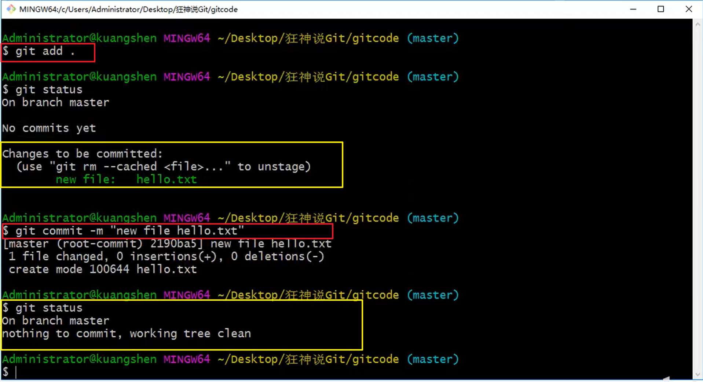
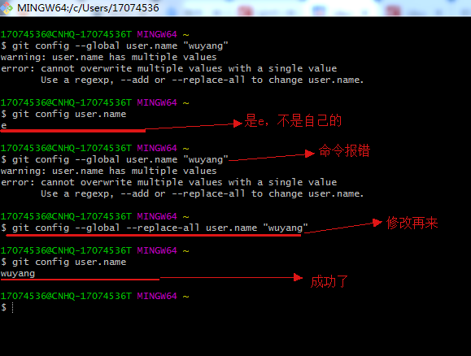
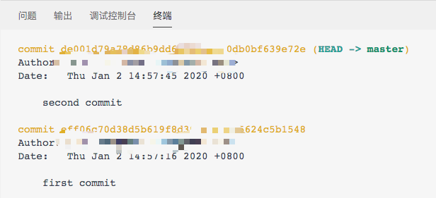

## 版本控制

版本控制（Revision control）是一种在开发的过程中用于管理我们对文件、目录或工程等内容的修改历史，方便查看更改历史记录，备份以便恢复以前的版本的软件工程技术。

- 实现跨区域多人协同开发
- 追踪和记载一个或者多个文件的历史记录
- 组织和保护你的源代码和文档
- 统计工作量
- 并行开发、提高开发效率
- 跟踪记录整个软件的开发过程
- 减轻开发人员的负担，节省时间，同时降低人为错误

简单说就是用于管理多人协同开发项目的技术。

没有进行版本控制或者版本控制本身缺乏正确的流程管理，在软件开发过程中将会引入很多问题，如软件代码的一致性、软件内容的冗余、软件过程的事物性、软件开发过程中的并发性、软件源代码的安全性，以及软件的整合等问题。

无论是工作还是学习，或者是自己做笔记，都经历过这样一个阶段！我们就迫切需要一个版本控制工具！


多人开发就必须要使用版本控制！

### 常见的版本控制工具

主流的版本控制器有如下这些：

- **Git**
- **SVN**（Subversion）
- **CVS**（Concurrent Versions System）
- **VSS**（Micorosoft Visual SourceSafe）
- **TFS**（Team Foundation Server）
- **Visual Studio Online**

版本控制产品非常的多（Perforce、Rational ClearCase、RCS（GNU Revision Control System）、Serena Dimention、SVK、BitKeeper、Monotone、Bazaar、Mercurial、SourceGear Vault），现在影响力最大且使用最广泛的是Git与SVN

### 版本控制分类

#### **1、本地版本控制**

记录文件每次的更新，可以对每个版本做一个快照，或是记录补丁文件，适合个人用，如RCS。


#### **2、集中版本控制  SVN**

所有的版本数据都保存在服务器上，协同开发者从服务器上同步更新或上传自己的修改


所有的版本数据都存在服务器上，用户的本地只有自己以前所同步的版本，如果不连网的话，用户就看不到历史版本，也无法切换版本验证问题，或在不同分支工作。而且，所有数据都保存在单一的服务器上，有很大的风险这个服务器会损坏，这样就会丢失所有的数据，当然可以定期备份。代表产品：SVN、CVS、VSS

#### **3、分布式版本控制 	Git**

每个人都拥有全部的代码！安全隐患！

所有版本信息仓库全部同步到本地的每个用户，这样就可以在本地查看所有版本历史，可以离线在本地提交，只需在连网时push到相应的服务器或其他用户那里。由于每个用户那里保存的都是所有的版本数据，只要有一个用户的设备没有问题就可以恢复所有的数据，但这增加了本地存储空间的占用。

不会因为服务器损坏或者网络问题，造成不能工作的情况！


#### Git与SVN的主要区别

SVN是集中式版本控制系统，版本库是集中放在中央服务器的，而工作的时候，用的都是自己的电脑，所以首先要从中央服务器得到最新的版本，然后工作，完成工作后，需要把自己做完的活推送到中央服务器。集中式版本控制系统是必须联网才能工作，对网络带宽要求较高。

Git是分布式版本控制系统，没有中央服务器，每个人的电脑就是一个完整的版本库，工作的时候不需要联网了，因为版本都在自己电脑上。协同的方法是这样的：比如说自己在电脑上改了文件A，其他人也在电脑上改了文件A，这时，你们两之间只需把各自的修改推送给对方，就可以互相看到对方的修改了。Git可以直接看到更新了哪些代码和文件！

**Git是目前世界上最先进的分布式版本控制系统。**

## Git的历史

同生活中的许多伟大事物一样，Git 诞生于一个极富纷争大举创新的年代。

Linux 内核开源项目有着为数众广的参与者。绝大多数的 Linux 内核维护工作都花在了提交补丁和保存归档的繁琐事务上(1991－2002年间)。到 2002 年，整个项目组开始启用一个专有的分布式版本控制系统 BitKeeper 来管理和维护代码。

Linux社区中存在很多的大佬！破解研究 BitKeeper ！

到了 2005 年，开发 BitKeeper 的商业公司同 Linux 内核开源社区的合作关系结束，他们收回了 Linux 内核社区免费使用 BitKeeper 的权力。这就迫使 Linux 开源社区(特别是 Linux 的缔造者 Linus Torvalds)基于使用 BitKeeper 时的经验教训，开发出自己的版本系统。（2周左右！） 也就是后来的 Git！

**Git是目前世界上最先进的分布式版本控制系统。**

Git是免费、开源的，最初Git是为辅助 Linux 内核开发的，来替代 BitKeeper！

## Git环境配置

### 软件下载

打开 [git官网] https://git-scm.com/，下载git对应操作系统的版本。

所有东西下载慢的话就可以去找镜像！

官网下载太慢，我们可以使用淘宝镜像下载：http://npm.taobao.org/mirrors/git-for-windows/


下载对应的版本即可安装！

安装：无脑下一步即可！安装完毕就可以使用了！

### 启动Git

安装成功后在开始菜单中会有Git项，菜单下有3个程序：任意文件夹下右键也可以看到对应的程序！


**Git Bash：**Unix与Linux风格的命令行，使用最多，推荐最多

**Git CMD：**Windows风格的命令行

**Git GUI**：图形界面的Git，不建议初学者使用，尽量先熟悉常用命令

### 常用的Linux命令

平时一定要多使用这些基础的命令！

1）、cd : 改变目录。

2）、cd . . 回退到上一个目录，直接cd进入默认目录

3）、pwd : 显示当前所在的目录路径。

4）、ls(ll):  都是列出当前目录中的所有文件，只不过ll(两个ll)列出的内容更为详细。

5）、touch : 新建一个文件 如 touch index.js 就会在当前目录下新建一个index.js文件。

6）、rm:  删除一个文件, rm index.js 就会把index.js文件删除。

7）、mkdir:  新建一个目录,就是新建一个文件夹。

8）、rm -r :  删除一个文件夹, rm -r src 删除src目录

```
rm -rf / 切勿在Linux中尝试！删除电脑中全部文件！
```

9）、mv 移动文件, mv index.html src index.html 是我们要移动的文件, src 是目标文件夹,当然, 这样写,必须保证文件和目标文件夹在同一目录下。

10）、reset 重新初始化终端/清屏。

11）、clear 清屏。

12）、history 查看命令历史。

13）、help 帮助。

14）、exit 退出。

15）、#表示注释

### Git配置

所有的配置文件，其实都保存在本地！

查看配置 git config -l


查看不同级别的配置文件：

````yaml
#查看系统config
git config --system --list
　　
#查看当前用户（global）配置
git config --global  --list
````

**Git相关的配置文件：**

1）、Git\etc\gitconfig  ：Git 安装目录下的 gitconfig   --system 系统级

2）、C:\Users\Administrator\ .gitconfig   只适用于当前登录用户的配置  --global 全局


这里可以直接编辑配置文件，通过命令设置后会响应到这里。

### 设置用户名与邮箱

当你安装Git后首先要做的事情是设置你的用户名称和e-mail地址（必须设置）。这是非常重要的，因为每次Git提交都会使用该信息（只是用来标识代码提交者身份信息，和gitee或github账号邮箱没有关系）。它被永远的嵌入到了你的提交中：

```js
git config --global user.name "kuangshen"  #名称
git config --global user.email 24736743@qq.com   #邮箱
```

只需要做一次这个设置，如果你传递了--global 选项，因为Git将总是会使用该信息来处理你在系统中所做的一切操作。如果你希望在一个特定的项目中使用不同的名称或e-mail地址，你可以在该项目中运行该命令而不要--global选项。总之--global为全局配置，不加为某个项目的特定配置。


## Git基本理论

### 三个区域

Git本地有三个工作区域：工作目录（Working Directory）、暂存区(Stage/Index)、资源库(Repository或Git Directory)。如果在加上远程的git仓库(Remote Directory)就可以分为四个工作区域。文件在这四个区域之间的转换关系如下：


- Workspace：工作区，就是你平时存放项目代码的地方
- Index / Stage：暂存区，用于临时存放你的改动，事实上它只是一个文件，保存即将提交到文件列表信息
- Repository：仓库区（或本地仓库），就是安全存放数据的位置，这里面有你提交到所有版本的数据。其中HEAD指向最新放入仓库的版本
- Remote：远程仓库，托管代码的服务器，可以简单的认为是你项目组中的一台电脑用于远程数据交换

本地的三个区域确切的说应该是git仓库中HEAD指向的版本：


- Directory：使用Git管理的一个目录，也就是一个仓库，包含我们的工作空间和Git的管理空间。
- WorkSpace：需要通过Git进行版本控制的目录和文件，这些目录和文件组成了工作空间。
- .git：存放Git管理信息的目录，初始化仓库的时候自动创建。
- Index/Stage：暂存区，或者叫待提交更新区，在提交进入repo之前，我们可以把所有的更新放在暂存区。
- Local Repo：本地仓库，一个存放在本地的版本库；HEAD会只是当前的开发分支（branch）。
- Stash：隐藏，是一个工作状态保存栈，用于保存/恢复WorkSpace中的临时状态。

### 工作流程

git的工作流程一般是这样的：

１、在工作目录中添加、修改文件；

２、将需要进行版本管理的文件放入暂存区域；

３、将暂存区域的文件提交到git仓库。

因此，git管理的文件有三种状态：已修改（modified）,已暂存（staged）,已提交(committed)


## Git项目搭建

### 创建工作目录与常用指令

工作目录（WorkSpace)一般就是你希望Git帮助你管理的文件夹，可以是你项目的目录，也可以是一个空目录，建议不要有中文。

日常使用只要记住下图6个命令：


### 本地仓库搭建

创建本地仓库的方法有两种：一种是创建全新的仓库，另一种是克隆远程仓库。

1、创建全新的仓库，需要用GIT管理的项目的根目录执行：

```js
# 在当前目录新建一个Git代码库
$ git init
```

2、执行后可以看到，仅仅在项目目录多出了一个.git目录，关于版本等的所有信息都在这个目录里面。

### 克隆远程仓库

1、另一种方式是克隆远程目录，由于是将远程服务器上的仓库完全镜像一份至本地！

```js
# 克隆一个项目和它的整个代码历史(版本信息)
$ git clone [url]  # https://gitee.com/kuangstudy/openclass.git
```

2、去 gitee 或者 github 上克隆一个测试！

## Git文件操作

### 文件的四种状态

版本控制就是对文件的版本控制，要对文件进行修改、提交等操作，首先要知道文件当前在什么状态，不然可能会提交了现在还不想提交的文件，或者要提交的文件没提交上。


- `Untracked: 未跟踪`, 此文件在文件夹中, 但并没有加入到git库, 不参与版本控制. 通过git add 状态变为Staged.
- `Unmodify: 文件已经入库, 未修改`, 即版本库中的文件快照内容与文件夹中完全一致. 这种类型的文件有两种去处, 如果它被修改, 而变为Modified. 如果使用git rm移出版本库, 则成为Untracked文件
- `Modified: 文件已修改, 仅仅是修改`, 并没有进行其他的操作. 这个文件也有两个去处, 通过git add可进入暂存staged状态, 使用git checkout 则丢弃修改过, 返回到unmodify状态, 这个git checkout即从库中取出文件, 覆盖当前修改 !
- `Staged: 暂存状态`. 执行git commit则将修改同步到库中, 这时库中的文件和本地文件又变为一致, 文件为Unmodify状态. 执行git reset HEAD filename取消暂存, 文件状态为Modified

 下面的图很好的解释了这四种状态的转变：


> 新建文件--->Untracked
>
> 使用add命令将新建的文件加入到暂存区--->Staged
>
> 使用commit命令将暂存区的文件提交到本地仓库--->Unmodified
>
> 如果对Unmodified状态的文件进行修改---> modified
>
> 如果对Unmodified状态的文件进行remove操作--->Untracked

**四个区域常用命令**

>  **1、新建代码库**
>
>  在当前目录新建一个Git代码库 git init
>
> 新建一个目录，将其初始化为Git代码库git init [project-name]
>
> 下载一个项目和它的整个代码历史git clone [url]

 **2、查看文件状态**

> 查看指定文件状态git status [filename]#查看所有文件状态git status

 **3、工作区<-->暂存区**

> 添加指定文件到暂存区git add [file1] [file2] ...
>
> 添加指定目录到暂存区，包括子目录git add [dir]
>
>  添加当前目录的所有文件到暂存区git add .
>
> 当我们需要删除暂存区或分支上的文件, 同时工作区也不需要这个文件了, 可以使用（⚠️）git rm file_path
>
> 当我们需要删除暂存区或分支上的文件, 但本地又需要使用, 这个时候直接push那边这个文件就没有，如果push之前重新add那么还是会有。git rm --cached file_path
>
> 直接加文件名   从暂存区将文件恢复到工作区，如果工作区已经有该文件，则会选择覆盖
>
> 加了【分支名】 +文件名  则表示从分支名为所写的分支名中拉取文件 并覆盖工作区里的文件git checkout 

**4、工作区<-->资源库（版本库）**

> 将暂存区-->资源库（版本库）git commit -m '该次提交说明'
>
> 如果出现:将不必要的文件commit 或者 上次提交觉得是错的  或者 不想改变暂存区内容，只是想调整提交的信息
>
> 移除不必要的添加到暂存区的文件git reset HEAD 文件名
>
> 去掉上一次的提交（会直接变成add之前状态）   git reset HEAD^
>
> 去掉上一次的提交（变成add之后，commit之前状态） git reset --soft  HEAD^

**5、远程操作**

> 取回远程仓库的变化，并与本地分支合并git pull# 上传本地指定分支到远程仓库git push

**6、其它常用命令**

> 显示当前的Git配置git config --list
>
> 编辑Git配置文件git config -e [--global]
>
> 初次commit之前，需要配置用户邮箱及用户名，使用以下命令：git config --global user.email "you@example.com"git config --global user.name "Your Name"
>
> 调出Git的帮助文档git --help
>
> 查看某个具体命令的帮助文档git +命令 --help
>
> 查看git的版本git --version

### 查看文件状态

上面说文件有4种状态，通过如下命令可以查看到文件的状态：

```js
#查看指定文件状态
git status [filename]

#查看所有文件状态
git status

# git add .                  添加所有文件到暂存区
# git commit -m "消息内容"    提交暂存区中的内容到本地仓库 -m 提交信息
```



### 忽略文件

有些时候我们不想把某些文件纳入版本控制中，比如数据库文件，临时文件，设计文件等

在主目录下建立".gitignore"文件，此文件有如下规则：

1. 忽略文件中的空行或以井号（#）开始的行将会被忽略。
2. 可以使用Linux通配符。例如：星号（*）代表任意多个字符，问号（？）代表一个字符，方括号（[abc]）代表可选字符范围，大括号（{string1,string2,...}）代表可选的字符串等。
3. 如果名称的最前面有一个感叹号（!），表示例外规则，将不被忽略。
4. 如果名称的最前面是一个路径分隔符（/），表示要忽略的文件在此目录下，而子目录中的文件不忽略。
5. 如果名称的最后面是一个路径分隔符（/），表示要忽略的是此目录下该名称的子目录，而非文件（默认文件或目录都忽略）。

```js
#为注释
*.txt        #忽略所有 .txt结尾的文件,这样的话上传就不会被选中！
!lib.txt     #但lib.txt除外
/temp        #仅忽略项目根目录下的TODO文件,不包括其它目录temp
build/       #忽略build/目录下的所有文件
doc/*.txt    #会忽略 doc/notes.txt 但不包括 doc/server/arch.txt
```

## 使用码云

github 是有墙的，比较慢，在国内的话，我们一般使用 gitee ，公司中有时候会搭建自己的gitlab服务器

这个其实可以作为大家未来找工作的一个重要信息！

**1、注册登录码云，完善个人信息**


**2、设置本机绑定SSH公钥，实现免密码登录！**

（免密码登录，这一步挺重要的，码云是远程仓库，我们是平时工作在本地仓库！)

```js
# 进入 C:\Users\Administrator\.ssh 目录
# 生成公钥
ssh-keygen
```


**3、将公钥信息public key 添加到码云账户中即可！**


**4、使用码云创建一个自己的仓库！**


许可证：开源是否可以随意转载，开源但是不能商业使用，不能转载，...  限制！


克隆到本地！


## Git分支

分支在GIT中相对较难，分支就是科幻电影里面的平行宇宙，如果两个平行宇宙互不干扰，那对现在的你也没啥影响。不过，在某个时间点，两个平行宇宙合并了，我们就需要处理一些问题了！


git分支中常用指令：

```js
# 列出所有本地分支
git branch

# 列出所有远程分支
git branch -r

# 新建一个分支，但依然停留在当前分支
git branch [branch-name]

# 新建一个分支，并切换到该分支
git checkout -b [branch]

# 合并指定分支到当前分支
$ git merge [branch]

# 删除分支
$ git branch -d [branch-name]

# 删除远程分支
$ git push origin --delete [branch-name]
$ git branch -dr [remote/branch]
```

IDEA中操作


如果同一个文件在合并分支时都被修改了则会引起冲突：解决的办法是我们可以修改冲突文件后重新提交！选择要保留他的代码还是你的代码！

master主分支应该非常稳定，用来发布新版本，一般情况下不允许在上面工作，工作一般情况下在新建的dev分支上工作，工作完后，比如上要发布，或者说dev分支代码稳定后可以合并到主分支master上来。

## Git分支合并


## IDEA中集成Git

1、新建项目，绑定git。


注意观察idea中的变化


> **idea git项目文件不同颜色含义**
>
> 红色：未加入到暂存区；
>
> 绿色：已经加入到暂存区，还未提交到本地仓库；
>
> 蓝色：已加入暂存区，已提交本地库，文件有改动；
>
> 白色：已加入暂存区，已提交本地库，文件无改动；
>
> 灰色：版本控制已忽略文件

2、修改文件，使用IDEA操作git。

- 添加到暂存区
- commit 提交
- push到远程仓库

3、提交测试


其他


根据远程仓库项目代码的变化检查更新当前打开的项目


新建文件添加到暂存区


## **本地项目推gitee仓库**

1、本地新建的Java项目，想推送到远程gitee仓库或者git仓库，你需要两个条件

​	（1）本地已存在的项目

​	（2）远程仓库（没有则新建）

2、本地推送到gitee仓库

进入本地项目的文件目录，使用如下命令

1. git init  将本地项目初始化为一个本地仓库

2. git add .  将本地项目的所有文件和文件夹添加到本地仓库的暂存区

3. git commit -m '初始化'  提交本地所有文件到暂存区

4. git remote add https://gitee.com/xxxx/xxxx.git  添加远程仓库关联

5. git push -u origin master  推送代码到远程仓库的master分支

## 忽略文件


.gitnore文件只能从其`所在根目录`开始选择需要忽略的文件或目录，也不能使用../进入上级目录选择忽略的文件或目录，总之不能跨目录，只能从其自身所在根目录开始寻找目标。


## gitee文件删除

**1、网页直接删除**


**2、本地删除push云端**

也可在idea中删除（本地删除）后commit到本地仓库，再推送到云端，即可实现云端的删除。

## .gitignore不起作用

项目中使用Git,要忽略一些文件夹，可以在根目录新建.gitignore文件，添加规则。Github官方也提供了许多模板

------

**基本规则：**

```kotlin
build/             //过滤build文件夹
*.class            //过滤.class文件
!*.zip             //不过滤.zip结尾的微胶囊
```

但是使用过程中发现一个问题：要忽略单个文件时发现不起作用。原因是由于在创建.gitignore文件或添加一些过滤规则之前就track了该文件，所以即使在.gitignore文件中写入新的过滤规则，这些规则也不会起作用。

**解决方案有两种：**

1、清除缓存

```csharp
git rm -r --cached .
git add .
git commit -m 'update .gitignore'
```

2、设置不检查相应文件

在每个clone下来的仓库中手动设置不要检查特定文件的更改情况。
`git update-index --assume-unchanged PATH/FILE`
在PATH/FILE处输入要忽略的文件。
然后在.gitignore文件里添加要忽略的文件或文件夹就行了

https://www.jianshu.com/p/ffe395375d58?utm_campaign=maleskine&utm_content=note&utm_medium=seo_notes&utm_source=recommendation

## TortoiseGit


使用TortoiseGit来管理仓库，已经commit到本地仓库的文件和目录会显示绿色对号；

本地库中的文件修改后还未commit会显示红色感叹号；

忽略文件和未跟踪文件不会有任何表示。

## Amend commit

将本次的提交和上一次的提交合并，合并成一次提交，结果是上一次的提交记录找不到，但上次的提交时文件的修改状态都得以保留，提交提示信息也以本次提交为准（实现前提时上次提交之后还未push）

# IDEA修改git提交用户名

打开C盘里的 .gitconfig文件


看下git的用户名和email是否与自己的相符

如果不相符，在桌面打开git终端,输入以下命令：

修改当前项目的用户名和邮箱地址：

```
$ git config user.name "username"
$ git config user.email "email"
```

修改全局用户名和邮箱地址：

```
$ git config --global user.name "username"
$ git config --global user.email "email"
```

查看git用户名和邮箱地址命令：

```
$ git config user.name`
$ git config user.email
```

如图：



另外：idea 中git commit时有这一框可以选择 选择自己的


# IDEA合并代码

Merge the incoming changes into the current branch:将传入的更改合并到当前分支中

Rebase the current branch on top of the incoming changes:在传入更改的基础上重新建立当前分支

# Rebase与Merge

https://blog.csdn.net/qq_39463175/article/details/119636762

https://www.cnblogs.com/qukun/p/14435309.html

# git commit --amend

https://zhuanlan.zhihu.com/p/100243017

有时你提交过代码之后，发现一个地方改错了，你下次提交时不想保留上一次的记录；或者你上一次的commit message的描述有误，这时候你可以使用接下来的这个命令：git commit --amend。

git功能十分强大，接下来我将讲解一下git commit --amend命令的用法~

git log之后，可以看到你之前提交过的git历史：



接下来，在bash里输入wq退出log状态，执行：

```text
$ git commit --amend
```

这时bash里会出现以下内容：


其中，*second commit* 是你上次提交的描述，下面是一下说明信息，有告诉你上次提交的文件信息等等，可忽略。接下来你要是想修改描述信息的话。直接键入：i，此时进入了输入模式，变成这样子：


可用键盘上下键转到描述所在的那一行，然后进行修改：


修改完成后，按下 Esc键退出编辑模式，在键入 :wq 回车退出并保存修改，完成提交。这是你再git log 看一下提交日志：


已经修改了提交描述信息，且原来的git版本没有了~~~喜大普奔！！你完成~~
但是有个地方要注意，就是该操作会改变你原来的commit id哦。

## 修改上次提交信息

1、git commit --amend;


2、直接输入修改上次提交信息


3、ctrl + c退出编辑状态（ESC退出不起作用，是因为终端使用的是widows的cmd.exe，而非git的bash.exe）


4、输入:wq，按enter键保存并退出，直接push


上次提交信息已被修改


# IDEA git操作规范

本地开发完毕后commit---->pull远程代码解决冲突（merge）---->pull远程分支

## 查看提交日志

```
git log --pretty=oneline  #提交日志简洁显示
git log
```

# Git版本回退

https://www.jianshu.com/p/3020740561a8

1、git log

该命令显示从最近到最远的提交日志。每一次提交都有对应的 commit id 和 commit message。如果嫌弃输出的信息杂乱无章，可以使用git log --pretty=oneline


2、 git reset --hard commitid

根据 id 回退到指定的版本

eg：git reset --hard 7222c8f6be2d663982faa98dffe2647966b438b1

3、git push origin HEAD --force

推送到本地到远程仓库：让远程仓库代码和你本地一样，到当前你本地的版本。

4、撤回rset操作，回到最新版本

git reflog 查看命令操作的历史，找到最新版本commitid，使用 git reset --hard id回到最新版本。


# git log与git reflog

https://blog.csdn.net/u013252047/article/details/80230781

# TortoiseGIT

TortoiseGit右键没有clone、pull、push命令：


是由于命令隐藏造成的，可按住shft + 右键 显示命令，


**拉取代码**


上述两者协议拉去代码都需输入密码，可通过命令避免拉去，避免输入密码，前提是已经配置过git已经配置过用户和邮箱，配置过ssh密钥。

# @@ -1,5 +1,9 @@

```java
-1,5 在原始文件中(由 - 表示).它表明第一行是开始和 5 个受影响的/上下文行

+1,9 在新的(修改的)文件中(由 + 表示)，第一行再次是开始和 9 个受影响的/上下文行.
```

# GIT diff

Git diff branch1 branch2 --stat   //显示出所有有差异的文件列表

Git diff branch1 branch2 文件名(带路径)   //显示指定文件的详细差异

Git diff branch1 branch2                   //显示出所有有差异的文件的详细差异 注意branch1 branch2顺序不同，显示差异结果也不同


# 其他

## merage与rebase


## 本地项目推送远程git

1、打开项目文件根目录，初始化

```
git init
```

2、将所有的文件都从工作区添加到暂存区

```
git add .
```

3、将所有的文件从暂存区提交到本地版本库、

```
git commit -m "初始化提交"
```

4、将本地仓库与远程仓库关联

```
git remote add origin git@gitee.com:tang-xiaogang/markdown.git
```

5、将本地仓库推送到远程仓库

（1）远程仓库初始化过（仓库原有的提交都会被清空，保留本地刚推送上去的）

```
git push -u origin master -f
```

（2）远程仓库刚建立，未初始化

```
git push -u origin master
```

参考：https://www.cnblogs.com/keenajiao/p/16440063.html

## CRLF would be replaced by LF in

原因：https://www.zhihu.com/question/50862500/answer/123197258

解决：删除.gitconfig中的core配置


