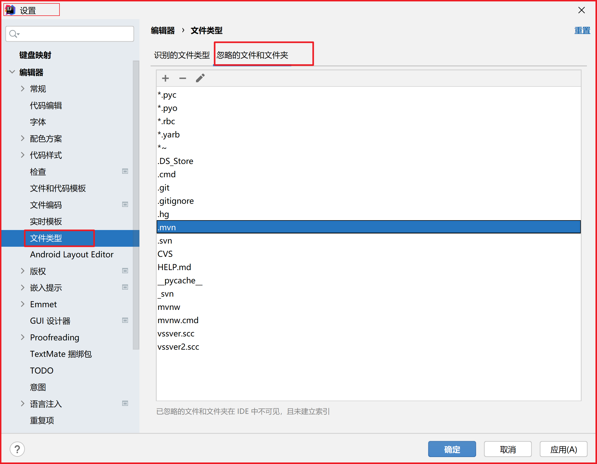
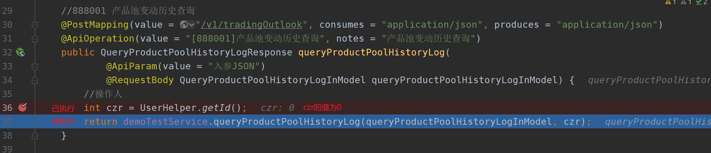
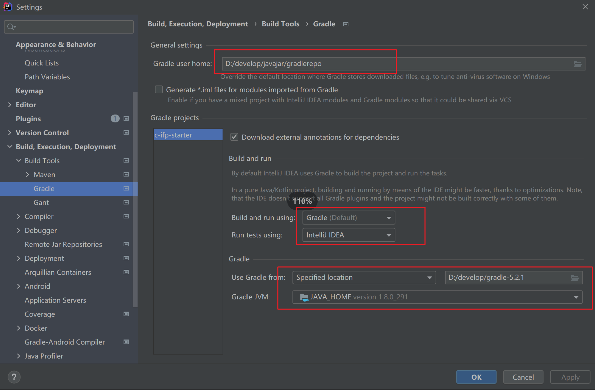
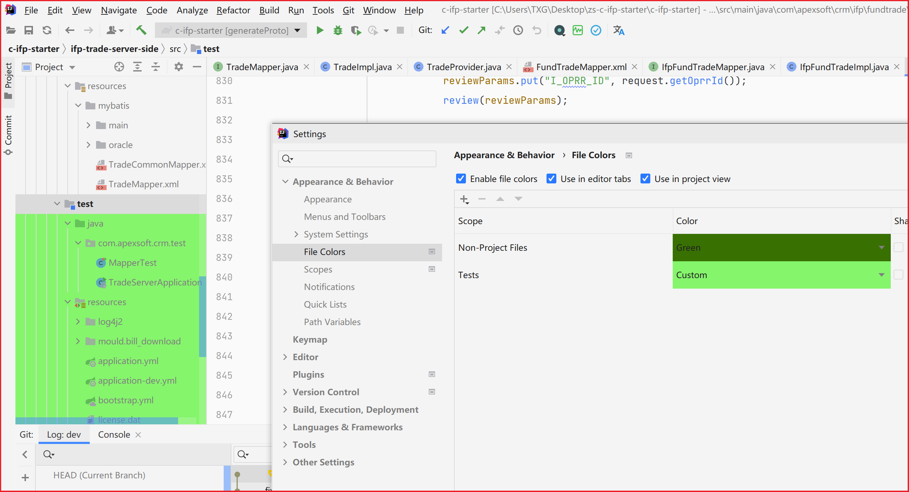
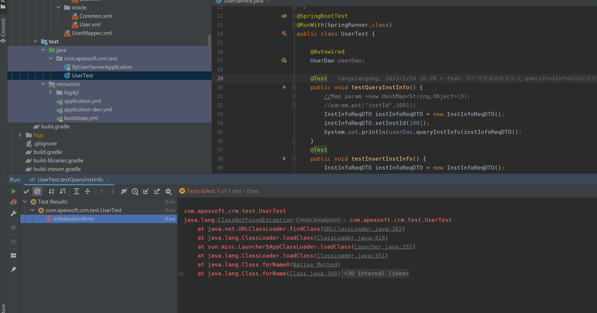

# 修改git文件颜色

git项目不同状态的文件会以不同的颜色显示，可自定义显示的颜色。


# 设置文件隐藏



# idea中展开折叠的文件夹

**1、按键盘中的向右箭头**

选中要展开的目录，按下键盘的向`右箭头`，这时候会展开一层当前目录。如果要展开所有，一直按住向`右箭头`不放。

**2、按数字键盘中的** 

选中要展开的目录，按下数字键盘中的`\*`，这时候会展开一层当前目录。如果要展开所有，一直按住数字键盘中的`*`不放。

# 更改文件颜色


# 导入已有模块


# IDEA终端Terminal修改

DEA的windows版本终端通常是cmd程序，在git操作中习惯使用linux命令，可以修改为git的bash，修改路径：setting -> Tools -> Terminal -> Shell path，修改为git安装路径。修改后重启idea生效。

默认：


修改后：


# IDEA调试

IDEA断点类型

有背景颜色标记的行，为马上执行的行，注意改行还未执行。



||>这个按钮非常的重要，其作用为：如果下面代码没有断点，那么回执行完全部代码；如果下面有代码，那么回跳转到下面的断点。

# IDEA显示build目录


# IDEA配置SFTP

https://www.jb51.net/article/212910.htm


# Gradle 配置



# IDEA卸载

https://blog.csdn.net/leinminna/article/details/115470728

# IDEA激活

https://baijiahao.baidu.com/s?id=1727424621934000354&wfr=spider&for=pc

# Test文件背景色修改



# Junit ClassNotFoundException




# 显示Select Opened File 按钮

取消此选项的勾选


# IDEA中使用services来启动springBoot项目

**一、使用services启动的效果**

使用services启动的目的就是为了在多项目启动的时候相比默认的启动方式更加进行方便快速的切换。同时，services启动时，也标注了每个启动类的端口，点击可以直接跳转到该网址链接。

**二、使用步骤**

1.在新建的springboot项目中，默认会有.idea文件夹，找到该文件夹下的workspace.xml文件。

2.在该文件最后面加入如下配置

```xml
  <component name="RunDashboard">
    <option name="configurationTypes">
      <set>
        <option value="SpringBootApplicationConfigurationType" />
      </set>
    </option>
  </component>
```

位置如下：


3.选择Build下的Rebuild，或者重启idea，就会发现项目已services方式来启动

# Build Output控制台输出乱码解决

解决方法：


添加 `-Dfile.encoding=UTF-8` 后重启IDEA

https://blog.csdn.net/lfq88/article/details/126871592

# IDEA 不显示工程目录结构

在IDEA编辑器中，有时会出现项目工程目录不显示的情况，如下图：


**产生原因**

一般为配置文件*.iml 出错了。

**解决途径**

方法1：若知道出错的具体位置与原因，用文本编辑器打开.iml文件，找到出错位置，修复。
方法2：清除配置，重新生成配置。
1）关闭IDEA，
2）删除项目文件夹下的.idea文件夹和*.iml文件
3）重新用IDEA工具打开项目

参考：https://blog.csdn.net/xisheng_lx/article/details/123082806

# 配置文件插件配置文件的导入导出

导出：File——＞Manage IDE Settings——>Export Settings

选择要导出的配置，选择存放路径后点OK


导入： File——＞Manage IDE Settings——>Import Settings

选择之前保存的settings.zip文件，点击OK导入


# windows端口占用

## 1、使用端口号终止相关进程：

首先，使用 `netstat` 命令查看占用指定端口的 PID：

```
netstat -ano | find "your_port"
```

然后，使用 `taskkill` 命令终止指定 PID 的进程：

```
taskkill /F /PID your_pid
```

替换 `your_port` 为你关心的端口号，`your_pid` 为相应的进程的 PID。

请注意，使用 `/F` 参数将强制终止进程，可能导致数据丢失。确保你真的需要终止该进程，并备份相关数据。

在执行这些命令时，最好以管理员身份运行命令提示符或 PowerShell。

## 2、杀死所有Java进程

```
taskkill /f /t /im java.exe
```


# 常用插件

Free Mybatis plugin

Git Commit Message Helper

GitToolBox

Maven Helper

Mybatis Log

Rainbow Brack

Lombok

