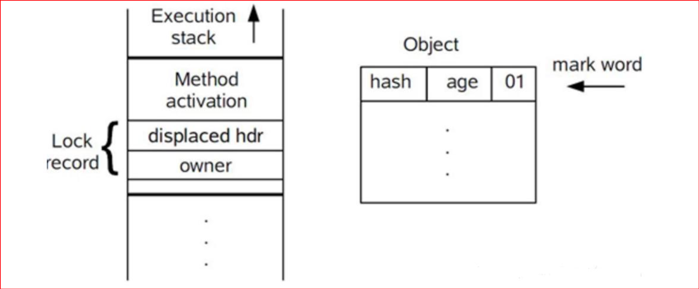
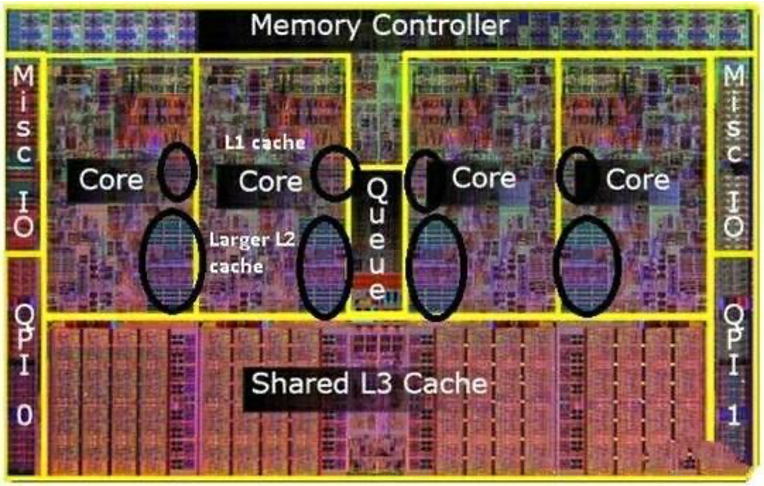

# JUC-DLJD

# 3. 第三章 线程安全

## 3.1 什么是线程安全

白话一点，线程安全是指多个线程同时运行的时候，会不会产生预期之外的结果?比如我要对 i=0 的变量进行+1 操作，1 个线程执行的时候，结果是 1，两个线程执行的时候，结果应该是 2，但是结果却是 1，那就产生了线程安全问题;

产生线程安全问题是因为多个线程访问内存中的共享资源，从而产生了冲突、产生了脏数据、产生了意外的结果;

所谓共享资源就是多个线程都可以访问的资源;


Java 代码运行在 jvm 中，jvm 的公共内存是堆、元空间(方法区)，同一个 jvm 进程都能访 问这个公共内存，正因为这块内存是大家都可以访问的，是公共的，这样就会导致内存不安全 的问题;

所以线程安全指的是，在共享内存中的公共数据由于可以被任何线程访问到，在没有限制的情 况下存在被意外修改的风险;

所以对于像堆、元空间(方法区)这种公共区域，多个线程去操作时，是存在安全问题的;

但是注意:如果多个线程都只是读取共享资源而不去修改，那就不会存在线程安全，只有当至 少有一个线程修改了共享资源时才会存在线程安全;

## 3.2 线程不安全原因剖析

导致线程不安全的底层核心原因主要有三个:

1、原子性

2、有序性

3、可见性

### 3.2.1 原子性

我们经常听到数据库中事务的原子性，数据库事务的原子性是指一组对数据库的操作，要么最终全部成功执行，要么最终全部回滚;

多线程并发编程的原子性是指一组指令被执行时，不受其他指令的干扰，比如我们说 CAS (Compare & Set)是原子的，java.util.concurrent.atomic 下的原子操作类等，这里的原 子性其实指的是隔离性，也就是一组操作不能被别的线程干扰;

### 3.2.2 线程上下文切换

1、使用多线程的目的是为了充分利用多核 CPU;

2、当创建很多线程，CPU 不够用了，此时就是一个 CPU 来应付多个线程;

3、操作系统采用时间片切换的方式把每个线程分配给 CPU 去执行，线程在时间片内占用 CPU 执行任务，当线程使用完时间片后，就会处于就绪状态并让出 CPU 从而让其它线程去使用， 这就是上下文切换;


## 3.3 synchronized 解决线程安全

前面分析的线程安全问题可以采用 synchronized 来解决;

synchronized 是 Java 中的一个关键字，它的使用就是在代码上加一个 synchronized 关键 字即可;

synchronized 是 Java 的内置锁; 这把锁我们看不见，所以也被称为内部锁或监视器锁，它的作用就是在同一时刻只有一个线程能进入 synchronized 代码块;

**加锁**：线程在进入 synchronized 代码块前会自动获取内部锁，此时其它线程访问该同步代 码块时会被阻塞挂起;

**解锁**：拿到内部锁的线程在正常退出代码块、抛出异常后、在同步代码块内调用了该内置锁资 源的 wait 系列方法时 释放该内置锁;

synchronized 内置锁是排它锁，因为当一个线程获取这个锁后，其他线程必须等待该线程释 放锁后才能获取该锁;

## 3.4 synchronized 同步锁的使用

### 3.4.1 synchronized 使用语法

(1)作用在方法上;

修饰非静态方法(普通方法)

修饰静态方法

(2)作用在代码块上;(粒度更细，更加灵活) 

synchronized(this｜object) {…}

synchronized(类.class) {…}

### 3.4.2 synchronized 同步锁分类

(1)对象锁;

(2)类锁;

### 3.4.3 对象锁

1、两个线程同时访问同一个对象的同步方法，会互斥;

2、两个线程同时访问同一个对象的同步方法和非同步方法，不互斥;

3、两个线程同时访问两个对象的同步方法，不互斥;

4、两个线程同时访问两个对象的同步方法和非同步方法，不互斥;

### 3.4.4 类锁

1、两个线程同时访问同一个类的静态同步方法，会互斥;

2、两个线程同时访问不同类的静态同步方法，不互斥;

3、两个线程同时访问同一个类的静态同步方法和静态非同步方法，不互斥;

4、两个线程同时访问同一个类的静态同步方法和非静态同步方法，不互斥; 使用的是同一把锁就互斥，不是同一把锁，那么不会互斥!

## 3.5 synchronized 底层实现原理剖析

synchronized 锁的类型分为:偏向锁、轻量级锁、重量级锁;

JDK1.6 之前，synchronized 只有重量级锁，JDK1.6 之后新增了偏向锁、轻量级锁，这是 JDK 的一种锁优化提升;

### 3.5.1 JVM 堆内存中的对象布局?

在 HotSpot 虚拟机中，一个对象的存储结构分为 3 块区域:

(1)对象头(Header)

(2)实例数据(Instance Data)

(3)对齐填充(Padding);


### 3.5.1.1 对象头(Header)

第一部分是 Mark Word，用于存储对象自身的运行时数据，如哈希码、GC 分代年龄、锁状 态标志、线程持有的锁、偏向线程 ID、偏向时间戳等，32 位虚拟机占 32 bit，64 位虚拟机 占 64 bit，下图分别是 32 位和 64 位的 Mark Word 存储结构:

通过 2bit 表示锁状态，通过 1bit 表示无锁和偏向锁;


第二部分是类型指针，即对象指向它的类的元数据指针，虚拟机通过这个指针确定这个对象是 哪个类的实例;

(第三部分) 如果是 Java 数组，对象头中还必须有一块用于记录数组长度的数据，因为普通对 象可以通过 Java 对象元数据确定大小，而数组对象不可以;

### 3.5.1.2 实例数据(Instance Data)

程序代码中所定义的各种成员变量类型的字段内容(包含父类继承下来的和子类中定义的);

### 3.5.1.3 对齐填充(Padding)

不是必然需要，主要是占位，保证对象大小是某个字节的整数倍，HotSpot 虚拟机，任何对象的大小都是 8 字节的整数倍，可以通过-XX:ObjectAlignmentInBytes=16 调整默认的对齐 大小为 16 bytes 的倍数;

### 3.5.2 JOL 查看 Java 对象内存布局JOL

通过 JOL (Java Object Layout) 输出对象内存布局:

```xml
<dependency>
  <groupId>org.openjdk.jol</groupId>
  <artifactId>jol-core</artifactId>
  <version>0.14</version>
</dependency>
```


`OFFSET`：偏移地址，单位:字节;

`SIZE`：占用内存大小，单位:字节;

`TYPE DESCRIPTION`：类型描述，其中(object header)表示对象头，单位:字节，一共占用 12 字节，前面 8 字节对应对象头中的 Mark Word，最后 4 字节对应类型指针(类型指针默 认进行了压缩是 4 字节，通过-XX:-UseCompressedOops 关闭指针压缩，若没有压缩就会变 成 8 字节)；(loss due to the next object alignment) 表示对齐填充，对齐填充使用了 4 字节，从而保 证整个大小是 8 字节的整数倍;

`VALUE`：对应内存中当前存储的值;

Instance size：32 bytes 表示当前对象占 32 字节;

Space losses：0 bytes internal + 4 bytes external = 4 bytes total 内部及外部的空间损失;

### 3.5.3 对象头 Mark Word 中 VALUE 值解读

Intel、AMD 处理器(CPU)是小端存储;

以字节为单位，从右到左是由高到低，字节内部是从左到右为由高到低;

我们日常:1234 小端:4321

32 位虚拟机 Mark Word 为 4 字节;

64 位虚拟机 Mark Word 为 8 字节;

### 3.5.4 偏向锁

前面我们介绍了 synchronized 锁的类型分为:偏向锁、轻量级锁、重量级锁;

JDK1.6 之前，synchronized 只有重量级锁，从 JDK1.6 开始新增了偏向锁、轻量级锁;

在没有多线程竞争时，访问 synchronized 修饰的同步代码，会先使用偏向锁；比如在实际应用场景中，使用 synchronized 修饰同步代码是为了防止出现线程安全问题，但是实际运行时我们不知道会不会有多线程去访问，而且实际上大部分时间都没有多线程去访问，所以我们完全没有必要一开始就采用重量级锁，当没有多线程访问时候，synchronized 此时使用的是偏向锁，这是 JDK 对 synchronized 的优化;

JVM 启动参数 -XX:BiasedLockingStartupDelay 默认是 4 秒，可以改成 0; 打印所有 JVM 参数及默认值:java -XX:+PrintFlagsFinal -version

### 3.5.4.1 偏向锁加锁

抢占偏向锁的过程是通过 CAS(Compare and Swap)实现的，通过 CAS 替换 Mark Word 中的偏向锁标记和锁标记，并设置线程 ID;


### 3.5.4.2 偏向锁释放

偏向锁不好明确地说释放锁，可以认为偏向锁是没有释放锁这个概念的，也就是说偏向锁不会主动去释放锁，偏向锁是等到有另外的线程来获取锁，出现锁竞争才有释放锁的概念，当其他线程尝试竞争偏向锁时，持有偏向锁的线程才会释放锁，然后发生锁的升级/膨胀;

### 3.5.4.3 偏向锁的设计思想

// 加锁

```java
synchronized (t) { 
  System.out.println("------业务执行------");
}
```

//解锁

偏向的意思:偏心、偏袒，也就是每次都对某一个线程关爱有加、享受高级特殊待遇;

在没有线程竞争的情况下，每次都是同一个线程访问同步代码块，那就没有必要加锁和解锁，

只需要第一次设置对象头标记，后续只需要判断一下对象头即可，提升性能;

如果此时有其他线程加入了竞争，那就会进行锁的升级/膨胀;

偏向锁是假定每次来访问同步代码块都是同一个线程，没有其他线程来竞争锁;

如果你明显觉得项目中加锁的代码大部分情况都会是多线程竞争锁，此时完全可以把偏向锁关 闭，`-XX:-UseBiasedLocking`，那么程序默认会进入轻量级锁状态;

### 3.5.5 轻量级锁

偏向锁是同一时刻只有一个线程获取锁，如果有多个线程来获取锁，比如说有几个线程交替执 行同步代码块，此时如果直接使用重量级锁，可能也有点过头了，就会产生更多的性能消耗， 因为重量级锁需要使用操作系统互斥锁来实现，需要从用户态到内核态的切换，于是 JDK 设计了一个平衡方案那就是轻量级锁;

轻量级锁就是没有抢占到锁的线程，进行一定次数的重试，也叫自旋(忙循环 while (….))， 当然如果无限制地自旋，会消耗 CPU 资源，JDK6 默认是 10 次，可以使用-XX:PreBlockSpin 来更改;

同时 JDK 对自旋做了进一步改进，引入了自适应自旋锁，即自旋的次数是不固定的，而是由 前一次在同一个锁上的自旋时间及锁的拥有者的状态来决定，如果在同一个锁对象上，自旋等 待刚刚成功获得过锁，并且持有锁的线程正在运行中，那么虚拟机就会认为这次自旋也是很有 可能再次成功，进而它将允许自旋等待持续相对更长的时间来获取锁，如果对于某个锁，自旋 很少成功获得过，那在以后尝试获取这个锁时将可能省略掉自旋过程，直接阻塞线程，避免浪 费 CPU 资源;

### 3.5.5.1 轻量级锁加锁

1、在线程进入同步块时，如果同步对象锁状态为无锁状态(偏向锁为 0，锁标志位为 01)， 虚拟机首先将在当前线程的栈帧中创建一个锁记录(Lock Record)空间，用于存储锁对象目 前的 Mark Word 拷贝，官方称之为 Displaced Mark Word，此时线程栈与对象头的状态如图:



2、复制对象头中的 Mark Word 到锁记录(Lock Record)中，如下图所示:


3、复制完成后，虚拟机将使用 CAS 操作尝试将对象的 Mark Word 更新为指向 Lock Record 的指针，并将 Lock record 里的 owner 指针指向 Object mark word，如下图所示:


4、如果上面的步骤 3 更新成功了，那么这个线程就拥有了该对象的锁，并将对象 Mark Word 的锁标记设置为 00，即表示此对象处于轻量级锁定状态，如下图所示:


5、如果上面的步骤 3 更新失败了，虚拟机首先会检查对象的 Mark Word 是否指向当前线程的栈帧，如果是就说明当前线程已经拥有了这个对象的锁，那就可以直接进入同步块继续执行， 否则说明多个线程竞争锁，并且竞争很激烈，如果不激烈的话，当前线程不需要阻塞，进行自旋，等待占用锁的线程释放锁，通过 CAS 后即可立即获取锁，否则轻量级锁就要升级为重量级锁;(如果竞争不激烈的话，上面的步骤 3 应该是可以获取锁的);

### 3.5.5.2 轻量级锁释放

轻量级锁释放锁(解锁)时，会使用 CAS 将之前复制在栈桢中的 Displaced Mard Word 替换回 Mark Word 中，如果替换成功，则说明整个过程都成功执行，期间没有其他线程访问同步代码块;

但如果替换失败了，表示当前线程在执行同步代码块期间，有其他线程也在访问，当前锁资源是存在竞争的，那么锁将会膨胀成重量级锁;

### 3.5.5.3 轻量级锁的设计思想

轻量级锁是相对重量级锁而言的(重量级锁基于操作系统的互斥量实现)，轻量级锁的本意是在没有多线程竞争的前提下，减少传统的重量级锁使用操作系统的互斥量而带来的性能消耗;

JDK 的设计人员根据大量数据和经验表明:对于绝大部分锁，在整个同步周期内都是不存在竞争的，如果没有竞争，轻量级锁就可以使用 CAS 操作避免采用操作系统互斥量获取锁的开销， 从而提升效率;

偏向锁 – 轻量级锁 – 重量级锁;

### 3.5.6 重量级锁

JDK1.6 之前，synchronized 只有重量级锁，JDK1.6 及之后的版本，synchronized 锁从偏向 锁–>轻量级锁–>重量级锁，当升级为重量级锁之后，会把等待想要获得锁的线程进行阻塞， 被阻塞的线程不会消耗 CPU，但是阻塞或者唤醒一个线程时，都需要操作系统来调度，这就 需要从用户态转换到内核态，这种转换是需要消耗很多时间的，所以这种重量级锁同步方式的成本非常高;

### 3.5.6.1 重量级锁底层实现原理

synchronized 重量级锁是 JDK1.6 之前就有的，从 JDK1.6 开始只是新增了偏向锁、轻量级锁;

在 JDK1.6 之前，我们讨论的 synchronized 锁就是重量级锁;

从 JDK1.6 开始，我们讨论的 synchronized 重量级锁是从偏向锁、轻量级锁膨胀而来的;

我们知道一个 Java 对象存储在 JVM 的堆里面，堆里面的对象由 3 部分构成:对象头、实例 数据、对齐填充;


在 hotspot 源码 oop.hpp 文件中定义;


markOop 就是我们所说的 Mark Word，用于存储锁的标识;

同时 Java 中每个对象都存在着一个 monitor 与之关联，monitor 是 C++编写的，在 hotspot 虚拟机源码 ObjectMonitor.hpp 文件中实现了 monitor，每个 Java 对象中都会内置一个 ObjectMonitor 对象;

java -> main 运行 -> 启动了 jvm;

user(Class), this (monitor)

我们 synchronized(this){ …… } 膨胀为重量级锁了，那么 this 对象会与一个 monitor 关联， 怎么关联?就是 this 对象头里面的 mark word 指向 monitor 的指针;


monitor 对象也叫管程或监视器锁，虚拟机规范中用的是管程一词，简单理解 monitor 就是 锁;

monitor (管程) 提供了一种排它互斥访问机制，保证在每个时间点上最多只有一个线程会执 行同步方法，所以 Monitor 对象(管程)其实就是控制同步访问的一种对象;

### 3.5.6.2 synchronized 锁膨胀

synchronized 的字节码指令

同步方法特殊标志:ACC_SYNCHRONIZED

同步代码块特殊标志:monitorenter、monitorexit (字节码指令)

monitorenter //监视器进入，获取锁

monitorexit //监视器退出，释放锁

JVM 将字节码加载到内存以后，会对这两个指令进行解释执行，monitorenter, monitorexit 的指令解析是通过 InterpreterRuntime.cpp 中的两个方法实现;

```cpp
InterpreterRuntime::monitorenter(JavaThread* thread, BasicObjectLock* elem)
InterpreterRuntime::monitorexit(JavaThread* thread, BasicObjectLock* elem)
```

从 monitorenter 指令为入口，会发现是从偏向锁->轻量级锁->重量级锁的路径来实现 synchronized 锁的膨胀过程;


image.png

slow_enter 方法，位于 synchronizer.cpp 文件中;

锁膨胀的过程是通过 ObjectSynchronizer::inflate 方法实现，整个锁膨胀的过程是通过自旋for (; ;)来完成的;

锁膨胀的过程实际上是获得一个 ObjectMonitor 监视器对象，而真正抢占锁的逻辑，在 ObjectMonitor::enter 方法中;

**3.5.6.3 重量级锁加锁**

抢占锁的逻辑，在 ObjectMonitor::enter 方法中，通过自旋设置 monitor 的_owner 字段为当前线程，自旋执行的方法是 ObjectMonitor::EnterI；

重量级锁是通过对象内部的监视器(monitor)来实现，也就是通过 ObjectMonitor 实现，而在 ObjectMonitor.hpp 有几个重要属性：_Owner，_EntryList，_WaitSet、_cxq，_recursions；

- _Owner：保存当前持有锁的线程；
- _EntryList：等待获取锁的线程；
- _WaitSet：调用 Object 的 wait()方法等待时，此时将该等待的线程保存到_WaitSet 中；
- _cxq：存储没有获取到锁的线程；
- _recursions：记录重入次数；

当多个线程同时访问某段同步代码时:

```java
synchronized (this) {
  System.out .println("doWork2 线程执行......");
}
```

1、首先会进入_EntryList 集合；

2、当线程获取到对象的 monitor 之后，就会进入_Owner 区域，并把 ObjectMonitor 对象的_Owner 指向为当前线程，并将_count + 1；

3、如果调用了释放锁（比如 wait（）方法）操作，就会释放当前持有的 monitor，即_owner = null，_count - 1，同时这个线程会进入到_WaitSet 列表中等待被唤醒；

4、如果当前线程执行完毕，则释放 monitor 锁，复位_count 的值（_count-1），不过此时不会进入_WaitSet 列表；


**3.5.6.4 重量级锁释放**

锁释放是同步代码块执行结束后触发，ObjectMonitor::exit；

1、ObjectMonitor 中持有的锁的_owner 对象置为 null；

2、从_cxq 队列中唤醒一个被挂起的线程；

根 据 QMode 模 式 判 断 是 从 _cxq 还 是 EntryList 中 获 取 头 节 点 的 线 程 进 行 唤 醒 ， 通过ObjectMonitor::ExitEpilog 方法唤醒该节点封装的线程，唤醒操作最终由 unpark 完成；

_cxq（竞争列表）

EntryList（锁候选者列表）

3、被唤醒的线程重新竞争重量级锁，被唤醒的线程不一定能抢到锁，未抢到锁的线程将继续

挂起，synchronized 是非公平锁；

**3.5.7 用户态和内核态**

CPU 的各种指令分成了 4 个级别，分别是 Ring0、Ring1、Ring2、Ring3，Ring0 是最高级

别，Ring1 第二，Ring2 第三，Ring3 第四；


我们的操作系统如 Linux、Windows 使用了 Ring0 和 Ring3 两个指令级别，而 Ring1、Ring2两个级别由于历史原因，没有使用；

RING0 级别最高，它所包含的指令叫特权指令；

RING3 级别最低，它包含的指令叫非特权指令；

在 CPU 的所有指令中，有一些指令是非常危险的，如果随便错误使用，将导致整个系统崩溃，比如：清内存、设置时钟、访问硬件设备等，所以，对于这些危险的指令，要限制使用对象，不能谁都去使用，它们属于特权指令，也就是我们的 Ring0 级别的指令是特权指令，只允许操作系统使用；

而另外的一些不会造成灾难后果的普通指令，可以供我们普通的应用程序使用，也就是我们的Ring3 级别的指令属于非特权指令，这种划分是为了系统的安全和稳定；

RING0 只给操作系统用，RING3 谁都可以使用，如果普通应用程序执行 Ring0 指令，则会提示“非法指令”错误信息；

操作系统（内核）的代码运行在最高运行级别 Ring0 上，可以使用特权指令，清内存、设置时钟、访问硬件设备等等；

应用程序（我们编写的程序，App，客户端软件等）的代码运行在最低运行级别上 Ring3 上，不能直接做清内存、设置时钟、访问硬件设备等操作；

如果应用程序要做清内存、设置时钟、访问硬件设备等操作，那就要通过执行系统调用（函数），

执行系统调用的时候，CPU 的运行级别会发生从 Ring3 到 Ring0 的切换，并跳转到系统调用对应的内核代码位置执行，这样内核就为你完成了设备访问，完成之后再从 Ring0 返回Ring3，这个过程叫做用户态和内核态的切换，系统调用先切换到 Ring 0，再紧接着切换回 Ring 3，这个切换过程对我们应用程序而言是透明的，我们似乎没有感觉到，但实际上发生了

`用户态->内核态->用户态`的切换，这是很消耗性能的，因为每个进程的栈有两个，一个是用户态栈，一个是内核态栈，在从用户态栈进入内核态栈的时候，需要保存用户态的寄存器，在内核态返回用户态的时候会恢复这些寄存器的内容，相对而言这是一个很大的开销且耗时；


**3.5.8 synchronized 死锁问题**

**3.5.8.1 什么是死锁？**

哲学家就餐问题，经典问题，在并行计算中多线程同步(Synchronization)时产生的问题；

描述：五位哲学家围坐在一张圆形餐桌旁，做以下两件事情之一：吃饭，或者思考；

吃东西的时候，他们就停止思考，思考的时候就停止吃东西；

餐桌中间有一大碗意大利面，每两个哲学家之间有一只餐叉，因为用一只餐叉很难吃到意大利面，所以假设哲学家必须用两只餐叉才能吃面，他们只能使用自己左右手边的那两只餐叉；


**死锁**（Dead Lock）指的是两个或两个以上的运算单元（进程、线程或协程），都在等待对方释放某个资源，但是没有一方提前释放，造成线程无限期地阻塞，就称为死锁；


**3.5.8.2 死锁案例分析**

参考代码；

jstack

jconsole

jmc（Oracle Java Mission Control ）

*https://visualvm.github.io/index.html*

**3.5.8.3 产生死锁的四个必要条件**

1、互斥条件：当资源被一个线程使用或者占用时，别的线程就不能使用该资源，比如资源 X已经被 T1 线程占用，那么 T2 线程就不能再占用 X 资源；（系统条件）

2、请求和保持条件：资源请求者在请求别的资源时，同时保持对已有资源的占有，比如 T1线程已经取得 X 资源，在等待获取 Y 资源的时候，不释放对 X 资源的占用；

3、不可抢占条件：获取资源的一方，不能从正在使用资源的一方强行抢占资源，资源只能被使用者主动释放，比如 T1 线程已经取得 X 资源并正在使用，那么 T2 线程不能强行抢占 X 资源；

4、循环等待条件：一个线程正在等待另一个线程占用的资源，而对方又在等待自己占用的资源，从而造成环路等待的情况，比如 T1 线程等待 T2 线程占用的资源，T2 线程等待 T1 线程占用的资源；

只有以上 4 个条件同时满足，才会造成死锁问题；

**3.5.8.4 死锁如何解决?**

根据前面介绍的产生死锁的四个必要条件，那么我们只需要破坏其中一个条件，那么就解决了

死锁问题；

1、互斥条件：这个是互斥锁的基本要求，不能破坏；

2、请求和保持条件：破坏该条件，一次性获取所有锁资源，避免等待；

3、不可抢占条件：破坏该条件，占用部分资源的线程进一步申请其他资源时，如果申请不到，可以主动释放它占有的资源，ReentrantLock；

4、循环等待条件：破坏该条件，按顺序获取锁；

**3.6 synchronized 与脏读问题**

脏读最常见的是数据库事务中的脏读，大家都应该听过或者比较熟悉；

数据库脏读：就是指当一个事务正在对数据进行修改，而这种修改还没有提交到数据库中，此

时另外一个事务也访问这个数据，然后使用了这个数据，那么使用的这个数据可能不是正确的；

**比如：**

张三的账户余额为 10000,事务 A 把他的余额改为 15000,但事务 A 尚未提交；

与此同时，

事务 B 读取张三的余额，读取到张三的余额为 15000；

随后，

事务 A 发生异常而回滚了事务，张三的余额又回滚为 10000；

最后，

事务 B 读取到的张三余额为 15000 的数据即为脏数据，事务 B 是一次脏读；

**数据库默认的事务隔离级别不会存在脏读问题；**


**MySQL 默认采用的 REPEATABLE_READ 隔离级别（可重复读）；**

**Oracle 默认采用的 READ_COMMITTED 隔离级别（已提交读）；**

**Java 多线程脏读问题**

白话一点来说，脏读就是读到的数据不是最终的正确数据，而是一个错误数据，从而就可能导致业务处理结果最终不正确；

比如在执行读操作时，要读的数据正在被其它线程修改或部分修改，导致读出来的数据是原来的数据，而不是修改之后的最终数据；

参考代码示例；

由于 showBalance 没有加锁，所以它不需要等待转账方法执行结束，所以第一次打印出来的结果是 0.0；

第二次打印的结果才是正确的；

这就是一种脏读现象；

**怎么解决？**

如果我们对读操作也加锁，为 showBalance 方法增加 synchronized，因为都是 this 锁，所以它们是同一把锁，所以读操作会等写操作完成了之后才会进行下一步操作，保证了数据的准确性；

实际业务当中应该看是否允许脏读，不允许的情况下对读方法也要加锁，在 showBalance 方法上加上 synchronized 关键字就可以避免脏读，当然读方法上加锁会牺牲一定的性能；这其实也是一个线程安全问题，即多个线程同时访问一个共享资源时，会导致程序运行结果并不是想看到的结果；

也就是说，当多个线程同时访问（同一个对象，同一个对象中的属性，同一个文件，同一个数据库等）时，就可能会产生线程安全问题；

**3.7 内存不可见问题**

什么是可见性？

一个线程修改了共享变量的值，其他线程也能看到最新修改的值，那么这个就是内存可见的，否则就是不可见的；

看一个代码案例演示；

**3.8 从计算机的基本硬件结构谈起**





**3.9 Java 内存模型**


*http://www.cs.umd.edu/~pugh/java/memoryModel/jsr133.pdf*

Java 内存模型（Java Memory Model，简称 JMM）；

它和 JVM 内存结构：堆、元空间、栈、程序计数器等不是同一个概念；

Java 内存模型来自于 JSR-133: JavaTM Memory Model and Thread Specification 描述；它是一个抽象的概念，JMM 是和多线程相关的，它是一组规范，描述了一组规则，定义了多线程对共享变量读写操作时的行为规范，通过这些规则来规范对内存的读写操作，从而保证多线程对共享数据操作的原子性、可见性、有序性；

同时通过这套规范，屏蔽掉底层不同操作系统、不同 CPU 硬件之间的差异，让 Java 程序员按照统一的方式来编程，保证 Java 程序在各种平台下对内存的访问都能够得到相同的效果；

- 所有的变量都存储在主内存中，每个线程都可以访问；
- 每条线程都有自己私有的工作内存；
- 线程的工作内存中保存了该线程中用到的主内存变量的副本拷贝;
- 线程对变量的所有操作都必须在工作内存中进行，而不能直接操作主内存；
- 不同线程之间也无法直接访问对方工作内存中的变量；


Java 中提供了一系列和并发处理相关关键字、并发类，都是 Java 内存模型的实现，比如：volatile、synchronized、final、concurrent 包等，这些底层都是 Java 内存模型下的具体封装实现；

**3.10 volatile 关键字**

**volatile** [ˈvɒləˌtaɪl]

不稳定的，易变的；反复无常的；动荡的；挥发性的; 短期的；短暂的；片刻的；会飞的；

volatile 关键字只能修饰类变量和实例变量，对于方法参数、局部变量以及实例常量、类常量都不能进行修饰；

volatile 的主要作用是使共享变量在多线程间可见，如果一个字段被声明成 volatile，Java 线程内存模型会确保所有线程看到这个变量的值都是一致的；

即有一个共享变量 a=10，当线程 t1 修改了 a=11，那么 t2 线程将强行从主内存中读取新的值 a=11，而不是读缓存中的 a=10 的值；

但 volatile 存在的问题是它不保证原子性，也就是它没有像 synchronized 的同步/互斥功能；volatile 可以保证多线程读取共享变量时可以获得最新的值去使用，volatile 强制线程每次从主内存（共享内存）读取共享变量，而不是从工作内存（私有内存）读取变量，从而保证多线程间变量的可见性，但是对于像 i++这种非原子性操作，volatile 不能保证原子性；


**3.11 volatile 与有序性**

volatile 可以保证可见性，不能保证原子性，volatile 也可以保证有序性；

什么是有序性？有序性是指我们的程序代码的执行应该要有一定的先后顺序，从而保证运行结果是正确的，比如：

`Plain Text int a = 10；(1) int b = 20；(2) a++；(3) int b = a + 1；(4)`

我们写的 Java 程序代码不总是按照代码书写的前后顺序执行的，有可能出现程序重排序（指令重排）的情况，这是 Java 在编译和运行期对代码的优化，以提高代码执行效率；

重排序只会对不存在数据依赖性的指令重排序，在单线程下无论怎么重排序可以保证最终执行的结果与程序顺序执行的结果一致，但是在多线程下就不一定了，可能会出现问题；

被 volatile 修饰的共享变量相当于屏障，屏障的作用是不允许指令随意重排；

**3.12 volatile 的使用场景**

volatile 关键字的作用：保证 Java 并发编程中的可见性、有序性，但不能保证原子性；synchronized 和 lock 可以保证 Java 并发编程的可见性、有序性、原子性，即并发程序的安全，但是性能会差些；

所以有些场景下可以采用 volatile 关键字；

（1）在一些对变量的操作已经是原子性的情况下，可以使用 volatile 关键字；

（2）运行结果并不依赖变量的当前值，可以使用 volatile 关键字，volatile 不适合复合操作，像 i++这种类型操作不适合使用 volatile； int a=10; a = 20;

（3）一些状态标志的场景，比如仅仅是使用一个布尔状态 true 和 false 标志；

（4）定期更新，供程序内部使用的变量，可以使用 volatile；

（5）双重检查锁定（double-checked-locking）问题可以用 volatile；

注：如果对共享变量已经加锁，加锁本身已经保证了可见性、原子性、有序性，此时就没必要再使用 volatitle；

**3.13 多线程单例模式设计**

单例设计模式是 GoF23 种设计模式中的一种，也是最常用的一种设计模式；

一个类只能够产生一个实例对象，这就是单例设计模式；

单例设计模式提供了一种在多线程情况下保证只创建唯一一个实例对象的解决方案；

**3.13.1 饿汉式**

很饥渴，类一加载就初始化创建了对象；

不会存在线程安全问题，多线程环境 100%不会出现创建两个对象的问题；

类一加载就初始化创建了单例对象也有弊端，如果创建了对象但是很久都不需要使用，那就会浪费内存空间，如果对象属性很少，对象很小那还可以，如果对象很大，那不建议使用该方式；

**3.13.2 懒汉式**

可以实现懒加载，在需要的时候再创建单例对象；

多线程条件下，编码不严谨可能创建出多个对象；

**3.13.3 懒汉式+同步方法**

可以实现懒加载，同时保证多线程条件下只会创建一个对象；

由于 synchronized 的互斥性，getInstance()方法同一时刻只能有一个线程能访问，性能表现一般；

**3.13.4 Double-Check**

双重检测，也叫双重检测锁 DCL（Double-Check-Lock）非常棒的一种设计，实现更加高效的同步，多线程首次获取对象需要加锁互斥，之后多线程每次获取对象都不需要加锁；

看似完美，但是在多线程条件下有可能产生空指针的问题；

instance = new Singleton(); 可分解为：

（1）分配对象的内存空间

（2）初始化对象

（3）设置 instance 指向刚分配的内存地址

操作 2 依赖 1，但是操作 3 不依赖 2，所以有可能出现 1,3,2 的顺序，当出现这种顺序的时候，虽然 instance 不为空，但是对象有可能没有正确初始化，然后你调用这个未初始化完成的对象的方法，就可能报错；

**3.13.5 Volatile+Double-Check**

加入 volatile 禁止重排序解决 DCL 的问题；

**3.13.6 静态代码块**

静态代码块方式跟饿汉式的方式几乎一样，只是把初始化代码放到了 static 块中；

类加载的时候，类变量和静态代码块都是会跟随类一起加载；

优缺点都同饿汉式一样，也是立即加载，线程安全的；

**3.13.7 静态内部类**

静态内部类方式是吸纳了懒汉模式延迟加载和饿汉式类加载的特性；

懒汉式要考虑线程安全问题，代码就比较繁琐，但是可以懒加载；

饿汉模式采用类加载方式为我们省去了线程安全问题；

静态内部类方式既能享受类加载带来的线程安全，又能延迟加载；

静态内部类的方式，在加载的时候不会加载静态内部类，使用的时候才会加载，而使用到的时

候类加载又是线程安全的，这是非常棒的设计；

**3.13.8 枚举类**

有一本书《effective java》其作者 Joshua Bloch（乔什布洛赫）推荐使用枚举来实现单例模式，他说最佳的单例模式实现就是枚举模式，书中写到：

*单元素的枚举类型已经成为实现 Singleton 的最佳方法；*

利用枚举的特性，让 JVM 来帮我们保证线程安全和单一实例的问题；

****

反编译工具下载：*http://www.javadecompilers.com/jad*

进入到 jad.exe 所在的位置

此时将要反编译的文件也放到相同位置：


输入 cmd 弹出 dos 窗口，执行：输入命令 jad -s java Singleton08.class

**3.13.9 单例设计模式防攻击问题**

1、饿汉式

2、懒汉式

3、懒汉式+同步方法

4、Double+Check

5、Volatile+Double+Check

6、静态代码块

7、静态内部类

8、枚举类

位运算：

＆ 同为１时为１，否则为０；

｜只要一个为 1 就为 1，否则为 0

**3.13.10 单例设计模式小结**

性能比较；

单例模式适用于需要频繁创建和销毁、创建和销毁比较耗时耗资源，又需要频繁使用的对象，一般可以使用单例模式；

例如：开发中用到的一些工具类对象、线程池一般也是采用单例模式、用于操作数据库、网络、文件的对象（数据源对象、Session 工厂对象等）；

用哪一种单例设计模式？

如果在程序中确定一直都会使用到的对象，可以采用饿汉式；

如果在程序中不确定会使用到的对象，可以采用懒汉式，注意防止反射和反序列化攻击问题；

枚举方式是比较推荐的方式；

**一些开源代码中的单例设计模式：**

JDK：Runtime

Netty：DefaultSelectStrategyFactory、MqttEncoder、DateFormatter、UnsupportedValueConverter

MyBatis：ErrorContext、VFS