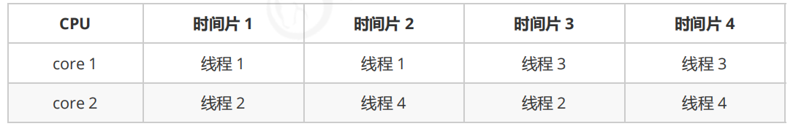
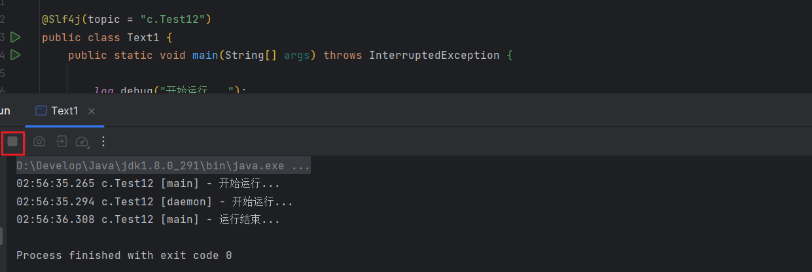
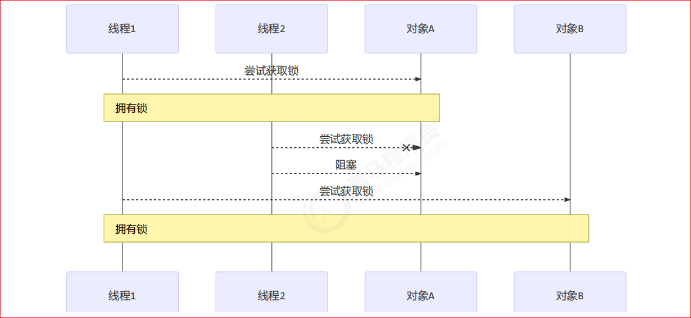
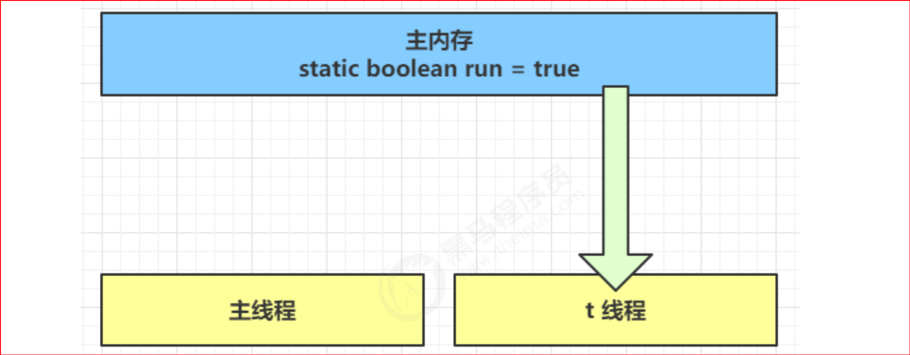

# 1.概述

## 1.3 课程特色

本门课程以并发、并行为主线，穿插讲解

- 应用 - 结合实际

- 原理 - 了然于胸

- 模式 - 正确姿势

## 1.4 预备知识

- 希望你不是一个初学者

- 线程安全问题，需要你接触过 Java Web 开发、Jdbc 开发、Web 服务器、分布式框架时才会遇到

- 基于 JDK 8，最好对函数式编程、lambda 有一定了解

- 采用了 slf4j 打印日志，这是好的实践

- 采用了 lombok 简化 java bean 编写

- 给每个线程好名字，这也是一项好的实践

pom.xml 依赖如下

```xml
<properties>
   <maven.compiler.source>1.8</maven.compiler.source>
   <maven.compiler.target>1.8</maven.compiler.target>
</properties>

<dependencies>
    <dependency>
       <groupId>org.projectlombok</groupId>
       <artifactId>lombok</artifactId>
       <version>1.18.10</version>
  	</dependency>
   <dependency>
     <groupId>ch.qos.logback</groupId>
     <artifactId>logback-classic</artifactId>
     <version>1.2.3</version>
   </dependency>
</dependencies>
```

logback.xml 配置如下

```xml
<?xml version="1.0" encoding="UTF-8"?>
<configuration
        xmlns="http://ch.qos.logback/xml/ns/logback"
        xmlns:xsi="http://www.w3.org/2001/XMLSchema-instance"
        xsi:schemaLocation="http://ch.qos.logback/xml/ns/logback logback.xsd">
    <appender name="STDOUT" class="ch.qos.logback.core.ConsoleAppender">
        <encoder>
            <pattern>%date{HH:mm:ss} [%t] %logger - %m%n</pattern>
        </encoder>
    </appender>
    <logger name="c" level="debug" additivity="false">
        <appender-ref ref="STDOUT"/>
    </logger>
    <root level="ERROR">
        <appender-ref ref="STDOUT"/>
    </root>
</configuration>
```

# 2.进程与线程

## 本章内容 

- 进程和线程的概念 
- 并行和并发的概念 
- 线程基本应用、

## 2.1 进程与线程 

### 2.1.1 进程

- 程序由指令和数据组成，但这些指令要运行，数据要读写，就必须将指令加载至 CPU，数据加载至内存。在指令运行过程中还需要用到磁盘、网络等设备。进程就是用来加载指令、管理内存、管理 IO 的 
- 当一个程序被运行，从磁盘加载这个程序的代码至内存，这时就开启了一个进程。 
- 进程就可以视为程序的一个实例。大部分程序可以同时运行多个实例进程（例如记事本、画图、浏览器等），也有的程序只能启动一个实例进程（例如网易云音乐、360 安全卫士等） 

### 2.1.2 线程

- 一个进程之内可以分为一到多个线程。 
- 一个线程就是一个指令流，将指令流中的一条条指令以一定的顺序交给 CPU 执行 
- **Java 中，线程作为最小调度单位，进程作为资源分配的最小单位。 在 windows 中进程是不活动的，只是作为线程的容器**

### 2.1.3 二者对比

- 进程基本上相互独立的，而线程存在于进程内，是进程的一个子集 
- 进程拥有共享的资源，如内存空间等，供其内部的线程共享 
- 进程间通信较为复杂 

- - 同一台计算机的进程通信称为 IPC（Inter-process communication） 
  - 不同计算机之间的进程通信，需要通过网络，并遵守共同的协议，例如 HTTP 

- 线程通信相对简单，因为它们共享进程内的内存，一个例子是多个线程可以访问同一个共享变量 
- 线程更轻量，线程上下文切换成本一般上要比进程上下文切换低

## 2.2 并行与并发 

单核 cpu 下，线程实际还是 `串行执行` 的。操作系统中有一个组件叫做任务调度器，将 cpu 的时间片（windows 下时间片最小约为 15 毫秒）分给不同的程序使用，只是由于 cpu 在线程间（时间片很短）的切换非常快，人类感觉是 `同时运行的` 。总结为一句话就是： `微观串行，宏观并行` ， 


**一般会将这种** `线程轮流使用 CPU` **的做法称为并发， concurrent**


多核 cpu下，每个 `核（core）` 都可以调度运行线程，这时候线程可以是并行的




例子 

- 家庭主妇做饭、打扫卫生、给孩子喂奶，她一个人轮流交替做这多件事，这时就是并发 
- 家庭主妇雇了个保姆，她们一起这些事，这时既有并发，也有并行（这时会产生竞争，例如锅只有一口，一 个人用锅时，另一个人就得等待）
- 雇了3个保姆，一个专做饭、一个专打扫卫生、一个专喂奶，互不干扰，这时是并行

引用 Rob Pike 的一段描述： 

- 并发（concurrent）是同一时间应对（dealing with）多件事情的能力 
- 并行（parallel）是同一时间动手做（doing）多件事情的能力

## 2.3 应用 

### 2.3.1 应用之异步调用

以调用方角度来讲，如果 

- 需要等待结果返回，才能继续运行就是同步 

- 不需要等待结果返回，就能继续运行就是异步 

**1）设计**

多线程可以让方法执行变为异步的（即不要巴巴干等着）比如说读取磁盘文件时，假设读取操作花费了 5 秒钟，如 果没有线程调度机制，这 5 秒 cpu 什么都做不了，其它代码都得暂停... 

同步

  ```java
  package cn.itcast.n2;
  
  import cn.itcast.Constants;
  import cn.itcast.n2.util.FileReader;
  import lombok.extern.slf4j.Slf4j;
  
  @Slf4j(topic = "c.Sync")
  public class Sync {
  
      public static void main(String[] args) {
          FileReader.read(Constants.MP4_FULL_PATH);
          log.debug("do other things ...");
      }
  
  }
  ```

异步

  ```java
  package cn.itcast.n2;
  
  import cn.itcast.Constants;
  import cn.itcast.n2.util.FileReader;
  import lombok.extern.slf4j.Slf4j;
  
  
  @Slf4j(topic = "c.Async")
  public class Async {
  
      public static void main(String[] args) {
          new Thread(() -> FileReader.read(Constants.MP4_FULL_PATH)).start();
          log.debug("do other things ...");
      }
  
  }
  ```

**2）结论** 

- 比如在项目中，视频文件需要转换格式等操作比较费时，这时开一个新线程处理视频转换，避免阻塞主线程 
- tomcat 的异步 servlet 也是类似的目的，让用户线程处理耗时较长的操作，避免阻塞 tomcat 的工作线程 
- ui 程序中，开线程进行其他操作，避免阻塞 ui 线程

### 2.3.2 应用之提高效率

充分利用多核 cpu 的优势，提高运行效率。想象下面的场景，执行 3 个计算，最后将计算结果汇总。

```plain
计算 1 花费 10 ms
计算 2 花费 11 ms
计算 3 花费 9 ms
汇总需要 1 ms
```

- 如果是串行执行，那么总共花费的时间是 10 + 11 + 9 + 1 = 31ms 
- 但如果是四核 cpu，各个核心分别使用线程 1 执行计算 1，线程 2 执行计算 2，线程 3 执行计算 3，那么 3 个 线程是并行的，花费时间只取决于最长的那个线程运行的时间，即 11ms最后加上汇总时间只会花费 12ms 

> 注意 
>
> 需要在多核 cpu 才能提高效率，单核仍然时是轮流执行

**1) 设计** 

\>>>>> 代码见【应用之效率-案例1】<<<<< 

**2) 结论** 

1. 单核 cpu 下，多线程不能实际提高程序运行效率，只是为了能够在不同的任务之间切换，不同线程轮流使用 cpu ，不至于一个线程总占用 cpu，别的线程没法干活 

2. 多核 cpu 可以并行跑多个线程，但能否提高程序运行效率还是要分情况的 

   - 有些任务，经过精心设计，将任务拆分，并行执行，当然可以提高程序的运行效率。但不是所有计算任 务都能拆分（参考后文的【阿姆达尔定律】） 

   - 也不是所有任务都需要拆分，任务的目的如果不同，谈拆分和效率没啥意义 

3. IO 操作不占用 cpu，只是我们一般拷贝文件使用的是【阻塞 IO】，这时相当于线程虽然不用 cpu，但需要一 直等待 IO 结束，没能充分利用线程。所以才有后面的【非阻塞 IO】和【异步 IO】优化

# 3.java线程

## 3.1 创建和运行线程 

### 3.1.1 直接使用 Thread

```java
// 创建线程对象
Thread t = new Thread() {
    public void run() {
        // 要执行的任务
    }
};
// 启动线程
t.start();
```

例如：

```java
// 构造方法的参数是给线程指定名字，推荐
Thread t1 = new Thread("t1") {
    @Override
    // run 方法内实现了要执行的任务
    public void run() {
        log.debug("hello");
    }
};
t1.start();
```

输出

 `19:19:00 [t1] c.ThreadStarter - hello`

### 3.1.2 使用 Runnable 配合 Thread

把【线程】和【任务】（要执行的代码）分开 

- Thread 代表线程 
- Runnable 可运行的任务（线程要执行的代码）

```java
Runnable runnable = new Runnable() {
    public void run(){
        // 要执行的任务
    }
};
// 创建线程对象
Thread t = new Thread( runnable );
// 启动线程
t.start();
```

例如

```java
// 创建任务对象
Runnable task2 = new Runnable() {
    @Override
    public void run() {
        log.debug("hello");
    }
};

// 参数1 是任务对象; 参数2 是线程名字，推荐
Thread t2 = new Thread(task2, "t2");
t2.start();
```

输出

`19:19:00 [t2] c.ThreadStarter - hello`

Java 8 以后可以使用 lambda 精简代码

```java
// 创建任务对象
Runnable task2 = () -> log.debug("hello");

// 参数1 是任务对象; 参数2 是线程名字，推荐
Thread t2 = new Thread(task2, "t2");
t2.start();
```

\* 原理之 Thread 与 Runnable 的关系 

​	分析 Thread 的源码，理清它与 Runnable 的关系 

```java
private Runnable target;

@Override
public void run() {
    if (target != null) {
        target.run();
    }
}
```

小结 

- 方法1 是把线程和任务合并在了一起，方法2 是把线程和任务分开了 

- 用 Runnable 更容易与线程池等高级 API 配合 

- 用 Runnable 让任务类脱离了 Thread 继承体系，更灵活

### 3.1.3 FutureTask 配合 Thread

FutureTask 能够接收 Callable 类型的参数，用来处理有返回结果的情况

```java
// 创建任务对象
FutureTask<Integer> task3 = new FutureTask<>(() -> {
    log.debug("hello");
    return 100;
});

// 参数1 是任务对象; 参数2 是线程名字，推荐
new Thread(task3, "t3").start();

// 主线程阻塞，同步等待 task 执行完毕的结果
Integer result = task3.get();
log.debug("结果是:{}", result);\
```

输出

```
19:22:27 [t3] c.ThreadStarter - hello
19:22:27 [main] c.ThreadStarter - 结果是:100
```

##  3.2 观察多个线程同时运行 

主要是理解

- 交替执行

- 谁先谁后，不由我们控制

## 3.3 查看进程线程的方法

#### 3.3.1 windows

- 任务管理器可以查看进程和线程数，也可以用来杀死进程

- `tasklist` 查看进程

- `taskkill` 杀死进程

#### 3.3.2 linux

- `ps -fe` 查看所有进程

- `ps -fT -p <PID>` 查看某个进程（PID）的所有线程

- `kill `杀死进程

- `top` 按大写 H 切换是否显示线程

- `top -H -p <PID>` 查看某个进程（PID）的所有线程

#### 3.3.3 Java

- `jps` 命令查看所有 Java 进程

- `jstack <PID>` 查看某个 Java 进程（PID）的所有线程状态

- `jconsole `来查看某个 Java 进程中线程的运行情况（图形界面）

#### 3.3.4 jconsole 远程监控配置

- 需要以如下方式运行你的 java 类

```
java -Djava.rmi.server.hostname=`ip地址` -Dcom.sun.management.jmxremote -
Dcom.sun.management.jmxremote.port=`连接端口` -Dcom.sun.management.jmxremote.ssl=是否安全连接 -
Dcom.sun.management.jmxremote.authenticate=是否认证 java类
```

- 修改 /etc/hosts 文件将 127.0.0.1 映射至主机名

如果要认证访问，还需要做如下步骤

- 复制 jmxremote.password 文件

- 修改 jmxremote.password 和 jmxremote.access 文件的权限为 600 即文件所有者可读写

- 连接时填入 controlRole（用户名），R&D（密码）

## 3.4 原理之线程运行

### 3.4.1 栈与栈帧

Java Virtual Machine Stacks （Java 虚拟机栈） 

我们都知道 JVM 中由堆、栈、方法区所组成，其中栈内存是给谁用的呢？其实就是线程，每个线程启动后，虚拟 机就会为其分配一块栈内存。 

- 每个栈由多个栈帧（Frame）组成，对应着每次方法调用时所占用的内存 
- 每个线程只能有一个活动栈帧，对应着当前正在执行的那个方法

### 3.4.2 线程上下文切换

因为以下一些原因导致 cpu 不再执行当前的线程，转而执行另一个线程的代码

- 线程的 cpu 时间片用完

- 垃圾回收

- 有更高优先级的线程需要运行

- 线程自己调用了 sleep、yield、wait、join、park、synchronized、lock 等方法

当 Context Switch 发生时，需要由操作系统保存当前线程的状态，并恢复另一个线程的状态，Java 中对应的概念就是程序计数器（Program Counter Register），它的作用是记住下一条 jvm 指令的执行地址，是线程私有的

- 状态包括程序计数器、虚拟机栈中每个栈帧的信息，如局部变量、操作数栈、返回地址等

- Context Switch 频繁发生会影响性能

## 3.5 常见方法


## 3.6 start 与 run

### 3.6.1 run

```java
public static void main(String[] args) {
    Thread t1 = new Thread("t1") {
        @Override
        public void run() {
            log.debug(Thread.currentThread().getName());
            FileReader.read(Constants.MP4_FULL_PATH);
        }
    };
    
    t1.run();
    log.debug("do other things ...");
}
```

```java
public static void main(String[] args) {
    Thread t1 = new Thread("t1") {
        @Override
        public void run() {
            log.debug(Thread.currentThread().getName());
            FileReader.read(Constants.MP4_FULL_PATH);
        }
    };
    
    t1.run();
    log.debug("do other things ...");
}
```

输出

```
19:39:14 [main] c.TestStart - main
19:39:14 [main] c.FileReader - read [1.mp4] start ...
19:39:18 [main] c.FileReader - read [1.mp4] end ... cost: 4227 ms
19:39:18 [main] c.TestStart - do other things ...
```

程序仍在 main 线程运行， `FileReader.read()` 方法调用还是**同步**的

### 3.6.2 start

将上述代码的 `t1.run();` 改为 `t1.start();`

输出

```
19:41:30 [main] c.TestStart - do other things ...
19:41:30 [t1] c.TestStart - t1
19:41:30 [t1] c.FileReader - read [1.mp4] start ...
19:41:35 [t1] c.FileReader - read [1.mp4] end ... cost: 4542 ms
```

程序在 t1 线程运行， `FileReader.read()` 方法调用是**异步**的

小结 

- 直接调用 run 是在主线程中执行了 run，没有启动新的线程 
- 使用 start 是启动新的线程，通过新的线程间接执行 run 中的代码

## 3.7 sleep 与 yield 

### 3.7.1 sleep

1. 调用 sleep 会让当前线程从 Running 进入 Timed Waiting 状态（计时等待）

2. 其它线程可以使用 interrupt 方法打断正在睡眠的线程，这时 sleep 方法会抛出 InterruptedException

   ```java
   @Slf4j(topic = "c.Test7")
   public class Test7 {
   
       public static void main(String[] args) throws InterruptedException {
           Thread t1 = new Thread("t1") {
               @Override
               public void run() {
                   log.debug("enter sleep...");
                   try {
                       Thread.sleep(2000);
                   } catch (InterruptedException e) {
                       log.debug("wake up...");
                       e.printStackTrace();
                   }
               }
           };
           t1.start();
   
           Thread.sleep(1000);
           log.debug("interrupt...");
           t1.interrupt();
       }
   }
   ```

3. 睡眠结束后的线程未必会立刻得到执行 

4. 建议用 TimeUnit 的 sleep 代替 Thread 的 sleep 来获得更好的可读性 

   ```java
   TimeUnit.SECONDS.sleep(1500);
   ```

**sleep应用**

在没有利用cpu来计算时，不要让while(true)空转浪费cpu，这时可以用yield或sleep来让cpu的使用权给其他程序

```java
while(true){
    try {
        Thread.sleep(50);
    } catch(InterruptedEception e){
        e.printStackTrace();
    }
}
```

- 可以用wait或条件变量达到类似的效果；
- 不同的是，后两种都需要加锁，并且需要相应的唤醒操作，一般适用于要进行同步的场景
- sleep适用于无需锁同步的场景

### 3.7.2 yield

1. 调用 yield 会让当前线程从 Running 进入 Runnable 就绪状态，然后调度执行其它线程 
2.  具体的实现依赖于操作系统的任务调度器 线程优先级 线程优先级会提示（hint）调度器优先调度该线程，但它仅仅是一个提示，调度器可以忽略它 如果 cpu 比较忙，那么优先级高的线程会获得更多的时间片，但 cpu 闲时，优先级几乎没作用

### 3.7.3 区别

cpu不会把时间片分给处于阻塞状态的线程，对于sleep的线程，睡眠结束或被打断，才有机会获得cpu时间片；线程yield后有立马获得cpu时间片的可能。

### 3.7.4 线程优先级

- 线程优先级会提示（hint）调度器优先调度该线程，但它仅仅是一个提示，调度器可以忽略它 
- 如果 cpu 比较忙，那么优先级高的线程会获得更多的时间片，但 cpu 闲时，优先级几乎没作用

```java
@Slf4j(topic = "c.Test9")
public class Test9 {

    public static void main(String[] args) {
        Runnable task1 = () -> {
            int count = 0;
            for (;;) {
                System.out.println("---->1 " + count++);
            }
        };
        Runnable task2 = () -> {
            int count = 0;
            for (;;) {
//                Thread.yield();
                System.out.println("              ---->2 " + count++);
            }
        };
        Thread t1 = new Thread(task1, "t1");
        Thread t2 = new Thread(task2, "t2");
        t1.setPriority(Thread.MIN_PRIORITY);
        t2.setPriority(Thread.MAX_PRIORITY);
        t1.start();
        t2.start();
    }
}

```

## 3.8 join 方法详解

为什么需要 join

下面的代码执行，打印 r 是什么？

````JAVA
@Slf4j(topic = "c.Test10")
public class Test10 {
    static int r = 0;
    public static void main(String[] args) throws InterruptedException {
        test1();
    }
    private static void test1() throws InterruptedException {
        log.debug("开始");
        Thread t1 = new Thread(() -> {
            log.debug("开始");
            sleep(1);
            log.debug("结束");
            r = 10;
        },"t1");
        t1.start();
        log.debug("结果为:{}", r);
        log.debug("结束");
    }
}
````

分析

- 因为主线程和线程 t1 是并行执行的，t1 线程需要 1 秒之后才能算出 r=10

- 而主线程一开始就要打印 r 的结果，所以只能打印出 r=0

解决方法

- 用 sleep 行不行？为什么？

  不建议，因为无法估计执行时间。

- 用 join，加在` t1.start()` 之后即可

  > 在主线程中调用t1的join()方法，到达t1.join()处时，等待t1线程执行完后，主线程继续执行
  >
  > ```java
  > @Slf4j(topic = "c.Test10")
  > public class Test10 {
  >     static int r = 0;
  >     public static void main(String[] args) throws InterruptedException {
  >         test1();
  >     }
  >     private static void test1() throws InterruptedException {
  >         log.debug("开始");
  >         Thread t1 = new Thread(() -> {
  >             log.debug("开始");
  >             sleep(1);
  >             log.debug("结束");
  >             r = 10;
  >         },"t1");
  >         t1.start();
  >         t1.join();
  >         log.debug("结果为:{}", r);
  >         log.debug("结束");
  >     }
  > }
  > ```

### 3.8.1 应用之同步

以调用方角度来讲，如果

- 需要等待结果返回，才能继续运行就是同步

- 不需要等待结果返回，就能继续运行就是异步


**等待多个结果**

问，下面代码 cost 大约多少秒？

````java
@Slf4j(topic = "c.Test12")
public class Text1 {
    static int r1 = 0;
    static int r2 = 0;

    public static void main(String[] args) throws InterruptedException {
        test2();
    }

    private static void test2() throws InterruptedException {
        Thread t1 = new Thread(() -> {
            sleep(1);
            r1 = 10;
        });
        Thread t2 = new Thread(() -> {
            sleep(2);
            r2 = 20;
        });
        long start = System.currentTimeMillis();
        t1.start();
        t2.start();
        t1.join();
        t2.join();
        long end = System.currentTimeMillis();
        log.info("r1: {} r2: {} cost: {}", r1, r2, end - start);
    }
}
````

分析如下

- 第一个 join：等待 t1 时, t2 并没有停止, 而在运行

- 第二个 join：1s 后, 执行到此, t2 也运行了 1s, 因此也只需再等待 1s

如果颠倒两个 join 呢？

最终都是输出

```
00:45:02.448 c.Test12 [main] - r1: 10 r2: 20 cost: 2012
```


**有时效的** **join**

等够时间

```java
@Slf4j(topic = "c.Test12")
public class Text1 {
    static int r1 = 0;

    public static void main(String[] args) throws InterruptedException {
        test2();
    }

    private static void test2() throws InterruptedException {
        Thread t1 = new Thread(() -> {
            //睡眠1秒
            sleep(1);
            r1 = 10;
        });

        long start = System.currentTimeMillis();
        t1.start();
        //主线程等待t1执行1500毫秒
        t1.join(1500);
        long end = System.currentTimeMillis();
        log.info("r1: {} cost: {}", r1, end - start);
    }
}

```

输出

```
00:48:25.828 c.Test12 [main] - r1: 10 cost: 1004
```


没等够时间

```java
@Slf4j(topic = "c.Test12")
public class Text1 {
    static int r1 = 0;

    public static void main(String[] args) throws InterruptedException {
        test2();
    }

    private static void test2() throws InterruptedException {
        Thread t1 = new Thread(() -> {
            //睡眠2秒
            sleep(2);
            r1 = 10;
        });

        long start = System.currentTimeMillis();
        t1.start();
         //主线程等待t1执行1500毫秒
        t1.join(1500);
        long end = System.currentTimeMillis();
        log.info("r1: {} cost: {}", r1, end - start);
    }
}
```

输出

```
00:50:20.081 c.Test12 [main] - r1: 0 cost: 1512
```

## 3.9 interrupt 方法详解

- **`中断 sleep、wait、join 的线程, 会以异常的形式提示，不会修改线程中断标志位，线程中断标志位仍为默认值false`**
- **`中断正常运行状态的线程，设置线程中断标志位为true`**

> **中断 sleep，wait，join 的线程(阻塞线程)**
> sleep，wait，join这几个方法都会让线程进入阻塞状态

````java
@Slf4j(topic = "c.Test11")
public class Test11 {

    public static void main(String[] args) throws InterruptedException {
        Thread t1 = new Thread(() -> {
            log.debug("sleep...");
            try {
                Thread.sleep(5000); // wait, join
            } catch (InterruptedException e) {
                e.printStackTrace();
            }
        },"t1");

        t1.start();
//        Thread.sleep(2000);
        log.debug("interrupt");
        t1.interrupt();
        log.debug("线程中断标志为:{}", t1.isInterrupted());
    }
}
````

```java
01:09:37.857 c.Test11 [main] - interrupt
01:09:37.857 c.Test11 [t1] - sleep...
01:09:37.858 c.Test11 [main] - 线程中断标志为:true
java.lang.InterruptedException: sleep interrupted
  at java.lang.Thread.sleep(Native Method)
  at cn.itcast.test.Test11.lambda$main$0(Test11.java:12)
  at java.lang.Thread.run(Thread.java:748)
    
//t1线程还未进入睡眠状态就被主线程打断，相当于打断正常运行线程，所以线程中断标志还是true
```


````java
@Slf4j(topic = "c.Test11")
public class Test11 {

    public static void main(String[] args) throws InterruptedException {
        Thread t1 = new Thread(() -> {
            log.debug("sleep...");
            try {
                Thread.sleep(5000); // wait, join
            } catch (InterruptedException e) {
                e.printStackTrace();
            }
        },"t1");

        t1.start();
        //主线程睡眠2秒，确认中断t1时，t1已经进入睡眠状态
        Thread.sleep(2000);
        log.debug("interrupt");
        t1.interrupt();
        log.debug("线程中断标志为:{}", t1.isInterrupted());
    }
}
````

```java
01:14:56.311 c.Test11 [t1] - sleep...
01:14:58.313 c.Test11 [main] - interrupt
01:14:58.313 c.Test11 [main] - 线程中断标志为:false
java.lang.InterruptedException: sleep interrupted
  at java.lang.Thread.sleep(Native Method)
  at cn.itcast.test.Test11.lambda$main$0(Test11.java:12)
  at java.lang.Thread.run(Thread.java:748)
```

> - **中断正常运行的线程**
>   - **`中断正常运行状态的线程，设置线程中断标志位为true`**

```java
@Slf4j(topic = "c.Test12")
public class Text1 {
    public static void main(String[] args) throws InterruptedException {
        Thread t1 = new Thread(()->{
            log.info("t1执行中……");
            while (true){
            }
        },"t1");
        t1.start();
        log.info("开始中断操作");
        t1.interrupt();
        log.info("t1线程中断标志位为：{}", t1.isInterrupted());
    }
}
```

````java
01:22:33.696 c.Test12 [t1] - t1执行中……
01:22:33.696 c.Test12 [main] - 开始中断操作
01:22:33.698 c.Test12 [main] - t1线程中断标志位为：true
````

> 中断正常运行的线程，正常运行的线程并不会停止，还是会继续运行(主线程去中断正常状态的线程t1，t1并不会停止，是否要停止由t1自己决定，可利用中断标志位确定)

**利用线程中断标志位优雅停止线程**

````java
@Slf4j(topic = "c.Test12")
public class Text1 {
    public static void main(String[] args) throws InterruptedException {
        Thread t1 = new Thread(()->{
            log.info("t1执行中……");
            while (true){
                //获取当前线程的中断标志位
                boolean interrupted = Thread.currentThread().isInterrupted();
                if(interrupted){
                    log.info("检测到有线程在中断我，决定终止执行");
                    break;
                }
            }
        },"t1");
        t1.start();
        log.info("开始中断操作");
        t1.interrupt();
        log.info("t1线程中断标志位为：{}", t1.isInterrupted());
    }
}
````

```
01:31:33.350 c.Test12 [t1] - t1执行中……
01:31:33.350 c.Test12 [main] - 开始中断操作
01:31:33.351 c.Test12 [t1] - 检测到有线程在中断我，决定终止执行
01:31:33.351 c.Test12 [main] - t1线程中断标志位为：true
```

### 3.9.1 终止模式之两阶段终止模式

Two Phase Termination

在一个线程 T1 中如何“优雅”终止线程 T2？这里的【优雅】指的是给 T2 一个料理后事的机会。

### 3.9.2 错误思路

- 使用线程对象的 stop() 方法停止线程
  - stop 方法会真正杀死线程，如果这时线程锁住了共享资源，那么当它被杀死后就再也没有机会释放锁，其它线程将永远无法获取锁

- 使用 System.exit(int) 方法停止线程
  - 目的仅是停止一个线程，但这种做法会让整个程序都停止

### 3.9.3 两阶段终止模式


**1）sleep期间打断，不重置打断标记**

```java
@Slf4j(topic = "c.Monnitor")
//监控类
class Monnitor {

    //监控线程中断
    private Thread monnitorThread;

    //启动监控线程
    public void start(){
        monnitorThread = new Thread(()->{
            while (true){
                boolean interrupted = Thread.currentThread().isInterrupted();
                if(interrupted){
                    log.info("检测到监控线程被中断，开始料理后事");
                    break;
                }
                try {
                    //未被中断，没隔3s记录一次监控结果
                    //……
                    TimeUnit.SECONDS.sleep(3);//情形1：睡眠期间被中断
                    log.info("记录检测结果");//情形2：正常运行期间被中断
                } catch (InterruptedException e) {
                   e.printStackTrace();
                   //情形2中断：线程中断标志位为true,线程停止执行
                   //情形1中断：线程中断标志位为false,线程继续执行
                }
            }
        },"monnitorThread");
        monnitorThread.start();
    }

    //关闭监控线程
    public void stop(){
        monnitorThread.interrupt();
    }
}
```

```java
@Slf4j(topic = "c.Test12")
public class Text1 {
    public static void main(String[] args) throws InterruptedException {
        Monnitor monnitor = new Monnitor();
        //启动监控
        monnitor.start();
        TimeUnit.SECONDS.sleep(10);
        //关闭监控
        monnitor.stop();
    }
}
```

```
16:06:23.342 c.Monitor [monitorThread] - 记录检测结果
16:06:26.358 c.Monitor [monitorThread] - 记录检测结果
16:06:29.372 c.Monitor [monitorThread] - 记录检测结果
java.lang.InterruptedException: sleep interrupted
	at java.lang.Thread.sleep(Native Method)
	at java.lang.Thread.sleep(Thread.java:340)
	at java.util.concurrent.TimeUnit.sleep(TimeUnit.java:386)
	at com.apexsoft._3_two_phase_termination._1_Monitor.lambda$start$0(_1_Monitor.java:26)
	at java.lang.Thread.run(Thread.java:748)
16:06:33.353 c.Monitor [monitorThread] - 记录检测结果
16:06:36.366 c.Monitor [monitorThread] - 记录检测结果
16:06:39.371 c.Monitor [monitorThread] - 记录检测结果
16:06:42.373 c.Monitor [monitorThread] - 记录检测结果
```

> sleep期间中断，线程中断标志位不被修改，仍然为false,线程继续执行

**2）sleep期间被中断，利用interrupt()修改线程中断标志位**

```java
@Slf4j(topic = "c.Test12")
public class Text1 {
    public static void main(String[] args) throws InterruptedException {
        Monnitor monnitor = new Monnitor();
        //启动监控
        monnitor.start();
        TimeUnit.SECONDS.sleep(10);
        //关闭监控
        monnitor.stop();
    }
}
```

```java
@Slf4j(topic = "c.Monnitor")
//监控类
class Monnitor {

    //监控线程
    private Thread monnitorThread;

    //启动监控线程
    public void start(){
        monnitorThread = new Thread(()->{
            while (true){
                boolean interrupted = Thread.currentThread().isInterrupted();
                if(interrupted){
                    log.info("检测到监控线程被中断，开始料理后事");
                    break;
                }
                try {
                    //未被中断，没隔1s记录一次监控结果
                    TimeUnit.SECONDS.sleep(3);//情形1：睡眠期间被中断
                    log.info("记录检测结果");//情形2：正常运行期间被中断
                } catch (InterruptedException e) {
                   e.printStackTrace();
                   //情形2中断：线程中断标志位为true,线程停止执行
                   //情形1中断：抛出异常，线程中断标志位仍为false,线程继续执行catch逻辑，调用interrupt()，设置线程中断标志位为true
                    Thread.currentThread().interrupt();
                }
            }
        },"monnitorThread");
        monnitorThread.start();
    }

    //关闭监控线程
    public void stop(){
        monnitorThread.interrupt();
    }
}
```

```
16:03:30.321 c.Monitor [monnitorThread] - 记录检测结果
16:03:33.334 c.Monitor [monnitorThread] - 记录检测结果
16:03:36.343 c.Monitor [monnitorThread] - 记录检测结果
java.lang.InterruptedException: sleep interrupted
	at java.lang.Thread.sleep(Native Method)
	at java.lang.Thread.sleep(Thread.java:340)
	at java.util.concurrent.TimeUnit.sleep(TimeUnit.java:386)
	at com.apexsoft._3_two_phase_termination._1_Monitor_2.lambda$start$0(_1_Monitor_2.java:25)
	at java.lang.Thread.run(Thread.java:748)
16:03:37.320 c.Monitor [monnitorThread] - catch-interrupt前-线程中断标志位：false
16:03:37.321 c.Monitor [monnitorThread] - catch-interrupt后-线程中断标志位：true
16:03:37.321 c.Monitor [monnitorThread] - catch-interrupt后2-线程中断标志位：true
16:03:37.321 c.Monitor [monnitorThread] - 检测到监控线程被打断，开始料理后事
```

> sleep期间中断，线程中断标志位仍为false，调用.interrupt()方法可将打断标记重置为true，实现线程终止执行

### 3.9.4 isInterrupted()、interrupt()、interrupted()比较

线程的`中断标志位`默认值为`false`

| **方法名**      | **static** | 功能说明             | 注意                                                         |
| --------------- | ---------- | -------------------- | ------------------------------------------------------------ |
| isInterrupted() |            | 判断是否被打断       | 不会修改线程中断标标志位，只会返回线程中断标志位的值         |
| interrupt()     |            | 打断线程             | 1、如果被打断线程正在sleep、wait、join会导致被打断的线程抛出 InterruptedException，不会修改线程的中断标志，仍为默认值false<br />2、如果打断的正在运行的线程，则会修改线程中断标志为true<br />3、park的线程被打断，也会修改线程中断标志为true |
| interrupted()   | static     | 判断当前线程否被打断 | 重置线程中断标志位(返回当前线程终中断标志位后，将线程中断标志位重置为false |

### 3.9.5 中断 park 线程

**1)不打断 park 线程**

````java
@Slf4j(topic = "c.Test12")
public class Text1 {
    public static void main(String[] args) throws InterruptedException {

        Thread thread = new Thread(()->{
            Thread current = Thread.currentThread();
            log.info("park中断---前---中断标记为：{}", current.isInterrupted());//false
            LockSupport.park();
            log.info("park中断---后---中断标记为：{}", current.isInterrupted());
            LockSupport.park();
            log.info("park第二次打断---后---中断标记为：{}", current.isInterrupted());

        },"t");
        thread.start();
    }
}
````

```
16:27:53.378 c._10_park [t] - park打断---前---打断标记为：false
```

> LockSupport.park()使当前线程停留在LockSupport.park()所在行不再向下执行，但线程仍处于活跃状态

**2）interrupt()中断 park 线程, isInterrupted()不修改线程中断标志位**

```java
@Slf4j(topic = "c.Test12")
public class Text1 {
    public static void main(String[] args) throws InterruptedException {

        Thread thread = new Thread(()->{
            Thread current = Thread.currentThread();
            log.info("park打断---前---打断标记为：{}", current.isInterrupted());//false

            //park的线程被打断，当前线程设置打断标记(true)
            //isInterrupted()不会清除打断标记
            LockSupport.park();
            log.info("park打断---后---打断标记为：{}", current.isInterrupted());//true

            //当前线程打断标志为true时，LockSupport.park();失效
            LockSupport.park();
            log.info("park第二次打断---后---打断标记为：{}", current.isInterrupted());

        },"t");
        thread.start();
        //主线程睡眠2秒，确保t线程LockSupport.park()时被打断
        TimeUnit.SECONDS.sleep(2);
        thread.interrupt();
    }
}
```

```
16:31:53.395 c._10_park_2 [t] - park打断---前---打断标记为：false
16:31:55.407 c._10_park_2 [t] - park打断---后---打断标记为：true
16:31:55.407 c._10_park_2 [t] - park第二次打断---后---打断标记为：true

Process finished with exit code 0
```

```
16:41:05.134 c._10_park_3 [t] - pak打断---前---打断标记为：false
16:41:07.133 c._10_park_3 [t] - park打断---后---打断标记为：true
```

> 处于park的线程，调用interrupt()方法被中断时，线程中断标志位被修改为true，线程继续向下执行(线程中断标志位为true时，LockSupport.park()会失效)

**3）interrupt()中断 park 线程，interrupted()重置线程中断标志位为false**

```java
@Slf4j(topic = "c.Test12")
public class Text1 {
    public static void main(String[] args) throws InterruptedException {

        Thread thread = new Thread(()->{
            Thread current = Thread.currentThread();
            log.info("park打断---前---打断标记为：{}", current.isInterrupted());//false

            //park的线程被打断，当前线程设置打断标记(true)
            //Thread.interrupted()清除打断标记
            LockSupport.park();
            log.info("park打断---后---打断标记为：{}", Thread.interrupted());//false

            //当前线程打断标志为false时，LockSupport.park()继续生效
            LockSupport.park();
            log.info("park第二次打断---后---打断标记为：{}", current.isInterrupted());

        },"t");
        thread.start();
        //主线程睡眠2秒，确保t线程LockSupport.park()时被打断
        TimeUnit.SECONDS.sleep(2);
        thread.interrupt();
    }
}
```

```
16:41:05.134 c._10_park_3 [t] - park打断---前---打断标记为：false
16:41:07.133 c._10_park_3 [t] - park打断---后---打断标记为：true
```

> 处于park的线程，调用interrupt()方法被中断时，线程中断标志位被修改为true，12行调用Thread.interrupted()重置线程中断标志位false，LockSupport.park()生效，使程序停留在13行，线程保持活跃

## 3.10 不推荐的方法

还有一些不推荐使用的方法，这些方法已过时，容易破坏同步代码块，造成线程死锁

| 方法名    | static | 功能说明             |
| --------- | ------ | -------------------- |
| stop()    |        | 停止线程运行         |
| suspend() |        | 挂起（暂停）线程运行 |
| resume()  |        | 恢复线程运行         |

## 3.11 主线程与守护线程

默认情况下，Java 进程需要等待所有线程都运行结束，才会结束。有一种特殊的线程叫做守护线程，只要其它非守护线程运行结束了，即使守护线程的代码没有执行完，也会强制结束。

```java
@Slf4j(topic = "c.Test12")
public class Text1 {
    public static void main(String[] args) throws InterruptedException {

        log.debug("开始运行...");
        Thread t1 = new Thread(() -> {
            log.debug("开始运行...");
            sleep(2);
            log.debug("运行结束...");
        }, "daemon");
// 设置该线程为守护线程
        t1.setDaemon(true);
        t1.start();
        sleep(1);
        log.debug("运行结束...");
    }
}
```



> - 垃圾回收器线程就是一种守护线程
>
> - Tomcat 中的 Acceptor 和 Poller 线程都是守护线程，所以 Tomcat 接收到 shutdown 命令后，不会等待它们处理完当前请求

## 3.12 五种状态

这是从 **操作系统** 层面来描述的


【初始状态】仅是在语言层面创建了线程对象，还未与操作系统线程关联

【可运行状态】（就绪状态）指该线程已经被创建（与操作系统线程关联），可以由 CPU 调度执行

【运行状态】指获取了 CPU 时间片运行中的状态。

- 当 CPU 时间片用完，会从【运行状态】转换至【可运行状态】，会导致线程的上下文切换

【阻塞状态】

- 如果调用了阻塞 API，如 BIO 读写文件，这时该线程实际不会用到 CPU，会导致线程上下文切换，进入【阻塞状态】

- 等 BIO 操作完毕，会由操作系统唤醒阻塞的线程，转换至【可运行状态】

- 与【可运行状态】的区别是，对【阻塞状态】的线程来说只要它们一直不唤醒，调度器就一直不会考虑调度它们

【终止状态】表示线程已经执行完毕，生命周期已经结束，不会再转换为其它状态

## 3.13 六种状态

这是从 **Java API** 层面来描述的

根据 Thread.State 枚举，分为六种状态


`NEW` 线程刚被创建，但是还没有调用 start() 方法

`RUNNABLE` 当调用了 start() 方法之后，注意，**Java API** 层面的 RUNNABLE 状态涵盖了 **操作系统** 层面的【可运行状态】、【运行状态】和【阻塞状态】（由于 BIO 导致的线程阻塞，在 Java 里无法区分，仍然认为是可运行）

`BLOCKED` ， `WAITING` ， `TIMED_WAITING` 都是 **Java API** 层面对【阻塞状态】的细分，后面会在状态转换一节详述

`TERMINATED` 当线程代码运行结束

````java
@Slf4j(topic = "c.TestState")
public class TestState {
    public static void main(String[] args) throws IOException {
        Thread t1 = new Thread("t1") {
            @Override
            public void run() {
                log.debug("running...");
            }
        };

        Thread t2 = new Thread("t2") {
            @Override
            public void run() {
                while(true) { // runnable

                }
            }
        };
        t2.start();

        Thread t3 = new Thread("t3") {
            @Override
            public void run() {
                log.debug("running...");
            }
        };
        t3.start();

        Thread t4 = new Thread("t4") {
            @Override
            public void run() {
                synchronized (TestState.class) {
                    try {
                        Thread.sleep(1000000); // timed_waiting
                    } catch (InterruptedException e) {
                        e.printStackTrace();
                    }
                }
            }
        };
        t4.start();

        Thread t5 = new Thread("t5") {
            @Override
            public void run() {
                try {
                    t2.join(); // waiting
                } catch (InterruptedException e) {
                    e.printStackTrace();
                }
            }
        };
        t5.start();

        Thread t6 = new Thread("t6") {
            @Override
            public void run() {
                synchronized (TestState.class) { // blocked
                    try {
                        Thread.sleep(1000000);
                    } catch (InterruptedException e) {
                        e.printStackTrace();
                    }
                }
            }
        };
        t6.start();

        try {
            Thread.sleep(500);
        } catch (InterruptedException e) {
            e.printStackTrace();
        }
        log.debug("t1 state {}", t1.getState());
        log.debug("t2 state {}", t2.getState());
        log.debug("t3 state {}", t3.getState());
        log.debug("t4 state {}", t4.getState());
        log.debug("t5 state {}", t5.getState());
        log.debug("t6 state {}", t6.getState());
        System.in.read();
    }
}
````

```
03:13:52.646 c.TestState [t3] - running...
03:13:53.156 c.TestState [main] - t1 state NEW
03:13:53.157 c.TestState [main] - t2 state RUNNABLE
03:13:53.157 c.TestState [main] - t3 state TERMINATED
03:13:53.157 c.TestState [main] - t4 state TIMED_WAITING
03:13:53.157 c.TestState [main] - t5 state WAITING
03:13:53.157 c.TestState [main] - t6 state BLOCKED
```

# 4. 共享模型之管程

**本章内容**

共享问题

synchronized

线程安全分析

Monitor

wait/notify

线程状态转换

活跃性

Lock

## 4.1 共享带来的问题

### 4.1.1 小故事

- 老王（操作系统）有一个功能强大的算盘（CPU），现在想把它租出去，赚一点外快


- 小南、小女（线程）来使用这个算盘来进行一些计算，并按照时间给老王支付费用

- 但小南不能一天24小时使用算盘，他经常要小憩一会（sleep），又或是去吃饭上厕所（阻塞 io 操作），有时还需要一根烟，没烟时思路全无（wait）这些情况统称为（阻塞）


- 在这些时候，算盘没利用起来（不能收钱了），老王觉得有点不划算

- 另外，小女也想用用算盘，如果总是小南占着算盘，让小女觉得不公平

- 于是，老王灵机一动，想了个办法 [ 让他们每人用一会，轮流使用算盘 ]

- 这样，当小南阻塞的时候，算盘可以分给小女使用，不会浪费，反之亦然
- 最近执行的计算比较复杂，需要存储一些中间结果，而学生们的脑容量（工作内存）不够，所以老王申请了一个笔记本（主存），把一些中间结果先记在本上
- 计算流程是这样的


- 但是由于分时系统，有一天还是发生了事故
- 小南刚读取了初始值 0 做了个 +1 运算，还没来得及写回结果
- 老王说 [ 小南，你的时间到了，该别人了，记住结果走吧 ]，于是小南念叨着 [ 结果是1，结果是1...] 不甘心地到一边待着去了（上下文切换）
- 老王说 [ 小女，该你了 ]，小女看到了笔记本上还写着 0 做了一个 -1 运算，将结果 -1 写入笔记本
- 这时小女的时间也用完了，老王又叫醒了小南：[小南，把你上次的题目算完吧]，小南将他脑海中的结果 1 写入了笔记本


- 小南和小女都觉得自己没做错，但笔记本里的结果是 1 而不是 0

### 4.1.2 Java的体现

两个线程对初始值为 0 的静态变量一个做自增，一个做自减，各做 5000 次，结果是 0 吗？

```JAVA
@Slf4j(topic = "c.Test12")
public class Text1 {
 
}
```

```
02:29:40.411 c.Test12 [main] - 278
```

### 4.1.3 问题分析

以上的结果可能是正数、负数、零。为什么呢？因为 Java 中对静态变量的自增，自减并不是原子操作，要彻底理

解，必须从字节码来进行分析

例如对于 `i++` 而言（i 为静态变量），实际会产生如下的 JVM 字节码指令：

```cmd
getstatic	 i 		// 获取静态变量i的值
iconst_1	   		// 准备常量1
iadd			 	// 自增
putstatic	 i 		// 将修改后的值存入静态变量i
```

而对应` i--` 也是类似：

```cmd
getstatic	 i 		// 获取静态变量i的值
iconst_1 	   		// 准备常量1
isub 			  	// 自减
putstatic	 i 		// 将修改后的值存入静态变量i
```

而 Java 的内存模型如下，完成静态变量的自增自减需要在主存和工作内存中进行数据交换：


如果是单线程以上 8 行代码是顺序执行（不会交错）没有问题：


但多线程下这 8 行代码可能交错运行：

出现负数的情况：


出现正数的情况：


### 4.1.4 临界区

- 一个程序运行多个线程本身是没有问题的
- 问题出在多个线程访问**共享资源**
  - 多个线程读**共享资源**其实也没有问题
  - 在多个线程对**共享资源**读写操作时发生指令交错，就会出现问题

- 一段代码块内如果存在对**共享资源**的多线程读写操作，称这段代码块为**临界区(Critical Section**)

例如，下面代码中的临界区

```java
static int counter = 0;
static void increment() 
// 临界区
{ 
 counter++;
}
static void decrement() 
// 临界区
{ 
 counter--;
}
```

### 4.1.5 竞态条件

多个线程在临界区内执行，由于代码的**执行序列不同**而导致结果无法预测，称之为发生了**竞态条件(**Race Condition**)**

## 4.2 synchronized 解决方案

### 4.2.1 应用之互斥

为了避免临界区的竞态条件发生，有多种手段可以达到目的。

- 阻塞式的解决方案：synchronized，Lock

- 非阻塞式的解决方案：原子变量

本次课使用阻塞式的解决方案：synchronized，来解决上述问题，即俗称的【对象锁】，它采用互斥的方式让同一时刻至多只有一个线程能持有【对象锁】，其它线程再想获取这个【对象锁】时就会阻塞住。这样就能保证拥有锁的线程可以安全的执行临界区内的代码，不用担心线程上下文切换

**注意**

虽然 java 中互斥和同步都可以采用 synchronized 关键字来完成，但它们还是有区别的：

- 互斥是保证临界区的竞态条件发生，同一时刻只能有一个线程执行临界区代码

- 同步是由于线程执行的先后、顺序不同、需要一个线程等待其它线程运行到某个点

### 4.2.2 synchronized

语法

```java
synchronized(对象) // 线程1， 线程2(blocked)
{
 临界区
}
```

解决

```java
@Slf4j(topic = "c.Test12")
public class Text1 {
    static int counter = 0;
    static final Object room = new Object();
    public static void main(String[] args) throws InterruptedException {
        Thread t1 = new Thread(() -> {
            for (int i = 0; i < 5000; i++) {
                synchronized (room) {
                    counter++;
                }
            }
        }, "t1");
        Thread t2 = new Thread(() -> {
            for (int i = 0; i < 5000; i++) {
                synchronized (room) {
                    counter--;
                }
            }
        }, "t2");
        t1.start();
        t2.start();
        t1.join();
        t2.join();
        log.debug("{}",counter);
    }
}
```

```
14:42:29.087 c.Test12 [main] - 0
```


你可以做这样的类比：

- synchronized(对象) 中的对象，可以想象为一个房间（room），有唯一入口（门）房间只能一次进入一人进行计算，线程 t1，t2 想象成两个人
- 当线程 t1 执行到 synchronized(room) 时就好比 t1 进入了这个房间，并锁住了门拿走了钥匙，在门内执行count++ 代码
- 这时候如果 t2 也运行到了 synchronized(room) 时，它发现门被锁住了，只能在门外等待，发生了上下文切换，阻塞住了
- **这中间即使 t1 的 cpu 时间片不幸用完，被踢出了门外（不要错误理解为锁住了对象就能一直执行下去哦），这时门还是锁住的，t1 仍拿着钥匙，t2 线程还在阻塞状态进不来，只有下次轮到 t1 自己再次获得时间片时才能开门进入**
- **当 t1 执行完 synchronized{} 块内的代码，这时候才会从 obj 房间出来并解开门上的锁，唤醒 t2 线程把钥匙给他。t2 线程这时才可以进入 obj 房间，锁住了门拿上钥匙，执行它的 count-- 代码**

用图来表示

CPU不会给阻塞的线程（blocked状态）分配时间片


### 4.2.3 思考

synchronized 实际是用**对象锁**保证了**临界区内代码的原子性**，临界区内的代码对外是不可分割的，不会被线程切换所打断。

为了加深理解，请思考下面的问题

- 如果把 synchronized(obj) 放在 for 循环的外面，如何理解？---`原子性`

  将for循环作为一个整体的原子操作，每个循环执行4次指令，5000次循环即20000次指令，整个++for循环结束才会释放对象锁，才能进行--操作

  ```java
  @Slf4j(topic = "c.Test12")
  public class Text1 {
      static int counter = 0;
      static final Object room = new Object();
      public static void main(String[] args) throws InterruptedException {
          Thread t1 = new Thread(() -> {
              synchronized (room) {
                  for (int i = 0; i < 5; i++) {
                      counter++;
                      System.out.println("++操作：" + counter);
                  }
              }
          }, "t1");
          Thread t2 = new Thread(() -> {
              for (int i = 0; i < 5; i++) {
                  synchronized (room) {
                      counter--;
                      System.out.println("--操作：" + counter);
                  }
              }
          }, "t2");
          t1.start();
          t2.start();
          t1.join();
          t2.join();
          log.debug("{}",counter);
      }
  }
  ```

  ```
  ++操作：1
  ++操作：2
  ++操作：3
  ++操作：4
  ++操作：5
  --操作：4
  --操作：3
  --操作：2
  --操作：1
  --操作：0
  14:58:41.020 c.Test12 [main] - 0
  ```

- 如果 t1 synchronized(obj1) 而 t2 synchronized(obj2) 会怎样运作？---`锁对象`

  两个线程对不同的对象加锁，临界区中的代码不会安全执行

- 如果 t1 synchronized(obj) 而 t2 没有加会怎么样？如何理解？---`锁对象`

  t2线程执行不需要获取对象的锁，因此临界区的代码同样不会安全执行

  **要对临界区中的代码进行保护，所有涉及的线程都要加锁，而且加锁的对象要为同一个**

### 4.2.4 面向对象改进

```java
@Slf4j(topic = "c.Test12")
public class Text1 {
    static int counter = 0;
    static final Object room = new Object();
    public static void main(String[] args) throws InterruptedException {
        Thread t1 = new Thread(() -> {
            for (int i = 0; i < 5000; i++) {
                synchronized (room) {
                    counter++;
                }
            }
        }, "t1");
        Thread t2 = new Thread(() -> {
            for (int i = 0; i < 5000; i++) {
                synchronized (room) {
                    counter--;
                }
            }
        }, "t2");
        t1.start();
        t2.start();
        t1.join();
        t2.join();
        log.debug("{}",counter);
    }
}
```

上面代码对为了保护counter，使用到了room对象，但保护过程是面向过程的实现，可以改进为面向对象的实现，要保护counter，那就需要一个对象，在对象内部实现对counter的保护机制。

```java
class Room {
    int value = 0;

    public void increment() {
        synchronized (this) {
            value++;
        }
    }

    public void decrement() {
        synchronized (this) {
            value--;
        }
    }

    //获取值的方法也需要加锁，避免获取的值是中间操作的值，而是最终的结果
    public int get() {
        synchronized (this) {
            return value;
        }
    }
}
```

```java
@Slf4j(topic = "c.TestCounterOop")
public class TestCounterOop {

    public static void main(String[] args) throws InterruptedException {
        Room room = new Room();
        Thread t1 = new Thread(() -> {
            for (int j = 0; j < 5000; j++) {
                room.increment();
            }
        }, "t1");

        Thread t2 = new Thread(() -> {
            for (int j = 0; j < 5000; j++) {
                room.decrement();
            }
        }, "t2");
        t1.start();
        t2.start();

        t1.join();
        t2.join();
        log.debug("count: {}" , room.get());
    }
}
```

## 4.3 方法上的 synchronized

synchronized可以加在`静态方法`和`成员方法`上，synchronized不能锁方法，只能锁对象

- synchronized加在成员方法上，锁当前对象this
- synchronized加在静态方法上，锁类对象

### 4.3.1 实例方法和静态方法

```java
//锁当前对象this
class Test{
     public synchronized void test() {
 
     }
}
等价于
class Test{
     public void test() {
         synchronized(this) {
 
         }
     }
}
```

````java
//锁类对象
class Test{
     public synchronized static void test() {
     
     }
}
等价于
class Test{
     public static void test() {
         synchronized(Test.class) {
 
         }
     }
}
````

### 4.3.2 不加 synchronized 的方法

不加 synchronized的方法就好比不遵守规则的人，不去老实排队（好比翻窗户进去的）

### 4.3.3 **线程八锁**

其实就是考察 synchronized 锁住的是哪个对象

情况1：12 或 21(线程start后由调度器来决定是t1先执行还是t2先执行)

```java
@Slf4j(topic = "c.Number")
class Number{
     public synchronized void a() {
         log.debug("1");
     }
 	public synchronized void b() {
     	log.debug("2");
	}
}

public static void main(String[] args) {
     Number n1 = new Number();
     new Thread(()->{ n1.a(); }).start();
     new Thread(()->{ n1.b(); }).start();
}
```

情况2：1s后12，或 2 1s后 1

```java
@Slf4j(topic = "c.Number")
class Number{
     public synchronized void a() {
         sleep(1);
         log.debug("1");
     }
     public synchronized void b() {
         log.debug("2");
     }
}

public static void main(String[] args) {
     Number n1 = new Number();
     new Thread(()->{ n1.a(); }).start();
     new Thread(()->{ n1.b(); }).start();
}
```

情况3：3 1s 12 或 23 1s 1 或 32 1s 1

```java
@Slf4j(topic = "c.Number")
class Number{
    public synchronized void a() {
        sleep(1);
        log.debug("1");
    }
    public synchronized void b() {
        log.debug("2");
    }
    public void c() {
        log.debug("3");
    }
}

    public static void main(String[] args) {
        Number n1 = new Number();
        new Thread(()->{ n1.a(); }).start();
        new Thread(()->{ n1.b(); }).start();
        new Thread(()->{ n1.c(); }).start();
    }
```

情况4：2 1s 后 1

```java
@Slf4j(topic = "c.Number")
class Number{
    public synchronized void a() {
        sleep(1);
        log.debug("1");
    }
    public synchronized void b() {
        log.debug("2");
    }
}

public static void main(String[] args) {
    Number n1 = new Number();
    Number n2 = new Number();
    new Thread(()->{ n1.a(); }).start();
    new Thread(()->{ n2.b(); }).start();
}
```

情况5：2 1s 后 1

`a锁住的是Number的class对象，b锁住的是this对象，锁的不是同一个对象，所以不会互斥`

```java
@Slf4j(topic = "c.Number")
class Number{
    public static synchronized void a() {
        sleep(1);
        log.debug("1");
    }
    public synchronized void b() {
        log.debug("2");
    }
}

public static void main(String[] args) {
    Number n1 = new Number();
    new Thread(()->{ n1.a(); }).start();
    new Thread(()->{ n1.b(); }).start();
}
```

情况6：1s 后12， 或 2 1s后 1

`锁住的都是Number的class对象，会互斥`

```java
@Slf4j(topic = "c.Number")
class Number{
    public static synchronized void a() {
        sleep(1);
        log.debug("1");
    }
    public static synchronized void b() {
        log.debug("2");
    }
}

public static void main(String[] args) {
    Number n1 = new Number();
    new Thread(()->{ n1.a(); }).start();
    new Thread(()->{ n1.b(); }).start();
}
```

情况7：2 1s 后 1

```JAVA
@Slf4j(topic = "c.Number")
class Number{
    public static synchronized void a() {
        sleep(1);
        log.debug("1");
    }
    public synchronized void b() {
        log.debug("2");
    }
}

public static void main(String[] args) {
    Number n1 = new Number();
    Number n2 = new Number();
    new Thread(()->{ n1.a(); }).start();
    new Thread(()->{ n2.b(); }).start();
}
```

情况8：1s 后12， 或 2 1s后 1

```JAVA
@Slf4j(topic = "c.Number")
class Number{
    public static synchronized void a() {
        sleep(1);
        log.debug("1");
    }
    public static synchronized void b() {
        log.debug("2");
    }
}

public static void main(String[] args) {
    Number n1 = new Number();
    Number n2 = new Number();
    new Thread(()->{ n1.a(); }).start();
    new Thread(()->{ n2.b(); }).start();
}
```

## 4.4 变量的线程安全分析

### 4.4.1 成员变量和静态变量是否线程安全

- 如果它们没有共享，则线程安全

- 如果它们被共享了，根据它们的状态是否能够改变，又分两种情况
  - 如果只有读操作，则线程安全
  - 如果有读写操作，则这段代码是临界区，需要考虑线程安全

### 4.4.2 局部变量是否线程安全

- 局部变量是线程安全的

- 但局部变量引用的对象则未必
  - 如果该对象没有逃离方法的作用访问，它是线程安全的
  - 如果该对象逃离方法的作用范围，需要考虑线程安全

### 4.4.3 局部变量线程安全分析

**局部变量为基础数据类型**

````java
public static void test1() {
     int i = 10;
     i++;
}
````

````java
public static void test1() {
     int i = 10;
     i++;
}
````

每个线程调用 test1() 方法时局部变量 i，会在每个线程的栈帧内存中被创建多份，因此不存在共享

```java
public static void test1();
     descriptor: ()V
     flags: ACC_PUBLIC, ACC_STATIC
     Code:
         stack=1, locals=1, args_size=0
             0: bipush 				10
             2: istore_0
             3: iinc 					0, 1
             6: return
         LineNumberTable:
             line 10:  0
             line 11:  3
             line 12:  6
         LocalVariableTable:
             Start    Length    Slot    Name    Signature
 				   3             4        0             i                   I
```

```
             0: bipush 				10
             2: istore_0
             3: iinc 					0, 1
             6: return
             
             是
                  int i = 10;
     			  i++;
     		反编译后的结果
             
```


**局部变量为引用数据类型**

**1、先看一个成员变量的例子**

````java
class ThreadUnsafe {
    ArrayList<String> list = new ArrayList<>();
    public void method1(int loopNumber) {
        for (int i = 0; i < loopNumber; i++) {
            // { 临界区, 会产生竞态条件
            method2();
            method3();
            // } 临界区
        }
    }
    private void method2() {
        list.add("1");
    }
    private void method3() {
        list.remove(0);
    }
}
````

执行

```JAVA
public class ThreadUnsafeTest{
    static final int THREAD_NUMBER = 2;
    static final int LOOP_NUMBER = 200;
    public static void main(String[] args) {
        ThreadUnsafe test = new ThreadUnsafe();
        for (int i = 0; i < THREAD_NUMBER; i++) {
            new Thread(() -> {
                test.method1(LOOP_NUMBER);
            }, "Thread" + i).start();
        }
    }
}
```

其中一种情况是，如果线程2 还未 add，线程1 remove 就会报错：

```
Exception in thread "Thread1" java.lang.IndexOutOfBoundsException: Index: 0, Size: 0
	at java.util.ArrayList.rangeCheck(ArrayList.java:659)
	at java.util.ArrayList.remove(ArrayList.java:498)
	at cn.itcast.test.ThreadUnsafe.method3(Text1.java:19)
	at cn.itcast.test.ThreadUnsafe.method1(Text1.java:11)
	at cn.itcast.test.txt.lambda$main$0(Text1.java:29)
	at java.lang.Thread.run(Thread.java:748)
```

分析：

- 无论哪个线程中的 method2 引用的都是同一个对象中的 list 成员变量

- method3 与 method2 分析相同

> 这段代码存在线程安全问题的原因是多个线程可以同时访问和修改 ThreadUnsafe 类中的共享数据 list，而没有进行适当的同步控制。
>
> 在 method1 方法中，多个线程可以同时执行 method2 和 method3 方法，这两个方法对 list 进行了添加和移除操作。由于 ArrayList 不是线程安全的数据结构，多个线程同时对其进行修改可能导致以下问题：
>
> - 竞态条件：多个线程同时执行 method2 方法时，可能会导致竞争条件。例如，两个线程同时执行 list.add("1")，可能导致其中一个线程覆盖了另一个线程添加的元素。
> - 不一致的状态：因为多个线程可以同时执行 method3 方法，可能会导致 list 中的元素被意外移除。如果一个线程在执行 list.remove(0) 之前，另一个线程执行了 list.add("1")，那么移除操作可能会导致索引越界或者移除了错误的元素。
>
> 为了解决这个线程安全问题，可以使用适当的同步机制，如使用 synchronized 关键字或者使用线程安全的数据结构，例如 Vector 或 CopyOnWriteArrayList 来替代 ArrayList。这样可以确保在同一时间只有一个线程能够修改 list，避免竞态条件和不一致的状态。


**2、将 list 修改为局部变量，那么就不会有上述问题了**

```java
class ThreadSafe {
    public final void method1(int loopNumber) {
        //list为局部变量
        ArrayList<String> list = new ArrayList<>();
        for (int i = 0; i < loopNumber; i++) {
            method2(list);
            method3(list);
        }
    }
    //私有方法
    private void method2(ArrayList<String> list) {
        list.add("1");
    }
    //私有方法
    private void method3(ArrayList<String> list) {
        list.remove(0);
    }
}
```

分析：

- list 是局部变量，每个线程调用时会创建其不同实例，没有共享
- 而 method2 的参数是从 method1 中传递过来的，与 method1 中引用同一个对象
- method3 的参数分析与 method2 相同


**3、方法访问修饰符带来的思考，如果把 method2 和 method3 的方法修改为 public 会不会代理线程安全问题？**

**情况1：有其它线程调用 method2 和 method3**

```java
class ThreadSafe {
    public final void method1(int loopNumber) {
        //list局部变量
        ArrayList<String> list = new ArrayList<>();
        for (int i = 0; i < loopNumber; i++) {
            method2(list);
            method3(list);
        }
    }
    //public
    public void method2(ArrayList<String> list) {
        list.add("1");
        System.out.println("父类---方法method---2");
    }
    //public
    public void method3(ArrayList<String> list) {
        list.remove(0);
        System.out.println("父类---方法method---3");
    }
}


class ThreadSafeSubClass extends ThreadSafe{
    public void method3(ArrayList<String> list) {
        new Thread(() -> {
            list.remove(0);
            System.out.println("子类---方法method---3");
        }).start();
    }
}
  
  
public class TestDemo{
    static final int THREAD_NUMBER = 2;
    static final int LOOP_NUMBER = 200;
    public static void main(String[] args) {
        ThreadSafe test = new ThreadSafeSubClass();
        test.method1(LOOP_NUMBER);
    }
}
```

  ```
  父类---方法method---2
  子类---方法method---3
  子类---方法method---3
  子类---方法method---3
  子类---方法method---3
  子类---方法method---3
  子类---方法method---3
  子类---方法method---3
  Exception in thread "Thread-992" java.lang.IndexOutOfBoundsException: Index: 0, Size: 0
  	at java.util.ArrayList.rangeCheck(ArrayList.java:659)
  	at java.util.ArrayList.remove(ArrayList.java:498)
  	at com.apexsoft._4_monitor._2_local_var_thread_safe.ThreadUnSafeSubClass.lambda$method3$0(_3_local_var_ref_type_ThreadUnsafe.java:16)
  ```

> 解释：方法1调用方法3时，子类方法3开启了子线程，此时有2个线程都在操作局部变量，线程不安全

**情况2：在 情况1 的基础上，为 ThreadSafe 类添加子类，子类覆盖 method2 或 method3 方法，即**

```java
class ThreadSafe {
    public final void method1(int loopNumber) {
        ArrayList<String> list = new ArrayList<>();
        for (int i = 0; i < loopNumber; i++) {
            method2(list);
            method3(list);
        }
    }
    //私有
    private void method2(ArrayList<String> list) {
        list.add("1");
    }
    //私有
    private void method3(ArrayList<String> list) {
        list.remove(0);
    }
}


class ThreadSafeSubClass extends ThreadSafe{
    public void method3(ArrayList<String> list) {
        new Thread(() -> {
            list.remove(0);
        }).start();
    }
}


class txt{
    static final int THREAD_NUMBER = 2;
    static final int LOOP_NUMBER = 200;
    public static void main(String[] args) {
        ThreadSafe test = new ThreadSafeSubClass();
        for (int i = 0; i < THREAD_NUMBER; i++) {
            new Thread(() -> {
                test.method1(LOOP_NUMBER);
            }, "Thread" + i).start();
        }
    }
}
```

> 解释：将 method2 和 method3改为私有的，再由子类去继承，子类无法重写父类私有方法，无法通过多线线方式操作局部变量，不会出现线程安全问题

> 从这个例子可以看出 private 或 final 提供【安全】的意义所在，请体会开闭原则中的【闭】

### 4.4.4 常见线程安全类

- String
- Integer
- StringBuffer
- Random
- Vector
- Hashtable
- java.util.concurrent 包下的类

**4.4.4.1 线程安全类方法原子性**

这里说它们是线程安全的是指，多个线程调用它们同一个实例的某个方法时，是线程安全的。也可以理解为它们的每个方法是原子的，但注意它们多个方法的组合不是原子的。

```java
Hashtable table = new Hashtable();
new Thread(()->{
 	table.put("key", "value1");
}).start();
new Thread(()->{
 	table.put("key", "value2");
}).start();
```

**4.4.4.2 线程安全类方法的组合**

分析下面代码是否线程安全？

```java
Hashtable table = new Hashtable();
// 线程1，线程2
if( table.get("key") == null) {
 	table.put("key", value);
}
```


> 相同的key，正常put应该会执行一次，由于上下文切换，put会执行两次，第二次会覆盖第一次的操作结果
>
> 
>
> 线程安全类的单个方法是原子性的，但不同方法的组合不是原子性的，组合使用线程不安全
>
> 解决方案：在组合使用方法的外部整体加锁

**4.4.4.3 不可变类线程安全性**

String、Integer 等都是不可变类，因为其内部的状态不可以改变，因此它们的方法都是线程安全的

有同学或许有疑问，String 有 replace，substring 等方法【可以】改变值啊，那么这些方法又是如何保证线程安全的呢？

```java
public class Immutable{
    private int value = 0;
    public Immutable(int value){
        this.value = value;
    }
    public int getValue(){
        return this.value;
    }
}
```

如果想增加一个增加的方法呢？

```java
public class Immutable{
    private int value = 0;
    public Immutable(int value){
        this.value = value;
    }
    public int getValue(){
        return this.value;
    }

    public Immutable add(int v){
        return new Immutable(this.value + v);
    }
}
```

**4.4.4.4 实例分析**

例1：

```java
public class MyServlet extends HttpServlet {
 // 是否安全？--否
 Map<String,Object> map = new HashMap<>();
 // 是否安全？--是
 String S1 = "...";
 // 是否安全？--是
 final String S2 = "...";
 // 是否安全？--否
 Date D1 = new Date();
 // 是否安全？--否（final 引用不可变，date的内容还是能变的）
 final Date D2 = new Date();
 
 public void doGet(HttpServletRequest request, HttpServletResponse response) {
     // 使用上述变量
 }
}
```

例2：

```java
public class MyServlet extends HttpServlet {
    // 是否安全？--否
    private UserService userService = new UserServiceImpl();

    public void doGet(HttpServletRequest request, HttpServletResponse response) {
        userService.update(...);
    }
}
public class UserServiceImpl implements UserService {
    // 记录调用次数
    private int count = 0;

    public void update() {
        // ...
        count++;
    }
}
```

例3：

```java
@Aspect
@Component
public class MyAspect {
 // 是否安全？--否（spring对象默认都是单例的）
	private long start = 0L;
 
 	@Before("execution(* *(..))")
 	public void before() {
 		start = System.nanoTime();
 	}
 
 	@After("execution(* *(..))")
 	public void after() {
 		long end = System.nanoTime();
 		System.out.println("cost time:" + (end-start));
 	}
}
```

例4：

```java
public class MyServlet extends HttpServlet {
    // 是否安全--是（私有成员变量）
    private UserService userService = new UserServiceImpl();

    public void doGet(HttpServletRequest request, HttpServletResponse response) {
        userService.update(...);
    }
}
public class UserServiceImpl implements UserService {
    // 是否安全--是（私有成员变量）
    private UserDao userDao = new UserDaoImpl();

    public void update() {
        userDao.update();
    }
}
public class UserDaoImpl implements UserDao {
    public void update() {
        String sql = "update user set password = ? where username = ?";
        // 是否安全--是（局部变量）
        try (Connection conn = DriverManager.getConnection("","","")){
            // ...
        } catch (Exception e) {
            // ...
        }
    }
}
```

例5：

```JAVA
public class MyServlet extends HttpServlet {
    // 是否安全--是
    private UserService userService = new UserServiceImpl();

    public void doGet(HttpServletRequest request, HttpServletResponse response) {
        userService.update(...);
    }
}
public class UserServiceImpl implements UserService {
    // 是否安全--是
    private UserDao userDao = new UserDaoImpl();

    public void update() {
        userDao.update();
    }
}

public class UserDaoImpl implements UserDao {
    // 是否安全--否
    private Connection conn = null;
    public void update() throws SQLException {
        String sql = "update user set password = ? where username = ?";
        conn = DriverManager.getConnection("","","");
        // ...
        conn.close();
    }
}
```

> HttpServlet只有一份-->因此UserServiceImpl只有一份-->UserDaoImpl只有一份
>
> UserDaoImpl的Connection成员变量会被多线程所共享，线程1刚建立连接（ conn = DriverManager.getConnection("","","");），可能立马被线程2关闭（conn.close();），线程不安全，将Connection作为局部变量可以解决

例6：

```JAVA
public class MyServlet extends HttpServlet {
    // 是否安全
    private UserService userService = new UserServiceImpl();

    public void doGet(HttpServletRequest request, HttpServletResponse response) {
        userService.update(...);
    }
}
public class UserServiceImpl implements UserService {
    public void update() {
        UserDao userDao = new UserDaoImpl();
        userDao.update();
    }
}
public class UserDaoImpl implements UserDao {
    // 是否安全--是
    private Connection = null;
    public void update() throws SQLException {
        String sql = "update user set password = ? where username = ?";
        conn = DriverManager.getConnection("","","");
        // ...
        conn.close();
    }
}
```

> UserServiceImpl中的UserDao为局部变量，UserDaoImpl中Connection为成员变量也不会被多线程共享，线程安全

例7：

```JAVA
public abstract class Test {

    public void bar() {
        // 是否安全
        SimpleDateFormat sdf = new SimpleDateFormat("yyyy-MM-dd HH:mm:ss");
        foo(sdf);
    }

    public abstract foo(SimpleDateFormat sdf);


    public static void main(String[] args) {
        new Test().bar();
    }
}
```

```java
public void foo(SimpleDateFormat sdf) {
    String dateStr = "1999-10-11 00:00:00";
    for (int i = 0; i < 20; i++) {
        new Thread(() -> {
            try {
                sdf.parse(dateStr);
            } catch (ParseException e) {
                e.printStackTrace();
            }
        }).start();
    }
}
```

> 主线程和子线程并发访问，线程不安全

其中 foo 的行为是不确定的，可能导致不安全的发生，被称之为**外星方法**

请比较 JDK 中 String 类的实现（闭合原则）


例8：

```JAVA
private static Integer i = 0;
public static void main(String[] args) throws InterruptedException {
    List<Thread> list = new ArrayList<>();
    for (int j = 0; j < 2; j++) {
        Thread thread = new Thread(() -> {
            for (int k = 0; k < 5000; k++) {
                synchronized (i) {
                    i++;
                }
            }
        }, "" + j);
        list.add(thread);
    }
    list.stream().forEach(t -> t.start());
    list.stream().forEach(t -> {
        try {
            t.join();
        } catch (InterruptedException e) {
            e.printStackTrace();
        }
    });
    log.debug("{}", i);
}
```

## 4.5 习题

### 4.5.1 卖票练习

测试下面代码是否存在线程安全问题，并尝试改正

线程安全的结果是最终卖出的票数的总和应该为1000

```java
package cn.itcast.n4.exercise;

import lombok.extern.slf4j.Slf4j;

import java.util.ArrayList;
import java.util.List;
import java.util.Random;
import java.util.Vector;

@Slf4j(topic = "c.ExerciseSell")
public class ExerciseSell {
    public static void main(String[] args) throws InterruptedException {
        // 模拟多人买票
        TicketWindow window = new TicketWindow(1000);

        // 所有线程的集合
        List<Thread> threadList = new ArrayList<>();
        // 卖出的票数统计
        List<Integer> amountList = new Vector<>();
        for (int i = 0; i < 2000; i++) {
            Thread thread = new Thread(() -> {
                // 买票
                int amount = window.sell(random(5));
                // 统计买票数
                amountList.add(amount);
            });
            threadList.add(thread);
            thread.start();
        }

        for (Thread thread : threadList) {
            thread.join();
        }

        // 统计卖出的票数和剩余票数
        log.debug("余票：{}",window.getCount());
        log.debug("卖出的票数：{}", amountList.stream().mapToInt(i-> i).sum());
    }

    // Random 为线程安全
    static Random random = new Random();

    // 随机 1~5
    public static int random(int amount) {
        return random.nextInt(amount) + 1;
    }
}

// 售票窗口
class TicketWindow {
    private int count;

    public TicketWindow(int count) {
        this.count = count;
    }

    // 获取余票数量
    public int getCount() {
        return count;
    }

    // 售票
    public synchronized int sell(int amount) {
        if (this.count >= amount) {
            this.count -= amount;
            return amount;
        } else {
            return 0;
        }
    }
}
```

另外，用下面的代码行不行，为什么？

```java
List<Integer> sellCount = new ArrayList<>();
```

> 不行，因为ArrayList线程不安全

### 4.5.2 转账练习

测试下面代码是否存在线程安全问题，并尝试改正，

线程安全的结果应该是多次转账之后两个账户的总和和转账前的总和保持一致

```java
import java.util.Random;

public class ExerciseTransfer {
    public static void main(String[] args) throws InterruptedException {
        Account a = new Account(1000);
        Account b = new Account(1000);
        Thread t1 = new Thread(() -> {
            for (int i = 0; i < 1000; i++) {
                a.transfer(b, randomAmount());
            }
        }, "t1");
        Thread t2 = new Thread(() -> {
            for (int i = 0; i < 1000; i++) {
                b.transfer(a, randomAmount());
            }
        }, "t2");
        t1.start();
        t2.start();
        t1.join();
        t2.join();// 查看转账2000次后的总金额
        System.out.println("total：" + ((a.getMoney() + b.getMoney())));
    }
    // Random 为线程安全
    static Random random = new Random();
    // 随机 1~100
    public static int randomAmount() {
        return random.nextInt(100) +1;
    }
}
class Account {
    private int money;
    public Account(int money) {
        this.money = money;
    }
    public int getMoney() {
        return money;
    }
    public void setMoney(int money) {
        this.money = money;
    }
    public void transfer(Account target, int amount) {
        synchronized (Account.class){
            if (this.money > amount) {
                this.setMoney(this.getMoney() - amount);
                target.setMoney(target.getMoney() + amount);
            }
        }
    }
}
```

这样改正行不行，为什么？

```java
public synchronized void transfer(Account target, int amount) {
     if (this.money > amount) {
         this.setMoney(this.getMoney() - amount);
 		 target.setMoney(target.getMoney() + amount);
     }
}
```

```java
public  void transfer(Account target, int amount) {
    synchronized(this){
		if (this.money > amount) {
         this.setMoney(this.getMoney() - amount);
 		 target.setMoney(target.getMoney() + amount);
         }
    }
}
```

> 不行,这两种写法都是给当前对象加锁，而转账模型涉及到的共享变量有转入账户和转出账户两个对象，因此要给class对象加锁，因为class对象在内存中只有一份

## 4.6 Monitor 概念

### 4.6.1 Java 对象头

以 32 位虚拟机为例

普通对象


数组对象


其中 Mark Word 结构为


64 位虚拟机 Mark Word


内存中java对象由 对象头 + 成员变量组成

对象头的mark word存储的主要内容如下：

当对象未加锁时，最后的数字为01，加锁时变为非01，而且01前面的空间用来存在该对象关联的Monitor对象的地址，释放锁后会将存储的monitor地址还原为之前的内容

### 4.6.2 原理之Monitor(锁)


- 刚开始Monitor中Owner为null
- 当Thread-2 执行 synchronized(obj) 就会将 Monitor 的所有者 Owner 置为 Threa   d-2，Monitor中只能有一个Owner
- 在 Thread-2 上锁的过程中，如果 Thread-3，Thread-4，Thread-5 也来执行 synchronized(obj)，就会进入EntryList BLOCKED
- Thread-2 执行完同步代码块的内容，然后唤醒 EntryList 中等待的线程来竞争锁，竞争是非公平的
- 图中WaitSet 中的 Thread-0，Thread-1 是之前获得过锁，但条件不满足，进入WAITING状态的线程

> 注意:
>
> - synchronized必须是进入同一个对象的monitor才有上述的效果，不同的对象关联不同的Monitor对象
>
> - 不加synchronized的对象不会关联监视器，不遵从以上规则

### 4.6.3 原理之synchronized

字节码角度解释

```java
static final Object lock = new Object();
static int counter = 0;
public static void main(Stringl] args) (synchronized (lock) (
    synchronized (lock) {
	counter++;
	}
}
```

```java
Code:
     stack=2, locals=3, args_size=1
         0: getstatic #2 // <- 拿到所对象lock引用(地址)（synchronized开始）
         3: dup //复制一份
         4: astore_1 // lock引用存储到变量slot 1  -> slot 1（供解锁时使用 ）
           
           //5 执行synchronized (lock)语句 
         5: monitorenter // 将 lock对象 MarkWord 置为 Monitor 指针
           //6、9、10、11 执行count ++操作
         6: getstatic #3 // <- i
         9: iconst_1 // 准备常数 1
         10: iadd // +1
         11: putstatic #3 // -> i
            //从 slot 1中获取lock引用
         14: aload_1 // <- lock引用
           
         15: monitorexit // 将 lock对象 MarkWord 重置, 唤醒 EntryList
         16: goto 24 //执行24步
           //19-23：当同步代码块出现异常时执行，重置lock markword，确保发生异常时锁能释放
         19: astore_2 // e -> slot 2 
         20: aload_1 // <- lock引用
         21: monitorexit // 将 lock对象 MarkWord 重置, 唤醒 EntryList
         22: aload_2 // <- slot 2 (e)
         23: athrow // throw e
         24: return
     Exception table:
         from to target type
             6 16 19 any
             19 22 19 any
         LineNumberTable:
             line 8: 0
             line 9: 6
             line 10: 14
             line 11: 24
         LocalVariableTable:
             Start Length Slot Name Signature
             0 25 0 args [Ljava/lang/String;
         StackMapTable: number_of_entries = 2
             frame_type = 255 /* full_frame */
                 offset_delta = 19
                 locals = [ class "[Ljava/lang/String;", class java/lang/Object ]
                 stack = [ class java/lang/Throwable ]
             frame_type = 250 /* chop */
                 offset_delta = 4
```

### 4.6.4 原理之synchronized进阶

`每次执行synchronized都要让对象关联monitor对象，monitor作为锁，对程序运行的性能有影响。因此从Java6开始对synchronized获取锁的方式有改进，改成可以获取轻量级锁、偏向锁等进行优化`

####   4.6.4.1 轻量级锁

轻量级锁的使用场景：如果`一个对象虽然有多线程要加锁，但加锁的时间是错开的（也就是没有竞争）`，那么可以使用轻量级锁来优化。

轻量级锁对使用者是透明的，即语法仍然是`synchronized`（程序默认使用轻量级锁，轻量级锁加锁失败会自动转成使用重量级锁）

假设有两个方法同步块，利用同一个对象加锁

```java
static final Object obj = new Object();
public static void method1() {
     synchronized( obj ) {
 	// 同步块 A
 	method2();
 }
}
public static void method2() {
 	synchronized( obj ) {
 	// 同步块 B
 	}
}
```

1）创建锁记录（Lock Record）对象，每个线程的栈帧都会包含一个锁记录的结构，内部可以存储锁定对象的Mark Word


2）让锁记录中 Object reference 指向Object，并尝试用 cas(原子操作) 替换 Object 的 Mark Word，将 Mark Word 的值存入锁记录（cas的bias为01结尾即未加锁才能替换）


3）如果 cas 替换成功，对象头中存储了 锁记录地址和状态 00 ，表示由该线程给对象加锁，这时图示如下


4）如果 cas 失败，有两种情况

- 如果是其它线程已经持有了该 Object 的轻量级锁，这时表明有竞争，进入锁膨胀过程

- 如果是自己执行了 synchronized 锁重入，那么再添加一条 Lock Record 作为重入的计数


5）当退出 synchronized 代码块（解锁时）如果有取值为 null 的锁记录，表示有重入，这时重置锁记录，表示重入计数减一


6）当退出 synchronized 代码块（解锁时）锁记录的值不为 null，这时使用 cas 将 Mark Word 的值恢复给对象头

- 成功，则解锁成功

- 失败，说明轻量级锁进行了锁膨胀或已经升级为重量级锁，进入重量级锁解锁流程

#### 4.6.4.2 锁膨胀

如果在尝试加轻量级锁的过程中，CAS 操作无法成功，这时一种情况就是有其它线程为此对象加上了轻量级锁（有竞争），这时需要进行锁膨胀，将轻量级锁变为重量级锁。

```java
static Object obj = new Object();
public static void method1() {
 	synchronized( obj ) {
 	// 同步块
	 }
}
```

1）当 Thread-1 进行轻量级加锁时，Thread-0 已经对该对象加了轻量级锁


2）这时 Thread-1 加轻量级锁失败，进入锁膨胀流程

- 即为 Object 对象申请 Monitor 锁，让 Object 指向重量级锁地址

- 然后自己进入 Monitor 的 EntryList BLOCKED


3）当 Thread-0 退出同步块解锁时，使用 cas 将 Mark Word 的值恢复给对象头，失败。这时会进入重量级解锁流程，即按照 Monitor 地址找到 Monitor 对象，设置 Owner 为 null，唤醒 EntryList 中 BLOCKED 线程

#### 4.6.4.3 自旋优化

重量级锁竞争的时候，还可以使用自旋来进行优化，如果当前线程自旋成功（即这时候持锁线程已经退出了同步块，释放了锁），这时当前线程就可以避免阻塞。

自旋重试成功的情况


自旋重试失败的情况


- 自旋会占用 CPU 时间，单核 CPU 自旋就是浪费，多核 CPU 自旋才能发挥优势。
- 在 Java 6 之后自旋锁是自适应的，比如对象刚刚的一次自旋操作成功过，那么认为这次自旋成功的可能性会高，就多自旋几次；反之，就少自旋甚至不自旋，总之，比较智能。
- Java 7 之后不能控制是否开启自旋功能

> 自旋锁在某些场合下能提升性能，其主要原因在于它避免了线程在锁竞争中的频繁上下文切换（context switch）。为了更好地理解这个问题，我们需要仔细分析以下几方面：
>
> **1)上下文切换的开销**
>
> 当一个线程被阻塞（通过操作系统调度器将其挂起）时，操作系统需要保存该线程的上下文（如寄存器状态、程序计数器等），然后转而运行另一个线程。当锁释放后，阻塞的线程被唤醒，这又涉及到一次上下文切换。这些上下文切换操作是相对昂贵的，因为它们涉及到操作系统内核的参与，需要时间来完成保存和恢复上下文的过程。
>
> **2)自旋锁避免上下文切换的逻辑**
>
> 当使用自旋锁时，线程不会进入阻塞状态，而是在用户空间以忙等待的方式循环检查锁的状态。尽管忙等待也消耗CPU时间，但如果锁持有时间很短，那么忙等待的线程很可能会在几次循环后获取到锁，从而避免了上下文切换的开销。
>
> **3)场景决定优劣**
>
> 锁持有时间短：如果锁的持有时间很短，进入阻塞状态再等待唤醒会比忙等待浪费更多的时间。自旋锁能迅速检测到锁的释放，从而快速获取锁，提升性能。 锁竞争不激烈：当没有激烈的锁竞争时，自旋锁的消耗是可以接受的，因为大部分时间都不会有多个线程在同一时刻竞争同一个锁。

#### 4.6.4.4 偏向锁

`轻量级锁在没有竞争时（就自己这个线程）`，每次重入仍然需要执行 CAS 操作。

Java 6 中引入了偏向锁来做进一步优化：第一次使用 CAS 将线程 ID 设置到对象的 Mark Word 头（`不存锁记录、重量级锁的指针`），之后发现这个线程 ID 是自己的就表示没有竞争，不用重新 CAS。以后只要不发生竞争，这个对象就归该线程所有

例如：

```java
static final Object obj = new Object();
public static void m1() {
 synchronized( obj ) {
 // 同步块 A
 m2();
 }
}
public static void m2() {
 synchronized( obj ) {
 // 同步块 B
 m3();
 }
}
public static void m3() {
 synchronized( obj ) {
     // 同步块 C
 }
}
```


##### 4.6.4.4.1 偏向状态


一个对象创建时：

- 如果开启了偏向锁（默认开启），那么对象创建后，markword 值为 0x05 即最后 3 位为 101，这时它的thread、epoch、age 都为 0

- 偏向锁是默认是延迟的，不会在程序启动时立即生效，如果想避免延迟，可以加 VM 参数 `-XX:BiasedLockingStartupDelay=0` 来禁用延迟

- 如果没有开启偏向锁，那么对象创建后，markword 值为 0x01 即最后 3 位为 001，这时它的 hashcode、age 都为 0，第一次用到 hashcode 时才会赋值

**1） 测试延迟特性**

利用 jol 第三方工具来查看对象头信息

```xml
<dependency>
  <groupId>org.openjdk.jol</groupId>
  <artifactId>jol-core</artifactId>
  <version>0.14</version>
</dependency>
<!--推荐使用0.16版本--><dependency>
    <groupId>org.openjdk.jol</groupId>
    <artifactId>jol-core</artifactId>
    <version>0.16</version>
</dependency>
```

偏向锁是默认是延迟的，不会在程序启动时立即生效

```java
class Dog {}
```

```java
public class _1_bias_lock_delay {
    public static void main(String[] args) {
        //偏向锁默认开启，但有延迟
        //程序刚启动偏向锁还未生效
        ClassLayout classLayout = ClassLayout.parseInstance(new Dog());
        System.out.println(classLayout.toPrintable());

        //睡眠一会，等待偏向锁生效
        Sleeper.sleep(4);
        System.out.println(ClassLayout.parseInstance(new Dog()).toPrintable());
    }
}
```

```shell
com.apexsoft._4_monitor._3_bias_lock.Dog object internals:
OFF  SZ   TYPE DESCRIPTION               VALUE
  0   8        (object header: mark)     0x0000000000000001 (non-biasable; age: 0)
  8   4        (object header: class)    0x00060a20
 12   4        (object alignment gap)    
Instance size: 16 bytes
Space losses: 0 bytes internal + 4 bytes external = 4 bytes total

com.apexsoft._4_monitor._3_bias_lock.Dog object internals:
OFF  SZ   TYPE DESCRIPTION               VALUE
  0   8        (object header: mark)     0x0000000000000005 (biasable; age: 0)
  8   4        (object header: class)    0x00060a20
 12   4        (object alignment gap)    
Instance size: 16 bytes
Space losses: 0 bytes internal + 4 bytes external = 4 bytes total


Process finished with exit code 0
```


添加虚拟机参数 `-XX:BiasedLockingStartupDelay=0`，关闭偏向锁延迟，程序启动偏向锁就生效


```java
public class _2_bias_lock_delay_VMoption {
    public static void main(String[] args) {
        ClassLayout classLayout = ClassLayout.parseInstance(new Dog());
        System.out.println(classLayout.toPrintable());
    }
}
```

```shell
com.apexsoft._4_monitor._3_bias_lock.Dog object internals:
OFF  SZ   TYPE DESCRIPTION               VALUE
  0   8        (object header: mark)     0x0000000000000005 (biasable; age: 0)
  8   4        (object header: class)    0x00060a20
 12   4        (object alignment gap)    
Instance size: 16 bytes
Space losses: 0 bytes internal + 4 bytes external = 4 bytes total


Process finished with exit code 0
```

**2） 测试偏向锁**

```java
@Slf4j(topic = "c.MainTest")
public class _3_bias_lock_delay {
    // 添加虚拟机参数 -XX:BiasedLockingStartupDelay=0
    public static void main(String[] args) throws IOException {
        Dog d = new Dog();
        ClassLayout classLayout = ClassLayout.parseInstance(d);
        new Thread(() -> {
            log.debug("synchronized 前---------------------------------------------------------");//加锁前
            log.debug(classLayout.toPrintable());

            synchronized (d) {
                log.debug("synchronized 中---------------------------------------------------------");//加锁中
                log.debug(classLayout.toPrintable());
            }

            log.debug("synchronized 后---------------------------------------------------------");//解锁
            log.debug(classLayout.toPrintable());
        }, "t1").start();
    }
}
```

```java
23:13:53.107 c.MainTest [t1] - synchronized 前---------------------------------------------------------
23:13:53.110 c.MainTest [t1] - com.apexsoft._4_monitor._3_bias_lock.Dog object internals:
OFF  SZ   TYPE DESCRIPTION               VALUE
  0   8        (object header: mark)     0x0000000000000005 (biasable; age: 0)
  8   4        (object header: class)    0x000bd350
 12   4        (object alignment gap)    
Instance size: 16 bytes
Space losses: 0 bytes internal + 4 bytes external = 4 bytes total

23:13:53.110 c.MainTest [t1] - synchronized 中---------------------------------------------------------
23:13:53.111 c.MainTest [t1] - com.apexsoft._4_monitor._3_bias_lock.Dog object internals:
OFF  SZ   TYPE DESCRIPTION               VALUE
  0   8        (object header: mark)     0x000000013a122005 (biased: 0x00000000004e8488; epoch: 0; age: 0)
  8   4        (object header: class)    0x000bd350
 12   4        (object alignment gap)    
Instance size: 16 bytes
Space losses: 0 bytes internal + 4 bytes external = 4 bytes total

23:13:53.111 c.MainTest [t1] - synchronized 后---------------------------------------------------------
23:13:53.112 c.MainTest [t1] - com.apexsoft._4_monitor._3_bias_lock.Dog object internals:
OFF  SZ   TYPE DESCRIPTION               VALUE
  0   8        (object header: mark)     0x000000013a122005 (biased: 0x00000000004e8488; epoch: 0; age: 0)
  8   4        (object header: class)    0x000bd350
 12   4        (object alignment gap)    
Instance size: 16 bytes
Space losses: 0 bytes internal + 4 bytes external = 4 bytes total


Process finished with exit code 0
```

> 注意 处于偏向锁的对象解锁后，线程 id 仍存储于对象头中

**3）测试禁用** 在上面测试代码运行时在添加 VM 参数 `-XX:-UseBiasedLocking` 禁用偏向锁 输出如下：加锁时，不是偏向锁而是轻量级锁

```shell
23:17:17.082 c.MainTest [t1] - synchronized 前---------------------------------------------------------
23:17:17.085 c.MainTest [t1] - com.apexsoft._4_monitor._3_bias_lock.Dog object internals:
OFF  SZ   TYPE DESCRIPTION               VALUE
  0   8        (object header: mark)     0x0000000000000001 (non-biasable; age: 0)
  8   4        (object header: class)    0x000bd350
 12   4        (object alignment gap)    
Instance size: 16 bytes
Space losses: 0 bytes internal + 4 bytes external = 4 bytes total

23:17:17.085 c.MainTest [t1] - synchronized 中---------------------------------------------------------
23:17:17.086 c.MainTest [t1] - com.apexsoft._4_monitor._3_bias_lock.Dog object internals:
OFF  SZ   TYPE DESCRIPTION               VALUE
  0   8        (object header: mark)     0x0000000170d1a950 (thin lock: 0x0000000170d1a950)
  8   4        (object header: class)    0x000bd350
 12   4        (object alignment gap)    
Instance size: 16 bytes
Space losses: 0 bytes internal + 4 bytes external = 4 bytes total

23:17:17.086 c.MainTest [t1] - synchronized 后---------------------------------------------------------
23:17:17.086 c.MainTest [t1] - com.apexsoft._4_monitor._3_bias_lock.Dog object internals:
OFF  SZ   TYPE DESCRIPTION               VALUE
  0   8        (object header: mark)     0x0000000000000001 (non-biasable; age: 0)
  8   4        (object header: class)    0x000bd350
 12   4        (object alignment gap)    
Instance size: 16 bytes
Space losses: 0 bytes internal + 4 bytes external = 4 bytes total


Process finished with exit code 0
```

加锁顺序：`偏向锁    -->    轻量级锁    -->   重量级锁`

**4)测试 hashCode** 正常状态对象一开始是没有 hashCode 的，第一次调用才生成，当调用hashcode()方法时，会禁用偏向锁

> 原因：使用偏向锁时，mark word会存储线程ID，占用54bit，而调用hashcode()方法时，生成的hashcode也要存储到mark word中，占用31bit，hashcode会占用原先线程ID所占的空间，偏向锁失效而使用轻量级锁

```java
@Slf4j(topic = "c.MainTest")
public class _4_bias_lock_hashcode {
    // 添加虚拟机参数 -XX:BiasedLockingStartupDelay=0
    public static void main(String[] args) throws IOException {
        Dog d = new Dog();
        //调用hashCode()
        d.hashCode();
        new Thread(() -> {
            log.debug("synchronized 前---------------------------------------------------------");//加锁前
            log.debug(Commonutils.printable(d));

            synchronized (d) {
                log.debug("synchronized 中---------------------------------------------------------");//加锁中
                log.debug(Commonutils.printable(d));
            }

            log.debug("synchronized 后---------------------------------------------------------");//解锁
            log.debug(Commonutils.printable(d));
        }, "t1").start();
    }
}
```

```shell
11:24:56.326 c.MainTest [t1] - synchronized 前---------------------------------------------------------
11:24:59.469 c.MainTest [t1] - 0x000000567d299b01 | 00000000 00000000 00000000 01010110 01111101 00101001 10011011 00000001 (hash: 0x567d299b; age: 0)
11:24:59.469 c.MainTest [t1] - synchronized 中---------------------------------------------------------
11:24:59.469 c.MainTest [t1] - 0x00000030faefeed0 | 00000000 00000000 00000000 00110000 11111010 11101111 11101110 11010000 (thin lock: 0x00000030faefeed0)
11:24:59.470 c.MainTest [t1] - synchronized 后---------------------------------------------------------
11:24:59.470 c.MainTest [t1] - 0x000000567d299b01 | 00000000 00000000 00000000 01010110 01111101 00101001 10011011 00000001 (hash: 0x567d299b; age: 0)
```

##### 4.6.4.4.2 撤销-调用对象hashCode

**偏向锁撤销（Biased Lock Revocation）是指一个对象的偏向锁状态被撤销，并且该锁会升级为轻量级锁或重量级锁。**

偏向锁的对象 MarkWord 中存储的是线程 id，如果调用 hashCode() 会导致偏向锁被撤销

- 轻量级锁会在锁记录中记录 hashCode
- 重量级锁会在 Monitor 中记录 hashCode

在调用 hashCode 后使用偏向锁，记得去掉 `-XX:-UseBiasedLocking`

##### 4.6.4.4.3 撤销-其它线程使用对象

当有其它线程使用偏向锁对象时，会将偏向锁升级为轻量级锁

```java
@Slf4j(topic = "c.MainTest")
public class _5_bias_lock_revocation_1 {
    // 添加虚拟机参数 -XX:BiasedLockingStartupDelay=0
    public static void main(String[] args) throws IOException, InterruptedException {
        Dog d = new Dog();
        Thread t1 = new Thread(() -> {
            log.debug("t1------synchronized 前---------------------------------------------------------");//加锁前
            log.debug(Commonutils.printable(d));
            synchronized (d) {
                log.debug("t1------synchronized 中---------------------------------------------------------");//加锁中 偏向锁
                log.debug(Commonutils.printable(d));
            }
            log.debug("t1------synchronized 后---------------------------------------------------------");//加锁后
            log.debug(Commonutils.printable(d));

            //当t1线程给d对象加锁解锁结束后，唤醒t2线程，t2线程再对d对象加锁加锁解锁，保证t1 t2线程对d对象的操作是错开的（偏向锁、轻量级锁的的前提是不存在竞争）
            synchronized (_5_bias_lock_revocation_1.class) {
                _5_bias_lock_revocation_1.class.notify();
            }
        }, "t1");
        t1.start();

        Thread t2 = new Thread(() -> {
            synchronized (_5_bias_lock_revocation_1.class) {
                try {
                    _5_bias_lock_revocation_1.class.wait();
                } catch (InterruptedException e) {
                    e.printStackTrace();
                }
            }
            log.debug("t2------synchronized 前---------------------------------------------------------");//加锁前
            log.debug(Commonutils.printable(d));
            synchronized (d) {
                log.debug("t2------synchronized 中---------------------------------------------------------");//加锁中 轻量级锁
                log.debug(Commonutils.printable(d));
            }
            log.debug("t2------synchronized 后---------------------------------------------------------");//加锁后
            log.debug(Commonutils.printable(d));
        }, "t2");
        t2.start();
    }
}
```

输出

```java
11:23:23.144 c.MainTest [t1] - t1------synchronized 前---------------------------------------------------------
11:23:26.459 c.MainTest [t1] - 0x0000000000000005 | 00000000 00000000 00000000 00000000 00000000 00000000 00000000 00000101 (biasable; age: 0)
11:23:26.459 c.MainTest [t1] - t1------synchronized 中---------------------------------------------------------
11:23:26.460 c.MainTest [t1] - 0x000001d1e2fa0005 | 00000000 00000000 00000001 11010001 11100010 11111010 00000000 00000101 (biased: 0x000000007478be80; epoch: 0; age: 0)
11:23:26.460 c.MainTest [t1] - t1------synchronized 后---------------------------------------------------------
11:23:26.461 c.MainTest [t1] - 0x000001d1e2fa0005 | 00000000 00000000 00000001 11010001 11100010 11111010 00000000 00000101 (biased: 0x000000007478be80; epoch: 0; age: 0)
11:23:26.461 c.MainTest [t2] - t2------synchronized 前---------------------------------------------------------
11:23:26.462 c.MainTest [t2] - 0x000001d1e2fa0005 | 00000000 00000000 00000001 11010001 11100010 11111010 00000000 00000101 (biased: 0x000000007478be80; epoch: 0; age: 0)
11:23:26.462 c.MainTest [t2] - t2------synchronized 中---------------------------------------------------------
11:23:26.462 c.MainTest [t2] - 0x00000045b37ff2f0 | 00000000 00000000 00000000 01000101 10110011 01111111 11110010 11110000 (thin lock: 0x00000045b37ff2f0)
11:23:26.462 c.MainTest [t2] - t2------synchronized 后---------------------------------------------------------
11:23:26.463 c.MainTest [t2] - 0x0000000000000001 | 00000000 00000000 00000000 00000000 00000000 00000000 00000000 00000001 (non-biasable; age: 0)
```

> 注意：
>
> 偏向锁和轻量级锁使用的前提是，多个线程对共享对象的操作是错开的
>
> 多个线程对共享对象的操作指令有交错，就会升级为重量级锁

##### 4.6.4.4.4 撤销-调用wait/notify

wait/notify只有重量级锁才有，调用时会升级重量级锁，偏向锁自然会撤销

```java
@Slf4j(topic = "c.MainTest")
public class _5_bias_lock_revocation_2 {
    // 添加虚拟机参数 -XX:BiasedLockingStartupDelay=0
    public static void main(String[] args) throws InterruptedException {
        Dog d = new Dog();


        new Thread(() -> {
            log.debug(Commonutils.printable(d));
            synchronized (d) {
                log.debug(Commonutils.printable(d));//偏向锁
                try {
                    d.wait();
                } catch (InterruptedException e) {
                    e.printStackTrace();
                }
                log.debug(Commonutils.printable(d));//重量级锁
            }
        }, "t1").start();


        new Thread(() -> {
            try {
                Thread.sleep(6000);
            } catch (InterruptedException e) {
                e.printStackTrace();
            }
            synchronized (d) {
                log.debug("notify");
                d.notify();
            }
        }, "t2").start();
    }
}
```

输出

```
11:04:09.169 c.MainTest [t1] - 0x0000000000000005 | 00000000 00000000 00000000 00000000 00000000 00000000 00000000 00000101 (biasable; age: 0)
11:04:09.170 c.MainTest [t1] - 0x000002dcee02e005 | 00000000 00000000 00000010 11011100 11101110 00000010 11100000 00000101 (biased: 0x00000000b73b80b8; epoch: 0; age: 0)
11:04:12.058 c.MainTest [t2] - notify
11:04:12.059 c.MainTest [t1] - 0x000002dcea802eaa | 00000000 00000000 00000010 11011100 11101010 10000000 00101110 10101010 (fat lock: 0x000002dcea802eaa)

Process finished with exit code 0
```

##### Biasable Biased是否支持偏向锁都为1

如下输出，对象的mark word有存储是否是偏向锁，1是0否，那为什么对于Biasable和Biased的对象，都是1呢

```
11:04:09.169 c.MainTest [t1] - 0x0000000000000005 | 00000000 00000000 00000000 00000000 00000000 00000000 00000000 00000101 (biasable; age: 0)
11:04:09.170 c.MainTest [t1] - 0x000002dcee02e005 | 00000000 00000000 00000010 11011100 11101110 00000010 11100000 00000101 (biased: 0x00000000b73b80b8; epoch: 0; age: 0)
```

> **jol输出的锁的相关信息**
>
> Biasable：表明对象可以使用偏向锁，但当前还没有偏向于任何线程。这意味着对象具有使用偏向锁的潜力，但目前没有任何线程拥有这个偏向锁
>
> Biased：表明对象当前已经处于偏向锁状态，已经偏向于某个特定的线程。这个线程在持有偏向锁时，不需要执行额外的同步操作来获取锁
>
> Non-biasable：指这个对象不能使用偏向锁来优化锁的获取和释放过程，并不是指对象没有锁
>
> thin lock：对象已经处于轻量级锁状态
>
> fat lock：对象已经处于重量级锁状态
>
>
> **偏向锁状态详解**
>
> Mark Word 中的偏向锁位标志是指示对象是否支持偏向锁的标志。这个位设为 `1` 表示对象支持偏向锁（即 `Biasable`），并且在以下两种状态下都会是 `1`：
>
> 1. **Biasable**：对象可以使用偏向锁，但当前没有偏向于任何线程。对象头的 `biased_lock` 位是 `1`，表示支持偏向锁。
> 2. **Biased**：对象当前偏向于某个特定的线程。对象头的 `biased_lock` 位是 `1`，并且对象头中存储了偏向的线程 ID 等信息。
>
> **为什么 Biasable 和 Biased 的对象，偏向锁位都是 1**
>
> 偏向锁的实现机制是为了优化单线程锁的获取开销，因此在对象支持偏向锁时，偏向锁位标志设置为 `1`。这个位的值在对象支持偏向锁时一直保持为 `1`，不论当前是否有线程偏向该对象。具体来说：
>
> - **Biasable** 对象：支持偏向锁，偏向锁位为 `1`，但未偏向任何线程，Mark Word 中没有存储特定的线程 ID。
> - **Biased** 对象：支持偏向锁，偏向锁位为 `1`，且已经偏向某个特定的线程，Mark Word 中存储了该线程的 ID。
>
> 这也是为什么对于支持偏向锁的对象（无论是否偏向于某个线程），偏向锁位始终为 `1` 的原因。偏向锁位表示对象具有偏向锁的能力，而具体的偏向状态则由 Mark Word 中的其他信息来表示。

##### 4.6.4.4.5 批量重偏向

如果对象虽然被多个线程访问，但没有竞争，这时偏向了线程 T1 的对象仍有机会重新偏向 T2，重偏向会重置对象的 Thread ID

当撤销偏向锁阈值超过 20 次后，jvm 会这样觉得，我是不是偏向错了呢，于是会在给这些对象加锁时重新偏向至加锁线程

```java
@Slf4j(topic = "c.l")
public class _5_bias_lock_revocation_3 {
    // 添加虚拟机参数 -XX:BiasedLockingStartupDelay=0
    public static void main(String[] args) throws InterruptedException {
        Vector<Dog> list = new Vector<>();
        Thread t1 = new Thread(() -> {
            for (int i = 0; i < 30; i++) {
                Dog d = new Dog();
                list.add(d);
                synchronized (d) {
                    //t1线程
                    log.debug(i + " --t1--加锁-- " + Commonutils.printable(d));
                }
            }
            synchronized (list) {
                list.notify();
            }
        }, "t1");
        t1.start();

        Thread t2 = new Thread(() -> {
            synchronized (list) {
                try {
                    list.wait();
                } catch (InterruptedException e) {
                    e.printStackTrace();
                }
            }
            log.debug("====================================================================================> ");
            for (int i = 0; i < 30; i++) {
                Dog d = list.get(i);
                synchronized (d) {
                    log.debug(i + " --t2--加锁-- " + Commonutils.printable(d));
                }
            }
        }, "t2");
        t2.start();
    }
}
```

输出

```
18:49:36.504 c.l [t1] - 0 --t1--加锁-- 0x00000178a6627005 | 00000000 00000000 00000001 01111000 10100110 01100010 01110000 00000101 (biased: 0x000000005e29989c; epoch: 0; age: 0)
18:49:36.506 c.l [t1] - 1 --t1--加锁-- 0x00000178a6627005 | 00000000 00000000 00000001 01111000 10100110 01100010 01110000 00000101 (biased: 0x000000005e29989c; epoch: 0; age: 0)
18:49:36.507 c.l [t1] - 2 --t1--加锁-- 0x00000178a6627005 | 00000000 00000000 00000001 01111000 10100110 01100010 01110000 00000101 (biased: 0x000000005e29989c; epoch: 0; age: 0)
18:49:36.507 c.l [t1] - 3 --t1--加锁-- 0x00000178a6627005 | 00000000 00000000 00000001 01111000 10100110 01100010 01110000 00000101 (biased: 0x000000005e29989c; epoch: 0; age: 0)
18:49:36.508 c.l [t1] - 4 --t1--加锁-- 0x00000178a6627005 | 00000000 00000000 00000001 01111000 10100110 01100010 01110000 00000101 (biased: 0x000000005e29989c; epoch: 0; age: 0)
18:49:36.508 c.l [t1] - 5 --t1--加锁-- 0x00000178a6627005 | 00000000 00000000 00000001 01111000 10100110 01100010 01110000 00000101 (biased: 0x000000005e29989c; epoch: 0; age: 0)
18:49:36.508 c.l [t1] - 6 --t1--加锁-- 0x00000178a6627005 | 00000000 00000000 00000001 01111000 10100110 01100010 01110000 00000101 (biased: 0x000000005e29989c; epoch: 0; age: 0)
18:49:36.508 c.l [t1] - 7 --t1--加锁-- 0x00000178a6627005 | 00000000 00000000 00000001 01111000 10100110 01100010 01110000 00000101 (biased: 0x000000005e29989c; epoch: 0; age: 0)
18:49:36.509 c.l [t1] - 8 --t1--加锁-- 0x00000178a6627005 | 00000000 00000000 00000001 01111000 10100110 01100010 01110000 00000101 (biased: 0x000000005e29989c; epoch: 0; age: 0)
18:49:36.509 c.l [t1] - 9 --t1--加锁-- 0x00000178a6627005 | 00000000 00000000 00000001 01111000 10100110 01100010 01110000 00000101 (biased: 0x000000005e29989c; epoch: 0; age: 0)
18:49:36.509 c.l [t1] - 10 --t1--加锁-- 0x00000178a6627005 | 00000000 00000000 00000001 01111000 10100110 01100010 01110000 00000101 (biased: 0x000000005e29989c; epoch: 0; age: 0)
18:49:36.511 c.l [t1] - 11 --t1--加锁-- 0x00000178a6627005 | 00000000 00000000 00000001 01111000 10100110 01100010 01110000 00000101 (biased: 0x000000005e29989c; epoch: 0; age: 0)
18:49:36.511 c.l [t1] - 12 --t1--加锁-- 0x00000178a6627005 | 00000000 00000000 00000001 01111000 10100110 01100010 01110000 00000101 (biased: 0x000000005e29989c; epoch: 0; age: 0)
18:49:36.511 c.l [t1] - 13 --t1--加锁-- 0x00000178a6627005 | 00000000 00000000 00000001 01111000 10100110 01100010 01110000 00000101 (biased: 0x000000005e29989c; epoch: 0; age: 0)
18:49:36.512 c.l [t1] - 14 --t1--加锁-- 0x00000178a6627005 | 00000000 00000000 00000001 01111000 10100110 01100010 01110000 00000101 (biased: 0x000000005e29989c; epoch: 0; age: 0)
18:49:36.512 c.l [t1] - 15 --t1--加锁-- 0x00000178a6627005 | 00000000 00000000 00000001 01111000 10100110 01100010 01110000 00000101 (biased: 0x000000005e29989c; epoch: 0; age: 0)
18:49:36.512 c.l [t1] - 16 --t1--加锁-- 0x00000178a6627005 | 00000000 00000000 00000001 01111000 10100110 01100010 01110000 00000101 (biased: 0x000000005e29989c; epoch: 0; age: 0)
18:49:36.513 c.l [t1] - 17 --t1--加锁-- 0x00000178a6627005 | 00000000 00000000 00000001 01111000 10100110 01100010 01110000 00000101 (biased: 0x000000005e29989c; epoch: 0; age: 0)
18:49:36.513 c.l [t1] - 18 --t1--加锁-- 0x00000178a6627005 | 00000000 00000000 00000001 01111000 10100110 01100010 01110000 00000101 (biased: 0x000000005e29989c; epoch: 0; age: 0)
18:49:36.513 c.l [t1] - 19 --t1--加锁-- 0x00000178a6627005 | 00000000 00000000 00000001 01111000 10100110 01100010 01110000 00000101 (biased: 0x000000005e29989c; epoch: 0; age: 0)
18:49:36.513 c.l [t1] - 20 --t1--加锁-- 0x00000178a6627005 | 00000000 00000000 00000001 01111000 10100110 01100010 01110000 00000101 (biased: 0x000000005e29989c; epoch: 0; age: 0)
18:49:36.513 c.l [t1] - 21 --t1--加锁-- 0x00000178a6627005 | 00000000 00000000 00000001 01111000 10100110 01100010 01110000 00000101 (biased: 0x000000005e29989c; epoch: 0; age: 0)
18:49:36.513 c.l [t1] - 22 --t1--加锁-- 0x00000178a6627005 | 00000000 00000000 00000001 01111000 10100110 01100010 01110000 00000101 (biased: 0x000000005e29989c; epoch: 0; age: 0)
18:49:36.514 c.l [t1] - 23 --t1--加锁-- 0x00000178a6627005 | 00000000 00000000 00000001 01111000 10100110 01100010 01110000 00000101 (biased: 0x000000005e29989c; epoch: 0; age: 0)
18:49:36.514 c.l [t1] - 24 --t1--加锁-- 0x00000178a6627005 | 00000000 00000000 00000001 01111000 10100110 01100010 01110000 00000101 (biased: 0x000000005e29989c; epoch: 0; age: 0)
18:49:36.514 c.l [t1] - 25 --t1--加锁-- 0x00000178a6627005 | 00000000 00000000 00000001 01111000 10100110 01100010 01110000 00000101 (biased: 0x000000005e29989c; epoch: 0; age: 0)
18:49:36.514 c.l [t1] - 26 --t1--加锁-- 0x00000178a6627005 | 00000000 00000000 00000001 01111000 10100110 01100010 01110000 00000101 (biased: 0x000000005e29989c; epoch: 0; age: 0)
18:49:36.514 c.l [t1] - 27 --t1--加锁-- 0x00000178a6627005 | 00000000 00000000 00000001 01111000 10100110 01100010 01110000 00000101 (biased: 0x000000005e29989c; epoch: 0; age: 0)
18:49:36.514 c.l [t1] - 28 --t1--加锁-- 0x00000178a6627005 | 00000000 00000000 00000001 01111000 10100110 01100010 01110000 00000101 (biased: 0x000000005e29989c; epoch: 0; age: 0)
18:49:36.514 c.l [t1] - 29 --t1--加锁-- 0x00000178a6627005 | 00000000 00000000 00000001 01111000 10100110 01100010 01110000 00000101 (biased: 0x000000005e29989c; epoch: 0; age: 0)
18:49:36.514 c.l [t2] - ====================================================================================> 
18:49:36.515 c.l [t2] - 0 --t2--加锁-- 0x00000001847feff0 | 00000000 00000000 00000000 00000001 10000100 01111111 11101111 11110000 (thin lock: 0x00000001847feff0)
18:49:36.515 c.l [t2] - 1 --t2--加锁-- 0x00000001847feff0 | 00000000 00000000 00000000 00000001 10000100 01111111 11101111 11110000 (thin lock: 0x00000001847feff0)
18:49:36.515 c.l [t2] - 2 --t2--加锁-- 0x00000001847feff0 | 00000000 00000000 00000000 00000001 10000100 01111111 11101111 11110000 (thin lock: 0x00000001847feff0)
18:49:36.516 c.l [t2] - 3 --t2--加锁-- 0x00000001847feff0 | 00000000 00000000 00000000 00000001 10000100 01111111 11101111 11110000 (thin lock: 0x00000001847feff0)
18:49:36.516 c.l [t2] - 4 --t2--加锁-- 0x00000001847feff0 | 00000000 00000000 00000000 00000001 10000100 01111111 11101111 11110000 (thin lock: 0x00000001847feff0)
18:49:36.516 c.l [t2] - 5 --t2--加锁-- 0x00000001847feff0 | 00000000 00000000 00000000 00000001 10000100 01111111 11101111 11110000 (thin lock: 0x00000001847feff0)
18:49:36.516 c.l [t2] - 6 --t2--加锁-- 0x00000001847feff0 | 00000000 00000000 00000000 00000001 10000100 01111111 11101111 11110000 (thin lock: 0x00000001847feff0)
18:49:36.517 c.l [t2] - 7 --t2--加锁-- 0x00000001847feff0 | 00000000 00000000 00000000 00000001 10000100 01111111 11101111 11110000 (thin lock: 0x00000001847feff0)
18:49:36.517 c.l [t2] - 8 --t2--加锁-- 0x00000001847feff0 | 00000000 00000000 00000000 00000001 10000100 01111111 11101111 11110000 (thin lock: 0x00000001847feff0)
18:49:36.517 c.l [t2] - 9 --t2--加锁-- 0x00000001847feff0 | 00000000 00000000 00000000 00000001 10000100 01111111 11101111 11110000 (thin lock: 0x00000001847feff0)
18:49:36.518 c.l [t2] - 10 --t2--加锁-- 0x00000001847feff0 | 00000000 00000000 00000000 00000001 10000100 01111111 11101111 11110000 (thin lock: 0x00000001847feff0)
18:49:36.518 c.l [t2] - 11 --t2--加锁-- 0x00000001847feff0 | 00000000 00000000 00000000 00000001 10000100 01111111 11101111 11110000 (thin lock: 0x00000001847feff0)
18:49:36.518 c.l [t2] - 12 --t2--加锁-- 0x00000001847feff0 | 00000000 00000000 00000000 00000001 10000100 01111111 11101111 11110000 (thin lock: 0x00000001847feff0)
18:49:36.518 c.l [t2] - 13 --t2--加锁-- 0x00000001847feff0 | 00000000 00000000 00000000 00000001 10000100 01111111 11101111 11110000 (thin lock: 0x00000001847feff0)
18:49:36.518 c.l [t2] - 14 --t2--加锁-- 0x00000001847feff0 | 00000000 00000000 00000000 00000001 10000100 01111111 11101111 11110000 (thin lock: 0x00000001847feff0)
18:49:36.518 c.l [t2] - 15 --t2--加锁-- 0x00000001847feff0 | 00000000 00000000 00000000 00000001 10000100 01111111 11101111 11110000 (thin lock: 0x00000001847feff0)
18:49:36.520 c.l [t2] - 16 --t2--加锁-- 0x00000001847feff0 | 00000000 00000000 00000000 00000001 10000100 01111111 11101111 11110000 (thin lock: 0x00000001847feff0)
18:49:36.520 c.l [t2] - 17 --t2--加锁-- 0x00000001847feff0 | 00000000 00000000 00000000 00000001 10000100 01111111 11101111 11110000 (thin lock: 0x00000001847feff0)
18:49:36.520 c.l [t2] - 18 --t2--加锁-- 0x00000001847feff0 | 00000000 00000000 00000000 00000001 10000100 01111111 11101111 11110000 (thin lock: 0x00000001847feff0)
18:49:36.520 c.l [t2] - 19 --t2--加锁-- 0x00000178a6628905 | 00000000 00000000 00000001 01111000 10100110 01100010 10001001 00000101 (biased: 0x000000005e2998a2; epoch: 0; age: 0)
18:49:36.520 c.l [t2] - 20 --t2--加锁-- 0x00000178a6628905 | 00000000 00000000 00000001 01111000 10100110 01100010 10001001 00000101 (biased: 0x000000005e2998a2; epoch: 0; age: 0)
18:49:36.520 c.l [t2] - 21 --t2--加锁-- 0x00000178a6628905 | 00000000 00000000 00000001 01111000 10100110 01100010 10001001 00000101 (biased: 0x000000005e2998a2; epoch: 0; age: 0)
18:49:36.521 c.l [t2] - 22 --t2--加锁-- 0x00000178a6628905 | 00000000 00000000 00000001 01111000 10100110 01100010 10001001 00000101 (biased: 0x000000005e2998a2; epoch: 0; age: 0)
18:49:36.521 c.l [t2] - 23 --t2--加锁-- 0x00000178a6628905 | 00000000 00000000 00000001 01111000 10100110 01100010 10001001 00000101 (biased: 0x000000005e2998a2; epoch: 0; age: 0)
18:49:36.521 c.l [t2] - 24 --t2--加锁-- 0x00000178a6628905 | 00000000 00000000 00000001 01111000 10100110 01100010 10001001 00000101 (biased: 0x000000005e2998a2; epoch: 0; age: 0)
18:49:36.521 c.l [t2] - 25 --t2--加锁-- 0x00000178a6628905 | 00000000 00000000 00000001 01111000 10100110 01100010 10001001 00000101 (biased: 0x000000005e2998a2; epoch: 0; age: 0)
18:49:36.521 c.l [t2] - 26 --t2--加锁-- 0x00000178a6628905 | 00000000 00000000 00000001 01111000 10100110 01100010 10001001 00000101 (biased: 0x000000005e2998a2; epoch: 0; age: 0)
18:49:36.521 c.l [t2] - 27 --t2--加锁-- 0x00000178a6628905 | 00000000 00000000 00000001 01111000 10100110 01100010 10001001 00000101 (biased: 0x000000005e2998a2; epoch: 0; age: 0)
18:49:36.521 c.l [t2] - 28 --t2--加锁-- 0x00000178a6628905 | 00000000 00000000 00000001 01111000 10100110 01100010 10001001 00000101 (biased: 0x000000005e2998a2; epoch: 0; age: 0)
18:49:36.521 c.l [t2] - 29 --t2--加锁-- 0x00000178a6628905 | 00000000 00000000 00000001 01111000 10100110 01100010 10001001 00000101 (biased: 0x000000005e2998a2; epoch: 0; age: 0)

Process finished with exit code 0
```

> 线程1对30个dog对象加锁后放入list，每个dog对象都是偏向锁，线程2从list中取出dog对象并进行加锁，由于dog对象还保留线程1的线程id，所以线程2加锁为轻量级锁，加锁20个对象后，对剩余的对象批量添加偏向锁，只不过由原来的线程1偏向线程2


##### 4.6.4.4.6 批量撤销

当撤销偏向锁阈值超过 40 次后，jvm 会这样觉得，自己确实偏向错了，根本就不该偏向。于是整个类的所有对象都会变为不可偏向的，新建的对象也是不可偏向的

**Non-biasable：对象被标记为Non-biasable，就是说，这个对象不能使用偏向锁**

```java
@Slf4j(topic = "c.l")
public class _5_bias_lock_revocation_4 {
    // 添加虚拟机参数 -XX:BiasedLockingStartupDelay=0
    static Thread t1,t2,t3;

    public static void main(String[] args) throws InterruptedException {
        Vector<Dog> list = new Vector<>();
        int loopNumber = 39;
        t1 = new Thread(() -> {
            for (int i = 0; i < loopNumber; i++) {
                Dog d = new Dog();
                list.add(d);
                synchronized (d) {
                    log.debug(i + " " + Commonutils.printable(d));//39个对象都是偏向锁
                }
            }
            LockSupport.unpark(t2);
        }, "t1");
        t1.start();
        t2 = new Thread(() -> {
            LockSupport.park();
            log.debug("===============> ");
            for (int i = 0; i < loopNumber; i++) {
                Dog d = list.get(i);
                synchronized (d) {
                    log.debug(i + " " + Commonutils.printable(d));//前19个对象轻量级锁，后面20个对象批量重偏向t2
                }
            }
            LockSupport.unpark(t3);
        }, "t2");
        t2.start();
        t3 = new Thread(() -> {
            LockSupport.park();
            log.debug("===============> ");
            for (int i = 0; i < loopNumber; i++) {
                Dog d = list.get(i);
                synchronized (d) {
                    log.debug(i + " " + Commonutils.printable(d));//前19个对象轻量级锁，后面20批量撤销-->轻量级锁
                }
            }
        }, "t3");
        t3.start();
        t3.join();
        //第40个及以后的对象不可偏向
        log.debug(Commonutils.printable(new Dog()));
        log.debug(Commonutils.printable(new Dog()));
        log.debug(Commonutils.printable(new Dog()));
    }
}
```

```
10:45:50.328 c.l [t1] - 0 0x00000242492be005 | 00000000 00000000 00000010 01000010 01001001 00101011 11100000 00000101 (biased: 0x0000000090924af8; epoch: 0; age: 0)
10:45:50.329 c.l [t1] - 1 0x00000242492be005 | 00000000 00000000 00000010 01000010 01001001 00101011 11100000 00000101 (biased: 0x0000000090924af8; epoch: 0; age: 0)
10:45:50.330 c.l [t1] - 2 0x00000242492be005 | 00000000 00000000 00000010 01000010 01001001 00101011 11100000 00000101 (biased: 0x0000000090924af8; epoch: 0; age: 0)
10:45:50.331 c.l [t1] - 3 0x00000242492be005 | 00000000 00000000 00000010 01000010 01001001 00101011 11100000 00000101 (biased: 0x0000000090924af8; epoch: 0; age: 0)
10:45:50.331 c.l [t1] - 4 0x00000242492be005 | 00000000 00000000 00000010 01000010 01001001 00101011 11100000 00000101 (biased: 0x0000000090924af8; epoch: 0; age: 0)
10:45:50.333 c.l [t1] - 5 0x00000242492be005 | 00000000 00000000 00000010 01000010 01001001 00101011 11100000 00000101 (biased: 0x0000000090924af8; epoch: 0; age: 0)
10:45:50.333 c.l [t1] - 6 0x00000242492be005 | 00000000 00000000 00000010 01000010 01001001 00101011 11100000 00000101 (biased: 0x0000000090924af8; epoch: 0; age: 0)
10:45:50.333 c.l [t1] - 7 0x00000242492be005 | 00000000 00000000 00000010 01000010 01001001 00101011 11100000 00000101 (biased: 0x0000000090924af8; epoch: 0; age: 0)
10:45:50.333 c.l [t1] - 8 0x00000242492be005 | 00000000 00000000 00000010 01000010 01001001 00101011 11100000 00000101 (biased: 0x0000000090924af8; epoch: 0; age: 0)
10:45:50.334 c.l [t1] - 9 0x00000242492be005 | 00000000 00000000 00000010 01000010 01001001 00101011 11100000 00000101 (biased: 0x0000000090924af8; epoch: 0; age: 0)
10:45:50.334 c.l [t1] - 10 0x00000242492be005 | 00000000 00000000 00000010 01000010 01001001 00101011 11100000 00000101 (biased: 0x0000000090924af8; epoch: 0; age: 0)
10:45:50.335 c.l [t1] - 11 0x00000242492be005 | 00000000 00000000 00000010 01000010 01001001 00101011 11100000 00000101 (biased: 0x0000000090924af8; epoch: 0; age: 0)
10:45:50.335 c.l [t1] - 12 0x00000242492be005 | 00000000 00000000 00000010 01000010 01001001 00101011 11100000 00000101 (biased: 0x0000000090924af8; epoch: 0; age: 0)
10:45:50.335 c.l [t1] - 13 0x00000242492be005 | 00000000 00000000 00000010 01000010 01001001 00101011 11100000 00000101 (biased: 0x0000000090924af8; epoch: 0; age: 0)
10:45:50.336 c.l [t1] - 14 0x00000242492be005 | 00000000 00000000 00000010 01000010 01001001 00101011 11100000 00000101 (biased: 0x0000000090924af8; epoch: 0; age: 0)
10:45:50.336 c.l [t1] - 15 0x00000242492be005 | 00000000 00000000 00000010 01000010 01001001 00101011 11100000 00000101 (biased: 0x0000000090924af8; epoch: 0; age: 0)
10:45:50.336 c.l [t1] - 16 0x00000242492be005 | 00000000 00000000 00000010 01000010 01001001 00101011 11100000 00000101 (biased: 0x0000000090924af8; epoch: 0; age: 0)
10:45:50.336 c.l [t1] - 17 0x00000242492be005 | 00000000 00000000 00000010 01000010 01001001 00101011 11100000 00000101 (biased: 0x0000000090924af8; epoch: 0; age: 0)
10:45:50.337 c.l [t1] - 18 0x00000242492be005 | 00000000 00000000 00000010 01000010 01001001 00101011 11100000 00000101 (biased: 0x0000000090924af8; epoch: 0; age: 0)
10:45:50.337 c.l [t1] - 19 0x00000242492be005 | 00000000 00000000 00000010 01000010 01001001 00101011 11100000 00000101 (biased: 0x0000000090924af8; epoch: 0; age: 0)
10:45:50.337 c.l [t1] - 20 0x00000242492be005 | 00000000 00000000 00000010 01000010 01001001 00101011 11100000 00000101 (biased: 0x0000000090924af8; epoch: 0; age: 0)
10:45:50.337 c.l [t1] - 21 0x00000242492be005 | 00000000 00000000 00000010 01000010 01001001 00101011 11100000 00000101 (biased: 0x0000000090924af8; epoch: 0; age: 0)
10:45:50.337 c.l [t1] - 22 0x00000242492be005 | 00000000 00000000 00000010 01000010 01001001 00101011 11100000 00000101 (biased: 0x0000000090924af8; epoch: 0; age: 0)
10:45:50.337 c.l [t1] - 23 0x00000242492be005 | 00000000 00000000 00000010 01000010 01001001 00101011 11100000 00000101 (biased: 0x0000000090924af8; epoch: 0; age: 0)
10:45:50.339 c.l [t1] - 24 0x00000242492be005 | 00000000 00000000 00000010 01000010 01001001 00101011 11100000 00000101 (biased: 0x0000000090924af8; epoch: 0; age: 0)
10:45:50.339 c.l [t1] - 25 0x00000242492be005 | 00000000 00000000 00000010 01000010 01001001 00101011 11100000 00000101 (biased: 0x0000000090924af8; epoch: 0; age: 0)
10:45:50.339 c.l [t1] - 26 0x00000242492be005 | 00000000 00000000 00000010 01000010 01001001 00101011 11100000 00000101 (biased: 0x0000000090924af8; epoch: 0; age: 0)
10:45:50.339 c.l [t1] - 27 0x00000242492be005 | 00000000 00000000 00000010 01000010 01001001 00101011 11100000 00000101 (biased: 0x0000000090924af8; epoch: 0; age: 0)
10:45:50.340 c.l [t1] - 28 0x00000242492be005 | 00000000 00000000 00000010 01000010 01001001 00101011 11100000 00000101 (biased: 0x0000000090924af8; epoch: 0; age: 0)
10:45:50.340 c.l [t1] - 29 0x00000242492be005 | 00000000 00000000 00000010 01000010 01001001 00101011 11100000 00000101 (biased: 0x0000000090924af8; epoch: 0; age: 0)
10:45:50.340 c.l [t1] - 30 0x00000242492be005 | 00000000 00000000 00000010 01000010 01001001 00101011 11100000 00000101 (biased: 0x0000000090924af8; epoch: 0; age: 0)
10:45:50.340 c.l [t1] - 31 0x00000242492be005 | 00000000 00000000 00000010 01000010 01001001 00101011 11100000 00000101 (biased: 0x0000000090924af8; epoch: 0; age: 0)
10:45:50.341 c.l [t1] - 32 0x00000242492be005 | 00000000 00000000 00000010 01000010 01001001 00101011 11100000 00000101 (biased: 0x0000000090924af8; epoch: 0; age: 0)
10:45:50.341 c.l [t1] - 33 0x00000242492be005 | 00000000 00000000 00000010 01000010 01001001 00101011 11100000 00000101 (biased: 0x0000000090924af8; epoch: 0; age: 0)
10:45:50.341 c.l [t1] - 34 0x00000242492be005 | 00000000 00000000 00000010 01000010 01001001 00101011 11100000 00000101 (biased: 0x0000000090924af8; epoch: 0; age: 0)
10:45:50.341 c.l [t1] - 35 0x00000242492be005 | 00000000 00000000 00000010 01000010 01001001 00101011 11100000 00000101 (biased: 0x0000000090924af8; epoch: 0; age: 0)
10:45:50.341 c.l [t1] - 36 0x00000242492be005 | 00000000 00000000 00000010 01000010 01001001 00101011 11100000 00000101 (biased: 0x0000000090924af8; epoch: 0; age: 0)
10:45:50.341 c.l [t1] - 37 0x00000242492be005 | 00000000 00000000 00000010 01000010 01001001 00101011 11100000 00000101 (biased: 0x0000000090924af8; epoch: 0; age: 0)
10:45:50.341 c.l [t1] - 38 0x00000242492be005 | 00000000 00000000 00000010 01000010 01001001 00101011 11100000 00000101 (biased: 0x0000000090924af8; epoch: 0; age: 0)
10:45:50.341 c.l [t2] - ===============> 
10:45:50.342 c.l [t2] - 0 0x0000006785fff158 | 00000000 00000000 00000000 01100111 10000101 11111111 11110001 01011000 (thin lock: 0x0000006785fff158)
10:45:50.342 c.l [t2] - 1 0x0000006785fff158 | 00000000 00000000 00000000 01100111 10000101 11111111 11110001 01011000 (thin lock: 0x0000006785fff158)
10:45:50.342 c.l [t2] - 2 0x0000006785fff158 | 00000000 00000000 00000000 01100111 10000101 11111111 11110001 01011000 (thin lock: 0x0000006785fff158)
10:45:50.344 c.l [t2] - 3 0x0000006785fff158 | 00000000 00000000 00000000 01100111 10000101 11111111 11110001 01011000 (thin lock: 0x0000006785fff158)
10:45:50.344 c.l [t2] - 4 0x0000006785fff158 | 00000000 00000000 00000000 01100111 10000101 11111111 11110001 01011000 (thin lock: 0x0000006785fff158)
10:45:50.344 c.l [t2] - 5 0x0000006785fff158 | 00000000 00000000 00000000 01100111 10000101 11111111 11110001 01011000 (thin lock: 0x0000006785fff158)
10:45:50.344 c.l [t2] - 6 0x0000006785fff158 | 00000000 00000000 00000000 01100111 10000101 11111111 11110001 01011000 (thin lock: 0x0000006785fff158)
10:45:50.345 c.l [t2] - 7 0x0000006785fff158 | 00000000 00000000 00000000 01100111 10000101 11111111 11110001 01011000 (thin lock: 0x0000006785fff158)
10:45:50.345 c.l [t2] - 8 0x0000006785fff158 | 00000000 00000000 00000000 01100111 10000101 11111111 11110001 01011000 (thin lock: 0x0000006785fff158)
10:45:50.345 c.l [t2] - 9 0x0000006785fff158 | 00000000 00000000 00000000 01100111 10000101 11111111 11110001 01011000 (thin lock: 0x0000006785fff158)
10:45:50.346 c.l [t2] - 10 0x0000006785fff158 | 00000000 00000000 00000000 01100111 10000101 11111111 11110001 01011000 (thin lock: 0x0000006785fff158)
10:45:50.346 c.l [t2] - 11 0x0000006785fff158 | 00000000 00000000 00000000 01100111 10000101 11111111 11110001 01011000 (thin lock: 0x0000006785fff158)
10:45:50.346 c.l [t2] - 12 0x0000006785fff158 | 00000000 00000000 00000000 01100111 10000101 11111111 11110001 01011000 (thin lock: 0x0000006785fff158)
10:45:50.346 c.l [t2] - 13 0x0000006785fff158 | 00000000 00000000 00000000 01100111 10000101 11111111 11110001 01011000 (thin lock: 0x0000006785fff158)
10:45:50.346 c.l [t2] - 14 0x0000006785fff158 | 00000000 00000000 00000000 01100111 10000101 11111111 11110001 01011000 (thin lock: 0x0000006785fff158)
10:45:50.347 c.l [t2] - 15 0x0000006785fff158 | 00000000 00000000 00000000 01100111 10000101 11111111 11110001 01011000 (thin lock: 0x0000006785fff158)
10:45:50.347 c.l [t2] - 16 0x0000006785fff158 | 00000000 00000000 00000000 01100111 10000101 11111111 11110001 01011000 (thin lock: 0x0000006785fff158)
10:45:50.347 c.l [t2] - 17 0x0000006785fff158 | 00000000 00000000 00000000 01100111 10000101 11111111 11110001 01011000 (thin lock: 0x0000006785fff158)
10:45:50.347 c.l [t2] - 18 0x0000006785fff158 | 00000000 00000000 00000000 01100111 10000101 11111111 11110001 01011000 (thin lock: 0x0000006785fff158)
10:45:50.348 c.l [t2] - 19 0x00000242492c2905 | 00000000 00000000 00000010 01000010 01001001 00101100 00101001 00000101 (biased: 0x0000000090924b0a; epoch: 0; age: 0)
10:45:50.348 c.l [t2] - 20 0x00000242492c2905 | 00000000 00000000 00000010 01000010 01001001 00101100 00101001 00000101 (biased: 0x0000000090924b0a; epoch: 0; age: 0)
10:45:50.348 c.l [t2] - 21 0x00000242492c2905 | 00000000 00000000 00000010 01000010 01001001 00101100 00101001 00000101 (biased: 0x0000000090924b0a; epoch: 0; age: 0)
10:45:50.348 c.l [t2] - 22 0x00000242492c2905 | 00000000 00000000 00000010 01000010 01001001 00101100 00101001 00000101 (biased: 0x0000000090924b0a; epoch: 0; age: 0)
10:45:50.348 c.l [t2] - 23 0x00000242492c2905 | 00000000 00000000 00000010 01000010 01001001 00101100 00101001 00000101 (biased: 0x0000000090924b0a; epoch: 0; age: 0)
10:45:50.348 c.l [t2] - 24 0x00000242492c2905 | 00000000 00000000 00000010 01000010 01001001 00101100 00101001 00000101 (biased: 0x0000000090924b0a; epoch: 0; age: 0)
10:45:50.348 c.l [t2] - 25 0x00000242492c2905 | 00000000 00000000 00000010 01000010 01001001 00101100 00101001 00000101 (biased: 0x0000000090924b0a; epoch: 0; age: 0)
10:45:50.348 c.l [t2] - 26 0x00000242492c2905 | 00000000 00000000 00000010 01000010 01001001 00101100 00101001 00000101 (biased: 0x0000000090924b0a; epoch: 0; age: 0)
10:45:50.348 c.l [t2] - 27 0x00000242492c2905 | 00000000 00000000 00000010 01000010 01001001 00101100 00101001 00000101 (biased: 0x0000000090924b0a; epoch: 0; age: 0)
10:45:50.348 c.l [t2] - 28 0x00000242492c2905 | 00000000 00000000 00000010 01000010 01001001 00101100 00101001 00000101 (biased: 0x0000000090924b0a; epoch: 0; age: 0)
10:45:50.349 c.l [t2] - 29 0x00000242492c2905 | 00000000 00000000 00000010 01000010 01001001 00101100 00101001 00000101 (biased: 0x0000000090924b0a; epoch: 0; age: 0)
10:45:50.350 c.l [t2] - 30 0x00000242492c2905 | 00000000 00000000 00000010 01000010 01001001 00101100 00101001 00000101 (biased: 0x0000000090924b0a; epoch: 0; age: 0)
10:45:50.350 c.l [t2] - 31 0x00000242492c2905 | 00000000 00000000 00000010 01000010 01001001 00101100 00101001 00000101 (biased: 0x0000000090924b0a; epoch: 0; age: 0)
10:45:50.350 c.l [t2] - 32 0x00000242492c2905 | 00000000 00000000 00000010 01000010 01001001 00101100 00101001 00000101 (biased: 0x0000000090924b0a; epoch: 0; age: 0)
10:45:50.350 c.l [t2] - 33 0x00000242492c2905 | 00000000 00000000 00000010 01000010 01001001 00101100 00101001 00000101 (biased: 0x0000000090924b0a; epoch: 0; age: 0)
10:45:50.350 c.l [t2] - 34 0x00000242492c2905 | 00000000 00000000 00000010 01000010 01001001 00101100 00101001 00000101 (biased: 0x0000000090924b0a; epoch: 0; age: 0)
10:45:50.350 c.l [t2] - 35 0x00000242492c2905 | 00000000 00000000 00000010 01000010 01001001 00101100 00101001 00000101 (biased: 0x0000000090924b0a; epoch: 0; age: 0)
10:45:50.350 c.l [t2] - 36 0x00000242492c2905 | 00000000 00000000 00000010 01000010 01001001 00101100 00101001 00000101 (biased: 0x0000000090924b0a; epoch: 0; age: 0)
10:45:50.350 c.l [t2] - 37 0x00000242492c2905 | 00000000 00000000 00000010 01000010 01001001 00101100 00101001 00000101 (biased: 0x0000000090924b0a; epoch: 0; age: 0)
10:45:50.350 c.l [t2] - 38 0x00000242492c2905 | 00000000 00000000 00000010 01000010 01001001 00101100 00101001 00000101 (biased: 0x0000000090924b0a; epoch: 0; age: 0)
10:45:50.351 c.l [t3] - ===============> 
10:45:50.351 c.l [t3] - 0 0x00000067860ff078 | 00000000 00000000 00000000 01100111 10000110 00001111 11110000 01111000 (thin lock: 0x00000067860ff078)
10:45:50.351 c.l [t3] - 1 0x00000067860ff078 | 00000000 00000000 00000000 01100111 10000110 00001111 11110000 01111000 (thin lock: 0x00000067860ff078)
10:45:50.351 c.l [t3] - 2 0x00000067860ff078 | 00000000 00000000 00000000 01100111 10000110 00001111 11110000 01111000 (thin lock: 0x00000067860ff078)
10:45:50.351 c.l [t3] - 3 0x00000067860ff078 | 00000000 00000000 00000000 01100111 10000110 00001111 11110000 01111000 (thin lock: 0x00000067860ff078)
10:45:50.351 c.l [t3] - 4 0x00000067860ff078 | 00000000 00000000 00000000 01100111 10000110 00001111 11110000 01111000 (thin lock: 0x00000067860ff078)
10:45:50.352 c.l [t3] - 5 0x00000067860ff078 | 00000000 00000000 00000000 01100111 10000110 00001111 11110000 01111000 (thin lock: 0x00000067860ff078)
10:45:50.352 c.l [t3] - 6 0x00000067860ff078 | 00000000 00000000 00000000 01100111 10000110 00001111 11110000 01111000 (thin lock: 0x00000067860ff078)
10:45:50.352 c.l [t3] - 7 0x00000067860ff078 | 00000000 00000000 00000000 01100111 10000110 00001111 11110000 01111000 (thin lock: 0x00000067860ff078)
10:45:50.352 c.l [t3] - 8 0x00000067860ff078 | 00000000 00000000 00000000 01100111 10000110 00001111 11110000 01111000 (thin lock: 0x00000067860ff078)
10:45:50.353 c.l [t3] - 9 0x00000067860ff078 | 00000000 00000000 00000000 01100111 10000110 00001111 11110000 01111000 (thin lock: 0x00000067860ff078)
10:45:50.353 c.l [t3] - 10 0x00000067860ff078 | 00000000 00000000 00000000 01100111 10000110 00001111 11110000 01111000 (thin lock: 0x00000067860ff078)
10:45:50.353 c.l [t3] - 11 0x00000067860ff078 | 00000000 00000000 00000000 01100111 10000110 00001111 11110000 01111000 (thin lock: 0x00000067860ff078)
10:45:50.353 c.l [t3] - 12 0x00000067860ff078 | 00000000 00000000 00000000 01100111 10000110 00001111 11110000 01111000 (thin lock: 0x00000067860ff078)
10:45:50.353 c.l [t3] - 13 0x00000067860ff078 | 00000000 00000000 00000000 01100111 10000110 00001111 11110000 01111000 (thin lock: 0x00000067860ff078)
10:45:50.353 c.l [t3] - 14 0x00000067860ff078 | 00000000 00000000 00000000 01100111 10000110 00001111 11110000 01111000 (thin lock: 0x00000067860ff078)
10:45:50.353 c.l [t3] - 15 0x00000067860ff078 | 00000000 00000000 00000000 01100111 10000110 00001111 11110000 01111000 (thin lock: 0x00000067860ff078)
10:45:50.353 c.l [t3] - 16 0x00000067860ff078 | 00000000 00000000 00000000 01100111 10000110 00001111 11110000 01111000 (thin lock: 0x00000067860ff078)
10:45:50.357 c.l [t3] - 17 0x00000067860ff078 | 00000000 00000000 00000000 01100111 10000110 00001111 11110000 01111000 (thin lock: 0x00000067860ff078)
10:45:50.357 c.l [t3] - 18 0x00000067860ff078 | 00000000 00000000 00000000 01100111 10000110 00001111 11110000 01111000 (thin lock: 0x00000067860ff078)
10:45:50.358 c.l [t3] - 19 0x00000067860ff078 | 00000000 00000000 00000000 01100111 10000110 00001111 11110000 01111000 (thin lock: 0x00000067860ff078)
10:45:50.358 c.l [t3] - 20 0x00000067860ff078 | 00000000 00000000 00000000 01100111 10000110 00001111 11110000 01111000 (thin lock: 0x00000067860ff078)
10:45:50.358 c.l [t3] - 21 0x00000067860ff078 | 00000000 00000000 00000000 01100111 10000110 00001111 11110000 01111000 (thin lock: 0x00000067860ff078)
10:45:50.358 c.l [t3] - 22 0x00000067860ff078 | 00000000 00000000 00000000 01100111 10000110 00001111 11110000 01111000 (thin lock: 0x00000067860ff078)
10:45:50.358 c.l [t3] - 23 0x00000067860ff078 | 00000000 00000000 00000000 01100111 10000110 00001111 11110000 01111000 (thin lock: 0x00000067860ff078)
10:45:50.359 c.l [t3] - 24 0x00000067860ff078 | 00000000 00000000 00000000 01100111 10000110 00001111 11110000 01111000 (thin lock: 0x00000067860ff078)
10:45:50.359 c.l [t3] - 25 0x00000067860ff078 | 00000000 00000000 00000000 01100111 10000110 00001111 11110000 01111000 (thin lock: 0x00000067860ff078)
10:45:50.359 c.l [t3] - 26 0x00000067860ff078 | 00000000 00000000 00000000 01100111 10000110 00001111 11110000 01111000 (thin lock: 0x00000067860ff078)
10:45:50.359 c.l [t3] - 27 0x00000067860ff078 | 00000000 00000000 00000000 01100111 10000110 00001111 11110000 01111000 (thin lock: 0x00000067860ff078)
10:45:50.359 c.l [t3] - 28 0x00000067860ff078 | 00000000 00000000 00000000 01100111 10000110 00001111 11110000 01111000 (thin lock: 0x00000067860ff078)
10:45:50.360 c.l [t3] - 29 0x00000067860ff078 | 00000000 00000000 00000000 01100111 10000110 00001111 11110000 01111000 (thin lock: 0x00000067860ff078)
10:45:50.360 c.l [t3] - 30 0x00000067860ff078 | 00000000 00000000 00000000 01100111 10000110 00001111 11110000 01111000 (thin lock: 0x00000067860ff078)
10:45:50.360 c.l [t3] - 31 0x00000067860ff078 | 00000000 00000000 00000000 01100111 10000110 00001111 11110000 01111000 (thin lock: 0x00000067860ff078)
10:45:50.360 c.l [t3] - 32 0x00000067860ff078 | 00000000 00000000 00000000 01100111 10000110 00001111 11110000 01111000 (thin lock: 0x00000067860ff078)
10:45:50.360 c.l [t3] - 33 0x00000067860ff078 | 00000000 00000000 00000000 01100111 10000110 00001111 11110000 01111000 (thin lock: 0x00000067860ff078)
10:45:50.361 c.l [t3] - 34 0x00000067860ff078 | 00000000 00000000 00000000 01100111 10000110 00001111 11110000 01111000 (thin lock: 0x00000067860ff078)
10:45:50.361 c.l [t3] - 35 0x00000067860ff078 | 00000000 00000000 00000000 01100111 10000110 00001111 11110000 01111000 (thin lock: 0x00000067860ff078)
10:45:50.361 c.l [t3] - 36 0x00000067860ff078 | 00000000 00000000 00000000 01100111 10000110 00001111 11110000 01111000 (thin lock: 0x00000067860ff078)
10:45:50.361 c.l [t3] - 37 0x00000067860ff078 | 00000000 00000000 00000000 01100111 10000110 00001111 11110000 01111000 (thin lock: 0x00000067860ff078)
10:45:50.361 c.l [t3] - 38 0x00000067860ff078 | 00000000 00000000 00000000 01100111 10000110 00001111 11110000 01111000 (thin lock: 0x00000067860ff078)
10:45:50.362 c.l [main] - 0x0000000000000001 | 00000000 00000000 00000000 00000000 00000000 00000000 00000000 00000001 (non-biasable; age: 0)
10:45:50.362 c.l [main] - 0x0000000000000001 | 00000000 00000000 00000000 00000000 00000000 00000000 00000000 00000001 (non-biasable; age: 0)
10:45:50.362 c.l [main] - 0x0000000000000001 | 00000000 00000000 00000000 00000000 00000000 00000000 00000000 00000001 (non-biasable; age: 0)
```

### 4.6.5 锁消除

锁消除

```java
@Fork(1)
@BenchmarkMode(Mode.AverageTime)
@Warmup(iterations=3)
@Measurement(iterations=5)
@OutputTimeUnit(TimeUnit.NANOSECONDS)
public class MyBenchmark {
    static int x = 0;
    @Benchmark
    public void a() throws Exception {
        x++;
    }
    @Benchmark
    public void b() throws Exception {
        Object o = new Object();
        synchronized (o) {
            x++;
        }
    }
}
```

`java -jar benchmarks.jar`

```
Benchmark Mode Samples Score Score error Units 
c.i.MyBenchmark.a avgt 5 1.542 0.056 ns/op 
c.i.MyBenchmark.b avgt 5 1.518 0.091 ns/op
```

> a、b方法执行得分基本一致，是因为默认开启了锁消除，JIT(即时编译器)会对对字节码进行优化，实际优化的结果是去掉了加锁语句，所以执行情况基本一致

关闭锁消除，锁消除默认是开启的，通过-XX:-EliminateLocks参数可以关闭锁消除

`java -XX:-EliminateLocks -jar benchmarks.jar`

```
Benchmark Mode Samples Score Score error Units 
c.i.MyBenchmark.a avgt 5 1.507 0.108 ns/op 
c.i.MyBenchmark.b avgt 5 16.976 1.572 ns/op
```

## 4.7 wait notify


### 4.7.1 wait notify 原理


- Owner 线程发现条件不满足，调用 wait 方法，即可进入 WaitSet 变为 WAITING 状态

- BLOCKED 和 WAITING 的线程都处于阻塞状态，不占用 CPU 时间片

- BLOCKED 线程会在 Owner 线程释放锁时唤醒

- WAITING 线程会在 Owner 线程调用 notify 或 notifyAll 时唤醒，但唤醒后并不意味者立刻获得锁，仍需进入EntryList 重新竞争

### 4.7.2 API 介绍

`obj.wait()` 让进入 object 监视器(monitor)的线程到 waitSet 等待

`obj.notify() `在 object 上正在 waitSet 等待的线程中挑一个唤醒

`obj.notifyAll()` 让 object 上正在 waitSet 等待的线程全部唤醒

它们都是线程之间进行协作的手段，都属于 Object 对象的方法。`必须获得此对象的锁（成为监视器的owner）`，才能调用这几个方法

没获得锁调动会报错

```java
public class _1_wait_notify_test {
    static final Object lock = new Object();
    public static void main(String[] args) {
        try {
            lock.wait();
        } catch (InterruptedException e) {
            throw new RuntimeException(e);
        }
    }
}
```

```
Exception in thread "main" java.lang.IllegalMonitorStateException
	at java.lang.Object.wait(Native Method)
	at java.lang.Object.wait(Object.java:502)
	at cn.itcast.testx.testx1.main(testx1.java:7)
```

获得锁调用

```java
public class _2_wait_notify_test {
    static final Object lock = new Object();
    public static void main(String[] args) {
        synchronized(lock){
            try {
                lock.wait();
            } catch (InterruptedException e) {
                throw new RuntimeException(e);
            }
        }
    }
}
```


```java
final static Object obj = new Object();
public static void main(String[] args) {
    new Thread(() -> {
        synchronized (obj) {
            log.debug("执行....");
            try {
                obj.wait(); // 让线程在obj上一直等待下去
            } catch (InterruptedException e) {
                e.printStackTrace();
            }
            log.debug("其它代码....");
        }
    }).start();
    new Thread(() -> {
        synchronized (obj) {
            log.debug("执行....");
            try {
                obj.wait(); // 让线程在obj上一直等待下去
            } catch (InterruptedException e) {
                e.printStackTrace();
            }
            log.debug("其它代码....");
        }
    }).start();
    // 主线程两秒后执行
    sleep(2);
    log.debug("唤醒 obj 上其它线程");
    synchronized (obj) {
        // 唤醒obj上一个线程（随机）
        obj.notify(); 
        // 唤醒obj上所有等待线程
        // obj.notifyAll(); 
    }
}
```

notify 的一种结果

```
20:00:53.096 [Thread-0] c.TestWaitNotify - 执行.... 
20:00:53.099 [Thread-1] c.TestWaitNotify - 执行.... 
20:00:55.096 [main] c.TestWaitNotify - 唤醒 obj 上其它线程
20:00:55.096 [Thread-0] c.TestWaitNotify - 其它代码....
```

notifyAll 的结果

```
19:58:15.457 [Thread-0] c.TestWaitNotify - 执行.... 
19:58:15.460 [Thread-1] c.TestWaitNotify - 执行.... 
19:58:17.456 [main] c.TestWaitNotify - 唤醒 obj 上其它线程
19:58:17.456 [Thread-1] c.TestWaitNotify - 其它代码.... 
19:58:17.456 [Thread-0] c.TestWaitNotify - 其它代码....
```

`wait()` 方法会释放对象的锁，进入 WaitSet 等待区，从而让其他线程就机会获取对象的锁。无限制等待，直到notify 为止

`wait(long n) `有时限的等待, 到 n 毫秒后结束等待，或是被 notify

### 4.7.2 wait notify 的正确姿势

**sleep(long n) 和 wait(long n) 的区别**

1) `sleep 是 Thread 方法，而 wait 是 Object 的方法 `
2) `sleep 不需要强制和 synchronized 配合使用，但 wait 需要和 synchronized 一起用 `
3) `sleep 在睡眠的同时，不会释放对象锁的，但 wait 在等待的时候会释放对象锁 `
4) 它们的状态都是 TIMED_WAITING

**step 1：使用sleep**

```java
@Slf4j(topic = "c.s")
public class _4_sleep_vs_wait_notify_1 {
    static final Object room = new Object();
    static boolean hasCigarette = false; // 有没有烟
    static boolean hasTakeout = false;

    public static void main(String[] args) {
        new Thread(() -> {
            synchronized (room) {
                log.debug("有烟没？[{}]", hasCigarette);
                if (!hasCigarette) {
                    log.debug("没烟，先歇会！");
                    sleep(4);
                }
                log.debug("有烟没？[{}]", hasCigarette);
                if (hasCigarette) {
                    log.debug("可以开始干活了");
                }
            }
        }, "小南").start();

        for (int i = 0; i < 5; i++) {
            new Thread(() -> {
                synchronized (room) {
                    log.debug("可以开始干活了");
                }
            }, "其它人").start();
        }

        new Thread(() -> {
            // 这里能不能加 synchronized (room)？
            synchronized (room) {
                hasCigarette = true;
                log.debug("烟到了噢！");
            }
        }, "送烟的").start();
    }
}
```

```
11:26:13.316 c.s [小南] - 有烟没？[false]
11:26:13.319 c.s [小南] - 没烟，先歇会！
11:26:17.323 c.s [小南] - 有烟没？[false]
11:26:17.323 c.s [送烟的] - 烟到了噢！
11:26:17.323 c.s [其它人] - 可以开始干活了
11:26:17.323 c.s [其它人] - 可以开始干活了
11:26:17.323 c.s [其它人] - 可以开始干活了
11:26:17.323 c.s [其它人] - 可以开始干活了
11:26:17.323 c.s [其它人] - 可以开始干活了
```


- 其它干活的线程，都要一直阻塞，效率太低

- 小南线程必须睡足 2s 后才能醒来，就算烟提前送到，也无法立刻醒来

- 加了 synchronized (room) 后，就好比小南在里面反锁了门睡觉，烟根本没法送进门，main没加synchronized 就好像 main 线程是翻窗户进来的

- 解决方法，使用 wait - notify 机制

**step 2：使用wait + notify**

```java
@Slf4j(topic = "c.s")
public class _4_sleep_vs_wait_notify_2 {

    static final Object room = new Object();
    static boolean hasCigarette = false;
    static boolean hasTakeout = false;

    public static void main(String[] args) {
        new Thread(() -> {
            synchronized (room) {
                log.debug("有烟没？[{}]", hasCigarette);
                if (!hasCigarette) {
                    log.debug("没烟，先歇会！");
                    try {
                        room.wait(2000);
                    } catch (InterruptedException e) {
                        e.printStackTrace();
                    }
                }
                log.debug("有烟没？[{}]", hasCigarette);
                if (hasCigarette) {
                    log.debug("可以开始干活了");
                }
            }
        }, "小南").start();

        for (int i = 0; i < 5; i++) {
            new Thread(() -> {
                synchronized (room) {
                    log.debug("可以开始干活了");
                }
            }, "其它人").start();
        }

        sleep(1);
        new Thread(() -> {
            synchronized (room) {
                hasCigarette = true;
                log.debug("烟到了噢！");
                room.notify();
            }
        }, "送烟的").start();
    }
}
```

```
11:28:35.705 c.s [小南] - 有烟没？[false]
11:28:35.707 c.s [小南] - 没烟，先歇会！
11:28:35.707 c.s [其它人] - 可以开始干活了
11:28:35.707 c.s [其它人] - 可以开始干活了
11:28:35.707 c.s [其它人] - 可以开始干活了
11:28:35.707 c.s [其它人] - 可以开始干活了
11:28:35.707 c.s [其它人] - 可以开始干活了
11:28:36.705 c.s [送烟的] - 烟到了噢！
11:28:36.705 c.s [小南] - 有烟没？[true]
11:28:36.705 c.s [小南] - 可以开始干活了
```


- 解决了其它干活的线程阻塞的问题

- 但如果有其它线程也在等待条件呢？

**step 3：wait + notify 虚假唤醒**

```java
@Slf4j(topic = "c.s")
public class _4_sleep_vs_wait_notify_3 {

    static final Object room = new Object();
    static boolean hasCigarette = false;
    static boolean hasTakeout = false;

    // 虚假唤醒
    public static void main(String[] args) {
        new Thread(() -> {
            synchronized (room) {
                log.debug("有烟没？[{}]", hasCigarette);
                if (!hasCigarette) {
                    log.debug("没烟，先歇会！");
                    try {
                        room.wait();
                    } catch (InterruptedException e) {
                        e.printStackTrace();
                    }
                }
                log.debug("有烟没？[{}]", hasCigarette);
                if (hasCigarette) {
                    log.debug("可以开始干活了");
                } else {
                    log.debug("没干成活...");
                }
            }
        }, "小南").start();

        new Thread(() -> {
            synchronized (room) {
                Thread thread = Thread.currentThread();
                log.debug("外卖送到没？[{}]", hasTakeout);
                if (!hasTakeout) {
                    log.debug("没外卖，先歇会！");
                    try {
                        room.wait();
                    } catch (InterruptedException e) {
                        e.printStackTrace();
                    }
                }
                log.debug("外卖送到没？[{}]", hasTakeout);
                if (hasTakeout) {
                    log.debug("可以开始干活了");
                } else {
                    log.debug("没干成活...");
                }
            }
        }, "小女").start();

        sleep(1);
        new Thread(() -> {
            synchronized (room) {
                hasTakeout = true;
                log.debug("外卖到了噢！");
                //随机唤醒一个线程，应该唤醒小女的，此处有可能唤醒小南
                room.notify();
            }
        }, "送外卖的").start();
    }
}
```

```
13:51:45.193 c.s [小南] - 有烟没？[false]
13:51:45.196 c.s [小南] - 没烟，先歇会！
13:51:45.196 c.s [小女] - 外卖送到没？[false]
13:51:45.196 c.s [小女] - 没外卖，先歇会！
13:51:46.198 c.s [送外卖的] - 外卖到了噢！
13:51:46.198 c.s [小南] - 有烟没？[false]
13:51:46.198 c.s [小南] - 没干成活...
```


- notify 只能随机唤醒一个 WaitSet 中的线程，这时如果有其它线程也在等待，那么就可能唤醒不了正确的线程，称之为【虚假唤醒】
- 解决方法，改为 notifyAll

**step 4：wait + notifyAll**

```java
@Slf4j(topic = "c.s")
public class _4_sleep_vs_wait_notify_4 {

    static final Object room = new Object();
    static boolean hasCigarette = false;
    static boolean hasTakeout = false;

    public static void main(String[] args) {


        new Thread(() -> {
            synchronized (room) {
                log.debug("有烟没？[{}]", hasCigarette);
                if (!hasCigarette) {
                    log.debug("没烟，先歇会！");
                    try {
                        room.wait();
                    } catch (InterruptedException e) {
                        e.printStackTrace();
                    }
                }
                log.debug("有烟没？[{}]", hasCigarette);
                if (hasCigarette) {
                    log.debug("可以开始干活了");
                } else {
                    log.debug("没干成活...");
                }
            }
        }, "小南").start();

        new Thread(() -> {
            synchronized (room) {
                Thread thread = Thread.currentThread();
                log.debug("外卖送到没？[{}]", hasTakeout);
                while (!hasTakeout) {
                    log.debug("没外卖，先歇会！");
                    try {
                        room.wait();
                    } catch (InterruptedException e) {
                        e.printStackTrace();
                    }
                }
                log.debug("外卖送到没？[{}]", hasTakeout);
                if (hasTakeout) {
                    log.debug("可以开始干活了");
                } else {
                    log.debug("没干成活...");
                }
            }
        }, "小女").start();

        sleep(1);
        new Thread(() -> {
            synchronized (room) {
                hasTakeout = true;
                log.debug("外卖到了噢！");
                //全都唤醒
                room.notifyAll();
            }
        }, "送外卖的").start();
    }
}
```

```java
13:57:53.477 c.s [小南] - 有烟没？[false]
13:57:53.479 c.s [小南] - 没烟，先歇会！
13:57:53.479 c.s [小女] - 外卖送到没？[false]
13:57:53.479 c.s [小女] - 没外卖，先歇会！
13:57:54.486 c.s [送外卖的] - 外卖到了噢！
13:57:54.487 c.s [小女] - 外卖送到没？[true]
13:57:54.487 c.s [小女] - 可以开始干活了
13:57:54.487 c.s [小南] - 有烟没？[false]
13:57:54.487 c.s [小南] - 没干成活...
# 程序结束
```

- 用 notifyAll 仅解决某个线程的唤醒问题，但使用 if + wait 判断仅有一次机会，一旦条件不成立，就没有重新判断的机会了
- 解决方法，用 while + wait，当条件不成立，再次 wait

**step 5：while + wait + notifyAll**

将 if 改为 while

```java
@Slf4j(topic = "c.s")
public class _4_sleep_vs_wait_notify_5 {

    static final Object room = new Object();
    static boolean hasCigarette = false;
    static boolean hasTakeout = false;

    public static void main(String[] args) {


        new Thread(() -> {
            synchronized (room) {
                log.debug("有烟没？[{}]", hasCigarette);
                while (!hasCigarette) {
                    log.debug("没烟，先歇会！");
                    try {
                        room.wait();
                    } catch (InterruptedException e) {
                        e.printStackTrace();
                    }
                }
                log.debug("有烟没？[{}]", hasCigarette);
                if (hasCigarette) {
                    log.debug("可以开始干活了");
                } else {
                    log.debug("没干成活...");
                }
            }
        }, "小南").start();

        new Thread(() -> {
            synchronized (room) {
                Thread thread = Thread.currentThread();
                log.debug("外卖送到没？[{}]", hasTakeout);
                while (!hasTakeout) {
                    log.debug("没外卖，先歇会！");
                    try {
                        room.wait();
                    } catch (InterruptedException e) {
                        e.printStackTrace();
                    }
                }
                log.debug("外卖送到没？[{}]", hasTakeout);
                if (hasTakeout) {
                    log.debug("可以开始干活了");
                } else {
                    log.debug("没干成活...");
                }
            }
        }, "小女").start();

        sleep(1);
        new Thread(() -> {
            synchronized (room) {
                hasTakeout = true;
                log.debug("外卖到了噢！");
                room.notifyAll();
            }
        }, "送外卖的").start();
    }
}
```

```
14:13:04.105 c.s [小南] - 有烟没？[false]
14:13:04.109 c.s [小南] - 没烟，先歇会！
14:13:04.109 c.s [小女] - 外卖送到没？[false]
14:13:04.109 c.s [小女] - 没外卖，先歇会！
14:13:05.104 c.s [送外卖的] - 外卖到了噢！
14:13:05.104 c.s [小女] - 外卖送到没？[true]
14:13:05.104 c.s [小女] - 可以开始干活了
14:13:05.104 c.s [小南] - 没烟，先歇会！
#程序仍然在运行
```

**总结**

wait -notify的使用模板

```java
synchronized(lock) {
	while(条件不成立) {
		lock.wait();
	}
	// 干活
}

//另一个线程
synchronized(lock) {
	lock.notifyAll();
}
```

## 4.8 同步模式之保护性暂停***

### 4.8.1 定义

即 Guarded Suspension（保护性暂停），**用在一个线程等待另一个线程的执行结果**

- 有一个结果需要从一个线程传递到另一个线程，让他们关联同一个 GuardedObject

- 如果有结果不断从一个线程到另一个线程那么可以使用`消息队列（见生产者/消费者）`ss

- JDK 中，`join 的实现、Future 的实现，采用的就是此模式`

- 因为要等待另一方的结果，因此归类到同步模式


### 4.8.2 实现

```java
@Slf4j(topic = "c.g")
public class GuardedObject {

    private Object response;
    private final Object lock = new Object();

    public Object get() {
        synchronized (lock) {
            // 条件不满足则等待
            while (response == null) {
                try {
                    log.info("调用get方法获取结果：{}", response);
                    lock.wait();
                } catch (InterruptedException e) {
                    e.printStackTrace();
                }
            }
            return response;
        }
    }

    public void complete(Object response) {
        synchronized (lock) {
            // 条件满足，通知等待线程
            this.response = response;
            lock.notifyAll();
        }
    }
}
```

```java
public class Downloader {
    public static List<String> download() throws IOException {
        HttpURLConnection conn = (HttpURLConnection) new URL("https://www.baidu.com/").openConnection();
        List<String> lines = new ArrayList<>();
        try (BufferedReader reader = new BufferedReader(new InputStreamReader(conn.getInputStream(), StandardCharsets.UTF_8))) {
            String line;
            while ((line = reader.readLine()) != null) {
                lines.add(line);
            }
        }
        return lines;
    }
}
```

### 4.8.3 应用

```java
@Slf4j(topic = "c.s")
public class _5_guarded_suspension {
    public static void main(String[] args) {
        GuardedObject guardedObject = new GuardedObject();
        new Thread(() -> {
            try {
                List<String> response = download();
                log.debug("download complete...");
                guardedObject.complete(response);
            } catch (IOException e) {
                e.printStackTrace();
            }
        }).start();

        log.debug("waiting...");
        Object response = guardedObject.get();
        log.debug("get response: [{}] lines", ((List<String>) response).size());
        log.debug("get response: [{}]", response);
    }
}
```

```java
15:29:05.876 c.s [main] - waiting...
15:29:05.878 c.g [main] - 调用get方法获取结果：null
15:29:07.748 c.s [Thread-0] - download complete...
15:29:07.748 c.s [main] - get response: [3] lines
15:29:07.748 c.s [main] - get response: [[<!DOCTYPE html>, <!--STATUS OK--><html> <head><meta http-equiv=content-type content=text/html;charset=utf-8><meta http-equiv=X-UA-Compatible content=IE=Edge><meta content=always name=referrer><link rel=stylesheet type=text/css href=https://ss1.bdstatic.com/5eN1bjq8AAUYm2zgoY3K/r/www/cache/bdorz/baidu.min.css><title>百度一下，你就知道</title></head> <body link=#0000cc> <div id=wrapper> <div id=head>...
```

### 4.8.4 带超时版 GuardedObject

```java
@Slf4j(topic = "c.g2")
public class GuardedObjectV2 {

    private Object response;
    private final Object lock = new Object();

    public Object get(long millis) {
        synchronized (lock) {
            // 1) 记录最初时间
            long last = System.currentTimeMillis();
            // 2) 已经经历的时间
            long timePassed = 0;
            while (response == null) {
                // 4) 假设 millis 是 1000，结果在 400 时唤醒了，那么还有 600 要等
                long waitTime = millis - timePassed;
                log.debug("剩余等待时间waitTime: {}ms", waitTime);
                if (waitTime <= 0) {
                    log.debug("等待超时break...");
                    break;
                }
                try {
                    lock.wait(waitTime);
                } catch (InterruptedException e) {
                    e.printStackTrace();
                }
                // 3) 如果提前被唤醒，这时已经经历的时间假设为 400
                timePassed = System.currentTimeMillis() - last;
                log.debug("历经等待时间timePassed: {}ms, response结果为: [{}]", timePassed, response);
            }
            return response;
        }
    }

    public void complete(Object response) {
        synchronized (lock) {
            // 条件满足，通知等待线程
            this.response = response;
            log.debug("notify...");
            lock.notifyAll();
        }
    }
}
```

测试，没有超时

```java
@Slf4j(topic = "c.s")
public class _1_guarded_suspension_timeout_1 {
    public static void main(String[] args) {
        GuardedObjectV2 v2 = new GuardedObjectV2();
        new Thread(() -> {
            //2s后赋值
            sleep(2);
            v2.complete(Arrays.asList("a", "b", "c"));
        }).start();

        //等待2.5s
        Object response = v2.get(2500);
        if (response != null) {
            log.debug("response结果获取成功!!!");
        } else {
            log.debug("response结果获取失败...");
        }
    }
}
```

```
02:33:12.119 c.g2 [main] - 剩余等待时间waitTime: 2500ms
02:33:14.120 c.g2 [Thread-0] - notify...
02:33:14.122 c.g2 [main] - 历经等待时间timePassed: 2004ms, response结果为: [[a, b, c]]
02:33:14.122 c.s [main] - response结果获取成功!!!
```

测试，超时

```java
@Slf4j(topic = "c.s")
public class _1_guarded_suspension_timeout_2 {
    public static void main(String[] args) {
        GuardedObjectV2 v2 = new GuardedObjectV2();
        new Thread(() -> {
            //2s后赋值
            sleep(2);
            v2.complete(Arrays.asList("a", "b", "c"));
        }).start();

        //等待1s
        Object response = v2.get(1000);
        if (response != null) {
            log.debug("response结果获取成功!!!");
        } else {
            log.debug("response结果获取失败...");
        }
    }
}
```

```
02:33:43.831 c.g2 [main] - 剩余等待时间waitTime: 1000ms
02:33:44.835 c.g2 [main] - 历经等待时间timePassed: 1005ms, response结果为: [null]
02:33:44.836 c.g2 [main] - 剩余等待时间waitTime: -5ms
02:33:44.836 c.g2 [main] - 等待超时break...
02:33:44.836 c.s [main] - response结果获取失败...
02:33:45.831 c.g2 [Thread-0] - notify...
```

### 4.8.5 原理之 join

利用保护性暂停，一个线程等待一个线程的结束（见源码）

### 4.8.6 多任务版 GuardedObject（解耦等待）

图中 Futures 就好比居民楼一层的信箱（每个信箱有房间编号），左侧的 t0，t2，t4 就好比等待邮件的居民，右侧的 t1，t3，t5 就好比邮递员

如果需要在多个类之间使用 GuardedObject 对象，作为参数传递不是很方便，因此设计一个用来解耦的中间类，这样不仅能够解耦【结果等待者】和【结果生产者】，还能够同时支持多个任务的管理


新增 id 用来标识 Guarded Object

```java
public class GuardedObjectV3 {
    // 标识 Guarded Object
    private int id;

    public GuardedObjectV3(int id) {
        this.id = id;
    }

    public int getId() {
        return id;
    }

    // 结果
    private Object response;

    // 获取结果
    // timeout 表示要等待多久 2000
    public Object get(long timeout) {
        synchronized (this) {
            // 开始时间 15:00:00
            long begin = System.currentTimeMillis();
            // 经历的时间
            long passedTime = 0;
            while (response == null) {
                // 这一轮循环应该等待的时间
                long waitTime = timeout - passedTime;
                // 经历的时间超过了最大等待时间时，退出循环
                if (timeout - passedTime <= 0) {
                    break;
                }
                try {
                    this.wait(waitTime); // 虚假唤醒 15:00:01
                } catch (InterruptedException e) {
                    e.printStackTrace();
                }
                // 求得经历时间
                passedTime = System.currentTimeMillis() - begin; // 15:00:02  1s
            }
            return response;
        }
    }

    // 产生结果
    public void complete(Object response) {
        synchronized (this) {
            // 给结果成员变量赋值
            this.response = response;
            this.notifyAll();
        }
    }
}
```

中间解耦类

```java
public class Mailboxes {
    private static Map<Integer, GuardedObjectV3> boxes = new Hashtable<>();

    private static int id = 1;
    // 产生唯一 id
    private static synchronized int generateId() {
        return id++;
    }

    public static GuardedObjectV3 getGuardedObject(int id) {
        return boxes.remove(id);
    }

    public static GuardedObjectV3 createGuardedObject() {
        GuardedObjectV3 go = new GuardedObjectV3(generateId());
        boxes.put(go.getId(), go);
        return go;
    }

    public static Set<Integer> getIds() {
        return boxes.keySet();
    }
}
```

业务相关类

```java
@Slf4j(topic = "c.People")
public class People extends Thread{
    @Override
    public void run() {
        // 收信
        GuardedObjectV3 guardedObject = Mailboxes.createGuardedObject();
        log.debug("开始收信 id:{}", guardedObject.getId());
        Object mail = guardedObject.get(5000);
        log.debug("收到信 id:{}, 内容:{}", guardedObject.getId(), mail);
    }
}
```

```java
@Slf4j(topic = "c.Postman")
public class Postman extends Thread {
    private int id;
    private String mail;

    public Postman(int id, String mail) {
        this.id = id;
        this.mail = mail;
    }

    @Override
    public void run() {
        GuardedObjectV3 guardedObject = Mailboxes.getGuardedObject(id);
        log.debug("送信 id:{}, 内容:{}", id, mail);
        guardedObject.complete(mail);
    }
}
```

测试

```java
@Slf4j(topic = "c._2_guarded_suspension_multi_task")
public class _2_guarded_suspension_multi_task {
    public static void main(String[] args) throws InterruptedException {
        for (int i = 0; i < 3; i++) {
            new People().start();
        }
        Sleeper.sleep(1);
        for (Integer id : Mailboxes.getIds()) {
            new Postman(id, "内容" + id).start();
        }
    }
}
```

```
02:57:54.961 c.People [Thread-1] - 开始收信 id:2
02:57:54.961 c.People [Thread-2] - 开始收信 id:3
02:57:54.961 c.People [Thread-0] - 开始收信 id:1
02:57:55.967 c.Postman [Thread-3] - 送信 id:3, 内容:内容3
02:57:55.967 c.Postman [Thread-5] - 送信 id:1, 内容:内容1
02:57:55.967 c.Postman [Thread-4] - 送信 id:2, 内容:内容2
02:57:55.967 c.People [Thread-2] - 收到信 id:3, 内容:内容3
02:57:55.968 c.People [Thread-1] - 收到信 id:2, 内容:内容2
02:57:55.968 c.People [Thread-0] - 收到信 id:1, 内容:内容1
```

注意：保护性暂停的特点是：生产结果的线程和使用结果的线程是一一对应的。

## 4.8 异步模式之生产者/消费者***

### 4.8.1 定义

要点

- 与前面的保护性暂停中的 GuardObject 不同，`不需要产生结果和消费结果的线程一一对应`
- `消费队列可以用来平衡生产和消费的线程资源`
- 生产者仅负责产生结果数据，不关心数据该如何处理，而消费者专心处理结果数据
- 消息队列是有容量限制的，满时不会再加入数据，空时不会再消耗数据
- JDK 中各种阻塞队列，采用的就是这种模式


### 4.8.2 实现

```java
package com.apexsoft.threads.java.providerConsumer;
/**
 * 消息阻塞队列
 */
@Slf4j(topic = "c.pcmode")
public class MessageQueen {
    //消息队列
    private LinkedList<Message> list;

    //消息队列容量
    private int capacity;

    public MessageQueen(LinkedList<Message> list, int capacity) {
        this.list = list;
        this.capacity = capacity;
    }

    /**
     * 存储消息
     * @param message
     */
    public void put(Message message){

        synchronized (list){
            while (list.size() == capacity){
                try {
                    //消息已满 等待消费者消费后在加入消息
                    log.info("消息已满，等待消费");
                    list.wait();
                } catch (InterruptedException e) {
                    throw new RuntimeException(e);
                }
            }
            //消息未满，将消息加入队列，唤醒消费者消费
            list.add(message);
            log.info("消息未满，加入消息：{}", message);
            list.notifyAll();
        }
    }

    /**
     * 获取消息，从队列的头部获取消息
     * @return
     */
    public Message get(){
        synchronized (list){
            while (list.isEmpty()){
                //队列为空，等待生产者生产消息后在消费
                try {
                    log.info("消息为空，等待生产");
                    list.wait();
                } catch (InterruptedException e) {
                    throw new RuntimeException(e);
                }
            }
            //队列不为空，消费消息，唤醒生产者继续生产
            Message message = list.removeFirst();
            log.info("消息不为空，消费消息：", message);
            list.notifyAll();
            return message;
        }
    }
}
```

```java
/**
 * 消息类
 */
final class Message{
    private int id;
    private Object message;

    public int getId() {
        return id;
    }

    public Object getMessage() {
        return message;
    }

    public Message(int id, Object message) {
        this.id = id;
        this.message = message;
    }

    @Override
    public String toString() {
        return "Message{" +
                "id=" + id +
                ", message=" + message +
                '}';
    }
}
```

```java
public class _7_producter_consumer {
    public static void main(String[] args) {
        MessageQueen queen = new MessageQueen(new LinkedList<Message>(),2);
        //生产者生产
        for (int i = 0; i < 3; i++) {
            int id = i;
            new Thread(()->{
                Message message = new Message(id, "消息" + id);
                queen.put(message);
            },"生产者"+ i).start();
        }

        //消费者消费
        new Thread(()->{
            while (true){
                try {
                    TimeUnit.SECONDS.sleep(1);
                } catch (InterruptedException e) {
                    throw new RuntimeException(e);
                }
                queen.get();
            }
        },"消费者").start();
    }
}
```

```
03:17:57.641 c.pcmode [生产者0] - 消息未满，加入消息：Message{id=0, message=消息0}
03:17:57.643 c.pcmode [生产者1] - 消息未满，加入消息：Message{id=1, message=消息1}
03:17:57.643 c.pcmode [生产者2] - 消息已满，等待消费
03:17:58.643 c.pcmode [消费者] - 消息不为空，消费消息：
03:17:58.643 c.pcmode [生产者2] - 消息未满，加入消息：Message{id=2, message=消息2}
03:17:59.645 c.pcmode [消费者] - 消息不为空，消费消息：
03:18:00.651 c.pcmode [消费者] - 消息不为空，消费消息：
03:18:01.656 c.pcmode [消费者] - 消息为空，等待生产
```


## 4.9 Park & Unpark

### 4.9.1 基本使用

```java
// 暂停当前线程
LockSupport.park(); 
// 恢复某个线程的运行
LockSupport.unpark(暂停线程对象)
```

### 4.9.2 先park再unpark

```java
    public static void main(String[] args) {
        Thread t1 = new Thread(() -> {
            try {
                log.info("begin~");
                //1s后park
                Thread.sleep(1000);
                log.info("park!");
                LockSupport.park();
                log.info("end!");
            } catch (InterruptedException e) {
                throw new RuntimeException(e);
            }
        }, "t1");
        t1.start();

        try {
            Thread.sleep(2000);
            log.info("主线程begin");
            //2s后unpark，确保unpark在park之后
            LockSupport.unpark(t1);
            log.info("主线程end");
        } catch (InterruptedException e) {
            throw new RuntimeException(e);
        }
    }
}
```

```
09:25:50.463 c._1_park_test_1 [t1] - begin~
09:25:51.477 c._1_park_test_1 [t1] - park!
09:25:52.461 c._1_park_test_1 [main] - 主线程begin
09:25:52.461 c._1_park_test_1 [main] - 主线程end
09:25:52.461 c._1_park_test_1 [t1] - end!

Process finished with exit code 0
```

### 4.9.3 先unpark再park

```java
    public static void main(String[] args) {
        Thread t1 = new Thread(() -> {
            try {
                log.info("begin~");
                //4s后park
                Thread.sleep(4000);
                log.info("park!");
                LockSupport.park();
                log.info("end!");
            } catch (InterruptedException e) {
                throw new RuntimeException(e);
            }
        }, "t1");
        t1.start();

        try {
            //0.1s后unpark,确保unpark在park之前
            Thread.sleep(100);
            log.info("主线程begin");
            LockSupport.unpark(t1);
            log.info("主线程end");
        } catch (InterruptedException e) {
            throw new RuntimeException(e);
        }
    }
}
```

```
09:26:10.759 c._1_park_test_1 [t1] - begin~
09:26:10.857 c._1_park_test_1 [main] - 主线程begin
09:26:10.857 c._1_park_test_1 [main] - 主线程end
09:26:14.767 c._1_park_test_1 [t1] - park!
09:26:14.767 c._1_park_test_1 [t1] - end!

Process finished with exit code 0
```

### 4.9.4 特点

与 Object 的 wait & notify 相比：

- `wait，notify 和 notifyAll 必须配合 Object Monitor 一起使用，而 park，unpark 不必`
- `park & unpark 是以线程为单位来【阻塞】和【唤醒】线程，而 notify 只能随机唤醒一个等待线程，notifyAll 是唤醒所有等待线程，就不那么【精确】（以线程作用的共享对象为单位来唤醒线程）`
- `park & unpark 可以先 unpark，而 wait & notify 不能先 notify`

###  4.9.5 原理之 park & unpark

`每个线程都有自己的一个 Parker 对象(c、c++等底层实现)`，由三部分组成` _counter` ， `_cond` 和 `_mutex` 。

> _counter的起始默认值为0 ---？
>
> 调用 park 就是要看线程需不需要停止
>
> - 如果 _counter 为 0 ，那么线程进入 \_cond 队列阻塞停止，并将 \_counter设置为0
> - 如果 _counter 为 1 ，那么线程不需停止，继续前进，并将 \_counter设置为0
>
> 调用 unpark
>
> - 设置 _counter 为1
> - 如果 \_cond 有线程阻塞，则唤醒 _cond 中线程，线程唤醒后继续执行（并将 \_counter设置为0）

#### 只调用park()


1. 当前线程调用 Unsafe.park() 方法

2. 检查 _counter ，本情况为 0，这时，获得 _mutex 互斥锁

3. 线程进入 _cond 条件变量阻塞

4. 设置 _counter = 0

#### 调用park()后，调用unpark()


1. 调用 Unsafe.unpark(Thread_0) 方法，设置 _counter 为 1

2. 唤醒 _cond 条件变量中的 Thread_0

3. Thread_0 恢复运行

4. 设置 _counter 为 0

#### 先调用unpark()，再调用park()


1. 调用 Unsafe.unpark(Thread_0) 方法，设置 _counter 为 1

2. 当前线程调用 Unsafe.park() 方法

3. 检查 _counter ，本情况为 1，这时线程无需阻塞，继续运行

4. 设置 _counter 为 0

## 4.10 重新理解线程状态转换

假设有线程 Thread t

### 情况1 NEW ⇔ RUNNABLE

当调用 t.start() 方法时，由 NEW --> RUNNABLE

### 情况2 RUNNABLE ⇔ WAITING

t 线程用 synchronized(obj) 获取了对象锁后

- 调用 obj.wait() 方法时，t 线程从 RUNNABLE --> WAITING
- 调用 obj.notify() ， obj.notifyAll() ， t.interrupt() 时
  - 竞争锁成功，t 线程从 WAITING ---> RUNNABLE
  - 竞争锁失败，t 线程从 WAITING ---> BLOCKED

```JAVA
package cn.itcast.n4;

import lombok.extern.slf4j.Slf4j;

import static cn.itcast.n2.util.Sleeper.sleep;

@Slf4j(topic = "c.TestWaitNotify")
public class TestWaitNotify {
    final static Object obj = new Object();

    public static void main(String[] args) {

        new Thread(() -> {
            synchronized (obj) {
                log.debug("执行....");
                try {
                    obj.wait(); // 让线程在obj上一直等待下去
                } catch (InterruptedException e) {
                    e.printStackTrace();
                }
                log.debug("其它代码....");
            }
        },"t1").start();

        new Thread(() -> {
            synchronized (obj) {
                log.debug("执行....");
                try {
                    obj.wait(); // 让线程在obj上一直等待下去
                } catch (InterruptedException e) {
                    e.printStackTrace();
                }
                log.debug("其它代码....");
            }
        },"t2").start();

        // 主线程两秒后执行
        sleep(0.5);
        log.debug("唤醒 obj 上其它线程");
        synchronized (obj) {
//            obj.notify(); // 唤醒obj上一个线程
            obj.notifyAll(); // 唤醒obj上所有等待线程
        }
    }
}

```

### 情况2 RUNNABLE ⇔ WAITING

- 当前线程调用 `t.join()` 方法时，当前线程从 `RUNNABLE ⇒ WAITING`

  注意是当前线程在t线程对象的监视器上等待

- t线程运行结束，或调用了当前线程的 `interrupt()` 时，当前线程从 `WAITING ⇒ RUNNABLE`

### 情况2 RUNNABLE ⇔ WAITING

- 当前线程调用 `LockSupport.park()` 方法会让当前线程从 `RUNNABLE ⇒ WAITING`
- 调用 `LockSupport.unpark(目标线程)` 或调用了线程 的 `interrupt()` ，会让目标线程从 `WAITING ⇒ RUNNABLE`

### 情况3 RUNNABLE ⇔ TIMED_WAITING

t 线程用 synchronized(obj) 获取了对象锁后

- 调用 `obj.wait(long n) `方法时，t 线程从 `RUNNABLE ⇒ TIMED_WAITING`

- t 线程`等待时间超过`了 n 毫秒，或调用 `obj.notify() ， obj.notifyAll() ， t.interrupt()` 时

  - 竞争锁成功，t 线程从` TIMED_WAITING ⇒ RUNNABLE`

  - 竞争锁失败，t 线程从 `TIMED_WAITING ⇒ BLOCKED`

### 情况3 RUNNABLE ⇔ TIMED_WAITING

- 当前线程调用 `t.join(long n) `方法时，当前线程从 `RUNNABLE ⇒ TIMED_WAITING`

  注意是当前线程在t 线程对象的监视器上等待

- 当前线程等待时间超过了 n 毫秒，或t 线程运行结束，或调用了当前线程的` interrupt()` 时，当前线程从`TIMED_WAITING ⇒ RUNNABLE`

### 情况3 RUNNABLE ⇔ TIMED_WAITING

- 当前线程调用` Thread.sleep(long n) `，当前线程从 `RUNNABLE ⇒ TIMED_WAITING`

- 当前线程等待时间超过了 n 毫秒，当前线程从 `TIMED_WAITING ⇒ RUNNABLE`

### 情况3 RUNNABLE ⇔ TIMED_WAITING

- 当前线程调用 LockSupport.parkNanos(long nanos) 或 LockSupport.parkUntil(long millis) 时，当前线程从 `RUNNABLE ⇒ TIMED_WAITING`
- 调用 LockSupport.unpark(目标线程) 或调用了线程 的 interrupt() ，或是等待超时，会让目标线程从 `TIMED_WAITING ⇒ RUNNABLE`

### 情况4 RUNNABLE ⇔ BLOCKED

- t 线程用 synchronized(obj) 获取了对象锁时如果竞争失败，从 `RUNNABLE ⇒ BLOCKED`
- 持 obj 锁线程的同步代码块执行完毕，会唤醒该对象上所有 BLOCKED 的线程重新竞争，如果其中 t 线程竞争成功，从 `BLOCKED ⇒ RUNNABLE` ，其它失败的线程仍然 BLOCKED

### 情况5 RUNNABLE ⇔ TERMINATED

当前线程所有代码运行完毕，进入 `TERMINATED`

##  4.11 多把锁

一间大屋子有两个功能：睡觉、学习，互不相干。

现在小南要学习，小女要睡觉，但如果只用一间屋子（一个对象锁）的话，那么并发度很低

解决方法是将大屋子分隔成多个小房间（多个对象锁）

例如

```java
public class _1_one_lock {
    public static void main(String[] args) {
        BigRoom bigRoom = new BigRoom();
        new Thread(() -> {
            bigRoom.study();
        },"小南").start();
        new Thread(() -> {
            bigRoom.sleep();
        },"小女").start();
    }
}

@Slf4j(topic = "c.BigRoom")
class BigRoom {
    public void sleep() {
        synchronized (this) {
            log.debug("sleeping 2 小时");
            Sleeper.sleep(2);
        }
    }
    public void study() {
        synchronized (this) {
            log.debug("study 1 小时");
            Sleeper.sleep(1);
        }
    }
}
```

```
12:13:54.471 [小南] c.BigRoom - study 1 小时
12:13:55.476 [小女] c.BigRoom - sleeping 2 小时
```

改进

```JAVA
public class _2_mutil_lock {
    public static void main(String[] args) {
        BigRoom bigRoom = new BigRoom();
        new Thread(() -> {
            bigRoom.study();
        },"小南").start();
        new Thread(() -> {
            bigRoom.sleep();
        },"小女").start();
    }
}

@Slf4j(topic = "c.BigRoom")
class BigRoomV2 {
    private final Object studyRoom = new Object();
    private final Object bedRoom = new Object();
    public void sleep() {
        synchronized (bedRoom) {
            log.debug("sleeping 2 小时");
            Sleeper.sleep(2);
        }
    }

    public void study() {
        synchronized (studyRoom) {
            log.debug("study 1 小时");
            Sleeper.sleep(1);
        }
    }
}
```

```
12:15:35.069 [小南] c.BigRoom - study 1 小时
12:15:35.069 [小女] c.BigRoom - sleeping 2 小时
```

将锁的粒度细分

- 好处，是可以增强并发度

- 坏处，如果一个线程需要同时获得多把锁，就容易发生死锁

## 4.12 活跃性

锁的活跃性（Liveness of a Lock）指的是在多线程环境中使用锁时，系统能够确保线程最终能够获得锁并继续执行的特性。换句话说，它指的是系统在锁的管理上是否能避免某些常见的并发问题，如死锁、饥饿、优先级反转等。

### 4.12.1 死锁

有这样的情况：一个线程需要同时获取多把锁，这时就容易发生死锁

t1 线程 获得 A对象 锁，接下来想获取 B对象 的锁

 t2 线程 获得 B对象 锁，接下来想获取 A对象 的锁 

``` java
@Slf4j(topic = "c._1_dead_lock")
public class _1_dead_lock {
    public static void main(String[] args) {
        test1();
    }

    private static void test1() {
        Object A = new Object();
        Object B = new Object();
        Thread t1 = new Thread(() -> {
            synchronized (A) {
                log.debug("lock A");
                sleep(1);
                synchronized (B) {
                    log.debug("lock B");
                    log.debug("操作...");
                }
            }
        }, "t1");

        Thread t2 = new Thread(() -> {
            synchronized (B) {
                log.debug("lock B");
                sleep(0.5);
                synchronized (A) {
                    log.debug("lock A");
                    log.debug("操作...");
                }
            }
        }, "t2");
        t1.start();
        t2.start();
    }
}
```


死锁产生的四个必要条件是：

1. 互斥条件（Mutual Exclusion）：资源在同一时刻只能被一个线程（或进程）占用。如果另一个线程请求资源，则必须等待，直到资源被释放。
2. 占有且等待（Hold and Wait）：一个线程已经持有了至少一个资源，并且正在请求其他资源，但这些资源被其他线程占用。在释放当前持有的资源之前，它不会释放已经占有的资源。
3. 不剥夺条件（No Preemption）：一个线程所获得的资源在未使用完之前，不能被强制剥夺，只能在该线程完成任务后自行释放。
4. 循环等待条件（Circular Wait）：存在一个线程集合，其中的每个线程都在等待下一个线程所持有的资源，这样形成一个环形链。比如线程A等待线程B持有的资源，而线程B等待线程C持有的资源，最后线程C又在等待线程A持有的资源。

### 4.12.2 死锁定位

检测死锁可以使用 jconsole工具，或者使用 jps 定位进程 id，再用 jstack 定位死锁：

1、程序启动后，控制台输入`jps`命令，列出当前正在运行的 Java 应用程序的进程 ID 和主类名

```cmd
D:\Items\APEX_XPRAC\c-concurrent>jps
45072 RemoteMavenServer36
40068 RemoteMavenServer36
41092
6436 RemoteMavenServer36
12472
30408
31304 SonarLintServerCli
33564 _1_dead_lock
43132 Launcher
43932 RemoteMavenServer36
48940 Jps
```

2、控制台继续输入，`jstack 进程id`生成 Java 进程的线程堆栈跟踪信息

```cmd
D:\Items\APEX_XPRAC\c-concurrent>jstack 33564
2024-08-27 17:14:00
Full thread dump Java HotSpot(TM) 64-Bit Server VM (25.291-b10 mixed mode):

"DestroyJavaVM" #22 prio=5 os_prio=0 tid=0x0000024f3b027000 nid=0xc55c waiting on condition [0x0000000000000000]
   java.lang.Thread.State: RUNNABLE

"t2" #21 prio=5 os_prio=0 tid=0x0000024f60dd8800 nid=0xb31c waiting for monitor entry [0x000000eb804ff000]
   java.lang.Thread.State: BLOCKED (on object monitor)
        at com.apexsoft._10_lock_Liveness._1_dead_lock.lambda$test1$1(_1_dead_lock.java:32)
        - waiting to lock <0x000000071ae8cfe0> (a java.lang.Object)
        - locked <0x000000071ae8cff0> (a java.lang.Object)
        at com.apexsoft._10_lock_Liveness._1_dead_lock$$Lambda$2/2094777811.run(Unknown Source)
        at java.lang.Thread.run(Thread.java:748)

"t1" #20 prio=5 os_prio=0 tid=0x0000024f60dd8000 nid=0xb680 waiting for monitor entry [0x000000eb803ff000]
   java.lang.Thread.State: BLOCKED (on object monitor)
        at com.apexsoft._10_lock_Liveness._1_dead_lock.lambda$test1$0(_1_dead_lock.java:21)
        - waiting to lock <0x000000071ae8cff0> (a java.lang.Object)
        - locked <0x000000071ae8cfe0> (a java.lang.Object)
        at com.apexsoft._10_lock_Liveness._1_dead_lock$$Lambda$1/872627152.run(Unknown Source)
        at java.lang.Thread.run(Thread.java:748)
--------------------------------------------省略部分内容--------------------------------------------
Found one Java-level deadlock:
=============================
"t2":
  waiting to lock monitor 0x0000024f5d86b278 (object 0x000000071ae8cfe0, a java.lang.Object),
  which is held by "t1"
"t1":
  waiting to lock monitor 0x0000024f5d86d6e8 (object 0x000000071ae8cff0, a java.lang.Object),
  which is held by "t2"

Java stack information for the threads listed above:
===================================================
"t2":
        at com.apexsoft._10_lock_Liveness._1_dead_lock.lambda$test1$1(_1_dead_lock.java:32)
        - waiting to lock <0x000000071ae8cfe0> (a java.lang.Object)
        - locked <0x000000071ae8cff0> (a java.lang.Object)
        at com.apexsoft._10_lock_Liveness._1_dead_lock$$Lambda$2/2094777811.run(Unknown Source)
        at java.lang.Thread.run(Thread.java:748)
"t1":
        at com.apexsoft._10_lock_Liveness._1_dead_lock.lambda$test1$0(_1_dead_lock.java:21)
        - waiting to lock <0x000000071ae8cff0> (a java.lang.Object)
        - locked <0x000000071ae8cfe0> (a java.lang.Object)
        at com.apexsoft._10_lock_Liveness._1_dead_lock$$Lambda$1/872627152.run(Unknown Source)
        at java.lang.Thread.run(Thread.java:748)

Found 1 deadlock.
```

3、用jdk自带的jconsole.exe工具检测，启动程序后按顺序操作


### 4.12.3 哲学家就餐问题

有五位哲学家，围坐在圆桌旁。

- 他们只做两件事，思考和吃饭，思考一会吃口饭，吃完饭后接着思考。
- 吃饭时要用两根筷子吃，桌上共有 5 根筷子，每位哲学家左右手边各有一根筷子。
- 如果筷子被身边的人拿着，自己就得等待


筷子类

```java
public class Chopstick {
    String name;

    public Chopstick(String name) {
        this.name = name;
    }

    @Override
    public String toString() {
        return "筷子{" + name + '}';
    }
}
```

哲学家类

```java
@Slf4j(topic = "c.zxj")
public class Philosopher extends Thread {
    Chopstick left;
    Chopstick right;

    public Philosopher(String name, Chopstick left, Chopstick right) {
        super(name);
        this.left = left;
        this.right = right;
    }

    private void eat() {
        log.debug("eating...用筷子{} - {}", left.name, right.name);
        Sleeper.sleep(1);
    }

    @Override
    public void run() {
        while (true) {
            // 获得左手筷子
            synchronized (left) {
                // 获得右手筷子
                synchronized (right) {
                    // 吃饭
                    eat();
                }
                // 放下右手筷子
            }
            // 放下左手筷子
        }
    }
}
```

就餐

```Java
public class _2_Philosopher_eating {
    public static void main(String[] args) {
        Chopstick c1 = new Chopstick("1");
        Chopstick c2 = new Chopstick("2");
        Chopstick c3 = new Chopstick("3");
        Chopstick c4 = new Chopstick("4");
        Chopstick c5 = new Chopstick("5");
        new Philosopher("苏格拉底", c1, c2).start();
        new Philosopher("柏拉图", c2, c3).start();
        new Philosopher("亚里士多德", c3, c4).start();
        new Philosopher("赫拉克利特", c4, c5).start();
        new Philosopher("阿基米德", c5, c1).start();
    }
}
```

执行不多会，就执行不下去了

```
18:07:31.935 c.zxj [亚里士多德] - eating...用筷子3 - 4
18:07:31.935 c.zxj [苏格拉底] - eating...用筷子1 - 2
18:07:32.946 c.zxj [柏拉图] - eating...用筷子2 - 3
18:07:33.958 c.zxj [柏拉图] - eating...用筷子2 - 3
18:07:34.972 c.zxj [柏拉图] - eating...用筷子2 - 3
18:07:35.982 c.zxj [柏拉图] - eating...用筷子2 - 3
18:07:36.982 c.zxj [苏格拉底] - eating...用筷子1 - 2
18:07:37.994 c.zxj [苏格拉底] - eating...用筷子1 - 2
```

使用 jconsole 检测死锁，发现

```cmd
名称: 阿基米德
状态: com.apexsoft._10_lock_Liveness.Chopstick@5a71f3b0上的BLOCKED, 拥有者: 苏格拉底
总阻止数: 1, 总等待数: 0

堆栈跟踪: 
com.apexsoft._10_lock_Liveness.Philosopher.run(Philosopher.java:33)
   - 已锁定 com.apexsoft._10_lock_Liveness.Chopstick@520d071f
------------------------------------------------------------------------
名称: 苏格拉底
状态: com.apexsoft._10_lock_Liveness.Chopstick@4bbabce2上的BLOCKED, 拥有者: 柏拉图
总阻止数: 8, 总等待数: 3

堆栈跟踪: 
com.apexsoft._10_lock_Liveness.Philosopher.run(Philosopher.java:33)
   - 已锁定 com.apexsoft._10_lock_Liveness.Chopstick@5a71f3b0
------------------------------------------------------------------------
名称: 柏拉图
状态: com.apexsoft._10_lock_Liveness.Chopstick@47b1c50c上的BLOCKED, 拥有者: 亚里士多德
总阻止数: 4, 总等待数: 4

堆栈跟踪: 
com.apexsoft._10_lock_Liveness.Philosopher.run(Philosopher.java:33)
   - 已锁定 com.apexsoft._10_lock_Liveness.Chopstick@4bbabce2
------------------------------------------------------------------------
名称: 亚里士多德
状态: com.apexsoft._10_lock_Liveness.Chopstick@61fb1ad0上的BLOCKED, 拥有者: 赫拉克利特
总阻止数: 13, 总等待数: 1

堆栈跟踪: 
com.apexsoft._10_lock_Liveness.Philosopher.run(Philosopher.java:33)
   - 已锁定 com.apexsoft._10_lock_Liveness.Chopstick@47b1c50c
------------------------------------------------------------------------
名称: 赫拉克利特
状态: com.apexsoft._10_lock_Liveness.Chopstick@520d071f上的BLOCKED, 拥有者: 阿基米德
总阻止数: 2, 总等待数: 0

堆栈跟踪: 
com.apexsoft._10_lock_Liveness.Philosopher.run(Philosopher.java:33)
   - 已锁定 com.apexsoft._10_lock_Liveness.Chopstick@61fb1ad0

```

> 假设所有哲学家同时开始运行，并且所有哲学家都成功地获得了左边的筷子（如c1、c2、c3、c4、c5）。此时，每个哲学家都在等待右边的筷子被释放，而每个哲学家都持有他们左边的筷子，并且都在等待另一个哲学家释放他们右边的筷子。由于每个哲学家都在等待，且没有人会放下左边的筷子去释放右边的筷子，这就导致了死锁

这种线程没有按预期结束，执行不下去的情况，归类为【活跃性】问题，除了死锁以外，还有活锁和饥饿者两种情况

### 4.12.4 活锁

活锁：两个线程互相改变对方的结束条件，最后谁也无法结束

活锁的例子：想象一下，两个人在一条狭窄的走廊上相遇。每个人都试图礼貌地给另一个人让路，但每次他们移动时都会导致另一个人也移动，结果双方都没有前进，这种情况就是活锁的一个例子。

```java
public class _3_live_lock {
    static volatile int count = 10;
    static final Object lock = new Object();
    public static void main(String[] args) {
        new Thread(() -> {
            // 期望减到 0 退出循环
            while (count > 0) {
                Sleeper.sleep(200);
                count--;
                System.out.println("线程一count:" + count);
            }
        }, "t1").start();
        new Thread(() -> {
            // 期望超过 20 退出循环
            while (count < 20) {
                Sleeper.sleep(200);
                count++;
                System.out.println("线程二count:"+ count);
            }
        }, "t2").start();
    }
}
```

### 4.12.5 饥饿

很多教程中把饥饿定义为，一个线程由于优先级太低，始终得不到 CPU 调度执行，也不能够结束，饥饿的情况不易演示，讲读写锁时会涉及饥饿问题

下面我讲一下我遇到的一个线程饥饿的例子，先来看看使用顺序加锁的方式解决之前的死锁问题


顺序加锁的解决方案



```java
/**
 * 改变阿基米德获取左右筷子锁的顺序后，没有死锁现象了，但从结果来看[赫拉克利特]线程一直在执行，而其他线程基本看不到执行，这就饥饿
 */
public class _4_hungery {
    public static void main(String[] args) {
        Chopstick c1 = new Chopstick("1");
        Chopstick c2 = new Chopstick("2");
        Chopstick c3 = new Chopstick("3");
        Chopstick c4 = new Chopstick("4");
        Chopstick c5 = new Chopstick("5");
        new Philosopher("苏格拉底", c1, c2).start();
        new Philosopher("柏拉图", c2, c3).start();
        new Philosopher("亚里士多德", c3, c4).start();
        new Philosopher("赫拉克利特", c4, c5).start();
        //死锁是 new Philosopher("阿基米德", c5, c1).start();
        new Philosopher("阿基米德", c1, c5).start();
    }
}
```

> 在最初的版本中，所有哲学家都是按照“先左后右”的顺序获取筷子，比如苏格拉底是先拿c1再拿c2，阿基米德则是先拿c5再拿c1。这种顺序导致了环形等待的情况：每个哲学家都等待着下一个哲学家手里的筷子，而下一个哲学家则等待再下一个，如此循环，最终所有人都陷入等待，导致死锁。
>
> 在修改后的代码中，阿基米德的获取顺序与其他哲学家不同：他先尝试获取c1，再获取c5。这种改变打破了环形等待的模式：
>
> 1. 如果苏格拉底拿了c1，阿基米德就不能拿c1，他需要等到苏格拉底放下c1。
> 2. 如果阿基米德已经拿到了c1，苏格拉底就拿不到c1，他必须等阿基米德放下c1。
>
> 这种不对称的获取顺序确保了至少有一个哲学家能继续运行，从而避免了死锁的发生。实际上，这种解决方法打破了“循环等待条件”，这是死锁产生的四个必要条件之一。因此，这样的调整有效地避免了死锁。

## 4.13 ReentrantLock

相对于 synchronized 它具备如下特点

- 可中断
- 可以设置超时时间
- 可以设置为公平锁
- 支持多个条件变量

与 synchronized 一样，都支持可重入

基本语法

```java
// 获取锁
reentrantLock.lock();
try {
 	// 临界区
} finally {
 	// 释放锁
   reentrantLock.unlock();
}
```

### 4.13.1 可重入

可重入：指同一个线程如果首次获得了这把锁，那么因为它是这把锁的拥有者，因此有权利再次获取这把锁 如果是不可重入那么第二次获得锁时，自己也会被锁挡住

```java
@Slf4j(topic = "c._1_reentrant_test")
public class _1_reentrant_test {
    static ReentrantLock lock = new ReentrantLock();
    public static void main(String[] args) {
        method1();
    }
    public static void method1() {
        lock.lock();
        try {
            log.debug("execute method1");
            method2();
        } finally {
            lock.unlock();
        }
    }
    public static void method2() {
        lock.lock();
        try {
            log.debug("execute method2");
            method3();
        } finally {
            lock.unlock();
        }
    }
    public static void method3() {
        lock.lock();
        try {
            log.debug("execute method3");
        } finally {
            lock.unlock();
        }
    }
}
```

```cmd
01:40:05.226 c._1_reentrant_test [main] - execute method1
01:40:05.227 c._1_reentrant_test [main] - execute method2
01:40:05.227 c._1_reentrant_test [main] - execute method3
```

### 4.13.2 可打断

可打断：是指在等待锁的过程中的过程中，其他线程可以通过interrupt打断等待

可以避免无限制的等待，避免死锁

示例

```java
@Slf4j(topic = "c._2_lockInterruptly_test")
public class _2_lockInterruptly_test {

    static ReentrantLock lock = new ReentrantLock();

    public static void main(String[] args) {

        Thread t1 = new Thread(() -> {
            try {
                log.info("尝试获取锁……");
                //如果没有竞争那么此方法就会获取lock 对象锁
                //如果有竞争就进入阻塞队列，可以被其它线程用interruput 方法打断
                lock.lockInterruptibly();
            } catch (InterruptedException e) {
                e.printStackTrace();
                log.info("没有获取到锁……");
                return;
            }

            try {
                log.info("获取到锁了……");
            } finally {
                lock.unlock();
            }
        }, "t1");
        //主线程先获取锁
        lock.lock();
        t1.start();
        Sleeper.sleep(1);
        //主线程打断t1线程等待锁
        t1.interrupt();
    }
}
```

输出

```cmd
11:19:42.214 c._2_lockInterruptly_test [t1] - 尝试获取锁……
java.lang.InterruptedException
	at java.util.concurrent.locks.AbstractQueuedSynchronizer.doAcquireInterruptibly(AbstractQueuedSynchronizer.java:898)
	at java.util.concurrent.locks.AbstractQueuedSynchronizer.acquireInterruptibly(AbstractQueuedSynchronizer.java:1222)
	at java.util.concurrent.locks.ReentrantLock.lockInterruptibly(ReentrantLock.java:335)
	at com.apexsoft._11_reentrantlock._2_lockInterrupt_test.lambda$main$0(_2_lockInterrupt_test.java:20)
	at java.lang.Thread.run(Thread.java:748)
11:19:43.226 c._2_lockInterruptly_test [t1] - 没有获取到锁……
```

注意如果是不可中断模式（lock），那么即使使用了 interrupt 也不会让等待中断

```java
@Slf4j(topic = "c._3_lock_interrupt_test")
public class _3_lock_interrupt_test {

    static ReentrantLock lock = new ReentrantLock();

    public static void main(String[] args) {

        Thread t1 = new Thread(() -> {
            try {
                log.info("尝试获取锁……");
                //lock 等待锁的过程无法打断
                lock.lock();
                log.info("获取到锁了……");
            } finally {
                lock.unlock();
            }
        }, "t1");
        //主线程先获取锁
        lock.lock();
        t1.start();
        Sleeper.sleep(1);
        //主线程打断t1线程等待锁
        t1.interrupt();
    }
}

```

输出

```cmd
11:27:01.036 c._3_lock_interrupt_test [t1] - 尝试获取锁……
```

### 4.13.3 锁超时

锁打断是被动停止等待，锁超时是线程在等待锁的过程中在指定的时间范围内仍然没有等到锁，则自己主动停止等待，避免无限制的等待，同样可以避免死锁

**立刻失败**

```java
@Slf4j(topic = "c._4_1_trylock_withouttime")
public class _4_1_trylock_withouttime {
    static ReentrantLock lock = new ReentrantLock();
    public static void main(String[] args) {
        Thread t1 = new Thread(() -> {
            log.debug("启动...");
            //尝试获取锁，没有获得锁即返回，不待锁
            if (!lock.tryLock()) {
                log.debug("获取立刻失败，返回");
                return;
            }
            try {
                log.debug("获得了锁");
            } finally {
                lock.unlock();
            }
        }, "t1");
        //主线程先获取锁
        lock.lock();
        log.debug("获得了锁");
        //t1线程开始运行
        t1.start();
        try {
            //主线程2s后释放锁
            Sleeper.sleep(2);
        } finally {
            lock.unlock();
        }
    }
}
```

输出

```cmd
11:42:52.833 c._4_1_trylock_withouttime [main] - 获得了锁
11:42:52.836 c._4_1_trylock_withouttime [t1] - 启动...
11:42:52.836 c._4_1_trylock_withouttime [t1] - 获取立刻失败，返回
```

**超时失败**

```java
@Slf4j(topic = "c._4_2_trylock_outtime")
public class _4_2_trylock_outtime {
    static ReentrantLock lock = new ReentrantLock();
    public static void main(String[] args) {
        Thread t1 = new Thread(() -> {
            log.debug("启动...");

            try {
                //尝试获取锁，2s后还没有获取到锁 就返回，不再等待
                if (!lock.tryLock(2, TimeUnit.SECONDS)) {
                    log.debug("获取等待 2s 后失败，返回");
                    return;
                }
            } catch (InterruptedException e) {
                log.info("获取锁失败");
                return;
            }
            try {
                log.debug("获得了锁");
            } finally {
                lock.unlock();
            }
        }, "t1");
        //主线程先获取锁
        lock.lock();
        log.debug("获得了锁");
        //t1线程开始运行
        t1.start();
        try {
 			//主线程1s后释放锁
            Sleeper.sleep(1);
        } finally {
            lock.unlock();
        }
    }
}
```

输出

```cmd
11:42:17.635 c._4_2_trylock_outtime [main] - 获得了锁
11:42:17.637 c._4_2_trylock_outtime [t1] - 启动...
11:42:18.651 c._4_2_trylock_outtime [t1] - 获得了锁
```

**使用 tryLock 解决哲学家就餐问题**

```java
/**
 * 筷子当成锁，所以要继承ReentrantLock
 */
public class ChopstickV2 extends ReentrantLock {
    String name;

    public ChopstickV2(String name) {
        this.name = name;
    }

    @Override
    public String toString() {
        return "筷子{" + name + '}';
    }
}
```

```java
/**
 * 哲学家
 */
@Slf4j(topic = "c.zxj")
public class PhilosopherV2 extends Thread {
    ChopstickV2 left;
    ChopstickV2 right;

    public PhilosopherV2(String name, ChopstickV2 left, ChopstickV2 right) {
        super(name);
        this.left = left;
        this.right = right;
    }

    private void eat() {
        log.debug("eating...用筷子{} - {}", left.name, right.name);
        Sleeper.sleep(1);
    }

    @Override
    public void run() {
        while (true) {
            // 尝试左手获取筷子
            if (left.tryLock()) {
                try {
                    //尝试右手获取筷子
                    if (right.tryLock()) {
                        try {
                            //获得左右筷子，开始吃饭
                            eat();
                        } finally {
                            //释放右手筷子
                            right.unlock();
                        }
                    }
                } finally {
                    //释放左手筷子
                    left.unlock();
                }
            }
        }
    }
}
```

```java
/**
 * trylock 解决哲学家就餐死锁问题
 */
public class _5_trylock_philosopher_eating {
    public static void main(String[] args) {
        ChopstickV2 c1 = new ChopstickV2("1");
        ChopstickV2 c2 = new ChopstickV2("2");
        ChopstickV2 c3 = new ChopstickV2("3");
        ChopstickV2 c4 = new ChopstickV2("4");
        ChopstickV2 c5 = new ChopstickV2("5");
        new PhilosopherV2("苏格拉底", c1, c2).start();
        new PhilosopherV2("柏拉图", c2, c3).start();
        new PhilosopherV2("亚里士多德", c3, c4).start();
        new PhilosopherV2("赫拉克利特", c4, c5).start();
        new PhilosopherV2("阿基米德", c5, c1).start();
    }
}
```

```cmd
-- 程序一直运行，没有发生死锁
13:54:35.659 c.zxj [苏格拉底] - eating...用筷子1 - 2
13:54:35.659 c.zxj [亚里士多德] - eating...用筷子3 - 4
13:54:36.674 c.zxj [亚里士多德] - eating...用筷子3 - 4
13:54:36.674 c.zxj [苏格拉底] - eating...用筷子1 - 2
13:54:37.679 c.zxj [赫拉克利特] - eating...用筷子4 - 5
13:54:37.679 c.zxj [柏拉图] - eating...用筷子2 - 3
13:54:38.680 c.zxj [亚里士多德] - eating...用筷子3 - 4
13:54:38.680 c.zxj [苏格拉底] - eating...用筷子1 - 2
13:54:39.686 c.zxj [亚里士多德] - eating...用筷子3 - 4
```

### 4.13.4 公平锁

`不公平`：当一个线程持有锁，其他线程就会进入阻塞队列等待，当持有者释放锁的时候，阻塞队列中的线程一拥而上，谁先抢到锁就成为锁的主人，而不是按进入阻塞队列的顺序先来先得，这种方式是不公平的。

synchronized的monitor锁属于公平锁

ReentrantLock 默认是不公平的

```java
ReentrantLock lock = new ReentrantLock(false);

lock.lock();
for (int i = 0; i < 500; i++) {
    new Thread(() -> {
        lock.lock();
        try {
            System.out.println(Thread.currentThread().getName() + " running...");
        } finally {
            lock.unlock();
        }
    }, "t" + i).start();
}
// 1s 之后去争抢锁
Thread.sleep(1000);

new Thread(() -> {
    System.out.println(Thread.currentThread().getName() + " start...");
    lock.lock();
    try {
        System.out.println(Thread.currentThread().getName() + " running...");
    } finally {
        lock.unlock();
    }
}, "强行插入").start();

lock.unlock();
```

强行插入，有机会在中间输出

> 注意：该实验不一定总能复现

```cmd
t39 running... 
t40 running... 
t41 running... 
t42 running... 
t43 running... 
强行插入 start... 
强行插入 running... 
t44 running... 
t45 running... 
t46 running... 
t47 running... 
t49 running...
```

改为公平锁后

```java
ReentrantLock lock = new ReentrantLock(true);
```

强行插入，总是在最后输出

```cmd
t465 running... 
t464 running... 
t477 running... 
t442 running... 
t468 running... 
t493 running... 
t482 running... 
t485 running... 
t481 running... 
强行插入 running...
```

公平锁一般没有必要，会降低并发度，后面分析原理时会讲解

公平锁可以用来解决饥饿问题

### 4.13.5 条件变量

synchronized 中也有条件变量，就是我们讲原理时那个 waitSet 休息室，当条件不满足时进入 waitSet 等待

ReentrantLock 的条件变量比 synchronized 强大之处在于，它是支持多个条件变量的，这就好比

- synchronized 是那些不满足条件的线程都在一间休息室等消息
- 而 ReentrantLock 支持多间休息室，有专门等烟的休息室、专门等早餐的休息室、唤醒时也是按休息室来唤醒


使用要点：

- `await 前需要获得锁`
- `await 执行后，会释放锁，进入 conditionObject 等待`
- `await 的线程被唤醒（或打断、或超时）取重新竞争 lock 锁`
- `竞争 lock 锁成功后，从 await 后继续执行`

例子：

```java
@Slf4j(topic = "c._6_condition")
public class _6_condition {
    static ReentrantLock ROOM = new ReentrantLock();
    static final Object room = new Object();
    static boolean hasCigarette = false;
    static boolean hasTakeout = false;
    //等香烟休息室
    static Condition cigaretteWaitSet = ROOM.newCondition();
    //等外卖休息室
    static Condition takeoutWaitSet = ROOM.newCondition();

    public static void main(String[] args) {


        new Thread(() -> {

            //获取锁
            ROOM.lock();
            try {
                while (!hasCigarette) {
                    log.debug("没烟，先歇会！");
                    try {
                        //进入香烟休息室等待
                        cigaretteWaitSet.await();
                    } catch (InterruptedException e) {
                        e.printStackTrace();
                    }
                }

                log.debug("可以开始干活了");
            } finally {
                //释放锁
                ROOM.unlock();
            }
        }, "小南").start();

        new Thread(() -> {
            //获取锁
            ROOM.lock();
            try {
                while (!hasTakeout) {
                    log.debug("没外卖，先歇会！");
                    try {
                        //进入外卖休息室等待
                        takeoutWaitSet.await();
                    } catch (InterruptedException e) {
                        e.printStackTrace();
                    }
                }

                log.debug("可以开始干活了");

            } finally {
                //释放锁
                ROOM.unlock();
            }
        }, "小女").start();

        sleep(1);
        new Thread(() -> {
            //获取锁
            ROOM.lock();
            try {
                hasTakeout = true;
                log.debug("外卖到了噢！");
                //唤醒takeoutWaitSet中的线程
                takeoutWaitSet.signal();
                //唤醒takeoutWaitSet中的所有线程
                //takeoutWaitSet.signalAll();
            } finally {
                ROOM.unlock();
            }
        }, "送外卖的").start();
        new Thread(() -> {
            //获取锁
            ROOM.lock();
            try {
                hasCigarette = true;
                log.debug("香烟到了噢！");
                //唤醒cigaretteWaitSet中的线程
                cigaretteWaitSet.signal();
            } finally {
                ROOM.unlock();
            }
        }, "送烟的").start();
    }
}
```

输出

```cmd
14:56:55.168 c._6_condition [小南] - 没烟，先歇会！
14:56:55.169 c._6_condition [小女] - 没外卖，先歇会！
14:56:56.167 c._6_condition [送外卖的] - 外卖到了噢！
14:56:56.167 c._6_condition [送烟的] - 香烟到了噢！
14:56:56.167 c._6_condition [小女] - 可以开始干活了
14:56:56.167 c._6_condition [小南] - 可以开始干活了
```

## 4.14 同步模式之顺序控制***

### 4.14.1 固定运行顺序

比如，必须先 2 后 1 打印

#### 4.14.1.1 wait notify 版

```java
public class _1_1_fixed_order_wait_notify {
    // 用来同步的对象
    static Object obj = new Object();
    // t2 运行标记， 代表 t2 是否执行过
    static boolean t2runed = false;

    public static void main(String[] args) {
        Thread t1 = new Thread(() -> {
            synchronized (obj) {
                // 如果 t2 没有执行过
                while (!t2runed) {
                    try {
                        // t1 先等一会
                        obj.wait();
                    } catch (InterruptedException e) {
                        e.printStackTrace();
                    }
                }
            }
            System.out.println(1);
        });
        Thread t2 = new Thread(() -> {
            System.out.println(2);
            synchronized (obj) {
                // 修改运行标记
                t2runed = true;
                // 通知 obj 上等待的线程（可能有多个，因此需要用 notifyAll）
                obj.notifyAll();
            }
        });
        t1.start();
        t2.start();
    }
}
```

#### 4.14.1.2 Reentrantlock 版

```java
public class _1_2_fixed_order_reentrantlock {
    static ReentrantLock lock = new ReentrantLock();
    static Condition waitSet = lock.newCondition();
    // t2 运行标记， 代表 t2 是否执行过
    static boolean t2runed = false;

    public static void main(String[] args) {
        Thread t1 = new Thread(() -> {
            //获取锁
            lock.lock();
            try {
                // 如果 t2 没有执行过
                while (!t2runed) {
                    try {
                        // t1 先等一会
                        waitSet.await();
                    } catch (InterruptedException e) {
                        e.printStackTrace();
                    }
                }
                System.out.println(1);
            } finally {
                lock.unlock();
            }
        });
        Thread t2 = new Thread(() -> {
            System.out.println(2);

            lock.lock();
            try {
                // 修改运行标记
                t2runed = true;
                waitSet.signal();
            } finally {
                lock.unlock();
            }
        });
        t1.start();
        t2.start();
    }
}
```

#### 4.14.1.3 Park Unpark 版

可以看到，实现上很麻烦：

- 首先，需要保证先 wait 再 notify，否则 wait 线程永远得不到唤醒。因此使用了『运行标记』来判断该不该wait
- 第二，如果有些干扰线程错误地 notify 了 wait 线程，条件不满足时还要重新等待，使用了 while 循环来解决此问题
- 最后，唤醒对象上的 wait 线程需要使用 notifyAll，因为『同步对象』上的等待线程可能不止一个

可以使用 LockSupport 类的 park 和 unpark 来简化上面的题目：

```java
public class _1_3_fixed_order_park_unpark {
    public static void main(String[] args) {
        Thread t1 = new Thread(() -> {
            try { Thread.sleep(1000); } catch (InterruptedException e) { }
            // 当没有『许可』时，当前线程暂停运行；有『许可』时，用掉这个『许可』，当前线程恢复运行
            LockSupport.park();
            System.out.println("1");
        });
        Thread t2 = new Thread(() -> {
            System.out.println("2");
            // 给线程 t1 发放『许可』（多次连续调用 unpark 只会发放一个『许可』）
            LockSupport.unpark(t1);
        });
        t1.start();
        t2.start();
    }
}
```

park 和 unpark 方法比较灵活，他俩谁先调用，谁后调用无所谓。并且是以线程为单位进行『暂停』和『恢复』，不需要『同步对象』和『运行标记』

### 4.14.2 交替输出

线程 1 输出 a 5 次，线程 2 输出 b 5 次，线程 3 输出 c 5 次。现在要求输出 abcabcabcabcabc 怎么实现

#### 4.14.2.1 wait notify 版

```java
/**
 输出内容   等待标记    下一个标记
 a          1          2
 b          2           3
 c          3          1
 */
public class SyncWaitNotify {
    //等待标记
    private int flag;
    //循环次数
    private int loopNumber;

    public SyncWaitNotify(int flag, int loopNumber) {
        this.flag = flag;
        this.loopNumber = loopNumber;
    }

    public void print(int waitFlag, int nextFlag, String str) {
        for (int i = 0; i < loopNumber; i++) {
            synchronized (this) {
                while (this.flag != waitFlag) {
                    try {
                        this.wait();
                    } catch (InterruptedException e) {
                        e.printStackTrace();
                    }
                }
                System.out.print(str);
                flag = nextFlag;
                this.notifyAll();
            }
        }
    }
}
```

```java
public class _2_1_alternating_order_wait_notify {
    public static void main(String[] args) {
        SyncWaitNotify syncWaitNotify = new SyncWaitNotify(1, 5);
        new Thread(() -> {
            syncWaitNotify.print(1, 2, "a");
        }).start();
        new Thread(() -> {
            syncWaitNotify.print(2, 3, "b");
        }).start();
        new Thread(() -> {
            syncWaitNotify.print(3, 1, "c");
        }).start();
    }
}
```

```java
abcabcabcabcabc
```

#### 4.14.2.2 ReentrantLock 条件变量版

```java
@Slf4j(topic = "c.AwaitSignal")
public class AwaitSignal extends ReentrantLock {
    // 循环次数
    private int loopNumber;

    public AwaitSignal(int loopNumber) {
        this.loopNumber = loopNumber;
    }

    public void start(Condition first) {
        this.lock();
        try {
            log.debug("start");
            first.signal();
        } finally {
            this.unlock();
        }
    }

    //参数1：打印的内容 参数2：进入的休息室 参数3：下一个休息室
    public void print(String str, Condition current, Condition next) {
        for (int i = 0; i < loopNumber; i++) {
            this.lock();
            try {
                current.await();
                log.debug(str);
                next.signal();
            } catch (InterruptedException e) {
                e.printStackTrace();
            } finally {
                this.unlock();
            }
        }
    }
}
```

```java
public class _2_2_alternating_order_reentrantlock {
    public static void main(String[] args) {
        /**
         * 1、3个线程开始运行后都分别进入各自的休息室更待
         * 2、主线程中as.start(aWaitSet)唤醒a室中的线程，a线程再唤醒b休息中的线程，依次类推
         */
        AwaitSignal as = new AwaitSignal(5);
        Condition aWaitSet = as.newCondition();
        Condition bWaitSet = as.newCondition();
        Condition cWaitSet = as.newCondition();
        new Thread(() -> {
            as.print("a", aWaitSet, bWaitSet);
        }).start();
        new Thread(() -> {
            as.print("b", bWaitSet, cWaitSet);
        }).start();
        new Thread(() -> {
            as.print("c", cWaitSet, aWaitSet);
        }).start();
        as.start(aWaitSet);
    }
}
```

```cmd
15:49:53.937 c.AwaitSignal [main] - start
15:49:53.939 c.AwaitSignal [Thread-0] - a
15:49:53.939 c.AwaitSignal [Thread-1] - b
15:49:53.939 c.AwaitSignal [Thread-2] - c
15:49:53.939 c.AwaitSignal [Thread-0] - a
15:49:53.939 c.AwaitSignal [Thread-1] - b
15:49:53.940 c.AwaitSignal [Thread-2] - c
15:49:53.940 c.AwaitSignal [Thread-0] - a
15:49:53.940 c.AwaitSignal [Thread-1] - b
15:49:53.940 c.AwaitSignal [Thread-2] - c
15:49:53.940 c.AwaitSignal [Thread-0] - a
15:49:53.940 c.AwaitSignal [Thread-1] - b
15:49:53.940 c.AwaitSignal [Thread-2] - c
15:49:53.940 c.AwaitSignal [Thread-0] - a
15:49:53.940 c.AwaitSignal [Thread-1] - b
15:49:53.940 c.AwaitSignal [Thread-2] - c
```

> 注意：该实现没有考虑 a，b，c 线程都就绪再开始

#### 4.14.2.3 Park Unpark 版

```java
public class SyncPark {
    private int loopNumber;

    //循环次数
    public SyncPark(int loopNumber) {
        this.loopNumber = loopNumber;
    }

    public void print(String str, Thread nextThread) {
        for (int i = 0; i < loopNumber; i++) {
            LockSupport.park();
            System.out.print(str);
            LockSupport.unpark(nextThread);
        }
    }
}
```

```java
public class _2_3_alternating_order_park_unpark {
    static Thread t1;
    static Thread t2;
    static Thread t3;

    public static void main(String[] args) {

        SyncPark syncPark = new SyncPark(5);
        t1 = new Thread(() -> {
            syncPark.print("a", t2);
        });
        t2 = new Thread(() -> {
            syncPark.print("b", t3);
        });
        t3 = new Thread(() -> {
            syncPark.print("c\n", t1);
        });

        t1.start();
        t2.start();
        t3.start();

        //打断t1线程
        LockSupport.unpark(t1);
    }
}
```

```cmd
abc
abc
abc
abc
abc
```

## 4.15 本章小结

1. 本章我们需要重点掌握的是
2. 分析多线程访问共享资源时，哪些代码片段属于临界区\
   - 使用 synchronized 互斥解决临界区的线程安全问题
   - 掌握 synchronized 锁对象语法
   - 掌握 synchronzied 加载成员方法和静态方法语法
   - 掌握 wait/notify 同步方法

3. 使用 lock 互斥解决临界区的线程安全问题
   - 掌握 lock 的使用细节：可打断、锁超时、公平锁、条件变量

4. 学会分析变量的线程安全性、掌握常见线程安全类的使用

5. 了解线程活跃性问题：死锁、活锁、饥饿

6. 应用方面
   - 互斥：使用 synchronized 或 Lock 达到共享资源互斥效果
   - 同步：使用 wait/notify 或 Lock 的条件变量来达到线程间通信效果

7. 原理方面
   - monitor、synchronized 、wait/notify 原理
   - synchronized 进阶原理
   - park & unpark 原理

8. 模式方面
   - 同步模式之保护性暂停
   - 异步模式之生产者消费者
   - 同步模式之顺序控制

# 5. 共享模型之内存

上一章讲解的 Monitor 主要关注的是访问共享变量时，保证临界区代码的【原子性】

这一章我们进一步深入学习共享变量在多线程间的【可见性】问题与多条指令执行时的【有序性】问题

## 5.1 Java 内存模型

JMM 即 Java Memory Model，它从Java的层面定义了`主存`、`工作内存`抽象概念，底层对应着 CPU 寄存器、缓存、硬件内存、CPU 指令优化等。

主存：所有线程共享

工作内存：每个线程私有

JMM 体现在以下几个方面

- 原子性 - 保证指令不会受到线程上下文切换的影响

- 可见性 - 保证指令不会受 cpu 缓存的影响

- 有序性 - 保证指令不会受 cpu 指令并行优化的影响

## 5.2 可见性

> 可见性：指的是当一个线程修改了一个共享变量的值，那么其他线程能够立即看到这个修改。
>
> 为了确保变量的可见性，Java提供了几种机制：
>
> 1. **volatile关键字**：
>    - 当一个变量被声明为`volatile`时，任何对该变量的写操作都会立即反映到主内存中，并且任何线程对这个变量的读操作都将从主内存中获取最新的值。这意味着`volatile`变量可以保证不同线程之间的可见性。
> 2. **synchronized关键字**：
>    - `synchronized`不仅可以用来控制并发访问（即同步），还可以保证共享变量的可见性。当一个线程释放锁之前，它必须将共享变量的最新状态刷新到主内存中。而另一个线程在获得锁之前，必须从主内存中读取最新的状态。
> 3. **happens-before原则**：
>    - Java内存模型定义了一系列的happens-before规则，用来描述不同线程之间操作的顺序关系。如果一个操作A happens-before 另一个操作B，那么操作A的结果对操作B是可见的。`volatile`变量的写先于读就是一个经典的happens-before规则。

### 5.2.1 退不出的循环 

先来看一个现象，main 线程对 run 变量的修改对于 t 线程不可见，导致了 t 线程无法停止：

```java
public class _1_1_memory_visibility {
    static boolean run = true;

    public static void main(String[] args) throws InterruptedException {

        Thread t = new Thread(()->{
            while(run){
                // ....
            }
        });
        t.start();

        Sleeper.sleep(1);
        run = false; // 线程t不会如预想的停下来
    }
}
```

为什么呢？分析一下： 

1. 初始状态， t 线程刚开始从主内存读取了 run 的值到工作内存。



2. 因为 t 线程要频繁从主内存中读取 run 的值，JIT 编译器会将 run 的值缓存至自己工作内存中的高速缓存中， 减少对主存中 run 的访问，提高效率


3. 1 秒之后，main 线程修改了 run 的值，并同步至主存，而 t 是从自己工作内存中的高速缓存中读取这个变量 的值，结果永远是旧值


解决方法：volatile（易变关键字）

###  5.2.2 volatile解决不可见

 它可以用来修饰成员变量和静态成员变量，他可以避免线程从自己的工作缓存中查找变量的值，必须到主存中获取 它的值，线程操作 volatile 变量都是直接操作主存

```java
public class _1_2_memory_visibility_volatile {
    //volatile解决不可见问题
    static volatile boolean  run = true;

    public static void main(String[] args) throws InterruptedException {

        Thread t = new Thread(()->{
            while(run){
                // ....
            }
        });
        t.start();

        Sleeper.sleep(1);
        run = false; 
    }
}
```

### 5.2.2 synchronized解决不可见

```java
public class _1_3_memory_visibility_synchronized {
    //synchronized也能解决不可见问题
    static boolean  run = true;
    static final Object lock = new Object();

    public static void main(String[] args) throws InterruptedException {

        Thread t = new Thread(()->{
            while(true){
                synchronized (lock){
                    if(!run){
                        break;
                    }
                }
            }
        });
        t.start();

        Sleeper.sleep(1);
        synchronized (lock){
            run = false;
        }
    }
}
```

### 5.2.3 可见性 vs 原子性

前面例子体现的实际就是可见性，`它保证的是在多个线程之间，一个线程对volatile变量的修改对另一个线程可见， 不能保证原子性`，`仅用在一个写线程，多个读线程的情况`

上例从字节码理解是这样的：

```cmd
getstatic run // 线程 t 获取 run true 
getstatic run // 线程 t 获取 run true 
getstatic run // 线程 t 获取 run true 
getstatic run // 线程 t 获取 run true 
putstatic run // 线程 main 修改 run 为 false， 仅此一次
getstatic run // 线程 t 获取 run false 
```

比较一下之前我们将线程安全时举的例子：`两个线程一个 i++ 一个 i-- ，只能保证看到最新值，不能解决指令交错`

```cmd
// 假设i的初始值为0 
getstatic i // 线程2-获取静态变量i的值 线程内i=0

getstatic i // 线程1-获取静态变量i的值 线程内i=0 
iconst_1 // 线程1-准备常量1 
iadd // 线程1-自增 线程内i=1 
putstatic i // 线程1-将修改后的值存入静态变量i 静态变量i=1

iconst_1 // 线程2-准备常量1 
isub // 线程2-自减 线程内i=-1 
putstatic i // 线程2-将修改后的值存入静态变量i 静态变量i=-1 
```

> **注意** 
>
> 1. synchronized 语句块既可以保证代码块的原子性，也同时保证代码块内变量的可见性，但缺点是 synchronized 是属于重量级操作，性能相对更低
>
> 2.   如果在前面示例的死循环中加入 System.out.println() 会发现即使不加 volatile 修饰符，线程 t 也能正确看到 对 run 变量的修改了，想一想为什么？

使用volatile改进两阶段终止

```java
public class _1_4_volatile_two_phase_termination{
    public static void main(String[] args) throws InterruptedException {
        MonitorV2 a1Monitor = new MonitorV2();
        //启动监控
        a1Monitor.start();
        TimeUnit.SECONDS.sleep(10);
        //关闭监控
        a1Monitor.stop();
    }
}
//监控类
@Slf4j(topic = "c.Monitor")
class MonitorV2 {

    static volatile boolean stop = false;

    //监控线程
    private Thread monnitorThread;

    //启动监控线程
    public void start(){
        monnitorThread = new Thread(()->{
            while (true){
                if(stop){
                    log.info("检测到监控线程被打断，开始料理后事");
                    break;
                }
                try {
                    TimeUnit.SECONDS.sleep(3);
                    log.info("记录检测结果");
                } catch (InterruptedException e) {
                    e.printStackTrace();
                }
            }
        },"monnitorThread");
        monnitorThread.start();
    }

    //关闭监控线程
    public void stop(){
        stop = true;
        //此处打断操作确保stop调整为了ture，监控线程立即停止，避免监控线在记录期间（睡眠期间），stop由false修改为ture，监控线程仍在继续记录
        monnitorThread.interrupt();
    }
}
```


### 5.3.4 同步模式之 Balking***

1、定义 

Balking （犹豫）模式用在一个线程发现另一个线程或本线程已经做了某一件相同的事，那么本线程就无需再做 了，直接结束返回 

2、实现 

```java
public class _1_4_volatile_two_phase_termination{
    public static void main(String[] args) throws InterruptedException {
        MonitorV2 a1Monitor = new MonitorV2();
        //启动监控
      	//重复调用start，监控线程会重复执行
        a1Monitor.start();
      	a1Monitor.start();
      	a1Monitor.start();
    }
}
//监控类
@Slf4j(topic = "c.Monitor")
class MonitorV2 {

    static volatile boolean stop = false;

    //监控线程
    private Thread monnitorThread;

    //启动监控线程
    public void start(){
        monnitorThread = new Thread(()->{
            while (true){
                if(stop){
                    log.info("检测到监控线程被打断，开始料理后事");
                    break;
                }
                try {
                    TimeUnit.SECONDS.sleep(3);
                    log.info("记录检测结果");
                } catch (InterruptedException e) {
                    e.printStackTrace();
                }
            }
        },"monnitorThread");
        monnitorThread.start();
    }

    //关闭监控线程
    public void stop(){
        stop = true;
        //此处打断操作确保stop调整为了ture，监控线程立即停止，避免监控线在记录期间（睡眠期间），stop由false修改为ture，监控线程仍在继续记录
        monnitorThread.interrupt();
    }
}
```

使用balking模式改进

```java
public class _1_5_volatile_two_phase_termination_balking {
    public static void main(String[] args) throws InterruptedException {
        MonitorV3 a1Monitor = new MonitorV3();
        //启动监控
        //重复调用start，监控线程会重复执行
        a1Monitor.start();
        a1Monitor.start();
        a1Monitor.start();
    }
}

//监控类
@Slf4j(topic = "c.Monitor")
class MonitorV3 {

    //终止标志
    static volatile boolean stop = false;
    //启动标志
    static volatile  boolean started = false;

    //监控线程
    private Thread monnitorThread;

    //启动监控线程
    public void start() {
        synchronized (this) {
            if (started) {
                return;
            }
            started = true;
        }
        monnitorThread = new Thread(() -> {
            while (true) {
                if (stop) {
                    log.info("检测到监控线程被打断，开始料理后事");
                    break;
                }
                try {
                    TimeUnit.SECONDS.sleep(3);
                    log.info("记录检测结果");
                } catch (InterruptedException e) {
                    e.printStackTrace();
                }
            }
        }, "monnitorThread");
        monnitorThread.start();
    }

    //关闭监控线程
    public void stop() {
        stop = true;
        //此处打断操作确保stop调整为了ture，监控线程立即停止，避免监控线在记录期间（睡眠期间），stop由false修改为ture，监控线程仍在继续记录
        monnitorThread.interrupt();
    }
}
```

它还经常用来实现线程安全的单例

```java
public final class Singleton {
    
    private Singleton() { }
    
    private static Singleton INSTANCE = null;
    public static synchronized Singleton getInstance() {
        if (INSTANCE != null) {
            return INSTANCE;
        }
        
        INSTANCE = new Singleton();
        return INSTANCE;
    }
}
```

对比一下保护性暂停模式：保护性暂停模式用在一个线程等待另一个线程的执行结果，当条件不满足时线程等待。

## 5.3 有序性 

JVM 会在不影响正确性的前提下，可以调整语句的执行顺序，思考下面一段代码

```java
static int i;
static int j;
// 在某个线程内执行如下赋值操作
i = ...; 
j = ...; 
```

可以看到，至于是先执行 i 还是 先执行 j ，对最终的结果不会产生影响。所以，上面代码真正执行时，既可以是

```java
i = ...; 
j = ...;
```

也可以是

```java
j = ...;
i = ...; 
```

这种特性称之为`『指令重排』`，多线程下『指令重排』会影响正确性。为什么要有重排指令这项优化呢？从 CPU 执行指令的原理来理解一下吧

### 5.3.1 指令级并行原理***

`Clock Cycle Time`：主频的概念大家接触的比较多，而 CPU 的 Clock Cycle Time（时钟周期时间），等于主频的倒数，意思是 CPU 能 够识别的最小时间单位，比如说 4G 主频的 CPU 的 Clock Cycle Time 就是 0.25 ns，作为对比，我们墙上挂钟的 Cycle Time 是 1s 例如，运行一条加法指令一般需要一个时钟周期时间

`CPI`：有的指令需要更多的时钟周期时间，所以引出了 CPI （Cycles Per Instruction）指令平均时钟周期数

 `IPC`：IPC（Instruction Per Clock Cycle） 即 CPI 的倒数，表示每个时钟周期能够运行的指令数 

`CPU执行时间`：程序的 CPU 执行时间，即我们前面提到的 user + system 时间，可以用下面的公式来表示：`程序 CPU 执行时间 = 指令数 * CPI * Clock Cycle Time `

**鱼罐头的故事**

加工一条鱼需要 50 分钟，只能一条鱼、一条鱼顺序加工...


可以将每个鱼罐头的加工流程细分为 5 个步骤： 

- 去鳞清洗 10分钟 
- 蒸煮沥水 10分钟 
- 加注汤料 10分钟 
- 杀菌出锅 10分钟 
- 真空封罐 10分钟


即使只有一个工人，最理想的情况是：他能够在 10 分钟内同时做好这 5 件事，因为对第一条鱼的真空装罐，不会 影响对第二条鱼的杀菌出锅...

**指令重排序优化**

事实上，现代处理器会设计为一个时钟周期完成一条执行时间最长的 CPU 指令。为什么这么做呢？可以想到指令 还可以再划分成一个个更小的阶段，例如，每条指令都可以分为： `取指令 - 指令译码 - 执行指令 - 内存访问 - 数据写回` 这 5 个阶段


> 术语参考： 
>
> - instruction fetch (IF) 
> - instruction decode (ID) 
> - execute (EX) 
> - memory access (MEM) 
> - register write back (WB)

在不改变程序结果的前提下，这些指令的各个阶段可以通过重排序和组合来实现指令级并行，这一技术在 80's 中 叶到 90's 中叶占据了计算架构的重要地位。

指令重排的前提是，重排指令不能影响结果，例如

```java
// 可以重排的例子
int a = 10; // 指令1
int b = 20; // 指令2
System.out.println( a + b );
// 不能重排的例子
int a = 10; // 指令1
int b = a - 5; // 指令2
```

**支持流水线的处理器**

现代 CPU 支持多级指令流水线，例如支持同时执行 取指令 - 指令译码 - 执行指令 - 内存访问 - 数据写回 的处理 器，就可以称之为五级指令流水线。这时 CPU 可以在一个时钟周期内，同时运行五条指令的不同阶段（相当于一 条执行时间最长的复杂指令），IPC = 1，本质上，流水线技术并不能缩短单条指令的执行时间，但它变相地提高了 指令地吞吐率。

> 提示： 奔腾四（Pentium 4）支持高达 35 级流水线，但由于功耗太高被废弃


**SuperScalar 处理器**

大多数处理器包含多个执行单元，并不是所有计算功能都集中在一起，可以再细分为整数运算单元、浮点数运算单 元等，这样可以把多条指令也可以做到并行获取、译码等，CPU 可以在一个时钟周期内，执行多于一条指令，IPC > 1


诡异的结果

```java
int num = 0;
boolean ready = false;
// 线程1 执行此方法
public void actor1(I_Result r) {
	if(ready) {
 		r.r1 = num + num;
 	} else {
 		r.r1 = 1;
 	}
}
// 线程2 执行此方法
public void actor2(I_Result r) { 
 	num = 2;
 	ready = true; 
}
```

I_Result 是一个对象，有一个属性 r1 用来保存结果，问，可能的结果有几种？ 

情况1：线程1 先执行，这时 ready = false，所以进入 else 分支结果为 1 

情况2：线程2 先执行 num = 2，但没来得及执行 ready = true，线程1 执行，还是进入 else 分支，结果为1 

情况3：线程2 执行到 ready = true，线程1 执行，这回进入 if 分支，结果为 4（因为 num 已经执行过了）


结果还有可能是 0 , 这种情况下是：线程2 执行 ready = true，切换到线程1，进入 if 分支，相加为 0，再切回线程2 执行 num = 2

这种现象叫做指令重排，是 JIT 编译器在运行时的一些优化，这个现象需要通过大量测试才能复现： 借助 java 并发压测工具 jcstress https://wiki.openjdk.java.net/display/CodeTools/jcstress

```cmd
mvn archetype:generate -DinteractiveMode=false -DarchetypeGroupId=org.openjdk.jcstress -DarchetypeArtifactId=jcstress-java-test-archetype -DarchetypeVersion=0.5 -DgroupId=cmo.apexsoft -DartifactId=ordering -Dversion=1.0 
```

Mac 下

```cmd
/Users/tanggang/develop/apache-maven-3.8.4/bin/mvn archetype:generate -DinteractiveMode=false -DarchetypeGroupId=org.openjdk.jcstress -DarchetypeArtifactId=jcstress-java-test-archetype -DarchetypeVersion=0.5 -DgroupId=cmo.apexsoft -DartifactId=ordering -Dversion=1.0
```

创建 maven 项目，提供如下测试类

```java
 @JCStressTest
@Outcome(id = {"1", "4"}, expect = Expect.ACCEPTABLE, desc = "ok")
@Outcome(id = "0", expect = Expect.ACCEPTABLE_INTERESTING, desc = "!!!!")
@State
public class ConcurrencyTest {
    int num = 0;
    boolean ready = false;
    @Actor
    public void actor1(I_Result r) {
        if(ready) {
            r.r1 = num + num;
        } else {
            r.r1 = 1;
        }
    }
    @Actor
    public void actor2(I_Result r) {
        num = 2;
        ready = true;
    }
}
```

打成jar包后，执行

```cmd
mvn clean install 
java -jar target/jcstress.jar 
```

```cmd
 tanggang@TangGangdeMacBook-Pro  ~/item/fermi/c-concurrent/ordering/target   master ±✚  ll
total 7464
drwxr-xr-x  5 tanggang  staff   160B Sep  1 14:55 classes
drwxr-xr-x  3 tanggang  staff    96B Sep  1 14:55 generated-sources
-rw-r--r--  1 tanggang  staff   3.6M Sep  1 14:55 jcstress.jar
drwxr-xr-x  3 tanggang  staff    96B Sep  1 14:55 maven-archiver
drwxr-xr-x  3 tanggang  staff    96B Sep  1 14:55 maven-status
-rw-r--r--  1 tanggang  staff    12K Sep  1 14:55 ordering-1.0.jar
 tanggang@TangGangdeMacBook-Pro  ~/item/fermi/c-concurrent/ordering/target   master ±✚  java -jar jcstress.jar 

```

会输出我们感兴趣的结果，摘录其中一次结果：

```cmd
*** INTERESTING tests
  Some interesting behaviors observed. This is for the plain curiosity.

  5 matching test results. 
      [OK] cmo.apexsoft.ConcurrencyTest
    (JVM args: [-XX:+UnlockDiagnosticVMOptions, -XX:+StressLCM, -XX:+StressGCM])
  Observed state   Occurrences              Expectation  Interpretation                                              
               0         6,999   ACCEPTABLE_INTERESTING  !!!!                                                        
               1   100,568,195               ACCEPTABLE  ok                                                          
               4   107,101,567               ACCEPTABLE  ok                                                          

      [OK] cmo.apexsoft.ConcurrencyTest
    (JVM args: [-XX:-TieredCompilation, -XX:+UnlockDiagnosticVMOptions, -XX:+StressLCM, -XX:+StressGCM])
  Observed state   Occurrences              Expectation  Interpretation                                              
               0         8,865   ACCEPTABLE_INTERESTING  !!!!                                                        
               1   106,988,191               ACCEPTABLE  ok                                                          
               4    44,973,285               ACCEPTABLE  ok                                                          

      [OK] cmo.apexsoft.ConcurrencyTest
    (JVM args: [-XX:-TieredCompilation])
  Observed state   Occurrences              Expectation  Interpretation                                              
               0         1,645   ACCEPTABLE_INTERESTING  !!!!                                                        
               1    99,041,980               ACCEPTABLE  ok                                                          
               4    93,724,416               ACCEPTABLE  ok                                                          

      [OK] cmo.apexsoft.ConcurrencyTest
    (JVM args: [-XX:TieredStopAtLevel=1])
  Observed state   Occurrences              Expectation  Interpretation                                              
               0         2,152   ACCEPTABLE_INTERESTING  !!!!                                                        
               1   114,486,615               ACCEPTABLE  ok                                                          
               4    72,908,454               ACCEPTABLE  ok                                                          

      [OK] cmo.apexsoft.ConcurrencyTest
    (JVM args: [])
  Observed state   Occurrences              Expectation  Interpretation                                              
               0         7,765   ACCEPTABLE_INTERESTING  !!!!   #结果为0的次数                                                   
               1   257,003,906               ACCEPTABLE  ok   	#结果为1的次数                                                       
               4   434,315,540               ACCEPTABLE  ok     #结果为4的次数     
```

可以看到，出现结果为 0 的情况有 7765 次，虽然次数相对很少，但毕竟是出现了。

**解决方法**

 volatile 修饰的变量，可以禁用指令重排

```java
@JCStressTest
@Outcome(id = {"1", "4"}, expect = Expect.ACCEPTABLE, desc = "ok")
@Outcome(id = "0", expect = Expect.ACCEPTABLE_INTERESTING, desc = "!!!!")
@State
public class ConcurrencyTest {
    int num = 0;
  //volatile加到ready上，ready变量用到的地方之前的代码就会禁止重排序（所以不给num加volatile）
    volatile boolean ready = false;
    @Actor
    public void actor1(I_Result r) {
        if(ready) {
            r.r1 = num + num;
        } else {
            r.r1 = 1;
        }
    }
    @Actor
    public void actor2(I_Result r) {
        num = 2;
        ready = true;
    }
}
```

结果为：

```cmd
*** INTERESTING tests 
 Some interesting behaviors observed. This is for the plain curiosity. 
 0 matching test results. 
```

### 5.3.2 原理之 volatile ***

volatile 的底层实现原理是内存屏障，Memory Barrier（Memory Fence） 

- **对 volatile 变量的 写指令后会加入写屏障 :** 保证在该屏障之前的，对共享变量的改动，都同步到主存当中
- **对 volatile 变量的 读指令前会加入读屏障 :** 在该屏障之后，对共享变量的读取，加载的是主存中最新数据

#### 1. 如何保证可见性 

- 写屏障（sfence）保证在该屏障之前的，对共享变量的改动，都同步到主存当中

```java
public void actor2(I_Result r) {
    num = 2;
    ready = true; // ready 是 volatile 赋值带写屏障
    // 写屏障
}
```

- 而读屏障（lfence）保证在该屏障之后，对共享变量的读取，加载的是主存中最新数据

```java
public void actor1(I_Result r) {
    // 读屏障
    // ready 是 volatile 读取值带读屏障
    if(ready) {
        r.r1 = num + num;
    } else {
        r.r1 = 1;
    }
}
```


#### 2. 如何保证有序性

- 写屏障会确保指令重排序时，不会将写屏障之前的代码排在写屏障之后

```java
public void actor2(I_Result r) {
 num = 2;
 ready = true; // ready 是 volatile 赋值带写屏障
 // 写屏障
}
```

- 读屏障会确保指令重排序时，不会将读屏障之后的代码排在读屏障之

```java
public void actor1(I_Result r) {
 // 读屏障
 // ready 是 volatile 读取值带读屏障
	if(ready) {
		r.r1 = num + num;
   } else {
     r.r1 = 1;
   }
}
```


还是那句话，`不能解决指令交错`： 

- 写屏障仅仅是保证之后的读能够读到最新的结果，但不能保证读跑到它前面去 
- 而有序性的保证也只是保证了本线程内相关代码不被重排序


#### 3.double-checked locking 问题 

以著名的 double-checked locking 单例模式为例

```java
public final class Singleton {
 private Singleton() { }
 private static Singleton INSTANCE = null;
 public static Singleton getInstance() { 
   if(INSTANCE == null) { // t2
     // 首次访问会同步，而之后的使用没有 synchronized
     synchronized(Singleton.class) {
				if (INSTANCE == null) { // t1
					INSTANCE = new Singleton();
				} 
			}
		}
		return INSTANCE;
	}
}
```

以上的实现特点是： 

- 懒惰实例化
- 首次使用 getInstance() 才使用 synchronized 加锁，后续使用时无需加锁
- 有隐含的，但很关键的一点：第一个 if 使用了 INSTANCE 变量，是在同步块之外

但在多线程环境下，上面的代码是有问题的，getInstance 方法对应的字节码为：

```java
0: getstatic 				#2 // Field INSTANCE:Lcn/itcast/n5/Singleton;
3: ifnonnull 				#37
6: ldc 							#3 // class cn/itcast/n5/Singleton
8: dup
9: astore_0
10: monitorenter
11: getstatic 			#2 // Field INSTANCE:Lcn/itcast/n5/Singleton;
14: ifnonnull 			#27
17: new 						#3 // class cn/itcast/n5/Singleton
20: dup
21: invokespecial 	#4 // Method "<init>":()V
24: putstatic 			#2 // Field INSTANCE:Lcn/itcast/n5/Singleton;
27: aload_0
28: monitorexit
29: goto #37
32: astore_1
33: aload_0
34: monitorexit
35: aload_1
36: athrow
37: getstatic 			#2 // Field INSTANCE:Lcn/itcast/n5/Singleton;
40: areturn
```

其中

- 17 表示创建对象，将对象引用入栈 // new Singleton

- 20 表示复制一份对象引用 // 引用地址 

- 21 表示利用一个对象引用，调用构造方法 

- 24 表示利用一个对象引用，赋值给 static INSTANCE 

也许 jvm 会优化为：先执行 24，再执行 21。如果两个线程 t1，t2 按如下时间序列执行：


关键在于 0: getstatic 这行代码在 monitor 控制之外，它就像之前举例中不守规则的人，可以越过 monitor 读取 INSTANCE 变量的值

这时 t1 还未完全将构造方法执行完毕，如果在构造方法中要执行很多初始化操作，那么 t2 拿到的是将是一个未初 始化完毕的单例

对 INSTANCE 使用 volatile 修饰即可，可以禁用指令重排，但要注意在 JDK 5 以上的版本的 volatile 才会真正有效

#### 4.double-checked locking 解决

```java
public final class Singleton {
 private Singleton() { }
 private static volatile Singleton INSTANCE = null;
 public static Singleton getInstance() {
 // 实例没创建，才会进入内部的 synchronized代码块
   if (INSTANCE == null) { 
     synchronized (Singleton.class) { // t2
     // 也许有其它线程已经创建实例，所以再判断一次
       if (INSTANCE == null) { // t1
         INSTANCE = new Singleton();
				}
			}
     }
   return INSTANCE;
   }
}
```

字节码上看不出来 volatile 指令的效果

```java
// -------------------------------------> 加入对 INSTANCE 变量的读屏障
0: getstatic 								#2 // Field INSTANCE:Lcn/itcast/n5/Singleton;
3: ifnonnull 								#37
6: ldc 											#3 // class cn/itcast/n5/Singleton
8: dup
9: astore_0
10: monitorenter -----------------------> 保证原子性、可见性
11: getstatic 							#2 // Field INSTANCE:Lcn/itcast/n5/Singleton;
14: ifnonnull 							#27
17: new 										#3 // class cn/itcast/n5/Singleton
20: dup
21: invokespecial 					#4 // Method "<init>":()V
24: putstatic 							#2 // Field INSTANCE:Lcn/itcast/n5/Singleton;
// -------------------------------------> 加入对 INSTANCE 变量的写屏障
27: aload_0
28: monitorexit ------------------------> 保证原子性、可见性
29: goto 										#37
32: astore_1
33: aload_0
34: monitorexit
35: aload_1
36: athrow
37: getstatic 							#2 // Field INSTANCE:Lcn/itcast/n5/Singleton;
40: areturn
```

如上面的注释内容所示，读写 volatile 变量时会加入内存屏障（Memory Barrier（Memory Fence）），保证下面 两点:

- 可见性
  - 写屏障（sfence）保证在该屏障之前的 t1 对共享变量的改动，都同步到主存当中
  - 而读屏障（lfence）保证在该屏障之后 t2 对共享变量的读取，加载的是主存中最新数据
- 有序性
  - 写屏障会确保指令重排序时，不会将写屏障之前的代码排在写屏障之后
  - 读屏障会确保指令重排序时，不会将读屏障之后的代码排在读屏障之前
- 更底层是读写变量时使用 lock 指令来多核 CPU 之间的可见性与有序性


### 5.3.3 happens-before

happens-before 规定了对共享变量的写操作对其它线程的读操作可见，它是可见性与有序性的一套规则总结，抛开以下 happens-before 规则，JMM 并不能保证一个线程对共享变量的写对于其它线程对该共享变量的读可见

- 线程解锁 m 之前对变量的写，对于接下来对 m 加锁的其它线程对该变量的读可见

```java
static int x;
static Object m = new Object();

new Thread(()->{
    synchronized(m) {
        x = 10;
    }
},"t1").start();

new Thread(()->{
    synchronized(m) {
        System.out.println(x);
    }
},"t2").start();
```

- 线程对 volatile 变量的写，对接下来其它线程对该变量的读可见

```java
volatile static int x;

new Thread(()->{
    x = 10;
},"t1").start();

new Thread(()->{
    System.out.println(x);
},"t2").start();
```

- 线程 start 前对变量的写，对该线程开始后对该变量的读可见

```java
static int x; 
x = 10;

new Thread(()->{
    System.out.println(x);
},"t2").start();
```

- 线程结束前对变量的写，对其它线程得知它结束后的读可见（比如其它线程调用 t1.isAlive() 或 t1.join()等待它结束）

```java
static int x;

Thread t1 = new Thread(()->{
    x = 10;
},"t1");
t1.start();

t1.join();
System.out.println(x);
```

- 线程 t1 打断 t2（interrupt）前对变量的写，对于其他线程得知 t2 被打断后对变量的读可见（通过t2.interrupted 或 t2.isInterrupted）

```java
static int x;

public static void main(String[] args) {
    Thread t2 = new Thread(()->{
        while(true) {
            if(Thread.currentThread().isInterrupted()) {
                System.out.println(x);
                break;
            }
        }
    },"t2");
    t2.start();
    
    new Thread(()->{
        sleep(1);
        x = 10;
        t2.interrupt();
    },"t1").start();
    
    while(!t2.isInterrupted()) {
        Thread.yield();
    }
    System.out.println(x);
}
```

- 对变量默认值（0，false，null）的写，对其它线程对该变量的读可见 

- 具有传递性，如果 `x hb-> y` 并且 `y hb-> z` 那么有 `x hb-> z` ，配合 volatile 的防指令重排，有下面的例子

```java
volatile static int x;
static int y;

new Thread(()->{ 
    y = 10;
    x = 20;
},"t1").start();

new Thread(()->{
    // x=20 对 t2 可见, 同时 y=10 也对 t2 可见
    System.out.println(x); 
},"t2").start();
```

> 变量都是指成员变量或静态成员变量 
>

### 5.3.4 习题 

**balking 模式习题**  

希望 doInit() 方法仅被调用一次，下面的实现是否有问题，为什么？  不能保证原子性

```java
public class TestVolatile {
    volatile boolean initialized = false;
    
    void init() {
        if (initialized) { 
            return;
        } 
        doInit();
        initialized = true;
    }
    
    private void doInit() {
    }
}
```

**线程安全单例习题**  

单例模式有很多实现方法，饿汉、懒汉、静态内部类、枚举类，试分析每种实现下获取单例对象（即调用getInstance）时的线程安全，并思考注释中的问题 

> 饿汉式：类加载就会导致该单实例对象被创建 
> 懒汉式：类加载不会导致该单实例对象被创建，而是首次使用该对象时才会创建 

实现1：

```java
// 问题1：为什么加 final
// 问题2：如果实现了序列化接口, 还要做什么来防止反序列化破坏单例
public final class Singleton implements Serializable {
    // 问题3：为什么设置为私有? 是否能防止反射创建新的实例?
    private Singleton() {}
    // 问题4：这样初始化是否能保证单例对象创建时的线程安全?
    private static final Singleton INSTANCE = new Singleton();
    // 问题5：为什么提供静态方法而不是直接将 INSTANCE 设置为 public, 说出你知道的理由
    public static Singleton getInstance() {
        return INSTANCE;
    }
    public Object readResolve() {
        return INSTANCE;
    }
}
```

实现2：

```java
// 问题1：枚举单例是如何限制实例个数的
// 问题2：枚举单例在创建时是否有并发问题
// 问题3：枚举单例能否被反射破坏单例
// 问题4：枚举单例能否被反序列化破坏单例
// 问题5：枚举单例属于懒汉式还是饿汉式
// 问题6：枚举单例如果希望加入一些单例创建时的初始化逻辑该如何做
enum Singleton { 
    INSTANCE; 
}
```

实现3：

```java
public final class Singleton {
    private Singleton() { }
    private static Singleton INSTANCE = null;
    // 分析这里的线程安全, 并说明有什么缺点
    public static synchronized Singleton getInstance() {
        if( INSTANCE != null ){
            return INSTANCE;
        } 
        INSTANCE = new Singleton();
        return INSTANCE;
    }
}
```

实现4：DCL

```java
public final class Singleton {
    private Singleton() { }
    
    // 问题1：解释为什么要加 volatile ?
    private static volatile Singleton INSTANCE = null;
    
    // 问题2：对比实现3, 说出这样做的意义 
    public static Singleton getInstance() {
        if (INSTANCE != null) { 
            return INSTANCE;
        }
        synchronized (Singleton.class) { 
            // 问题3：为什么还要在这里加为空判断, 之前不是判断过了吗
            if (INSTANCE != null) { // t2 
                return INSTANCE;
            }
            INSTANCE = new Singleton(); 
            return INSTANCE;
        } 
    }
}
```

(推荐的)实现5：

```java
public final class Singleton {
    private Singleton() { }
    // 问题1：属于懒汉式还是饿汉式  懒汉式
    private static class LazyHolder {
        static final Singleton INSTANCE = new Singleton();
    }
    // 问题2：在创建时是否有并发问题   JVM保证其安全性
    public static Singleton getInstance() {
        return LazyHolder.INSTANCE;
    }
}
```

###  5.3.5 本章小结 

本章重点讲解了 JMM 中的 

- 可见性 - 由 JVM 缓存优化引起
- 有序性 - 由 JVM 指令重排序优化引起
- happens-before 规则 

原理方面 

- CPU 指令并行
- volatile 

模式方面 

- 两阶段终止模式的 volatile 改进
- 同步模式之 balking
