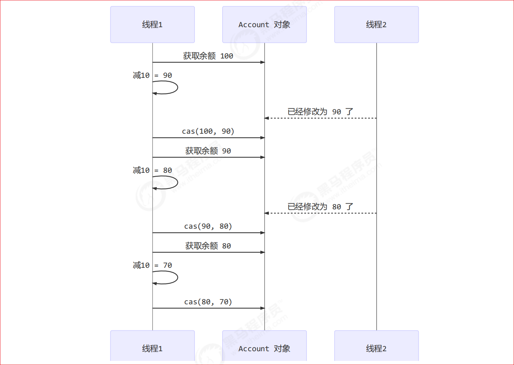
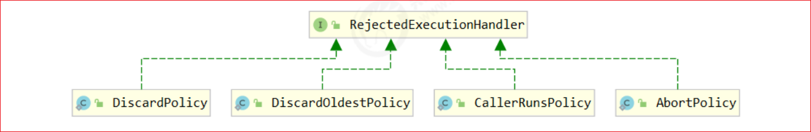
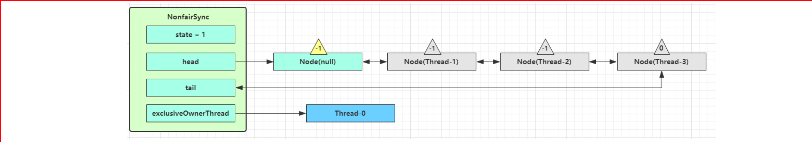
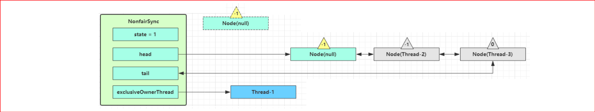
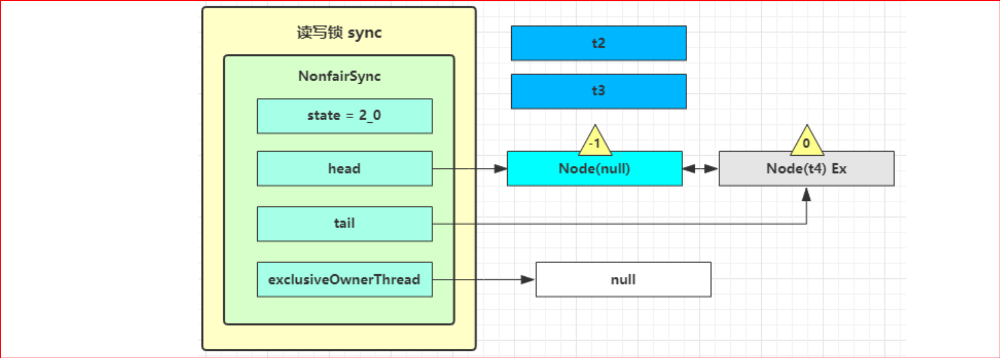
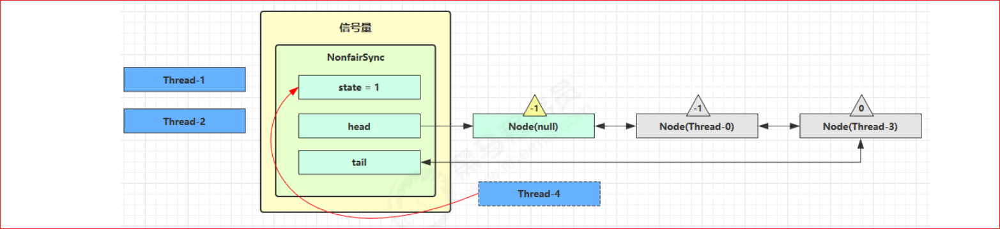

# 6. 共享模型之无锁

管程-悲观锁（阻塞）

无锁-乐观锁（非阻塞）

- CAS 与 volatile 
- 原子整数 
- 原子引用 
- 原子累加器 
- Unsafe

## 6.1 问题提出

有如下需求，保证 `account.withdraw `取款方法的线程安全

```java
import java.util.ArrayList;
import java.util.List;

interface Account {
    
    // 获取余额
    Integer getBalance();
    
    // 取款
    void withdraw(Integer amount);
    
    /**
    * 方法内会启动 1000 个线程，每个线程做 -10 元 的操作
    * 如果初始余额为 10000 那么正确的结果应当是 0
    */
    static void demo(Account account) {
        List<Thread> ts = new ArrayList<>();
        
        long start = System.nanoTime();
        for (int i = 0; i < 1000; i++) {
            ts.add(new Thread(() -> {
                account.withdraw(10);
            }));
        }
        ts.forEach(Thread::start);
        
        ts.forEach(t -> {
            try {
                t.join();
            } catch (InterruptedException e) {
                e.printStackTrace();
            }
        });
        long end = System.nanoTime();
        
        System.out.println(account.getBalance() + " cost: " + (end-start)/1000_000 + " ms");
    }
}
```

原有实现并不是线程安全的

```java
class AccountUnsafe implements Account {
    private Integer balance;
    
    public AccountUnsafe(Integer balance) {
        this.balance = balance;
    }
    
    @Override
    public Integer getBalance() {
        return balance;
    }
    
    @Override
    public void withdraw(Integer amount) {
        balance -= amount;
    }
}
```

执行测试代码

```java
public static void main(String[] args) {
    Account.demo(new AccountUnsafe(10000));
}
```

某次的执行结果  `330 cost: 306 ms `

### 6.1.1 为什么不安全 

withdraw 方法

```java
public void withdraw(Integer amount) {
    balance -= amount; 
}
```

对应的字节码

```cmd
ALOAD 0 																													// <- this
ALOAD 0
GETFIELD cn/itcast/AccountUnsafe.balance : Ljava/lang/Integer; 		// <- this.balance
INVOKEVIRTUAL java/lang/Integer.intValue ()I 											// 拆箱
ALOAD 1 																													// <- amount
INVOKEVIRTUAL java/lang/Integer.intValue ()I 											// 拆箱
ISUB 																															// 减法
INVOKESTATIC java/lang/Integer.valueOf (I)Ljava/lang/Integer; 		// 结果装箱
PUTFIELD cn/itcast/AccountUnsafe.balance : Ljava/lang/Integer; 		// -> this.balance
```

多线程执行流程

```cmd
ALOAD 0 																							// thread-0 <- this 
ALOAD 0 
GETFIELD cn/itcast/AccountUnsafe.balance 							// thread-0 <- this.balance 
INVOKEVIRTUAL java/lang/Integer.intValue 							// thread-0 拆箱
ALOAD 1 																							// thread-0 <- amount 
INVOKEVIRTUAL java/lang/Integer.intValue 							// thread-0 拆箱

ISUB 																									// thread-0 减法
INVOKESTATIC java/lang/Integer.valueOf 								// thread-0 结果装箱
PUTFIELD cn/itcast/AccountUnsafe.balance 							// thread-0 -> this.balance 
 
 
ALOAD 0 																							// thread-1 <- this 
ALOAD 0 
GETFIELD cn/itcast/AccountUnsafe.balance 							// thread-1 <- this.balance 
INVOKEVIRTUAL java/lang/Integer.intValue 							// thread-1 拆箱
ALOAD 1 																							// thread-1 <- amount 
INVOKEVIRTUAL java/lang/Integer.intValue 							// thread-1 拆箱
ISUB 																									// thread-1 减法
INVOKESTATIC java/lang/Integer.valueOf 								// thread-1 结果装箱
PUTFIELD cn/itcast/AccountUnsafe.balance 							// thread-1 -> this.balance
```

- 单核的指令交错 
- 多核的指令交错

### 6.1.2 解决思路-synchronized锁 

首先想到的是给 Account 对象加锁

```java
class AccountSafe implements Account {
    private Integer balance;
    
    public AccountSafe(Integer balance) {
        this.balance = balance;
    }
    
    @Override
    public synchronized Integer getBalance() {
        return balance;
    }
    
    @Override
    public synchronized void withdraw(Integer amount) {
        balance -= amount;
    }
    
}
```

结果为 

```cmd
0 cost: 399 ms
```

### 6.1.3 解决思路-无锁(AtomicInteger)

```java
class AccountSafeCas implements Account {
    
    private AtomicInteger balance; //原子整数
    
    public AccountSafeCas(Integer balance) {
        this.balance = new AtomicInteger(balance);
    }
    
    @Override
    public Integer getBalance() {
        return balance.get();
    }
    
    @Override
    public void withdraw(Integer amount) {
        while (true) {
            int prev = balance.get();
            int next = prev - amount;
            if (balance.compareAndSet(prev, next)) {
                break;
            }
        }
        // 可以简化为下面的方法
        // balance.addAndGet(-1 * amount);
    }
}
```

执行测试代码

```java
public static void main(String[] args) {
    Account.demo(new AccountSafeCas(10000));
}
```

某次的执行结果 ：安全且效率更高

```
0 cost: 302 ms
```

## 6.2 CAS 与 volatile

前面看到的 `AtomicInteger` 的解决方法，内部并没有用锁来保护共享变量的线程安全。那么它是如何实现的呢？

```java
public void withdraw(Integer amount) {
    while(true) {
        // 需要不断尝试，直到成功为止
        while (true) {
            // 比如拿到了旧值 1000
            int prev = balance.get();
            // 在这个基础上 1000-10 = 990
            int next = prev - amount;
            /*
            compareAndSet 正是做这个检查，在 set 前，先比较 prev 与当前值
            - 不一致了，next 作废，返回 false 表示失败
            比如，别的线程已经做了减法，当前值已经被减成了 990
            那么本线程的这次 990 就作废了，进入 while 下次循环重试
            - 一致，以 next 设置为新值，返回 true 表示成功
            */
            if (balance.compareAndSet(prev, next)) {
                break;
            }
        }
    }
}
```

其中的关键是 compareAndSet 比较并设置，它的简称就是 CAS （也有 Compare And Swap 的说法），它必须是原子操作。



> **注意** 
>
> 其实 CAS 的底层是 `lock cmpxchg` 指令（X86 架构），在单核 CPU 和多核 CPU 下都能够保证【比较-交换】的原子性。
>
> - 在多核状态下，某个核执行到带 lock 的指令时，CPU 会让总线锁住，当这个核把此指令执行完毕，再开启总线。这个过程中不会被线程的调度机制所打断，保证了多个线程对内存操作的准确性，是原子的。

## 6.4 volatile 

获取共享变量时，为了保证该变量的可见性，需要使用 volatile 修饰。 

它可以用来修饰成员变量和静态成员变量，他可以避免线程从自己的工作缓存中查找变量的值，必须到主存中获取它的值，线程操作 volatile 变量都是直接操作主存。即一个线程对 volatile 变量的修改，对另一个线程可见。 

> **注意** 
>
> volatile 仅仅保证了共享变量的可见性，让其它线程能够看到最新值，但不能解决指令交错问题（不能保证原子性） 
>

CAS 必须借助 volatile 才能读取到共享变量的最新值来实现【比较并交换】的效果

### 6.4.1 为什么无锁效率高 

synchronized 和 cas 没有绝对的谁效率高,要看所处的场景

- 无锁情况下，即使重试失败，线程始终在高速运行，没有停歇，而 synchronized 会让线程在没有获得锁的时候，发生上下文切换，进入阻塞。

- 打个比喻, 线程就好像高速跑道上的赛车，高速运行时，速度超快，一旦发生上下文切换，就好比赛车要减速、熄火,等被唤醒又得重新打火、启动、加速... 恢复到高速运行，代价比较大 

- 但无锁情况下，因为线程要保持运行，需要额外 CPU 的支持，CPU 在这里就好比高速跑道，没有额外的跑道，线程想高速运行也无从谈起，虽然不会进入阻塞，但由于没有分到时间片，仍然会进入可运行状态，还是会导致上下文切换。

- CAS最好是在多核CPU场景下，最好线程数少于CPU核心数才能发挥优势。


### 6.4.2 CAS 的特点

结合 CAS 和 volatile 可以实现无锁并发，适用于线程数少、多核 CPU 的场景下。

- CAS 是基于乐观锁的思想：最乐观的估计，不怕别的线程来修改共享变量，就算改了也没关系，我吃亏点再重试呗。

- synchronized 是基于悲观锁的思想：最悲观的估计，得防着其它线程来修改共享变量，我上了锁你们都别想改，我改完了解开锁，你们才有机会。

- CAS 体现的是无锁并发、无阻塞并发，请仔细体会这两句话的意思
  - 因为没有使用 synchronized，所以线程不会陷入阻塞，这是效率提升的因素之一
  
  - 但如果竞争激烈，可以想到重试必然频繁发生，反而效率会受影响
  

> 多线程中使用synchronized，某个线程去获取对象锁，即使cpu时间片还没有用完，但没有获取到锁，会发生上下文切换吗？
>
> 
>
> 在多线程编程中，使用 `synchronized` 关键字来实现线程间的同步。当一个线程尝试获取对象锁时，如果锁已经被其他线程持有，该线程会被阻塞，直到锁可用。这种情况下，线程的状态会变为“等待”（waiting），而不会继续执行。
>
> 如果一个线程在等待锁的过程中，CPU时间片并没有用完，那么线程会被挂起，并可能发生上下文切换。上下文切换是指操作系统暂停当前线程的执行，将其状态保存起来，然后恢复另一个线程的状态并执行它。这个过程是由操作系统的线程调度器控制的，通常发生在以下几种情况：
>
> 1. **线程被阻塞**：例如，当一个线程尝试获取锁，但锁被其他线程持有时，线程会被阻塞。这时候，操作系统会进行上下文切换，将CPU资源分配给其他线程。
> 2. **线程的优先级被更改**：如果线程的优先级发生变化，调度器可能会决定进行上下文切换，以使高优先级线程获得更多的CPU时间。
> 3. **时间片耗尽**：即使线程没有被阻塞，CPU时间片耗尽也会导致上下文切换。这时操作系统会将当前线程的状态保存，并调度其他线程执行。
>
> 综上所述，当一个线程在尝试获取锁时，如果该锁已被其他线程持有，该线程会被阻塞，导致上下文切换。这是操作系统为了保证多个线程能够公平地共享CPU资源而做出的调度决定。

## 6.3 原子整数

J.U.C 并发包提供了：

- AtomicBoolean

- AtomicInteger

- AtomicLong

以 AtomicInteger 为例

```java
AtomicInteger i = new AtomicInteger(0);
// 获取并自增（i = 0, 结果 i = 1, 返回 0），类似于 i++
System.out.println(i.getAndIncrement());
// 自增并获取（i = 1, 结果 i = 2, 返回 2），类似于 ++i
System.out.println(i.incrementAndGet());
// 自减并获取（i = 2, 结果 i = 1, 返回 1），类似于 --i
System.out.println(i.decrementAndGet());
// 获取并自减（i = 1, 结果 i = 0, 返回 1），类似于 i--
System.out.println(i.getAndDecrement());
// 获取并加值（i = 0, 结果 i = 5, 返回 0）
System.out.println(i.getAndAdd(5));
// 加值并获取（i = 5, 结果 i = 0, 返回 0）
System.out.println(i.addAndGet(-5));
// 获取并更新（i = 0, p 为 i 的当前值, 结果 i = -2, 返回 0）
// 其中函数中的操作能保证原子，但函数需要无副作用
System.out.println(i.getAndUpdate(p -> p - 2));
// 更新并获取（i = -2, p 为 i 的当前值, 结果 i = 0, 返回 0）
// 其中函数中的操作能保证原子，但函数需要无副作用
System.out.println(i.updateAndGet(p -> p + 2));
// 获取并计算（i = 0, p 为 i 的当前值, x 为参数1, 结果 i = 10, 返回 0）
// 其中函数中的操作能保证原子，但函数需要无副作用
// getAndUpdate 如果在 lambda 中引用了外部的局部变量，要保证该局部变量是 final 的
// getAndAccumulate 可以通过 参数1 来引用外部的局部变量，但因为其不在 lambda 中因此不必是 final
System.out.println(i.getAndAccumulate(10, (p, x) -> p + x));
// 计算并获取（i = 10, p 为 i 的当前值, x 为参数1, 结果 i = 0, 返回 0）
// 其中函数中的操作能保证原子，但函数需要无副作用
System.out.println(i.accumulateAndGet(-10, (p, x) -> p + x));
```

## 6.4 原子引用

为什么需要原子引用类型？`解决多个线程对一个对象引用进行修改时安全性`(注意是**引用**)

- AtomicReference

- AtomicMarkableReference

- AtomicStampedReference

有如下方法

```java
public interface AccountDecimal {

    // 获取余额
    BigDecimal getBalance();

    // 取款
    void withdraw(BigDecimal amount);

    /**
     * 方法内会启动 1000 个线程，每个线程做 -10 元 的操作
     * 如果初始余额为 10000 那么正确的结果应当是 0
     */
    static void demo(AccountDecimal account) {
        List<Thread> ts = new ArrayList<>();

        long start = System.nanoTime();
        for (int i = 0; i < 1000; i++) {
            ts.add(new Thread(() -> {
                account.withdraw(new BigDecimal("10"));
            }));
        }
        ts.forEach(Thread::start);

        ts.forEach(t -> {
            try {
                t.join();
            } catch (InterruptedException e) {
                e.printStackTrace();
            }
        });
        long end = System.nanoTime();

        System.out.println(account.getBalance() + " cost: " + (end - start) / 1000_000 + " ms");
    }
}
```

试着提供不同的 AccountDecimal 实现，实现安全的取款操作

**不安全实现**

```java
public class AccountDecimalUnsafe implements AccountDecimal {
    BigDecimal balance;
    public AccountDecimalUnsafe(BigDecimal balance) {
        this.balance = balance;
    }
    @Override
    public BigDecimal getBalance() {
        return balance;
    }
    @Override
    public void withdraw(BigDecimal amount) {
        BigDecimal balance = this.getBalance();
        this.balance = balance.subtract(amount);
    }
}
```

**安全实现-使用锁**

```java
public class AccountDecimalSafeLock implements AccountDecimal {
    private final Object lock = new Object();
    private BigDecimal balance;
    public AccountDecimalSafeLock(BigDecimal balance) {
        this.balance = balance;
    }
    @Override
    public BigDecimal getBalance() {
        return balance;
    }
    @Override
    public void withdraw(BigDecimal amount) {
        synchronized (lock) {
            BigDecimal balance = this.getBalance();
            this.balance = balance.subtract(amount);
        }
    }
}
```

**安全实现-使用 CAS**

```java
public class AccountDecimalSafeCas implements AccountDecimal {

    private AtomicReference<BigDecimal> balance;

    public AccountDecimalSafeCas(BigDecimal balance) {
        this.balance = new AtomicReference<>(balance);
    }

    @Override
    public BigDecimal getBalance() {
        return balance.get();
    }

    @Override
    public void withdraw(BigDecimal amount) {
        while (true) {
            BigDecimal prev = balance.get();
            BigDecimal next = prev.subtract(amount);
            if (balance.compareAndSet(prev, next)) {
                break;
            }
        }
    }
}
```

测试代码

```java
public static void main(String[] args) {
	AccountDecimal.demo(new AccountDecimalSafeCas(new BigDecimal("10000")));
	AccountDecimal.demo(new AccountDecimalUnsafe(new BigDecimal("10000")));
	AccountDecimal.demo(new AccountDecimalSafeLock(new BigDecimal("10000")));
}
```

运行结果

```cmd
0 cost: 103 ms
780 cost: 82 ms
0 cost: 65 ms
```

**ABA 问题及解决**

**ABA 问题**

```java
@Slf4j(topic = "c._4_1_ABA")
public class _4_1_ABA {
    static AtomicReference<String> ref = new AtomicReference<>("A");

    public static void main(String[] args) throws InterruptedException {
        log.debug("main start...");
        // 获取值 A
        // 这个共享变量被它线程修改过？
        String prev = ref.get();
        other();
        sleep(1);
        // 尝试改为 C
        log.debug("change A->C {}", ref.compareAndSet(prev, "C"));
    }

    private static void other() {
        new Thread(() -> {
            log.debug("change A->B {}", ref.compareAndSet(ref.get(), "B"));
        }, "t1").start();
        sleep(0.5);
        new Thread(() -> {
            log.debug("change B->A {}", ref.compareAndSet(ref.get(), "A"));
        }, "t2").start();
    }
}
```

输出

```cmd
08:46:17.565 c._4_1_ABA [main] - main start...
08:46:17.590 c._4_1_ABA [t1] - change A->B true
08:46:18.097 c._4_1_ABA [t2] - change B->A true
08:46:19.106 c._4_1_ABA [main] - change A->C true
```

主线程仅能判断出共享变量的值与最初值 A 是否相同，不能感知到这种从 A 改为 B 又 改回 A 的情况，如果主线程

希望：只要有其它线程【动过了】共享变量，那么自己的 cas 就算失败，这时，仅比较值是不够的，需要再加一个版本号

**AtomicStampedReference**

```java
@Slf4j(topic = "c._4_2_AtomicStampedReference")
public class _4_2_AtomicStampedReference {
    static AtomicStampedReference<String> ref = new AtomicStampedReference<>("A", 0);

    public static void main(String[] args) throws InterruptedException {
        log.debug("main start...");
        // 获取值 A
        String prev = ref.getReference();
        // 获取版本号
        int stamp = ref.getStamp();
        log.debug("版本 {}", stamp);
        // 如果中间有其它线程干扰，发生了 ABA 现象
        other();
        sleep(1);
        // 尝试改为 C
        log.debug("change A->C {}", ref.compareAndSet(prev, "C", stamp, stamp + 1));
    }

    private static void other() {
        new Thread(() -> {
            log.debug("change A->B {}", ref.compareAndSet(ref.getReference(), "B",
                    ref.getStamp(), ref.getStamp() + 1));
            log.debug("更新版本为 {}", ref.getStamp());
        }, "t1").start();
        sleep(0.5);
        new Thread(() -> {
            log.debug("change B->A {}", ref.compareAndSet(ref.getReference(), "A",
                    ref.getStamp(), ref.getStamp() + 1));
            log.debug("更新版本为 {}", ref.getStamp());
        }, "t2").start();
    }
}
```

输出为

```
08:49:10.570 c._4_2_AtomicStampedReference [main] - main start...
08:49:10.573 c._4_2_AtomicStampedReference [main] - 版本 0
08:49:10.600 c._4_2_AtomicStampedReference [t1] - change A->B true
08:49:10.600 c._4_2_AtomicStampedReference [t1] - 更新版本为 1
08:49:11.104 c._4_2_AtomicStampedReference [t2] - change B->A true
08:49:11.104 c._4_2_AtomicStampedReference [t2] - 更新版本为 2
08:49:49.007 c._4_2_AtomicStampedReference [main] - change A->C false
```

> `AtomicStampedReference` 会在满足以下条件时成功更新对象的引用和标记值：
>
> 1. **当前引用与预期引用匹配**：调用 `compareAndSet` 时传入的 `expectedReference` 参数必须与 `AtomicStampedReference` 当前的引用值相等。这意味着当前引用值没有在调用 `compareAndSet` 之前被其他线程修改过。
> 2. **当前标记与预期标记匹配**：调用 `compareAndSet` 时传入的 `expectedStamp` 参数必须与 `AtomicStampedReference` 当前的标记值相等。这确保了在操作期间，引用的状态没有经历意外的变化，即没有经历过“ABA”问题的变更。
>
> 只有在这两个条件同时满足时，`compareAndSet` 方法才会将引用更新为 `newReference`，并将标记值更新为 `newStamp`。否则，更新操作将失败，并返回 `false`。

AtomicStampedReference 可以给原子引用加上版本号，追踪原子引用整个的变化过程，如： A -> B -> A -> C ，通过AtomicStampedReference，我们可以知道，引用变量中途被更改了几次。

但是有时候，并不关心引用变量更改了几次，只是单纯的关心**是否更改过**，所以就有了

**AtomicMarkableReference**


**AtomicMarkableReference**

```java
public class GarbageBag {
    String desc;

    public GarbageBag(String desc) {
        this.desc = desc;
    }

    public void setDesc(String desc) {
        this.desc = desc;
    }

    @Override
    public String toString() {
        return super.toString() + " " + desc;
    }
}
```

```java
@Slf4j(topic = "c._4_3_ABA_AtomicMarkableReference")
public class _4_3_ABA_AtomicMarkableReference {
    public static void main(String[] args) throws InterruptedException {
        GarbageBag bag = new GarbageBag("装满了垃圾");
        // 参数2 mark 可以看作一个标记，表示垃圾袋满了
        AtomicMarkableReference<GarbageBag> ref = new AtomicMarkableReference<>(bag, true);
        log.debug("主线程 start...");
        GarbageBag prev = ref.getReference();
        log.debug(prev.toString());
        new Thread(() -> {
            log.debug("打扫卫生的线程 start...");
            bag.setDesc("空垃圾袋");
            while (!ref.compareAndSet(bag, bag, true, false)) {
            }
            log.debug(bag.toString());
        }).start();
        Thread.sleep(1000);
        log.debug("主线程想换一只新垃圾袋？");
        boolean success = ref.compareAndSet(prev, new GarbageBag("空垃圾袋"), true, false);
        log.debug("换了么？" + success);
        log.debug(ref.getReference().toString());
    }
}
```

输出

```cmd
10:47:21.171 c._4_3_ABA_AtomicMarkableReference [main] - 主线程 start...
10:47:21.173 c._4_3_ABA_AtomicMarkableReference [main] - com.apexsoft._14_no_lock.model.GarbageBag@29444d75 装满了垃圾
10:47:21.202 c._4_3_ABA_AtomicMarkableReference [Thread-0] - 打扫卫生的线程 start...
10:47:21.202 c._4_3_ABA_AtomicMarkableReference [Thread-0] - com.apexsoft._14_no_lock.model.GarbageBag@29444d75 空垃圾袋
10:47:22.214 c._4_3_ABA_AtomicMarkableReference [main] - 主线程想换一只新垃圾袋？
10:47:22.214 c._4_3_ABA_AtomicMarkableReference [main] - 换了么？false
10:47:22.214 c._4_3_ABA_AtomicMarkableReference [main] - com.apexsoft._14_no_lock.model.GarbageBag@29444d75 空垃圾袋
```

可以注释掉打扫卫生线程代码，再观察输出

> `AtomicMarkableReference` 会在以下条件同时满足时才会更新引用和标记：
>
> 1. **当前引用与预期引用匹配**：调用 `compareAndSet(expectedReference, newReference, expectedMark, newMark)` 方法时，`expectedReference` 必须与 `AtomicMarkableReference` 当前的引用值相等。这意味着对象引用没有在调用该方法之前被其他线程修改过。
> 2. **当前标记与预期标记匹配**：`expectedMark` 必须与 `AtomicMarkableReference` 当前的标记值相等。这确保了在操作期间，布尔标记没有被其他线程修改过。
>
> 只有在这两个条件都满足的情况下，`compareAndSet` 方法才会将引用更新为 `newReference`，并将标记更新为 `newMark`。否则，更新操作将失败，并返回 `false`。

## 6.5 原子数组

保护数组内元素多线程场景下线程安全

- AtomicIntegerArray
- AtomicLongArray
- AtomicReferenceArray

有如下方法

```java
public class _5_AtomicIntegerArray {
    public static void main(String[] args) {

    }

    /**
     * 参数1，提供数组、可以是线程不安全数组或线程安全数组
     * 参数2，获取数组长度的方法
     * 参数3，自增方法，回传 array, index
     * 参数4，打印数组的方法
     */
    // supplier 提供者 无中生有 ()->结果
    // function 函数 一个参数一个结果 (参数)->结果 , BiFunction (参数1,参数2)->结果
    // consumer 消费者 一个参数没结果 (参数)->void, BiConsumer (参数1,参数2)->
    private static <T> void demo(
            Supplier<T> arraySupplier,
            Function<T, Integer> lengthFun,
            BiConsumer<T, Integer> putConsumer,
            Consumer<T> printConsumer) {
        List<Thread> ts = new ArrayList<>();
        T array = arraySupplier.get();
        int length = lengthFun.apply(array);
        for (int i = 0; i < length; i++) {
            // 每个线程对数组作 10000 次操作
            ts.add(new Thread(() -> {
                for (int j = 0; j < 10000; j++) {
                    putConsumer.accept(array, j % length);
                }
            }));
        }
        ts.forEach(t -> t.start()); // 启动所有线程
        ts.forEach(t -> {
            try {
                t.join();
            } catch (InterruptedException e) {
                e.printStackTrace();
            }
        }); // 等所有线程结束
        printConsumer.accept(array);
    }

}

```

**不安全的数组**

```java
demo(
	() -> new int[10],
	array -> array.length,
	(array, index) -> array[index]++,
	array -> System.out.println(Arrays.toString(array))
);
```

结果

```
[9870, 9862, 9774, 9697, 9683, 9678, 9679, 9668, 9680, 9698]
```

**安全的数组**

```java
demo(
	() -> new AtomicIntegerArray(10),
	array -> array.length(),
	(array, index) -> array.getAndIncrement(index),
	array -> System.out.println(array)
);
```

结果

```cmd
[10000, 10000, 10000, 10000, 10000, 10000, 10000, 10000, 10000, 10000]
```

## 6.6 字段更新器

保护`对象的属性（成员变量）`多线程访问时的安全性

- AtomicReferenceFieldUpdater // 域 字段

- AtomicIntegerFieldUpdater

- AtomicLongFieldUpdater

利用字段更新器，可以针对对象的某个域（Field）进行原子操作，只能配合 `volatile` 修饰的字段使用，否则会出现异常

```java
Exception in thread "main" java.lang.IllegalArgumentException: Must be volatile type
```

```java
public class StudentV3 {
    //必须有volatile
    public volatile String name;

    public StudentV3() {
    }

    public StudentV3(String name) {
        this.name = name;
    }

    public String getName() {
        return name;
    }

    public void setName(String name) {
        this.name = name;
    }

    @Override
    public String toString() {
        return "StudentV3{" +
                "name='" + name + '\'' +
                '}';
    }
}
```

```java
public class _6_AtomicReferenceFieldUpdater {
    public static void main(String[] args) {
        //newUpdater(对象类型class, 属性类型class, 属性名称)
        AtomicReferenceFieldUpdater updater = AtomicReferenceFieldUpdater.newUpdater(StudentV3.class, String.class, "name");
        StudentV3 student = new StudentV3("张三");
        new Thread(() -> student.setName("李四")).start();
        Sleeper.sleep(1);
        //student的name必须为"张三"时才更新为"张小三"
        boolean success = updater.compareAndSet(student, "张三", "张小三");
        System.out.println(success);
        System.out.println(student);
    }
}
```

输出

```cmd
false
StudentV3{name='李四'}
```

## 6.7 原子累加器

AtomicLong 、AtomicInteger虽然也能做累计操作，但LongAdder等专门用于累加操作的工具性能更高

**累加器性能比较**

比较 AtomicLong 与 LongAdder

```java
public class _7_LongAdder {
    public static void main(String[] args) {
        //使用循环执行几次让jvm的优化后看最终效果
        for (int i = 0; i < 5; i++) {
            demo(AtomicLong::new, adder-> adder.getAndIncrement());
        }
        for (int i = 0; i < 5; i++) {
            demo(LongAdder::new, adder-> adder.increment());
        }
    }
    private static <T> void demo(Supplier<T> adderSupplier, Consumer<T> action) {
        T adder = adderSupplier.get();
        long start = System.nanoTime();
        List<Thread> ts = new ArrayList<>();
        // 4 个线程，每人累加 50 万
        for (int i = 0; i < 40; i++) {
            ts.add(new Thread(() -> {
                for (int j = 0; j < 500000; j++) {
                    action.accept(adder);
                }
            }));
        }
        ts.forEach(t -> t.start());
        ts.forEach(t -> {
            try {
                t.join();
            } catch (InterruptedException e) {
                e.printStackTrace();
            }
        });
        long end = System.nanoTime();
        System.out.println(adder + " cost:" + (end - start) / 1000_000);
    }
}
```

输出

```cmd
20000000 cost:198
20000000 cost:180
20000000 cost:183
20000000 cost:188
20000000 cost:196

20000000 cost:12
20000000 cost:7
20000000 cost:6
20000000 cost:6
20000000 cost:7
```

性能提升的原因很简单，就是在有竞争时，设置多个累加单元，Therad-0 累加 Cell[0]，而 Thread-1 累加Cell[1]... 最后将结果汇总。这样它们在累加时操作的不同的 Cell 变量，因此减少了 CAS 重试失败，从而提高性能。

***** **源码之** **LongAdder** 

LongAdder 是并发大师 @author Doug Lea （大哥李）的作品，设计的非常精巧

LongAdder 类有几个关键域

```java
// 累加单元数组, 懒惰初始化
transient volatile Cell[] cells;
// 基础值, 如果没有竞争, 则用 cas 累加这个域
transient volatile long base;
// 在 cells 创建或扩容时, 置为 1, 表示加锁
transient volatile int cellsBusy;
```

> `transient` 关键字用于修饰类中的变量，以指示该变量不会被序列化或反序列化

**cas** **锁**

```java
/**
 * 用cas实现锁，不要用于现实中
 */
@Slf4j(topic = "c._8_LockCAS")
public class _8_LockCAS {
    public static void main(String[] args) {
        LockCas lock = new LockCas();
        new Thread(() -> {
            log.debug("begin...");
            lock.lock();
            try {
                log.debug("lock...");
                sleep(1);
            } finally {
                lock.unlock();
            }
        }).start();
        new Thread(() -> {
            log.debug("begin...");
            lock.lock();
            try {
                log.debug("lock...");
            } finally {
                lock.unlock();
            }
        }).start();
    }
}

//CAS锁
@Slf4j(topic = "c.LockCAS")
class LockCas {
    private AtomicInteger state = new AtomicInteger(0);
    public void lock() {
        while (true) {
            if (state.compareAndSet(0, 1)) {
                break;
            }
        }
    }
    public void unlock() {
        log.debug("unlock...");
        state.set(0);
    }
}
```

输出

```java
14:16:39.278 c._8_LockCAS [Thread-0] - begin...
14:16:39.278 c._8_LockCAS [Thread-1] - begin...
14:16:39.280 c._8_LockCAS [Thread-1] - lock...
14:16:39.280 c.LockCAS [Thread-1] - unlock...
14:16:39.280 c._8_LockCAS [Thread-0] - lock...
14:16:40.290 c.LockCAS [Thread-0] - unlock...
```

***** **原理之伪共享**

其中 Cell 即为累加单元

```java
// @sun.misc.Contended：防止缓存行伪共享
@sun.misc.Contended
static final class Cell {
	volatile long value;
	Cell(long x) { value = x; }
 
	// 最重要的方法, 用来 cas 方式进行累加, prev 表示旧值, next 表示新值
	final boolean cas(long prev, long next) {
		return UNSAFE.compareAndSwapLong(this, valueOffset, prev, next);
	}
	// 省略不重要代码
}
```

得从缓存说起

缓存与内存的速度比较


| **从** **cpu** **到** | **大约需要的时钟周期**           |
| --------------------- | -------------------------------- |
| 寄存器                | 1 cycle (4GHz 的 CPU 约为0.25ns) |
| L1                    | 3~4 cycle                        |
| L2                    | 10~20 cycle                      |
| L3                    | 40~45 cycle                      |
| 内存                  | 120~240 cycle                    |

因为 CPU 与 内存的速度差异很大，需要靠预读数据至缓存来提升效率。

而缓存以缓存行为单位，每个`缓存行`对应着一块内存，一般是 64 byte（8 个 long）

缓存的加入会造成数据副本的产生，即同一份数据会缓存在不同核心的缓存行中

CPU 要保证数据的一致性，如果某个 CPU 核心更改了数据，其它 CPU 核心对应的整个缓存行必须失效


因为 Cell 是数组形式，在内存中是连续存储的，一个 Cell 为 24 字节（16 字节的对象头和 8 字节的 value），因

此缓存行可以存下 2 个的 Cell 对象。这样问题来了：

- Core-0 要修改 Cell[0]

- Core-1 要修改 Cell[1]

无论谁修改成功，都会导致对方 Core 的缓存行失效，比如 Core-0 中 Cell[0]=6000, Cell[1]=8000 要累加Cell[0]=6001, Cell[1]=8000 ，这时会让 Core-1 的缓存行失效，缓存失效后只能从内存中读取数据，效率降低

`@sun.misc.Contended` 用来解决这个问题，它的原理是在使用此注解的对象或字段的前后各增加 128 字节大小的padding，从而让 CPU 将对象预读至缓存时占用不同的缓存行，这样，不会造成对方缓存行的失效


累加主要调用下面的方法

```java
public void add(long x) {
    // as 为累加单元数组
    // b 为基础值
    // x 为累加值
    Cell[] as; long b, v; int m; Cell a;
    // 进入 if 的两个条件
    // 1. as 有值, 表示已经发生过竞争, 进入 if
    // 2. cas 给 base 累加时失败了, 表示 base 发生了竞争, 进入 if
    if ((as = cells) != null || !casBase(b = base, b + x)) {
        // uncontended 表示 cell 没有竞争
        boolean uncontended = true;
        if (// as 还没有创建
                as == null || (m = as.length - 1) < 0 ||
                        // 当前线程对应的 cell 还没有
                        (a = as[getProbe() & m]) == null ||
                        // cas 给当前线程的 cell 累加失败 uncontended=false ( a 为当前线程的 cell )
                        !(uncontended = a.cas(v = a.value, v + x))
        ) {
            // 进入 cell 数组创建、cell 创建的流程
            longAccumulate(x, null, uncontended);
        }
    }
}
```

add 流程图


```java
final void longAccumulate(long x, LongBinaryOperator fn,
                          boolean wasUncontended) {
    int h;
    // 当前线程还没有对应的 cell, 需要随机生成一个 h 值用来将当前线程绑定到 cell
    if ((h = getProbe()) == 0) {
        // 初始化 probe
        ThreadLocalRandom.current();
        // h 对应新的 probe 值, 用来对应 cell
        h = getProbe();
        wasUncontended = true;
    }
    // collide 为 true 表示需要扩容
    boolean collide = false;
    for (;;) {
        Cell[] as; Cell a; int n; long v;
        // 已经有了 cells
        if ((as = cells) != null && (n = as.length) > 0) {
            // 还没有 cell
            if ((a = as[(n - 1) & h]) == null) {
                // 为 cellsBusy 加锁, 创建 cell, cell 的初始累加值为 x
                // 成功则 break, 否则继续 continue 循环
            }
            // 有竞争, 改变线程对应的 cell 来重试 cas
            else if (!wasUncontended)
                wasUncontended = true;
            // cas 尝试累加, fn 配合 LongAccumulator 不为 null, 配合 LongAdder 为 null
            else if (a.cas(v = a.value, ((fn == null) ? v + x : fn.applyAsLong(v, x))))
                break;
            // 如果 cells 长度已经超过了最大长度, 或者已经扩容, 改变线程对应的 cell 来重试 cas
            else if (n >= NCPU || cells != as)
                collide = false;
            // 确保 collide 为 false 进入此分支, 就不会进入下面的 else if 进行扩容了
            else if (!collide)
                collide = true;
            // 加锁
            else if (cellsBusy == 0 && casCellsBusy()) {
                // 加锁成功, 扩容
                continue;
            }
            // 改变线程对应的 cell
            h = advanceProbe(h);
        }
        // 还没有 cells, 尝试给 cellsBusy 加锁
        else if (cellsBusy == 0 && cells == as && casCellsBusy()) {
            // 加锁成功, 初始化 cells, 最开始长度为 2, 并填充一个 cell
            // 成功则 break;
        }
        // 上两种情况失败, 尝试给 base 累加
        else if (casBase(v = base, ((fn == null) ? v + x : fn.applyAsLong(v, x))))
            break;
    }
}
```

longAccumulate 流程图


每个线程刚进入 longAccumulate 时，会尝试对应一个 cell 对象（找到一个坑位）


获取最终结果通过 sum 方法

```java
public long sum() {
    Cell[] as = cells; Cell a;
    long sum = base;
    if (as != null) {
        for (int i = 0; i < as.length; ++i) {
            if ((a = as[i]) != null)
                sum += a.value;
        }
    }
    return sum;
}
```

## 6.8 Unsafe

### 6.8.1 概述

Unsafe 对象提供了`非常底层的，操作内存、线程的方法`，之前学习的原子整数、原子引用等，底层都用到了Unsafe ，Unsafe 对象不能直接调用，只能通过反射获得

### 6.8.12 Unsafe CAS 操作

```JAVA
public class _9_1_UnSafe {
    public static void main(String[] args) throws NoSuchFieldException, IllegalAccessException {
        Field theUnsafe = Unsafe.class.getDeclaredField("theUnsafe");
        theUnsafe.setAccessible(true);
        Unsafe unsafe = (Unsafe) theUnsafe.get(null);
        System.out.println(unsafe);

        // 获得成员变量的偏移量
        long idOffset = unsafe.objectFieldOffset(StudentV4.class.getDeclaredField("id"));
        long nameOffset = unsafe.objectFieldOffset(StudentV4.class.getDeclaredField("name"));
        StudentV4 studentV4 = new StudentV4();
        // 使用 cas 方法替换成员变量的值(线程安全的操作)
        unsafe.compareAndSwapInt(studentV4, idOffset, 0, 20); // 返回 true
        unsafe.compareAndSwapObject(studentV4, nameOffset, null, "张三"); // 返回 true
        System.out.println(studentV4);
    }
}

@Data
class StudentV4 {
    private int id;
    private String name;
}
```

输出

```CMD
sun.misc.Unsafe@2503dbd3
StudentV4(id=20, name=张三)
```

使用自定义的 _10_MyAtomicInteger实现之前线程安全的原子整数 Account 实现

```JAVA
public class _10_MyAtomicInteger implements Account {
    private volatile int data;
    private static final Unsafe UNSAFE;
    private static final long DATA_OFFSET;

    static {
        UNSAFE = UnsafeAccessor.getUnsafe();
        try {
            // data 属性在 DataContainer 对象中的偏移量，用于 Unsafe 直接访问该属性
            DATA_OFFSET = UNSAFE.objectFieldOffset(_10_MyAtomicInteger.class.getDeclaredField("data"));
        } catch (NoSuchFieldException e) {
            throw new Error(e);
        }
    }

    public _10_MyAtomicInteger(int data) {
        this.data = data;
    }

    public void decrease(int amount) {
        int oldValue;
        while (true) {
            // 获取共享变量旧值，可以在这一行加入断点，修改 data 调试来加深理解
            oldValue = data;
            // cas 尝试修改 data 为 旧值 + amount，如果期间旧值被别的线程改了，返回 false
            if (UNSAFE.compareAndSwapInt(this, DATA_OFFSET, oldValue, oldValue - amount)) {
                return;
            }
        }
    }

    public int getData() {
        return data;
    }

    @Override
    public Integer getBalance() {
        return getData();
    }

    @Override
    public void withdraw(Integer amount) {
        decrease(amount);
    }
}
```

```java
public class _11_MyAtomicInteger_test {
    public static void main(String[] args) {
        Account.demo(new _10_MyAtomicInteger(10000));
    }
}
```

```cmd
0 cost: 98 ms
```

## 6.9本章小结

- CAS 与 volatile

- API
  - 原子整数
  - 原子引用
  - 原子数组
  - 字段更新器
  - 原子累加器

- Unsafe

- 原理方面
  * LongAdder 源码
  * 伪共享

# 7. 共享模型之不可变

**本章内容**

- 不可变类的使用

- 不可变类设计

- 无状态类设计

## 7.1 日期转换的问题

**问题提出**

下面的代码在运行时，由于 SimpleDateFormat 不是线程安全的

```java
@Slf4j(topic = "c.test")
public class _1_SimpleDateFormat_unsafe {
    public static void main(String[] args) {
        SimpleDateFormat sdf = new SimpleDateFormat("yyyy-MM-dd");
        for (int i = 0; i < 10; i++) {
            new Thread(() -> {
                try {
                    log.debug("{}", sdf.parse("1951-04-21"));
                } catch (Exception e) {
                    log.error("{}", e);
                }
            }).start();
        }
    }
}
```

有很大几率出现 java.lang.NumberFormatException 或者出现不正确的日期解析结果，例如：

```cmd
15:24:38.869 c.test [Thread-2] - {}
java.lang.NumberFormatException: For input string: ""
	at java.lang.NumberFormatException.forInputString(NumberFormatException.java:65)
	at java.lang.Long.parseLong(Long.java:601)
	at java.lang.Long.parseLong(Long.java:631)
	at java.text.DigitList.getLong(DigitList.java:195)
	at java.text.DecimalFormat.parse(DecimalFormat.java:2082)
	at java.text.SimpleDateFormat.subParse(SimpleDateFormat.java:1869)
	at java.text.SimpleDateFormat.parse(SimpleDateFormat.java:1514)
	at java.text.DateFormat.parse(DateFormat.java:364)
	at com.apexsoft._15_immutable._1_SimpleDateFormat_unsafe.lambda$main$0(_1_SimpleDateFormat_unsafe.java:13)
	at java.lang.Thread.run(Thread.java:748)
15:24:38.868 c.test [Thread-4] - Sat Apr 21 00:00:00 CST 1951
15:24:38.868 c.test [Thread-3] - Sun Sep 21 00:00:00 CST 1952
15:24:38.868 c.test [Thread-5] - Sat Apr 21 00:00:00 CST 1951
15:24:38.868 c.test [Thread-6] - Sat Apr 21 00:00:00 CST 1951
15:24:38.868 c.test [Thread-0] - Sun Sep 21 00:00:00 CST 1952
15:24:38.868 c.test [Thread-8] - Sat Apr 21 00:00:00 CST 1951
15:24:38.868 c.test [Thread-7] - Sat Apr 21 00:00:00 CST 1951
15:24:38.868 c.test [Thread-9] - Sat Apr 21 00:00:00 CST 1951
15:24:38.868 c.test [Thread-1] - Sun Sep 21 00:00:00 CST 1952
```

**思路** **-** **同步锁**

这样虽能解决问题，但带来的是性能上的损失，并不算很好：

```java
SimpleDateFormat sdf = new SimpleDateFormat("yyyy-MM-dd");
for (int i = 0; i < 10; i++) {
    new Thread(() -> {
        synchronized (sdf){
            try {
                log.debug("{}", sdf.parse("1951-04-21"));
            } catch (Exception e) {
                log.error("{}", e);
            }
        }
    }).start();
}
```

**思路** **-** **不可变**

如果一个对象在不能够修改其内部状态（属性），那么它就是线程安全的，因为不存在并发修改啊！这样的对象在

Java 中有很多，例如在 Java 8 后，提供了一个新的日期格式化类：DateTimeFormatter

```java
DateTimeFormatter dtf = DateTimeFormatter.ofPattern("yyyy-MM-dd");
for (int i = 0; i < 10; i++) {
    new Thread(() -> {
        LocalDate date = dtf.parse("2018-10-01", LocalDate::from);
        log.debug("{}", date);
    }).start();
}
```

可以看 DateTimeFormatter 的文档

```java
@implSpec
This class is immutable and thread-safe.
```

不可变对象，实际是另一种避免竞争的方式。

## 7.2 不可变设计

 String 类也是不可变的，以它为例，说明一下不可变设计的要素

```java
public final class String implements java.io.Serializable, Comparable<String>, CharSequence {
    /**
     * The value is used for character storage.
     */
    private final char value[];
    /**
     * Cache the hash code for the string
     */
    private int hash; // Default to 0

    // ...

}
```

**final** **的使用**

发现该类、类中所有属性都是 final 的

- 属性用 final 修饰保证了该属性是只读的，不能修改

- 类用 final 修饰保证了该类中的方法不能被覆盖，防止子类无意间破坏不可变性

**保护性拷贝**

final修饰数组，只能保证数组的引用不会改变，不能保证数组元素的值不会被改变，如何实现数组内容不会改变？通过`保护性拷贝`

 保护性拷贝例子：substring()

```java
public String substring(int beginIndex) {
    if (beginIndex < 0) {
        throw new StringIndexOutOfBoundsException(beginIndex);
    }
    int subLen = value.length - beginIndex;
    if (subLen < 0) {
        throw new StringIndexOutOfBoundsException(subLen);
    }
    return (beginIndex == 0) ? this : new String(value, beginIndex, subLen);
}
```

发现其内部是调用 String 的构造方法创建了一个新字符串，再进入这个构造看看，是否对 final char[] value 做出了修改：

```java
public String(char value[], int offset, int count) {
    if (offset < 0) {
        throw new StringIndexOutOfBoundsException(offset);
    }
    if (count <= 0) {
        if (count < 0) {
            throw new StringIndexOutOfBoundsException(count);
        }
        if (offset <= value.length) {
            this.value = "".value;
            return;
        }
    }
    if (offset > value.length - count) {
        throw new StringIndexOutOfBoundsException(offset + count);
    }
    //复制产生新的数组赋值给value,并没有直接该原数组的值
    this.value = Arrays.copyOfRange(value, offset, offset + count);
}
```

结果发现也没有，构造新字符串对象时，会生成新的 char[] value，对内容进行复制 。这种通过创建副本对象来避免共享的手段称之为【保护性拷贝（defensive copy）】

## 7.2 模式之享元***

### 7.2.1. 定义

享元模式（Flyweight Pattern）是一种软件设计模式，旨在通过共享技术来有效地支持大量细粒度的对象。享元模式的核心思想是在多个对象之间共享尽可能多的数据，从而减少内存占用和提高性能。

### 7.2.2. 体现

**包装类**

在JDK中 Boolean，Byte，Short，Integer，Long，Character 等包装类提供了 valueOf 方法，例如 Long 的valueOf 会缓存 -128~127 之间的 Long 对象，在这个范围之间会重用对象，大于这个范围，才会新建 Long 对象

```java
public static Long valueOf(long l) {
    final int offset = 128;
    if (l >= -128 && l <= 127) { // will cache
        return LongCache.cache[(int)l + offset];
    }
    return new Long(l);
}
```

> **注意：**
>
> - Byte, Short, Long 缓存的范围都是 -128~127
>
> - Character 缓存的范围是 0~127
>
> - Integer的默认范围是 -128~127
>   - 最小值不能变
>   - 但最大值可以通过调整虚拟机参数 `-Djava.lang.Integer.IntegerCache.high` 来改变
>
> - Boolean 缓存了 TRUE 和 FALSE

**String 串池**

**BigDecimal BigInteger**

**`String、BigDecimal等不可变类的单个方法是线程安全的，但多个方法的组合不是线程安全的`**

> 这句话的意思是在Java中，像`String`和`BigDecimal`这样的不可变（immutable）类，它们的单个方法操作是线程安全的，因为这些类的对象在创建之后不能被改变。因此，当你调用这些类的一个方法时，由于对象的状态不会改变，所以是线程安全的。例如，你可以从多个线程中安全地访问一个`String`对象或执行一个`BigDecimal`的某个方法，而不必担心数据竞争或同步问题。
>
> 然而，当涉及到需要对这些不可变对象进行一系列的操作时，整个操作序列就不一定是线程安全的了。这是因为虽然每个单独的方法调用可能是安全的，但如果你需要基于前一次方法的结果继续执行下一个方法，那么在多线程环境中，其他线程可能会干扰这个过程。例如，如果你有一个`BigDecimal`对象，并且需要连续进行两次或更多的算术运算，如果这些操作没有适当地同步，那么整体的操作就可能不是线程安全的。
>
> 为了确保一系列操作是线程安全的，在使用不可变对象时，通常需要在整个序列的操作上加锁，或者使用其他同步机制来保证操作顺序的一致性和原子性。这样可以防止在多线程环境下出现竞态条件（race condition）。

> 例如：
>
> 当我们在多线程环境中处理`BigDecimal`对象并使用其多个方法时，如果不采取适当的同步措施，可能会遇到线程安全问题。下面是一个简化的例子来说明这个问题：
>
> 假设我们有两个`BigDecimal`对象，`a` 和 `b`，并且我们需要在两个线程中同时更新一个`BigDecimal`变量`result`，该变量最初为`a`的值。
>
> ```java
> BigDecimal a = new BigDecimal("100.0");
> BigDecimal b = new BigDecimal("50.0");
> BigDecimal result = a; // 初始值为 100.0
> ```
>
> 现在，我们有以下两个线程要执行的操作：
>
> **线程1:**
>
> ```java
> result = result.add(b);
> ```
>
> **线程2:**
>
> ```java
> result = result.subtract(b);
> ```
>
> 如果没有适当的同步，这两个线程可能会在不同的时间点读取和修改`result`，导致以下几种情况之一：
>
> 1. 如果线程1先执行完它的操作，然后线程2再执行它的操作，结果将是正确的，即`result`将等于`a`加上`b`然后再减去`b`，最终`result`还是`a`的值。
> 2. 如果两个线程几乎同时开始执行，都读取了`result`的初始值`a`，但是线程1首先完成了它的`add`操作，而线程2随后执行它的`subtract`操作，这将导致线程2实际上是从`result`的旧值`a`中减去`b`，而不是从最新的`result`（即`a + b`）中减去`b`。这种情况下，最终的`result`值将不正确。
>
> 为了避免这种情况，我们可以使用同步机制来确保在同一时刻只有一个线程能够执行这些操作。例如，可以使用`synchronized`关键字来保护对`result`的访问：
>
> ```java
> public class Example {
>     private BigDecimal result;
> 
>     public Example() {
>         this.result = new BigDecimal("100.0");
>     }
> 
>     public synchronized void add(BigDecimal value) {
>         this.result = this.result.add(value);
>     }
> 
>     public synchronized void subtract(BigDecimal value) {
>         this.result = this.result.subtract(value);
>     }
> }
> ```
>
> 在这个例子中，`synchronized`关键字确保了任何对`add`或`subtract`方法的调用都是排他的，这意味着在多线程环境下，这些操作将会按照顺序执行，从而保证了线程安全。

### 7.2.3. DIY

例如：一个线上商城应用，QPS 达到数千，如果每次都重新创建和关闭数据库连接，性能会受到极大影响。 这时预先创建好一批连接，放入连接池。一次请求到达后，从连接池获取连接，使用完毕后再还回连接池，这样既节约了连接的创建和关闭时间，也实现了连接的重用，不至于让庞大的连接数压垮数据库

```java
@Slf4j(topic = "c.test")
public class _3_Pool {
    // 1. 连接池大小
    private final int poolSize;
    // 2. 连接对象数组
    private Connection[] connections;
    // 3. 连接状态数组 0 表示空闲， 1 表示繁忙
    private AtomicIntegerArray states;

    // 4. 构造方法初始化
    public _3_Pool(int poolSize) {
        this.poolSize = poolSize;
        this.connections = new Connection[poolSize];
        this.states = new AtomicIntegerArray(new int[poolSize]);
        for (int i = 0; i < poolSize; i++) {
            connections[i] = new MockConnection("连接" + (i + 1));
        }
    }

    // 5. 借连接
    public Connection borrow() {
        while (true) {
            for (int i = 0; i < poolSize; i++) {
                // 获取空闲连接
                if (states.get(i) == 0) {
                    if (states.compareAndSet(i, 0, 1)) {
                        log.debug("borrow 连接{}",i);
                        return connections[i];
                    }
                }
            }
            // 如果没有空闲连接，当前线程进入等待
            synchronized (this) {
                try {
                    log.debug("wait...");
                    this.wait();
                } catch (InterruptedException e) {
                    e.printStackTrace();
                }
            }
        }
    }

    // 6. 归还连接
    public void free(Connection conn) {
        for (int i = 0; i < poolSize; i++) {
            if (connections[i] == conn) {
                //归还时只有当前线程才持有，没有竞争，所以不用cas，
                states.set(i, 0);
                synchronized (this) {
                    log.debug("free 连接{}", i);
                    this.notifyAll();
                }
                break;
            }
        }
    }
}
class MockConnection implements Connection {
    // 实现略
}
```

使用连接池：

```java
public class _3_Pool_test {
    public static void main(String[] args) {
        _3_Pool pool = new _3_Pool(2);
        for(int i=0;i< 5;i++){
            new Thread(()->{
                Connection conn=pool.borrow();
                try{
                    //模拟使用连接
                    Thread.sleep(new Random().nextInt(1000));
                }catch(InterruptedException e){
                    e.printStackTrace();
                }
                pool.free(conn);
            }).start();
        }
    }
}
```

```cmd
17:10:32.342 c.test [Thread-2] - wait...
17:10:32.342 c.test [Thread-1] - borrow 连接1
17:10:32.342 c.test [Thread-0] - borrow 连接0
17:10:32.344 c.test [Thread-4] - wait...
17:10:32.344 c.test [Thread-3] - wait...
17:10:33.217 c.test [Thread-0] - free 连接0
17:10:33.217 c.test [Thread-3] - borrow 连接0
17:10:33.217 c.test [Thread-4] - wait...
17:10:33.217 c.test [Thread-2] - wait...
17:10:33.236 c.test [Thread-3] - free 连接0
17:10:33.236 c.test [Thread-4] - wait...
17:10:33.236 c.test [Thread-2] - borrow 连接0
17:10:33.261 c.test [Thread-1] - free 连接1
17:10:33.261 c.test [Thread-4] - borrow 连接1
17:10:33.862 c.test [Thread-2] - free 连接0
17:10:34.049 c.test [Thread-4] - free 连接1
```

以上实现没有考虑：

- 连接的动态增长与收缩
- 连接保活（可用性检测）
- 等待超时处理
- 分布式 hash

对于关系型数据库，有比较成熟的连接池实现，例如c3p0, druid等 对于更通用的对象池，可以考虑使用apache commons pool，例如redis连接池可以参考jedis中关于连接池的实现

## 7.3 原理之 final***

**1. 设置 final 变量的原理**

理解了 volatile 原理，再对比 final 的实现就比较简单了

```java
public class TestFinal {
	final int a = 20;
}
```

字节码

```cmd
0: aload_0
1: invokespecial 	#1 // Method java/lang/Object."<init>":()V
4: aload_0
5: bipush 20
7: putfield 		#2 // Field a:I
 <-- 写屏障
10: return
```

发现 final 变量的赋值也会通过 putfield 指令来完成，同样在这条指令之后也会加入写屏障，保证在其它线程读到它的值时不会出现为 0 的情况

**2. 获取 final 变量的原理**

## 7.3 无状态

在 web 阶段学习时，设计 Servlet 时为了保证其线程安全，都会有这样的建议，不要为 Servlet 设置成员变量，这种没有任何成员变量的类是线程安全的

> 因为成员变量保存的数据也可以称为状态信息，因此没有成员变量就称之为【无状态】

## 7.4 本章小结

- 不可变类使用

- 不可变类设计

- 原理方面
  - final

- 模式方面
  - 享元

# 8. 共享模型之工具

## 8.1 线程池

### 8.1.1 自定义线程池


#### 步骤1：自定义拒绝策略接口 RejectPolicy

```java
/**
 * 任务拒绝策略
 *
 * @param <T>
 */
@FunctionalInterface
interface MyRejectPolicy<T> {
    void reject(MyBlockingQueue<T> queue, T task);
}

```

#### 步骤2：自定义任务队列 BlockingQueue

```java
/**
 * 任务队列
 *
 * @param <T>
 */
@Slf4j(topic = "c.MyBlockingQueue")
public class MyBlockingQueue<T> {

    // 1. 任务队列
    private Deque<T> queue = new ArrayDeque<>();
    // 2. 锁
    private ReentrantLock lock = new ReentrantLock();
    // 3. 生产者条件变量
    private Condition fullWaitSet = lock.newCondition();
    // 4. 消费者条件变量
    private Condition emptyWaitSet = lock.newCondition();
    // 5. 容量
    private int capcity;

    /**
     * 构造方法
     *
     * @param capcity 线程池容量
     */
    public MyBlockingQueue(int capcity) {
        log.info("构造BlockingQueue");
        this.capcity = capcity;
    }


    /**
     * 获取队列头部一个元素, 阻塞至 获取到元素 或 超时时长
     *
     * @param timeout
     * @param unit
     * @return
     */
    public T poll(long timeout, TimeUnit unit) {
        lock.lock();
        try {
            // 将 timeout 统一转换为 纳秒
            long nanos = unit.toNanos(timeout);

            //如果队列为空,当前线程在 emptyWaitSet 上等待
            while (queue.isEmpty()) {
                try {
                    // 返回值是剩余时间
                    if (nanos <= 0) {
                        //等待超时后队列仍为空,返回null
                        return null;
                    }
                    nanos = emptyWaitSet.awaitNanos(nanos);
                } catch (InterruptedException e) {
                    e.printStackTrace();
                }
            }

            //获取队列头部元素并将其从队列中移除
            T t = queue.removeFirst();
            //唤醒 等待在fullWaitSet上的任 意一个线程
            fullWaitSet.signal();

            return t;
        } finally {
            lock.unlock();
        }
    }


    /**
     * 获取队列头部一个元素, 阻塞至获取到任务为止
     *
     * @return
     */
    public T take() {
        lock.lock();
        try {

            while (queue.isEmpty()) {
                try {
                    emptyWaitSet.await();
                } catch (InterruptedException e) {
                    e.printStackTrace();
                }
            }

            T t = queue.removeFirst();
            fullWaitSet.signal();
            return t;
        } finally {
            lock.unlock();
        }
    }

    /**
     * 向队列尾部添加一个元素, 阻塞至 加入到队列 或 超时时长
     *
     * @param task
     * @param timeout
     * @param timeUnit
     * @return
     */
    public boolean offer(T task, long timeout, TimeUnit timeUnit) {
        lock.lock();
        try {
            long nanos = timeUnit.toNanos(timeout);
            while (queue.size() == capcity) {
                try {
                    if (nanos <= 0) {
                        log.debug("等待加入任务队列超时， {} ...", task);
                        return false;
                    }
                    log.debug("等待加入任务队列 {} ...", task);
                    nanos = fullWaitSet.awaitNanos(nanos);
                } catch (InterruptedException e) {
                    e.printStackTrace();
                }
            }

            log.debug("加入任务队列 {}", task);
            queue.addLast(task);
            //添加任务成功后,唤起 等待在emptyWaitSet上的 一个线程
            emptyWaitSet.signal();

            return true;
        } finally {
            lock.unlock();
        }
    }


    /**
     * 向队列尾部添加一个元素, 阻塞至 加入到队列为止
     *
     * @param task
     */
    public void put(T task) {
        lock.lock();
        try {
            while (queue.size() == capcity) {
                try {
                    log.debug("等待加入任务队列 {} ...", task);
                    fullWaitSet.await();
                } catch (InterruptedException e) {
                    e.printStackTrace();
                }
            }

            log.debug("加入任务队列 {}", task);
            queue.addLast(task);
            emptyWaitSet.signal();
        } finally {
            lock.unlock();
        }
    }


    /**
     * 返回队列当前size
     *
     * @return 返回队列当前size
     */
    public int size() {
        lock.lock();
        try {
            return queue.size();
        } finally {
            lock.unlock();
        }
    }

    /**
     * 尝试将任务task放入队列, 如果队列已满,则执行拒绝策略rejectPolicy
     *
     * @param rejectPolicy
     * @param task
     */
    public void tryPut(MyRejectPolicy<T> rejectPolicy, T task) {
        lock.lock();
        try {
            // 判断队列是否满
            if (queue.size() == capcity) {
                log.info("队列已满,按照拒绝策略处理任务 {}", task);
                rejectPolicy.reject(this, task);
            } else {  // 有空闲
                log.debug("队列未满,任务 {} 加入到队列中 ", task);
                queue.addLast(task);
                emptyWaitSet.signal();
            }
        } finally {
            lock.unlock();
        }
    }

}
```

#### 步骤3：自定义线程池 ThreadPool

```java
@Slf4j(topic = "c.MyThreadPool")
public class MyThreadPool {

    // 任务队列
    private MyBlockingQueue<Runnable> taskQueue;
    //队列已满时的拒绝策略
    private MyRejectPolicy<Runnable> rejectPolicy;
    // 线程集合
    private HashSet<Worker> workers = new HashSet<>();
    // 核心线程数
    private int coreSize;
    // 获取任务的超时时间
    private long timeout;
    private TimeUnit timeUnit;


    // 执行任务
    public void execute(Runnable task) {
        log.info("接收到任务需要执行: " + task);

        // 当任务数没有超过 coreSize 时，直接交给 worker 对象执行
        // 如果任务数超过 coreSize 时，加入任务队列暂存
        synchronized (workers) {
            if (workers.size() < coreSize) {
                Worker worker = new Worker(task, "worker--" + workers.size());
                workers.add(worker);
                log.info("coreSize未满,新增 worker  {} 来执行任务 {}", worker, task);
                worker.start();

            } else {
                log.info("coreSize已经满了!!!!!,需要先尝试将任务{} 放到等待队列中 ", task);
                // 1)死等
                // 2)带超时等待
                // 3)让调用者放弃任务执行
                // 4)让调用者抛出异常
                // 5)让调用者自己执行任务
                taskQueue.tryPut(rejectPolicy, task);

            }
        }
    }

    /**
     * 构造函数
     *
     * @param coreSize     线程池最大核心线程数
     * @param timeout      和timeUnit一起指定超时时长
     * @param timeUnit     和timeout一起指定超时时长
     * @param queueCapcity 任务队列容量
     * @param rejectPolicy 任务队列满时针对添加操作的拒绝策略
     */
    public MyThreadPool(int coreSize, long timeout, TimeUnit timeUnit, int queueCapcity, MyRejectPolicy<Runnable> rejectPolicy) {
        log.info("构造ThreadPool");
        this.coreSize = coreSize;
        this.timeout = timeout;
        this.timeUnit = timeUnit;
        this.taskQueue = new MyBlockingQueue<>(queueCapcity);
        this.rejectPolicy = rejectPolicy;
    }

    /**
     * 线程池中的工作线程
     */
    class Worker extends Thread {
        /**
         * 执行任务主体
         */
        private Runnable task;

        public Worker(Runnable task, String workerName) {
            this.task = task;
            this.setName(workerName);
        }

        /**
         * 执行已有任务或从队列中获取一个任务执行.
         * 如果都执行完了,就结束线程
         */
        @Override
        public void run() {
            log.info("worker跑run了,让我看看有没有task来做");

            // 执行任务
            // 1) 当 task 不为空，执行任务
            // 2) 当 task 执行完毕，再接着从任务队列获取任务并执行
//            while(task != null || (task = taskQueue.take()) != null) {
            while (task != null || (task = taskQueue.poll(timeout, timeUnit)) != null) {
                try {
                    log.debug("获取到任务了,正在执行...{}", task);
                    task.run();
                } catch (Exception e) {
                    e.printStackTrace();
                } finally {
                    log.info("搞定一个任务 {},尝试获取新任务执行", task);
                    task = null;
                }
            }

            synchronized (workers) {
                log.debug("当前worker {} 因长时间没有获取到可执行任务 将被释放", this);
                workers.remove(this);
            }
        }
    }
}
```

#### 步骤4：测试

```java
@Slf4j(topic = "c.threadpool_test")
public class _1_diy_threadpool_test {
    public static void main(String[] args) {

        MyThreadPool threadPool = new MyThreadPool(2,
                3000,
                TimeUnit.MILLISECONDS,
                1,
                (queue, task) -> {
                    // 1. 死等
//            queue.put(task);
                    // 2) 带超时等待
//                    queue.offer(task, 300, TimeUnit.MILLISECONDS);//3个任务执行
//                    queue.offer(task, 800, TimeUnit.MILLISECONDS);//4个任务执行
                    queue.offer(task, 2000, TimeUnit.MILLISECONDS);//5个任务都执行
                    // 3) 让调用者放弃任务执行
//            log.debug("放弃{}", task);
                    // 4) 让调用者抛出异常
//            throw new RuntimeException("任务执行失败 " + task);
                    // 5) 让调用者自己执行任务
//                log.info("当前拒绝策略: 让调用线程池的调用者自己执行任务,没有开新线程,直接调用的run()");
//                task.run();//多余的任务调用者自己执行，最初的几个线程池执行
                });

        //5个任务
        int total = 5;
        for (int i = 1; i <= total; i++) {
            int j = i;
            threadPool.execute(() -> {
                try {
                    log.debug("开始执行第 {}/{} 个任务 ", j, total);
                    Thread.sleep(1000L);
                } catch (InterruptedException e) {
                    e.printStackTrace();
                }
                log.debug("第 {}/{} 个任务 执行结束", j, total);
            });
        }
    }
}
```

某次的执行结果

```cmd
17:09:57.327 c.MyThreadPool [main] - 构造ThreadPool
17:09:57.330 c.MyBlockingQueue [main] - 构造BlockingQueue
17:09:57.331 c.MyThreadPool [main] - 接收到任务需要执行: com.apexsoft._16_threadpool._1_diy_threadpool._1_diy_threadpool_test$$Lambda$2/1918627686@35851384
17:09:57.331 c.MyThreadPool [main] - coreSize未满,新增 worker  Thread[worker--0,5,main] 来执行任务 com.apexsoft._16_threadpool._1_diy_threadpool._1_diy_threadpool_test$$Lambda$2/1918627686@35851384
17:09:57.332 c.MyThreadPool [main] - 接收到任务需要执行: com.apexsoft._16_threadpool._1_diy_threadpool._1_diy_threadpool_test$$Lambda$2/1918627686@2a18f23c
17:09:57.332 c.MyThreadPool [main] - coreSize未满,新增 worker  Thread[worker--1,5,main] 来执行任务 com.apexsoft._16_threadpool._1_diy_threadpool._1_diy_threadpool_test$$Lambda$2/1918627686@2a18f23c
17:09:57.332 c.MyThreadPool [worker--0] - worker跑run了,让我看看有没有task来做
17:09:57.332 c.MyThreadPool [main] - 接收到任务需要执行: com.apexsoft._16_threadpool._1_diy_threadpool._1_diy_threadpool_test$$Lambda$2/1918627686@16c0663d
17:09:57.332 c.MyThreadPool [worker--0] - 获取到任务了,正在执行...com.apexsoft._16_threadpool._1_diy_threadpool._1_diy_threadpool_test$$Lambda$2/1918627686@35851384
17:09:57.332 c.MyThreadPool [main] - coreSize已经满了!!!!!,需要先尝试将任务com.apexsoft._16_threadpool._1_diy_threadpool._1_diy_threadpool_test$$Lambda$2/1918627686@16c0663d 放到等待队列中 
17:09:57.332 c.threadpool_test [worker--0] - 开始执行第 1/5 个任务 
17:09:57.333 c.MyBlockingQueue [main] - 队列未满,任务 com.apexsoft._16_threadpool._1_diy_threadpool._1_diy_threadpool_test$$Lambda$2/1918627686@16c0663d 加入到队列中 
17:09:57.333 c.MyThreadPool [worker--1] - worker跑run了,让我看看有没有task来做
17:09:57.333 c.MyThreadPool [main] - 接收到任务需要执行: com.apexsoft._16_threadpool._1_diy_threadpool._1_diy_threadpool_test$$Lambda$2/1918627686@23223dd8
17:09:57.333 c.MyThreadPool [worker--1] - 获取到任务了,正在执行...com.apexsoft._16_threadpool._1_diy_threadpool._1_diy_threadpool_test$$Lambda$2/1918627686@2a18f23c
17:09:57.333 c.threadpool_test [worker--1] - 开始执行第 2/5 个任务 
17:09:57.333 c.MyThreadPool [main] - coreSize已经满了!!!!!,需要先尝试将任务com.apexsoft._16_threadpool._1_diy_threadpool._1_diy_threadpool_test$$Lambda$2/1918627686@23223dd8 放到等待队列中 
17:09:57.333 c.MyBlockingQueue [main] - 队列已满,按照拒绝策略处理任务 com.apexsoft._16_threadpool._1_diy_threadpool._1_diy_threadpool_test$$Lambda$2/1918627686@23223dd8
17:09:57.333 c.MyBlockingQueue [main] - 等待加入任务队列 com.apexsoft._16_threadpool._1_diy_threadpool._1_diy_threadpool_test$$Lambda$2/1918627686@23223dd8 ...
17:09:58.344 c.threadpool_test [worker--1] - 第 2/5 个任务 执行结束
17:09:58.344 c.threadpool_test [worker--0] - 第 1/5 个任务 执行结束
17:09:58.344 c.MyThreadPool [worker--1] - 搞定一个任务 com.apexsoft._16_threadpool._1_diy_threadpool._1_diy_threadpool_test$$Lambda$2/1918627686@2a18f23c,尝试获取新任务执行
17:09:58.344 c.MyThreadPool [worker--0] - 搞定一个任务 com.apexsoft._16_threadpool._1_diy_threadpool._1_diy_threadpool_test$$Lambda$2/1918627686@35851384,尝试获取新任务执行
17:09:58.344 c.MyThreadPool [worker--1] - 获取到任务了,正在执行...com.apexsoft._16_threadpool._1_diy_threadpool._1_diy_threadpool_test$$Lambda$2/1918627686@16c0663d
17:09:58.344 c.threadpool_test [worker--1] - 开始执行第 3/5 个任务 
17:09:58.344 c.MyBlockingQueue [main] - 加入任务队列 com.apexsoft._16_threadpool._1_diy_threadpool._1_diy_threadpool_test$$Lambda$2/1918627686@23223dd8
17:09:58.344 c.MyThreadPool [main] - 接收到任务需要执行: com.apexsoft._16_threadpool._1_diy_threadpool._1_diy_threadpool_test$$Lambda$2/1918627686@1b40d5f0
17:09:58.344 c.MyThreadPool [main] - coreSize已经满了!!!!!,需要先尝试将任务com.apexsoft._16_threadpool._1_diy_threadpool._1_diy_threadpool_test$$Lambda$2/1918627686@1b40d5f0 放到等待队列中 
17:09:58.344 c.MyThreadPool [worker--0] - 获取到任务了,正在执行...com.apexsoft._16_threadpool._1_diy_threadpool._1_diy_threadpool_test$$Lambda$2/1918627686@23223dd8
17:09:58.344 c.MyBlockingQueue [main] - 队列未满,任务 com.apexsoft._16_threadpool._1_diy_threadpool._1_diy_threadpool_test$$Lambda$2/1918627686@1b40d5f0 加入到队列中 
17:09:58.344 c.threadpool_test [worker--0] - 开始执行第 4/5 个任务 
17:09:59.351 c.threadpool_test [worker--1] - 第 3/5 个任务 执行结束
17:09:59.351 c.threadpool_test [worker--0] - 第 4/5 个任务 执行结束
17:09:59.351 c.MyThreadPool [worker--1] - 搞定一个任务 com.apexsoft._16_threadpool._1_diy_threadpool._1_diy_threadpool_test$$Lambda$2/1918627686@16c0663d,尝试获取新任务执行
17:09:59.351 c.MyThreadPool [worker--1] - 获取到任务了,正在执行...com.apexsoft._16_threadpool._1_diy_threadpool._1_diy_threadpool_test$$Lambda$2/1918627686@1b40d5f0
17:09:59.351 c.MyThreadPool [worker--0] - 搞定一个任务 com.apexsoft._16_threadpool._1_diy_threadpool._1_diy_threadpool_test$$Lambda$2/1918627686@23223dd8,尝试获取新任务执行
17:09:59.351 c.threadpool_test [worker--1] - 开始执行第 5/5 个任务 
17:10:00.366 c.threadpool_test [worker--1] - 第 5/5 个任务 执行结束
17:10:00.366 c.MyThreadPool [worker--1] - 搞定一个任务 com.apexsoft._16_threadpool._1_diy_threadpool._1_diy_threadpool_test$$Lambda$2/1918627686@1b40d5f0,尝试获取新任务执行
17:10:02.357 c.MyThreadPool [worker--0] - 当前worker Thread[worker--0,5,main] 因长时间没有获取到可执行任务 将被释放
17:10:03.372 c.MyThreadPool [worker--1] - 当前worker Thread[worker--1,5,main] 因长时间没有获取到可执行任务 将被释放
```

### 8.1.2. ThreadPoolExecutor


#### 1) 线程池状态

ThreadPoolExecutor 使用一个 int整数的高 3 位来表示线程池状态，低 29 位表示线程数量

| 状态名     | 高 3 位 | 接收新任务 | 处理阻塞队列任务 | 说明                                      |
| ---------- | ------- | ---------- | ---------------- | ----------------------------------------- |
| RUNNING    | 111     | Y          | Y                |                                           |
| SHUTDOWN   | 000     | N          | Y                | 不会接收新任务，但会处理阻塞队列剩余任务  |
| STOP       | 001     | N          | N                | 会中断正在执行的任务，并抛弃阻塞队列任务  |
| TIDYING    | 010     | -          | -                | 任务全执行完毕，活动线程为 0 即将进入终结 |
| TERMINATED | 011     | -          | -                | 终结状态                                  |

从数字上比较，TERMINATED > TIDYING > STOP > SHUTDOWN > RUNNING

这些信息存储在一个原子变量 ctl 中，目的是将线程池状态与线程个数合二为一，这样就可以用一次 cas 原子操作进行赋值

```java
// c 为旧值， ctlOf 返回结果为新值
ctl.compareAndSet(c, ctlOf(targetState, workerCountOf(c))));

// rs 为高 3 位代表线程池状态， wc 为低 29 位代表线程个数，ctl 是合并它们
private static int ctlOf(int rs, int wc) { return rs | wc; }
```

#### 2) 构造方法

```java
public ThreadPoolExecutor(int corePoolSize,
                          int maximumPoolSize,
                          long keepAliveTime,
                          TimeUnit unit,
                          BlockingQueue<Runnable> workQueue,
                          ThreadFactory threadFactory,
                         RejectedExecutionHandler handler)
```

- corePoolSize 核心线程数目 (最多保留的线程数) 
- maximumPoolSize 最大线程数目 
- keepAliveTime 生存时间 ---  针对救急线程 
- unit 时间单位 --- 针对救急线程 
- workQueue 阻塞队列 
- threadFactory 线程工厂 --- 可以为线程创建时起个好名字 
- handler 拒绝策略

**JDK线程池工作方式**

JDK线程池中的线程分为`核心线程`和`救急线程`，相比于核心线程，救急线程有生存时间，任务执行完毕会销毁（临时工）；核心线程没有生存时间，任务执行完毕仍会保存在线程池中。

`最大线程数`  =  `核心线程数`  +  `救急线程数`


- 线程池中刚开始没有线程，当一个任务提交给线程池后，线程池会创建一个新线程来执行任务。 
- 当线程数达到 corePoolSize 并没有线程空闲，这时再加入任务，新加的任务会被加入workQueue 队列排队，直到有空闲的线程。 
- 如果队列选择了`有界队列`，那么任务超过了队列大小时，会创建 maximumPoolSize - corePoolSize 数目的线程来救急。 
- 如果线程到达 maximumPoolSize 仍然有新任务这时会执行拒绝策略。拒绝策略 jdk 提供了 4 种实现，其它著名框架也提供了实现

- - AbortPolicy：让调用者抛出 RejectedExecutionException 异常，这是默认策略
  - CallerRunsPolicy：让调用者运行任务 
  - DiscardPolicy：放弃本次任务 
  - DiscardOldestPolicy：放弃队列中最早的任务，本任务取而代之 
  - Dubbo 的实现：在抛出 RejectedExecutionException 异常之前会记录日志，并 dump 线程栈信息，方便定位问题 
  - Netty 的实现：是创建一个新线程来执行任务 
  - ActiveMQ 的实现：带超时等待（60s）尝试放入队列，类似我们之前自定义的拒绝策略 
  - PinPoint 的实现：它使用了一个拒绝策略链，会逐一尝试策略链中每种拒绝策略 

- 当高峰过去后，超过corePoolSize 的救急线程如果一段时间没有任务做，需要结束节省资源，这个时间由keepAliveTime 和 unit 来控制。



根据这个构造方法，JDK Executors 类中提供了众多工厂方法来创建各种用途的线程池

#### 3) newFixedThreadPool

```java
public static ExecutorService newFixedThreadPool(int nThreads) {
    return new ThreadPoolExecutor(nThreads, nThreads,
                                  0L, TimeUnit.MILLISECONDS,
                                  new LinkedBlockingQueue<Runnable>());
}
```

特点

- 核心线程数 == 最大线程数（没有救急线程被创建），因此也无需超时时间

- 阻塞队列是无界的，可以放任意数量的任务

> **评价** 适用于任务量已知，相对耗时的任务

```java
@Slf4j(topic = "c.ts")
public class _2_1_newFixedThreadPool {
    public static void main(String[] args) {
        ExecutorService threadPool = Executors.newFixedThreadPool(3);
        threadPool.execute(() -> log.info("{}", 1));
        threadPool.execute(() -> log.info("{}", 2));
        threadPool.execute(() -> log.info("{}", 3));
        threadPool.execute(() -> log.info("{}", 4));

    }
}
```

```java
@Slf4j(topic = "c.ts")
public class _2_2_newFixedThreadPool {
    public static void main(String[] args) {
      //线程工厂作用：用来给线程池中的线程指定名字
        ExecutorService threadPool = Executors.newFixedThreadPool(3, new ThreadFactory() {
            private AtomicInteger atomicInteger = new AtomicInteger(0);
            @Override
            public Thread newThread(Runnable r) {
                return new Thread(r, "my-thread-" + atomicInteger.incrementAndGet());
            }
        });
        threadPool.execute(() -> log.info("{}", 1));
        threadPool.execute(() -> log.info("{}", 2));
        threadPool.execute(() -> log.info("{}", 3));
        threadPool.execute(() -> log.info("{}", 4));
    }
}
```

```cmd
23:54:12.478 c.ts [my-thread-1] - 1
23:54:12.478 c.ts [my-thread-3] - 3
23:54:12.478 c.ts [my-thread-2] - 2
23:54:12.481 c.ts [my-thread-1] - 4
```

#### 4) newCachedThreadPool

```java
public static ExecutorService newCachedThreadPool() {
    return new ThreadPoolExecutor(0, Integer.MAX_VALUE,
                                  60L, TimeUnit.SECONDS,
                                  new SynchronousQueue<Runnable>());
}
```

特点 

- 核心线程数是 0，最大线程数是 Integer.MAX_VALUE，救急线程的空闲生存时间是 60s，意味着 
  - 全部都是救急线程（60s 后可以回收）
  - 救急线程可以无限创建 

- 队列采用了 SynchronousQueue 实现特点是，它没有容量，没有线程来取是放不进去的（一手交钱、一手交货）

```java
SynchronousQueue<Integer> integers = new SynchronousQueue<>();

new Thread(() -> {
    try {
        log.debug("putting {} ", 1);
        integers.put(1);
        log.debug("{} putted...", 1);
        log.debug("putting...{} ", 2);
        integers.put(2);
        log.debug("{} putted...", 2);
    } catch (InterruptedException e) {
        e.printStackTrace();
    }
},"t1").start();

sleep(1);

new Thread(() -> {
    try {
        log.debug("taking {}", 1);
        integers.take();
    } catch (InterruptedException e) {
        e.printStackTrace();
    }
},"t2").start();

sleep(1);

new Thread(() -> {
    try {
        log.debug("taking {}", 2);
        integers.take();
    } catch (InterruptedException e) {
        e.printStackTrace();
    }
},"t3").start();
```

输出

```cmd
11:48:15.500 c.TestSynchronousQueue [t1] - putting 1 
11:48:16.500 c.TestSynchronousQueue [t2] - taking 1 
11:48:16.500 c.TestSynchronousQueue [t1] - 1 putted... 
11:48:16.500 c.TestSynchronousQueue [t1] - putting...2 
11:48:17.502 c.TestSynchronousQueue [t3] - taking 2 
11:48:17.503 c.TestSynchronousQueue [t1] - 2 putted...
```

```java
@Slf4j(topic = "c.ts")
public class _3_2_newCachedThreadPool {
    public static void main(String[] args) {
        ExecutorService executorService = Executors.newCachedThreadPool();
        executorService.execute(()-> log.info("执行任务{}", 1));
        executorService.execute(()-> log.info("执行任务{}", 2));
        executorService.execute(()-> log.info("执行任务{}", 3));
    }
}
```

> **评价：**
>
> 整个线程池表现为线程数会根据任务量不断增长，没有上限，当任务执行完毕，空闲 1分钟后释放线程。 
>
> 适合任务数比较密集，但每个任务执行时间较短的情况

#### 5) newSingleThreadExecutor

```java
public static ExecutorService newSingleThreadExecutor() {
    return new FinalizableDelegatedExecutorService
        (new ThreadPoolExecutor(1, 1,
                                0L, TimeUnit.MILLISECONDS,
                                new LinkedBlockingQueue<Runnable>()));
}
```

**使用场景：** 

希望多个任务排队执行。线程数固定为 1，任务数多于 1 时，会放入无界队列排队。任务执行完毕，这唯一的线程也不会被释放。 

**单线程池与创建单个线程的区别:** 

- 自己创建一个单线程串行执行任务，如果任务执行失败而终止那么没有任何补救措施，而线程池还会新建一个线程，保证池的正常工作 

**newSingleThreadExecutor()与Executors.newFixedThreadPool(1) 的区别：**

- Executors.newSingleThreadExecutor() 线程个数始终为1，不能修改 
  - FinalizableDelegatedExecutorService 应用的是装饰器模式，只对外暴露了 ExecutorService 接口，因此不能调用 ThreadPoolExecutor 中特有的方法 

- Executors.newFixedThreadPool(1) 初始时为1，以后还可以修改 
  - 对外暴露的是 ThreadPoolExecutor 对象，可以强转后调用 setCorePoolSize 等方法进行修改


```java
@Slf4j(topic = "c.ts")
public class _4_newSingleThreadExecutor {
    public static void main(String[] args) {
        ExecutorService executorService = Executors.newSingleThreadExecutor();
        //线程pool-1-thread-1执行任务1失败后，单线程池又是创建线程pool-1-thread-2来执行任务2、任务3
        executorService.execute(()-> log.info("任务1: {}", 1/0));
        executorService.execute(()-> log.info("任务2: {}", 1/2.0));
        executorService.execute(()-> log.info("任务3: {}", 1/3.0));
    }
}
```

```cmd
Exception in thread "pool-1-thread-1" java.lang.ArithmeticException: / by zero
	at com.apexsoft._16_threadpool._1_diy_threadpool._4_newSingleThreadExecutor.lambda$main$0(_4_newSingleThreadExecutor.java:13)
	at java.util.concurrent.ThreadPoolExecutor.runWorker(ThreadPoolExecutor.java:1149)
	at java.util.concurrent.ThreadPoolExecutor$Worker.run(ThreadPoolExecutor.java:624)
	at java.lang.Thread.run(Thread.java:750)
00:17:44.771 c.ts [pool-1-thread-2] - 任务2: 0.5
00:17:44.775 c.ts [pool-1-thread-2] - 任务3: 0.3333333333333333

```

#### 6) 提交任务方法

```java
// 执行任务
void execute(Runnable command);

// 提交任务 task，用返回值 Future 获得任务执行结果
<T> Future<T> submit(Callable<T> task);

// 提交 tasks 中所有任务
<T> List<Future<T>> invokeAll(Collection<? extends Callable<T>> tasks) throws InterruptedException;

// 提交 tasks 中所有任务，带超时时间
<T> List<Future<T>> invokeAll(Collection<? extends Callable<T>> tasks, long timeout, TimeUnit unit) throws InterruptedException;

// 提交 tasks 中所有任务，哪个任务先成功执行完毕，返回此任务执行结果，其它任务取消
<T> T invokeAny(Collection<? extends Callable<T>> tasks) throws InterruptedException, ExecutionException;

// 提交 tasks 中所有任务，哪个任务先成功执行完毕，返回此任务执行结果，其它任务取消，带超时时间
<T> T invokeAny(Collection<? extends Callable<T>> tasks, long timeout, TimeUnit unit) throws InterruptedException, ExecutionException, TimeoutException;
```

```java
@Slf4j(topic = "c.xt")
public class _5_task_submit_method {
    public static void main(String[] args) throws InterruptedException, ExecutionException, TimeoutException {
        execute();
    }

    //1、execute
    private static void execute() {
        ExecutorService executorService = Executors.newFixedThreadPool(2);
        executorService.execute(() -> log.info("任务1"));
        executorService.execute(() -> log.info("任务2"));
        executorService.execute(() -> log.info("任务3"));
    }

    //2、submit
    private static void submit() {
        ExecutorService executorService = Executors.newFixedThreadPool(2);
        ArrayList<Future<String>> arrayList = new ArrayList<>();
        for (int i = 0; i < 3; i++) {
            int finalI = i;
            Future<String> submit = executorService.submit(() -> "执行任务-" + finalI);
            arrayList.add(submit);
        }
        arrayList.forEach(future -> {
            try {
                log.info("{}", future.get());
            } catch (InterruptedException | ExecutionException e) {
                throw new RuntimeException(e);
            }
        });
    }

    //3、invokeAll
    private static void invokeAll() throws InterruptedException {
        ExecutorService executorService = Executors.newFixedThreadPool(2);
        List<Future<Object>> futures = executorService.invokeAll(Arrays.asList(
                () -> {
                    log.info("begin");
                    Thread.sleep(1000);
                    return "任务1";
                },
                () -> {
                    log.info("begin");
                    Thread.sleep(800);
                    return "任务2";
                },
                () -> {
                    log.info("begin");
                    Thread.sleep(500);
                    return "任务3";
                }
        ));
        futures.forEach(f -> {
            try {
                log.info("{}", f.get());
            } catch (InterruptedException | ExecutionException e) {
                throw new RuntimeException(e);
            }
        });
    }

    //4、有超时的invokeAll
    private static void invokeAll_timeout() throws InterruptedException {
        ExecutorService executorService = Executors.newFixedThreadPool(2);
        List<Future<Object>> futures = executorService.invokeAll(Arrays.asList(
                () -> {
                    log.info("begin");
                    Thread.sleep(1000);
                    return "任务1";
                },
                () -> {
                    log.info("begin");
                    Thread.sleep(800);
                    return "任务2";
                },
                () -> {
                    log.info("begin");
                    Thread.sleep(500);
                    return "任务3";
                }
        ), 900, TimeUnit.MILLISECONDS);
        futures.forEach(f -> {
            try {
                log.info("{}", f.get());
            } catch (Exception e) {
                log.error("发生异常了: {}", e.getMessage());
            }
        });
    }

    //5、invokeAny
    private static void invokeAny() throws InterruptedException, ExecutionException, TimeoutException {
        ExecutorService executorService = Executors.newFixedThreadPool(2);
        String object = executorService.invokeAny(Arrays.asList(
                () -> {
                    log.info("begin");
                    Thread.sleep(1000);
                    return "任务1";
                },
                () -> {
                    log.info("begin");
                    Thread.sleep(800);
                    return "任务2";
                },
                () -> {
                    log.info("begin");
                    Thread.sleep(500);
                    return "任务3";
                }
        ));
        log.info("{}", object);
    }

    //6、有超时的invokeAny
    private static void invokeAny_timeout() throws InterruptedException, ExecutionException, TimeoutException {
        ExecutorService executorService = Executors.newFixedThreadPool(2);
        String object = executorService.invokeAny(Arrays.asList(
                () -> {
                    log.info("begin");
                    Thread.sleep(1000);
                    return "任务1";
                },
                () -> {
                    log.info("begin");
                    Thread.sleep(800);
                    return "任务2";
                },
                () -> {
                    log.info("begin");
                    Thread.sleep(500);
                    return "任务3";
                }
        ), 900, TimeUnit.MILLISECONDS);
        log.info("{}", object);
    }
}
```

#### 7) 关闭线程池的方法

**shutdown**

```java
/*
线程池状态变为 SHUTDOWN
- 不会接收新任务
- 但已提交任务会执行完
- 此方法不会阻塞调用线程的执行(主线程中调用某个线程池的shutdown，该语句后的主线程代码立即继续执行，而不是等线程池关闭后再继续执行)
*/
void shutdown();
```

```java
//源码
public void shutdown() {
    final ReentrantLock mainLock = this.mainLock;
    mainLock.lock();
    try {
        checkShutdownAccess();
        // 修改线程池状态
        advanceRunState(SHUTDOWN);
        // 仅会打断空闲线程
        interruptIdleWorkers();
        onShutdown(); // 扩展点 ScheduledThreadPoolExecutor
    } finally {
        mainLock.unlock();
    }
    // 尝试终结(确认线程池中是否没有正在执行或等待执行的任务，确认所有工作线程已经停止（没有空闲线程）)
    tryTerminate();
}
```

**shutdownNow**

```java
/*
线程池状态变为 STOP
- 不会接收新任务
- 会将队列中的任务返回
- 并用 interrupt 的方式中断正在执行的任务
*/
List<Runnable> shutdownNow();
```

```java
//源码
public List<Runnable> shutdownNow() {
    List<Runnable> tasks;
    final ReentrantLock mainLock = this.mainLock;
    mainLock.lock();
    try {
        checkShutdownAccess();
        // 修改线程池状态
        advanceRunState(STOP);
        // 打断所有线程
        interruptWorkers();
        // 获取队列中剩余任务
        tasks = drainQueue();
    } finally {
        mainLock.unlock();
    }
    // 尝试终结
    tryTerminate();
    return tasks; 
}
```

shutdown和shutdownNow使用例子

```java
@Slf4j(topic = "c.xt")
public class _6_threadpool_close {
    public static void main(String[] args) throws InterruptedException {
        ExecutorService executorService = Executors.newFixedThreadPool(2);
        Future<Object> futures1 = executorService.submit(
                () -> {
                    log.info("任务1---begin");
                    Thread.sleep(1000);
                    log.info("任务1---end");
                    return "任务1";
                });
        Future<Object> futures2 = executorService.submit(
                () -> {
                    log.info("任务2---begin");
                    Thread.sleep(800);
                    log.info("任务2---end");
                    return "任务2";
                });
        Future<Object> futures3 = executorService.submit(
                () -> {
                    log.info("任务3---begin");
                    Thread.sleep(1000);
                    log.info("任务3---end");
                    return "任务3";
                });
        //1、shutdown
//        executorService.shutdown();
//        log.info("主线程继续执行---1");
//        executorService.awaitTermination(3, TimeUnit.SECONDS);

        //2、shutdownNow
        List<Runnable> leftTasks = executorService.shutdownNow();
        log.info("剩余任务:{}", leftTasks);

        log.info("主线程继续执行---2");
    }
}
```

**其它方法**

```java
// 不在 RUNNING 状态的线程池，此方法就返回 true
boolean isShutdown();

// 线程池状态是否是 TERMINATED
boolean isTerminated();

// 调用 shutdown 后，由于调用线程并不会等待所有任务运行结束，因此如果它想在线程池 TERMINATED 后做些事情，可以利用此方法等待
boolean awaitTermination(long timeout, TimeUnit unit) throws InterruptedException;
```

#### 异步模式之 Worker Thread***

##### 1. 定义 

让有限的工作线程（Worker Thread）来轮流异步处理无限多的任务。也可以将其归类为分工模式，它的典型实现 就是线程池，也体现了经典设计模式中的享元模式。

例如，海底捞的服务员（线程），轮流处理每位客人的点餐（任务），如果为每位客人都配一名专属的服务员，那么成本就太高了（对比另一种多线程设计模式：Thread-Per-Message） 

注意，不同任务类型应该使用不同的线程池，这样能够避免饥饿，并能提升效率 

例如，如果一个餐馆的工人既要招呼客人（任务类型A），又要到后厨做菜（任务类型B）显然效率不咋地，分成 服务员（线程池A）与厨师（线程池B）更为合理，当然你能想到更细致的分工

##### 2. 饥饿 

固定大小线程池会有饥饿现象 

- 两个工人是同一个线程池中的两个线程 
- 他们要做的事情是：为客人点餐和到后厨做菜，这是两个阶段的工作 

- - 客人点餐：必须先点完餐，等菜做好，上菜，在此期间处理点餐的工人必须等待 
  - 后厨做菜：没啥说的，做就是了 

- 比如工人A 处理了点餐任务，接下来它要等着 工人B 把菜做好，然后上菜，他俩也配合的蛮好 
  - 但现在同时来了两个客人，这个时候工人A 和工人B 都去处理点餐了，这时没人做饭了，饥饿（注意不是死锁）

> 线程池的饥饿（Thread Pool Starvation）是指线程池中的线程无法及时获得任务来执行，导致任务处理速度变慢或完全停止的情况。这种现象通常发生在以下几种情况下：
>
> 1. 线程资源耗尽：线程池中的所有线程都在执行任务，而这些任务本身可能因为某些原因阻塞了（比如等待I/O操作、锁等待等），导致没有可用线程来处理新任务。
> 2. 任务依赖：任务之间相互依赖，例如一个任务需要等待另一个任务完成，而这两个任务被同一个线程池中的不同线程执行。这种情况可能导致循环等待。
> 3. 线程池大小设置不当：线程池的核心线程数或最大线程数设置过小，导致无法处理足够多的并发任务。
> 4. 任务生产速度过快：任务提交的速度远远超过线程池的处理能力，导致任务堆积，最终线程池无法及时响应新任务。

```java
@Slf4j(topic = "c.xt")
public class _7_threadpool_starvation {

    static final List<String> MENU = Arrays.asList("地三鲜", "宫保鸡丁", "辣子鸡丁", "烤鸡翅");
    static Random RANDOM = new Random();

    static String cooking() {
        return MENU.get(RANDOM.nextInt(MENU.size()));
    }

    public static void main(String[] args) {
        ExecutorService executorService = Executors.newFixedThreadPool(2);
        /**
         * 来了两位客人，两个线程都去点菜了，没人做菜了，产生了饥饿
         */
        executorService.execute(() -> {
            log.debug("处理点餐...");
            Future<String> f = executorService.submit(() -> {
                log.debug("做菜");
                return cooking();
            });
            try {
                log.debug("上菜: {}", f.get());
            } catch (InterruptedException | ExecutionException e) {
                e.printStackTrace();
            }
        });
        executorService.execute(() -> {
            log.debug("处理点餐...");
            Future<String> f = executorService.submit(() -> {
                log.debug("做菜");
                return cooking();
            });
            try {
                log.debug("上菜: {}", f.get());
            } catch (InterruptedException | ExecutionException e) {
                e.printStackTrace();
            }
        });
    }
}
```

```cmd
11:39:30.325 c.xt [pool-1-thread-1] - 处理点餐...
11:39:30.325 c.xt [pool-1-thread-2] - 处理点餐...
```

##### 3.饥饿问题结局

解决方法可以增加线程池的大小，不过不是根本解决方案（任务一多还是会出现饥饿现象），根本的解决方法是`不同的任务类型，采用不同的线程池 `

```java
@Slf4j(topic = "c.xt")
public class _8_threadpool_starvation_solve {

    static final List<String> MENU = Arrays.asList("地三鲜", "宫保鸡丁", "辣子鸡丁", "烤鸡翅");
    static Random RANDOM = new Random();

    static String cooking() {
        return MENU.get(RANDOM.nextInt(MENU.size()));
    }

    public static void main(String[] args) {
        ExecutorService waiterPool = Executors.newFixedThreadPool(1);
        ExecutorService cookerPool = Executors.newFixedThreadPool(1);

        /**
         * 来了两位客人，两个线程都去点菜了，没人做菜了，产生了饥饿
         */
        waiterPool.execute(() -> {
            log.debug("处理点餐...");
            Future<String> f = cookerPool.submit(() -> {
                log.debug("做菜");
                return cooking();
            });
            try {
                log.debug("上菜: {}", f.get());
            } catch (InterruptedException | ExecutionException e) {
                e.printStackTrace();
            }
        });
        waiterPool.execute(() -> {
            log.debug("处理点餐...");
            Future<String> f = cookerPool.submit(() -> {
                log.debug("做菜");
                return cooking();
            });
            try {
                log.debug("上菜: {}", f.get());
            } catch (InterruptedException | ExecutionException e) {
                e.printStackTrace();
            }
        });
    }
}
```

```cmd
11:47:42.236 c.xt [pool-1-thread-1] - 处理点餐...
11:47:42.238 c.xt [pool-2-thread-1] - 做菜
11:47:42.238 c.xt [pool-1-thread-1] - 上菜: 宫保鸡丁
11:47:42.239 c.xt [pool-1-thread-1] - 处理点餐...
11:47:42.240 c.xt [pool-2-thread-1] - 做菜
11:47:42.240 c.xt [pool-1-thread-1] - 上菜: 地三鲜
```

##### 4.线程池大小

创建多少线程池合适 

- 过小会导致程序不能充分地利用系统资源、容易导致饥饿 
- 过大会导致更多的线程上下文切换，占用更多内存 

**CPU 密集型运算** 

通常采用 `cpu 核数 + 1` 能够实现最优的 CPU 利用率，+1 是保证当线程由于页缺失故障（操作系统）或其它原因导致暂停时，额外的这个线程就能顶上去，保证 CPU 时钟周期不被浪费 

**I/O 密集型运算** 

CPU 不总是处于繁忙状态，例如，当你执行业务计算时，这时候会使用 CPU 资源，但当你执行 I/O 操作时、远程 RPC 调用时、包括进行数据库操作时，这时候 CPU 就闲下来了，你可以利用多线程提高它的利用率。 

经验公式如下 

```cmd
线程数 = 核数 * 期望 CPU 利用率 * 总时间(CPU计算时间+等待时间) / CPU 计算时间
```

例如 4 核 CPU 计算时间是 50% ，其它等待时间是 50%，期望 cpu 被 100% 利用，套用公式 

```cmd
4 * 100% * 100% / 50% = 8 
```

例如 4 核 CPU 计算时间是 10% ，其它等待时间是 90%，期望 cpu 被 100% 利用，套用公式 

```cmd
4 * 100% * 100% / 10% = 40 
```

#### 8) 任务调度线程池 ScheduledExecutorService 

##### 1.Timer

在『任务调度线程池』功能加入之前，可以使用 java.util.Timer 来实现定时功能，Timer 的优点在于简单易用，但由于`所有任务都是由同一个线程来调度`，因此所有任务都是串行执行的，同一时间只能有一个任务在执行，前一个任务的延迟或异常都将会影响到之后的任务。

```java
@Slf4j(topic = "c.xt")
public class _9_timer {
    public static void main(String[] args) {
        Timer timer = new Timer();

        TimerTask task1 = new TimerTask() {
            @Override
            public void run() {
                log.debug("task 1");
                sleep(2);
            }
        };

        TimerTask task2 = new TimerTask() {
            @Override
            public void run() {
                log.debug("task 2");
            }
        };

        log.debug("start...");
        // 使用 timer 添加两个任务，希望它们都在 1s 后执行
        // 但由于 timer 内只有一个线程来顺序执行队列中的任务，因此『任务1』的延时，影响了『任务2』的执行
        // 甚至如果task1出异常停止后,task2都不会执行
        timer.schedule(task1, 1000);
        timer.schedule(task2, 1000);
    }
}
```

```cmd
20:46:09.444 c.TestTimer [main] - start... 
20:46:10.447 c.TestTimer [Timer-0] - task 1 
20:46:12.448 c.TestTimer [Timer-0] - task 2
```

##### 2.ScheduledExecutorService

使用 ScheduledExecutorService 改写：

`schedule()`：延迟一段时间后开始执行任务

```java
@Slf4j(topic = "c.xt")
public class _10_1_ScheduledExecutorService {
    public static void main(String[] args) {
        ScheduledExecutorService pool = Executors.newScheduledThreadPool(2);

        // 添加两个任务，希望它们都在 1s 后执行
        pool.schedule(() -> {
            log.info("任务1执行");
            try {
                Thread.sleep(2000);
                //线程1中任务出异常也不影响线程2中任务的执行
                int i = 1 /0;
            } catch (InterruptedException e) {
            }
        }, 1000, TimeUnit.MILLISECONDS);

        pool.schedule(() -> {
            log.info("任务2执行");
        }, 1000, TimeUnit.MILLISECONDS);
    }
}
```

```cmd
//任务1、2都在1s后同时执行，任务2并没有因为任务1执行时间二延迟
14:33:14.038 c.xt [pool-1-thread-2] - 任务2执行
14:33:14.038 c.xt [pool-1-thread-1] - 任务1执行
```

##### 3.scheduleAtFixedRate()

`scheduleAtFixedRate()`：延迟一段时间后，以固定的时间间隔执行任务，注意任务执行的花费时间会影响实际执行的时间间隔

```java
@Slf4j(topic = "c.xt")
public class _10_2_ScheduledExecutorService {
    public static void main(String[] args) {
        ScheduledExecutorService pool = Executors.newScheduledThreadPool(2);

        // 任务1s后每隔1s执行一次
        pool.scheduleAtFixedRate(() -> {
            log.info("任务1执行");
            //任务执行时间实际花费2s,2s超过设置的1s,实际会以任务花费的时间为间隔进行执行，即2s
            //任务执行时间实际花费不超过1s,则按照1s的间隔进行执行
//            try {
//                Thread.sleep(2000);
//            } catch (InterruptedException e) {
//            }
        }, 1, 1, TimeUnit.SECONDS);
    }
}
```

```cmd
14:53:25.962 c.xt [pool-1-thread-1] - 任务1执行
14:53:26.959 c.xt [pool-1-thread-1] - 任务1执行
14:53:27.959 c.xt [pool-1-thread-1] - 任务1执行
```

任务执行时间超过了间隔时间：

```cmd
14:54:04.553 c.xt [pool-1-thread-1] - 任务1执行
14:54:06.566 c.xt [pool-1-thread-1] - 任务1执行
14:54:08.573 c.xt [pool-1-thread-1] - 任务1执行
```

##### 4.scheduleWithFixedDelay()

`scheduleWithFixedDelay()`：延迟一段时间后开始执行任务，上一个任务`执行完毕后`以`固定的时间间隔`执行下一个任务

```java
@Slf4j(topic = "c.xt")
public class _10_3_ScheduledExecutorService {
    public static void main(String[] args) {
        ScheduledExecutorService pool = Executors.newScheduledThreadPool(2);

        // 任务1s后开始执行，上一个任务执行完毕后，再间隔1s执行下一个任务
        pool.scheduleWithFixedDelay(() -> {
            log.info("任务1执行");
            try {
                Thread.sleep(2000);
            } catch (InterruptedException e) {
            }
        }, 1, 1, TimeUnit.SECONDS);
    }
}
```

输出分析：一开始，延时 1s，scheduleWithFixedDelay 的间隔是 上一个任务结束 <-> 延时 <-> 下一个任务开始 所以间隔都是 3s

```cmd
14:58:15.173 c.xt [pool-1-thread-1] - 任务1执行
14:58:18.191 c.xt [pool-1-thread-1] - 任务1执行
14:58:21.194 c.xt [pool-1-thread-1] - 任务1执行
14:58:24.213 c.xt [pool-1-thread-1] - 任务1执行
```

> **评价** 
>
> 整个线程池表现为：线程数固定，任务数多于线程数时，会放入无界队列排队。任务执行完毕，这些线程也不会被释放。用来执行延迟或反复执行的任务 

#### 9) 正确处理执行任务异常 

线程池任务执行中发生异常，若使用的是runnable，则看不到异常信息，如何解决？

```java
public static void main(String[] args) {
    ScheduledExecutorService pool = Executors.newScheduledThreadPool(2);
    pool.schedule(() -> {
        log.info("任务1执行");
        try {
            Thread.sleep(2000);
            int i = 1 /0;
        } catch (InterruptedException e) {
        }
    }, 1000, TimeUnit.MILLISECONDS);
    pool.schedule(() -> {
        log.info("任务2执行");
    }, 1000, TimeUnit.MILLISECONDS);
}
```

```cmd
15:39:06.440 c.xt [pool-1-thread-2] - 任务2执行
15:39:06.440 c.xt [pool-1-thread-1] - 任务1执行
```

##### 方法1：主动捉异常

```java
ExecutorService pool = Executors.newFixedThreadPool(1);
pool.submit(() -> {
    try {
        log.debug("task1");
        int i = 1 / 0;
    } catch (Exception e) {
        log.error("error:", e);
    }
});
```

```cmd
21:59:04.558 c.TestTimer [pool-1-thread-1] - task1 
21:59:04.562 c.TestTimer [pool-1-thread-1] - error: 
java.lang.ArithmeticException: / by zero 
 at cn.itcast.n8.TestTimer.lambda$main$0(TestTimer.java:28) 
 at java.util.concurrent.Executors$RunnableAdapter.call(Executors.java:511) 
 at java.util.concurrent.FutureTask.run(FutureTask.java:266) 
 at java.util.concurrent.ThreadPoolExecutor.runWorker(ThreadPoolExecutor.java:1149) 
 at java.util.concurrent.ThreadPoolExecutor$Worker.run(ThreadPoolExecutor.java:624) 
 at java.lang.Thread.run(Thread.java:748)
```

##### 方法2：使用 Future

在执行Future的get()时会获取到异常栈信息

```java
ExecutorService pool = Executors.newFixedThreadPool(1);

Future<Boolean> f = pool.submit(() -> {
    log.debug("task1");
    int i = 1 / 0;
    return true;
});
log.debug("result:{}", f.get());
```

```cmd
21:54:58.208 c.TestTimer [pool-1-thread-1] - task1 
Exception in thread "main" java.util.concurrent.ExecutionException: 
java.lang.ArithmeticException: / by zero 
 at java.util.concurrent.FutureTask.report(FutureTask.java:122) 
 at java.util.concurrent.FutureTask.get(FutureTask.java:192) 
 at cn.itcast.n8.TestTimer.main(TestTimer.java:31) 
Caused by: java.lang.ArithmeticException: / by zero 
 at cn.itcast.n8.TestTimer.lambda$main$0(TestTimer.java:28) 
 at java.util.concurrent.FutureTask.run(FutureTask.java:266) 
 at java.util.concurrent.ThreadPoolExecutor.runWorker(ThreadPoolExecutor.java:1149) 
 at java.util.concurrent.ThreadPoolExecutor$Worker.run(ThreadPoolExecutor.java:624) 
 at java.lang.Thread.run(Thread.java:748)
```

####  应用之定时任务

如何让每周四 18:00:00 定时执行任务？(定期执行 )

```java
public class _10_4_ScheduledExecutorService_practise {
    public static void main(String[] args) {
        // 获得当前时间
        LocalDateTime now = LocalDateTime.now();
        // 获取本周四 18:00:00.000
        LocalDateTime thursday =
                now.with(DayOfWeek.THURSDAY).withHour(18).withMinute(0).withSecond(0).withNano(0);
        // 如果当前时间已经超过 本周四 18:00:00.000， 那么找下周四 18:00:00.000
        if (now.compareTo(thursday) >= 0) {
            thursday = thursday.plusWeeks(1);
        }

        // 计算时间差，即延时执行时间
        long initialDelay = Duration.between(now, thursday).toMillis();
        // 计算间隔时间，即 1 周的毫秒值
        long oneWeek = 7 * 24 * 3600 * 1000;

        ScheduledExecutorService executor = Executors.newScheduledThreadPool(2);
        System.out.println("开始时间：" + new Date());

        executor.scheduleAtFixedRate(() -> {
            System.out.println("执行时间：" + new Date());
        }, initialDelay, oneWeek, TimeUnit.MILLISECONDS);
    }
}
```

#### 10) Tomcat (的)线程池(策略) 

Tomcat 在哪里用到了线程池呢


- LimitLatch 用来限流，可以控制最大连接个数，类似 J.U.C 中的 Semaphore 后面再讲 
- Acceptor 只负责【接收新的 socket 连接】 
- Poller 只负责监听 socket channel 是否有【可读的 I/O 事件】 
- 一旦可读，封装一个任务对象（socketProcessor），提交给 Executor 线程池处理 
- Executor 线程池中的工作线程最终负责【处理请求】 


Tomcat 线程池扩展了 ThreadPoolExecutor，行为稍有不同 

- 如果总线程数达到 maximumPoolSize 
  - 这时不会立刻抛 RejectedExecutionException 异常 
  - 而是再次尝试将任务放入队列，如果还失败，才抛出 RejectedExecutionException 异常 


源码 tomcat-7.0.42

```java
public void execute(Runnable command, long timeout, TimeUnit unit) {
    submittedCount.incrementAndGet();
    try {
        super.execute(command);
    } catch (RejectedExecutionException rx) {
        if (super.getQueue() instanceof TaskQueue) {
            final TaskQueue queue = (TaskQueue)super.getQueue();
            try {
                if (!queue.force(command, timeout, unit)) {
                    submittedCount.decrementAndGet();
                    throw new RejectedExecutionException("Queue capacity is full.");
                }
            } catch (InterruptedException x) {
                submittedCount.decrementAndGet();
                Thread.interrupted();
                throw new RejectedExecutionException(x);
            }
        } else {
            submittedCount.decrementAndGet();
            throw rx;
        }
    }
}
```

##### TaskQueue.java

```jaVA
public boolean force(Runnable o, long timeout, TimeUnit unit) throws InterruptedException {
    if ( parent.isShutdown() ) 
        throw new RejectedExecutionException(
        "Executor not running, can't force a command into the queue"
    );
    return super.offer(o,timeout,unit); //forces the item onto the queue, to be used if the task 
    is rejected
}
```

##### Connector 配置

| 配置项              | 默认值 | 说明                                   |
| ------------------- | ------ | -------------------------------------- |
| acceptorThreadCount | 1      | acceptor 线程数量                      |
| pollerThreadCount   | 1      | poller 线程数量                        |
| minSpareThreads     | 10     | 核心线程数，即 corePoolSize            |
| maxThreads          | 200    | 最大线程数，即 maximumPoolSize         |
| executor            | -      | Executor 名称，用来引用下面的 Executor |

##### Executor 线程配置

| 配置项                  | 默认值            | 说明                                      |
| ----------------------- | ----------------- | ----------------------------------------- |
| threadPriority          | 5                 | 线程优先级                                |
| daemon                  | true              | 是否守护线程                              |
| minSpareThreads         | 25                | 核心线程数，即 corePoolSize               |
| maxThreads              | 200               | 最大线程数，即 maximumPoolSize            |
| maxIdleTime             | 60000             | 线程生存时间，单位是毫秒，默认值即 1 分钟 |
| maxQueueSize            | Integer.MAX_VALUE | 队列长度                                  |
| prestartminSpareThreads | false             | 核心线程是否在服务器启动时启动            |


### 8.1.3 Fork/Join (分治思想)

#### 1. 概念 

Fork/Join 是 JDK 1.7 加入的新的线程池实现，它体现的是一种分治思想，适用于`能够进行任务拆分的 cpu 密集型运算`

所谓的任务拆分，是将一个大任务拆分为算法上相同的小任务，直至不能拆分可以直接求解。跟递归相关的一些计算，如归并排序、斐波那契数列、都可以用分治思想进行求解 

Fork/Join 在分治的基础上加入了多线程，可以把每个任务的分解和合并交给不同的线程来完成，进一步提升了运算效率 

Fork/Join `默认会创建与 cpu 核心数大小相同的线程池`

#### 2. 使用 

提交给 Fork/Join 线程池的任务需要继承 RecursiveTask（有返回值）或 RecursiveAction（没有返回值），例如下面定义了一个对 1~n 之间的整数求和的任务

```java

@Slf4j(topic = "c.AddTask1")
class AddTask1 extends RecursiveTask<Integer> {
    int n;

    public AddTask1(int n) {
        this.n = n;
    }

    @Override
    public String toString() {
        return "{" + n + '}';
    }

    @Override
    protected Integer compute() {
        log.debug("compute {}", n);

        // 如果 n 已经为 1，可以求得结果了
        if (n == 1) {
            log.debug("join() {}", n);
            return n;
        }

        // 将任务进行拆分(fork)
        AddTask1 t1 = new AddTask1(n - 1);
        t1.fork();
        log.debug("fork() {} + {}", n, t1);

        // 合并(join)结果
        int result = n + t1.join();
        log.debug("join() {} + {} = {}", n, t1, result);
        return result;
    }
}
```

然后提交给 ForkJoinPool 来执行

```java
class Task1Test {
    public static void main(String[] args) {
        ForkJoinPool pool = new ForkJoinPool(4);
        System.out.println(pool.invoke(new AddTask1(5)));
    }
}
```

```cmd
Connected to the target VM, address: '127.0.0.1:4795', transport: 'socket'
21:04:03.379 [ForkJoinPool-1-worker-1] c.AddTask1 - compute 5
21:04:03.382 [ForkJoinPool-1-worker-1] c.AddTask1 - fork() 5 + {4}
21:04:03.382 [ForkJoinPool-1-worker-1] c.AddTask1 - compute 4
21:04:03.382 [ForkJoinPool-1-worker-1] c.AddTask1 - fork() 4 + {3}
21:04:03.382 [ForkJoinPool-1-worker-2] c.AddTask1 - compute 3
21:04:03.382 [ForkJoinPool-1-worker-2] c.AddTask1 - fork() 3 + {2}
21:04:03.382 [ForkJoinPool-1-worker-3] c.AddTask1 - compute 2
21:04:03.382 [ForkJoinPool-1-worker-3] c.AddTask1 - fork() 2 + {1}
21:04:03.382 [ForkJoinPool-1-worker-0] c.AddTask1 - compute 1
21:04:03.382 [ForkJoinPool-1-worker-0] c.AddTask1 - join() 1
21:04:03.382 [ForkJoinPool-1-worker-3] c.AddTask1 - join() 2 + {1} = 3
21:04:03.382 [ForkJoinPool-1-worker-2] c.AddTask1 - join() 3 + {2} = 6
21:04:03.382 [ForkJoinPool-1-worker-1] c.AddTask1 - join() 4 + {3} = 10
21:04:03.382 [ForkJoinPool-1-worker-1] c.AddTask1 - join() 5 + {4} = 15
15
Disconnected from the target VM, address: '127.0.0.1:4795', transport: 'socket'
```

用图来表示


改进

```java
@Slf4j(topic = "c.AddTask3")
class AddTask3 extends RecursiveTask<Integer> {

    int begin;
    int end;

    public AddTask3(int begin, int end) {
        this.begin = begin;
        this.end = end;
    }

    @Override
    public String toString() {
        return "{" + begin + "," + end + '}';
    }

    @Override
    protected Integer compute() {
        log.debug("compute {}到{}", begin,end);

        // 5, 5
        if (begin == end) {
            log.debug("join() {}", begin);
            return begin;
        }
        // 4, 5
        if (end - begin == 1) {
            log.debug("join() {} + {} = {}", begin, end, end + begin);
            return end + begin;
        }

        // 1 5
        int mid = (end + begin) / 2; // 3
        AddTask3 t1 = new AddTask3(begin, mid); // 1,3
        t1.fork();
        AddTask3 t2 = new AddTask3(mid + 1, end); // 4,5
        t2.fork();
        log.debug("fork() {} + {} = ?", t1, t2);
        int result = t1.join() + t2.join();
        log.debug("join() {} + {} = {}", t1, t2, result);
        return result;
    }
}

```

然后提交给 ForkJoinPool 来执行

```java
class AddTask3Test{
    public static void main(String[] args) {
        ForkJoinPool pool = new ForkJoinPool(4);
        System.out.println(pool.invoke(new AddTask3(1, 5)));
    }
}
```

```cmd
Connected to the target VM, address: '127.0.0.1:4851', transport: 'socket'
21:06:35.266 [ForkJoinPool-1-worker-1] c.AddTask3 - compute 1到5
21:06:35.269 [ForkJoinPool-1-worker-1] c.AddTask3 - fork() {1,3} + {4,5} = ?
21:06:35.269 [ForkJoinPool-1-worker-3] c.AddTask3 - compute 4到5
21:06:35.269 [ForkJoinPool-1-worker-2] c.AddTask3 - compute 1到3
21:06:35.269 [ForkJoinPool-1-worker-3] c.AddTask3 - join() 4 + 5 = 9
21:06:35.269 [ForkJoinPool-1-worker-3] c.AddTask3 - compute 3到3
21:06:35.269 [ForkJoinPool-1-worker-0] c.AddTask3 - compute 1到2
21:06:35.269 [ForkJoinPool-1-worker-3] c.AddTask3 - join() 3
21:06:35.269 [ForkJoinPool-1-worker-2] c.AddTask3 - fork() {1,2} + {3,3} = ?
21:06:35.269 [ForkJoinPool-1-worker-0] c.AddTask3 - join() 1 + 2 = 3
21:06:35.269 [ForkJoinPool-1-worker-2] c.AddTask3 - join() {1,2} + {3,3} = 6
21:06:35.269 [ForkJoinPool-1-worker-1] c.AddTask3 - join() {1,3} + {4,5} = 15
15
Disconnected from the target VM, address: '127.0.0.1:4851', transport: 'socket'
```

用图来表示


## 8.2 JUC

### 8.2.1 AQS原理***

> AQS（AbstractQueuedSynchronizer，抽象队列同步器）是 Java 并发包 (java.util.concurrent) 中用来构建锁和同步器的一个核心框架。它为实现常见的并发同步工具（如 ReentrantLock、Semaphore、CountDownLatch 等）提供了一个基础。
>
> AQS 通过一个 **FIFO**（先进先出）的等待队列来管理多个线程对共享资源的访问。它定义了一套状态管理机制，线程可以尝试获取或释放锁，获取失败的线程会被挂起，成功的线程则可以继续执行。
>
> 
>
> **AQS 的核心思想：**
>
> ​	1.**同步状态**：
>
> ​		AQS 使用一个 int 类型的字段 state 来表示共享资源的状态。state 可以表示锁是否被占用、资源的剩余数量等。
>
> ​	2.**独占模式**和**共享模式**：
>
> ​		**独占模式（Exclusive mode）**：一个线程独占资源，如 ReentrantLock。
>
> ​		**共享模式（Shared mode）**：多个线程可以共享资源，如 Semaphore（信号量） 或 CountDownLatch。
>
> ​	3.**FIFO 等待队列**：
>
> ​		当一个线程获取资源失败时，AQS 会将该线程放入一个等待队列中，队列是 FIFO 的（先进先出）。当资源可用时，按照队列顺序通知等待的线程。
>
> ​	4.**模板方法模式**：
>
> ​		QS 采用了模板方法模式，开发者可以通过继承 AQS 并重写某些方法来实现自己的同步器，比如实现锁、信号量等。
>
> 
>
> **常见方法：**
>
> ​	•	**acquire()**：以独占模式获取资源，如果获取失败，则将线程加入等待队列。
>
> ​	•	**release()**：以独占模式释放资源，唤醒等待队列中的其他线程。
>
> ​	•	**acquireShared()**：以共享模式获取资源，如果资源不足，线程进入等待队列。
>
> ​	•	**releaseShared()**：以共享模式释放资源，唤醒等待队列中的其他线程。
>
> 
>
> **AQS 的工作流程：**
>
> ​	1.	线程尝试获取资源（锁、许可等）。
>
> ​	2.	如果成功，则执行后续操作。
>
> ​	3.	如果失败，线程会被挂起，并加入到等待队列。
>
> ​	4.	当资源可用时，被挂起的线程按照队列顺序依次被唤醒，并重新尝试获取资源。
>
> 
>
> **经典应用：**
>
> AQS 是 Java 并发包中很多同步器的基础，常见的应用包括：
>
> ​	•	**ReentrantLock**：使用独占模式实现的锁。
>
> ​	•	**CountDownLatch**：使用共享模式实现的计数器。
>
> ​	•	**Semaphore**：使用共享模式实现的信号量。
>
> ​	•	**CyclicBarrier**：使用共享模式实现的栅栏。
>
> 
>
> **总结：**
>
> AQS 提供了一种灵活的、可扩展的机制，用于实现各种同步工具。它抽象了资源的获取与释放逻辑，并通过等待队列来管理线程竞争，极大简化了自定义同步器的实现。

#### 1. 概述

全称是 AbstractQueuedSynchronizer，是阻塞式锁和相关的同步器工具的框架

特点：

- 用 state 属性来表示资源的状态（分独占模式和共享模式），子类需要定义如何维护这个状态，控制如何获取锁和释放锁
  - getState - 获取 state 状态
  - setState - 设置 state 状态
  - compareAndSetState - cas 机制设置 state 状态
  - 独占模式是只有一个线程能够访问资源，而共享模式可以允许多个线程访问资源

- 提供了基于 FIFO 的等待队列，类似于 Monitor 的 EntryList

- 条件变量来实现等待、唤醒机制，支持多个条件变量，类似于 Monitor 的 WaitSet


如何使用？新建子类继承AbstractQueuedSynchronizer，子类主要实现这样一些方法（默认抛出 UnsupportedOperationException）

- tryAcquire

- tryRelease

- tryAcquireShared

- tryReleaseShared

- isHeldExclusively

获取锁的姿势

```java
// 如果获取锁失败
if (!tryAcquire(arg)) {
	// 入队, 可以选择阻塞当前线程 park unpark
}
```

释放锁的姿势

```java
// 如果释放锁成功
if (tryRelease(arg)) {
	// 让阻塞线程恢复运行
}
```

#### 2.实现不可重入锁

自定义同步器

```java
//独占锁（不可重入锁） 同步器
public class MySync extends AbstractQueuedSynchronizer {
    @Override
    protected boolean tryAcquire(int acquires) {
        if (acquires == 1) {
            if (compareAndSetState(0, 1)) {
                //加上了锁 并设置owner为当前线程
                setExclusiveOwnerThread(Thread.currentThread());
                return true;
            }
        }
        return false;
    }

    @Override
    protected boolean tryRelease(int acquires) {
        if (acquires == 1) {
            if (getState() == 0) {
                throw new IllegalMonitorStateException();
            }
            setExclusiveOwnerThread(null);
            setState(0);
            return true;
        }
        return false;
    }

    protected Condition newCondition() {
        return new ConditionObject();
    }

    //是否持有独占锁
    @Override
    protected boolean isHeldExclusively() {
        return getState() == 1;
    }
}
```

自定义锁

有了自定义同步器，很容易复用 AQS ，实现一个功能完备的自定义锁

```java
//自定义锁（不可重入锁）
public class MyLock implements Lock {
    static MySync sync = new MySync();

    @Override
    // 尝试，不成功，进入等待队列
    public void lock() {
        sync.acquire(1);
    }

    @Override
    // 尝试，不成功，进入等待队列，可打断
    public void lockInterruptibly() throws InterruptedException {
        sync.acquireInterruptibly(1);
    }

    @Override
    // 尝试一次，不成功返回，不进入队列
    public boolean tryLock() {
        return sync.tryAcquire(1);
    }

    @Override
    // 尝试，不成功，进入等待队列，有时限
    public boolean tryLock(long time, TimeUnit unit) throws InterruptedException {
        return sync.tryAcquireNanos(1, unit.toNanos(time));
    }

    @Override
    // 释放锁
    public void unlock() {
        sync.release(1);
    }

    @Override
    // 生成条件变量
    public Condition newCondition() {
        return sync.newCondition();
    }
}
```

测试一下

```java
@Slf4j(topic = "c.xt")
public class _12_diy_lock_test {
    public static void main(String[] args) {
        MyLock lock = new MyLock();
        new Thread(() -> {
            lock.lock();
            try {
                log.debug("locking...");
                sleep(1);
//                lock.lock();
//                log.debug("测试可重入……");
            } finally {
                log.debug("unlocking...");
                lock.unlock();
            }
        }, "t1").start();
        new Thread(() -> {
            lock.lock();
            try {
                log.debug("locking...");
            } finally {
                log.debug("unlocking...");
                lock.unlock();
            }
        }, "t2").start();
    }
}
```

输出

```java
10:33:02.737 c.xt [t1] - locking...
10:33:03.744 c.xt [t1] - unlocking...
10:33:03.744 c.xt [t2] - locking...
10:33:03.744 c.xt [t2] - unlocking...
```

#### 3. 心得

**起源**

早期程序员会自己通过一种同步器去实现另一种相近的同步器，例如用可重入锁去实现信号量，或反之。这显然不够优雅，于是在 JSR166（java 规范提案）中创建了 AQS，提供了这种通用的同步器机制。

**目标**

AQS 要实现的功能目标

- 阻塞版本获取锁 acquire 和非阻塞的版本尝试获取锁 tryAcquire

- 获取锁超时机制
- 通过打断取消机制
- 独占机制及共享机制
- 条件不满足时的等待机制

> 要实现的性能目标
>
> Instead, the primary performance goal here is scalability: to predictably maintain efficiency even, or
>
> especially, when synchronizers are contended.

**设计**

AQS 的基本思想其实很简单

获取锁的逻辑

```java
while(state 状态不允许获取) {
	if(队列中还没有此线程) {
	入队并阻塞
   }
}
当前线程出队
```

释放锁的逻辑

```java
if(state 状态允许了) {
	恢复阻塞的线程(s)
}
```

要点

- 原子维护 state 状态

- 阻塞及恢复线程

- 维护队列

**1) state** **设计**

- state 使用 volatile 配合 cas 保证其修改时的原子性

- state 使用了 32bit int 来维护同步状态，因为当时使用 long 在很多平台下测试的结果并不理想

**2)** **阻塞恢复设计**

- 早期的控制线程暂停和恢复的 api 有 suspend 和 resume，但它们是不可用的，因为如果先调用的 resume 

- 那么 suspend 将感知不到

- 解决方法是使用 park & unpark 来实现线程的暂停和恢复，具体原理在之前讲过了，先 unpark 再 park 也没问题

- park & unpark 是针对线程的，而不是针对同步器的，因此控制粒度更为精细

- park 线程还可以通过 interrupt 打断

**3)** **队列设计**

- 使用了 FIFO 先入先出队列，并不支持优先级队列

- 设计时借鉴了 CLH 队列，它是一种单向无锁队列
- 

队列中有 head 和 tail 两个指针节点，都用 volatile 修饰配合 cas 使用，每个节点有 state 维护节点状态

入队伪代码，只需要考虑 tail 赋值的原子性

```java
do {
   // 原来的 tail
   Node prev = tail;
   // 用 cas 在原来 tail 的基础上改为 node
} while(tail.compareAndSet(prev, node))
```

出队伪代码

```java
// prev 是上一个节点
while((Node prev=node.prev).state != 唤醒状态) {
	
}
	// 设置头节点
head = node;
```

CLH 好处：

- 无锁，使用自旋
- 快速，无阻塞

AQS 在一些方面改进了 CLH

```java
private Node enq(final Node node) {
    for (;;) {
        Node t = tail;
        // 队列中还没有元素 tail 为 null
        if (t == null) {
            // 将 head 从 null -> dummy
            if (compareAndSetHead(new Node()))
                tail = head;
        } else {
            // 将 node 的 prev 设置为原来的 tail
            node.prev = t;
            // 将 tail 从原来的 tail 设置为 node
            if (compareAndSetTail(t, node)) {
                // 原来 tail 的 next 设置为 node
                t.next = node;
                return t;
            }
        }
    }
}
```

**主要用到 AQS 的并发工具类**


### 8.2.2 ReentrantLock 原理***


#### 1. 非公平锁实现原理 

##### 加锁解锁流程

先从构造器开始看，默认为非公平锁实现

```java
public ReentrantLock() {
   sync = new NonfairSync();
}
```

NonfairSync 继承自 AQS

没有竞争时(占有锁)


第一个竞争出现时(发生排队)


Thread-1 执行了 

1. CAS 尝试将 state 由 0 改为 1，结果失败
2. 进入 tryAcquire 逻辑，这时 state 已经是1，结果仍然失败
3. 接下来进入 addWaiter 逻辑，构造 Node 队列
   - 图中黄色三角表示该 Node 的 waitStatus 状态，其中 0 为默认正常状态
   - Node 的创建是懒惰的
   - 其中第一个 Node 称为 Dummy（哑元）或哨兵，用来占位，并不关联线程


当前线程进入 acquireQueued 逻辑 

1. acquireQueued 会在一个死循环中不断尝试获得锁，失败后进入 park 阻塞 
2. 如果自己是紧邻着 head（排第二位），那么再次 tryAcquire 尝试获取锁，当然这时 state 仍为 1，失败 
3. 进入 shouldParkAfterFailedAcquire 逻辑，将前驱 node，即 head 的 waitStatus 改为 -1（-1表示当前节点有责任后续唤醒后继节点），这次返回 false


4. shouldParkAfterFailedAcquire 执行完毕回到 acquireQueued ，再次 tryAcquire 尝试获取锁，当然这时state 仍为 1，失败 
5. 当再次进入 shouldParkAfterFailedAcquire 时，这时因为其前驱 node 的 waitStatus 已经是 -1，这次返回true 
6. 进入 parkAndCheckInterrupt， Thread-1 park（灰色表示）


再次有多个线程经历上述过程竞争失败，变成这个样子



Thread-0 释放锁，进入 tryRelease 流程，如果成功 

- 设置 exclusiveOwnerThread 为 null 
- state = 0


当前队列不为 null，并且 head 的 waitStatus = -1，进入 unparkSuccessor 流程 

找到队列中离 head 最近的一个 Node（没取消的），unpark 恢复其运行，本例中即为 Thread-1 

回到 Thread-1 的 acquireQueued 流程



如果加锁成功（没有竞争），会设置 

- exclusiveOwnerThread 为 Thread-1，state = 1 
- head 指向刚刚 Thread-1 所在的 Node，该 Node 清空 Thread 
- 原本的 head 因为从链表断开，而可被垃圾回收 

如果这时候有其它线程来竞争（非公平的体现），例如这时有 Thread-4 来了


如果不巧又被 Thread-4 占了先 

- Thread-4 被设置为 exclusiveOwnerThread，state = 1 
- Thread-1 再次进入 acquireQueued 流程，获取锁失败，重新进入 park 阻塞 

##### 加锁源码

```java
// Sync 继承自 AQS
static final class NonfairSync extends Sync {
    private static final long serialVersionUID = 7316153563782823691L;
    
    // 加锁实现
    final void lock() {
        // 首先用 cas 尝试（仅尝试一次）将 state 从 0 改为 1, 如果成功表示获得了独占锁
        if (compareAndSetState(0, 1))
            setExclusiveOwnerThread(Thread.currentThread());
        else
            // 如果尝试失败，进入 ㈠
            acquire(1);
    }
    
    // ㈠ AQS 继承过来的方法, 方便阅读, 放在此处
    public final void acquire(int arg) {
        // ㈡ tryAcquire 
        if (
            !tryAcquire(arg) &&
            // 当 tryAcquire 返回为 false 时, 先调用 addWaiter ㈣, 接着 acquireQueued ㈤
            acquireQueued(addWaiter(Node.EXCLUSIVE), arg)
        ) {
            selfInterrupt();
        }
    }
    
    // ㈡ 进入 ㈢
    protected final boolean tryAcquire(int acquires) {
        return nonfairTryAcquire(acquires);
    }
    
    // ㈢ Sync 继承过来的方法, 方便阅读, 放在此处
    final boolean nonfairTryAcquire(int acquires) {
        final Thread current = Thread.currentThread();
        int c = getState();
        // 如果还没有获得锁
        if (c == 0) {
            // 尝试用 cas 获得, 这里体现了非公平性: 不去检查 AQS 队列
            if (compareAndSetState(0, acquires)) {
                setExclusiveOwnerThread(current);
                return true;
            }
        }
        // 如果已经获得了锁, 线程还是当前线程, 表示发生了锁重入
        else if (current == getExclusiveOwnerThread()) {
            // state++
            int nextc = c + acquires;
            if (nextc < 0) // overflow
                throw new Error("Maximum lock count exceeded");
            setState(nextc);
            return true;
        }
        // 获取失败, 回到调用处
        return false;
    }
    
    // ㈣ AQS 继承过来的方法, 方便阅读, 放在此处
    private Node addWaiter(Node mode) {
        // 将当前线程关联到一个 Node 对象上, 模式为独占模式
        Node node = new Node(Thread.currentThread(), mode);
        // 如果 tail 不为 null, cas 尝试将 Node 对象加入 AQS 队列尾部
        Node pred = tail;
        if (pred != null) {
            node.prev = pred;
            if (compareAndSetTail(pred, node)) {
                // 双向链表
                pred.next = node;
                return node;
            }
        }
        // 尝试将 Node 加入 AQS, 进入 ㈥
        enq(node);
        return node;
    }
    
    // ㈥ AQS 继承过来的方法, 方便阅读, 放在此处
    private Node enq(final Node node) {
        for (;;) {
            Node t = tail;
            if (t == null) {
                // 还没有, 设置 head 为哨兵节点（不对应线程，状态为 0）
                if (compareAndSetHead(new Node())) {
                    tail = head;
                }
            } else {
                // cas 尝试将 Node 对象加入 AQS 队列尾部
                node.prev = t;
                if (compareAndSetTail(t, node)) {
                    t.next = node;
                    return t;
                }
            }
        }
    }
    
    // ㈤ AQS 继承过来的方法, 方便阅读, 放在此处
    final boolean acquireQueued(final Node node, int arg) {
        boolean failed = true;
        try {
            boolean interrupted = false;
            for (;;) {
                final Node p = node.predecessor();
                // 上一个节点是 head, 表示轮到自己（当前线程对应的 node）了, 尝试获取
                if (p == head && tryAcquire(arg)) {
                    // 获取成功, 设置自己（当前线程对应的 node）为 head
                    setHead(node);
                    // 上一个节点 help GC
                    p.next = null;
                    failed = false;
                    // 返回中断标记 false
                    return interrupted;
                }
                if (
                    // 判断是否应当 park, 进入 ㈦
                    shouldParkAfterFailedAcquire(p, node) &&
                    // park 等待, 此时 Node 的状态被置为 Node.SIGNAL ㈧
                    parkAndCheckInterrupt()
                ) {
                    interrupted = true;
                }
            }
        } finally {
            if (failed)
                cancelAcquire(node);
        }
    }
    
    // ㈦ AQS 继承过来的方法, 方便阅读, 放在此处
    private static boolean shouldParkAfterFailedAcquire(Node pred, Node node) {
        // 获取上一个节点的状态
        int ws = pred.waitStatus;
        if (ws == Node.SIGNAL) {
            // 上一个节点都在阻塞, 那么自己也阻塞好了
            return true;
        }
        // > 0 表示取消状态
        if (ws > 0) {
            // 上一个节点取消, 那么重构删除前面所有取消的节点, 返回到外层循环重试
            do {
                node.prev = pred = pred.prev;
            } while (pred.waitStatus > 0);
            pred.next = node;
        } else {
            // 这次还没有阻塞
            // 但下次如果重试不成功, 则需要阻塞，这时需要设置上一个节点状态为 Node.SIGNAL
            compareAndSetWaitStatus(pred, ws, Node.SIGNAL);
        }
        return false;
    }
    
    // ㈧ 阻塞当前线程
    private final boolean parkAndCheckInterrupt() {
        LockSupport.park(this);
        return Thread.interrupted();
    }
}
```

> **注意** 
>
> - 是否需要 unpark 是由当前节点的前驱节点的 waitStatus == Node.SIGNAL 来决定，而不是本节点的 waitStatus 决定 

##### 解锁源码

```java
// Sync 继承自 AQS
static final class NonfairSync extends Sync {
    // 解锁实现
    public void unlock() {
        sync.release(1);
    }
    
    // AQS 继承过来的方法, 方便阅读, 放在此处
    public final boolean release(int arg) {
        // 尝试释放锁, 进入 ㈠
        if (tryRelease(arg)) {
            // 队列头节点 unpark
            Node h = head; 
            if (
                // 队列不为 null
                h != null &&
                // waitStatus == Node.SIGNAL 才需要 unpark
                h.waitStatus != 0
            ) {
                // unpark AQS 中等待的线程, 进入 ㈡
                unparkSuccessor(h);
            }
            return true;
        }
        return false;
    }
    
    // ㈠ Sync 继承过来的方法, 方便阅读, 放在此处
    protected final boolean tryRelease(int releases) {
        // state--
        int c = getState() - releases;
        if (Thread.currentThread() != getExclusiveOwnerThread())
            throw new IllegalMonitorStateException();
        boolean free = false;
        // 支持锁重入, 只有 state 减为 0, 才释放成功
        if (c == 0) {
            free = true;
            setExclusiveOwnerThread(null);
        }
        setState(c);
        return free;
    }
    
    // ㈡ AQS 继承过来的方法, 方便阅读, 放在此处
    private void unparkSuccessor(Node node) {
        // 如果状态为 Node.SIGNAL 尝试重置状态为 0
        // 不成功也可以
        int ws = node.waitStatus;
        if (ws < 0) {
            compareAndSetWaitStatus(node, ws, 0);
        }
        // 找到需要 unpark 的节点, 但本节点从 AQS 队列中脱离, 是由唤醒节点完成的
        Node s = node.next;
        // 不考虑已取消的节点, 从 AQS 队列从后至前找到队列最前面需要 unpark 的节点
        if (s == null || s.waitStatus > 0) {
            s = null;
            for (Node t = tail; t != null && t != node; t = t.prev)
                if (t.waitStatus <= 0)
                    s = t;
        }
        if (s != null)
            LockSupport.unpark(s.thread);
    }
}
```

#### 2. 可重入原理

通过state计数的增加减少来实现可重入：加锁时state自增，解锁时state自减

```java
static final class NonfairSync extends Sync {
    // ...
    
    // Sync 继承过来的方法, 方便阅读, 放在此处
    final boolean nonfairTryAcquire(int acquires) {
        final Thread current = Thread.currentThread();
        int c = getState();
        if (c == 0) {
            if (compareAndSetState(0, acquires)) {
                setExclusiveOwnerThread(current);
                return true;
            }
        }
        // 如果已经获得了锁, 线程还是当前线程, 表示发生了锁重入
        else if (current == getExclusiveOwnerThread()) {
            // state++
            int nextc = c + acquires;
            if (nextc < 0) // overflow
                throw new Error("Maximum lock count exceeded");
            setState(nextc);
            return true;
        }
        return false;
    }
    
  
  
  
    // Sync 继承过来的方法, 方便阅读, 放在此处
    protected final boolean tryRelease(int releases) {
        // state-- 
        int c = getState() - releases;
        if (Thread.currentThread() != getExclusiveOwnerThread())
            throw new IllegalMonitorStateException();
        boolean free = false;
        // 支持锁重入, 只有 state 减为 0, 才释放成功
        if (c == 0) {
            free = true;
            setExclusiveOwnerThread(null);
        }
        setState(c);
        return free;
    }
}
```

#### 3. 可打断原理

##### 不可打断模式(默认)

在此模式下，即使它被打断，仍会驻留在 AQS 队列中，等获得锁后方能继续运行（是继续运行，只是打断标记被设置为true）

```java
// Sync 继承自 AQS
static final class NonfairSync extends Sync {
    // ...
    
    private final boolean parkAndCheckInterrupt() {
        // 如果打断标记已经是 true, 则 park 会失效
        LockSupport.park(this);
        // interrupted 会清除打断标记
        return Thread.interrupted();
    }
    
    final boolean acquireQueued(final Node node, int arg) {
        boolean failed = true;
        try {
            boolean interrupted = false;
            for (;;) {
                final Node p = node.predecessor();
                if (p == head && tryAcquire(arg)) {
                    setHead(node);
                    p.next = null;
                    failed = false;
                    // 还是需要获得锁后, 才能返回打断状态
                    return interrupted;
                }
                if (
                    shouldParkAfterFailedAcquire(p, node) &&
                    parkAndCheckInterrupt()
                ) {
                    // 如果是因为 interrupt 被唤醒, 返回打断状态为 true
                    interrupted = true;
                }
            }
        } finally {
            if (failed)
                cancelAcquire(node);
        }
    }
    
    public final void acquire(int arg) {
        if (
            !tryAcquire(arg) &&
            acquireQueued(addWaiter(Node.EXCLUSIVE), arg)
        ) {
            // 如果打断状态为 true
            selfInterrupt();
        }
    }
    
    static void selfInterrupt() {
        // 重新产生一次中断
        Thread.currentThread().interrupt();
    }
}
```

##### 可打断模式

> 被打断时直接抛 InterruptedException
>

```java
static final class NonfairSync extends Sync {
    public final void acquireInterruptibly(int arg) throws InterruptedException {
        if (Thread.interrupted())
            throw new InterruptedException();
        // 如果没有获得到锁, 进入 ㈠
        if (!tryAcquire(arg))
            doAcquireInterruptibly(arg);
    }
    
    // ㈠ 可打断的获取锁流程
    private void doAcquireInterruptibly(int arg) throws InterruptedException {
        final Node node = addWaiter(Node.EXCLUSIVE);
        boolean failed = true;
        try {
            for (;;) {
                final Node p = node.predecessor();
                if (p == head && tryAcquire(arg)) {
                    setHead(node);
                    p.next = null; // help GC
                    failed = false;
                    return;
                }
                if (shouldParkAfterFailedAcquire(p, node) &&
                    parkAndCheckInterrupt()) {
                    // 在 park 过程中如果被 interrupt 会进入此
                    // 这时候抛出异常, 而不会再次进入 for (;;)
                    throw new InterruptedException();
                }
            }
        } finally {
            if (failed)
                cancelAcquire(node);
        }
    }
}
```

#### 4. 公平锁实现原理

> 队列外线程发现 队列中有等待线程那就不会直接抢占锁, 并入队; 从而先到先得,彰显公平

```java
static final class FairSync extends Sync {
    private static final long serialVersionUID = -3000897897090466540L;
    final void lock() {
        acquire(1);
    }
    
    // AQS 继承过来的方法, 方便阅读, 放在此处
    public final void acquire(int arg) {
        if (
            !tryAcquire(arg) &&
            acquireQueued(addWaiter(Node.EXCLUSIVE), arg)
        ) {
            selfInterrupt();
        }
    }
    // 与非公平锁主要区别在于 tryAcquire 方法的实现
    protected final boolean tryAcquire(int acquires) {
        final Thread current = Thread.currentThread();
        int c = getState();
        if (c == 0) {
            // 先检查 AQS 队列中是否有前驱节点, 没有才去竞争
            if (!hasQueuedPredecessors() &&
                compareAndSetState(0, acquires)) {
                setExclusiveOwnerThread(current);
                return true;
            }
        }
        else if (current == getExclusiveOwnerThread()) {
            int nextc = c + acquires;
            if (nextc < 0)
                throw new Error("Maximum lock count exceeded");
            setState(nextc);
            return true;
        }
        return false;
    }
    
    // ㈠ AQS 继承过来的方法, 方便阅读, 放在此处
    public final boolean hasQueuedPredecessors() {
        Node t = tail;
        Node h = head;
        Node s;
        // h != t 时表示队列中有 Node
        return h != t &&
            (
            // (s = h.next) == null 表示队列中还有没有老二
            (s = h.next) == null ||
            // 或者队列中老二线程不是此线程
            s.thread != Thread.currentThread()
        );
    }
}
```

#### 5. 条件变量实现原理 

每个条件变量其实就对应着一个等待队列，其实现类是 ConditionObject 

##### await 流程

开始 Thread-0 持有锁，调用 await，进入 ConditionObject 的 addConditionWaiter 流程

创建新的 Node 状态为 -2（Node.CONDITION），关联 Thread-0，加入等待队列尾部


接下来进入 AQS 的 fullyRelease 流程，释放同步器上的锁


unpark AQS 队列中的下一个节点，竞争锁，假设没有其他竞争线程，那么 Thread-1 竞争成功


park 阻塞 Thread-0


##### signal 流程

假设 Thread-1 要来唤醒 Thread-0


进入 ConditionObject 的 doSignal 流程，取得等待队列中第一个 Node，即 Thread-0 所在 Node


执行 transferForSignal 流程，将该 Node 加入 AQS 队列尾部，将 Thread-0 的 waitStatus 改为 0，Thread-3 的waitStatus 改为 -1


Thread-1 释放锁，进入 unlock 流程，略

##### 源码

```java
public class ConditionObject implements Condition, java.io.Serializable {
    private static final long serialVersionUID = 1173984872572414699L;
    
    // 第一个等待节点
    private transient Node firstWaiter;
    
    // 最后一个等待节点
    private transient Node lastWaiter;
    public ConditionObject() { }
    // ㈠ 添加一个 Node 至等待队列
    private Node addConditionWaiter() {
        Node t = lastWaiter;
        // 所有已取消的 Node 从队列链表删除, 见 ㈡
        if (t != null && t.waitStatus != Node.CONDITION) {
            unlinkCancelledWaiters();
            t = lastWaiter;
        }
        // 创建一个关联当前线程的新 Node, 添加至队列尾部
        Node node = new Node(Thread.currentThread(), Node.CONDITION);
        if (t == null)
            firstWaiter = node;
        else
            t.nextWaiter = node;
        lastWaiter = node;
        return node;
    }
    // 唤醒 - 将没取消的第一个节点转移至 AQS 队列
    private void doSignal(Node first) {
        do {
            // 已经是尾节点了
            if ( (firstWaiter = first.nextWaiter) == null) {
                lastWaiter = null;
            }
            first.nextWaiter = null;
        } while (
            // 将等待队列中的 Node 转移至 AQS 队列, 不成功且还有节点则继续循环 ㈢
            !transferForSignal(first) &&
            // 队列还有节点
            (first = firstWaiter) != null
        );
    }
    
    // 外部类方法, 方便阅读, 放在此处
    // ㈢ 如果节点状态是取消, 返回 false 表示转移失败, 否则转移成功
    final boolean transferForSignal(Node node) {
        // 如果状态已经不是 Node.CONDITION, 说明被取消了
        if (!compareAndSetWaitStatus(node, Node.CONDITION, 0))
            return false;
        // 加入 AQS 队列尾部
        Node p = enq(node);
        int ws = p.waitStatus;
        if (
            // 上一个节点被取消
            ws > 0 ||
            // 上一个节点不能设置状态为 Node.SIGNAL
            !compareAndSetWaitStatus(p, ws, Node.SIGNAL) 
        ) {
            // unpark 取消阻塞, 让线程重新同步状态
            LockSupport.unpark(node.thread);
        }
        return true;
    }
    // 全部唤醒 - 等待队列的所有节点转移至 AQS 队列
    private void doSignalAll(Node first) {
        lastWaiter = firstWaiter = null;
        do {
            Node next = first.nextWaiter;
            first.nextWaiter = null;
            transferForSignal(first);
            first = next;
        } while (first != null);
    }
    
    // ㈡
    private void unlinkCancelledWaiters() {
        // ...
    }
    // 唤醒 - 必须持有锁才能唤醒, 因此 doSignal 内无需考虑加锁
    public final void signal() {
        if (!isHeldExclusively())
            throw new IllegalMonitorStateException();
        Node first = firstWaiter;
        if (first != null)
            doSignal(first);
    }
    // 全部唤醒 - 必须持有锁才能唤醒, 因此 doSignalAll 内无需考虑加锁
    public final void signalAll() {
        if (!isHeldExclusively())
            throw new IllegalMonitorStateException();
        Node first = firstWaiter;
        if (first != null)
            doSignalAll(first);
    }
    // 不可打断等待 - 直到被唤醒
    public final void awaitUninterruptibly() {
        // 添加一个 Node 至等待队列, 见 ㈠
        Node node = addConditionWaiter();
        // 释放节点持有的锁, 见 ㈣
        int savedState = fullyRelease(node);
        boolean interrupted = false;
        // 如果该节点还没有转移至 AQS 队列, 阻塞
        while (!isOnSyncQueue(node)) {
            // park 阻塞
            LockSupport.park(this);
            // 如果被打断, 仅设置打断状态
            if (Thread.interrupted())
                interrupted = true;
        }
        // 唤醒后, 尝试竞争锁, 如果失败进入 AQS 队列
        if (acquireQueued(node, savedState) || interrupted)
            selfInterrupt();
    }
    // 外部类方法, 方便阅读, 放在此处
    // ㈣ 因为某线程可能重入，需要将 state 全部释放
    final int fullyRelease(Node node) {
        boolean failed = true;
        try {
            int savedState = getState();
            if (release(savedState)) {
                failed = false;
                return savedState;
            } else {
                throw new IllegalMonitorStateException();
            }
        } finally {
            if (failed)
                node.waitStatus = Node.CANCELLED;
        }
    }
    // 打断模式 - 在退出等待时重新设置打断状态
    private static final int REINTERRUPT = 1;
    // 打断模式 - 在退出等待时抛出异常
    private static final int THROW_IE = -1;
    // 判断打断模式
    private int checkInterruptWhileWaiting(Node node) {
        return Thread.interrupted() ?
            (transferAfterCancelledWait(node) ? THROW_IE : REINTERRUPT) :
        0;
    }
    // ㈤ 应用打断模式
    private void reportInterruptAfterWait(int interruptMode)
        throws InterruptedException {
        if (interruptMode == THROW_IE)
            throw new InterruptedException();
        else if (interruptMode == REINTERRUPT)
            selfInterrupt();
    }
    // 等待 - 直到被唤醒或打断
    public final void await() throws InterruptedException {
        if (Thread.interrupted()) {
            throw new InterruptedException();
        }
        // 添加一个 Node 至等待队列, 见 ㈠
        Node node = addConditionWaiter();
        // 释放节点持有的锁
        int savedState = fullyRelease(node);
        int interruptMode = 0;
        // 如果该节点还没有转移至 AQS 队列, 阻塞
        while (!isOnSyncQueue(node)) {
            // park 阻塞
            LockSupport.park(this);
            // 如果被打断, 退出等待队列
            if ((interruptMode = checkInterruptWhileWaiting(node)) != 0)
                break;
        }
        // 退出等待队列后, 还需要获得 AQS 队列的锁
        if (acquireQueued(node, savedState) && interruptMode != THROW_IE)
            interruptMode = REINTERRUPT;
        // 所有已取消的 Node 从队列链表删除, 见 ㈡
        if (node.nextWaiter != null) 
            unlinkCancelledWaiters();
        // 应用打断模式, 见 ㈤
        if (interruptMode != 0)
            reportInterruptAfterWait(interruptMode);
    }
    // 等待 - 直到被唤醒或打断或超时
    public final long awaitNanos(long nanosTimeout) throws InterruptedException {
        if (Thread.interrupted()) {
            throw new InterruptedException();
        }
        // 添加一个 Node 至等待队列, 见 ㈠
        Node node = addConditionWaiter();
        // 释放节点持有的锁
        int savedState = fullyRelease(node);
        // 获得最后期限
        final long deadline = System.nanoTime() + nanosTimeout;
        int interruptMode = 0;
        // 如果该节点还没有转移至 AQS 队列, 阻塞
        while (!isOnSyncQueue(node)) {
            // 已超时, 退出等待队列
            if (nanosTimeout <= 0L) {
                transferAfterCancelledWait(node);
                break;
            }
            // park 阻塞一定时间, spinForTimeoutThreshold 为 1000 ns
            if (nanosTimeout >= spinForTimeoutThreshold)
                LockSupport.parkNanos(this, nanosTimeout);
            // 如果被打断, 退出等待队列
            if ((interruptMode = checkInterruptWhileWaiting(node)) != 0)
                break;
            nanosTimeout = deadline - System.nanoTime();
        }
        // 退出等待队列后, 还需要获得 AQS 队列的锁
        if (acquireQueued(node, savedState) && interruptMode != THROW_IE)
            interruptMode = REINTERRUPT;
        // 所有已取消的 Node 从队列链表删除, 见 ㈡
        if (node.nextWaiter != null)
            unlinkCancelledWaiters();
        // 应用打断模式, 见 ㈤
        if (interruptMode != 0)
            reportInterruptAfterWait(interruptMode);
        return deadline - System.nanoTime();
    }
    // 等待 - 直到被唤醒或打断或超时, 逻辑类似于 awaitNanos
    public final boolean awaitUntil(Date deadline) throws InterruptedException {
        // ...
    }
    // 等待 - 直到被唤醒或打断或超时, 逻辑类似于 awaitNanos
    public final boolean await(long time, TimeUnit unit) throws InterruptedException {
        // ...
    }
    // 工具方法 省略 ...
}
```

### 8.2.3 读写锁-ReentrantReadWriteLock

当读操作远远高于写操作时，这时候使用 `读写锁` 让 `读-读` 可以并发（读-写互斥、写-写互斥），提高性能。 

类似于数据库中的 `select ... from ... lock in share mode` 

提供一个 `数据容器类` 内部分别使用读锁保护数据的 `read()` 方法，写锁保护数据的 `write()` 方法

```java
@Slf4j(topic = "c.x")
class DataContainer {

    private Object data;
    private ReentrantReadWriteLock rw = new ReentrantReadWriteLock();
    //读锁
    private ReentrantReadWriteLock.ReadLock r = rw.readLock();
    //写锁
    private ReentrantReadWriteLock.WriteLock w = rw.writeLock();

    public Object read() {
        log.debug("获取读锁...");
        r.lock();
        try {
            log.debug("读取");
            sleep(1);
            return data;
        } finally {
            log.debug("释放读锁...");
            r.unlock();
        }
    }

    public void write() {
        log.debug("获取写锁...");
        w.lock();
        try {
            log.debug("写入");
            sleep(1);
        } finally {
            log.debug("释放写锁...");
            w.unlock();
        }
    }

}
```

测试 `读锁-读锁` 可以并发

```java
DataContainer dataContainer = new DataContainer();

new Thread(() -> {
    dataContainer.read();
}, "t1").start();

new Thread(() -> {
    dataContainer.read();
}, "t2").start();
```

输出结果，从这里可以看到 Thread-0 锁定期间，Thread-1 的读操作不受影响

```java
14:05:14.341 c.DataContainer [t2] - 获取读锁... 
14:05:14.341 c.DataContainer [t1] - 获取读锁... 
14:05:14.345 c.DataContainer [t1] - 读取
14:05:14.345 c.DataContainer [t2] - 读取
14:05:15.365 c.DataContainer [t2] - 释放读锁... 
14:05:15.386 c.DataContainer [t1] - 释放读锁...
```

测试 `读锁-写锁` （写锁-读锁）相互阻塞

```java
DataContainer dataContainer = new DataContainer();

new Thread(() -> {
    dataContainer.read();
}, "t1").start();
new Thread(() -> {
    dataContainer.write();
}, "t2").start();
```

输出结果

```java
12:43:56.716 c.x [t2] - 获取写锁...
12:43:56.716 c.x [t1] - 获取读锁...
12:43:56.718 c.x [t2] - 写入
12:43:57.724 c.x [t2] - 释放写锁...
12:43:57.724 c.x [t1] - 读取
12:43:58.729 c.x [t1] - 释放读锁...
```

`写锁-写锁` 也是相互阻塞的

完整测试代码

```java
public class _2_1_ReentrantReadWriteLock {
    public static void main(String[] args) {
        DataContainer dataContainer = new DataContainer();


        //读-读
//        new Thread(() -> {
//            dataContainer.read();
//        }, "t1").start();
//        new Thread(() -> {
//            dataContainer.read();
//        }, "t2").start();

        //读-写
        new Thread(() -> {
            dataContainer.read();
        }, "t1").start();
        new Thread(() -> {
            dataContainer.write();
        }, "t2").start();

        //写-写
//        new Thread(() -> {
//            dataContainer.write();
//        }, "t1").start();
//        new Thread(() -> {
//            dataContainer.write();
//        }, "t2").start();
    }
}
```

#### 8.2.3.1 注意事项

- 读锁不支持条件变量，写锁支持
- 重入时不支持升级：即持有读锁的情况下去获取写锁，会导致获取写锁永久等待

```java
r.lock();
try {
    // ...
    w.lock();
    try {
        // ...
    } finally{
        w.unlock();
    }
} finally{
    r.unlock();
}
```

- 重入时支持降级：即持有写锁的情况下去获取读锁

```java
class CachedData {
    Object data;
    // 是否有效，如果失效，需要重新计算 data
    volatile boolean cacheValid;
    final ReentrantReadWriteLock rwl = new ReentrantReadWriteLock();
    void processCachedData() {
        rwl.readLock().lock();
        if (!cacheValid) {
            // 获取写锁前必须释放读锁
            rwl.readLock().unlock();
            rwl.writeLock().lock();
            try {
                // 判断是否有其它线程已经获取了写锁、更新了缓存, 避免重复更新
                if (!cacheValid) {
                    data = ...
                    cacheValid = true;
                }
                // 降级为读锁, 释放写锁, 这样能够让其它线程读取缓存
                rwl.readLock().lock();
            } finally {
                rwl.writeLock().unlock();
            }
        }
        // 自己用完数据, 释放读锁 
        try {
            use(data);
        } finally {
            rwl.readLock().unlock();
        }
    }
}
```

#### 8.2.3.3 应用之缓存***

##### 缓存更新策略

缓存更新策略：更新时，是先清缓存还是先更新数据库

先清缓存


先更新数据库


补充一种情况，假设查询线程 A 查询数据时恰好缓存数据由于时间到期失效，或是第一次查询（这种情况的出现几率非常小，见 facebook 论文）


##### 读写锁实现一致性缓存

使用读写锁实现一个简单的按需加载缓存

```java
class GenericCachedDao<T> {
    // HashMap 作为缓存非线程安全, 需要保护
    HashMap<SqlPair, T> map = new HashMap<>();
    
    ReentrantReadWriteLock lock = new ReentrantReadWriteLock(); 
    GenericDao genericDao = new GenericDao();
    
    public int update(String sql, Object... params) {
        SqlPair key = new SqlPair(sql, params);
        // 加写锁, 防止其它线程对缓存读取和更改
        lock.writeLock().lock();
        try {
            int rows = genericDao.update(sql, params);
            map.clear();
            return rows;
        } finally {
            lock.writeLock().unlock();
        }
    }
    
    public T queryOne(Class<T> beanClass, String sql, Object... params) {
        SqlPair key = new SqlPair(sql, params);
        // 加读锁, 防止其它线程对缓存更改
        lock.readLock().lock();
        try {
            T value = map.get(key);
            if (value != null) {
                return value;
            }
        } finally {
            lock.readLock().unlock();
        }
        // 加写锁, 防止其它线程对缓存读取和更改
        lock.writeLock().lock();
        try {
            // get 方法上面部分是可能多个线程进来的, 可能已经向缓存填充了数据
            // 为防止重复查询数据库, 再次验证
            T value = map.get(key);
            if (value == null) {
                // 如果没有, 查询数据库
                value = genericDao.queryOne(beanClass, sql, params);
                map.put(key, value);
            }
            return value;
        } finally {
            lock.writeLock().unlock();
        }
    }
    
    // 作为 key 保证其是不可变的
    class SqlPair {
        private String sql;
        private Object[] params;
        public SqlPair(String sql, Object[] params) {
            this.sql = sql;
            this.params = params;
        }
        @Override
        public boolean equals(Object o) {
            if (this == o) {
                return true;
            }
            if (o == null || getClass() != o.getClass()) {
                return false;
            }
            SqlPair sqlPair = (SqlPair) o;
            return sql.equals(sqlPair.sql) &&
                Arrays.equals(params, sqlPair.params);
        }
        @Override
        public int hashCode() {
            int result = Objects.hash(sql);
            result = 31 * result + Arrays.hashCode(params);
            return result;
        }
    }
    
}
```

> 注意
>
> - 以上实现体现的是读写锁的应用，保证缓存和数据库的一致性，但有下面的问题没有考虑
>   - 适合读多写少，如果写操作比较频繁，以上实现性能低
>   - 没有考虑缓存容量
>   - 没有考虑缓存过期
>   - 只适合单机
>   - 并发性还是低，目前只会用一把锁
>   - 更新方法太过简单粗暴，清空了所有 key(考虑按类型分区或重新设计 key)
>
> - 乐观锁实现:用 CAS 去更新

#### 8.2.3.4 读写锁原理

##### 8.2.3.4.1 图解流程

读写锁用的是同一个 Sycn 同步器，因此等待队列、state 等也是同一个 

###### t1 w.lock，t2 r.lock

1） t1 成功上锁，流程与 ReentrantLock 加锁相比没有特殊之处，不同是写锁状态占了 state 的低 16 位(0-未加锁，1-加写锁，>1-写锁锁重入)，而读锁使用的是 state 的高 16 位(0-未加锁，1-加读锁，>1-读锁锁重入或多个线程加了读锁)


2）t2 执行 r.lock，这时进入读锁的 sync.acquireShared(1) 流程，首先会进入 tryAcquireShared 流程。如果有写锁占据，那么 tryAcquireShared 返回 -1 表示失败

> tryAcquireShared 返回值表示
>
> -  -1 表示失败
> - 0 表示成功，但后继节点不会继续唤醒
> - 正数表示成功，而且数值是还有几个后继节点需要唤醒，读写锁返回 1


3）返回-1，这时会进入 sync.doAcquireShared(1) 流程，首先也是调用 addWaiter 添加节点，不同之处在于节点被设置为 Node.SHARED 模式而非 Node.EXCLUSIVE 模式，注意此时 t2 仍处于活跃状态


4）t2 会看看自己的节点是不是老二，如果是，还会再次调用 tryAcquireShared(1) 来尝试获取锁

5）如果没有成功，在 doAcquireShared 内 for (;;) 循环一次，把前驱节点的 waitStatus 改为 -1，再 for (;;) 循环一 次尝试 tryAcquireShared(1) 如果还不成功，那么在 parkAndCheckInterrupt() 处 park


###### t3 r.lock，t4 w.lock

这种状态下，假设又有 t3 加读锁和 t4 加写锁，这期间 t1 仍然持有锁，就变成了下面的样子（注意节点类型，读锁是共享shared，写锁是独占exclusive ）


###### t1 w.unlock

这时会走到写锁的 sync.release(1) 流程，调用 sync.tryRelease(1) 成功，变成下面的样子


接下来执行唤醒流程 sync.unparkSuccessor，即让老二恢复运行，这时 t2 在 doAcquireShared 内 parkAndCheckInterrupt() 处恢复运行

这回再来一次 for (;;) 执行 tryAcquireShared 成功则让读锁计数加一


这时 t2 已经恢复运行，接下来 t2 调用 setHeadAndPropagate(node, 1)，它原本所在节点被置为头节点


事情还没完，在 setHeadAndPropagate 方法内还会检查下一个节点是否是 shared，如果是则调用 doReleaseShared() 将 head 的状态从 -1 改为 0 并唤醒老二，这时 t3 在 doAcquireShared 内 parkAndCheckInterrupt() 处恢复运行


这回再来一次 for (;;) 执行 tryAcquireShared 成功则让读锁计数加一


这时 t3 已经恢复运行，接下来 t3 调用 setHeadAndPropagate(node, 1)，它原本所在节点被置为头节点



下一个节点不是 shared 了，因此不会继续唤醒 t4 所在节点

###### t2 r.unlock，t3 r.unlock

t2 进入 sync.releaseShared(1) 中，调用 tryReleaseShared(1) 让计数减一，但由于计数还不为零


t3 进入 sync.releaseShared(1) 中，调用 tryReleaseShared(1) 让计数减一，这回计数为零了，进入 doReleaseShared() 将头节点从 -1 改为 0 并唤醒老二，即


之后 t4 在 acquireQueued 中 parkAndCheckInterrupt 处恢复运行，再次 for (;;) 这次自己是老二，并且没有其他 竞争，tryAcquire(1) 成功，修改头结点，流程结束


##### 8.2.3.4.2 源码分析

###### 写锁上锁流程

```java
static final class NonfairSync extends Sync {
    // ... 省略无关代码
    
    // 外部类 WriteLock 方法, 方便阅读, 放在此处
    public void lock() {
        sync.acquire(1);
    }
    
    // AQS 继承过来的方法, 方便阅读, 放在此处
    public final void acquire(int arg) {
        if (
            // 尝试获得写锁失败
            !tryAcquire(arg) &&
            // 将当前线程关联到一个 Node 对象上, 模式为独占模式
            // 进入 AQS 队列阻塞
            acquireQueued(addWaiter(Node.EXCLUSIVE), arg)
        ) {
            selfInterrupt();
        }
    }
    
    // Sync 继承过来的方法, 方便阅读, 放在此处
    protected final boolean tryAcquire(int acquires) {
        // 获得低 16 位, 代表写锁的 state 计数
        Thread current = Thread.currentThread();
        int c = getState();
        int w = exclusiveCount(c);
        
        if (c != 0) {
            if (
                // c != 0 and w == 0 表示有读锁, 或者
                w == 0 ||
                // 如果 exclusiveOwnerThread 不是自己
                current != getExclusiveOwnerThread()
            ) {
                // 获得锁失败
                return false;
            }
            // 写锁计数超过低 16 位, 报异常
            if (w + exclusiveCount(acquires) > MAX_COUNT)
                throw new Error("Maximum lock count exceeded");
            // 写锁重入, 获得锁成功
            setState(c + acquires);
            return true;
        } 
        if (
            // 判断写锁是否该阻塞, 或者
            writerShouldBlock() ||
            // 尝试更改计数失败
            !compareAndSetState(c, c + acquires)
        ) {
            // 获得锁失败
            return false;
        }
        // 获得锁成功
        setExclusiveOwnerThread(current);
        return true;
    }
    
    // 非公平锁 writerShouldBlock 总是返回 false, 无需阻塞
    final boolean writerShouldBlock() {
        return false;
    }
}
```

###### 写锁释放流程

```java
static final class NonfairSync extends Sync {
    // ... 省略无关代码
    
    // WriteLock 方法, 方便阅读, 放在此处
    public void unlock() {
        sync.release(1);
    }
    
    // AQS 继承过来的方法, 方便阅读, 放在此处
    public final boolean release(int arg) {
        // 尝试释放写锁成功
        if (tryRelease(arg)) {
            // unpark AQS 中等待的线程
            Node h = head;
            if (h != null && h.waitStatus != 0)
                unparkSuccessor(h);
            return true;
        }
        return false;
    }
    
    // Sync 继承过来的方法, 方便阅读, 放在此处
    protected final boolean tryRelease(int releases) {
        if (!isHeldExclusively())
            throw new IllegalMonitorStateException();
        int nextc = getState() - releases;
        // 因为可重入的原因, 写锁计数为 0, 才算释放成功
        boolean free = exclusiveCount(nextc) == 0;
        if (free) {
            setExclusiveOwnerThread(null);
        }
        setState(nextc);
        return free;
    }
}
```

###### 读锁上锁流程

```java
static final class NonfairSync extends Sync {
    
    // ReadLock 方法, 方便阅读, 放在此处
    public void lock() {
        sync.acquireShared(1);
    }
    
    // AQS 继承过来的方法, 方便阅读, 放在此处
    public final void acquireShared(int arg) {
        // tryAcquireShared 返回负数, 表示获取读锁失败
        if (tryAcquireShared(arg) < 0) {
            doAcquireShared(arg);
        }
    }
    
    // Sync 继承过来的方法, 方便阅读, 放在此处
    protected final int tryAcquireShared(int unused) {
        Thread current = Thread.currentThread();
        int c = getState();
        // 如果是其它线程持有写锁, 获取读锁失败
        if ( 
            exclusiveCount(c) != 0 &&
            getExclusiveOwnerThread() != current
        ) {
            return -1;
        }
        int r = sharedCount(c);
        if (
            // 读锁不该阻塞(如果老二是写锁，读锁该阻塞), 并且
            !readerShouldBlock() &&
            // 小于读锁计数, 并且
            r < MAX_COUNT &&
            // 尝试增加计数成功
            compareAndSetState(c, c + SHARED_UNIT)
        ) {
            // ... 省略不重要的代码
            return 1;
        }
        return fullTryAcquireShared(current);
    }
    
    // 非公平锁 readerShouldBlock 看 AQS 队列中第一个节点是否是写锁
    // true 则该阻塞, false 则不阻塞
    final boolean readerShouldBlock() {
        return apparentlyFirstQueuedIsExclusive();
    }
    
    // AQS 继承过来的方法, 方便阅读, 放在此处
    // 与 tryAcquireShared 功能类似, 但会不断尝试 for (;;) 获取读锁, 执行过程中无阻塞
    final int fullTryAcquireShared(Thread current) {
        HoldCounter rh = null;
        for (;;) {
            int c = getState();
            if (exclusiveCount(c) != 0) {
                if (getExclusiveOwnerThread() != current)
                    return -1;
            } else if (readerShouldBlock()) {
                // ... 省略不重要的代码
            }
            if (sharedCount(c) == MAX_COUNT)
                throw new Error("Maximum lock count exceeded");
            if (compareAndSetState(c, c + SHARED_UNIT)) {
                // ... 省略不重要的代码
                return 1;
            }
        }
    }
    
    // AQS 继承过来的方法, 方便阅读, 放在此处
    private void doAcquireShared(int arg) {
        // 将当前线程关联到一个 Node 对象上, 模式为共享模式
        final Node node = addWaiter(Node.SHARED);
        boolean failed = true;
        try {
            boolean interrupted = false;
            for (;;) {
                final Node p = node.predecessor();
                if (p == head) {
                    // 再一次尝试获取读锁
                    int r = tryAcquireShared(arg);
                    // 成功
                    if (r >= 0) {
                        // ㈠
                        // r 表示可用资源数, 在这里总是 1 允许传播
                        //（唤醒 AQS 中下一个 Share 节点）
                        setHeadAndPropagate(node, r);
                        p.next = null; // help GC
                        if (interrupted)
                            selfInterrupt();
                        failed = false;
                        return;
                    }
                }
                if (
                    // 是否在获取读锁失败时阻塞（前一个阶段 waitStatus == Node.SIGNAL）
                    shouldParkAfterFailedAcquire(p, node) &&
                    // park 当前线程
                    parkAndCheckInterrupt()
                ) {
                    interrupted = true;
                }
            }
        } finally {
            if (failed)
                cancelAcquire(node);
        }
    }
    
    // ㈠ AQS 继承过来的方法, 方便阅读, 放在此处
    private void setHeadAndPropagate(Node node, int propagate) {
        Node h = head; // Record old head for check below
        // 设置自己为 head
        setHead(node);
        
        // propagate 表示有共享资源（例如共享读锁或信号量）
        // 原 head waitStatus == Node.SIGNAL 或 Node.PROPAGATE
        // 现在 head waitStatus == Node.SIGNAL 或 Node.PROPAGATE
        if (propagate > 0 || h == null || h.waitStatus < 0 ||
            (h = head) == null || h.waitStatus < 0) {
            Node s = node.next;
            // 如果是最后一个节点或者是等待共享读锁的节点
            if (s == null || s.isShared()) {
                // 进入 ㈡
                doReleaseShared();
            }
        }
    }
    
    // ㈡ AQS 继承过来的方法, 方便阅读, 放在此处
    private void doReleaseShared() {
        // 如果 head.waitStatus == Node.SIGNAL ==> 0 成功, 下一个节点 unpark
        // 如果 head.waitStatus == 0 ==> Node.PROPAGATE, 为了解决 bug, 见后面分析
        for (;;) {
            Node h = head;
            // 队列还有节点
            if (h != null && h != tail) {
                int ws = h.waitStatus;
                if (ws == Node.SIGNAL) {
                    if (!compareAndSetWaitStatus(h, Node.SIGNAL, 0))
                        continue; // loop to recheck cases
                    // 下一个节点 unpark 如果成功获取读锁
                    // 并且下下个节点还是 shared, 继续 doReleaseShared
                    unparkSuccessor(h);
                }
                else if (ws == 0 &&
                         !compareAndSetWaitStatus(h, 0, Node.PROPAGATE))
                    continue; // loop on failed CAS
            }
            if (h == head) // loop if head changed
                break;
        }
    }
}
```

###### 读锁释放流程

```java
static final class NonfairSync extends Sync {
    
    // ReadLock 方法, 方便阅读, 放在此处
    public void unlock() {
        sync.releaseShared(1);
    }
    
    // AQS 继承过来的方法, 方便阅读, 放在此处
    public final boolean releaseShared(int arg) {
        if (tryReleaseShared(arg)) {
            doReleaseShared();
            return true;
        }
        return false;
    }
    
    // Sync 继承过来的方法, 方便阅读, 放在此处
    protected final boolean tryReleaseShared(int unused) {
        // ... 省略不重要的代码
        for (;;) {
            int c = getState();
            int nextc = c - SHARED_UNIT;
            if (compareAndSetState(c, nextc)) {
                // 读锁的计数不会影响其它获取读锁线程, 但会影响其它获取写锁线程
                // 计数为 0 才是真正释放
                return nextc == 0;
            }
        }
    }
    
    // AQS 继承过来的方法, 方便阅读, 放在此处
    private void doReleaseShared() {
        // 如果 head.waitStatus == Node.SIGNAL ==> 0 成功, 下一个节点 unpark
        // 如果 head.waitStatus == 0 ==> Node.PROPAGATE 
        for (;;) {
            Node h = head;
            if (h != null && h != tail) {
                int ws = h.waitStatus;
                // 如果有其它线程也在释放读锁，那么需要将 waitStatus 先改为 0
                // 防止 unparkSuccessor 被多次执行
                if (ws == Node.SIGNAL) {
                    if (!compareAndSetWaitStatus(h, Node.SIGNAL, 0))
                        continue; // loop to recheck cases
                    unparkSuccessor(h);
                }
                // 如果已经是 0 了，改为 -3，用来解决传播性，见后文信号量 bug 分析
                else if (ws == 0 &&
                         !compareAndSetWaitStatus(h, 0, Node.PROPAGATE))
                    continue; // loop on failed CAS
            }
            if (h == head) // loop if head changed
                break;
        }
    } 
}
```

### 8.2.4 读写锁-StampedLock

> **注意** 
>
> StampedLock 不支持条件变量 
>
> StampedLock 不支持锁重入

StampedLock自 JDK 8 加入，是为了进一步优化读性能，它的特点是在使用读锁、写锁时都必须配合【戳】使用加解读锁 

```java
long stamp = lock.readLock();
lock.unlockRead(stamp);
```

加解写锁

```java
long stamp = lock.writeLock();
lock.unlockWrite(stamp);
```

乐观读，StampedLock 支持 `tryOptimisticRead()` 方法（乐观读），读取完毕后需要做一次 `戳校验` 如果校验通过，表示这期间确实没有写操作，数据可以安全使用，如果校验没通过，需要重新获取读锁，保证数据安全。

```java
long stamp = lock.tryOptimisticRead();
// 验戳
if(!lock.validate(stamp)){
    // 锁升级
}
```

 示例 ：提供一个 数据容器类 内部分别使用读锁保护数据的 read() 方法，写锁保护数据的 write() 方法

```java
class DataContainerStamped {
    
    private int data;
    private final StampedLock lock = new StampedLock();
    
    public DataContainerStamped(int data) {
        this.data = data;
    }
    
    public int read(int readTime) {
        long stamp = lock.tryOptimisticRead();
        log.debug("optimistic read locking...{}", stamp);
        sleep(readTime);
        if (lock.validate(stamp)) {
            log.debug("read finish...{}, data:{}", stamp, data);
            return data;
        }
        // 锁升级 - 读锁
        log.debug("updating to read lock... {}", stamp);
        try {
            stamp = lock.readLock();
            log.debug("read lock {}", stamp);
            sleep(readTime);
            log.debug("read finish...{}, data:{}", stamp, data);
            return data;
        } finally {
            log.debug("read unlock {}", stamp);
            lock.unlockRead(stamp);
        }
    }
    
    public void write(int newData) {
        long stamp = lock.writeLock();
        log.debug("write lock {}", stamp);
        try {
            sleep(2);
            this.data = newData;
        } finally {
            log.debug("write unlock {}", stamp);
            lock.unlockWrite(stamp);
        }
    }
    
}
```

测试 `读-读` 可以优化

```java
public static void main(String[] args) {
    DataContainerStamped dataContainer = new DataContainerStamped(1);
    new Thread(() -> {
        dataContainer.read(1);
    }, "t1").start();
    
    sleep(0.5);
    new Thread(() -> {
        dataContainer.read(0);
    }, "t2").start();
}
```

输出结果，可以看到实际没有加读锁

```java
15:58:50.217 c.DataContainerStamped [t1] - optimistic read locking...256 
15:58:50.717 c.DataContainerStamped [t2] - optimistic read locking...256 
15:58:50.717 c.DataContainerStamped [t2] - read finish...256, data:1 
15:58:51.220 c.DataContainerStamped [t1] - read finish...256, data:1
```

测试 `读-写` 时优化读补加读锁

```java
public static void main(String[] args) {
    DataContainerStamped dataContainer = new DataContainerStamped(1);
    
    new Thread(() -> {
        dataContainer.read(1);
    }, "t1").start();
    
    sleep(0.5);
    new Thread(() -> {
        dataContainer.write(100);
    }, "t2").start();
}
```

输出结果

```java
15:57:00.219 c.DataContainerStamped [t1] - optimistic read locking...256 
15:57:00.717 c.DataContainerStamped [t2] - write lock 384 
15:57:01.225 c.DataContainerStamped [t1] - updating to read lock... 256 
15:57:02.719 c.DataContainerStamped [t2] - write unlock 384 
15:57:02.719 c.DataContainerStamped [t1] - read lock 513 
15:57:03.719 c.DataContainerStamped [t1] - read finish...513, data:1000 
15:57:03.719 c.DataContainerStamped [t1] - read unlock 513
```

> 注意
>
> - StampedLock不支持条件变量
> - StampedLock不支持可重入

### 8.2.5 Semaphore

Semaphore[ˈsɛməˌfɔr] 信号量，用来限制能同时访问共享资源的线程上限。

####  8.2.5.1 基本使用

```java
 
```

输出

```cmd
07:35:15.485 c.TestSemaphore [Thread-2] - running... 
07:35:15.485 c.TestSemaphore [Thread-1] - running... 
07:35:15.485 c.TestSemaphore [Thread-0] - running... 
07:35:16.490 c.TestSemaphore [Thread-2] - end... 
07:35:16.490 c.TestSemaphore [Thread-0] - end... 
07:35:16.490 c.TestSemaphore [Thread-1] - end... 
07:35:16.490 c.TestSemaphore [Thread-3] - running... 
07:35:16.490 c.TestSemaphore [Thread-5] - running... 
07:35:16.490 c.TestSemaphore [Thread-4] - running... 
07:35:17.490 c.TestSemaphore [Thread-5] - end... 
07:35:17.490 c.TestSemaphore [Thread-4] - end... 
07:35:17.490 c.TestSemaphore [Thread-3] - end... 
07:35:17.490 c.TestSemaphore [Thread-6] - running... 
07:35:17.490 c.TestSemaphore [Thread-7] - running... 
07:35:17.490 c.TestSemaphore [Thread-9] - running... 
07:35:18.491 c.TestSemaphore [Thread-6] - end... 
07:35:18.491 c.TestSemaphore [Thread-7] - end... 
07:35:18.491 c.TestSemaphore [Thread-9] - end... 
07:35:18.491 c.TestSemaphore [Thread-8] - running... 
07:35:19.492 c.TestSemaphore [Thread-8] - end...
```

####  8.2.5.2 Semaphore 应用 (实现简单连接池) 

- 使用 Semaphore 限流，在访问高峰期时，让请求线程阻塞，高峰期过去再释放许可，当然它只适合限制单机线程数量，并且仅是限制线程数，而不是限制资源数（例如连接数，请对比 Tomcat LimitLatch 的实现） 
- 用 Semaphore 实现简单连接池，对比『享元模式』下的实现（用wait notify），性能和可读性显然更好,注意下面的实现中线程数和数据库连接数是相等的

```java
@Slf4j(topic = "c.Pool")
class Pool {
    // 1. 连接池大小
    private final int poolSize;
    // 2. 连接对象数组
    private Connection[] connections;
    // 3. 连接状态数组 0 表示空闲， 1 表示繁忙
    private AtomicIntegerArray states;
    private Semaphore semaphore;
    // 4. 构造方法初始化
    public Pool(int poolSize) {
        this.poolSize = poolSize;
        // 让许可数与资源数一致
        this.semaphore = new Semaphore(poolSize);
        this.connections = new Connection[poolSize];
        this.states = new AtomicIntegerArray(new int[poolSize]);
        for (int i = 0; i < poolSize; i++) {
            connections[i] = new MockConnection("连接" + (i+1));
        }
    }
    // 5. 借连接
    public Connection borrow() {// t1, t2, t3
        // 获取许可
        try {
            semaphore.acquire(); // 没有许可的线程，在此等待
        } catch (InterruptedException e) {
            e.printStackTrace();
        }
        for (int i = 0; i < poolSize; i++) {
            // 获取空闲连接
            if(states.get(i) == 0) {
                if (states.compareAndSet(i, 0, 1)) {
                    log.debug("borrow {}", connections[i]);
                    return connections[i];
                }
            }
        }
        // 不会执行到这里
        return null;
    }
    // 6. 归还连接
    public void free(Connection conn) {
        for (int i = 0; i < poolSize; i++) {
            if (connections[i] == conn) {
                states.set(i, 0);
                log.debug("free {}", conn);
                semaphore.release();
                break;
            }
        }
    }
    
}
```

####  8.2.5.3 Semaphore 原理 

##### 加锁解锁流程  

Semaphore 有点像一个停车场，permits 就好像停车位数量，当线程获得了 permits 就像是获得了停车位，然后 停车场显示空余车位减一 

刚开始，permits（state）为 3，这时 5 个线程来获取资源


假设其中 Thread-1，Thread-2，Thread-4 cas 竞争成功，而 Thread-0 和 Thread-3 竞争失败，进入 AQS 队列 park 阻塞


这时 Thread-4 释放了 permits，状态如下



接下来 Thread-0 竞争成功，permits 再次设置为 0，设置自己为 head 节点，断开原来的 head 节点，unpark 接下来的 Thread-3 节点，但由于 permits 是 0，因此 Thread-3 在尝试不成功后再次进入 park 状态


##### 源码分析 

```java
static final class NonfairSync extends Sync {
    private static final long serialVersionUID = -2694183684443567898L;
    NonfairSync(int permits) {
        // permits 即 state
        super(permits);
    }
    
    // Semaphore 方法, 方便阅读, 放在此处
    public void acquire() throws InterruptedException {
        sync.acquireSharedInterruptibly(1);
    }
    // AQS 继承过来的方法, 方便阅读, 放在此处
    public final void acquireSharedInterruptibly(int arg)
        throws InterruptedException {
        if (Thread.interrupted())
            throw new InterruptedException();
        if (tryAcquireShared(arg) < 0)
            doAcquireSharedInterruptibly(arg);
    }
    
    // 尝试获得共享锁
    protected int tryAcquireShared(int acquires) {
        return nonfairTryAcquireShared(acquires);
    }
    
    // Sync 继承过来的方法, 方便阅读, 放在此处
    final int nonfairTryAcquireShared(int acquires) {
        for (;;) {
            int available = getState();
            int remaining = available - acquires; 
            if (
                // 如果许可已经用完, 返回负数, 表示获取失败, 进入 doAcquireSharedInterruptibly
                remaining < 0 ||
                // 如果 cas 重试成功, 返回正数, 表示获取成功
                compareAndSetState(available, remaining)
            ) {
                return remaining;
            }
        }
    }
    
    // AQS 继承过来的方法, 方便阅读, 放在此处
    private void doAcquireSharedInterruptibly(int arg) throws InterruptedException {
        final Node node = addWaiter(Node.SHARED);
        boolean failed = true;
        try {
            for (;;) {
                final Node p = node.predecessor();
                if (p == head) {
                    // 再次尝试获取许可
                    int r = tryAcquireShared(arg);
                    if (r >= 0) {
                        // 成功后本线程出队（AQS）, 所在 Node设置为 head
                        // 如果 head.waitStatus == Node.SIGNAL ==> 0 成功, 下一个节点 unpark
                        // 如果 head.waitStatus == 0 ==> Node.PROPAGATE 
                        // r 表示可用资源数, 为 0 则不会继续传播
                        setHeadAndPropagate(node, r);
                        p.next = null; // help GC
                        failed = false;
                        return;
                    }
                }
                // 不成功, 设置上一个节点 waitStatus = Node.SIGNAL, 下轮进入 park 阻塞
                if (shouldParkAfterFailedAcquire(p, node) &&
                    parkAndCheckInterrupt())
                    throw new InterruptedException();
            }
        } finally {
            if (failed)
                cancelAcquire(node);
        }
    }
    
    // Semaphore 方法, 方便阅读, 放在此处
    public void release() {
        sync.releaseShared(1);
    }
    
    // AQS 继承过来的方法, 方便阅读, 放在此处
    public final boolean releaseShared(int arg) {
        if (tryReleaseShared(arg)) {
            doReleaseShared();
            return true;
        }
        return false;
    }
    
    // Sync 继承过来的方法, 方便阅读, 放在此处
    protected final boolean tryReleaseShared(int releases) {
        for (;;) {
            int current = getState();
            int next = current + releases;
            if (next < current) // overflow
                throw new Error("Maximum permit count exceeded");
            if (compareAndSetState(current, next))
                return true;
        }
    }
}
```

##### 为什么要有 PROPAGATE  

早期有 bug 

- releaseShared 方法

```java
public final boolean releaseShared(int arg) {
    if (tryReleaseShared(arg)) {
        Node h = head;
        if (h != null && h.waitStatus != 0)
            unparkSuccessor(h);
        return true;
    }
 return false; }
```

- doAcquireShared 方法

```java
private void doAcquireShared(int arg) {
    final Node node = addWaiter(Node.SHARED);
    boolean failed = true;
    try {
        boolean interrupted = false;
        for (;;) {
            final Node p = node.predecessor();
            if (p == head) {
                int r = tryAcquireShared(arg);
                if (r >= 0) {
                    // 这里会有空档
                    setHeadAndPropagate(node, r);
                    p.next = null; // help GC
                    if (interrupted)
                        selfInterrupt();
                    failed = false;
                    return;
                }
            }
            if (shouldParkAfterFailedAcquire(p, node) &&
                parkAndCheckInterrupt())
                interrupted = true;
        }
    } finally {
        if (failed)
            cancelAcquire(node);
    }
}
```

- setHeadAndPropagate 方法

```java
private void setHeadAndPropagate(Node node, int propagate) {
    setHead(node);
    // 有空闲资源
    if (propagate > 0 && node.waitStatus != 0) {
        Node s = node.next;
        // 下一个
        if (s == null || s.isShared())
            unparkSuccessor(node);
    }
}
```

- 假设存在某次循环中队列里排队的结点情况为head(-1)->t1(-1)->t2(-1) 
- 假设存在将要信号量释放的 T3 和 T4，释放顺序为先 T3 后 T4

#####  正常流程


#####  产生bug的情况


修复前版本执行流程 

1. T3 调用 releaseShared(1)，直接调用了 unparkSuccessor(head)，head 的等待状态从 -1 变为 0 

2. T1 由于 T3 释放信号量被唤醒，调用 tryAcquireShared，假设返回值为 0（获取锁成功，但没有剩余资源 量） 

3. T4 调用 releaseShared(1)，此时 head.waitStatus 为 0（此时读到的 head 和 1 中为同一个head），不满足条件，因此不调用 unparkSuccessor(head) 

4. T1 获取信号量成功，调用 setHeadAndPropagate 时，因为不满足 propagate > 0（2 的返回值也就是propagate（剩余资源量） == 0），从而不会唤醒后继结点， T2 线程得不到唤醒

#####  bug 修复后 

```java
private void setHeadAndPropagate(Node node, int propagate) {
    Node h = head; // Record old head for check below
    // 设置自己为 head
    setHead(node);
    // propagate 表示有共享资源（例如共享读锁或信号量）
    // 原 head waitStatus == Node.SIGNAL 或 Node.PROPAGATE
    // 现在 head waitStatus == Node.SIGNAL 或 Node.PROPAGATE
    if (propagate > 0 || h == null || h.waitStatus < 0 ||
        (h = head) == null || h.waitStatus < 0) {
        Node s = node.next;
        // 如果是最后一个节点或者是等待共享读锁的节点
        if (s == null || s.isShared()) {
            doReleaseShared();
        }
    }
}

private void doReleaseShared() {
    // 如果 head.waitStatus == Node.SIGNAL ==> 0 成功, 下一个节点 unpark
    // 如果 head.waitStatus == 0 ==> Node.PROPAGATE 
    for (;;) {
        Node h = head;
        if (h != null && h != tail) {
            int ws = h.waitStatus;
            if (ws == Node.SIGNAL) {
                if (!compareAndSetWaitStatus(h, Node.SIGNAL, 0))
                    continue; // loop to recheck cases
                unparkSuccessor(h);
            }
            else if (ws == 0 &&
                     !compareAndSetWaitStatus(h, 0, Node.PROPAGATE))
                continue; // loop on failed CAS
        }
        if (h == head) // loop if head changed
            break;
    }
}
```


1. T3 调用 releaseShared()，直接调用了 unparkSuccessor(head)，head 的等待状态从 -1 变为 0 

2. T1 由于 T3 释放信号量被唤醒，调用 tryAcquireShared，假设返回值为 0（获取锁成功，但没有剩余资源量） 

3. T4 调用 releaseShared()，此时 head.waitStatus 为 0（此时读到的 head 和 1 中为同一个 head），调用 doReleaseShared() 将等待状态置为 PROPAGATE（-3） 

4. T1 获取信号量成功，调用 setHeadAndPropagate 时，读到 h.waitStatus < 0，从而调用 doReleaseShared() 唤醒 T2

### 8.2.6 CountdownLatch

CountdownLatch倒计时锁： 用来进行线程同步协作，等待所有线程完成倒计时。 

其中构造参数用来初始化等待计数值，await() 用来等待计数归零，countDown() 用来让计数减一

```java
public static void main(String[] args) throws InterruptedException {
    CountDownLatch latch = new CountDownLatch(3);
    
    new Thread(() -> {
        log.debug("begin...");
        sleep(1);
        latch.countDown();
        log.debug("end...{}", latch.getCount());
    }).start();
    
    new Thread(() -> {
        log.debug("begin...");
        sleep(2);
        latch.countDown();
        log.debug("end...{}", latch.getCount());
    }).start();
    
    new Thread(() -> {
        log.debug("begin...");
        sleep(1.5);
        latch.countDown();
        log.debug("end...{}", latch.getCount());
    }).start();
    
    log.debug("waiting...");
    latch.await();
    log.debug("wait end...");
}
```

输出

```java
18:44:00.778 c.TestCountDownLatch [main] - waiting... 
18:44:00.778 c.TestCountDownLatch [Thread-2] - begin... 
18:44:00.778 c.TestCountDownLatch [Thread-0] - begin... 
18:44:00.778 c.TestCountDownLatch [Thread-1] - begin... 
18:44:01.782 c.TestCountDownLatch [Thread-0] - end...2 
18:44:02.283 c.TestCountDownLatch [Thread-2] - end...1 
18:44:02.782 c.TestCountDownLatch [Thread-1] - end...0 
18:44:02.782 c.TestCountDownLatch [main] - wait end...
```

可以配合线程池使用，改进如下

```java
public static void main(String[] args) throws InterruptedException {
    CountDownLatch latch = new CountDownLatch(3);
    ExecutorService service = Executors.newFixedThreadPool(4);
    
    service.submit(() -> {
        log.debug("begin...");
        sleep(1);
        latch.countDown();
        log.debug("end...{}", latch.getCount());
    });
    
    service.submit(() -> {
        log.debug("begin...");
        sleep(1.5);
        latch.countDown();
        log.debug("end...{}", latch.getCount());
    });
    
    service.submit(() -> {
        log.debug("begin...");
        sleep(2);
        latch.countDown();
        log.debug("end...{}", latch.getCount());
    });
    
    service.submit(()->{
        try {
            log.debug("waiting...");
            latch.await();
            log.debug("wait end...");
        } catch (InterruptedException e) {
            e.printStackTrace();
        }
    });
    
}
```

输出

```java
18:52:25.831 c.TestCountDownLatch [pool-1-thread-3] - begin... 
18:52:25.831 c.TestCountDownLatch [pool-1-thread-1] - begin... 
18:52:25.831 c.TestCountDownLatch [pool-1-thread-2] - begin... 
18:52:25.831 c.TestCountDownLatch [pool-1-thread-4] - waiting... 
18:52:26.835 c.TestCountDownLatch [pool-1-thread-1] - end...2 
18:52:27.335 c.TestCountDownLatch [pool-1-thread-2] - end...1 
18:52:27.835 c.TestCountDownLatch [pool-1-thread-3] - end...0 
18:52:27.835 c.TestCountDownLatch [pool-1-thread-4] - wait end...
```

#### 应用之同步等待多线程准备完毕 

```java
AtomicInteger num = new AtomicInteger(0);

ExecutorService service = Executors.newFixedThreadPool(10, (r) -> {
    return new Thread(r, "t" + num.getAndIncrement());
});

CountDownLatch latch = new CountDownLatch(10);

String[] all = new String[10];
Random r = new Random();
for (int j = 0; j < 10; j++) {
    int x = j;
    service.submit(() -> {
        for (int i = 0; i <= 100; i++) {
            try {
                Thread.sleep(r.nextInt(100));
            } catch (InterruptedException e) {
            }
            all[x] = Thread.currentThread().getName() + "(" + (i + "%") + ")";
            System.out.print("\r" + Arrays.toString(all));
        }
        latch.countDown();
    });
}

latch.await();
System.out.println("\n游戏开始...");
service.shutdown();
```

中间输出

```cmd
[t0(52%), t1(47%), t2(51%), t3(40%), t4(49%), t5(44%), t6(49%), t7(52%), t8(46%), t9(46%)] 
```

最后输出

```cmd
[t0(100%), t1(100%), t2(100%), t3(100%), t4(100%), t5(100%), t6(100%), t7(100%), t8(100%), t9(100%)] 游戏开始... 
```

#### 应用之同步等待多个远程调用结束 

```java
@RestController
public class TestCountDownlatchController {
    @GetMapping("/order/{id}")
    public Map<String, Object> order(@PathVariable int id) {
        HashMap<String, Object> map = new HashMap<>();
        map.put("id", id);
        map.put("total", "2300.00");
        sleep(2000);
        return map;
    }
    
    @GetMapping("/product/{id}")
    public Map<String, Object> product(@PathVariable int id) {
        HashMap<String, Object> map = new HashMap<>();
        if (id == 1) {
            map.put("name", "小爱音箱");
            map.put("price", 300);
        } else if (id == 2) {
            map.put("name", "小米手机");
            map.put("price", 2000);
        }
        map.put("id", id);
        sleep(1000);
        return map;
    }
    
    @GetMapping("/logistics/{id}")
    public Map<String, Object> logistics(@PathVariable int id) {
        HashMap<String, Object> map = new HashMap<>();
        map.put("id", id);
        map.put("name", "中通快递");
        sleep(2500);
        return map;
    }
    
    private void sleep(int millis) {
        try {
            Thread.sleep(millis);
        } catch (InterruptedException e) {
            e.printStackTrace();
        }
    }
}
```

rest 远程调用

```java
RestTemplate restTemplate = new RestTemplate();
log.debug("begin");
ExecutorService service = Executors.newCachedThreadPool();
CountDownLatch latch = new CountDownLatch(4);

Future<Map<String,Object>> f1 = service.submit(() -> {
    Map<String, Object> r =
        restTemplate.getForObject("http://localhost:8080/order/{1}", Map.class, 1);
    latch.countDown();
    return r;
});
Future<Map<String, Object>> f2 = service.submit(() -> {
    Map<String, Object> r =
        restTemplate.getForObject("http://localhost:8080/product/{1}", Map.class, 1);
    latch.countDown();
    return r;
});
Future<Map<String, Object>> f3 = service.submit(() -> {
    Map<String, Object> r =
        restTemplate.getForObject("http://localhost:8080/product/{1}", Map.class, 2);
    latch.countDown();
    return r;
});
Future<Map<String, Object>> f4 = service.submit(() -> {
    Map<String, Object> r =
        restTemplate.getForObject("http://localhost:8080/logistics/{1}", Map.class, 1);
    latch.countDown();
    return r;
});
System.out.println(f1.get());
System.out.println(f2.get());
System.out.println(f3.get());
System.out.println(f4.get());

latch.await();
log.debug("执行完毕");
service.shutdown();
```

执行结果

```cmd
19:51:39.711 c.TestCountDownLatch [main] - begin 
{total=2300.00, id=1} 
{price=300, name=小爱音箱, id=1} 
{price=2000, name=小米手机, id=2} 
{name=中通快递, id=1} 
19:51:42.407 c.TestCountDownLatch [main] - 执行完毕
```

### 8.2.7 CyclicBarrier

[ˈsaɪklɪk ˈbæriɚ] 循环栅栏，用来进行线程协作，等待线程满足某个计数。构造时设置『计数个数』，每个线程执行到某个需要“同步”的时刻调用 await() 方法进行等待，当等待的线程数满足『计数个数』时，继续执行

```java
CyclicBarrier cb = new CyclicBarrier(2); // 个数为2时才会继续执行

new Thread(()->{
    System.out.println("线程1开始.."+new Date());
    try {
        cb.await(); // 当个数不足时，等待
    } catch (InterruptedException | BrokenBarrierException e) {
        e.printStackTrace();
    }
    System.out.println("线程1继续向下运行..."+new Date());
}).start();

new Thread(()->{
    System.out.println("线程2开始.."+new Date());
    try { 
        Thread.sleep(2000); 
    } catch (InterruptedException e) {
    }
    try {
        cb.await(); // 2 秒后，线程个数够2，继续运行
    } catch (InterruptedException | BrokenBarrierException e) {
        e.printStackTrace();
    }
    System.out.println("线程2继续向下运行..."+new Date());
}).start();
```

```java
public class _6_2_CyclicBarrier {
    public static void main(String[] args) {
        CyclicBarrier cb = new CyclicBarrier(2); // 个数为2时才会继续执行
        //计数parties减为0，再次使用时重新从2开始减，可以重复使用，而countdownLatch不能重复使用
        for (int i = 0; i < 3; i++) {
            new Thread(() -> {
                System.out.println("线程1开始.." + new Date());
                try {
                    cb.await(); // 当个数不足时，等待
                } catch (InterruptedException | BrokenBarrierException e) {
                    e.printStackTrace();
                }
                System.out.println("线程1继续向下运行..." + new Date());
            }).start();

            new Thread(() -> {
                System.out.println("线程2开始.." + new Date());
                try {
                    Thread.sleep(2000);
                } catch (InterruptedException e) {
                }
                try {
                    cb.await(); // 2 秒后，线程个数够2，继续运行
                } catch (InterruptedException | BrokenBarrierException e) {
                    e.printStackTrace();
                }
                System.out.println("线程2继续向下运行..." + new Date());
            }).start();
        }
    }
}
```

> 注意：线程池中线程数应该与计数保持一致

### 8.2.8 线程安全集合类概述


线程安全集合类可以分为三大类： 

1. 遗留的线程安全集合如 Hashtable ， Vector 

2. 使用 Collections 装饰的线程安全集合(装饰器模式实现)，如： 

   - Collections.synchronizedCollection 

   - Collections.synchronizedList 

   - Collections.synchronizedMap 

   - Collections.synchronizedSet 

   - Collections.synchronizedNavigableMap 

   - Collections.synchronizedNavigableSet

   - Collections.synchronizedSortedMap 

   - Collections.synchronizedSortedSet 

3. java.util.concurrent.* 

重点介绍`java.util.concurrent.*`下的线程安全集合类，可以发现它们有规律，里面包含三类关键词： `Blocking、CopyOnWrite、Concurrent `

- Blocking 大部分实现基于锁，并提供用来阻塞的方法 
- CopyOnWrite 之类容器修改开销相对较重 
- Concurrent 类型的容器 
  - 内部很多操作使用 cas 优化，一般可以提供较高吞吐量 
  - 弱一致性 
    - 遍历时弱一致性，例如，当利用迭代器遍历时，如果容器发生修改，迭代器仍然可以继续进行遍历，这时内容是旧的 
    - 求大小弱一致性，size 操作未必是 100% 准确 
    - 读取弱一致性 


> 遍历时如果发生了修改：
>
> - 对于非安全容器来讲，使用 **fail-fast** 机制也就是让遍历立刻失败，抛出ConcurrentModifificationException，不再继续遍历
>
> - 对于concurrent类型的一写容器有弱一致性的问题，使用**fail-safe**机制遍历，即不会抛出异常，会正常遍历

> **弱一致性与线程安全的关系：**
>
> 1. **线程安全不等于强一致性**：一个系统或容器可以是线程安全的，即它的操作在并发环境下不会导致错误，但它可能采用弱一致性模型。这意味着操作是安全的，但不能保证所有线程立即看到最新的数据。例如，ConcurrentHashMap 是线程安全的，但它的迭代器是弱一致性的。
> 2. **弱一致性不影响线程安全性**：弱一致性主要影响的是数据的可见性，而线程安全性保证的是操作的正确性和完整性。即便多个线程看到的数据不完全一致，但如果没有导致数据竞争或程序状态错误，仍然可以称为线程安全。
> 3. **复合操作的挑战**：对于复合操作（如检查-再修改），即使在线程安全的容器上，弱一致性可能会导致逻辑上的错误。因此，开发者需要自行处理这些操作的原子性，以防止竞态条件。例如，在 ConcurrentHashMap 中执行 putIfAbsent 和 get 时，需确保操作的原子性来避免不一致的结果。
>
> 
>
> **线程安全**：指一个程序或代码块在多线程环境下能正确执行，即不会出现数据竞争、死锁或其他并发问题。线程安全意味着操作在设计上是安全的，不会导致程序状态错误或崩溃。
>
> **弱一致性**：指系统允许多个线程或节点在短时间内看到不同的状态，不保证所有操作立即生效或可见。弱一致性关注的是数据可见性的时效性和顺序性，而非操作的正确性。

### 8.2.9 ConcurrentHashMap

#### 8.2.9.1 练习：单词计数 

生成测试数据

```java
static final String ALPHA = "abcedfghijklmnopqrstuvwxyz";

public static void main(String[] args) {
    int length = ALPHA.length();
    int count = 200;
    List<String> list = new ArrayList<>(length * count);
    
    for (int i = 0; i < length; i++) {
        char ch = ALPHA.charAt(i);
        for (int j = 0; j < count; j++) {
            list.add(String.valueOf(ch));
        }
    }
    
    Collections.shuffle(list);
    
    for (int i = 0; i < 26; i++) {
        try (PrintWriter out = new PrintWriter(
            new OutputStreamWriter(
                new FileOutputStream("tmp/" + (i+1) + ".txt")))) {
            String collect = list.subList(i * count, (i + 1) * count).stream()
                .collect(Collectors.joining("\n"));
            out.print(collect);
        } catch (IOException e) {
        }
    }
    
}
```

模版代码，模版代码中封装了多线程读取文件的代码

```java
private static <V> void demo(Supplier<Map<String,V>> supplier, 
                             BiConsumer<Map<String,V>,List<String>> consumer) {
    Map<String, V> counterMap = supplier.get();
    List<Thread> ts = new ArrayList<>();
    
    for (int i = 1; i <= 26; i++) {
        int idx = i;
        Thread thread = new Thread(() -> {
            List<String> words = readFromFile(idx);
            consumer.accept(counterMap, words);
        });
        ts.add(thread);
    }
    ts.forEach(t->t.start());
    
    ts.forEach(t-> {
        try {
            t.join();
        } catch (InterruptedException e) {
            e.printStackTrace();
        }
    });
    System.out.println(counterMap);
}

public static List<String> readFromFile(int i) {
    ArrayList<String> words = new ArrayList<>();
    try (BufferedReader in = new BufferedReader(new InputStreamReader(
        new FileInputStream("tmp/"+ i +".txt")))) {
        while(true) {
            String word = in.readLine();
            if(word == null) {
                break;
            }
            words.add(word);
        }
        return words;
    } catch (IOException e) {
        throw new RuntimeException(e);
    }
}
```

你要做的是实现两个参数 

- 一是提供一个 map 集合，用来存放每个单词的计数结果，key 为单词，value 为计数 
- 二是提供一组操作，保证计数的安全性，会传递 map 集合以及 单词 List 

正确结果输出应该是每个单词出现 200 次

```cmd
{a=200, b=200, c=200, d=200, e=200, f=200, g=200, h=200, i=200, j=200, k=200, l=200, m=200, n=200, o=200, p=200, q=200, r=200, s=200, t=200, u=200, v=200, w=200, x=200, y=200, z=200} 
```

##### 下面的实现为：

```java
1.使用HashMap的put、get方法组合--->线程不安全
demo(
        // 创建 HashMap 集合
        () -> new HashMap<String, Integer>(),
        // 进行计数
        (map, words) -> {
            for (String word : words) {
                //使用hashMap这里的getter和setter无法保证原子性
                Integer counter = map.get(word);
                int newValue = counter == null ? 1 : counter + 1;
                map.put(word, newValue);
            }
        }
);

2.使用ConcurrentHashMap的put、get方法组合--->线程不安全
demo(
        // 创建 ConcurrentHashMap 集合
        () -> new ConcurrentHashMap<String, Integer>(),
        // 进行计数
        (map, words) -> {
            for (String word : words) {
                //使用ConcurrentHashMap也不行,ConcurrentHashMap的get和put方法单独使用是线程安全的，但多个方法组合一起使用就不是了
                Integer counter = map.get(word);
                int newValue = counter == null ? 1 : counter + 1;
                map.put(word, newValue);
            }
        }
);

3.使用HashMap + synchronized改进--->线程安全,但性能太低
demo(
        // 创建 map 集合
        () -> new HashMap<String, Integer>(),
        // 进行计数
        (map, words) -> {
            synchronized (map) {
                for (String word : words) {
                    Integer counter = map.get(word);
                    int newValue = counter == null ? 1 : counter + 1;
                    map.put(word, newValue);
                }
            }
        }
);
```

有没有问题？请改进

##### 参考解答1

```java
demo(
    () -> new ConcurrentHashMap<String, LongAdder>(),
    (map, words) -> {
        for (String word : words) {
            // 注意不能使用 putIfAbsent，此方法返回的是上一次的 value，首次调用返回 null
          /*computeIfAbsent：如果存在则返回上一次的value，如果不存在再将key和value放回ConcurrentHashMap中
                        使用LongAdder作为value，当key已经存在时，返回的都是最开始创建的的LongAdder对象，累计即可实现计数
                        原子计数器的加与ConcurrentHashMap的put get操作没有直接关联，虽然是两步操作，也不存在线程安全问题*/
            map.computeIfAbsent(word, (key) -> new LongAdder()).increment();
        }
    }
);
```

##### 参考解答2

```java
demo(
    () -> new ConcurrentHashMap<String, Integer>(),
    (map, words) -> {
        for (String word : words) {
            // 函数式编程，无需原子变量
            map.merge(word, 1, Integer::sum);
        }
    }
);
```

#### 8.2.9.2 ConcurrentHashMap 原理

##### 1.JDK 7 HashMap 并发死链

######  测试代码 

注意 

- 要在 JDK 7 下运行，否则扩容机制和 hash 的计算方法都变了

- 以下测试代码是精心准备的，不要随便改动

```java
public static void main(String[] args) {
    // 测试 java 7 中哪些数字的 hash 结果相等
    System.out.println("长度为16时，桶下标为1的key");
    for (int i = 0; i < 64; i++) {
        if (hash(i) % 16 == 1) {
            System.out.println(i);
        }
    }
    System.out.println("长度为32时，桶下标为1的key");
    for (int i = 0; i < 64; i++) {
        if (hash(i) % 32 == 1) {
            System.out.println(i);
        }
    }
    // 1, 35, 16, 50 当大小为16时，它们在一个桶内
    final HashMap<Integer, Integer> map = new HashMap<Integer, Integer>();
    // 放 12 个元素
    map.put(2, null);
    map.put(3, null);
    map.put(4, null);
    map.put(5, null);
    map.put(6, null);
    map.put(7, null);
    map.put(8, null);
    map.put(9, null);
    map.put(10, null);
    map.put(16, null);
    map.put(35, null);
    map.put(1, null);
    System.out.println("扩容前大小[main]:"+map.size());
    new Thread() {
        @Override
        public void run() {
            // 放第 13 个元素, 发生扩容
            map.put(50, null);
            System.out.println("扩容后大小[Thread-0]:"+map.size());
        }
    }.start();
    new Thread() {
        @Override
        public void run() {
            // 放第 13 个元素, 发生扩容
            map.put(50, null);
            System.out.println("扩容后大小[Thread-1]:"+map.size());
        }
    }.start();
}
final static int hash(Object k) {
    int h = 0;
    if (0 != h && k instanceof String) {
        return sun.misc.Hashing.stringHash32((String) k);
    }
    h ^= k.hashCode();
    h ^= (h >>> 20) ^ (h >>> 12);
    return h ^ (h >>> 7) ^ (h >>> 4);
}
```

###### 死链复现

调试工具使用 idea 

在 HashMap 源码 590 行加断点

```java
int newCapacity = newTable.length;
```

断点的条件如下，目的是让 HashMap 在扩容为 32 时，并且线程为 Thread-0 或 Thread-1 时停下来

```java
newTable.length==32 &&
 (
    Thread.currentThread().getName().equals("Thread-0")||
    Thread.currentThread().getName().equals("Thread-1")
 )
```

断点暂停方式选择 Thread，否则在调试 Thread-0 时，Thread-1 无法恢复运行 

运行代码，程序在预料的断点位置停了下来，输出

```java
长度为16时，桶下标为1的key 
1 
16 
35 
50 
长度为32时，桶下标为1的key 
1 
35 
扩容前大小[main]:12
```

接下来进入扩容流程调试 

在 HashMap 源码 594 行加断点

```java
Entry<K,V> next = e.next; // 593
if (rehash) // 594
// ...
```

这是为了观察 e 节点和 next 节点的状态，Thread-0 单步执行到 594 行，再 594 处再添加一个断点（条件Thread.currentThread().getName().equals("Thread-0")） 

这时可以在 Variables 面板观察到 e 和 next 变量，使用 `view as -> Object` 查看节点状态

```java
e       (1)->(35)->(16)->null 
next    (35)->(16)->null
```

在 Threads 面板选中 Thread-1 恢复运行，可以看到控制台输出新的内容如下，Thread-1 扩容已完成newTable[1] (35)->(1)->null  扩容后大小:13 

这时 Thread-0 还停在 594 处， Variables 面板变量的状态已经变化为

```java
e         (1)->null 
next      (35)->(1)->null
```

为什么呢，因为 Thread-1 扩容时链表也是后加入的元素放入链表头，因此链表就倒过来了，但 Thread-1 虽然结果正确，但它结束后 Thread-0 还要继续运行 

接下来就可以单步调试（F8）观察死链的产生了 

下一轮循环到 594，将 e 搬迁到 newTable 链表头

```java
newTable[1]          (1)->null 
e                    (35)->(1)->null 
next                 (1)->null
```

下一轮循环到 594，将 e 搬迁到 newTable 链表头

```java
newTable[1]          (35)->(1)->null 
e                     (1)->null 
next                  null
```

> Thread-1执行完毕后，节点关联关系：
>
>  1->35(thread-1执行完毕前就已经确定的)
>
> 35->1->null(thread-1执行完确定的)
>
> Thread-1在thread-0执行完毕后继续执行，就会出现死链 

再看看源码

```java
e.next = newTable[1];
// 这时 e (1,35)
// 而 newTable[1] (35,1)->(1,35) 因为是同一个对象

newTable[1] = e; 
// 再尝试将 e 作为链表头, 死链已成

e = next;
// 虽然 next 是 null, 会进入下一个链表的复制, 但死链已经形成了
```

###### 源码分析

HashMap 的并发死链发生在扩容时

```java
// 将 table 迁移至 newTable
void transfer(Entry[] newTable, boolean rehash) { 
    int newCapacity = newTable.length;
    for (Entry<K,V> e : table) {
        while(null != e) {
            Entry<K,V> next = e.next;
            // 1 处
            if (rehash) {
                e.hash = null == e.key ? 0 : hash(e.key);
            }
            int i = indexFor(e.hash, newCapacity);
            // 2 处
            // 将新元素加入 newTable[i], 原 newTable[i] 作为新元素的 next
            e.next = newTable[i];
            newTable[i] = e;
            e = next;
        }
    }
}
```

假设 map 中初始元素是

```cmd
原始链表，格式：[下标] (key,next) 
[1] (1,35)->(35,16)->(16,null)

线程 a 执行到 1 处 ，此时局部变量 e 为 (1,35)，而局部变量 next 为 (35,16) 线程 a 挂起

线程 b 开始执行
第一次循环
[1] (1,null)

第二次循环
[1] (35,1)->(1,null)

第三次循环
[1] (35,1)->(1,null) 
[17] (16,null)

切换回线程 a，此时局部变量 e 和 next 被恢复，引用没变但内容变了：e 的内容被改为 (1,null)，而 next 的内
容被改为 (35,1) 并链向 (1,null)
第一次循环
[1] (1,null)

第二次循环，注意这时 e 是 (35,1) 并链向 (1,null) 所以 next 又是 (1,null) 
[1] (35,1)->(1,null)

第三次循环，e 是 (1,null)，而 next 是 null，但 e 被放入链表头，这样 e.next 变成了 35 （2 处）
[1] (1,35)->(35,1)->(1,35)

已经是死链了
```

###### 小结

- 究其原因，是因为在多线程环境下使用了非线程安全的 map 集合 
- JDK 8 虽然将扩容算法做了调整，不再将元素加入链表头（而是保持与扩容前一样的顺序），但仍不意味着能够在多线程环境下能够安全扩容，虽然不会出现扩容死链问题，但会出现其它问题（如扩容丢数据）

##### 2. JDK 8 ConcurrentHashMap 

###### 重要属性和内部类

```java
// 默认为 0
// 当初始化时, 为 -1
// 当扩容时, 为 -(1 + 扩容线程数)
// 当初始化或扩容完成后，为 下一次的扩容的阈值大小
private transient volatile int sizeCtl;

// 整个 ConcurrentHashMap 就是一个 Node[]
static class Node<K,V> implements Map.Entry<K,V> {}

// hash 表
transient volatile Node<K,V>[] table;

// 扩容时的 新 hash 表
private transient volatile Node<K,V>[] nextTable;

// 扩容时如果某个 bin 迁移完毕, 用 ForwardingNode 作为旧 table bin 的头结点
static final class ForwardingNode<K,V> extends Node<K,V> {}

// 用在 compute 以及 computeIfAbsent 时, 用来占位, 计算完成后替换为普通 Node
static final class ReservationNode<K,V> extends Node<K,V> {}

// 作为 treebin 的头节点, 存储 root 和 first
static final class TreeBin<K,V> extends Node<K,V> {}

// 作为 treebin 的节点, 存储 parent, left, right
static final class TreeNode<K,V> extends Node<K,V> {}
```

###### 重要方法

```java
// 获取 Node[] 中第 i 个 Node
static final <K,V> Node<K,V> tabAt(Node<K,V>[] tab, int i)
 
// cas 修改 Node[] 中第 i 个 Node 的值, c 为旧值, v 为新值
static final <K,V> boolean casTabAt(Node<K,V>[] tab, int i, Node<K,V> c, Node<K,V> v)
 
// 直接修改 Node[] 中第 i 个 Node 的值, v 为新值
static final <K,V> void setTabAt(Node<K,V>[] tab, int i, Node<K,V> v)
```

###### 构造器分析

可以看到实现了懒惰初始化，在构造方法中仅仅计算了 table 的大小，以后在第一次使用时才会真正创建

```java
//initialCapacity 初始容量
//loadFactor 负载因子
//concurrencyLevel 并发度
public ConcurrentHashMap(int initialCapacity, float loadFactor, int concurrencyLevel) {
    if (!(loadFactor > 0.0f) || initialCapacity < 0 || concurrencyLevel <= 0)
        throw new IllegalArgumentException();
    if (initialCapacity < concurrencyLevel) // Use at least as many bins
        initialCapacity = concurrencyLevel; // as estimated threads
    long size = (long)(1.0 + (long)initialCapacity / loadFactor);
    // tableSizeFor 仍然是保证计算的大小是 2^n, 即 16,32,64 ... 
    int cap = (size >= (long)MAXIMUM_CAPACITY) ?
        MAXIMUM_CAPACITY : tableSizeFor((int)size);
    this.sizeCtl = cap; 
}
```

###### get 流程

```java
public V get(Object key) {
    Node<K,V>[] tab; Node<K,V> e, p; int n, eh; K ek;
    // spread 方法能确保返回结果是正数
    int h = spread(key.hashCode());
    if ((tab = table) != null && (n = tab.length) > 0 &&
        (e = tabAt(tab, (n - 1) & h)) != null) {
        // 如果头结点已经是要查找的 key
        if ((eh = e.hash) == h) {
            if ((ek = e.key) == key || (ek != null && key.equals(ek)))
                return e.val;
        }
        // hash 为负数表示该 bin 在扩容中或是 treebin, 这时调用 find 方法来查找
        else if (eh < 0)
            return (p = e.find(h, key)) != null ? p.val : null;
        // 正常遍历链表, 用 equals 比较
        while ((e = e.next) != null) {
            if (e.hash == h &&
                ((ek = e.key) == key || (ek != null && key.equals(ek))))
                return e.val;
        }
    }
    return null;
}
```

###### put 流程

以下数组简称（table），链表简称（bin）

```java
public V put(K key, V value) {
    return putVal(key, value, false);
}

final V putVal(K key, V value, boolean onlyIfAbsent) {
    if (key == null || value == null) throw new NullPointerException();
    // 其中 spread 方法会综合高位低位, 具有更好的 hash 性
    int hash = spread(key.hashCode());
    int binCount = 0;
    for (Node<K,V>[] tab = table;;) {
        // f 是链表头节点
        // fh 是链表头结点的 hash
        // i 是链表在 table 中的下标
        Node<K,V> f; int n, i, fh;
        // 要创建 table
        if (tab == null || (n = tab.length) == 0)
            // 初始化 table 使用了 cas, 无需 synchronized 创建成功, 进入下一轮循环
            tab = initTable();
        // 要创建链表头节点
        else if ((f = tabAt(tab, i = (n - 1) & hash)) == null) {
            // 添加链表头使用了 cas, 无需 synchronized
            if (casTabAt(tab, i, null,
                         new Node<K,V>(hash, key, value, null)))
                break;
        }
        // 帮忙扩容
        else if ((fh = f.hash) == MOVED)
            // 帮忙之后, 进入下一轮循环
            tab = helpTransfer(tab, f);
        else {
            V oldVal = null;
            // 锁住链表头节点
            synchronized (f) {
                // 再次确认链表头节点没有被移动
                if (tabAt(tab, i) == f) {
                    // 链表
                    if (fh >= 0) {
                        binCount = 1;
                        // 遍历链表
                        for (Node<K,V> e = f;; ++binCount) {
                            K ek;
                            // 找到相同的 key
                            if (e.hash == hash &&
                                ((ek = e.key) == key ||
                                 (ek != null && key.equals(ek)))) {
                                oldVal = e.val;
                                // 更新
                                if (!onlyIfAbsent)
                                    e.val = value;
                                break;
                            }
                            Node<K,V> pred = e;
                            // 已经是最后的节点了, 新增 Node, 追加至链表尾
                            if ((e = e.next) == null) {
                                pred.next = new Node<K,V>(hash, key,
                                                          value, null);
                                break;
                            }
                        }
                    }
                    // 红黑树
                    else if (f instanceof TreeBin) {
                        Node<K,V> p;
                        binCount = 2;
                        // putTreeVal 会看 key 是否已经在树中, 是, 则返回对应的 TreeNode
                        if ((p = ((TreeBin<K,V>)f).putTreeVal(hash, key,
                                                              value)) != null) {
                            oldVal = p.val;
                            if (!onlyIfAbsent)
                                p.val = value;
                        }
                    }
                }
                // 释放链表头节点的锁
            }
            
            if (binCount != 0) { 
                if (binCount >= TREEIFY_THRESHOLD)
                    // 如果链表长度 >= 树化阈值(8), 进行链表转为红黑树
                    treeifyBin(tab, i);
                if (oldVal != null)
                    return oldVal;
                break;
            }
        }
    }
    // 增加 size 计数
    addCount(1L, binCount);
    return null; 
}

private final Node<K,V>[] initTable() {
    Node<K,V>[] tab; int sc;
    while ((tab = table) == null || tab.length == 0) {
        if ((sc = sizeCtl) < 0)
            Thread.yield();
        // 尝试将 sizeCtl 设置为 -1（表示初始化 table）
        else if (U.compareAndSwapInt(this, SIZECTL, sc, -1)) {
            // 获得锁, 创建 table, 这时其它线程会在 while() 循环中 yield 直至 table 创建
            try {
                if ((tab = table) == null || tab.length == 0) {
                    int n = (sc > 0) ? sc : DEFAULT_CAPACITY;
                    Node<K,V>[] nt = (Node<K,V>[])new Node<?,?>[n];
                    table = tab = nt;
                    sc = n - (n >>> 2);
                }
            } finally {
                sizeCtl = sc;
            }
            break;
        }
    }
    return tab; 
}

// check 是之前 binCount 的个数
private final void addCount(long x, int check) {
    CounterCell[] as; long b, s;
    if (
        // 已经有了 counterCells, 向 cell 累加
        (as = counterCells) != null ||
        // 还没有, 向 baseCount 累加
        !U.compareAndSwapLong(this, BASECOUNT, b = baseCount, s = b + x)
    ) {
        CounterCell a; long v; int m;
        boolean uncontended = true;
        if (
            // 还没有 counterCells
            as == null || (m = as.length - 1) < 0 ||
            // 还没有 cell
            (a = as[ThreadLocalRandom.getProbe() & m]) == null ||
            // cell cas 增加计数失败
            !(uncontended = U.compareAndSwapLong(a, CELLVALUE, v = a.value, v + x))
        ) {
            // 创建累加单元数组和cell, 累加重试
            fullAddCount(x, uncontended);
            return;
        }
        if (check <= 1)
            return;
        // 获取元素个数
        s = sumCount();
    }
    if (check >= 0) {
        Node<K,V>[] tab, nt; int n, sc;
        while (s >= (long)(sc = sizeCtl) && (tab = table) != null &&
               (n = tab.length) < MAXIMUM_CAPACITY) {
            int rs = resizeStamp(n);
            if (sc < 0) {
                if ((sc >>> RESIZE_STAMP_SHIFT) != rs || sc == rs + 1 ||
                    sc == rs + MAX_RESIZERS || (nt = nextTable) == null ||
                    transferIndex <= 0)
                    break;
                // newtable 已经创建了，帮忙扩容
                if (U.compareAndSwapInt(this, SIZECTL, sc, sc + 1))
                    transfer(tab, nt);
            }
            // 需要扩容，这时 newtable 未创建
            else if (U.compareAndSwapInt(this, SIZECTL, sc,
                                         (rs << RESIZE_STAMP_SHIFT) + 2))
                transfer(tab, null);
            s = sumCount();
        }
    }
}


    
```

###### size 计算流程

size 计算实际发生在 put，remove 改变集合元素的操作之中 

- 没有竞争发生，向 baseCount 累加计数 
- 有竞争发生，新建 counterCells，向其中的一个 cell 累加计数 

- - counterCells 初始有两个 cell 
  - 如果计数竞争比较激烈，会创建新的 cell 来累加计数

```java
public int size() {
    long n = sumCount();
    return ((n < 0L) ? 0 :
            (n > (long)Integer.MAX_VALUE) ? Integer.MAX_VALUE :
            (int)n);
}

final long sumCount() {
    CounterCell[] as = counterCells; CounterCell a;
    // 将 baseCount 计数与所有 cell 计数累加
    long sum = baseCount;
    if (as != null) {
        for (int i = 0; i < as.length; ++i) {
            if ((a = as[i]) != null)
                sum += a.value;
        }
    }
    return sum;
}
```

**Java 8** 数组（Node） +（ 链表 Node | 红黑树 TreeNode ） 以下数组简称（table），链表简称（bin） 

- 初始化，使用 cas 来保证并发安全，懒惰初始化 table 
- 树化，当 table.length < 64 时，先尝试扩容，超过 64 时，并且 bin.length > 8 时，会将链表树化，树化过程会用 synchronized 锁住链表头 
- put，如果该 bin 尚未创建，只需要使用 cas 创建 bin；如果已经有了，锁住链表头进行后续 put 操作，元素添加至 bin 的尾部 
- get，无锁操作仅需要保证可见性，扩容过程中 get 操作拿到的是 ForwardingNode 它会让 get 操作在新 table 进行搜索 
- 扩容，扩容时以 bin 为单位进行，需要对 bin 进行 synchronized，但这时妙的是其它竞争线程也不是无事可做，它们会帮助把其它 bin 进行扩容，扩容时平均只有 1/6 的节点会把复制到新 table 中 
- size，元素个数保存在 baseCount 中，并发时的个数变动保存在 CounterCell[] 当中。最后统计数量时累加即可


**源码分析** http://www.importnew.com/28263.html

**其它实现** [Cliffff Click's high scale lib](https://github.com/boundary/high-scale-lib)

##### 3. JDK 7 ConcurrentHashMap 

它维护了一个 segment(分段) 数组，每个 segment（继承自reentrantLock） 对应一把锁 

- 优点：如果多个线程访问不同的 segment，实际是没有冲突的（多把锁，每个segment一把锁，分段锁），这与 jdk8 中是类似的 
- 缺点：Segments 数组默认大小为16，这个容量初始化指定后就不能改变了，并且不是懒惰初始化 

###### 构造器分析

```java
public ConcurrentHashMap(int initialCapacity, float loadFactor, int concurrencyLevel) {
    if (!(loadFactor > 0) || initialCapacity < 0 || concurrencyLevel <= 0)
        throw new IllegalArgumentException();
    if (concurrencyLevel > MAX_SEGMENTS)
        concurrencyLevel = MAX_SEGMENTS;
    // ssize 必须是 2^n, 即 2, 4, 8, 16 ... 表示了 segments 数组的大小
    int sshift = 0;
    int ssize = 1;
    while (ssize < concurrencyLevel) {
        ++sshift;
        ssize <<= 1;
    }
    // segmentShift 默认是 32 - 4 = 28
    this.segmentShift = 32 - sshift;
    // segmentMask 默认是 15 即 0000 0000 0000 1111
    this.segmentMask = ssize - 1;
    if (initialCapacity > MAXIMUM_CAPACITY)
        initialCapacity = MAXIMUM_CAPACITY;
    int c = initialCapacity / ssize;
    if (c * ssize < initialCapacity)
        ++c;
    int cap = MIN_SEGMENT_TABLE_CAPACITY;
    while (cap < c)
        cap <<= 1;
    // 创建 segments and segments[0]
    Segment<K,V> s0 =
        new Segment<K,V>(loadFactor, (int)(cap * loadFactor),
                         (HashEntry<K,V>[])new HashEntry[cap]);
    Segment<K,V>[] ss = (Segment<K,V>[])new Segment[ssize];
    UNSAFE.putOrderedObject(ss, SBASE, s0); // ordered write of segments[0]
    this.segments = ss; 
}
```


可以看到 ConcurrentHashMap 没有实现懒惰初始化，空间占用不友好 

其中 this.segmentShift 和 this.segmentMask 的作用是决定将 key 的 hash 结果匹配到哪个 segment 

例如，根据某一 hash 值求 segment 位置，先将高位向低位移动 this.segmentShift 位


结果再与 this.segmentMask 做位于运算，最终得到 1010 即下标为 10 的 segment


######  put 流程

```java
public V put(K key, V value) {
    Segment<K,V> s;
    if (value == null)
        throw new NullPointerException();
    int hash = hash(key);
    // 计算出 segment 下标
    int j = (hash >>> segmentShift) & segmentMask;
    
    // 获得 segment 对象, 判断是否为 null, 是则创建该 segment
    if ((s = (Segment<K,V>)UNSAFE.getObject 
         (segments, (j << SSHIFT) + SBASE)) == null) {
        // 这时不能确定是否真的为 null, 因为其它线程也发现该 segment 为 null,
        // 因此在 ensureSegment 里用 cas 方式保证该 segment 安全性
        s = ensureSegment(j);
    }
    // 进入 segment 的put 流程
    return s.put(key, hash, value, false);
}
```

segment 继承了可重入锁（ReentrantLock），它的 put 方法为

```java
final V put(K key, int hash, V value, boolean onlyIfAbsent) {
    // 尝试加锁
    HashEntry<K,V> node = tryLock() ? null :
    // 如果不成功, 进入 scanAndLockForPut 流程
    // 如果是多核 cpu 最多 tryLock 64 次, 进入 lock 流程
    // 在尝试期间, 还可以顺便看该节点在链表中有没有, 如果没有顺便创建出来
    scanAndLockForPut(key, hash, value);
    
    // 执行到这里 segment 已经被成功加锁, 可以安全执行
    V oldValue;
    try {
        HashEntry<K,V>[] tab = table;
        int index = (tab.length - 1) & hash;
        HashEntry<K,V> first = entryAt(tab, index);
        for (HashEntry<K,V> e = first;;) {
            if (e != null) {
                // 更新
                K k;
                if ((k = e.key) == key ||
                    (e.hash == hash && key.equals(k))) { 
                    oldValue = e.value;
                    if (!onlyIfAbsent) {
                        e.value = value;
                        ++modCount;
                    }
                    break;
                }
                e = e.next;
            }
            else {
                // 新增
                // 1) 之前等待锁时, node 已经被创建, next 指向链表头
                if (node != null)
                    node.setNext(first);
                else
                    // 2) 创建新 node
                    node = new HashEntry<K,V>(hash, key, value, first);
                int c = count + 1; 
                // 3) 扩容
                if (c > threshold && tab.length < MAXIMUM_CAPACITY)
                    rehash(node);
                else
                    // 将 node 作为链表头
                    setEntryAt(tab, index, node);
                ++modCount;
                count = c;
                oldValue = null;
                break;
            }
        }
    } finally {
        unlock();
    }
    return oldValue; 
}
```

######  rehash 流程

rehash流程即扩容过程，发生在 put 中，因为此时已经获得了锁，因此 rehash 时不需要考虑线程安全

```java
private void rehash(HashEntry<K,V> node) {
    HashEntry<K,V>[] oldTable = table;
    int oldCapacity = oldTable.length;
    int newCapacity = oldCapacity << 1;
    threshold = (int)(newCapacity * loadFactor);
    HashEntry<K,V>[] newTable =
        (HashEntry<K,V>[]) new HashEntry[newCapacity];
    int sizeMask = newCapacity - 1;
    for (int i = 0; i < oldCapacity ; i++) {
        HashEntry<K,V> e = oldTable[i];
        if (e != null) {
            HashEntry<K,V> next = e.next;
            int idx = e.hash & sizeMask;
            if (next == null) // Single node on list
                newTable[idx] = e;
            else { // Reuse consecutive sequence at same slot
                HashEntry<K,V> lastRun = e;
                int lastIdx = idx;
                // 过一遍链表, 尽可能把 rehash 后 idx 不变的节点重用
                for (HashEntry<K,V> last = next;
                     last != null;
                     last = last.next) {
                    int k = last.hash & sizeMask;
                    if (k != lastIdx) {
                        lastIdx = k;
                        lastRun = last;
                    }
                }
                newTable[lastIdx] = lastRun;
                // 剩余节点需要新建
                for (HashEntry<K,V> p = e; p != lastRun; p = p.next) {
                    V v = p.value;
                    int h = p.hash;
                    int k = h & sizeMask;
                    HashEntry<K,V> n = newTable[k];
                    newTable[k] = new HashEntry<K,V>(h, p.key, v, n);
                }
            }
        }
    }
    // 扩容完成, 才加入新的节点
    int nodeIndex = node.hash & sizeMask; // add the new node
    node.setNext(newTable[nodeIndex]);
    newTable[nodeIndex] = node;
    
    // 替换为新的 HashEntry table
    table = newTable; 
}
```

附，调试代码

```java
public static void main(String[] args) {
    ConcurrentHashMap<Integer, String> map = new ConcurrentHashMap<>();
    for (int i = 0; i < 1000; i++) {
        int hash = hash(i);
        int segmentIndex = (hash >>> 28) & 15;
        if (segmentIndex == 4 && hash % 8 == 2) {
            System.out.println(i + "\t" + segmentIndex + "\t" + hash % 2 + "\t" + hash % 4 +
                               "\t" + hash % 8);
        }
    }
    map.put(1, "value");
    map.put(15, "value"); // 2 扩容为 4 15 的 hash%8 与其他不同
    map.put(169, "value");
    map.put(197, "value"); // 4 扩容为 8
    map.put(341, "value");
    map.put(484, "value");
    map.put(545, "value"); // 8 扩容为 16
    map.put(912, "value");
    map.put(941, "value");
    System.out.println("ok");
}
private static int hash(Object k) {
    int h = 0;
    if ((0 != h) && (k instanceof String)) {
        return sun.misc.Hashing.stringHash32((String) k);
    }
    h ^= k.hashCode();
    // Spread bits to regularize both segment and index locations,
    // using variant of single-word Wang/Jenkins hash.
    h += (h << 15) ^ 0xffffcd7d;
    h ^= (h >>> 10);
    h += (h << 3);
    h ^= (h >>> 6);
    h += (h << 2) + (h << 14);
    int v = h ^ (h >>> 16);
    return v; 
}
```

######  get 流程

get 时并未加锁，用了 UNSAFE 方法保证了可见性，扩容过程中，get 先发生就从旧表取内容，get 后发生就从新表取内容

```java
public V get(Object key) {
    Segment<K,V> s; // manually integrate access methods to reduce overhead
    HashEntry<K,V>[] tab;
    int h = hash(key);
    // u 为 segment 对象在数组中的偏移量
    long u = (((h >>> segmentShift) & segmentMask) << SSHIFT) + SBASE;
    // s 即为 segment
    if ((s = (Segment<K,V>)UNSAFE.getObjectVolatile(segments, u)) != null &&
        (tab = s.table) != null) {
        for (HashEntry<K,V> e = (HashEntry<K,V>) UNSAFE.getObjectVolatile
             (tab, ((long)(((tab.length - 1) & h)) << TSHIFT) + TBASE);
             e != null; e = e.next) {
            K k;
            if ((k = e.key) == key || (e.hash == h && key.equals(k)))
                return e.value;
        }
    }
    return null; 
}
```

######  size 计算流程

- 计算元素个数前，先不加锁计算两次，如果前后两次结果如一样，认为个数正确返回 

- 如果不一样，进行重试，重试次数超过 3，将所有 segment 锁住，重新计算个数返回

```java
public int size() {
    // Try a few times to get accurate count. On failure due to
    // continuous async changes in table, resort to locking.
    final Segment<K,V>[] segments = this.segments;
    int size;
    boolean overflow; // true if size overflows 32 bits
    long sum; // sum of modCounts
    long last = 0L; // previous sum
    int retries = -1; // first iteration isn't retry
    try {
        for (;;) {
            if (retries++ == RETRIES_BEFORE_LOCK) {
                // 超过重试次数, 需要创建所有 segment 并加锁
                for (int j = 0; j < segments.length; ++j)
                    ensureSegment(j).lock(); // force creation
            }
            sum = 0L;
            size = 0;
            overflow = false;
            for (int j = 0; j < segments.length; ++j) {
                Segment<K,V> seg = segmentAt(segments, j);
                if (seg != null) {
                    sum += seg.modCount;
                    int c = seg.count;
                    if (c < 0 || (size += c) < 0)
                        overflow = true;
                }
            }
            if (sum == last)
                break;
            last = sum;
        }
    } finally {
        if (retries > RETRIES_BEFORE_LOCK) {
            for (int j = 0; j < segments.length; ++j)
                segmentAt(segments, j).unlock();
        }
    }
    return overflow ? Integer.MAX_VALUE : size; 
}
```

### 8.2.10 LinkedBlockingQueue原理***

#### 1. 基本的入队出队

```java
public class LinkedBlockingQueue<E> extends AbstractQueue<E> implements BlockingQueue<E>, java.io.Serializable {
    static class Node<E> {
        E item;
        /**
        * 下列三种情况之一
        * - 真正的后继节点
        * - 自己, 发生在出队时
        * - null, 表示是没有后继节点, 是最后了
        */
        Node<E> next;
        Node(E x) { item = x; }
    }
}
```

初始化链表 `last = head = new Node<E>(null);` Dummy 节点用来占位，item 为 null


当一个节点入队` last = last.next = node;`


再来一个节点入队` last = last.next = node;`


出队

```java
Node<E> h = head;
Node<E> first = h.next; 
h.next = h; // help GC
head = first; 
E x = first.item;
first.item = null;
return x;
```

```
h = head
```


```
first = h.next
```


```
h.next = h
```


```
head = first
```


```java
E x = first.item;
first.item = null;
return x;
```


#### 2. 加锁分析

高明之处在于用了两把锁和 dummy 节点 

- 用一把锁，同一时刻，最多只允许有一个线程（生产者或消费者，二选一）执行 
- 用两把锁，同一时刻，可以允许两个线程同时（一个生产者与一个消费者）执行 

- - 消费者与消费者线程仍然串行 
  - 生产者与生产者线程仍然串行 

线程安全分析 

- 当节点总数大于 2 时（包括 dummy 节点），putLock 保证的是 last 节点的线程安全，takeLock 保证的是 head 节点的线程安全。两把锁保证了入队和出队没有竞争 
- 当节点总数等于 2 时（即一个 dummy 节点，一个正常节点）这时候，仍然是两把锁锁两个对象，不会竞争 
- 当节点总数等于 1 时（就一个 dummy 节点）这时 take 线程会被 notEmpty 条件阻塞，有竞争，会阻塞

```java
// 用于 put(阻塞) offer(非阻塞)
private final ReentrantLock putLock = new ReentrantLock();

// 用户 take(阻塞) poll(非阻塞)
private final ReentrantLock takeLock = new ReentrantLock();
```

##### put 操作

```java
public void put(E e) throws InterruptedException {
    if (e == null) throw new NullPointerException();
    int c = -1;
    Node<E> node = new Node<E>(e);
    final ReentrantLock putLock = this.putLock;
    // count 用来维护元素计数
    final AtomicInteger count = this.count;
    putLock.lockInterruptibly();
    try {
        // 满了等待
        while (count.get() == capacity) {
            // 倒过来读就好: 等待 notFull
            notFull.await();
        }
        // 有空位, 入队且计数加一
        enqueue(node);
        c = count.getAndIncrement(); 
        // 除了自己 put 以外, 队列还有空位, 由自己叫醒其他 put 线程
        if (c + 1 < capacity)
            notFull.signal();
    } finally {
        putLock.unlock();
    }
    // 如果队列中有一个元素, 叫醒 take 线程
    if (c == 0)
        // 这里调用的是 notEmpty.signal() 而不是 notEmpty.signalAll() 是为了减少竞争
        signalNotEmpty();
}
```

##### take 操作

```java
public E take() throws InterruptedException {
    E x;
    int c = -1;
    final AtomicInteger count = this.count;
    final ReentrantLock takeLock = this.takeLock;
    takeLock.lockInterruptibly();
    try {
        while (count.get() == 0) {
            notEmpty.await();
        }
        x = dequeue();
        c = count.getAndDecrement();
        if (c > 1)
            notEmpty.signal();
    } finally {
        takeLock.unlock();
    }
    // 如果队列中只有一个空位时, 叫醒 put 线程
    // 如果有多个线程进行出队, 第一个线程满足 c == capacity, 但后续线程 c < capacity
    if (c == capacity)
        // 这里调用的是 notFull.signal() 而不是 notFull.signalAll() 是为了减少竞争
        signalNotFull()
        return x; 
}
```

由 put 唤醒 put 是为了避免信号不足 

#### 3. 性能比较

主要列举 LinkedBlockingQueue 与 ArrayBlockingQueue 的性能比较 

- Linked 支持有界，Array 强制有界 
- Linked 实现是链表，Array 实现是数组 
- Linked 是懒惰的，而 Array 需要提前初始化 Node 数组 
- Linked 每次入队会生成新 Node，而 Array 的 Node 是提前创建好的 
- Linked 两把锁，Array 一把锁

### 8.2.11 ConcurrentLinkedQueue原理***

ConcurrentLinkedQueue 的设计与 LinkedBlockingQueue 非常像，也是 

- 两把【锁】，同一时刻，可以允许两个线程同时（一个生产者与一个消费者）执行 
- dummy 节点的引入让两把【锁】将来锁住的是不同对象，避免竞争 
- 只是这【锁】使用了 cas 来实现 

事实上，ConcurrentLinkedQueue 应用还是非常广泛的 

例如之前讲的 Tomcat 的 Connector 结构时，Acceptor 作为生产者向 Poller 消费者传递事件信息时，正是采用了ConcurrentLinkedQueue 将 SocketChannel 给 Poller 使用


模仿 ConcurrentLinkedQueue 

初始代码

```java
package cn.itcast.concurrent.thirdpart.test;
import java.util.Collection;
import java.util.Iterator;
import java.util.Queue;
import java.util.concurrent.atomic.AtomicReference;
public class Test3 {
    public static void main(String[] args) {
        MyQueue<String> queue = new MyQueue<>();
        queue.offer("1");
        queue.offer("2");
        queue.offer("3");
        System.out.println(queue);
    }
}
class MyQueue<E> implements Queue<E> {
    @Override
    public String toString() {
        StringBuilder sb = new StringBuilder();
        for (Node<E> p = head; p != null; p = p.next.get()) {
            E item = p.item;
            if (item != null) {
                sb.append(item).append("->");
            }
        }
        sb.append("null");
        return sb.toString();
    }
    @Override
    public int size() {
        return 0;
    }
    @Override
    public boolean isEmpty() {
        return false;
    }
    @Override
    public boolean contains(Object o) {
        return false;
    }
    @Override
    public Iterator<E> iterator() {
        return null;
    }
    @Override
    public Object[] toArray() {
        return new Object[0];
    }
    @Override
    public <T> T[] toArray(T[] a) {
        return null;
    }
    @Override
    public boolean add(E e) {
        return false;
    }
    @Override
    public boolean remove(Object o) {
        return false;
    }
    @Override
    public boolean containsAll(Collection<?> c) {
        return false;
    }
    @Override
    public boolean addAll(Collection<? extends E> c) {
        return false;
    }
    @Override
    public boolean removeAll(Collection<?> c) {
        return false;
    }
    @Override
    public boolean retainAll(Collection<?> c) {
        return false;
    }
    @Override
    public void clear() {
    }
    @Override
    public E remove() {
        return null;
    }
    @Override
    public E element() {
        return null;
    }
    @Override
    public E peek() {
        return null;
    }
    public MyQueue() {
        head = last = new Node<>(null, null);
    }
    private volatile Node<E> last;
    private volatile Node<E> head;
    private E dequeue() {
        /*Node<E> h = head;
        Node<E> first = h.next;
        h.next = h;
        head = first;
        E x = first.item;
        first.item = null;
        return x;*/
        return null;
    }
    @Override
    public E poll() {
        return null;
    }
    @Override
    public boolean offer(E e) {
        return true;
    }
    static class Node<E> {
        volatile E item;
        public Node(E item, Node<E> next) {
            this.item = item;
            this.next = new AtomicReference<>(next);
        }
        AtomicReference<Node<E>> next;
    }
}
```

offer方法

```java
public boolean offer(E e) {
    Node<E> n = new Node<>(e, null);
    while(true) {
        // 获取尾节点
        AtomicReference<Node<E>> next = last.next;
        // S1: 真正尾节点的 next 是 null, cas 从 null 到新节点
        if(next.compareAndSet(null, n)) {
            // 这时的 last 已经是倒数第二, next 不为空了, 其它线程的 cas 肯定失败
            // S2: 更新 last 为倒数第一的节点
            last = n;
            return true;
        }
    }
}
```

### 8.2.12 CopyOnWriteArrayList

CopyOnWriteArraySet 是它的马甲 底层实现采用了 写入时拷贝 的思想，增删改操作会将底层数组拷贝一份，更改操作在新数组上执行，这时不影响其它线程的并发读，实现了读写分离，`读读并发`，`读写并发`。 以新增为例：

```java
public boolean add(E e) {
    synchronized (lock) {
        // 获取旧的数组
        Object[] es = getArray();
        int len = es.length;
        // 拷贝新的数组（这里是比较耗时的操作，但不影响其它读线程）
        es = Arrays.copyOf(es, len + 1);
        // 添加新元素
        es[len] = e;
        // 替换旧的数组
        setArray(es);
        return true;
    }
}
```

> 这里的源码版本是 Java 11，在 Java 1.8 中使用的是可重入锁而不是 synchronized

其它读操作并未加锁，例如：

```java
public void forEach(Consumer<? super E> action) {
    Objects.requireNonNull(action);
    for (Object x : getArray()) {
        @SuppressWarnings("unchecked") E e = (E) x;
        action.accept(e);
    }
}
```

适合『读多写少』的应用场景

##### get 弱一致性

`带有concurrent的线程安全类、CopyOnWriteArrayList都有弱一致性问题`


| 时间点 | 操作                         |
| ------ | ---------------------------- |
| 1      | Thread-0 getArray()          |
| 2      | Thread-1 getArray()          |
| 3      | Thread-1 setArray(arrayCopy) |
| 4      | Thread-0 array[index]        |

> 不容易测试，但问题确实存在

##### 迭代器弱一致性

```java
CopyOnWriteArrayList<Integer> list = new CopyOnWriteArrayList<>();
list.add(1);
list.add(2);
list.add(3);
Iterator<Integer> iter = list.iterator();
new Thread(() -> {
    list.remove(0);
    System.out.println(list);
}).start();
sleep1s();
while (iter.hasNext()) {
    System.out.println(iter.next());
}
```

```cmd
[2, 3]
1
2
3
```

> 不要觉得弱一致性就不好
>
> - 数据库的 MVCC 都是弱一致性的表现 
> - 并发高和一致性是矛盾的，需要权衡
