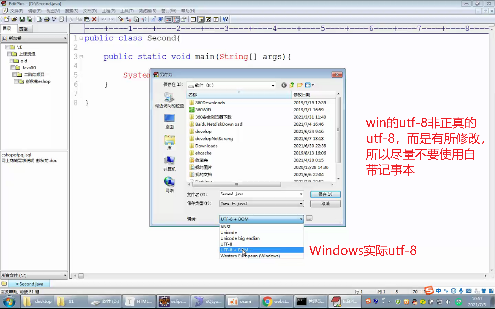
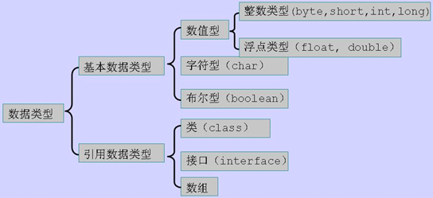
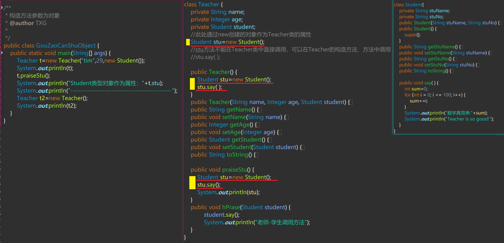
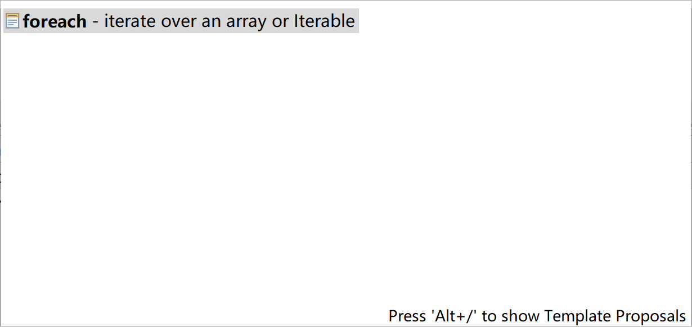

## JAVA版本


## JDK环境变量的配置

Java、Javac程序的运行可以使用`绝对地址`和`相对地址`

1. 最简单的运行方式，将.java文件放置在jdk\bin目录下，即放在Java、javac所在目录下，此方法的缺点是代码管理混乱，不适于大量代码的开发。


2. 在未配置环境变量的情况下，将.Java文件从jdk\bin分离出来，使用相对路径和绝对路径进行编译、运行。
   （1）绝对路径只能进行编译操作，而无法完成运行操作，原因是Java程序（Java.exe）后不能添加路径，只能是类名。

   ​	


​		编译成功，生成.class文件，但由于Java后放置的是目录而非直接的类名，无法运行

（2）使用相对路径编译和运行都能正常完成


使用`行对路径`可以实现.java文件从jdk\bin目录下分离出来，同时也能完成编译和运行操作，但每次都要添加Java和javac的路径，比较麻烦，因此可以针对Java、javac配置系统环境变量

Windows系统搜索某个命令的机制：先从当前目录下搜索，当前目录没有则从path环境变量指定的目录下搜索。吧Java，javac配置到path环境变量则可以实现在.java文件的目录下不指明Java、javac的路径而直接运行Java，javac。

1、PATH环境变量

作用：为系统指示Java、javac所在的路径

变量值：%JAVA_HOME%\bin

2、JAVA_HOME环境变量

作用：便于PATH环境变量值的改变

变量值：bin文件夹所在路径，eg:D:\Java\jdk1.8.0_291

3、CLASSPATH环境变量

作用：为系统指示类文件（.class）文件所在的路径

变量值：.；%JAVA_HOME%bin\lib\tools.jar；%JAVA_HOME%bin\lib\dt.jar

'"."表示当前目录，即当前DOS窗口显示的路径。

由于jdk1.5以上的版本默认配置了classpath环境变量，因此高于jdk1.5的版本无需配置此环境变量，若为了兼容老旧版本也可以配置此变量。


## 环境变量path和classpath

1. path是配置Windows可执行文件的搜索路径，即扩展名为.exe的程序文件所在的目录，用于指定DOS窗口命令的路径。
2. Classpath是配置class文件所在的目录，用于指定类搜索路径，JVM就是通过它来寻找该类的class类文件的。

## cmd常用命令


cd	查看当前目录（cd+enter）或切换目录（cd+空格+目录+enter）目标目录和当前目录在相同盘符下才能使用cd切换，若需要切换到另一个盘符下的目录需要先进入目标盘符再用cd进行切换。

cd.	回到当前目录

cd..	回到上级目录

cd\ \(cd/\) 是回到根目录

cd ~ 回到用户主目录

c:	进入C盘

d:	进入D盘

e:	进入E盘
		......

DIR		查看目录内容命令 

PATH	指定可执行文件搜索目录 

MD		创建目录命令 

CD		打开指定目录命令 

RD		删除当前指定的子目录命令 

C:		改变当前盘符命令 

COPY	文件复制命令 

TYPE	显示文本文件内容命令 

REN	更改文件名命令 

DEL	删除文件命令 

CLS	清除屏幕命令 

**DOS命令不区分大小写，比如C盘的Program Files，在dos命令中完全可以用"progra~1"代替，加上英文引号是因为名称的中间有空格（即多于一个词）**

## Java程序的结构

每个 Java 应用程序都 必须有一个 main方法，其声明格式如下所示

```java
public class ClassName {	
    public static void main(String[] args) {	
        program statements
            //自定义代码块	
    }
}
```

## 代码写作

1、在 Java中，每个句子必须用分号结束。 特别需要说明，回车不是语句的结束标志，因此，如果需要可以将一条语句写在多行上。

2、System.out.println("We will not use ' Hello, World!' ");在这里，使用了System.out对象并调用了它的println方法。注意，点号“.”用于调用方法。Java使用的通用语法是object.method(parameters)

## 无run as java application

代码编译正常，无run as java application，可能存在单词拼写错误，如main拼写错误。

## 进制

十六进制数值有一个前缀0x或0X（如0XCAFE）。

八进制有一个前缀0，例如，010对应八进制中的8。很显然，八进制表示法比较容易混淆，所以建议最好不要使用八进制常数。

从Java7开始，加上前缀0b或0B就可以写二进制数。例如，0b1001就是9。

从Java7开始，还可以为数字字面量加下划线，如用1000000（或0b1111_0100_00100100_0000）表示一百万。这些下划线只是为了让人更易读。Java编译器会去除这些下划线。

## Java运算符优先级和结合性


例如：因为+= 是右结合运算符，所以表达式 a += b += c等价于 a += (b += c)，也就是将 b += c 的结果（加上c 之后的 b) 加到 a上。

## 编码问题




## Unicode与utf-8

Unicode只是一个字符集，为字符指定了一一对应的编号，unicode字符集已达100万之多，完全覆盖全球所有国家字符。编号靠前的字符对应的编号，转为二进制1个字节即可存储，而对于编号靠后的字符的编号转为二进制后需要2个或3个字节来存储。

Unicode只是规定了字符的对应编号，并没有说明如何将字符对应的编号转为二进制后写入内存，UTF即Unicode Transformation Format，翻译为Unicode转换格式，UTF将Unicode字符对应的编号进一步转换，针对不同字符编号大小不同设置不同转换格式格式，得到不同长度的转换编码，达到避免小编号字符写入内存浪费现象，优化内存占用。UTF有多种转换方式，常用的为UTF-8格式。

Unicode只是字符集，不是编码规则，而UTF是编码方法，将Unicode字符集编号合理化编码后方便内存写入，避免内存空间浪费。

https://blog.csdn.net/guxiaonuan/article/details/78678043

基本汉字有20902个，其对应的Unicode十进制编号在65536（2个字节）之内，因此Java中对常用中文字符的编码与unicode保持一致，即都是2个字节，但通常使用的utf-8存储编码格式规定，基本中文字符用3个字节存储（包含中文标点符号），英文字符和数字使用一个字节存储。

## Java文件中main方法的数量

1、在同一个.java文件中 可以包含多个类 而每一个类中都可以有且仅有一个main方法

2、调用JVM运行代码 你需要运行哪一个 就把鼠标放到哪一个上面就可以，而且JVM 一次只能运行一个main方法

3、在一个Java文件中只能有一个public修饰的类，不在同一个包（文件夹）中文件相互调用时需要导包，在同一个包中的则不需要导包。

## 自定义类中变量相关问题

在自定义类中（方法外）可以想在main方法中一样定义变量，允许定义变量的同时进行赋初值，但不能在变量定义完后再进行赋值。

```java
class Rerson{
        int a;//正确
        int b= 5;//正确
        int c;//正确
         c=9;//错误
}
```

## 静态方法不可引用非静态变量

静态方法和静态变量是属于某一个类，而不属于类的对象。

静态的方法可以在没有创建实例时使用,而申明为非静态的成员变量是一个对象属性,它只有在对象存在时引用,因此如果在对象未创建实例时在静态方法中调用了非静态成员方法自然是非法的，所以编译器会在这种时候给出错误。

简单说来，静态方法可以不用创建对象就调用，非静态方法必须有了对象的实例才能调用.因此想在静态方法中引用非静态方法是不可能的,因为它究竟引用的是哪个对象的非静态方法,编译器不可能给出答案,因为没有对象,所以要报错。

```java
class Test { 
	int a= 6; 
	public static void main(String[] args){ 
	System.out.print(a);    
    } 
} 
//成员变量不能直接调用  （ 无法从静态上下文中引用非静态变量  a ）                
```

## System.out.println

System.out.println()必须要在在方法中或代码块中使用，不能直接写在类中使用。

使用System.out.println()方法时间，若传入参数为对象类型，底层会调用对象的toString方法，有重写toString()方法，则调用重写的toString()，没有重写，则调用继承自Object的toString()方法，输出的值类似这样： po.People@6aa8ceb6（内存中的地址）

```java
public class TestDemo {
	private int b=3;
	public static void main(String[] args) {
		TestDemo testDemo=new TestDemo();
		testDemo.b=5;
		testDemo.b+=8;
		System.out.println(testDemo.b);
	}
	System.out.println(b);//错误写法
}
```

## 访问修饰符

所有的访问修饰符不论作用对象都可分为两类：`可访问控制符`和`非可访问控制符`

|        | public | protected | default**(什么都不写)** | private |      | abstract | final | static |
| :----: | :----: | :-------: | :---------------------: | :-----: | :--: | :------: | :---: | :----: |
| 外部类 |   √    |           |            √            |         |      |    √     |   √   |        |
|  属性  |   √    |     √     |            √            |    √    |      |          |   √   |   √    |
|  方法  |   √    |     √     |            √            |    √    |      |    √     |   √   |   √    |
| 构造器 |   √    |     √     |            √            |    √    |      |          |       |        |

**外部类**：public default abstract final只能出现其一；

**属性**：public default abstract final只能出现其一，可与final static组合修饰

```java
  public static final double PI = 3.14;
```

**方法**：public default abstract final只能出现其一，abstract  final只能出现其一，可与static组合修饰。

```java
//static修饰  	属性  方法 
static String str;
public static void main(){}

//abstract修饰   	类     方法
abstract class Teacher{}
public abstract void say(){}

//final修饰  	      类     属性    方法
final class Teacher{}
final int a;
public static final double PI = 3.14;
public final void swim(){}
```

##   static:静态

1、使用static关键字修饰一个属性，声明为static的变量本质就是一个全局变量;
2、静态变量或方法属于类而不属于对象，所以调用静态变量或方法时，要使用类名直接调用而不建议使用对象去调用。
3、静态变量在内存中只会保存一份，由这个类来实现共享

## Java中方法的调用

*静态方法调用同类中的静态方法：方法名(实参列表);

*静态方法调用非同类中的静态方法：类名.方法名(实参列表);

*静态方法调用非静态方法：对象名.方法名(实参列表);

 

*非静态方法调用同类中的方法：方法名(实参列表);

*非静态方法调用非同类中的静态方法：类名.方法名(实参列表);

*非静态方法调用非同类中的非静态方法：对象名.方法名(实参列表);

## Java中方法的调用

**静态方法调用其他方法**

1.调用同一类中静态方法

`直接调用`

2.调用不同类中静态方法

`类名.方法名(参数表)调用`

3.调用同一类中非静态方法

`通过对象调用`

4.调用不同类中非静态方法

`通过对象调用`

**非静态方法调用其他方法**

1.调用同一类包中静态方法

`直接调用`

2.调用不同类中静态方法

`类名.方法名(参数表)调用`

3.调用同一类包中非静态方法

`直接调用`

4.调用不同类中非静态方法

`通过对象调用`

https://www.wangt.cc/2021/05/java%E4%B8%AD%E6%96%B9%E6%B3%95%E8%B0%83%E7%94%A8%E6%80%BB%E7%BB%93/


在一个类中的方法中调用另一个类的方法时，调用方法的形参要包含被调用方法类的对象，且调用对象要和方法对应。


**... 可变参数，相当于一个数组**

## 错误案例

```java
public class DiGui {

	public static void main(String[] args) {
		int count = 10;
		int i = 20;
		diGui(i, count);
		System.out.println(count);
	}

	public static void diGui(int i, int count) {
		count=count+i;
		System.out.println(count);
	}
}

```

运行结果


结果不等原因：定义在main方法方法中的i，count 属于局部变量，只作用于main范围内，而diGui方法需要传入两个int形参，在diGui内对传入的数据做进一步的操作，传入的形参的变量名可以随意命名，这里只是形参的值和main方法中的i，count重名了，调用diGui方法，将main方法中的i，count复制给了形参i，count，但diGui无法对main中的i，count做改变。若非要改变，可将main中的i，count定义到main外面，变为全局变量（同时需要注意形参名的命名，若形参名和全局变量名字相同，人无法实现对全局变量的操作）。


## 接口实例化？

**抽象类不想写实现类可以用匿名内部类实现**？？？？

接口 变量=实现类实例；

```java
package com.wn.day15;

public class JieKouShiLiHua {
	public static void main(String[] args) {
		Inter i = new Son();
	}
}

interface Inter {
}

class Son implements Inter {
}
```

## Lambda表达式和匿名内部类的区别

所需类型不同

- 匿名内部类:可以是接口，也可以是抽象类，还可以是具体类

- Lambda表达式:只能是接口


使用限制不同

- 如果接口中有且仅有一一个抽象方法，可以使用L ambda表达式,也可以使用匿名内部类

- 如果接口中多 于一个抽象方法，只能使用匿名内部类，而不能使用L ambda表达式

实现原理不同

- 匿名内部类:编译之后，产生-一个单独的.class字节码文件

- Lambda表达式:编译之后，没有一个单独的.class字节码文件。对应的字节码会在运行的时候动态生成

## 书写错误


## 数据类型



## 对象比较

判断对象是否为null,是地址判断，用`==`,当对象不为空，比较内容用`equals()`

## equals()易错


## Object[]数组


Object[]数组可以放置任何数据类型的对象，而且还可以是不同类型的，也是集合实现的基础

## 数组初始化


## 构造方法参数为另一对象解释

当B类对象为A类构造方法的参数，A类通过new创建对象时：

```java
A a=new A("Tim",20,new B());
```

先创建a对象，再对a初始化，将”tim“,"20"等赋给a对象对应的属性，同过new B()创建一个B类对象，该对象多为a对象的属性。即`先创建A类对象a，再创建B类对象`。虽然再创建a的同时也创建的一个B类对象，但该B类对象的方法不执行，只有当该对象调用其方法时才执行。

## A类中创建B类对象，B类方法执行情况

1、在A类(非public类，不含main()方法)中直接创建B类对象，并调用B类对象方法。

> ```java
> class A{
>     B b=new b();
>     b.bmethed();//编译错误
> }
> ```
>
> b对象作为A类的属性，调用b方法错误；

2、在A类(非public类，不含main()方法)构造方法中创建B类对象，并调用B类对象方法。

> ```java
> public A( ){
>     B b=new b();
>     b.bmethed();//正常执行
> }
> ```
>
> 调用A构造方法创建A对象的同时创建b对象，b调用其方法，可以执行，若不调用则不会执行。

3、在A类的方法中创建B类对象，并调用其方法

> ```java
> class A{
>     public void amethed(){
>         B b=new B();
>         b.bmethed();//若不写此语句，bmethed()不会执行。
> 	}
> }
> ```
>
> 创建A对象后，当A对象调用amethed()方法时，创建B对象b，b调用bmethed()，bmethed()执行，若没有b.bmethe;语句，bmethed()不会执行，只创建了b对象。

总结：无论B类对象在A类何处创建，只有当B对象调用B类方法时，B类方法才会执行，而不是一旦创建了B类对象，B类方法就会执行。总之记住：方法只有调用了才会执行。

实例：

```java
package zzztest;

import java.util.concurrent.Callable;

/**
 * 构造方法参数为对象
 * @author TXG
 *
 */
public class GouZaoCanShuObject {
	public static void main(String[] args) {
		Teacher t=new Teacher("tim",29,new Student());
		System.out.println(t);
		t.praiseStu();
		System.out.println("Student类型对象作为属性："+t.stu);
		System.out.println("------------------------------------------");
		Teacher t2=new Teacher();
		System.out.println(t2);
	}
}

class Teacher {
	private String name;
	private Integer age;
	private Student student;
	//此处通过new创建的对象作为Teacher类的属性
	Student stu=new Student();
	//stu方法不能在Teacher类中直接调用，可以在Teacher的构造方法、方法中调用
	//stu.say( );
	
	public Teacher() {
		Student stu=new Student();
		stu.say( );
	}
	public Teacher(String name, Integer age, Student student) {
		super();
		this.name = name;
		this.age = age;
		this.student = student;
	}
	public String getName() {
		return name;
	}
	public void setName(String name) {
		this.name = name;
	}
	public Integer getAge() {
		return age;
	}
	public void setAge(Integer age) {
		this.age = age;
	}
	public Student getStudent() {
		return student;
	}
	public void setStudent(Student student) {
		this.student = student;
	}
	@Override
	public String toString() {
		return "Teacher [name=" + name + ", age=" + age + ", student=" + student + "]";
	}
	
	public void praiseStu() {
		Student stu=new Student();
		stu.say();
		System.out.println(stu);
	}
	public void hPrase(Student student) {
			student.say();
			System.out.println("老师-学生调用方法");
	}
}

class Student{
	private String stuName;
	private String stuNo;
	public Student(String stuName, String stuNo) {
		super();
		this.stuName = stuName;
		this.stuNo = stuNo;
	}
	public Student() {
		super();
	}
	public String getStuName() {
		return stuName;
	}
	public void setStuName(String stuName) {
		this.stuName = stuName;
	}
	public String getStuNo() {
		return stuNo;
	}
	public void setStuNo(String stuNo) {
		this.stuNo = stuNo;
	}
	@Override
	public String toString() {
		return "Student [stuName=" + stuName + ", stuNo=" + stuNo + "]";
	}
	
	public void say( ) {
		int sum=0;
		for (int i = 0; i <= 100; i++) {
			sum+=i;
		}
		System.out.println("数学真简单:"+sum);
		System.out.println("Teacher is so good!");
	}
}
```




## 连接源码


**连接源码步骤**


注意：源码不需要解压


## Java文件路径

**java路径"/"和"\\"**

````java
String path="D:\\新建文件夹\\2.png";  
File file=new File(path);   
System.out.println(file.exists());   
String path1="D:/新建文件夹/2.png";  
File file1=new File(path);
System.out.println(file1.getAbsolutePath());   
System.out.println(file1.getCanonicalPath());  
````

> `具体使用中都可以达到访问路径的效果`，只不过有一点小区别
>
> 正斜杠/：一般在配置文件路径时，指向下一个路径只要使用一个。例如："c:/a/1.txt";
>
> 反斜杠\：在配置文件路径时，由于它本身在java中有特殊意义，作为转义符而存在，所以具体意义上的反斜杠要两个。例如：`"c\\a\\1.txt"`;这里的第一个反斜杠是作为转义符存在的，第二个才是真正意义上的反斜杠。
>
> 一般可以认为是"/"的作用等同于"\\"
>
> 在java中路径一般用"/"
>
> windows中的路径一般用"\"
>
> linux、unix中的路径一般用"/"
>
> 推荐用“/”  因为java是跨平台的。“\”（在java代码里应该是`\\`）是windows环境下的路径分隔符，Linux和Unix下都是用“/”。而在windows下也能识别“/”。所以`最好用“/”`


**IO流文件相对路径**

若文件在项目的某个路径下，使用相对路径时，都是从项目根路径开始寻找（举例从ztest开始找）


**文件路径获取**


注：此项目的db.propertes文件在src目录下

> 使用io读取文件，相对路径为相对当前项目的根目录开始寻找文件
>
> 使用类加载器加载文件，相对路径为相对当前项目根目录下的src目录开始寻找文件

**类加载器获取文件绝对路径**


## instanceof


## equals

equals方法的使用，两边的对象不一定要相同


## 迭代器模型


## 多个编译错误


## foreach




## 字符输出流写入换行不执行


## 回车换行与系统

https://www.cnblogs.com/clarkchen/archive/2011/06/02/2068609.html


## java与js相等比较

Java中对象的比较：==用于判断两个对象是否是同一个对象，equals()方法用于比较两个对象的内容是否相同。

js中对象的比较：==用于判断两个对的值(内容)是否相同，类似于Java中的equals()，\=\==用于比较两个对象是否是同一类型，并且值也相同。

如判断一个字符串是否为空字符串，在Java中一定要使用equals（）,而不是\=\=，eg:new String("").equals("");在js中使用\=\=,eg:$("#div").html()\=\="";


## 真转与假转


# String

## 一、String的构造器

```java
new String(); //创建空的字符串引用，但是字符串没有内容
new String(byte[] datas);//将byte 数组对应的Acill 字符，变成字符串
new String(byte[] datas,Charset charset);////将byte 数组对应的Acill 字符，遵循UIF-8的编码集，变成字符串
new String(char[] datas)//将char数组 ，变成字符串
new String(String data);//创建一个String对象，内容是：data的内容
String s = "abc";
```

## 二、常见的API

| 返回值类型     | 方法与描述                                                   |
| :------------- | :----------------------------------------------------------- |
| `char`         | ` charAt(int index)`返回指定索引处的字符                     |
| **`int`**      | **` compareTo(String str)`**按字典顺序比较两个字符串，返回参与比较的两个字符串的ascii码差值 |
| `String`       | ` concat(String str)`将指定字符串连接到此字符串的结尾。      |
| **`boolean`**  | **`contains(CharSequence s)`**判断字符串中是否包含指定字符，当且仅当此字符串包含指定的 char 值序列时，返回 true |
| `String`       | ` toLowerCase()`将字符串转换为小写                           |
| `String`       | ` toUpperCase()`将字符串转换为大写                           |
| `boolean `     | `equalsIgnoreCase(String anotherString)`将一个字符串与另一个字符串进行比较，在比较过程中忽略大小写。参数不为null，且这两个String相等（忽略大小写），则返回true；否则返回false。 |
| `int`          | ` indexOf(String str,int fromIndex)` 返回从 fromIndex 位置开始查找指定字符在字符串中第一次出现处的索引，如果此字符串中没有这样的字符，则返回 -1。 |
| `int `         | `indexOf(String str)`返回指定字符在字符串中第一次出现处的索引，如果此字符串中没有这样的字符，则返回 -1。 |
| **`int`**      | **` length()`**返回字符串的长度。                            |
| **`boolean`**  | **` isEmpty()`**判断字符串的长度是否为空，如果字符串长度为 0，则返回 true，否则返回 false。 |
| `boolean`      | ` startsWith(String prefix)`用于检测字符串是否以指定的前缀开始。如果字符串以指定的前缀开始，则返回 true；否则返回 false。 |
| `boolean `     | `startWith(String prefix,int toffset)`判断字符串从指定索引位置是否以指定的字符串开始。 |
| `boolean `     | `endsWidth(String suffix)`用于检测字符串是否以指定的后缀开始。如果字符串以指定的后缀开始，则返回 true；否则返回 false。 |
| `String`       | `replace(char oldChar,  char newChar)` 返回一个新的字符串，它是经过用 newChar 交换此字符串中呈现的一切 oldChar 而生成的。 |
| `String`       | `replace(CharSequence target, CharSequence replacement)` 返回一个新的字符串，它是经过用 replacement 交换此字符串中呈现的一切 target而生成的。 |
| **`char[] `**  | **`toCharArray()`**将字符串对象中的字符转换为一个字符数组。  |
| `String`       | `trim()`用于删除字符串的头尾空白符。                         |
| `String`       | `substring(int beginIndex )`从指定索引截取字符串到结尾       |
| `String`       | `substring(int beginIndex ,int endIndex)`截取开始索引和结束索引之间的字符串，包含开始索引位置字符串但不包含结束索引之间的字符串 |
| **`String[]`** | **`split(String regex)`**根据传入的正则表达式拆分原字符串为字符串数组。 |


# StringBuilder和StringBuffer

## 一、构造器

```java
StringBuilder();//构造一个没有字符的字符串缓冲区，初始容量为16个字符。 
StringBuilder(String str); //构造一个初始化为指定字符串内容的字符串缓冲区。 容量为参数的长度+ 16。
StringBuilder(int capacity);//构造一个没有字符的字符串缓冲区和指定的初始容量。 
```

## 三、常用API

| 返回值类型         | 方法与描述                                                   |
| :----------------- | :----------------------------------------------------------- |
| **`StringBuffer`** | **`append(String s)`**将指定的字符串追加到此字符序列。       |
| **`StringBuffer`** | **`reverse() `**将此字符序列用其反转形式取代。               |
| **`StringBuffer`** | **`delete(int start, int end)`**删除此序列索引start和end之间`[start，end)`字符串（直接修改的调用该方法的StringBuffer对象） |
| **`StringBuffer`** | **`insert(int offset, int i) `**将第二个 int参数的字符串表示插入到此序列offset位置。 |
| **`StringBuffer`** | **`insert(int offset, String str)`**将 str参数的字符串插入此序列中，从offset位置开始插入。 |
| **`int`**          | **`capacity()`** 返回当前容量。                              |
| **`StringBuffer`** | **`replace(int start, int end, String str) `**使用给定 String中的字符替换此序列的子字符串中的字符`[start，end)`。 |
| `String`           | `toString() `返回此序列中数据的字符串表示形式。              |
| `String`           | `substring(int start)` 返回一个新的 String，它包含此字符序列当前所包含的字符子序列。 |
| `String`           | `substring(int start, int end) `返回一个新的 String，它包含此序列当前所包含的字符子序列。 |
|                    |                                                              |
| `char`             | `charAt(int index) 返回此序列中指定索引处的 `char` 值。      |
| `void`             | `ensureCapacity(int minimumCapacity) `确保容量至少等于指定的最小值。 |
| `void`             | `getChars(int srcBegin, int srcEnd, char[] dst, int dstBegin) `将字符从此序列复制到目标字符数组 dst。 |
| `int`              | `indexOf(String str) `返回第一次出现的指定子字符串在该字符串中的索引。 |
| `int`              | `indexOf(String str, int fromIndex)` 从指定的索引处开始，返回第一次出现的指定子字符串在该字符串中的索引。 |
| `int`              | `lastIndexOf(String str) `返回最右边出现的指定子字符串在此字符串中的索引。 |
| `int`              | `lastIndexOf(String str, int fromIndex) `返回 String 对象中子字符串最后出现的位置。 |
| `void`             | `setCharAt(int index, char ch) `将给定索引处的字符设置为 ch。 |
| `void`             | `setLength(int newLength)` 设置字符序列的长度。              |
| `CharSequence`     | `subSequence(int start, int end) `返回一个新的字符序列，该字符序列是此序列的子序列。 |

# System

## 一、常见API

| 返回值类型       | 方法和描述                                                   |
| :--------------- | :----------------------------------------------------------- |
| `static   void`  | `exit(int status)`终止当前正在运行的 Java 虚拟机。参数用作状态码；非 0 的状态码表示异常终止。 |
| `static   long ` | `currentTimeMillis()`返回系统当前的时间毫秒值。              |
| `static  void`   | `arraycopy(Object src, int srcPos, Object dest, int destPos, int length) `从指定源数组中复制一个数组。数组的复制 (源数组，源数组中需要复制数据的起始位置，目标数组，目标数组需要粘贴的起始位置，源数组中需要复制的元素的个数) |

# Arrays

## 一、常用API

| 返回值类型            | 方法和描述                                                   |
| :-------------------- | :----------------------------------------------------------- |
| `static       String` | `toString(Object[] obj)`返回指定数组的内容的字符串表示形式   |
| `static    void`      | `sort(Object[] a)`对指定对象数组根据其元素的自然顺序进行升序排列。同样的方法适用于所有的其他基本数据类型（Byte，short，Int等）。 |
| `static    int[]`     | `copyOf(int[] original, int newLength) `数组复制。Arrays.copyOf(需复制的数组, 新数组长度 )。同样适用于char、byte、long等数据类型。（Arrays.copyOf()的底层是：System.arraycopy()） |
| `static   boolean`    | `equals(long[] a, long[] a2)`两个数组以相同顺序包含相同的元素，则两个数组是相等的，返回true。同样的方法适用于所有的其他基本数据类型（Byte，short，Int等）。 |
| `static   int`        | `binarySearch(Object[] a, Object key)`查找某个元素的位置，如果查找值包含在数组中，则返回搜索键的索引；否则返回-1。 |

| 方法类型 | 返回值类型 | 方法                                      | 描述                                             | 调用                                             |
| :------: | :--------: | ----------------------------------------- | ------------------------------------------------ | ------------------------------------------------ |
|  static  |   String   | toString(Object[] array)                  | 返回数组元素的字符串形式。                       | Arrays.toString(Object[] array)                  |
|  static  |    void    | sort(Object[] array)                      | 对数组元素进行排序 (默认升序)。                  | Arrays.sort(Object[] array)                      |
|  static  |  Object[]  | copyOf(Object[] original，int newLength)  | 数组拷贝                                         | Arrays.copyOf(Object[] original，int newLength)  |
|  static  |  Boolean   | equals(Object[] array1, Object[] array2)  | 判断两个数组是否相等                             | Arrays.equals(Object[] array1, Object[] array2)  |
|  static  |    int     | binarySearch(Object[] array,  Object obj) | 使用二分法查找数组内指定范围内的指定元素的索引值 | Arrays.binarySearch(Object[] array,  Object obj) |


# ==、equals()比较：

**区别与联系**

基本数据类型的比较只能用`==`,引用数据类型的比较使用`==`或`equals( )`。

引用数据类型的比较：

1、`==`比较的地址。

2、未经重写的`equals( )`也比较的是对象的地址，Java提供的引用数据类型的equal()都继承自Object，都是经过重写了的，所以比较的是对象的内容。而对于自定义的引用数据类型，继承自Object的equals()未经重写，默认比较的是地址，若要比较内容需要，在定义的类型中重写。

3、数组的比较使用静态方法`Arrays.equals(Object1[] array1，Object2[] array2)`，Java提供类型比较内容，自定义类型默认比较地址，重写后比较内容。若用`（Object1[] array1）.equals(Object2[] array2)`比较数组，不论是Java提供的类型还是自定义的类型，得到的结果始终为false，（arrays1与arrays2为对象引用的引用）


**总结：**

1、基本数据类型比较：用`==`

2、引用数据类型比地址：用`==`

​	对象比较内容：用`Obj1.equals( Obj1)`

​	对象数组比较内容：用`Arrays.equals(Object1[] array1，Object2[] array2)`(自定义类型注意重写)

**基本数据类型数组与对引用数据类型数组内存图**


# Object.toString()与Arrays.toString(Object[ ]  array)

1、`Object.toString()`

用于将`对象`的内容以字符串的形式输出显示，当使用`System.out.println(Object);`语句输出对象时，对象会自动调用其继承自Object的toString()方法，利用Java提供的类创建的对象的toString()方法都是经过重写的，会自动显示成字符串内容的字符串形式，而通过自定义类创建的对象，使用System.out.println(Object)输出时调用自身继承自Object的toString()未经过重写，默认会输出对象的地址字符串而非内容字符串，通过对自定义类toString()的重写，可实现，输出时显示内容字符串。


2、`Arrays.toString(Object[ ]  array)`

用于将对象数组中对象的内容以字符串的形式展示出来，当使用`System.out.println()`输出对象时，必须主动调用`Arrays.toString(Object[ ]  array)`方法，而不能省略，同样，对于通过Java提供的类创建的对象数组，直接调用即可，而对于自定义类创建的数组，必须在类中重写`toString()`后在调用才能将内容以文字字符串展现；直接调用toString()去输出对象数组，不能正常显示。


**总结：**

1、`对象输出用toStrig()`。Java提供类对象输出，可显示调用或不调用toSring()；自定义类重写oString()后可显示调用或不调用toSring().

2、`对象数组输出用Arrays.toString(Object[ ]  array)`。Java提供类对象数组直接调用，不可省略；自定义类对象数组重写toString()后再调用，不能省略。

# 反射

Class	对象名.class;

**java.lang.Class<T>**

Class	类名.getClass();

Class	Class.forName("类全限定名")

public	Field	getField(String name);

public	Field[]	getFields();

public	Field	getDeclearedField(String name);

public	Field[]	getDeclearedFields();

public 	void 	set(Object obj, Object value);

public	void 	setAccessible(boolean flag);

public 	Method 	getMethod(String name, Class<?>... parameterTypes);

public	Method[]	getMethods();

public	Method	getDeclaredMethod(String name,  Class<?>... parameterTypes)；

public	Field[]	getDeclaredFields()；

public 	T	newInstance();

public	Constructor<T>	getConstructor(Class<?>...  parameterTypes)；

public	Constructor<?>[]	getConstructors()；

public	Constructor<T>	getDeclaredConstructor(Class<?>...  parameterTypes)；

public	Constructor<?>[]	getDeclaredConstructors()；

**java.lang.reflect.Field**

public	void	set(Object obj, Object value)

public	Object	get(Object obj)

public	String	getName()；返回此 Field 对象表示的字段的名称

**java.lang.reflect.Method**

public	Object	invoke(Object obj, Object... args)

**java.lang.reflect.Constructor<T>**

public	T	newInstance(Object... initargs)；

# MAP


> for（元素类型  元素名称 ： 遍历数组（集合）（或者能进行迭代的））{
>
> ​	语句
>
> }

# Java中的代理模式

Java中代理有三种方式来创建代理对象：静态代理、基于JDK（接口）的动态代理、基于CGLIB（父类）的动态代理。

## 相关概念tips

目标类：原对象，我们需要通过代理对象控制它的访问，扩展其功能。
代理类：代理模式产生的对象，是原对象的“替身”，已经在原有基础上修改了逻辑。

## 静态代理

静态代理，也就是我们会手写代理类的代码，工程中有代理类的源码，代理类会编译后执行。
编写代理类，实现目标类的接口或者直接继承目标类，完成逻辑的修改。


分析：静态代理虽然能够实现我们所说的代理模式，完成了解耦，但是静态代理类的代码维护依然非常复杂。一旦接口或者父类发生了变动，则代理类的代码就得随之修改，代理类多的时候维护比较麻烦。所以在实际开发的时候，一般使用动态代理的方式。

## 动态代理

动态代理技术，是在内存中生成代理对象的一种技术。也就是整个代理过程在内存中进行，我们不需要手写代理类的代码，也不会存在代理类编译的过程，而是直接在运行期，在JVM中“凭空”造出一个代理类对象供我们使r用。一般使用的动态代理技术有以下两种：

