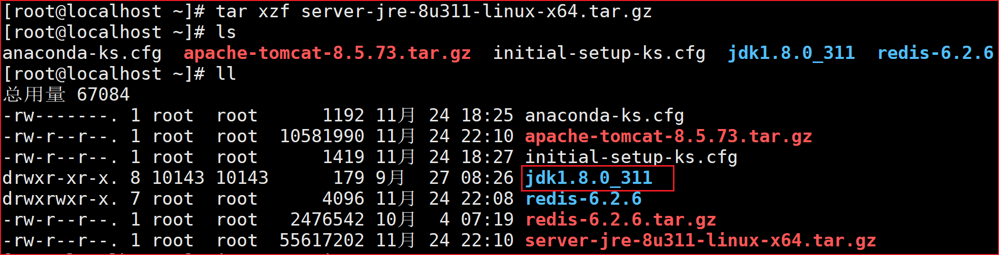
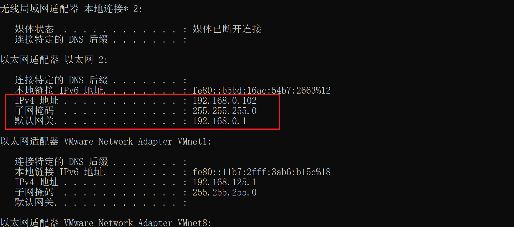

# 一、Linux概念

Linux操作系统是基于UNIX操作系统(UNIX ，是一个强大的多用户、多任务操作系统，支持多种处理器架构)发展而来的一种克隆系统，它诞生于1991 年的 [Linux桌面] 10 月5 日（这是第一次正式向外公布的时间）。以后借助于Internet网络，并通过全世界各地计算机爱好者的共同努力，已成为今天世界上使用最多的一种`UNIX 类操作系统`，并且使用人数还在迅猛增长。

# 二、Linux文件

在 Linux 中我们可以使用 **ll** 或者 **ls –l** 命令来显示一个文件的属性以及文件所属的用户和组，如：

```sql
[root@www /]# ls -l
total 64
dr-xr-xr-x   2 root root 4096 Dec 14  2012 bin
dr-xr-xr-x   4 root root 4096 Apr 19  2012 boot
……
```

实例中，**bin** 文件的第一个属性用 **d** 表示。**d** 在 Linux 中代表该文件是一个目录文件。

在 Linux 中第一个字符代表这个文件是目录、文件或链接文件等等。

- 当为 **d** 则是目录
- 当为 **-** 则是文件；
- 若是 **l** 则表示为链接文档(link file)；
- 若是 **b** 则表示为装置文件里面的可供储存的接口设备(可随机存取装置)；
- 若是 **c** 则表示为装置文件里面的串行端口设备，例如键盘、鼠标(一次性读取装置)。

接下来的字符中，以三个为一组，且均为 **rwx** 的三个参数的组合。其中， **r** 代表可读(read)、 **w** 代表可写(write)、 **x** 代表可执行(execute)。 要注意的是，这三个权限的位置不会改变，如果没有权限，就会出现减号 **-** 而已。


每个文件的属性由左边第一部分的 10 个字符来确定（如下图）。


从左至右用 **0-9** 这些数字来表示。

第 **0** 位确定文件类型，第 **1-3** 位确定属主（该文件的所有者）拥有该文件的权限。

第4-6位确定属组（所有者的同组用户）拥有该文件的权限，第7-9位确定其他用户拥有该文件的权限。


其中，第 **1、4、7** 位表示读权限，如果用 **r** 字符表示，则有读权限，如果用 **-** 字符表示，则没有读权限；

第 **2、5、8** 位表示写权限，如果用 **w** 字符表示，则有写权限，如果用 **-** 字符表示没有写权限；第 **3、6、9** 位表示可执行权限，如果用 **x** 字符表示，则有执行权限，如果用 **-** 字符表示，则没有执行权限。

# 三、Linux目录结构


`/`：根目录，所有的目录、文件、设备都在这个 `/`。

`/bin`：bin它是二进制(binary)英文缩写。一般来说，在这个目录下可以找到linux常用命令。系统需要的命令都在这个里目录下可以找到。

`/boot`：Linux的内核及引导系统程序所需要的文件目录。

`/cdrom`：这个目录在刚刚装系统的时候是空的。可以将光驱的文件系统挂载这个目录下。

`/dev`：dev是设备(device)的英文缩写。这个目录对于所有的用户，都非常重要。因为在这个目录下，包含了linux系统中使用的外部设备。但是这里并不会放外部设备的驱动程序。这一点和windows，dos操作系统不一样。比如disk，cpu，net……

`/etc`：etc这个目录是linux操作系统中最重要的目录之一。在这个目录下，放入系统管理相关的配置文件和子目录。比如，要用的网络配置文件，文件系统，x系统配置文件，设备的配置信息，设置的用户信息等都在这个目录下。

```
cd /etc/sysconfig/network-scripts/  去修改网络
```

`/home`：如果创建了一个用户，如果用户名：“xx”，在/home目录下会生成一个/home/xx路径，来存放该用户的信息。

`/lib`：lib是库(library)的缩写。这个目录用来存放系统动态链接共享库。几乎所有的应用程序都会用到这个目录下的共享库。因此，千万不要rm -rf这个目录。

`/lost+found`：在ext2或ext3文件系统中，当系统意外崩溃或机器意外关机，而产生一些文件碎片放在这里。当系统启动的过程中fsck工具会检查这里，并修复已经损坏的文件系统。有时系统发生问题，有很多的文件被移到这个目录中，可能会用手工的方式来修复，或移到文件到原来的位置上。

`/mnt`：这个目录一般是用于存放挂载储存设备的挂载目录的，比如有cdrom等目录。可以参看/etc/fstab的定义。

`/media`：有些linux的发行版使用这个目录来挂载那些USB接口的移动硬盘（包括U盘）、CD/DVD驱动器等等。

`/opt`：存放可选的程序。

`/proc`：可以在这个目录下获取系统信息。这些信息是在内存中的，由系统自己产生。

`/root`：Linux超级权限用户root家的目录。

`/sbin`：这个目录是用来存放系统管理员的系统管理程序。大多是涉及系统管理的命令和存放，是超级管理员root的可执行命令存放的目录，普通用户数无权执行这个目录下的命令。这个目录和/usr/sbin;/usr/X11R6/sbin和/usr/local/sbin目录是相似的，只要是sbin，就只有root权限才能执行。

`/srv`：服务启动后，所需访问的数据目录。www服务启动读取的网页数据，它会放/srv/www目录中

`/sys`：Linux内核中设计前沿的一种基于内存的虚拟文件系统，他的作用和proc有些类似，但除了与proc相同的具有查看和设定内核参数功能外，还有为linux管理 统一设备模型。

`/tmp`：临时文件目录，用来存放不同程序执行的时候产生的临时文件。有时候用户运行程序的时候，会产生临时文件，/var/tmp就是用来存放临时文件的

`/usr`：这个目录，是我们linux中占用磁盘空间最大的目录。用户的很多应用程序都应该放到这个目录下。我们写jar包，软件都应该放到这里。在这个目录下，可以找到一些不适合放到/bin或/etc目录下的额外工具。

`/usr/local`：主要是用来存放我们手动安装的软件。

`/usr/share`：系统公用的东西存放在这里。比如/usr/share/fonts是字体目录，/usr/share/doc和/usr/share/man帮助文件。

`var`：vary的缩写。这个目录中的内容是经常变化的。/var/log用来存放我们系统日志。/var/lib用来存放一些库文件，比如Mysql的，以及Mysql数据库的数据存放。

# 四、常用的linux命令

命令格式：

**命令      [-选项]       [参数]**

## 1.文件与目录操作

### 1.1 pwd显示工作目录

`pwd`：print working directory 打印目前所在的工作目录的绝对路径。

### 1.2 ls 列出目录内容

`ls [-laAcdF] [文件或目录]`

`ls`：命令可列出目录的内容，包括文件和子目录的名称。

`-1`： 每列仅显示一个文件或目录名称，只以一列进行显示。

`-a或--all` ：所有文件和目录，显示现行目录(.)和上层目录(..)。

`-A或--almost-all`： 显示所有文件和目录，但不显示现行目录和上层目录。

`-c `：以更改时间排序，显示文件和目录。

`-d或--directory`： 显示目录名称而非其内容。

`-F或--classify`： 在执行文件，目录，Socket，符号连接，管道名称后面，各自加上”*”,”/“,”=”,”@”,”|”号。

`ll` 显示详细目录内容信息。是ll。其实就是ls -l的缩写，可以显示详细的文件的类型、权限等

> **目录.(点)和. .(点点)**
>
> 文件名. (点)表示当前工作目录，而文件名..(点点)表示当前工作目录上一层的目录，这又通常称为父目录。
>
> 如果我们输入命令来显示当前工作目录/文件的列表，并使用-a选项来列出所有文件，使用-l选项来提供长列表，我们将收到以下结果。
>
> ```
> $ls -la
> drwxrwxr-x 4 u A 2048 Jul 16 17.56 .
> drwxr-xr-x 60 root 1536 Jul 13 14:18 ..
> ---------- 1 u A 4210 May 1 08:27 .profile
> -rwxr-xr-x 1 u A 1948 May 12 13:42 espana
> ```

### 1.3 cd 切换目录

`cd ./ `：切换到当前目录

`cd ../ `或者` cd .. ` ：表示切换到上一级目录

`tab`：键自动补全

### 1.4 mkdir 创建目录

`mkdir [-pm] [目录名称]`  mkdir 可以创建目录，并同时设置该目录的权限

`-m`： 设置所新建目录的权限。

`-p `：若所要建立目录的上层目录目前尚未建立，则会一并建立上层目录。

```
[root@www tmp]# mkdir -m 711 test2
[root@localhost txg]# mkdir -p -m 711 tes/res
```

### 1.5 rmdir 删除空目录

`rmdir [-p] [目录名称]`   删除空目录，若目录非空则无法删除

`-p或--parents`：删除指定目录后，若该目录的上层目录已变成空目录，则将其一并删除。

### 1.6 touch 创建文件

Linux touch命令用于修改文件或者目录的时间属性，包括存取时间(最后一次访问时间)和更改时间(最后一次修改时间)。若文件不存在，系统会建立一个新的文件。

`touch [-acfm] [-d <日期>] [-r <参考文件或目录>] [-t <日期时间>] [文件或目录]`

`-a`：更改读取时间

`-m`：更改修改时间

`-d<日期>`：使用指定的日期时间，而非现在的时间。(8位日期)

`-r<参考文件或目录>`：把指定文件或目录的日期时间，统统设成和参考文件或目录的日期时间相同。

`-t<日期时间>`：使用指定的日期时间，而非现在的时间。(12位日期时间)

```
[root@localhost txg]# touch -m -t 202110241536 tes
[root@localhost txg]# touch -m -d 20211124 tes
```

### 1.7 mv 移动或者更名现有的文件或者目录

`mv [-bfi] [源文件或目录] [目标文件或目录]`可移动文件或目录，或是更改文件或目录的名称。

`-b或--backup` 　若需覆盖文件，则覆盖前先行备份。

`-f或--force` 　若目标文件或目录与现有的文件或目录重复，则直接覆盖现有的文件或目录。

`-i或--interactive` 　覆盖前先行询问用户。

### 1.8 cp 复制文件或者目录

`cp [-bfipPrR]  [源文件或目录]  [目标文件或目录]`

cp指令用在复制文件或目录，如同时指定两个以上的文件或目录，且最后的目的地是一个已经存在的目录，则它会把前面指定的所有文件或目录复制到该目录中。若同时指定多个文件或目录，而最后的目的地并非是一个已存在的目录，则会出现错误信息。

`-b或--backup`   复制已存在文件，对原文件备份（文件名末尾有~标识）

`-f或--force` 　强行复制文件或目录，不论目标文件或目录是否已存在。

`-i或--interactive` 　覆盖既有文件之前先询问用户。

`-p或--preserve` 　保留源文件或目录的属性。

`-P或--parents` 　保留源文件或目录的路径。

`-r `　递归处理，将指定目录下的文件与子目录一并处理。

### 1.9 rm 删除文件或目录

`rm [-firv] [文件或目录…] ` 执行rm指令可删除文件或目录，如欲删除目录必须加上`-r`，否则预设仅会删除文件。

`-f或—force `　强制删除文件或目录。

`-i或—interactive` 　删除既有文件或目录之前先询问用户。

`-r或-R或—recursive `　递归处理，将指定目录下的所有文件及子目录一并处理。

`-v或—verbose` 　显示指令执行过程。

```
[root@localhost txg]# rm *
[root@localhost txg]# rm -r *
```

## 2. VI 编辑器

VI在各个系统的各个版本中都是相同的，并不会有指令的变化。可以分为三种状态，分别是命令模式（command mode）、插入模式（Insert mode）和底行模式（last line mode），各模式的功能区分如下：

### 命令模式

用户刚刚启动 vi/vim，便进入了命令模式。

此状态下敲击键盘动作会被Vim识别为命令，而非输入字符。比如我们此时按下i，并不会输入一个字符，i被当作了一个命令。

以下是常用的几个命令：

- **i** 切换到输入模式，以输入字符。
- **x** 删除当前光标所在处的字符。
- **:** 切换到底线命令模式，以在最底一行输入命令。

若想要编辑文本：启动Vim，进入了命令模式，按下i，切换到输入模式。

命令模式只有一些最基本的命令，因此仍要依靠底线命令模式输入更多命令。

### 输入模式

在命令模式下按下i就进入了输入模式。

在输入模式中，可以使用以下按键：

- **字符按键以及Shift组合**，输入字符
- **ENTER**，回车键，换行
- **BACK SPACE**，退格键，删除光标前一个字符
- **DEL**，删除键，删除光标后一个字符
- **方向键**，在文本中移动光标
- **HOME**/**END**，移动光标到行首/行尾
- **Page Up**/**Page Down**，上/下翻页
- **Insert**，切换光标为输入/替换模式，光标将变成竖线/下划线
- **ESC**，退出输入模式，切换到命令模式

### 底线命令模式

在命令模式下按下:（英文冒号）就进入了底线命令模式。

底线命令模式可以输入单个或多个字符的命令，可用的命令非常多。

在底线命令模式中，基本的命令有（已经省略了冒号）：

- q 退出程序
- w 保存文件

按ESC键可随时退出底线命令模式。

简单的说，我们可以将这三个模式想成底下的图标来表示：


### VI基本操作过程

在系统提示符号输入vi及文件名称后，就进入vi全屏幕编辑画面：

```
vi myfile
```

进入 vi 之后， 是处于「命令行模式（command mode）」

按一下字母`     i `（或a、o、s等）就可以进入「插入模式（Insert mode）」， 这时候你就可以开始输入文字了

按一下`ESC` 键转到「命令行模式（command mode）」
按一下`：` 冒号键进入「Last line mode」，再输入如下命令：

> : w filename （输入 「w filename」 将文章以指定的文件名 filename 保存）
> : wq (输入「wq」， 存盘并退出 vi)
> : q! (输入 q!， 不存盘强制退出 vi)

### 整行删除

退出插入模式，光标移到待删除行最左侧，连续按2次d键。

### VI开文件

vi filename：打开或新建文件，并将光标置于上次打开的行

vi +n filename：打开文件，并将光标置于第n行首

vi + filename： 打开文件， 并将光标置于最后一行首

vi +/pattern filename： 打开文件， 并将光标置于第一个与 pattern 匹配的串处

注意：+、/号是需要输入的，并非表示连接和分割

### VI移动光标类

`命令行模式`下： (一般在linux查看日志文件，这些命令用的较多)

u：撤销

ctrl + r：恢复撤销

end：移至行尾

home：移至行首

h ：光标左移一个字符
l ： 光标右移一个字符
k 或 Ctrl+p ： 光标上移一行
j 或 Ctrl+n ： 光标下移一行
space ： 光标右移一个字符
Backspace ： 光标左移一个字符
Enter ： 光标下移一行
w 或 W ： 光标右移一个字至字首
b 或 B ： 光标左移一个字至字首
e 或 E ： 光标右移一个字至字尾
nG ： 光标移至第 n 行首

n+： 光标下移 n 行
n-： 光标上移 n 行
n$： 光标移至第 n 行尾（ 光标要开始在首行）

H ： 光标移至屏幕顶行
M ： 光标移至屏幕中间行
L ： 光标移至屏幕最后行
0 ： （ 注意是数字零） 光标移至当前行首
$ ： 光标移至当前行尾

## 3.补充命令

su - root：切换到root账号

su -  用户名：切换到普通用户账号

↑/↓：切换历史命令

history：查看历史操作记录

clear：清屏

tab：自动补全

ctrl  c：强制终止程序的执行

ctrl  d：退出终端（对于远程连接为断开连接）

exit：退出终端（对于远程连接为断开连接）

关机：init 0

重启：init 6 或reboot

> cd 切换目录，以`/`开头是绝对路径，从根路径开始找，不以`/`开头是相对路径，从当前所在路径寻找目标路径。


## 4.用户和用户组

`groups`	显示当前用户所属组

查看指定用户组所有成员

`grep 'txg' /etc/group` 查找txg用户组id，

```shell
[root@localhost txg]# grep 'txg' /etc/group
txg:x:1000:
```

`awk -F":" '{print $1"\t"$4}' /etc/passwd |grep '1000'`	查找id为1000用户组所有成员

```shell
[root@localhost txg]# awk -F":" '{print $1"\t"$4}' /etc/passwd |grep '1000'
txg	1000
xf	1000
```

也可以直接使用查看`\etc\group`文件查看所有用户组中的成员

**cat /etc/group为何不显示自建用户组里有哪些用户？**

```shell
useradd -g group1 tom
useradd -g group1 jim
useradd -g group1 bob
然后cat /etc/group查看用户组
```

结果是这样的：

```apache
group1:x:504:
```

最后一列是空的。
明明新建了3个用户在这个用户组里，这是为什么？

> 注意-G 和 -g 的区别
> 你这边使用的参数是-g ,表示tom，jim,bob三个用户的主组为group1,即他们的GID均为504，如果用户的GID=用户组的GID,最后一个字段默认为空。
>
> 要达到你的目的，命令参数应该为：
> useradd -G group1 tom
> useradd -G group1 jim
> useradd -G group1 bob
> 这时候tom，jim,bob三个用户的附属组为group1，就可以显示了。

## 5.打包压缩

### 概览

1、Linux 下面的压缩命令主要有下面几个：

- `gzip`，对应压缩文件格式：`.gz`

- `bzip2`，对应压缩文件格式：`.bz2`

- `xz`，对应压缩文件格式：`.xz`

- `zip`，对应压缩文件格式：`.zip`

  gzip` `bzip2` `xz` 这几个命令都只能对但一个文件做压缩，不能压缩一个目录，压缩目录需要通过 `tar` 配合这几个压缩命令来处理，或者使用 `zip命令

2、Linux 下面的打包命令：

- `tar`，对应压缩文件格式：.tar
  
- - 如果和 `gzip` 一块使用：`.tar.gz` 或者 `.tgz`
  - 如果和 `bzip2` 一块使用：`.tar.bz2`
  - 如果和 `xz` 一块使用：`.tar.xz`

打包：将一大堆文件或目录的变成一个总的文件，打包后的文件有一些额外的信息，导致文件变大。

压缩：将一个大的文件通过一些压缩算法变成一个小文件，因此文件变小被压缩。

### `gzip`

`gzip` 会就地压缩，也就是源文件会被压缩文件替代。

**压缩**

```
gzip <file_name>
```

执行完上述命令，会在当前目录下生成 `file_name.gz` 文件。

压缩命令有个比较有用的参数：

- `-v` : 可以显示压缩后的压缩率

```
gzip -v <file_name>
```

**解压缩**

```
gzip -d <file_name>.gz
//或者
gunzip <file_name>.gz
```

会在当前目录下生成 `<file_name>` ，**`源压缩文件不在了。`**

### `bzip2` --了解

默认情况下，`bzip2` 命令也是就地压缩，**`压缩后源文件将会被替代。`**

使用方法和 `gzip` 基本一样，但是能提供更好的压缩率，当然，付出的代价就是压缩时间更长。

**压缩**

```
bzip2 <file_name>
```

或者引入 `-v` 参数查看压缩率：

```
bzip2 -v <file_name>
```

将在当前目录下生成 `<file_name>.bz2` 文件。

**解压缩**

```
bzip2 -d <file_name>.bz2
```

或者

```
bunzip2 <file_name>.bz2
```

### `xz` --了解

默认情况下，`xz` 命令也是就地压缩，**`原始文件将被覆盖。`**

使用方法和前面提到的 `gzip` `bzip2` 类似，参数也几乎是一样的。

**压缩**

```
xz <file_name>
```

或者加上 `-v` 参数查看压缩率：

```
xz -v <file_name>
```

压缩完后，会在当前目录下生成 `<file_name>.xz` 文件。

这时可以使用 `-l` 参数，来查看压缩前后的文件对比信息：

```
xz -l <file_name>.xz
```

举个例子如下：

```
tanjuntao@mbp:~/Downloads$ xz -l ppt模板.pptx.xz
Strms  Blocks   Compressed Uncompressed  Ratio  Check   Filename
    1       1    124.7 KiB    135.5 KiB  0.920  CRC64   ppt模板.pptx.xz
tanjuntao@mbp:~/Downloads$
```

**解压缩**

```
xz -d <file_name>.xz
```

注意，在 `xz` 命令这里，没有 `xunz` 这种命令

###  `zip` 

`zip` 命令和前面的 `gzip` `bzip2` `xz` 不一样，**`它压缩后不会覆盖原有的文件。`**

**压缩单个文件**

```
zip <compresed>.zip <file_name>
```

或者加入 `-v` 参数，可以查看压缩率：

```
zip -v <compresed>.zip <file_name>
```

执行上述命令，将会在当前目录下新生成 `<compresed>.zip` 文件，原有的 `<file_name>` 将继续保留。

**压缩多个文件**

```sql
zip <compresed>.zip a.txt b.txt c.txt
```

会将 a.txt, b.txt, c.txt 同时压缩到 compresed.zip 文件中。

**压缩目录**：

```sql
zip -r dir.zip <dir_name>
```

**解压缩**

```sql
unzip <compresed>.zip  //目录中所有的文件都会倾倒到当前目录，不推荐
```

```sql
unzip  -d 目录名 <compresed>.zip  //解压到指定目录（目录不存在会自动创建）
unzip <compresed>.zip  -d 目录名  //解压到指定目录（目录不存在会自动创建）
```

- 如果这个 `.zip` 文件是从`多个`单一文件通过压缩来的，那么执行 `unzip` 不指定解压目录将会倾倒里面所有的文件（目录）到当前文件夹；
- 如果这个 `.zip` 文件是从`单个`目录通过 `zip -r` 压缩来的，那么执行 `unzip` 将会在当前目录下生成一个 `compresed` 名字的目录(原目录名字，而非压缩包名字)，目录里面的所有文件不会被倾倒在当前目录；
- 总之，使用`unzip`解压时，默认会将`文件`或`目录中的文件（目录）`以其原本名字直接倾倒在当前目录，不会像windows那样生成一个压缩包同名的目录，目录中存放解压后的文件目录，类似于直接解压到当前目录。

**实例**

unzip   <compresed>.zip  ：直接会将所有文件倾倒到当前目录，不推荐使用


unzip  -d 目录名 <compresed>.zip  ：解压到指定目录

unzip  <compresed>.zip  -d 目录名  ：解压到指定目录


### `tar` 

`tar` 的作用：`tar` 是打包命令，是将一系列文件，或者某个文件夹，打包成单一文件。如果配合前面介绍的 3 种压缩命令 `gzip` `bzip2` `xz` （不包含 `zip` ），那么其可以完成 **打包+压缩** 的功能。

`tar` 执行完后，**`原有文件或者目录将保留。`**

下面先介绍 `tar` 最常用的参数：

- `-c` : create 的意思，创建 tar 文件；
- `-t` : 查看 tar 文件；
- `-x` : extract 解打包或者解压缩；
- `-z` : 用 `gzip` 来压缩；
- `-j` : 用 `bzip2` 来压缩；
- `-J` : 用 `xz` 来压缩；
- `-f` : file 后面接需要生成的文件名(注意生成的是一个文件，而非包)；
- `-v` : verbose 的意思，显示打包压缩或者解打包解压缩过程中的详细信息；
- `-C` : 后面接某个目录，将文件解打包（解压缩）到特定目录下（默认是解打包（解压缩）在当前目录）

**只打包文件不压缩**

```
//打包单个或多个文件：
tar -cv -f target.tar a.txt b.txt c.txt d.txt

//打包单个目录或者多个目录：
tar -cv -f target.tar dir1 dir2 dir3

//同时打包文件和目录：
tar -cv -f target.tar dir1 dir2 a.txt b.txt c.txt
```

**打包同时用 `gzip` 压缩**

```
tar -cvz -f target.tar.gz dir1 dir2 a.txt
```

**打包同时使用 `bzip2` 压缩**

```
tar -cvj -f target.tar.bz dir1 dir2 a.txt
```

**打包同时使用 `xz` 压缩**

```
tar -cvJ -f target.tar.xz dir1 dir2 a.txt
```

**查看**

```
tar -tvz -f target.tar.gz
//或者
tar -tvJ -f target.tar.xz
```

**解包和解压缩**

```
tar -xvz -f target.tar.gz
```

上述命令将会在当前目录下解压缩，也就是 `target.tar.gz` 里面的文件会解压缩到当前目录下。

如果要解压缩到指定目录怎么做呢？

使用 `-C` 参数：

```
tar -xvz -f target.tar.gz -C ~/test
```

上述命令，会将 `target.tar.gz` 里面的所有文件解压到 `~/test` 目录下。

总结下：`tar` 命令可以将任意的文件和目录打包成一个单一文件，解压缩时，默认是将 tar ball 里面的所有文件倾倒在当前目录，如果需要倾倒到其它目录，使用 `-C` 参数。

### zip tar总结

**tar中的参数 cvf，xvf，czvf，xzvf的区别**

>  //gzip tar
>
>  tar -cvf etcbak.tar etc/     打包一个tar
>
>  tar -xvf etcbak.tar         解开一个tar
>
>  tar -xvf etcbak.tar -C ./dir 解开一个tar到当前的 dir 目录中
>
>  
>
>  **tar -czvf etcbak.tar.gz etc/ 打包压缩一个 tar**
>
>  **tar -xzvf etcbak.tar.gz  解压一个tar**
>
>  
>
>  //zip可压缩目录
>
>  zip -r mybatis.zip  ./mybatis 将目录./mybatis压缩成一个mybatis.zip 文件
>
>  unzip mybatis.zip  -d ./newdir 将mybatis.zip 文件解压缩到目录 ./newdir
>
>  unzip  -d ./newdir mybatis.zip  将mybatis.zip 文件解压缩到目录 ./newdir
>
>  
>
>  //gzip 只能压缩文件 
>
>  gzip file.txt  --压缩文件 
>
>  gunzip file.txt.gz --解压缩文件 
>
>  
>
>  //tar和zip比叫类似，解打包（解压缩）默认都会将打包/压缩之前的文件/目录直接倾倒在当前目录，推荐指定目录


# 五、shell

### shell简介

shell是一个命令行解释器，可以接收程序或用户的指令，调用操作系统内核，shell同时还是一门编程语言。

### shell脚本的创建授权

shell脚本即.sh文件

**一、创建start.sh**

1、创建一个.sh文件

cd /home/project/touch start.sh

2、写入命令

vim start.sh

键入i 插入

\#! /bin/bash写入shell命令

保存退出:

esc : wq

**二、授权可执行**

刚创建的shell脚本默认是没有执行权限的，必须使用bash或sh命令去执行

```shell
[root@localhost txg]# vim nihao.sh
[root@localhost txg]# ll
总用量 3
-rw-r--r--. 1 root root   0 4月   3 13:00 14:20
-rwxrwxrwx. 1 root root  32 4月   4 23:44 hello.sh
-rw-r--r--. 1 root root  45 4月   5 01:27 nihao.sh
[root@localhost txg]# ./nihao.sh
-bash: ./nihao.sh: 权限不够
[root@localhost txg]# sh ./nihao.sh
nihao shijie,i am coming!
[root@localhost txg]# bash ./nihao.sh
nihao shijie,i am coming!
[root@localhost txg]# 
```

可通过授权，不用sh和bash就能执行。**能进行授权操作的只能是文件或目录的所有者和root用户。**

`chmod +x start.sh`	所有用户都可以执行。

`chomd a+x start.sh`	所有用户都可以执行。

`chmod u+x start.sh`	指定用户可以执行。

`chmod 777 start.txt`	start.txt文件的读、写、执行权限赋权给所有的用户。777中第一个位置表示给所有者授权，第二个位置表示给所有者所属组授权，第三个位置表示给其他人授权。

**二、运行.sh文件**

相对路径执行：直接./加上文件名.sh，如运行start.sh为./start.sh【start.sh必须有x权限】

`./start.sh`

绝对路径执行：直接sh 加上文件名.sh，如运行start.sh为sh start.sh【start.sh可以没有x权限】

`sh	/home/project/hello.shsh /home/project/hello.sh`

**注意：**

> 注意，一定要写成 **./test.sh**，而不是 **test.sh**，运行其它二进制的程序也一样，直接写 test.sh，linux 系统会去 PATH 里寻找有没有叫 test.sh 的，而只有 /bin, /sbin, /usr/bin，/usr/sbin 等在 PATH 里，你的当前目录通常不在 PATH 里，所以写成 test.sh 是会找不到命令的，要用 ./test.sh 告诉系统说，就在当前目录找。

脚本命令的执行，Linux默认会到环境变量里面去找脚本，对于未添加到环境变量的脚本，就会报找不到错误，因此需要切换到脚本所在目录，脚本前加上`./`，表示在执行当前目录下的脚本。

脚本一般放在多层目录下，非脚本所有者非所有者所有组用户想要执行脚本，除了对针对脚本授权执行权限外，还往往需要改变目录文件的所有者，所有者所属组，常用操作命令：

`chown -R u1:u2 /home/txg/tomcat/`R表示递归，将/home/txg/tomcat/目录下的所有文件目录的所属者跟改为用户u1和所属组u2

`chmod -R 777 bin/`R表示递归，将bin目录下所有的文件都授予777权限。

# 一、查询命令 

`more /etc/redhat-release`		查看 linux 版本发行版本号（或 /etc/issue） 

`uname –a`	查看 linux 内核版本号 

`pwd`	查看当前目录路径 

`df –h`	查看磁盘分区信息  

`fdisk -l`	查看磁盘信息 

`free -m`	查看内存信息  

`more /proc/cpuinfo `	查看 CPU 信息 

`ifconfig`	查看网卡 IP 信息 

`netstat -an | grep 80`	查看程序的监听端口 ，模糊匹配端口号

`ps aux| grep java` 	查看 java 相关程序进程（如：tomcat）  

```
eg:ps aux| grep nginx
```

`ls -lh`	查看当前目录下的目录和文件信息 

`ls -a`	查看隐藏文件 

`free -m`	查看内存信息  

`runlevel` 	查看系统当前运行的级别

# 二、操作命令 

`init 6` 或 reboot （shutdown -r now ）	重启 linux 系统 

`init 0` （shutdown -h now ）	关闭 linux 系统 

`kill PID`	关闭进程 

`kill -9 PID` 	强制关闭进程 

`telnet `	测试 TCP 端口是否可以连通 （eg: telnet 192.169.3.101:1521）

`dos2unix `	将 dos 格式文件改为 unix 格式 

`find / -name file -type  f`	查找文件 

```
eg: find / -name "*.conf" -type f  从根目录下查找conf格式的文件
　
-type：根据不同的文件类型筛选
	f	普通文件
	d	目录文件
	l	符号链接文件
	b	块设备文件
	c	字符设备文件
	p	管道文件
	s	套接字文件
```

`zip  file2.zip file1`	压缩文件 

```
将名为file1的文件压缩成名为file2的zip格式的文件
eg:zip 123.zip wallhaven-l3ddep_2560x1440.png
```

`zip  -r  [目录].zip  [目录]`	压缩目录

```
eg:zip -r 777.zip 666  //目录666压缩为777.zip
```

`unzip file.zip`	解压文件/目录

```
eg:unzip 123.zip
```

`tar -czvf file. tar.gz file` 	打包压缩文件 

```
tar czvf 666.tar.gz 1.png
```

`tar –xzvf file. tar.gz`	解压 

`cp file.zip /opt `	复制单个文件到opt目录

`cp -a folder /opt `	复制整个目录到opt目录

`scp file.zip 192.168.1.1:/opt `	远程拷贝文件 ，拷贝当前主机的文件到192.168.1.1主机的opt目录

`date -s 2014-05-21` 	修改年月日 

`date -s 21:24:00` 	修改小时分秒 date -s "2006-10-10 12:12:23" 或者 date -s 2006-10-10\ 12:12:23 

删除文件可以直接使用rm命令，若删除目录则必须配合选项"-r"，例如：

```
----删除文件--------------------------------------------
# rm  test.txt 		//询问是否删除test.txt文件
rm：是否删除 一般文件 "test.txt"? y  
# rm  -f test.txt 	//直接删除test.txt文件，不询问

----删除目录--------------------------------------------
# rm  homework  
rm: 无法删除目录"homework": 是一个目录  
# rm  -r  homework  ·//询问是否删除homework目录
rm：是否删除 目录 "homework"? y 

# rm  -rf  homework  ·//直接删除homework目录
```

删除当前目录和其下的所有文件及目录，命令行为：

```
rm  -r  * 	//询问是否删除
rm  -rf  * 	//不询问直接删除
```

`mv `	重命名文件或目录 

```
eg：mv 123.zip 456.zip		//将123.zip重命名为456.zip
```

`mv`	移动文件或目录

```
eg：mv 123.456 /opt			//将123.zip移动到opt目录
```

`chmod +x file` 	赋予文件可执行权限 

`tail -f file`	实时跟踪文件 

`mkdir  目录名`	创建目录 

`mkdir -p /home/data/app`	创建一组目录 

```/
eg:mkdir -p /6/8/9		//在跟目录下创建目录6，6下创建目录8，8下创建目录9
eg:midir -p 6/8/9		//在当前目录下创建目录6，6下创建目录8，8下创建目录9
```

`touch` 	创建文件 

```
eg：touch 3.txt			//当前目录下创建3.txt
```

`rpm -ivh file.rpm`	安装 rpm 包程序 

`rpm -e file` 	删除 rpm 包程序 

`rpm -qa | grep 命令名`	查询命令包是否安装

```eg
[root@localhost 图片]# rpm -qa | grep telnet
telnet-0.17-76.el8.x86_64
```

`rpm -ql telnet`	查询已安装的软件包路径

# 三、用户管理 

1、创建组和用户

`groupadd oinstall  `

`groupadd dba  `

`useradd -d /opt/oracle -g oinstall -G dba oracle `

`passwd oracle `

2、删除组和用户 

`groupdel oinstall  `

`groupdel dba  `

`userdel -r oracle  `

3、用户权限 

`chown -R oracle:oinstall /home/oracle`

4、修改用户所属的组 

`usermod -g root oracle` 	修改用户所属的组为 root，此组必须是存在的

# 四、VI 文本编辑器

vi  文件名 //进入命令模式，此时还不能输入--->i //进入输入模式--->esc //切换到命令模式

**命令模式下命令：**

dd //整行删除 

i 					进入编辑状态，插入位置在当前光标下 

A 					进入编辑状态，插入位置在一行的尾部 

a 					进入编辑状态，插入位置在当前光标下的后一位 

:q! 					不保存退出 

:x （:wq） 	保存退出

/ 						搜索内容 

gg				 	光标移动到第一行 

G 						光标移动到最后一行 

:%s+a+b 		将文件中的 a 字符替换为 b

# 一、Linux安全参数的关闭与优化

防火墙和Selinux的关闭

**Linux6 的关闭方法**  

1、关闭防火墙：在 root 用户下执行如下命令 service iptables stop //关闭当前防火墙服务 chkconfig iptables off //关闭开机自启动 

2、关闭 selinux：修改文件 /etc/selinux/config  

（a）将 SELINUX=enforcing 改为 SELINUX=disabled  

（b）重启 linux 生效！ 

**Linux7 的关闭方法**  

1、关闭防火墙：在 root 用户下执行如下命令 systemctl stop firewalld //停止防火墙 firewall systemctl disable firewalld //禁止防火墙 firewall 开机启动 firewall-cmd --state //查看防火墙状态（关闭后显示“not running”， 开启后显示“running”） 

2、关闭 selinux：修改文件 /etc/selinux/config  

（a）将 SELINUX=enforcing 改为 SELINUX=disabled  

（b）重启 linux 生效

Linux 最大打开文件数和最大进程数优化

1、修改配置文件/etc/security/limits.conf 在其底部添加如下内容： 

> \* soft nofile 1048576 
> \* hard nofile 1048576 
> \* soft nproc 1048576 
> \* hard nproc 1048576 

2、修改配置文件/etc/security/limits.d/90-nproc.conf （20-nproc.conf） 将 \* soft nproc 1024 改为 * soft nproc 1048576  

3、验证
ulimit -n	验证最大打开文件数
ulimit -u	验证最大用户进程数

# 二、Linux 文件服务器（NFS）

1、NFS服务器端配置（IP假设为192.168.1.1）：

vi/etc/exports		//编辑此文件，加入下面一行

/home/ftq/data/app　\*（rw，sync，no_root_squash）

（1）\*	  任意主机可以使用NFS服务

（2）rw	该主机对该共享目录有读写权限

（3）sync	直接写入硬盘

（4）no root squash 登入NFS主机使用分享目录的使用者，如果是root的话，那么对于这个分享的目录来说，他就具有root的权限，单词squash是压缩压扁的意思。

--启动 nfs： service nfs start 

--关闭 nfs： service nfs stop

 --重启 nfs： service nfs restart 

--配置开机自启动：

 chkconfig nfs on //linux6 系统 

systemctl enable nfs //linux7 系统 

--执行如下命令查看 nfs 进程： ps aux| grep nfs 

 [注意]：NFS 的启动和关闭必须使用 root 用户  

2、NFS 客户端配置：  

--手动挂载（必须使用 root 用户执行）： 

mount -t nfs -o rw,nolock 192.168.1.1:/home/ftq/data/app /home/ftq/data/app 

> 将NFS文件服务器挂载到另一台服务器后，NFS服务器就成了该服务器的一个本地分区。
>
> 通常将NFS文件服务器挂载到负载均衡服务器，实现文件的共享。

--查看挂载的目录： 

`df -h`	执行此命令，出现如下结果说明挂载成功（案例） 

192.168.1.1:/home/ftq/data/app 446G 9.7G 414G 3% /home/ftq/data/app


# 三、中间件的部署

Tomcat 中间件  

(1)配置 JDK 用户变量（修改文件 /etc/profile 或 .bash_profile）

export JAVA_HOME=/home/ftq/jdk1.8.0_202 export 

PATH=$JAVA_HOME/bin:$PATH 

source /etc/profile 或 source .bash_profile

(2)配置内存参数（bin/catalina.sh） 

export JAVA_OPTS="$JAVA_OPTS -server -Xms256m -Xmx1204m  -XX:PermSize=128m 

-XX:MaxPermSize=512m -Djava.awt.headless=true”

(3)启动和关闭

`./startup.sh `				启动 tomcat 

`./shutdown.sh `			关闭 tomcat 

(4)查看进程 

`ps aux| grep java` 		查看 tomcat 进程 

(5)配置文件 

`conf/server.xml `			tomcat 配置文件

# Linux目录文件内容搜索

```
1、递归搜索文件内容，如果查找"hello,world!"字符串,可以这样:
    grep -rn "hello,world!" *
 
    * : 表示当前目录所有文件，也可以是某个文件名
    -r 是递归查找
    -n 是显示行号
    -R 查找所有文件包含子目录
    -i 忽略大小写
    
2、搜索文件
    find / -name 'pay.html'
    /：表示根目录，也可以自己指定搜索的目录。
    -name：表示搜索文件名称。
    pay.html：搜索的文件名称（文件名也可以不加单引号）。
    注：find 命令的工作方式如下：沿着文件层次结构向下遍历，知道找到符合条件的文件或目录为止。
    
3、批量替换。
    替换server.xml文件中的”2020”为”8008”
    sed -i 's/2020/8080/g' ./conf/server.xml
    批量替换，替换server.xml文件中的”2020”为”8008”，将结果输出到result1.xml
    sed -i 's/2020/8080/g' ./conf/server.xml > result1.xml
```

# Linux查看端口占用

https://www.cnblogs.com/zhang-cb/p/16641733.html

Linux 查看端口占用情况可以使用 lsof 和 netstat 命令。

## lsof

lsof(list open files)是一个列出当前系统打开文件的工具。
lsof 查看端口占用语法格式：

```java
lsof -i:端口号
```

查看服务器 8000 端口的占用情况：

```java
# lsof -i:8000

COMMAND   PID USER   FD   TYPE   DEVICE SIZE/OFF NODE NAME
nodejs  26993 root   10u  IPv4 37999514      0t0  TCP *:8000 (LISTEN)
```

可以看到 8000 端口已经被轻 nodejs 服务占用。

lsof -i 需要 root 用户的权限来执行，如下图：


更多 lsof 的命令如下：

```java
lsof -i:8080：查看8080端口占用

lsof abc.txt：显示开启文件abc.txt的进程

lsof -c abc：显示abc进程现在打开的文件

lsof -c -p 1234：列出进程号为1234的进程所打开的文件

lsof -g gid：显示归属gid的进程情况

lsof +d /usr/local/：显示目录下被进程开启的文件

lsof +D /usr/local/：同上，但是会搜索目录下的目录，时间较长

lsof -d 4：显示使用fd为4的进程

lsof -i -U：显示所有打开的端口和UNIX domain文件
```

## netstat

netstat -tunlp 用于显示 tcp，udp 的端口和进程等相关情况。

netstat 查看端口占用语法格式：

```java
netstat -tunlp | grep 端口号
```

-t (tcp) 仅显示tcp相关选项

-u (udp)仅显示udp相关选项

-n 拒绝显示别名，能显示数字的全部转化为数字

-l 仅列出在Listen(监听)的服务状态

-p 显示建立相关链接的程序名

例如查看 8000 端口的情况，使用以下命令：

```java
# netstat -tunlp | grep 8000

tcp        0      0 0.0.0.0:8000            0.0.0.0:*               LISTEN      26993/nodejs
```

更多命令：

```java
netstat -ntlp   //查看当前所有tcp端口

netstat -ntulp | grep 80   //查看所有80端口使用情况

netstat -ntulp | grep 3306   //查看所有3306端口使用情况
```

## 根据进程ID获取服务（进程）名称

```
ps -p 11708 -o args --no-headers | awk '{print $NF}' | cut -d'/' -f2 | cut -d'.' -f1
```

```
[root@localhost deploy]# ps -p 11708 -o args --no-headers | awk '{print $NF}' | cut -d'/' -f2 | cut -d'.' -f1
ams-server-message-group
[root@localhost deploy]# 
```


# 其他总结

## 主目录与根目录

```
一、根目录是/，是树状形式目录的根，只有一个。
二、主目录是用户的HOME目录，添加用户的时候指定的。对于不同用户，主目录不同。
对于用户名为user的用户，缺省的HOME目录是/home/user，root用户例外，它的缺省HOME目录是/root。
在其他地方调用主目录使用~/
```

## 虚拟机无法连接xshell

1、修改linux配置

输入vi /etc/sysconfig/network-scripts/ifcfg-e后按tab自动补全，xxxxx为版本，不同版本Linux，有所不同，回车；

```java
vi /etc/sysconfig/network-scripts/ifcfg-xxxxx
```

修改为如下内容

```java
TYPE=Ethernet
PROXY_METHOD=none
BROWSER_ONLY=no
BOOTPROTO=static
DEFROUTE=yes
IPV4_FAILURE_FATAL=no
IPV6INIT=yes
IPV6_AUTOCONF=yes
IPV6_DEFROUTE=yes
IPV6_FAILURE_FATAL=no
IPV6_ADDR_GEN_MODE="stable-privacy"
NAME=ens33
UUID=ef4300ae-a86c-4ab6-8b3d-bd24c6817214
DEVICE=ens33
ONBOOT=yes
IPV6_PRIVACY=no
IPADDR=192.168.7.130
NETMASK=255.255.255.0
GATEWAY=192.168.7.1
DNS1=114.114.114.114
DNS2=8.8.8.8
```

IPADDR=192.168.7.130为自己设置的ip，只需更改最后一位即可

2、重置网络

```java
systemctl restart network //cenntos7
nmcli c reload	//cenntos8
```

3、查看ip

```java
ip addr
```

结果

```java
[txg@localhost ~]$ ip addr
1: lo: <LOOPBACK,UP,LOWER_UP> mtu 65536 qdisc noqueue state UNKNOWN group default qlen 1000
    link/loopback 00:00:00:00:00:00 brd 00:00:00:00:00:00
    inet 127.0.0.1/8 scope host lo
       valid_lft forever preferred_lft forever
    inet6 ::1/128 scope host 
       valid_lft forever preferred_lft forever
2: ens33: <BROADCAST,MULTICAST,UP,LOWER_UP> mtu 1500 qdisc fq_codel state UP group default qlen 1000
    link/ether 00:0c:29:ba:ba:aa brd ff:ff:ff:ff:ff:ff
    inet 192.168.7.130/24 brd 192.168.7.255 scope global noprefixroute ens33
       valid_lft forever preferred_lft forever
    inet6 fe80::312b:fc3b:cf69:ef01/64 scope link noprefixroute 
       valid_lft forever preferred_lft forever
3: virbr0: <NO-CARRIER,BROADCAST,MULTICAST,UP> mtu 1500 qdisc noqueue state DOWN group default qlen 1000
    link/ether 52:54:00:5d:c0:be brd ff:ff:ff:ff:ff:ff
    inet 192.168.122.1/24 brd 192.168.122.255 scope global virbr0
       valid_lft forever preferred_lft forever
4: virbr0-nic: <BROADCAST,MULTICAST> mtu 1500 qdisc fq_codel master virbr0 state DOWN group default qlen 1000
    link/ether 52:54:00:5d:c0:be brd ff:ff:ff:ff:ff:ff
[txg@localhost ~]$ 
```

第10行 192.168.7.130即为自定义的ip

4、测试联网

ping 百度，检查是否能成功，成功则表示能连接到网络

成功结果：

```java
[txg@localhost ~]$ ping www.baidu.com
PING www.a.shifen.com (180.101.49.12) 56(84) bytes of data.
64 bytes from 180.101.49.12 (180.101.49.12): icmp_seq=1 ttl=52 time=34.3 ms
64 bytes from 180.101.49.12 (180.101.49.12): icmp_seq=2 ttl=53 time=32.4 ms
64 bytes from 180.101.49.12 (180.101.49.12): icmp_seq=3 ttl=53 time=32.8 ms
64 bytes from 180.101.49.12 (180.101.49.12): icmp_seq=4 ttl=53 time=32.4 ms
64 bytes from 180.101.49.12 (180.101.49.12): icmp_seq=5 ttl=53 time=40.4 ms
```

5、连接xshell


连接成功


## Linux安装redis

1、安装wget

```java
yum install wget
```

2、下载gcc编译器

先查看是否已安装gcc

```java
gcc
```

若没有，执行以下语句安装gcc

```java
yum install gcc
```

3、下载redis

进入redis官网https://redis.io/download，按顺序执行如下步骤

```java
wget https://download.redis.io/releases/redis-6.2.6.tar.gz //下载压缩包
tar xzf redis-6.2.6.tar.gz //解压
cd redis-6.2.6	//进入redis目录
make  //编译， 若出现“致命错误”，使用make MALLOC=libc语句编译
```

编译成功后，新建会话运行redis服务

```java
cd redis-6.2.6/
src/redis-server
```

新建会话，启动redis客户端

```java
cd redis-6.2.6/
src/redis-cli
```

redis默认绑定到127.0.0.1端口，只能对本机提供服务，需配置才能对外提供服务。

## Linux关闭Redis服务

quit 命令用于关闭与当前客户端与redis服务的连接。

```java
[root@localhost redis-6.2.6]# src/redis-cli
127.0.0.1:6379> quit
[root@localhost redis-6.2.6]# 
```

src/redis-cli shutdown关闭redis服务。

```java
[root@localhost redis-6.2.6]# pwd
/root/redis-6.2.6
[root@localhost redis-6.2.6]# src/redis-cli shutdown
```

## 通过sftp配置redis

配置redis，使其能够对外提供服务，要能对外提供服务，还需关闭linux的防火墙。

1、配置redis

通过命令编辑配置文件不太方便，可通过ftp服务用editplus编辑，


配置成功后，重启redis，以配置文件配置内容启动

```java
cd redis-6.2.6/
src/redis-server redis.conf
```

```java
cd redis-6.2.6/
src/redis-cli
```

2、关闭linux防火墙

查看防火墙状态

```java
systemctl status firewalld
```


关闭防火墙

```java
systemctl stop firewalld	//停止防火墙
systemctl disable firewalld   //永久关闭防火墙，重启电脑也是关闭状态
```

查看执行关闭后防火墙状态

```java
systemctl status firewalld
```

结果


关闭后再次重启redis，即可对外提供服务

```java
cd redis-6.2.6/
src/redis-server redis.conf
    
cd redis-6.2.6/
src/redis-cli
```

## linux安装jdk

若只安装jre教程同样如此。

1、下载压缩包

本次采用通过Windows下载压缩包，再利用xftp将压缩包传到linux，再在linux安装。

Windows传文件到Linux


2、解压

```java
tar xzf server-jre-8u311-linux-x64.tar.gz
```



3、配置环境变量

etc/profile文件默认添加如下内容

```java
export JAVA_HOME=/root/jdk1.8.0_311
export PATH=$PATH:$JAVA_HOME/bin
```


跟新配置文件

```java
source /etc/profile
```

验证是否配置成功

```java
java -version
```

结果


## Linux安装tomcat

1、下载

windows下载，传到linux解压安装


2、解压安装

```java
tar xzf apache-tomcat-8.5.73.tar.gz
```

3、运行

```java
cd /root/apache-tomcat-8.5.73/bin/
sh startup.sh
```

结果


测试

windows测试，相当于外部访问，注意使用ip:8080，不可以用loacalhost:8080


linux本机测试


## 项目打包部署

idea是一个项目构建部署的工具，利用maven的package打包项目会生成jar文件，在项目依赖中加入\<packaging>war\</packaging>标签，再运行package命令，可以生成war文件

```xml
<groupId>com.woniuxy</groupId>
<artifactId>service-seckill</artifactId>
<version>0.0.1-SNAPSHOT</version>
<packaging>war</packaging>
<name>service-seckill</name>
<description>Demo project for Spring Boot</description>
```

springboot构建的web项目jar包，已内置tomcat java文件（相当于内置tomcat）,不用解压，可以直接运行。

war包必须放置在tomcat的webapp目录下，会在tomcat中自动解压，启动tomcat后可以访问。

windows运行jar项目


linux运行jar项目（通过xshell）


## 虚拟机Linux无法联网

通过桥接模式虚拟机Linux通过桥接模式连接到网络，要保证Linux网关、子网掩码与实体机相同，若是指定静态ip,静态ip需与实体机在同一个网段（子网掩码相同，ip最后一位不同即能保证。）




centos8可直接通过图形化界面设置


## VM虚拟机无法联网

要保证虚拟机系统可以上网，得先解决虚拟机和真实主机的连接关系。VMware给出3种模式，我们常用的有“bridge（桥接）”和“Net（网络地址转换）”方式。

设置方法：单击“虚拟机”→“设置”→“以太网”，然后选择连接方式。

**bridge（桥接）:**

将虚拟机网卡（本地连接）的IP地址和真实主机要设在同一IP段，其余与主机相同:例如主机ip是10.70.54.31,设置虚拟机ip为10.70.54.22。netmask,broadcast,gateway,dns都与主机相同即可实现虚拟机<--->主机；虚拟机<---->互联网通信。

**nat :**

这种模式下虚拟机系统经过虚拟机网络的特别转换，共享真实主机的IP上网。这个方式比较适合于ADSL单机拨号用户，真实主机拨号上网后，虚拟机系统也同时可以上网了。需要注意的是，这种模式下虚拟机“本地连接”的IP地址要使用“自动获取IP”设置。

# 注意

以上命令都是基于Linux6，linux6之后的版本有的命令有较大的变化。

# 其他


linux的磁盘分区与window不同，linux分区之后必须挂载在目录下才能使用，通过挂载也保证了，访问linux目录都从根目录/开始，而不是像windows需要从盘符开始。

宿主机开了VPN，虚拟机和宿主机即使在同一网段也可能无法通行。

```
  845  chmod 777 ./shutdown.sh 
  846  chmod 777 ./startup.sh 
```

## lunux重命名文件名带括号


## 查找文件中的内容

在实际的工作中，忘记配置项放在哪个文件中时，可借助命令来查询.

```
eg:
grep -r "查询内容"  文件目录    #这样查询出来的包括文件名+内容
grep -r -l   "查询内容"  文件目录   #这样只显示包含内容的文件名
find 文件目录  -type f |xargs grep "查询内容";   #也可以达到效果
```


## 其他Linux版本

查看Linux内核版本命令

```
方法1：
cat /proc/version
方法2：
uname -a
```

查看Linux系统(发行)版本命令

```
lsb_release -a
```

产看hostname命令

```
hsotname
```

## Linux版本


# lscpu

lscpu 命令详解

| **关键词**         | **详解**            |
| ------------------ | ------------------- |
| Architecture       | \#架构              |
| CPU(s)             | \#逻辑cpu个数       |
| Thread(s) per core | \#每个核心线程数    |
| Core(s) per socket | \#每个物理CPU的核数 |
| Socket(s)          | \#物理CPU个数       |
| CPU MHz            | \#cpu主频           |

> guihun@qu% lscpu
> Architecture: 						x86_64 #架构
> CPU op-mode(s): 				32-bit, 64-bit
> CPU(s): 96 							  #逻辑cpu个数
> On-line CPU(s) list: 0-95
> Thread(s) per core: 2 		#每个核心线程数
> Core(s) per socket: 12 	  #每个物理CPU的核数
> Socket(s): 4 							#物理CPU个数

命令

> 总核数 = 物理CPU个数 X 每颗物理CPU的核数
> 总逻辑CPU数 = 物理CPU个数 X 每个物理CPU的核数 X 每个核心线程数

1. 查看物理 CPU 个数

  ```
  cat /proc/cpuinfo | grep "physical id" | sort | uniq | wc -l
  ```

2. 查看每个物理 CPU 核数

  ```
  cat /proc/cpuinfo | grep "physical id" | sort | uniq | wc -l
  ```

3. 查看总线程数

  ```
  cat /proc/cpuinfo | grep "processor"| wc -l
  ```

4. 查看内存信息

  ```
  cat /proc/meminfo
  ```

5. 查看 linux 系统版本

  ```
  cat /etc/redhat-release
  lsb_release -a
  cat /etc/issue
  ```

# shell

在 Linux 系统中，常用的 Shell 命令有 Bash、Zsh、Ksh 等，它们之间的区别主要在以下几个方面：

`命令语法`：不同的 Shell 命令的语法不完全相同。例如，Bash 中的管道符 | 可以将一个命令的输出作为另一个命令的输入，而 Zsh 支持更多的命令行编辑和自动补全功能;Ksh 则支持在命令行中按照历史记录进行编辑。

`命令解释`：不同的 Shell 命令对命令的解释不同，因此同样的命令在不同的 Shell 中可能会有不同的结果。例如，在 Bash 中，$ 符号表示变量，而在 Zsh 中，% 符号表示变量。

`内置命令`：不同的 Shell 命令可能会有不同的内置命令。例如，在 Bash 中，echo、cd、pwd 等命令都是内置命令;而在 Zsh 中，cd 不是内置命令。

`可定制性`：不同的 Shell 命令可以根据用户的需求进行定制。例如，在 Zsh 中，可以使用 oh-my-zsh 等工具对命令行进行美化和自定义快捷键等操作。

总的来说，不同的 Shell 命令有各自的特点和优缺点，用户可以根据自己的需求选择合适的 Shell。在使用命令时，建议不要依赖于某一个特定的 Shell，而尽量使用通用的语法和命令，这样可以提高命令的可移植性和兼容性。  

https://zhuanlan.zhihu.com/p/651910031
