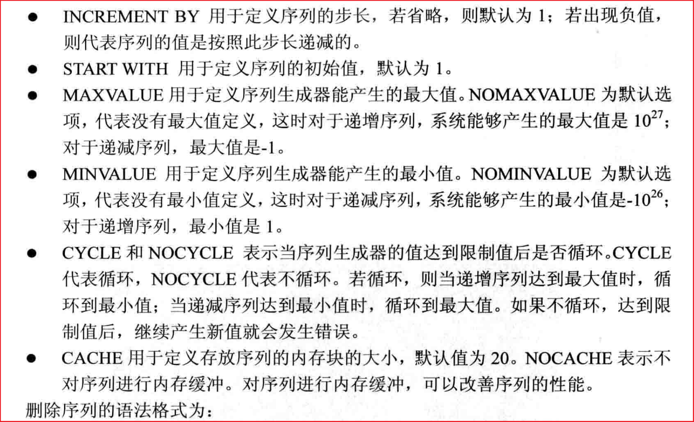

# Oracle

## 数据库的概念

DB 数据库（database）：存储数据的“仓库”。它保 存了一系列有组织的数据

DBMS 数据库管理系统（Database Management  System），数据库是通过DBMS创 建和操作的容器 

SQL  结构化查询语言（Structure Query Language）： 专门用来与数据库通信的语言


关系型数据库 MySQL、MariaDB、PostgreSQL、Microsoft  SQL Server、DB2、达梦、人大金仓 

非关系型数据库 Redis、MongoDB、CouchDB

## Oracle存储结构

Oracle数据库的存储结构分为逻辑存储结构和物理存储结构，这两种存 储结构既相互独立又相互联系


## Oracle体系


Oracle从大到下，分别是如下的结构：**数据库实例（数据库） -> 表空间 ->用户-> 数据段（表） -> 区 -> 块。**

Oracle中用户的所有数据都是存放在表空间中的，很多个用户可以共用一个表空间，也可以指定一个用户只用某一个表空间。

https://www.cnblogs.com/chanshuyi/p/3821023.html


https://www.cnblogs.com/zjhs/p/3147905.html

```
表空间是Oracle数据库中最大的逻辑结构。它提供了一套有效组织数据的方法，是组织数据和进行空间分配的逻辑结构，可以将表空间看作是数据库对象的容器。简单地说，表空间就是一个或多个数据文件（物理文件）的集合（逻辑文件），所有的数据对象都被逻辑地存放在指定的表空间中。
一个数据库通常包括SYSTEM、SYSAUX和TEMP三个默认表空间，一个或多个临时表空间，还有一个撤销表空间和几个应用程序专用的表空间。可以通过创建新的表空间来满足需求，创建时需要决定表空间的类型。
（1）系统表空间（System Tablespace）
系统表空间包括SYSTEM和SYSAUX表空间，系统表空间是所有数据库必须具备的，自动创建，一般存放Oracle的数据字典表及相应数据。
（2）永久表空间（Permanent Tablespace）
永久表空间用于保存永久性数据，如系统数据、应用系统数据。每个用户都会被分配一个永久表空间，以便保存其相关数据。除了撤销（Undo）表空间以外，相对于临时表空间而言，其他表空间都是永久表空间，如系统表空间。
（3）临时表空间（Temporary Tablespace）
由于Oracle工作时经常需要一些临时的磁盘空间，这些空间主要为查询时带有排序（如Group by、Order by等）的算法所用，当用完后就立即释放，对记录在磁盘区的信息不再使用，因此称为临时表空间。一般安装之后只有一个TEMP临时表空间。
```


https://www.cnblogs.com/hipandj/p/14754975.html

```

数据库（database）：物理操作系统文件或者磁盘的集合

Oracle实例：位于物理内存的数据结构，它由操作系统的多个后台进程和一个共享的内存池所组成，共享的内存可以被所有进程访问，Oracle用它们来管理数据库访问，用户如果要存取数据库（也就是硬盘上的文件）里的数据，必须通过Oracle实例才能完成，不能直接读取硬盘上的文件，实际上，Oracle实例就是平常所说的数据库服务，在任何时刻，一个实例只能与一个数据库关联，访问一个数据库，而同一个数据库可由多个实例访问

数据库：Oracle数据库是数据的物理存储，这就包括（数据文件ORA或者DBF，控制文件，联机日志，参数文件）其实ORACLE数据库的概念和其它数据库不一样，这里的数据库是一个操作系统纸哟一个库，可以看作Oracle就只有一个大数据库

数据库实例：一个oracle实例有一系列后台进程（background processes）和内存（memory structures）结构组成，一个数据库可以有n个实例

表空间：表空间就是一个用来管理存储逻辑概念，表空间只是和数据文件发生关系，数据文件是物理的，一个表空间可以包含多个数据文件，而一个数据文件只能隶属一个表空间

用户：用户是在实例下建立的，不同实例可以建相同名字的用户，oracle数据库建好后，要想在数据库里建表，必须先为数据库建立用户，并为用户指定表空间

表：有了数据库，表空间和用户，就可以用自定义的用户在自己的表空间中创建表了，有了表就可以存储数据了

数据文件：数据文件是数据库的无力存储单位，数据库的数据是存储在表空间里面的，真正是在某一个或者多个数据文件中，而一个表空间就可以由一个或者多个数据文件组成，一个数据文件智能属于一个表空间，一旦数据文件被加入到某个表空间后，就不能删除这个文件，如果要删除某个数据文件，只有删除其所属的表空间才行。

注意：表的数据，是由用户放入某一个表空间的，而这个表空间会随机把这些表数据放在一个或者多个数据文件中，由于Oracle的数据库不是普通的概念，oracle是由用户和表空间对数据进行管理和存放的，但是表不是由表空间去查询的，而是由用户去查的，因为不同用户可以在同一个表空间建立同一个名字的表，这里的区分就是用户了！！！
```

oracle 有三种身份如下：

```
sysdba:数据库管理员身份。权限：打开（关闭）数据库服务器、备份（恢复）数据库、日志功能、会话限制、数据库管理功能等。例如：sys用户必须用sysdba才能登陆，system用户用普通用户就可以登陆。    
sysoper:数据库操作员身份 。权限：打开（关闭）数据库服务器、备份（恢复）数据库、日志功能、会话限制。
normal:普通用户。权限：操作该用户下的数据对象和数据查询，默认的身份是normal用户。
```

## Oracle安装

教程：https://www.cnblogs.com/gengshao/p/10764248.html

## 创建数据库实例

Oracle数据库实例相当于MySQL的数据库，创建Oracle数据库实例后，使用sys账户登录创建表空间，再到表空间下创建用户。之后就可以使用创建的用户账号登录，创建表了。

创建表空间可以通过命令代码实现（比较复杂），也可通过“配置移植工具 -> Database Configuration Assistant”来创建，推荐使用工具创建。

教程：https://blog.csdn.net/qq_43222869/article/details/107067357

## 创建表空间 用户

创建表空间、用户时先要以sys账户登录(以sys账户登录pl/sql developer刚才创建的数据库)，再进行操作。

```sql
--步骤1：创建表空间,一般命名规则：指定名称_DATA（根据操作系统的不同注意修改路径，执行表空间脚本时，指定目录需提前创建好）
CREATE TABLESPACE TMYH_DATA
       DATAFILE 'D:\app\TXG\oradata\apexbmp\TMYH_DATA.ORA' SIZE 500M  AUTOEXTEND ON NEXT 102400K MAXSIZE UNLIMITED
       EXTENT MANAGEMENT LOCAL AUTOALLOCATE
       LOGGING
       ONLINE
       SEGMENT SPACE MANAGEMENT AUTO
/
--步骤2：创建临时表空间，一般规则：表空间名称_TEMP   
CREATE TEMPORARY TABLESPACE TMYH_DATA_TEMP 
       TEMPFILE 'D:\app\TXG\oradata\apexbmp\TMYH_DATA_TEMP.ORA' SIZE 30M AUTOEXTEND ON NEXT 10240K MAXSIZE UNLIMITED
       EXTENT MANAGEMENT LOCAL UNIFORM SIZE 1024K
       SEGMENT SPACE MANAGEMENT MANUAL
/
--步骤3：在步骤1创建的表空间下创建用户，并指向临时表空间     
CREATE USER txg IDENTIFIED BY 621799
    DEFAULT TABLESPACE TMYH_DATA
    TEMPORARY TABLESPACE TMYH_DATA_TEMP
    PROFILE DEFAULT
    ACCOUNT UNLOCK
/

-- 步骤4：给步骤3中的用户授权,因为测试环境，所以可直接给DBA权限

GRANT DBA TO txg WITH ADMIN OPTION
/
```

注意：racle 中sql语句注释用`--`，'--'之后有空格

**表空间的文件格式为ORA、DBF等**

创建oracle实例后，即使不创建表空间，也会有默认表空间https://blog.csdn.net/tianlesoftware/article/details/7084700

创建用户时不指定表空间，即在默认表空间下创建用户

```sql
create user atanx identified by 621799;  -- 默认表空间下创建atanx用户，密码为621799
```


## 删除表空间 用户

先删除用户，再删除表空间

```sql
-- 删除用户
drop user 用户名称 cascade;
```

```sql
-- 删除表空间与数据文件
drop tablespace 表空间名称 including contents and datafiles cascade constraint;
```

如：删除用户名成为test，表空间名称为test

```sql
-- 删除用户，及级联关系也删除掉
drop user test cascade;
```

```sql
-- 删除表空间，及对应的表空间文件也删除掉
drop tablespace test including contents and datafiles cascade constraint;
```

Oracle的数据文件都存储在oradata目录下，如D:\app\TXG\oradata目录

```
drop user txg cascade;
drop tablespace TMYH_DATA_TEMP including contents and datafiles cascade constraint;
drop tablespace TMYH_DATA including contents and datafiles cascade constraint;
```

## Oracle字符集

zhs16gbk是中文字符集，也就是适合在中国用，只能存储中文和英文字符，如果你存储韩文则显示为乱码（没有编码），而al32utf8是utf8字符集，u是unicode的意思，适合中文、韩语、日语等等不同的语言使用。那么为什么我们要在中国使用zhs16gbk存储中文呢？这是因为utf8存储中文的效率不如zhs16gbk，比如一个字“懂”，zhs16gbk采用2个字符存储，而al32utf8采用3-4个字符存储，这样效率就有了高低之分。

**服务端字符集查看**

```sql
select userenv('language') from dual;--服务端
```

```sql
SELECT * FROM Nls_Database_Parameters;--服务端
```

**客户端字符集查看**

```sql
select * from nls_instance_parameters；--客户端
```

https://blog.csdn.net/Dream19881003/article/details/6800056


Oracle需要服务端、客户端、bmp文件字符集一致才能保证数据不会乱码。可通过注册表修改客服端的字符集。

AMERICAN_AMERICA.ZHS16GBK和SIMPLIFIED CHINESE_CHINA.ZHS16GBK去别：都是ZHS16GBK字符集，数据都是一样的，但是 货币/时间 格式可能就不一样了。

## sqlplus连接Oracle

使用Oracle自带的客户端sqlplus，通过命令行连接oracel

```sql
-- sqlplus username/password 连接本机数据库
C:\Users\TXG>sqlplus 用户名; -- 连接本机默认数据库（orcl）

-- sqlplus usernaem/password@db 连接远程数据库
C:\Users\TXG>sqlplus IRAA/IRAA@218.66.59.169:41751/CRMDB -- 连接远程crmdb数据库
```

https://blog.csdn.net/weixin_42523907/article/details/114000428


## linux切换oracle用户

Linux切换oracle用户后，利用sqlplus连接数据库，可用sys账户登录，避免输账号密码

```
[root@oracle-11g ora11g]#su - oracle
Last login: Wed May 18 18:21:29 CST 2022 on pts/2
-bash-4.2$ sqlplus / as sysdba

SQL*Plus: Release 11.2.0.1.0 Production on Wed May 18 18:47:10 2022

Copyright (c) 1982, 2009, Oracle.  All rights reserved.


Connected to:
Oracle Database 11g Enterprise Edition Release 11.2.0.1.0 - 64bit Production
With the Partitioning, OLAP, Data Mining and Real Application Testing options

SQL> 

```

通过sqlplus连接到数据库后，在SQL>模式下输入sql语句结束后，输入分号后回车，语句才会执行，不输入分号，直接换行，不会执行语句

```
SQL> select sysdate from dual
  2  select sysdate from dual
  3  select sysdate from dual 
```

```
SQL> select sysdate from dual;   

SYSDATE
---------
18-MAY-22

```


## 导入SQL文件

```sql
SQL>@d:/user_info.sql;		#@后跟文件地址，输入分号后回车即可
```


## 命令窗口使用


> scott账户下建立的表，默认在USERS表空间下
>
> Oracle的数据类型即PL/SQL的数据类型

### 表

创建表

```sql
create table dep(
	id number(2),
	name varchar2(5),
	desp varchar2(512)
);
```

删除表

```sql
drop table user;
```

截断表

```sql
truncate table user;-- 删除表中的所有行,释放存储空间,无法回退
```

修改表名

```sql
rename student to stu;
```

表添加注释

```sql
comment on table stu is '学生信息表'；
-- 查看表注释
select * from user_tab_comments;
```


### 字段

增加字段

```sql
alter table dep add "number" number;
```

> 插入字符串数据，字符产两侧用英文单引号包裹
>
> 字段名为关键字，字段名用英文双引号包裹

删除字段

```sql
alter table dep drop(name);
或
alter table dep drop column name;
```

修改字段值类型

```sql
alter table dep modify("number" varchar(10));
alter table dep modify(sex varchar(10));
```

修改字段名字

```sql
alter table dep rename column "number" to nu;
```

> 注意：关键字column不能省略

给字段添加注释

```sql
comment on column departmet.desp is '部门描述';
select * from user_col_comments; -- 当前账户下说有表的字段的注释
select * from user_col_comments where table_name ='departmet';
```

### 约束

**约束的类型** 

> Primary key		->		主键 
>
> Foreign key		 ->		外键 
>
> Not null				->		非空的约束 
>
> Check 				  ->		  满足一定条件的约束
>
> Default				 ->		  默认值的约束
>
> Unique				 ->		  唯一值约束（可包含多个空值）
>

如果你不对约束进行命名的话，系统将用SYS_Cno来显示

**建表时添加约束**

```sql
create table student (
id number(3),
name varchar2(20) not null unique,--非空 唯一约束（多约束写法）
grade varchar2(10) default '一班'，
sex varchar2(8) check(sex in('男','女'))--性别只能填写‘男’或‘女’
 );
```

**建表后添加主键**

```sql
alter table student add constraint pK_stu primary key(id);
--注意：建表后添加主键约束，mysql中约束名可以省略，Oracle不可以省略
--建表时添加约束不需要写约束名，默认会以SYS_0XXXX的形式命名
```

**删除主键约束**

```sql
-- 方法一：
alter table student drop constraint pk_stu;
```

```sql
-- 方法二：
alter table student drop primary key cascade;
```

Oracle主键自增，无法像MySQL通过auto_increment实现，可借助序列触发器是实现，如下例子

```sql
-- 创建表      
create table book(       
	bookId varchar2(4) primary key,   
	name varchar2(20)         
);   
-- 创建序列      
create sequence book_seq start with 1 increment by 1;  
-- 创建触发器      
create or replace trigger book_trigger       
	before insert on book       
	for each row       
begin       
	select book_seq.nextval into :new.bookId from dual;  
end;   
-- 添加数据测试    
insert into book(name)  values ('cc');
insert into book(name)  values ('dd');
commit;
```

## SQL函数

分类：

- 单行函数：字符函数、数值函数、日期函数、转换函数、一般函数
- 多行函数：

单行函数是指对一行数据进行操作返回一条数据的函数，其结果集也只有一个数据。(一次操作一行)

多行函数分为接收多个输入，返回一个输出。（一次操作多行）

https://www.cnblogs.com/hlchacker/p/15109972.html

https://blog.csdn.net/lwz18642660013/article/details/84284232

### 字符函数

大小写：upper--字母全部大写、lower--字母全部小写、initcap--首字母大写，其余小写

```sql
 select lower('DGS') from dual;						--dsg
 select upper ('fdsgfd') from dual;					--FDSGFD
 select initcap('sssAfsGDG') from dual;				--Sssafsgdg
 
 select upper(atxu.name) from atxu ;
 select initcap(name) from atxu ;
```

字符操作：concat--字符串拼接 --||、substr--子字符串、length--字符串长度、instr--字符位置、lpad--左填充、rpad--右填充、replace--字符串替换、trim--删除字符串两边空格

注意：数据库中有关索引的操作都是从1开始，而非从0开始。

```sql
select concat('fds','fdsfs') from dual;				--fdsfdsfs --参数只能为2个
select 'fdg' || 'vdsfd' from dual;					--fdgvdsfd --连接数量为限制
select substr('0123456789',1) from dual;			--0123456789
select substr('0123456789',1,4) from dual;			--0123
select length('0123456789') from dual;				--10
select instr('012G456','G') from dual;				--4
select lpad('123',6,'%') from dual;					--%%%123  总共6个字符，从左边开始填充
select lpad('123',6) from dual;					    --123 
select lpad('123',2) from dual;					    --12
select rpad('123',7,'$') from dual;					--123$$$$ 总共7个字符，从右边开始填充
select replace('123456','23','adfds') from dual;	--1adfds456 所有的23替换为adfds
select trim('   12345   6   ') from dual;			--12345   6
```

### 日期函数

nonths_between---返回两个日期间的月数

add_months---向日期添加月数

next_day---指定日期的下个星期几的时间（若指定星期几已过，则是下周星期几的时间；若指定星期几未过，则是本周星期几的时间。指定星期几可以使用weekday、friday等英文全程或简写，也可以使用数字，1表示星期日，2代表星期一……）

last_day---指定日期所在月的最后一天

日期新增加n天，直接用日期+n

```sql
 select months_between(sysdate+31,sysdate) from dual;			--1
 select add_months(sysdate,3) from dual;						--2022/4/14 15:00:47
 select next_day(sysdate,2) from dual;							--2022/1/17 15:06:31 -- 1表示星期日，2代表星期一
 select next_day(sysdate,'friday') from atxu;					--2022/1/28 14:19:23
 select last_day(sysdate) from dual;							--2022/1/31 15:08:56
```

### 数值函数

round---按照指定位数四舍五入、trunc---按照指定位数截断数字、mod---返回余数

```sql
 select round(456.4685,3) from dual;				--456.469
 select trunc(456.4685,3) from dual;				--456.468
 select mod(100,30) from dual;						--10
```

### 类型转换函数

日期型-->字符型：to_char

数值型-->字符型：to_char

字符型-->日期型：to_date

字符型-->数值型：to_number

```sql
 select to_char(sysdate) from dual;												--14-JAN-22
 select to_char(123456) from dual;												--123456
 select to_date('2016-12-23 18:33:44' ,'yyyy-mm-dd hh24:mi:ss') from dual;		--2016/12/23 18:33:44
 select to_number('456.456') from dual;											--456.456
 select to_char('00112300'+1) from dual;										--112301
```

数字转字符串to_char() fm

https://www.cnblogs.com/steel-chen/p/6780151.html

> 有9的地方如果有数字就显示如果没有数字就不显示，有0的地方在没有数字的时候也会有０来占位
>
> select to_char(99.09556,'fm99999.0900'),to_char(99.09556,'fm00099.0900') from dual
> select to_char(99.09,'fm99999.099999'),to_char(99.09556,'fm00099.0900') from dual
> select to_char(99.09,'99999.099999'),to_char(99.09556,'00099.0900') from dual

### 一般函数

nvl---如果oracle第一个参数为空那么显示第二个参数的值，如果第一个参数的值不为空，则显示第一个参数本来的值。适用于数值型、字符型和日期型，数据类型必须保持一致

```sql
 select name，nvl(descpsx,'学士')from atxu;
```


注意以select开头的语句本质都是查询语句，是不会修改表的内容的，以上nvl、upper等函数亦是如此。

其他：

```sql
 -- 计算数量 结果字段名为counts
 select count(*) counts from atxu;
```

> NVL()函数是Oracle中的一个函数，NVL()函数的功能是实现空值的转换。
>
> ```sql
> 例如NVL(string1,replace_with)中：
> 当第一个参数（string1）为空时，返回第二个参数（replace_with）；
> 当第一个参数（string1)不为空时，则返回第一个参数（string1）。
> ```
>
> NVL()函数的第一个参数和第二个参数类型必须相同，或者可以由隐式转换得到。
>
> 拓展：
> NVL2()函数：Oracle/PLSQL中的一个函数,Oracle在NVL函数的功能上扩展，提供了NVL2函数。
>
> ```
> 如NVL2(E1,E2,E3)中：
> 当E1为NULL时，返回E3；当E1不为NULL时，返回E2。
> ```

## 条件表达式

### case when then end 表达式

```sql
select name,
       grade,
       case grade
         when '一班' then
          1
         when '二班' then
          2
         else
          3
       end gra
  from student;
----------------------------------------
select name,
       grade,
       case
         when grade = '一班' then
          1
         when grade = '二班' then
          2
         else
          3
       end lev
  from student;
```


### decode函数

与case when then end 表达式的区别是，decode函数只能有一个条件，不能是多条件

```sql
select name,grade ,decode(grade,'二班',1,0) from student;
    select id,name,decode(mod(id,2)+1, 0,'y','n') tag from atxu;-- decode列字段名为tag
```


https://blog.csdn.net/sdut406/article/details/82795585

## 集合运算

集合运算是用来把两个或多个查询的结果集做并、交、查的集合运算，包含集合运算的查询称为复合查询。

1、联合运算（[union](https://so.csdn.net/so/search?q=union&spm=1001.2101.3001.7020)） [去重 不排序]。联合运算是从两个查询返回除去重复值后的结果。

```sql
select sal,id,name  from student where sal>=1200
union
select sal,id,name from student ;
```

2、完全联合运算（union all）[不去重 升序]。完全联合运算是从每个查询返回包括所有重复的结果。
注意：使用union all会比union的速度快，因为省去了去掉重复记录的时间。

```sql
select sal,id,name  from student where sal>=1200
union all
select sal,id,name from student ;
```

3、相交运算（intersect） [不去重 升序]。相交运算返回多个查询中所有相同的行。

```sql
select sal,id,name  from student where sal>=1200
intersect
select sal,id,name from student<=2000 ;
```

4、相减运算（minus）[不去重 升序]。相减运算返回在第一个查询中而不在第二个查询中的行。
(第一个 SELECT 语句减第二个 SELECT 语句)。

```sql
select sal,id,name  from student where sal>=1200
minus
select sal,id,name from student where sal>=2000 ;
```

## Top n分析

rownum是oracle特有的一个关键字。对于基表，在insert记录时，oracle就按照insert的顺序，将rownum分配给每一行记录，因此在select一个基表的时候，rownum的排序是根据insert记录的顺序显示的。

```sql
select rownum ,s.* from student s;
select rownum r ,id,name from atxu;-- rownum列名为r,取别名
```


rownum是一个伪列，若作为查询条件只能是<或<=或者>=1的条件，其他>、>=、between等条件都不查到结果。利用rownum的<或<=条件即可查询到top n记录。

```sql
select * from student where rownum<5;
```


查询第2到第5条数据

```sql
--方法一：
select * from (select rownum rn,s.* from student s where rownum <=5) r where r.rn between 2 and 5;
```


```sql
--方法二：
select rownum,s. * from student s where rownum<=5
minus 
select rownum ,s.* from student s where rownum<=1;
```


insert语句：字符串和日期值必须用单引号括起来。

## rowid

oracle数据库的表中的每一行数据都有一个唯一的标识符，或者称为rowid，在oracle内部通常就是使用它来访问数据的。rowid需要 10个字节的存储空间，并用18个字符来显示。该值表明了该行在oracle数据库中的物理具体位置。可以在一个查询中使用rowid来表明查询结果中包含该值。

```sql
select id,name,rowid from emp;
```


## 视图 

一个或多个表中的数据逻辑子集，视图是存储在服务器上的SQL语句，视图本身不存储数据， 在执行时，从相关的表中取数据； 

视图(View)并不在数据库中实际存在，而是一种虚拟表，行和列数据来自定义视图的查询中使用的表，并且是在使用视图时动态生成的。即视图就是执行查询语句后所返回的结果集，所以在创建视图的时候，主要就是创建这条SQL查询语句。

视图（View）是从基表或其他视图中导出的表，它本身不独立存储在数据库中，即数据库中只存放视图的定义而不存放视图对应的数据，这些数据仍存放在导出视图的基表中，因此视图是一个虚表。

### 视图作用

- 限制对数据的访问；

- 使得复杂的查询简单化； 

- 提供数据的独立性；

- 同样数据的不同显示，用户可通过不同角度得到同样的数据

### 创建视图

```
create [or replace] view 视图名 as select查询语句;
```

```sql
--创建视图
create or replace view vw_stu as select s.name,s.sal from student s;
--从视图查询
select * from vw_stu;
```


默认scott没有创建视图的权限，可用sys账户登录后通过`SQL> grant create any view to scott;`语句给scott账户授权。

### 删除视图

```sql
drop view 视图名；
```

## 序列

数据表中的主键通常会用数字类型并且自增。mysql、sql server中的都可以使用工具创建表的时候很容易实现。但是oracle中没有设置自增的方法，一般情况我们会使用序列和触发器来实现主键自增的功能。

### 序列作用

1. 自动提供唯一的数值

2.  共享对象
3.  主要用于提供主键值
4.  将序列值装入内存可以提高访问效率

###  创建序列

```sql
CREATE SEQUENCE sequence  -- 创建序列名称
[INCREMENT BY n]  -- 序列步长为n, n是正数就递增,是负数就递减 默认是1
[START WITH n]    -- 开始的值,递增默认是minvalue(1) 递减是maxvalue(-1)
[{MAXVALUE n | NOMAXVALUE}] -- 最大值
[{MINVALUE n | NOMINVALUE}] -- 最小值
[{CYCLE | NOCYCLE}] -- 循环/不循环   缺省默认不循环 
-- 如果循环，对于递增序列达到最大值时，循环到最小值(再次从最小值开始，注意是minvalue而不是start with值，没有设置minvalue,则从1开始循环);
-- 如果循环，对于递减序列达到最小值时，循环到最大值(再次从最大值开始，注意是maxvalue而不是start with值)。
-- 如果不循环，达到限制值后，继续产生新值就会发生错误。
[{CACHE n | NOCACHE}];-- 分配并存入到内存中/不放入内存中。对于cycle序列，必须指定cache,大小也有限制
```

MAXVALUE默认值：NOMAXVALUE，系统能够产生最大值：

​			递增序列：10的27次幂

​			递减序列：-1

MINVALUE默认值：NOMINVALUE，系统能够产生最小值：

​			递增序列：1

​			递减序列：- 10的26次幂

```sql
create  sequence seq_1
increment by 1 start with 3 maxvalue 10 minvalue 2 cycle cache 6
-- seq_1序列，从3开始以步长1增长，最大值为10，达到最大值后从2开始循环。
```

```sql
create  sequence seq_2
increment by -1 start with 10 maxvalue 12 minvalue -3 cycle cache 6
-- seq_2序列，从10开始以步长-1递减，最小值为-3，达到最小值后从12开始循环。
```

> **递增序列：maxvalue指定序列达到最大值，默认为 10的27次幂， minvalue指定序列开始循环的值，默认为 1**
>
> **递减序列：minvalue 指定序列达到最小值，默认为- 10的26次幂，maxvalue指定序列开始循环的值，默认为-1**



```
NEXTVAL 产生序列第一个值、下一个值
CURRVAL 获取序列的当前值
```

https://www.jianshu.com/p/a4eb37adaf2b

https://blog.csdn.net/ethan_10/article/details/80690003

```sql
eg:
create sequence seq_stu increment by 2 nocycle;
select seq_stu.nextval  from dual;
select seq_stu.currval from dual;
```

### 使用序列

```sql
create table cdpt(
id number(6),
name varchar2(30),
constraint pk_id primary key(id)
);

 
Create sequence seq_cdpt
Increment by 1
Start with 1
Maxvalue 999999
Minvalue 1
Nocycle
nocache
 
insert into cdpt values(seq_cdpt.nextval,’feffefe’);
commit;
select * from cdpt;
```

https://www.cnblogs.com/warrior4236/p/5866214.html

### 删除序列

```sql
drop sequence 序列名；
```

## 索引

https://www.cnblogs.com/wishyouhappy/p/3681771.html

### 概述

 索引是一个数据库对象，象表一样，存储在数据库中，你可以从数 据字典user_indexes中查询到用户的相关索引；

有效地使用索引，能够提高数据的访问速度，有效地减少磁盘的 I/O； 

 索引一旦建立以后，由数据库自动的维护，不需要用户的干预；

 如果对表的数据进行频繁的操作，需要定时对索引重建； 

 索引依赖于表，如果表被删除，那么索引也将被删除。

索引可以使查询表的速度提升，但会降低操作表的速度，因为进行增删改操作时数据库会同时自动维护更新索引，使得操作速度变慢，同时索引像表一样占据存储空间。

### **索引原理**

> 1、若没有索引，搜索某个记录时（例如查找name='wish'）需要搜索所有的记录，因为不能保证只有一个wish，必须全部搜索一遍
>
> 2、若在name上建立索引，oracle会对全表进行一次搜索，将每条记录的name值哪找升序排列，然后构建索引条目（name和rowid），存储到索引段中，查询name为wish时即可直接查找对应地方
>
> 3、创建了索引并不一定就会使用，oracle自动统计表的信息后，决定是否使用索引，表中数据很少时使用全表扫描速度已经很快，没有必要使用索引

### **索引类型**

主键索引：是一种特殊的唯一索引，不允许有空值，Oracle默认自动利用主键创建索引，主键索引属于唯一索引。

唯一索引：索引列中的值必须是唯一的，但是允许为空值，保证数据是唯一的； 非唯一的索引，有效提高速度，如单列索引、多列索引等等。

普通索引：没有什么限制，允许在定义索引的列中插入重复值和空值，纯粹为了查询数据更快一 点。

单列索引：一个索引只包含单个列，但一个表中可以有多个单列索引。

组合索引，有多个列组合起来作为一个索引。（查询中只有当组合索引第一个列被where子句引用时，优化器才会使用该索引，即至少要包含组合索引的第一列）

### **创建索引**

```sql
CREATE [UNIQUE] | [BITMAP] INDEX index_name  --unique表示唯一索引
ON table_name([column1 [ASC|DESC],column2    --bitmap，创建位图索引
[ASC|DESC],…] | [express])
[TABLESPACE tablespace_name]
[PCTFREE n1]                                 --指定索引在数据块中空闲空间
[STORAGE (INITIAL n2)]
[NOLOGGING]                                  --表示创建和重建索引时允许对表做DML操作，默认情况下不应该使用
[NOLINE]
[NOSORT];                                    --表示创建索引时不进行排序，默认不适用，如果数据已经是按照该索引顺序排列的可以使用
```

### **修改索引**

1、重命名索引

```sql
alter index index_sno rename to bitmap_index;
```

2、合并索引（表使用一段时间后在索引中会产生碎片，此时索引效率会降低，可以选择重建索引或者合并索引,合并索引方式更好些，无需额外存储空间，代价较低）

```
alter index index_sno coalesce;
```

3、重建索引

```sql
方式一：删除原来的索引，重新建立索引
方式二：
	alter index index_sno rebuild;
```

### **删除索引**

```sql
drop index index_sno;
```

### **查看索引**

```sql
-- eg:    
create index index_sno on student('name');
select * from all_indexes where table_name='student';-- 当前用户下的表的索引
select * from user_indexes where table_name='student';-- 所有用户表的索引
```

## 同义词

同义词是现有对象的一个别名，是为了简化SQL语句，亦或者是隐藏对象的名称和所有者，提供对象的公共访问等等

- 易于指向其他用户所属表
- 缩短对象的名字

创建同义词

```sql
create [public] synonym  同义词名 for object名；

--public 公有同义词，使同义词可以由所有用户访问;
--无public 私有同义词 私有同义词的名字不能与同用户的其他对象同名（只能在其模式内访问，不能与模式内对象同名）
```

同义词的创建需要有创建同义词的权利。

```sql
grant create  (public) synonym to 用户名；
```

删除同义词

```sql
drop synonym 同义词名；
drop public synonym 同义词名；
```

Oracle同义词的作用

> 1、 多用户协同开发中，可以屏蔽对象的名字及其持有者。如果没有同义词，当操作其他用户的表时，必须通过user名.object名的形式，采用了Oracle同义词之后就可以隐蔽掉user名。
>
> 当然这里要注意的是：public同义词只是为数据库对象定义了一个公共的别名，其他用户能否通过这个别名访问这个数据库对象，还要看是否已经为这个用户授权。
>
> 2、为用户简化sql语句。如果自己建的表的名字很长，可以为这个表创建一个Oracle同义词来简化sql开发。
>
> 3、为分布式数据库的远程对象提供位置透明性。

## Oracle错误

```
ORA-12523: TNS:listener could not find instance appropriate for the client connection
```

可能是有多个数据库在运行所致，关闭不需要的数据库服务


## Oracle其他

### group by

> # [ORA-00937: not a single-group group function](https://www.cnblogs.com/gw666/p/10306202.html)
>
> 有时候查询会遇到如下错误
>
> SCOTT@PROD> select deptno,sum(sal) from emp;
>
> select deptno,sum(sal) from emp
>
> ERROR at line 1:
>
> ORA-00937: not a single-group group function
>
> 
>
> **原因：这句话不会运行，因为deptno要求每行都显示，而sum要求统计后再显示，违反了原则。在有组函数的select中，不是组函数的列，一定要放在group by子句中。**
>
> 
>
> 正确语句：select deptno,sum(sal) from emp group by deptno;

```
Oracle中group by用法

not a GROUP BY expression异常产生是因为group by用法的问题。
在使用group by 时，有一个规则需要遵守，即出现在select列表中的字段，如果没有在组函数中，那么必须出现在group by子句中，(select中的字段不可以单独出现，必须出现在group语句中或者在组函数中)否则就会出现错误。

在select语句中可以使用group by子句将行划分成较小的组，一旦使用分组后select操作的对象变为各个分组后的数据，使用聚组函数返回的是每一个组的汇总信息。

使用having子句限制返回的结果集。group by子句可以将查询结果分组，并返回行的汇总信息Oracle按照group by子句中指定的表达式的值分组查询结果。

在带有group by 子句的查询语句中，在select 列表中指定的列要么是group by 子句中指定的列，要么包含聚组函数 select max(sal),job emp group by job; (注意max(sal),job的job并非一定要出现，但有意义) 查询语句的select 和group by ,having 子句是聚组函数唯一出现的地方，在where 子句中不能使用聚组函数。 select deptno,sum(sal) from emp where sal>1200 group by deptno having sum(sal)>8500 order by deptno; 当在gropu by 子句中使用having 子句时，查询结果中只返回满足having条件的组。在一个sql语句中可以有where子句和having子句。having 与where 子句类似，均用于设置限定条件 where 子句的作用是在对查询结果进行分组前，将不符合where条件的行去掉，即在分组之前过滤据，条件中不能包含聚合函数，使用where条件显示特定的行。
having 子句的作用是筛选满足条件的组，即在分组之后过滤数据，条件中经常包含聚合函数，使用having 条件显示特定的组，也可以使用多个分组标准进行分组。

使用order by排序时order by子句置于group by 之后 并且 order by 子句的排序标准不能出现在select查询之外的列。

查询每个部门的每种职位的雇员数
select deptno,job,count(*) from emp group by deptno,job

/******************************************************

总结:
在使用group by 时，有一个规则需要遵守，即出现在select列表中的字段，如果没有在组函数中，那么必须出现在group by 子句中(select中的字段不可以单独出现，必须出现在group语句中或者在组函数中)
```

### wm_concat()

oracle中类似mysql中group_concat()作用函数：

- 通用：wm_concat()

- oracle 11g：select 分组列，listagg(合并显示列 ,  ' , ') within group(order by 分组列) from talbel group by 分组列


```
eg:

select GWSZBM "岗位所在部门ID" ,to_char(wm_concat(ZWMC) )"岗位名称"  from position  GROUP by GWSZBM ;

SELECT GWSZBM,listagg (ZWMC, ',') WITHIN GROUP (ORDER BY GWSZBM) "职位名称" FROM POSITION GROUP BY GWSZBM
```

```
oracle 中和mysql的group_concat有同样作用的写法
所有版本的oracle都可以使用select wm_concat(name) as name from user;
但如果是oracle11g，使用select listagg(name, ',') within group( order by name) as name from user order by name;
效率更高，官方也更推荐这种写法。

注意：wm_concat 运行后的返回结果根据oracle的版本不同而会字段类型不同，在oracle11g中返回clob型，在oracle10g中返回varchar型

通用版本语句：select qlrid,to_char(wm_concat(qlr)) as qlr,to_char(wm_concat(qlrzjh)) as qlrzjh from qlr t group by qlrid;
```

联表插叙分组统计

```sql
SELECT GWSZBM "岗位所在部门ID", XQRS "需求人数", name "部门名称"  FROM position, lbOrganization  WHERE POSITION.GWSZBM = LBORGANIZATION.ID;


select GWSZBM "岗位所在部门ID" ,SUM(XQRS) "需求人数",name "部门名称"  from position ,lbOrganization WHERE POSITION.GWSZBM=LBORGANIZATION.ID 
group by GWSZBM,NAME  ;
```


https://zhidao.baidu.com/question/2141413140122308548.html

# SQL

不同的SQL类型有不同的名称。例如，Microsoft SQL Server产品中的SQL称为Transact-SQL、Oracle产品中的SQL称为PL/SQL，PL/SQL即Procedural Language/SQL。

SQL是一个结构化的的查询语言（Structured Query Language ），不仅仅适用于ORACLE数据库，再其它的数据也适用。在 Oracle 开发中，客户端把 SQL 语句发送给服务器，服务器对 SQL 语句进行编译、执行，把执行的结果返回给客户端。常用的SQL语句大致可以分为五类：

> 数据定义语言（DDL），包括 CREATE（创建）命令、 ALTER（修改）命令、 DROP（删除）命令等。
>
> 数据操纵语言（DML），包括 INSERT（插入）命令、 UPDATE（更新）命令、 DELETE（删除）命令、 SELECT … FOR UPDATE（查询）等。
>
> 数据查询语言（DQL），包括基本查询语句、 Order By 子句、 Group By 子句等。
>
> 事务控制语言（TCL），包括 COMMIT（提交）命令、 SAVEPOINT（保存点）命令、ROLLBACK（回滚）命令。     
>
> 数据控制语言（DCL）， GRANT（授权）命令、 REVOKE（撤销）命令。

授予对象权限 

```SQL
grant select on emp to Amy [with grant option]; 
```

撤销对象权限

```SQL
 revoke select on emp from Amy;
```

# PL/SQL简介

我们之前学习过SQL语句是用来访问和操作关系型数据库的一种通用语言，不仅仅是在Oracle数据库可以使用，在其它关系型数据库也适用。但是这个SQL语言有一个弊端就是只能查询既得结果，不能做过程化的开发，因此，有时候SQL语言满足不了程序上复杂化的开发。所以，Oracle中的PL/SQL语言正是为了解决这一问题。

PL/SQL语言属于第三代语言（3GL），它是Oracle公司在标准SQL语言的基础上进行扩展，可以在数据库上进行设计编程的一种过程化的语言，类似程序语言JAVA一样可以实现逻辑判断、条件循环、异常处理等细节操作。因此，它和SQL语言有很多的关联性，又可以实现SQL语句一些很难办到的复杂性问题。总体来说它具有以下特点：

- 1、支持SQL语句命令和操作。
- 2、支持SQL中的数据类型，还扩展了一些自己特有的类型，如：type类型。
- 3、支持SQL中的内置函数和运算符。
- 4、PL/SQL支持事物，对写好的PL/SQL程序（过程、函数、包）可以进行权限的控制。
- 5、PL/SQL编写的数据库脚本是保留在Oracle服务器中的。

# PL/SQL块

PL/SQL块是PL/SQL程序的最基本的单位，它由声明部分、执行部分和异常处理三部分组成。其中声明部分由declare开始，执行部分由begin开始，异常处理部分由exception开始。其中执行部分是必须，即begin..end之间必须要有执行部分。其他两部分可以根据实际情况选择。

## **PL/SQL块语法结构**

```sql
[DECLARE]
声明语句...
BEGIN
执行语句...
[EXCEPTION]
异常处理语句...
END;
```

## 语法解析

1、声明部分是可选部分，由DECLARE开始，声明执行部分所需的变量或者常量。假如，没有用到变量或者常量可以省略。

2、执行部分是由BEGIN开始，END结束。是PL/SQL块语句的核心部分，所有的可执行的PL/SQL语句和操作变量都放在该部分。是必选的部分，不能省略。

3、异常部分是由EXCEPTION开始。主要处理执行部分过程中的执行语句或者赋值操作出现错误时，就会进入该部分。是PL/SQL程序的异常处理部分，不是必须的。

------

案例1、我们通过简单的PL/SQL语句块输出学生信息表中的某一位学生的基本信息。代码如下：

```plsql
declare
xsjbxx varchar2(50);
begin
  select '姓名:' ||t.stuname || ' 学号:' || t.stuid || ' 年龄：' || t.age
   into xsjbxx
    from stuinfo t
   where t.stuname = '张三';
  dbms_output.put_line(xsjbxx);
exception
  when no_data_found  then
     dbms_output.put_line('该学生在学生信息表中找不到');
end;
```

```SQL
DECLARE
     XSNAME VARCHAR2(20);
     XSINFO VARCHAR2(250);
BEGIN
  SELECT A.NAME || A.HOBBY || A.DESCPSX INTO XSINFO 
  FROM ATXU A WHERE ID=1;
  SELECT NAME INTO XSNAME FROM ATXU 
  WHERE ID=2;
  DBMS_OUTPUT.PUT_LINE(XSINFO);
  DBMS_OUTPUT.PUT_LINE(XSNAME);
EXCEPTION
  WHEN NO_DATA_FOUND THEN
    DBMS_OUTPUT.PUT_LINE('没有数据发现');
END;
-------------
select……into……from……是赋值语句
```

注：pl/sql块的运行结果在"输出"面板显示，与运行后结果显示位置有所不同。

## PL/SQL块分类

匿名块：动态构造，只能执行一次；

子程序：存储在数据库中的存储过程、函数及包等。当在数据库 上建立好后可以在其它程序中调用它们；

触发器：当数据库发生操作时，会触发一些事件，从而自动执行 相应的程序

# PL/SQL数据类型

PL/SQL数据类型可以分为标量数据类型和引用数据类型两大部分。

## 标量数据类型

标量数据类型的变量只有一个值，且内部没有分量。标量数据类型包括数字型，字符型，日期型和布尔型。这些类型有的是标准SQL 中有的数据类型，有的是 PL/SQL 自身附加的数据类型。

**1、数值类型：**主要用来存储数值类型的数据。

**`NUMBER：`**可以存储小数和整数类型数据，格式为NUMBER(p,s)，其中p表示的是精度（既是位数的长度），s表示的是小数点后的位数。例如：number（3,2）表示的范围-9.99—9.99。

```sql
DECLARE
      I NUMBER(5);	-- 整数，总长度不能超过5，赋值为小数，小数自动四舍五入转换成整数
      I NUMBER(5,0);-- 整数，总长度不能超过5
      I NUMBER;		-- 整数或小数，没有总长度和小数位数限制
      I NUMBER(5,1);-- 一位小数，总长度不能超过5，小数位数多于1位的，自动四舍五入
BEGIN
      SELECT 9999.4  INTO I FROM DUAL;
      DBMS_OUTPUT.PUT_LINE(I); -- 结果：9999
EXCEPTION
      WHEN NO_DATA_FOUND 
       THEN DBMS_OUTPUT.PUT_LINE('发生异常');
END;
```

**`BINARY_INTEGER：`**主要用来存储整数类型，它们存储整数的范围都是-(2^31)...(2^31-1)。发生内存溢出的时候会给它分配一个number类型的数据，

**`PLS_INTEGER：`**主要用来存储整数类型，它们存储整数的范围都是-(2^31)...(2^31-1)。发生内存溢出的时候会直接抛异常报错；

**`SIMPLE_INTEGER：`**主要用来存储整数类型，它们存储整数的范围都是-(2^31)...(2^31-1)。是PLS_INTEGER的一个子类型，它不允许存在NULL值数据。

**2、字符类型：**用来存储单个字符或字符串。主要有的类型有如下类型：

**`CHAR：`** **固定**长度的字符串，CHAR(n)：默认长度是1，当字符串长度小于n时，会自动右补空格，所以在取数据的时候要注意补空格。

**`VARCHAR2：`**该类型存储**可变**长度的字符串VARCHAR2(n)，最大存储的长度为**4000**个字节。当字符串长度小于n时，不会补齐空格。

**`LONG：`**该类型存储**可变**长度的字符串，不同于VARCAHR2类型，它对于字段的存储长度可达2G，但是作为PL/SQL变量，和VARCHAR2一样受到限制，只能存储最大**32767**字节。

```sql
DECLARE
      --I CHAR;		-- 正确写法，允许缺省长度，缺省长度则长度为1
      --I CHAR(10); -- 正确写法
      --I VARCHAR2;	-- 错误写法，varchar2必须指定长度，否则编译无法通过
      I VARCHAR2(2);-- 正确写法
      --I LONG;		-- 正确写法,字符串长度范围为0-32767
      --I LONG(200);-- 正确写法
BEGIN
      SELECT 'A'  INTO I FROM DUAL;
      DBMS_OUTPUT.PUT_LINE(I);
EXCEPTION
      WHEN NO_DATA_FOUND 
       THEN DBMS_OUTPUT.PUT_LINE('发生异常');
END;
```

**3、时间类型：**主要和SQL中的时间类型一致，有**`DATE`**和**`TIMESTAMP`**两种时间类型。

**`DATE`**:月 日 年

**`TIMESTAMP`**：月 日 年  时 分 秒

**4、布尔类型：**PL/SQL程序中的逻辑判断的值有：**`TRUE`**、**`FALSE`**、**`NULL`**值。

布尔类型不能直接使用dbms_output.put_line()打印输出，可借助函数转化为数值型，

true----1

false----0

null----空，什么也不打印

```sql
dbms_output.put_line(sys.diutil.bool_to_int(null));
```


**变量声明**

在语句块的声明部分对变量声明，声明一个变量的语法是：

```sql
 变量名 [ constant ] 类型 [ not null ] [:=初始值] -- 若有not null约束必须要赋初值
 eg:
 age number not null :=123; -- not null，必须赋初值
 heght number;-- 可以不用赋初值
```

## 引用数据类型

引用数据类型是PL/SQL程序语言特有的数据类型，是用来引用数据库当中的某一行或者某个字段作为数据类型的声明。其中有两种引用类型：%TYPE和%ROWTYPE。

**1、%TYPE类型：**

引用数据库中表的某列的类型作为某变量的数据类型，也可以直接引用PL/SQL程序中某个变量作为新变量的数据类型。下面我们通过一个案例做下测试：

```
declare
ls_stuname stuinfo.stuname%type;--通过学生姓名字段声明ls_stuname  --注意不能用别名.字段，要用表名.字段
begin
  select t.stuname into ls_stuname
    from student.stuinfo t
   where t.stuid = 'SC201801006';   
  dbms_output.put_line(ls_stuname);
exception
  when no_data_found  then
     dbms_output.put_line('该学生在学生信息表中找不到');
end;
```

**2、% ROWTYPE 类型：**

%ROWTYPE类型是PL/SQL程序引用数据库表中的一行作为数据类型，即 RECORD 类型（记录类型）表示一条数据记录。类似java程序当中的对象的实例。可以使用“.”来访问记录中的属性。下面我们通过实例来做下测试：

```
declare
ls_stuinfo stuinfo%rowtype;
xsjbxx varchar2(50);
begin
  select t.* into ls_stuinfo
    from stuinfo t
   where t.stuid='SC201801006';
   xsjbxx:='姓名:' ||ls_stuinfo.stuname || ' 学号:' ||ls_stuinfo.stuid || ' 年龄：' ||ls_stuinfo.age;
  dbms_output.put_line(xsjbxx);--直接输出xsjbxx，好像不太行，要以xsjbxx.字段输出
exception
  when no_data_found  then
     dbms_output.put_line('该学生在学生信息表中找不到');
end;
```

> %TYPE是定义一个变量，其数据类型与已经定义的某个数据变量的类型相同，或者与数据库表的某个列的数据类型相同。
>
> 
>
> %ROWTYPE返回的是一个记录类型，其数据类型和数据库表的数据结构一致。
>
> 　声明的变量对应于数据库表或视图中列的集合。
>
> 　在%ROWTYPE之前加上数据库表名。
>
> 　记录内字段名和数据类型与参照表或视图中的列相同。
>
> %ROWTYPE有如下优点：
>
> 　可以不必知道数据库中列的数量和类型。
>
> 　在运行期间，数据库中列的数量和类型可能发生变化，但是却不用修改代码。
>
> 　在SELECT语句中使用该属性可以有效地检索表中的行。

定义记录类型变量

```sql
declare 
  type via is record(--记录类型变量定义
       sname student.name%type,
       sgrade student.grade%type);
  vstu via;--使用定义的记录类型变量
begin 
    select name,grade into vstu from student   where name='张三' ;
    dbms_output.put_line('姓名：' || vstu.sname || '班级：' || vstu.sgrade);
exception
    when others then
      null;
end;

--执行结果:姓名：张三班级：一班
```

```sql
declare
      r student%rowtype;
begin 
  select s.*  into r from student s where s.id=100;
  dbms_output.put_line(r.name || '--' || r.grade || '--' || r.sex || '--' || r."desc" || '--' || r.sal );--desc为关键字，需要加双引号
  -- dbms_output.put_line(r);--这种输出写法错误，要按上一行写
exception
  when others then
  dbms_output.put_line('输出据出错');
end;
```

# PL/SQL标识符

建议使用的变量命名方法

| 标识符   | 命名原则        | 例              |
| -------- | --------------- | --------------- |
| 程序变量 | V_name          | V_id            |
| 程序常量 | C_constant      | C_student_name  |
| 游标变量 | Name_cursor     | Emp_cursor      |
| 异常标识 | E_name          | E_too_many_rows |
| 表类型   | Name_table_type | Emp_record_type |
| 表       | Name_table      | Emp             |
| 记录类型 | Name_type       | Emp_record      |
| 参数     | P_name          | P_id            |

# PL/SQL运算符

**一般运算符**

| 运算符 |    意义    |
| :----: | :--------: |
|   +    |    加号    |
|   -    |    减号    |
|   *    |    乘号    |
|   /    |    除号    |
|   :=   |   赋值号   |
|  \|\|  |   连接符   |
|   ..   | 范围运算符 |

**逻辑运算符**

|     运算符      |            意义             |
| :-------------: | :-------------------------: |
|     IS NULL     |            空值             |
| BETWEEN     AND |        介于两者之间         |
|       IN        |      在一个值列表之中       |
|       AND       |           逻辑与            |
|       OR        |           逻辑或            |
|       NOT       | 取反，如IS NOT NULL, NOT IN |

**关系运算符**

| 运算符               | 描述                                                         | 示例                   |
| -------------------- | ------------------------------------------------------------ | ---------------------- |
| =                    | 检查两个操作数的值是否相等，如果是的话那么条件为真。         | (A = B) 结果为 false.  |
| != <br /><> <br />~= | 检查两个操作数的值是否相等，如果值不相等，则条件变为真。     | (A != B) 结果为 true.  |
| >                    | 检查左边的操作数的值是否大于右操作数的值，如果是的话那么条件为真。 | (A > B) 结果为 false.  |
| <                    | 检查左边的操作数的值是否小于右操作数的值，如果是的话那么条件为真。 | (A < B) 结果为 true.   |
| >=                   | 检查左边的操作数的值是否大于或等于右操作数的值，如果是的话那么条件为真。 | (A >= B) 结果为 false. |
| <=                   | 检查左边的操作数的值是否小于或等于右操作数的值，如果是的话那么条件为真。 | (A <= B) 结果为 true.  |

**变量赋值**

```sql
variable := expression ;
--注意：
'' + 数字=''				   --数字+空字符串结果为空字符串
null || 字符串=字符串;		--不能用+
```

```sql
declare
  b varchar2(100) :='fdsf';
  n number :=12;
begin
  dbms_output.put_line(n + '');
end;
---------------------------------------
declare
  b varchar2(100) :='fdsf';
  n number :=12;
begin
  dbms_output.put_line(b || null);
end;
```

# PL/SQL变量作用范围

PL/SQL的变量作用范围特点是： 

- 变量的作用范围是在所引用的程序单元（块、子程序、包）内。即`从声明变量开始到该块的结束`

- 一个变量（标识）只能在所引用的块内是可见的

- 当一个变量超出了作用范围，PL/SQL引擎就释放用来存放该变量的空间 （因为它可能不用了） 

- 在子块中重新定义该变量后，它的作用仅在该块内


# PL/SQL插入 删除

插入

```sql
DECLARE
    v_ename  VARCHAR2(30) := 'BILL';
    v_sal    NUMBER(7, 2) := 1234.56;
    v_deptno NUMBER(2) := 10;
    v_empno  NUMBER(4) := 8888;
BEGIN
    INSERT INTO emp
        (empno, ename, job, sal, deptno, hiredate)
    VALUES
        (v_empno, v_ename, 'MANAGER', v_sal, v_deptno, '20010101');
        commit;--注意需要提交事务
END;
```

删除

```sql
DECLARE
    v_empno NUMBER(4) := 8888;
BEGIN
    DELETE FROM emp WHERE empno = v_empno;
    COMMIT;
END;
```

# PL/SQL流程控制语句 

PL/SQL的流程控制语句, 包括如下三类 ： 

- 条件语句: IF 语句 
- 循环语句: LOOP语句, EXIT语句
- 顺序语句: GOTO语句, NULL语句

## **IF语句**

```sql
IF <布尔表达式> THEN
	PL/SQL 和 SQL语句
END IF;
---------------------------------------------------------
IF <布尔表达式> THEN
	PL/SQL 和 SQL语句
ELSE
	其它语句
END IF;
---------------------------------------------------------
IF <布尔表达式> THEN
	PL/SQL 和 SQL语句
ELSIF < 其它布尔表达式> THEN
	其它语句
ELSIF < 其它布尔表达式> THEN
	其它语句
	…… ……
ELSE
	其它语句
END IF;
```

## **CASE条件语句**

**搜索式case语句**

```sql
CASE selector
	WHEN expression1 THEN result1
	WHEN expression2 THEN result2
	WHEN expressionN THEN resultN
	[ ELSE resultN+1]
END CASE;
其中：ELSE子句是可选的，但是当检测表达式与任何一个检测值都不匹配时，PL/SQL会产生预定义错误CASE_NOT_FOUND，其错误号是ORA-6592
```

eg：

```sql
--case
declare
  age number := 18;
begin
  case age
    when 11 then
      dbms_output.put_line('好');
    when 12 then
      dbms_output.put_line('很好');
    when 13 then
      dbms_output.put_line('非常好');
    else
      dbms_output.put_line('这不好');
  end case;
end;
```

**case表达式**

```sql
v_element:= CASE xx 
				WHEN  x THEN y
				ELSE yy
             END; -- 注意没有case
-----------------------------------
select  CASE xx
			WHEN x THEN y
			ELSE YY
		END [别名] -- 注意没有case和后面的分号，别名是可选项
from xxx;
```

eg:

```sql
select id, name, hobby, descpsx, case
                                     when mod(id, 2) = 0 then
                                          1
                                     else
										  0
									 end tag -- tag为别名，可以省略
from atxu;
-----------------------------------------------------------------------------------------
select id,name,hobby,descpsx, case id
       								when 1 then
       									1
       								else
       									0
       								end tag
from atxu;
```

https://www.cnblogs.com/Azhu/archive/2012/07/19/2600006.html

## **循环语句**

```sql
LOOP
	要执行的语句;
	EXIT WHEN <条件语句> ; /*条件满足，退出循环语句*/
END LOOP; 
-- 其中：EXIT WHEN 子句是必须的，否则循环将无法停止
---------------------------------------------------------
WHILE <布尔表达式> LOOP
	要执行的语句;
END LOOP;
-- 其中：循环语句执行的顺序是先判断<布尔表达式>的真假，如果为真则循环执行，否则退出循环。在WHILE循环语句中仍然可以使用EXIT或EXIT WHEN子句
---------------------------------------------------------
FOR 循环计数器 IN [ REVERSE ] 下限 .. 上限 LOOP
	要执行的语句;
END LOOP;
-- 其中：每循环一次，循环变量自动加1；使用关键字REVERSE，循环变量自动减1，跟在IN REVERSE 后面的数字必须是从小到大的顺序，但不一定是整数，可以是能够转换成整数的变量或表达式；可以使用EXIT或者EXIT WHEN子句退出循环。
```

eg：

```sql
---------------------------------------------------- 循环
declare
  idx number := 5;
begin
  loop
    dbms_output.put_line(idx);
    idx := idx - 1;
    exit when idx <= 0;
  end loop;
end;
---------------------------------------------------- 循环
declare
  idx number :=80;
begin
  while idx > 0 loop
    dbms_output.put_line(idx);
    idx := idx - 1;
  end loop;
end;
---------------------------------------------------- 循环
begin
  for i in 1 .. 10 loop
    dbms_output.put_line(i);
  end loop;
end;
---------------------------------------------------- 循环
begin
  for i in reverse 1 .. 6 loop
    dbms_output.put_line(i);
    exit when i<5;
  end loop;
end;
```

## 标号和GOTO语句

GOTO语句是无条件跳转到指定的标号位置。

GOTO语句的一般形式：

```sql
 GOTO label;
 /*标号是用<< >>括起来的标识符，如<<lebel>> */  
```

eg：

```sql
-- goto
declare
  i number := 8;
begin
  <<gototag>>
  dbms_output.put_line(i);
  i := i - 1;
  if i > 5 then
    goto gototag;-- 当i>5持续输出i
  end if;
end;
-- 结果:8  7  6
```

利用GOTO可实现类似Java中continue的效果，可以实现循环

## NULL 语句

在PL/SQL 程序中，可以用 null 语句来说明“不用做任何事情”的意思， 相当于一个占位符，可以使某些语句变得有意义，提高程序的可读性 

```sql
DECLARE ……
BEGIN 
	IF v_num IS NULL THEN 
		GOTO print1;
	END IF;
		NULL; -- 不需要处理任何数据。 
END;
```

# 游标

## 游标的概念 

在 PL/SQL 程序中，对于处理多行记录的事务经常使用游标来实现。 为了处理 SQL 语句，ORACLE 必须分配一片叫上下文( context area ) 的区域来处理所必需的信息，其中包括要处理的行的数目，一个指向语句被分析以后的表示形式的指针以及查询的活动集(active set)。 游标是一个指向上下文的句柄( handle)或指针。通过游标，PL/SQL可以 控制上下文区和处理语句时上下文区会发生些什么事情。

PL/SQL块中处理DML语句和单行select into语句时采用隐式游标，处理select多行数据返回需要显示游标。

对于不同的SQL语句，游标的使用情况不同：

| SQL语句              | 游标           |
| -------------------- | -------------- |
| 非查询语句           | 隐式的         |
| 结果是单行的查询语句 | 隐式的或显示的 |
| 结果是多行的查询语句 | 显示的         |

## 显式游标

### 显式游标属性

| 属性      | 描述                                               |
| --------- | -------------------------------------------------- |
| %FOUND    | 布尔型属性，当最近一次读记录时成功返回,则值为 TRUE |
| %NOTFOUND | 布尔型属性，与%FOUND 相反                          |
| %ISOPEN   | 布尔型属性，当游标已打开时返回 TRUE                |
| %ROWCOUNT | 数字型属性，返回已从游标中读取的记录数             |

### 显式游标处理

显式游标处理需四个PL/SQL步骤：

**1、定义游标**

就是定义一个游标名，以及与其相对应的SELECT语句。格式：

```sql
CURSOR cursor_name[(parameter[, parameter]...)]IS select_statement; 
```

游标参数只能为输入参数，其格式为：

```sql
parameter_name[IN] datatype[{:= | DEFAULT}expression]
```

在指定数据类型时，不能使用长度约束。如NUMBER(4)、CHAR(10)都是错误的。

**2、打开游标**

就是执行游标所对应的SELECT语句，将其查询结果放入工作区，并且指针指向工作区的首部，标识游标结果集合。如果游标查询语句中带有FOR UPDATE选项，OPEN语句还将锁定数据库表中游标结果集合对应的数据行。格式：

```sql
OPEN cursor_namel[([parameter =>]valuel, [parameter =>]value]...)]; 
```

在向游标传递参数时，可以使用与函数参数相同的传值方法，即位置表示法和名称表示法。PL/SQL程序不能用OPEN语句重复打开一个游标。

**3、提取游标数据**

就是检索结果集合中的数据行，放入指定的输出变量中。格式：

```sql
FETCH cursor_name INTO{variable_list | record_variable}；
```

对该记录进行处理;继续处理, 直到活动集合中没有记录；

**4、关闭游标**

当提取和处理完游标结果集合数据后，应及时关闭游标，以释放该游标所占用的系统资源，并使该游标的工作区变成无效，不能再使用FETCH语句取其中数据。关闭后的游标可以使用OPEN语句重新打开。格式：

```sql
CLOSE cursor_name;
```

注：定义的游标不能有 INTO 子句。

eg：无参数

```sql
declare
  --定义游标
  cursor atxu_cursor is
    select name, hobby, descpsx from atxu;
  v_name    atxu.name%type;
  v_hobby   atxu.hobby%type;
  v_descpsx atxu.descpsx%type;
  v_cursor  boolean;
begin
  --打开游标
  open atxu_cursor;
  v_cursor := atxu_cursor%notfound;--- 空
  dbms_output.put_line(atxu_cursor%rowcount); --- 0

  dbms_output.put_line(sys.diutil.bool_to_int(v_cursor));
  loop
    --提取数据
    fetch atxu_cursor
      into v_name, v_hobby, v_descpsx;
    dbms_output.put_line('exit语句之前：' || sys.diutil.bool_to_int(atxu_cursor%notfound));
    exit when atxu_cursor%notfound;
    dbms_output.put_line('exit语句之后：' || sys.diutil.bool_to_int(atxu_cursor%notfound));
    dbms_output.put_line(atxu_cursor%rowcount);
    dbms_output.put_line(v_name || '  ' || v_hobby || '  ' || v_descpsx);
  end loop;
  --关闭游标
  close atxu_cursor;
end;
-- 结果----------------------------
0

exit语句之前：0
exit语句之后：0
1
zhangsan  swimg  a good studnet
exit语句之前：0
exit语句之后：0
2
lisi  swimg  a good studnet
exit语句之前：0
exit语句之后：0
3
xiaolu  swimg  a good studnet
exit语句之前：0
exit语句之后：0
4
xg  hhh  
exit语句之前：1
```

```sql
declare
  cursor atxu_cursor is
    select name, hobby, descpsx from atxu;
  v_name    atxu.name%type;
  v_hobby   atxu.hobby%type;
  v_descpsx atxu.descpsx%type;
begin
  open atxu_cursor;
  loop
    fetch atxu_cursor
      into v_name, v_hobby, v_descpsx;
    dbms_output.put_line(v_name || '  ' || v_hobby || '  ' || v_descpsx);
    exit when atxu_cursor%notfound;
  end loop;
end;
-- 结果-----------------------------------------------------------------------------
zhangsan  swimg  a good studnet
lisi  swimg  a good studnet
xiaolu  swimg  a good studnet
xg  hhh  
xg  hhh-- 12行的输出语句位于退出循环条件之后，最后一行记录会重复打印，是因为%notfound判断的是最近一次提取数据是否成功。若交换位置则不会重复打印
```

%found、%notfound、%rowcount要在fetch操作之后才有意义，在fetch操作之前，无论结果集是否有数据，%found、%notfound的值都为空，%rowcount的值为0

eg：有参数

```sql
-- 有参数游标---------------------------------------
declare
  cursor atxu_cursor(uid number default 3) is
    select name, hobby, descpsx from atxu a where a.id = uid;
  v_name    atxu.name%type;
  v_hobby   atxu.hobby%type;
  v_descpsx atxu.descpsx%type;
begin
  --open atxu_cursor(uid => 2); -- 若定义游标没有指定默认值，打开游标时必须传参
  open atxu_cursor; -- 若定义游标指定默认值，打开游标时可以不用传参，也可以传参
  loop
    fetch atxu_cursor
      into v_name, v_hobby, v_descpsx;
    exit when atxu_cursor%notfound;
    dbms_output.put_line(v_name || '  ' || v_hobby || '  ' || v_descpsx);
  end loop;
end;
```

注意：有时传参不起作用，可能是因为定义游标时设置的变量名与表中的字段名相同，不能用表的同名字段做参数。

### 显式游标FOR 循环

PL/SQL 语言提供了游标 FOR 循环语句，自动执行游标的 OPEN、FETCH、CLOSE 语句和循环语句的功能； 当进入循环时，游标 FOR 循环语句自动打开游标，并提取第一行游标数据，当程序处理完当前所提取的数 据而进入下一次循环时，游标 FOR 循环语句自动提取下一行数据供程序处理，当提取完结果集合中的所有 数据行后结束循环，并自动关闭游标。 格式：

```sql
FOR index_variable IN cursor_name[value[, value]…] LOOP
	-- 游标数据处理代码
END LOOP;
```

> 其中： index_variable 为游标 FOR 循环语句隐含声明的索引变量，该变量为记录变量，其结构与游标查询语句返回的结构集合的结构相同。在程序中可以通过引用该索引记录变量元素来读取所提取的游标数据， index_variable 中各元素的名称与游标查询语句选择列表中所制定的列名相同。如果在游标查询语句的选择列表中存在计算列，则必须为这些计算列指定别名后才能通过游标 FOR 循环语句中的索引变量来访问这些 列数据。 
>
> 注：不要在程序中对游标进行人工操作；不要在程序中定义用于控制 FOR 循环的记录。

eg:

```sql
declare
  cursor atxu_cursor is
    select name, hobby, descpsx from atxu;
begin
  for v_atxu in atxu_cursor loop
    dbms_output.put_line(v_atxu.name || '  ' || v_atxu.hobby || '  ' || v_atxu.descpsx);-- 这里用到的name,hobby等字段必须在定义游标时列出来，不能用*代替
  end loop;
end;
```

当所声明的游标带有参数时，通过游标 FOR 循环语句为游标传递参数。

```sql
--游标for循环传参
declare
  cursor atxu_cursor(sxid number) is
    select name, hobby, descpsx from atxu where id=sxid;
begin
  for v_atxu in atxu_cursor(2) loop
    dbms_output.put_line(v_atxu.name || '  ' || v_atxu.hobby || '  ' || v_atxu.descpsx);
  end loop;
end;
```

PL/SQL 还允许在游标 FOR 循环语句中使用子查询来实现游标的功能。

```sql
-- 游标for循环使用子查询
begin
  for v_atxu in (select * from atxu where id=4) loop
    dbms_output.put_line(v_atxu.name || '  ' || v_atxu.hobby || '  ' || v_atxu.descpsx);
  end loop;
end;
```

## 隐式游标

### 隐式游标处理

显式游标主要是用于对查询语句的处理，尤其是在查询结果为多条记录 的情况下；而对于非查询语句，如修改、删除操作，则由ORACLE 系统 自动地为这些操作设置游标并创建其工作区，这些由系统隐含创建的游 标称为隐式游标，隐式游标的名字为SQL，这是由ORACLE 系统定义的。 对于隐式游标的操作，如定义、打开、取值及关闭操作，都由ORACLE  系统自动地完成，无需用户进行处理。用户只能通过隐式游标的相关属 性，来完成相应的操作。在。INSERT, UP隐式游标的工作区中，所存放 的数据是与用户自定义的显示游标无关的、最新处理的一条SQL 语句所 包含的数据DATE, DELETE, SELECT INTO语句中不必明确定义游标。

### 隐式游标属性

| 属性         | 描述                                                         |
| ------------ | ------------------------------------------------------------ |
| SQL%FOUND    | 布尔型属性，至少有一行被INSERT，DELETE或UPDATE时返回TRUE。   |
| SQL%NOTFOUND | 布尔型属性，与%FOUND相反；                                   |
| SQL%ISOPEN   | 布尔型属性，取值总是FALSE。SQL命令执行完毕立即关闭隐式游标。 |
| SQL%ROWCOUNT | 数字型属性，返回已从游标中读取得记录数；                     |

eg:

```sql
declare
  v_id      atxu.id%type := &p_id; 		-- := &p_id表示将给变量p_id输入的值赋给左边的变量。&会弹出一个输入框。
  v_descpsx atxu.descpsx%type := 'student';
begin
  update atxu set descpsx = v_descpsx where id = v_id;
  if SQL%NOTFOUND THEN
    dbms_output.put_line('用户不存在');
  end if;
end;
```

>  v_id char(50) := &p_id 表示将给变量p_id输入的值赋给左边的变量v_id。&会弹出一个输入框。

## NO_DATA_FOUND 和 %NOTFOUND的区别

SELECT … INTO 语句触发 NO_DATA_FOUND； 

当一个显式游标的WHERE子句未找到时触发%NOTFOUND； 当UPDATE或DELETE 语句的WHERE 子句未找到时触发 SQL%NOTFOUND； 在提取循环中要用 %NOTFOUND 或%FOUND 来确定循环的退出条件，不要用 NO_DATA_FOUND. 

## 游标修改和删除

游标修改和删除操作是指在游标定位下，修改或删除表中指定的数据行。这时，要求游标查询语句中必须使用 `FOR UPDATE `选项，以便在打开游标时锁定游标结果集合在表中对应数据行的所有列或部分列。 为了对正在处理(查询)的行不被另外的用户改动，ORACLE 提供一个 FOR UPDATE 子句来对所选择的行进行锁住。该需求迫使 ORACLE 锁定游标结果集合的行，可以防止其他事务处理更新或删除相同的行，直到您的事务处理提交或回退为止。

语法：

```sql
 SELECT …… FROM …… FOR UPDATE [OF column[, column]…] [NOWAIT] 
```

如果另一个会话已对活动集中的行加了锁，那么 SELECT FOR UPDATE 操作一直等待到其它的会话释放这 些锁后才继续自己的操作，对于这种情况，当加上 NOWAIT 子句时，如果这些行真的被另一个会话锁定， 则 OPEN 立即返回并给出： ORA-0054 ：resource busy and acquire with nowait specified. 

如果使用 FOR UPDATE 声明游标，则可在 DELETE 和 UPDATE 语句中使用 WHERE CURRENT OF  cursor_name 子句，修改或删除游标结果集合当前行对应的数据库表中的数据行。 

eg：从 EMPLOYEES 表中查询某部门的员工情况，将其工资最低定为 3000

```sql
-- 修改游标
declare
  v_dep_id employees. department_id%type := &v_dep_id;
  cursor emp_cursor is
    select last name, salary
      from employees
     where department_id = v_dep id
       for update nowait;
begin
  for emp_rec in emp_cursor loop
    if emp_rec. salary < 3000 then
      update employees set salary = 3000 where current of emp_cursor;
    end if;
  end loop;
end;
```

```sql
-- 修改游标
declare
  v_id atxu.id%type := &v_id;
  cursor atxu_cursor is
    select id ,descpsx from atxu for update nowait;-- 利用for update对id,descpsx列锁定
begin
  for atxu_rec in atxu_cursor loop
    if atxu_rec.id > v_id then
      update atxu set descpsx = 'student' where current of atxu_cursor;
    end if;
  end loop;
end;
```

## 游标变量

如同常量和变量的区别一样，游标都是与一个SQL语句相关联，并且在编译该块的时候此语句已经是可知的，是静态的，而游标变量可以在运行时与不同的语句关联，是动态的。游标变量被用于处理多行的查询结果集。在同一个PL/SQL块中，游标变量不同于特定的查询绑定，而是在打开游标时才确定所对应的查询。因此，游标变量可以依次对应多个查询。

1、声明游标变量

游标变量为一个指针，它属于参照类型，所以在声明游标变量类型之前必 须先定义游标变量类型。在PL/SQL中，可以在块、子程序和包的声明区域 内定义游标变量参照类型。 

定义REF CURSOR类型和游标变量：游标变量是基于REF CURSOR类型的变量，定义REF CURSOR类型和游标变量的语法如下：

```SQL
TYPE ref_type_name IS REF CURSOR [RETURN return_type];
cursor_variable ref_type_name;
```

2、打开游标变量

打开游标变量用于指定游标变量所对应的SELECT语句。注意，当指定游标子查询时，不能带有FORUPDATE子句。当打开游标变量时，会执行游标变量所对应的SELECT语句，并将数据存放到游标结果集。语法如下：

```sql
 OPEN  cursor_variable FOR select_statement; 
```

3、提取数据 

使用FETCH语句提取游标变量结果集合中的数据。格式为：

```sql
FETCH cursor_variable NTO  variable1 , variable2,……;
```

4、关闭游标变量 

CLOSE语句关闭游标变量，格式为：

```sql
 CLOSE cursor_variable_name;
```

> 如上所示，ref_type_name用于指定REF CURSOR类型名，RETURN子句用于指定REF CURSOR返回结果的数据类型，cursor_variable 用于指定游标变量的名称，select_statement用于指定游标变量所对应的SELECT语句，variable用于指定接收游标行数据的变量。注意，当指定RETURN子句时，返回类型必须使用PL/SQL记录类型。

eg：

无返回值游标变量

```sql
-- 无返回值游标变量
declare
  type ref_cursor_type is ref cursor;
  atxu_cursor ref_cursor_type;
  v1          varchar(20);
  v2          varchar(20);
begin
  open atxu_cursor for
    select name, descpsx from atxu;
    -- select &col1 col1, &col2 col2 from atxu; -- 替代变量输入列名
  loop
    fetch atxu_cursor
      into v1, v2;
    exit when atxu_cursor%notfound;
    dbms_output.put_line(v1 || '    ' || v2);
  end loop;
  close atxu_cursor;
end;
```

有返回值游标变量

```sql
-- 有返回值的游标变量
declare
  type ref_cursor_type is ref cursor;
  atxu_cursor ref_cursor_type;
  atxu_rec    atxu%rowtype;
begin
  open atxu_cursor for
    select * from atxu;
  loop
    fetch atxu_cursor
      into atxu_rec;
    exit when atxu_cursor%notfound;
    dbms_output.put_line(atxu_rec.name || '    ' || atxu_rec.descpsx);
  end loop;
  close atxu_cursor;
end;
```

使用批量提取

使用CURSOR表达式

# 异常处理

## 异常处理概念

异常情况处理(EXCEPTION)是用来处理正常执行过程中未预料的事件, 程序块的异常处理预定义的错误和自定义错误,由于PL/SQL程序块一旦产生异常而没有指出如何处理时,程序就会自动终止整个程序运行

有三种类型的异常错误 : 

预定义 ( Predefined )错误：ORACLE预定义的异常情况大约有22个。对这种异常情况的处理，无需在程序中定 义，由ORACLE自动将其引发。 

非预定义 ( Predefined )错误：即其他标准的ORACLE错误。对这种异常情况的处理，需要用户在程序中定义，然后 由ORACLE自动将其引发。 

用户定义(User_define) 错误：程序执行过程中，出现编程人员认为的非正常情况。对这种异常情况的处理，需 要用户在程序中定义，然后显式地在程序中将其引发。


异常处理部分一般放在 PL/SQL 程序体的后半部,结构为 : 

```sql
EXCEPTION 
	WHEN first_exception THEN 
	WHEN second_exception THEN 
	WHEN OTHERS THEN  
END;  
```

异常处理可以按任意次序排列,但 OTHERS 必须放在最后。

## 预定义异常处理

> ACCESS_INTO_NULL 未定义对象 
>
> CASE_NOT_FOUND CASE 中若未包含相应的 WHEN ，并且没有设置
>
> COLLECTION_IS_NULL 集合元素未初始化 
>
> CURSER_ALREADY_OPEN 游标已经打开 
>
> DUP_VAL_ON_INDEX 唯一索引对应的列上有重复的值
>
> INVALID_CURSOR 在不合法的游标上进行操作 
>
> INVALID_NUMBER内嵌的 SQL 语句不能将字符转换为数字 
>
> NO_DATA_FOUND 使用 select into 未返回行，或应用索引表未初始化的 
>
> TOO_MANY_ROWS 执行 select into 时，结果集超过一行 v ZERO_DIVIDE 除数为 0 
>
> SUBSCRIPT_BEYOND_COUNT 元素下标超过嵌套表或 VARRAY 的最大值 
>
> SUBSCRIPT_OUTSIDE_LIMIT 使用嵌套表或 VARRAY 时，将下标指定为负数
>
> VALUE_ERROR 赋值时，变量长度不足以容纳实际数据
>
> LOGIN_DENIED PL/SQL 应用程序连接到 oracle 数据库时，提供了不正确的用户名或密码 
>
> NOT_LOGGED_ON PL/SQL 应用程序在没有连接 oralce 数据库的情况下访问数据
>
> PROGRAM_ERROR PL/SQL 内部问题，可能需要重装数据字典＆ pl./SQL系统包 
>
>  ROWTYPE_MISMATCH 主游标变量与 PL/SQL 游标变量的返回类型不兼容 
>
> SELF_IS_NULL 使用对象类型时，在 null 对象上调用对象方法 v STORAGE_ERROR 运行 PL/SQL 时，超出内存空间
>
> SYS_INVALID_ID 无效的 ROWID 字符串 
>
> TIMEOUT_ON_RESOURCE Oracle 在等待资源时超时

处理：对这种异常情况的处理，只需在 PL/SQL 块的异常处理部分，直接引用相应的异常情况名，并对其完成 相应的异常错误处理即可。eg：

```sql
-- 预定义异常处理
declare
  v_des atxu.descpsx%type:= &v_des;-- 注意输入字符串时，要用单引号包裹起来
  v_id  atxu.id%type := &v_id;
begin
  select descpsx into v_des from atxu where id = v_id for update;
  if v_des is not null then
    update atxu set descpsx = '描述0127' where id = v_id;
  else
    update atxu set descpsx = 'esle0127' where id = v_id;
  end if;
exception
  when no_data_found then
    dbms_output.put_line('记录不存在');
  when too_many_rows then
    dbms_output.put_line('记录太多，请使用游标');
  when others then
    dbms_output.put_line('其他错误');
end;
```

## 非预定义异常处理

对于这类异常情况的处理，首先必须对非定义的ORACLE错误进行定义。步骤如下：

1、在PL/SQL 块的声明部分定义异常情况：

```sql
 <异常情况> EXCEPTION;  
```

2、 将其定义好的异常情况，与标准的ORACLE错误联系起来，使用EXCEPTION_INIT语句 ;

```sql
PRAGMA EXCEPTION_INIT(<异常情况>, <错误代码>);
```

3、在PL/SQL 块的异常情况处理部分对异常情况做出相应的处理。

eg:

```sql
-- 非预定义异常处理
declare
    v_id     atxu.id%type := &v_id;
    atxu_rec atxu%rowtype;
    aid_exception exception;
    -- 2292是适反一致性约束的错误代码
    pragma exception_init(aid_exception, -2292);
begin
    select * into atxu_rec from atxu where id = v_id;
    dbms_output.put_line(atxu_rec.id || '-' ||  atxu_rec.name || '-' ||  atxu_rec.hobby || '-' || atxu_rec.descpsx);
exception
    when aid_exception then
        dbms_output.put_line('违反数据完整性约束');
    when others then
        dbms_output.put_line('其他错误');
end;
```

## 自定义异常处理

当与自定义异常错误相关的错误出现时，就会隐含触发该异常错误。用户定义的异常错误是通过显式使用 RAISE 语句来触发。当引发一个异常错误时，控制就转向到 EXCEPTION块异常错误部分，执行错误处理代码。 对于这类异常情况的处理，步骤如下 ：

1、在PL/SQL 块的声明部分定义异常情况 ：

```sql
 <异常情况> EXCEPTION;  
```

2、一定条件下触发异常

```sql
RAISE <异常情况>;
```

3、在PL/SQL 块的异常情况处理部分对异常情况做出相应的处理。

eg:

```sql
-- 自定义异常处理
declare
    v_id atxu.id%type := &v_id;
    v_name atxu.name%type;
    no_result exception;-- 定义异常
begin
     -- select name into v_name from atxu where id = v_id;
        -- dbms_output.put_line(v_name);
        update atxu set descpsx ='自定义异常处理' where id=v_id;
        dbms_output.put_line(sys.diutil.bool_to_int(sql%notfound));

    if sql%notfound   then -- 隐式游标属性
        raise no_result; -- 触发异常
    end if;
exception
    when no_result then
        dbms_output.put_line('数据不存在');-- 处理异常
    when others then
        dbms_output.put_line('其他错误');
end;
```

注意：pl/sql中select语句只能写select……into……from……格式语句，不能直接写select……from……语句

> select into单行返回，隐式游标不可用？？？

## 异常代码和信息

在 PL/SQL 中使用 SQLCODE, SQLERRM 

SQLCODE 返回错误代码数字 SQLERRM 返回错误信息. 如: 

> SQLCODE=-100   SQLERRM=’no_data_found ‘ 
>
> SQLCODE=0      SQLERRM=’normal, successfual completion’

# 锁

select * from t for update 会等待行锁释放之后，返回查询结果。

select * from t for update nowait 不等待行锁释放，提示锁冲突，不返回结果

select * from t for update wait 5 等待5秒，若行锁仍未释放，则提示锁冲突，不返回结果

select * from t for update skip locked 查询返回查询结果，但忽略有行锁的记录

https://blog.csdn.net/ll594317566/article/details/103869619

# 存储函数和过程 

> 迄今为止，所创建的PL/SQL程序都是匿名的，其缺点是在每次执行的时候都要被重新编译，并且没有存储在数据库中，因此不能被其他PL/SOL块使用。Oracle允许在数据库的内部创建并存储编译过的PL/SQL程序，以便随时调出使用。该类程序包括过程、函数、包和触发器。我们可以将商业逻辑、企业规则等写成过程或函数保存到数据库中，通过名称进行调用，以便更好地共享和使用。

ORACLE提供可以把PL/SQL 程序存储在数据库中，并可以在任何 地方来运行它（写好的存储函数和过程就同Oracle原有的函数一样）。 这样就叫存储过程或函数。过程和函数统称为PL/SQL子程序，他们是 被命名的PL/SQL块，均存储在数据库中，并通过输入、输出参数或输 入/输出参数与其调用者交换信息。过程和函数的唯一区别是函数总向调用者返回数据，而过程则不返回数据(是对参数的需修改，包括入参和出参，对出参的修改也可以认为有返回值，怎存储过程的返回值可以没有或有多个)。

## **创建函数**

 创建函数的语法如下：

```sql
 CREATE [OR REPLACE] FUNCTION function_name 
 [ (argment [ { IN | OUT | IN OUT } ] Type ,  -- 定义形式参数（输出参数）类型及名称，通常，函数只有in类型的参数。
    argment [ { IN | OUT | IN OUT } ] Type) ] 
 RETURN return_type -- 定义返回值类型
 { IS | AS } 
 <类型.变量的说明> -- 型定义返回值变量或其他需要使用到的变量等；is到end的代码部分实际就是pl/sql块结构。
 BEGIN 
 	FUNCTION_body ;
 EXCEPTION
 	其它语句 
 END;  
 --注： OR REPLACE有无的区别
```

说明: 

1) OR REPLACE 为可选. 有了它, 可以或者创建一个新函数或者替换相同名字的函数, 而不会出现冲突 
2) 当建立函数时，既可以指定函数参数，也可以不提供任何参数。函数参数包括输入参数、输出参数和输入输出参数三种类型， 若省略类型, 则参数隐含为 IN。
3) 输入参数（IN）用于接收调用环境的输入数据
4) 输出参数（OUT）用于将输出数据传递到调用环境
5) 输入输出参数（IN OUT）不仅要接收输入数据，而且还要输出数据到调用环境

注意：**定义存储过程和函数时不能给函数和存储过程的参数指定数据的大小或者精度。**

```sql
create or replace function sf_score_pm(
p_in_stuid in varchar2,-- 学号
p_in_courseid in  varchar2 -- 课程ID
)
return number
is
ls_pm number:=0;
ls_score number:=0;
begin
  --获取该学生的成绩
  select t.score into ls_score from score t
   where t.stuid = p_in_stuid
     and t.courseid = p_in_courseid;
  --获取成绩比该学生高的人数
  select count(1) into ls_pm from score t
   where t.courseid = p_in_courseid
   and  t.score>ls_score;
   --得到该学生的成绩排名
   ls_pm:=ls_pm+1;
   return ls_pm;
exception
  when no_data_found  then
     dbms_output.put_line('该学生的课程：'||p_in_courseid|| '的成绩在成绩表中找不到');
end;
```

无参函数

```sql
create or replace function testfun 
return date is
    v_date date;
begin
    select sysdate into v_date from dual;
    dbms_output.put_line('自定义函数');
    return v_date;
end;
-- 调用----------------------------------------------------
begin
    dbms_output.put_line(testfun());
end;
```

in 参数函数

```sql
create function namstr(v_id in number) return varchar2 is
    r_name varchar2(50);
begin
   select name into r_name from atxu where id = v_id;
    return r_name;
end;
-- 调用----------------------------------------------------
declare
    sname varchar2(50);
begin
    sname := namstr(1);
    dbms_output.put_line(sname);
end;
```

in 、out参数函数

```sql
create function testf(v_id in number,v_descpsx out varchar2) return varchar2 is
    r_name varchar2(50);
begin
   select name,descpsx into r_name,v_descpsx from atxu where id = v_id;
    return r_name;
end;
-- 调用
declare
    sname varchar2(50);
    vdescpsx varchar2(50);
begin
    sname := testf(1,vdescpsx);
    dbms_output.put_line(sname);
    dbms_output.put_line(vdescpsx);
end;
```

in out参数函数

```sql
create function testf2(v_id in out number) return number is
idss number; 
begin
   select id into v_id from atxu where id = v_id;
   v_id:=v_id+100;
    return v_id;
end;
-- 调用
declare
    ids number:=3;
begin
    ids:=testf2(ids);
    dbms_output.put_line(ids);
end;
-- 或------------------------------------------------------------------------------------------
create function testf2(v_id in out number) return number is -- 注意plsql块没定义变量，需要省略分号。
begin
   select id into v_id from atxu where id = v_id;
   v_id:=v_id+100;
    return v_id;
end;
-- 调用
declare
    ids number:=3;
begin
    ids:=testf2(ids);
    dbms_output.put_line(ids);
end;
```

## 调用函数

 函数声明时所定义的参数称为形式参数，应用程序调用时为函数传递 的参数称为实际参数。应用程序在调用函数时，可以使用以下三种方 法向函数传递参数： 

第一种：位置表示法

```sql
argument_value1[,argument_value2 …]  
-- 注：类型序列必须与函数声明是的类型序列相同
```

第二种：名称表示法

```sql
argument => parameter [,…] 
-- argument为形式参数名字，必须与函数定义时所声明的形式参数名称相同。parameter为实际参数。在这种格式中，形式参数与实际参数成对出现，相互间关系唯一确定，所以参数的顺序可以任意排列.
```

第三种：混合表示法 

```sql
vsum:=get_salary(80,emp count =>v_num);
-- 即在调用一个函数时，同时使用位置表示法和名称表示法为函数传递参数。采用这种参数传递方法时，使用位置表示法所传递的参数必须放在名称表示法所传递的参数前面。也就是说，无论函数具有多少个参数，只要其中有一个参数使用名称表示法，其后所有的参数都必须使用名称表示法
```

补充：

```
一个存储过程或者函数。一般如果是按顺序填写参数的时候,是不需要用=>符号的,但是Oracle可以让你在调用的时候,指定"参数名称=>参数值", 这样就可以不按参数的顺序进行调用。因为Oracle系统提供的很多存储过程中,参数非常多,每次调用也不是每个参数都必须指定。
```

> 无论采用哪一种参数传递方法，实际参数和形式参数之间的数据传递只有两种方法：传址法和传值法。
>
> 所谓传址法是指在调用函数时，将实际参数的地址指针传递给形式参数，使形式参数和实际参数指向内存中的同一区域，从而实现参数数据的传递。这种方法又称作参照法，即形式参数参照实际参数数据。输入参数均采用传址法传递数据。 
>
> 传值法是指将实际参数的数据拷贝到形式参数，而不是传递实际参数的地址。默认时，输出参数和输入/输出参数均采用传值法。在函数调用时，ORACLE 将实际参数数据拷贝到输入/输出参数，而当函数正常运行退出时，又将输出形式参数和输入/输出形式参数数据拷贝到实际参数变量中。

## 函数参数默认值

在CREATE OR REPLACE FUNCTION 语句中声明函数参数时可以使用DEFAULT关键字为输入参数指定默认值。

具有默认值的函数创建后，在函数调用时，如果没有为具有默认值的参数提供实际参数值，函数将使 用该参数的默认值。但当调用者为默认参数提供实际参数时，函数将使用实际参数值。在创建函数时，只 能为输入参数设置默认值，而不能为输入/输出参数设置默认值。


```sql
 -- 一个存储过程中调用存储过程PCX_KHGL_MAINQUERY
 PCX_KHGL_MAINQUERY(O_CODE,
                     O_NOTE,
                     O_HASRECORDSET,
                     O_RESULT,
                     I_PAGING,
                     I_PAGENO,
                     I_PAGELENGTH,
                     I_TOTALROWS,
                     SQLS           => V_SQL,
                     COLLIST        => V_COLIST,
                     HASWHERE       => TRUE,
                     GROUPISLAST    => TRUE,
                     I_SORT         => V_SORT,
                     I_HASWITH      => FALSE);
```

> **:=**	赋值
>
> **=:**	变量绑定
>
> **=>:**	绑定变量并且赋值
>
> **=>**	变量绑定
>
> https://blog.csdn.net/tianlesoftware/article/details/5856430
>
> https://www.cnblogs.com/mzq123/p/11556059.html

## 创建存储过程

在 ORACLE SERVER上建立存储过程,可以被多个应用程序调用,可以向存 储过程传递参数,也可以从存储过程传回参数

创建存储过程语法 ： 

```sql
CREATE [OR REPLACE] PROCEDURE Procedure_name 
[ (argment [ { IN | OUT | IN OUT } ] Type, 
   argment [ { IN | OUT | IN OUT } ] Type) ] 
 { IS | AS } 
 <类型.变量的说明> 
 BEGIN 
 	<执行部分> 
 EXCEPTION 
 	<可选的异常错误处理程序> 
 END;
```

eg：

```sql
-- 定义存储过程
create procedure prc_a(i_id    in number,
                       o_name  out varchar2,
                       o_hobby out varchar2) is -- 注意，pl/sql块没定义变量，需要省略分号
begin
    select name, hobby into o_name, o_hobby from atxu where id = i_id;
end;
-- 调用
declare
    o_name  varchar2(50);
    o_hobby varchar2(50);
begin
    prc_a(2, o_name, o_hobby);
    dbms_output.put_line(o_name || '===' || o_hobby);
end;
```


```sql
create or replace procedure sp_score_pm(
p_in_stuid in varchar2,--学号
p_in_courseid in  varchar2, --课程ID
p_out_pm out number--排名
)
is
ls_score number:=0;
ls_pm number:=0;
begin
  --获取该学生的成绩
  select t.score into ls_score from score t
   where t.stuid = p_in_stuid
     and t.courseid = p_in_courseid;
  --获取成绩比该学生高的人数
  select count(1) into ls_pm from score t
   where t.courseid = p_in_courseid
   and  t.score>ls_score;
   --得到该学生的成绩排名
   p_out_pm:=ls_pm+1;
exception
  when no_data_found  then
     dbms_output.put_line('该学生的课程：'||p_in_courseid|| '的成绩在成绩表中找不到');
end;
------------------------------------------------------------------------------------------
-- 调用：
declare
ls_pm number;--排名
begin
  --SC201801001
  sp_score_pm('SC201801001','R20180101',ls_pm);
  dbms_output.put_line('学号：SC201801001,课程号：R20180101 的成绩排名是：'||ls_pm);
  sp_score_pm('SC201801001','R20180102',ls_pm);
  dbms_output.put_line('学号：SC201801001,课程号：R20180102 的成绩排名是：'||ls_pm);
  --SC201801002
  sp_score_pm('SC201801002','R20180101',ls_pm);
  dbms_output.put_line('学号：SC201801002,课程号：R20180101 的成绩排名是：'||ls_pm);
  sp_score_pm('SC201801002','R20180102',ls_pm);
  dbms_output.put_line('学号：SC201801002,课程号：R20180102 的成绩排名是：'||ls_pm);
  
end;
```

```sql
CREATE OR REPLACE PROCEDURE PCX_IR_PD_POOL_HIS_LOG
(
  O_CODE           OUT NUMBER,-- 返回值
  O_NOTE           OUT VARCHAR2,-- 返回信息
  O_HASRECORDSET   OUT NUMBER,-- 0/1 整型，返回1，表示有返回o_result,否俄没有o_result(为空值)
  O_RESULT         OUT SYS_REFCURSOR,-- 返回的数据集合 不一定会有，但通常用于返回结果集合。
  I_PAGING         IN NUMBER,-- 是否分页 1表示分页，0表示不分页。但即使不分页的情况下，也会计算i_totalrows.并不是什么是否都需要分页，看情形而言。
  I_PAGENO         IN NUMBER,-- 页码
  I_PAGELENGTH     IN NUMBER,-- 叶长
  I_TOTALROWS      IN OUT NUMBER,-- 总行数  -1，未知，表示需要计算总长。是In，out参数.如果i_totalrows>=0,则不再计算这个指，在很翻页的时候，可以提高效率。
  I_SORT           IN VARCHAR2,-- 排序字句
  I_QRY_TP         IN NUMBER, -- 1|基础池;2|备选池;3|核心池
  I_OPR_TP         IN NUMBER, -- 1|调入;2|调出
  I_PD_CODE        IN VARCHAR2, -- 产品代码
  I_PD_NM          IN VARCHAR2, -- 产品名称
  I_FUND_CO_NM     IN VARCHAR2, -- 基金公司
  I_QRY_STRT_DT    IN NUMBER, -- 查询开始时间
  I_QRY_END_DT     IN NUMBER, -- 查询结束时间
  I_KEY_WD         IN VARCHAR2 DEFAULT NULL, -- 搜索关键字
  I_SELL_CHNL_CODE IN VARCHAR2, -- 销售渠道代码
  I_OPRR_ID        IN NUMBER -- 操作人
  
) IS
  /********************************************************************************************************************
  *项目名称：投研资配
  *创建人员：郑伟进
  *创建日期：2021-02-24
  *功能说明：查询产品池变动历史
      
  *-------------------------------------------------------------------------------------------------------------------
  * 修改者         版本号          修改日期         说明
  * 郑伟进         1.0.0          2021-02-24       创建
  * 欧阳龙泉        1.0.0.         2021-05-15.     新增入参销售渠道代码，出参销售渠道简称
  * 阳珀存         1.0.0          2021-08-30       新增出参管理人（基金公司）
  ********************************************************************************************************************/
  V_SQL    VARCHAR2(32767);-- SQL语句
  V_COLIST VARCHAR2(32767);-- 结果集列表字段名集合
  V_SORT   VARCHAR2(200);-- 接受入参排序字句

  V_SQL_WHERE VARCHAR2(32767) := '';-- 拼接查询条件
BEGIN
  O_CODE         := 1;
  O_NOTE         := '操作成功';
  O_HASRECORDSET := 1;

  /*DELETE TEST_PARA_BAK;
  INSERT INTO TEST_PARA_BAK
    (SJ, PROC, SQLS, COUNT)
    SELECT SYSDATE,
           'ybc0830',
           I_PAGING || ';' || I_PAGENO || ';' || I_PAGELENGTH || ';' || I_TOTALROWS || ';' || I_SORT || ';' || I_QRY_TP || ';' || -- 1|基础池;2|备选池;3|核心池
           I_OPR_TP || ';' || -- 1|调入;2|调出
           I_PD_CODE || ';' || -- 产品代码
           I_PD_NM || ';' || -- 产品名称
           I_FUND_CO_NM || ';' || -- 基金公司
           I_QRY_STRT_DT || ';' || -- 查询开始时间
           I_QRY_END_DT || ';' || -- 查询结束时间
           I_KEY_WD || ';' || --搜索关键字
           I_SELL_CHNL_CODE || ';' || --销售渠道代码
           I_OPRR_ID, -- 操作人   
           0
      FROM DUAL
     WHERE 1 = 1;
  COMMIT;*/

  IF I_OPR_TP IS NOT NULL THEN
    V_SQL_WHERE := V_SQL_WHERE || ' AND A.OPR_TP = ' || I_OPR_TP;
  END IF;

  IF I_PD_CODE IS NOT NULL THEN
    V_SQL_WHERE := V_SQL_WHERE || ' AND A.PD_CODE LIKE ''%'' || ''' || I_PD_CODE || ''' || ''%'' ';
  END IF;

  IF I_PD_NM IS NOT NULL THEN
    V_SQL_WHERE := V_SQL_WHERE || ' AND B.PD_NM LIKE ''%'' || ''' || I_PD_NM || ''' || ''%''';
  END IF;

  IF I_KEY_WD IS NOT NULL THEN
    V_SQL_WHERE := V_SQL_WHERE || ' AND (A.PD_CODE LIKE ''%' || I_KEY_WD || '%'' 
                                     OR B.PD_NM LIKE ''%'' || ''' || I_KEY_WD || ''' || ''%'')';
  
  END IF;

  /*IF I_FUND_CO_NM IS NOT NULL THEN
    V_SQL_WHERE := V_SQL_WHERE || ' AND EXISTS (SELECT 1 FROM TIR_PD_FUND_CO F WHERE F.FUND_CO_ID = B.FUND_CO_ID AND F.FUND_CO_NM LIKE ''%'' || ''' ||
                   I_FUND_CO_NM || ''' || ''%'')';
  END IF;*/
  IF I_FUND_CO_NM IS NOT NULL THEN
    V_SQL_WHERE := V_SQL_WHERE || ' AND B.FUND_CO_NM LIKE ''%'' || ''' || I_FUND_CO_NM || ''' || ''%''';
  
  END IF;

  IF I_QRY_STRT_DT IS NOT NULL THEN
    V_SQL_WHERE := V_SQL_WHERE || ' AND TO_CHAR(A.OPR_TM, ''YYYYMMDD'') >= ' || I_QRY_STRT_DT;
  END IF;

  IF I_QRY_END_DT IS NOT NULL THEN
    V_SQL_WHERE := V_SQL_WHERE || ' AND TO_CHAR(A.OPR_TM, ''YYYYMMDD'') <= ' || I_QRY_END_DT;
  END IF;

  IF I_SELL_CHNL_CODE IS NOT NULL THEN
    V_SQL_WHERE := V_SQL_WHERE ||
                   'AND  A.PD_CODE IN (SELECT PD_CODE FROM TAA_PD_SELL_CHNL WHERE CHNL_CODE IN(SELECT COLUMN_VALUE FROM TABLE(SPLIT(''' ||
                   I_SELL_CHNL_CODE || ''','';''))))';
  END IF;

  --ORDER BY
  --调整排序处理，改为使用ROW_NUMBER() OVER()排序
  --避免排序后分页效率太差问题
  IF I_SORT IS NOT NULL THEN
    IF INSTR(I_SORT, 'PD_CODE') > 0 THEN
      V_SORT := REPLACE(I_SORT, 'PD_CODE', 'A.PD_CODE');
    ELSIF INSTR(I_SORT, 'OPR_TM') > 0 THEN
      V_SORT := REPLACE(I_SORT, 'OPR_TM', 'A.OPR_TM');
    ELSIF INSTR(I_SORT, 'OPR_TP') > 0 THEN
      V_SORT := REPLACE(I_SORT, 'OPR_TP', 'A.OPR_TP');
    ELSIF INSTR(I_SORT, 'PD_NM') > 0 THEN
      V_SORT := REPLACE(I_SORT, 'PD_NM', 'B.PD_NM');
    ELSIF INSTR(I_SORT, 'MNG_MODE') > 0 THEN
      V_SORT := REPLACE(I_SORT, 'MNG_MODE', 'B.MNG_MODE');
    END IF;
    V_SORT := REPLACE(V_SORT, ' DESC', ' DESC NULLS LAST');
  ELSE
    V_SORT := 'A.OPR_TM DESC';
  END IF;

  --拼凑查询语句
  V_SQL := 'SELECT /*start*//* rownum r,*/
                   A.OPR_TM,
                   A.OPR_TP,
                   (SELECT NOTE FROM TXTDM ZD WHERE ZD.FLDM =''IRAA_PD_CHG_TP'' AND ZD.IBM =  A.OPR_TP) OPR_TP_NM,
                   A.OPR_RSN,
                   B.OPR_MODE    MNG_MODE,
                   (SELECT NOTE FROM TXTDM WHERE FLDM = ''IRAA_OPR_MODE'' AND IBM = B.OPR_MODE) MNG_MODE_NM,
                   (SELECT LISTAGG(ORG_ABR_NM ,'';'') WITHIN GROUP(ORDER BY ORG_ABR_NM) FROM TAA_ORG_INF WHERE ORG_CODE IN (SELECT CHNL_CODE FROM TAA_PD_SELL_CHNL WHERE PD_CODE = A.PD_CODE)) SELL_CHNL_NM,
                   A.PD_CODE,
                   B.PD_NM,
                   B.FUND_MGR_NM,
                   E.NAME        OPRR_NM,
                   B.FUND_CO_NM FUND_CO_NM, --ybc0830
                   ROW_NUMBER() OVER(ORDER BY ' || V_SORT || ') ORD
                   /*end*/
              FROM TIR_PD_POOL_IO_SER A
              LEFT JOIN TIR_PD_INF B
                ON A.PD_CODE = B.PD_CODE
              LEFT JOIN TIR_PUB_AST_CL C
                ON B.AST_CL_ID = C.ID
              LEFT JOIN LIVEBOS.TUSER E
                ON A.OPRR_ID = E.ID 
             WHERE A.POOL_TP = ' || I_QRY_TP || V_SQL_WHERE;

  V_COLIST := ' OPR_TM, OPR_TP, OPR_TP_NM, OPR_RSN, MNG_MODE, MNG_MODE_NM, PD_CODE, PD_NM, FUND_MGR_NM, OPRR_NM, ORD, SELL_CHNL_NM, FUND_CO_NM '; --ybc0830

  V_SORT := '';

  -- 返回结果集
  PCX_KHGL_MAINQUERY(O_CODE,
                     O_NOTE,
                     O_HASRECORDSET,
                     O_RESULT,
                     I_PAGING,
                     I_PAGENO,
                     I_PAGELENGTH,
                     I_TOTALROWS,
                     SQLS           => V_SQL,
                     COLLIST        => V_COLIST,
                     HASWHERE       => TRUE,
                     GROUPISLAST    => TRUE,
                     I_SORT         => V_SORT,
                     I_HASWITH      => FALSE);
EXCEPTION
  WHEN OTHERS THEN
    O_CODE := -1;
    O_NOTE := SQLERRM;
    ROLLBACK;
END PCX_IR_PD_POOL_HIS_LOG;
```

## 存储过程调用

ORACLE 使用 EXECUTE 语句来实现对存储过程的调用：

```sql
 EXEC[UTE] Procedure_name( parameter1, parameter2…);
```

```sql
-- 调用
declare
    o_name  varchar2(50);
    o_hobby varchar2(50);
begin
	-- 调用存储过程
    prc_a(2, o_name, o_hobby);
    dbms_output.put_line(o_name || '===' || o_hobby);
end;
```


## 删除过程和函数

可以使用DROP语句删除过程： 

```sql
DROP PROCEDURE [user.]proceduer_name; 
```

可以使用DROP语句删除函数：

```sql
DROP FUNCTION [user.]function_name
```

## AUTHID

【了解】

在创建存储过程时, 可使用 `AUTHID CURRENT_USER` 或` AUTHID DEFINER `选项,以表明在执行该过程时 Oracle 使用的权限. 

1) 如果使用 AUTHID CURRENT_USER 选项创建一个过程，则 Oracle 用调用该过程的用户权限执 行该过程. 为了成功执行该过程, 调用者必须具有访问该存储过程体中引用的所有数据库对象所必须的权限 
2) 如果用默认的 AUTHID DEFINER 选项创建过程，则Oracle使用过程所有者的特权执行该过程. 为了成功执行该过程，过程的所有者必须具有访问该存储过程体中引用的所有数据库对象所必 须的权限. 想要简化应用程序用户的特权管理, 在创建存储过程时, 一般选择 AUTHID DEFINER 选项，这样就不必授权给需要调用的此过程的所有用户了。


**授权执行权给相关的用户或角色**

如果调式正确的存储过程没有进行授权，那就只有建立者本人才可以运行。所以作为应用系统的一部 分的存储过程也必须进行授权才能达到要求。在 SQL*PLUS 下可以用 GRANT 命令来进行存储过程的运行授 权。

```sql
 GRANT EXECUTE ON dbms_job TO PUBLIC WITH GRANT OPTION
```

## 函数存储过程区别

函数的调用是表达式的一部分，而过程的调用是一条PL/SQL语句。

## 错误

> PLS-00905: object SCOTT. GET NAME is invalid ORA-06550: line 4, column 5: PL/SQL: Statement ignored

错误原因：创建的函数编译时出现错误，如关键词写错，也不会明确提示存在错误。还有可能时参数类型写法有误，定义存储过程和函数时不能给函数和存储过程的参数指定数据的大小或者精度。

# 包 

包是一组相关过程、函数、变量、常量和游标等 PL/SQL 程序设计元素的组合，它具有面向对象程序设计语言的特点，是对这些 PL/SQL 程序设计元素的封装。包类似于 C++和 JAVA 语言中的类，其中变量相当于类中的成员变量，过程和函数相当于类方法。把相关的模块归类成为包，可使开发人员利用面向对象的 方法进行存储过程的开发，从而提高系统性能。 与类相同，包中的程序元素也分为公用元素和私用元素两种，这两种元素的区别是他们允许访问的程序范围不同，即它们的作用域不同。公用元素不仅可以被包中的函数、过程所调用，也可以被包外的 PL/SQL 程序访问，而私有元素只能被包内的函数和过程序所访问。 在 PL/SQL 程序设计中，使用包不仅可以使程序设计模块化，对外隐藏包内所使用的信息（通过使用私 用变量），而且可以提高程序的执行效率。因为，当程序首次调用包内函数或过程时，ORACLE 将整个包调入内存，当再次访问包内元素时，ORACLE 直接从内存中读取，而不需要进行磁盘 I/O 操作，从而使程序执行效率得到提高。

## 包的定义

一个包由两个分开的部分组成：

**包定义**（PACKAGE）：包定义部分声明包内数据类型、变量、常量、游 标、子程序和异常错误处理等元素，这些元素为包的公有元素。 

**包主体**（PACKAGE BODY）：包主体则是包定义部分的具体实现，它定义了包定义部分所声明的游标和子程序，在包主体中还可以声明包的私有元素。 

包定义和包主体分开编译，并作为两部分分开的对象存放在数据库字典中,详见user_source,  all_source, dba_source。

包定义的语法如下

```sql
CREATE [OR REPLACE] PACKAGE package_name 
[AUTHID {CURRENT_USER | DEFINER}]
{IS | AS} 
	[公有数据类型定义[公有数据类型定义]…] 
	[公有游标声明[公有游标声明]…] 
	[公有变量、常量声明[公有变量、常量声明]…] 
	[公有子程序声明[公有子程序声明]…] 
END [package_name]; 
-- 其中：AUTHID CURRENT_USER和AUTHID DEFINER选项说明应用程序在调用函数时所使用的权限模式，它们与CREATE FUNCTION语句中invoker_right_clause子句的作用相同。
```

包体定义的语法如下

```sql
CREATE [OR REPLACE] PACKAGE BODY package_name 
{IS | AS} 
	[私有数据类型定义[私有数据类型定义]…] 
	[私有变量、常量声明[私有变量、常量声明]…] 
	[私有子程序声明和定义[私有子程序声明和定义]…] 
	[公有游标定义[公有游标定义]…] 
	[公有子程序定义[公有子程序定义]…] 
[BEGIN 
 	PL/SQL 语句] 
END [package_name];  
-- 其中：在包主体定义公有程序时，它们必须与包定义中所声明子程序的格式完全一致
```

## 包开发步骤 

- 与开发存储过程类似，包的开发需要几个步骤 ：
- 将每个存储过程调试正确 
- 用文本编辑软件将各个存储过程和函数集成在一起 
- 按照包的定义要求将集成的文本的前面加上包定义 
- 按照包的定义要求将集成的文本的前面加上包主体 
- 使用开发工具进行调式

## 删除包

可以使用 DROP PACKAGE 命令对不需要的包进行删除，语法如下：

```sql
 DROP PACKAGE [BODY] [user.]package_name;
 
 例：DROP PACKAGE emp_package; --会将包头和包体一起删除 
```


包所涉及到的数据字典视图： DBA_SOURCE, USER_SOURCE, USER_ERRORS, DBA_OBJECTS 

# 触发器

触发器是许多关系数据库系统都提供的一项技术。在 ORACLE 系统里，触发器类似过程和函数，都有 声明，执行和异常处理过程的 PL/SQL 块。

触发器在数据库里以独立的对象存储，它与存储过程不同的是，存储过程通过其它程序来启动运行或直接启动运行，而触发器是由一个事件来启动运行。**即触发器是当某个事件发生时自动地隐式运行**。并且触发器不能接收参数。所以运行触发器就叫触发或点火（firing）。 ORACLE事件指的是对数据库的表进行的INSERT、UPDATE及DELETE操作或对视图进行类似的操作。ORACLE将触发器的功能扩展到了触发 ORACLE，如数据库的启动与关闭等。

## 触发器类型

主要的触发器种类有三种：

DML触发器 ： ORACLE可以在DML语句进行触发，可以在DML操作前或操作后进行触发，并且可以对每个行或语句操作上进行触发。（INSERT、UPDATE、DELETE）

替代触发器： 由于在ORACLE里，不能直接对由两个以上的表建立的视图进行操作。所以给出了替代触发器。它就是ORACLE专门为进行视图操作的一种 处理方法。(INSTEAD OF)

系统触发器： 它可以在ORACLE数据库系统的事件中进行触发，如ORACLE系统的启动与关闭等

> 对于简单视图，可以直接执行INSERT，UPDATE和DELETE操作。但是对于复杂视图，不允许直接执行INSERT，UPDATE和DELETE操作。为了在具有以上情况的复杂视图上执行DML操作需要替代触发器来完成。


## 触发器组成

触发器的组成主要有：

触发事件：即在何种情况下触发TRIGGER; 例如：INSERT, UPDATE,  DELETE。 

触发时间：即该TRIGGER 是在触发事件发生之前（BEFORE）还是之 后(AFTER)触发，也就是触发事件和该TRIGGER 的操作顺序。 

触发器本身：即该TRIGGER 被触发之后的目的和意图，正是触发器 本身要做的事情。 例如：PL/SQL 块。 

触发频率：说明触发器内定义的动作被执行的次数。即语句级 (STATEMENT)触发器和行级(ROW)触发器。 语句级(STATEMENT)触发器：是指当某触发事件发生时，该触发器只 执行一次； 行级(ROW)触发器：是指当某触发事件发生时，对受到该操作影响的 每一行数据，触发器都单独执行一次

## 创建触发器

创建触发器的一般语法是 ：

```sql
 CREATE [OR REPLACE] TRIGGER trigger_name 
 {BEFORE | AFTER } 
 {INSERT | DELETE | UPDATE [OF column [, column …]]} 
 ON [schema.] table_name 
 [REFERENCING {OLD [AS] old | NEW [AS] new| PARENT as parent}] 
 [FOR EACH ROW ] 
 [WHEN condition] 
 BEGIN
  	trigger_body;
 END;
```

> BEFORE 和 AFTER 指出触发器的触发时序分别为前触发和后触发方式，前触发是在执行触发事件之前触 发当前所创建的触发器，后触发是在执行触发事件之后触发当前所创建的触发器。 
>
> FOR EACH ROW 选项说明触发器为行触发器。行触发器和语句触发器的区别表现在：行触发器要求当一 个 DML 语句操做影响数据库中的多行数据时，对于其中的每个数据行，只要它们符合触发约束条件，均激活一次触发器；而语句触发器将整个语句操作作为触发事件，当它符合约束条件时，激活一次触发器。当省略 FOR EACH ROW 选项时，BEFORE 和 AFTER 触发器为语句触发器，而 INSTEAD OF 触发器则为行触发 器。 
>
> WHEN 子句说明触发约束条件。Condition 为一个逻辑表达时，其中必须包含相关名称，而不能包含查询语句，也不能调用 PL/SQL 函数。WHEN 子句指定的触发约束条件只能用在 BEFORE 和 AFTER 行触发器中，不能用在 INSTEAD OF 行触发器和其它类型的触发器中。

当一个基表被修改( INSERT, UPDATE, DELETE)时要执行的存储过程，执行时根据其所依附的基表改动而自动触发，因此与应用程序无关，用数据库触发器可以保证数据的一致性和完整性。 每张表最多可建立 12 种类型的触发器，它们是: 

```sql
BEFORE INSERT 
BEFORE INSERT FOR EACH ROW 
AFTER INSERT 
AFTER INSERT FOR EACH ROW 

BEFORE UPDATE 
BEFORE UPDATE FOR EACH ROW 
AFTER UPDATE 
AFTER UPDATE FOR EACH ROW 

BEFORE DELETE 
BEFORE DELETE FOR EACH ROW 
AFTER DELETE 
AFTER DELETE FOR EACH ROW
```

## 触发器触发次序

1. 执行 BEFORE 语句级触发器; 
2. 对与受语句影响的每一行： 
   - 执行 BEFORE 行级触发器 
   - 执行 DML 语句 
   - 执行 AFTER 行级触发器
3. 执行 AFTER 语句级触发器

## 创建 DML 触发器

触发器名可以和表或过程有相同的名字，但在一个模式中触发器名不能相同。

**触发器的限制**

- CREATE TRIGGER 语句文本的字符长度不能超过 32KB；
- 触发器体内的 SELECT 语句只能为 SELECT … INTO …结构，或者为定义游标所使用的 SELECT 语句。
- 触发器中不能使用数据库事务控制语句 COMMIT; ROLLBACK, SVAEPOINT 语句； 
- 由触发器所调用的过程或函数也不能使用数据库事务控制语句；

**:NEW与:OLD**

当触发器被触发时，要使用被插入、更新或删除的记录中的列值，有时要使用操作前、 后列的值，可借助:new，:old属性实现

 :NEW修饰符--->访问操作完成后列的值

 :OLD修饰符--->访问操作完成前列的值

| 特性     | INSERT | UPDATE | DELETE |
| -------- | ------ | ------ | ------ |
| **:OLD** | NULL   | 有效   | 有效   |
| **:NEW** | 有效   | 有效   | NULL   |

eg：创建DML触发器

```sql
-- 触发器
create trigger tri_a
    before update on atxu
    for each row
begin
    dbms_output.put_line(:old.name || :old.hobby || :old.descpsx);
end;
-- 修改数据，触发触发器
update atxu set descpsx='触发器' where id=4;
```

```sql
create or replace trigger del_emp trigger
    before delete on emp
    for each row
begin
    insert into emp_his
        (deptno, empno, ename, job, mgr, sal, comm, hiredate)
    values
        (:old.deptno, :old.empno, :old.ename, :old.job, :old.mgr, :o1d.sal, :old.comm, :old.hiredate);
end;
```

## 删除触发器

删除触发器使用下面的语句： 

```sql
DROP TRIGGER trigger_name;
```

当删除其他用户模式中的触发器名称，需要具有DROP ANY TRIGGER 系统权限，当删除建立在数据库上的触发器时，用户需要具有 ADMINISTER DATABASE TRIGGER系统权限。 此外，当删除表或视图时，建立在这些对象上的触发器也随之删除。

## 触发器的状态

数据库 TRIGGER 的状态：

- 有效状态(ENABLE)：当触发事件发生时，处于有效状态的数据库触发器 TRIGGER 将被触发。 
- 无效状态(DISABLE)：当触发事件发生时，处于无效状态的数据库触发器 TRIGGER 将不会被触发，此时 就跟没有这个数据库触发器(TRIGGER) 一样。 

数据库 TRIGGER 的这两种状态可以互相转换。格式为：

```sql
ALTER TIGGER trigger_name [DISABLE | ENABLE ];
-- eg:
ALTER TRIGGER emp_view_delete DISABLE;
```

ALTER TRIGGER 语句一次只能改变一个触发器的状态，而 ALTER TABLE 语句则一次能够改变与指定表相 关的所有触发器的使用状态。格式为：

```sql
 ALTER TABLE [schema.]table_name {ENABLE|DISABLE} ALL TRIGGERS; 
 -- 例：使表 EMP 上的所有 TRIGGER 失效： 
 ALTER TABLE emp DISABLE ALL TRIGGERS;
```

# QL/SQL总结

函数、存储过程、触发器都属于PL/SQL块，而且都是有名字的pl/sql块，函数、存储过程还成为子程序。

# 分析函数

over()不能单独使用，要和分析函数：rank()、dense_rank()、row_number()、sum()等一起使用。

## sum() over() 

连续求和分析函数

https://blog.csdn.net/shenshengsu1990/article/details/114782639

## ratio_to_report() over()

比例计算分析函数

http://blog.sina.com.cn/s/blog_6368ea770100q6b5.html

```sql
create table emp(
 empno number,
 deptno number,
 salary number
);
insert into emp(empno,deptno,salary)
values(102,2,60);
```

```sql
select * from emp order by empno;
```


```sql
select 
       empno,-- 员工号
       deptno, -- 部门号
       salary, -- 员工薪水薪水
       sum(salary) over (partition by deptno order by deptno) sum_deptno_salary, -- 部门薪水和
       ROUND(100*ratio_to_report(salary) over (partition by deptno),1) pct_dept, -- 员工薪水对部门薪水占比
       ROUND(100*ratio_to_report(salary) over(),1) pct_overall -- 员工薪水对公司薪水占比
from emp
order by empno,deptno;
```


# PLSQL Developer使用

存储过程的执行：


输出参数无法使用dbms_output.put_line()打印出来，若在构建的过程中有dbms_output.put_line()打印语句，可在"输出"窗口中显示过程执行中打印语句的执行结果，通常在过程中可以打印输出最终的动态sql，在执行之后可以看到最终的sql语句，如下


此种执行过程的方式无法使用dbms_output.put_line()打印输出参数，除非在过程构建中添加打印输出结果语句，推荐使用测试过程的方式，测试过程可以看到出参记过。

**statement handle not executed**

语句句柄未执行（语句处理未执行）


# 批量操作

注意mysql与oracle批量操作的区别

# 命令窗口 sql窗口

PLSQL Developer里面的命令窗口和sql窗口区别：

command window类似于sqlplus，基本上命令都可以执行 而sql window的执行命令就有很大限制，仅可执行DDL、select、DML等

# 数据源

> 数据源是连接数据库的接口，连接池提供了N多个连接对象。
>
> durid数据源提供了连接池功能，从数据源对象中获取连接对象。
>
> 数据源：具备管理连接池的功能，常用的数据源：druid、dbcp、c3p0等。

> Java中的数据源就是javax.sql.DataSource。DataSource的创建可以有不同的实现。DataSource 通常被称为数据源，它包含连接池和连接池管理两个部分，习惯上也经常把 DataSource 称为连接池。

```
而我个人认为这两者有不同的：
（1）数据源是一种数据库对编程提供的一个接口，每个数据源对应一个数据库。
（2）连接池只是存放数据库连接对象的一个缓冲池，需要数据连接的时候从缓冲池中取就行了。
（3）连接池可以管理数据源。 

用TCP来连接你的应用程序与数据库是一件昂贵的事情（很费时的事情），开发者可以通过用连接池来反复的使用数据库的连接。比起每次请求都用TCP来连一次数据库，连接池只有在不存在有效的连接时才新建一个TCP连接。当关闭一个连接的时候，它会被放到池中，它仍然会保持与数据库的连接，这样就可以减少与数据库的TCP连接次数。
     数据源是指数据的来源，比如数据库。连接池是指这样一个“池子”，池子中的每个东西都是连接数据源的一个“连接”，这样别人想连接数据源的时候可以从这个“池子”里取，用完以后再放回来供以后其他想使用的人使用。
我们一般说的数据源指的就是数据库～

 

数据源是指数据的来源的概括，包含了数据库位置 和 数据库类型等信息，实际上是一种数据连接的抽象。                 
 也可以说，你要得到的信息存放的地方的概括（包括 存放信息的数据库类型、数据库的地址等等信息的概括）。

-----------------------------------------------------------------------------------

Oracle数据库 创建数据源
Class.forName("oracle.jdbc.driver.OracleDriver").newInstance();
String url="jdbc:oracle:thin:@localhost:1521:orcl";
String user="test";
String password="test";
Connection conn= DriverManager.getConnection(url,user,password);

------------------------------------------------------------------------------------

 

 连接池是指这样的一个“池子”：

 该池子中的每个东西都是连接数据源的一个“连接”，

 这样别人想连接数据源的时候可以从这个“池子”里取，

 用完以后再放回来供以后其他想使用的人使用。


我们一般说的数据源指的就是数据库～

比较形象点的说，连接池就像数据源的代理人，
如我们需要连接(connection)直接找他(连接池)要就可以了，不需要找数据源要；
不用的连接也是直接还给连接池～～

也就是有了连接池，我们没必要直接找数据源打交道了～
连接池在你的程序所在的机器内存，数据源不一定～～
并且数据源和连接池会保持一定数量的连接～
这样我们访问数据库的时候就不需要找数据源要连接，
直接在本地内存中取得连接，可以提高程序的性能～～
上说的都那么抽象，让我用我的自身理解方式说给你
每个连接好比水站的分水管，连接池好比水站，水站的源头好比数据库。
连接池可以控制分水管的数量等其他行为。
```

