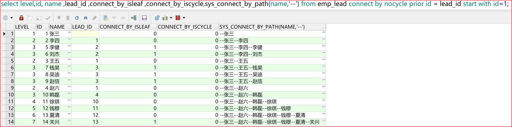

## 字符串中单引号转义

PL/SQL 字符串内的单引号，要通过转义使用，转义标志符号也是单引号。

```sql
 select 'you are''beautiful' from dual;
 -- 结果
 you are'beautiful  
```

> 单引号就近匹配，从第2个单引号开始，若后面紧跟的是还是单引号，该单引号就是转义标识符。 select 'you are''beautiful' from dual;语句中第二个引号为转义标识符，第三个为字符产中的单引号，第四个匹配第一个为包裹字符串的引号。

```sql
select ' AND (A.PD_CODE LIKE ''%' || '关键字' || '%''  OR  B.PD_NM LIKE ''%'' || ''' || '关键字' || ''' || ''%'')' from dual;
-- 结果
 AND (A.PD_CODE LIKE '%关键字%'  OR  B.PD_NM LIKE '%' || '关键字' || '%')
-- 分析
   -- 
AND (A.PD_CODE LIKE ''%'				  -->   AND (A.PD_CODE LIKE '%
'关键字'					  				-->	  关键字
'%''  OR  B.PD_NM LIKE ''%'' || '''       -->   %'  OR  B.PD_NM LIKE '%' || '
'关键字'    				                -->   关键字
''' || ''%'')'				              -->   ' || '%')
     
-- 拼接转义后
      AND (A.PD_CODE LIKE '%关键字%'  OR  B.PD_NM LIKE '%' || '关键字' || '%')
```

```sql
select 'AND (A.PD_CODE LIKE ''%' || '关键字' || '%''  OR  B.PD_NM LIKE ''%'' || ''关键字'' || ''%'')' from dual;
-- 结果
 AND (A.PD_CODE LIKE '%关键字%'  OR  B.PD_NM LIKE '%' || '关键字' || '%')
-- 分析过程类上
```

```sql
select 'abc' || '''||''cde'')' from dual;         
-- 结果
abc'||'cde')
```

```sql
 'AND  A.PD_CODE IN (SELECT PD_CODE FROM TAA_PD_SELL_CHNL WHERE CHNL_CODE IN(SELECT COLUMN_VALUE FROM TABLE(SPLIT(''' ||
                   I_SELL_CHNL_CODE || ''','';''))))';
                   
-- sql
  AND  A.PD_CODE IN (SELECT PD_CODE FROM TAA_PD_SELL_CHNL WHERE CHNL_CODE IN(SELECT COLUMN_VALUE FROM TABLE(SPLIT('I_SELL_CHNL_CODE',';'))));
  
-------------------------------------------------------------------------------------------------------------------------
 
 select 'AND  A.PD_CODE IN (SELECT PD_CODE FROM TAA_PD_SELL_CHNL WHERE CHNL_CODE IN(SELECT COLUMN_VALUE FROM TABLE(SPLIT(''' ||
                   '产品名称' || ''','';''))))' from dual;
 -- 结果
 AND  A.PD_CODE IN (SELECT PD_CODE FROM TAA_PD_SELL_CHNL WHERE CHNL_CODE IN(SELECT COLUMN_VALUE FROM TABLE(SPLIT('产品名称',';'))))
```


分析方法：先将连接符连接的各个子字符串两端的引号脱掉，针对每个子字符串内部的单引号做转义处理，最后拼成能直接执行的sql语句。

## Oracle之单引号与双引号

一、单引号

1.引用一个字符串常量，也就是界定一个字符串的开始和结束

```sql
select * from t_sys_user where id='15';  --查询id为15的字符
 
select * from t_sys_score where id=15;  --查询id为15的整形数字
```

2.转义符，对紧随其后出现的字符(单引号)进行转义 

```sql
select ' '' ' result from dual; --第二个单引号被作为转义符,第三个单引号被转义.结果为 '
 
select 'name''''' result from dual; --结果为name''
 
select 'name'||'''' result from dual;  --结果为name','||' 被转义为字符拼接
```

二、双引号

关键字、对象名\、字段名、别名 加双引号，则示意 Oracle将严格区分大小写，否则Oracl都默认大写。 

```sql
--关键字
select "sysdate" from dual;  -- 等同于select sysdate from dual; 
 
--字段名 
select * from emp where "ENAME" = scott; --双引号提示oracle严格区分大小写,ename将报错
 
--别名
select ename "姓 名",sal "$工资" from emp; --别名中若有特殊字符或关键字,需要双引号包住
```

https://blog.csdn.net/mmake1994/article/details/85982743

## oracle类型转换

Oracle支持数据的转转换，如将字符串可自动转换为数值型


```sql
select  'adc' from dual where '20320125'  >=20230122; 
-- 结果
abc
```

https://www.cnblogs.com/onlywujun/articles/4195753.html

## oracle TO_CHAR()函数

用于将`日期`或`数值型`转换为字符串

https://www.cnblogs.com/aipan/p/7941917.html

## 动态sql

oracle动态sql是吧值传入凭借sql,还是先拼接sql再传值？

```sql
  IF I_SELL_CHNL_CODE IS NOT NULL THEN
    V_SQL_WHERE := V_SQL_WHERE ||
                   'AND  A.PD_CODE IN (SELECT PD_CODE FROM TAA_PD_SELL_CHNL WHERE CHNL_CODE IN(SELECT COLUMN_VALUE FROM TABLE(SPLIT(''' ||
                   I_SELL_CHNL_CODE || ''','';''))))';
  END IF;
```

当I_SELL_CHNL_CODE不为null，是先拼接sql语句，再将I_SELL_CHNL_CODE替换为I_SELL_CHNL_CODE的实际值；还是将I_SELL_CHNL_CODE用I_SELL_CHNL_CODE的实际值替换再拼接sql语句？

> 因该是先替换再拼接
>
> 注意三个单引号

## Return

存储过程return作用?

跳出循环，跳出过程？

```sql
    IF V_EXST_INF = 0 THEN
      O_CODE := -1;
      O_NOTE := '未添加产品数据，禁止提交审核';
      ROLLBACK;
      RETURN;
    END IF;
```

> oracle 存储过程循环体中的return和exit区别：
>
> (1) return 跳出整个循环，终止该循环， 后面的不再执行。   相当于 Java 中的break;
>
> (2) exit 跳出本次循环，下次继续执行本次循环。          相当于 Java 中的continue;

## 查询映射


## Exists与in

```sql
select * from A where id in（select id from B）
```

先执行子查询（内表），将子查询结果缓存，再执行外表，外表结果满足条件的缓存起来，最终遍历A.length * B.length次

```sql
select * from A where exists(select * from B where A.id=B.id)
```

先执行外表，拿到每一条数据后，执行子查询（内表），若子查询有结果，即返回true，外表对应的该条数据保留，若内表查询无结果，即返回false，外表对应该条数据删除。最终遍历A.length * A.length次

> 内表数据量大于外表：使用exists
>
> 内表数据量小于外表：使用in

not exists与exists相反，内表返回true删除外表数据，内表返回false，保留外表数据

使用exists只用来判断内表有无数据返回，实际因此常用select 1 形式，提高性能。

 select * from TableIn where exists(select null)  等同于： select * from TableIn

https://www.cnblogs.com/emilyyoucan/p/7833769.html

## all  any  some

https://www.cnblogs.com/feiquan/p/8654171.html

## table()函数

oracle table()函数，可将pl/sql返回的结果集当作一张物理表

https://www.cnblogs.com/Soprano/p/10659371.html

## instr()函数

返回目标字符串在源符串中的索引，注意从1开始。

格式一：instr( string1, string2 )   // instr(源字符串, 目标字符串)

格式二：instr( string1, string2 [, start_position [, nth_appearance ] ] )  // instr(源字符串, 目标字符串, 起始位置, 匹配序号)

解析：string2 的值要在string1中查找，是从start_position给出的数值（即：位置）开始在string1检索，检索第nth_appearance（几）次出现string2。

```sql
1 select instr('helloworld','l') from dual; --返回结果：3    默认第一次出现“l”的位置
2 select instr('helloworld','lo') from dual; --返回结果：4    即“lo”同时出现，第一个字母“l”出现的位置
3 select instr('helloworld','wo') from dual; --返回结果：6    即“wo”同时出现，第一个字母“w”出现的位置

1 select instr('helloworld','l',2,2) from dual;  --返回结果：4    也就是说：在"helloworld"的第2(e)号位置开始，查找第二次出现的“l”的位置
2 select instr('helloworld','l',3,2) from dual;  --返回结果：4    也就是说：在"helloworld"的第3(l)号位置开始，查找第二次出现的“l”的位置
3 select instr('helloworld','l',4,2) from dual;  --返回结果：9    也就是说：在"helloworld"的第4(l)号位置开始，查找第二次出现的“l”的位置
4 select instr('helloworld','l',-1,1) from dual;  --返回结果：9    也就是说：在"helloworld"的倒数第1(d)号位置开始，往回查找第一次出现的“l”的位置
5 select instr('helloworld','l',-2,2) from dual;  --返回结果：4    也就是说：在"helloworld"的倒数第2(l)号位置开始，往回查找第二次出现的“l”的位置
6 select instr('helloworld','l',2,3) from dual;  --返回结果：9    也就是说：在"helloworld"的第2(e)号位置开始，查找第三次出现的“l”的位置
7 select instr('helloworld','l',-2,3) from dual; --返回结果：3    也就是说：在"helloworld"的倒数第2(l)号位置开始，往回查找第三次出现的“l”的位置
```

https://www.cnblogs.com/dshore123/p/7813230.html

## replace()函数

字符串替换函数

replace( string, search_string [, replace_string]) 如果没有指定replace_string 变量的值，那么当发现search_string 变量的值时，就将其删除。输入可以为任何字符数据类型——CHAR、VARCHAR2、NCHAR、NVARCHAR2、CLOB或NCLOB。用replace_string替换string中的所有search_string。

下面是 使用replace函数后的sql和执行结果：

```sql
select replace('0123456789','0','a') from dual;--a123456789
select replace('0123456789','0','') from dual;--123456789
select replace('0123456789','0') from dual;--123456789
```

https://www.cnblogs.com/haha12/p/3899092.html

## oralce 外连接后不能使用子查询

https://blog.csdn.net/wherejaly/article/details/4539583

## 获取当前数据库资源

```sql
select * from user_source -- 所有资源，包括表、序列、过程、函数等
select * from all_all_tables where -- 所有表
select * from all_procedures -- 所有过程
select * from all_views -- 所有视图
select * from all_sequences -- 所有序列
select * from user_tab_columns --当前用户的表，表中的列等表结构信息
```

## 大小写敏感查询

Oracle查询默认区分大小写，比如存入的值为大写，查询条件为小写，可能无法查出结果，需要主意。mysql默认不区分大小写查询。

可通过设置环境变量让oracle查询对大小写不敏感https://www.cnblogs.com/miye/p/7151494.html

## Oracle comment

oracel数据库建表时不能像mysql一杨直接用comment给列加注释，但可以在建表完成后使用下列语句，添加注释

```sql
--------------------------------------------------------1：建表语句----------------------------------------------------

create table EMP
(
EMPNO NUMBER(4) PRIMARY KEY,
ENAME VARCHAR2(10),
JOB VARCHAR2(9),
MGR NUMBER(4),
HIREDATE DATE,
SAL NUMBER(7,2),
DEPNO NUMBER(4)
);

--------------------------------------------------------2：添加表注释--------------------------------------------------

COMMENT ON TABLE EMP IS '学生信息表';

--------------------------------------------------------3：添加字段注释------------------------------------------------

COMMENT ON COLUMN EMP.EMPNO IS '学号';
COMMENT ON COLUMN EMP.ENAME IS '姓名';
COMMENT ON COLUMN EMP.JOB IS '邮箱';
COMMENT ON COLUMN EMP.MGR IS '性别';
COMMENT ON COLUMN EMP.HIREDATE IS '入职日期';
COMMENT ON COLUMN EMP.SAL IS '薪资';
COMMENT ON COLUMN EMP.DEPNO IS '部门编号';
```

## oracle层次查询

 Oracle中层次查询语法：

```sql
 select  ...
 [level | connect_by_root |connect_by_isleaf |connect_by_iscycle ]
 from table_name
 [where] 
 connect by { prior col1=col2 | col1=prior col2 }
[start with]
[order [siblings] by];
```

connect by :指定层次查询中，父节点和子节点以什么样的关系关联。

prior：必须放置在连接关系的两列中某一个的前面，对于子节点间的父子关系，prior运算符所在的一侧为父节点，另一侧的为子节点，从而确定查找树形结构的顺序是自顶向下还是自底向上。

start with：用于标识哪个节点作为查找树形结构的根节点，层次查询需要确定起始点，通过start with，后加条件。start with将确定将哪行作为root，如果不指定start with，则每行都当做root，然后查找其后代。start with后可以跟子查询，如果又where条件，则会截断层次中满足相关条件的节点，但不影响整个层次查询。

level：是一个伪列，代表当前这个节点所在的层级，对于根节点，level返回1，通过这个伪列结合其他oracle函数进行数据的格式化显示。

connect_by_root:connect_by_root必须和某个字段搭配使用，目的是获取根节点记录的字段信息。

connect_by_isleaf：判断当前结点是否为叶子节点，0表示非叶子节点，1表示是叶子节点。

connect_by_iscycle：可以检查是否在树形查询的过程中构成循环，这个伪列只是在connect_by_cycle方式下有效。

order siblings by：定义返回时同一父节点下的各个兄弟节点之间的顺序。

举例：

```sql
-- 树形结构表emp；
select * from emp;
EMP_ID              EMP_NAME              UP_EMP_ID    
---------            ---------------         ---------------  
1              USER1              0         
2              USER2              1
3              USER3              1 
4              USER4              2
5              USER5              2
6              USER6              3

-- 从根节点emp_id=1开始，自顶向下查询出根节点的所有子节点
select  emp_id,emp_name,up_emp_id,level
from emp
start with emp_id=1
connect by prior emp_id=up_emp_id
order siblings by emp_id;
EMP_ID                EMP_NAME           UP_EMP_ID                        LEVEL
---------              ---------------      ---------------                    --------
1               USER1            0                       1
2               USER2            1                       2
4               USER4            2                       3
5               USER5            2                       3
3               USER3            1                       2
6               USER6            3                       3

-- 从emp_id=6，自底向上查询emp_id=6的所有父节点
select emp_id，emp_name，up_emp_id 
from  emp
start with emp_id=6
connect by emp_id = prior up_emp_id
order by  emp_id；
EMP_ID              EMP_NAME             UP_EMP_ID    
---------            ---------------        ---------------  
1              USER1             0
3              USER3             1
6              USER6             3
-----------------------------------
```

https://blog.51cto.com/mjal01/1975584

https://wenku.baidu.com/view/2ab612630242a8956aece433?bfetype=new

```sql
CREATE TABLE "TXG"."EMP_LEAD" (
  "ID" NUMBER NOT NULL primary key,
  "NAME" VARCHAR2(20 BYTE),
  "LEAD_ID" NUMBER
)

INSERT INTO "TXG"."EMP_LEAD" VALUES ('1', '张三', NULL);
INSERT INTO "TXG"."EMP_LEAD" VALUES ('2', '李四', '1');
INSERT INTO "TXG"."EMP_LEAD" VALUES ('3', '王五', '1');
INSERT INTO "TXG"."EMP_LEAD" VALUES ('4', '赵六', '1');
INSERT INTO "TXG"."EMP_LEAD" VALUES ('5', '李健', '2');
INSERT INTO "TXG"."EMP_LEAD" VALUES ('6', '刘杰', '2');
INSERT INTO "TXG"."EMP_LEAD" VALUES ('7', '钱昊', '3');
INSERT INTO "TXG"."EMP_LEAD" VALUES ('8', '吴迪', '3');
INSERT INTO "TXG"."EMP_LEAD" VALUES ('9', '赵信', '3');
INSERT INTO "TXG"."EMP_LEAD" VALUES ('10', '韩磊', '4');
INSERT INTO "TXG"."EMP_LEAD" VALUES ('11', '徐琪', '10');
INSERT INTO "TXG"."EMP_LEAD" VALUES ('12', '钱穆', '11');
INSERT INTO "TXG"."EMP_LEAD" VALUES ('13', '夏清', '12');
INSERT INTO "TXG"."EMP_LEAD" VALUES ('14', '关兴', '13');
```


```sql
-- connect by条件中，prior所在的一侧始终为父节点，通过改变prior的位置可以实现从上到下、从下到上的遍历
select level,id, name ,lead_id ,connect_by_isleaf  from emp_lead connect by prior id = lead_id start with id=4;-- 从上到下
select level,id, name ,lead_id ,connect_by_isleaf  from emp_lead connect by  id = prior lead_id start with id=14;-- 从下到上
```


```sql
-- 在字段前加prior可显示当前行对应的父节点的同名字段
select level,id,name,prior name ,lead_id from emp_lead connect by  id =prior lead_id start with id=14;
```


```sql
-- level 伪列，显示当前行的层级，从start with指定的查询条件为level 1层级
-- connect_by_isleaf伪列判断是否为叶子节点 0|否 ；1|是
-- connect_by_iscycle 判断是否存在循环 ，该伪列只有在使用了nocycles时才能使用  0|不存在循环；1|存在循环
-- sys_connect_by_path(字段,分隔符) 该函数的作用是把指定字段各层级信息集中显示，并用指定分隔符隔开
select level,id, name ,lead_id ,connect_by_isleaf ,connect_by_iscycle,sys_connect_by_path(name,'--') from emp_lead connect by nocycle prior id = lead_id start with id=1;
```



## Oracle错误

> ORA-01422:实际返回的行数超出请求的行数
>
> ORA-01422: exact fetch returns more than requested number of rows

错误原因：select into赋值，查到的值有多个

eg：过程语句

```sql
SELECT INST_ID INTO V_INST_ID FROM TIFP_INST_INF WHERE INST_NM = X.INST_ABR;
```

实际结果

```sql
SELECT * FROM TIFP_INST_INF WHERE INST_NM = '金融机构1号';
```


查询到的结果有两条。不能确定用哪一个值，会报此错误。

## union all表列一致

UNION 操作符用于合并两个或多个 SELECT 语句的结果集。
请注意，UNION 内部的每个 SELECT 语句必须拥有相同数量的列。列也必须拥有相似的数据类型。同时，每个 SELECT 语句中的列的顺序必须相同。

https://zhidao.baidu.com/question/1501050991936317419.html

## select虚拟列

https://zhidao.baidu.com/question/1831196887412398140.html

## ONGL使用

mybatis中contais，split的使用

```sql
    <select id="queryListFundCode" statementType="PREPARED" parameterType="java.util.Map" resultMap="queryListFundCodeResult">
        SELECT
        A.FUND_CODE FUND_CODE,
        A.TA_CODE TA_CODE,
        A.FUND_NM FUND_NM,
        B.PRCH_ST FUDN_ST_IBM,
        (SELECT NOTE
        FROM LIVEBOS.TXTDM
        WHERE FLDM = 'IRAA_PRCH_ST'
        AND IBM = B.PRCH_ST) FUDN_ST,
        A.DFLT_DIV_MODE CHRG_MODE,
        CASE
        WHEN B.AST_CL_ID = 1 THEN
        2
        ELSE
        1
        END AS FUND_CL,
        A.MIN_PRCH_AMT_IDV,
        A.APP_SUBS_AMT_IDV,
        A.MAX_PRCH_AMT_ORG ONCE_MAX_TOT_BUY_IDV,
        A.DAY_MAX_TOT_BUY_ORG DAY_MAX_TOT_BUY_IDV,
        A.NAV,
        A.RSK_LVL_NM RSK_LVL,
        A.TA_NM MGR,
        (SELECT MAX(IDX_VAL * 100)
        FROM IRAA.TIR_PD_FUND_IDX E
        WHERE A.FUND_CODE = E.PD_CODE
        AND E.IDX_CODE = 'fund_currency_ann_yield_7d') RT_7R,
        NULL RT_14R,
        NULL RT_1MO,
        NULL RT_3MO,
        B.FUND_SCAL / 100000000 FUND_SZ,
        (CASE
        WHEN A.FUND_ST = 2 THEN
        ORG_LOWLIMIT_BALANCE
        ELSE
        ORG_LOWLIMIT_BALANCE2
        END) MIN_QTA,
        (CASE
        WHEN A.FUND_ST = 2 THEN
        A.MAX_SUBS_AMT_ORG
        ELSE
        A.MAX_PRCH_AMT_ORG
        END) MAX_QTA,
        A.TA_NM FUND_CO_NM,
        B.EXTL_CODE,
        CASE
        WHEN T4.GRNT_ST = 0 THEN
        T4.CUR_RMAN_QTA
        ELSE
        NULL
        END AS MGR_GRNT_QTA,
        CASE
        WHEN T5.GRNT_ST = 0 THEN
        T5.CUR_RMAN_QTA
        ELSE
        NULL
        END AS PD_GRNT_QTA,
        (SELECT COUNT(1)
        FROM IRAA.TAA_PD_SELL_CHNL CHNL
        WHERE A.FUND_CODE = CHNL.PD_CODE
        AND CHNL.CHNL_CODE = 'ORG') WTHR_SALE,
        (SELECT NOTE
        FROM LIVEBOS.TXTDM
        WHERE FLDM = 'IFP_PD_TP'
        AND CBM = A.FUND_TP) FUND_CL_NM,
        (SELECT CASE
        WHEN T3.NUM > 0 THEN
        4
        WHEN T4.GRNT_ST = 0 AND T5.GRNT_ST = 0 AND T3.NUM = 0 THEN
        3
        WHEN T4.GRNT_ST = 1 AND T5.GRNT_ST = 0 AND T3.NUM = 0 THEN
        2
        WHEN T4.GRNT_ST = 1 AND T5.GRNT_ST = 1 AND T3.NUM = 0 THEN
        0
        ELSE
        0
        END
        FROM DUAL) WTHR_GRNT_QTA,
        CASE
        WHEN T2.FUND_CODE IS NOT NULL THEN
        1
        ELSE
        0
        END AS WTHR_BLACK,
        A.DFLT_DIV_MODE
        FROM TIFP_PD_DYNA_INF A
        LEFT JOIN IRAA.TIR_PD_INF B
        ON A.FUND_CODE = B.PD_CODE
        LEFT JOIN IFP.TIFP_PUB_TA_INF C
        ON A.TA_CODE = C.TA_CODE
        LEFT JOIN (SELECT COUNT(1) NUM
        FROM TIFP_AGNT_GRNT_PARM GRNT_PARM, TIFP_AGNT_INF AGNT
        WHERE AGNT.INST_CODE = GRNT_PARM.INST_CODE
        AND GRNT_OPN_ST = 1
        AND AGNT.USR_ID = #{I_OPRR_ID}) T3
        ON 1 = 1
      LEFT JOIN (SELECT DISTINCT FUND_CODE
                   FROM (SELECT A.FUND_CODE
                           FROM TIFP_PD_FUND_BLK_LST A, TIFP_AGNT_INF AGNT
                          WHERE A.INST_CODE = AGNT.INST_CODE
                            AND AGNT.USR_ID = #{I_OPRR_ID}
        AND A.ST = 0
        UNION ALL
        SELECT B.FUND_CODE
        FROM TIFP_PD_FUND_CO_BLK_LST A, TIFP_PD_DYNA_INF B, TIFP_AGNT_INF AGNT
        WHERE A.FUND_CO = B.TA_CODE
        AND A.INST_CODE = AGNT.INST_CODE
        AND AGNT.USR_ID = #{I_OPRR_ID}
        AND A.ST = 0)) T2
        ON A.FUND_CODE = T2.FUND_CODE
        LEFT JOIN (SELECT FUND_CODE, GRNT_ST, MAX(CUR_RMAN_QTA) CUR_RMAN_QTA
        FROM TIFP_INST_FUND_CO_GRNT CO_GRNT, TIFP_PD_DYNA_INF D
        WHERE CO_GRNT.FUND_CO = D.TA_CODE
            AND CO_GRNT.INST_CODE = #{V_INST_ID} GROUP BY FUND_CODE, GRNT_ST) T4
        ON A.FUND_CODE = T4.FUND_CODE
        LEFT JOIN (SELECT C.FUND_CODE, GRNT_ST, CUR_RMAN_QTA
        FROM TIFP_INST_FUND_GRNT GRNT, TIFP_PD_DYNA_INF C
        WHERE GRNT.INST_CODE = #{V_INST_ID}
        AND C.FUND_CODE = GRNT.FUND_CODE) T5
        ON A.FUND_CODE = T5.FUND_CODE
        WHERE 1=1
        <if test="I_FUND_CODE != null and I_FUND_CODE != ''">
            AND (A.FUND_CODE LIKE '%' || #{I_FUND_CODE} || '%'
                     OR INSTR(#{I_FUND_CODE} , A.FUND_CODE) > 0
                     OR A.FUND_NM LIKE '%' || #{I_FUND_CODE} || '%')
        </if>
        <if test="I_FUND_NM != null and I_FUND_NM != ''">
            AND (A.FUND_NM LIKE '%' || #{I_FUND_NM} || '%')
        </if>
        <if test="I_TA_CODE != null and I_TA_CODE != ''">
            AND (A.TA_CODE = #{I_TA_CODE})
        </if>
        <if test="I_EN_PROD_PROP != null and I_EN_PROD_PROP !=''">
            <foreach collection="I_EN_PROD_PROP.split(',')" item="PROD_PROP" open="AND (" close=")" index="id">
                <choose>
                    <when test="id == 0">
                        INSTR(A.EN_PROD_PROP, #{PROD_PROP}) > 0
                    </when>
                    <otherwise>
                        OR INSTR(A.EN_PROD_PROP, #{PROD_PROP}) > 0
                    </otherwise>
                </choose>
            </foreach>
            <if test="I_EN_PROD_PROP.contains('AB2') or I_EN_PROD_PROP.contains('BB2')">
                AND EXISTS (SELECT 1
                FROM IRAA.TAA_PD_SELL_CHNL CHNL
                WHERE A.FUND_CODE = CHNL.PD_CODE
                AND CHNL.CHNL_CODE = 'ORG')
                AND T2.FUND_CODE IS NULL
                AND (T3.NUM > 0 OR (T4.GRNT_ST = 0 AND T5.GRNT_ST = 0 AND T3.NUM = 0) OR (T4.GRNT_ST = 1 AND T5.GRNT_ST = 0 AND T3.NUM = 0))
            </if>
        </if>
        <if test="I_FUND_CL != null and I_FUND_CL != ''">
            AND ((
            CASE
            WHEN B.AST_CL_ID = 1 THEN
            2
            ELSE
            1
            END) = #{I_FUND_CL})
        </if>
        <if test="I_SORT != null and I_SORT !=''">
            order by #{I_SORT}
        </if>
    </select>
```

错误写法，注释的内容

```sql
    <select id="queryListFundCode" statementType="PREPARED" parameterType="java.util.Map" resultMap="queryListFundCodeResult">
        SELECT
        A.FUND_CODE FUND_CODE,
        A.TA_CODE TA_CODE,
        A.FUND_NM FUND_NM,
        B.PRCH_ST FUDN_ST_IBM,
        (SELECT NOTE
        FROM LIVEBOS.TXTDM
        WHERE FLDM = 'IRAA_PRCH_ST'
        AND IBM = B.PRCH_ST) FUDN_ST,
        A.DFLT_DIV_MODE CHRG_MODE,
        CASE
        WHEN B.AST_CL_ID = 1 THEN
        2
        ELSE
        1
        END AS FUND_CL,
        A.MIN_PRCH_AMT_IDV,
        A.APP_SUBS_AMT_IDV,
        A.MAX_PRCH_AMT_ORG ONCE_MAX_TOT_BUY_IDV,
        A.DAY_MAX_TOT_BUY_ORG DAY_MAX_TOT_BUY_IDV,
        A.NAV,
        A.RSK_LVL_NM RSK_LVL,
        A.TA_NM MGR,
        (SELECT MAX(IDX_VAL * 100)
        FROM IRAA.TIR_PD_FUND_IDX E
        WHERE A.FUND_CODE = E.PD_CODE
        AND E.IDX_CODE = 'fund_currency_ann_yield_7d') RT_7R,
        NULL RT_14R,
        NULL RT_1MO,
        NULL RT_3MO,
        B.FUND_SCAL / 100000000 FUND_SZ,
        (CASE
        WHEN A.FUND_ST = 2 THEN
        ORG_LOWLIMIT_BALANCE
        ELSE
        ORG_LOWLIMIT_BALANCE2
        END) MIN_QTA,
        (CASE
        WHEN A.FUND_ST = 2 THEN
        A.MAX_SUBS_AMT_ORG
        ELSE
        A.MAX_PRCH_AMT_ORG
        END) MAX_QTA,
        A.TA_NM FUND_CO_NM,
        B.EXTL_CODE,
        CASE
        WHEN T4.GRNT_ST = 0 THEN
        T4.CUR_RMAN_QTA
        ELSE
        NULL
        END AS MGR_GRNT_QTA,
        CASE
        WHEN T5.GRNT_ST = 0 THEN
        T5.CUR_RMAN_QTA
        ELSE
        NULL
        END AS PD_GRNT_QTA,
        (SELECT COUNT(1)
        FROM IRAA.TAA_PD_SELL_CHNL CHNL
        WHERE A.FUND_CODE = CHNL.PD_CODE
        AND CHNL.CHNL_CODE = 'ORG') WTHR_SALE,
        (SELECT NOTE
        FROM LIVEBOS.TXTDM
        WHERE FLDM = 'IFP_PD_TP'
        AND CBM = A.FUND_TP) FUND_CL_NM,
        (SELECT CASE
        WHEN T3.NUM > 0 THEN
        4
        WHEN T4.GRNT_ST = 0 AND T5.GRNT_ST = 0 AND T3.NUM = 0 THEN
        3
        WHEN T4.GRNT_ST = 1 AND T5.GRNT_ST = 0 AND T3.NUM = 0 THEN
        2
        WHEN T4.GRNT_ST = 1 AND T5.GRNT_ST = 1 AND T3.NUM = 0 THEN
        0
        ELSE
        0
        END
        FROM DUAL) WTHR_GRNT_QTA,
        CASE
        WHEN T2.FUND_CODE IS NOT NULL THEN
        1
        ELSE
        0
        END AS WTHR_BLACK,
        A.DFLT_DIV_MODE
        FROM TIFP_PD_DYNA_INF A
        LEFT JOIN IRAA.TIR_PD_INF B
        ON A.FUND_CODE = B.PD_CODE
        LEFT JOIN IFP.TIFP_PUB_TA_INF C
        ON A.TA_CODE = C.TA_CODE
        LEFT JOIN (SELECT COUNT(1) NUM
        FROM TIFP_AGNT_GRNT_PARM GRNT_PARM, TIFP_AGNT_INF AGNT
        WHERE AGNT.INST_CODE = GRNT_PARM.INST_CODE
        AND GRNT_OPN_ST = 1
        AND AGNT.USR_ID = #{I_OPRR_ID}) T3
        ON 1 = 1
      LEFT JOIN (SELECT DISTINCT FUND_CODE
                   FROM (SELECT A.FUND_CODE
                           FROM TIFP_PD_FUND_BLK_LST A, TIFP_AGNT_INF AGNT
                          WHERE A.INST_CODE = AGNT.INST_CODE
                            AND AGNT.USR_ID = #{I_OPRR_ID}
        AND A.ST = 0
        UNION ALL
        SELECT B.FUND_CODE
        FROM TIFP_PD_FUND_CO_BLK_LST A, TIFP_PD_DYNA_INF B, TIFP_AGNT_INF AGNT
        WHERE A.FUND_CO = B.TA_CODE
        AND A.INST_CODE = AGNT.INST_CODE
        AND AGNT.USR_ID = #{I_OPRR_ID}
        AND A.ST = 0)) T2
        ON A.FUND_CODE = T2.FUND_CODE
        LEFT JOIN (SELECT FUND_CODE, GRNT_ST, MAX(CUR_RMAN_QTA) CUR_RMAN_QTA
        FROM TIFP_INST_FUND_CO_GRNT CO_GRNT, TIFP_PD_DYNA_INF D
        WHERE CO_GRNT.FUND_CO = D.TA_CODE
            AND CO_GRNT.INST_CODE = #{V_INST_ID} GROUP BY FUND_CODE, GRNT_ST) T4
        ON A.FUND_CODE = T4.FUND_CODE
        LEFT JOIN (SELECT C.FUND_CODE, GRNT_ST, CUR_RMAN_QTA
        FROM TIFP_INST_FUND_GRNT GRNT, TIFP_PD_DYNA_INF C
        WHERE GRNT.INST_CODE = #{V_INST_ID}
        AND C.FUND_CODE = GRNT.FUND_CODE) T5
        ON A.FUND_CODE = T5.FUND_CODE
        WHERE 1=1
        <if test="I_FUND_CODE != null and I_FUND_CODE != ''">
            AND (A.FUND_CODE LIKE '%' || #{I_FUND_CODE} || '%'
                     OR INSTR(#{I_FUND_CODE} , A.FUND_CODE) > 0
                     OR A.FUND_NM LIKE '%' || #{I_FUND_CODE} || '%')
        </if>
        <if test="I_FUND_NM != null and I_FUND_NM != ''">
            AND (A.FUND_NM LIKE '%' || #{I_FUND_NM} || '%')
        </if>
        <if test="I_TA_CODE != null and I_TA_CODE != ''">
            AND (A.TA_CODE = #{I_TA_CODE})
        </if>
        <if test="I_EN_PROD_PROP != null and I_EN_PROD_PROP !=''">
<!--            <foreach collection="SELECT * FROM REGEXP_SUBSTR(#{I_EN_PROD_PROP}, '[^,]+', 1, rownum,'i')" item="PROD_PROP" open="AND (" close=")" index="id">-->
<!--                <choose>-->
<!--                    <when test="id = 0">-->
<!--                        INSTR(A.EN_PROD_PROP, PROD_PROP.COLUMN_VALUE) > 0-->
<!--                    </when>-->
<!--                    <otherwise>-->
<!--                        OR INSTR(A.EN_PROD_PROP, PROD_PROP.COLUMN_VALUE) > 0-->
<!--                    </otherwise>-->
<!--                </choose>-->
<!--            </foreach>-->
            <foreach collection="I_EN_PROD_PROP.split(',')" item="PROD_PROP" open="AND (" close=")" index="id">
                <choose>
                    <when test="id == 0">
                        INSTR(A.EN_PROD_PROP, #{PROD_PROP}) > 0
                    </when>
                    <otherwise>
                        OR INSTR(A.EN_PROD_PROP, #{PROD_PROP}) > 0
                    </otherwise>
                </choose>
            </foreach>
<!--            <if test="INSTR(I_EN_PROD_PROP, 'AB2') > 0 or INSTR(I_EN_PROD_PROP, 'BB2') > 0">-->
            <if test="I_EN_PROD_PROP.contains('AB2') or I_EN_PROD_PROP.contains('BB2')">

                AND EXISTS (SELECT 1
                FROM IRAA.TAA_PD_SELL_CHNL CHNL
                WHERE A.FUND_CODE = CHNL.PD_CODE
                AND CHNL.CHNL_CODE = 'ORG')

                AND T2.FUND_CODE IS NULL

                AND (T3.NUM > 0 OR (T4.GRNT_ST = 0 AND T5.GRNT_ST = 0 AND T3.NUM = 0) OR (T4.GRNT_ST = 1 AND T5.GRNT_ST = 0 AND T3.NUM = 0))
            </if>
        </if>
        <if test="I_FUND_CL != null and I_FUND_CL != ''">
            AND ((
            CASE
            WHEN B.AST_CL_ID = 1 THEN
            2
            ELSE
            1
            END) = #{I_FUND_CL})
        </if>
        <if test="I_SORT != null and I_SORT !=''">
            order by #{I_SORT}
        </if>
    </select>
```

