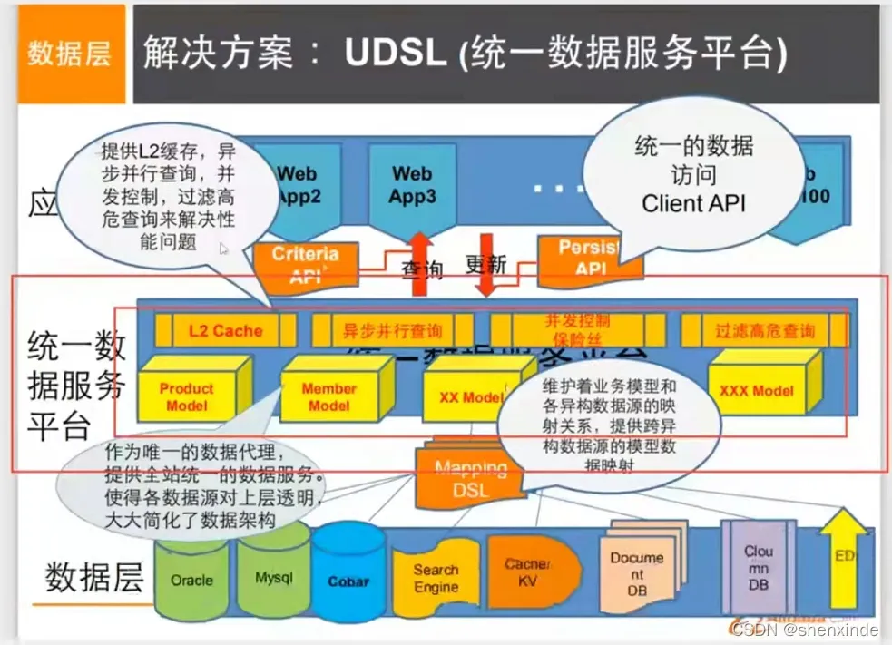
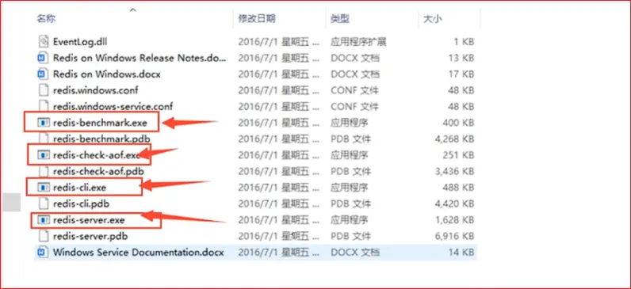
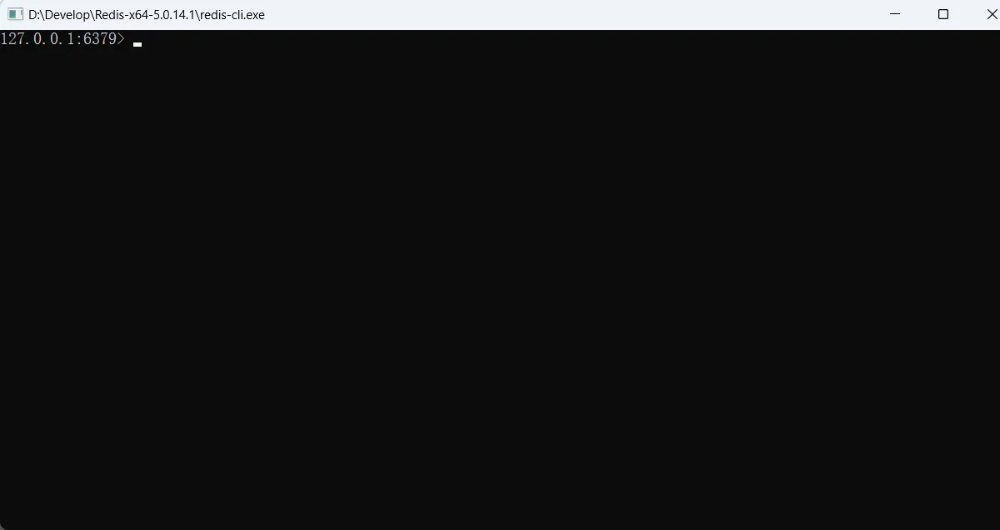
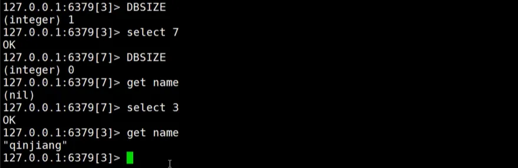

# 一、Nosql概述

## 1、为什么使用Nosql

### 1.1、单机MySQL的时代


- 90年代,一个网站的访问量一般不会太大，单个数据库完全够用。那个时候，更多的去使用静态网页 Html ~ 服务器根本没有太大的压力。

- 这种情况下，整个网站的瓶颈是什么：

    - 数据量如果太大，一个机器放不下

    - 数据的索引（B+ Tree）,一个机器内存也存放不下

    - 访问量变大后（读写混合），一个服务器承受不了。

### 1.2、Memcached(缓存) + Mysql + 垂直拆分（读写分离）

- 主要解决读的问题

- 网站80%的情况都是在读，每次都要去查询数据库的话就十分的麻烦！所以说我们希望减轻数据库的压力，我们可以使用缓存来保证效率！


- 发展过程：

    - 优化数据库的数据结构和索引（难度大）

    - 文件缓存（IO）：IO流获取比访问数据库高效，但是流量爆炸式增长时，IO流同样会超载

    - Memcached（当时最热门的技术！）：通过在数据库和数据库访问层之间加上一层缓存，第一次访问时查询数据库，将结果保存到缓存，后续的查询先检查缓存，若有直接拿去使用，效率显著提升。

### 1.3、分库分表 + 水平拆分 + Mysql集群

- 本质：数据库（读，写）

- 早些年 MyISAM：表锁，十分影响效率！

- 转战 Innodb：行锁

- 慢慢的就开始使用分库分表来解决写的压力


### 1.4、如今最近的年代

- 十年之间，世界已经发生了翻天覆地的变化；（定位，也是一种数据，音乐，热榜）

- MySQL 等关系型数据库就不够用了！数据量很多，变化很快~！

- MySQL 有的使用它来存储一些比较大的文件，博客，图片！数据库表很大，效率就低了！如果能有一种数据库来专门处理这种数据，MySQL 压力就变得十分小（研究如何处理这些问题！）大数据的 IO 压力下，表几乎没法更大

### 目前一个基本的互联网项目


### 为什么要用NoSQL ？

- 用户的个人信息，社交网络，地理位置。用户自己产生的数据，用户日志等等爆发式增长！

- 这时候我们就需要使用 NoSQL 数据库的，Nosql 可以很好的处理以上的情况！

## 2、什么是 NoSQL

- NoSQL = Not Only SQL（不仅仅是SQL）

- 关系型数据库：表格，行，列

- 泛指非关系型数据库的，随着 web2.0 互联网的诞生！传统的关系型数据库很难对付 web2.0 时代！尤其是超大规模的高并发社区！暴露出来很多难以克服的问题，NoSQL 在当今大数据环境下发展的十分迅速，Redis 是发展最快的，也是必学的

- 很多的数据类型用户的个人信息，如社交网络、地理位置。这些数据类型的存储不需要一个固定的格式！不需要多余的操作就可以横向扩展的！Map<String, Object> 使用键值对来控制

### NoSQL 特点

解耦！
1、方便扩展（数据之间没有关系，很好扩展！）
2、大数据量高性能（Redis 一秒写8万次，读取11万，NoSQL 的缓存记录表，是一种细粒度的缓存，性能会比较高！）
3、数据类型是多样型的！（不需要事先设计数据库，随取随用！因为如果是数据量十分大的表，很多人就无法设计了）
4、传统的 RDBMS 和 NoSQL

```Plain Text
传统的 RDBMS(关系型数据库)
- 结构化组织
- SQL
- 数据和关系都存在单独的表中 row col
- 操作，数据定义语言
- 严格的一致性
- 基础的事务
- ...

```

```Plain Text
Nosql
- 不仅仅是数据
- 没有固定的查询语言
- 键值对存储，列存储，文档存储，图形数据库（社交关系）
- 最终一致性
- CAP 定理 和 BASE（异地多活）
- 高性能，高可用，高可扩展性
- ...

```

### 了解：3V + 3高

- 大数据时代的 3V：主要是描述问题的

    - 海量 Velume

    - 多样 Variety

    - 实时 Velocity

- 大数据时代的 3高：主要是对程序的要求

    - 高并发

    - 高可扩（程序易于维护和扩展）

    - 高性能（访问效率高）

- 真正在公司中的实践：NoSQL + RDBMS 一起使用才是最强的。

## 3、阿里巴巴演进分析


```Plain Text
# 1、商品的基本信息
	名称、价格、商家信息
	关系型数据库就可以解决了！MySQL / Oracle （淘宝早年就去IOE了）
	淘宝内部的 MySQL 不是大家用的 MySQL
# 2、商品的描述、评论（文字比较多）
	文档型数据库中，MongoDB
# 3、图片
	- 分布式文件系统：FastDFS
	- 淘宝：TFS
	- Google：GFS
	- Hadoop：HDFS
	- 阿里云的：oss
# 4、商品的关键字（搜索）
	- 搜索引擎：solr，elasticsearch
	- 阿里：Isearch---多隆
# 5、商品热门的波段信息
	- 内存数据库
	- Redis  Tair、Memache...
# 6、商品的交易，外部的支付接口
	- 三方应用

```

- 大型互联网应用问题：

    - 数据类型太多了

    - 数据源繁多，经常重构

    - 数据要改造，大面积改造？

- 解决：




## 4、NoSQL 的四大分类

### KV 键值对

- 新浪：Redis

- 美团：Redis + Tair

- 阿里、百度：Redis + Memcache

### 文档型数据库（bson数据格式 和json一样）

- MongoDB(必须掌握)

    - 基于分布式文件存储的数据库。C++编写，主要用于处理大量文档。

    - MongoDB 是一个介于关系型数据库（RDBMS）和非关系型数据库（NoSQL）中间的产品。MongoDB是非关系型数据库中功能最丰富的，NoSQL中最像关系型数据库的数据库。

- ConthDB

### 列存储数据库

- HBase

- 分布式文件系统

- 图关系数据库

- Neo4j、InfoGrid

四者对比总结


# 二、Redis 入门

## 1、概述

### Redis是什么？

- Redis（Remote Dictionary Server )，即远程字典服务。

- 是一个开源的使用ANSI C语言编写、支持网络、可基于内存亦可持久化的日志型、Key-Value数据库，并提供多种语言的API。

- 与 memcached 一样，为了保证效率，数据都是缓存在内存中。区别的是 redis 会周期性的把更新的数据写入磁盘或者把修改操作写入追加的记录文件，并且在此基础上实现了 master-slave (主从)同步。

- 是当下最热门的 NoSQL 技术之一，也被人们称之为结构化数据库！

### Redis能该干什么？

1.内存存储、持久化，内存中是断电即失的，所以说持久化很重要（rdb、aof）
2.效率高，可以由于高速缓存
3.发布订阅系统
4.地图信息分析
5.计时器、计数器（浏览量！）
…

### 特性

1.多样的数据类型
2.持久化
3.集群
4.事务
…

### 学习需要

官网：[https://redis.io/](https://redis.io/)
中文社区：[http://www.redis.cn/](http://www.redis.cn/)

## 2、Redis下载

Linux直接在官网下载


windows在github上下载
[https://github.com/tporadowski/redis/releases](https://github.com/tporadowski/redis/releases)

## 3、Windows下安装

1）解压安装包到环境目录



2）双击redis-server.exe，启动 服务


3）使用 redis-cli.exe 客户端来连接 redis（注意redis-server.exe不要关闭）




## 4、Linux 安装

1、下载安装包！redis-5.0.8.tar.gz
2、解压Redis的安装包！(程序一般都放在/opt目录下)


3、进入解压后的文件，可以看到我们redis的配置文件


4、基本的环境安装

```Plain Text
yum install gcc-c++
make
make install
```


5、redis的默认安装路径 /usr/local/bin


6、将redis配置文件。复制到我们当前目录下


7、redis默认不是后台启动的，修改配置文件！


8、启动Redis服务！


9、使用redis-cli进行连接测试！


10、查看redis的进程是否开启


11、如何关闭redis服务呢？shutdown命令


## 5、Redis命令登录

**查找redis命令的路径**
find / -name redis-cli

```Java
[root@t-enter ~]# find / -name redis-cli
/usr/local/bin/redis-cli
/usr/local/redis-5.0.5/src/redis-cli
```

**redis命令登录**
redis-cli -p 6379 -a root123 			# 使用密码端口登录本机
redis-cli         						# 无密码端口登录本机
redis-cli -h host -p port -a password  	# 远程登录redis

```Java
//使用密码端口登录本机
[root@localhost src]# redis-cli -p 6379 -a root123
Warning: Using a password with '-a' option on the command line interface may not be safe.
127.0.0.1:6379> 
//无密码端口登录本机
[root@t-enter ~]# redis-cli
127.0.0.1:6379> 
//远程登录redis
[root@t-enter ~]#redis-cli -h 10.86.32.31 -p 6379 -a "mypassword"
redis 127.0.0.1:6379>
```

## 6、测试性能

redis-benchmark是一个压力测试工具！
官方自带的性能测试工具！
redis-benchmark命令参数！


测试100个并发，每个并发 100000个请求

```Plain Text
redis-benchmark -h localhost -p 6379 -c 100 -n 100000
```

测试结果分析


## 7、基础知识

redis默认有16个数据库


默认使用的是第0个（0 ~ 15）
可以使用select进行切换数据库！

```C
//切换数据库
127.0.0.1:6379> select 3	
    OK
//查看数据库大小
127.0.0.1:6379[3]> dbsize	
(integer) 0
```



```C
//查看当前数据库中所有的key
keys * 
//清空当前数据库中的键值对
flushdb
//清空所有数据库的键值对
flushall
```


**Redis 是单线程的：**
Redis 是基于内存操作的，Redis 的性能瓶颈不是 CPU，而是根据机器的内存和网络带宽，既然可以使用单线程来实现，就使用单线程了。
**Redis为什么单线程还这么快？**
误区1：高性能的服务器一定是多线程的？
误区2：多线程（CPU上下文会切换！）一定比单线程效率高！
核心：redis 是将所有的数据放在内存中的，所以说使用单线程去操作效率就是最高的，多线程（CPU上下文会切换：耗时的操作），对于内存系统来说，如果没有上下文切换，效率就是最高的！多次读写都是在一个CPU上的，在内存情况下，单线程就是最佳的方案。

# 三、五大数据类型

Redis 是一个开源（BSD许可）的，内存中的数据结构存储系统，它可以用作数据库、缓存和消息中间件。 它支持多种类型的数据结构，如 字符串（strings）， 散列（hashes）， 列表（lists）， 集合（sets）， 有序集合（sorted sets） 与范围查询， bitmaps， hyperloglogs 和 地理空间（geospatial） 索引半径查询。 Redis 内置了 复制（replication），LUA脚本（Lua scripting）， LRU驱动事件（LRU eviction），事务（transactions） 和不同级别的 磁盘持久化（persistence）， 并通过 Redis哨兵（Sentinel）和自动分区（Cluster）提供高可用性（high availability）。

## 1、Redis-Key

注意：redis的命令不区分大小写，但key、value是区分大小的
keys *：查看所有key
del key：删除键值对
move key db：将键值对移动到指定数据库
exists key：判断是否存在，存在的话返回(integer) 1，无则返回0
expire key 秒数：设置过期时间
ttl key：查看当前 key 的剩余时间
type key：查看key的类型

```C
//将key为name的k-v移动到数据库1
move name 1
//设置key为name的过期时间为20s
expire name 20
//ttl返回值为-2表示已过期，返回值为-1表述key永久有效
127.0.0.1:6379[2]> set price 20
OK
127.0.0.1:6379[2]> get price
"20"
127.0.0.1:6379[2]> ttl price
(integer) -1
//-------------------------------
27.0.0.1:6379> type age //查看key的类型
string
```

**Redis 模糊搜索**
1、keys * 　　		匹配数据库中所有 key
2、keys hllo 　　	匹配 hello ， hallo 和 hxllo 等。
3、keys h*llo 　　	匹配 hllo 和 heeello 等。
4、keys h[ae]llo 　	匹配 hallo 和 hello ，但不匹配 hillo；特殊符号用 隔开。
————————————————
不会的命令就去官网查
[https://www.redis.net.cn/tutorial/3501.html](https://www.redis.net.cn/tutorial/3501.html)

## 2、String（字符串）

set key value：设置值
get key：获取值
append key value：追加字符串，如果当前 key 不存在，就相当于 set key
strlen key：获取字符串的长度
incr key：实现i++效果（步长为1）
incrby key 步长：实现i+=等效果（指定步长）
decr key：实现i--效果（步长为1）
decrby key 步长：实现i-=等效果（指定步长）
getrange key 开始下标 结束下标：获取指定范围的字符串（下标从0开始）
setrange key 偏移量 替换内容：从指定位置开始替换字符串中的字符
setex key 过期时间 value：创建k-v同时设置过期时间（setex---set with expire）
setnx key value：如果该key不存在则创建，存在则无法创建，常在分布式锁中使用（setnx---set if not exist）
mset k1 v1 k2 v2 k3 v3……：批量创建多个k-v
mget k1 k2 k3……：批量获取多个key的value
msetxn k1 v1 k2 v2……：如果key不存在批量创建，若已存在的key中含有要创建的key，则创建失败（具有原子性，即使只包含一个key，不包含的key也会创建失败）
getset：先get再set

```C
127.0.0.1:6379> set name li //设置值
OK
127.0.0.1:6379> get name //获取值
"li"
127.0.0.1:6379> append name Ming //追加字符串，如果当前 key 不存在，就相当于 set key
(integer) 6
127.0.0.1:6379> get name
"liMing"
127.0.0.1:6379> strlen name //获取字符串的长度
(integer) 6
127.0.0.1:6379> incr view //先创建在从0加1
(integer) 1
127.0.0.1:6379> get view
"1"
127.0.0.1:6379> incr view
(integer) 2
127.0.0.1:6379> get view
"2"
127.0.0.1:6379> incr view
(integer) 3
127.0.0.1:6379> get view
"3"
127.0.0.1:6379> get age
(nil)
127.0.0.1:6379> incrby age 10 //实现i+=等效果（指定步长）
(integer) 10
127.0.0.1:6379> incrby age 20 //实现i+=等效果（指定步长）
(integer) 30
127.0.0.1:6379> decr age //实现i--效果（步长为1）
(integer) 29
127.0.0.1:6379> decr age
(integer) 28
127.0.0.1:6379> decrby age 10 //实现i-=等效果（指定步长）
(integer) 18
127.0.0.1:6379> set name "abcdefg"
OK
127.0.0.1:6379> get name
"abcdefg"
127.0.0.1:6379> getrange name 0 4 //获取[0,4]的字符串
"abcde"
127.0.0.1:6379> getrange name 0 -1 //获取全长度的字符串
"abcdefg"
127.0.0.1:6379> get name
"abcdefg"
127.0.0.1:6379> setrange name 2 nm //从2号位开始的两个字符替换为nm字符
(integer) 7
127.0.0.1:6379> get name
"abnmefg"
127.0.0.1:6379> setex hobby 900 nihao //创建k-v同时设置过期时间（setex---set with expire）
OK
127.0.0.1:6379> ttl hobby
(integer) 850
127.0.0.1:6379> set lenth 90
OK
127.0.0.1:6379> get lenth
"90"
127.0.0.1:6379> setnx lenth 100
(integer) 0   //返回0说明创建不成功，若创建成功则返回1
127.0.0.1:6379> get lenth
"90"
127.0.0.1:6379> mset k1 v1 k2 v2 k3 v3 //批量创建多个k-v
OK
127.0.0.1:6379> mget k1 k2 k3 //批量获取多个key的value
1) "v1"
2) "v2"
3) "v3"
127.0.0.1:6379> keys *
(empty list or set)
127.0.0.1:6379> mset k1 v1 k2 v2 k3 v3
OK
127.0.0.1:6379> keys *
1) "k1"
2) "k2"
3) "k3"
127.0.0.1:6379> msetnx k4 v4 k5 v5
(integer) 1
127.0.0.1:6379> keys *
1) "k4"
2) "k2"
3) "k5"
4) "k1"
5) "k3"
127.0.0.1:6379> msetnx k5 v5 k6 v6 // 原子性操作，只要包含，则全部失败
(integer) 0 // 0失败
127.0.0.1:6379> get name
"li"
127.0.0.1:6379> getset name wang //先get再set
"li"
127.0.0.1:6379> get name
"wang"
127.0.0.1:6379> 
```

```C
//一般存储对象
127.0.0.1:6379> set user:1 {name:zhangsan,age:45}
OK
127.0.0.1:6379> get user:1
"{name:zhangsan,age:45}"
//利用mset mget存取对象
127.0.0.1:6379> mset user:1:name zhangsan user:1:age 45
OK
127.0.0.1:6379> mget user:1:name user:1:age
1) "zhangsan"
2) "45"
127.0.0.1:6379> 
```

应用：String 类似的使用场景：value 除了可以是字符串还可以是数字

1. 计数器

2. 统计多单位的数量

3. 粉丝数

4. 对象缓存存储

## 3、List

基本的数据类型：列表


在redis里面，可以把 list 用作：栈、队列、阻塞队列
所有的 list 命令都是用l开头的（redis 不区分大小写）
注意：只有 push 和 pop 时才分左右，其余命令开头的 L 均为 list 的意思
lpush key v1 v2……：将一个值或者多个值，插入到列表头部（左）（头插）
lrange key 开始下标 结束下标：获取list指定区间的值
rpush key v1 v2……：将一个值或者多个值，插入到列表尾部（右）（尾插）
lpop key：移除list的第一个元素（从头部移除）
rpop key：移除list的最后一个元素（从尾部移除）
llen key：返回list的长度
lindex  key 下标：通过下标获取list中某个元素
lrem key 数量 value：移除list中指定数量的特定的值（精确匹配）
ltrim key 开始下标 结束下标：截取list中指定位置的元素
rpoplpush 源key 目标key： 移除列表的最后一个元素，将它移动到新的列表中
lset key 下标 value：替换list中指定位置的值（更新操作），注意此操作的前提是指定key的list已经存在，下标未越界，否则会报错
linsert key before/after  指定元素  插入元素：将某个具体的 value 插入到列表中，指定元素的前面或者后面

```C
127.0.0.1:6379> lpush list 1
(integer) 1
127.0.0.1:6379> lpush list 2 3
(integer) 3
127.0.0.1:6379> lrange list 0 -1 //获取所有的值
1) "3"
2) "2"
3) "1"
127.0.0.1:6379> lrange list 0 1 //获取区间[0，1]的值
1) "3"
2) "2"
//--------------------
127.0.0.1:6379> lrange list 0 -1
1) "3"
2) "2"
3) "1"
127.0.0.1:6379> rpush list 4 //将一个值或者多个值，插入到列表尾部（右）（尾插）
(integer) 4
127.0.0.1:6379> lrange list 0 -1
1) "3"
2) "2"
3) "1"
4) "4"
127.0.0.1:6379> 
//--------------------
127.0.0.1:6379> lrange list 0 -1
1) "3"
2) "2"
3) "1"
4) "4"
127.0.0.1:6379> lpop list //移除list的第一个元素（从头部移除）
"3"
127.0.0.1:6379> lrange list 0 -1
1) "2"
2) "1"
3) "4"
127.0.0.1:6379> rpop list //移除list的最后一个元素（从尾部移除）
"4"
127.0.0.1:6379> lrange list 0 -1
1) "2"
2) "1"
127.0.0.1:6379> lrange list 0 -1
1) "2"
2) "1"
127.0.0.1:6379> llen list //返回list的长度
(integer) 2
127.0.0.1:6379> lrange list 0 -1
1) "2"
2) "1"
127.0.0.1:6379> lindex list 1 //通过下标获取list中某个元素
"1"
127.0.0.1:6379> lrange list 0 -1
1) "3"
2) "2"
3) "2"
4) "1"
127.0.0.1:6379> lrem list 1 3 //移除list中指定数量的特定的值（精确匹配）
(integer) 1
127.0.0.1:6379> lrange list 0 -1
1) "2"
2) "2"
3) "1"
127.0.0.1:6379> lrem list 2 2 //移除list中指定数量的特定的值（精确匹配）
(integer) 2
127.0.0.1:6379> lrange list 0 -1
1) "1"
127.0.0.1:6379> lrange list 0 -1
1) "5"
2) "4"
3) "3"
4) "2"
5) "1"
127.0.0.1:6379> ltrim list 1 3 //截取list中指定位置的元素
OK
127.0.0.1:6379> lrange list 0 -1
1) "4"
2) "3"
3) "2"
127.0.0.1:6379> lrange list 0 -1
1) "4"
2) "3"
3) "2"
127.0.0.1:6379> rpoplpush list newlist //移除列表的最后一个元素，将它移动到新的列表中
"2"
127.0.0.1:6379> lrange list 0 -1
1) "4"
2) "3"
127.0.0.1:6379> lrange newlist 0 -1
1) "2"
127.0.0.1:6379> lset oldlist 0 hello //替换list中指定位置的值（更新操作）
(error) ERR no such key
127.0.0.1:6379> lpush oldlist good
(integer) 1
127.0.0.1:6379> lrange oldlist 0 -1
1) "good"
127.0.0.1:6379> lset oldlist 1 hello //替换list中指定位置的值（更新操作）
(error) ERR index out of range
127.0.0.1:6379> lset oldlist 0 hello
OK
127.0.0.1:6379> lrange oldlist 0 -1
1) "hello"
127.0.0.1:6379> lrange list 0 -1
1) "world"
2) "hello"
127.0.0.1:6379> linsert list before world java // 将java插入到list中元素world的前面
(integer) 3
127.0.0.1:6379> lrange list  0 -1
1) "java"
2) "world"
3) "hello"
127.0.0.1:6379> linsert list after hello !	// 将！插入到list中元素hello的后面
(integer) 4
127.0.0.1:6379> lrange list 0 -1
1) "java"
2) "world"
3) "hello"
4) "!"
127.0.0.1:6379> 
```

小结

- 它实际上是一个链表，before Node after，left，right 都可以插入值

- 如果 key 不存在，创建新的联表

- 如果 key 存在，新增内容

- 如果移除了所有值，空链表，也代表不存在

- 在两边插入或者改动值，效率最高！中间元素，相对而言效率较低

应用：消息排队！消息队列 （Lpush Rpop） 栈（Lpush Lpop）

## 4、Set

set中的值是不能重复的（元素无需）
sadd key v1 v2……：set中添加值
smembers key：获取set中的所有元素
sismember key value：判断set中是否包含value，是返回1，否返回0
scard key：获取set中元素的个数
srem key value：移除set中的指定元素
srandom key：随机获取set中的一个元素
srandom key 个数：随机获取set中的指定个数的元素
spop key：随机移除set中的一个元素
smove 源key 目标key 移动的value：将一个指定的值，移动到另外一个集合中
sdiff key1 key2：获取key1 set中key2 set没有的元素(key1 set -key2 set 差集)
sinter key1 key2：获取key1 set和 key2 set的交集元素
sunion key1 key2：获取key1 set和key2 set的并集元素

```C
127.0.0.1:6379> sadd set 11 22 33 //set中添加值
(integer) 3
127.0.0.1:6379> smembers set //获取set中的所有元素
1) "11"
2) "22"
3) "33"
127.0.0.1:6379> sismember 44
(error) ERR wrong number of arguments for 'sismember' command
127.0.0.1:6379> sismember set 44//判断set中是否包含value
(integer) 0
127.0.0.1:6379> sismember set 11
(integer) 1
127.0.0.1:6379> scard set //获取set中元素的个数
(integer) 3
127.0.0.1:6379> srem set 11
(integer) 1
127.0.0.1:6379> smembers set //移除set中的指定元素
1) "22"
2) "33"
127.0.0.1:6379> srandmember set //随机获取set中的一个元素
"22"
127.0.0.1:6379> srandmember set 2 //随机获取set中的指定个数的元素
1) "22"
2) "33"
127.0.0.1:6379> smembers set
1) "22"
2) "33"
127.0.0.1:6379> spop set //随机移除set中的一个元素
"33"
//--------------------------------------------------------------
127.0.0.1:6379> smembers set
1) "22"
127.0.0.1:6379> smembers set
1) "22"
127.0.0.1:6379> smembers set2
1) "33"
127.0.0.1:6379> smove set set2 22 //将一个指定的值，移动到另外一个集合中
(integer) 1
127.0.0.1:6379> smembers set
(empty list or set)
127.0.0.1:6379> smembers set2
1) "22"
2) "33"
127.0.0.1:6379> 
//-------------------------------------
127.0.0.1:6379> smembers s1
1) "b"
2) "c"
3) "a"
127.0.0.1:6379> smembers s2
1) "d"
2) "e"
3) "c"
127.0.0.1:6379> sdiff s1 s2 //获取s1 set中s2 set没有的元素
1) "b"
2) "a"
127.0.0.1:6379> sdiff s2 s1 //获取s2 set中s1 set没有的元素
1) "d"
2) "e"
127.0.0.1:6379> sinter s1 s2 //获取s1 s2的交集元素
1) "c"
127.0.0.1:6379> sunion s1 s2 //获取s1 s2的并集元素
1) "a"
2) "c"
3) "b"
4) "d"
5) "e"
127.0.0.1:6379> 
```

应用

- 微博，A用户将所有关注的人放在一个set集合中，将它的粉丝也放在一个集合中

- 共同关注，共同爱好，二度好友，推荐好友！（六度分割理论）

## 5、Hash（哈希）

Map 集合，结构为key-map。此时这个值是一个 map 集合，本质和 String 类型没有太大区别，还是一个简单的 key-value
hset key field value：向hash集合中添加一个元素，元素类型为map
hget key field：获取hash集合中指定field的元素的value
hmset key field1 value1 field2 value2……：向hash集合中添加多个元素，元素类型为map
hmget key field1 field2 field3……：获取hash集合中多个指定field的元素的value
hgetall key：获取hash集合中所有的元素
hlen key：获取hash集合中元素的个数（键值对的数量）
hexists key field：判断hash中的指定field是否存在
hkeys key：获取hash中所有的field
hvals key：获取hash中所有的value
hincrby key field 增量：hash中指定field的value增加指定增量（增量可以为负数，注意hash无hincr hdecr hdecrby命令）
hsetnx key field value：hash中指定的feild不存在则设置value，存在则设置失败

```C
127.0.0.1:6379> hset hs name libai //向hash集合中添加一个元素，元素类型为map
(integer) 1
127.0.0.1:6379> hget hs name //获取hash集合中指定field的元素的value
"libai"
127.0.0.1:6379> hmset hs id 111 gnder 1 age 20 //向hash集合中添加多个元素，元素类型为map
OK
127.0.0.1:6379> hmget hs id gnder age//获取hash集合中多个指定field的元素的value
1) "111"
2) "1"
3) "20"
127.0.0.1:6379> hgetall hs //获取hash集合中所有的元素
1) "name"
2) "libai"
3) "id"
4) "111"
5) "gnder"
6) "1"
7) "age"
8) "20"
127.0.0.1:6379> hlen hs //获取hash集合中元素的个数（键值对的数量）
(integer) 4
127.0.0.1:6379> hexists hs name //判断hash中的指定field是否存在
(integer) 1 //存在
127.0.0.1:6379> hexists hs hobby //判断hash中的指定field是否存在
(integer) 0 //不存在
127.0.0.1:6379> hkeys hs //获取hash中所有的field
1) "name"
2) "id"
3) "gnder"
4) "age"
// 127.0.0.1:6379> hvals hs //获取hash中所有的value
1) "libai"
2) "111"
3) "1"
4) "20"
127.0.0.1:6379> hset hs count 1
(integer) 1
127.0.0.1:6379> hget hs count
"1"
127.0.0.1:6379> hincrby hs count 4 //hash中指定field的value增加指定增量
(integer) 5
127.0.0.1:6379> hget hs count
"5"
127.0.0.1:6379> hincrby hs count -1
(integer) 4
127.0.0.1:6379> hget hs count
"4"
127.0.0.1:6379> hsetnx hs count 66 //hash中指定的feild不存在则设置value，存在则设置失败
(integer) 0
127.0.0.1:6379> hsetnx hs cx 66
(integer) 1
127.0.0.1:6379> 
```

应用

- 使用 hash 变更数据：user，name，age。尤其是用户信息之类的，经常变动的信息！

- hash 更适合对象的存储，String 更适合字符串的存储

## 6、Zset（有序集合）

在 set 的基础上（set k1 v1），增加了一个值score，实现有序：zset k1 score1 v1
zadd key score value：向zset中添加元素，并设置元素的score
zadd key score1 value1 score2 value2…… ：向zset中添加多个元素，并设置元素的score
zrange key 开始下标 结束下标：获取zset中指定位置的元素，按scores升序显示
zrangebyscore key min max：按score升序后，获取score位于[min,max]之间的value，负无穷-inf，正无穷+inf
zrangebyscore key min max withscores：按score升序后，获取score位于[min,max]之间的value和对应的score
zrevrange key 开始下标 结束下标：获取zset中指定位置的元素，按scores倒序显示
zrevrangebyscore key max min：返回zset中指定分数区间内的所有的成员，成员按score递减(从大到小)的次序排列，负无穷-inf，正无穷+inf
zrevrangebyscore key max min withscores：返回zset中指定分数区间内的所有的成员和对应的score，成员按score递减(从大到小)的次序排列，负无穷-inf，正无穷+inf
zrem key value：移除zset中指定的元素
zcard key value：获取zset中元素的数量
zcount key min max：获取score在指定区间的元素的个数

```C
127.0.0.1:6379> zadd count 1 1000 //向zset中添加元素，并设置元素的score
(integer) 1
127.0.0.1:6379> zadd count 2 2000
(integer) 1
127.0.0.1:6379> zadd count 3 3000
(integer) 1
127.0.0.1:6379> zrange count 0 1 //获取zset中[0,1]的元素
1) "1000"
2) "2000"
127.0.0.1:6379> zrange count 0 -1 //获取zset中所有的元素
1) "1000"
2) "2000"
3) "3000"
//-------------------------------
127.0.0.1:6379> zrange count 0 -1
1) "1000"
2) "2000"
3) "3000"
127.0.0.1:6379> zrangebyscore count 0 2 //按score升序后，获取score位于[min,max]之间的value
1) "1000"
2) "2000"
127.0.0.1:6379> zrangebyscore count 0 2 withscores //按score升序获取score位于[min,max]之间的value和对应的score
1) "1000"
2) "1"
3) "2000"
4) "2"
127.0.0.1:6379> zrangebyscore count -inf +inf //按score升序后，获取score位于负、正去穷之间的value
1) "1000"
2) "2000"
3) "3000"
127.0.0.1:6379> 
//---------------------------------------------
127.0.0.1:6379> zrevrange count 0 -1 //获取zset中指定位置的元素，按scores倒序显示
1) "3000"
2) "2000"
3) "1000"
127.0.0.1:6379> zrevrange count 0 1 //获取zset中指定位置的元素，按scores倒序显示
1) "3000"
2) "2000"
//返回zset中指定分数区间内的所有的成员和对应的score，成员按score递减(从大到小)的次序排列
127.0.0.1:6379> zrevrangebyscore count 3 2 withscores 
1) "3000"
2) "3"
3) "2000"
4) "2"
127.0.0.1:6379> zrevrangebyscore count 2 3  //注意：区间为[max,min]而非[min,max]
(empty list or set)
127.0.0.1:6379> zrevrangebyscore count 2 -inf withscores
1) "2000"
2) "2"
3) "1000"
4) "1"
127.0.0.1:6379> zrange count 0 -1
1) "1000"
2) "2000"
3) "3000"
127.0.0.1:6379> zrem count 1000 //移除zset中指定的元素
(integer) 1
127.0.0.1:6379> zrange count 0 -1
1) "2000"
2) "3000"
127.0.0.1:6379> zcard count  //获取zset中元素的数量
(integer) 2
127.0.0.1:6379> zrange count 0 -1
1) "1000"
2) "2000"
3) "3000"
4) "4000"
127.0.0.1:6379> zcount count 1 3 //获取score在指定区间的元素的个数
(integer) 3
127.0.0.1:6379> 
```

应用：

- 存储班级成绩表，工资表排序！

- 普通消息，1，重要消息2，带权重进行判断！

- 排行榜应用实现

# 四、三种特殊数据类型

## 1、Geospatial 地理位置

应用：朋友的定位，附近的人，打车距离计算，可以推算地理位置的信息，两地之间的距离，方圆几里的人
Redis GEO 主要用于存储地理位置信息，并对存储的信息进行操作，该功能在 Redis 3.2 版本新增。
查询一些数据：[http://www.jsons.cn/lngcode/](http://www.jsons.cn/lngcode/)
geoadd key value(经度 纬度 地点名称)：将指定的地理空间位置（经度 纬度 名称）添加到指定的key中
geoadd key value1(经度1 纬度1 地点名称1) value2(经度2 纬度2 地点名称2)：批量将指定的地理空间位置添加到指定的key中
注意：

- 有效的经度从-180度到180度。

- 有效的纬度从-85.05112878度到85.05112878度。

- 当坐标位置超出上述指定范围时，该命令将会返回一个错误。

geopos key 地点名称：返回给定元素的位置（经度 纬度）
geopos key 地点名称1 地点名称2……：返回多个给定元素的位置（经度 纬度）
geodis key 地点1 地点2 [单位]：返回两个地点之间的距离
注意：如果两个位置之间的其中一个不存在， 那么命令返回空值。指定单位的参数 unit 必须是以下单位的其中一个，没显示指定单位，默认使用米作为单位

- m 表示单位为米

- km 表示单位为千米

- mi 表示单位为英里

- ft 表示单位为英尺

georadius key 经度 维度 半径 单位 [withdisc] [withcoord] [COUNT count]……：返回指定经纬位置指定半径距离内的地点，附带返回[距离]、[经纬度]、指定返回附近地点的数量
georadiusbymember key 地点 半径 单位  [withdisc] [withcoord] [COUNT count]……：返回指定地点指定半径距离内的地点，附带返回[距离]、[经纬度]、指定返回附近地点的数量
geohash key 地点1 地点2……：返回一个或多个位置元素的 Geohash 表示（11个字符的字符串），将二维的经纬度转化成一维的字符串，两个字符串越接近，表示距离越近
注意：geo关于地点的操作比如距离计算、附近的地点都是根据key中已有的数据计算。

```C
//将指定的地理空间位置（经度 纬度 名称）添加到指定的key中
127.0.0.1:6379> geoadd city 104.065735 30.659462 chengdu 
(integer) 1
//将指定的地理空间位置（经度 纬度 名称）添加到指定的key中
127.0.0.1:6379> geoadd city 120.153576 30.287459 hangzhou 116.405285 39.904989 beijing
(integer) 2
127.0.0.1:6379> geoadd city 114.298572 30.584355 wuhan
(integer) 1
127.0.0.1:6379> geoadd city 119.306239 26.075302 fuzhou
(integer) 1
127.0.0.1:6379> geoadd city 119.306239 26.075302 fuzhou
(integer) 1
127.0.0.1:6379> geopos city chengdu //返回给定元素的位置（经度 纬度）
1) 1) "104.06573742628097534"
   2) "30.65946118872339099"
127.0.0.1:6379> geopos city hangzhou fuzhou wuhan beijing //返回给定元素的位置（经度 纬度）
1) 1) "120.15357345342636108"
   2) "30.28745790721532671"
2) 1) "119.30623680353164673"
   2) "26.07530137488556221"
3) 1) "114.29857403039932251"
   2) "30.58435486605102227"
4) 1) "116.40528291463851929"
   2) "39.9049884229125027"
127.0.0.1:6379> geodist city hangzhou fuzhou //返回两个地点之间的距离，单位为米
"475804.7201" 
127.0.0.1:6379> geodist city hangzhou fuzhou km //返回两个地点之间的距离，单位为千米
"475.8047"
//-----------------------------------
    127.0.0.1:6379> georadius city 119 26 100 km //返回（119，26）100km半径范围内的地点
1) "fuzhou"
//返回（119，26）100km半径范围内的地点，附带返回距离、地点经纬度、hash值
127.0.0.1:6379> georadius city 119 26 100 km withdist withcoord withhash
1) 1) "fuzhou"
   2) "31.7299"
   3) (integer) 4049889883342972
   4) 1) "119.30623680353164673"
      2) "26.07530137488556221"
//返回（119，26）900km半径范围内的地点（所有），附带返回距离、地点经纬度
127.0.0.1:6379> georadius city 119 26 900 km withdist withcoord 
1) 1) "fuzhou"
   2) "31.7299"
   3) 1) "119.30623680353164673"
      2) "26.07530137488556221"
2) 1) "wuhan"
   2) "686.8620"
   3) 1) "114.29857403039932251"
      2) "30.58435486605102227"
3) 1) "hangzhou"
   2) "490.1037"
   3) 1) "120.15357345342636108"
      2) "30.28745790721532671"
//返回（119，26）900km半径范围内最近的2个地点，附带返回距离、地点经纬度
127.0.0.1:6379> georadius city 119 26 900 km withdist withcoord count 2
1) 1) "fuzhou"
   2) "31.7299"
   3) 1) "119.30623680353164673"
      2) "26.07530137488556221"
2) 1) "hangzhou"
   2) "490.1037"
   3) 1) "120.15357345342636108"
      2) "30.28745790721532671"
//-----------------------------
127.0.0.1:6379> georadiusbymember city hangzhou 200 km // 返回hangzhou 200km范围内的所有地点
1) "hangzhou"
127.0.0.1:6379> georadiusbymember city hangzhou 500 km
1) "hangzhou"
2) "fuzhou"
// 返回hangzhou 200km范围内的的1个地点，附带返回距离、地点的经纬度
127.0.0.1:6379> georadiusbymember city hangzhou 500 km withdist withcoord count 1
1) 1) "hangzhou"
   2) "0.0000"
   3) 1) "120.15357345342636108"
      2) "30.28745790721532671"
127.0.0.1:6379> geohash city hangzhou fuzhou chengdu //返回一个或多个位置元素的Geohash表示（11个字符的字符串）
1) "wtmkq1tjjp0"
2) "wssu6fu5su0"
3) "wm6n2j6k730"
127.0.0.1:6379> 
```

GEO 底层的实现原理其实就是 Zset，可以通过 Zset 命令来操作 geo

```C
127.0.0.1:6379> zrange city 0 -1
1) "chengdu"
2) "fuzhou"
3) "wuhan"
4) "hangzhou"
5) "beijing"
127.0.0.1:6379> zrem city fuzhou
(integer) 1
127.0.0.1:6379> zrange city 0 -1
1) "chengdu"
2) "wuhan"
3) "hangzhou"
4) "beijing"
127.0.0.1:6379> 
```

## 2、Hyperloglog（基数统计）

什么是基数？
A {1，3，5，7，8，7}
B {1，3，5，7，8}
基数（不重复的元素）= 5，可以接受误差！
**简介**
Redis HyperLogLog 是用来做基数统计的算法
优点：占用的内存是固定的，只需要花费 12KB 的内存，就可以计算 2^64个不同元素的基数。
如果要从内存角度来比较的话，Hyperloglog 就是首选！
网页的访问量（UV）：一个用户访问一个网站多次，但还是算作一个人。
PV（page view）：页面浏览量，UV（unique visitor）：网站独立访客
传统的方式，set 保存用户的 id，然后就可以统计 set 中的元素数量作为标准判断
这个方式如果保存大量的用户id，就会比较麻烦！但我们的目的是为了计数，而不是保存用户id
用Hyperloglog统计有0.81% 错误率，统计 UV 任务，可以忽略不计
pdadd key v1 v2……：向hyperloglog中添加元素
pfcount key：统计hyperloglog的基数（不重复的元素的数量）
pfmerge destkey sourcekey1 sourceke2 source……：将sourcekey1、sourcekey1中的元素求并集后添加到destkey中

```C
//向hyperloglog中添加元素
127.0.0.1:6379> pfadd h1 1 2 3 4 5 5 5
(integer) 1
//统计hyperloglog的基数（不重复的元素的数量）
127.0.0.1:6379> pfcount h1
(integer) 5
127.0.0.1:6379> pfadd h2 4 5 6 7 8
(integer) 1
127.0.0.1:6379> pfcount h2
(integer) 5
//将sourcekey1、sourcekey1中的元素求并集后添加到destkey中
127.0.0.1:6379> pfmerge h3 h1 h2
OK
127.0.0.1:6379> pfcount h3
(integer) 8
127.0.0.1:6379> 
```

应用：可用于访问量的统计，如果允许容错，那么一定可以使用 Hyperloglog，如果不允许认错，就使用 set 或者自己的数据类型即可

## 3、Bitmaps

统计用户信息：活跃 / 不活跃，登录 / 未登录，打卡 / 未打卡等只有两个状态的，都可以使用 Bitmaps
Bitmaps 位图-数据结构，都是操作二进制位来进行记录，就只有 0 和 1 两个状态

使用 bitmaps 来记录 周一到周日的打卡
周一 1，周二 0，周三 0，…
setbit key 偏移量 value：设置bitmap中指定偏移量（位置）的值（只能是0或1）
getbit key 偏移量：获取bitmap中指定偏移量的值
bitcount key：统计bitmap中值为1的位的数量

```C
//设置bitmap中指定偏移量（位置）的值（只能是0或1）
127.0.0.1:6379> setbit sign 0 1
(integer) 0
127.0.0.1:6379> setbit sign 1 1
(integer) 0
127.0.0.1:6379> setbit sign 2 0
(integer) 0
127.0.0.1:6379> setbit sign 3 1
(integer) 0
127.0.0.1:6379> setbit sign 4 0
(integer) 0
127.0.0.1:6379> setbit sign 5 1
(integer) 0
127.0.0.1:6379> setbit sign 6 1
(integer) 0
//获取bitmap中指定偏移量的值
127.0.0.1:6379> getbit sign 4
(integer) 0
//统计bitmap中值为1的位的数量
127.0.0.1:6379> bitcount sign
(integer) 5
127.0.0.1:6379> 
```

# 五、事务

Redis 的单条命令是保证原子性的，但是 Redis 事务不能保证原子性
Redis 事务没有隔离级别的概念

所有的命令在事务中，并没有直接被执行，只有发起执行命令的时候才会执行！
Redis事务本质：一组命令的集合。
一个事务中的所有命令都会被序列化，在事务执行过程中，会按照顺序执行
一次性、顺序性、排他性！ 执行一些列的命令
------ 队列 set set set 执行 ------
redis 的事务阶段：
开启事务（multi）
命令入队（…）
执行事务（exec）
正常执行事务

127.0.0.1:6379> multi		# 开启事务
OK

# 命令入队（先进先出）


