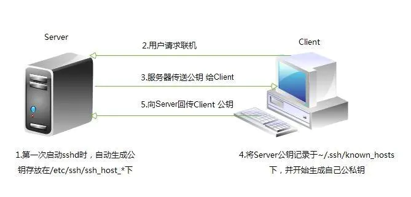
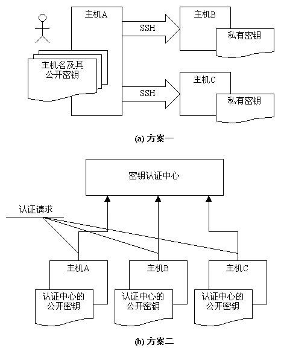

# SSH概述

**SSH**是（Secure SHell protocol） 的简写，安全外壳协议（SSH）是一种在不安全网络上提供安全远程登录及其它安全网络服务的协议。　　

**OpenSSH** 是SSH （Secure SHell）协议的免费开源实现。SSH协议族可以用来进行远程控制，或在计算机之间传送文件。而实现此功能的传统方式，如telnet(终端仿真协议)、 rcp ftp、 rlogin、rsh都是极为不安全的，并且会使用明文传送密码。OpenSSH提供了服务端后台程序和客户端工具，用来加密远程控件和文件传输过程的中的数据，并由此来代替原来的类似服务。

在过去我们使用的rsh和telnet，因为包括登录时的ID和密码数据没有加密就传到网络上，存在安全上的问题。即使在内部网上，也有在因特网上的窃取和篡改等危险性。SSH将包括密码在内的所有数据都已进行了加密处理，可以进行更安全的远程操作。在SSH中，由于协议标准的不同而存在SSH1和SSH2两个不同的版本。SSH2是为了回避SSH1所使用的加密算法的许可证问题而开发的（现在这一许可证问题已经不存在了）。TLES 8中作为安装SSH协议的应用程序采用了开放源码的OpenSSH。OpenSSH与SSH1和SSH2的任何一个协议都能对应，但默认使用SSH2。

> 更详细的说明以及安装使用，请参考官网：[http://www.openssh.com/](http://www.openssh.com/)

# 主要功能

- 类似 telnet 的远程联机使用 shell 的服务器，即 ssh。
- 类似 FTP 服务的 sftp-server ，提供更安全的 FTP 服务。

.webp)

SSH 功能

# 工作原理



**SSH工作原理**

> **服务器建立公钥：** 每一次启动 sshd 服务时，该服务会主动去找 /etc/ssh/ssh_host* 的文件，若系统刚刚安装完成时，由于没有这些公钥，因此 sshd 会主动去计算出这些需要的公钥，同时也会计算出服务器自己需要的私钥。
>
> **客户端主动联机请求：** 若客户端想要联机到 ssh 服务器，则需要使用适当的客户端程序来联机，包括 ssh, putty 等客户端程序连接。
>
> **服务器传送公钥给客户端：** 接收到客户端的要求后，服务器便将第一个步骤取得的公钥传送给客户端使用 (此时应是明码传送，反正公钥本来就是给大家使用的)。
>
> **客户端记录并比对服务器的公钥数据及随机计算自己的公私钥：** 若客户端第一次连接到此服务器，则会将服务器的公钥记录到客户端的用户家目录内的 ~/.ssh/known_hosts 。若是已经记录过该服务器的公钥，则客户端会去比对此次接收到的与之前的记录是否有差异。若接受此公钥， 则开始计算客户端自己的公私钥。
>
> **回传客户端的公钥到服务器端：** 用户将自己的公钥传送给服务器。此时服务器：具有服务器的私钥与客户端的公钥，而客户端则是： 具有服务器的公钥以及客户端自己的私钥，你会看到，在此次联机的服务器与客户端的密钥系统 (公钥+私钥) 并不一样，所以才称为非对称加密系统。
>
> **开始双向加解密：** (1)服务器到客户端：服务器传送数据时，拿用户的公钥加密后送出。客户端接收后，用自己的私钥解密 (2)客户端到服务器：客户端传送数据时，拿服务器的公钥加密后送出。服务器接收后，用服务器的私钥解密，这样就能保证通信安全。

# 组成

**SSH** 主要有三部分组成：

1. [传输层]()协议 [SSH-TRANS] 提供了服务器认证，保密性及完整性。此外它有时还提供压缩功能。 SSH-TRANS 通常运行在 TCP/IP连接上，也可能用于其它可靠数据流上。 SSH-TRANS 提供了强力的[加密技术]()、密码[主机]()认证及完整性保护。该协议中的认证基于主机，并且该协议不执行[用户认证]()。更高层的用户认证协议可以设计为在此协议之上。

2. [用户认证协议]() [SSH-USERAUTH] 用于向服务器提供客户端用户鉴别功能。它运行在[传输层]()协议 SSH-TRANS 上面。当 SSH-USERAUTH 开始后，它从低层协议那里接收会话[标识符]()（从第一次[密钥]()交换中的交换哈希 H ）。会话标识符唯一标识此会话并且适用于标记以证明私钥的所有权。 SSH-USERAUTH 也需要知道低层协议是否提供保密性保护。

3. [连接协议]() [SSH-CONNECT] 将多个加密隧道分成逻辑通道。它运行在[用户认证]()协议上。它提供了[交互式登录]()话路、远程命令执行、转发 TCP/IP 连接和转发 X11 连接。

   一旦建立一个安全传输层连接，客户机就发送一个服务请求。当用户认证完成之后，会发送第二个服务请求。这样就允许新定义的协议可以与上述协议共存。连接协议提供了用途广泛的各种通道，有标准的方法用于建立安全交互式会话外壳和转发（“[隧道技术]()”）专有 TCP/IP 端口和 X11 连接。

   通过使用SSH，你可以把所有传输的数据进行加密，这样"中间人"这种攻击方式就不可能实现了，而且也能够防止DNS欺骗和IP欺骗。使用SSH，还有一个额外的好处就是传输的数据是经过压缩的，所以可以加快传输的速度。SSH有很多功能，它既可以代替Telnet，又可以为FTP、PoP、甚至为PPP提供一个安全的"通道"。

> 传输层协议（The Transport Layer Protocol）提供服务器认证，数据机密性，信息完整性 等的支持；
>
> 用户认证协议（The User Authentication Protocol） 则为服务器提供客户端的身份鉴别；
>
> 连接协议（The Connection Protocol） 将加密的信息隧道复用成若干个逻辑通道，提供给更高层的应用协议使用； 各种高层应用协议可以相对地独立于SSH基本体系之外，并依靠这个基本框架，通过连接协议使用SSH的安全机制。

同时SSH协议框架中还为许多高层的网络安全应用协议提供扩展的支持。它们之间的层次关系可以用如下图来表示：


SSH协议框架

# 认证方式

- 基于口令的认证：这个就不用说了，就是输入用户名和密码

- 基于密钥的认证，具体步骤如下:
   　(1).客户端建立两把钥匙(公钥与私钥)
   
   (2).将公钥数据上传到服务器上
   
   (3).将公钥放置服务器端的正确目录与文件名（scp 或 ssh-copy-id）

对于SSH这样以提供安全通讯为目标的协议，其中必不可少的就是一套完备的密钥机制。由于SSH协议是面向互联网网络中主机之间的互访与信息交换，所以主机密钥成为基本的密钥机制。也就是说，SSH协议要求每一个使用本协议的主机都必须至少有一个自己的主机密钥对，服务方通过对客户方主机密钥的认证之后，才能允许其连接请求。一个主机可以使用多个密钥，针对不同的密钥算法而拥有不同的密钥，但是至少有一种是必备的，即通过 DSS算法产生的密钥。关于DSS算法，请参考[FIPS-186](https://link.jianshu.com?t=http://csrc.nist.gov/publications/fips/fips186-3/fips_186-3.pdf) 文档.SSH协议关于主机密钥认证的管理方案有两种，如下图所示:



​																			SSH主机密钥认证

每一个主机都必须有自己的主机密钥，密钥可以有多对，每一对主机密钥对包括公开密钥和私有密钥。在实际应用过程中怎样使用这些密钥，并依赖它们来实现安全特性呢？如上图所示，SSH协议框架中提出了两种方案。

在第一种方案中，主机将自己的公用密钥分发给相关的客户机，客户机在访问主机时则使用该主机的公开密钥来加密数据，主机则使用自己的私有密钥来解密数据，从而实现主机密钥认证，确定客户机的可靠身份。在图2（a）中可以看到，用户从主机A上发起操作，去访问，主机B和主机C，此时，A成为客户机，它必须事先配置主机B和主机C的公开密钥，在访问的时候根据主机名来查找相应的公开密钥。对于被访问主机（也就是服务器端）来说则只要保证安全地存储自己的私有密钥就可以了。　

在第二种方案中，存在一个密钥认证中心，所有系统中提供服务的主机都将自己的公开密钥提交给认证中心，而任何作为客户机的主机则只要保存一份认证中心的公开密钥就可以了。在这种模式下，客户机在访问服务器主机之前，还必须向密钥认证中心请求认证，认证之后才能够正确地连接到目的主机上。

很显然，第一种方式比较容易实现，但是客户机关于密钥的维护却是个麻烦事，因为每次变更都必须在客户机上有所体现；第二种方式比较完美地解决管理维护问题，然而这样的模式对认证中心的要求很高，在互联网络上要实现这样的集中认证，单单是权威机构的确定就是个大麻烦，有谁能够什么都能说了算呢？但是从长远的发展来看，在企业应用和商业应用领域，采用中心认证的方案是必要的。

另外，SSH协议框架中还允许对主机密钥的一个折中处理，那就是首次访问免认证。首次访问免认证是指，在某客户机第一次访问主机时，主机不检查主机密钥，而向该客户都发放一个公开密钥的拷贝，这样在以后的访问中则必须使用该密钥，否则会被认为非法而拒绝其访问。

# 工作过程

在整个通讯过程中，为实现 SSH的安全连接，服务器端与客户端要经历如下五个阶段：
 \* 版本号协商阶段，SSH目前包括 SSH1和SSH2两个版本， 双方通过版本协商确定使用的版本
 \* 密钥和算法协商阶段，SSH支持多种加密算法， 双方根据本端和对端支持的算法，协商出最终使用的算法
 \* 认证阶段，SSH客户端向服务器端发起认证请求， 服务器端对客户端进行认证
 \* 会话请求阶段， 认证通过后，客户端向服务器端发送会话请求
 \* 交互会话阶段 ，会话请求通过后，服务器端和客户端进行信息的交互

1. **版本号协商阶段**
    　1. 服务器打开端口 22，等待客户端连接。
    2. 客户端向服务器端发起 TCP初始连接请求，TCP连接建立后，服务器向客户端发送第一个报文，包括版本标志字符串，格式为“SSH－<主协议版本号>.<次协议版本号>－<软件版本号>”，协议版本号由主版本号和次版本号组成，软件版本号主要是为调试使用。
    3. 客户端收到报文后，解析该数据包，如果服务器端的协议版本号比自己的低，且客户端能支持服务器端的低版本，就使用服务器端的低版本协议号，否则使用自己的协议版本号。
    4. 客户端回应服务器一个报文，包含了客户端决定使用的协议版本号。服务器比较客户端发来的版本号，决定是否能同客户端一起工作。
    5. 如果协商成功，则进入密钥和算法协商阶段，否则服务器端断开 TCP连接。

> Note： 版本号协商阶段报文都是采用明文方式传输的。

- **密钥和算法协商阶段**
   　1. 服务器端和客户端分别发送算法协商报文给对端，报文中包含自己支持的公钥算法列表、加密算法列表、MAC（Message Authentication Code，消息验证码）算法列表、压缩算法列表等;
   2. 服务器端和客户端根据对端和本端支持的算法列表得出最终使用的算法。
   3. 服务器端和客户端利用 DH交换（Diffie-Hellman Exchange）算法、主机密钥对等参数，生成会话密钥和会话 ID。

  

  ```undefined
  通过以上步骤，服务器端和客户端就取得了相同的会话密钥和会话ID。
      * 对于后续传输的数据，两端都会使用会话密钥进行加密和解密，保证了数据传送的安全
      * 在认证阶段，两端会使用会话 ID用于认证过程。
  ```

> Note：
>  　在协商阶段之前，服务器端已经生成 RSA或 DSA密钥对，他们主要用于参与会话密钥的生成。

- **认证阶段**
    1. 客户端向服务器端发送认证请求，认证请求中包含用户名、认证方法、与该认证方法相关的内容（如：password认证时，内容为密码）。
    2. 服务器端对客户端进行认证，如果认证失败，则向客户端发送认证失败消息，其中包含可以再次认证的方法列表。
    3. 客户端从认证方法列表中选取一种认证方法再次进行认证。
    4. 该过程反复进行， 直到认证成功或者认证次数达到上限， 服务器关闭连接为止。

> **SSH提供两种认证方式：**
>  　1. password认证：客户端向服务器发出 password认证请求，将用户名和密码加密后发送给服务器；服务器将该信息解密后得到用户名和密码的明文，与设备上保存的用户名和密码进行比较，并返回认证成功或失败的消息。
>  　2. publickey 认证：采用数字签名的方法来认证客户端。目前，设备上可以利用RSA和 DSA两种公共密钥算法实现数字签名。客户端发送包含用户名、公共密钥和公共密钥算法的 publickey 认证请求给服务器端。服务器对公钥进行合法性检查，如果不合法，则直接发送失败消息；否则，服务器利用数字签名对客户端进行认证，并返回认证成功或失败的消息
>  **SSH2.0还提供了 password-publickey 认证和 any 认证:**
>  　1. password-publickey 认证：指定该用户的认证方式为 password 和 publickey认证同时满足。客户端版本为 SSH1的用户只要通过其中一种认证即可登录；客户端版本为 SSH2的用户必须两种认证都通过才能登录。
>  　2. any认证：指定该用户的认证方式可以是 password，也可以是 publickey。

- **会话请求阶段**
  1. 服务器等待客户端的请求；
  2. 认证通过后，客户端向服务器发送会话请求；
  3. 服务器处理客户端的请求。请求被成功处理后， 服务器会向客户端回应 SSH_SMSG_SUCCESS包，SSH进入交互会话阶段；否则回应 SSH_SMSG_FAILURE包，表示服务器处理请求失败或者不能识别请求。
- **交互会话阶段**
   在这个模式下，数据被双向传送：
   　1. 客户端将要执行的命令加密后传给服务器;
   　2. 服务器接收到报文，解密后执行该命令,将执行的结果加密发还给客户端;
   　3. 客户端将接收到的结果解密后显示到终端上.

# SSH Q&A

**Q1: SSH的版本和区别。**
SSH2避免了RSA的专利问题，并修补了CRC的缺陷。SSH2用数字签名算法（DSA）和Diffie-Hellman（DH）算法代替RSA来完成对称密钥的交换，用HMAC来代替CRC。同时SSH2增加了AES和Twofish等对称加密算法。A1: SSH(Secure SHell)到目前为止有两个不兼容的版本——SSH1和SSH2。SSH1又分为1.3和1.5两个版本。SSH1采用DES、3DES、 Blowfish和RC4等对称加密算法保护数据安全传输，而对称加密算法的密钥是通过非对称加密算法（RSA）来完成交换的。SSH1使用循环冗余校验码（CRC）来保证数据的完整性，但是后来发现这种方法有缺陷。
 更多内容请参考The SSHv1 Protocol & The SSHv2 Protocol

**Q2: 什么是HMAC？**
A2: HMAC(Hash Message Authentication Code) ，散列消息鉴别码，基于密钥的Hash算法的认证协议。消息鉴别码实现鉴别的原理是，用公开函数和密钥产生一个固定长度的值作为认证标识，用这个标识鉴别消息的完整性。使用一个密钥生成一个固定大小的小数据块，即MAC，并将其加入到消息中，然后传输。接收方利用与发送方共享的密钥进行鉴别认证等。

**Q3: 什么是X11 forwarding？**
A3: sh的X11 forwarding特性可以使X client和X server安全地通讯。使用X11 forwarding后，从X client到X Server方向的数据先被送至ssh server，ssh server利用和ssh client的安全通道转发给ssh client，再由ssh client转发给X server，从X server到X client的数据流同理。这里ssh server和ssh client充当了X client和X server间数据的转发器，由于ssh server和X client、ssh client和X server一般在同一台机器上，它们之间是一种安全的进程间通讯，而ssh server和ssh client间的通讯也是安全的，所以X client和X server间的通讯就是安全的。

**Q4: 什么是TTY？**
A4: 终端是一种字符型设备，它有多种类型，通常使用tty来简称各种类型的终端设备。tty是 Teletype的缩写。Teletype是最早出现的一种终端设备，很象电传打字机，是由Teletype公司生产的。设备名放在特殊文件目录/dev/下。

**Q5: 简单描述下SSH运行的过程？**

```java
A5:简要过程如下
* Client端向Server端发起SSH连接请求。
* Server端向Client端发起版本协商。
* 协商结束后Server端发送Host Key公钥 Server Key公钥，随机数等信息。到这里所有通信是不加密的。
* Client端返回确认信息，同时附带用公钥加密过的一个随机数，用于双方计算Session Key。
* 进入认证阶段。从此以后所有通信均加密。
* 认证成功后，进入交互阶段。
```

作者：技术学习
链接：https://www.jianshu.com/p/8e5b7aea52b5
来源：简书
著作权归作者所有。商业转载请联系作者获得授权，非商业转载请注明出处。