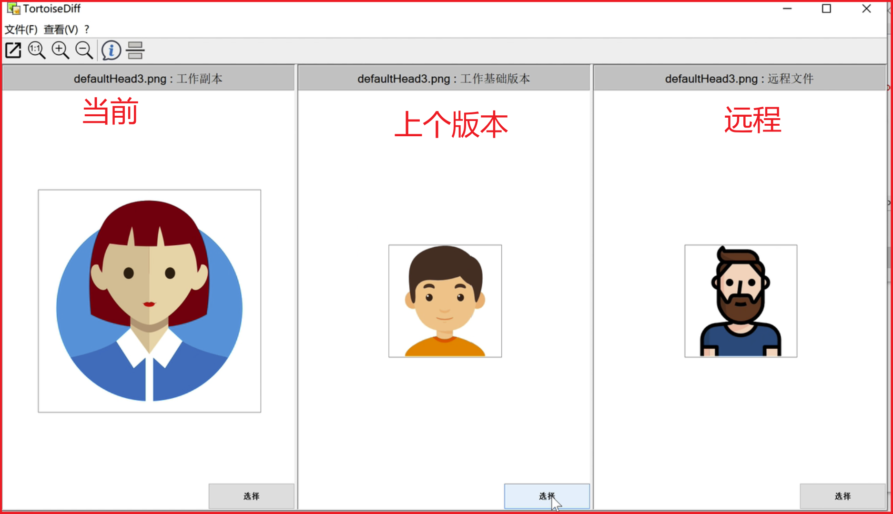

# SVN对比Git优势

使用简单，上手快

目录级权限控制，企业安全必备

子目录Checkout，减少不必要的文件检出

# SVN主要应用

开发人员用来做代码的版本管理

用来存储一些重要的文件，比如合同

公司内部文件共享，并且能按目录划分夜限

# SVN安装

直接安装TortoiseSVN客户端即可，不需要单独安装SVN。安装对应的汉化包进行汉化。

# TortoiseSVN使用

## checkout同步代码

对应git的克隆代码


## Update更新代码


## Commit提交代码


## 查看修改提交记录


## 撤销恢复操作

### 撤销本地修改


### 恢复到指定版本

1、本地版本恢复到指定版本


2、本地版本恢复到指定历史版本后，提交，使远程仓库与本地保持一致，也恢复到指定版本


## 忽略文件

有时候某些目录或者文件不想提交到 SVN 服务器，这时可以忽略这些文件。

1、忽略文件


2、忽略目录


添加到忽略文件或目录之后需要提交操作，使远程仓库也保持一致，撤销忽略，进行同样的操作

## 冲突解决

什么情况容易发生冲突？

多个人修改了同个文件的同一行

无法进行合并的二进制文件


怎么避免冲突？

经常update同步下他人的代码

二进制文件不要多个人同时操作


1、非二进制文件


2、二进制文件




## 分支

什么时候需要开分支

隔离线上版本和开发版本

大功能开发，不想影响到其他人，自己独立开个分支去开发|


## 代码暂存


## 复杂代码合并


# Windows使用SVN命令

下载**Apache Subversion command line tools**，这是一个可以在cmd下使用的命令行工具，解压后把里面bin目录这个路径添加到环境变量的path，这样在cmd下就可以使用了。

使用svnserve --help验证是否安装成功，成功标志：


Apache Subversion command line tools和TortoiseSVN一个借助cmd使用命令工具，一个是图形化界面客户端。两者不冲突，安装时都不需要单独再装SVN，根据使用习惯可以选择性安装，也可以两个都安装。

**SVN常用命令**

```sql
# checkout代码
svn co svn://svnbucket.com/xxx/xxx

# 更新代码
svn up

# 提交代码
svn commit -m "提交描述"

# 添加新文件到版本库
svn add filename

# 添加当前目录下所有php文件
svn add *.php

# 递归添加当前目录下的所有新文件
svn add . --no-ignore --force

# 查看指定文件的所有log
svn log test.php

# 查看指定版本号的log
svn svn log -r 100

# 撤销本地文件的修改（还没提交的）
svn revert test.php
svn revert -r 目录名

# 撤销目录下所有本地修改
svn revert --recursive 目录名

# 查看当前工作区的所有改动
svn diff

# 查看当前工作区test.php文件与最新版本的差异
svn diff test.php  

# 指定版本号比较差异
svn diff -r 200:201 test.php  

# 查看当前工作区和版本301中bin目录的差异
svn diff -r 301 bin

# 查看当前工作区的状态
svn status

# 查看svn信息
svn info

# 查看文件列表，可以指定-r查看，查看指定版本号的文件列表
svn ls 
svn ls -r 100

# 显示文件的每一行最后是谁修改的（出了BUG，经常用来查这段代码是谁改的）
svn blame filename.php

# 查看指定版本的文件内容，不加版本号就是查看最新版本的
svn cat test.py -r 2

# 清理
svn cleanup

# 若想创建了一个文件夹，并且把它加入版本控制，但忽略文件夹中的所有文件的内容
svn mkdir spool 
svn propset svn:ignore '*' spool 
svn ci -m 'Adding "spool" and ignoring its contents.'

# 若想创建一个文件夹，但不加入版本控制，即忽略这个文件夹
svn mkdir spool 
svn propset svn:ignore 'spool' . 
svn ci -m 'Ignoring a directory called "spool".'

# 切换当前项目到指定分支。服务器上更新新版本我们经常就用这个命令来把当前代码切换到新的分支
svn switch svn://svnbucket.com/test/branches/online1.0

# 重定向仓库地址到新地址
svn switch --relocate 原svn地址 新svn地址

# 创建分支，从主干创建一个分支保存到branches/online1.0
svn cp -m "描述内容" http://svnbucket.com/repos/trunk http://svnbucket.com/repos/branches/online1.0

# 合并主干上的最新代码到分支上
cd branches/online1.0
svn merge http://svnbucket.com/repos/trunk 

# 分支合并到主干
svn merge --reintegrate http://svnbucket.com/repos/branches/online1.0

# 删除分支
svn rm http://svnbucket.com/repos/branches/online1.0

# 查看SVN帮助
svn help

# 查看指定命令的帮助信息
svn help commit
```

eg：


