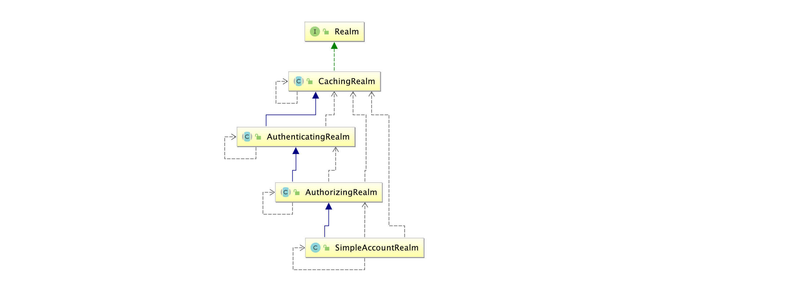
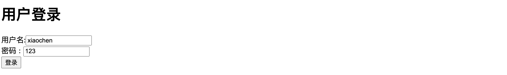

# shiro

## 一、权限的管理

### 1.1 什么是权限管理

基本上涉及到用户参与的系统都要进行权限管理，权限管理属于系统安全的范畴，权限管理实现对用户访问系统的控制，按照安全规则或者安全策略控制用户可以访问而且只能访问自己被授权的资源。

权限管理包括用户身份认证和授权两部分，简称认证授权。对于需要访问控制的资源用户首先经过身份认证，认证通过后用户具有该资源的访问权限方可访问。

### 1.2 什么是身份认证

身份认证，就是判断一个用户是否为合法用户的处理过程。最常用的简单身份认证方式是系统通过核对用户输入的用户名和口令，看其是否与系统中存储的该用户的用户名和口令一致，来判断用户身份是否正确。对于采用指纹等系统，则出示指纹；对于硬件Key等刷卡系统，则需要刷卡。

### 1.3 什么是授权

授权，即访问控制，控制谁能访问哪些资源。主体进行身份认证后需要分配权限方可访问系统的资源，对于某些资源没有权限是无法访问的

## 二、什么是shiro

> Apache Shiro™ is a powerful and easy-to-use Java security framework that performs authentication, authorization, cryptography, and session management. With Shiro’s easy-to-understand API, you can quickly and easily secure any application – from the smallest mobile applications to the largest web and enterprise applications.
>
> Shiro 是一个功能强大且易于使用的Java安全框架，它执行身份验证、授权、加密和会话管理。使用Shiro易于理解的API，您可以快速轻松地保护任何应用程序—从最小的移动应用程序到最大的web和企业应用程序。
>

Shiro是apache旗下一个开源框架，它将软件系统的安全认证相关的功能抽取出来，实现用户身份认证，权限授权、加密、会话管理等功能，组成了一个通用的安全认证框架。

## 三、shiro的核心架构


### 3.1 Subject

Subject即主体，外部应用与subject进行交互，subject记录了当前操作用户，将用户的概念理解为当前操作的主体，可能是一个通过浏览器请求的用户，也可能是一个运行的程序。

Subject在shiro中是一个接口，接口中定义了很多认证授相关的方法，外部程序通过subject进行认证授，而subject是通过SecurityManager安全管理器进行认证授权

### 3.2 SecurityManager

SecurityManager即安全管理器，对全部的subject进行安全管理，它是shiro的核心，负责对所有的subject进行安全管理。通过SecurityManager可以完成subject的认证、授权等，实质上SecurityManager是通过Authenticator进行认证，通过Authorizer进行授权，通过SessionManager进行会话管理等。

SecurityManager是一个接口，继承了Authenticator, Authorizer, SessionManager这三个接口。

### 3.3 Authenticator

Authenticator即认证器，对用户身份进行认证，Authenticator是一个接口，shiro提供ModularRealmAuthenticator实现类，通过ModularRealmAuthenticator基本上可以满足大多数需求，也可以自定义认证器。

### 3.4 Authorizer

Authorizer即授权器，用户通过认证器认证通过，在访问功能时需要通过授权器判断用户是否有此功能的操作权限。

### 3.5 Realm

`Realm即领域，相当于datasource数据源`，securityManager进行安全认证需要通过Realm获取用户权限数据，比如：如果用户身份数据在数据库那么realm就需要从数据库获取用户身份信息。

 注意：不要把realm理解成只是从数据源取数据，在realm中还有认证授权校验的相关的代码。

### 3.6 SessionManager

`sessionManager即会话管理`，shiro框架定义了一套会话管理，它不依赖web容器的session，所以shiro可以使用在非web应用上，也可以将分布式应用的会话集中在一点管理，此特性可使它实现单点登录。

### 3.7 SessionDAO

`SessionDAO即会话dao`，是对session会话操作的一套接口，比如要将session存储到数据库，可以通过jdbc将会话存储到数据库。

### 3.8 CacheManager

`CacheManager即缓存管`，将用户权限数据存储在缓存，这样可以提高性能。

### 3.9 Cryptography

`Cryptography即密码管理`，shiro提供了一套加密/解密的组件，方便开发。比如提供常用的散列、加/解密等功能。

## 四、shiro中的认证

### 4.1 认证

身份认证，就是判断一个用户是否为合法用户的处理过程。最常用的简单身份认证方式是系统通过核对用户输入的用户名和口令，看其是否与系统中存储的该用户的用户名和口令一致，来判断用户身份是否正确。

### 4.2 shiro中认证的关键对象

**Subject：主体**
访问系统的用户，主体可以是用户、程序等，进行认证的都称为主体；

**Principal：身份信息**
是主体（subject）进行身份认证的标识，标识必须具有唯一性，如用户名、手机号、邮箱地址等，一个主体可以有多个身份，但是必须有一个主身份（Primary Principal）。

**credential：凭证信息**
是只有主体自己知道的安全信息，如密码、证书等。

### 4.3 认证流程


### 4.4 认证的开发

#### 1、创建项目并引入依赖

````xml
<dependency>
  <groupId>org.apache.shiro</groupId>
  <artifactId>shiro-core</artifactId>
  <version>1.5.3</version>
</dependency>
````

#### 2、引入shiro配置文件

配置文件：名称随意，以 .ini 结尾，放在 resources 目录下

注意：在实际的项目开发中并不会使用这种方式，这种方法可以用来初学时练手

````ini
[users]
zhangsan=123456
lisi=456789
````


#### 3、开发认证代码

````java
package com.lut.test;

import org.apache.shiro.SecurityUtils;
import org.apache.shiro.authc.IncorrectCredentialsException;
import org.apache.shiro.authc.UnknownAccountException;
import org.apache.shiro.authc.UsernamePasswordToken;
import org.apache.shiro.mgt.DefaultSecurityManager;
import org.apache.shiro.realm.text.IniRealm;
import org.apache.shiro.subject.Subject;

public class test01 {
    public static void main(String[] args) {
        //1.创建安全管理器对象
        DefaultSecurityManager securityManager = new DefaultSecurityManager();
        //2.给安全管理器设置realm
        securityManager.setRealm(new IniRealm("classpath:shiro.ini"));
        //3.SecurityUtils给全局安全工具类设置安全管理器
        SecurityUtils.setSecurityManager(securityManager);
        //4.关键对象subject主体
        Subject subject = SecurityUtils.getSubject();
        //5.创建令牌
        UsernamePasswordToken token = new UsernamePasswordToken("zhangsan","123789");
        try {
            System.out.println("认证状态"+subject.isAuthenticated());//fasle
            //用户认证
            subject.login(token);
            System.out.println("认证状态"+subject.isAuthenticated());
        }catch (UnknownAccountException e){
            e.printStackTrace();
            System.out.println("认证失败，用户名不存在");
        }catch (IncorrectCredentialsException e){
            e.printStackTrace();
            System.out.println("认证失败，密码错误");
        }
    }
}
````

#### 4.常见的异常类型

- DisabledAccountException（帐号被禁用）
- LockedAccountException（帐号被锁定）
- ExcessiveAttemptsException（登录失败次数过多）
- ExpiredCredentialsException（凭证过期）等

### 4.5 自定义Realm


#### 通过分析源码可得：

> 认证：
>
> 1.最终执行用户名比较是 在SimpleAccountRealm类 的 doGetAuthenticationInfo 方法中完成用户名校验
>
> 2.最终密码校验是在 AuthenticatingRealm类 的 assertCredentialsMatch方法 中
>
> 总结：
>
> AuthenticatingRealm 认证realm doGetAuthenticationInf
>
> AuthorizingRealm 授权realm doGetAuthorizationInfo
> 

自定义Realm的作用：放弃使用.ini文件，使用数据库查询

上边的程序使用的是Shiro自带的IniRealm，IniRealm从ini配置文件中读取用户的信息，大部分情况下需要从系统的数据库中读取用户信息，所以需要自定义realm。

#### 1.shiro提供的Realm


#### 2.根据认证源码认证使用的是SimpleAccountRealm




SimpleAccountRealm的部分源码中有两个方法一个是 认证 一个是 授权,

源码部分：

```java
public class SimpleAccountRealm extends AuthorizingRealm {
		//.......省略
    protected AuthenticationInfo doGetAuthenticationInfo(AuthenticationToken token) throws AuthenticationException {
        UsernamePasswordToken upToken = (UsernamePasswordToken) token;
        SimpleAccount account = getUser(upToken.getUsername());

        if (account != null) {

            if (account.isLocked()) {
                throw new LockedAccountException("Account [" + account + "] is locked.");
            }
            if (account.isCredentialsExpired()) {
                String msg = "The credentials for account [" + account + "] are expired";
                throw new ExpiredCredentialsException(msg);
            }

        }

        return account;
    }

    protected AuthorizationInfo doGetAuthorizationInfo(PrincipalCollection principals) {
        String username = getUsername(principals);
        USERS_LOCK.readLock().lock();
        try {
            return this.users.get(username);
        } finally {
            USERS_LOCK.readLock().unlock();
        }
    }
}

3.自定义realm
package com.lut.realm;
```
#### 3.自定义realm

```java
package com.lut.realm;

import org.apache.shiro.authc.AuthenticationException;
import org.apache.shiro.authc.AuthenticationInfo;
import org.apache.shiro.authc.AuthenticationToken;
import org.apache.shiro.authc.SimpleAuthenticationInfo;
import org.apache.shiro.authz.AuthorizationInfo;
import org.apache.shiro.realm.AuthorizingRealm;
import org.apache.shiro.subject.PrincipalCollection;

/**
 * 自定义Realm
 */
public class CustomerRealm extends AuthorizingRealm {
    //授权
    @Override
    protected AuthorizationInfo doGetAuthorizationInfo(PrincipalCollection principals) {
        System.out.println("==================");
        return null;
    }

    //认证
    @Override
    protected AuthenticationInfo doGetAuthenticationInfo(AuthenticationToken token) throws AuthenticationException {
        //在token中获取 用户名
        String principal = (String) token.getPrincipal();
        System.out.println(principal);

        //实际开发中应当 根据身份信息使用jdbc mybatis查询相关数据库
        //在这里只做简单的演示
        //假设username,password是从数据库获得的信息
        String username="zhangsan";
        String password="123456";
        if(username.equals(principal)){
            //参数1:返回数据库中正确的用户名
            //参数2:返回数据库中正确密码
            //参数3:提供当前realm的名字 this.getName();
            SimpleAuthenticationInfo simpleAuthenticationInfo = new SimpleAuthenticationInfo(principal,password,this.getName());
            return simpleAuthenticationInfo;
        }
        return null;
    }
}


```
#### 4.测试自定义的Realm

```java
package com.lut.test;

import com.lut.realm.CustomerRealm;
import org.apache.shiro.SecurityUtils;
import org.apache.shiro.authc.IncorrectCredentialsException;
import org.apache.shiro.authc.UnknownAccountException;
import org.apache.shiro.authc.UsernamePasswordToken;
import org.apache.shiro.mgt.DefaultSecurityManager;
import org.apache.shiro.subject.Subject;

/**
 * 测试自定义的Realm
 */
public class TestAuthenticatorCusttomerRealm {

    public static void main(String[] args) {
        //1.创建安全管理对象 securityManager
        DefaultSecurityManager defaultSecurityManager = new DefaultSecurityManager();

        //2.给安全管理器设置realm（设置为自定义realm获取认证数据）
        defaultSecurityManager.setRealm(new CustomerRealm());
        //IniRealm realm = new IniRealm("classpath:shiro.ini");

        //3.给安装工具类中设置默认安全管理器
        SecurityUtils.setSecurityManager(defaultSecurityManager);

        //4.获取主体对象subject
        Subject subject = SecurityUtils.getSubject();

        //5.创建token令牌
        UsernamePasswordToken token = new UsernamePasswordToken("zhangsan", "123");
        try {
            subject.login(token);//用户登录
            System.out.println("登录成功~~");
        } catch (UnknownAccountException e) {
            e.printStackTrace();
            System.out.println("用户名错误!!");
        }catch (IncorrectCredentialsException e){
            e.printStackTrace();
            System.out.println("密码错误!!!");
        }

    }
}


```

### 4.6 使用MD5+Salt+Hash

**补充：MD5算法**

作用：一般用来加密或者签名（校验和）

特点：MD5算法不可逆如何内容相同无论执行多少次md5生成结果始终是一致

网络上提供的MD5在线解密一般是用穷举的方法

生成结果：始终是一个16进制32位长度字符串

**MD5的基本使用：**

```java
package com.lut.test;

import org.apache.shiro.crypto.hash.Md5Hash;

public class TestShiroMD5 {
    
    public static void main(String[] args) {

        //使用md5
        Md5Hash md5Hash = new Md5Hash("123");
        System.out.println(md5Hash.toHex());

        //使用MD5 + salt处理
        Md5Hash md5Hash1 = new Md5Hash("123", "X0*7ps");
        System.out.println(md5Hash1.toHex());

        //使用md5 + salt + hash散列（参数代表要散列多少次，一般是 1024或2048）
        Md5Hash md5Hash2 = new Md5Hash("123", "X0*7ps", 1024);
        System.out.println(md5Hash2.toHex());

    }
}
```
输出结果：

````java
202cb962ac59075b964b07152d234b70
bad42e603db5b50a78d600917c2b9821
7268f6d32ec8d6f4c305ae92395b00e8
````

> 实际应用：将 盐和散列 后的值存在数据库中，自动realm从数据库取出盐和加密后的值由shiro完成密码校验。

#### 1.自定义md5+salt的realm

````java
package com.lut.realm;

import org.apache.shiro.authc.AuthenticationException;
import org.apache.shiro.authc.AuthenticationInfo;
import org.apache.shiro.authc.AuthenticationToken;
import org.apache.shiro.authc.SimpleAuthenticationInfo;
import org.apache.shiro.authz.AuthorizationInfo;
import org.apache.shiro.authz.SimpleAuthorizationInfo;
import org.apache.shiro.realm.AuthorizingRealm;
import org.apache.shiro.subject.PrincipalCollection;
import org.apache.shiro.util.ByteSource;

/**
 * 使用自定义realm 加入md5 + salt +hash
 */
public class CustomerMd5Realm extends AuthorizingRealm {

    //授权
    @Override
    protected AuthorizationInfo doGetAuthorizationInfo(PrincipalCollection principals) {
        return null;
    }

    @Override
    protected AuthenticationInfo doGetAuthenticationInfo(AuthenticationToken token) throws AuthenticationException {
        //获取 token中的 用户名
        String principal = (String) token.getPrincipal();

        //假设这是从数据库查询到的信息
        String username="zhangsan";
        String password="7268f6d32ec8d6f4c305ae92395b00e8";//加密后

        //根据用户名查询数据库
        if (username.equals(principal)) {
            //参数1:数据库用户名
            //参数2:数据库md5+salt之后的密码
            //参数3:注册时的随机盐
            //参数4:realm的名字
            return new SimpleAuthenticationInfo(principal,
                    password,
                    ByteSource.Util.bytes("@#$*&QU7O0!"),
                    this.getName());
        }
        return null;
    }
}
````

#### 2.使用md5+salt 认证

```java
package com.lut.test;

import com.lut.realm.CustomerMd5Realm;
import org.apache.shiro.SecurityUtils;
import org.apache.shiro.authc.IncorrectCredentialsException;
import org.apache.shiro.authc.UnknownAccountException;
import org.apache.shiro.authc.UsernamePasswordToken;
import org.apache.shiro.authc.credential.HashedCredentialsMatcher;
import org.apache.shiro.mgt.DefaultSecurityManager;
import org.apache.shiro.subject.Subject;

import java.util.Arrays;

public class TestCustomerMd5RealmAuthenicator {

    public static void main(String[] args) {

        //1.创建安全管理器
        DefaultSecurityManager defaultSecurityManager = new DefaultSecurityManager();

        //2.注入realm
        CustomerMd5Realm realm = new CustomerMd5Realm();

        //3.设置realm使用hash凭证匹配器
        HashedCredentialsMatcher credentialsMatcher = new HashedCredentialsMatcher();
        //声明：使用的算法
        credentialsMatcher.setHashAlgorithmName("md5");
        //声明：散列次数
        credentialsMatcher.setHashIterations(1024);
        realm.setCredentialsMatcher(credentialsMatcher);
        defaultSecurityManager.setRealm(realm);

        //4.将安全管理器注入安全工具
        SecurityUtils.setSecurityManager(defaultSecurityManager);

        //5.通过安全工具类获取subject
        Subject subject = SecurityUtils.getSubject();

        //6.认证
        UsernamePasswordToken token = new UsernamePasswordToken("zhangsan", "123");

        try {
            subject.login(token);
            System.out.println("登录成功");
        } catch (UnknownAccountException e) {
            e.printStackTrace();
            System.out.println("用户名错误");
        }catch (IncorrectCredentialsException e){
            e.printStackTrace();
            System.out.println("密码错误");
        }
    }
}
```

## 五、shiro中的授权

### 5.1 授权

授权，即访问控制，控制谁能访问哪些资源。主体进行身份认证后需要分配权限方可访问系统的资源，对于某些资源没有权限是无法访问的。

### 5.2 关键对象

授权可简单理解为who对what(which)进行How操作：

Who，即主体（Subject），主体需要访问系统中的资源。

What，即资源（Resource)，如系统菜单、页面、按钮、类方法、系统商品信息等。资源包括资源类型和资源实例，比如商品信息为资源类型，类型为t01的商品为资源实例，编号为001的商品信息也属于资源实例。

How，权限/许可（Permission)，规定了主体对资源的操作许可，权限离开资源没有意义，如用户查询权限、用户添加权限、某个类方法的调用权限、编号为001用户的修改权限等，通过权限可知主体对哪些资源都有哪些操作许可。

### 5.3 授权流程


### 5.4 授权方式

基于角色的访问控制

RBAC基于角色的访问控制（Role-Based Access Control）是以角色为中心进行访问控制

````java
if(subject.hasRole("admin")){
   //操作什么资源
}
````

基于资源的访问控制

RBAC基于资源的访问控制（Resource-Based Access Control）是以资源为中心进行访问控制

````java
if(subject.isPermission("user:update:01")){ //资源实例
  //对资源01用户具有修改的权限
}
if(subject.isPermission("user:update:*")){  //资源类型
  //对 所有的资源 用户具有更新的权限
}

````

### 5.5 权限字符串

权限字符串的规则是：资源标识符：操作：资源实例标识符，意思是对哪个资源的哪个实例具有什么操作，“:”是资源/操作/实例的分割符，权限字符串也可以使用*通配符。

例子：

- 用户创建权限：user:create，或user:create:*
- 用户修改实例001的权限：user:update:001
- 用户实例001的所有权限：user:*：001

### 5.6 shiro中授权编程实现方式

**编程式**

````java
Subject subject = SecurityUtils.getSubject();
if(subject.hasRole(“admin”)) {
	//有权限
} else {
	//无权限
}

````

**注解式**

````java
@RequiresRoles("admin")
public void hello() {
	//有权限
}
````

**标签式**

````jsp
JSP/GSP 标签：在JSP/GSP 页面通过相应的标签完成：
<shiro:hasRole name="admin">
	<!— 有权限—>
</shiro:hasRole>
注意: Thymeleaf 中使用shiro需要额外集成!

````

### 5.7 开发授权

#### 1.realm的实现

````java
package com.lut.realm;

import org.apache.shiro.authc.AuthenticationException;
import org.apache.shiro.authc.AuthenticationInfo;
import org.apache.shiro.authc.AuthenticationToken;
import org.apache.shiro.authc.SimpleAuthenticationInfo;
import org.apache.shiro.authz.AuthorizationInfo;
import org.apache.shiro.authz.SimpleAuthorizationInfo;
import org.apache.shiro.realm.AuthorizingRealm;
import org.apache.shiro.subject.PrincipalCollection;
import org.apache.shiro.util.ByteSource;


/**
 * 使用自定义realm 加入md5 + salt +hash
 * 实现授权操作
 */
public class CustomerMd5Realm extends AuthorizingRealm {

    //授权
    @Override
    protected AuthorizationInfo doGetAuthorizationInfo(PrincipalCollection principals) {

        String primaryPrincipal = (String)principals.getPrimaryPrincipal();
        System.out.println("身份信息: "+primaryPrincipal); //用户名

        //根据身份信息 用户名 获取当前用户的角色信息，以及权限信息
        SimpleAuthorizationInfo simpleAuthorizationInfo = new SimpleAuthorizationInfo();
        //假设 admin,user 是从数据库查到的 角色信息
        simpleAuthorizationInfo.addRole("admin");
        simpleAuthorizationInfo.addRole("user");
        //假设 ... 是从数据库查到的 权限信息赋值给权限对象
        simpleAuthorizationInfo.addStringPermission("user:*:01");
        simpleAuthorizationInfo.addStringPermission("prodect:*");//第三个参数为*省略

        return simpleAuthorizationInfo;
    }

    //认证
    @Override
    protected AuthenticationInfo doGetAuthenticationInfo(AuthenticationToken token) throws AuthenticationException {
        //获取 token中的 用户名
        String principal = (String) token.getPrincipal();

        //假设这是从数据库查询到的信息
        String username="zhangsan";
        String password="7268f6d32ec8d6f4c305ae92395b00e8";//加密后

        //根据用户名查询数据库
        if (username.equals(principal)) {
            //参数1:数据库用户名
            //参数2:数据库md5+salt之后的密码
            //参数3:注册时的随机盐
            //参数4:realm的名字
            return new SimpleAuthenticationInfo(principal,
                    password,
                    ByteSource.Util.bytes("@#$*&QU7O0!"),
                    this.getName());
        }
        return null;
    }
}
````

#### 2.授权

````java
package com.lut.test;

import com.lut.realm.CustomerMd5Realm;
import org.apache.commons.collections.ArrayStack;
import org.apache.shiro.SecurityUtils;
import org.apache.shiro.authc.IncorrectCredentialsException;
import org.apache.shiro.authc.UnknownAccountException;
import org.apache.shiro.authc.UsernamePasswordToken;
import org.apache.shiro.authc.credential.HashedCredentialsMatcher;
import org.apache.shiro.mgt.DefaultSecurityManager;
import org.apache.shiro.subject.Subject;

import java.util.Arrays;

public class TestCustomerMd5RealmAuthenicator {

    public static void main(String[] args) {

        //1.创建安全管理器
        DefaultSecurityManager defaultSecurityManager = new DefaultSecurityManager();

        //2.注入realm
        CustomerMd5Realm realm = new CustomerMd5Realm();

        //3.设置realm使用hash凭证匹配器
        HashedCredentialsMatcher credentialsMatcher = new HashedCredentialsMatcher();
        //声明：使用的算法
        credentialsMatcher.setHashAlgorithmName("md5");
        //声明：散列次数
        credentialsMatcher.setHashIterations(1024);
        realm.setCredentialsMatcher(credentialsMatcher);
        defaultSecurityManager.setRealm(realm);

        //4.将安全管理器注入安全工具
        SecurityUtils.setSecurityManager(defaultSecurityManager);

        //5.通过安全工具类获取subject
        Subject subject = SecurityUtils.getSubject();

        //6.认证
        UsernamePasswordToken token = new UsernamePasswordToken("zhangsan", "123");

        try {
            subject.login(token);
            System.out.println("登录成功");
        } catch (UnknownAccountException e) {
            e.printStackTrace();
            System.out.println("用户名错误");
        }catch (IncorrectCredentialsException e){
            e.printStackTrace();
            System.out.println("密码错误");
        }

        //授权
        if (subject.isAuthenticated()){

            //基于角色权限控制
            System.out.println(subject.hasRole("admin"));
            //基于多角色的权限控制
            System.out.println(subject.hasAllRoles(Arrays.asList("admin", "user")));//true
            System.out.println(subject.hasAllRoles(Arrays.asList("admin", "manager")));//false
            //是否具有其中一个角色
            boolean[] booleans = subject.hasRoles(Arrays.asList("admin", "user", "manager"));
            for (boolean aBoolean : booleans) {
                System.out.println(aBoolean);
            }

            System.out.println("====这是一个分隔符====");

            //基于权限字符串的访问控制  资源标识符：操作：资源类型
            //用户具有的权限 user:*:01  prodect:*
            System.out.println("权限:"+subject.isPermitted("user:update:01"));
            System.out.println("权限:"+subject.isPermitted("prodect:update:02"));

            //分别具有哪些权限
            boolean[] permitted = subject.isPermitted("user:*:01", "user:update:02");
            for (boolean b : permitted) {
                System.out.println(b);
            }

            //同时具有哪些权限
            boolean permittedAll = subject.isPermittedAll("prodect:*:01", "prodect:update:03");
            System.out.println(permittedAll);
        }
    }
}
````

## 六、整合SpringBoot项目实战

### 6.1 整合思路


### 6.2 配置环境

#### 1.创建项目


#### 2.引入依赖

````xml
<!--引入JSP解析依赖-->
<dependency>
     <groupId>org.apache.tomcat.embed</groupId>
     <artifactId>tomcat-embed-jasper</artifactId>
     </dependency>
<dependency>
     <groupId>jstl</groupId>
     <artifactId>jstl</artifactId>
     <version>1.2</version>
</dependency>
````

````xml
<!--引入shiro整合Springboot依赖-->
<dependency>
  <groupId>org.apache.shiro</groupId>
  <artifactId>shiro-spring-boot-starter</artifactId>
  <version>1.5.3</version>
</dependency>
````

#### 3.修改视图

````properties
server.port=8080
server.servlet.context-path=/shiro
spring.application.name=shiro

spring.mvc.view.prefix=/
spring.mvc.view.suffix=.jsp

````

#### 4.修改配置

JSP 与IDEA 与SpringBoot存在一定的不兼容，修改此配置即可解决


### 6.3 简单使用

#### 1.创建配置类

用来整合shiro框架相关的配置类

````java
package com.lut.config;

import com.lut.shiro.realms.CustomerRealm;
import org.apache.shiro.authc.credential.HashedCredentialsMatcher;
import org.apache.shiro.realm.Realm;
import org.apache.shiro.spring.web.ShiroFilterFactoryBean;
import org.apache.shiro.web.mgt.DefaultWebSecurityManager;
import org.springframework.context.annotation.Bean;
import org.springframework.context.annotation.Configuration;

import java.util.HashMap;
import java.util.Map;

/**
 * 用来整合shiro框架相关的配置类
 */
@Configuration
public class ShiroConfig {

    //1.创建shiroFilter  //负责拦截所有请求
    @Bean
    public ShiroFilterFactoryBean getShiroFilterFactoryBean(DefaultWebSecurityManager defaultWebSecurityManager){

        ShiroFilterFactoryBean shiroFilterFactoryBean = new ShiroFilterFactoryBean();
        //给filter设置安全管理器
        shiroFilterFactoryBean.setSecurityManager(defaultWebSecurityManager);

        //配置系统受限资源
        //配置系统公共资源
        Map<String,String> map = new HashMap<String,String>();

        map.put("/index.jsp","authc");//authc 请求这个资源需要认证和授权

        //默认认证界面路径---当认证不通过时跳转
        shiroFilterFactoryBean.setLoginUrl("/login.jsp");
        shiroFilterFactoryBean.setFilterChainDefinitionMap(map);

        return shiroFilterFactoryBean;
    }

    //2.创建安全管理器
    @Bean
    public DefaultWebSecurityManager getDefaultWebSecurityManager(Realm realm){
        DefaultWebSecurityManager defaultWebSecurityManager = new DefaultWebSecurityManager();
        //给安全管理器设置
        defaultWebSecurityManager.setRealm(realm);

        return defaultWebSecurityManager;
    }

    //3.创建自定义realm
    @Bean
    public Realm getRealm(){
        CustomerRealm customerRealm = new CustomerRealm();

        return customerRealm;
    }

}
````

#### 2.自定义realm

````java
package com.lut.shiro.realms;
import org.apache.shiro.authc.AuthenticationException;
import org.apache.shiro.authc.AuthenticationInfo;
import org.apache.shiro.authc.AuthenticationToken;
import org.apache.shiro.authc.SimpleAuthenticationInfo;
import org.apache.shiro.authz.AuthorizationInfo;
import org.apache.shiro.authz.SimpleAuthorizationInfo;
import org.apache.shiro.realm.AuthorizingRealm;
import org.apache.shiro.subject.PrincipalCollection;
import org.springframework.util.CollectionUtils;
import org.springframework.util.ObjectUtils;

import java.util.List;


//自定义realm
public class CustomerRealm extends AuthorizingRealm {

    @Override
    protected AuthorizationInfo doGetAuthorizationInfo(PrincipalCollection principals) {
        return null;
    }

    @Override
    protected AuthenticationInfo doGetAuthenticationInfo(AuthenticationToken token) throws AuthenticationException {
        return null;
    }

}
````

#### 3.JSP文件

index.jsp

````jsp
<%@page contentType="text/html;utf-8" pageEncoding="utf-8" isELIgnored="false" %>
<!doctype html>
<html lang="en">
<head>
    <meta charset="UTF-8">
    <meta name="viewport"
          content="width=device-width, user-scalable=no, initial-scale=1.0, maximum-scale=1.0, minimum-scale=1.0">
    <meta http-equiv="X-UA-Compatible" content="ie=edge">
    <title>Document</title>
</head>
<body>
<%--    受限资源--%>
    <h1>系统主页</h1>
    <ul>
        <li><a href="#">用户管理</a></li>
        <li><a href="#">商品管理</a></li>
        <li><a href="#">订单管理</a></li>
        <li><a href="#">物流管理</a></li>
    </ul>
</body>
</html>
````

login.jsp

````jsp
<%@page contentType="text/html;utf-8" pageEncoding="utf-8" isELIgnored="false" %>
<!doctype html>
<html lang="en">
<head>
    <meta charset="UTF-8">
    <meta name="viewport"
          content="width=device-width, user-scalable=no, initial-scale=1.0, maximum-scale=1.0, minimum-scale=1.0">
    <meta http-equiv="X-UA-Compatible" content="ie=edge">
    <title>Document</title>
</head>
<body>
    <h1>登录界面</h1>
    <form action="${pageContext.request.contextPath}/user/login" method="post">
        用户名:<input type="text" name="username" > <br/>
        密码  : <input type="text" name="password"> <br>
        <input type="submit" value="登录">
    </form>
</body>
</html>
````

#### 4.简单测试

访问：http://localhost:8080/shiro/index.jsp

由于没有验证成功，会跳转到登录页面


目前项目结构：


### 6.4 常见过滤器

注意: **shiro提供和多个默认的过滤器，我们可以用这些过滤器来配置控制指定url的权限：**

| 配置缩写          | 对应的过滤器                   | 功能                                                         |
| ----------------- | ------------------------------ | ------------------------------------------------------------ |
| anon              | AnonymousFilter                | 指定url可以匿名访问（访问时不需要认证授权）                  |
| authc             | FormAuthenticationFilter       | 指定url需要form表单登录，默认会从请求中获取username、password,rememberMe等参数并尝试登录，如果登录不了就会跳转到loginUrl配置的路径。我们也可以用这个过滤器做默认的登录逻辑，但是一般都是我们自己在控制器写登录逻辑的，自己写的话出错返回的信息都可以定制嘛。 |
| authcBasic        | BasicHttpAuthenticationFilter  | 指定url需要basic登录                                         |
| logout            | LogoutFilter                   | 登出过滤器，配置指定url就可以实现退出功能，非常方便          |
| noSessionCreation | NoSessionCreationFilter        | 禁止创建会话                                                 |
| perms             | PermissionsAuthorizationFilter | 需要指定权限才能访问                                         |
| port              | PortFilter                     | 需要指定端口才能访问                                         |
| rest              | HttpMethodPermissionFilter     | 将http请求方法转化成相应的动词来构造一个权限字符串，这个感觉意义不大，有兴趣自己看源码的注释 |
| roles             | RolesAuthorizationFilter       | 需要指定角色才能访问                                         |
| ssl               | SslFilter                      | 需要https请求才能访问                                        |
| user              | UserFilter                     | 需要已登录或“记住我”的用户才能访问                           |

### 6.5 认证和退出实现

#### 6.5.1 登录实现

##### 1.login.jsp

````jsp
<%@page contentType="text/html;utf-8" pageEncoding="utf-8" isELIgnored="false" %>
<!doctype html>
<html lang="en">
<head>
    <meta charset="UTF-8">
    <meta name="viewport"
          content="width=device-width, user-scalable=no, initial-scale=1.0, maximum-scale=1.0, minimum-scale=1.0">
    <meta http-equiv="X-UA-Compatible" content="ie=edge">
    <title>Document</title>
</head>
<body>
    <h1>登录界面</h1>
    <form action="${pageContext.request.contextPath}/user/login" method="post">
        用户名:<input type="text" name="username" > <br/>
        密码  : <input type="text" name="password"> <br>
        <input type="submit" value="登录">
    </form>
</body>
</html>
````


##### 2.UserController

```java
package com.lut.controller;

import org.apache.shiro.SecurityUtils;
import org.apache.shiro.authc.IncorrectCredentialsException;
import org.apache.shiro.authc.UnknownAccountException;
import org.apache.shiro.authc.UsernamePasswordToken;
import org.apache.shiro.subject.Subject;
import org.springframework.beans.factory.annotation.Autowired;
import org.springframework.stereotype.Controller;
import org.springframework.web.bind.annotation.RequestMapping;

import javax.servlet.ServletOutputStream;
import javax.servlet.http.HttpServletResponse;
import javax.servlet.http.HttpSession;
import java.io.IOException;

@Controller
@RequestMapping("user")
public class UserController {

    /**
     * 用来处理身份认证
     * @param username
     * @param password
     * @return
     */
    @RequestMapping("login")
    public String login(String username, String password) {
        try {
            //获取主体对象
            Subject subject = SecurityUtils.getSubject();
            subject.login(new UsernamePasswordToken(username, password));
            return "redirect:/index.jsp";
        } catch (UnknownAccountException e) {
            e.printStackTrace();
            System.out.println("用户名错误!");
        } catch (IncorrectCredentialsException e) {
            e.printStackTrace();
            System.out.println("密码错误!");
        } catch (Exception e) {
            e.printStackTrace();
            System.out.println(e.getMessage());
        }

        return "redirect:/login.jsp";
    }
}
```

- **在认证过程中使用subject.login进行认证**

##### 3.自定义Realm

```java
package com.lut.shiro.realms;
import org.apache.shiro.authc.AuthenticationException;
import org.apache.shiro.authc.AuthenticationInfo;
import org.apache.shiro.authc.AuthenticationToken;
import org.apache.shiro.authc.SimpleAuthenticationInfo;
import org.apache.shiro.authz.AuthorizationInfo;
import org.apache.shiro.authz.SimpleAuthorizationInfo;
import org.apache.shiro.realm.AuthorizingRealm;
import org.apache.shiro.subject.PrincipalCollection;
import org.springframework.util.CollectionUtils;
import org.springframework.util.ObjectUtils;

import java.util.List;


//自定义realm
public class CustomerRealm extends AuthorizingRealm {

    @Override
    protected AuthorizationInfo doGetAuthorizationInfo(PrincipalCollection principals) {
        return null;
    }

    @Override
    protected AuthenticationInfo doGetAuthenticationInfo(AuthenticationToken token) throws AuthenticationException {

        System.out.println("=============");

        //从传过来的token获取到的用户名
        String principal = (String) token.getPrincipal();
        System.out.println("用户名"+principal);

        //假设是从数据库获得的 用户名，密码
        String password_db="123";
        String username_db="zhangsan";

        if (username_db.equals(principal)){
//            SimpleAuthenticationInfo simpleAuthenticationInfo =
            return new SimpleAuthenticationInfo(principal,"123", this.getName());
        }

        return null;
    }

}
```
##### 4.ShiroConfig

主要的Shiro配置类中声明：哪些是需要验证的资源，哪些是公开的资源

注意：先配置公共资源，后配置需要认证/授权的资源

此时认证功能没有md5和随机盐的认证

`````java
package com.lut.config;
import com.lut.shiro.realms.CustomerRealm;
import org.apache.shiro.authc.credential.HashedCredentialsMatcher;
import org.apache.shiro.realm.Realm;
import org.apache.shiro.spring.web.ShiroFilterFactoryBean;
import org.apache.shiro.web.mgt.DefaultWebSecurityManager;
import org.springframework.context.annotation.Bean;
import org.springframework.context.annotation.Configuration;

import java.util.HashMap;
import java.util.Map;

/**
 * 用来整合shiro框架相关的配置类
 */
@Configuration
public class ShiroConfig {

    //1.创建shiroFilter  //负责拦截所有请求
    @Bean
    public ShiroFilterFactoryBean getShiroFilterFactoryBean(DefaultWebSecurityManager defaultWebSecurityManager){

        ShiroFilterFactoryBean shiroFilterFactoryBean = new ShiroFilterFactoryBean();
        //给filter设置安全管理器
        shiroFilterFactoryBean.setSecurityManager(defaultWebSecurityManager);

        //配置系统受限资源
        //配置系统公共资源
        Map<String,String> map = new HashMap<String,String>();
        map.put("/user/login","anon");//anon 设置为公共资源  放行资源放在下面
        map.put("/user/register","anon");//anon 设置为公共资源  放行资源放在下面
        map.put("/register.jsp","anon");//anon 设置为公共资源  放行资源放在下面
        map.put("/user/getImage","anon");

        map.put("/**","authc");//authc 请求这个资源需要认证和授权

        //默认认证界面路径---当认证不通过时跳转
        shiroFilterFactoryBean.setLoginUrl("/login.jsp");
        shiroFilterFactoryBean.setFilterChainDefinitionMap(map);

        return shiroFilterFactoryBean;
    }

    //2.创建安全管理器
    @Bean
    public DefaultWebSecurityManager getDefaultWebSecurityManager(Realm realm){
        DefaultWebSecurityManager defaultWebSecurityManager = new DefaultWebSecurityManager();
        //给安全管理器设置
        defaultWebSecurityManager.setRealm(realm);

        return defaultWebSecurityManager;
    }

    //3.创建自定义realm
    @Bean
    public Realm getRealm(){
        CustomerRealm customerRealm = new CustomerRealm();
        return customerRealm;
    }

}
`````

#### 6.5.2 退出认证

##### 1.index.jsp

添加登出链接

````jsp
<%@page contentType="text/html;utf-8" pageEncoding="utf-8" isELIgnored="false" %>
<!doctype html>
<html lang="en">
<head>
    <meta charset="UTF-8">
    <meta name="viewport"
          content="width=device-width, user-scalable=no, initial-scale=1.0, maximum-scale=1.0, minimum-scale=1.0">
    <meta http-equiv="X-UA-Compatible" content="ie=edge">
    <title>Document</title>
</head>
<body>
<%--受限资源--%>
<h1>系统主页</h1>
<a href="${pageContext.request.contextPath}/user/logout">退出登录</a>
<ul>
    <li><a href="#">用户管理</a></li>
    <li><a href="#">商品管理</a></li>
    <li><a href="#">订单管理</a></li>
    <li><a href="#">物流管理</a></li>
</ul>
</body>
</html>

````

##### 2.UserController

````java
package com.lut.controller;

import org.apache.shiro.SecurityUtils;
import org.apache.shiro.authc.IncorrectCredentialsException;
import org.apache.shiro.authc.UnknownAccountException;
import org.apache.shiro.authc.UsernamePasswordToken;
import org.apache.shiro.subject.Subject;
import org.springframework.beans.factory.annotation.Autowired;
import org.springframework.stereotype.Controller;
import org.springframework.web.bind.annotation.RequestMapping;

import javax.servlet.ServletOutputStream;
import javax.servlet.http.HttpServletResponse;
import javax.servlet.http.HttpSession;
import java.io.IOException;

@Controller
@RequestMapping("user")
public class UserController {


    /**
     * 退出登录
     */
    @RequestMapping("logout")
    public String logout() {
        Subject subject = SecurityUtils.getSubject();
        subject.logout();//退出用户
        return "redirect:/login.jsp";
    }

    /**
     * 用来处理身份认证
     * @param username
     * @param password
     * @return
     */
    @RequestMapping("login")
    public String login(String username, String password) {
        try {
            //获取主体对象
            Subject subject = SecurityUtils.getSubject();
            subject.login(new UsernamePasswordToken(username, password));
            return "redirect:/index.jsp";
        } catch (UnknownAccountException e) {
            e.printStackTrace();
            System.out.println("用户名错误!");
        } catch (IncorrectCredentialsException e) {
            e.printStackTrace();
            System.out.println("密码错误!");
        } catch (Exception e) {
            e.printStackTrace();
            System.out.println(e.getMessage());
        }

        return "redirect:/login.jsp";
    }

}
````

##### 3.测试

登录正常，登出正常，未登录和登出后不能访问index.jsp


### 6.7 MD5、Salt的认证实现

#### 6.7.1 用户注册+随机盐处理

````xml
<!--mybatis相关依赖-->
<dependency>
  <groupId>org.mybatis.spring.boot</groupId>
  <artifactId>mybatis-spring-boot-starter</artifactId>
  <version>2.1.2</version>
</dependency>

<!--mysql-->
<dependency>
  <groupId>mysql</groupId>
  <artifactId>mysql-connector-java</artifactId>
  <version>5.1.38</version>
</dependency>


<!--druid-->
<dependency>
  <groupId>com.alibaba</groupId>
  <artifactId>druid</artifactId>
  <version>1.1.19</version>
</dependency>

````

##### 2.application.properties

````properties
spring.datasource.type=com.alibaba.druid.pool.DruidDataSource
spring.datasource.driver-class-name=com.mysql.jdbc.Driver
spring.datasource.url=jdbc:mysql://localhost:3306/shiro?characterEncoding=UTF-8
spring.datasource.username=root
spring.datasource.password=88888888

mybatis.type-aliases-package=com.lut.entity
mybatis.mapper-locations=classpath:mapper/*.xml

````

##### 3.创建数据库

````sql
SET NAMES utf8mb4;
SET FOREIGN_KEY_CHECKS = 0;
-- ----------------------------
-- Table structure for t_user
-- ----------------------------
DROP TABLE IF EXISTS `t_user`;
CREATE TABLE `t_user` (
  `id` int(6) NOT NULL AUTO_INCREMENT,
  `username` varchar(40) DEFAULT NULL,
  `password` varchar(40) DEFAULT NULL,
  `salt` varchar(255) DEFAULT NULL,
  PRIMARY KEY (`id`)
) ENGINE=InnoDB AUTO_INCREMENT=2 DEFAULT CHARSET=utf8;

SET FOREIGN_KEY_CHECKS = 1;
````


##### 4.创建entity

````java
package com.lut.entity;

import lombok.AllArgsConstructor;
import lombok.Data;
import lombok.NoArgsConstructor;
import lombok.experimental.Accessors;

@Data
@Accessors(chain = true)
@AllArgsConstructor
@NoArgsConstructor
public class User {
    private String  id;
    private String username;
    private String password;
    private String salt;
}
````

##### 5.创建DAO接口

````java
package com.lut.dao;
import com.lut.entity.User;
import org.apache.ibatis.annotations.Mapper;

@Mapper
public interface UserDao {

    void save(User user);

}
````

##### 6.开发mapper配置文件

注意：mapper文件的位置要在 application.properties配置的目录下面

注意：mapper文件的命名 与 Dao接口保持一致

```xml
<?xml version="1.0" encoding="UTF-8" ?>
<!DOCTYPE mapper
        PUBLIC "-//mybatis.org//DTD Config 3.0//EN"
        "http://mybatis.org/dtd/mybatis-3-mapper.dtd">

<mapper namespace="com.lut.dao.UserDao">

    <insert id="save" parameterType="User" useGeneratedKeys="true" keyProperty="id">
        insert into t_user values(#{id},#{username},#{password},#{salt})
    </insert>

</mapper>
```

在图中，标红的地方要保持命名一致，不然会有莫名其妙的BUG


##### 7.开发service接口

````java
package com.lut.service;

import com.lut.entity.User;

public interface UserService {
    //注册用户方法
    void register(User user);
}
````

##### 8.创建salt工具类

````java
package com.lut.utils;

import java.util.Random;

public class SaltUtils {
    /**
     * 生成salt的静态方法
     * @param n
     * @return
     */
    public static String getSalt(int n){
        char[] chars = "ABCDEFGHIJKLMNOPQRSTUVWXYZabcdefghijklmnopqrstuvwxyz01234567890!@#$%^&*()".toCharArray();
        StringBuilder sb = new StringBuilder();
        for (int i = 0; i < n; i++) {
            char aChar = chars[new Random().nextInt(chars.length)];
            sb.append(aChar);
        }
        return sb.toString();
    }
}
````

##### 9.开发service实现类

```java
package com.lut.service;

import com.lut.dao.UserDao;
import com.lut.entity.User;
import com.lut.utils.SaltUtils;
import org.apache.shiro.crypto.hash.Md5Hash;
import org.springframework.beans.factory.annotation.Autowired;
import org.springframework.transaction.annotation.Transactional;
import org.springframework.stereotype.Service;

@Service
@Transactional
public class UserServiceImpl implements UserService {

    @Autowired
    private UserDao userDAO;

    @Override
    public void register(User user) {
        //处理业务调用dao
        //1.生成随机盐
        String salt = SaltUtils.getSalt(8);
        //2.将随机盐保存到数据
        user.setSalt(salt);
        //3.明文密码进行md5 + salt + hash散列
        Md5Hash md5Hash = new Md5Hash(user.getPassword(),salt,1024);
        user.setPassword(md5Hash.toHex());

        userDAO.save(user);
    }
}
```
##### 10.开发Controller

```java
@Controller
@RequestMapping("user")
public class UserController {

    @Autowired
    private UserService userService;

    /**
     * 用户注册
     */
    @RequestMapping("register")
    public String register(User user) {
        try {
            userService.register(user);
            return "redirect:/login.jsp";
        }catch (Exception e){
            e.printStackTrace();
            return "redirect:/register.jsp";
        }
    }
}
```
##### 11.设置公共资源

在ShiroConfig中添加

````yaml
map.put("/user/register","anon");//anon 设置为公共资源 
map.put("/register.jsp","anon");//anon 设置为公共资源  
````

##### 12.测试

添加成功


#### 6.7.2 开发数据库认证

##### 1.开发DAO

```java
@Mapper
public interface UserDAO {
    
    void save(User user);
	//根据身份信息认证的方法
    User findByUserName(String username);
}
```
##### 2.开发mapper配置文件

````xml
<select id="findByUserName" parameterType="String" resultType="User">
  select id,username,password,salt from t_user
  where username = #{username}
</select>
````

##### 3.开发Service接口

````java
public interface UserService {
    //注册用户方法
    void register(User user);
    //根据用户名查询业务的方法
    User findByUserName(String username);
}
````

##### 4.开发Service实现类

注意：一定别忘记添加注解：@Service(“userService”)

````java
@Service("userService")
@Transactional
public class UserServiceImpl implements UserService {
    @Autowired
    private UserDAO userDAO;
    @Override
    public User findByUserName(String username) {
        return userDAO.findByUserName(username);
    }
}
````

##### 5.开发工厂工具类

在工厂中获取bean对象的工具类

ApplicationContextUtils

```java
package com.lut.utils;

import org.springframework.beans.BeansException;
import org.springframework.context.ApplicationContext;
import org.springframework.context.ApplicationContextAware;
import org.springframework.stereotype.Component;

@Component
public class ApplicationContextUtils implements ApplicationContextAware {

    private static ApplicationContext context;

    @Override
    public void setApplicationContext(ApplicationContext applicationContext) throws BeansException {
        this.context = applicationContext;
    }

    //根据bean名字获取工厂中指定bean 对象
    public static Object getBean(String beanName){
        System.out.println("beanName"+beanName);
        Object object=context.getBean(beanName);
        System.out.println("object"+object);
        return context.getBean(beanName);
    }
}
```
##### 6.修改自定义realm

```java
//自定义realm
public class CustomerRealm extends AuthorizingRealm {

    @Override
    protected AuthorizationInfo doGetAuthorizationInfo(PrincipalCollection principals) {
        return null;
    }

    @Override
    protected AuthenticationInfo doGetAuthenticationInfo(AuthenticationToken token) throws AuthenticationException {

        //根据身份信息//从传过来的token获取到的用户名
        String principal = (String) token.getPrincipal();

        //在工厂中获取service对象
        UserService userService = (UserService) ApplicationContextUtils.getBean("userService");

        //根据身份信息查询
        User user = userService.findByUserName(principal);
        System.out.println("User:"+user);

        //用户不为空
        if(!ObjectUtils.isEmpty(user)){
            //返回数据库信息
            SimpleAuthenticationInfo simpleAuthenticationInfo = new SimpleAuthenticationInfo(user.getUsername(), user.getPassword(),
                    ByteSource.Util.bytes(user.getSalt()), this.getName());
            return simpleAuthenticationInfo;
        }

        return null;
    }

}
```

##### 7.修改ShiroConfig中realm

使用凭证匹配器以及hash散列

以及在 getShiroFilterFactoryBean 中添加公共资源

```java
package com.lut.config;
import com.lut.shiro.realms.CustomerRealm;
import org.apache.shiro.authc.credential.HashedCredentialsMatcher;
import org.apache.shiro.realm.Realm;
import org.apache.shiro.spring.web.ShiroFilterFactoryBean;
import org.apache.shiro.web.mgt.DefaultWebSecurityManager;
import org.springframework.context.annotation.Bean;
import org.springframework.context.annotation.Configuration;

import java.util.HashMap;
import java.util.Map;

/**
 * 用来整合shiro框架相关的配置类
 */
@Configuration
public class ShiroConfig {

    //1.创建shiroFilter  //负责拦截所有请求
    @Bean
    public ShiroFilterFactoryBean getShiroFilterFactoryBean(DefaultWebSecurityManager defaultWebSecurityManager){

        ShiroFilterFactoryBean shiroFilterFactoryBean = new ShiroFilterFactoryBean();
        //给filter设置安全管理器
        shiroFilterFactoryBean.setSecurityManager(defaultWebSecurityManager);

        //配置系统受限资源
        //配置系统公共资源
        Map<String,String> map = new HashMap<String,String>();
        map.put("/user/login","anon");//anon 设置为公共资源  放行资源放在下面
        map.put("/user/register","anon");//anon 设置为公共资源  放行资源放在下面
        map.put("/register.jsp","anon");//anon 设置为公共资源  放行资源放在下面
        map.put("/user/getImage","anon");

        map.put("/**","authc");//authc 请求这个资源需要认证和授权

        //默认认证界面路径---当认证不通过时跳转
        shiroFilterFactoryBean.setLoginUrl("/login.jsp");
        shiroFilterFactoryBean.setFilterChainDefinitionMap(map);

        return shiroFilterFactoryBean;
    }

    //2.创建安全管理器
    @Bean
    public DefaultWebSecurityManager getDefaultWebSecurityManager(Realm realm){
        DefaultWebSecurityManager defaultWebSecurityManager = new DefaultWebSecurityManager();
        //给安全管理器设置
        defaultWebSecurityManager.setRealm(realm);

        return defaultWebSecurityManager;
    }

    @Bean
    public Realm getRealm(){
        CustomerRealm customerRealm = new CustomerRealm();

        //设置hashed凭证匹配器
        HashedCredentialsMatcher credentialsMatcher = new HashedCredentialsMatcher();

        //设置md5加密
        credentialsMatcher.setHashAlgorithmName("md5");

        //设置散列次数
        credentialsMatcher.setHashIterations(1024);
        customerRealm.setCredentialsMatcher(credentialsMatcher);
        return customerRealm;
    }

}
```
##### 8.启动测试


### 6.8 授权实现

#### 6.8.1 没有数据库

##### 1.页面资源授权

````jsp
<%@page contentType="text/html;utf-8" pageEncoding="utf-8" isELIgnored="false" %>
<%@taglib prefix="shiro" uri="http://shiro.apache.org/tags" %>
<!doctype html>
<html lang="en">
<head>
    <meta charset="UTF-8">
    <meta name="viewport"
          content="width=device-width, user-scalable=no, initial-scale=1.0, maximum-scale=1.0, minimum-scale=1.0">
    <meta http-equiv="X-UA-Compatible" content="ie=edge">
    <title>Document</title>
</head>
<body>
<%--    受限资源--%>
<h1>系统主页</h1>
<a href="${pageContext.request.contextPath}/user/logout">退出登录</a>
<ul>


    <shiro:hasAnyRoles name="user_manager,admin,addinfo_manager">
        <li><a href="">用户管理</a>
            <ul>
                <shiro:hasPermission name="user:add:*">
                    <li><a href="">添加</a></li>
                </shiro:hasPermission>
                <shiro:hasPermission name="user:delete:*">
                    <li><a href="">删除</a></li>
                </shiro:hasPermission>
                <shiro:hasPermission name="user:update:*">
                    <li><a href="">修改</a></li>
                </shiro:hasPermission>
                <shiro:hasPermission name="user:find:*">
                    <li><a href="">查询</a></li>
                </shiro:hasPermission>
            </ul>
        </li>
    </shiro:hasAnyRoles>
    <shiro:hasAnyRoles name="order_manager,admin,addinfo_manager">
        <li><a href="">订单管理</a></li>
        <ul>
            <shiro:hasPermission name="order:add:*">
                <li><a href="">添加</a></li>
            </shiro:hasPermission>
            <shiro:hasPermission name="order:delete:*">
                <li><a href="">删除</a></li>
            </shiro:hasPermission>
            <shiro:hasPermission name="order:update:*">
                <li><a href="">修改</a></li>
            </shiro:hasPermission>
            <shiro:hasPermission name="order:find:*">
                <li><a href="">查询</a></li>
            </shiro:hasPermission>
        </ul>
    </shiro:hasAnyRoles>
    <shiro:hasRole name="admin">
        <li><a href="">商品管理</a></li>
        <li><a href="">物流管理</a></li>
    </shiro:hasRole>

    <shiro:hasRole name="user">
        <li><a href="">仅普通用户可见</a></li>
        <li><a href="">公共资源</a></li>
    </shiro:hasRole>
</ul>
</body>
</html>

````

##### 2.代码方式授权

````java
@RequestMapping("save")
public String save(){
  System.out.println("进入方法");
  
  //基于角色
  //获取主体对象
  Subject subject = SecurityUtils.getSubject();
  //代码方式
  if (subject.hasRole("admin")) {
    System.out.println("保存订单!");
  }else{
    System.out.println("无权访问!");
  }
  //基于权限字符串
  //....
  return "redirect:/index.jsp";
}
````

##### 3.方法调用授权

- @RequiresRoles 用来基于角色进行授权
- @RequiresPermissions 用来基于权限进行授权

```java
import org.apache.shiro.authz.annotation.RequiresPermissions;
import org.apache.shiro.authz.annotation.RequiresRoles;
import org.springframework.stereotype.Controller;
import org.springframework.web.bind.annotation.RequestMapping;

@Controller
@RequestMapping("order")
public class OrderController {

    @RequiresRoles(value={"admin","user"})//用来判断角色  同时具有 admin user
    @RequiresPermissions("user:update:01") //用来判断权限字符串
    @RequestMapping("save")
    public String save(){
        System.out.println("进入方法");
        return "redirect:/index.jsp";
    }

}
```

#### 6.8.2 连接数据库

##### 4.授权数据持久化


````sql
SET NAMES utf8mb4;
SET FOREIGN_KEY_CHECKS = 0;

-- ----------------------------
-- Table structure for t_perms
-- ----------------------------
DROP TABLE IF EXISTS `t_perms`;
CREATE TABLE `t_pers` (
  `id` int(6) NOT NULL AUTO_INCREMENT,
  `name` varchar(80) DEFAULT NULL,
  `url` varchar(255) DEFAULT NULL,
  PRIMARY KEY (`id`)
) ENGINE=InnoDB DEFAULT CHARSET=utf8;

-- ----------------------------
-- Table structure for t_role
-- ----------------------------
DROP TABLE IF EXISTS `t_role`;
CREATE TABLE `t_role` (
  `id` int(6) NOT NULL AUTO_INCREMENT,
  `name` varchar(60) DEFAULT NULL,
  PRIMARY KEY (`id`)
) ENGINE=InnoDB DEFAULT CHARSET=utf8;

-- ----------------------------
-- Table structure for t_role_perms
-- ----------------------------
DROP TABLE IF EXISTS `t_role_perms`;
CREATE TABLE `t_role_perms` (
  `id` int(6) NOT NULL,
  `roleid` int(6) DEFAULT NULL,
  `permsid` int(6) DEFAULT NULL,
  PRIMARY KEY (`id`)
) ENGINE=InnoDB DEFAULT CHARSET=utf8;

-- ----------------------------
-- Table structure for t_user
-- ----------------------------
DROP TABLE IF EXISTS `t_user`;
CREATE TABLE `t_user` (
  `id` int(6) NOT NULL AUTO_INCREMENT,
  `username` varchar(40) DEFAULT NULL,
  `password` varchar(40) DEFAULT NULL,
  `salt` varchar(255) DEFAULT NULL,
  PRIMARY KEY (`id`)
) ENGINE=InnoDB AUTO_INCREMENT=2 DEFAULT CHARSET=utf8;

-- ----------------------------
-- Table structure for t_user_role
-- ----------------------------
DROP TABLE IF EXISTS `t_user_role`;
CREATE TABLE `t_user_role` (
  `id` int(6) NOT NULL,
  `userid` int(6) DEFAULT NULL,
  `roleid` int(6) DEFAULT NULL,
  PRIMARY KEY (`id`)
) ENGINE=InnoDB DEFAULT CHARSET=utf8;

SET FOREIGN_KEY_CHECKS = 1;
````


##### 5.创建实体类

User

```java
@Data
@Accessors(chain = true)
@AllArgsConstructor
@NoArgsConstructor
public class User implements Serializable {
    private String id;
    private String username;
    private String password;
    private String salt;

    //定义角色集合
    private List<Role> roles;

}
```

Role

```java
@Data
@Accessors(chain = true)
@AllArgsConstructor
@NoArgsConstructor
public class Role implements Serializable {
    private String id;
    private String name;

    //定义权限的集合
    private List<Perms> perms;

}
```

Perms

````java
@Data
@Accessors(chain = true)
@AllArgsConstructor
@NoArgsConstructor
public class Perms implements Serializable {
    private String id;
    private String name;
    private String url;
}
````

##### 6.创建dao方法

````xml
//根据用户名查询所有角色
User findRolesByUserName(String username);
//根据角色id查询权限集合
List<Perms> findPermsByRoleId(String id);
````

##### 7.mapper实现

````xml
<resultMap id="userMap" type="User">
  <id column="uid" property="id"/>
  <result column="username" property="username"/>
  <!--角色信息-->
  <collection property="roles" javaType="list" ofType="Role">
    <id column="id" property="id"/>
    <result column="rname" property="name"/>
  </collection>
</resultMap>

<select id="findRolesByUserName" parameterType="String" resultMap="userMap">
  SELECT u.id uid,u.username,r.id,r.NAME rname
  FROM t_user u
  LEFT JOIN t_user_role ur
  ON u.id=ur.userid
  LEFT JOIN t_role r
  ON ur.roleid=r.id
  WHERE u.username=#{username}
</select>

<select id="findPermsByRoleId" parameterType="String" resultType="Perms">
  SELECT p.id,p.NAME,p.url,r.NAME
  FROM t_role r
  LEFT JOIN t_role_perms rp
  ON r.id=rp.roleid
  LEFT JOIN t_perms p ON rp.permsid=p.id
  WHERE r.id=#{id}
</select>
````

##### 8.Service接口

````java
//根据用户名查询所有角色
User findRolesByUserName(String username);
//根据角色id查询权限集合
List<Perms> findPermsByRoleId(String id);
````

##### 9.Service实现

````java
@Override
public List<Perms> findPermsByRoleId(String id) {
  return userDAO.findPermsByRoleId(id);
}

@Override
public User findRolesByUserName(String username) {
  return userDAO.findRolesByUserName(username);
}
````

##### 10.修改自定义realm

**注意：**如果你创建了一个用户，并为这个用户授予了一个角色，但这个角色并未关联任何的 授权字符串，那么调用数据库获得的结果是 List\<Perms> perms=[null]，此时 perms已经被初始化，里面只有一个属性null，使用判空的方法无法判别，此时继续遍历会报出空指针异常，此时应当添加判断条件 perms.get(0)!=null

```java
package com.lut.shiro.realms;
import com.lut.entity.Perms;
import com.lut.entity.User;
import com.lut.service.UserService;
import com.lut.utils.ApplicationContextUtils;
import org.apache.shiro.authc.AuthenticationException;
import org.apache.shiro.authc.AuthenticationInfo;
import org.apache.shiro.authc.AuthenticationToken;
import org.apache.shiro.authc.SimpleAuthenticationInfo;
import org.apache.shiro.authz.AuthorizationInfo;
import org.apache.shiro.authz.SimpleAuthorizationInfo;
import org.apache.shiro.realm.AuthorizingRealm;
import org.apache.shiro.subject.PrincipalCollection;
import org.apache.shiro.util.ByteSource;
import org.springframework.util.CollectionUtils;
import org.springframework.util.ObjectUtils;

import java.util.List;


//自定义realm
public class CustomerRealm extends AuthorizingRealm {

    @Override
    protected AuthorizationInfo doGetAuthorizationInfo(PrincipalCollection principals) {
        //获取身份信息
        String primaryPrincipal = (String) principals.getPrimaryPrincipal();
        System.out.println("调用授权验证: "+primaryPrincipal);
        //根据主身份信息获取角色 和 权限信息
        UserService userService = (UserService) ApplicationContextUtils.getBean("userService");
        User user = userService.findRolesByUserName(primaryPrincipal);

        System.out.println("user:"+user);

        //授权角色信息
        if(!CollectionUtils.isEmpty(user.getRoles())){

            SimpleAuthorizationInfo simpleAuthorizationInfo = new SimpleAuthorizationInfo();

            user.getRoles().forEach(role->{
                simpleAuthorizationInfo.addRole(role.getName()); //添加角色信息

                //权限信息
                List<Perms> perms = userService.findPermsByRoleId(role.getId());
                System.out.println("perms:"+perms);

                if(!CollectionUtils.isEmpty(perms) && perms.get(0)!=null ){
                    perms.forEach(perm->{
                        simpleAuthorizationInfo.addStringPermission(perm.getName());
                    });
                }
            });
            return simpleAuthorizationInfo;
        }
        return null;
    }

    @Override
    protected AuthenticationInfo doGetAuthenticationInfo(AuthenticationToken token) throws AuthenticationException {

        //根据身份信息//从传过来的token获取到的用户名
        String principal = (String) token.getPrincipal();

        //在工厂中获取service对象
        UserService userService = (UserService) ApplicationContextUtils.getBean("userService");

        //根据身份信息查询
        User user = userService.findByUserName(principal);
        System.out.println("User:"+user);

        //用户不为空
        if(!ObjectUtils.isEmpty(user)){
            //返回数据库信息
            SimpleAuthenticationInfo simpleAuthenticationInfo = new SimpleAuthenticationInfo(user.getUsername(), user.getPassword(),
                    ByteSource.Util.bytes(user.getSalt()), this.getName());
            return simpleAuthenticationInfo;
        }

        return null;
    }

}
```

##### 11.向数据库添加信息


简单来说：

用户 admin 具有 admin的角色，具有 对于 user，order的所有权限

用户 zhangsan 具有 user的角色，没有权限，只能访问公共资源

用户 usermanager 具有 user_manager的角色，具有 对于 user的所有权限

用户 ordermanager 具有 order_manager的角色，具有 对于 order的所有权限

用户 addinfomanager 具有 addinfo_manager的角色，具有 对于 user,order 的添加权限

##### 12.启动测试


### 6.9 使用CacheManager

#### 6.9.1 Cache 作用

- Cache 缓存: **计算机内存中一段数据**
- 作用: **用来减轻DB的访问压力,从而提高系统的查询效率**
- 流程:


#### 6.9.2 使用shiro中默认EhCache实现缓存

##### 1.引入依赖

```xml
<!--引入shiro和ehcache-->
<dependency>
 	 <groupId>org.apache.shiro</groupId>
 	 <artifactId>shiro-ehcache</artifactId>
  	<version>1.5.3</version>
</dependency>
```

##### 2.开启缓存

```java
//3.创建自定义realm
    @Bean
    public Realm getRealm(){
        CustomerRealm customerRealm = new CustomerRealm();
        //修改凭证校验匹配器
        HashedCredentialsMatcher credentialsMatcher = new HashedCredentialsMatcher();
        //设置加密算法为md5
        credentialsMatcher.setHashAlgorithmName("MD5");
        //设置散列次数
        credentialsMatcher.setHashIterations(1024);
        customerRealm.setCredentialsMatcher(credentialsMatcher);

        //开启缓存管理器
        customerRealm.setCachingEnabled(true);
        customerRealm.setAuthorizationCachingEnabled(true);
        customerRealm.setAuthorizationCachingEnabled(true);
        customerRealm.setCacheManager(new EhCacheManager());
        return customerRealm;
    }
```
##### 3.启动刷新页面进行测试

注意:如果控制台没有任何sql展示说明缓存已经开启

#### 6.9.3 shiro中使用Redis作为缓存实现

##### 1.引入redis依赖

```	xml
<!--redis整合springboot-->
<dependency>
  <groupId>org.springframework.boot</groupId>
  <artifactId>spring-boot-starter-data-redis</artifactId>
</dependency>
```

##### 2.配置redis连接

```properties
spring.redis.port=6379
spring.redis.host=localhost
spring.redis.database=0
```


##### 3.启动redis服务


##### 4.开发RedisCacheManager

**自定义shiro缓存管理器**

```java
package com.lut.shiro.cache;

import org.apache.shiro.cache.Cache;
import org.apache.shiro.cache.CacheException;
import org.apache.shiro.cache.CacheManager;

//自定义shiro缓存管理器
public class RedisCacheManager implements CacheManager {

    //参数1:认证或者是授权缓存的统一名称
    @Override
    public <K, V> Cache<K, V> getCache(String cacheName) throws CacheException {
        System.out.println(cacheName);
        return new RedisCache<K,V>(cacheName);
    }
}
```
##### 5.开RedisCache实现

自定义redis缓存的实现

```java
package com.lut.shiro.cache;

import com.lut.utils.ApplicationContextUtils;
import org.apache.shiro.cache.Cache;
import org.apache.shiro.cache.CacheException;
import org.springframework.data.redis.core.RedisTemplate;
import org.springframework.data.redis.serializer.StringRedisSerializer;

import java.util.Collection;
import java.util.Set;

//自定义redis缓存的实现
public class RedisCache<k,v> implements Cache<k,v> {

    private String cacheName;

    public RedisCache() {
    }

    public RedisCache(String cacheName) {
        this.cacheName = cacheName;
    }

    @Override
    public v get(k k) throws CacheException {
        System.out.println("get key:"+k);
        return (v) getRedisTemplate().opsForHash().get(this.cacheName,k.toString());
    }

    @Override
    public v put(k k, v v) throws CacheException {
        System.out.println("put key: "+k);
        System.out.println("put value:"+v);
        getRedisTemplate().opsForHash().put(this.cacheName,k.toString(),v);
        return null;
    }

    @Override
    public v remove(k k) throws CacheException {
        System.out.println("=============remove=============");
        return (v) getRedisTemplate().opsForHash().delete(this.cacheName,k.toString());
    }

    @Override
    public void clear() throws CacheException {
        System.out.println("=============clear==============");
        getRedisTemplate().delete(this.cacheName);
    }

    @Override
    public int size() {
        return getRedisTemplate().opsForHash().size(this.cacheName).intValue();
    }

    @Override
    public Set<k> keys() {
        return getRedisTemplate().opsForHash().keys(this.cacheName);
    }

    @Override
    public Collection<v> values() {
        return getRedisTemplate().opsForHash().values(this.cacheName);
    }

    private RedisTemplate getRedisTemplate(){
        RedisTemplate redisTemplate = (RedisTemplate) ApplicationContextUtils.getBean("redisTemplate");
        redisTemplate.setKeySerializer(new StringRedisSerializer());
        redisTemplate.setHashKeySerializer(new StringRedisSerializer());
        return redisTemplate;
    }
}
```
##### 6.启动项目测试发现报错




- 错误解释: **由于shiro中提供的simpleByteSource实现没有实现序列化,所有在认证时出现错误信息**

- 解决方案: **需要自动salt实现序列化**

  - 实现 实体类 序列化

  - **自定义salt实现 实现序列化接口**

```java
package com.lut.shiro.salt;

import org.apache.shiro.codec.Base64;
import org.apache.shiro.codec.CodecSupport;
import org.apache.shiro.codec.Hex;
import org.apache.shiro.util.ByteSource;
import java.io.File;
import java.io.InputStream;
import java.io.Serializable;
import java.util.Arrays;

//自定义salt实现 实现序列化接口
public class MyByteSource implements ByteSource, Serializable {
  private  byte[] bytes;
  private String cachedHex;
  private String cachedBase64;
  
  public MyByteSource(){
  
  }
  
  public MyByteSource(byte[] bytes) {
      this.bytes = bytes;
  }
  
  public MyByteSource(char[] chars) {
      this.bytes = CodecSupport.toBytes(chars);
  }
  
  public MyByteSource(String string) {
      this.bytes = CodecSupport.toBytes(string);
  }
  
  public MyByteSource(ByteSource source) {
      this.bytes = source.getBytes();
  }
  
  public MyByteSource(File file) {
      this.bytes = (new com.lut.shiro.salt.MyByteSource.BytesHelper()).getBytes(file);
  }
  
  public MyByteSource(InputStream stream) {
      this.bytes = (new com.lut.shiro.salt.MyByteSource.BytesHelper()).getBytes(stream);
  }
  
  public static boolean isCompatible(Object o) {
      return o instanceof byte[] || o instanceof char[] || o instanceof String || o instanceof ByteSource || o instanceof File || o instanceof InputStream;
  }
  
  public byte[] getBytes() {
      return this.bytes;
  }
  
  public boolean isEmpty() {
      return this.bytes == null || this.bytes.length == 0;
  }
  
  public String toHex() {
      if (this.cachedHex == null) {
          this.cachedHex = Hex.encodeToString(this.getBytes());
      }
  
      return this.cachedHex;
  }
  
  public String toBase64() {
      if (this.cachedBase64 == null) {
          this.cachedBase64 = Base64.encodeToString(this.getBytes());
      }
  
      return this.cachedBase64;
  }
  
  public String toString() {
      return this.toBase64();
  }
  
  public int hashCode() {
      return this.bytes != null && this.bytes.length != 0 ? Arrays.hashCode(this.bytes) : 0;
  }
  
  public boolean equals(Object o) {
      if (o == this) {
          return true;
      } else if (o instanceof ByteSource) {
          ByteSource bs = (ByteSource)o;
          return Arrays.equals(this.getBytes(), bs.getBytes());
      } else {
          return false;
      }
  }
  
  private static final class BytesHelper extends CodecSupport {
      private BytesHelper() {
      }
  
      public byte[] getBytes(File file) {
          return this.toBytes(file);
      }
  
      public byte[] getBytes(InputStream stream) {
          return this.toBytes(stream);
      }
  }
```


##### 7.再次启动测试,发现可以成功放入redis缓存


#### 6.9.4 加入验证码验证

##### 1.验证码工具类

````java
package com.lut.utils;

import javax.imageio.ImageIO;
import java.awt.*;
import java.awt.geom.AffineTransform;
import java.awt.image.BufferedImage;
import java.io.File;
import java.io.FileOutputStream;
import java.io.IOException;
import java.io.OutputStream;
import java.util.Arrays;
import java.util.Random;

/**
 *@创建人  cx
 *@创建时间  2018/11/27 17:36
 *@描述   验证码生成
 */
public class VerifyCodeUtils{

    //使用到Algerian字体，系统里没有的话需要安装字体，字体只显示大写，去掉了1,0,i,o几个容易混淆的字符
    public static final String VERIFY_CODES = "23456789ABCDEFGHJKLMNPQRSTUVWXYZ";
    private static Random random = new Random();


    /**
     * 使用系统默认字符源生成验证码
     * @param verifySize    验证码长度
     * @return
     */
    public static String generateVerifyCode(int verifySize){
        return generateVerifyCode(verifySize, VERIFY_CODES);
    }
    /**
     * 使用指定源生成验证码
     * @param verifySize    验证码长度
     * @param sources   验证码字符源
     * @return
     */
    public static String generateVerifyCode(int verifySize, String sources){
        if(sources == null || sources.length() == 0){
            sources = VERIFY_CODES;
        }
        int codesLen = sources.length();
        Random rand = new Random(System.currentTimeMillis());
        StringBuilder verifyCode = new StringBuilder(verifySize);
        for(int i = 0; i < verifySize; i++){
            verifyCode.append(sources.charAt(rand.nextInt(codesLen-1)));
        }
        return verifyCode.toString();
    }

    /**
     * 生成随机验证码文件,并返回验证码值
     * @param w
     * @param h
     * @param outputFile
     * @param verifySize
     * @return
     * @throws IOException
     */
    public static String outputVerifyImage(int w, int h, File outputFile, int verifySize) throws IOException{
        String verifyCode = generateVerifyCode(verifySize);
        outputImage(w, h, outputFile, verifyCode);
        return verifyCode;
    }

    /**
     * 输出随机验证码图片流,并返回验证码值
     * @param w
     * @param h
     * @param os
     * @param verifySize
     * @return
     * @throws IOException
     */
    public static String outputVerifyImage(int w, int h, OutputStream os, int verifySize) throws IOException{
        String verifyCode = generateVerifyCode(verifySize);
        outputImage(w, h, os, verifyCode);
        return verifyCode;
    }

    /**
     * 生成指定验证码图像文件
     * @param w
     * @param h
     * @param outputFile
     * @param code
     * @throws IOException
     */
    public static void outputImage(int w, int h, File outputFile, String code) throws IOException{
        if(outputFile == null){
            return;
        }
        File dir = outputFile.getParentFile();
        if(!dir.exists()){
            dir.mkdirs();
        }
        try{
            outputFile.createNewFile();
            FileOutputStream fos = new FileOutputStream(outputFile);
            outputImage(w, h, fos, code);
            fos.close();
        } catch(IOException e){
            throw e;
        }
    }

    /**
     * 输出指定验证码图片流
     * @param w
     * @param h
     * @param os
     * @param code
     * @throws IOException
     */
    public static void outputImage(int w, int h, OutputStream os, String code) throws IOException{
        int verifySize = code.length();
        BufferedImage image = new BufferedImage(w, h, BufferedImage.TYPE_INT_RGB);
        Random rand = new Random();
        Graphics2D g2 = image.createGraphics();
        g2.setRenderingHint(RenderingHints.KEY_ANTIALIASING,RenderingHints.VALUE_ANTIALIAS_ON);
        Color[] colors = new Color[5];
        Color[] colorSpaces = new Color[] { Color.WHITE, Color.CYAN,
                Color.GRAY, Color.LIGHT_GRAY, Color.MAGENTA, Color.ORANGE,
                Color.PINK, Color.YELLOW };
        float[] fractions = new float[colors.length];
        for(int i = 0; i < colors.length; i++){
            colors[i] = colorSpaces[rand.nextInt(colorSpaces.length)];
            fractions[i] = rand.nextFloat();
        }
        Arrays.sort(fractions);

        g2.setColor(Color.GRAY);// 设置边框色
        g2.fillRect(0, 0, w, h);

        Color c = getRandColor(200, 250);
        g2.setColor(c);// 设置背景色
        g2.fillRect(0, 2, w, h-4);

        //绘制干扰线
        Random random = new Random();
        g2.setColor(getRandColor(160, 200));// 设置线条的颜色
        for (int i = 0; i < 20; i++) {
            int x = random.nextInt(w - 1);
            int y = random.nextInt(h - 1);
            int xl = random.nextInt(6) + 1;
            int yl = random.nextInt(12) + 1;
            g2.drawLine(x, y, x + xl + 40, y + yl + 20);
        }

        // 添加噪点
        float yawpRate = 0.05f;// 噪声率
        int area = (int) (yawpRate * w * h);
        for (int i = 0; i < area; i++) {
            int x = random.nextInt(w);
            int y = random.nextInt(h);
            int rgb = getRandomIntColor();
            image.setRGB(x, y, rgb);
        }

        shear(g2, w, h, c);// 使图片扭曲

        g2.setColor(getRandColor(100, 160));
        int fontSize = h-4;
        Font font = new Font("Algerian", Font.ITALIC, fontSize);
        g2.setFont(font);
        char[] chars = code.toCharArray();
        for(int i = 0; i < verifySize; i++){
            AffineTransform affine = new AffineTransform();
            affine.setToRotation(Math.PI / 4 * rand.nextDouble() * (rand.nextBoolean() ? 1 : -1), (w / verifySize) * i + fontSize/2, h/2);
            g2.setTransform(affine);
            g2.drawChars(chars, i, 1, ((w-10) / verifySize) * i + 5, h/2 + fontSize/2 - 10);
        }

        g2.dispose();
        ImageIO.write(image, "jpg", os);
    }

    private static Color getRandColor(int fc, int bc) {
        if (fc > 255)
            fc = 255;
        if (bc > 255)
            bc = 255;
        int r = fc + random.nextInt(bc - fc);
        int g = fc + random.nextInt(bc - fc);
        int b = fc + random.nextInt(bc - fc);
        return new Color(r, g, b);
    }

    private static int getRandomIntColor() {
        int[] rgb = getRandomRgb();
        int color = 0;
        for (int c : rgb) {
            color = color << 8;
            color = color | c;
        }
        return color;
    }

    private static int[] getRandomRgb() {
        int[] rgb = new int[3];
        for (int i = 0; i < 3; i++) {
            rgb[i] = random.nextInt(255);
        }
        return rgb;
    }

    private static void shear(Graphics g, int w1, int h1, Color color) {
        shearX(g, w1, h1, color);
        shearY(g, w1, h1, color);
    }

    private static void shearX(Graphics g, int w1, int h1, Color color) {

        int period = random.nextInt(2);

        boolean borderGap = true;
        int frames = 1;
        int phase = random.nextInt(2);

        for (int i = 0; i < h1; i++) {
            double d = (double) (period >> 1)
                    * Math.sin((double) i / (double) period
                    + (6.2831853071795862D * (double) phase)
                    / (double) frames);
            g.copyArea(0, i, w1, 1, (int) d, 0);
            if (borderGap) {
                g.setColor(color);
                g.drawLine((int) d, i, 0, i);
                g.drawLine((int) d + w1, i, w1, i);
            }
        }

    }

    private static void shearY(Graphics g, int w1, int h1, Color color) {

        int period = random.nextInt(40) + 10; // 50;

        boolean borderGap = true;
        int frames = 20;
        int phase = 7;
        for (int i = 0; i < w1; i++) {
            double d = (double) (period >> 1)
                    * Math.sin((double) i / (double) period
                    + (6.2831853071795862D * (double) phase)
                    / (double) frames);
            g.copyArea(i, 0, 1, h1, 0, (int) d);
            if (borderGap) {
                g.setColor(color);
                g.drawLine(i, (int) d, i, 0);
                g.drawLine(i, (int) d + h1, i, h1);
            }

        }

    }
    public static void main(String[] args) throws IOException {
        //获取验证码
        String s = generateVerifyCode(4);
        //将验证码放入图片中
        outputImage(260,60,new File("/Users/chenyannan/Desktop/安工资料/aa.jpg"),s);
        System.out.println(s);
    }
}
````

##### 2.开发页面加入验证码

```jsp
<form action="${pageContext.request.contextPath}/user/login" method="post">
    用户名:<input type="text" name="username" > <br/>
    密码  : <input type="text" name="password"> <br>
    请输入验证码: <input type="text" name="code"><br>
    <input type="submit" value="登录">
</form>
```

##### 3.开发控制器

```java
@RequestMapping("getImage")
public void getImage(HttpSession session, HttpServletResponse response) throws IOException {
  //生成验证码
  String code = VerifyCodeUtils.generateVerifyCode(4);
  //验证码放入session
  session.setAttribute("code",code);
  //验证码存入图片
  ServletOutputStream os = response.getOutputStream();
  response.setContentType("image/png");
  VerifyCodeUtils.outputImage(220,60,os,code);
}
```
##### 4.放行验证码

```java
map.put("/user/getImage","anon");//验证码
```


##### 5.修改认证流程

```java
@RequestMapping("login")
    public String login(String username, String password,String code,HttpSession session) {
        //比较验证码
        String codes = (String) session.getAttribute("code");
        try {
            if (codes.equalsIgnoreCase(code)){
                //获取主体对象
                Subject subject = SecurityUtils.getSubject();
                    subject.login(new UsernamePasswordToken(username, password));
                    return "redirect:/index.jsp";
            }else{
                throw new RuntimeException("验证码错误!");
            }
        } catch (UnknownAccountException e) {
            e.printStackTrace();
            System.out.println("用户名错误!");
        } catch (IncorrectCredentialsException e) {
            e.printStackTrace();
            System.out.println("密码错误!");
        }catch (Exception e){
            e.printStackTrace();
            System.out.println(e.getMessage());
        }
        return "redirect:/login.jsp";
    }
```

##### 6.修改salt不能序列化的问题

````java
//自定义salt实现  实现序列化接口
public class MyByteSource implements ByteSource,Serializable {

    private  byte[] bytes;
    private String cachedHex;
    private String cachedBase64;

    //加入无参数构造方法实现序列化和反序列化
    public MyByteSource(){

    }

    public MyByteSource(byte[] bytes) {
        this.bytes = bytes;
    }

    public MyByteSource(char[] chars) {
        this.bytes = CodecSupport.toBytes(chars);
    }

    public MyByteSource(String string) {
        this.bytes = CodecSupport.toBytes(string);
    }

    public MyByteSource(ByteSource source) {
        this.bytes = source.getBytes();
    }

    public MyByteSource(File file) {
        this.bytes = (new MyByteSource.BytesHelper()).getBytes(file);
    }

    public MyByteSource(InputStream stream) {
        this.bytes = (new MyByteSource.BytesHelper()).getBytes(stream);
    }

    public static boolean isCompatible(Object o) {
        return o instanceof byte[] || o instanceof char[] || o instanceof String || o instanceof ByteSource || o instanceof File || o instanceof InputStream;
    }

    public byte[] getBytes() {
        return this.bytes;
    }

    public boolean isEmpty() {
        return this.bytes == null || this.bytes.length == 0;
    }

    public String toHex() {
        if (this.cachedHex == null) {
            this.cachedHex = Hex.encodeToString(this.getBytes());
        }

        return this.cachedHex;
    }

    public String toBase64() {
        if (this.cachedBase64 == null) {
            this.cachedBase64 = Base64.encodeToString(this.getBytes());
        }

        return this.cachedBase64;
    }

    public String toString() {
        return this.toBase64();
    }

    public int hashCode() {
        return this.bytes != null && this.bytes.length != 0 ? Arrays.hashCode(this.bytes) : 0;
    }

    public boolean equals(Object o) {
        if (o == this) {
            return true;
        } else if (o instanceof ByteSource) {
            ByteSource bs = (ByteSource)o;
            return Arrays.equals(this.getBytes(), bs.getBytes());
        } else {
            return false;
        }
    }

    private static final class BytesHelper extends CodecSupport {
        private BytesHelper() {
        }

        public byte[] getBytes(File file) {
            return this.toBytes(file);
        }

        public byte[] getBytes(InputStream stream) {
            return this.toBytes(stream);
        }
    }
}
````

##### 7.启动测试


#### 6.9.5 JSP中Shiro常用标签

此模块参考：https://www.cnblogs.com/fancongcong/p/8093258.html

````jsp
<shiro:guest>
    游客访问 <a href = "login.jsp"></a>
</shiro:guest>
 
user 标签：用户已经通过认证\记住我 登录后显示响应的内容
<shiro:user>
    欢迎[<shiro:principal/>]登录 <a href = "logout">退出</a>
</shiro:user>
 
authenticated标签：用户身份验证通过，即 Subjec.login 登录成功 不是记住我登录的
<shiro:authenticted>
    用户[<shiro:principal/>] 已身份验证通过
</shiro:authenticted>
 
notAuthenticated标签：用户未进行身份验证，即没有调用Subject.login进行登录,包括"记住我"也属于未进行身份验证
<shiro:notAuthenticated>
    未身份验证(包括"记住我")
</shiro:notAuthenticated>
 
 
principal 标签：显示用户身份信息，默认调用
Subjec.getPrincipal()获取，即Primary Principal
<shiro:principal property = "username"/>
 
hasRole标签：如果当前Subject有角色将显示body体内的内容
<shiro:hashRole name = "admin">
    用户[<shiro:principal/>]拥有角色admin
</shiro:hashRole>
 
hasAnyRoles标签：如果Subject有任意一个角色(或的关系)将显示body体里的内容
<shiro:hasAnyRoles name = "admin,user">
    用户[<shiro:pricipal/>]拥有角色admin 或者 user
</shiro:hasAnyRoles>
 
lacksRole:如果当前 Subjec没有角色将显示body体内的内容
<shiro:lacksRole name = "admin">
    用户[<shiro:pricipal/>]没有角色admin
</shiro:lacksRole>
 
hashPermission:如果当前Subject有权限将显示body体内容
<shiro:hashPermission name = "user:create">
    用户[<shiro:pricipal/>] 拥有权限user:create
</shiro:hashPermission>
 
lacksPermission:如果当前Subject没有权限将显示body体内容
<shiro:lacksPermission name = "org:create">
    用户[<shiro:pricipal/>] 没有权限org:create
</shiro:lacksPermission>
````

## 七、Shiro整合springboot之thymeleaf权限控制

### 1.引入扩展依赖

````xml
<dependency>
    <groupId>com.github.theborakompanioni</groupId>
    <artifactId>thymeleaf-extras-shiro</artifactId>
    <version>2.0.0</version>
</dependency>
````

### 2.页面中引入命名空间

xmlns:shiro=“http://www.pollix.at/thymeleaf/shiro”

````xml
<html xmlns="http://www.w3.org/1999/xhtml" xmlns:th="http://www.thymeleaf.org"
      xmlns:shiro="http://www.pollix.at/thymeleaf/shiro">
......
````

### 3.常见权限控制标签使用

````jsp
<!-- 验证当前用户是否为“访客”，即未认证（包含未记住）的用户。 -->
<p shiro:guest="">Please <a href="login.html">login</a></p>


<!-- 认证通过或已记住的用户。 -->
<p shiro:user="">
    Welcome back John! Not John? Click <a href="login.html">here</a> to login.
</p>

<!-- 已认证通过的用户。不包含已记住的用户，这是与user标签的区别所在。 -->
<p shiro:authenticated="">
    Hello, <span shiro:principal=""></span>, how are you today?
</p>
<a shiro:authenticated="" href="updateAccount.html">Update your contact information</a>

<!-- 输出当前用户信息，通常为登录帐号信息。 -->
<p>Hello, <shiro:principal/>, how are you today?</p>


<!-- 未认证通过用户，与authenticated标签相对应。与guest标签的区别是，该标签包含已记住用户。 -->
<p shiro:notAuthenticated="">
    Please <a href="login.html">login</a> in order to update your credit card information.
</p>

<!-- 验证当前用户是否属于该角色。 -->
<a shiro:hasRole="admin" href="admin.html">Administer the system</a><!-- 拥有该角色 -->

<!-- 与hasRole标签逻辑相反，当用户不属于该角色时验证通过。 -->
<p shiro:lacksRole="developer"><!-- 没有该角色 -->
    Sorry, you are not allowed to developer the system.
</p>

<!-- 验证当前用户是否属于以下所有角色。 -->
<p shiro:hasAllRoles="developer, 2"><!-- 角色与判断 -->
    You are a developer and a admin.
</p>

<!-- 验证当前用户是否属于以下任意一个角色。  -->
<p shiro:hasAnyRoles="admin, vip, developer,1"><!-- 角色或判断 -->
    You are a admin, vip, or developer.
</p>

<!--验证当前用户是否拥有指定权限。  -->
<a shiro:hasPermission="userInfo:add" href="createUser.html">添加用户</a><!-- 拥有权限 -->

<!-- 与hasPermission标签逻辑相反，当前用户没有制定权限时，验证通过。 -->
<p shiro:lacksPermission="userInfo:del"><!-- 没有权限 -->
    Sorry, you are not allowed to delete user accounts.
</p>

<!-- 验证当前用户是否拥有以下所有角色。 -->
<p shiro:hasAllPermissions="userInfo:view, userInfo:add"><!-- 权限与判断 -->
    You can see or add users.
</p>

<!-- 验证当前用户是否拥有以下任意一个权限。  -->
<p shiro:hasAnyPermissions="userInfo:view, userInfo:del"><!-- 权限或判断 -->
    You can see or delete users.
</p>
<a shiro:hasPermission="pp" href="createUser.html">Create a new User</a>
````

### 4.加入shiro的方言配置

- **页面标签不起作用一定要记住加入方言处理**

````java
@Bean(name = "shiroDialect")
public ShiroDialect shiroDialect(){
  return new ShiroDialect();
}
````


