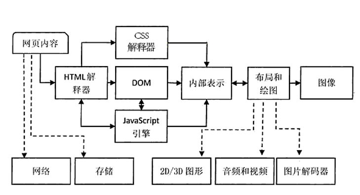
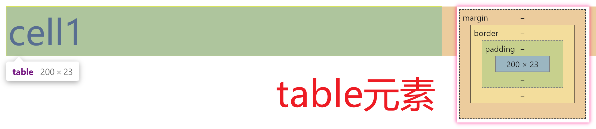
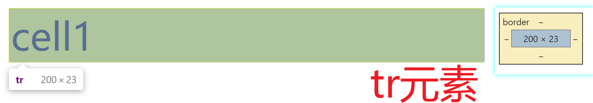
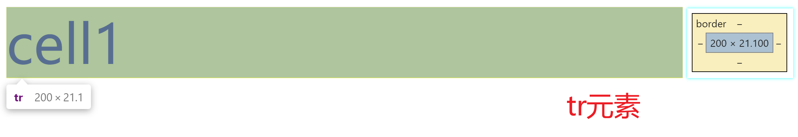
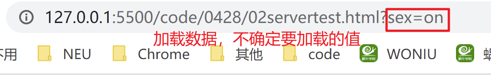
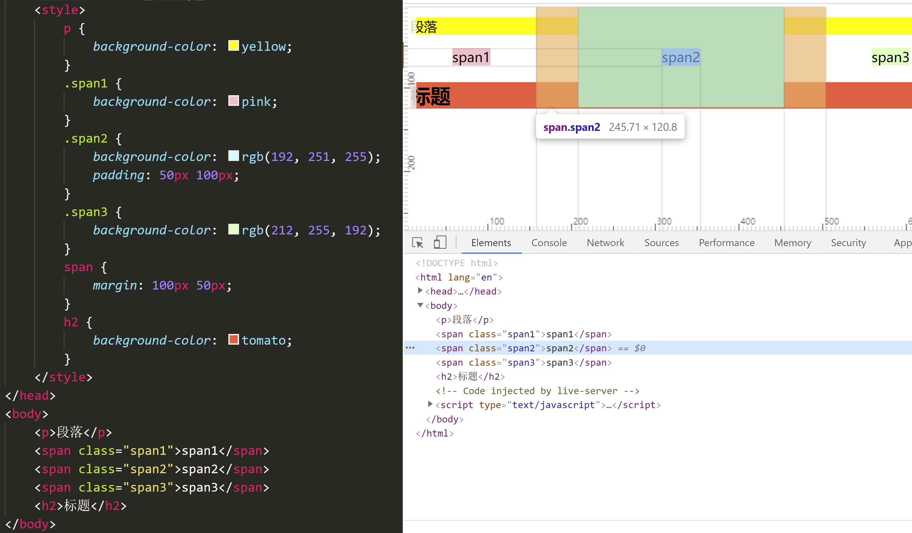

# HTML

## 前端的发展

网页开发，web开发，小程序。web指的就是网页。
1991年：出现了第一个网页，早期网页用于方便看文档，传论文，学术研究。Tim benner-lee lee博士互联网之父。
1994年：PHP诞生，实现数据库交互和动态页面的模板引擎，为web2.0时代做了铺垫。lee 博士 建立W3C，主要制定前端开发规则，包含html+CSS+js等等

- web 1.0：页面写死的，静态页面
- web 2.0：动态渲染页面上数据，动态页面
1995年：JavaScript出现，只能实现动态交互，页面中动态动画效果
1999年：ajax技术，异步技术 标志web2.0时代的到来
2007年：第一部iphone诞生，标志着互联网时代的到来
2014年：H5版本发布
2020年：vue3.0发布 混合开发

前端学习的三部分：html（网页的骨架）   css（网页的样式，美化网页）   JavaScript（网页的动态交互）

vue ，react ，uni-app等等

## HTML

Hyper Text  Marckup  language  超文本标记语言

- 超文本：通过一系列的超链接，将不同空间的资源连接在一起形成了一个网状结构。超文本就是超媒体的概念，包含了普通的文本，图片，视频音频等等
- 标记：指的标签，一个超文本内容会通过一个标签进行连接

### html特点

- 简单性：没有复杂的逻辑，只学会标签的使用，合理搭配就可以构建网页
- 可扩展性：html标签每种标签有每种用途，新建一个标签，可以新建用途
- 跨平台：网页运行环境是浏览器，只要系统由浏览器，那么是可以运行
- 通用性：网页写好后，可以相互嵌套。在浏览器渲染，同样适用

## HTML网页文档结构

- HTML文档用了描述网页
- HTMl文档包含标签和纯文本

### 文档结构

```html
<!DOCTYPE  HTML>
<html>
	<head>
		<meta charset="UTF-8">
		<title>my first page</title>
	</head>
	<body>
		欢迎来到蜗牛学院
	</body>
</html>
```

- `<!DOCTYPE  HTML>`:代表网页的文档类型，申明了浏览器解析的时候的解析规则，大小写都可以

- `html`:根标签，每个网页有且仅有一个根标签

- `head`:代表网页的头部，title代表网页的标题（显示在浏览器的窗口上），有利于SEO优化，`<meta charset="UTF-8">`:定义文档的编码集

  ```html
   <!-- 定义的关键字 -->
  <meta name="keywords" content="蜗牛学院，Java开发，前端开发">
  <!-- 定义网页描述 -->
  <meta name="description" content="【蜗牛学院】高端IT人才培养，0基础0元入学，免积分试听，合同式保障就业，专家面授，项目驱动教学。专注Java全栈开发、软件测试、Web前端开发等课程方向，誓做IT培训界的一股清流。">
  ```

  - meta 可以定义关键字和网页描述，用于seo优化，搜索引擎的排名

- `body`:代表了网页的主体，body主要用于写网页的结构代码

#### !DOCTYPE

h5：即可以使用严格模式，也可以使用混杂模式

```html
<!DOCTYPE  HTML>
```

h4

```html
<!DOCTYPE html PUBLIC "-//W3C//DTD HTML 4.01 Transitional//EN"
"http://www.w3.org/TR/html4/strict.dtd">
```

xhtml

```html
<?xml version="1.0" encoding="utf-8"?>
<!DOCTYPE html  PUBLIC "-//W3C//DTD XHTML 1.0 Transitional//EN"  "http://www.w3.org/TR/xhtml1/DTD/xhtml1-transitional.dtd">
<html xmlns="http://www.w3.org/1999/xhtml" xml:lang="en" lang="en">
```

- 作用：
  1. 申明文档类型，
  2. 申明html版本，告诉浏览器采用哪种版本的解析规则去解析代码
  3. 决定了浏览器的加载模式，决定了浏览器是使用严格模式还是混杂模式去解析代码

#### 浏览器加载模式

- 严格模式（标准模式）：严格按照W3c规范解析网页
- 混杂模式（兼容模式）：浏览器使用自己的规范解析网页

#### Doctype不写？

- 如果doctype 不写，会导致文档无法判断当前版本和dtd约束条件，浏览器会采用兼容模式解析网页
- doctype申明正确并且dtd约束条件正确，默认按照严格模式解析代码

## 开发工具

- webstorm：默认加载了很多插件，很多开发中不会使用的插件都内置了，导致电脑卡顿

- hbuilder：vue推荐的工具，一款小巧的开发工具，一遍开发一边浏览器的显示效果，内置了很多插件，启动慢

- dw：更新慢

- 记事本：太麻烦

- vscode——目前市场上比较主流的开发工具，公司基本页使用。不仅可以开发前端，还可以开发。


### 插件

- `Chinese (Simplified) Language Pack for Visual Studio Code`  汉化

- `Auto Rename Tag` 自动将结尾标签更改

- `HTML CSS Support`:在HTMl中支持css的提示

- `HTML Snippets` 自动生成html代码。专门针对html代码格式，h5版本的代码结构

- `Image preview` 在代码预览中引入图片的的缩略图

- `IntelliSense for CSS class names in HTML` 可以在html中提示 css中class名

- `Live Server`:可以将vscode作为一个服务器，让浏览器去访问；实时更新

- `open in browser`：可以指定浏览器去打开网页，需要收到刷新页面

  

## HTML标签

### 文本标签

- 用于组织文本

#### 标题标签

h1-h6

```html
<!-- 标题标签  h1-h6  数字远大，字号越小，加粗，独占一行，前后默认有间距 margin-->
<!-- 标题标题可以有利于seo优化 -->
<h1>h1标签</h1>
<h2>h2标签</h2>
<h3>h3标签</h3>
<h4>h4标签</h4>
<h5>h5标签</h5>
<h6>h6标签</h6>
```

- 数字越大，字号越小，加粗
- 独占一行，上下默认有间距

#### 段落标签  p

```html
<p>
    文本
</p>
```

- 每一个段落就是一个p标签
- p标签是不能嵌套
- 上下有间距

#### span

```html
<span>文本</span>
```

- 一般用于简短的文本或者提示性的信息

#### label

```html
<label>wenban</label>
```

- 给鼠标提供了可用性，可以配合表单元素使用

#### 加粗 b strong

推荐使用strong

#### 斜体 i  em

#### 换行  br

- 是单标签，换几行写几个

#### 分割线 hr

- 是单标签，独占一行

### 图片标签 img

- 语法：

  ```html
  
  ```

- 路径：

  - 绝对路径：指文件在目录下的具体位置，直接找到目标文件

    开发中，以http或者https开头的网络地址，磁盘盘符的地址

  - 相对路径：指从某个文件出发去找到目标文件。在开发中，一般都是从当前文件出发

    返回上一级 ../   返回多个上一级使用多个../  

- 注意：设置宽度或高度，如果只设置其中一个值，图片按照原来的比例等比例缩放，如果设置两个值，图片可能变形

### 超链接 a

- 用于跳转网页

- 语法：

  ```html
  <a href="需要跳转的网页的路径">超链接点击的文本</a>
  ```

  - href ：路径可以时网络路径，也可以是本地路径（建议使用相对路径）
  - target：新网页的显示位置
    - _self 默认值，当前窗口显示
    - _blank :新开窗口显示

- 注意：

  - href里面空白，刷新网页
  - href=”#“ 刷新页面
  - #id名  锚点，在href里面的路径可以使用锚点，用于定位到页面中的某一个标签

### 表格标签 table

- 网页上做表格

- 语法：

  ```html
  <table border="1" width="500px" align="center" cellspacing="0" cellpadding="0px" bgcolor="pink">
          <tr align="center" bgcolor="yellowgreen">
              <td width="80px" height="60px" align="right" bgcolor="tomato">姓名</td>
              <td>性别</td>
              <td>年龄</td>
          </tr>
          <tr>
              <td>张三</td>
              <td>女</td>
              <td>16</td>
          </tr>
          <tr>
              <td>李四</td>
              <td>男</td>
              <td>18</td>
          </tr>
          <tr>
              <td>王二</td>
              <td>女</td>
              <td>20</td>
          </tr>
      </table>
  ```

  - align:控制对齐方式，table控制表格在页面中的对齐方式，tr和td控制的单元格里面内容的对齐方式
    - left 默认 左对齐
    - center 居中
    - right 右对齐
  - cellspacing：控制单元格之间的间距
  - cellpadding：控制单元格里面内容到单元格边框的距离
  - bgcolor ：设置背景颜色   优先级：td>tr>table
  - border:设置表格的边框

- 注意：

  1. th标签代表表头，会进行加粗，文字居中
  2. 表格的基本结构，table里面只能放tr ，tr里面只能放td或th
  3. 表格是可以相互嵌套，注意里面的表格是放在单元格td里面的，不能破坏外面单元格的结构
  4. **td中的内容默认垂直居中**

#### 单元格合并

- rowspan：设置跨行合并单元格，垂直方向上合并
- colspan：跨列合并单元格，水平方向上合并


### 表单标签

- 登录注册等需要和用户进行数据交互

#### 普通文本框

```html
<input type="text"   placeholder="输入框中提示性的信息"  value="设置输入框中默认的内容">
```

#### 密码框

```html
<input type="password" >
```

#### 单选框

```html
<input type="radio" name="sex">男
<input type="radio" name="sex">女
```

- 单选需要设置相同的name值进行绑定,才能实现单选操作
- label特殊用法：通过属性for指定对应的表单元素的id名，可以控制点击label里面的文本使该表单元素获取鼠标的光标，鼠标的焦点

#### 复选框

```html
<input type="checkbox"> LOL
<input type="checkbox"> 吃鸡
```

- 注意：复选和单选如果需要默认选中，设置`checked`属性

#### 下拉列表

```html
<select>
	<option></option>
    	<option></option>
</select>
```

- 注意：
  - 下拉列表默认显示第一个，在option上设置 selected可以控制默认显示的选项
  - 在select上添加 multiple 可以实现多选操作

#### 文本域

```html
<textarea name="" id="" cols="30" rows="10"></textarea>
```

- cols:控制的一行的显示文字的个数，
- rows：控制的显示的行数

#### 按钮

```html
<input type="button" value="普通按钮">
<input type="submit" value="提交按钮">
<input type="reset" value="重置按钮">
<button>按钮</button>
<button type="button">普通按钮</button>
<button type="submit">提交按钮</button>
<button type="reset">重置按钮</button>
```

- 推荐使用button
- 注意：
  - 提交按钮和重置按钮需要配合form标签使用

#### form

```html
<form action="test.html" method="post"></form>
```

- action:提交数据的服务器地址
- method：设置提交数据的方式
  - get：可以提交数据给服务器，也可以从服务器获取数据，数据会显示在地址栏
  - post：提交数据给服务器，数据不会显示在地址栏

### 列表标签

- 无序列表 ul

  ```html
  <ul>
      <li>1</li>
      <li>2</li>
  </ul>
  ```

  - ul里面只能放li标签，不能放其他的
  - 常用于导航栏的布局
  - ul ,ol ，li都是独占一行

- 有序列表

  ```html
  <ol>
      <li>1</li>
      <li>2</li>
  </ol>
  ```

  - ol标签里面只能放li标签

- 定义列表

  ```html
  <!-- 定义列表  用于以解释列表  dt指定名字  dd对名字进行解释说明-->
  <dl>
      <dt>中国</dt>
      <dd>中华人民共和国</dd>
      <dt>汽水</dt>
      <dd>碳水化合物</dd>
  </dl>
  ```

  - dl，dt，dd独占一行

### 其他标签

#### div标签

- 没有任何的样式，可以看作一个布局容器
- 独占一行

#### marquee

```html
  <!-- 跑马灯  -->
    <marquee>公告：明天周四，放假，想得美</marquee>
```

- 从右边进入，往左边移动，无限循环的

#### iframe

```html
<iframe src="https://www.baidu.com" frameborder="1" width="1300px" height="500px"></iframe>
```

- 可以将目标网页嵌套进当前的页面
- frameborder：设置的边框
- 宽高设置的是目标网页的显示区域，显示不完整会产生滚动条

#### fieldset

```html
<!-- 带标题的边框容器 -->
<fieldset>
    <legend>登录</legend>
    <form action="">
        用户名：<input type="text">
        密码：<input type="password">
    </form>
</fieldset>
```

- legend:设置边框上的标题

# CSS

网页由三部分构成

- HTML：网页的基本骨架，网页的结构设计
- CSS：网页的样式的设计，网页才能达到像素级还原
- JavaScript：网页的动态交互，动态数据渲染

## CSS

Cascading Style Sheets  层叠样式表，用来美化网页，给网页设置样式

层叠：多个地方的样式会层叠为一，相同的样式根据优先级决定，不同的样式直接作用，最终形成一套样式

样式表：是指css的样式代码；指代就是内联样式、内部样式、外部样式里面书写代码

## 浏览器中样式的来源

- 注意：所有html标签默认是没有任何样式的，本身没有样式

### 浏览器默认的样式

- p标签，a标签等标签本身没有样式，浏览器渲染出来是有样式，是由浏览器默认自己设置

### 浏览器用户自定义的样式

- 是由浏览器中的设置里面，可以设置一些用户自己的样式

### 内联样式（自己写的代码）

- 在标签的style属性里面书写css样式代码

- 语法：

  ```html
  <p style="css属性1: css属性值1;  css属性2：css属性值2；">
      文本
  </p>
  ```

- 优点：

  - 哪儿需要写在哪儿

- 缺点：

  - 结构和css样式混淆

### 内部样式（自己写的代码）

- 在head标签里面添加`<style>`标签，通过选择器来书写css的样式代码

- 语法：

  ```html
  <head>
      <style>
          选择器{
              css属性1：css属性值1；
              css属性2：css属性值2；
          }
      </style>
  </head>
  ```

- 优点：

  - 结构和样式分离
  - 结构清晰，便于以后维护
  - 批量操作标签的样式

- 缺点：

  - 样式和结构没有完全分离

### 外部样式（自己写的代码）

- 创建一个后缀名为.css的文件，在里面通过选择器书写css样式代码，在html文件中head标签里面通过link标签引入css文件的路径

- 语法：

  ```html
  <head>
      <link rel="stylesheet" href="css文件路径">
  </head>
  ```

- 优点

  - 样式和结构完全分离
  - 一处改处处改

注意：

- 相同选择器的情况下，内联权重最大，内部和外部跟文档顺序有关，就近原则

## 选择器

- 用于定位页面中的标签，在里面书写的css样式代码

- 语法：

  ```css
  选择器{
  	css属性1：css属性值1；
  	css属性2：css属性值2；
  }
  ```

### 标签选择器

- 把标签名作为的选择器，在里面书写css样式，默认去找满足条件的所有标签，在整个页面中去找

  ```css
  p{
  	css样式代码
  }
  ```


### 择器（class选择器）

- 通过标签上class属性的属性值去定位的标签，去作用样式

- 语法

  ```css
  .class名{
      css样式代码；
  }
  ```

- 注意：

  - 如果同一个标签上作用多个class选择器样式，class名中使用空格隔开

  - 多个class选择器同时使用时，中间没有空格，代表并且的意思

    ```css
    .op.oa{
        css样式代码
    }
    ```

### id选择器

- 通过标签上的id名去定位标签，作用的css样式

- 语法：

  ```css
  #id名{
      css样式代码
  }
  ```

- 注意：

  - 页面中id是唯一的，不能重复，慎用，以后js会通过id去控制标签
  - id命名规范
    - 以数字，字母，_和-构成
    - 不能以数字开头，不能包含特殊的字符
  - id选择器权重最终

- 注意：

  - 优先级（权重）: 内联>id>类选择器>标签选择器
  - 内联样式的权重最大，优先使用

## 背景样式

- `background-color`：设置背景颜色

  - 单词
  - #十六进制
  - rgb（0~255，0~255，0~255）

- `background-image`:设置背景图片

  ```css
  background-image: url( 图片的路径 )；
  ```

  - 注意：背景图片和背景颜色同时存在，优先使用背景图片
  - 图片默认在盒子的左上角开始铺设，默认平铺

- `backgroud-repeat`:设置图片是否平铺

  - repeat：平铺
  - repeat-x：x轴方向上平铺
  - repeat-y：y轴方向平铺
  - no-repeat：不平铺

- `background-position`:设置背景图片的位置

  两个值：x轴 y轴

  - 单词  top center bottom  left  right 两两搭配使用    center center 居中
  - 像素
  - 百分比： 50% 50% 相当于center center   以当前盒子的宽高为参考

- `background-size`:设置背景图片的大小

  - cover：两边都铺满，超出部分隐藏
  - contain：一边铺满就停止
  - 像素

- `background-attachment`:设置背景图片是否固定

  - fixed：固定
  - scroll：默认，随着滚动条滚动

- `background`:复合属性

  - 语法：

    ```css
    /* 复合属性  只写两个值，代表定位，写四个值，中间是由/隔开，前面代表定位，后面是大小*/
     background: red url(img/img-2.jpg) no-repeat 50px 100px/300px 300px ;  
    ```

### 雪碧图

- 将多张图片放在一张图片上，借助css样式属性来实现显示其中的一个图片，减少访问服务器的次数，优化网页
- 原理：
  - 控制盒子的大小，使其只能显示一个图标
  - 通过css样式中的background-image引入雪碧图，然后通过background-position去定位到需要显示的图标

## 文本样式

- `color`:设置文本颜色
  - 单词
  - #十六进制
  - rgb
- `line-height`：设置文本的行高
  - 像素
  - 数字或百分比：参考文字的大小，是文字大小的倍数
  - 应用：设置line-height等于盒子的高度，可以实现单行文本垂直居中，对行内元素同样有效。
- `text-align`：设置文本对齐方式
  - left：默认，左对齐
  - center：居中  ；可以设置文本水平方向上的居中
  - right：右对齐
  - 应用：针对单行文本垂直水平居中，可以设置text-align：center和line-height等于盒子的高度
- `text-decoration`:设置文本的修饰
  - none：无
  - underline：下划线
  - line-through：删除线
  - overline：上划线
- `text-indent`:设置首行缩进
- `word-space`:设置字间距，以空格为参考
- `letter-space`:设置字符间距，一个中文就是一个字符，一个字母就是一个字符
- `text-transform`:设置字母大小写
- `white-space`:设置空白处理方式

## 标签的分类

### 块级标签（块级元素）

一般用来进行页面布局或组织行级元素的

- 特点：
  - 独占一行
  - 支持宽和高
- 比如：div，p，h，table，tr，ol、ul，li等等

### 行内元素

一般用于组织文本

- 特点：
  - 共享一行
  - 不支持宽高，由内容撑开
- 常见行内元素：span，a，label等等

### 行内块级元素

- 介于块级和行内之间，一般会进行特殊的使用
- 特点：
  - 共享一行，可以同行显示
  - 支持宽高
- 比如：td，img等等

### 相互转换

- display：inline；  转为行内元素
- display：inline-block：转为行内块级元素
- display:block；转为块级元素
- display:none; 隐藏元素，原来页面中的空间不存在的

### 标准文档流

- 概念：在网页开发中，元素从左到右，从上到下，块级元素独占一行，行级元素共享一行的排列方式，称为标准文档流。

## 字体样式

- font-size：字体大小

- font-family：设置字体的类型

  - 一般不设置默认使用浏览器的字体

  - 可以同时设置多种字体，字体默认从系统去找到，先找第一种字体，如果有则使用，如果没有就找第二种，最终找到serif 通用字体。

  - 注意：字体是多个单词或中文，需使用引号引起来

    ```css
      font-family: 'Franklin Gothic Medium', 'Arial Narrow', Arial, sans-serif; 
    ```

  - 字体引用技术

    ```css
    @font-face{
        font-family:  字体名字；
            src：url(字体文件的路径)，url( 字体文件的其他格式的路径)    
    }
    
    div{
        font-family：字体名字；
    }
    ```

- font-weight：设置字体是否加粗

  - 取值：100-900   值越大，加粗效果越明显

    ​          normal  正常字体   blod 加粗   bolder 更加粗

- font-style:设置字体的风格

  - normal：正常
  - italic：斜体

### 字体图标  fontawesome

- 是一种字体形式的图标，是一种矢量图标，可以使用css属性去控制图标的样式，看作是一个字体

  font awesome官网 https://fontawesome.dashgame.com/

## 超链接

- 语法：

  ```css
  /* 超链接没有被访问的时候的样式 */
  a:link{
      color: red;
  }
  /* 超连接被访问过的样式 */
  a:visited{
      color: green;
  }
  /* 鼠标移入时的效果  hover需要放在link和visited后面 ,其他标签同样可以使用*/
  a:hover{
      color: blue;
  }
  /* 鼠标点击时的作用效果  active需要放在hover之后*/
  a:active{
      color: blueviolet;
  }
  ```

  - 注意：hover需要放在link和visited之后，active需要放在hover之后（顺序:L-V-H-A）

## 列表样式

- list-style：复合属性，设置列表的样式
  - list-style：none；清除列表的标记（小圆点，数字等等）
- list-style-type:设置列表标记的样式
- list-style-position：设置列表标记的位置


## 优化网页的方案

1. 合理使用图片格式也可以优化网页
2. 1px的背景平铺可以优化网页，通过减小图片的体积
3. 雪碧图的使用，通过减少请求服务器的次数来优化网页
4. 外部css文件的压缩，通过减少文件的体积来优化网页
5. 使用字体图标来优化网页
6. 使用link引入css文件，不使用@import引入

## 拓展：link和@import

本质上都是加载css的文件，只是link服务整个网页，@import服务于css

### link

```html
<link rel="stylesheet" href="css文件路径">
```

### @import

```html
<style>
    @import url(css/style.css);
</style>
```

-  区别：

   1. link是一种标签，@import是一种语法
   2. link可以引入其他文件格式，@import只能引入css文件
   3. 加载时间：link加载css文件，随着页面的加载而加载，@import等待页面加载完成之后再加载
   4. 兼容性：link兼容比@import要好一些
   5. javascript 操作样式的时候，link引入可以被操作，@import 引入的样式不能被操作

# 盒模型

## 标准盒模型结构


- content：代表内容区域，指存放内容的空间（width：指的时内容的宽度，height：指的是内容高度）
- padding：内边距，盒子内部的空间，内容到边框的的距离
- border：盒子的边框，四条边框都可以设置样式
- margin：外边距，盒子和盒子之间距离（兄弟关系、父子关系）

## 边框 border

- 控制盒子的边框的样式，包含边框宽度、类型、颜色

- 语法：

  ```css
  分方向设置一条边的样式
  border-方向-width：宽度；
  border-方向-style：类型；
  border-方向-color：颜色；
  
  控制一条边的复合属性：
  border-方向：宽度   类型   颜色；
  
  同时控制四条边的复合属性：
  border：宽度  类型  颜色；
  ```

  - 边框的类型取值：
    - solid：实线
    - dashed：虚线
    - dotted：点线
    - double：双边线
  - 注意：
    1. 边框至少设置两个值，宽度和类型，默认是黑色
    2. 只有单一的一边是矩形，而有相邻的边，沿着对角线方向均分相交区域
    3. 边框会使盒子撑大
  - 应用
    - 可以用来绘制三角形
      - 设置盒子的宽高为0
      - 设置盒子三边颜色透明transparent（设置透明颜色）
      - 设置盒子的一边不透明，有颜色 

## 内边距 padding

- 盒子内容到边框之间距离

- 语法：

  ```css
  控制一个方向的内边距
  padding-方向：宽度；
  
  复合属性：
  padding：宽度值
  一个值：上下左右四个方向
  两个值：上下    左右
  三个值：上      左右      下
  四个值：上    右     下     左
  ```

- 注意：

  - padding会撑大盒子
  - padding区域有背景颜色

- 应用：

  - 可以设置文本到边框的距离，留白区域
  - 可以用于导航的内容的自适应操作


## 外边距 margin

- 盒子边框外面的距离，盒子之间的距离

### 盒子和盒子之间是兄弟关系（margin的重叠性）

- margin在**垂直方向**上会发生重叠，以值最大的为准

### 盒子和盒子之间是父子关系

- margin-top具有传递性，子元素设置margin-top会传递给父元素，原因在于，子元素无法找到父元素的边界作为参考
- 解决方案：
  1. 给父元素设置 border：1px solid transparent；但是会影响盒子的大小
  2. 给父元素设置padding；，padding也可以作为margin-top的参考，但是也会影响盒子的大小
  3. 父元素添加 overflow：hidden； 产生BFC容器，这个容器内部元素的排列规则不会影响容器外面


## 标准盒子的宽度

标准盒子的真正大小的计算：

- 宽度=content（width）+padding*2（左右）+border * 2(左右)
- 高度=content（height）+padding * 2 （上下） + border * 2（上下）

标准盒子所占空间的大小：

- 宽度=content（width）+padding*2（左右）+border * 2(左右) + margin * 2（左右）
- 高度=content（height）+padding * 2 （上下） + border * 2（上下）+ margin * 2（上下）

## 怪异盒模型（IE盒模型）

结构：


- 怪异盒模型：width包含了content+padding+border

怪异盒子的盒子真正的大小

- 宽度=width（包含了content+padding+border）
- 高度=height（包含了content+padding+border）

怪异盒子所占空间的大小

- 宽度=width（包含了content+padding+border）+ margin *2（左右）
- 高度=height（包含了content+padding+border） + margin * 2(上下)


box-sizing:可以控制盒子的转换

- content-box：标准盒子（目前主流浏览器默认都是标准盒子）
- border-box：IE盒子


## 拓展：

1. 内边距padding和外边距margin设置百分比是参考的父盒子的宽度
2. width设置百分比和不设置的区别
   - auto:自适应，盒子不设置宽度默认就是auto；父盒子排除盒子padding和border和margin之后剩下的区域
   - 100%：参考的父盒子的宽度，父盒子宽度是固定的，内容区域宽度固定，添加padding+border +margin 会影响盒子的真正的大小和所占空间的大小
3. 让盒子（设置宽度）水平居中 margin：0 auto； 理解为：上下外边距为0 ，左右为自适应

# 选择器

CSSz主要由两部分构成：

1. css样式：控制标签的页面效果
2. 选择器：去找到页面中需要控制的标签

丰富选择器的写法，找到标签更加精准，种类繁多。

注意：所有选择器只能从父元素找子元素，往后续兄弟标签找（选择器只能往里面找或者往后面找标签）[从外到内，从前到后找]

## id选择器

- 通过标签上id名找到满足条件标签

- id是唯一，找到页面中唯一的一个标签

- 语法：

  ```css
  #id名{
      css代码
  }
  ```

## 类选择器

- 通过标签上的class名找到标签

- 可以作用在多个标签上，一般用于提取公共样式

- 语法：

  ```css
  .class名{
      css代码
  }
  ```

## 标签选择器

- 通过标签名找到对应的标签，默认是找整个页面

- 语法

  ```css
  标签名{
      css样式代码
  }
  ```

## 后代选择器（派生选择器）

- 找到满足条件的所有的后代，即找儿子，又孙子，或者孙子的孙子，所有的后代都会被找到

- 注意：中间使用空格隔开

- 语法：

  ```css
  找到页面中所有div，再找div里面的所有后代p标签
  div   p{
      css样式代码
  }
  ```

## 子元素选择器

- 找到满足条件的所有直接子元素，只找儿子，不找孙子

- 注意：中间使用 > 隔开

- 语法

  ```css
  找到页面中所有的div，再找到div里面的所有子元素p标签
  div > p{
      cssy样式代码
  }
  ```

## 兄弟选择器

### 相邻兄弟选择器

- 找到页面中满足条件后面的相邻第一个兄弟标签

- 注意：中间使用 +隔开

- 语法：

  ```css
  找到页面中使用 的calss名为op的标签后面相邻的第一个兄弟li标签
  .op + li {
      css样式代码
  }
  ```

### 后续兄弟选择器

- 找到满足条件后续所有的兄弟标签

- 注意：中间使用~ 隔开

- 语法：

  ```css
  找到页面中使用 的calss名为op的标签后面所有兄弟li标签
  .op ~ li {
      css样式代码
  }
  ```

## 分组选择器

- 中间使用逗号隔开，隔开的选择器会分别作用css样式代码

```css
 /* h1{
color: red;
}
p{
color: red;
}
label{
color: red;
}
span{
color: red;
} */
/* 选择器分组 中间使用逗号隔开，逗号隔开的的选择器会分别作用css样式*/
h1,p,label,span {
    color: red;
}
```

## 属性选择器

- 根据标签上的属性来找标签

| 选择器             | 描述                                                         |
| ------------------ | ------------------------------------------------------------ |
| `[属性名]`         | **用于选取带有指定属性的元素。**                             |
| `[属性名=属性值]`  | 用于选取带有指定属性和值的元素。**（精确匹配）**             |
| `[属性名~=属性值]` | 用于选取属性值中包含指定词汇的元素。                         |
| `[属性名|=属性值]` | 用于选取带有以指定值开头的属性值的元素，该值必须是整个单词。 |
| `[属性名^=属性值]` | 匹配属性值以指定值开头的每个元素。                           |
| `[属性名$=属性值]` | 匹配属性值以指定值结尾的每个元素。                           |
| `[属性名*=属性值]` | 匹配属性值中包含指定值的每个元素。**(模糊匹配)**             |

- 应用：模糊匹配可以用来提取公共样式

## 伪类选择器

- 给浏览器上的标签添加一些功能性的效果，样式

| 语法     | 描述                                           |
| -------- | ---------------------------------------------- |
| :link    | 向未被访问的超链接添加样式                     |
| :visited | 向被访问过的超链接添加样式                     |
| :hover   | 当鼠标悬停在标签上时，向标签添加的样式         |
| :active  | 向被激活的元素添加样式（鼠标点击不放时的样式） |
| :focus   | 向拥有键盘输入焦点的元素添加样式               |

- 注意：a:hover必须放在a:link和a:visited之后，a:active必须放在a:hover之后

## 伪元素选择器

- 概念：指可以在html标签中的开头或者结尾通过css添加一个区域，该区域可以添加文本，设置css样式

- 作用：在不改变html代码结构的基础上，通过css添加一个区域，这个区域会显示在浏览器

- 属性：

  - first-letter：向标签的第一个字符添加样式
  - first-line：找到标签里面的第一行
  - before：在标签里面的内容之前添加内容
  - after：在标签里面的内容之后添加内容

- 语法：

  ```css
  ::before{    
      /* 设置伪元素里面的文本 */    
      content:"";
  }
  ```

- 注意：

  1. ::before和  ::after 必须和content搭配使用
  2. ::before和  ::after 渲染出来的是`行内元素`，可以借助diplay：inline-block |block 转换

- 应用：

  - 可以通过css样式动态添加三角形

## 通配符选择器

- 找到页面中所有的标签，向它添加样式

- 语法

  ```css
  *{    
      margin: 0;    
      padding: 0;
  }
  ```

## 选择器权重（优先级）

基础选择器：id选择器、类选择器、标签选择器、属性选择器、伪类选择器、伪元素选择器、统配符选择器

复合选择器：后代选择器、子元素选择器、兄弟选择器

1. 同等级基础选择器选择器：就近原则

2. 在相同位置下，基础选择器：

   id > class（属性选择器）> 标签 > 通配符选择器

3. 复合选择器的权重需要计算，将里面所有的基础选择合起来计算

### 选择器的计算方案

#### 加法运算

- 内联样式默认值为1000
- id选择器权重默认为100
- 类选择器（伪类、属性）权重为 10
- 标签选择器（伪元素）权重为1
- 继承的属性为 0

将所有选择器相加得出结构，进行对比，值最大的优先作用，如果由多个最大值，那么作用最后一个

**注意: 加法运算不满足满10 进 1 的说法**

#### 4个0 

（0，0，0，0）

- 第一个0：代表是否由内联样式，有则为1，无则0
- 第二个0：代表id选择器的个数
- 第三个0：类选择器（伪类、属性）的个数
- 第四个0：代表标签选择器（伪元素）的个数

统计所有标签的个数，通过对比第一个0，如果不同，取值大的，如果相同，那么对比第一个0，依次类推，最终找到值更大的优先作用。

注意：

1. 默认内联样式权重最高
2. !important 这个用来定义标签是最终，比较暴力，无视权重，直接作用成最终样式；慎用，破坏了选择器权重的规则

## CSS的继承

css的继承：在父元素上设置的css样式，子标签同样使用

继承分为两类：

- 自动继承：子元素不需要设置样式，可以直接从父元素上继承下来
- 手动继承：子元素需要写自己的代码，才能从父元素继承。 inherit 设置手动继承

### 哪些属性可以自动继承

- 文本样式可以被自动继承
  - color：设置颜色
  - text-align
  - text-decoration
  - text-indent
  - text-transform 字母大小写
  - line-height
  - letter-space 字符间距
  - word-space 字间距，以空格来区分
- font系列可以自动继承
  - font-size
  - font-family
  - font-style
  - font-weight
- list-style 也可以被继承
- 鼠标样式  cursor 可以被自动继承
  - pointer;  抓手样式

### 哪些属性不能被自动继承

- width，height ，margin、padding、border等等

### 面试题：

1. 谈一下css中的继承的概念
2. 常见的可以继承的属性有哪些，不能被继承的属性有哪些？

# 浮动

盒子同行显示的方案：

1. display：inline-block
   - 默认盒子之间有5px像素的间距
   - 存在兼容问题
2. 浮动

## 浮动

可以让盒子同行显示，一行排列不下时，自动换行

- 语法：

  ```css
  float:left | none | right;
  ```

- 注意：

  1. 块级元素不设置宽度，浮动后宽度auto由内容决定
  2. 排列规则：元素一旦设置浮动，后面浮动的元素会找前面浮动元素的边界，第一个浮动元素会找父盒子的边界或者前面元素浮动的边界就停止下来

- 特点：

  1. 浮动元素可以同行显示，排列不下，自动换行，不存在兼容问题
  2. 浮动元素脱离文档流，在标准文档流之上，相当于页面进行重绘
  3. 原来的空间不存在，不再占有
  4. 给行级元素设置浮动，行级元素支持宽高

## 标准文档流

- 概念：页面默认从上到下，从左到右，块级元素独占一行，行级元素共享一行的排列规范，称为标准文档流

## 脱离文档流

- 概念：元素不再遵循标准文档流的规范，自己按照自己的规范进行排列称为脱离文档流。

## 浮动对非浮动元素的影响

1. 非浮动元素会占用浮动元素原来的空间

2. 如果非浮动元素中有文本，那么文本会被浮动元素挤下来

   - 实现图文混排


```html
<html>
    <style>
        img{
            float：left；
        }
    </style>
    
    
    <div>
        文本
    </div>
</html>
```

3. 子元素浮动，父元素高度塌陷

## 清除浮动

- 作用：清除浮动元素对非浮动元素的影响(父元素高度塌陷、兄弟元素挤到下方)

- 语法：

  ```css
  clear: left  | right  | both；
  ```

  - left:清除左浮动的影响
  - right：清除右浮动的影响
  - both：清除两边的影响

### 清除浮动的方法

1. 为受影响的元素上添加css样式属性clear， `clear:both;`

   clear 属性规定元素的哪一侧不允许其他浮动元素。

   ````css
   div{
       clear：both；
   }
   /*不能通过给浮动元素父元素添加此属性解决父元素高度塌陷问题*/

2. 使用`<br  clear="all" >` 清除浮动，将浮动元素和非浮动元素隔开。

3. 添加一个空白的div，设置内联属`style="clear:both;"`将浮动的区域和非浮动区域隔开

   ```html
   <div  style="clear:both;"></div>
   ```

4. 在父元素上添加伪元素选择器可以动态添加一个子元素，完成清除浮动的效果（推荐使用）

   ```css
   .clearfix::after{
       content: "";
       clear: both;
       display: block;
   }
   ```

   总结：上述四种方法都能解决子元素浮动父元素高度塌陷的问题。`但当部分子元素浮动，部分子元素未浮动，未浮动元素沉入浮动元素下方的问题，方法四无法解决`。

   子元素全部浮动：解决父元素高度塌陷：方法一、二、三、四；

   子元素部分浮动：解决父元素高度塌陷：方法一、二、三、四；

   ​						   解决为浮动元素被浮动元素遮挡：方法一、二、三。

- 注意:

  `overflow：hidden`借助BFC容器的特点，可以解决子元素浮动，父元素高度塌陷的问题，但不是清除浮动的方法，因为并不能解决未浮动元素沉入浮动元素下方的问题。

# 定位

## margin负值

- margin可以设置负值，会破坏文档流进行移动，
- 注意：
  - margin一旦设置负值，在移动过程中不遵循标准文档流的规范，移动完成还会受标准文档流的管控
- 应用：
  - 内容区域和banner重叠，后面盒子要翻盖在前面盒子的上方

## 文档流的概念

- 破坏文档流：在页面布局过程中，元素在移动时不遵循标准文档流的规范，移动完成后还在标准文档流中。
- 脱离文档流：在页面布局过程中，元素不遵循标准文档流的规范，按照自己的规范进行排列。
- 标准文档流：在页面布局过程中，元素从上到下，从左到右，块级元素独占一行，行级共享一行的排列规范

## 让盒子移动到指定位置

- margin负值
- 定位

## CSS定位

### 静态定位

- 所有的元素默认都是静态定位

- 语法：

  ```css
  position:static;
  ```

### 相对定位

- 参考原来的位置进行移动

- 语法：

  ```css
  position:relative;
  ```

  - 偏移量：
    - top：设置距离原来位置上边缘的距离
    - left：设置距离原来位置左边缘的距离
    - right：设置距离原来位置右边缘的距离
    - bttom：设置距离原来位置下边缘的距离

- 特点：

  - 相对定位的盒子不脱离标准文档流，只是`破坏文档流`
  - `原来的空间还在`
  - 相对定位参考原来的位置进行移动

- 注意：

  - `盒子只设置相对定位，盒子排列不受影响，但是一旦设置了偏移量，盒子参考原来的位置进行移动`，移动过程中破坏文档流，移动完成后，还受标准文档流的管控
  - 盒子设置了相对定位，`层级高于标准文档流的盒子`
  - 子元素设置相对定位，`父元素进行移动时，子元素跟着移动`（原因：父元素移动后，子元素**原来的位置**跟着移动，所以设置相对定位后，原来的位置发生了改变，这个元素也跟移动）
  - `相对定位一般不会单独使用，一般配合绝对定位使用`

### 绝对定位

- 概念：元素会脱离文档流，按照你设置的偏移量进行移动

- 语法：

  ```css
  position:absolute；
  ```

  偏移量：

  - top：设置距离文档上边缘的距离
  - left：设置距离文档左边缘的距离
  - right：设置距离文档右边缘的距离
  - bttom：设置距离文档下边缘的距离

- 特点：

  - `会脱离文档流，原来的位置不再占有`
  - `一旦设置里绝对定位，后面绝对定位的元素会盖住前面绝对定位的元素`
  - 绝对定位的元素在移动时默认`参考`的`document对象`（参考文档进行移动）

- 注意：

  - 只设置绝对定位的元素，元素是在当前位置脱离文档流（原来的位置是不再），一旦设置偏移量，元素是默认参考文档进行移动
  - **`行级元素设置绝对定位，行级元素支持宽高设置`**

#### 结构父级

- 在html代码中属于某个元素的父元素(父标签)

#### 定位父级

- 绝对定位默认以文档为参考，但是在父元素上设置了相对定位，绝对定位的元素会以这个相对定位到父级作为参考进行移动（这个父级就称为定位父级）
- 注意：
  - `如果有多个定位父级，那么参考最近的那个定位父级`
  - 一般使用相对定位作为定位父级，定位父级也可以是绝对定位和固定定位，但是这两种定位会脱离文档流，就会影响后面的元素进行排列
  - 定位父级只能是相对定位、绝对定位、固定定位。

### 固定定位

- 固定在屏幕上，不随着滚动条的滚动而滚动

- 语法：

  ```css
  position:fixed;
  ```

- 特点：

  - `脱离文档流，固定在屏幕上，不随着滚动条滚动而滚动`
  - 参考的是整个文档进行移动

- 应用：头部固定，登录框固定，侧边栏导航、广告等等

## 拓展：定位层级

- 设置元素的层级关系，只针对于定位元素（相对定位、绝对定位、固定定位）有效

- 语法：

  ```css
  z-index:数字；
  ```

  - 数字越大，层级越高，数字越小，层级越低
  - 如果数字相同，那么按照元素默认的html和定位的关系进行显示

- 注意：

  z-index只针对于定位元素（相对定位、绝对定位、固定定位）有效。

## 盒子水平垂直居中

方案一：margin自动控制距离

- 父元素设置相对定位

- 子元素设置绝对定位，四个方向偏移量为0，（top：0；bottom：0；left：0；right：0；）；设置margin：auto ；

  ```html
  <style>
      .container{
          width: 600px;
          height: 600px;
          background-color: #ccc;
          position: relative;
      }
      .box{
          width: 200px;
          height: 200px;
          background-color: pink;
          /* margin :auto auto只能实现水平居中 */
          margin: auto auto;
          /* 指定自适应的范围区域 */
          position: absolute;
          top: 0;
          left: 0;
          right: 0;
          bottom: 0;
      }
  </style>
  
  <div class="container">
      <div class="box"></div>
  </div>
  ```

方案二：通过margin来调整，使用calc函数进行计算，calc兼容相对差一点

- 在子元素上设置margin-top：calc（50% - 子元素盒子高度的一半），margin-left：calc（50% - 子元素盒子宽度的一半）

```html
<style>
    .container{
        width: 600px;
        height: 600px;
        background-color: #ccc;
        position: relative;
        overflow: hidden;
    }
    .box{
        width: 200px;
        height: 200px;
        background-color: pink;
        /* calc 是css函数，可以进行计算 */
        margin-top:calc(50% - 100px);
        margin-left:calc(50% - 100px)
    }
</style>
<div class="container">
    <div class="box"></div>
</div>
```

- 注意：由于margin设置百分比参考的是父元素的宽度，所以这种方案只适用于父盒子宽高一样时（正方形）。

方案三：借助绝对定位和margin，需要自己计算margin值

- 父元素相对定位
- 子元素绝对定位，top：50%，left：50%；设置margin-top:子元素盒子高度的一半（负数）；margin-left：子元素宽度的一半（负数）

```html
<style>
.container{
    width: 400px;
    height: 600px;
    background-color: #ccc;
    position: relative;
}
.box{
    width: 200px;
    height: 200px;
    background-color: pink;
    position: absolute;
    top: 50%;
    left: 50%;
    margin-top: -100px;
    margin-left: -100px;
}
</style>
<div class="container">
<div class="box"></div>
</div>
```

# BFC和IFC

## FC

FC（formatting  Context ） 格式化上下文，css 2.1提出的一个概念

- 它是页面中一块渲染区域，并且有一套自己的渲染规则，它决定了其子元素是如何排列，以及和其他元素之间的相互关系

BFC 和 IFC是常见是FC，ＢＦＣ（块级格式化上下文）block formatting context  ；IFC（行级格式化上下文）　inline formatting context

## BFC 

- 块级格式化上下文，指页面中的一个标签，不一定是块级元素，它有指定的满足条，自己的渲染规则，决定了BFC里面的元素是如何排列。

W3C原文：


### BFC区域的特点

1. 内部的盒子会在垂直方向上，一个接着一个地放置（标准文档流）
2. Box垂直方向的距离由margin决定，属于同一个BFC的两个相邻box的margin会产生重叠
   - 不同BFC区域里面的margin在垂直方向上不方式重叠
   - margin重叠解决方案：将盒子放在不同的BFC区域
3. 每个元素的左外边缘与包含块的左边相接触（从左到右的格式化，否则相反）。即使存在浮动也是如此。除非这个元素自己形成了一个新的BFC。
4. BFC的区域不会和浮动盒子重叠
5. 计算BFC区域的高度时，浮动元素也参与计算
   - 子元素浮动，父元素高度塌陷的问题
6. BFC 就是页面中一个独立的容器，容器里面的子元素不会影响外面元素，反之也如此

## 如何产生一个BFC区域（触发BFC区域）

1. 根标签（html标签就是一个BFC区域）
2. float 不为 none
3. position 为 absolute 和 fixed 
4. diplay  为  inline-block，flex ，table-cell 、table-caption
5. overflow 不为  visible 

## BFC区域应用场景

场景一:

每个元素的左外边缘与包含块的左边相接触（从左到右的格式化，否则相反）。即使存在浮动也是如此。除非这个元素自己形成了一个新的BFC。

BFC的区域不会和浮动盒子重叠

场景二：三列布局

- 两边两列固定，中间一列自适应宽度

```html
<style>
    .container{
        border:  1px solid red;
    }
    .left {
        width: 300px;
        height: 300px;
        background-color: pink;
        float: left;
    }
    .center{
        height: 500px;
        background-color: yellowgreen;
        overflow: hidden;

    }
    .right{
        width: 300px;
        height: 300px;
        background-color: tomato;
        float: right;
    }
</style>

<div class="container">
    <div class="left"></div>
    <div class="right"></div>
    <div class="center"></div>  
</div>
```

场景三：计算BFC区域的高度时，浮动元素也参与计算

- 子元素浮动，父元素高度塌陷
- 解决方案：将父元素升级为BFC区域

场景四：Box垂直方向的距离由margin决定，属于同一个BFC的两个相邻box的margin会产生重叠

- 可以解决margin重叠问题，
- 解决方案：进其中一个盒子放进另一个BFC区域

## IFC

行级格式化上下文 即 inline formatting context ，是css 视觉渲染上的一个概念

指的是一行区域的渲染规则，指定了一行里面的行级元素是如何排列以及对齐

### IFC区域特点

1. 在IFC中，盒子水平放置，一个接着一个，从包含块的顶部开始
2. 在盒子间 margin和padding的水平方向有效，
3. 里面这些盒子通过不同的方式进行对齐，可能底部或者顶部对齐，也可能基线对齐
4. iFC负责的这个矩形区域叫做行盒
   - 行盒的宽度是里面元素决定（包含的行级元素和浮动元素）
   - 行盒的高度由计算结果得出的，最终由一行元素中最高的决定

### 影响IFC区域的css属性

1. font-size：字体大小，一旦发生改变，行盒的高度会受影响
2. font-family：字体样式不同给，也会影响行盒的高度
3. line-height：设置不同的行高，行盒的高度也不一样
4. height
5. vertical-align：设置对齐方式，文本之间默认以基线对齐

## 影响行盒高度的属性

### font-size

- 字体越大，行盒高度越高，以字体最大的为准

### font-family

- 字体不同给，行盒高度会受影响，以这一行字体最高的决定

### line-height

- 行高也会影响行盒的高度，值越大，行盒的高度越高

### height

- 高度也会影响行盒的高度，

### vertical-align

- 设置对齐方式

- 取值：

  - baseline ：基线对齐
  - middle：中线对齐

  

  

绿色：顶线

蓝色：中线

红色：基线

紫色：底线

#### 文本与文本之间

- 文本之间默认是基线对齐

#### 文本与图片之间

- 默认文本的基线与图片的底部进行对齐
- 给文本设置vertical：文本按照参靠位置与图片的底部进行对齐
- 给图片设置vertical：图片按照参考文字与文本的基线对齐

#### 表格的使用

- 默认单元格里面内容是垂直居中
- vertical-align可以设置垂直方向的文本对齐方式
  - top：顶部对齐
  - bottom：顶部对齐
  - middle：居中对齐

# H5标签

## h5的表单标签

form、input（text）、input（password）、input(radiao)、input （checkbox）、select、textarea、

按钮：input、button

### 邮箱输入框

提供有效格式的验证，一般使用js来控制

```html
 <input type="email">
```

### 数字输入框

- 只能输入数字

- 语法

  ```html
   <input type="number">
  ```

### 网址输入框

- 会进行网址格式的检测，必须含有http或者https的完整网址

- 语法：

  ```html
  < input type="url">
  ```

### 选取范围

```html
<input type="range">
```

### 搜索输入框

- 提供了可以清除搜索框内容的操作

- 语法：

  ```html
  <input type="search"> 
  ```

### 选择颜色

```html
<input type="color">
```

### 时间控件

```html
<!-- date 选择年月日  month选择年月 week选择某年第几周  time选择时间-->
<input type="date">
<input type="month">
<input type="week">
<input type="time">
<input type="datetime">
```

### 文件上传

```html
<input type="file" multiple>
```

- 默认只能上传一个文件
- multiple可以允许上传多个文件

### 选项列表

- 可以提供输入框的推荐列表功能

- 语法：

  ```html
  <datalist id="id名">	<option></option>    	<option></option></datalist><input type="text"  list="datalist的id名">
  ```

  - 注意：input输入框的list'属性指定datalist的id名进行绑定

### 表单元素属性

- required：必填项

- readonly：只读

- autofocus：自动获取键盘输入焦点

- placeholder：设置提示文本

  ```css
  input::-webkit-input-placeholder  {    color:red;}
  ```

## h5媒体标签

早期视频播放需要使用flash技术来实现

- 视频 video
- 音频 audio

### 音频标签

- 在页面中引入音频文件

- 语法

  ```html
  写法一：<audio src="file/music.mp3" controls loop muted></audio>
  写法二：可以引入不容的音频文件格式，避免浏览器对文件格式的不兼容
  		<audio controls>    <source src="file/music.mp3">    <source src="file/music.mp4"></audio>
  ```
  
  - src：连接音频文件的路径
  - controls：是一个控制器，控制音频文件的播放，快进等等操作【必须添加才能看到控制器面板】
  - autoplay：自动播放
  - loop:循环播放
  - muted：静音播放

### 视频标签

- 在页面中引入视频文件

- 语法：

  ```html
  写法一：<video src="file/play.mp4" controls autoplay loop muted></video>
  写法二：可以引入不容的视频文件格式，避免浏览器对文件格式的不兼容
  <video controls loop>    <source src="file/test.MP4">      <source src="file/test.ogg">  </video>
  ```
  
  - src：连接视频文件的路径
  - controls：是一个控制器，控制视频文件的播放，快进等等操作【必须添加才能看到控制器面板】
  - autoplay：自动播放
  - loop：循环播放
  - muted：静音播放

## 语义化标签

语义化：合理、正确的标签来显示内容，见词达意

class="header"  class="nav"  这种维护性低，可读性较差

### 语义化标签的好处：

- 易于用户阅读，样式丢失的时候让页面的结构清晰明了
- 有利于SEO优化，搜索引擎的收录
- 方便其他的设备的解析，比如盲人阅读器等
- 有利于后期维护，语义化具有可读性，代码更好进行维护

### 语义化标签

| 标签名      | 描述                                             |
| ----------- | ------------------------------------------------ |
| `<header>`  | 代表网页的头部                                   |
| `<main>`    | 代表网页的主体部分，内容区域，页面上有且仅有一个 |
| `<footer>`  | 代表网页的尾部                                   |
| `<nav>`     | 代表网页中导航区域                               |
| `<aside>`   | 代表网页的侧边栏                                 |
| `<article>` | 网页中一个独立的区域，一般放内容                 |
| `<section>` | 代表网页中的一个模块，理解为平时的div            |
| `<thead>`   | 代表表格的头部                                   |
| `<tbody>`   | 代表表格的内容                                   |
| `<tfoot>`   | 代表表格的尾部                                   |
| `<audio>`   | 音频                                             |
| `<video>`   | 视频                                             |
| `<source>`  | 资源标签，定义多媒体资源                         |
| `<canvas>`  | 定义图形                                         |

- 使用方式
  - 网页的最外层标签尽量使用语义化标签，比如：header nav  main  footer 等等
  - 标题标签还是尽量使用h标签，有利于seo优化
  - 对于内容区域一般使用article，里面带标题的小模块就是用section
  - 具体内容使用，该用什么标签就用什么标签

# 兼容性问题

## 兼容性问题

不同的浏览器的内核是不一样的，内核决定了网页时如何解析，解析的最终渲染结果也不一样，称为兼容性问题。

兼容性问题的来源是浏览器内核的不同。

## 内核

内核其实网页最底层、最核心的代码，用来解析网页的。

内核的作用：

- 解析网页
  - html内容的解析
  - css样式的解析
  - js解析

内核按照功能可分为：js引擎和渲染引擎


- html解析器：将html代码结构解析成一颗dom树，而一个标签就是dom树的一个节点
- css解析器：将css样式计算出来
- JavaScript引擎：允许js脚本运行环境
- 布局：主要负责网页定位、浮动等等排列

### 网页如何解析？



1. 加载网页的代码

   1. 判断是否是网络资源，利用网络模块从网络上下载下来
   2. 如果是本地文件，则直接从本地加载代码到内核中

2. 经过html解析，对代码进行解析

   - 浏览器从代码第一行进行解析，把不同类型的代码文件都会交给不同解析器进行解析

     - html代码——>html解析器
     - css代码—>css解析器
     - js代码——>js解析器

     注意：解析器是同步执行

3. 将每个解析器的结果进行综合梳理（内部表示）

   - 把html的标签和对应的css代码结合起来，每个标签都有自己的渲染对象

4. 布局和绘图

   - 会把每个标签的样式，位置绘制在浏览器的页面上，如果有图片、视频等内容，再利用对应的模块进行处理，处理完成后将最后的效果渲染再页面上

## 兼容性处理方案

css hack代码：专门针对不同的浏览器写不同的css代码

css hack：针对不同的浏览器或者浏览器的不同版本写不同的样式代码，这个写css代码的的过程称为css hack。

主要学习ie css hack代码

### css hack分类

#### 属性前缀法：

- 属性前缀法是指在css样式代码属性的前面加上一些特定浏览器才能识别的hack前缀，以达到期望的页面效果
- 属性前缀只能一个一个设置

IE浏览器各版本 CSS hack 对照表

|    hack    |                写法                 | 实例 | IE6 (S) | IE6 (Q) | IE7 (S) | IE7 (Q) | IE8 (S) | IE8 (Q) | IE9 (S) | IE9 (Q) | IE10 (S) | IE10 (Q) |
| :--------: | :---------------------------------: | :--: | :-----: | :-----: | :-----: | :-----: | :-----: | :-----: | :-----: | :-----: | :------: | :------: |
|     *      |               *color                | 青色 |    Y    |    Y    |    Y    |    Y    |    N    |    Y    |    N    |    Y    |    N     |    Y     |
|     +      |               +color                | 绿色 |    Y    |    Y    |    Y    |    Y    |    N    |    Y    |    N    |    Y    |    N     |    Y     |
|     -      |               -color                | 黄色 |    Y    |    Y    |    N    |    N    |    N    |    N    |    N    |    N    |    N     |    N     |
|     _      |               _color                | 蓝色 |    Y    |    Y    |    N    |    Y    |    N    |    Y    |    N    |    Y    |    N     |    N     |
|     #      |               #color                | 紫色 |    Y    |    Y    |    Y    |    Y    |    N    |    Y    |    N    |    Y    |    N     |    Y     |
|     \0     |             color:red\0             | 红色 |    N    |    N    |    N    |    N    |    Y    |    N    |    Y    |    N    |    Y     |    N     |
|    \9\0    |            color:red\9\0            | 粉色 |    N    |    N    |    N    |    N    |    N    |    N    |    Y    |    N    |    Y     |    N     |
| !important | color:blue !important; color:green; | 棕色 |    N    |    N    |    Y    |    N    |    Y    |    N    |    Y    |    N    |    Y     |    Y     |

#### 选择器前缀法

- 选择器前缀法是针对一些页面表现不一致的或者需要特殊对待的浏览器，在css选择器前面添加一些前缀，只有指定的浏览猜能识别

  |                             语法                             | IE6  | IE7  | IE8  | IE9  | IE10 |
  | :----------------------------------------------------------: | :--: | :--: | :--: | :--: | :--: |
  |                           * html *                           |  √   |  ×   |  ×   |  ×   |  ×   |
  |                          * +html*+                           |  ×   |  √   |  ×   |  ×   |  ×   |
  |                     @media screen\9{...}                     |  √   |  √   |  ×   |  ×   |  ×   |
  |                     @media \0screen{...}                     |  ×   |  ×   |  √   |  ×   |  ×   |
  |               @media \0screen\ , screen\9{...}               |  √   |  √   |  √   |  ×   |  ×   |
  |                     @media screen\0{...}                     |  ×   |  ×   |  √   |  √   |  √   |
  |            @media screen and (min-width:0\0){...}            |  ×   |  ×   |  ×   |  √   |  √   |
  | @media screen and (-ms-hirh-contrast : active) , (-ms-high-contrast:none){...} |  ×   |  ×   |  ×   |  ×   |  √   |


#### 条件注释法

- 通过注释的语法来完成样式指定版本导入

`<!--[if IE]><![endif]--> `针对IE9及以下的版本

`<!--[if lte IE10]><![endif]-->`  lt 小于    lte小于等于    gt大于    gte大于等于

```html
只在IE下生效
<!--[if IE]>
这段文字只在IE浏览器显示
<![endif]-->

只在IE6下生效
<!--[if IE 6]>
这段文字只在IE6浏览器显示
<![endif]-->

只在IE6以上版本生效
<!--[if gte IE 6]>
这段文字只在IE6以上(包括)版本IE浏览器显示
<![endif]-->

只在IE8上不生效
<!--[if ! IE 8]>
这段文字在非IE8浏览器显示
<![endif]-->

非IE浏览器生效
<!--[if !IE]>
这段文字只在非IE浏览器显示
<![endif]-->
```

# CSS3

## 背景渐变

有规则的渐变背景，使用1px渐变背景图片平铺，但是对于没有规则的渐变背景只能使用一张整图。

css3提出了渐变背景的技术。图片来实现渐变背景，可拓展性差，影响后期维护，影响网页的加载速率。

渐变背景分为：线性渐变和径向渐变

渐变可以看作是一个“图像”，使用是background-image来渲染。

### 线性渐变

- 概念：沿着一条直线进行颜色的渐变

- 语法：

  ```css
  background-image:linear-gradient(渐变方向，颜色1  位置1， 颜色2   位置2)；
  ```

  - 渐变方向：

    - to  方向单词   ：指定渐变结束的位置

      - to top ——>0deg
      - to bottom ——>180deg 或 -180deg  默认角度
      - to left ——> 270deg 或 -90deg
      - to right —— 90deg 或-270deg
      - to left top —— 315deg 或 -45deg
      - to right top —— 45deg 或-315deg
      - to bottom left ——225deg  或- 135deg
      - to bottom right——135deg 或 -225deg

    - 角度 ，以deg 为单位

      0deg表示沿着元素由下往上的方向，顺时针是正方向，逆时针是负方向。角度支持正值和负值。

      

- 注意

  ```css
    background-image: linear-gradient(red 50%,green 80% ,yellow 90%);
  从0%~50%是红色，50%~80%是红色到绿色的渐变，80%~90%是绿色到黄色的渐变，90%~100%是黄色
  
  ```

  - 如果两个相邻的色标，位置是统一位置，可能出现断层

#### 重复线性渐变

- 可以实现线性渐变的重复效果，使渐变效果无限重复

- 语法

  ```css
  background-image: repeating-linear-gradient(pink 0px, pink 20px, yellow 20px,yellow 40px);
  ```

- 注意：

  只有渐变的首尾颜色位置不再0%或100%时，才有空间实现重复渐变。

### 径向渐变

- 径向渐变指的是椭圆渐变，圆是一种特殊的椭圆，径向渐变其实就是沿着椭圆半径方向进行渐变

- 径向渐变由两部分构成

  - 椭圆：圆心
  - 色标：由一个颜色和一个位置构成

- 语法：

  ```css
   background-image: radial-gradient(大小   形状  at x轴  y轴 ,颜色1  位置1 ，颜色2   位置2);
  ```

  - 大小：
    - closest-corner：半径为从圆心到最近的角
    - farthest-corner：半径从圆心到最远的角
    - closest-side：半径为从圆心到最近的边 
    - farthest-side：半径为从圆心到最远的边
  - 形状：
    - circle：圆
    - ellipse：椭圆
  - 圆心： at x轴 y轴  默认 center center
    - 单词：top  left  right  bottom  center  两两搭配
    - 像素
    - 百分比

#### 重复径向渐变

- 可以实现重复的径向渐变，沿着椭圆的半径径向无限循环，直到铺满

- 语法

  ```css
  background-image: repeating-radial-gradient(#999 0px, #999 10px,#666 10px,#666 20px);
  ```

- 注意：

  只有渐变的首尾颜色位置不再0%或100%时，才有空间实现重复渐变。

## 圆角 border-radius

- 默认盒子的角是直角

- 语法:

  ```css
  /* 分别设置四个角的圆角 */
  border-top-left-radius: 20px;
  border-top-right-radius: 40px;
  border-bottom-right-radius: 60px;
  border-bottom-left-radius: 80px; 
  
  复合属性
  border-radius:圆角；
  一个值：四个角的圆角
  两个值：左上右下    右上左下
  三个值：左上   右上左下   右下
  四个值：左上   右上   右下  左下
  
  标准写法：8个值   /前面分别代表四个角的水平半径，/后面分别代表四个角的垂直半径
  border-radius: 50px 10px 10px 10px / 50px 50px 50px 50px;
  ```

- 每个圆角都是一个椭圆，都有水平半径和垂直半径。水平半径和垂直半径决定了这个圆角的大小

  

  

### 内半径和外半径

- 当盒子的边框比较宽时，设置圆角就会形成内半径的圆角和外半径的圆角
- 外半径：边框外面的圆角的大小的半径
- 内半径：边框里面的圆角的大小的半径
  - 计算：内半径=外半径 - 边框的宽度
- 注意：当边框大于圆角时，内半径为0 ，外半径等于设置圆角

## 盒子阴影 box-shadow

- 给盒子设置阴影效果

- 语法：

  ```css
  box-shadow:x轴的偏移量  y轴的偏移量  阴影效果的虚化程度  阴影大小  颜色;
  
   /* 虚化程度和阴影大小可以默认不写 */
  box-shadow: 10px 15px #666;
  
   /* inset 可以将外阴影变为内阴影 */
  box-shadow: 5px 10px  15px 5px #666 inset;
  
   /* 可以设置多层阴影  中间使用逗号隔开*/
  box-shadow: 5px 10px  15px 5px #666,-5px -10px  15px 5px green;
  ```

## 文字阴影

- text-shadow可以设置文字阴影

- 语法：

  ```css
  text-shadow:  x轴偏移量  y轴便宜量 阴影效果的虚化程度  颜色;
  ```

## 透明度

transparent：设置完全透明的颜色

rgba()：设置的颜色透明

- a代表透明度，取值0~1的值，0代表完全透明，1代表不透明

opacity：设置的盒子透明

- 取值:0~1   0代表完全透明，1代表不透明
- 注意：盒子及里面的内容都透明

## 结构选择器

### :first-child

- 找到某个标签里面满足条件的第一个子标签

### :last-child

- 找到某个标签里面满足条件的最后一个子标签

### :nth-child(n)

- n代表数字

- 找到某个标签里面满足条件的第n个子标签

- 注意：

  :nth-child（2n） :找到某个标签里面的满足条件的偶数的子标签

  :nth-child(2n+1) :找到某个标签里面的满足条件的奇数的子标签

### :nth-last-child(n)

- 找到某个标签里面满足条件的倒数第n个子标签

### :nth-of-type(n)

- 找到某个标签里面满足条件的同类型的标签，将其重新排序，找到第n个标签

### :nth-last-of-type(n)

- 找到某个标签里面满足条件的同类型的标签，将其重新排序，找到倒数第n个标签

# SASS

## 原生css的不便

1. 书写很多重复选择器
2. 不能达到一处改处处改
3. css代码重复

## 基本概念

- sass和less是一个css预处理器，可以为网站启用可定义、可管理和可重用的样式表。
  - sass就是一种动态的样式表语言
  - css预处理器是一种脚本语言，可扩展css并将其编译成常用的css代码，以便浏览器可以识别
  - sass其实就是css一种拓展，通过自己语法（嵌套、变量、混合、条件、循环等等）来提高网页样式编写效率
- 作用：极大提供css样式的编写效率
- 官网：https://www.sass.hk/

## 基本使用

### 使用vs code中的 `easy sass`插件来使用

- 利用vs code的来编写sass代码
  - 按照 easy sass插件
  - 新建以 `.sass`或`.scss`为后缀名的文件，再里面书写sass代码
    - `.sass`旧版本的sass文件格式
    - `.scss`新版本的sass文件格式 (建议)
  - 默认sass自动生成css文件保存在同级目录下

#### 手动指定转换的css文件存储路径

- 打开设置，搜索easysass ，打开`settings.json`
- 将easy sass的配置文件代码放入 `settings.json`中
- 指定存储的路径

```json
// 设置sass转为什么格式的css文件
"easysass.formats": [
    {
        "format": "expanded",
        "extension": ".css"
    },
    {
        "format": "compressed",
        "extension": ".min.css"
    }
],
// 指定sass转为css文件的存储路径，注意该路径是从工作区出发
"easysass.targetDir": "css/"
```

## 嵌套

- 在sass中书写选择器可以进行嵌套，父选择器里面可以嵌套子选择器

- 好处：让css代码层级结构清晰明了，不会出现父子标签权重的问题

- 语法：

  ```scss
  父选择器{
      父选择器的css样式代码
       css属性：属性值；
      子选择器{
          css属性：属性值；
      }
  }
  
  sass文件
  div{
      width：200px；
      p{
          color：red；
      }
  }
  转为css文件：
  div{
      width:200px;
  }
  div p{
      color:red;
  }
  ```

- 注意

  ```scss
  .box{
      width: 200px;
      height: 200px;
      background-color: pink; 
      p{
          color: red;
          span{
              color: green;
          }
      }
      >ul{
          list-style: none;
          li{
              width: 200px;
              height: 200px;
              &:first-child{
                  color: green;
              }
          }
          li:nth-child(2) p{
              color: red;
          }
      }
      +div{
          width: 300px;
      }
      // &代表的当前的父选择器
      &:hover{
          background-color: green;
      }
      &::before{
          content: "wenben";
      }
  }
  ```

## 变量

- 概念：变量可以理解为一个数据的容器，可以在代码中重复使用

- 好处：可以达到一处改处处改的效果

- 语法：

  ```css
  $变量名：数据；
  ```

  - 注意：可以存储数据，这个数据可以是一个属性值，可以是多个属性值（1px  solid red）
  - 变量名命名规范
    - 可以数字、字母、- 和_
    - 尽量不要以数字开头
    - 多个单词可以是驼峰命名  小驼峰 fontSize  大驼峰 FontSize

- 全局变量：是指在sass文件开头定义的变量，文件任意文字都可以使用

- 局部变量：定义在某个{}里面的变量，只能在所在{}中使用，其他地方会使用全局变量

- 注意：建议变量定义在文件开始

# 弹性盒模型

## 传统布局（div+css）

- 基于盒模型，依赖diplay+position+float 进行页面布局
- 这种方式兼容性比较好，布局过程繁琐
- 传统布局不便：
  - 各种居中对齐
  - 大量调整细节
  - div盒子水平显示，设置float
  - 清除浮动

## 弹性盒模型

- 概念：

  是一种当页面需要适应不同 的屏幕大小以及设备类型时确保元素的排列拥有恰当的行为的一种布局方式

- 结构：弹性盒子是由弹性容器和弹性项目构成

  

  - 弹性容器：包含弹性项目的父元素
  - 弹性项目：弹性容器里面的每个子元素称为弹性项目
  - 主轴：默认是水平方向是主轴，弹性项目一行显示的排列方向
  - 侧轴：与主轴垂直的方向是侧轴

- 特点：

  - 弹性容器里面的弹性项目一行显示，排列不下时，进行压缩展示

  - 弹性容器只对自己的直接子元素有效，对兄弟元素没有效果

  - 对于弹性容器来说，高度是自适应，无需设置高度

## 给父元素设置（弹性容器）

### display:flex | inline-flex

设置弹性容器，将父元素变成弹性容器

- `display:flex` :设置块级弹性容器，对其他兄弟元素来说，就是一个普通的块级标签，对里面的子元素来说，就是一个弹性容器
- `display:inline-flex`：设置行级弹性容器，对其他兄弟元素来说，就是一个普通的行级白哦去，对里面的子元素来说，就是一个弹性容器

### flex-wrap

设置弹性容器里面的弹性项目是否换行

- nowrap：默认，不换行
- wrap：换行

### flex-direction

设置弹性容器里面的主轴方向，以及弹性项目的排列方式

- row ：水平方向为主轴，从左到右排列（默认值）

- row-reverse:设置水平方向为主轴，元素从右到左排列

- column：设置垂直方向为主轴，元素从上到下排列

- column-reverse：设置垂直方向为主轴，元素从下到上排列

### justify-content

分配主轴上的富裕空间

- flex-start：默认，主轴上元素左对齐
- flex-end：弹性项目在主轴上右对齐
- center：居中
- space-between：弹性项目之间空间均匀分布，首尾的弹性项目紧靠弹性容器
- space-around：将富裕空间均分到每个弹性项目左右两边
- space-evenly：每个弹性项目之间的距离都均分，包含第一个和最后一个两边

### align-items

分配侧轴方向上的富裕空间

-  flex-start：将侧轴方向的富裕空间均匀分配到每行的后面
-  flex-end：将侧轴方向的富裕空间均匀分配到每行的前面
-  center：将侧轴方向的元素前后均分分别，居中
-  stretch：拉伸,当弹性项目没有高度时，弹性项目把弹性容器的高度沾满

注意：盒子水平垂直居中，可以设置父元素为弹性容器，justify-content：center；align-items：center；

## 给子元素设置（弹性项目）

### align-self

设置某个弹性项目在侧轴方向上的富裕空间分配

-  flex-start：将侧轴方向的富裕空间均匀分配到每行的后面
-  flex-end：将侧轴方向的富裕空间均匀分配到每行的前面
-  center：将侧轴方向的元素前后均分分别，居中
-  stretch：拉伸,当弹性项目没有高度时，弹性项目把弹性容器的高度沾满

### flex-shrink

设置当弹性容器宽度不够时，弹性项目的压缩因子（收缩因子）

- 原理：当弹性容器宽度显示不下一行里面所有的弹性项目时，就会依照设置的flex-shrink将项目进行压缩来达到不换行的目的。压缩因子越大，压缩越多，弹性项目越小

- 前提：弹性容器宽度必须小于弹性项目的总宽度，并且没有设置换行，才有效

- 语法：

  ```css
  flex-shrink:数字；
  默认值为1；
  ```

- 计算公式：

  弹性项目的压缩空间 = 需要压缩的总值/压缩因子的总数  * 该弹性项目的弹性因子

  需要压缩的总值=所有弹性项目的总宽度 - 弹性容器的宽度

### flex-grow

设置弹性项目的弹性因子，弹性因子决定了弹性项目的弹性空间的大小

- 原理：弹性容器会将多余的富裕空间按照设置的弹性因子分成等会，根据弹性项目的弹性因子进行消化富裕空间，将其变成弹性项目的一部分；弹性因子越大，分配的弹性空间越多

- 语法：

  ```css
  flex-grow:数字；
  默认值为0；
  ```

- 计算公式：

  弹性空间的大小= 富裕空间的大小/弹性因子的总数  * 该弹性项目的弹性因子

- 例子：

  一个弹性容器的宽度1500px

  1. 里面5个弹性项目宽度都为200px，设置box1的flex-grow为1，box3的flex-grow为2，box4为flex-grow为3，每个弹性项目的宽度大小为多少？

     弹性项目的总宽度 200*5=1000px

     富裕空间 1500-1000=500px

     弹性因子总数：1+0+2+3+0=6

     500/6=83.333

     box1: 200+83.333*1=283.333

     box2、box5：200+83.333*0=200px

     box3:200+83.333*2 = 367.666

     box4:200+83.333*3= 450px

  2. 里面7个弹性项目宽度都为200px，设置box1的flex-shrink为2，box3的flex-shrink为3，每个弹性项目的宽度大小为多少？

     不满足压缩条件，每个盒子200px

  3. 里面10个弹性项目宽度都为200px，设置box1的flex-shrink为2，box3的flex-shrink为3，每个弹性项目的宽度大小为多少？

     压缩空间 10*200-1500px=500px

     压缩因子总数：2+1+3+1+1+1+1+1+1+1=13

     500/13=38.5

     box1: 200-38.5*2=123px

     box2/4/5/6/7/8/9/10:200-38.5=161.5

     box3:200-38.5*3=84.5

### flex-basis

- 设置弹性项目的默认宽度，优先级高于width

- 语法：

  ```css
  flex-basis:宽度；
  ```

  注意：

  - 弹性项目如果没有设置宽度，宽度是由内容撑开；
  - 优先级：flex-basis >  width >由内容撑开的宽度

### flex

- 复合属性，包含了弹性因子、压缩因子、默认宽度

- 语法：

  ```css
  flex: flex-grow   flex-shrink  flex-basis;
  ```

### order

- 能够改变某个弹性项目的显示的位置

- 语法

  ```css
  order:数字；
  ```

  - 默认为0
  - 数字越大，位置越靠后，数字越小，位置越靠前
  - 应用：
    - 在不改变代码结构的情况下，第一个放到最后
    - 将某个元素拖拽到最后

## 富裕空间

- 弹性容器里面除弹性项目之外剩余的空间称为富裕空间
  - 主轴上的富裕空间  justify-content
  - 侧轴上的富裕空间 align-items

## 弹性空间

- 弹性项目去消耗富裕空间，将富裕空间变成弹性项目的 一部分。即富裕空间的大小发生变化会影响弹性空间的变化


**mini-width:设置盒子最小宽度，当缩放宽度超过mini-width时显示滚动条。**


# 补充

## HTML

前端：网页开发，web开发，小程序（目前中国独有）
web指的就是网页
1991年：出现了第一个网页，早期网页用于方便看文档，传论文，学术研究.Tim benner-lee lee博士互联网之父（world wide web(万维网)的发明者）。

1994年：PHP诞生，实现数据库交互和动态页面的模板引擎，为web2.0时代做了铺垫。lee博士建立W3C，主要制定前端开发规则，包含html+CSS+is等等
	web 1.0：页面写死的，静态页面。
	web 2.0：动态渲染页面上数据，动态页面。	

​	动态网页：可从数据库事实提取数据并自动渲染展示在网页上，而不需要人为操作渲染，人只需负责将新的数据上传数据库即可。并非有动画交互效果的网页就是动态网页。

1995年：JavaScript出现，只能实现动态交互，页面中动态动画效果，并能不能实现动态渲染。

1999年：ajaxx技术，异步技术标志web2.0时代的到来，可实现动态渲染。

“SEO是指在搜索引擎自然排名的规则下,对网站(站内和站外)进行优化,提升网站关键词自然排名,获得更多流量,最终达成网站某种转化的目的。

<!DOCTYPE HTML>文件类型申明大小写均可，习惯上用大写。


p标签不能嵌套p标签，虽然嵌套使用浏览器会通过添加p标签正确解析，但最好不要嵌套。

## 元素和标签的区别：

元素就是标签和标签包含的内容


## table元素

```html
<body>
    <table width="200px" bgcolor="red">
        <tr bgcolor="yellow">
            <td>cell1</td>
        </tr>
    </table>
</body>
```


- table元素：设置的width值为内容（content）的值，高度，高度可由tr的高度确定。

- tr元素：默认没有padding值，，一般不设置宽度，宽度继承table的宽度。所有tr元素的高度之和并不为table元素高度的值，因为之间还有默认的cellspacing间距。

- td元素：元素之间默认有2px的间距（红色框区域，celldpacing="2px"）,每个单元格的也有默认的padding值，大小为1px，可以通过cellpadding调整。td的宽度可以设置为百分比的形式，均分tr的宽度（同行td宽度之和+同行cellspacing之和=tr宽度）。

## 调整cellspacing值为0

  ```html
<body>
    <table width="200px" bgcolor="red" cellspacing="0">
        <tr bgcolor="yellow">
            <td>cell1</td>
        </tr>
    </table>
</body>
  ```







## 调整cellspacing值为0、cellpadding值为0

```html
<body>
    <table width="200px" bgcolor="red" cellspacing="0" cellpadding="0">
        <tr bgcolor="yellow">
            <td>cell1</td>
        </tr>
    </table>
</body>
```





## table boder

table border属性值不为零时，只有table的边框是设置的值，而td的边框仍未默认的1px；当border值为0时，td的值也会为0

```html
<body>
    <table border="10px"width="800px" height="200px" >
        <tr>
            <td>cell1</td>
            <td>cell1</td>
        </tr>
        <tr >
            <td>cell2</td>
            <td>cell1</td>
        </tr>
    </table>
</body>
```


## 表单元素提交服务器



## html属性与CSS属性的区别

html自带属性与CSS属性的写法有一定的区别，html自带属性可以直接写在行内，按照：属性=“属性值”；的格式写作，涉及到大小的甚至可以不用写单位，二CSS属性写在行内时必须使用：style=“属性1：属性1值；属性2：属性2值；属性3：属性3值”的格式，同时对于html独有二CSS没有的属性，采用此写法，不起作用。

## 行内元素与块级元素

**1、常见行内元素和块级元素**

- 行内元素

<span>、<a>、<b>、<strong>、、<input>、<textarea>、<select>、<sup>、<sub>、<em>、<del>、<br>

- 块级元素


**2、display的block、inline和inline-block的区别**

- block：会独占一行，多个元素会另起一行，可以width、height、margin和padding属性

- inline：元素不会独占一行，设置width、height属性无效。但可以设置水平方向的margin和padding属性，不可以设置垂直方向的padding和margin

- inline-block：将对象设置为inline对象，但对象的内容作为block对象呈现，之后的内联对象会被排列在同一行内

**3、行内元素和块级元素的区别**

- 行内元素

  ①：设置宽高无效

  ②：对margin设置左右方向有效，而上下无效，padding设置都无效

  ③：不会自动换行

- 块级元素

  ①：可以设置宽高

  ②：设置margin和padding都有效

  ③：可以自动换行

  ④：多个块状，默认排列从上到下

  https://m.html.cn/qa/html5/13517.html

## CSS

颜色样式的继承？？？

利用类选择器提取公共样式，优化代码

div	img	ul嵌套布局

background-position:calc(50% - 250) 0;calc函数有空格

**margin:0 auto;有宽度盒子居中**

**行内块元素之间默认有间距5px**

**text-align也可用于行内元素的水平对齐设置**

**vertical-algn实现垂直居中方法：**

​        **- 父元素line-height设置为父元素height值，**

​        **- 待对齐元素vertical-align属性值设为middle，display设置为inline-block。**

## 错误示例1

```html
h3, p:hover {
    color: rgb(196, 24, 24);
}
```

此种写法是有问题的，此中写法的鼠标悬停效果只会作用于p标签，而h3标签不会产生悬停变色的效果，相反的会覆盖之前设置的字体颜色，相当于设置了h3 {color: reb(196, 24, 24)}。

多个hover属性悬停写法如下：

```html
.psw:hover,
.tools:hover,
.account:hover {
    background-color:#4f6ff5; 
}
```

## div下不同元素同时触发hover效果实现

在同一个DIV下有一个块元素与一个文字标签，要求无论鼠标指向哪个元素另外一个元素也会被激活。可以利用最外层的div元素来选择下面的两个子元素，鼠标指向最外层的div时候触发激活效果。

父元素：hover 子元素2  {   。。。。。  } 

父元素：hover 子元素2  {   。。。。。  } 

```html
.sidebox:hover .icon-img1{
    background: url(../img/icon/icon-float11.png) no-repeat center;
}
.sidebox:hover span{
    color:#EFCD50;
}
```

## 单位问题

- 对于盒子（比如div）宽高设置为百分比时，表示宽高为父元素的倍数；若为0时则可以省略单位；若单位为像素则单位px不能省略，设置为不带单位的非0数字，不起作用。
- 背景图片的大小（background-size）设置为百分比时，表示宽高为父元素的倍数；若为0时则可以省略单位；若单位为像素则单位px不能省略，设置为不带单位的非0数字，不起作用。
- 背景图片位置（background-position）设置移动位置为百分比时，表示相对于父元素宽高倍数的移动距离；若为0则表示不移动，可以省略单位；若单位为像素则单位px不能省略，设置为不带单位的非0数字，不起作用。
- 图片（img元素）的大小设置为百分比时，表示宽高为父元素的倍数（非相对图片原本大小）；若为0时则可以省略单位（图片不显示）；若单位为像素则单位px不能省略，设置为不带单位的非0数字，不起作用。
- 边框（border）只能设置px单位且不可省略，若为其他单位都无边框。（行内属性，若边框为1则可省略单位，border="1"）
- 行高（line-height）可以设置为不带单位的数字（0或非0）、像素单位、百分比，设为数字或百分比行距是相对于字体的大小。
- margin、padding可以设置为百分比或像素，为0时可以省略单位，非零时不可以省略，否则不起作用。

## P标签margin值

p元素默认有上下相等的margin值，默认为12px，默认的大小与字体的大小（font-size）有关。

## align与text-align

align ：规定 table、div等元素中的内容的水平对齐方式，属于html属性。
text-align：规定“元素中”的文本的水平对齐方式。也适用于元素中行内元素、行内块元素的水平对齐设置，属于css属性。
两个属性使用的地方不一样，但是作用一样！ 

1、align直接写在是div的属性 

```html
<div align="center"> This is some text! </div> 
```

2、text-align则是Css的属性

```html
<div style="text-align:center"> </div> 
```

## margin:0 auto;与行内块元素

行内元素、行内块元素，默认没有margin值，所以对行内块元素设置margin:0 auto;，auto在自动，即为默认，相当于设置四边margin都为0，并不能实现类似块级元素的水平居中效果，当然对于块级元素中多个横排的行内块元素也无法通过此语句实现水平等距居中。


## 无序列表display:inline-block自动居中？

ul默认有上下相等的margin，左右margin为0，默认有右边的padding，其他方向的padding为0。li无margin和padding，只有content，默认沾满一行，content的高度由内容撑开。display：inline-block后，li的高宽任由内容撑开，为指定宽高，发现内容并未自动居中。

## a中嵌套p,p大大小超出a标签content大小

1、a中嵌套div，当a的display属性设置为inline-block时，div并未超出a内容的大小。

```html
<!DOCTYPE html>
<html lang="en">
<head>
    <meta charset="UTF-8">
    <meta http-equiv="X-UA-Compatible" content="IE=edge">
    <meta name="viewport" content="width=device-width, initial-scale=1.0">
    <title>test</title>
    <style>
        .header-right {
            width: 1200px;
            height: 200px;
            border: 1px solid red;
            line-height: 200px;
        }

        #my_feedback {
            display: inline-block;
        }

        #my_feedback p {
            display: inline-block;
            margin: auto 100px;
        }

        #header-right-app {
            display: inline-block;
        }

        #header-right-app p {
            display: inline-block;
            margin: 0 50px;
        }

        .header-divide-line {
            display: inline-block;
            height: 14px;
            width: 2px;
            margin: auto 50px;
            background-color: rgb(15, 97, 221);
        }

        .header-login {
            display: inline-block;
        }
    </style>
</head>
<body>
    <div class="header-right">
        <a id="my_feedback" href="#">
            <p>反馈问题</p>
        </a>

        <a href="" id="header-right-app">
            <p>手机App</p>
        </a>

        <div class="header-divide-line"></div>

        <div class="header-login">
            <a href="">登录</a>
        </div>
    </div>
</body>
</html>
```


2、当a无display：inline-block时，div大小已超出a内容的大小，并且由于p后的换行，导致出些空格，浏览器解析时对空格也加了下划线，若a设置display：inline-block，即使换行也不会产生带下划线的空格。

```html
<!DOCTYPE html>
<html lang="en">
<head>
    <meta charset="UTF-8">
    <meta http-equiv="X-UA-Compatible" content="IE=edge">
    <meta name="viewport" content="width=device-width, initial-scale=1.0">
    <title>test</title>
    <style>
        .header-right {
            width: 1200px;
            height: 200px;
            border: 1px solid red;
            line-height: 200px;
        }

        /* #my_feedback {
            display: inline-block;
        } */
		/*#my_feedback a标签无display: inline-block属性，导致其中嵌套p的大小超出a内容的值*/
        /*#my_feedback a标签无display: inline-block属性，导致其中嵌套p的大小超出a内容的值*/
        /*#my_feedback a标签无display: inline-block属性，导致其中嵌套p的大小超出a内容的值*/
        #my_feedback p {
            display: inline-block;
            margin: auto 100px;
        }

        #header-right-app {
            display: inline-block;
        }

        #header-right-app p {
            display: inline-block;
            margin: 0 50px;
        }

        .header-divide-line {
            display: inline-block;
            height: 14px;
            width: 2px;
            margin: auto 50px;
            background-color: rgb(15, 97, 221);
        }

        .header-login {
            display: inline-block;
        }
    </style>
</head>
<body>
    <div class="header-right">
        <a id="my_feedback" href="#">
            <p>反馈问题</p>
        </a>

        <a href="" id="header-right-app">
            <p>手机App</p>
        </a>

        <div class="header-divide-line"></div>

        <div class="header-login">
            <a href="">登录</a>
        </div>
    </div>
</body>
</html>
```


a中嵌套p，可以实现点击p的范围（不仅经文字区域）可以实现跳转，而且，链接的文字没有下划线；而p中嵌套a,只能通点击文字实现跳转，链接文字有下划线。

## div中嵌套ul,ul高度问题

- **li**的高度由其中的文字的大小、文字的多少（行数）、和**li**自身的行高决定。

- **ul**的高度等于所有**li**的高度之和（**li**未转换为行内块），**ul**的高度也可通过调节**ul**自身行高来调节（前提时**li**未设置行高，否则无法调节）。

- **ul**嵌套于**div**中，若**ul**和**li**都未设置行高，可以通过调节**div**的行高来调节**li**和**ul**的高度（**li**、**ul**任何一个设置行高此方法则行不通）。
- **li**转为行内块元素后，**li**的行高即**ul**的行高，若**li**未设置行高，通过调节**ul**的行高（调节**ul**自身行高或**div**行高）即可实现对**li**行高的调节，因此对于**li**内元素的垂直对齐可以不用单独设置**li**的行高。
- **li**转为行内块元素后，若**li**里面内容为**简短单行纯文本**，里面的**简短单行纯文本**默认在li里面垂直居中、水平居中，所有的**li**在**ul**里面垂直居中。

## 字体图标

字体图标既可以放在行内元素中，也可以放在块级元素中，置于块级元素中，块级元素会自动display：inline-block

## 浮动

父元素不设置高度，子元素浮动，父元素高度塌陷，可以通过对父元素设置overflow：hidden解决

**行高可以继承？**

**line-height: normal;值？**

**字体颜色可以继承？**

## a标签css样式的使用

a:link{属性}可以设置未访问链接的样式，a:visited{属性}设置已访问链接显示样式，a:hover{属性}设置鼠标悬停时链接显示样式，a:active{属性}设置点击链接不松开时链接显示样式。link、visited仅用于链接即a标签，不可用去其他标签，而hover、active除了应运于a标签，还能用于其他任何元素。

当对链接设置不同状态时的显示样式时（包含4种全部样式），最终都要指向a元素的标签名a，而不能是a的类名或id名，若用类名或id名会导致部分结果出错。（规范正确的写法最终以a:link/visited/hover/hover{属性}结尾）

**错误写法示范1：用a的类名+:link/:visited/:hover/:active等**

```html
.lj:link{color:red;}
.lj:visited{color:red;}
.lj:hover{color:red;}
<当link、visited中的多个与hover/active共同作用于同一链接以设置链接不同状态的样式时，若使用a的类名+:hover（active）形式会影响整体效果（使link、visited指定样式显示错误结果）；而当a只有hover/active属性或其他元素设置hover/active时完全可以使用类名+:hove/active的形式，所以建议凡是涉及到链接（a）样式的都用a+:hover/active的形式-->
.lj:active{color:red;}
```

**错误写法示范2：用a的id名+:link/:visited/:hover/:active等**

```html
#baidu:link{color:red;}
#baidu:visited{color:red;}
#baidu:hover{color:red;}
<当link、visited中的多个与hover/active共同作用于同一链接以设置链接不同状态的样式时，若使用a的id名+:hover/active形式会影响整体效果（使link、visited指定样式显示错误结果）；而当a只有hove/activer属性或其他元素设置hover/active时完全可以使用id名+:hover/active的形式，所以建议凡是涉及到链接（a）样式的都用a+:hover/active的形式-->
#baidu:active{color:red;}
```

**错误写法示范3：多层元素嵌套下指向a的标签名**

```html
.container:link  .nav  a{color: red;}
.container:visited  .nav  a{color: green;}
.container:hover  .nav  a{color: rgb(255, 251, 0);}
.container:active  .nav  a{color: rgb(0, 0, 0);} 
<--此种通过由上级元素开始最终指向a的链接样式写法，除了第三四条（hover/active）在特定的环境下有效果，其他的浏览器直接无法识别。-->
```

**多层元素嵌套下a样式的正确写法**

```html
.container .nav a:link {color: red;}
.container .nav a:visited{color: green;}
.container .nav a:hover{color: rgb(255, 251, 0);}
.container .nav a:active{color: rgb(0, 0, 0);}
```

**链接设置a:link样式，未访问部分或全部样式不显示**

极大可能时该链接还设置了a:visited样式，而链接中src属性值空白，浏览器将链接解析为已访问，直接显示为访问过的链接的样式(若设置了a:visited样式，则显示为改样式；若未设置则显示为访问过链接默认样式（紫色）)。解决方法为可以设置src值为#或正确的url。

## 未访问链接样式权重问题


该案例下，链接未访问时显示为红色而非灰色，说明a:link的权重大于.fa的类

## 行内块级元素之间默认有5px间距原因及去除方法

产生原因：代码中标签的换行。

解决方法：一个标签结束后写下一个标签时不要换行。


## css布局注意事项

- 大盒子一般不设置高度，只设置宽度，高度由子元素撑开。
- overflow:hidden；可以解决margin-top的传递性。
- overflow:hidden；解决子元素浮动，父元素高度塌陷(若父元素设置了高度，此语句可以不写)
- 块级元素width未设置时，相当于width:auto;
- 去边框语句：border：none；或者border：0；

## 谷歌浏览器调试网页

灰色css：代表该元素不能继承这个属性。

划横线css：代表能继承但没继承或写错了这个属性。

User Agent Stylesheet：浏览器默认样式。

Invalid property value：无效的属性值。

## ul去默认样式三件套

```html
ul {
	margin:0;
	padding:0;
	lisit-style:none;
}
```

## margin重叠

- 兄弟关系盒子：margin会在垂直方向上发生重叠(所有盒子均未设置浮动)，显示为最大的margin，而在水平方向上不会重叠，水平方向相加即可。

- 父子关系盒子：

  ​		-- margin-top传递性：父盒子未设置边框时，子盒子设置margin-top,子盒子到不到父盒子的边界，将margin-top传递给父盒子，父盒子相对其父盒子移动。

  ​		-- 解决方式：

  ​		1、给父盒子设置transparent的边框，但会改变父盒子的大小。

  ​		2、给父盒子设置padding，同样会影响父盒子大小。

  ​		3、给父盒子设置overflow：hidden；（原意：超出部分隐藏）此语句将盒子设置为BFC容器，BFC容器里面的元素排列不会影响容器本身和容器外元素的排列。

  ## marginine、padding值为百分百比

  子盒子margin（4个方向）、padding（4个方向）值设置为百分比都是参考父盒子的宽度(父盒子content宽度)。

  width的值：

  ​	1、不设置宽度：为默认值auto，自适应，排除padding、border、margin后的区域

  ​	2、100%宽度：参考父盒子的宽度，content区域完固定，添加padding、border、margin会影响盒子的大小和所占空间大小。

  ​	3、margin：0  auto；含义：上下margin为0，左右margin自适应。

  ## a、span设置行高

  对a、span设置行高会撑开其父元素（父元素为块级元素）的高度，当父元素有固定高度时，设置行高为父元素高度，可以实现垂直居中。img设置行高无变化。

  margin： 0  auto，只对块级元素有作用


> **行内元素（内联元素）设置行高是有效果的，但是不建议这么做。虽然行内元素设置行高之后会有位置的变化，但是并没有改变盒子大小，所以再为行内元素设置背景时，还是默认高度的地方有背景。**
>
> 因此想为行内元素设置行高时，应该为其设置display:inline-block（内联块元素）或者display:block（块元素）；即可。
>
> 另外：行内元素不支持宽、高、margin-top、margin-bottom属性（重要），想为行内元素设置以上属性，为其添加display:inline-block（内联块元素）或者display:block（块元素）属性。

## outline属性

outline：（轮廓），是绘制于元素周围的一条线，位于边框边缘的外围，可起到突出元素的作用。轮廓线不会占据空间，也不一定是矩形。

input标签默认设置了outline属性，点击输入时会显示边框（1px的黑色轮廓，即使不设置边框，点击时也会显示轮廓），可通过outline：none去除。

## 行高、行距概念及关系


## 继承

- 文本类的属性都可以继承。

- width，height不可以继承，块级元素独占一行显示，而不是继承了body的宽度。

- 大多是属性可以设置手动继承，inherit。

## 选择器权重

一般情况下，选择器权重相同时，样式的选择遵循就近原则，但不总是如此，还有结合选择器实际具体指向的对象，结合继承考虑。


## ul、li高度问题

正常情况下，ul、都是独占一行显示，li的高度由li中的内容撑开，ul的高度等于说有li的高度之和。

当未li设置浮动或display：inline-block后，li变为行内块元素，宽高都由内容决定，因此，当li中内容宽度较小时，默认每个li中内容水平方向都是居中的。

## line-height与垂直居中

当li、div等盒子未设置height时，height由容撑开，通过为li、div设置line-height并调整，可以调整盒子的height；li、div中的内容单行显示时，设置line-height，此时line-height的值即为height的值，同时实现了内容垂直居中。

在div、li中单行显示纯文字、a、span等时，为div、li设置line-height（div、li未指定height）即可实现纯文字、a、span等垂直居中，同时此line-height的高度即为div、li的height。**【父元素未指定height，为父元素设置line-height】**

当div、li中单行显示a、span等时，为a、span设置line-height（此时父元素div、li未设置height和line-height），a、span会自动撑开父元素div、li的高度，同时实现了a、span相对父元素div、li的垂直居中。**【父元素未指定height、line-height，为子元素设置line-height】**

img无法通过仅为img设置line-height实现撑开父元素div、li的高度和自身的垂直居中。（可借助为父元素设置相等的height和line-height实现垂直居中）

## img的line-height text-align

line-height text-align属性设置的是元素中的内容（如div、span、a等中的文本）的行高和水平对齐方式，由于img标签中没有内容，所以对img直接设置无任何效果，可以对包裹img的父元素设置，从而实现img的行高，水平对齐方式。

## div、li等中单行内容垂直居中显示总结

1、通用方法：设置父元素height值与line-height值相等。

2、视具体内容：

- 单行出纯文本：为父元素设置line-height（父元素不用指定height）；
- a：为父元素设置line-height（父元素不用指定height）；
- span：为父元素设置line-height（父元素不用指定height）；

- img：为父元素设置line-height、自身vertical-align：middle（父元素不用指定height）；


## a:visited 相关样式设置

对链接a设置访问过后显示的背景颜色、边框，必须要先设置访问之前的背景颜色和边框，否则无法显示


## div嵌套多个a，点击1个，全部激活

一个div中有多个a，设置每个a链接访问过后的样式，点击任一一个a，所有的a都被激活，显示访问过的样式。


**产生原因：**div中3个a的href值都是”#“，都表示刷新当前页面，无论点击哪一个都相当于跳转到了当前页面，即3个链接都被访问过了；当3个a的href的值都为空时，也会产生相同的结果。

**解决方法：**给a的href设置不同的值，使各个链接点击后跳转不同页面。入下：


## li设置display:inline-block与float:left的区别

**display：iinline-block；**li显示未行内块元素，不指定宽高之前，宽高都由内容撑开，每个li都显示在同一行，之间的间距相等（行内元素、行内块元素之间默认的5px间距，将代码中每个li之间的换行去掉可以消除）。

**float：left；**li显示为list-item，不指定宽高之前，宽高都由内容撑开，每个li都显示在同一行，之间没有间距。


## line-height: normal取消行高继承

对继承了行高的元素添加line-height：normal，可以取消继承的行高。

## 背景图片位置随缩放变化：background-position：calc（50% - 250px）0;

注意减号两边必须有空格。

## inline元素padding、margin设置

设置为 display: inline; 的元素不接受 padding 的 设 置， 但 padding-top 和 padding-bottom会越界进入相邻元素的区域， 而不是局限于该元素本身的空间。可以对元素设置 background-color以作测试。而margin只有左右的有效果，上下margin无作用。



## 绝对定位偏移量

绝对定位中元素的偏移量是其相对于定位父级padding边缘（即border内边缘，不包含border）的偏移量，而不是相对于其定位父级content边缘的偏移量。

## 元素固定定位

需要设置固定定位的元素必须要有宽高（指定宽高或由内容撑开），无宽高则元素塌陷。

## calc函数

使用calc函数动态计算左、上margin可以实现部分嵌套于div中的div的垂直水平居中，但只适用于父盒子为正方形的情况，因为calc计算时margin总是相对于父元素的宽度计算的，而不是高度，因此当父元素为长方形时，上边距计算会出错；此外calc函数兼容性也差，不推荐用来居中处理。

## div设置宽度，文本宽度溢出

当为div标签声明了宽度，会出现文本越界的情况，这种情况是在文本内容为单词或者纯数字的时候才会出现这种情况。原因是由于：浏览器在解析我们页面的时候，给这一串数字当成一个词了，这样就不会自动切断字符串而进行换行。

解决方式：添加word-break属性

```
div{
  word-break:break-all;
}
```

## width：auto和width：100%的区别

width:auto；会将元素撑开至整个父元素width，但是会减去子节点自己的margin，padding或者border的大小。
width:100%；会强制将元素变成和父元素一样的宽，并且添加额外的空间到这个元素的width上。在子元素中设置width:100%容易溢出，因为子元素内容已经和父元素的大小一致，如果子元素还有内边距（padding）、边框（border）、外边距（margin）,这样会使子元素溢出父元素。

## 浮动 、定位问题

行内元素使用绝对定位或浮动后可以设置宽高；

浮动盒子仍然支持margin，浮动盒子之间距离受margin影响；

绝对定位盒子支持margin设置，并且参与偏移量的计算。

## 文本类标签content高度

对于p、h1~6、a、div、span等含有文字内容的标签，若只设置字体大小，而不指定元素高度和行高，元素content显示高度文字大小不一致（google中比字体所占高度实际高0.32左右）。


只设置字体大小，并未指定元素content的高度，元素content高度结合字体大小与行数由浏览器确定显示高度，不同的浏览器最终显示的从content高度可能不相同。

当指定行高或元素高度后，content内容显示高度与设定值一致（注意区分字体大小与元素高度的概念）。


