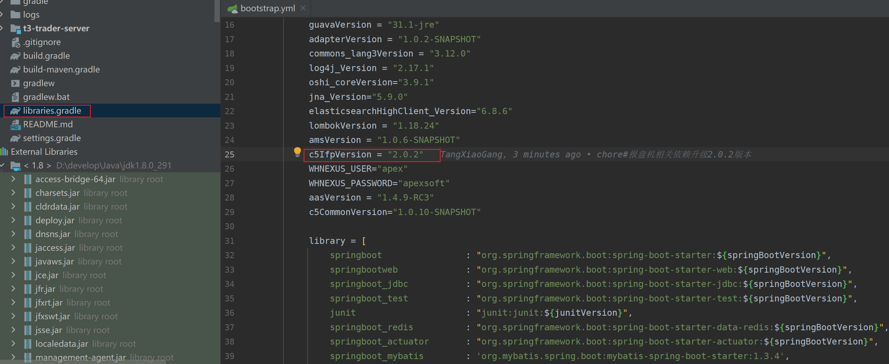

# gradle简介

2012年基于Ant和Maven产生的Gradle，弥补了Ant和Maven的不足，带来了一些更高效的特点。它使用一种基于Groovy的特定领域语言（DSL）来声明项目设置，抛弃了基于XML的各种繁琐配置。面向java应用为主。当前其支持的语言限于java、Groovy和Scala，计划未来将支持更多的语言。

# gradle安装

下载压缩包后直接解压，配置环境变量。

```
GRADLE_HOME:D:\develop\gradle-5.2.1
Path:%GRADLE_HOME%\bin
```

dos命令窗口执行`gradle -v`,若出现版本号，则说明安装成功。

# gradle项目结构

- src/main/java 放置正式代码目录

- src/main/resouces放置正式配置文件目录

- src/test/java 放置单元测试代码目录

- src/test/resources 放置测试配置文件目录

- src/main/webapp 放置页面元素，比如：js，css，img，jsp，html等等

# groovy语言介绍

groovy中可以省略语句最末尾的分号、可以省略括号；

**groovy定义变量**

```groovy
def 变量名 = 变量值；
```

def为弱类型，其类型由变量值确定。

```groovy
//定义字符串：
def i ="abc";
println i
```

```groovy
//定义数字：
def i =123;
println i
```

```groovy
//定义list

def list=[1,2,4];
//向集合中添加元素
list << 7;
//输出集合第三个元素
println list.get(2)
```

```groovy
//定义map

def map=['key1':'v1','key2':'v2']
//向map中添加键值对
map.key3='v3'
//输出key3的值
println(map.get("key3"))
```

**groovy中的闭包**

闭包：闭包其实就是一段代码块。在gradle中，主要是把闭包当参数来使用。

定义闭包：

```groovy
//定义无参数闭包
def b1={
    println "hello"
}
//定义方法，方法里面需要闭包类型的参数，注意Closure为类型，不需要导入任何jar包
def method1(Closure closure){
    closure()//表示执行闭包代码
}
//调用方法
method1(b1)

//执行结果：hello
```

```groovy
//定义带参数的闭包
def b2={
    v ->
        println("hello ${v}")
}
//定义方法
def method2(Closure closure){
    closure("zhangsan")
}
//调用方法
method2(b2)

//执行结果：hello zhangsan
```

**build.gradle文件**

```groovy
//指定所使用的仓库，mavenCentral()表示使用中央仓库，此刻项目中所需要的jar包都会默认从中央仓库下载到本地指定目录
//mavenLocal()
//mavenCentral()
//以上配置表先从本地仓库寻找依赖，如果没有再从中仓库下载。

//mavenCentral()
//如果只配置中央仓库，表示直接从中央仓库下载iar包。但是如果指定下载的位置已经有了，就不会再次下载了。
repositories {
    mavenLocal()
    mavenCentral()
}


//gradle工程所有的jar包的坐标都在dependencies属性内放置
//每一个jaz包的坐标都有三个基本元素组成group，name，version
//testConpile 表示该jar包在测试的时候起作用，该属性为jar包的作用域
//我们在gradle里面添加坐标的时候都要带上jar包的作用域
dependencies {
    testCompile grop:'junit',name:'junit',version:'4.12'
}
```

```cpp
settings.gradle  //记录了父工程和子模块的相关信息
gradlew  //Linux 下可执行脚本
gradlew.bat  //Windows 下可执行脚本
```

父工程build.gradle中的配置信息，子模块是共享的，子模块独特的配置信息可以写在自己的build.gradle文件中。

# 配置本地仓库

配置环境变量

```
变量名：GRADLE_USER_HOME
变量值：D:\develop\javajar\gradlerepo
```


# IDEA配置gradle


# 配置镜像源

在ini.d目录下，新建init.gradle文件，为所有项目都配置镜像源

```groovy
allprojects{
    repositories {
        def ALIYUN_REPOSITORY_URL = 'http://maven.aliyun.com/nexus/content/groups/public'
        def ALIYUN_JCENTER_URL = 'http://maven.aliyun.com/nexus/content/repositories/jcenter'
        def GRADLE_LOCAL_RELEASE_URL = 'https://repo.gradle.org/gradle/libs-releases-local'
        def ALIYUN_SPRING_RELEASE_URL = 'https://maven.aliyun.com/repository/spring-plugin'

        all { ArtifactRepository repo ->
            if(repo instanceof MavenArtifactRepository){
                def url = repo.url.toString()
                if (url.startsWith('https://repo1.maven.org/maven2')) {
                    project.logger.lifecycle "Repository ${repo.url} replaced by $ALIYUN_REPOSITORY_URL."
                    remove repo
                }
                if (url.startsWith('https://jcenter.bintray.com/')) {
                    project.logger.lifecycle "Repository ${repo.url} replaced by $ALIYUN_JCENTER_URL."
                    remove repo
                }
                if (url.startsWith('http://repo.spring.io/plugins-release')) {
                    project.logger.lifecycle "Repository ${repo.url} replaced by $ALIYUN_SPRING_RELEASE_URL."
                    remove repo
                }
            }
        }
        maven {
            url ALIYUN_REPOSITORY_URL     
        }

        maven {            
            url ALIYUN_JCENTER_URL            
        }
        maven {            
            url ALIYUN_SPRING_RELEASE_URL
        }
        maven {
            url GRADLE_LOCAL_RELEASE_URL
        }
    }
}
```

一般在项目中的build-maven.gradle中配置maven私仓和共仓镜像就可以了，不需要，上面的操作。

```groovy
/**
 *    ============================================================================
 *    Nexus definitions for project
 *    Global Config for all projects
 *    ============================================================================
 *    Define Global Config and Nexus locations here then use them inside your build.gradle
 *    files in root projects.
 *
 *    Included from: "${rootProject.projectDir}/build.gradle"
 *    ============================================================================
 *    全局maven仓库配置
 *    子模块插件整体配置
 */
def NEXUS_USER = System.getenv("NEXUS_USER")
def NEXUS_PASSWORD = System.getenv("NEXUS_PASSWORD")

allprojects {
    apply from: "${rootProject.projectDir}/build-libraries.gradle"

    repositories {
        // 本地仓库
        mavenLocal()
        // 第二顺序： 武汉仓库
        maven {
            credentials {
                username = "${WHNEXUS_USER}"
                password = "${WHNEXUS_PASSWORD}"
            }
            url "http://218.66.59.169:4112/nexus/content/groups/apexsoft-group/"
        }

        // 第三顺序： 福州总部仓库
        maven {
            credentials {
                username = "${NEXUS_USER}"
                password = "${NEXUS_PASSWORD}"
            }
            url "http://oss.apexsoft.com.cn/repository/maven-public/"
        }
        maven {
            credentials {
                username = "${WHNEXUS_USER}"
                password = "${WHNEXUS_PASSWORD}"
            }
            url "http://pkg.apexsoft.top/repository/apexsoft-group/"
        }
        maven {
            url "http://maven.aliyun.com/nexus/content/groups/public"
        }
    }
    configurations.all {
        //每隔24小时检查远程依赖是否存在更新
        //resolutionStrategy.cacheChangingModulesFor 24, 'hours'
        resolutionStrategy.cacheChangingModulesFor 0, 'seconds'
    }
}

subprojects {
    apply plugin: 'java'
    apply plugin: 'java-library'
    apply plugin: 'maven'
    apply plugin: 'idea'
    // FIX Windows CreateProcess error=206
    apply plugin: 'ua.eshepelyuk.ManifestClasspath'

    sourceCompatibility = 1.8
    targetCompatibility = 1.8
    tasks.withType(JavaCompile) {
        options.encoding = 'UTF-8'
    }
    [compileJava, compileTestJava]*.options*.encoding = 'UTF-8'

    configurations {
        all*.exclude group: 'org.slf4j', module: 'slf4j-log4j12'
        all*.exclude group: 'org.springframework.boot', module: 'spring-boot-starter-logging'
        all*.exclude group: 'org.elasticsearch', module: 'jna'
    }

    dependencies {
        compile library['yaml']
        compile library['fastjson']
        testCompile library['springboot_test']
        testCompile library['junit']
        // fix:修复log4j2漏洞问题
        compile library['log4jApi']
        compile library['log4jCore']
        compile library['log4jSlf4jImpl']
    }

    jar {
        manifest.attributes provider: 'gradle'
    }
}
```

# maven私仓

Sonatype Nexus Repository Manager 搭建maven 私仓

```
apply from: 'xx.gradle'这样的语句就可以引入其他gradle文件了
```


# RPC

出参字段的类型一般都为string类型。

早期单机时代，一台电脑上运行多个进程，大家各干各的，老死不相往来。假如A进程需要一个画图的功能，B进程也需要一个画图的功能，程序员就必须为两个进程都写一个画图的功能。这不是整人么？于是就出现了IPC（Inter-process communication，单机中运行的进程之间的相互通信）。OK，现在A既然有了画图的功能，B就调用A进程上的画图功能好了，程序员终于可以偷下懒了。

到了网络时代，大家的电脑都连起来了。以前程序只能调用自己电脑上的进程，能不能调用其他机器上的进程呢？于是就程序员就把IPC扩展到网络上，这就是RPC（远程过程调用）了。现在不仅单机上的进程可以相互通信，多机器中的进程也可以相互通信了。

要知道实现RPC很麻烦呀，什么多线程、什么Socket、什么I/O，都是让咱们普通程序员很头疼的事情。于是就有牛人开发出RPC框架（比如，CORBA、RMI、Web Services、RESTful Web Services等等）。

OK，现在可以定义RPC框架的概念了。简单点讲，RPC框架就是可以让程序员来调用远程进程上的代码一套工具。有了RPC框架，咱程序员就轻松很多了，终于可以逃离多线程、Socket、I/O的苦海了。

微服务之间的通信可以通过http或rcp


proto中：

入参、出参、服务名首字母大写。

model实体根据proto出参定义

provide方法实现/重写proto接口

dao接口为proto方法，接口参数为proto入参 


# 仓库顺序导致的构建问题


出现此种问题的原因是：配置了多个仓库，而项目构建时会按照配置的顺序去下载依赖，图片显示显示的pkg仓库不可用，故出现此种情况，可尝试调整仓库的顺序，或者添加阿里云仓库。


# SGG-gradle

## gradle项目结构


gradlew、gradlew.bat为脚本执行器，执行wrapper目录下文件中配置的命令脚本。gradlew为其他操作系统使用，gradlew.bat为windows操作系统使用。gradle目录、gradlew、gradlew.bat可以删掉。

buile.gradle：每个子项目都有一个

settings.gradle：一个项目仅有一个，管理项目和其下的所有子项目。

>     1. 只有war工程才有webapp目录，对于普通的jar工程并没有webapp目录
>      2. gradlew与gradlew.bat执行的指定wrapper版本中的gradle指令,不是本地安装的gradle指令

## gradle常用指令


gradle builde命令其实就是gradle classes 和gradle test命令都执行，因此在执行此命令时，单元测试都会执行，若有错误也会构建失败白，最终会生成测试报告report

## 修改maven下载源

在gradle的int.d目录下新建以.gradle结尾的文件，内容为以下内容，如intl.gradle

```groovy
allprojects {
	repositories {
		mavenLocal() 
		maven { name "Alibaba" ; url "https://maven.aliyun.com/repository/public" } //name属性值非必须，可以去掉仅保留url
		maven { name "Bstek" ; url "https://nexus.bsdn.org/content/groups/public/" } 
         mavenCentral()
	}
	buildscript {
		repositories { 
		maven { name "Alibaba" ; url 'https://maven.aliyun.com/repository/public' } 
		maven { name "Bstek" ; url 'https://nexus.bsdn.org/content/groups/public/' } 
		maven { name "M2" ; url 'https://plugins.gradle.org/m2/' }
		}
	}
}
```

repositories为项目使用的所有依赖的下载源，buildscript为项目构建脚本所需要的依赖的下载源。

下载依赖时仓库的选择和仓库配置的顺序有关，当前仓库找不到依赖时会去下一个仓库找，所有仓库都找不到会报错。

**仓库地址说明**

> avenLocal()：指定使用maven本地仓库，而本地仓库在配置maven时settings文件指定的仓库位置。如E:/repository，gradle 查找jar包顺序如下：USER_HOME/.m2/settings.xml >> M2_HOME/conf/settings.xml >> USER_HOME/.m2/repository maven { url 地址}，指定maven仓库，一般用私有仓库地址或其它的第三方库【比如阿里镜像仓库地址】。 
>
> mavenCentral()：这是Maven的中央仓库，无需配置，直接声明就可以使用。
>
>  jcenter()：JCenter中央仓库，实际也是是用的maven搭建的，但相比Maven仓库更友好，通过CDN分发，并且支持https访 问,在新版本中已经废弃了，替换为了mavenCentral()。
>
>  总之, gradle可以通过指定仓库地址为本地maven仓库地址和远程仓库地址相结合的方式，避免每次都会去远程仓库下载 依赖库。这种方式也有一定的问题，如果本地maven仓库有这个依赖，就会从直接加载本地依赖，如果本地仓库没有该 依赖，那么还是会从远程下载。但是下载的jar不是存储在本地maven仓库中，而是放在自己的缓存目录中，默认在 USER_HOME/.gradle/caches目录,当然如果我们配置过GRADLE_USER_HOME环境变量，则会放在 GRADLE_USER_HOME/caches目录，gradle会把下载过的依赖缓存在caches目录中，与maven本地仓库的概念有所不认同。

此目录缓存gradle下载过的依赖

```\
D:\Develop\Javarepo\gradlerepo\caches\modules-2\files-2.1
```

阿里云仓库地址指南：https://developer.aliyun.com/mvn/guide

<<<<<<< HEAD
出现此种问题的原因是：配置了多个仓库，而项目构建时会按照配置的顺序去下载依赖，图片显示显示的pkg仓库不可用，故出现此种情况，可尝试调整仓库的顺序，或者添加阿里云仓库。

# gradle项目创建

以为IDEA 2021.1为例


项目初始化后默认使用的是gradle-wrapper.jar中的gradle，需要改成本地安装的gradle


初始化项目目录如下


若刚开始不勾选groovy，项目目录如下，建议勾选groovy


include引入子项目时要使用相对引用（上图表述有点问题），：表示当前（此settings.gradle文件所在工程）根工程


# 强制指定版本

有时通过检查检查依赖发现申明的版本并不会起作用，可用一下方法强制指定使用版本




```groovy
resolutionStrategy {
    force 'com.apexsoft.ifp:ifp-account-protocol:2.0.2'
    force 'com.apexsoft.ifp:ifp-health-protocol:2.0.2'
    force 'com.apexsoft.ifp:ifp-health-client-side:2.0.2'
    force 'com.apexsoft.ifp:ifp-message-protocol:2.0.2'
    force 'com.apexsoft.ifp:ifp-trade-protocol:2.0.2'

}
```


# 其他

## Could not load module metadata from

```
Error:Could not resolve all dependencies for configuration ':app:debugCompileClasspath'.
  Could not load module metadata from C:\Users\nirzo\.gradle\caches\modules-2\metadata-2.36\descriptors\...\descriptor.bin

  Unexpected metadata type found.
```

解决方法：

第一步：进入C:\Users\nirzo\.gradle\caches\modules-2\目录，然后删除metadata-2.36文件夹。此时需要关闭AS，否则会报文件被打开，无法删除。

第二步：保持联网的状态，打开AS，此时AS做同步时会下载许多东西，等待完成即可。

第三步：工程同步成功、编译应该也可以成功。

参考：https://blog.csdn.net/bendan50/article/details/91564110
