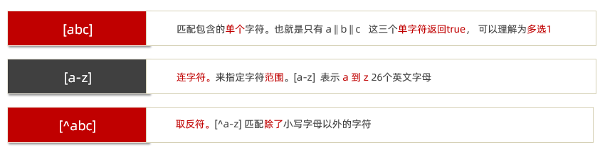

# 1. 介绍

> 知道 ECMAScript 与 JavaScript 的关系，Web APIs 是浏览器扩展的功能。

严格意义上讲，我们在 JavaScript 阶段学习的知识绝大部分属于 ECMAScript 的知识体系，ECMAScript 简称 ES 它提供了一套语言标准规范，如变量、数据类型、表达式、语句、函数等语法规则都是由 ECMAScript 规定的。浏览器将 ECMAScript 大部分的规范加以实现，并且在此基础上又扩展一些实用的功能，这些被扩展出来的内容我们称为 Web APIs。


ECMAScript 运行在浏览器中然后再结合 Web APIs 才是真正的 JavaScript，Web APIs 的核心是 DOM 和 BOM。

扩展阅读：ECMAScript 规范在不断的更新中，存在多个不同的版本，早期的版本号采用数字顺序编号如 ECMAScript3、ECMAScript5，后来由于更新速度较快便采用年份做为版本号，如 ECMAScript2017、ECMAScript2018 这种格式，ECMAScript6 是 2015 年发布的，常叫做 EMCAScript2015。

关于 JavaScript 历史的[扩展阅读](https://javascript.ruanyifeng.com/introduction/history.html)。

## 1.1 概念

### DOM

DOM（Document Object Model）是将整个 HTML 文档的每一个标签元素视为一个对象，这个对象下包含了许多的属性和方法，通过操作这些属性或者调用这些方法实现对 HTML 的动态更新，为实现网页特效以及用户交互提供技术支撑。

简言之 DOM 是用来动态修改 HTML 的，其目的是开发网页特效及用户交互。

观察一个小例子：


上述的例子中当用户分分别点击【开始】或【结束】按钮后，通过右侧调试窗口可以观察到 html 标签的内容在不断的发生改变，这便是通过 DOM 实现的。

### 1.1.1 DOM 树

```html
<!DOCTYPE html>
<html lang="en">
<head>
  <meta charset="UTF-8">
  <meta name="viewport" content="width=device-width, initial-scale=1.0">
  <title>标题</title>
</head>
<body>
  文本
  <a href="">链接名</a>
  <div id="" class="">文本</div>
</body>
</html>
```

如下图所示，将 HTML 文档以树状结构直观的表现出来，我们称之为`文档树`或` DOM 树`，**文档树直观的体现了标签与标签之间的关系。**


### 1.1.2 DOM 节点

节点是文档树的组成部分，**每一个节点都是一个 DOM 对象**，主要分为元素节点、属性节点、文本节点等。

1. 【元素节点】其实就是 HTML 标签，如上图中 `head`、`div`、`body` 等都属于元素节点。
2. 【属性节点】是指 HTML 标签中的属性，如上图中 `a` 标签的 `href` 属性、`div` 标签的 `class` 属性。
3. 【文本节点】是指 HTML 标签的文字内容，如 `title` 标签中的文字。
4. 【根节点】特指 `html` 标签。
5. 其它...

### 1.1.3 document

`document` 是 JavaScript 内置的专门用于 DOM 的对象，该对象包含了若干的属性和方法，`document` 是学习 DOM 的核心。

```html
<script>
  // document 是内置的对象
  // console.log(typeof document);

  // 1. 通过 document 获取根节点
  console.log(document.documentElement); // 对应 html 标签

  // 2. 通过 document 节取 body 节点
  console.log(document.body); // 对应 body 标签

  // 3. 通过 document.write 方法向网页输出内容
  document.write('Hello World!');
</script>
```

上述列举了 `document` 对象的部分属性和方法，我们先对 `document` 有一个整体的认识。

## 1.2 获取DOM对象

1. `querySelector('css选择器') `  ：满足条件的第一个元素
2. `querySelectorAll('css选择器') ` ：满足条件的元素集合 返回伪数组
3. 了解其他方式
   - getElementById('ID')
   - getElementsByTagName('元素标记名，如div p span等')
   - getElementsByClassName('class名')

```html
<!DOCTYPE html>
<html lang="en">
<head>
  <meta charset="UTF-8">
  <meta name="viewport" content="width=device-width, initial-scale=1.0">
  <title>DOM - 查找节点</title>
</head>
<body>
  <h3>查找元素类型节点</h3>
  <p>从整个 DOM 树中查找 DOM 节点是学习 DOM 的第一个步骤。</p>
  <ul>
      <li>元素</li>
      <li>元素</li>
      <li>元素</li>
      <li>元素</li>
  </ul>
  <script>
  	const p = document.querySelector('p')  // 获取第一个p元素
  	const lis = document.querySelectorAll('li')  // 获取所有li元素
  </script>
</body>
</html>
```

总结：

- document.getElementById 专门获取元素类型节点，根据标签的 `id`  属性查找
- 任意 DOM 对象都包含 nodeType 属性，用来检检测节点类型

```javascript
        const p = document.querySelector('#desc')
        console.log(p)
        console.log(p.nodeType)
        console.log(p.nodeName) 
```

## 1.3 操作元素内容
通过修改 DOM 的文本内容，动态改变网页的内容。

1. `innerText` 将文本内容添加/更新到任意标签位置，**文本中包含的标签不会被解析。**

```html
<script>
  // innerText 将文本内容添加/更新到任意标签位置
  const intro = document.querySelector('.intro')
  // intro.innerText = '嗨~ 我叫李雷！'
  // intro.innerText = '<h4>嗨~ 我叫李雷！</h4>'
</script>
```

2. `innerHTML` 将文本内容添加/更新到任意标签位置，**文本中包含的标签会被解析。**

```html
<script>
  // innerHTML 将文本内容添加/更新到任意标签位置
  const intro = document.querySelector('.intro')
  intro.innerHTML = '嗨~ 我叫韩梅梅！'
  intro.innerHTML = '<h4>嗨~ 我叫韩梅梅！</h4>'
</script>
```

总结：如果文本内容中包含 `html` 标签时推荐使用 `innerHTML`，否则建议使用 `innerText` 属性。

## 1.4 操作元素属性 

有3种方式可以实现对属性的修改：

### 1.4.1  常用属性修改

1. 直接能过属性名修改，最简洁的语法

```html
<script>
  // 1. 获取 img 对应的 DOM 元素
  const pic = document.querySelector('.pic')
	// 2. 修改属性
  pic.src = './images/lion.webp'
  pic.width = 400;
  pic.alt = '图片不见了...'
</script>
```

### 1.4.2  修改样式属性

1. **应用【修改样式】，通过修改行内样式 `style` 属性，实现对样式的动态修改。**

通过元素节点获得的 `style` 属性本身的数据类型也是对象，如 `box.style.color`、`box.style.width` 分别用来获取元素节点 CSS 样式的 `color` 和 `width` 的值。

```html
<!DOCTYPE html>
<html lang="en">
<head>
  <meta charset="UTF-8">
  <meta name="viewport" content="width=device-width, initial-scale=1.0">
  <title>练习 - 修改样式</title>
</head>
<body>
  <div class="box">随便一些文本内容</div>
  <script>
    // 获取 DOM 节点
    const box = document.querySelector('.intro')
    box.style.color = 'red'
    box.style.width = '300px'
    // css 属性的 - 连接符与 JavaScript 的 减运算符
    // 冲突，所以要改成驼峰法
    box.style.backgroundColor = 'pink'
  </script>
</body>
</html>
```

任何标签都有 `style` 属性，通过 `style` 属性可以动态更改网页标签的样式，如要遇到 `css` 属性中包含字符 `-` 时，要将 `-` 去掉并将其后面的字母改成大写，如 `background-color` 要写成 `box.style.backgroundColor`

2. **操作类名(className) 操作CSS**

如果修改的样式比较多，直接通过style属性修改比较繁琐，我们可以通过借助于css类名的形式。

~~~html
<!DOCTYPE html>
<html lang="en">
<head>
  <meta charset="UTF-8">
  <meta name="viewport" content="width=device-width, initial-scale=1.0">
  <title>练习 - 修改样式</title>
    <style>
        .pink {
            background: pink;
            color: hotpink;
        }
    </style>
</head>
<body>
  <div class="box">随便一些文本内容</div>
  <script>
    // 获取 DOM 节点
    const box = document.querySelector('.intro')
    box.className = 'pink'
  </script>
</body>
</html>
~~~

>注意：
>
>1.由于class是关键字, 所以使用className去代替
>
>2.className是使用新值换旧值, 如果需要添加一个类,需要保留之前的类名

3. **通过 classList 操作类控制CSS**

为了解决className 容易覆盖以前的类名，我们可以通过classList方式追加和删除类名

~~~html

<!DOCTYPE html>
<html lang="en">

<head>
    <meta charset="UTF-8">
    <meta http-equiv="X-UA-Compatible" content="IE=edge">
    <meta name="viewport" content="width=device-width, initial-scale=1.0">
    <title>Document</title>
    <style>
        div {
            width: 200px;
            height: 200px;
            background-color: pink;
        }

        .active {
            width: 300px;
            height: 300px;
            background-color: hotpink;
            margin-left: 100px;
        }
    </style>
</head>

<body>

    <div class="one"></div>
    <script>
        // 1.获取元素
        // let box = document.querySelector('css选择器')
        let box = document.querySelector('div')
        // add是个方法 添加  追加
        // box.classList.add('active')
        // remove() 移除 类
        // box.classList.remove('one')
        // 切换类
        box.classList.toggle('one')
    </script>
</body>

</html>
~~~

### 1.4.3 操作表单元素属性

表单很多情况，也需要修改属性，比如点击眼睛，可以看到密码，本质是把表单类型转换为文本框

正常的有属性有取值的跟其他的标签属性没有任何区别

获取：`DOM对象.属性名`

设置：`DOM对象.属性名= 新值`

~~~html

<!DOCTYPE html>
<html lang="en">

<head>
    <meta charset="UTF-8">
    <meta http-equiv="X-UA-Compatible" content="IE=edge">
    <meta name="viewport" content="width=device-width, initial-scale=1.0">
    <title>Document</title>

</head>

<body>
    <input type="text" value="请输入">
    <button disabled>按钮</button>
    <input type="checkbox" name="" id="" class="agree">
    <script>
        // 1. 获取元素
        let input = document.querySelector('input')
        // 2. 取值或者设置值  得到input里面的值可以用 value
        // console.log(input.value)
        input.value = '小米手机'
        input.type = 'password'

        // 2. 启用按钮
        let btn = document.querySelector('button')
        // disabled 不可用   =  false  这样可以让按钮启用
        btn.disabled = false
        // 3. 勾选复选框
        let checkbox = document.querySelector('.agree')
        checkbox.checked = false
    </script>
</body>

</html>
~~~

### 1.4.4  修改自定义属性

标准属性: 标签天生自带的属性 比如class id title等, 可以直接使用点语法操作比如： disabled、checked、selected

自定义属性：

- 在html5中推出来了专门的data-自定义属性  
- 在标签上一律以data-开头
- 在DOM对象上一律以`dataset对象方式`获取

~~~html
<!DOCTYPE html>
<html lang="en">

<head>
    <meta charset="UTF-8">
    <meta http-equiv="X-UA-Compatible" content="IE=edge">
    <meta name="viewport" content="width=device-width, initial-scale=1.0">
    <title>Document</title>

</head>

<body>
   <div data-id="1"> 自定义属性 </div>
    <script>
        // 1. 获取元素
        let div = document.querySelector('div')
        // 2. 获取自定义属性值
         console.log(div.dataset.id)
    </script>
</body>

</html>
~~~

## 1.5 定时器-间歇函数

`setInterval` 是 JavaScript 中内置的函数，它的作用是间隔固定的时间自动重复执行另一个函数，也叫定时器函数。

setInterval返回值

**返回值**：一个数字（定时器 ID）。

**用途**：该 ID 是一个唯一标识符，用于通过 `clearInterval(id)` 停止对应的定时器。

```html
<script>
  // 1. 定义一个普通函数
  function repeat() {
    console.log('不知疲倦的执行下去....')
  }

  // 2. 使用 setInterval 调用 repeat 函数
  // 间隔 1000 毫秒，重复调用 repeat
  setInterval(repeat, 1000)
</script>
```

```javascript
const id = setInterval(() => {
    console.log('Hello, world!');
}, 1000);

console.log(id); // 输出一个整数，例如 1

// 取消定时器
clearInterval(id);
```

```javascript
<script>
    let i = 0
		//开启定时器
    const df = setInterval(() => {
        i ++
        document.write(`hello world -------${i}---------${df}--------- ${new Date()} <br />`)
        if( i >= 10){
            //关闭定时器
            clearInterval(df)
        }
    }, 1000);
</script>
```

# 2. 事件

事件是编程语言中的术语，它是用来描述程序的行为或状态的，**一旦行为或状态发生改变，便立即调用一个函数。**

例如：用户使用【鼠标点击】网页中的一个按钮、用户使用【鼠标拖拽】网页中的一张图片

##  事件监听

结合 DOM 使用事件时，需要为 DOM 对象添加事件监听，等待事件发生（触发）时，便立即调用一个函数。

`addEventListener` 是 DOM 对象专门用来添加事件监听的方法，它的两个参数分别为【事件类型】和【事件回调】。

语法

```javascript
元素对象.addEventListener('事件类型', 要执行函数)
```

事件监听三要素：

1. 事件源： 那个dom元素被事件触发了，要获取dom元素
1. 事件类型： 用什么方式触发，比如鼠标单击 click、鼠标经过 mouseover 等 事件
1. 调用的函数： 要做什么事

```html
<!DOCTYPE html>
<html lang="en">
<head>
  <meta charset="UTF-8">
  <meta name="viewport" content="width=device-width, initial-scale=1.0">
  <title>事件监听</title>
</head>
<body>
  <h3>事件监听</h3>
  <p id="text">为 DOM 元素添加事件监听，等待事件发生，便立即执行一个函数。</p>
  <button id="btn">点击改变文字颜色</button>
  <script>
    // 1. 获取 button 对应的 DOM 对象
    const btn = document.querySelector('#btn')

    // 2. 添加事件监听
    btn.addEventListener('click', function () {
      console.log('等待事件被触发...')
      // 改变 p 标签的文字颜色
      let text = document.getElementById('text')
      text.style.color = 'red'
    })

    // 3. 只要用户点击了按钮，事件便触发了！！！
  </script>
</body>
</html>
```

完成事件监听分成3个步骤：

1. 获取 DOM 元素
2. 通过 `addEventListener` 方法为 DOM 节点添加事件监听
3. 等待事件触发，如用户点击了某个按钮时便会触发 `click` 事件类型
4. 事件触发后，相对应的回调函数会被执行

大白话描述：所谓的事件无非就是找个机会（事件触发）调用一个函数（回调函数）。

### 事件监听版本

- DOM L0 
  - 事件源.on事件 = function() { } 
- DOM L2
  - 事件源.addEventListener(事件， 事件处理函数) 
- 区别：
  - on方式会被覆盖，addEventListener方式可绑定多次，拥有事件更多特性，推荐使用


### 事件类型

`click` 译成中文是【点击】的意思，它的含义是监听（等着）用户鼠标的单击操作，除了【单击】还有【双击】`dblclick`

```html
<script>
  // 双击事件类型
  btn.addEventListener('dblclick', function () {
    console.log('等待事件被触发...');
    // 改变 p 标签的文字颜色
    const text = document.querySelector('.text')
    text.style.color = 'red'
  })

  // 只要用户双击击了按钮，事件便触发了！！！
</script>
```

结论：【事件类型】决定了事件被触发的方式，如 `click` 代表鼠标单击，`dblclick` 代表鼠标双击。

### 事件处理程序

`addEventListener` 的第2个参数是函数，这个函数会在事件被触发时立即被调用，在这个函数中可以编写任意逻辑的代码，如改变 DOM 文本颜色、文本内容等。

```html
<script>
  // 双击事件类型
  btn.addEventListener('dblclick', function () {
    console.log('等待事件被触发...')
    
    const text = document.querySelector('.text')
    // 改变 p 标签的文字颜色
    text.style.color = 'red'
    // 改变 p 标签的文本内容
    text.style.fontSize = '20px'
  })
</script>
```

结论：【事件处理程序】决定了事件触发后应该执行的逻辑。

## 事件类型

将众多的事件类型分类可分为：`鼠标事件、键盘事件、表单事件、焦点事件`等，我们逐一展开学习。

### 鼠标事件

鼠标事件是指跟鼠标操作相关的事件，如单击、双击、移动等。

1. `mouseenter` 监听鼠标是否移入 DOM 元素

```html
<body>
  <h3>鼠标事件</h3>
  <p>监听与鼠标相关的操作</p>
  <hr>
  <div class="box"></div>
  <script>
    // 需要事件监听的 DOM 元素
    const box = document.querySelector('.box');

    // 监听鼠标是移入当前 DOM 元素
    box.addEventListener('mouseenter', function () {
      // 修改文本内容
      this.innerText = '鼠标移入了...';
      // 修改光标的风格
      this.style.cursor = 'move';
    })
  </script>
</body>
```

2. `mouseleave` 监听鼠标是否移出 DOM 元素

```html
<body>
  <h3>鼠标事件</h3>
  <p>监听与鼠标相关的操作</p>
  <hr>
  <div class="box"></div>
  <script>
    // 需要事件监听的 DOM 元素
    const box = document.querySelector('.box');

    // 监听鼠标是移出当前 DOM 元素
    box.addEventListener('mouseleave', function () {
      // 修改文本内容
      this.innerText = '鼠标移出了...';
    })
  </script>
</body>
```

`click`：鼠标单击。

`dblclick`：鼠标双击。

`mousedown`：按下鼠标按钮。

`mouseup`：释放鼠标按钮。

`mousemove`：鼠标移动。

`mouseover`：鼠标移入某个元素区域。

`mouseout`：鼠标移出某个元素区域。

`mouseenter`：鼠标进入某个元素（不冒泡）。

`mouseleave`：鼠标离开某个元素（不冒泡）。

`contextmenu`：右键单击触发上下文菜单。

###  键盘事件

`keydown`   键盘按下触发
`keyup`        键盘抬起触发

### 表单事件

与表单交互相关的事件：

`focus`：元素获取焦点。

`blur`：元素失去焦点。

`change`：表单控件的值发生改变（适用于 `<input>`、`<select>`、`<textarea>`）。

`input`：用户输入时触发（比 `change` 更及时）。

`submit`：表单提交。

`reset`：表单重置。

`invalid`：表单验证失败。

`select`：用户选择文本。

###  窗口事件

与浏览器窗口相关的事件：

`load`：页面或资源加载完成。

`unload`：页面卸载。

`resize`：窗口大小改变。

`scroll`：页面滚动。

`beforeunload`：页面即将卸载。

`error`：页面加载或运行时发生错误。

### 其他事件

剪贴板事件、拖放事件、媒体事件、触摸事件、网络事件等等

## 事件对象

任意事件类型被触发时与事件相关的信息会被以对象的形式记录下来，我们称这个对象为事件对象。例如：鼠标点击事件中，事件对象就存了鼠标点在哪个位置等信息

事件对象使用场景：

- 可以判断用户按下哪个键，比如按下回车键可以发布新闻
- 可以判断鼠标点击了哪个元素，从而做相应的操作

```html
<body>
  <h3>事件对象</h3>
  <p>任意事件类型被触发时与事件相关的信息会被以对象的形式记录下来，我们称这个对象为事件对象。</p>
  <hr>
  <div class="box"></div>
  <script>
    // 获取 .box 元素
    const box = document.querySelector('.box')

    // 添加事件监听
    box.addEventListener('click', function (e) {
      console.log('任意事件类型被触发后，相关信息会以对象形式被记录下来...');

      // 事件回调函数的第1个参数即所谓的事件对象
      console.log(e)
    })
  </script>
</body>
```

事件回调函数的【第1个参数】即所谓的事件对象，通常习惯性的将这个对数命名为 `event`、`ev` 、`ev` 。

接下来简单看一下事件对象中包含了哪些有用的信息：

1. `ev.type` 当前事件的类型
2. `ev.clientX/Y` 光标相对浏览器窗口的位置
3. `ev.offsetX/Y` 光标相于当前 DOM 元素的位置
4. `key` 用户按下的键盘键的值

注：在事件回调函数内部通过 window.event 同样可以获取事件对象。

```javascript
<body>
    <button class="btn">提交</button>
    <input type="text" class="text">
    <script>
        const btn = document.querySelector('.btn')
        btn.addEventListener('click', function(e){
            console.log(e)
            console.log(e.clientX)
            console.log(e.clientY)
            console.log(e.type)
        })

        document.querySelector('.text')
        .addEventListener('keyup',function(e){
            console.log(e)
            console.log(e.key)
            if(e.key === 'Enter'){
                alert('按下了enter键！！！')
            }
        })
    </script>
</body>
```

```
在JavaScript中，以下几种情况被视为假值（falsy）：
​ false
​ 0 （数字零）
​ -0 （负零）
​ 0n （BigInt类型的零）
​ 空字符串 ""
​ null
​ undefined
​ NaNs       
```

## 环境对象

> 能够分析判断函数运行在不同环境中 this 所指代的对象。

环境对象指的是`函数内部`特殊的变量 `this` ，它代表着当前函数运行时所处的环境。

```html
<body>
    <button class="btn">提交</button>
    <script>
        function sayHi() {
            // this 是一个变量
            console.log(this);//this指的是window
        }

        // 声明一个对象
        let user = {
            name: '张三',
            sayHi: sayHi // 此处把 sayHi 函数，赋值给 sayHi 属性
        }

        let person = {
            name: '李四',
            sayHi: sayHi
        }

        // 直接调用
        sayHi() // 直接调用，其实就是window调用 window 
        window.sayHi() // window

        // 做为对象方法调用
        user.sayHi()// user
        person.sayHi()// person

        document.querySelector('.btn')
            .addEventListener('click', function () {
                console.log(this) //btn
            })
    </script>
</body>
```

结论：

1. `this` 本质上是一个变量，数据类型为对象
2. 函数的调用方式不同 `this` 变量的值也不同
3. 【谁调用 `this` 就是谁】是判断 `this` 值的粗略规则
4. 函数直接调用时实际上 `window.sayHi()` 所以 `this` 的值为 `window`
5. **箭头函数没有this** 

## 回调函数

如果将函数 A 做为参数传递给函数 B 时，我们称函数 A 为回调函数。

```html
<script>
  // 声明 foo 函数
  function foo(arg) {
    console.log(arg);
  }

  // 普通的值做为参数
  foo(10);
  foo('hello world!');
  foo(['html', 'css', 'javascript']);

  function bar() {
    console.log('函数也能当参数...');
  }
  // 函数也可以做为参数！！！！
  foo(bar);
</script>
```

函数 `bar` 做参数传给了 `foo` 函数，`bar` 就是所谓的回调函数了！！！

我们回顾一下间歇函数 `setInterval` 

```html
<script>
	function fn() {
    console.log('我是回调函数...');
  }
  // 调用定时器
  setInterval(fn, 1000);
</script>
```

`fn` 函数做为参数传给了 `setInterval` ，这便是回调函数的实际应用了，结合刚刚学习的函数表达式上述代码还有另一种更常见写法。

```html
<script>
  // 调用定时器，匿名函数做为参数
  setInterval(function () {
    console.log('我是回调函数...');
  }, 1000);
</script>
```

结论：

1. 回调函数本质还是函数，只不过把它当成参数使用
2. 使用匿名函数做为回调函数比较常见

# 3. 事件流

**事件流** 是描述当事件发生时，在文档中如何传递和处理的一种机制。

**1. 捕获阶段（Capturing Phase）**

​	•	事件从 **最顶层的父级元素** 开始，沿着 DOM 树向下传递到目标元素。

​	•	在此阶段，父级元素有机会捕获事件并进行处理。

​	•	默认情况下，捕获阶段的事件监听器不执行，除非明确指定。

**2. 目标阶段（Target Phase）**

​	•	事件到达目标元素本身。

​	•	目标元素会处理事件，具体取决于它是否有绑定相关的事件监听器。

**3. 冒泡阶段（Bubbling Phase）**

​	•	事件从目标元素开始，沿着 DOM 树向上冒泡到最顶层的父级元素。

​	•	如果在目标元素或任何父级元素上绑定了事件监听器，事件会被处理。

> 事件是否会经历完整的 **捕获阶段**、**目标阶段** 和 **冒泡阶段**，取决于以下几个因素：
>
> **1. 事件的传播机制**
>
> 事件默认会按照以下流程传播：
>
> ​	1.	捕获阶段：从最顶层（window）向目标元素的路径传播。
>
> ​	2.	目标阶段：在目标元素上触发事件。
>
> ​	3.	冒泡阶段：从目标元素开始向上传播回顶层。
>
> 如果不做任何干预，事件会经历完整的三阶段传播。
>
> **2. 事件监听器的位置和配置**
>
> ​	•	如果只在捕获阶段或冒泡阶段绑定监听器，事件只会触发绑定阶段的回调函数。
>
> ​	•	addEventListener 的第三个参数 useCapture 决定监听器的执行阶段：
>
> ​	•	true：监听器在捕获阶段触发。
>
> ​	•	false（默认）：监听器在冒泡阶段触发。
>
> **3. 是否调用了 stopPropagation()**
>
> ​	•	如果在某阶段调用了 event.stopPropagation()，事件将停止进一步传播。
>
> ​	•	**捕获阶段停止**：事件不会到达目标阶段，也不会进入冒泡阶段。
>
> ​	•	**目标阶段停止**：事件不会进入冒泡阶段。
>
> ​	•	**冒泡阶段停止**：事件不会继续向上传播。


如上图所示，任意事件被触发时总会经历两个阶段：【捕获阶段】和【目标阶段】【冒泡阶段】。

简言之，捕获阶段是【从父到子】的传导过程，冒泡阶段是【从子向父】的传导过程。

### 捕获和冒泡

了解了什么是事件流之后，我们来看事件流是如何影响事件执行的：

```html
<body>
  <h3>事件流</h3>
  <p>事件流是事件在执行时的底层机制，主要体现在父子盒子之间事件的执行上。</p>
  <div class="outer">
    <div class="inner">
      <div class="child"></div>
    </div>
  </div>
  <script>
    // 获取嵌套的3个节点
    const outer = document.querySelector('.outer');
    const inner = document.querySelector('.inner');
    const child = document.querySelector('.child');
		
    // html 元素添加事件
    document.documentElement.addEventListener('click', function () {
      console.log('html...')
    })
		
    // body 元素添加事件
    document.body.addEventListener('click', function () {
      console.log('body...')
    })

    // 外层的盒子添加事件
    outer.addEventListener('click', function () {
      console.log('outer...')
    })
    
    // 中间的盒子添加事件
    outer.addEventListener('click', function () {
      console.log('inner...')
    })
    
    // 内层的盒子添加事件
    outer.addEventListener('click', function () {
      console.log('child...')
    })
  </script>
</body>
```

执行上述代码后发现，当单击事件触发时，其祖先元素的单击事件也【相继触发】，这是为什么呢？

结合事件流的特征，我们知道当某个元素的事件被触发时，事件总是会先经过其祖先才能到达当前元素，然后再由当前元素向祖先传递，事件在流动的过程中遇到相同的事件便会被触发。

事件的执行顺序是可控制的，即可以在捕获阶段被执行，也可以在冒泡阶段被执行。如果事件是在冒泡阶段执行的，我们称为冒泡模式，它会先执行子盒子事件再去执行父盒子事件，默认是冒泡模式。如果事件是在捕获阶段执行的，我们称为捕获模式，它会先执行父盒子事件再去执行子盒子事件。

```html
<body>
  <h3>事件流</h3>
  <p>事件流是事件在执行时的底层机制，主要体现在父子盒子之间事件的执行上。</p>
  <div class="outer">
    <div class="inner"></div>
  </div>
  <script>
    // 获取嵌套的3个节点
    const outer = document.querySelector('.outer')
    const inner = document.querySelector('.inner')

    // 外层的盒子
    outer.addEventListener('click', function () {
      console.log('outer...')
    }, true) // true 表示在捕获阶段执行事件
    
    // 中间的盒子
    outer.addEventListener('click', function () {
      console.log('inner...')
    }, true)
  </script>
</body>
```

结论：

1. `addEventListener` 第3个参数决定了事件是在捕获阶段触发还是在冒泡阶段触发
2. `addEventListener` 第3个参数为  `true` 表示捕获阶段触发，`false` 表示冒泡阶段触发，默认值为 `false`
3. 事件流只会在父子元素具有相同事件类型时才会产生影响
4. 绝大部分场景都采用默认的冒泡模式（其中一个原因是早期 IE 不支持捕获）

### 阻止冒泡

因为默认就有冒泡模式的存在，所以容易导致事件影响到父级元素，若想把事件就限制在当前元素内，就需要阻止事件冒泡

阻止冒泡是指阻断事件的流动，保证事件只在当前元素被执行，而不再去影响到其对应的祖先元素。

```html
<body>
  <h3>阻止冒泡</h3>
  <p>阻止冒泡是指阻断事件的流动，保证事件只在当前元素被执行，而不再去影响到其对应的祖先元素。</p>
  <div class="outer">
    <div class="inner">
      <div class="child"></div>
    </div>
  </div>
  <script>
    // 获取嵌套的3个节点
    const outer = document.querySelector('.outer')
    const inner = document.querySelector('.inner')
    const child = document.querySelector('.child')

    // 外层的盒子
    outer.addEventListener('click', function () {
      console.log('outer...')
    })

    // 中间的盒子
    inner.addEventListener('click', function (ev) {
      console.log('inner...')

      // 阻止事件冒泡
      ev.stopPropagation()
    })

    // 内层的盒子
    child.addEventListener('click', function (ev) {
      console.log('child...')

      // 借助事件对象，阻止事件向上冒泡
      ev.stopPropagation()
    })
  </script>
</body>
```

结论：事件对象中的 `ev.stopPropagation` 方法，专门用来阻止事件冒泡。此方法可以阻断事件流动传播，不光在冒泡阶段有效，捕获阶段也有效

>鼠标经过事件：
>
>mouseover 和 mouseout 会有冒泡效果
>
>mouseenter  和 mouseleave   没有冒泡效果 (推荐)

## 事件委托

事件委托是 **利用事件冒泡机制**，将子元素的事件处理绑定到其父元素上的一种编程技术。当某个子元素触发事件时，事件会冒泡到父元素。在父元素上通过监听该事件，可以捕获到所有子元素触发的事件，并根据事件的 event.target 属性确定具体的子元素，从而实现对子元素事件的集中管理。

事件委托是利用事件流的特征解决一些现实开发需求的知识技巧，主要的作用是提升程序效率。

大量的事件监听是比较耗费性能的，如下代码所示

```html
<script>
  // 假设页面中有 10000 个 button 元素
  const buttons = document.querySelectorAll('table button');

  for(let i = 0; i <= buttons.length; i++) {
    // 为 10000 个 button 元素添加了事件
    buttons.addEventListener('click', function () {
      // 省略具体执行逻辑...
    })
  }
</script>
```

利用事件流的特征，可以对上述的代码进行优化，事件的的冒泡模式总是会将事件流向其父元素的，如果父元素监听了相同的事件类型，那么父元素的事件就会被触发并执行，正是利用这一特征对上述代码进行优化，如下代码所示：

```html
<script>
  // 假设页面中有 10000 个 button 元素
  let buttons = document.querySelectorAll('table button');
  
  // 假设上述的 10000 个 buttom 元素共同的祖先元素是 table
  let parents = document.querySelector('table');
  parents.addEventListener('click', function () {
    console.log('点击任意子元素都会触发事件...');
  })
</script>
```

我们的最终目的是保证只有点击 button 子元素才去执行事件的回调函数，如何判断用户点击是哪一个子元素呢？


事件对象中的属性 `target` 或 `srcElement`属性表示真正触发事件的元素，它是一个元素类型的节点。

```html
<script>
  // 假设页面中有 10000 个 button 元素
  const buttons = document.querySelectorAll('table button')
  
  // 假设上述的 10000 个 buttom 元素共同的祖先元素是 table
  const parents = document.querySelector('table')
  parents.addEventListener('click', function (ev) {
    // console.log(ev.target);
    // 只有 button 元素才会真正去执行逻辑
    if(ev.target.tagName === 'BUTTON') {
      // 执行的逻辑
    }
  })
</script>
```

优化过的代码只对祖先元素添加事件监听，相比对 10000 个元素添加事件监听执行效率要高许多！！！

## 事件解绑

1. on事件方式，直接使用null覆盖偶就可以实现事件的解绑

```javascript
    btn.onclick = function () {
      alert('点击了')
      // L0 事件移除解绑
      btn.onclick = null
    }
```

2. addEventListener方式，必须使用： removeEventListener(事件类型, 事件处理函数, [获取捕获或者冒泡阶段]) 例如：

```javascript
    function fn() {
      alert('点击了')
    }
    btn.addEventListener('click', fn)
    // L2 事件移除解绑
    btn.removeEventListener('click', fn)
```

注意：匿名函数无法被解绑

## 其他事件

### 页面加载事件

加载外部资源（如图片、外联CSS和JavaScript等）加载完毕时触发的事件

有些时候需要等页面资源全部处理完了做一些事情

**事件名：load**

监听页面所有资源加载完毕：

~~~javascript
window.addEventListener('load', function() {
    // xxxxx
})
~~~

### 元素滚动事件

滚动条在滚动的时候持续触发的事件

~~~javascript
window.addEventListener('scroll', function() {
    // xxxxx
})
~~~

### 页面尺寸事件

会在窗口尺寸改变的时候触发事件：

~~~javascript
window.addEventListener('resize', function() {
    // xxxxx
})
~~~

## 元素尺寸与位置

获取元素的自身宽高、包含元素自身设置的宽高、padding、border

offsetWidth和offsetHeight  

获取出来的是数值,方便计算

注意: 获取的是可视宽高, 如果盒子是隐藏的,获取的结果是0

# 4. 日期对象


ECMAScript 中内置了获取系统时间的对象 Date，使用 Date 时与之前学习的内置对象 console 和 Math 不同，它需要借助 new 关键字才能使用。

### 实例化

~~~javascript
  // 1. 实例化
  // const date = new Date(); // 系统默认时间
  const date = new Date('2020-05-01') // 指定时间
  // date 变量即所谓的时间对象

  console.log(typeof date)
~~~

### 方法

 ~~~javascript
  // 1. 实例化
 const date = new Date();
 // 2. 调用时间对象方法
 // 通过方法分别获取年、月、日，时、分、秒
 const year = date.getFullYear(); // 四位年份
 const month = date.getMonth(); // 0 ~ 11
 ~~~


getFullYear() 		获取四位年份

getMonth() 		  获取月份，取值为 0 ~ 11

getDate() 		     获取月份中的每一天，不同月份取值也不相同

getDay()			 获取星期，取值为 0 ~ 6

getHours() 		   获取小时，取值为 0 ~ 23

getMinutes()		 获取分钟，取值为 0 ~ 59

getSeconds() 		获取秒，取值为 0 ~ 59

### 时间戳

时间戳是指1970年01月01日00时00分00秒起至现在的总秒数或毫秒数，它是一种特殊的计量时间的方式。

注：ECMAScript 中时间戳是以毫秒计的。

~~~javascript
  // 1. 实例化
  const date = new Date()
  // 2. 获取时间戳
  console.log(date.getTime())
  // 还有一种获取时间戳的方法
  console.log(+new Date())
  // 还有一种获取时间戳的方法
  console.log(Date.now())
~~~


获取时间戳的方法，分别为 `getTime()` 和` Date.now() `和  +`new Date()`

## DOM 节点

回顾之前 DOM 的操作都是针对元素节点的属性或文本的，除此之外也有专门针对元素节点本身的操作，如插入、复制、删除、替换等。

DOM树里每一个内容都称之为节点

节点类型

1. 元素节点
   -  所有的标签 比如 body、 div l html 是根节点

2. 属性节点
   - 所有的属性 比如 href

3. 文本节点
   - 所有的文本

4. 其他


### 插入节点

在已有的 DOM 节点中插入新的 DOM 节点时，需要关注两个关键因素：

- 首先要得到新的 DOM 节点
- 其次在哪个位置插入这个节点。

如下代码演示：

```html
<body>
  <h3>插入节点</h3>
  <p>在现有 dom 结构基础上插入新的元素节点</p>
  <hr>
  <!-- 普通盒子 -->
  <div class="box"></div>
  <!-- 点击按钮向 box 盒子插入节点 -->
  <button class="btn">插入节点</button>
  <script>
    // 点击按钮，在网页中插入节点
    const btn = document.querySelector('.btn')
    btn.addEventListener('click', function () {
      // 1. 获得一个 DOM 元素节点
      const p = document.createElement('p')
      p.innerText = '创建的新的p标签'
      p.className = 'info'
      
      // 复制原有的 DOM 节点
      const p2 = document.querySelector('p').cloneNode(true)
      p2.style.color = 'red'

      // 2. 插入盒子 box 盒子
      document.querySelector('.box').appendChild(p)
      document.querySelector('.box').appendChild(p2)
    })
  </script>
</body>
```

结论：

- `createElement` 动态创建任意 DOM 节点

- `cloneNode` 复制现有的 DOM 节点，传入参数 true 会复制所有子节点

- `appendChild` 在末尾（结束标签前）插入节点

再来看另一种情形的代码演示：

```html
<body>
  <h3>插入节点</h3>
  <p>在现有 dom 结构基础上插入新的元素节点</p>
	<hr>
  <button class="btn1">在任意节点前插入</button>
  <ul>
    <li>HTML</li>
    <li>CSS</li>
    <li>JavaScript</li>
  </ul>
  <script>
    // 点击按钮，在已有 DOM 中插入新节点
    const btn1 = document.querySelector('.btn1')
    btn1.addEventListener('click', function () {

      // 第 2 个 li 元素
      const relative = document.querySelector('li:nth-child(2)')

      // 1. 动态创建新的节点
      const li1 = document.createElement('li')
      li1.style.color = 'red'
      li1.innerText = 'Web APIs'

      // 复制现有的节点
      const li2 = document.querySelector('li:first-child').cloneNode(true)
      li2.style.color = 'blue'

      // 2. 在 relative 节点前插入
      document.querySelector('ul').insertBefore(li1, relative)
      document.querySelector('ul').insertBefore(li2, relative)
    })
  </script>
</body>
```

结论：

- `createElement` 动态创建任意 DOM 节点

- `cloneNode` 复制现有的 DOM 节点，传入参数 true 会复制所有子节点

- `insertBefore` 在父节点中任意子节点之前插入新节点

### 删除节点

删除现有的 DOM 节点，也需要关注两个因素：首先由父节点删除子节点，其次是要删除哪个子节点。

```html
<body>
  <!-- 点击按钮删除节点 -->
  <button>删除节点</button>
  <ul>
    <li>HTML</li>
    <li>CSS</li>
    <li>Web APIs</li>
  </ul>

  <script>
    const btn = document.querySelector('button')
    btn.addEventListener('click', function () {
      // 获取 ul 父节点
      let ul = document.querySelector('ul')
      // 待删除的子节点
      let lis = document.querySelectorAll('li')

      // 删除节点
      ul.removeChild(lis[0])
    })
  </script>
</body>
```

结论：`removeChild` 删除节点时一定是由父子关系。

### 查找节点

DOM 树中的任意节点都不是孤立存在的，它们要么是父子关系，要么是兄弟关系，不仅如此，我们可以依据节点之间的关系查找节点。

#### 父子关系

```html
<body>
  <button class="btn1">所有的子节点</button>
  <!-- 获取 ul 的子节点 -->
  <ul>
    <li>HTML</li>
    <li>CSS</li>
    <li>JavaScript 基础</li>
    <li>Web APIs</li>
  </ul>
  <script>
    const btn1 = document.querySelector('.btn1')
    btn1.addEventListener('click', function () {
      // 父节点
      const ul = document.querySelector('ul')

      // 所有的子节点
      console.log(ul.childNodes)
      // 只包含元素子节点
      console.log(ul.children)
    })
  </script>
</body>
```

结论：

- `childNodes` 获取全部的子节点，回车换行会被认为是空白文本节点
- `children` 只获取元素类型节点

```html
<body>
  <table>
    <tr>
      <td width="60">序号</td>
      <td>课程名</td>
      <td>难度</td>
      <td width="80">操作</td>
    </tr>
    <tr>
      <td>1</td>
      <td><span>HTML</span></td>
      <td>初级</td>
      <td><button>变色</button></td>
    </tr>
    <tr>
      <td>2</td>
      <td><span>CSS</span></td>
      <td>初级</td>
      <td><button>变色</button></td>
    </tr>
    <tr>
      <td>3</td>
      <td><span>Web APIs</span></td>
      <td>中级</td>
      <td><button>变色</button></td>
    </tr>
  </table>
  <script>
    // 获取所有 button 节点，并添加事件监听
    const buttons = document.querySelectorAll('table button')
    for(let i = 0; i < buttons.length; i++) {
      buttons[i].addEventListener('click', function () {
        // console.log(this.parentNode); // 父节点 td
        // console.log(this.parentNode.parentNode); // 爷爷节点 tr
        this.parentNode.parentNode.style.color = 'red'
      })
    }
  </script>
</body>
```

结论：`parentNode` 获取父节点，以相对位置查找节点，实际应用中非常灵活。

#### 兄弟关系

```html
<body>
  <ul>
    <li>HTML</li>
    <li>CSS</li>
    <li>JavaScript 基础</li>
    <li>Web APIs</li>
  </ul>
  <script>
    // 获取所有 li 节点
    const lis = document.querySelectorAll('ul li')

    // 对所有的 li 节点添加事件监听
    for(let i = 0; i < lis.length; i++) {
      lis[i].addEventListener('click', function () {
        // 前一个节点
        console.log(this.previousSibling)
        // 下一下节点
        console.log(this.nextSibling)
      })
    }
  </script>
</body>
```

结论：

- `previousSibling` 获取前一个节点，以相对位置查找节点，实际应用中非常灵活。
- `nextSibling` 获取后一个节点，以相对位置查找节点，实际应用中非常灵活。


# 5. js组成

JavaScript的组成

- ECMAScript:
  - 规定了js基础语法核心知识。
  - 比如：变量、分支语句、循环语句、对象等等


- Web APIs :
  - DOM   文档对象模型， 定义了一套操作HTML文档的API
  - BOM   浏览器对象模型，定义了一套操作浏览器窗口的API


## window对象

**BOM** (Browser Object Model ) 是浏览器对象模型

- window对象是一个全局对象，也可以说是JavaScript中的顶级对象
- `像document、alert()、console.log()这些都是window的属性，基本BOM的属性和方法都是window的`
- `所有通过var定义在全局作用域中的变量、函数都会变成window对象的属性和方法`
- `window对象下的属性和方法调用的时候可以省略window`


```
BOM（浏览器对象模型）
 ├── window（核心对象）
      ├── document（DOM 的入口）
      ├── navigator（浏览器信息）
      ├── location（地址栏信息）
      ├── history（浏览记录）
      ├── screen（屏幕信息）
```

## 定时器-延迟函数

JavaScript 内置的一个用来让代码延迟执行的函数，叫 setTimeout

**语法：**

~~~JavaScript
setTimeout(回调函数, 延迟时间)
~~~

setTimeout 仅仅只执行一次，所以可以理解为就是把一段代码延迟执行, 平时省略window

间歇函数 setInterval : 每隔一段时间就执行一次， , 平时省略window

清除延时函数：

~~~JavaScript
clearTimeout(timerId)
~~~

>注意点
>
>1. 延时函数需要等待,所以后面的代码先执行
>2. 返回值是一个正整数，表示定时器的编号

~~~html
<body>
  <script>
    // 定时器之延迟函数

    // 1. 开启延迟函数
    let timerId = setTimeout(function () {
      console.log('我只执行一次')
    }, 3000)

    // 1.1 延迟函数返回的还是一个正整数数字，表示延迟函数的编号
    console.log(timerId)

    // 1.2 延迟函数需要等待时间，所以下面的代码优先执行

    // 2. 关闭延迟函数
    clearTimeout(timerId)

  </script>
</body>
~~~

延时函数: 执行一次

间歇函数: 每隔一段时间就执行一次,除非手动清除

## location对象 

location (地址) 它拆分并保存了 URL 地址的各个组成部分， 它是一个对象

| 属性/方法 | 说明                                                 |
| --------- | ---------------------------------------------------- |
| href      | 属性，获取完整的 URL 地址，赋值时用于地址的跳转      |
| search    | 属性，获取地址中携带的参数，符号 ？后面部分          |
| hash      | 属性，获取地址中的啥希值，符号 # 后面部分            |
| reload()  | 方法，用来刷新当前页面，传入参数 true 时表示强制刷新 |

~~~html
<body>
  <form>
    <input type="text" name="search"> <button>搜索</button>
  </form>
  <a href="#/music">音乐</a>
  <a href="#/download">下载</a>

  <button class="reload">刷新页面</button>
  <script>
    // location 对象  
    // 1. href属性 （重点） 得到完整地址，赋值则是跳转到新地址
    console.log(location.href)
    // location.href = 'http://www.itcast.cn'

    // 2. search属性  得到 ? 后面的地址 
    console.log(location.search)  // ?search=笔记本

    // 3. hash属性  得到 # 后面的地址
    console.log(location.hash)

    // 4. reload 方法  刷新页面
    const btn = document.querySelector('.reload')
    btn.addEventListener('click', function () {
      // location.reload() // 页面刷新
      location.reload(true) // 强制页面刷新 ctrl+f5
    })
  </script>
</body>
~~~

## navigator对象

navigator是对象，该对象下记录了浏览器自身的相关信息

常用属性和方法：

- 通过 userAgent 检测浏览器的版本及平台

~~~javascript
// 检测 userAgent（浏览器信息）
(function () {
  const userAgent = navigator.userAgent
  // 验证是否为Android或iPhone
  const android = userAgent.match(/(Android);?[\s\/]+([\d.]+)?/)
  const iphone = userAgent.match(/(iPhone\sOS)\s([\d_]+)/)
  // 如果是Android或iPhone，则跳转至移动站点
  if (android || iphone) {
    location.href = 'http://m.itcast.cn'
  }})();
~~~

## histroy对象

history (历史)是对象，主要管理历史记录， 该对象与浏览器地址栏的操作相对应，如前进、后退等

**使用场景**

history对象一般在实际开发中比较少用，但是会在一些OA 办公系统中见到。 


常见方法：


~~~html
<body>
  <button class="back">←后退</button>
  <button class="forward">前进→</button>
  <script>
    // histroy对象

    // 1.前进
    const forward = document.querySelector('.forward')
    forward.addEventListener('click', function () {
      // history.forward() 
      history.go(1)
    })
    // 2.后退
    const back = document.querySelector('.back')
    back.addEventListener('click', function () {
      // history.back()
      history.go(-1)
    })
  </script>
</body>

~~~

## 本地存储（今日重点）

本地存储：将数据存储在本地浏览器中

常见的使用场景：

<https://todomvc.com/examples/vanilla-es6/>    页面刷新数据不丢失

好处：

1、页面刷新或者关闭不丢失数据，实现数据持久化

2、容量较大，sessionStorage和 localStorage 约 5M 左右

###  localStorage（重点）

**作用:** 数据可以长期保留在本地浏览器中，刷新页面和关闭页面，数据也不会丢失

**特性：**以键值对的形式存储，并且存储的是字符串， 省略了window


~~~html
<!DOCTYPE html>
<html lang="en">

<head>
  <meta charset="UTF-8">
  <meta http-equiv="X-UA-Compatible" content="IE=edge">
  <meta name="viewport" content="width=device-width, initial-scale=1.0">
  <title>本地存储-localstorage</title>
</head>

<body>
  <script>
    // 本地存储 - localstorage 存储的是字符串 
    // 1. 存储
    localStorage.setItem('age', 18)

    // 2. 获取
    console.log(typeof localStorage.getItem('age'))

    // 3. 删除
    localStorage.removeItem('age')
  </script>
</body>

</html>
~~~

### sessionStorage（了解）

特性：

- 用法跟localStorage基本相同
- 区别是：当页面浏览器被关闭时，存储在 sessionStorage 的数据会被清除

存储：sessionStorage.setItem(key,value)

获取：sessionStorage.getItem(key)

删除：sessionStorage.removeItem(key)

### localStorage 存储复杂数据类型

**问题：**本地只能存储字符串,无法存储复杂数据类型.

**解决：**需要将复杂数据类型转换成 JSON字符串,在存储到本地

**语法：**JSON.stringify(复杂数据类型)

JSON字符串：

- 首先是1个字符串
- 属性名使用双引号引起来，不能单引号
- 属性值如果是字符串型也必须双引号

~~~html
<body>
  <script>
    // 本地存储复杂数据类型
    const goods = {
      name: '小米',
      price: 1999
    }
    // localStorage.setItem('goods', goods)
    // console.log(localStorage.getItem('goods'))

    // 1. 把对象转换为JSON字符串  JSON.stringify
    localStorage.setItem('goods', JSON.stringify(goods))
    // console.log(typeof localStorage.getItem('goods'))

  </script>
</body>
~~~


**问题：**因为本地存储里面取出来的是字符串，不是对象，无法直接使用

**解决： **把取出来的字符串转换为对象

**语法：**JSON.parse(JSON字符串)

~~~html
<body>
  <script>
    // 本地存储复杂数据类型
    const goods = {
      name: '小米',
      price: 1999
    }
    // localStorage.setItem('goods', goods)
    // console.log(localStorage.getItem('goods'))

    // 1. 把对象转换为JSON字符串  JSON.stringify
    localStorage.setItem('goods', JSON.stringify(goods))
    // console.log(typeof localStorage.getItem('goods'))

    // 2. 把JSON字符串转换为对象  JSON.parse
    console.log(JSON.parse(localStorage.getItem('goods')))

  </script>
</body>
~~~

## 综合案例

### 数组map 方法

**使用场景：**

map 可以遍历数组处理数据，并且返回新的数组

**语法：**

~~~javascript
<body>
  <script>
  const arr = ['red', 'blue', 'pink']
  // 1. 数组 map方法 处理数据并且 返回一个数组
   const newArr = arr.map(function (ele, index) {
    // console.log(ele)  // 数组元素
    // console.log(index) // 索引号
    return ele + '颜色'
	})
console.log(newArr)
</script>
</body>
~~~

>map 也称为映射。映射是个术语，指两个元素的集之间元素相互“对应”的关系。
>
>map重点在于有返回值，forEach没有返回值（undefined）

### 数组join方法

**作用：**join() 方法用于把数组中的所有元素转换一个字符串

**语法：**

~~~html
<body>
  <script>
    const arr = ['red', 'blue', 'pink']

    // 1. 数组 map方法 处理数据并且 返回一个数组
    const newArr = arr.map(function (ele, index) {
      // console.log(ele)  // 数组元素
      // console.log(index) // 索引号
      return ele + '颜色'
    })
    console.log(newArr)

    // 2. 数组join方法  把数组转换为字符串
    // 小括号为空则逗号分割
    console.log(newArr.join())  // red颜色,blue颜色,pink颜色
    // 小括号是空字符串，则元素之间没有分隔符
    console.log(newArr.join(''))  //red颜色blue颜色pink颜色
    console.log(newArr.join('|'))  //red颜色|blue颜色|pink颜色
  </script>
</body>
~~~


# 6. 正则表达式

**正则表达式**（Regular Expression）是一种字符串匹配的模式（规则）

**使用场景：**

- 例如验证表单：手机号表单要求用户只能输入11位的数字 (匹配)
- 过滤掉页面内容中的一些敏感词(替换)，或从字符串中获取我们想要的特定部分(提取)等 

-


### 正则基本使用

1. **使用字面量创建正则**

   ~~~JavaScript
   const reg =  /表达式/
   const regex = /abc/; // 匹配字符串 "abc"
   ~~~

   - 其中` /   / `是正则表达式字面量
   - 正则表达式也是`对象 `
   - 使用正则

     - `test()方法`   用来查看正则表达式与指定的字符串是否匹配

     - 如果正则表达式与指定的字符串匹配 ，返回`true`，否则`false`

~~~html
<body>
  <script>
    // 正则表达式的基本使用
    const str = 'web前端开发'
    // 1. 定义规则
    const reg = /web/

    // 2. 使用正则  test()
    console.log(reg.test(str))  // true  如果符合规则匹配上则返回true
    console.log(reg.test('java开发'))  // false  如果不符合规则匹配上则返回 false
  </script>
</body>
~~~

2. **使用 RegExp 构造函数创建正则**

```javascript
const regex = new RegExp("abc"); // 匹配字符串 "abc"
```

### 元字符

1. **普通字符:**

- 大多数的字符仅能够描述它们本身，这些字符称作普通字符，例如所有的字母和数字。
- 普通字符只能够匹配字符串中与它们相同的字符。    
- 比如，规定用户只能输入英文26个英文字母，普通字符的话  /[abcdefghijklmnopqrstuvwxyz]/

2. **元字符(特殊字符）**

- 是一些具有特殊含义的字符，可以极大提高了灵活性和强大的匹配功能。
- 比如，规定用户只能输入英文26个英文字母，换成元字符写法： /[a-z]/  

#### 边界符

正则表达式中的边界符（位置符）用来提示字符所处的位置，主要有两个字符


>如果 ^ 和 $ 在一起，表示必须是精确匹配

~~~html
<body>
  <script>
    // 元字符之边界符
    // 1. 匹配开头的位置 ^
    const reg = /^web/
    console.log(reg.test('web前端'))  // true
    console.log(reg.test('前端web'))  // false
    console.log(reg.test('前端web学习'))  // false
    console.log(reg.test('we'))  // false

    // 2. 匹配结束的位置 $
    const reg1 = /web$/
    console.log(reg1.test('web前端'))  //  false
    console.log(reg1.test('前端web'))  // true
    console.log(reg1.test('前端web学习'))  // false
    console.log(reg1.test('we'))  // false  

    // 3. 精确匹配 ^ $
    const reg2 = /^web$/
    console.log(reg2.test('web前端'))  //  false
    console.log(reg2.test('前端web'))  // false
    console.log(reg2.test('前端web学习'))  // false
    console.log(reg2.test('we'))  // false 
    console.log(reg2.test('web'))  // true
    console.log(reg2.test('webweb'))  // flase 
  </script>
</body>
~~~

#### 量词

量词用来设定某个模式重复次数


> 注意： 逗号左右两侧千万不要出现空格

~~~html
<body>
  <script>
    // 元字符之量词
    // 1. * 重复次数 >= 0 次
    const reg1 = /^w*$/
    console.log(reg1.test(''))  // true
    console.log(reg1.test('w'))  // true
    console.log(reg1.test('ww'))  // true
    console.log('-----------------------')

    // 2. + 重复次数 >= 1 次
    const reg2 = /^w+$/
    console.log(reg2.test(''))  // false
    console.log(reg2.test('w'))  // true
    console.log(reg2.test('ww'))  // true
    console.log('-----------------------')

    // 3. ? 重复次数  0 || 1 
    const reg3 = /^w?$/
    console.log(reg3.test(''))  // true
    console.log(reg3.test('w'))  // true
    console.log(reg3.test('ww'))  // false
    console.log('-----------------------')


    // 4. {n} 重复 n 次
    const reg4 = /^w{3}$/
    console.log(reg4.test(''))  // false
    console.log(reg4.test('w'))  // flase
    console.log(reg4.test('ww'))  // false
    console.log(reg4.test('www'))  // true
    console.log(reg4.test('wwww'))  // false
    console.log('-----------------------')

    // 5. {n,} 重复次数 >= n 
    const reg5 = /^w{2,}$/
    console.log(reg5.test(''))  // false
    console.log(reg5.test('w'))  // false
    console.log(reg5.test('ww'))  // true
    console.log(reg5.test('www'))  // true
    console.log('-----------------------')

    // 6. {n,m}   n =< 重复次数 <= m
    const reg6 = /^w{2,4}$/
    console.log(reg6.test('w'))  // false
    console.log(reg6.test('ww'))  // true
    console.log(reg6.test('www'))  // true
    console.log(reg6.test('wwww'))  // true
    console.log(reg6.test('wwwww'))  // false

    // 7. 注意事项： 逗号两侧千万不要加空格否则会匹配失败

  </script>
~~~

#### 范围

表示字符的范围，定义的规则限定在某个范围，比如只能是英文字母，或者数字等等，用表示范围

 

~~~html
<body>
  <script>
    // 元字符之范围  []  
    // 1. [abc] 匹配包含的单个字符， 多选1
    const reg1 = /^[abc]$/
    console.log(reg1.test('a'))  // true
    console.log(reg1.test('b'))  // true
    console.log(reg1.test('c'))  // true
    console.log(reg1.test('d'))  // false
    console.log(reg1.test('ab'))  // false

    // 2. [a-z] 连字符 单个
    const reg2 = /^[a-z]$/
    console.log(reg2.test('a'))  // true
    console.log(reg2.test('p'))  // true
    console.log(reg2.test('0'))  // false
    console.log(reg2.test('A'))  // false
    // 想要包含小写字母，大写字母 ，数字
    const reg3 = /^[a-zA-Z0-9]$/
    console.log(reg3.test('B'))  // true
    console.log(reg3.test('b'))  // true
    console.log(reg3.test(9))  // true
    console.log(reg3.test(','))  // flase

    // 用户名可以输入英文字母，数字，可以加下划线，要求 6~16位
    const reg4 = /^[a-zA-Z0-9_]{6,16}$/
    console.log(reg4.test('abcd1'))  // false 
    console.log(reg4.test('abcd12'))  // true
    console.log(reg4.test('ABcd12'))  // true
    console.log(reg4.test('ABcd12_'))  // true

    // 3. [^a-z] 取反符
    const reg5 = /^[^a-z]$/
    console.log(reg5.test('a'))  // false 
    console.log(reg5.test('A'))  // true
    console.log(reg5.test(8))  // true

  </script>
</body>
~~~

#### 字符类

某些常见模式的简写方式，区分字母和数字


#### 总结

| **字符** | **描述** | **示例** |
| -------- | -------- | -------- |
| `.`  | 匹配任意单个字符（除了换行符） | `/a.b/` 匹配 "acb", "a3b" |
| `^`  | 匹配字符串的开始 | `/^abc/` 匹配 "abc123" |
| `$`  | 匹配字符串的结束 | `/abc$/` 匹配 "123abc" |
| `\d` | 匹配任意数字（0-9） | `/\d/` 匹配 "1", "5" |
| `\D` | 匹配非数字字符 | `/\D/` 匹配 "a", "@" |
| `\w` | 匹配字母、数字、下划线 | `/\w/` 匹配 "a", "3", "_" |
| `\W` | 匹配非字母、非数字、非下划线字符 | `/\W/` 匹配 "@", "!" |
| `\s` | 匹配空白字符（空格、换行等） | `/\s/` 匹配 " " |
| `\S` | 匹配非空白字符 | `/\S/` 匹配 "a", "3" |
| `[]` | 字符集合，匹配括号内任意字符 | `/[abc]/` 匹配 "a", "b" |
| `[^]` | 否定字符集合，匹配不在括号内的字符 | `/[^abc]/` 匹配 "d", "3" |
| `    | `    | 或运算符 ||
| `*`  | 匹配前面字符 0 次或多次   (0，1，> 1) | `/ab*c/` 匹配 "ac", "abc" |
| `+`  | 匹配前面字符 1 次或多次    (1，>1) | `/ab+c/` 匹配 "abc", "abbc" |
| `?`  | 匹配前面字符 0 次或 1 次     (0，1) | `/ab?c/` 匹配 "ac", "abc" |
| `{n}` | 匹配前面字符恰好 n 次 | `/a{2}/` 匹配 "aa" |
| `{n,}` | 匹配前面字符至少 n 次 | `/a{2,}/` 匹配 "aa", "aaa" |
| `{n,m}` | 匹配前面字符 n 到 m 次 | `/a{2,3}/` 匹配 "aa", "aaa" |
| `()` | 分组 | `/(abc)+/` 匹配 "abcabc" |
| `\`  | 转义字符 | `/\./` 匹配 "." |

## 替换和修饰符

replace 替换方法，可以完成字符的替换

```javascript
字符串.replace(/正则表达式/, '替换的文本')
```

~~~html
<body>
  <script>
    // 替换和修饰符
    const str = '欢迎大家学习前端，相信大家一定能学好前端，都成为前端大神'
    // 1. 替换  replace  需求：把前端替换为 web
    // 1.1 replace 返回值是替换完毕的字符串
    // const strEnd = str.replace(/前端/, 'web') 只能替换一个
  </script>
</body>
~~~

`修饰符约束正则执行的某些细节行为，如是否区分大小写、是否支持多行匹配等`

- i 是单词 ignore 的缩写，正则匹配时字母不区分大小写
- g 是单词 global 的缩写，匹配所有满足正则表达式的结果

~~~html
<body>
  <script>
    // 替换和修饰符
    const str = '欢迎大家学习前端，相信大家一定能学好前端，都成为前端大神'
    // 1. 替换  replace  需求：把前端替换为 web
    // 1.1 replace 返回值是替换完毕的字符串
    // const strEnd = str.replace(/前端/, 'web') 只能替换一个

    // 2. 修饰符 g 全部替换
    const strEnd = str.replace(/前端/g, 'web')
    console.log(strEnd) 
    
    const info = 'you are a good man, no MAN can do it better than you'
    //忽略大小写全局替换
    console.log(info.replace(/man/gi, '人'))
  </script>
</body>
~~~

## 正则插件

推荐正则插件：any-rule

## change 事件

给input注册 change 事件，值被修改并且失去焦点后触发

## 判断是否有类


元素.classList.contains() 看看有没有包含某个类，如果有则返回true，么有则返回false


# 7. 实战

本次实战是对自己整个api阶段的总结。

参考效果如下地址：

http://erabbit.itheima.net/#/product/3995139

本次实战主要分为以下几个模块。

## 顶部导航模块


需求：

1. 顶部导航开始不显示
2. 等页面滑到主导航栏，这个**新顶部导航栏滑动下拉显示**，并且改为固定定位
3. 等页面滑到上面，新顶部导航栏隐藏

## 图片切换模块


## 放大镜效果


业务分析：

①：鼠标经过对应小盒子，左侧中等盒子显示对应中等图片

②： 鼠标经过中盒子，右侧会显示放大镜效果的大盒子

③： 黑色遮罩盒子跟着鼠标来移动

④： 鼠标在中等盒子上移动，大盒子的图片跟着显示对应位置


思路分析：

①：鼠标经过小盒子，左侧中等盒子显示对应中等图片

1. 获取对应的元素
2. 采取事件委托的形式，监听鼠标经过小盒子里面的图片， 注意此时需要使用 `mouseover` 事件，因为需要事件冒泡触发small 
3. 让鼠标经过小图片的爸爸li盒子，添加类，其余的li移除类（注意先移除，后添加）
4. 鼠标经过小图片，可以拿到小图片的src， 可以做两件事
   - 让中等盒子的图片换成这个 这个小图片的src
   - 让大盒子的背景图片，也换成这个小图片的 src （稍后做）


②： 鼠标经过中等盒子，右侧大盒子显示

1. 用到鼠标经过和离开，鼠标经过中盒子，大盒子 利用 display 来显示和隐藏

2. 鼠标离开不会立马消失，而是有200ms的延时，用户体验更好，所以尽量使用定时器做个延时 setTimeout

3. 显示和隐藏也尽量定义一个函数，因为鼠标经过离开中等盒子，会显示隐藏，同时，**鼠标经过大盒子，也会显示和隐藏**

4. 给大盒子里面的背景图片一个默认的第一张图片

   

③： 黑色遮罩盒子跟着鼠标来移动

1. 先做鼠标经过 中等盒子，显示隐藏 黑色遮罩 的盒子

2. 让黑色遮罩跟着鼠标来走, 需要用到鼠标移动事件  mousemove  

3. 让黑色盒子的移动的核心思想：不断把鼠标在中等盒子内的坐标给黑色遮罩层 let  top 值，这样遮罩层就可以跟着移动了

   - 需求

     - 我们要的是 鼠标在 中等盒子内的坐标， 没有办法直接得到
     - 得到1：  鼠标在页面中的坐标
     - 得到2：  中等盒子在页面中的坐标

   - 算法

     - 得到鼠标在页面中的坐标    利用事件对象的  pageX  
     - 得到middle中等盒子在页面中的坐标   middle.getBoundingClientRect()
     - 鼠标在middle 盒子里面的坐标   =   鼠标在页面中的坐标  -   middle 中等盒子的坐标
     - 黑色遮罩层不断得到       鼠标在middle 盒子中的坐标 就可以移动起来了

     >注意 y坐标特殊，需要减去 页面被卷去的头部 
     >
     >为什么不用 box.offsetLet 和 box.offsetTop  因为这俩属性跟带有定位的父级有关系，很容被父级影响，而getBoundingClientRect() 不受定位的父元素的影响

   - 限定遮罩的盒子只能在middle 内部移动，需要添加判断

     - 限定水平方向 大于等于0 并且小于等于 400
     - 限定垂直方向 大于等于0 并且小于等于 400

   - 遮罩盒子移动的坐标： 

     - 声明一个 mx 作为移动的距离
     - 水平坐标 x 如果 小于等于100 ，则移动的距离 mx 就是  0  不应该移动
     - 水平坐标 如果 大于等于100 并且小于300，移动的距离就是  mx - 100 （100是遮罩盒子自身宽度的一半）
     - 水平坐标 如果 大于等于300，移动的距离就是  mx   就是200  不应该在移动了
     - 其实我们发现水平移动， 就在 100 ~ 200 之间移动的
     - 垂直同理

   ~~~javascript
   let mx = 0, my = 0;
   if (x <= 100) mx = 0
   if (x > 100 && x < 300) mx = x - 100
   if (x >= 300) mx = 200
   
   if (y <= 100) my = 0
   if (y > 100 && y < 300) my = y - 100
   if (y >= 300) my = 200
   ~~~

   - 大盒子图片移动的计算方法：
     - 中等盒子是 400px  大盒子 是 800px 的图片
     - 中等盒子移动1px， 大盒子就应该移动2px， 只不过是负值

   ~~~JavaScript
   large.style.backgroundPositionX = - 2 * mx + 'px'
   large.style.backgroundPositionY = - 2 * my + 'px'
   ~~~

   放大镜完整代码：

   


## 其他模块

此模块可以根据自己时间添加

### 点击模块

 

### tab栏切换模块


### 返回顶部模块

页面滚动底部，可以出现一个侧边栏，点击返回顶部，可以返回顶部


