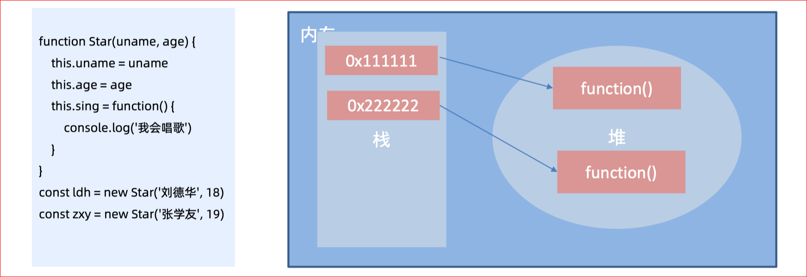
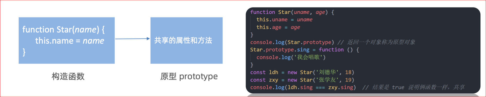
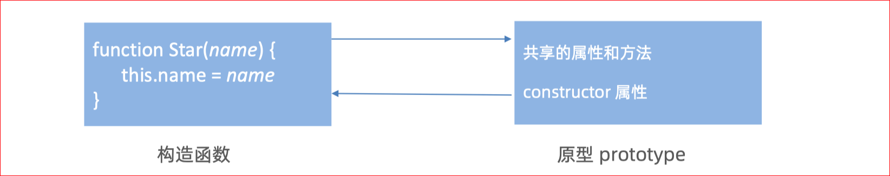
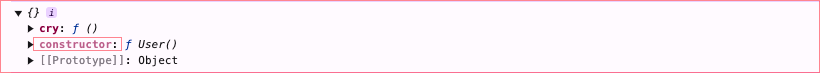
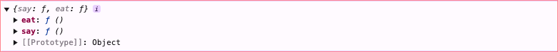
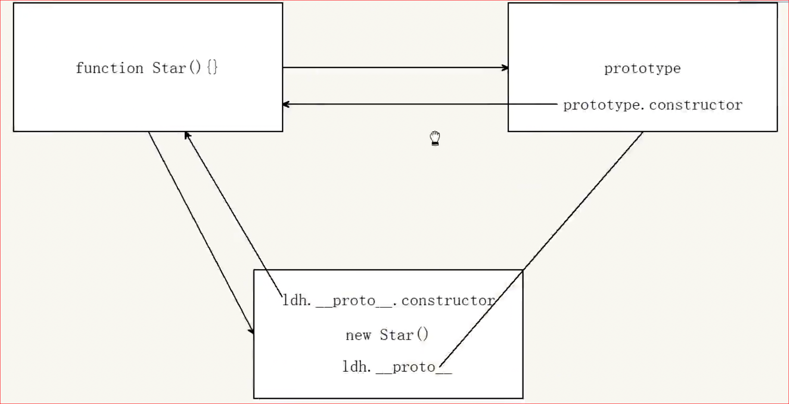
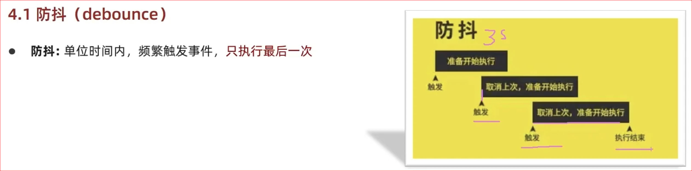
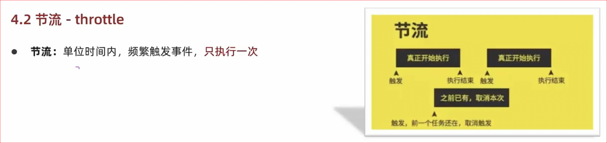
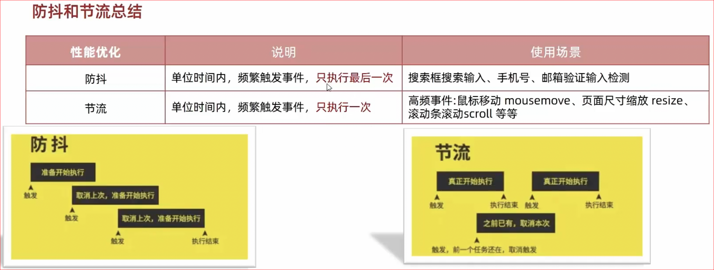

# 作用域

作用域（scope）规定了变量能够被访问的“范围”，离开了这个“范围”变量便不能被访问，作用域分为全局作用域和局部作用域。

## 局部作用域

局部作用域分为函数作用域和块作用域。

### 函数作用域

在函数内部声明的变量只能在函数内部被访问，外部无法直接访问。

```html
<script>
  // 声明 counter 函数
  function counter(x, y) {
    // 函数内部声明的变量
    const s = x + y
    console.log(s) // 18
  }
  // 设用 counter 函数
  counter(10, 8)
  // 访问变量 s
  console.log(s)// 报错
</script>
```

总结：

1. 函数内部声明的变量，在函数外部无法被访问
2. 函数的参数也是函数内部的局部变量
3. 不同函数内部声明的变量无法互相访问
4. 函数执行完毕后，函数内部的变量实际被清空了

### 块作用域

在 JavaScript 中使用 `{}` 包裹的代码称为代码块，代码块内部声明的变量外部将【有可能】无法被访问。

```html
<script>
  {
    // age 只能在该代码块中被访问
    let age = 18;
    console.log(age); // 正常
  }
  
  // 超出了 age 的作用域
  console.log(age) // 报错
  
  let flag = true;
  if(flag) {
    // str 只能在该代码块中被访问
    let str = 'hello world!'
    console.log(str); // 正常
  }
  
  // 超出了 age 的作用域
  console.log(str); // 报错
  
  for(let t = 1; t <= 6; t++) {
    // t 只能在该代码块中被访问
    console.log(t); // 正常
  }
  
  // 超出了 t 的作用域
  console.log(t); // 报错
</script>
```

JavaScript 中除了变量外还有常量，常量与变量本质的区别是【常量必须要有值且不允许被重新赋值】，`常量值为对象时其属性和方法允许重新赋值`。

```html
<script>
  // 必须要有值
  const version = '1.0.0';

  // 不能重新赋值
  // version = '1.0.1';

  // 常量值为对象类型
  const user = {
    name: '小明',
    age: 18
  }

  // 不能重新赋值
  user = {};

  // 属性和方法允许被修改
  user.name = '小小明';
  user.gender = '男';
</script>
```

总结：

1. `let` 、`const`声明的变量支持：全局作用域、函数作用域、块作用域
2. `var` 声明的变量支持：全局作用域、函数作用域
3. 推荐使用 `let` 或 `const`

注：开发中 `let` 和 `const` 经常不加区分的使用，如果担心某个值会不小被修改时，则只能使用 `const` 声明成常量。

## 全局作用域

`<script>` 标签中最顶层的变量常量，非模块化引入的 `.js` 文件的中的全局变量都是全局作用域的，在此声明的变量在函数内部也可以被访问。

```html
<script>
  // 此处是全局
  
  function sayHi() {
    // 此处为局部
  }

  // 此处为全局
</script>
```

全局作用域中声明的变量，任何其它作用域都可以被访问，如下代码所示：

```html
<script>
    // 全局变量 name
    const name = '小明'
  
  	// 函数作用域中访问全局
    function sayHi() {
      // 此处为局部
      console.log('你好' + name)
    }

    // 全局变量 flag 和 x
    const flag = true
    let x = 10
  
  	// 块作用域中访问全局
    if(flag) {
      let y = 5
      console.log(x + y) // x 是全局的
    }
</script>
```

补充：

1. var 不支持块作用域，支持函数作用域和全局作用域

   - 如果在一个块（如 if、for、while 等）中声明变量，变量的作用域会被提升到所在的函数或全局作用域，而不是块内。

     ```javascript
     if (true) {
         var x = 10; // `x` 的作用域是函数或全局作用域，而不是仅限于 if 块
     }
     console.log(x); // 输出：10
     ```

    - 如果 var 声明的变量是在函数内部，它的作用域会限制在该函数内部。

      ```javascript
      function test() {
          var x = 42; // 作用域在 test 函数内
      }
      console.log(x); // 抛出 ReferenceError: x is not defined
      

**js中那些情况下的变量是全局作用域的**


1. 不使用关键字声明变量

如果直接使用变量而没有声明（缺少 var、let 或 const），那么它会自动成为全局变量（非严格模式下）。

```javascript
function test() {
    x = 10; // 未声明，自动变为全局变量
}
test();
console.log(x); // 输出：10
```

2. 显式声明的全局变量

使用 var 在全局作用域、块作用域中声明的变量,在浏览器环境下，这些变量会被添加到 window 对象。

```javascript
var globalVar = "I am global!";
console.log(window.globalVar); // 输出："I am global!"
```

3. 通过 window 对象显式声明

在浏览器中，可以通过 window 对象显式添加全局变量：

```javascript
window.myGlobal = "I am global";
console.log(myGlobal); // 输出："I am global"
```

4. 不使用模块化的全局脚本文件

如果一个脚本不是在模块化环境（如 module 或 import/export）中执行，那么在全局作用域中声明的变量是全局的(只适用于那些被定义在全局作用域中的变量，而不是局部变量)

```javascript
<!DOCTYPE html>
<html lang="en">
<head>
  <meta charset="UTF-8">
  <title>Non-Module Example</title>
</head>
<body>
  <script src="file1.js"></script>
  <script src="file2.js"></script>
</body>
</html>

// file1.js
var globalVar = "I am global!";

// file2.js
console.log(globalVar); // 输出: "I am global!"
```

在这个例子中，file1.js 中的变量 globalVar 是全局变量，可以在 file2.js 中直接访问。随着项目规模增大，这种方式容易引发变量冲突或意外覆盖。

## 作用域链

在解释什么是作用域链前先来看一段代码：

```html
<script>
  // 全局作用域
  let a = 1
  let b = 2
  // 局部作用域
  function f() {
    let c
    // 局部作用域
    function g() {
      let d = 'yo'
    }
  }
</script>
```

函数内部允许创建新的函数，`f` 函数内部创建的新函数 `g`，会产生新的函数作用域，由此可知作用域产生了嵌套的关系。

如下图所示，父子关系的作用域关联在一起形成了链状的结构，作用域链的名字也由此而来。

作用域链本质上是底层的变量查找机制，在函数被执行时，会优先查找当前函数作用域中查找变量，如果当前作用域查找不到则会依次逐级查找父级作用域直到全局作用域，如下代码所示：

```html
<script>
  // 全局作用域
  let a = 1
  let b = 2

  // 局部作用域
  function f() {
    let c
    // let a = 10;
    console.log(a) // 1 或 10
    console.log(d) // 报错
    
    // 局部作用域
    function g() {
      let d = 'yo'
      // let b = 20;
      console.log(b) // 2 或 20
    }
    
    // 调用 g 函数
    g()
  }

  console.log(c) // 报错
  console.log(d) // 报错
  
  f();
</script>
```

总结：

1. 嵌套关系的作用域串联起来形成了作用域链
2. 相同作用域链中按着从小到大的规则查找变量
3. 子作用域能够访问父作用域，父级作用域无法访问子级作用域

## 闭包

```html
<body>
  <script>
    // 1. 闭包 : 内层函数 + 外层函数变量
    // function outer() {
    //   const a = 1
    //   function f() {
    //     console.log(a)
    //   }
    //   f()
    // }
    // outer()

    // 2. 闭包的应用： 实现数据的私有。统计函数的调用次数
    // let count = 1
    // function fn() {
    //   count++
    //   console.log(`函数被调用${count}次`)
    // }

    // 3. 闭包的写法  统计函数的调用次数
    function outer() {
      let count = 1
      function fn() {
        count++
        console.log(`函数被调用${count}次`)
      }
      return fn
    }
    const re = outer()
    re()
    re()
    // 4. 闭包存在的问题： 可能会造成内存泄漏
  </script>
</body>
```

总结：

1.怎么理解闭包？

- 闭包 = 内层函数 + 外层函数的变量
- 内层函数使用了外层函数的变量才能构成闭包，若是没有使用，只能算是函数的嵌套，不能算闭包

2.闭包的作用？

- 封闭数据，实现数据私有，外部也可以访问函数内部的变量
- 闭包很有用，因为它允许将函数与其所操作的某些数据（环境）关联起来

3.闭包可能引起的问题？

- 内存泄漏


浏览器调试判断是不是闭包


## 变量提升

变量提升是 JavaScript 中比较“奇怪”的现象，它允许在变量声明之前即被访问(仅存在var声明的变量)

- 只提升声明，不提升赋值

```html
<script>
  // 访问变量 str
  console.log(str + 'world!');

  // 声明变量 str
  var str = 'hello ';
</script> 
```

总结：

1. 变量在未声明即被访问时会报语法错误
2. 变量在声明之前即被访问，变量的值为 `undefined`
3. `let` 声明的变量不存在变量提升，推荐使用 `let`
4. 变量提升出现在相同作用域当中
5. 实际开发中推荐先声明再访问变量

注：关于变量提升的原理分析会涉及较为复杂的词法分析等知识，而开发中使用 `let` 可以轻松规避变量的提升，因此在此不做过多的探讨，有兴趣可[查阅资料](https://segmentfault.com/a/1190000013915935)。

# 函数进阶

## 函数提升

函数提升与变量提升比较类似，是指函数在声明之前即可被调用。

```html
<script>
  // 调用函数
  foo()
  // 声明函数
  function foo() {
    console.log('声明之前即被调用...')
  }

  // 不存在提升现象
  bar()  // 错误
  var bar = function () {
    console.log('函数表达式不存在提升现象...')
  }
</script>
```

总结：

1. 函数提升能够使函数的声明调用更灵活
2. 函数表达式不存在提升的现象，必须先声明赋值，后调用
3. 函数提升出现在相同作用域当中

## 函数参数

### 默认值

```html
<script>
  // 设置参数默认值
  function sayHi(name="小明", age=18) {
    document.write(`<p>大家好，我叫${name}，我今年${age}岁了。</p>`);
  }
  // 调用函数
  sayHi();
  sayHi('小红');
  sayHi('小刚', 21);
</script>
```

总结：

1. 声明函数时为形参赋值即为参数的默认值
2. 如果参数未自定义默认值时，参数的默认值为 `undefined`
3. 调用函数时没有传入对应实参时，参数的默认值被当做实参传入

### 动态参数

`arguments` 是函数内部内置的伪数组变量，它包含了调用函数时传入的所有实参。

```html
<script>
  // 求生函数，计算所有参数的和
  function sum() {
    // console.log(arguments)
    let s = 0
    for(let i = 0; i < arguments.length; i++) {
      s += arguments[i]
    }
    console.log(s)
  }
  // 调用求和函数
  sum(5, 10)// 两个参数
  sum(1, 2, 4) // 两个参数
</script>
```

总结：

1. `arguments` 是一个伪数组

   - arguments 是对象而不是数组，它的原型不是 Array，而是 Object。

   - 无法直接使用数组的方法，例如 push、pop、forEach 等。

2. `arguments` 的作用是动态获取函数的实参

### 剩余参数

```html
<script>
  function config(baseURL, ...other) {
    console.log(baseURL) // 得到 'http://baidu.com'
    console.log(other)  // other  得到 ['get', 'json']
  }
  // 调用函数
  config('http://baidu.com', 'get', 'json');
</script>
```

总结：

1. `...` 是语法符号，置于最末函数形参之前，用于获取多余的实参
2. 借助 `...` 获取的剩余实参，是个真数组

### 展开运算符

展开运算符(…),将一个数组进行展开

```javascript
const numArr = [1,2,3,4,5,6,7,8]
const numArr2 = [9,10,11]

console.log(...numArr)
console.log(Math.max(...numArr))
console.log([...numArr, ...numArr2])
```

## 箭头函数

箭头函数是一种声明函数的简洁语法，它与普通函数并无本质的区别，差异性更多体现在语法格式上。

```html
<body>
  <script>
    // const fn = function () {
    //   console.log(123)
    // }
    // 1. 箭头函数 基本语法
    // const fn = () => {
    //   console.log(123)
    // }
    // fn()
    // const fn = (x) => {
    //   console.log(x)
    // }
    // fn(1)
    // 2. 只有一个形参的时候，可以省略小括号
    // const fn = x => {
    //   console.log(x)
    // }
    // fn(1)
    // // 3. 只有一行代码的时候，我们可以省略大括号
    // const fn = x => console.log(x)
    // fn(1)
    // 4. 只有一行代码的时候，可以省略return
    // const fn = x => x + x
    // console.log(fn(1))
    // 5. 箭头函数可以直接返回一个对象
    // const fn = (uname) => ({ uname: uname })
    // console.log(fn('刘德华'))

  </script>
</body>
```

总结：

1. 箭头函数属于表达式函数，因此不存在函数提升
2. 箭头函数只有一个参数时可以省略圆括号 `()`
3. 箭头函数函数体只有一行代码时可以省略花括号 `{}`，并自动做为返回值被返回

### 箭头函数参数

箭头函数中没有 `arguments`，只能使用 `...` 动态获取实参

~~~html
<body>
  <script>
    // 1. 利用箭头函数来求和
    const getSum = (...arr) => {
      let sum = 0
      for (let i = 0; i < arr.length; i++) {
        sum += arr[i]
      }
      return sum
    }
    const result = getSum(2, 3, 4)
    console.log(result) // 9
  </script>
~~~

### 箭头函数 this

> 箭头函数this特性
>
> 1. 箭头函数不会创建自己的this：
>
>	- 箭头函数中的 this 是由定义时所在的上下文决定的，而不是由调用时的上下文决定。
>
> 2. 箭头函数的this是静态的：
>
>	- 它始终指向箭头函数声明时所处的作用域的 this，不会因为箭头函数被作为对象的方法调用、通过 call/apply/bind 改变 this。
>
> 3. 适合用在回调中：
>
>	- 因为箭头函数不会绑定自己的 this，它常被用作回调函数，避免因 this 指向改变而导致的错误。


箭头函数不会创建自己的this,它只会从自己的作用域链的上一层沿用this。

```javascript
<script>
  const fn = () => {
    console.log(this);//window
  };
</script>
```

- 在浏览器中，直接写在\<script> 标签中的代码，其上下文是全局作用域。

- 在全局作用域中，this 通常指向window对象（非严格模式）或者是undefined（严格模式下）。


```JavaScript
<script>
	const obj = {
    uname: 'hh',
    sayHi: () => {
        console.log(this); // this 指向谁？window
    }
	};
	obj.sayHi();
</script>
```

**箭头函数的** this **是由其定义时的外层函数或作用域决定的，而不是由它被包含在哪个对象中决定的**。

1. obj的作用域

	- 这里的 obj 是一个对象字面量，它并不是一个函数作用域。

	- 箭头函数并不会将 obj 的 {} 作为其作用域，而是沿着定义链向上寻找定义时的外层作用域。

2. 外层作用域是什么？

	- 在代码中，obj 是定义在全局作用域（或模块作用域）中的。

	- 所以，箭头函数 sayHi 的外层作用域是全局作用域。

3. 箭头函数sayHi的this

	- 箭头函数的 this 固定为定义时外层作用域的 this，而不是由 obj 的 {} 决定。

	- 在浏览器环境中，全局作用域的 this 是 window（非严格模式）或者 undefined（严格模式）。

	- 因此，this指向的是window而不是obj


~~~html
 <script>
    // 以前this的指向：  谁调用的这个函数，this 就指向谁
    // console.log(this)  // window
    // // 普通函数
    // function fn() {
    //   console.log(this)  // window
    // }
    // window.fn()
    // // 对象方法里面的this
    // const obj = {
    //   name: 'andy',
    //   sayHi: function () {
    //     console.log(this)  // obj
    //   }
    // }
    // obj.sayHi()

    // 2. 箭头函数的this  是上一层作用域的this 指向
    // const fn = () => {
    //   console.log(this)  // window
    // }
    // fn()
    // 对象方法箭头函数 this
    // const obj = {
    //   uname: 'pink老师',
    //   sayHi: () => {
    //     console.log(this)  // this 指向谁？ window
    //   }
    // }
    // obj.sayHi()

    const obj = {
      uname: 'pink老师',
      sayHi: function () {
        console.log(this)  // obj
        let i = 10
        const count = () => {
          console.log(this)  // obj 
        }
        count()
      }
    }
    obj.sayHi()

  </script>
~~~

# 解构赋值

解构赋值是一种快速为变量赋值的简洁语法，本质上仍然是为变量赋值，分为数组解构、对象解构两大类型。

## 数组解构

数组解构是将数组的单元值快速批量赋值给一系列变量的简洁语法，如下代码所示：

```html
<script>
  // 普通的数组
  let arr = [1, 2, 3]
  // 批量声明变量 a b c 
  // 同时将数组单元值 1 2 3 依次赋值给变量 a b c
  let [a, b, c] = arr
  console.log(a); // 1
  console.log(b); // 2
  console.log(c); // 3
</script>
```

总结：

1. 赋值运算符 `=` 左侧的 `[]` 用于批量声明变量，右侧数组的单元值将被赋值给左侧的变量
2. 变量的顺序对应数组单元值的位置依次进行赋值操作
3. 变量的数量大于单元值数量时，多余的变量将被赋值为  `undefined`
4. 变量的数量小于单元值数量时，可以通过 `...` 获取剩余单元值，但只能置于最末位
5. 允许初始化变量的默认值，且只有单元值为 `undefined` 时默认值才会生效

注：支持多维解构赋值，比较复杂后续有应用需求时再进一步分析

## 对象解构

对象解构是将对象属性和方法快速批量赋值给一系列变量的简洁语法，如下代码所示：

```html
<script>
  // 普通对象
  const user = {
    name: '小明',
    age: 18
  };
  // 批量声明变量 name age
  // 同时将数组单元值 小明  18 依次赋值给变量 name  age
  const {name, age} = user

  console.log(name) // 小明
  console.log(age) // 18
</script>
```

总结：

1. 赋值运算符 `=` 左侧的 `{}` 用于批量声明变量，右侧对象的属性值将被赋值给左侧的变量
2. 对象属性的值将被赋值给与属性名相同的变量
3. 对象中找不到与变量名一致的属性时变量值为 `undefined`
4. 允许初始化变量的默认值，属性不存在或单元值为 `undefined` 时默认值才会生效

注：支持多维解构赋值

~~~html
<body>
  <script>
    // 1. 这是后台传递过来的数据
    const msg = {
      "code": 200,
      "msg": "获取新闻列表成功",
      "data": [
        {
          "id": 1,
          "title": "5G商用自己，三大运用商收入下降",
          "count": 58
        },
        {
          "id": 2,
          "title": "国际媒体头条速览",
          "count": 56
        },
        {
          "id": 3,
          "title": "乌克兰和俄罗斯持续冲突",
          "count": 1669
        },

      ]
    }

    // 需求1： 请将以上msg对象  采用对象解构的方式 只选出  data 方面后面使用渲染页面
    // const { data } = msg
    // console.log(data)
    // 需求2： 上面msg是后台传递过来的数据，我们需要把data选出当做参数传递给 函数
    // const { data } = msg
    // msg 虽然很多属性，但是我们利用解构只要 data值
    function render({ data }) {
      // const { data } = arr
      // 我们只要 data 数据
      // 内部处理
      console.log(data)

    }
    render(msg)

    // 需求3， 为了防止msg里面的data名字混淆，要求渲染函数里面的数据名改为 myData
    function render({ data: myData }) {
      // 要求将 获取过来的 data数据 更名为 myData
      // 内部处理
      console.log(myData)

    }
    render(msg)

  </script>
~~~

```javascript
<script>
    //数组解构
    const [a,b,c]= [1,2,3]
    console.log(a)        
    console.log(b)
    console.log(c)

    //注意：
    //1.数组解构前必须有 ; 号
    //2.立即执行函数前必须有 ; 号
    let x = 7
    let y = 9;
    [x, y] = [y, x]
    console.log(x)
    console.log(y)

    //多维数组解构
    const [g,h,j,k]=['ggg','hhh','jjj',[1,2,3,4]]
    console.log(g)
    console.log(h)
    console.log(j)
    console.log(k)

    //对象结构
    const user = {
        name:'lee',
        age:99
    }    
    // const {name, age} = user
    // console.log(name)
    // console.log(age)

    
    //解构对象的属性名可以重新改名
    //把原来的name变量重命名为um
    const {name:um, age} = user
    console.log('-----------')
    console.log(um)
    console.log(age)

    //对象数组解构
    const[{name2, age2}] = [{name2:'张三', age2:97}] 
    console.log(name2)
    console.log(age2)

    //多维度对象解构
    const msg = {
      "code": 200,
      "msg": "获取新闻列表成功",
      "data": [
        {
          "id": 1,
          "title": "5G商用自己，三大运用商收入下降",
          "count": 58
        },
        {
          "id": 2,
          "title": "国际媒体头条速览",
          "count": 56
        },
        {
          "id": 3,
          "title": "乌克兰和俄罗斯持续冲突",
          "count": 1669
        },

      ]
    }
    const { data } = msg
    console.log(data)

    //	函数 rander 的参数是一个对象。
    //	使用解构赋值从对象参数中提取 data 属性，并将其重命名为 mydata。
	  //	函数内部可以通过变量 mydata 访问解构出来的 data 值。
    function rander({data : mydata}){
        console.log(mydata)
    }
    rander({data})
    rander(msg)
</script>
```

```javascript
    //多维度对象解构
    const msg = {
      "code": 200,
      "msg": "获取新闻列表成功",
      "data": [
        {
          "id": 1,
          "title": "5G商用自己，三大运用商收入下降",
          "count": 58
        },
        {
          "id": 2,
          "title": "国际媒体头条速览",
          "count": 56
        },
        {
          "id": 3,
          "title": "乌克兰和俄罗斯持续冲突",
          "count": 1669
        },

      ]
    }
    const { data } = msg
    console.log(data)
//[{ id: 1, title: "5G商用自己，三大运用商收入下降", count: 58 },{ id: 2, title: "国际媒体头条速览", count: 56 },{ id: 3, title: "乌克兰和俄罗斯持续冲突", count: 1669 }]
    console.log({data})
//{ data: [{ id: 1, title: "5G商用自己，三大运用商收入下降", count: 58 },{ id: 2, title: "国际媒体头条速览", count: 56 },{ id: 3, title: "乌克兰和俄罗斯持续冲突", count: 1669 }]}

    //1.console.log(data)
    //  直接打印 data，输出是解构后 data 的值本身（数组）。
	  //2.console.log({ data })
	  //  将 data 包装成一个对象 { data: value }，输出是这个新对象。


    //	函数 rander 的参数是一个对象。
    //	使用解构赋值从对象参数中提取 data 属性，并将其重命名为 mydata。
	  //	函数内部可以通过变量 mydata 访问解构出来的 data 值。
    function rander({data : mydata}){
        console.log(mydata)
    }
    rander(msg)
    rander({data})
//	• 在函数调用时，传入的参数 msg 并没有事先进行解构。解构的过程实际上发生在函数内部的参数处理阶段
//	•	函数的参数定义为 { data: mydata }，这是一个解构赋值的写法。
//		•	调用 rander(msg) 时，传入的 msg 必须是一个对象，并且 JavaScript 会尝试解构 msg 中的 data 属性：
//		•	如果 msg 是对象且包含 data 属性，data 的值会被赋给 mydata。
//		•	如果 msg 是对象但没有 data 属性，mydata 的值为 undefined。
//		•	如果 msg 不是对象（例如 null 或 undefined），代码会报错。
```

## 综合案例

### forEach遍历数组

forEach() 方法用于调用数组的每个元素，并将元素传递给回调函数

>注意：  
>
>1.forEach 主要是遍历数组
>
>2.参数当前数组元素是必须要写的， 索引号可选。

~~~html
<body>
  <script>
    // forEach 就是遍历  加强版的for循环  适合于遍历数组对象
    const arr = ['red', 'green', 'pink']
    const result = arr.forEach(function (item, index) {
      console.log(item)  // 数组元素 red  green pink
      console.log(index) // 索引号
    })
    // console.log(result)
  </script>
</body>
~~~

### filter筛选数组

filter() 方法创建一个新的数组，新数组中的元素是通过检查指定数组中符合条件的所有元素

主要使用场景： 筛选数组符合条件的元素，并返回筛选之后元素的新数组

~~~html
<body>
  <script>
    const arr = [10, 20, 30]
    // const newArr = arr.filter(function (item, index) {
    //   // console.log(item)
    //   // console.log(index)
    //   return item >= 20
    // })
    // 返回的符合条件的新数组

    const newArr = arr.filter(item => item >= 20)
    console.log(newArr)
  </script>
</body>
~~~

# 深入对象

## 构造函数

构造函数是专门用于创建对象的函数，如果一个函数使用 `new` 关键字调用，那么这个函数就是构造函数。

```html
<script>
  // 定义函数
  function foo() {
    console.log('通过 new 也能调用函数...');
  }
  // 调用函数
  new foo;
</script>
```

总结：

2. 使用 `new` 关键字调用函数的行为被称为实例化
3. 实例化构造函数时没有参数时可以省略 `()`
4. 构造函数的返回值即为新创建的对象
5. 构造函数内部的 `return` 返回的值无效！

注：实践中为了从视觉上区分构造函数和普通函数，习惯将构造函数的首字母大写。

## 实例成员

通过构造函数创建的对象称为实例对象，`实例对象`中的`属性`和`方法`称为`实例成员`。

```html
<script>
  // 构造函数
  function Person() {
    // 构造函数内部的 this 就是实例对象
    // 实例对象中动态添加属性
    this.name = '小明'
    // 实例对象动态添加方法
    this.sayHi = function () {
      console.log('大家好~')
    }
  }
  // 实例化，p1 是实例对象
  // p1 实际就是 构造函数内部的 this
  const p1 = new Person()
  console.log(p1)
  console.log(p1.name) // 访问实例属性
  p1.sayHi() // 调用实例方法
</script>
```

总结：

1. 构造函数内部 `this` 实际上就是实例对象，为其动态添加的属性和方法即为实例成员
2. 为构造函数传入参数，动态创建结构相同但值不同的对象

注：构造函数创建的实例对象彼此独立互不影响。

## 静态成员

在 JavaScript 中底层函数本质上也是对象类型，因此允许直接为函数动态添加属性或方法，`构造函数`的`属性`和`方法`被称为`静态成员`。

```html
<script>
  // 构造函数
  function Person(name, age) {
    // 省略实例成员
  }
  // 静态属性
  Person.eyes = 2
  Person.arms = 2
  // 静态方法
  Person.walk = function () {
    console.log('^_^人都会走路...')
    // this 指向 Person
    console.log(this.eyes)
  }
</script>
```

总结：

1. 静态成员指的是添加到构造函数本身的属性和方法
2. 一般公共特征的属性或方法静态成员设置为静态成员
3. 静态成员方法中的 `this` 指向构造函数本身

# 内置构造函数

在 JavaScript 中最主要的数据类型有 6 种，分别是`字符串`、`数值`、`布尔`、`undefined`、`null `和 `对象。`

对象类型（引用类型）：数组、普通对象

基础类型（简单类型）：字符串、数值、布尔、undefined、null

> JavaScript 中对象类型包括以下主要种类：
>
> ​	1.	普通对象（Object）。
>
> ​	2.	内置对象（如 Array、Date、RegExp、Map、Set、Error、JSON 等）。
>
> ​	3.	特殊对象（函数、原型对象、类实例、Promise 等）。
>
> ​	4.	DOM 和 BOM 对象。
>
> ​	5.	自定义对象。

在 JavaScript 内置了一些构造函数，绝大部的数据处理都是基于这些构造函数实现的，JavaScript 基础阶段学习的 `Date` 就是内置的构造函数。

```html
<script>
  // 实例化
	let date = new Date();
  
  // date 即为实例对象
  console.log(date);
</script>
```

甚至字符串、数值、布尔、数组、普通对象也都有专门的构造函数，用于创建对应类型的数据。

## Object

`Object` 是内置的构造函数，用于创建普通对象。

```html
<script>
  // 通过构造函数创建普通对象
  const user = new Object({name: '小明', age: 15})

  // 这种方式声明的变量称为【字面量】
  let student = {name: '杜子腾', age: 21}
  
  // 对象语法简写
  let name = '小红';
  let people = {
    // 相当于 name: name
    name,
    // 相当于 walk: function () {}
    walk () {
      console.log('人都要走路...');
    }
  }

  console.log(student.constructor);
  console.log(user.constructor);
  console.log(student instanceof Object);
</script>
```

总结：

1. 推荐使用字面量方式声明对象，而不是 `Object` 构造函数
2. `Object.assign` 静态方法创建新的对象
3. `Object.keys` 静态方法获取对象中所有属性
4. `Object.values` 表态方法获取对象中所有属性值

```javascript
        let user2 = {name:'诸葛丽', age:23, sayHello:function(){
            console.log('hello nihaoa!!!')
        }}
        console.log(user2)
        user2.sayHello()
        let user3 = {gender:'男', hobby:['footba', 'sing', 'rap','jump']}
        Object.assign(user3, user2)//浅拷贝
        console.log(Object.keys(user3))//获取所有属性
        console.log(Object.values(user3))//获取所有值
```

## Array

`Array` 是内置的构造函数，用于创建数组。

```html
<script>
  // 构造函数创建数组
  let arr = new Array(5, 7, 8);

  // 字面量方式创建数组
  let list = ['html', 'css', 'javascript']

</script>
```

数组赋值后，无论修改哪个变量另一个对象的数据值也会相当发生改变。

总结：

1. 推荐使用字面量方式声明数组，而不是 `Array` 构造函数

2. 实例方法 `forEach` 用于遍历数组，替代 `for` 循环 (重点)

3. 实例方法 `filter` 过滤数组单元值，生成新数组(重点)

4. 实例方法 `map` 迭代原数组，生成新数组(重点)

5. 实例方法 `join` 数组元素拼接为字符串，返回字符串(重点)

6. 实例方法  `find`  查找元素， 返回符合测试条件的第一个数组元素值，如果没有符合条件的则返回 undefined(重点)

7. 实例方法`every` 检测数组所有元素是否都符合指定条件，如果**所有元素**都通过检测返回 true，否则返回 false(重点)

8. 实例方法`some` 检测数组中的元素是否满足指定条件   **如果数组中有**元素满足条件返回 true，否则返回 false

9. 实例方法 `concat`  合并两个数组，返回生成新数组

10. 实例方法 `sort` 对原数组单元值排序

11. 实例方法 `splice` 删除或替换原数组单元

12. 实例方法 `reverse` 反转数组

13. 实例方法 `findIndex`  查找元素的索引值

    

## 包装类型

在 JavaScript 中的字符串、数值、布尔具有对象的使用特征，如具有属性和方法，如下代码举例：

```html
<script>
  // 字符串类型
  const str = 'hello world!'
 	// 统计字符的长度（字符数量）
  console.log(str.length)
  
  // 数值类型
  const price = 12.345
  // 保留两位小数
  price.toFixed(2) // 12.34
</script>
```

之所以具有对象特征的原因是字符串、数值、布尔类型数据是 JavaScript 底层使用 Object 构造函数“包装”来的，被称为包装类型。

### String

`String` 是内置的构造函数，用于创建字符串。

```html
<script>
  // 使用构造函数创建字符串
  let str = new String('hello world!');

  // 字面量创建字符串
  let str2 = '你好，世界！';

  // 检测是否属于同一个构造函数
  console.log(str.constructor === str2.constructor); // true
  console.log(str instanceof String); // false
</script>
```

总结：

1. 实例属性 `length` 用来获取字符串的度长(重点)
2. 实例方法 `split('分隔符')` 用来将字符串拆分成数组(重点)
3. 实例方法 `substring（需要截取的第一个字符的索引[,结束的索引号]）` 用于字符串截取(重点)
4. 实例方法 `startsWith(检测字符串[, 检测位置索引号])` 检测是否以某字符开头(重点)
5. 实例方法 `includes(搜索的字符串[, 检测位置索引号])` 判断一个字符串是否包含在另一个字符串中，根据情况返回 true 或 false(重点)
6. 实例方法 `toUpperCase` 用于将字母转换成大写
7. 实例方法 `toLowerCase` 用于将就转换成小写
8. 实例方法 `indexOf`  检测是否包含某字符
9. 实例方法 `endsWith` 检测是否以某字符结尾
10. 实例方法 `replace` 用于替换字符串，支持正则匹配
11. 实例方法 `match` 用于查找字符串，支持正则匹配

注：String 也可以当做普通函数使用，这时它的作用是强制转换成字符串数据类型。

### Number

`Number` 是内置的构造函数，用于创建数值。

```html
<script>
  // 使用构造函数创建数值
  let x = new Number('10')
  let y = new Number(5)

  // 字面量创建数值
  let z = 20

</script>
```

总结：

1. 推荐使用字面量方式声明数值，而不是 `Number` 构造函数
2. 实例方法 `toFixed` 用于设置保留小数位的长度

# 编程思想

## 面向过程

面向过程就是分析出解决问题所需要的步骤，然后用函数把这些步骤一步一步实现，使用的时候再一个一个的依次

调用就可以了。

## 面向对象

面向对象是把事务分解成为一个个对象，然后由对象之间分工与合作。

在面向对象程序开发思想中，每一个对象都是功能中心，具有明确分工。

面向对象编程具有灵活、代码可复用、容易维护和开发的优点，更适合多人合作的大型软件项目。

面向对象的特性：

- 封装性


- 继承性
- 多态性

# 构造函数

对比以下通过面向对象的构造函数实现的封装：

```html
<script>
  function Person() {
    this.name = '佚名'
    // 设置名字
    this.setName = function (name) {
      this.name = name
    }
    // 读取名字
    this.getName = () => {
      console.log(this.name)
    }
  }

  // 实例对像，获得了构造函数中封装的所有逻辑
  let p1 = new Person()
  p1.setName('小明')
  console.log(p1.name)

  // 实例对象
  let p2 = new Person()
  console.log(p2.name)
</script>
```

封装是面向对象思想中比较重要的一部分，`js面向对象可以通过构造函数实现的封装`。

同样的将变量和函数组合到了一起并能通过 this 实现数据的共享，所不同的是借助构造函数创建出来的实例对象之间是彼此不影响的

>总结：
>
>1. 构造函数体现了面向对象的封装特性
>2. 构造函数实例创建的对象彼此独立、互不影响

 构造函数很好用，但是 存在`浪费内存`的问题（同样的方法，不同的对象都会在堆中存储一份）



## 原型对象

目标：能够利用原型对象实现方法共享

-  构造函数通过原型分配的函数是所有对象所共享的。

- JavaScript 规定，每一个构造函数都有一个 prototype 属性，指向另一个对象，该对象即为原型对象（现实中习惯也将prototype称为原型对象，但这是不严谨的）
- 原型对象可以挂载函数，对象实例化不会多次创建原型上函数，节约内存
- 我们可以把那些不变的方法，直接定义在 prototype 对象上，这样所有对象的实例就可以共享这些方法。
- 构造函数和原型对象中的this 都指向 实例化的对象

> 原型对象谁创建的 什么时候创建的 又是什么时候赋值的？
>
> 当你定义一个函数时（无论是函数声明还是函数表达式），JavaScript 引擎会自动为该函数分配一个默认的原型对象，并赋值给该函数的 prototype 属性。原型对象是一个普通的对象，它包含一个默认的 constructor 属性，指向该函数本身



```html
<script>
  function Person() {
    
  }

  // 每个函数都有 prototype 属性
  console.log(Person.prototype)
  //prototype属性返回的对象obj称为原型对象
	const obj = Person.prototype
</script>
```


了解了 JavaScript 中构造函数与原型对象的关系后，再来看原型对象具体的作用，如下代码所示：

```html
<script>
  function Person() {
    // 此处未定义任何方法
  }

  // 为构造函数的原型对象添加方法
  Person.prototype.sayHi = function () {
    console.log('Hi~');
  }
	
  // 实例化
  let p1 = new Person();
  p1.sayHi(); // 输出结果为 Hi~
</script>
```

上面代码中构造函数 `Person` 中未定义任何方法，这时实例对象调用了原型对象中的方法 `sayHi`


改动一下代码：

```html
<script>
  function Person() {
    // 此处定义同名方法 sayHi
    this.sayHi = function () {
      console.log('嗨!');
    }
  }

  // 为构造函数的原型对象添加方法
  Person.prototype.sayHi = function () {
    console.log('Hi~');
  }

  let p1 = new Person();
  p1.sayHi(); // 输出结果为 嗨!
</script>
```

构造函数 `Person` 中定义与原型对象中相同名称的方法，这时实例对象调用则是构造函中的方法 `sayHi`。


通过以上两个简单示例不难发现 JavaScript 中对象的工作机制：

**当访问对象的属性或方法时，先在当前实例对象是查找，然后再去原型对象查找，并且原型对象被所有实例共享。**

```html
<script>
	function Person() {
    // 此处定义同名方法 sayHi
    this.sayHi = function () {
      console.log('嗨!' + this.name)
    }
  }

  // 为构造函数的原型对象添加方法
  Person.prototype.sayHi = function () {
    console.log('Hi~' + this.name)
  }
  // 在构造函数的原型对象上添加属性
  Person.prototype.name = '小明'

  let p1 = new Person()
  p1.sayHi(); // 输出结果为 嗨!
  
  let p2 = new Person()
  p2.sayHi()
</script>
```

总结：**结合构造函数原型的特征，实际开发重往往会将封装的功能函数添加到原型对象中。**

### constructor 属性


 每个原型对象里面都有个constructor 属性（constructor 构造函数）

作用：该属性指向该原型对象的构造函数， 简单理解，就是指向我的爸爸，我是有爸爸的孩子



**使用场景：**

如果有多个对象的方法，我们可以给原型对象采取对象形式赋值.

但是这样就会覆盖构造函数原型对象原来的内容，这样修改后的原型对象 constructor 就不再指向当前构造函数了

此时，我们可以在修改后的原型对象中，添加一个 constructor 指向原来的构造函数。

```javascript
/**
 * 2.原型对象的constructor属性
 */
function User(){
    this.name = 'leeH'
    this.age = 18
    this.smile = function(){
        console.log('哈哈大笑！！！')
    }
}
console.log(User.prototype)
console.log(User.prototype.constructor === User)//true

/*
* 2.1通过"构造函数.prototype.方法(或属性)"的方式是追加，相当于给原型对象增加新的属性或方法，原型对象原来的属性和对象都在，原型对象的constructor属性指向构造函数
*/
User.prototype.cry = function(){
    console.log('哇哇大哭！！！')
}
console.log(User.prototype)//{cry: ƒ}
console.log(User.prototype.constructor === User)//true

const u = new User()
u.smile()
u.cry()

/*
 * 2.2还可以通过赋值的形式，原型对象原有的属性和方法都会失效，而且原型对象的constructor属性不再指向构造函数
 */
User.prototype = {
    say:function(){
        console.log('说你好')
    },
    eat:function(){
        console.log('人得吃饭')
    }
}
console.log(User.prototype)//{say: ƒ, eat: ƒ}
console.log(User.prototype.constructor === User)//false

const u2 = new User()
u2.smile()
u2.say()
u2.eat()
// u2.cry()//Uncaught TypeError TypeError: u2.cry is not a function

/**
 * 2.3通过赋值的形式，利用原型对象的constructor属性，是constructor再次指向构造函数
 */
User.prototype = {
    //指向原来的构造方法
    constructor : User,
    drink:function(){
        console.log('大口喝水')
    },
    sleep:function(){
        console.log('美美睡觉')
    }
}
console.log(User.prototype)//{drink: ƒ, sleep: ƒ}
console.log(User.prototype.constructor === User)//true
const u3 = new User()
u3.smile()
// u3.cry()//Uncaught TypeError TypeError: u3.cry is not a function
u3.drink()
u3.sleep()
```

上面代码

```javascript
User.prototype.cry = function(){
    console.log('哇哇大哭！！！')
}
console.log(User.prototype)//{cry: ƒ}      //有constructor属性，指向User()
```



```javascript
User.prototype = {
    say:function(){
        console.log('说你好')
    },
    eat:function(){
        console.log('人得吃饭')
    }
}
console.log(User.prototype)//{say: ƒ, eat: ƒ}   //没有constructor属性
```



## 对象原型

对象都会有一个属性` __proto__ `指向构造函数的 prototype 原型对象，之所以我们对象可以使用构造函数 prototype 原型对象的属性和方法，就是因为对象有 `__proto__ `原型的存在。

注意：

1. `__proto__ `是JS非标准属性（有的浏览器显示为__proto__，有的显示为[[prototype]]）
2. [[prototype]]和`__proto__`意义相同
3. 用来表明当前实例对象指向哪个原型对象prototype
4. `__proto__`对象原型里面也有一个 constructor属性，指向创建该实例对象的构造函数

> 实例对象的隐式原型（__proto__）会自动指向构造函数的 prototype。这一步是在执行 new 关键字时完成的，由 JavaScript 引擎实现



```javascript
function Star(){
    this.name = 'xingxing'
    this.age = 100
    this.wink = function(){
        console.log('wink………………')
    }
}
console.log(Star.prototype)
console.log(Star.prototype.constructor === Star)//true
const sr = new Star()
console.log(sr.__proto__)
console.log(sr.__proto__.constructor === Star)//true
console.log(sr.__proto__ === Star.prototype)//true
```

## 原型继承

继承是面向对象编程的另一个特征，通过继承进一步提升代码封装的程度，JavaScript 中大多是借助原型对象实现继承的特性。

```html
<body>
  <script>
    // 继续抽取   公共的部分放到原型上
    // const Person1 = {
    //   eyes: 2,
    //   head: 1
    // }
    // const Person2 = {
    //   eyes: 2,
    //   head: 1
    // }
    // 构造函数  new 出来的对象 结构一样，但是对象不一样
    function Person() {
      this.eyes = 2
      this.head = 1
    }
    // console.log(new Person)
    // 女人  构造函数   继承  想要 继承 Person
    function Woman() {

    }
    // Woman 通过原型来继承 Person
    // 父构造函数（父类）   子构造函数（子类）
    // 子类的原型 =  new 父类  
    Woman.prototype = new Person()   // {eyes: 2, head: 1} 
    // 指回原来的构造函数
    Woman.prototype.constructor = Woman

    // 给女人添加一个方法  生孩子
    Woman.prototype.baby = function () {
      console.log('宝贝')
    }
    const red = new Woman()
    console.log(red)
    // console.log(Woman.prototype)
    // 男人 构造函数  继承  想要 继承 Person
    function Man() {

    }
    // 通过 原型继承 Person
    Man.prototype = new Person()
    Man.prototype.constructor = Man
    const pink = new Man()
    console.log(pink)
  </script>
</body>
```

```javascript
 function Person(){
            this.eyes = 2
            this.mounth = 1
        }
        console.log(Person.prototype)
        console.log(Person)
        console.log(new Person())
        console.log(new Person().constructor)
        console.log(new Person().constructor === Person)
        console.log(new Person().__proto__.constructor === Person)
        console.log(Person.prototype.constructor === Person)

        function Woman(){

        }
        console.log(Woman.prototype)
        console.log(new Woman())

        Woman.prototype = new Person()
        Woman.prototype.constructor = Woman
        console.log(Woman.prototype)
        console.log(new Woman())

        Woman.prototype.hair = '长头发'
        console.log(new Woman())

为什么console.log(new Woman())输出的所有woman实例都有hair属性，按代码的执行顺序，不应该是最后一个才有吗
```

> 这个问题的核心是理解 **原型链的动态性**。在 JavaScript 中，实例对象通过原型链动态地查找属性，而不是在实例创建时就“拷贝”原型上的属性。因此，即使你修改了原型对象，之前已经创建的实例也会反映出这些修改

> ```javascript
> Woman.prototype = new Person()
> Woman.prototype.constructor = Woman
> ```
>
> **第二行代码有什么作用，貌似不写也没问题吧?**
>
> 1. Woman.prototype 被赋值为一个 Person 的实例，由于 Person 的实例的 constructor 指向 Person，此时 Woman.prototype.constructor 也指向 Person，这可能会导致混淆或功能问题，特别是在需要通过 constructor 判断实例来源时
>
>    ```javascript
>    console.log(Woman.prototype.constructor); // Person (而不是 Woman)
>    ```
>
> 1. 	不修复时，**不会影响原型链的继承，**实例依然可以通过原型链继承 Person 的属性和方法

## 原型链

基于原型对象的继承使得不同构造函数的原型对象关联在一起，并且这种关联的关系是一种链状的结构，我们将原型对象的链状结构关系称为原型链


```html
<body>
  <script>
    // function Objetc() {}
    console.log(Object.prototype)
    console.log(Object.prototype.__proto__)

    function Person() {

    }
    const ldh = new Person()
    // console.log(ldh.__proto__ === Person.prototype)
    // console.log(Person.prototype.__proto__ === Object.prototype)
    console.log(ldh instanceof Person)
    console.log(ldh instanceof Object)
    console.log(ldh instanceof Array)
    console.log([1, 2, 3] instanceof Array)
    console.log(Array instanceof Object)
  </script>
</body>
```

① 当访问一个对象的属性（包括方法）时，首先查找这个对象自身有没有该属性。

② 如果没有就查找它的原型（也就是 __proto__指向的 prototype 原型对象）

③ 如果还没有就查找原型对象的原型（Object的原型对象）

④ 依此类推一直找到 Object 为止（null）

⑤ __proto__对象原型的意义就在于为对象成员查找机制提供一个方向，或者说一条路线

⑥ 可以使用 instanceof 运算符用于检测构造函数的 prototype 属性是否出现在某个实例对象的原型链上

# 深浅拷贝

## 浅拷贝

`首先浅拷贝和深拷贝只针对引用类型`

浅拷贝：拷贝的是地址

常见方法：

1. 拷贝对象：`Object.assgin()` 或者展开运算符` {...obj}` 拷贝对象

```javascript
const user = {
            name:'张三',
            age:22,
            family:{
                son:'张思',
                dautor:'张颖'
            },
            hobby:['抽烟','喝酒','烫头']
        }
        //1.1 拷贝对象
        // const newuser = {...user}
        const newuser = {}
        Object.assign(newuser,user)
        //共享引用类型导致原对象和拷贝对象同步变化。因为你在后续代码中对共享的对象或数组进行了修改，打印原对象时会显示最新的值
        console.log(user);
        console.log(newuser)
        //修改值
        newuser.age = 44
        newuser.family.son = '张二狗'
        newuser.hobby[1] = '吃饭'
        console.log(newuser)
        console.log(user)
```

2. 拷贝数组：`Array.prototype.concat() `或者 `[...arr]`

```javascript
const arr = [1, 2, { a: 10 }];
const newArr = arr.concat();
//        const newArr = Array.prototype.concat(arr)

// 修改新数组中的对象
newArr[2].a = 20;

console.log(arr);    // [1, 2, { a: 20 }]
console.log(newArr); // [1, 2, { a: 20 }]

-------------------------------------------------------------

const arr = [1, 2, { a: 10 }];
const newArr = [...arr];

// 修改新数组中的对象
newArr[2].a = 20;

console.log(arr);    // [1, 2, { a: 20 }]
console.log(newArr); // [1, 2, { a: 20 }]
```

>如果是简单数据类型拷贝值，引用数据类型拷贝的是地址 (简单理解： 如果是单层对象，没问题，如果有多层就有问题)

## 深拷贝

深拷贝：拷贝的是对象，不是地址

常见方法：

1. 通过递归实现深拷贝
2. lodash/cloneDeep
3. 通过JSON.stringify()实现

### 递归实现深拷贝

函数递归：

如果一个函数在内部可以调用其本身，那么这个函数就是递归函数

- 简单理解:函数内部自己调用自己, 这个函数就是递归函数
- 递归函数的作用和循环效果类似
- 由于递归很容易发生“栈溢出”错误（stack overflow），所以必须要加退出条件 return

~~~html
<body>
  <script>
    const obj = {
      uname: 'pink',
      age: 18,
      hobby: ['乒乓球', '足球'],
      family: {
        baby: '小pink'
      }
    }
    const o = {}
    // 拷贝函数
    function deepCopy(newObj, oldObj) {
      debugger
      for (let k in oldObj) {
        // 处理数组的问题  一定先写数组 在写 对象 不能颠倒
        if (oldObj[k] instanceof Array) {
          newObj[k] = []
          //  newObj[k] 接收 []  hobby
          //  oldObj[k]   ['乒乓球', '足球']
          deepCopy(newObj[k], oldObj[k])
        } else if (oldObj[k] instanceof Object) {
          newObj[k] = {}
          deepCopy(newObj[k], oldObj[k])
        }
        else {
          //  k  属性名 uname age    oldObj[k]  属性值  18
          // newObj[k]  === o.uname  给新对象添加属性
          newObj[k] = oldObj[k]
        }
      }
    }
    deepCopy(o, obj) // 函数调用  两个参数 o 新对象  obj 旧对象
    console.log(o)
    o.age = 20
    o.hobby[0] = '篮球'
    o.family.baby = '老pink'
    console.log(obj)
    console.log([1, 23] instanceof Object)
    // 复习
    // const obj = {
    //   uname: 'pink',
    //   age: 18,
    //   hobby: ['乒乓球', '足球']
    // }
    // function deepCopy({ }, oldObj) {
    //   // k 属性名  oldObj[k] 属性值
    //   for (let k in oldObj) {
    //     // 处理数组的问题   k 变量
    //     newObj[k] = oldObj[k]
    //     // o.uname = 'pink'
    //     // newObj.k  = 'pink'
    //   }
    // }
  </script>
</body>
~~~

### js库lodash里面cloneDeep内部实现了深拷贝

~~~html
<body>
  <!-- 先引用 -->
  <script src="./lodash.min.js"></script>
  <script>
    const obj = {
      uname: 'pink',
      age: 18,
      hobby: ['乒乓球', '足球'],
      family: {
        baby: '小pink'
      }
    }
    const o = _.cloneDeep(obj)
    console.log(o)
    o.family.baby = '老pink'
    console.log(obj)
  </script>
</body>
~~~

### JSON序列化

~~~html
<body>
  <script>
    const obj = {
      uname: 'pink',
      age: 18,
      hobby: ['乒乓球', '足球'],
      family: {
        baby: '小pink'
      }
    }
    // 把对象转换为 JSON 字符串
    // console.log(JSON.stringify(obj))
    const o = JSON.parse(JSON.stringify(obj))
    console.log(o)
    o.family.baby = '123'
    console.log(obj)
  </script>
</body>
~~~

# 异常处理

> 了解 JavaScript 中程序异常处理的方法，提升代码运行的健壮性。

## throw

异常处理是指预估代码执行过程中可能发生的错误，然后最大程度的避免错误的发生导致整个程序无法继续运行

总结：

1. throw 抛出异常信息，程序也会终止执行
2. throw 后面跟的是错误提示信息
3. Error 对象配合 throw 使用，能够设置更详细的错误信息

```html
<script>
  function counter(x, y) {

    if(!x || !y) {
      // throw '参数不能为空!';
      throw new Error('参数不能为空!')
    }

    return x + y
  }

  counter()
</script>
```

总结：

1. `throw` 抛出异常信息，程序也会终止执行
2. `throw` 后面跟的是错误提示信息
3. `Error` 对象配合 `throw` 使用，能够设置更详细的错误信息

## try ... catch

```html
<script>
   function foo() {
      try {
        // 查找 DOM 节点
        const p = document.querySelector('.p')
        p.style.color = 'red'
      } catch (error) {
        // try 代码段中执行有错误时，会执行 catch 代码段
        // 查看错误信息
        console.log(error.message)
        // 终止代码继续执行
        return

      }
      finally {
          alert('执行')
      }
      console.log('如果出现错误，我的语句不会执行')
    }
    foo()
</script>
```

总结：

1. `try...catch` 用于捕获错误信息
2. 将预估可能发生错误的代码写在 `try` 代码段中
3. 如果 `try` 代码段中出现错误后，会执行 `catch` 代码段，并截获到错误信息


## debugger

相当于断点调试

# 处理this

`this` 是 JavaScript 最具“魅惑”的知识点，不同的应用场合 `this` 的取值可能会有意想不到的结果，在此我们对以往学习过的关于【 `this` 默认的取值】情况进行归纳和总结。

## 普通函数

**普通函数**的调用方式决定了 `this` 的值，即【谁调用 `this` 的值指向谁】，如下代码所示：

```html
<script>
  // 普通函数
  function sayHi() {
    console.log(this)  
  }
  // 函数表达式
  const sayHello = function () {
    console.log(this)
  }
  // 函数的调用方式决定了 this 的值
  sayHi() // window
  window.sayHi()
	

// 普通对象
  const user = {
    name: '小明',
    walk: function () {
      console.log(this)
    }
  }
  // 动态为 user 添加方法
  user.sayHi = sayHi
  uesr.sayHello = sayHello
  // 函数调用方式，决定了 this 的值
  user.sayHi()
  user.sayHello()
</script>
```

注： 普通函数没有明确调用者时 `this` 值为 `window`，严格模式下没有调用者时 `this` 的值为 `undefined`。

## 箭头函数

**箭头函数**中的 `this` 与普通函数完全不同，也不受调用方式的影响，事实上箭头函数中并不存在 `this` ！箭头函数中访问的 `this` 不过是箭头函数所在作用域的 `this` 变量。

```html
<script>
    
  console.log(this) // 此处为 window
  // 普通匿名函数
  const sayHi = function() {
    console.log(this) // 该箭头函数中的 this 指向函数调用者
  }
  // 普通对象
  const user = {
    name: '小明',
    // 该箭头函数中的 this 为函数声明环境中 this 一致
    walk: () => {
      console.log(this)
    },
    
    sleep: function () {
      let str = 'hello'
      console.log(this)
      let fn = () => {
        console.log(str)
        console.log(this) // 该箭头函数中的 this 与 sleep 中的 this 一致
      }
      // 调用箭头函数
      fn();
    }
  }

  // 动态添加方法
  user.sayHi = sayHi
  
  // 函数调用
  user.sayHi()
  user.sleep()
  user.walk()
</script>
```

在开发中【使用箭头函数前需要考虑函数中 `this` 的值】，**事件回调函数**使用箭头函数时，`this` 为全局的 `window`，因此DOM事件回调函数不推荐使用箭头函数，如下代码所示：

```html
<script>
  // DOM 节点
  const btn = document.querySelector('.btn')
  // 箭头函数 此时 this 指向了 window
  btn.addEventListener('click', () => {
    console.log(this)
  })
  // 普通函数 此时 this 指向了 DOM 对象
  btn.addEventListener('click', function () {
    console.log(this)
  })
</script>
```

同样由于箭头函数 `this` 的原因，**基于原型的面向对象也不推荐采用箭头函数**，如下代码所示：

```html
<script>
  function Person() {
  }
  // 原型对像上添加了箭头函数
  Person.prototype.walk = () => {
    console.log('人都要走路...')
    console.log(this); // window
  }
  const p1 = new Person()
  p1.walk()
</script>
```

## 改变this指向

以上归纳了普通函数和箭头函数中关于 `this` 默认值的情形，不仅如此 JavaScript 中还允许指定函数中 `this` 的指向，有 3 个方法可以动态指定普通函数中 `this` 的指向：

### call

使用 `call` 方法调用函数，同时指定函数中 `this` 的值，使用方法如下代码所示：

```javascript
  <script>
    const obj = {
      uname: 'pink'
    }
    const obj2 = {
      uname: 'pink++++'
    }
    function fn(x, y) {
      console.log(this) // window
      console.log(x + y)
      return x + y
    }
    // 1. 调用函数  
    // 2. 改变 this 指向
    const res = fn.call(obj, 1, 2)
    const res2 =  fn.call(obj2, 1, 2)
    console.log(res)
    console.log(res2)
  </script>
```

总结：

1. `call` 方法能够在调用函数的同时指定 `this` 的值
2. 使用 `call` 方法调用函数时，第1个参数为 `this` 指定的值
3. `call` 方法的其余参数会依次自动传入函数做为函数的参数

### apply

使用 `call` 方法**调用函数**，同时指定函数中 `this` 的值，使用方法如下代码所示：

```html
  <script>
    const obj = {
      age: 18
    }
    function fn(x, y) {
      console.log(this) // {age: 18}
      console.log(x + y)
    }
    // 1. 调用函数
    // 2. 改变this指向 
    //  fn.apply(this指向谁, 数组参数)
    fn.apply(obj, [1, 2])
    // 3. 返回值   本身就是在调用函数，所以返回值就是函数的返回值

    // 使用场景： 求数组最大值，主要使用了参数以数组形式传递、能调用函数的特性，指向对象可以随便填写
    // const max = Math.max(1, 2, 3)
    // console.log(max)
    const arr = [100, 44, 77]
    const max = Math.max.apply(Math, arr)
    const min = Math.min.apply(null, arr)
    console.log(max, min)
    // 使用场景： 求数组最大值
    console.log(Math.max(...arr))
  </script>
```

总结：

1. `apply` 方法能够在调用函数的同时指定 `this` 的值
2. 使用 `apply` 方法调用函数时，第1个参数为 `this` 指定的值
3. `apply` 方法第2个参数为数组，数组的单元值依次自动传入函数做为函数的参数

### bind

`bind` 方法并**不会调用函数**，而是创建一个指定了 `this` 值的新函数，使用方法如下代码所示：

```html
<script>
  // 普通函数
  function sayHi() {
    console.log(this)
  }
  let user = {
    name: '小明',
    age: 18
  }
  // 调用 bind 指定 this 的值
  let sayHello = sayHi.bind(user);
  // 调用使用 bind 创建的新函数
  sayHello()
  
      // 需求，有一个按钮，点击里面就禁用，2秒钟之后开启
    document.querySelector('button').addEventListener('click', function () {
      // 禁用按钮
      this.disabled = true
      window.setTimeout(function () {
        // 在这个普通函数里面，我们要this由原来的window 改为 btn
        this.disabled = false
      }.bind(this), 2000)   // 这里的this 和 btn 一样
    })
</script>
```

注：`bind` 方法创建新的函数，与原函数的唯一的变化是改变了 `this` 的值。

- fun.bind(thisArg, arg1, arg2, ...)
- thisArg：在 fun 函数运行时指定的 this 值 ；arg1，arg2：传递的其他参数 
- 返回由指定的 this 值和初始化参数改造的 原函数拷贝 （新函数）
-  因此当我们只是想改变 this 指向，并且不想调用这个函数的时候，可以使用 bind，比如改变定时器内部的 this指向

# 防抖节流

## 防抖（debounce）

**概念**：

防抖是指在高频事件触发时，只在最后一次事件触发后经过一段时间才执行回调函数。如果在等待时间内再次触发事件，则重新计时。



**适用场景**：

​	•	搜索框输入：用户停止输入后才触发搜索。

​	•	窗口大小调整（resize）后触发计算。

​	•	表单验证：用户停止输入时才验证表单内容。

**实现原理**：

每次触发事件时都会清除之前的计时器，并重新开始计时。

```javascript
function debounce(func, delay) {
  let timer;
  return function (...args) {
    clearTimeout(timer);
    timer = setTimeout(() => {
      func.apply(this, args);
    }, delay);
  };
}

// 使用
const handleResize = debounce(() => {
  console.log('Resize event triggered!');
}, 300);

window.addEventListener('resize', handleResize);
```

> 当 setTimeout 被调用时，它会立即返回一个定时器 ID，这个 ID 是由 JavaScript 引擎生成的，用于标识定时器。定时器 ID 会立即赋值给变量 timeId。也就是说，赋值操作在 setTimeout 返回的一瞬间完成，与定时器回调函数的执行无关。
>
> 
>
> 1. timeId 是闭包中的变量，用于保存当前的定时器 ID。
>
> 	2.	clearTimeout(timeId)：如果 mousemove 高频触发，前一个定时器会被清除，回调函数不会执行。
>  	3.	setTimeout(fn, t)：
>      	1.	每次触发事件都会启动一个新的定时器，等待 t 毫秒。
>      	2.	如果在 t 毫秒内没有新的事件触发，定时器到期时执行传入的回调函数 fn。

## 节流（throttle）



**概念**：

节流是指在高频事件触发时，确保在一定时间间隔内只执行一次回调函数，无论期间事件触发了多少次。

**适用场景**：

​	•	滚动事件：滚动过程中每隔一段时间触发一次加载或计算。

​	•	按钮点击：避免用户短时间内多次点击造成重复提交。

​	•	鼠标移动事件：限制频繁触发的计算。

**实现原理**：

通过时间戳或定时器，控制回调函数在固定时间间隔内执行。

```javascript
function throttle(func, interval) {
  let lastTime = 0;
  return function (...args) {
    const now = Date.now();
    if (now - lastTime >= interval) {
      lastTime = now;
      func.apply(this, args);
    }
  };
}

// 使用
const handleScroll = throttle(() => {
  console.log('Scroll event triggered!');
}, 200);

window.addEventListener('scroll', handleScroll);
```

> lastTime 是 throttle 函数内部定义的变量，因为 JavaScript 中的**闭包**机制，返回的函数对 lastTime 有访问权限。即使 throttle 函数执行完毕，它返回的函数依然可以访问 lastTime 的值，并且这个值在多次事件触发中是持久存在的。
>
> 具体流程：
>
> ​	•	调用 throttle 时，初始化 lastTime 为 0，并返回一个函数。
>
> ​	•	返回的函数被绑定到事件（如 scroll），每次事件触发时调用的都是这个返回的函数，而不是重新调用 throttle。
>
> ​	•	因此，lastTime 的值会在事件触发的多次调用中被共享和更新。




ontimeupdate :事件在视频/音频（audio/video）当前的播放位置发送改变时触发

onloadeddata :事件在当前帧的数据加载完成且还没有足够的数据播放视频/音频（audio/video）的 下一帧时触发
