# python版本

Python 是一种广泛使用的高级编程语言，其开发和维护由 Python 软件基金会（PSF）负责。Python 的版本历史可以分为几个主要的大版本，每个版本都有其特定的特性和改进。以下是 Python 的主要大版本：

1. **Python 1.x**:
   - 发布于1994年。
   - 是 Python 的第一个主要版本，包含了基本的语法和核心库。
   - 1.5.2 是这个系列中较为重要的一个版本，因为它在许多早期的应用中被广泛使用。
2. **Python 2.x**:
   - 发布于2000年。
   - 引入了许多新的特性，例如垃圾回收机制、Unicode 支持、更强大的内置数据类型等。
   - Python 2.7 是 2.x 系列的最后一个版本，发布于2010年，并得到了长期支持，直到2020年1月1日正式停止支持。
3. **Python 3.x**:
   - 发布于2008年。
   - 是 Python 的一个重大升级，不向后兼容 Python 2.x。
   - 引入了许多新特性和改进，例如更一致的语法、改进的标准库、更好的 Unicode 支持、更多的内置函数等。
   - 当前的最新版本在 Python 3 系列中不断更新，例如 Python 3.9、3.10、3.11 等。

每个大版本通常会有多个小版本（例如 3.7.1、3.7.2 等），这些小版本通常包括错误修复、安全补丁和一些小的功能改进。

**如何选择版本**

如果你是新手或开始一个新的项目，强烈建议使用 Python 3.x 的最新版本，因为它包含了所有最新的特性和改进，并且 Python 2.x 已经停止支持。如果你需要维护一个旧项目，可能还需要使用 Python 2.x，但建议尽量迁移到 Python 3.x 以获得更好的支持和安全性。

# python环境安装

# 第一个python程序

进入cmd，输入`python`,出现`>>>`时表示进入python环境，可执行python语句

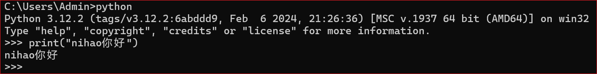

执行python脚本

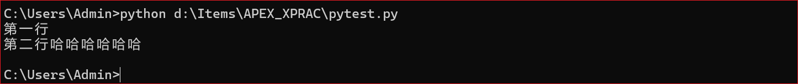

# python解释器


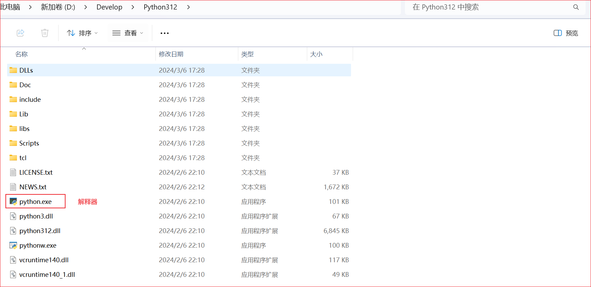

cmd中使用的`python`命令，实际就是调用python解释器python.exe

功能：

- 翻译代码
- 提交给计算机执行

# pycharm安装配置

# pycharm创建项目

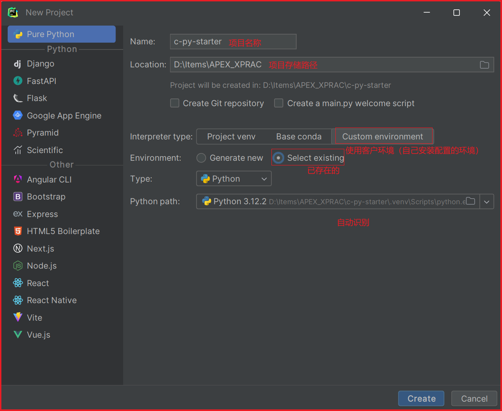

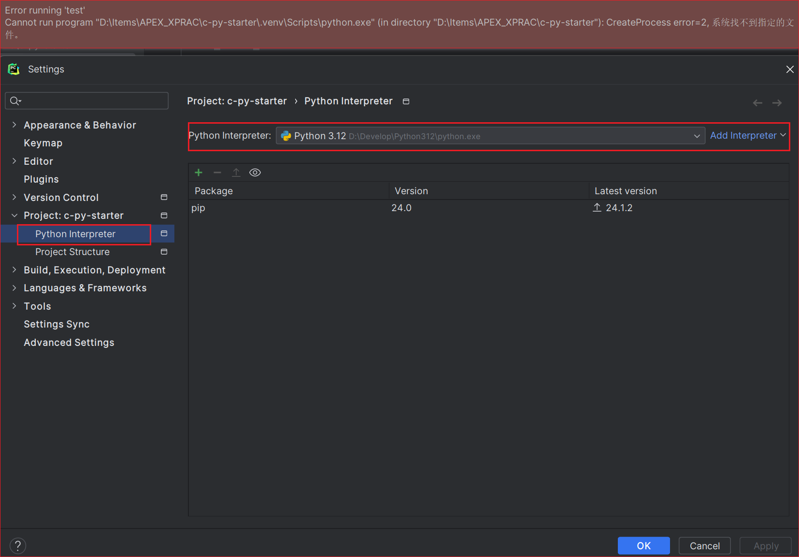

https://blog.csdn.net/Simpson_chen/article/details/139741386

# 命名规范

https://blog.csdn.net/StephenHendery/article/details/111175706

# 字面量

在Python中，字面量（literal）指的是代码中直接表示数据的常量值或者数据类型的表示方式。简单来说，字面量就是程序中直接使用的常量值，而不是变量或表达式。

例如：

- 整数字面量：`42`, `-10`, `0b1010`（二进制），`0o755`（八进制），`0xFF`（十六进制）等。
- 浮点数字面量：`3.14`, `2.71828`等。
- 字符串字面量：`'hello'`, `"world"`, `'''multiline string'''`等。
- 布尔字面量：`True`, `False`。
- 空值字面量：`None`。
- 列表字面量：`[1, 2, 3]`。
- 元组字面量：`(1, 2, 3)`。
- 字典字面量：`{'a': 1, 'b': 2}`。
- 集合字面量：`{1, 2, 3}`。

# 注释

- 单行注释，以`#`开头，建议`#`和注释文字之间有一个空格隔开
- 多行注释，以`"""`开头，以`"""`结尾，并且支持换行

```python
print("你好")
# 单行注释

print(1+1+1)
""" 多行注释1 """
"""
多行注释222
"""
print(55+1+1)
```

# 变量

变量：在程序运行时，能储存计算结果或能表示值的抽象概念简单的说，变量就是在程序运行时，记录数据用的。

格式：变量名 =  变量值

```python
money1 = 100
print(money1,money1,money1,money1,money1,money1)
```

# 数据类型

## 常用类型

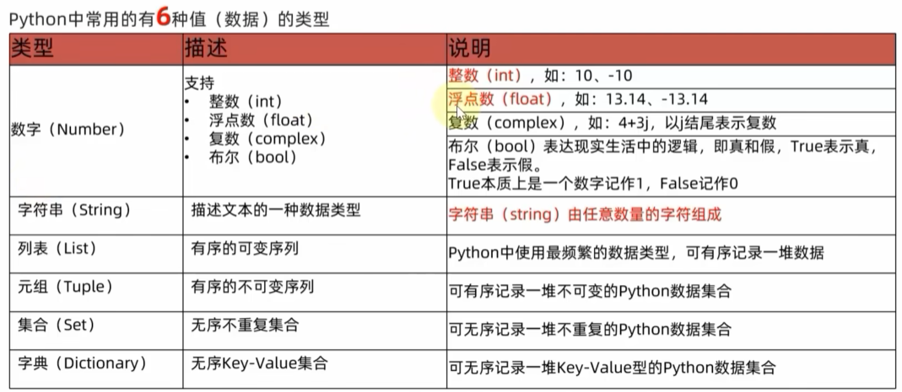

## type

**type()**：查看变量类型信息

```python
# type()
print(type(money1))
print(type("nihao"))
print(type(999.0))

string_type = type("nihao")
float_type = type(999.0)
print(string_type)
print(float_type)
```

```
<class 'int'>
<class 'str'>
<class 'float'>
<class 'str'>
<class 'float'>
```

python中，变量是没有类型的，但存储的数据是有类型的。

## 数据类型转换

`int(x)`：将x转换为一个整数

`float(x)`：将x转换为一个浮点数

`str(x)`：将对象 x转换为字符串

```python
# 数字转字符串
num_str = str(11)
print(type(num_str))
```

# 标识符

标识符：变量名、方法名、类名

python中标识符命名规则：

- 内容限定：只允许出现英文、中文、数字、下划线（不能以数字开头，不推荐使用中文）
- 大小写敏感
- 不可使用关键字

python中的关键字

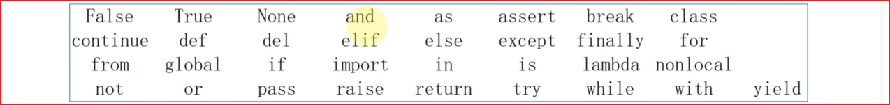

变量命名规则：

1. 见名知义
2. 下划线命名法：多个单词组合变量名，要使用下划线做分隔
3. 英文字母全小写

# 运算符

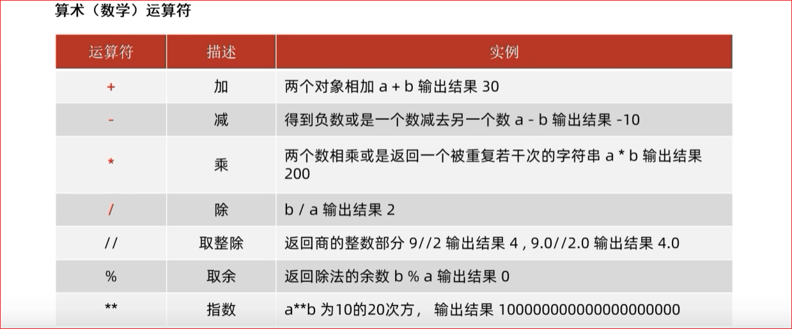

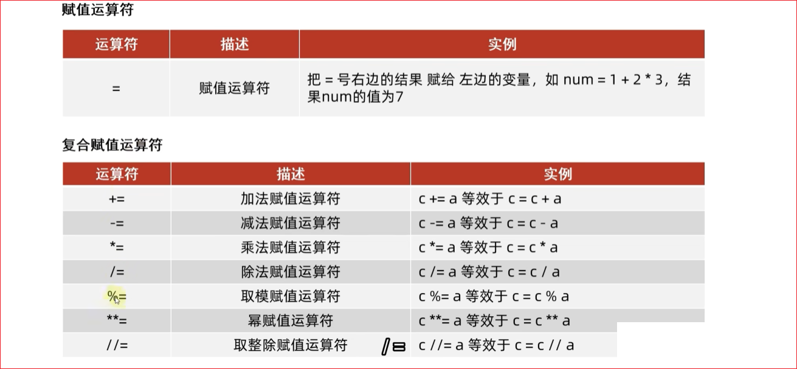

#  字符串

## 字符串定义

字符串在Python中有多种定义形式：

1. 单引号定义法：`name ='黑马程序员'`
2. 双引号定义法：`name ="黑马程序员"`
3. 三引号定义法：`name ="""黑马程序员"""`

三引号定义法，和多行注释的写法一样，同样支持换行操作。使用变量接收它，它就是字符串不使用变量接收它，就可以作为多行注释使用。


如果我想要定义的字符串本身，是包含:单引号、双引号自身呢?如何写?

- 单引号定义法，可以内含双引号
- 双引号定义法，可以内含单引号
- 可以使用转移字符`  \   `来将引号解除效用，变成普通字符串

```python
str4 = '"你好"' + "\"？你好\""
str5 = "'你好'" + '\'？你好\''
print(str5)
print(str4)
```

## 字符串拼接

**用`+`号拼接**

注意：不同类型的量不能拼接

```python
# 字符串的拼接
name_str = "zhangsan"
age_num = 98
phone_str = "13198703200"
print("我的名字是：" + name_str, "年龄是:" + age_num, "电话是：" + phone_str)
```

```
Traceback (most recent call last):
  File "D:\Items\APEX_XPRAC\c-py-starter\test.py", line 67, in <module>
    print("我的名字是：" + name_str, "年龄是:" + age_num, "电话是：" + phone_str)
                                     ~~~~~~~~~~^~~~~~~~~
TypeError: can only concatenate str (not "int") to str
```

## 字符串格式化

我们可以通过如下语法，完成字符串和变量的快速拼接

其中的，%s

- % 表示：我要占位
- s 表示：将`变量变成字符串`放入占位的地方
- 所以，综合起来的意思就是：我先占个位置，等一会有个变量过来，我把它变成字符串放到占位的位置

```python
name = 'LeeHGS'
introduce = '我的名字是的：%s' % name
print(introduce)
```

数字，字符串等都支占位，有多个变量占位时，变量要用括号括起来，并按照占位的顺序填入，用逗号分隔

```python
date = 20240723
tem = 30.1
message = '今天是：%s，温度：%s度' % (date, tem)
print(message)
```


Python中，其实支持非常多的数据类型占位最常用的是如下三类

| 格式符号 | 转化                             |
| -------- | -------------------------------- |
| %s       | 将内容转换成字符串，放入占位位置 |
| %d       | 将内容转换成整数，放入占位位置   |
| %f       | 将内容转换成浮点型，放入占位位置 |

**数字精度控制**

```python
salary = 99999.911
print('理想中的日薪: %f' % salary)
```

```
理想中的日薪: 99999.911000
```

输出的结果99999.911000小数位多了许多0，因此这种格式化方式下要做精度控制。

可以使用辅助符号"m.n"来控制数据的宽度和精度

- m，控制宽度，要求是数字(很少使用)，设置的宽度小于数字自身，不生效
- .n，控制小数点精度，要求是数字，会进行小数的四舍五入

示例:

- %5d：表示将整数的宽度控制在5位，如数字11，被设置为5d，就会变成:\[空格]\[空格][空格]11，用三个空格补足宽度。
- %5.2f：表示将宽度控制为5，将小数点精度设置为2小数点和小数部分也算入宽度计算。如，对11.345设置了%7.2f后，结果是:[空格][空格111.35。2个空格补足宽度，小数部分限制2位精度后，四舍五入为.35
- %.2f：表示不限制宽度，只设置小数点精度为2，如11.345设置%.2f后，结果是11.35

```python
salary = 99999.911
print('理想中的日薪: %f' % salary)
print('理想中的日薪: %10f' % salary)
print('理想中的日薪: %10.1f' % salary)
```

```
理想中的日薪: 99999.911000
理想中的日薪: 99999.911000
理想中的日薪:    99999.9
```

## 快速字符串格式化

语法：f"内容{变量}其他内容"

```python
salary = 99999.911
print(f"理想的日新是---{salary}")
```

```
理想的日新是---99999.911
```

优点：快捷，不做精度控制，原样输出

## 表达式格式化

表达式：有明确执行结果的代码语句，例如 1+2，4-1等等

直接格式化表达式，而不用变量接收表达式的值，再去格式化

```python
print('1+1的结果是：%d' % (1 + 1))
print(f'1*1的结果是：{1 * 1}')
print(f'"你好"的类型是：{type("你好")}')
```

```
1+1的结果是：2
1*1的结果是：1
"你好"的类型是：<class 'str'>
```

# 数据输入

**input()**

```python
print("请输入我的名字：")
my_name = input()
print(my_name)
your_name = input('请输入你的名字：')
print(your_name)

```

```
请输入我的名字：
nnn
nnn
请输入你的名字：xxx
xxx
```

通过input()获取到的结果都是字符串类型

# 布尔类型 比较运算符

**布尔类型字面量**

- false：假
- true：真

**比较运算符**

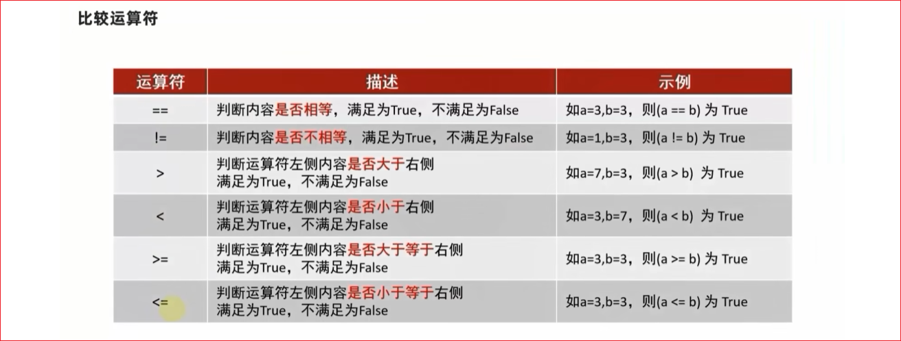

```python
n_1 = 'haodene'
n_2 = 'haode'
print(f'n_1 n_2比较的结果是: {n_1 > n_2}')
```

```
n_1 n_2比较的结果是: True
```

# 判读语句

## if语句

if语句的基本格式

```python
if 要判断的条件:
    条件成立时，要做的事情
```

if语句的注意事项:

- 判断条件的结果一定要是布尔类型
- 不要忘记判断条件后的冒号
- 归属于if语句的代码块，需在前方填充4个空格缩进

```python
stu_age = 99
if stu_age >= 18:
    print("这个学生已经成年了")
print("不属于if语句的输出语句")
```

```
这个学生已经成年了
不属于if语句的输出语句
```

## if-else语句

if else语句的注意事项:

- else不需要判断条件，当if的条件不满足时，else执行else的代码块，
- else 和if位置对齐
- 同样要4个空格作为缩进

```python
stu_age = 10
if stu_age >= 18:
    print("这个学生已经成年了")
else:
    print('这个学生还未成年')
print("不属于if语句的输出语句")
```

```
这个学生还未成年
不属于if语句的输出语句
```

## if-elif语句

使用if elif else的注意点有:

- elif可以写多个
- 判断是互斥且有序的上一个满足后面的就不会判断了
- 可以在条件判断中，直接写input语句，节省代码量

```python
score = float(input("输入你的成绩"))
if score < 60:
    print("成绩不及格：")
elif 60 <= score < 90:
    print("成绩合格")
else:
    print("成绩优秀")
```

```
输入你的成绩99.7
成绩优秀
```

## if语句嵌套

1. 嵌套判断语句可以用于多条件、多层次的逻辑判断
2. 嵌套判断语句可以根据需求，自由组合if elif else来构建多层次判断
3. 嵌套判断语句，一定要注意空格缩进，Python通过空格缩进来决定层次关系

```python
subject = input('输入你的科目')
subject_score = float(input('输入对应的成绩'))
if subject == '语文':
    if subject_score < 90:
        print(f'{subject}成绩不合格')
    elif 90 <= subject_score < 120:
        print(f'{subject}成绩合格')
    else:
        print(f'{subject}成绩优秀')
elif subject == '物理':
    if subject_score < 60:
        print(f'{subject}成绩不合格')
    elif 60 <= subject_score < 90:
        print(f'{subject}成绩合格')
    else:
        print(f'{subject}成绩优秀')
else:
    print(f'{subject}科目的成绩暂不支持查询')
```

# while循环

## while循环

1. while的条件需得到布尔类型，True表示继续循环，False表示结束循环
2. 需要设置循环终止的条件，如i+=1配合i<100，就能确保100次后停止，否则将无限循环
3. 空格缩进和if判断一样，都需要设置

```python
i = 1
while i < 5:
    print(f'第{i}次数输出i的值')
    i += 1

```

```
第1次数输出i的值
第2次数输出i的值
第3次数输出i的值
第4次数输出i的值
```

## while嵌套

空格缩进决定层次关系

```python
i = 1
sums = 0
while i < 5:
    j = i
    while j > 0:
        sums += j
        j -= 1
    i += 1
print(f'sum的值为{sums}')
```

九九乘法表

```python
i = 1
while i < 10:
    j = 1
    while j <= i:
        print(f"{j} * {i} = {i * j} \t", end='')
        j += 1
    i += 1
    print()
```

```
1 * 1 = 1 	
1 * 2 = 2 	2 * 2 = 4 	
1 * 3 = 3 	2 * 3 = 6 	3 * 3 = 9 	
1 * 4 = 4 	2 * 4 = 8 	3 * 4 = 12 	4 * 4 = 16 	
1 * 5 = 5 	2 * 5 = 10 	3 * 5 = 15 	4 * 5 = 20 	5 * 5 = 25 	
1 * 6 = 6 	2 * 6 = 12 	3 * 6 = 18 	4 * 6 = 24 	5 * 6 = 30 	6 * 6 = 36 	
1 * 7 = 7 	2 * 7 = 14 	3 * 7 = 21 	4 * 7 = 28 	5 * 7 = 35 	6 * 7 = 42 	7 * 7 = 49 	
1 * 8 = 8 	2 * 8 = 16 	3 * 8 = 24 	4 * 8 = 32 	5 * 8 = 40 	6 * 8 = 48 	7 * 8 = 56 	8 * 8 = 64 	
1 * 9 = 9 	2 * 9 = 18 	3 * 9 = 27 	4 * 9 = 36 	5 * 9 = 45 	6 * 9 = 54 	7 * 9 = 63 	8 * 9 = 72 	9 * 9 = 81 	
```

在Python中，`\t` 是一个转义字符，用于表示制表符（Tab）。制表符通常用于在文本中创建水平间距，使得输出更整齐或对齐。它的作用相当于在文本中插入一个水平制表符，使光标移动到下一个制表位置。

在Python中，`print()`函数的`end`参数用于指定输出后应该附加的字符串。默认情况下，`print()`函数会在输出的末尾添加一个换行符（`\n`），使得后续的输出会在新的一行开始。通过修改`end`参数的值，可以改变这一行为。

# for循环

## for循环基础

除了while循环语句外，Python同样提供了for循环语句。两者能完成的功能基本差不多，但仍有一些区别:

- while循环的循环条件是自定义的，自行控制循环条件
- for循环是一种”轮询”机制，是对一批内容进行”逐个处理

for循环的语法格式是:

```python
for 临时变量 in 待处理数据集(序列):
    循环满足条件时执行的代码
```

待处理数据集严格来说称之为`序列类型`，序列类型是指其内容可以一个个依次取出的一种类型，包括：`字符串`、`列表`、`元组`等

for循环的注意点

- 无法定义循环条件，只能被动取出数据处理
- 要注意，循环内的语句，需要有空格缩进

例子：遍历字符串

```python
str_3 = 'you'
for x in str_3:
    print(x)
```

```
y
o
u
```

## range语句

`range(num)`：获取一个从0开始，到num结束的数字序列(不含num本身)。如range(5)取得的数据是:[0,1,2 3,4]

`range(num1, num2)`：获得一个从num1开始，到num2结束的数字序列(不含num2本身)。如，range(5,10)取得的数据是:[5,6,7,8,9]

`range(num1, num2, step)`：获得一个从num1开始，到num2结束的数字序列(不含num2本身)，数字之间的步长，以step为准(step默认为1)。如，range(5,10,2)取得的数据是:[5,7,9]

```python
for x in range(1,10,3):
    print(x)
```

```
1
4
7
```

## for循环临时变量作用域

```python
for 临时变量 in 待处理数据集:
    循环满足条件时执行的代码
```

回看for循环的语法，我们会发现，将从数据集(序列)中取出的数据赋值给临时变量为什么是临时的呢?

临时变量，在编程规范上，作用范围(作用域)，只限定在for循环内部

如果在for循环外部访问临时变量:

- 实际上是可以访问到的
- 在编程规范上，是不允许、不建议这么做的

错误示例

```python
for i in range(3):
print(i)
```

## for循环嵌套

注意缩进

# continue和break

continue：中断本次循环，直接进入下一轮循环，continue只作用于所在的循环，不会影响所在循环外面的外层循环

```python
for i in range(4):
    print("语句一")
    continue
    print("语句2")
```

```

语句一
语句一
语句一
```

Break：直接结束循环，同样只影响所在层的循环

```python
for i in range(5):
    if i == 2:
        break
    print(f"语句{i}")
```

```
语句0
语句1
```

# 函数

## 函数基础

函数：是组织好的，可重复使用的，用来实现特定功能的代码段

**函数的定义**

语法

```python
def 函数名(传入行参):
    函数体
    return 返回值
```

```python
def my_length(str):
    count = 0
    for c in str:
        count += 1
    return count
```

**函数的调用**

函数名(参数)

```python
print(my_length('12345'))
```

**注意事项**

- 参数如不需要，可以省略

- 返回值如不需要，可以省略

-  函数必须先定义后使用

**函数返回值None类型**

如果函数没有使用return语句返回数据，那么函数有返回值吗？实际上是有的。

Python中有一个特殊的字面量:None，其类型是:<class'NoneType'>

无返回值的函数，实际上就是返回了None这个字面量

None表示：空的、无实际意义的意思，函数返回的None，就表示这个函数没有返回什么有意义的内容也就是返回了空的意思。

对于本身没有返回值的函数，也可以手动返回None

```python
def my_say_hi():
    print("你好，SSSS")

res = my_say_hi()
print(res)
print(type(res))
```

```
你好，SSSS
None
<class 'NoneType'>
```

**None类型的应用场景**

- None作为一个特殊的字面量，用于表示:空、无意义，其有非常多的应用场景。用在函数无返回值上
- 用在if判断上。在if判断中，None等同于`False`。一般用于在函数中主动返回None，配合if判断做相关处理
- 用于声明无内容的变量上。定义变量，但暂时不需要变量有具体值，可以用None来代替

```python
if not None
if not False
```

## 函数说明文档

函数是纯代码语言，想要理解其含义，就需要一行行的去阅读理解代码，效率比较低。

我们可以给函数添加说明文档，辅助理解函数的作用，语法如下:

```python
def func(x,y):
    """
    函数说明
		:param x:形参x的说明
		:param y:形参y的说明
		:return:返回值的说明
    """
    函数体
    return 返回值
```

通过多行注释的形式，对函数进行说明解释

## 函数嵌套调用

所谓的函数嵌套调用是指一个函数里面又调用了另一个函数

## 函数变量

变量作用域指的是变量的作用范围(变量在哪里可用，在哪里不可用)

主要分为两类：局部变量和全局变量

**局部变量**

所谓局部变量是定义在函数体内部的变量，即只在函数体内部生效

```python
 def testA():
     num=100
     print(num)
 testA()
```

变量num是定义在testA 函数内部的变量，在函数外部访问则立即报错

局部变量的作用：在函数体内部，临时保存数据，即当函数调用完成后，则销毁局部变量

**全局变量**

所谓全局变量，指的是在函数体内、外都能生效的变量

```python
 num = 100
 def testA():
     print(num)
 testA()
```

**global关键字**

```python
num_1 = 100
def f_1():
    print(num_1)
def f_2():
    num_1 = 400 #函数f_2内并未改变全局变量num_1的值，实际是函数内部定义了一个与全局变量同名的局部变量
    print(num_1)
f_1()
f_2()
print(num_1)
```

```
100
400
100
```

使用global可将函数类定义的变量声明为全局变量

```python
num_1 = 100
def f_1():
    print(num_1)
def f_2():
    global num_1
    num_1 = 400
    print(num_1)
f_1()
f_2()
print(num_1)
```

```
100
400
400
```

## 函数多返回值

语法：多个返回值用逗号隔开，用一个return返回，支持一次返回不同类型的返回值

```python
def my_func():
    return 返回值1, 返回值2, 返回值3
```

调用接收

```python
x,y,z = my_func()
```

x对应返回值1，y对应返回值2，z对应返回值3

```python
def my_func():
    return 1, "hello", [1, 2, 3]
x, y, z = my_func()
print(x)
print(y)
print(z)
```

```
1
hello
[1, 2, 3]
```

## 函数的多种参数形式

函数参数种类，按照使用方式上的不同，函数有4种常见参数使用方式：

- 位置参数
- 关键字参数
- 缺省参数
- 不定长参数

**位置参数**

调用函数时根据函数定义的参数位置来传递参数

注意：传递的参数和定义的参数顺序、数量必须一致

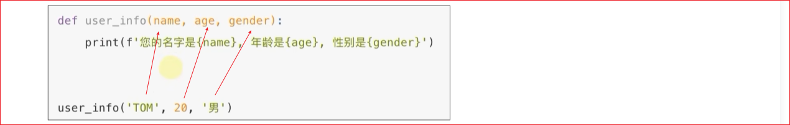

**关键字参数**

函数调用时通过“键=值”形式传递参数

作用：可以让函数更加清晰、容易使用，同时也清除了参数的顺序需求

注意：函数调用时，如果有位置参数时，`位置参数必须在关键字参数的前面，但关键字参数之间不存在先后顺序`

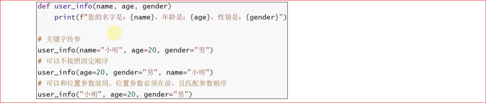

**缺省参数**

缺省参数也叫默认参数，用于定义函数，为参数提供默认值，调用函数时可不传该默认参数的值(注意：所有位置参数必须出现在默认参数前，包括函数定义和调用)

作用：当调用函数时没有传递参数，就会使用默认是用缺省参数对应的值

注意：函数调用时，如果为缺省参数传值则修改默认参数值，否则使用这个默认值

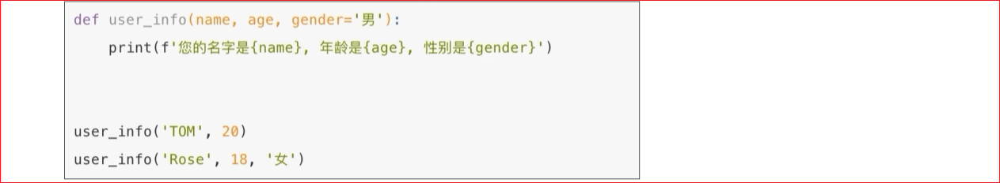

**不定长参数**

不定长参数：不定长参数也叫可变参数，用于不确定调用的时候会传递多少个参数(不传参也可以)的场景

作用：当调用函数时不确定参数个数时，可以使用不定长参数

不定长参数的类型

- 位置传递
- 关键字传递

位置不定长：传进的所有参数都会被args变量收集，它会根据传进参数的位置合并为一个元组(tuple)，args是元组类型

```python
def my_func(*args):
    print(args)
my_func('1111',2)
```

```
('1111', 2)
```

关键字不定长：参数是“键=值”形式的形式的情况下，所有的“键=值”都会被kwargs接受，同时会根据“键=值”组成字典(注意，调用时key不用用引号包裹)

```python
def my_func(**kwargs):
    print(kwargs)
my_func(name='Johb', age=90)
```

```
{'name': 'Johb', 'age': 90}
```

## 匿名函数

**函数作为参数传递**

函数作为参数传递是逻辑，而非数据

```python
def func_1(x, y, compute):
    return compute(x, y)

def compute(a, b):
    return a + b

res = func_1(2, 5, compute)
print(res)
```

**lamda匿名函数**

函数的定义中，def关键字，可以定义带有名称的函数；lambda关键字，可以定义匿名函数(无名称)

有名称的函数，可以基于名称重复使用无名称的匿名函数，只可临时使用一次

匿名函数定义语法:
```python
lambda 传入参数: 函数体(一行代码)
```

- lambda 是关键字，表示定义匿名函数
- 传入参数表示匿名函数的形式参数，如：x, y表示接收2个形式参数
- 函数体，就是函数的执行逻辑，要注意：只能写一行，无法写多行代码（不用写return语句，默认就会return）

```python
def compute(a, b):
    return a + b
def func_3(compute):
    return compute(1, 3)
r = func_3(lambda x, y: x +  y)
print(r)
```

```python
add = lambda x, y: x + y
print(add(5, 3))  # 输出 8

# 使用 lambda 函数对列表进行排序
points = [(1, 2), (4, 1), (5, -1)]
points_sorted = sorted(points, key=lambda point: point[1])
print(points_sorted)
```

# 数据容器

## 概述

Python中的数据容器：一种可以容纳多份数据的数据类型，容纳的每一份数据称之为1个元素，每1个元素，可以是任意类型的数据，如字符串、数字、布尔等

数据容器根据特点的不同，如：是否支持重复元素、是否可以修改、是否有序等，分为5类，分别是：列表(list)、元组(tuple)、字符串(str)、集合(set)、字典(dict)

## 列表List

### 列表的定义

基本语法:
```python
#字面量
[元素1，元素2，元素3，元素4，...]
#定义变量
变量名称 =[元素1，元素2，元素3，元素4，...]
#定义空列表
变量名称 =[]
变量名称 = list()
```

列表内的每一个数据，称之为元素

- 以[]作为标识
- 列表内每一个元素之间用，逗号隔开

列表可以存储不同类型的元素，可以嵌套即元素可以为列表

```python
test_list = ['111', False, [33,55,77]]
print(test_list)
print(type(test_list))
```

### 列表下标

列表中的元素都是有顺序的

元素的位置下标索引，从前向后，`从0开始，依次递增`

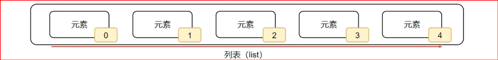

反向索引，即从后向前，`从-1开始，依次递减`

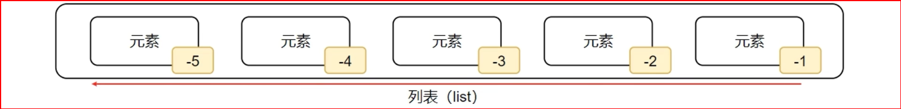

嵌套列表下标

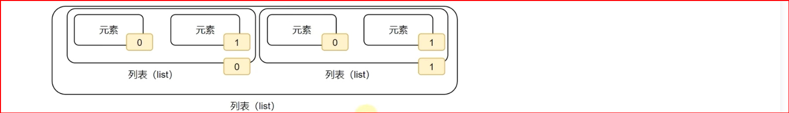

```python
test_list = ['111', False, [33,55,77]]
print(test_list)
print(type(test_list))
# 从索引取
print(test_list[0])
print(test_list[1])
print(test_list[2])
# 从反向索引
print(test_list[-1])
print(test_list[-2])
print(test_list[-3])
# 从索引-嵌套
print(test_list[2][1])
```

### 列表常用操作

函数 方法区别

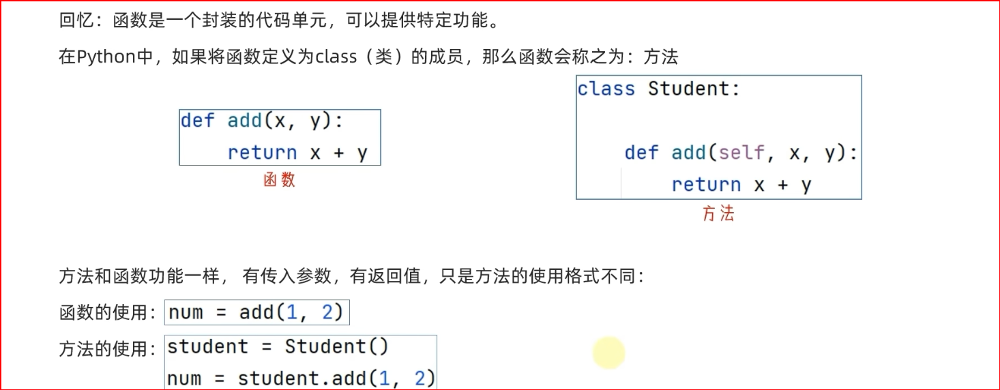

#### 查询

index()

```python
test_list = ['111', False, [33,55,77]]
result = test_list.index("111")
print(result)
```

#### 修改

```python
test_list = ['111', False, [33,55,77]]
test_list[0] = 'ssss'
print(test_list)
```

#### 插入

insert(索引，元素)

```python
test_list = ['111', False, [33,55,77]]
test_list.insert(0,'99990')
```

#### 追加

append(元素) ：追加一个元素

extend(其他数据容器)：将其他数据容器中的元素全部追加到调用者容器元素后

```python
test_list = ['111', False, [33,55,77]]
test_list.append('00000x')
print(test_list)
test_list.extend(['3333','44444','55555'])
print(test_list)
```

#### 删除

1. del  列表[下标]
2. 列表.pop(下标)

```python
del test_list[0]
print(test_list)
test_list.pop(0)
print(test_list)
```

3. 列表.remove(元素)：删除从前往后开始第一个匹配的元素

```python
list = [1,2,3,1,4,1,5]
list.remove(1)
print(list)
```

4. 列表.clear()：清空列表

```python
list = [1,2,3,1,4,1,5]
list.clear()
print(list)
```

#### 统计

1. 列表.count(元素)：指定元素的数量

```python
list = [1,2,3,1,4,1,5]
list.count(1)
```

2. len(列表)：列表元素的数量

### 列表遍历

while循环遍历

```python
list_2 = [1,2,3,1,4,1,5]
index = 0
while index < len(list_2):
    print(list_2[index])
    index += 1
```

for循环遍历

```python
list_2 = [1,2,3,1,4,1,5]
for x in list_2:
    print(x)
```

## 元组tuple

### 元组的定义

元组：同列表一样，都是可以封装不同类型的元素在内。但最大的不同点在于元组一旦定义完成，就不可修改

- 不可以修改元组的内容，否则会直接报错

- 可以修改元组内的1ist的内容(修改元素、增加、删除、反转等)

```python
尝试修改元组内容

t1=(1, 2, ['itheima', 'itcast'])
t1[2][1]= 'best'
print(t1)#结果:(1, 2, ['itheima', 'best'])
```


元组定义：定义元组使用小括号，且使用逗号隔开各个数据，数据可以是不同的数据类型

```python
# 定义元组字面量
(元素，元素，......，元素)
#  定义元组变量
变量名称 = (元素，元素，元素)
# 定义空元组
变量名称 = () #方式1
变量名称 = tuple() #方式2
```

注意：`元组只有一个数据，这个数据后面要添加逗号，否则不是元组类型`

```python
my_tuple = (111,)
```

```python
my_tuple = (1, 2, 3, 4, 5)
my_tuple_2 = ('hello',) # 元组
my_tuple_3 = ('hello') # 字符串
print(('111', '222', '333'))
print(my_tuple)
print(type(my_tuple))
print(my_tuple_2)
print(type(my_tuple_2))
print(my_tuple_3)
print(type(my_tuple_3))

my_empty_tuple = tuple()
print(my_empty_tuple)
print(())
```

```
('111', '222', '333')
(1, 2, 3, 4, 5)
<class 'tuple'>
('hello',)
<class 'tuple'>
hello
<class 'str'>
()
()
```

元组也支持嵌套

```python
tuple_1 = ((1,2),(2,3,4),(5,6,7))
```

### 通过下标获取元组元素

```python
tuple_1 = ((1, 2), (2, 3, 4), (5, 6, 7))
print(tuple_1[1][2])
```

```
4
```

### 元组相关操作

| 编号 | 方法      | 作用                                               |
| ---- | --------- | -------------------------------------------------- |
| 1    | index()   | 查找某个数据，如果数据存在返回对应的下标，否则报错 |
| 2    | count()   | 统计某个数据在当前元组出现的次数                   |
| 3    | len(元组) | 统计元组内的元素个数                               |

```python
tuple_2 = ('a', 'b', 'c', 'd', 'e', 'c')
print(tuple_2)
print(tuple_2.index('b'))
print(tuple_2.count('c'))
print(len(tuple_2))
```

```
('a', 'b', 'c', 'd', 'e', 'c')
1
2
6
```

### 元组的遍历

```python
tuple_3 = ('hello', 'my', 'dear', 'sss')
# while循环
idx = 0
while idx < len(tuple_3):
    print(tuple_3[idx])
    idx += 1
# for循环
for e in tuple_3:
    print(e)
```

## 字符串str

尽管字符串看起来并不像列表、元组那样，一看就是存放了许多数据的容器，但不可否认的是，字符串同样也是数据容器的一员。

字符串是字符的容器，一个字符串可以存放任意数量的字符。

### 字符串的下标(索引)

和其它容器如列表、元组一样，字符串也可以通过下标进行访问

- 从前向后，下标从 0 开始
- 从后向前，下标从 -1 开始

```python
str_1 = '0123456789'
print(str_1[0])
print(str_1[-2])
```

同元组一样，字符串是一个:无法修改的数据容器。所以:

```
修改指定下标的字符		(如:字符串[0]='a')
移除特定下标的字符		(如:del字符串[0]、字符串.remove()、字符串.pop()等)
追加字符等			   (如:字符串.append()
```

均无法完成。如果必须要做，只能得到一个新的字符串，原来的字符串是无法修改的

### 字符串操作

| 方法          | 功能描述                                                     |
| ------------- | ------------------------------------------------------------ |
| index()       | 获取指定字符下标索引                                         |
| replace()     | 替换原字符串中的指定内容，得到一个新的字符串                 |
| split()       | 照指定的分隔符字符串，将字符串划分为多个字符串，并存列表对中（字符串本身不变，而是得到了一个列表对象） |
| strip()       | 去掉字符串开头结尾的空格、回车符                             |
| strip(字符串) | 去掉字符串开头结尾指定的字符串                               |

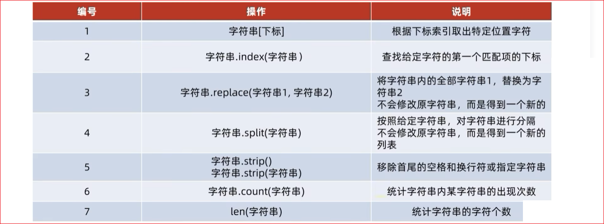

```python
str_2 = ('   abcdefg1234567a   ')
print(str_2.index('d'))

new_str_2 = str_2.replace('fg', '91FMT')
print(new_str_2)

new_str_3 = str_2.split('c')
print(new_str_3)

new_str_4 = str_2.strip()
print(new_str_4)

new_str_5 = str_2.strip('    a')
print(new_str_5)
```

```
   abcde91FMT1234567a   
['   ab', 'defg1234567a   ']
abcdefg1234567a
bcdefg1234567
```

### 字符串遍历

```python
str_4 = '91nxs'
# while
idx = 0
while idx < len(str_4):
    print(str_4[idx])
    idx += 1
# for
for char in str_4:
    print(char)
```

### 特点

作为数据容器，字符串有如下特点:

- 只可以存储字符串
- 长度任意(取决于内存大小)
- 支持下标索引
- 允许重复字符串存在
- 不可以修改(增加或删除元素等)
- 支持for循环

## 序列切片

### 序列

序列是指内容连续、有序，可使用下标索引的一类数据容器，列表、元组、字符串，均可以可以视为序列。

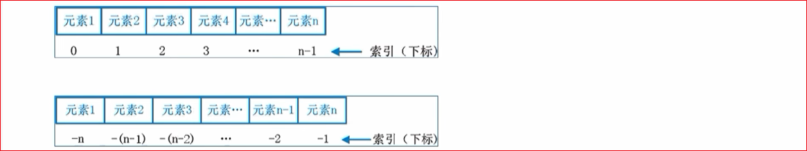

### 切片

切片：从一个序列中，取出一个子序列，得到一个新的序列（原序列不受影响），`列表`、`元组`、`字符串`等均支持进行切片操作

语法：

```python
序列[起始下标:结束下标:步长]
```

表示从序列中，从指定位置开始，依次取出元素，到指定位置结束，得到一个新序列

- 起始下标表示从何处开始，可以留空，留空视作从头开始
- 结束下标(不含)表示何处结束，可以留空，留空视作截取到结尾
- 步长表示，依次取元素的间隔
  - 步长1表示，一个一个取元素（步长为1可以省略）
  - 步长2表示，每次跳过1个元素取
  - 步长N表示，每次跳过N-1个元素取
  - 步长为负数表示，反向取(注意，起始下标和结束下标也要反向标记)

```python
# 序列切片
my_list = [0, 1, 2, 3, 4, 5]
new_my_list = my_list[1:3]
new_my_list_2 = my_list[:]
print(new_my_list)
print(new_my_list_2)

my_tuple = (0, 1, 2, 3, 4, 5)
new_my_tuple = my_tuple[-1::-2]
print(new_my_tuple)

my_str = 'abcdefg'
new_my_str = my_str[::3]
print(new_my_str)
```

```
[1, 2]
[0, 1, 2, 3, 4, 5]
(5, 3, 1)
adg
```

## 集合set

### 集合的定义

列表：可修改、支持重复元素且有序

元组、字符串：不可修改、支持重复元素且有序

集合：可需改，元素不能重复、无序

语法：

```python
# 定义集合字面量
{元素, 元素, …… , 元素}
# 定义集合变量
变量名称 = {元素, 元素, …… ,元素}
# 定义空集合
变量名称 = set()
```

```python
my_set = {'good', 'good', 'wood', 'its', 'ok'}
my_set_2 = set()
print(my_set)
print(my_set_2)
```

```
{'good', 'ok', 'its', 'wood'}
set()
```

集合是无序的，所以不支持下标索引访问

### 集合操作

| 方法                           | 功能                                                         |
| ------------------------------ | ------------------------------------------------------------ |
| add()                          | 添加元素                                                     |
| remove()                       | 移除元素                                                     |
| pop()                          | 随机取出一个元素，取出的元素从集合中移除                     |
| clear()                        | 清空集合                                                     |
| 集合1.difference(集合2)        | 返回两个集合的差集（集合1有集合2没有元素的集合），原集合1、集合2不变 |
| 集合1.difference_update(集合2) | 删除集合1中集合1集合2共有的元素，原集合1改变，集合2不变      |
| 集合1.union(集合2)             | 合并集合1、集合2的元素生成一个新集合，原集合1、集合2不变     |

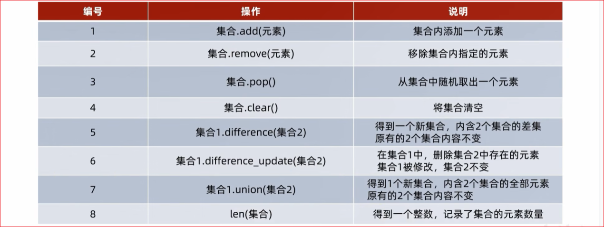

```python
my_set.add('91nxs')
print(my_set)

my_set.remove('wood')
print(my_set)

print(f'随机获取的元素是：{my_set.pop()}，剩余的元素是:{my_set}')

my_set.clear()
print(my_set)

set_1 = {1, 2, 3, 4, 5}
set_2 = {1, 2, 7, 8, 9}
set_3 = set_1.difference(set_2)
print(set_1)
print(set_2)
print(set_3)

set_4 = set_1.difference_update(set_2)
print(set_1)
print(set_2)
print(set_4)

set_1 = {111, 222}
set_2 = {333, 111}
set_4 = set_1.union(set_2)
print(set_1)
print(set_2)
print(set_4)

print(len(set_1))
```

### 集合的遍历

集合不支持下标索引，所以不能用while循环遍历，但可以通过for循环遍历

```pytHon
set_1 = {1, 2, 3, 4, 5, 6}
for e in set_1:
    print(e)
```

### 特点

经过上述对集合的学习，可以总结出集合有如下特点

- 可以容纳多个数据
- 可以容纳不同类型的数据(混装)
- 数据是无序存储的(不支持下标索引)
- 不允许重复数据存在
- 可以修改(增加或删除元素等)
- 支持for循环

## 字典dict

### 字典的定义

字典的定义，同样使用{}，不过存储的元素是一个个的键值对，如下语法:

```python
# 定义字典变量
{key:value, key:value, ......, key:value}
# 定义空字典
my_dict = {key:value, key:value, ......, key:value}
# 空字典定义
my_dict = {} # 方式1
my_dict = dict() # 方式2
```

```python
my_dict = {'name': '张三', 'height': '1.99'}
print(my_dict)
my_dict_1 = {}
print(my_dict_1)
my_dict_2 = dict()
print(my_dict_2)
```

```
{'name': '张三', 'height': '1.99'}
{}
{}
```

字典的key是不能重复的，重复添加，后添加的会覆盖先添加的

通过字典的key获取对应的value

```python
my_dict = {'name': '张三', 'height': '1.99'}
print(my_dict.get('name'))
print(my_dict['name'])
```

字典是可以嵌套的，key和value可以是任意数据类型，但key不能为字典

```python
score_dict = {
    "张三": {
        "语文": 99,
        "数学": 98,
        "英语": 97
    },
    "王五": {
        "语文": 11,
        "数学": 23,
        "英语": 55
    },
    "刘备": {
        "语文": 77,
        "数学": 90,
        "英语": 32
    }
}
print(score_dict['刘备'])
print(score_dict['刘备']['英语'])
print(score_dict.get('刘备'))
print(score_dict.get('刘备').get('英语'))
```

```
{'语文': 77, '数学': 90, '英语': 32}
32
{'语文': 77, '数学': 90, '英语': 32}
32
```

### 字典的操作

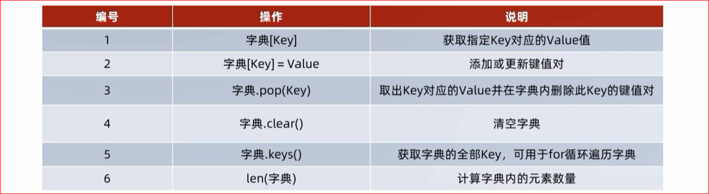

#### 新增/修改

语法：`字典[key] = value`

当key不存在时即为新增，key已经存在即为修改

```python
dict_1 = {'lee': 99, 'tang': 59}
print(dict_1)
dict_1['wang'] = 98
print(dict_1)
dict_1['lee'] = 88
print(dict_1)
```

```
{'lee': 99, 'tang': 59}
{'lee': 99, 'tang': 59, 'wang': 98}
{'lee': 88, 'tang': 59, 'wang': 98}
```

#### 删除

语法：`字典.pop(key)`

```python
dict_1.pop('lee')
print(dict_1)
```

#### 清空

语法：`字典.clear()`

#### 获取全部key

语法：`字典.keys()`

```python
keys = dict_1.keys()
print(keys)
```

#### 遍历字典

字典不支持下标索引，索引也不能用while循环遍历，可以使用for循环遍历

方式一

```python
# 获取所有key
keys = dict_1.keys()
# 通过key获取value
for key in keys:
    print(key, '---', dict_1[key])
```

方式二

```python
#直接获取到的就是key
for key in dict_1:
    print(key, '---', dict_1[key])
```

#### 字典元素数量

语法：`len(字典)`

### 字典特点

经过上述对字典的学习，可以总结出字典有如下特点

- 可以容纳多个数据
- 可以容纳不同类型的数据
- 每一份数据是Key Value键值对
- 可以通过Key获取到Value，Key不可重复(重复会覆盖
- 不支持下标索引
- 可以修改(增加或删除更新元素等)
- 支持for循环，不支持while循环

## 数据容器比较

数据容器可以从以下视角进行简单的分类:

- 是否支持下标索引
  - 支持：列表、元组、字符串------------序列类型
  - 不支持：集合、字典---------------非序列类型
- 是否支持重复元素
    - 支持：列表、元组、字符串----序列类型
    - 不支持：集合、字典--------------非序列类型
- 是否可以修改
    - 支持：列表、集合、字典
    - 不支持：元组、字符串

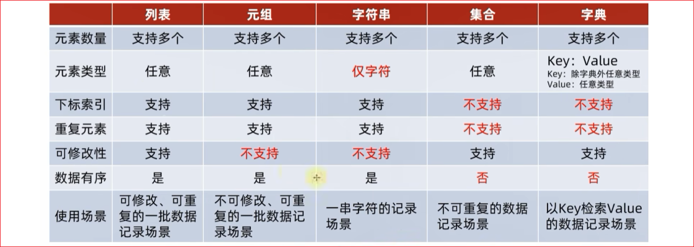

基于各类数据容器的特点，它们的应用场景如下:

- 列表：一批数据，可修改、可重复的存储场景
- 元组：一批数据，不可修改、可重复的存储场景
- 字符串：一串字符串的存储场景
- 集合：一批数据，去重存储场景
- 字典：一批数据，可用Key检索Value的存储场景

## 数据容器通用操作

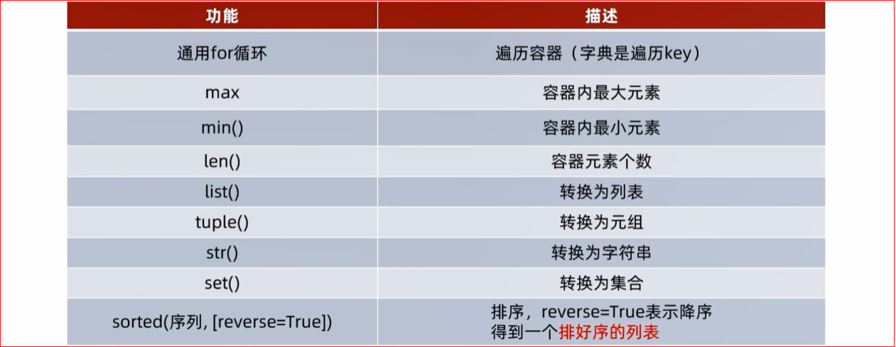

`len(容器)`：容器元素个数

`max(容器)`：容器最大元素

`min(容器)`：容器最小元素

`list(容器)`：容器转化为列表

- 字符串转列表，字符串的每个字符作为列表的元素
- 字典转列表，字典的key作为列表的元素

`str(容器)`：容器转化为字符串

`tuple(容器)`：容器转化为元组

- 字典转元组，字典的key作为列表的元素

`set(容器)`：容器转化为集合

- 字典转集合，字典的key作为列表的元素

```python
my_list = [1, 2, 3, 3]
my_tuple = (4, 5, 6)
my_str = 'abcdefg'
my_set = {9, 10, 11}
my_dict = {"name": "john", "age": 99}
print(list(my_list))
print(list(my_tuple))
print(list(my_str))
print(list(my_set))
print(list(my_dict))
print('======================================')

print(tuple(my_list))
print(tuple(my_tuple))
print(tuple(my_str))
print(tuple(my_set))
print(tuple(my_dict))
print('======================================')

print(str(my_list))
print(str(my_tuple))
print(str(my_str))
print(str(my_set))
print(str(my_dict))
print('======================================')

print(set(my_list))
print(set(my_tuple))
print(set(my_str))
print(set(my_set))
print(set(my_dict))
```

```
[1, 2, 3, 3]
[4, 5, 6]
['a', 'b', 'c', 'd', 'e', 'f', 'g']
[9, 10, 11]
['name', 'age']
======================================
(1, 2, 3, 3)
(4, 5, 6)
('a', 'b', 'c', 'd', 'e', 'f', 'g')
(9, 10, 11)
('name', 'age')
======================================
[1, 2, 3, 3]
(4, 5, 6)
abcdefg
{9, 10, 11}
{'name': 'john', 'age': 99}
======================================
{1, 2, 3}
{4, 5, 6}
{'e', 'g', 'f', 'd', 'b', 'c', 'a'}
{9, 10, 11}
{'name', 'age'}
```

`sort(容器，[reverse=Ture])`：排序，对容器的内容进行排序，排序后放入一个新的列表中，[reverse=True]是可选值，指定[reverse=True]，表示反转，倒叙排序

```python
my_list = [4, 2, 1, 3]
my_tuple = (4, 2, 1, 3)
my_str = 'defgabc'
my_set = {10, 9,  11}
my_dict = {"key2": 99, "key1": "john", "key3": "hhh"}

print(sorted(my_list))
print(sorted(my_tuple))
print(sorted(my_str))
print(sorted(my_set))
print(sorted(my_dict))
print("--------------------------------------------")
print(sorted(my_list, reverse=True))
print(sorted(my_tuple, reverse=True))
print(sorted(my_str, reverse=True))
print(sorted(my_set, reverse=True))
print(sorted(my_dict, reverse=True))
```

```
[1, 2, 3, 4]
[1, 2, 3, 4]
['a', 'b', 'c', 'd', 'e', 'f', 'g']
[9, 10, 11]
['key1', 'key2', 'key3']
--------------------------------------------
[4, 3, 2, 1]
[4, 3, 2, 1]
['g', 'f', 'e', 'd', 'c', 'b', 'a']
[11, 10, 9]
['key3', 'key2', 'key1']
```

## 字符串大小比较

字符的大小比较：ASCII码值的比较

字符串大小比较：按位比较，即一位一位进行比较，只要有一位比较大，那么整体就大

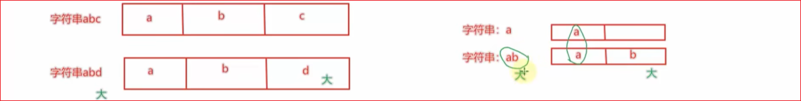

```python
print('abc' > 'abd')
```

# 文件[待办]

# 异常

异常：程序运行过程出现了错误

```
Traceback (most recent call last):
  File "D:\Items\APEX_XPRAC\c-py-starter\test.py", line 543, in <module>
    points_sorted = sorted(points, keys=lambda point: point[1])
                    ^^^^^^^^^^^^^^^^^^^^^^^^^^^^^^^^^^^^^^^^^^^
TypeError: 'keys' is an invalid keyword argument for sort()
```

## 异常捕获

基本语法:
```python
try:
    可能发生错误的代码
except:
    如果出现异常执行的代码
```

eg

```python
try:
    res = 1/0
except:
    print("出现异常了")
```

```
出现异常了
```

## 捕获指定异常

基本语法:

```python
try:
    print(name)
except NameError as e:
    print('name变量名称未定义错误')
```

注意事项

- 如果尝试执行的代码的异常类型和要捕获的异常类型不一致，则无法捕获异常。
- 一般try下方只放一行尝试执行的代码。

```python
try:
    res = 1/0
except ZeroDivisionError as ex:
    print(f"出现异常了{ex.__getstate__()}")
```

```
出现异常了None
```

## 捕获多个异常

当捕获多个异常时，可以把要捕获的异常类型的名字，放到except后，并使用元组的方式进行书写。

```python
try:
    print(1/0)
except (NameError, ZeroDivisionError):
    print('ZeroDivision错误..)
```

```python
try:
    res = 1 / 0
except (NameError, ZeroDivisionError) as e:
    print(f"出现异常了{e.__getstate__()}")
```

## 捕获所有异常

```python
try:
    print(1/0)
except Exception as e:
    print('...')
```

```python
try:
    print(1/0)
except:
    print('...')
```

## 异常else

else表示的是如果没有异常要执行的代码。

```python
try:
    print(1)
except Exception as e:
    print(e)
else:
    print('我是else，是没有异常的时候执行的代码')
```

```
1
我是else，是没有异常的时候执行的代码
```

## finally

finally表示的是无论是否异常都要执行的代码，例如关闭文件

```python
try:
    f = open('test.txt', 'r')
except Exception as e:
    f = open('test.txt', 'w')
else:
    print('没有异常，真开心')
finally:
    f.close()
    print('999111')
```

```
999111
```

## 异常的传递

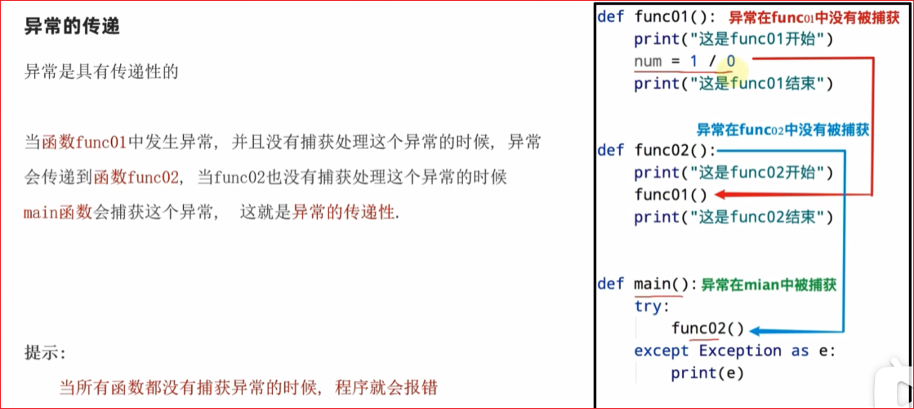

# python模块

## 什么是模块

Python 模块(Module)是以.py 结尾的Python 文件，模块能定义函数，类和变量，模块里也能包含可执行的代码，模块名就是python文件的文件名不带后缀

模块的作用：python中有很多各种不同的模块，每一个模块都可以帮助我们快速的实现一些功能，比如实现和时间相关的功能就可以使用time模块，我们可以认为一个模块就是一个工具包，每一个工具包中都有各种不同的工具供我们使用进而实现各种不同的功能.

大白话：模块就是一个Python文件，里面有类、函数、变量等，我们可以拿过来用(导入模块去使用)

## 模块的导入方式

模块在使用前需要先导入 导入的语法如下:

```python
[from 模块名] import [模块 | 类 |变量 | 函数 |*][as 别名]
```

常用的组合形式如:

- import 模块名
- from 模块名import 类、变量、方法等
- from 模块名 import *
- import 模块名 as 别名
- from 模块名 import 功能名 as 别名

[]中的内容表示可选，但import必须要有

```python
# import 模块名
import time
time.sleep(3) #通过 模块名.功能名方式使用sleep
print('222')
```

```python
# from 模块名 import 功能名
from time import sleep
sleep(2) #直接通过功能名使用sleep
print('ert')
```

```python
# from 模块名 import *
from time import * # 导入time模块的所有功能
sleep(2) #直接通过功能名使用sleep
print('ert')
```

```python
# import 模块名 as 别名
import time as tt
tt.sleep(3) #通过 别名.功能名方式使用sleep
print('222')
```

```python
# from 模块名 import 功能名 as 别名
from time import sleep as slp
slp(2) #直接通过别名使用slp
print('ert')
```

注意事项:

- from可以省略，直接import即可
- as别名可以省略
- 通过`.`来确定层级关系
- 模块的导入一般写在代码名件的开头位置
- 当导入多个模块，且模块内有同名功能，当调用同名的功能时，实际调用的是后面导入模块的功能

## 自定义模块

**\__name__变量**

当一个模块A中有函数调用时（可能时开发人员测试使用），另一个模块B引用该模块A时，即使只是导入，并未使用导入模块A的功能，执行模块B，模块A开始执行，模块A调用的方法也会执行。

如何避免：模块A调用方法时使用\__name__变量。

原理：\__name__是python的内置遍变量，当直接右键执行模块A时，A中 name的值被标记为`__main__`，而当导入时name的值不是`__main__`

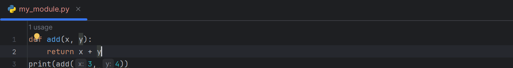

导入

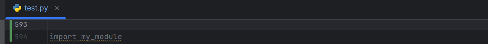

执行B的结果

```
7
```

解决

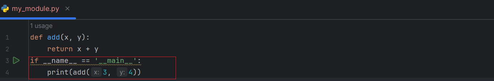

**\__all__变量**

如果一个模块文件中有\__all__变量，当使用`from xxx import *`导入时，只能导入  all  列表中的元素，* 通过all变量列表中的元素控制能导入的功能，总之控制import *导入的内容

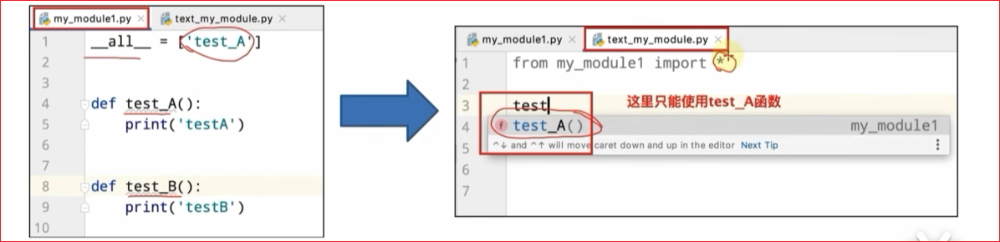

my_all_test模块

```python
__all__ = ['abstract']


def abstract(x, y):
    return x - y


def my_add(x, y):
    return x + y
```

test模块

```python
y = my_all_test.abstract(1, 2) 
x = my_all_test.my_add(1, 2) # 可以使用
print(y)
print(x)
abstract(1, 2)
my_add(1, 2) # 不可以使用
```

```
-1
3
Traceback (most recent call last):
  File "D:\Items\APEX_XPRAC\c-py-starter\test.py", line 604, in <module>
    my_add(1, 2)
    ^^^^^^
NameError: name 'my_add' is not defined
```

# python包

## 什么是Python包

从物理上看，包就是一个文件夹，在该文件夹下包含了一个 \__init__.py 文件，该文件夹可用于包含多个模块文件

从逻辑上看，包的本质依然是模块

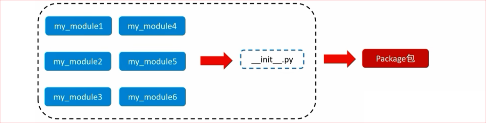

包的作用：当我们的模块文件越来越多时，包可以帮助管理这些模块，包的作用就是包含多个模块，但包的本质依然是模块

**有 \__init__.py文件就是包，没有该文件就是文件夹**

Python包中，\__init__.py文件控制着包的导入行为

## 导入包

方式一:

```python
import 包名.模块名
import 包名.模块名.目标
```

```python
import mypack.my_module_1
import mypack.my_module_2
mypack.my_module_1.x_func()
mypack.my_module_2.y_func()
```

方式二：

\__init__.py文件中定义all变量，控制import * 的导入

```python
__all__ = ['my_module_1']
```

```python
from 包名 import 模块名
from 包名.模块名 import 目标
```

```python
from mypack import *
my_module_1.x_func()
my_module_2.y_func() #报错
```

## 安装第三方包

一个包就是一堆同类型功能的集合体，在Python程序的生态中，有许多非常多的第三方包(非Python官方)，可以极大的帮助我们提高开发效率，如:

- 科学计算中常用的：numpy包
- 数据分析中常用的：pandas包
- 大数据计算中常用的：pyspark、apache-flink包
- 图形可视化常用的：matplotlib、pyecharts
- 人工智能常用的：tensorflow

**pip安装**

第三方包的安装非常简单，我们只需要使用Python内置的`pip程序`即可

打开命令提示符程序，在里面输入：`pip install 包名称`，即可通过网络快速安装第三方包

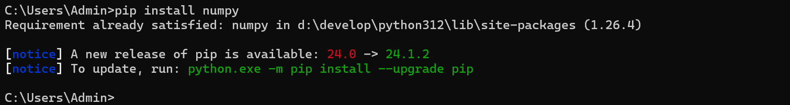

通过指定网站获获取包并安装

```
pip install -i https://pypi.tuna.tsinghua.edu.cn/simple 包名称
```

**pycharm安装包**

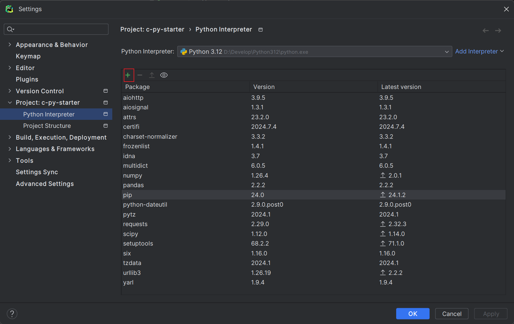

# JSON数据转换

通过 json.dumps(data)方法把python数据转化为了json数据，如果有中文可以带上ensure_ascii=False参数来确保中文正常转换

```python
json_str = json.dumps(data, [ensure_ascii=False])
```

通过 json.loads(data)方法把josn数据转化为了 python列表或字典

```python
py_data = json.loads(data)
```

# pyecharts【待办】

# 面向对象

## 类的定义使用

**类定义语法**

```python
class 类名: # class是关键字，表示要定义类了
    类的属性 # 类的属性，即定义在类中的变量(成员变量)
    类的行为 # 类的行为，即定义在类中的函数(成员方法)
```

**创建对象语法**

```python
对象 = 类名()
```

**成员方法定义语法**

在类中定义成员方法和定义函数基本一致，但仍有细微区别:

```python
def 方法名(self，形参1，.....·，形参N):
    方法体
```

可以看到，在方法定义的参数列表中，有一个self关键字

self关键字是成员方法定义的时候，必须填写的。

- 它用来表示类对象自身的意思
- 当我们使用类对象调用方法的是，self会自动被python传入
- 在方法内部，想要访问类的成员变量，必须使用self，调用的时候可以当作self不存在，不需要传入

```python
class Studen:
    # 属性
    name = None
    age = None
    # 方法
    def say_hi(self):
        print(f"hello， 我是{self.name}")

    def say_hi2(self, msg):
            print(f"hello， 我是{self.name},{msg}")


stu = Studen()
stu.name = '啥子'
stu.age = 999
stu.say_hi()
stu.say_hi2('dsd')
```

```
hello， 我是啥子
hello， 我是啥子,dsd
```

## 构造方法

Python类可以使用：\__init()__方法，称之为构造方法。可以实现:

- 在创建类对象（构造类）的时候，会自动执行
- 在创建类对象（构造类）的时候，将传入参数自动传递给init方法使用

```python
class Studen:
    # 属性 使用构造方法 这里的属性声明可以省略
    # name = None
    # age = None

    # 构造方法
    def __init__(self, name, age):
        self.name = name
        self.age = age

    # 方法
    def say_hi(self):
        print(f"hello， 我是{self.name}")

    def say_hi2(self, msg):
        print(f"hello， 我是{self.name},{msg}")


stu = Studen('zhangsna', 99999)
print(f"名字：{stu.name}，年龄：{stu.age}")
stu.say_hi()
stu.say_hi2('dsd')
```

```
名字：zhangsna，年龄：99999
hello， 我是zhangsna
hello， 我是zhangsna,dsd
```

## 魔术方法

1、\__str__字符串方法：控制print对象时，对象的输出格式

```python
class Studen:
    # 属性
    # name = None
    # age = None

    # 构造方法
    def __init__(self, name, age):
        self.name = name
        self.age = age

    # 方法
    def say_hi(self):
        print(f"hello， 我是{self.name}")

    def say_hi2(self, msg):
        print(f"hello， 我是{self.name},{msg}")
    def __str__(self):
        return f"name={self.name}, age={self.age}"


stu = Studen('zhangsna', 99999)
print(stu)
```

```
name=zhangsna, age=99999
```

2、\__lt__小于符号的比较：定义对象大小比较的规则

```python
class Studen:
    # 构造方法
    def __init__(self, name, age):
        self.name = name
        self.age = age

    def __lt__(self, other):
        return self.age < other.age

stu_1 = Studen('zhang', 20)
stu_2 = Studen('lee', 33)
print(stu_1 > stu_2)
```

```
False
```

3、\__le__小于等于符号的比较

```python
class Studen:
    # 属性
    # name = None
    # age = None

    # 构造方法
    def __init__(self, name, age):
        self.name = name
        self.age = age

    def __le__(self, other):
        return self.age <= other.age


stu_1 = Studen('zhang', 20)
stu_2 = Studen('lee', 33)
print(stu_1 >= stu_2)
```

4、\__eq__比较运算符

不实现\__eq__方法，默认比较的是内存地址

```python
class Studen:
    # 属性
    # name = None
    # age = None

    # 构造方法
    def __init__(self, name, age):
        self.name = name
        self.age = age

    def __eq__(self, other):
        return self.age == other.age and self.name == other.name
```

## 封装

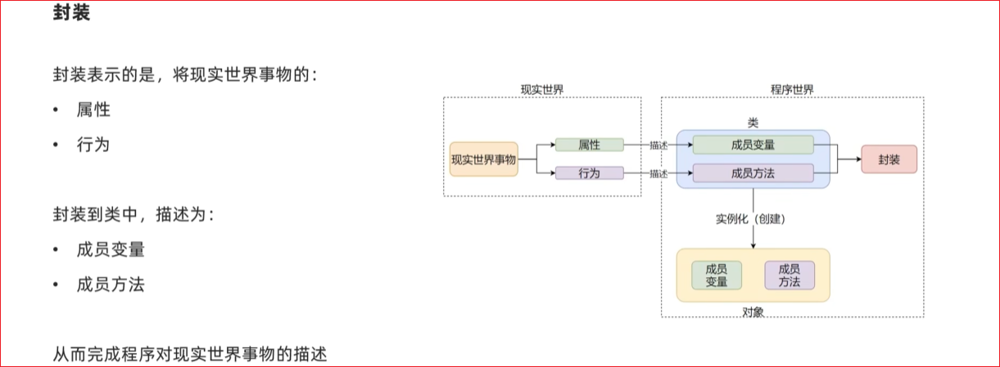

类中提供了私有成员的形式来支持。

- 私有成员变量
- 私有成员方法

定义私有成员的方式非常简单，只需要以\__开头即可完成私有成员的设置

- 私有成员变量：变量名以\__开头(2个下划线)
-  私有成员方法：方法名以\__ 开头(2个下划线)

私有成员的访问限制?

- 类对象无法访问私有成员
- 类中的其它成员可以访问私有成员

## 继承

单继承

```python
class 类名(父类名):
    成员变量
    成员方法
```

多继承

```python
class 类名(父类1, 父类2, 父类3, 父类4,……父类N):
    成员变量
    成员方法
```

```python
class MyPhone(Phone, NFCReader, RemoteControl):
    pass
```

pass表示MyPhone类体内容是空的，没有其他属性方法

**一个类继承多个类，按照顺序从左向右依次继承多继承中，如果父类有同名方法或属性，先继承的优先级高于后继承**

**复写**

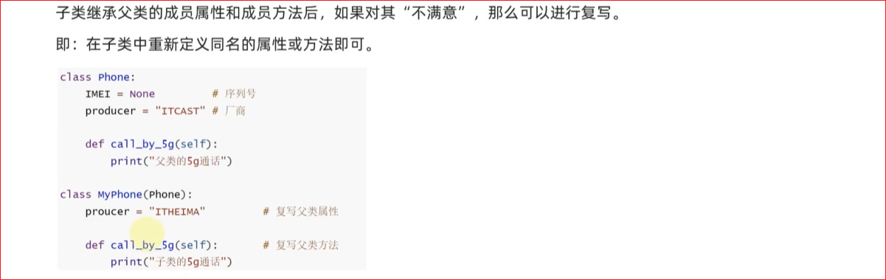

**调用父类同名成员**

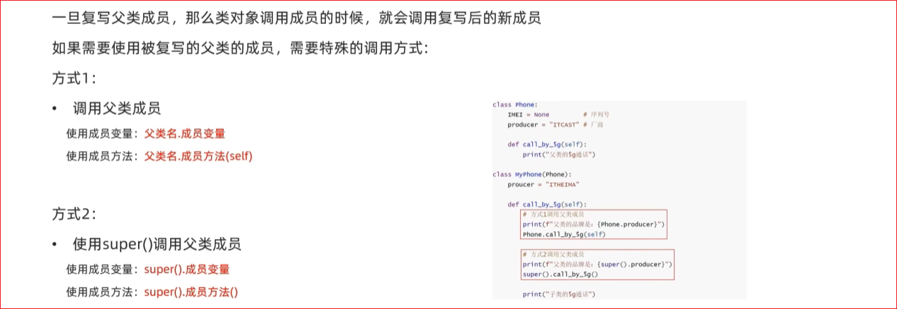

## 类型注解

### 类型注解

Python在3.5版本的时候引入了类型注解，以方便静态类型检查工具，IDE等第三方工具。

类型注解：在代码中涉及数据交互的地方，提供数据类型的注解(显式的说明)。

类型注解并不会真正的对类型做验证和判断。也就是，类型注解仅仅是提示性的，不是决定性的

主要功能：

- 帮助第三方IDE工具(如PyCharm)对代码进行类型推断，协助做代码提示

- 帮助开发者自身对变量进行类型注


支持:

- 变量的类型注解
-  函数(方法)形参列表和返回值的类型注解

### 变量类型注解

**为变量设置类型注解**

基础语法：

```python
变量: 类型
```

```python
# 基础数据类型注解
var_1: int =10
var_2: float = 3.1415926
var_3: bool = True
var_4: str ="itheima'
```

```python
# 对象类型注解
class student:
	pass
stu: student=student()
```

```python
my_list: list = [1, 2, 3]
my_tuple: tuple = (1, 2, 3)
my_set: set = {1, 2, 3}
my_dict: dict = {"itheima": 666}
my_str: str = "itheima"
```

```python
# 容器类型注解--详细
my_list: list[int] = [1, 2, 3]
my_tuple: tuple[str, int, bool] = ("itheima", 666, True)
my_set: set[int] = {1, 2, 3}
my_dict: dict[str, int] = {"itheima": 666}
```

注意:

- 元组类型设置类型详细注解，需要将每一个元素都标记出来
- 字典类型设置类型详细注解，需要2个类型，第一个是key第二个是value

**注释中设置类型注解**

```python
var_1 = random.randint(1,10) 	# type: int
var_2 = json.loads(data) 		# type: dict[str, int]
var_3 = func() 				 	# type: student
```

### 函数方法类型注解

形参注解语法：

```python
def 函数方法名(形参名: 类型, 形参名:类型, …… ):
	pass
```

eg：

```python
def addx(x: int, y: int):
    return x + y
```

返回值注解语法：

```python
def 函数方法名(形参名: 类型, 形参名:类型, …… ) -> 返回值类型:
	pass
```

eg：

```python
def addx(x: int, y: int) -> int:
    return x + y


addx(2, 3)
```

### Union联合类型注解

使用`union[类型, …… , 类型]`，可以定义联合类型注解，Union联合类型注解，在变量注解、函数(方法)形参和返回值注解中，均可使用。

```python
# 导包
from typing import Union
my_list:list[Union[str, int]]=[l,2,"itheima", "itcast"]
my_dict: dict[str, Union[std, int]]= {"name":"周杰轮"，"age": 31}
```

```python
def func(data: Union[int, str]) -> Union[int, str]:
	pass
```

## 多态

多态：指的是多种状态，即完成某个行为时，使用不同的对象会得到不同的状态。

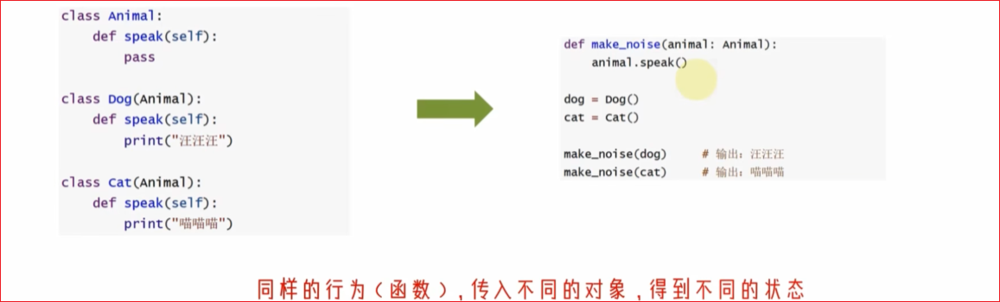

**抽象类**

`抽象类`：含有抽象方法的类称之为抽象类

`抽象方法`：方法体是空实现的(pass)称之为抽象方法

作用：多用于做顶层设计(设计标准)，以便子类做具体实现。也是对子类的一种软性约束，要求子类必须复写(实现)父类的一些方法

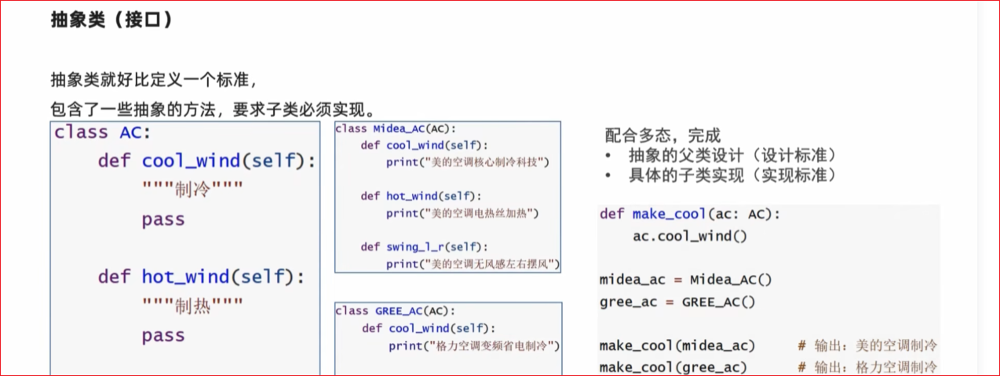

# python操作mysql【待办】

# pySpark【待办】

# 闭包

```python
account_amount = 0
def atm(num, deposit=True):
    global account_amount
    if deposit:
        account_amount += num
        print(f'存款{num}元，账户余额{account_amount}元')
    else:
        account_amount -= num
        print(f'取款{num}元，账户余额{account_amount}元')
        
atm(300)
atm(400)
atm(200, False)
```

存在问题

- 代码在命名空间上(变量定义)不够干净、整洁
- 全局变量account_amount有被修改的风险

## 闭包定义

闭包：在函数嵌套的前提下，内部函数使用了外部函数的变量，并且外部函数返回了内部函数，把使用外部函数变量的内部函数称为闭包

简单闭包例子

```python
def outer(logo):
    def inner(msg):
        print(f'<{logo}> {msg} <{logo}>')
    return inner
inr = outer('html') # inr是一个函数
f2 = inr('what') # 调用inr函数
f3 = inr("777") # 调用inr函数
```

```
<html> what <html>
<html> 777 <html>
```

修改外部函数变量的值，需要使用`nonlocal`关键字修饰外部函数的变量才可在内部函数中修改它

```python
	def ch_outer(num1):
    def ch_inner(num2):
        nonlocal num1
        num1 += num2
        print(num1)
    return ch_inner
  
fn_1 = ch_outer(10)
fn_1(10)
fn_1(20)
fn_1(30)
```

## 存款代码改进

```python
def account_static(init_amount=0):
    def atm(num, deposit=True):
        nonlocal init_amount
        if deposit:
            init_amount += num
            print(f'账户存款:{num},账户余额{init_amount}')
        else:
            init_amount -= num
            print(f'账户取款:{num},账户余额{init_amount}')
    return atm

fn1 = account_static()
fn1(1000)
fn1(200)
fn1(250, False)
```

```
账户存款:1000,账户余额1000
账户存款:200,账户余额1200
账户取款:250,账户余额950
```

使用闭包改进后，内部函数能使用外部函数的变量，并进行修改，外部函数的变量全局不能做修改

## 闭包优缺点

优点：

- 无需定义全局变量即可实现通过函数，持续的访问、修改某个值
- 闭包使用的变量的所用于在函数内，难以被错误的调用修改

缺点：

-  由于内部函数持续引用外部函数的值，所以会导致这一部分内存空间不被释放,一直占用内存

# 装饰器

装饰器其实也是一种闭包，其功能就是在`不破坏目标函数原有的代码和功能的前提下,为目标函数增加新功能`

需求：sleep()函数执行前后，输出"开始睡觉"，在sleep()函数执行完毕后输出"结束睡觉"

```python
def sleep():
    import random
    import time
    print('睡眠中……')
    time.sleep(random.randint(1, 3))
```

一般做法

```python
print("开始睡觉")
sleep()
print("结束睡觉")
```

存在问题：不够优雅

使用闭包改进

```python
def sleep():
    import random
    import time
    print('睡眠中……')
    time.sleep(random.randint(1, 3))

def s_out(func):
    def s_inner():
        print('开始睡觉')
        func()
        print('结束睡觉')

    return s_inner

fn = s_out(sleep)# 注意调用传入函数时，不带括号
fn()
```

装饰器语法糖写法

```python
def x_out(func):
    def x_inner():
        print("开始睡觉")
        func()
        print("结束睡觉")
    return x_inner

@x_out
def sleeping():
    import random
    import time
    print("正在睡觉")
    time.sleep(random.randint(1, 2))

sleeping()

```

# 设计模式

## 单例模式

```python
class Car:
    producer = None
    coloer = None
car_1 = Car()
car_2 = Car()
print(car_1)
print(car_2)
```

```
<__main__.Car object at 0x100601e20>
<__main__.Car object at 0x1005727e0>
```

创建类的实例后，就可以得到一个完整的、独立的类对象。

通过print语句可以看出,它们的内存地址是不相同的，即t1和t2是完全独立的两个对象。

某些场景下我们需要一个类无论获取多少次类对象，都仅仅提供一个具体的实例用以节省创建类对象的开销和内存开销，比如某些工具类，仅需要1个实例，即可在各处使用
，这就是单例模式所要实现的效果。


单例模式 (Singleton Pattern)是一种常用的软件设计模式,该模式的主要目的是确保某一个类只有一个实例存在。

在整个系统中，某个类只能出现一个实例时，单例对象就能派上用场。

- 定义：保证一个类只有一个实例,并提供一个访问它的全局访问点
- 适用场景：当一个类只能有一个实例，而客户可以从一个众所周知的访问点访问它时。

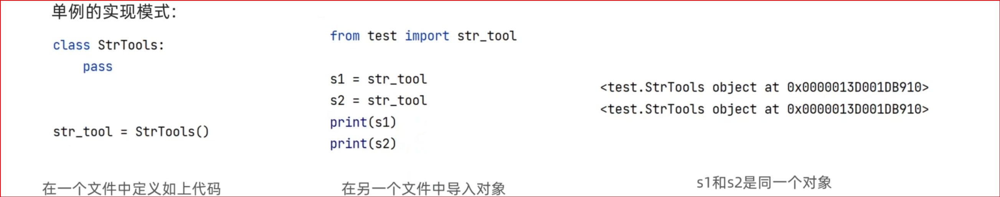

单例模式的优点：

- 节省内存
- 减少创建对象的开销

## 工厂模式

当需要大量创建一个类的实例的时候，可以使用工厂模式。即从原生的使用类的构造去创建对象的形式迁移到，基于工厂提供的方法去创建对象的形式。

传统创建模式

```python
class Person:
    pass

class Teacher(Person):
    pass

class Worker(Person):
    pass

class Farmer(Person):
    pass

teacher = Teacher()
worker = Worker()
farmer = Farmer()
```

工厂模式

```python
class PersonFactory:
    def get_person(self, person_type):
        if person_type == 'w':
            return Worker()
        elif person_type == 't':
            return Teacher()
        else:
            return Farmer()

factory = PersonFactory()
worker = factory.get_person('w')
teacher = factory.get_person('t')
farmer = factory.get_person('f')
print(worker)
print(teacher)
print(farmer)
```

好处

- 大批量创建对象的时候有统一的入口，易于代码维护
- 当发生修改，仅修改工厂类的创建方法即可
- 符合现实世界的模式，即由工厂来制作产品(对象)

# 多线程并行执行【代办】

# 多线程编程【待办】

# socket网络编程【待办】

# 正则表达式【待办】

# 递归【待办】
