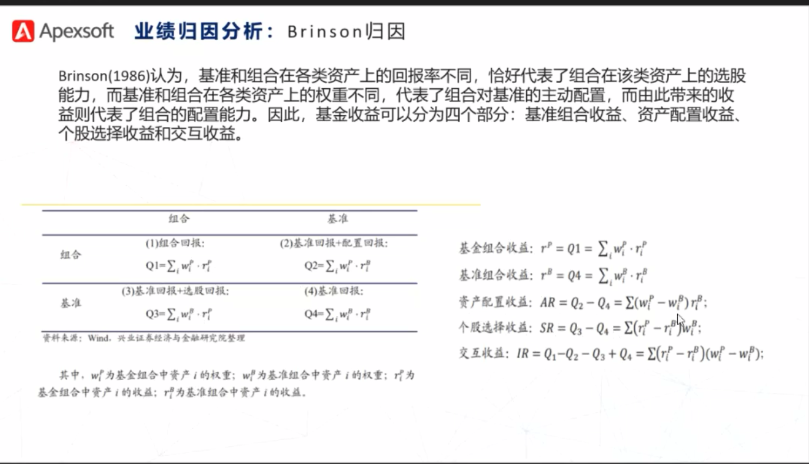
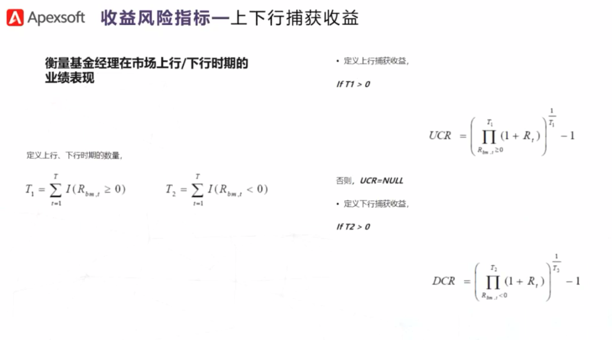
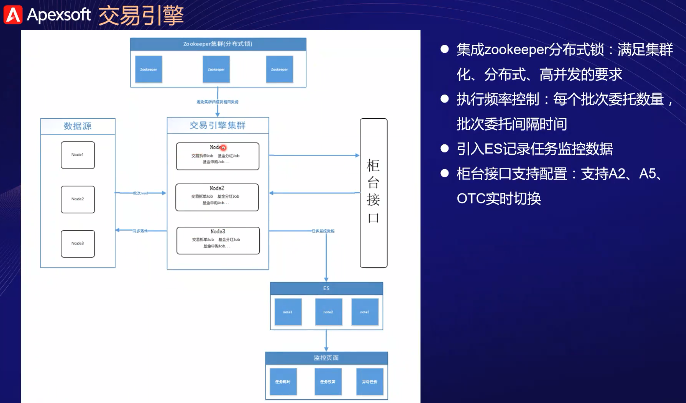
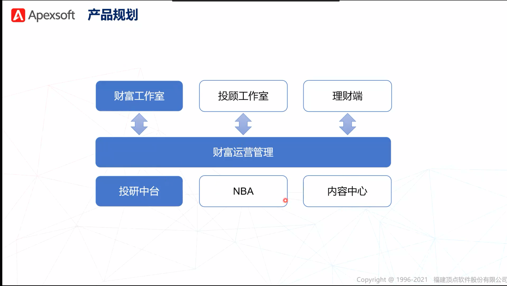
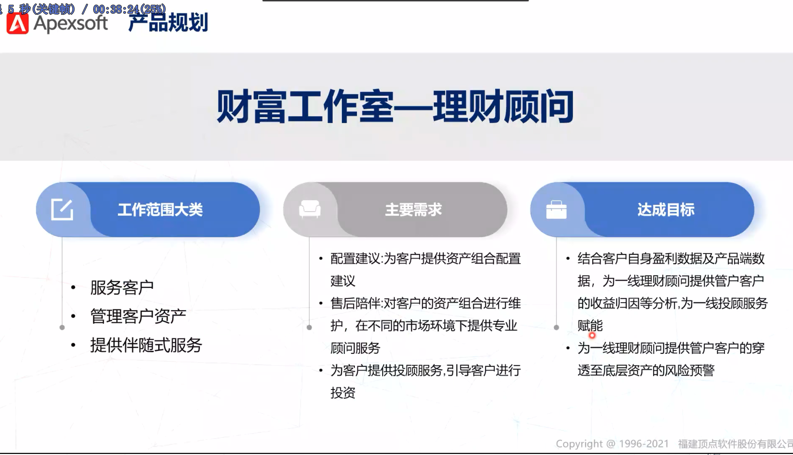

# 名词术语

怎么开通基金交易账户？
场外基金账户只需要在各销售平台开户即可，找到开户后按照流程操作即可，准备好身份证和银行卡
场内基金需要在券商平台开户，找到开户后按流程操作即可，准备好身份证和银行卡。
场外基金是指在场外市场交易的基金，场外销售平台有天天基金、支付宝、微信、银行、券商等，场
内基金是指在证券交易所交易的基金，只能通过券商平台购买。

基金交易账户是银行为投资者设立的用于在本行进行基金交易的账户，记载投资者进行基金交易活动的情况和所持有的基金份额。TA账户是投资者持有某基金管理公司基金的基金账号，主要用来记录投资者基金账户的情况，其中，TA是“Transfer Agent'”的简称。
投资人在同一家银行购买不同公司的基金，就会有几个基金公司的TA账户，但是只有这家银行的交易账户。反过来，如果投资者在不同的银行购买同一家公司的基金，就会有几个交易账户，但是TA账户始终只有一个。交易账户是与银行相关的，TA账号是与基金公司相关的。

**证券**

是多种经济权益凭证的统称，也指专门的种类产品，是用来证明券票持有人享有的某种特定权益的法律凭证。

按证券所载内容可以分为： 　
1.货币证券，可以用来代替货币使用的有价证券则商业信用工具，主要用于企业之间的商品交易、劳务报酬的支付和债权债务的清算等，常见的有`期票、汇票、本票、支票`等。 　
2.资本证券，它是指把资本投入企业或把资本供给企业或国家的一种书面证明文件，资本证券主要包括股权证券（所有权证券）和债权证券，如各种`股票和各种债券`等。 　　
3.货物证券，是指对货物有提取权的证明，它证明证券持有人可以凭证券提取该证券上所列明的货物，常见的有`栈单、运货证书、提货单`等。

股票也属于证券，基金也属于证券

**OTC**:场外交易市场

这些市场因为没有集中的统一交易制度和场所，因而把它们统称为场外交易市场，又称柜台交易或店头交易市场，指在交易所外由证券买卖双方当面议价成交的市场。它没有固定的场所，其交易主要利用电话、电报、传真及计算机网络进行，交易的证券以不在交易所上市的证券为主。

**资产配置**

资产配置是指根据投资需求将投资资金在不同资产类别之间进行分配，通常是将资产在低风险、低收益证券与高风险、高收益证券之间进行分配。

**回测**

在金融领域，回测通过测试交易策略，并根据历史数据的表现来核查其可行性。换句话说，它使用过去的数据来查看策略的执行情况。如果回测显示出良好的结果，则交易者或投资者可以继续进行并将该策略应用于实际环境。

**基准收益率：**

也称基准折现率，是企业或行业或投资者以动态的观点所确定的、可接受的投资项目最低标准的收益水平，即选择特定的投资机会或投资方案必须达到的预期收益率。是投资决策者对项目资金时间价值的估值。基准收益率的确定既受到客观条件的限制，又有投资者的主观愿望。基准收益率表明投资决策者对项目资金时间价值的估价，是投资资金应当获得的最低盈利率水平，是评价和判断投资方案在经济上是否可行的依据，是一个重要的经济参数。

[基准收益率是通过综合考虑政策、资金来源、机会成本、国家风险等因素做出的最低标准水平收益率评估，是在投资之前计算确定的，而不是投资一段时间后根据投资结果计算确定的]()

**组合收益率**

就是组成投资组合的各种投资项目收益率的加权平均数。比如，某投资组合由两种权重相同的证券组成，A证券收益率15%，标准离差12.1；B证券收益率10%，标准离差10.7。那么投资组合的收益率=15%×50%+10%×50%=12.5%。

**超额收益率**

是指超过正常(或预期)收益率的收益率，它等于某日的收益率减去投资者(或市场)当日要求的正常(预期)收益率。

**最大回撤率**

基金回撤是指，在某一特定的时期内，账户净值由最高值向后推移，直到净值回落到最低值时，期间净值减少的幅度。通俗的讲，`回撤就是跌幅`。

最大回撤率是指在选定周期内任一历史时点往后推，产品净值走到最低点时的收益率回撤幅度的最大值。`最大回撤用来描述买入产品后可能出现的最糟糕的情况`。

公式可以这样表达：D为某一天的净值，i为某一天，j为i后的某一天，Di为第i天的产品净值，Dj则是Di后面某一天的净值，drawdown就是最大回撤率

drawdown=max（（Di-Dj）/Di），其实就是对每一个净值进行回撤率求值，然后找出最大的。

**产品净值**

指的是理财产品当前每一份额的价值。这其中包含了4个关键信息：

1、当前净值的计算方式为：理财产品单位净值=该理财产品当前价值/该理财产品当前份额；

2、净值型理财产品的初始净值为1元；

3、当理财产品有盈利或者亏损的时候，产品净值会相应向上或向下浮动；

4、投资者获得的实际收益与产品净值有关。

**单位净值 **：基金价格

**累计净值**：单位净值 + 过往分红

一般来说，基金在每个工作日都会公布上一个工作日的净值，净值的概念就是基金的价格，投资者按照单位净值来申购。累计净值就是基金单位净值+过往分红，反映该基金成立以来的总体收益情况。

**交割**

交割是结算过程中，投资者与[证券商](https://baike.baidu.com/item/证券商/10840366)之间的[资金结算](https://baike.baidu.com/item/资金结算/2185075)。沪深两市除B股外的上市交易证券（A股、基金、[债券](https://baike.baidu.com/item/债券/499051)），都实行T+1[交割制度](https://baike.baidu.com/item/交割制度/3997418)。T+1制度是指当日买入的股票不能在当日卖出，资金收付与证券交割只能在成交日的下一个营业日进行，不能在当日从帐户中提取现金。

**建仓**：股票建仓指的是在自己确定该股票走势上扬后，第一次买入该股票。或者股票下跌时，在某一部位卖出手中股票，开一个股票的账户。

**平仓**：股票平仓就是将手里面的股票抛售出去,但是不一定能马上卖得掉,要有人接你的股票才能平掉。这个就是平仓。

**持仓**：投资者可以根据市场行情和个人意愿，自愿地决定买入或卖出股票。而投资者买入股票，则称之为"持仓"。

> 持仓是指持有证券，比如投资股票时账户中持有的股票；投资基金时账户中持有的基金等。在投资股票时买入一只股票叫做建仓；如果发现股票未来增长潜力巨大继续买入时叫做增仓；在股票股价下跌时买入叫做补仓；卖出股票叫做平仓；如果亏损状态下卖出股票叫做斩仓。
> 另一种持有期货合约，是在实物交割或者现金交割到期之前，投资者可以根据市场行情和个人意愿，自愿地决定买入或卖出期货合约。而投资者（做多或做空）没有作交割月份和数量相等的逆向操作（卖出或买入），持有期货合约，则称之为“持仓”。在黄金等商品期货操作中，无论是买还是卖，凡是新建头寸都叫建仓。操作者建仓之后手中就持有头寸，这就叫持仓。

**头寸**

也称为"头衬"就是款项的意思，是金融界及商业界的流行用语。如果银行在当日的全部收付款中收入大于支出款项，就称为"多头寸"，如果付出款项大于收入款项，就称为"缺头寸"。对预计这一类头寸的多与少的行为称为"轧头寸"。到处想方设法调进款项的行为称为"调头寸"。如果暂时未用的款项大于需用量时称为"头寸松"，如果资金需求量大于闲置量时就称为"头寸紧"。

**波动率**

是金融资产价格的波动程度，是对[资产收益率](https://baike.baidu.com/item/资产收益率/2429091)[不确定性](https://baike.baidu.com/item/不确定性/8250115)的衡量，用于反映[金融资产](https://baike.baidu.com/item/金融资产/4468342)的风险水平。波动率越高，金融资产价格的波动越剧烈，资产收益率的不确定性就越强；波动率越低，金融资产价格的波动越平缓，资产收益率的确定性就越强。

**夏普比率**

是指投资组合超额收益的增长对单位风险增长的程度（即投资风险每增加1单位，超额收益增加的份额）。

夏普比率是投资组合超额收益与风险的比率，它通过测量超额收益（投资组合收益率与无风险资产收益率之差）与总风险之比衡量经风险调整后投资组合的绩效，其基本原理源于资本市场线的分析框架。

举例：乐乐是基金公司的投资经理，筛选判断基金时，非常关注夏普比率这一指标，新来的实习生请教如何计算，乐乐举例说：假设国债利率是3%（既无风险回报率3%），投资组合预期回报利率是13%、标准偏差是5%，超出无风险投资回报为=13%-3%=10%，夏普比率=10%/5%=2，意味着投资风险每增长1单位，可产生超额收益2单位。实习生继续追问：“净值增长率越高的基金是不是越好？”乐乐赶紧纠正：“当然不是，高净值增长率是因为承受较高风险，好的基金要同时兼顾风险和收益，这也是夏普比率评估基金绩效的重要所在啊！”

**标准偏差**

统计学名词。一种`度量数据分布的分散程度`之标准，用以衡量数据值偏离算术平均值的程度。标准偏差越小，这些值偏离平均值就越少，反之亦然。

(相关名词：标准差、标准方差、协方差)

**穿透**

穿透的意思为`看透实质`，具体到金融行业的语境即是核准申请人和管理人的资质。

以私募基金为例，私募基金要求满足穿透性原则。什么意思呢？私募基金法规定私募基金的申请人必须满足金融资产不低于300万近三年年薪不低于50万的要求。私募基金要针对申请人的资质进行核查，这个核查的过程叫做穿透，核查能够保证避免“一人名义多人出资”的情况发生。

**基金：**
证券投资基金是指通过发售基金份额，将众多投资者的资金集中起来，形成独立财产，由基金托管人托管，基金管理人管理，以投资组合的方法进行证券投资的一种利益共享、风险共担的集合投资方式。简言之，把你的钱交给别人打理。

**混合基金**

是指同时投资于股票、债券和货币市场等工具，没有明确的投资方向的基金。其风险低于股票基金，预期收益则高于债券基金。它为投资者提供了一种在不同资产之间进行分散投资的工具，比较适合较为保守的投资者。

**指数基金**

指数基金(Index Fund)，顾名思义就是以特定指数（如沪深300指数、标普500指数、纳斯达克100指数、日经225指数等）为标的指数，并以该指数的成份股为投资对象投资对象/4157655)，通过购买该指数的全部或部分成份股构建投资组合，以追踪标的指数表现的基金产品。

**基金投资风格**

决定了基金经理如何选择股票、如何分析股票，何时买卖以及买卖的频率。而市场上，最广为人知，最重要的两种投资风格是：成长型和价值型投资风格。

**价值型投资风格**：基金经理更热衷于“**低买高卖**”的投资策略，寻找并买入那些“物美价廉”的股票。价值型风格的基金经理，喜欢公共事业、金融、传统工矿业这样较为稳定的行业。

**成长型投资风格**：基金经理更注重**公司的成长性**，较少考虑股票的价格。“成长”是指收入的增长和净利润的增长。成长型风格的基金经理，青睐那些稳定成长的行业，如医药、高科技行业等。

**大、中、小盘基金**

大，中，小盘股票基金是按股票的市值规模进行划分的，有两种分类方法。

方法一：按占市场总市值的比例分。把所有股票基金按市值从大到小排列：

排在最前面的，累计市值之和占总市值50%的公司归为大盘基金；

排在最后面的，累计市值之和占总市值20%的公司归为小盘基金；

排在中间的，累计市值之和占总市值30%的公司归为中盘基金。

方法二：按公司的绝对市值划分。

绝对市值大于20亿为大盘基金；

绝对市值大于5亿为小盘基金；

绝对市值介于5-20亿为中盘基金。

**基金TA账户**

基金交易账户是银行为投资者设立的用于在本行进行基金交易的账户，记载投资者进行基金交易活动的情况和所持有的基金份额。TA账户是投资者持有某基金管理公司基金的基金账号，主要用来记录投资者基金账户的情况，其中，TA是“Transfer Agent”的简称。

投资人在同一家银行购买不同公司的基金，就会有几个基金公司的TA账户，但是只有这家银行的交易账户。反过来，如果投资者在不同的银行购买同一家公司的基金，就会有几个交易账户，但是TA账户始终只有一个。交易账户是与银行相关的，TA账号是与基金公司相关的。

**公募投顾**

全称为“公开募集证券投资基金投资顾问”，是指试点机构可以接受客户委托，按照协议约定向客户提供基金投资组合策略建议。根据与客户协议约定的投资组合策略，试点机构可以在客户授权的范围内，代客户作出具体基金投资品种、数量和买卖时机的抉择，并代客户执行基金产品申购、赎回、转换等交易申请，开展管理型基金投资顾问服务。

**债券基金ABC**

债券基金后面的A是表示前端收费；B是后端收费；C是不收费，C申购时不收费，但是提取了管理费的。如果是长期投资就适合买A、B，如果短期就适合买C。

在实际的运作当中，开放式基金申购费的收取方式有两种，一种称为前端收费，另一种称为后端收费。前端收费指的是你在购买开放式基金时就支付申购费的付费方式。后端收费指的则是你在购买开放式基金时并不支付申购费，等到卖出时才支付的付费方式。

在基金的运作过程中，有一些必要的开支需基金承担，其中基金管理费和基金托管费是基金支付的主要费用。基金管理费是支付给基金管理人的管理报酬，其数额一般按照基金净资产值的一定比例，从基金资产中提取。基金管理人是基金资产的管理者和运用者，对基金资产的保值和增值起着决定性的作用。

# 投研资配

## 策略配置

SAA（Strategic Asset Allocation）

根据客户的风险偏好和流动性需要确定，一般来说是基于长期观点做出的长期资产配置。SAA的资产构成决定了组合绝大部分的风险和收益状况，有的研究说是九成，也有的说按风险贡献算接近100%。顾名思义，SAA是战略性的，不应频繁大幅调整。

TAA（Tactical Asset Allocation）

投资者想要在长期配置的基础上把握时机进行调整，获得更好的收益、更低的风险，这就需要TAA。

信息比率（Information Ratio)：以马克维茨的均异模型为基础，用来衡量`超额风险所带来的超额收益`。它表示`单位主动风险所带来的超额收益`。

下行风险是指未来股价走势有可能低于分析师或投资者预期的目标价位的风险

## 投研资配系统

策略组合：基于特定的策略建立的产品的组合，并非字面意思策略的组合。

基金组合：不根据特定的策略直接构建基金组合。

组合调仓：调仓时可使用自选池

## 基金

 

## 投资组合

大类资产是指某一撮具有类似性质的可投资金融资产。

1.权益类（主要就是股票市场）

权益类资产主要是指投资于股票、股票型基金、指数型基金、混合型基金等，这类资产的特点是。你享有这类品种的所有权，但其收益不能完全保证，一般情况下，其风险大于固定收益类。

2.固定收益类（债券、银行理财投资、P2P）

固定收益类，值得是投资者可以按照事先约定好的利息率获取收益的理财产品，是预期

债券是政府、金融机构、工商企业等直接向社会借债筹措资金是，向投资者发行，并承诺按一定利率支付利息并按约定条件偿还本金的债权债务凭证。

3.大宗商品

贵金属（黄金、白银等）、农产品、原油、化工品、黑色系金属、有色系金属等

这里以2005-2020年为例，黄金的年化收益率大致4.5%，原油年化收益率大致3%左右。

4.货币类

非货币性资产：如果资产在将来为企业带来的经济利益即货币金额是不固定的或不可确定的，则该资产是非货币性资产。

货币性资产：如果资产在将来为企业带来的经济利益即货币金额是固定的或可确定的，则该资产是货币性资产。

## 业务概述

基金调仓包括加仓和减仓。简单来说，就是把手里某些股票全部抛售或者抛售一部分，换成其他品种的股票叫调仓，也就是调整仓位的意思。

# 公募投顾业务

# 机构理财平台

