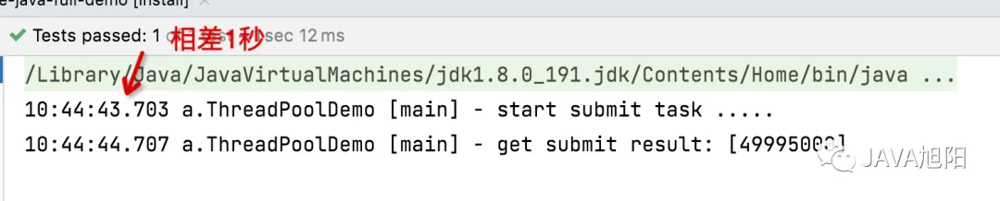
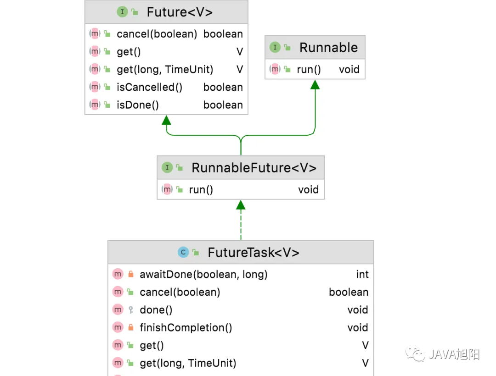
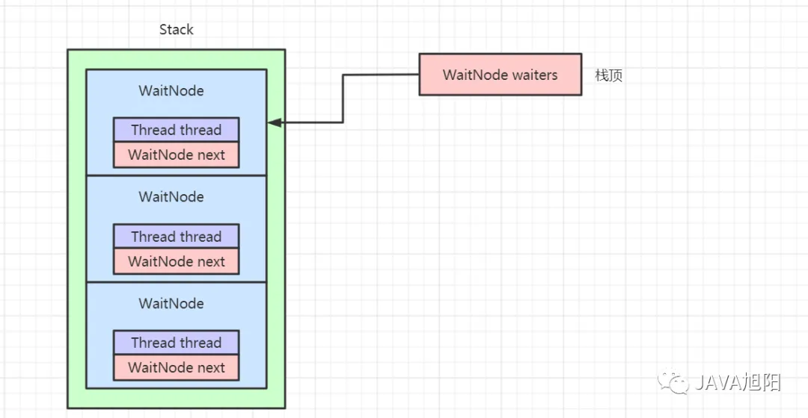
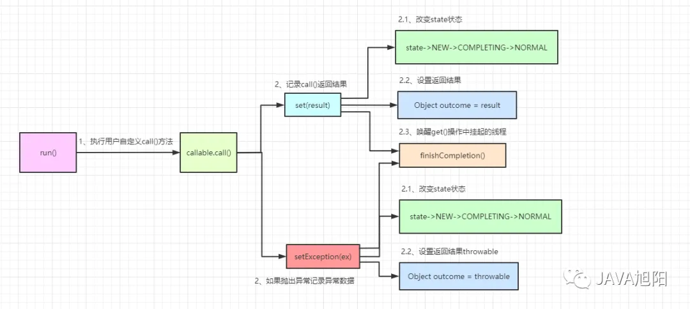

# 多线程GPT

# Java 的线程状态

1. **New（新建）:**
    - 当线程对象被创建时，线程处于新建状态。
    - 例如：**Thread thread = new Thread();**
2. **Runnable（可运行）:**
    - 当线程被 **start()** 方法调用后，线程进入可运行状态。它并不意味着线程一定在执行，只是表示线程可以被执行。
    - 例如：**thread.start();**
3. **Blocked（阻塞）:**
    - 当线程在等待监视器锁（synchronized块/方法）时，线程进入阻塞状态。
    - 例如：线程在同步块中调用了 **wait()** 方法。
4. **Waiting（等待）:**
    - 线程进入等待状态，等待其他线程的通知或中断。
    - 例如：线程在同步块中调用了 **Object.wait()** 方法。
5. **Timed Waiting（计时等待）:**
    - 线程等待具有超时时间的操作，等待一段时间后会自动恢复到 Runnable 状态。
    - 例如：线程在同步块中调用了 **Thread.sleep()** 或 **Object.wait(timeout)** 方法。
6. **Terminated（终止）:**
    - 线程执行完毕或者出现异常导致线程终止。
    - 例如：线程的 **run()** 方法执行完毕，或者线程抛出了未捕获的异常。

这些状态构成了Java线程的生命周期。请注意，线程的状态是动态变化的，线程可能在不同的时间处于不同的状态。

# 线程sleep期间

- 当线程调用 **sleep()** 方法时，它会释放 CPU 资源，让其他线程有机会执行
- 当一个线程调用 **sleep()** 方法时，它不会释放持有的对象锁。**sleep()** 方法是**Thread**类的一个静态方法，它使当前线程暂停执行指定的时间，但不会释放其持有的任何锁

# interrupt()方法有什么作用

**interrupt()** 方法是用于中断线程的 Java 方法。它的作用主要有两个方面：

1. **设置中断状态：interrupt()** 方法会设置线程的中断状态。它并不会真正中断一个正在运行的线程，而是给线程发送一个中断请求，将线程的中断状态置为 true。这样，线程的执行代码可以根据中断状态来判断是否中断，并采取相应的处理。
2. **中断阻塞状态：** 如果线程处于阻塞状态（如 **sleep**、**wait**、**join** 等），调用 **interrupt()** 方法会导致线程抛出 **InterruptedException** 异常，从而提前结束阻塞状态。这样可以用来优雅地终止一个阻塞线程。

在使用 **interrupt()** 方法时，需要注意以下几点：

- 如果线程没有处于阻塞状态，那么 **interrupt()** 方法只是设置线程的中断状态，并不会立即中断线程的执行。程序员需要在线程的执行代码中主动检查中断状态，以确定是否中断线程。
- 如果线程处于阻塞状态，**interrupt()** 方法会抛出 **InterruptedException** 异常，此时线程的中断状态会被清除。因此，在捕获 **InterruptedException** 后，需要重新设置线程的中断状态，以便在后续代码中检查中断状态。
- **interrupt()** 方法不会强制终止一个线程，而是提供了一种机制，让线程可以自行判断是否中断，并采取适当的处理。

总的来说，**interrupt()** 方法是用来协作线程之间的中断通知的机制，允许线程在适当的时候进行安全地终止。

# interrupted()与isInterrupted()区别

- ***interrupted()** 和 **isInterrupted()** 都是用于检查线程中断状态的方法，但它们之间有一些关键的区别：
1. **interrupted() 方法：**
    - 是 **Thread** 类的静态方法，可以通过 **Thread.interrupted()** 来调用。
    - 用于检查当前线程的中断状态，并且在检查完中断状态后会清除中断状态。
    - 如果线程中断状态为 true，则返回 true；否则返回 false。
    - 通过 **Thread.interrupted()** 调用后，中断状态会被重置为 false。
2. 示例：
3. **isInterrupted() 方法：**
    - 是 **Thread** 类的实例方法，可以通过 **thread.isInterrupted()** 来调用。
    - 用于检查调用该方法的线程的中断状态，但不会清除中断状态。
    - 如果线程中断状态为 true，则返回 true；否则返回 false。
    - 不影响线程的中断状态，中断状态保持不变。
4. 示例：

```java
javaCopy code
boolean isInterrupted = Thread.interrupted();
```

```java
javaCopy code
boolean isInterrupted = thread.isInterrupted();
```

在使用这两个方法时，需要根据具体的需求选择适当的方法。如果需要检查并清除当前线程的中断状态，可以使用 **interrupted()** 方法。如果只是想检查线程的中断状态而不清除中断状态，可以使用 **isInterrupted()** 方法。
示例代码：

```java
javaCopy code
// 使用 interrupted() 方法
if (Thread.interrupted()) {
    // 线程被中断的处理逻辑
}

// 使用 isInterrupted() 方法
if (thread.isInterrupted()) {
    // 线程被中断的处理逻辑
}
```

# 睡眠中的线程，使用interrupt()方法终止后还能继续执行吗

在 Java 中，当一个线程处于睡眠状态时，如果另一个线程调用了被睡眠线程的 **interrupt()** 方法，被睡眠的线程会收到 **InterruptedException** 并被唤醒。这不意味着被唤醒的线程会继续执行。相反，它会在收到 **InterruptedException** 后立即退出睡眠状态，并抛出异常。

`InterruptedException` 是一个检查异常，通常在一个线程调用另一个线程的 `interrupt()` 方法时抛出，以通知目标线程中断。当一个线程处于阻塞状态（如调用 `Object` 类的 `wait()` 方法、`Thread.sleep()` 方法、`join()` 方法等）时，如果它收到了中断信号，就会抛出 `InterruptedException`。

以下是一些可能导致 `InterruptedException` 抛出的情况：

1. **调用 `Thread.sleep()` 方法：** 当一个线程调用 `Thread.sleep(long millis)` 方法时，它会进入休眠状态，等待指定的时间。如果在这个等待过程中，线程收到了中断信号，`sleep` 方法会抛出 `InterruptedException`。

```java
try {
    Thread.sleep(1000); // 可能抛出InterruptedException
} catch (InterruptedException e) {
    e.printStackTrace();
}

```

1. **调用 `Object.wait()` 方法：** 当一个线程调用对象的 `wait()` 方法时，它会释放对象的锁并等待另一个线程调用 `notify()` 或 `notifyAll()` 方法来唤醒它。如果在等待过程中收到中断信号，`wait` 方法会抛出 `InterruptedException`。

```java
synchronized (lock) {
    try {
        lock.wait(); // 可能抛出InterruptedException
    } catch (InterruptedException e) {
        e.printStackTrace();
    }
}

```

1. **调用 `Thread.join()` 方法：** 当一个线程调用另一个线程的 `join()` 方法时，它会等待目标线程执行完毕。如果在等待过程中收到中断信号，`join` 方法会抛出 `InterruptedException`。

```java
Thread thread = new Thread(() -> {
    // 执行一些任务
});

thread.start();

try {
    thread.join(); // 可能抛出InterruptedException
} catch (InterruptedException e) {
    e.printStackTrace();
}

```

1. **调用 `ExecutorService.shutdownNow()` 方法：** 当调用线程池的 `shutdownNow()` 方法时，它会尝试中断所有执行中的线程。如果线程池中的某个线程在执行过程中收到中断信号，它的执行方法可能会抛出 `InterruptedException`。

```java
ExecutorService executorService = Executors.newFixedThreadPool(5);

try {
    List<Runnable> waitingTasks = executorService.shutdownNow();
    // 处理waitingTasks和InterruptedException
} catch (InterruptedException e) {
    e.printStackTrace();
}

```

总体来说，`InterruptedException` 主要涉及线程在阻塞状态下被中断的情况。开发者在编写多线程代码时，需要小心处理中断异常，以确保线程能够正确响应中断信号，从而安全地终止或恢复执行。

# 线程怎么才能中断

在Java中，可以通过调用线程的`interrupt()`方法来请求中断线程。当调用`interrupt()`方法时，线程的中断状态会被设置为"中断"，即中断标志位被置为`true`。这将导致线程在适当的时候能够检测到中断请求并采取相应的操作。

具体来说，中断一个线程并不会立即中止线程的执行，而是提供了一种机制，使线程能够在适当时机检查中断状态，并根据需要终止执行。

在线程的执行代码中，通常会使用循环来执行某个任务。可以在循环中使用`isInterrupted()`方法来检查线程的中断状态，如果中断状态为`true`，则安全地终止循环并退出线程的执行。

下面是一个示例代码，演示了如何中断一个线程：

```java
Thread thread = new Thread(() -> {
    while (!Thread.currentThread().isInterrupted()) {
        // 执行任务代码
        // 如果需要检测中断状态，可以使用以下方式
        if (Thread.currentThread().isInterrupted()) {
            // 执行终止任务的操作
            break;
        }
    }
});

// 启动线程
thread.start();

// 请求中断线程
thread.interrupt();

```

# 线程池submit提交阻塞

Java线程池中提交任务运行，通常使用execute()方法就足够了。那如果想要实现在主线程中阻塞获取线程池任务运行的结果，该怎么办呢？答案是用submit()方法提交任务。这也是面试中经常被问到的一个知识点，execute()和submit()提交任务的的区别是什么？底层是如何实现的？

## **案例演示**

现在我们通过简单的例子演示下submit()方法的妙处。

```java
@Test
    public void testSubmit() throws ExecutionException, InterruptedException {
        // 创建一个核心线程数为5的线程池
        ThreadPoolExecutor threadPoolExecutor = new ThreadPoolExecutor(5, 10, 30, TimeUnit.SECONDS, new ArrayBlockingQueue<>(50));

        // 创建一个计算任务
        Callable<Integer> myTask = new Callable<Integer>() {

            @Override
            public Integer call() throws Exception {
                int result = 0;
                for (int i = 0; i < 10000; i++) {
                    result += i;
                }
                Thread.sleep(1000);
                return result;
            }
        };

        log.info("start submit task .....");
        Future<Integer> future = threadPoolExecutor.submit(myTask);

        Integer sum = future.get();
        log.info("get submit result: [{}]", sum);

        // use sum do other things
    }
```

**运行结果：**



主线程的确阻塞等待线程返回。
**Future类API**
我们看到用submit提交任务最后返回一个Future对象，Future表示异步计算的结果。那它都提供了什么API呢？

| ​方法 | ​说明 |
| --- | --- |
| V get() | 等待任务执行完成，然后获取其结果。 |
| V get(long timeout, TimeUnit unit) | 等待获取任务执行的结果，如果任务超过一定时间没有执行完毕，直接返回，抛出异常，不会一直等待下去。 |
| boolean isDone() | 如果此任务已完成，则返回true。完成可能是由于正常终止、异常或取消——在所有这些情况下，该方法都将返回true。 |
| boolean isCancelled() | 如果该任务在正常完成之前被取消，则返回true。 |
| boolean cancel(boolean mayInterruptIfRunning) | 试图取消此任务的执行。1. 如果任务已经完成、已经取消或由于其他原因无法取消，则此尝试将失败。 |
1. 如果在调用cancel时此任务尚未启动，则此任务不应运行。
2. 如果任务已经开始，那么mayInterruptIfRunning参数确定是否应该中断执行此任务的线程以试图停止该任务。

## **和execute区别**

从功能层面，我们已经很明白他们最大区别，

- execute()方式提交任务没有返回值，直接线程中池异步运行任务。
- submit()方式提交任务有返回值Future, 调用get方法可以阻塞调用线程，等待任务运行返回的结果。

那从源码层面，二者又有什么区别和联系呢？
我们看下submit()提交的入口方法，代码如下:

```java
// AbstractExecutorService#submit
public <T> Future<T> submit(Callable<T> task) {
    // 判空处理
    if (task == null) throw new NullPointerException();
    // 将提交的任务包装成RunnableFuture
    RunnableFuture<T> ftask = newTaskFor(task);
    // 最终还是调用execute方法执行任务
    execute(ftask);
    return ftask;
}
```

殊途同归，最终都是调用execute()方法，只不过submit()方法在调用前做一层包装，将任务包装成RunnableFuture对象。
关于线程池中execute()方法提交的流程和原理实现不理解的，强烈建议先学习这篇文章：Java线程池源码深度解析。

## **原理实现**

本节内容我们聚焦在submit()方法的实现原理。
我们先思考下，如果让我们设计实现调用get阻塞知道线程返回结果，要考虑哪些方面呢?

- 任务是否执行结束或者执行出错等情况，是不是需要有个状态位标记？
- 任务的执行结果如何保存？
- 如果任务没有执行结束，如何阻塞当前线程，LockSupport.park()是一种方式。
- 如果有多个外部线程获取get，是不是应该也要把外部线程存下来，怎么存？因为后面任务执行完后需要唤醒他们。

带着这些问题和基本思路我们看下jdk8中是如何实现的。

### RunnableFuture类介绍

submit()方法中调用newTaskFor()方法获取RunnableFuture对象。

```java
// AbstractExecutorService#newTaskFor
protected <T> RunnableFuture<T> newTaskFor(Callable<T> callable) {
    // 调用FutureTask的构造方法返回RunnableFuture对象
    return new FutureTask<T>(callable);
}
```

FutureTask类结构图如下：



FutureTask是一个异步计算任务，包装了我们外部提交的任务。

- 实现了Runnable接口
- 实现了Future接口，该接口封装了任务结果的获取、任务是否结束等接口。

**RunnableFuture类重要属性**

1. 任务运行状态state

```java
// 存储当前任务运行状态
private volatile int state;
// 当前任务尚未执行
private static final int NEW          = 0;
// 当前任务正在结束，尚未完全结束，一种临界状态
private static final int COMPLETING   = 1;
// 当前任务正常结束
private static final int NORMAL       = 2;
// 当前任务执行过程中发生了异常
private static final int EXCEPTIONAL  = 3;
// 当前任务被取消
private static final int CANCELLED    = 4;
// 当前任务中断中
private static final int INTERRUPTING = 5;
// 当前任务已中断
private static final int INTERRUPTED  = 6;
```

可能的状态转换有如下几种：

- NEW -> COMPLETING -> NORMAL
- NEW -> COMPLETING -> EXCEPTIONAL
- NEW -> CANCELLED
- NEW -> INTERRUPTING -> INTERRUPTED
1. 真正要执行的任务callble

```java
// 存放真正提交的原始任务
private Callable<V> callable;
```

1. 存放执行结果outcome

```java
返回的结果或从get()中抛出的异常
private Object outcome;
```

1. 当前正在运行任务的线程runner

```java
//当前任务被线程执行期间，保存当前任务的线程对象引用
private volatile Thread runner;
```

1. 调用get获取任务结果的等待线程集合waiters

```java
//因为会有很多线程去get当前任务的结果，所以这里使用了一种stack数据结构来保存
private volatile WaitNode waiters;

static final class WaitNode {
        volatile Thread thread;
        volatile WaitNode next;
        WaitNode() { thread = Thread.currentThread(); }
    }
```

数据结构如下图：



**RunnableFuture类构造方法**

```java
public FutureTask(Callable<V> callable) {
        if (callable == null)
            throw new NullPointerException();
        // 设置要执行的任务
        this.callable = callable;
        // 初始化时任务状态为NEW
        this.state = NEW;       
}
```

### 任务执行run()原理

submit()方法最终调用线程池的execute()方法，而execute()方法会创建出”工人”Worker对象，调用runWorker()方法，它主要是执行外部提交的任务，也就是这里的FutureTask对象的run()方法, 我们重点看下run()方法。

1. FutureTask#run()开始执行任务。

它主要的功能是完成包装的callable的call方法执行，并将执行结果保存到outcome中，同时捕获了call方法执行出现的异常，并保存异常信息，而不是直接抛出。

```java
public void run() {
    // 状态机不为NEW表示执行完成或任务被取消了，直接返回
    // 状态机为NEW，同时将runner设置为当前线程，保证同一时刻只有一个线程执行run方法，如果设置失败也直接返回
    if (state != NEW ||
        !UNSAFE.compareAndSwapObject(this, runnerOffset,
                                     null, Thread.currentThread()))
        return;
    try {
        Callable<V> c = callable;
        // 取出原始的任务检测不为空 且 再次检查状态为NEW(双重校验)
        if (c != null && state == NEW) {
            // 任务运行的结果
            V result;
            // 任务是否运行是否正常， true：正常， false-异常
            boolean ran;
            try {
                // 任务执行，将结果返回给result
                result = c.call();
                // 设置任务运行正常
                ran = true;
            } catch (Throwable ex) {
                // 任务运行报错的情况
                // 设置结果为空
                result = null;
                // 设置任务运行异常标记
                ran = false;
                // 任务执行抛出异常时，保存异常信息，而不直接抛出
                setException(ex);
            }
            // 执行成功则保存结果
            if (ran)
                set(result);
        }
    } finally {
        // runner must be non-null until state is settled to
        // prevent concurrent calls to run()
        // 执行完成后设置runner为null
        runner = null;
        // state must be re-read after nulling runner to prevent
        // leaked interrupts
        // 获取任务状态
        int s = state;
        // 如果被置为了中断状态则进行中断的处理
        if (s >= INTERRUPTING)
            handlePossibleCancellationInterrupt(s);
    }
}
```

1. FutureTask#set()方法处理正常执行的运行结果

setException()方法主要完成做下面的工作。

- 将执行结果保存到outcom变量中
- FutureTask的状态从NEW修改为NORMAL
- 唤醒阻塞在waiters队列中请求get的所有线程

```java
protected void set(V v) {
    // 将状态由NEW更新为COMPLETING
    if (UNSAFE.compareAndSwapInt(this, stateOffset, NEW, COMPLETING)) {
        // 保存任务的结果
        outcome = v;
       // 更新状态的最终状态-NORMAL
        UNSAFE.putOrderedInt(this, stateOffset, NORMAL); // final state
        // 通用的完成操作，主要作用就是唤醒阻塞在waiters队列中请求get的线程
        finishCompletion();
    }
}
```

1. FutureTask#setException()方法处理执行异常的结果

setException()方法主要完成做下面的工作。

- 将异常信息保存到outcom变量中
- FutureTask的状态从NEW修改为EXCEPTIONAL
- 唤醒阻塞在waiters队列中请求get的所有线程

```java
// FutureTask#setException
protected void setException(Throwable t) {
    // 将状态由NEW更新为COMPLETING
    if (UNSAFE.compareAndSwapInt(this, stateOffset, NEW, COMPLETING)) {
        // 将异常信息保存到输出结果中
        outcome = t;
        // 更新状态机处理异常的最终状态-EXCEPTIONAL
        UNSAFE.putOrderedInt(this, stateOffset, EXCEPTIONAL); // final state
        // 通用的完成操作，主要作用就是唤醒阻塞在waiters队列中请求get的线程
        finishCompletion();
    }
}
```

这里的finishCompletion()唤醒我们在后面讲解，上面的整个逻辑可以用一张图表示：



### 任务结果获取get()原理

其他线程可以调用get()方法或者超时阻塞方法get(long timeout, TimeUnit unit)获取任务运行的结果。

1. FutureTask#get()方法是获取任务执行结果的入口方法。

```java
// 阻塞获取任务结果
public V get() throws InterruptedException, ExecutionException {
    int s = state;
    // 任务还没有执行完成，通过awaitDone方法进行阻塞等待
    if (s <= COMPLETING)
        s = awaitDone(false, 0L);
    // 返回结果
    return report(s);
}

// 超时阻塞获取任务结果
public V get(long timeout, TimeUnit unit)
    throws InterruptedException, ExecutionException, TimeoutException {
    // 判空处理
    if (unit == null)
        throw new NullPointerException();
    int s = state;
    // 任务还没有执行完成，通过awaitDone方法进行阻塞等待
    if (s <= COMPLETING &&
        // 如果awaitDone返回的结果还是小于等于COMPLETING，表示运行中，那么直接抛出超时异常
        (s = awaitDone(true, unit.toNanos(timeout))) <= COMPLETING)
```