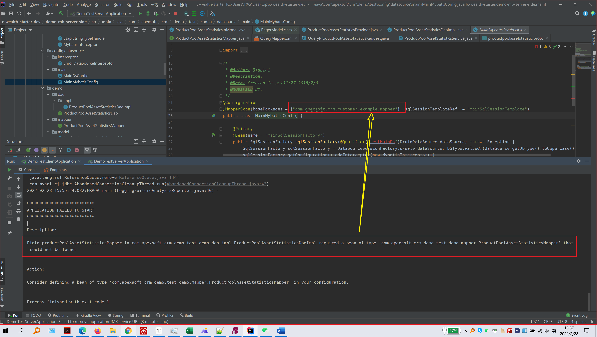
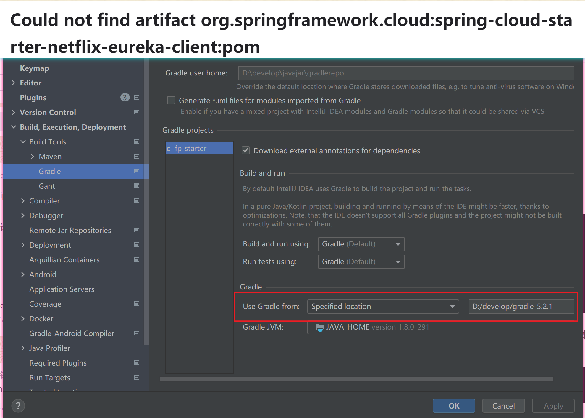

## io.grpc.StatusRuntimeException: UNKNOWN

原因：调用grpc时，grpc内部报错，并非grpc调用的服务没有启动。

## Integer判断用equals

java 中 == 和 equal 的区别， == 操作比较的是两个变量的值，对于引用型变量是判断变量是否指向同一引用对象，比地址。

equals 操作表示的两个变量是否是对同一个对象的引用，即堆中的内容是否相同。

引用类型用 == 的示例：

```java
public static void main(String[] args) {

	Integer a1 = 127;
	Integer a2 = 127;
	Integer b1 = 128;
    Integer b2 = 128;

    // true
    System.out.println(a1 == a2);

    // false
    System.out.println(b1 == b2);
}
```

对于 INTEGER 类型，在 [-128, 127] 区间内，是用的同一个地址。其外用的是新的。所以：**包装类型间的相等判断不用 ==，而是应该用 equals**

## String.format()

对象按指定格式格式化为字符串

https://blog.csdn.net/wujian_csdn_csdn/article/details/113844887

## org.apache.commons.lang3.StringUtils.substringAfter()

获取指定字符串后的字符串

```java
StringUtils.substringAfter(null, *)      = null
StringUtils.substringAfter("", *)        = ""
StringUtils.substringAfter(*, null)      = ""
StringUtils.substringAfter("abc", "a")   = "bc"
StringUtils.substringAfter("abcba", "b") = "cba"
StringUtils.substringAfter("abc", "c")   = ""
StringUtils.substringAfter("abc", "d")   = ""
StringUtils.substringAfter("abc", "")    = "abc"
```

## String.join()与StringUtils.join()

## 数据源配置

一个项目可以配置多个数据源，但一个xml文件中用到的表只能来自同一个数据源。

## Java日期写入数据库

数据库日期时间在java中可以以格式化字符串存入

## Java日期格式化

```java
DateTimeFormatter dateTimeFormatter = DateTimeFormatter.ofPattern("yyyy-MM-dd HH:mm:ss");
LocalDateTime now = LocalDateTime.now();
String time = now.format(dateTimeFormatter);
```

```java
String date = DateFormatUtils.format(new Date(), "yyyy-MM-dd HH:mm:ss");
```

```java
String nowDate = DateTimeFormatter.ofPattern("yyyyMMdd").format(LocalDate.now());
```


https://www.jb51.net/article/190165.htm

## LocalDateTime时间计算

```java
LocalDateTime time = LocalDateTime.now();
time = time.plusMinutes(5);//获取当前时间并加5分钟
time = time.minusMinutes(5);//获取当前时间并减去5分钟

time = time.plusHours(5);//获取当前时间并加5小时
time = time.minusHours(5);//获取当前时间并减去5小时
```

## 微服务错误

mapper bean不能被发现




## gradle项目无法下载jar



## 