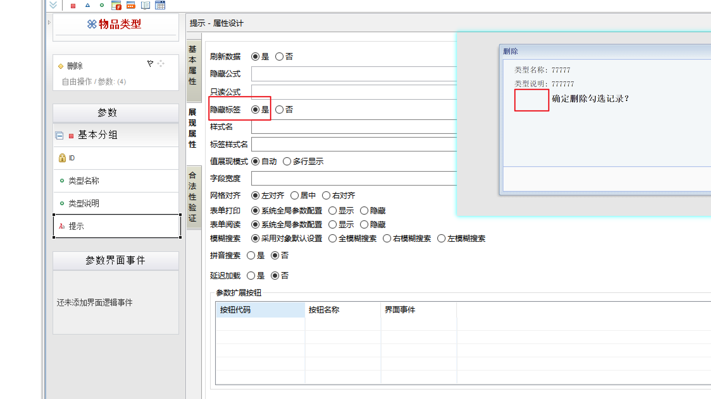
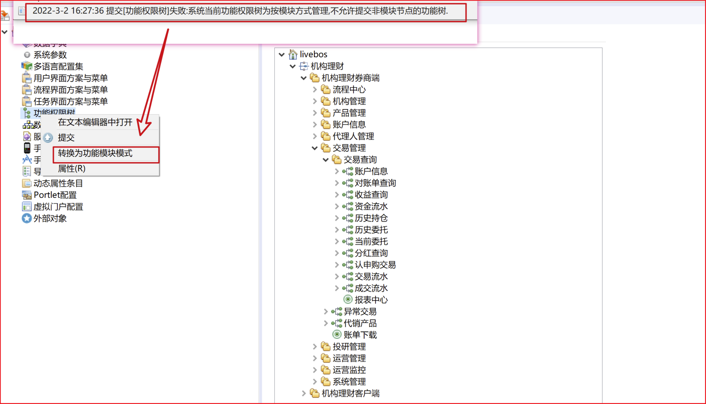
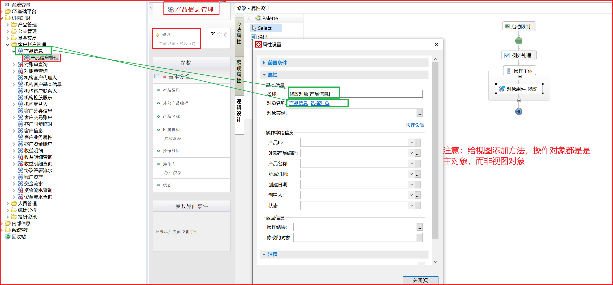
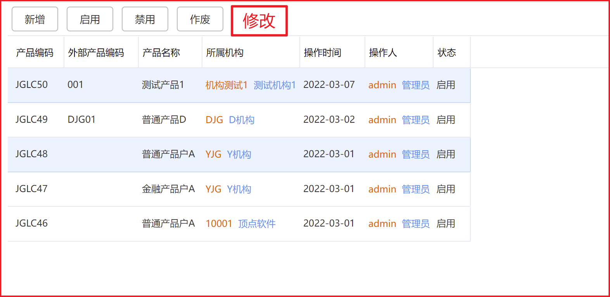

## 建模即开发


## 外部数据源配置


> 可以把 LiveBOS 平台看作是一个业务模型对象的”JVM”，通过它，帮助应 用开发人员屏蔽了基础的技术细节问题，应用开发人员可以不需要了解 Java，J2EE 烦人的一 些技术规范，甚至只需要了解简单的数据库知识，因为很多烦人的工作 LiveBOS 平台都已经封装好了。通过平台能够使我们这些应用开发人员站在更高的抽象角度来描述不同的业务对 象模型，使应用开发人员的工作能够牢牢地抓住业务需求。

livebos对象

​	普通对象（实体对象等）

​	数据集对象

​	外部资源

​	报表

​	工作流

实体对象

实体对象----表

根据数据的存储方式、用途和来源的不同，LiveBOS 平台中对实体对象的分类还可以具 体的分为如下几种类型的对象：父对象、子对象、多对多对象、表格模板对象、工作流表单 对象等。


## 实体对象建模

建立实体对象，类似建表，记得提交到服务器

新建数据字典

**过程：**

定义实体对象

设置对象属性 

建立字段

​	建立普通字段

​	建立选项字段

​		建立数据字典

​	建立对象字段

部署对象

对象预览

给对象添加方法

## 建立用户界面与菜单方案

对象加入菜单：

1、liveBOS studio：开发方案

​		一个比较好的习惯是先把 LiveBOS Server 中的菜单导入一份到本地中进行编辑，然后再部署到 LiveBOS  Server 中（避免覆盖）

2、liveBOS manager：运维方案


输入标识、显示标识、附加显示标识（这三个属性都是针对在对象被别的对象引用时起作用）

**字段筛选**（三级联动）

## 建立关联对象

​		普通展示

​		从属展示

## 建立计算列

值通过计算得来的字段（JavaScript语法）

​	预计算列：只计算一次，可以手动修改

​	绑定计算列：实时根据刷新结果触发计算，可持久化

​	虚拟计算列：不支持持久化，数据库中不存在该列，在对象展现时触发计算

## 建立字段合法性

掩码验证：正则表达式

表达式验证：if-else语句块（JavaScript语法）

## 建立多对多对象

职位---候选人		N---N

## 建立组织机构信息

部门经理提需求--->部门分管副总审批--->人力资源副总审批

livebos组织机构组成：组织、角色、用户

角色：全局角色、单元角色

组织、角色、用户关系：用户必须通过角色挂接于组织，即为组织 分配用户必须选定用户的角色。

livebos默认提供：“组织机构”、“系统角色”、“用户管理”

## 系统管理

​		组织机构

​		角色分类

​		系统角色

​		用户管理

​	**成员岗位表**

## 建立对象视图

LiveBOS 平台中，对象视图和数据库中的视图是不一样的概念， 对象视图是基于我们建立的实体对象上实现的，这些实体对象可以是普通的实体对象，也可 以是子对象、工作流表单对象、子对象、多对多对象、从属对象等。对象视图的数据是它的 实体对象数据的子集，基于实体对象上筛选而来。视图可以继承实体对象的任何属性。

建立实体对象时的表名， 除了唯一标识实体对象之外，同时也表现为数据库物理表的表名。而对象视图在数据 库中并没有物理表存在，这里的表名只起到唯一标识视图对象的作用。

字段筛选：允许我们在字段上面设置不同的筛选方式。 

扩展筛选：允许我们设置更复杂的筛选条件，比如设置复杂的筛选表达式或者直接写 原生的 SQL 语句。

两个属性是可以同时使用的，并且两个属性之间的关系 是一种”并”的关系，简单地可以理解为 SQL 语句中的 and 条件关系

**建职位信息审批流程** 


**建职位信息审批流程** 

Position.ID in (select Position from PositionApplication where Candidate={0})


所申请职位=候选人录用审批表单. 申请职位 

职位申请人=候选人录用审批表单.候选人信息

## 权限管理 

整个 LiveBOS 权限基于组织信息的：组织、角色、用户这三个部分构建。

目前 LiveBOS 权限系统中包含了以下五种不同类型的权限： 

1. 业务权限：指用户是否可以进行某项业务操作。如新增用户信息。 
2. 授权业务范围：指用户可以进行权限分配的功能模块。 
3. 审核业务范围：指用户可以进行权限审核的功能模块。
4. 数据权限：指用户可以查看的业务数据范围，支持记录级权限控制。
5. 字段权限：指用户可以操作的业务字段，包括新增、修改、查看

权限分配中，可以按不同层级的方式进行权限的分配，即：权限可以分配给具体的组织，也可以分配给具体的角色，也可以分配给具体的某个用户。

权限是可以进行逐级继承的，并且在该组织下的 用户自动继承所在组织的权限。分配给角色后，拥有这个角色的用户自动继承所在角色的权 限。分配给用户的权限只有该用户拥有。一个用户从各个不同组织、角色中获取的权限加上 本身拥有的权限构成了该用户所有权限的集合。

## 建立招聘系统的权限

业务权限-----功能权限

流程中心执行权限：新流程

​											待办流程

​											发起的流程

​											参与的流程

​											回复的流程


“职位信息审批流程”：

​											流程监控权限

​											流程跟踪权限

​											执行权限


将需要显示的“对象”添加到菜单中，通过权限控制不同角色可以看到不同的菜单。（如果没有加到菜单中，就算有权限也不会显示）


## livebos数据集

​		查询数据集

​		SQL数据集

​		JavaBean数据集

​		Fix数据集

## 设计简单报表

## 建立SQL数据集

## 建立图表对象 

## 组件开发

​	业务组件 （如 JavaBean 业务组件、SQL 存储过程业务组件、WebService 业务组件等）

​	系统服务组件

​	自定义控件

​	外部 javabean 业务组件

## 调用 SQL 存储过程业务组件

## 办公协同管理系统


```
<%@ livebos language='javascript' %>
"<a font color='red' style='font-size:14px'><b>确定删除勾选记录？</b></font></a>"
```



**livebos关联对象方式:**

**1、内部对象---------------相当于外键引入**

**2、多对多对象------------两个对象有相同字段即可关联**


## 转向条件

注意转向条件中的sql语句书写，即使关键字写错也不会报错，错误会导致转向不起作用。

## 内部对象下拉为空


## 权限书提交



## VC_BUS_NVGT_CFG

VC_BUS_NVGT_CFG对象，通过该livebos对象，将数据直接存入数据库


## 数据展示


## 客户端跳转链接


## 启动限制


```sql
<%@ livebos language='javascript' %>
O_MASTER.ST!=2

"状态为待激活时才允许修改"
```

## 选择项值


## 新增错误

> 执行新增时失败. ORA-00001: 违反唯一约束条件 (IFP.BIN$1lMHW2wtAdDgUwEAAH8yGw==0）

错误原因：主键id由livebos自动维护，id来自与livebos.tsequence表


当某个对象新增数据时，根据表名从livebos.tsequence获取对应的id值作为新增加数据的主键id,之后livebos.tsequence中该id值自动增加1；

出现上述错误的原因：1、新增数据的表名在livebos.tsequence的NAME字段找不到，如TIFP_CUST_PD_INF需要新增数据livebos.tsequence中没有TIFP_CUST_PD_INF对应的数据，而；2、存在数据，但当前的id值小于待增加数据表已有数据的最大id，如LSCP_USUBS_APL_RVW已有数据的最大ID为100，而livebos.tsequence表中LSCP_USUBS_APL_RVW的ID为53，即使加1也是54，与LSCP_USUBS_APL_RVW表已存在数据主键冲突。


注意：一个操作有多个表的增加，多个表的对应的livebos.tsequence中的id必须存在且保证大于已有数据最大id，即使一个表不满足，也会包如上错误，满足的表也无法添加数据，因为要保证事务的一致性。


## 操作人操作时间跟新


## 只读


## 现场升级


选中上传了的（做了修改或增加的）--->提交即可。刷新券商端或客户端即可查看升级后的效果。

## 视图方法操作对象




视图的方法添加到主体对象上。

## id userid name


## 千位分隔符


## 角色 组织 岗位


## 分配权限不生效

新增加或修改方法并重新分配权限审核通过后仍然不生效，很可能算是缓存问题，重启tomcat可解决，若服务器存在集群，集群的服务器都要重启。

重启服务器的操作：

  -   查看进程（若是以root用户启动，需要以root用户杀进程，给非root用户授权）
  -   杀掉进程
  -   进到tomcat目录，使用启动目录
  -   跟新目录

不推荐以root用户启动进程？

如何查看进程是以什么用户启动的？


```
Xshell 7 (Build 0087)
Copyright (c) 2020 NetSarang Computer, Inc. All rights reserved.

Type `help' to learn how to use Xshell prompt.
[C:\~]$ 

Connecting to 192.168.4.194:22...
Connection established.
To escape to local shell, press 'Ctrl+Alt+]'.

WARNING! The remote SSH server rejected X11 forwarding request.
Last login: Wed Mar  9 10:07:33 2022 from 172.16.200.253
[root@centos194 ~]# kill -9 30259
[root@centos194 ~]# 
[root@centos194 ~]# 
[root@centos194 ~]# 
[root@centos194 ~]# chown -R /home/ftq/LiveBOS_Tomcat9_Kirin_FMA/
chown: missing operand after ‘/home/ftq/LiveBOS_Tomcat9_Kirin_FMA/’
Try 'chown --help' for more information.
[root@centos194 ~]# chown -R ftq /home/ftq/LiveBOS_Tomcat9_Kirin_FMA/
[root@centos194 ~]# chown -R ftq:ftq /home/ftq/LiveBOS_Tomcat9_Kirin_FMA/
[root@centos194 ~]# 

```

切换账号

```
su - username
su username
```

https://blog.csdn.net/qq_24754061/article/details/83350691

https://www.cnblogs.com/gnivor/p/10385010.html


```
./表示当前目录
./shutdown.sh表示执行当前目录下的shutdown.sh命令

../表示上级目录
```

查看toncat日志：

先进到logs目录，执行tail -f catalina.log 查看文件名为catalina.log的日志文件

```
tail -f catalina.log
```

```
tail -1000f logs/ams-server-service-group.log 
```


https://www.cnblogs.com/sxdcgaq8080/p/9044654.html


可通过linux系统命令history来查看最近执行的命令（默认记录最近1000次操作命令）

> 系统命令：可在任何目录先执行 ？？？
>
> 非系统命令必须进入命令所在目录才能执行？？？


非root用户不能执行某些命令，必须经过授权？

> 在执行./startup.sh,或者./shutdown.sh的时候，爆出了Permission denied，
>
> 其实很简单，就是今天在执行tomcat的时候，用户没有权限，而导致无法执行，
>
> 用命令chmod 修改一下bin目录下的.sh权限就可以了
>
> 记：将tomcat6/bin目录下的
> startup.sh
> catalina.sh
> setclasspath.sh
> 这三个文件加上可执行权限
> $:chmod a+x *.sh
>
> https://blog.csdn.net/b052718/article/details/84208826


tomcat重启

https://www.cnblogs.com/wanwen/p/7495578.html

使用shutdown.sh命令无法关闭tomcat，可使用kill -9 pid强制杀死进程，关闭tomcat


授权

https://baijiahao.baidu.com/s?id=1633561989790131554&wfr=spider&for=pc

## 自定义方法与系统方法

自定义方法会产生新的.lbz文件

新增或修改系统自带的方法只会修改当前对象或视图对应的xml文件，并不会产生新的文件.

## livebos 代码新增

```
BEGIN
INSERT INTO ifp.TIFP_PD_FUND_BLK_LST(INST_CODE,FUND_CODE,IN_DT,ST,IN_RSN,RMK,IN_OPRR_ID,IN_OPRR_TM,ID)VALUES({0},{1},{2},0,{3},{4},{5},SYSDATE,LIVEBOS.FUNC_NEXTID('TIFP_PD_FUND_BLK_LST'));
COMMIT;
END;
```

## 权限树


现在使用的是.functionPermission目录下的权限树，直接修此文件，根目录下的functionPermission.xml文件不用管


```
<%@ livebos language='javascript' %>
if (  O_PARAMETER.INST_CODE == null || O_MASTER.INST_CODE == O_PARAMETER.INST_CODE) {
 true
} else if  ( O_MASTER.PD_ST == 0){
 true
} else {
 false
}
```

## 权限树转换为功能模块

## 父对象


\<attribute>\<attribute>属性，设置显示表示

## 附加显示


显示标识：不显示id，只显示指定为“显示标识的字段”

附加显示标识：显示id + 显示指定为“显示标识的字段”

## 用户方法 对象流程

对象流程实现的功能比用户方法更强，比如“判断”等功能，可通过将用户方法转换为对象流程来实现；

启动限制：在点击按钮的时候就开始执行，比如点击“修改”，就开始执行代码逻辑；

对象流程判断：在点确认的时候开始执行，无论条件成立与否，都可以进入，比如点击“修改”，及时条件不成立也可点进来，而启动限制若条件不成立，则无法进入。


## 导出显示顺序

与对象字段顺序有关，与导出列添加顺序，sql查询字段顺序无关

## 查询条件输入框


## 历史持仓显示数据缓慢


刚查询可能没有数据，多刷新几次就有数据了

## 权限名重复问题


权限树中的权限，无论是否再同一个包中，权限的名字不能重复，即在一个权限树文件中，权限名字不能重复，建议使用有意义的名字，不要使用默认的function.数字，以免数字重复，会导致权限树无法提交到服务器。

## 搜索约束


## studio与xml对应关系


## 列明不显示


## 查询用户菜单

```sql
-- 过程
LIVEBOS.PCX_XGLPT_FA
```

菜单方案与角色绑定。

## 参数 主题对象


```sql
<%@ livebos language='javascript' %>
if (  O_PARAMETER.INST_CODE == null || O_MASTER.INST_CODE == O_PARAMETER.INST_CODE) {
 true
} else if  ( O_MASTER.PD_ST == 0){
 true
} else {
 false
}
```

隐藏方法




C:\Users\TXG\Desktop\机构理财\trunk\xml\机构理财\客户账户管理

## LiveBos调用微服务


注意命名空间要和服务器上的配置保持一致


## livebos对象初始宽度调整


## SQL筛选

1、点击全部，报错提示对象不存在，有可能是因为内部对象没有从服务器上拉下来，试着拉去一下


2、注意页面调用的livebos对象是“调入产品”对象，所以要在调入产品对象上设置sql筛选，而设置在“精选产品管理”或“精选产品管理视图”上是都不会有作用的。


## 功能权限书提交


## 页面对象修改

修改操作日志页签的跳转对象


在菜菜单里面调整对象（内部对象或外部对象）


