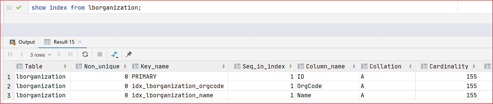
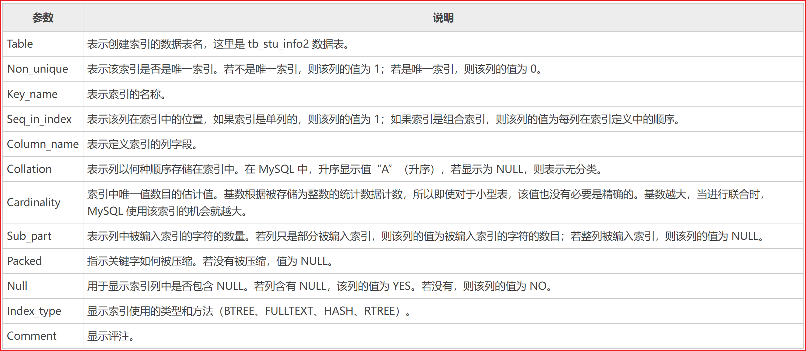
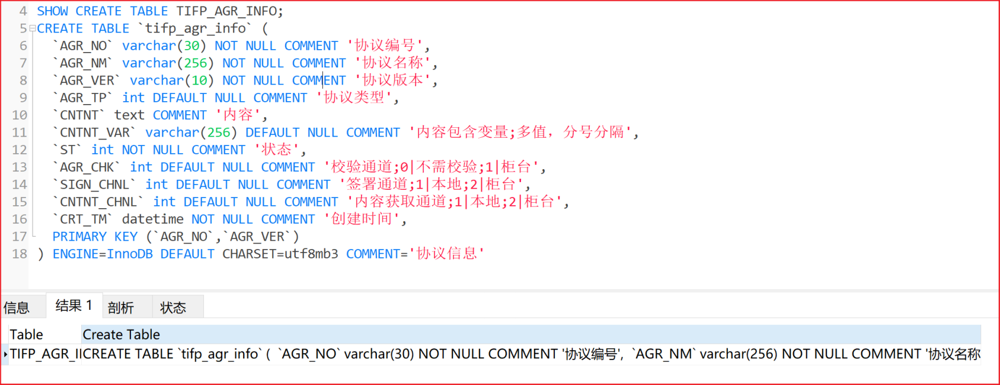
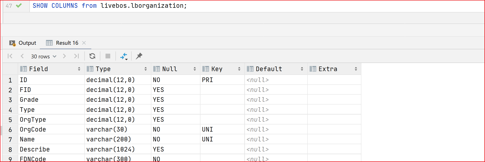

## mysql查询索引信息

```sql
show index from 表名
```

eg：





http://c.biancheng.net/view/7364.html

## UNIQUE 和 PRIMARY KEY 的区别

一个表中可以有多个字段声明为 UNIQUE，但只能有一个 PRIMARY KEY 声明；声明为 PRIMARY KEY 的列不允许有空值，但是声明为 UNIQUE 的字段允许空值的存在。

## mysql查看建表语句

```sql
show create table 表名
```



## mysql like

```sql
'%a'     //以a结尾的数据
'a%'     //以a开头的数据
'%a%'    //含有a的数据
'_a_'    //三位且中间字母是a的
'_a'     //两位且结尾字母是a的
'a_'     //两位且开头字母是a的
```

## mysql查询数据表字段数量

```sql
SELECT
	COUNT(*)
FROM
	information_schema. COLUMNS
WHERE
	table_schema = 'ifp'
AND table_name = 'TIFP_TRD_FUND_PSTN';
```

table_schema即数据库名，table_name即目标表名

## mysql查询表字段信息

```sql
show columns from database_name.table_name
```

eg：



## mysql自定义排序

https://blog.csdn.net/quader/article/details/122761023

### case when

### field()

### locate()

### instr()

