# insert select批量增加

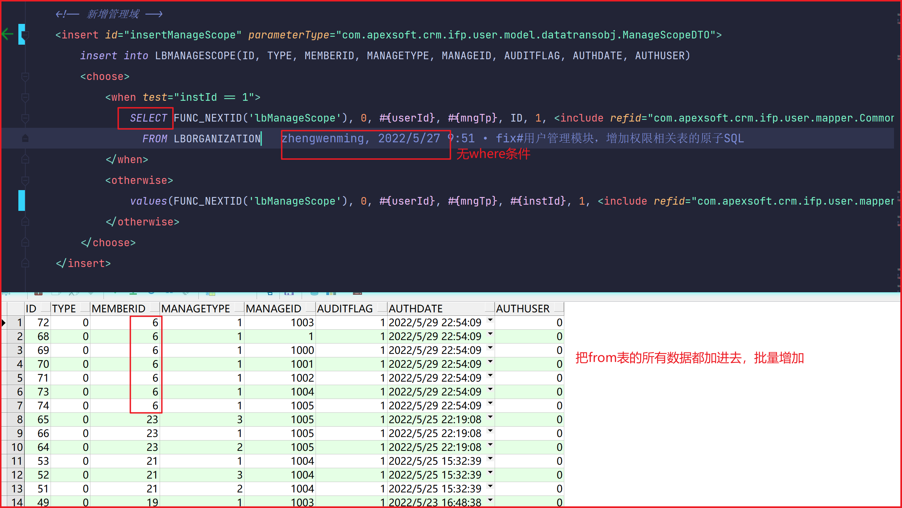

# merge into

> 原帖：https://blog.csdn.net/jeryjeryjery/article/details/70047022

# otherwise if

otherwise中也可以使用if

```sql
<choose>
    <when test='I_FUND_CODE.contains(",")'>
        and INF.pd_code in
        <foreach collection="I_FUND_CODE.split(',')" item="item" open="(" close=")" separator=",">
            #{item, jdbcType=VARCHAR}
        </foreach>
    </when>
    <otherwise>
        <if test="I_FUND_CODE != null and I_FUND_CODE != ''">
            <bind name="fundCode" value="'%'+I_FUND_CODE+'%'"/>
        and  INF.pd_code LIKE #{fundCode}
        </if>
    </otherwise>
</choose>
```

# mybatis传入字符串，集合，数组并遍历

```xml
<!--传递参数为字符串approveStatus =“通过,不通过” item为遍历后的参数-->
<if test="approveStatus != null and approveStatus!=''">
	and i.approve_status IN
	<foreach item="status" collection="approveStatus.split(',')" open="(" separator="," close=")" index="index">
	  ${status}
	</foreach>
</if>
<!--或-->
<foreach collection="status" index="index" item="item" open="(" separator="," close=")">
    #{status[${index}]}
</foreach>


<!--传递参数为集合approveStatusList，集合中包含对象user ,approveStatusList={user1,user2 } -->
<if test="approveStatusList!= null and approveStatusList.size>0 ">
	AND operate_user in
	<foreach collection="approveStatusList" open="(" close=")" separator="," item="user" index="index">
		${user.userName}
	</foreach>
</if>


<!--传递参数为数组approveStatus =[通过,不通过] 此时collection必须为array item为传递的数组参数，且参数名要保持一致-->
<if test="approveStatus != null and approveStatus!=''">
	and i.approve_status IN
	<foreach item="approveStatus" collection="array" open="(" separator="," close=")">
	    #{approveStatus}
	</foreach>
</if>
```

https://www.csdn.net/tags/OtDaIg4sNzkyNjgtYmxvZwO0O0OO0O0O.html

https://blog.csdn.net/wt_better/article/details/80941646

# mysql 存储过程

https://blog.csdn.net/weixin_60589106/article/details/122704881

# 排名函数 row_number()over(order by)

简单的说row_number()从1开始，为每一条分组记录返回一个数字，这里的ROW_NUMBER() OVER (ORDER BY 【列名】DESC) 是先把【列名】降序排列，再为降序以后的每条【列名】记录返回一个降序序号，序号从1开始，依次往下排。

排名函数 “ROW_NUMBER” 必须有 ORDER BY 子句。

```sql
SELECT ZRR,JYR,ND,JD,YF,XQ,NY,NZ,ZH, ROW_NUMBER() OVER(ORDER BY JYR DESC)  ONUM FROM TXTJYR
```

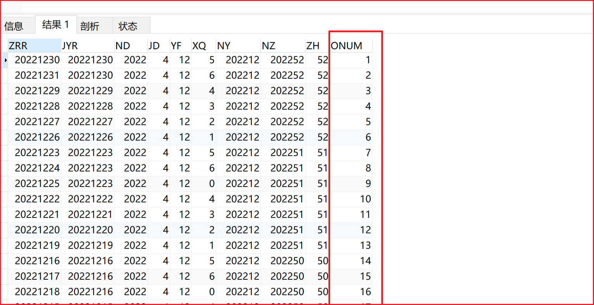

# 错误创建bean

xml书写错误导致bean错误创建异常

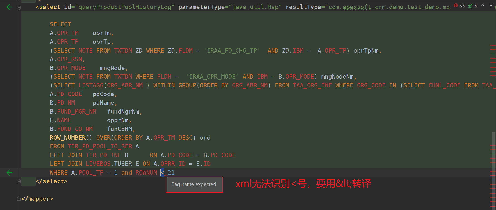

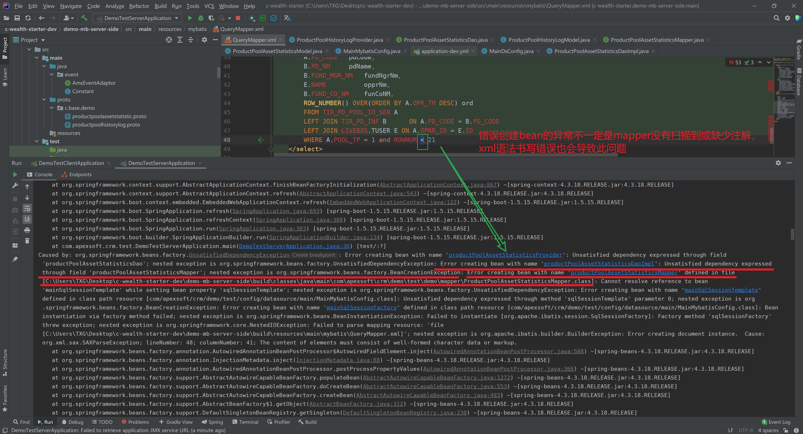

# xml转义字符

xml文件标签内外的小于号都要做转义

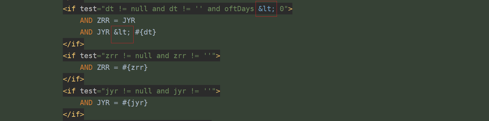

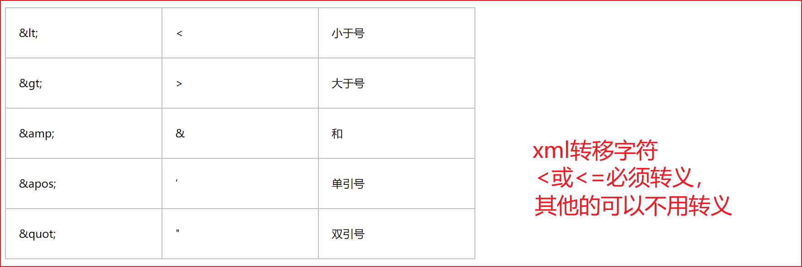

> 第一种写法（1）：
>
> 原符号： 		< 		<=	 	> 		>=	 		& 				’				"
> 替换符号： \&lt; 	\&lt;= 	\&gt; 	\&gt;= 	\&amp; 	\&apos; 	\&quot;
> 例如：sql如下：
> create_date_time >= #{startTime} and create_date_time <= #{endTime}
>
> 第二种写法（2）：
> 大于等于
>
> \<![CDATA[ >= ]]>
> 1
> 小于等于
>
> \<![CDATA[ <= ]]>
> 1
> 例如：sql如下：
> create_date_time \<![CDATA[ >= ]]> #{startTime} and create_date_time \<![CDATA[ <= ]]> #{endTime}


页面一直转圈圈，可能是某个接口没有返回值或返回值数据量太大导致

# no getter

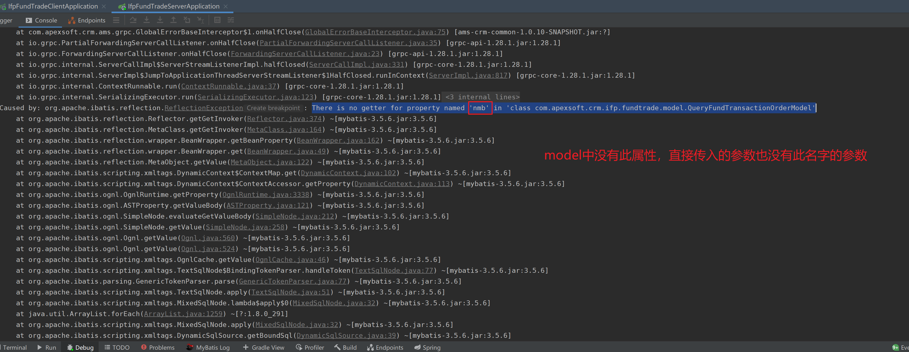

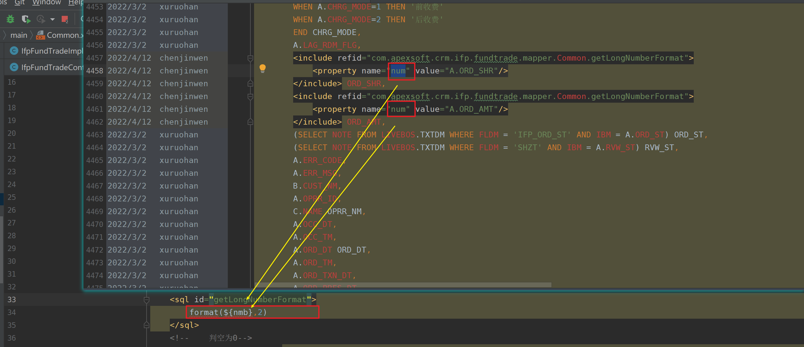

原因：

include标签引入sql语句，sql语句需要proper标签的name值来完成proper value值得传递，sql中变量名和property name不一致，便会报getter错误.

# mybatis传参

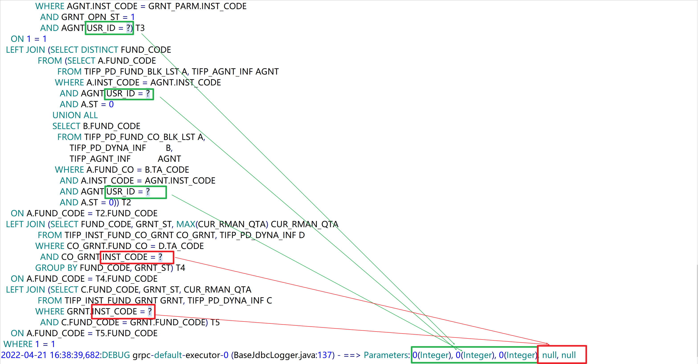

传入的参数顺序即为sqL语句中#{}的先后顺序，当某个参数在sql中重复使用时，也会重复传入。sql中#{}与传入的参数没有对应时，则传入null.

# mybatis 传参

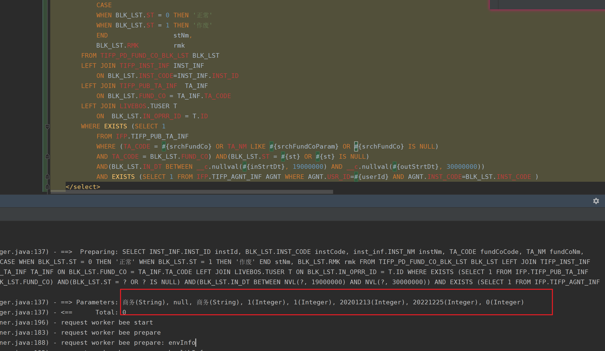

# bind标签问题

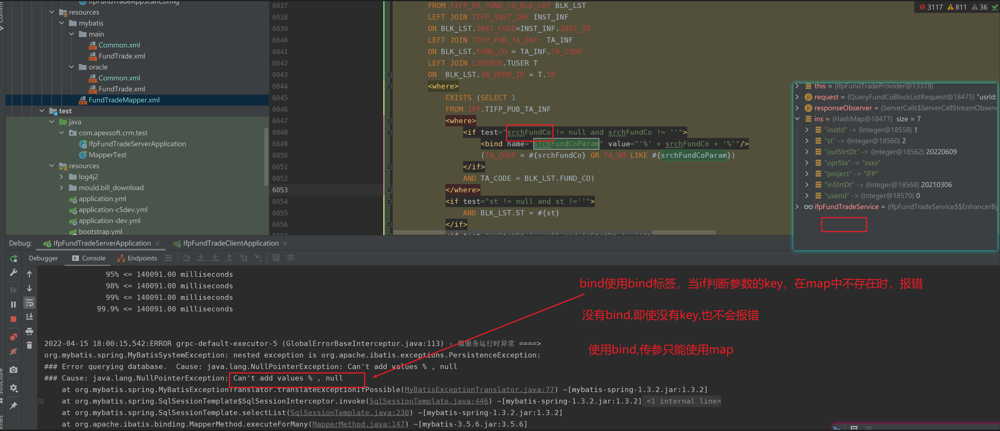

# 未明确定义列错误

```sql
select ID, FID, CREATE_DATE,CREATE_DATE, WEBSITE,REMARK,STATUS  from LIVEBOS.lbOrganization
```

此语句在plsql和单元测试的环境下可以正确执行，但通过swagger测试时会报如下错误，原因时重复插叙CREATE_DATE字段，删除重复查询字段即可解决。

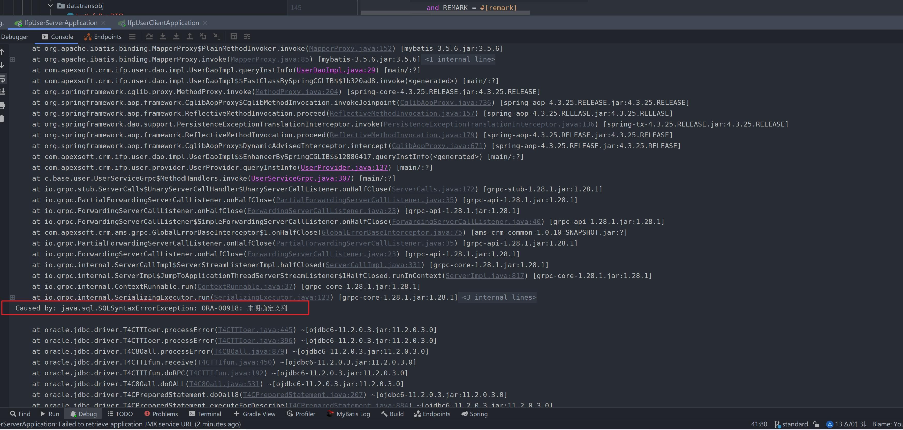

# mybatis传入0值判断

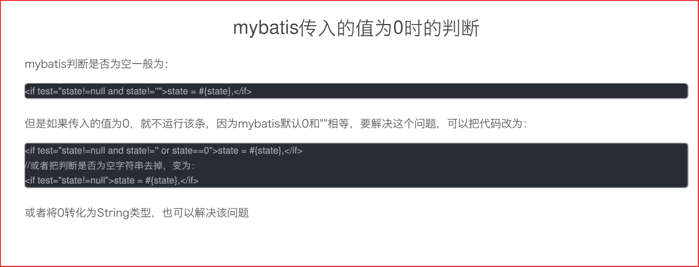

# jdbctype NUMERIC

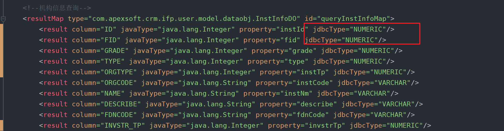

jdbcType为NUMBER会报错，jdbcType为mybatis提供的类型，并非直接对应oracle数据库字段的类型，因为mybatis没有提供NUMBER,所以会报错，可以使用NUMERIC，此字段可与java的Integer对应。

https://blog.csdn.net/zuoyouzouzou/article/details/83827066

# update set select

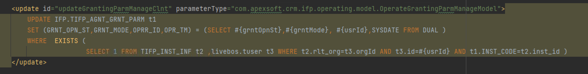

# Oracle添加字段，字段注释，表注释

-- 添加字段

```sql
alter table 表 ADD (字段名 字段类型)

alter table dws.DWS_FINANCING_INCUR_DEBTS ADD (ORG_ID NVARCHAR2(128));
```

1、增加一个字段：（增加字段时，只能排在已有字段的后面，不能插到已有字段之间）

```sql
Alter Table 表名 Add 字段名称  字段类型；

Alter  Table  t_si_addr  Add  CHG_ADDR_FLAG  number(1,0);
```

 2、增加两个字段；

```sql
Alter Table 表名 Add (字段名称  字段类型,字段名称  字段类型)
 
Alter Table t_si_addr Add (CHG_ADDR_FLAG number(1,0),ADD_BY_IOM Varchar2(2));
```

 -- 添加表注释

```sql
 COMMENT ON TABLE 表名 IS '表注释';
```

 -- 添加字段注释

```sql
 comment  on  column  表名.字段名   is  '注释内容';
 
 COMMENT ON COLUMN DWS_FINANCING_INCUR_DEBTS."ORG_ID" IS '字段注释';
```

区分大小写可以用双引号，字段或表名需要用双引号

https://www.csdn.net/tags/MtTaQgwsOTY2Ny1ibG9n.html


```sql
    <!-- 新增功能权限 -->
    <insert id="insertFunPermission" parameterType="com.apexsoft.crm.ifp.user.model.datatransobj.FunPermissionReqDTO">
        insert into LBFUNPERMISSION(ID, TYPE, MEMBERID, FUNNAME, AUDITFLAG, AUTHDATE, AUDITDATE, AUTHUSER, AUDITUSER)
        <if test="type == 0 and memberIds.size > 0 and funNames.size > 0">
            select ID, TYPE, MEMBERID, FUNNAME, AUDITFLAG, AUTHDATE, AUDITDATE, AUTHUSER, AUDITUSER
            from (
            <foreach collection="memberIds" item="userId" index="index" separator=" union all ">
                <foreach collection="funNames" item="funName" index="index" separator=" union all ">
                    select FUNC_NEXTID('lbFunPermission') ID, 0 TYPE, #{userId} MEMBERID, #{funName} FUNNAME, 1 AUDITFLAG, <include refid="com.apexsoft.crm.ifp.user.mapper.Common.getSysDate"/> AUTHDATE, <include refid="com.apexsoft.crm.ifp.user.mapper.Common.getSysDate"/> AUDITDATE, 1 AUTHUSER, 1 AUDITUSER
                    from dual
                </foreach>
            </foreach>
            ) t
        </if>
        <if test="type == 1 and memberId != null and memberId != '' and roleId != null and roleId != '' ">
            select FUNC_NEXTID('lbFunPermission') ID, 1 TYPE, #{roleId} MEMBERID, FUNNAME, 1 AUDITFLAG, <include refid="com.apexsoft.crm.ifp.user.mapper.Common.getSysDate"/> AUTHDATE, <include refid="com.apexsoft.crm.ifp.user.mapper.Common.getSysDate"/> AUDITDATE, AUTHUSER, AUDITUSER
              from LBFUNPERMISSION
             where type = 1
               and MEMBERID = #{memberId}
        </if>
```

```sql
INSERT INTO LBFUNPERMISSION ( ID, TYPE, MEMBERID, FUNNAME, AUDITFLAG, AUTHDATE, AUDITDATE, AUTHUSER, AUDITUSER ) SELECT
ID,
TYPE,
MEMBERID,
FUNNAME,
AUDITFLAG,
AUTHDATE,
AUDITDATE,
AUTHUSER,
AUDITUSER 
FROM
	(
	SELECT
		FUNC_NEXTID ( 'lbFunPermission' ) ID,
		0 TYPE,
		? MEMBERID,
		? FUNNAME,
		1 AUDITFLAG,
		now() AUTHDATE,
		now() AUDITDATE,
		1 AUTHUSER,
		1 AUDITUSER 
	FROM
	DUAL UNION ALL
	SELECT
		FUNC_NEXTID ( 'lbFunPermission' ) ID,
		0 TYPE,
		? MEMBERID,
		? FUNNAME,
		1 AUDITFLAG,
		now() AUTHDATE,
		now() AUDITDATE,
		1 AUTHUSER,
		1 AUDITUSER 
	FROM
	DUAL UNION ALL
	SELECT
		FUNC_NEXTID ( 'lbFunPermission' ) ID,
		0 TYPE,
		? MEMBERID,
		? FUNNAME,
		1 AUDITFLAG,
		now() AUTHDATE,
		now() AUDITDATE,
		1 AUTHUSER,
		1 AUDITUSER 
	FROM
	DUAL UNION ALL
	SELECT
		FUNC_NEXTID ( 'lbFunPermission' ) ID,
		0 TYPE,
		? MEMBERID,
		? FUNNAME,
		1 AUDITFLAG,
		now() AUTHDATE,
		now() AUDITDATE,
		1 AUTHUSER,
		1 AUDITUSER 
	FROM
	DUAL UNION ALL
	SELECT
		FUNC_NEXTID ( 'lbFunPermission' ) ID,
		0 TYPE,
		? MEMBERID,
		? FUNNAME,
		1 AUDITFLAG,
		now() AUTHDATE,
		now() AUDITDATE,
		1 AUTHUSER,
		1 AUDITUSER 
	FROM
	DUAL UNION ALL
	SELECT
		FUNC_NEXTID ( 'lbFunPermission' ) ID,
		0 TYPE,
		? MEMBERID,
		? FUNNAME,
		1 AUDITFLAG,
		now() AUTHDATE,
		now() AUDITDATE,
		1 AUTHUSER,
		1 AUDITUSER 
	FROM
	DUAL UNION ALL
	SELECT
		FUNC_NEXTID ( 'lbFunPermission' ) ID,
		0 TYPE,
		? MEMBERID,
		? FUNNAME,
		1 AUDITFLAG,
		now() AUTHDATE,
		now() AUDITDATE,
		1 AUTHUSER,
		1 AUDITUSER 
	FROM
	DUAL UNION ALL
	SELECT
		FUNC_NEXTID ( 'lbFunPermission' ) ID,
		0 TYPE,
		? MEMBERID,
		? FUNNAME,
		1 AUDITFLAG,
		now() AUTHDATE,
		now() AUDITDATE,
		1 AUTHUSER,
		1 AUDITUSER 
	FROM
	DUAL UNION ALL
	SELECT
		FUNC_NEXTID ( 'lbFunPermission' ) ID,
		0 TYPE,
		? MEMBERID,
		? FUNNAME,
		1 AUDITFLAG,
		now() AUTHDATE,
		now() AUDITDATE,
		1 AUTHUSER,
		1 AUDITUSER 
	FROM
DUAL 
	) t
```

# datetime-string

```sql
    <!--广告信息查询-->
    <resultMap id="queryAdvertInfoMap" type="com.apexsoft.crm.ifp.operating.model.dataobj.AdvertInfoDO">
        <result column="AD_ID" jdbcType="DECIMAL" property="adId" javaType="java.lang.Long"/>
        <result column="ONUM" jdbcType="INTEGER" property="onum" javaType="java.lang.Integer"/>
        <result column="AD_TITLE" jdbcType="VARCHAR" property="adTitle" javaType="java.lang.String"/>
        <result column="AD_CNTNT" jdbcType="VARCHAR" property="adCntnt" javaType="java.lang.String"/>
        <result column="LINK" jdbcType="VARCHAR" property="link" javaType="java.lang.String"/>
        <result column="ST" jdbcType="INTEGER" property="st" javaType="java.lang.Integer"/>
        <result column="CRT_TM" jdbcType="DATE" property="crtTm" javaType="java.lang.String"/>
        <result column="PUB_TM" jdbcType="DATE" property="pubTm" javaType="java.lang.String"/>
        <result column="PUSH_SCOP" jdbcType="VARCHAR" property="pushScop" javaType="java.lang.String"/>
        <result column="UCAR_TM" jdbcType="DATE" property="ucarTm" javaType="java.lang.String"/>
    </resultMap>
    <select id="queryAdvertInfo" parameterType="com.apexsoft.crm.ifp.operating.model.datatransobj.AdvertInfoReqDTO" resultMap="queryAdvertInfoMap">
        select AD_ID, ONUM, AD_TITLE, AD_CNTNT, LINK, ST, CRT_TM, PUB_TM, PUSH_SCOP, UCAR_TM
        from TIFP_AD_INFO
        <where>
            <if test=" adId != null and adId != ''">
                AND AD_ID = #{adId}
            </if>
            <if test=" onum != null and onum != ''">
                AND ONUM = #{onum}
            </if>
            <if test=" adTitle != null and adTitle != ''">
                <bind name="_adTitle" value="'%' + adTitle + '%'"/>
                AND AD_TITLE LIKE #{_adTitle}
            </if>
            <if test=" adCntnt != null and adCntnt != ''">
                <bind name="_adCntnt" value="'%' + adCntnt + '%'"/>
                AND AD_CNTNT LIKE #{_adCntnt}
            </if>
            <if test=" st != null and st != '' or st == 0">
                AND ST = #{st}
            </if>
            <if test=" instId != null and instId != ''">
                AND INSTR(PUSH_SCOP,#{instId}) > 0
            </if>
        </where>
        ORDER BY ONUM ASC
    </select>
```

```java
@Data
public class AdvertInfoDO {
    /**
     * 广告id
     */
    private Long adId;
    /**
     * 序号
     */
    private Integer onum;
    /**
     * 广告主题
     */
    private String adTitle;
    /**
     * 广告内容
     */
    private String adCntnt;
    /**
     * 跳转链接
     */
    private String link;
    /**
     * 状态
     */
    private Integer st;
    /**
     * 创建时间
     */
    private String crtTm;
    /**
     * 发布时间
     */
    private String pubTm;
    /**
     * 推送范围
     */
    private String pushScop;
    /**
     * 下架时间
     */
    private String ucarTm;
}

```

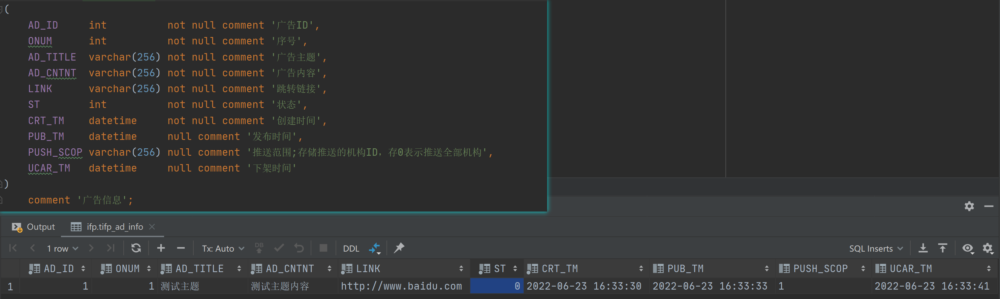

```json
{
  "code": 1,
  "note": "查询成功",
  "records": [
    {
      "adId": "1",
      "onum": "1",
      "adTitle": "测试主题",
      "adCntnt": "测试主题内容",
      "link": "http://www.baidu.com",
      "st": "0",
      "crtTm": "2022-06-23 16:33:30",
      "pubTm": "2022-06-23 16:33:33",
      "pushScop": "1",
      "ucarTm": "2022-06-23 16:33:41"
    }
  ]
}
```

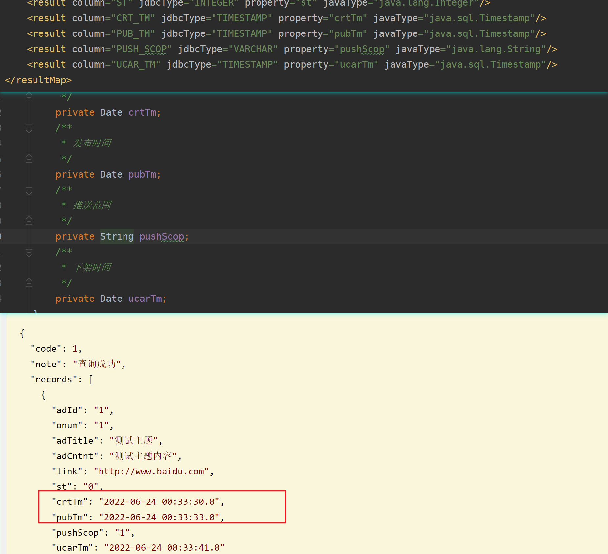

# insert foreach

```sql
insert into LBMEMBER(ID, ROLEID, USERID, ORGID, AUDITFLAG, MODIDATE, AUTHUSER, AUTHDATE)
select ID, ROLEID, USERID, ORGID, AUDITFLAG, MODIDATE, AUTHUSER, AUTHDATE
from (
<foreach collection="userRoles" item="roleId" index="index" separator=" union all ">
    select FUNC_NEXTID('lbMember') ID, #{roleId} ROLEID, #{userId} USERID, #{instId} ORGID, 1 AUDITFLAG, <include refid="com.apexsoft.ifp.user.mapper.Common.getSysDate"/> MODIDATE, 0 AUTHUSER, <include refid="com.apexsoft.ifp.user.mapper.Common.getSysDate"/> AUTHDATE
    from dual
</foreach>
) t
```


