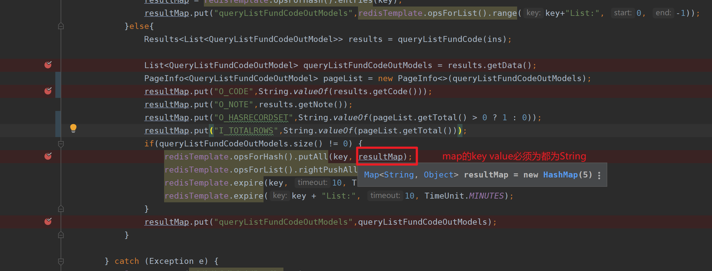
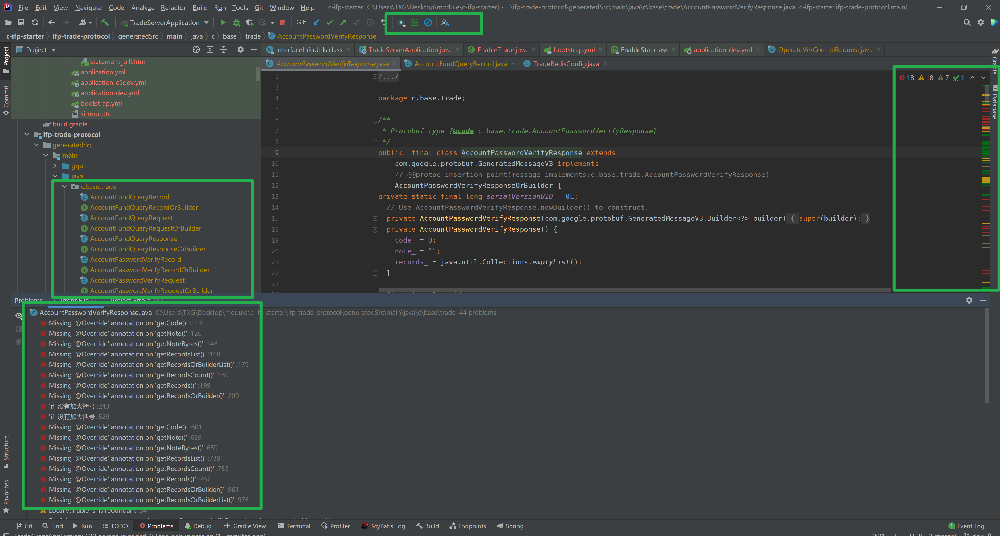

## JDK1.6项目

JDK1.6 环境配置及Spring 项目创建


直接解压出来的软件一般不会自动注册，有的需要运行里面的注册文件，有的第一次运行之后会自动注册，一般运行setup.exe或者install.exe等完整的安装程序都会自动注册。

## 静态方法导入

```java
//直接导入类的静态方法
import static com.apexsoft.utils.ParamUtils.getString;

 QueryProductPoolHistoryLogRecord record = QueryProductPoolHistoryLogRecord.newBuilder()
     					//调用可以不用类名.方法，直接使用静态方法名
                        .setOprTm(getString(queryProductPoolHistoryLogModel.getOprTm());
```


LoggerFactory.getLogger可以在IDE控制台打印日志，便于开发，一般加在最上面：

```java
//调试日志
    private final static Logger logger = LoggerFactory.getLogger(xxxController.class);

```

## bootstrap.yml与application.yml

> bootstrap.yml（bootstrap.properties）用来在程序引导时执行，应用于更加早期配置信息读取，如可以使用来配置application.yml中使用到参数等
>
> application.yml（application.properties) 应用程序特有配置信息，可以用来配置后续各个模块中需使用的公共参数等。
>
> bootstrap.yml 先于 application.yml 加载
>
>
> 典型的应用场景如下：
>
> 当使用 Spring Cloud Config Server 的时候，你应该在 bootstrap.yml 里面指定 spring.application.name 和 spring.cloud.config.server.git.uri
> 和一些加密/解密的信息
> 技术上，bootstrap.yml 是被一个父级的 Spring ApplicationContext 加载的。这个父级的 Spring ApplicationContext是先加载的，在加载application.yml 的 ApplicationContext之前。
>
> 为何需要把 config server 的信息放在 bootstrap.yml 里？
>
> 当使用 Spring Cloud 的时候，配置信息一般是从 config server 加载的，为了取得配置信息（比如密码等），你需要一些提早的引导配置。因此，把 config server 信息放在 bootstrap.yml，用来加载在这个时期真正需要的配置信息。

## 项目错误

> 9:19	Error running 'DemoTestServerApplication': Command line is too long. Shorten command line for DemoTestServerApplication or also for Spring Boot default configuration?

解决方法：


## config


**异常链复习**

**spring配置文件、配置文件自定义、自动提示、自定义与框架的辨别**

namespace:显示当前使用环境的名字，设置使用环境

```yml
ams:
  authority: livebos-server
  ca:
    certFile: classpath:cert/ca.pem
  client:
    certFile: classpath:cert/client.pem
    keyFile: classpath:cert/client.pkcs8.pem
  server:
#    namespace: c5
    namespace: ${address.hostname}  #namespace:显示当前使用环境的名字
    certFile: classpath:cert/server.pem
    keyFile: classpath:cert/server.pkcs8.pem
```


- server.display-name设定应用的展示名称，默认: application

https://blog.csdn.net/lei32323/article/details/72830862


认证成功


```java
public class PagerModel {
    private Integer paging;//是否分页[0|否;1|是
    private Integer current;//页签(当前页码) "页码只允许在[0,100]之间"
    private Integer pageSize;//每页数据条数
    private Integer total;//总记录数
    private String sort;//排序规则
    
    
    
    /** @deprecated */
    @Deprecated
    public Integer getPageNo() {
        return this.getCurrent();
    }

    /** @deprecated */
    @Deprecated
    public Integer getPageLength() {
        return this.getPageSize();
    }

    /** @deprecated */
    @Deprecated
    public Integer getTotalRows() {
        return this.getTotal();
    }
}
```


```json
{
//继承自PagerModel。swagger生成接口参数，根据参数对象的get/setter方法，注意参数对象继承的对象的方法也会形成接口参数

  "pageNo": 0,
  "pageSize": 10,
  "paging": 1,
  "sort": "string",
  "total": -1,
    
  "current": 1,
  "pageLength": 0,
  "totalRows": 0


//自定义查询条件实体
  "funCoNm": "string",
  "keyWd": "string",
  "oprTp": 0,
  "oprrId": 0,
  "pdCode": "string",
  "pdName": "string",
  "qryEndDt": 0,
  "qryStrDt": 0,
  "qryTp": 0,
  "sellChCode": "string",
}
```

```
package com.apexsoft.crm.demo.test.model;

import com.apexsoft.crm.base.model.PagerModel;
import io.swagger.annotations.ApiModel;
import io.swagger.annotations.ApiModelProperty;
/**
 * @Author: TANG.XG
 * @Date: 2022/1/19
 * @Description: 查询条件，对应proto中……Request中的条件部分
 */

@ApiModel(description = "产品池变动历史查询")
public class QueryProductPoolHistoryLogInModel extends PagerModel {
    @ApiModelProperty(notes = "查询类型")
    private Integer qryTp;
    @ApiModelProperty(notes = "操作类型")
    private Integer oprTp;
    @ApiModelProperty(notes = "产品代码")
    private String pdCode;
    @ApiModelProperty(notes = "产品名称")
    private String pdName;
    @ApiModelProperty(notes = "搜索关键字")
    private String keyWd;
    @ApiModelProperty(notes = "基金公司")
    private String funCoNm;
    @ApiModelProperty(notes = "查询开始时间")
    private Integer qryStrDt;
    @ApiModelProperty(notes = "查询结束时间")
    private Integer qryEndDt;
    @ApiModelProperty(notes = "销售渠道")
    private String sellChCode;
    @ApiModelProperty(notes = "操作人")
    private Integer oprrId;


    public Integer getQryTp() {
        return qryTp;
    }

    public void setQryTp(Integer qryTp) {
        this.qryTp = qryTp;
    }

    public Integer getOprTp() {
        return oprTp;
    }

    public void setOprTp(Integer oprTp) {
        this.oprTp = oprTp;
    }

    public String getPdCode() {
        return pdCode;
    }

    public void setPdCode(String pdCode) {
        this.pdCode = pdCode;
    }

    public String getPdName() {
        return pdName;
    }

    public void setPdName(String pdName) {
        this.pdName = pdName;
    }

    public String getKeyWd() {
        return keyWd;
    }

    public void setKeyWd(String keyWd) {
        this.keyWd = keyWd;
    }

    public String getFunCoNm() {
        return funCoNm;
    }

    public void setFunCoNm(String funCoNm) {
        this.funCoNm = funCoNm;
    }

    public Integer getQryStrDt() {
        return qryStrDt;
    }

    public void setQryStrDt(Integer qryStrDt) {
        this.qryStrDt = qryStrDt;
    }

    public Integer getQryEndDt() {
        return qryEndDt;
    }

    public void setQryEndDt(Integer qryEndDt) {
        this.qryEndDt = qryEndDt;
    }

    public String getSellChCode() {
        return sellChCode;
    }

    public void setSellChCode(String sellChCode) {
        this.sellChCode = sellChCode;
    }

    public Integer getOprrId() {
        return oprrId;
    }

    public void setOprrId(Integer oprrId) {
        this.oprrId = oprrId;
    }
}
```

```java
//
// Source code recreated from a .class file by IntelliJ IDEA
// (powered by FernFlower decompiler)
//

package com.apexsoft.crm.base.model;

import io.swagger.annotations.ApiModel;
import io.swagger.annotations.ApiModelProperty;
import org.hibernate.validator.constraints.Range;

@ApiModel(
    description = "分页通用报文"
)
public class PagerModel {
    @ApiModelProperty(
        notes = "是否分页[0|否;1|是]",
        example = "1"
    )
    private Integer paging;
    @ApiModelProperty(
        notes = "页签(当前页码)",
        example = "1"
    )
    @Range(
        min = 0L,
        max = 100L,
        message = "页码只允许在[0,100]之间"
    )
    private Integer current;
    @ApiModelProperty(
        notes = "每页数据条数",
        example = "10"
    )
    @Range(
        min = 0L,
        max = 100L,
        message = "每页展示条数只允许在[0,100]之间"
    )
    private Integer pageSize;
    @ApiModelProperty(
        notes = "总记录数",
        example = "-1"
    )
    private Integer total;
    @ApiModelProperty(
        notes = "排序规则"
    )
    private String sort;

    public PagerModel() {
    }

    public Integer getPaging() {
        return this.paging;
    }

    public void setPaging(Integer paging) {
        this.paging = paging;
    }

    public Integer getCurrent() {
        return this.current;
    }

    public void setCurrent(Integer current) {
        this.current = current;
    }

    public Integer getPageSize() {
        return this.pageSize;
    }

    public void setPageSize(Integer pageSize) {
        this.pageSize = pageSize;
    }

    public Integer getTotal() {
        return this.total;
    }

    public void setTotal(Integer total) {
        this.total = total;
    }

    public String getSort() {
        return this.sort;
    }

    public void setSort(String sort) {
        this.sort = sort;
    }

    /** @deprecated */
    @Deprecated
    public Integer getPageNo() {
        return this.getCurrent();
    }

    /** @deprecated */
    @Deprecated
    public Integer getPageLength() {
        return this.getPageSize();
    }

    /** @deprecated */
    @Deprecated
    public Integer getTotalRows() {
        return this.getTotal();
    }
}

```

QueryProductPoolHistoryLogInModel extends PagerModel，controller接口参数为QueryProductPoolHistoryLogInModel ，生成的接口格式为

```json
{
  "current": 1,
  "funCoNm": "string",
  "keyWd": "string",
  "oprTp": 0,
  "oprrId": 0,
  "pageLength": 0,
  "pageNo": 0,
  "pageSize": 10,
  "paging": 1,
  "pdCode": "string",
  "pdName": "string",
  "qryEndDt": 0,
  "qryStrDt": 0,
  "qryTp": 0,
  "sellChCode": "string",
  "sort": "string",
  "total": -1,
  "totalRows": 0
}
```

oracle 输入输出类型，表示技能作为输出参数携带需要传到存储过程内部的数据，也能作为携带输出参数的载体。如携带40作为输出参数，处理后，携带处理结果50输出。

```
   i_totalrows         总行数                  -1，未知，表示需要计算总长。是In，out参数.如果i_totalrows不为-1,则不再计算这个指，
```


```sql
CREATE OR REPLACE PROCEDURE PCX_IR_PD_POOL_HIS_LOG
(
  O_CODE           OUT NUMBER,
  O_NOTE           OUT VARCHAR2,
  O_HASRECORDSET   OUT NUMBER,
  O_RESULT         OUT SYS_REFCURSOR,
  I_PAGING         IN NUMBER,
  I_PAGENO         IN NUMBER,
  I_PAGELENGTH     IN NUMBER,
  I_TOTALROWS      IN OUT NUMBER,
  I_SORT           IN VARCHAR2,
  I_QRY_TP         IN NUMBER, -- 1|基础池;2|备选池;3|核心池
  I_OPR_TP         IN NUMBER, -- 1|调入;2|调出
  I_PD_CODE        IN VARCHAR2, -- 产品代码
  I_PD_NM          IN VARCHAR2, -- 产品名称
  I_FUND_CO_NM     IN VARCHAR2, -- 基金公司
  I_QRY_STRT_DT    IN NUMBER, -- 查询开始时间
  I_QRY_END_DT     IN NUMBER, -- 查询结束时间
  I_KEY_WD         IN VARCHAR2 DEFAULT NULL, --搜索关键字
  I_SELL_CHNL_CODE IN VARCHAR2, --销售渠道代码
  I_OPRR_ID        IN NUMBER -- 操作人
  
)
```


```json
//M---
{
  "current": 1,
  "funCoNm": "",
  "keyWd": "",
  "pageLength": 0,
  "pageNo": 0,
  "pageSize": 10,
  "paging": 1,
  "pdCode": "",
  "pdName": "",
  "qryTp": 1,
  "sellChCode": "",
  "sort": "",
  "total": -1,
  "totalRows": 0
}
//--结果-----
{
  "code": 1,
  "note": "成功",
  "records": [
    {
      "oprTm": "",
      "oprTp": "1",
      "oprTpNm": "调入",
      "oprRsn": "",
      "mngNode": "",
      "mngNodeNm": "",
      "pdCode": "000064",
      "pdName": "大摩18个月定期开放债券",
      "fundNgrNm": "李轶",
      "oprrNm": "管理员",
      "order": "1",
      "sellChName": "统一上报类事项;一般类事项",
      "fundCoNM": "摩根士丹利华鑫基金管理有限公司"
    }
   ……
  ],
  "hasrecordset": 1,
  "total": 782874
}
```


swagger2测试，参数参数要按格式写，不能确实参数，否则会报错

**(@RequestBody Java对象对应的json属性应根据Java对象的getter/setter方法确定？，json传参时数据项不能确少，要全部都在？)**


## swagger example


## redis value为hash

hash的key value必须都为string类型



## gradle 错误

> gradle Task 'wrapper' not found in project ':ifp-trade-protocol'.

可能是idea配置问题。

删掉这些文件夹，重新构建


## protocol生成java类报错

是alibaba插件提示的规范错误，可以不用管或关闭插件



## 启动错误

> Disconnected from the target VM, address: '127.0.0.1:12708', transport: 'soc

xml文件语法错误也会导致程序无法启动，比如有注释却没有加注释符号等等。

## swagger一直加载


有可能是查询返回数据量太大，一直加载，可以把sql拿出来单独跑，看一下数据量。

## 异常处理

service层事务控制，可能存在异常的语句用try块包裹后，即使抛出异常，也会被catch块捕获，最终表现为没有异常，不会回滚。

解决方案：

1、service层不要用try catch块，若出抛出异常，事务回滚，controller或provider层调用service方法的语句用try catch块包裹，捕获处理service抛出的异常；

2、service层要用try catch块包裹，catch块处理异常时在抛出一个自定义异常或其他异常，事务回滚，controller或provider层调用service方法的语句用try catch块包裹，捕获处理service抛出的异常；

## Redis存数据


field为hash类型时，hash的key vlue都必须为string


从redis中获取数据和直接查询数据，结果的嵌套层次又区别，redis需要用get(0)获取。（左侧从redis获取，右侧直接查询）


## 新项目构建错误


## gradle依赖其他模块


## 分页参数


分页用current，pageSize，~~后端用pageNo，pageLength~~

## 系统链路


## 微服务架构


## 魔法值处理

1、使用全局static final 常量（不推荐）

```java

public static final int NEW_COURSE = 1;  
public static final int UNAUTHED_COURSE = 2;  
public static final int PASSED_COURSE = 3;  
public static final int NO_PASSED_COURSE = 4;  
public static final int DELETED_COURSE = 5;

//其他逻辑处理
PackageCourse online = packageService.getByTeacherId(userId);
if(online.getPackageId() == BaseCourseState.UNAUTHED_COURSE){
    logger.error("未审核课程");
    return;
}
```

2、使用枚举（推荐）

```java
public enum CourseTypeEnum{
    /**
     * 允许官方和讲师创建和运营
     */
    VIDEO_COURSE(1,"录播课程"),

    /**
     * 只允许官方和讲师创建和运营,初始化必须设置合理的报名人数上线
     */
    LIVE_COURSE(2,"直播课程"),

    /**
     * 只允许官方和讲师创建和运营
     */
    OFFLINE_COURSE(3,"线下课程");

    private int seq;
    private String desc;
    CourseTypeEnum(int seq,String desc){
        this.seq = seq;
        this.desc = desc;
    }

    public int getSeq(){
        return seq;
    }

    public String getDesc(){
        return desc;
    }
}

//其他逻辑处理
public void getOnlinePackageCourse(Long packageId,Long userId){
    if(packageId == CourseTypeEnum.OFFLINE_COURSE.getSeq()){
        logger.error("线下课程,无法在线观看");
        return;
    }
}
```

https://blog.csdn.net/mmake1994/article/details/88687272

UNAVAILABLE错误


另一个服务没有启动导致的

## 正则表达式

^[A] 和^A 效果一样，都表示，目标字符串只能以A开口，^表示匹配输入字符串的开始位置   

